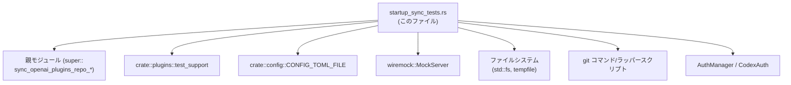
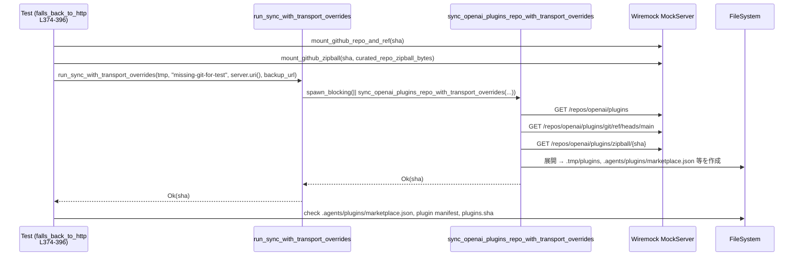
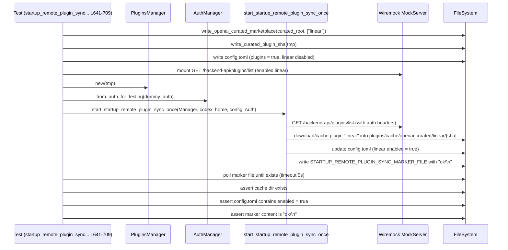

# core/src/plugins/startup_sync_tests.rs コード解説

## 0. ざっくり一言

- OpenAI curated プラグインリポジトリの同期処理と、起動時のリモートプラグイン状態同期処理について、Git / HTTP / バックアップアーカイブ / 設定ファイル更新 / セキュリティ（パス・トラバーサル防止）などの経路を総合的に検証する統合テスト群です。（core/src/plugins/startup_sync_tests.rs:L22-791）

---

## 1. このモジュールの役割

### 1.1 概要

- このモジュールは **「curated プラグインリポジトリの同期」と「起動時の ChatGPT プラグイン状態同期」** に関する挙動を検証します。
- Git 経由の同期、Git が使えない場合の HTTP 経由同期、GitHub スナップショットが得られない場合のエクスポートアーカイブへのフォールバック、既存スナップショットがある場合の挙動など、複数のフォールバックパスをテストしています。（例: sync_openai_plugins_repo_falls_back_to_http_when_git_is_unavailable, L374-396）
- さらに、バックアップアーカイブ内の `.git/HEAD` から SHA を読み取る処理のパス検証（パス・トラバーサル防止）や、起動時同期がマーカーを書き、設定ファイルをリモート状態に合わせて更新することも検証しています。（L597-638, L641-709）

### 1.2 アーキテクチャ内での位置づけ

このファイルは、親モジュール（`super::*`）で定義されている同期ロジックの「ブラックボックス・統合テスト」として機能します。（core/src/plugins/startup_sync_tests.rs:L1）

主要な依存関係は以下の通りです。

- 親モジュールの公開 API（`sync_openai_plugins_repo_*`, `read_extracted_backup_archive_git_sha`, `start_startup_remote_plugin_sync_once` など）※定義はこのファイルにはありませんが、`super::*` 経由で利用されています。（L1, L245-251, L361-363, L467-468, L610-623, L676-681）
- テスト支援モジュール `crate::plugins::test_support`（設定ファイル書き込み、テスト用マーケットプレイス生成、固定 SHA の書き込みなど）（L3-6, L557-558, L647-655, L670-671）
- HTTP モックサーバ `wiremock`（GitHub API / ChatGPT plugins API / エクスポート API のモック）（L13-18, L51-65, L67-77, L79-99, L374-390, L417-419, L477-481, L505-507, L527-533, L566-575, L657-668）
- ファイルシステム／一時ディレクトリ（`tempfile`, `std::fs`）と `git` コマンド（本物またはシェルスクリプトによるフェイク）（L12, L145-156, L184-193, L210-215, L264-283, L284-337, L339-359, L440-465, L493-503, L599-607, L618-632, L703-707, L711-791）
- 非同期ランタイム `tokio` と同期ブロッキングタスク用 `tokio::task::spawn_blocking`（L101-120, L122-132, L374-396, L399-434, L475-489, L491-519, L521-551, L553-595, L641-709）

依存関係を簡略化した図は次の通りです。



（根拠: use 文と各テスト内での呼び出し。core/src/plugins/startup_sync_tests.rs:L1-20, L143-150, L207-259, L260-372, L641-681）

### 1.3 設計上のポイント

- **フォールバック経路の網羅テスト**  
  - Git が利用可能な場合は Git 優先（L207-258）。  
  - Git が不在または失敗した場合は HTTP zipball へのフォールバック（L374-396, L398-434）。  
  - GitHub リポジトリ情報取得に失敗した場合のエクスポートアーカイブへのフォールバック（L521-551）。  
  - 既にスナップショットが存在する場合にはエクスポートフォールバックを抑制（L553-595）。
- **一時ディレクトリのクリーンアップ**  
  `.tmp/plugins-clone-*` ディレクトリが正常・異常終了の双方で残らないことを検証（L164-205, L260-372, L436-472, L474-489）。  
- **セキュリティ（パス・トラバーサル防止）**  
  バックアップアーカイブから HEAD ref を読む関数が `refs/` 以下に限定され、`../../` を含むパスを拒否することをテスト（L597-638）。
- **並行性／非同期**  
  重い同期処理は `tokio::task::spawn_blocking` で別スレッドにオフロードしつつ `async fn` ラッパーから呼び出す構造（L101-120, L122-132）。起動時同期は非同期に実行され、マーカーが書かれるまでポーリングで待機（L641-709）。
- **テストの再現性**  
  すべてのテストは `tempdir()` を使用し、外部環境に依存しないファイルシステム状態・`git` 実行結果・HTTP レスポンスをモックすることで再現性を確保しています（L145-156, L184-193, L210-215, L264-267, L374-377, L641-647）。

---

## 2. 主要な機能一覧（およびコンポーネントインベントリー）

### 2.1 このモジュールが検証する主な機能

- **curated リポジトリパスの決定**  
  `curated_plugins_repo_path` が `${codex_home}/.tmp/plugins` を返すこと（L143-150）。
- **curated SHA ファイルの読み取り**  
  `.tmp/plugins.sha` の改行付き SHA をトリミングして読むこと（L152-162）。
- **古い一時クローンディレクトリの削除**  
  `.tmp/plugins-clone-*` ディレクトリのうち、一定時間以上経過したものだけ削除すること（L164-205）。
- **Git 優先の同期とフォールバック**  
  - Git が利用可能なら Git 経由で同期し SHA を返し、`.git` やマーケットプレイスファイルが揃うこと（L207-258）。  
  - Git リモート URL を `insteadOf` 設定でローカルリポジトリに書き換えても同期できること（L260-372）。  
  - Git が不在または失敗した場合に HTTP zipball 経由で同期すること（L374-396, L398-434）。  
  - クローンや展開に失敗した際に一時ディレクトリをクリーンアップすること（L436-472, L474-489）。
- **SHA マッチ時のダウンロードスキップ**  
  ローカル SHA がリモート HEAD と一致する場合、アーカイブを再ダウンロードしないこと（L491-519）。
- **エクスポートアーカイブフォールバック**  
  GitHub スナップショット取得に失敗し、かつローカルスナップショットがない場合、バックアップアーカイブから同期すること（L521-551）。  
  逆にローカルスナップショットがある場合はフォールバックを行わずエラーにすること（L553-595）。
- **バックアップアーカイブからの Git SHA 抽出**  
  展開済みリポジトリの `.git/HEAD` → `refs/heads/...` から SHA を読み取る正常系と、`refs/` 以外／パストラバーサルな ref をエラーにする異常系（L597-638）。
- **起動時リモートプラグイン同期**  
  ChatGPT API の `/backend-api/plugins/list` を叩き、ローカル設定ファイルとプラグインキャッシュをリモート状態に合わせて更新し、マーカーファイルに `"ok\n"` と書くこと（L641-709）。
- **テスト用 zip アーカイブの構築**  
  GitHub zipball／バックアップアーカイブと同等の構造を持つ zip バイト列を生成するユーティリティ（L711-746, L748-791）。

### 2.2 コンポーネントインベントリー（このファイルで定義される関数）

| 名前 | 種別 | async | 戻り値 | 概要 | 定義位置 |
|------|------|-------|--------|------|----------|
| `has_plugins_clone_dirs` | ヘルパー | いいえ | `bool` | `${codex_home}/.tmp` 配下に `plugins-clone-*` ディレクトリがあるかを判定 | core/src/plugins/startup_sync_tests.rs:L22-35 |
| `write_executable_script` | ヘルパー（Unix） | いいえ | `()` | 指定パスにシェルスクリプトを書き、実行権限を 0755 に設定 | L37-49 |
| `mount_github_repo_and_ref` | ヘルパー | はい | `()` | GitHub リポジトリ情報 API と HEAD ref API を wiremock 上にマウント | L51-65 |
| `mount_github_zipball` | ヘルパー | はい | `()` | `/repos/openai/plugins/zipball/{sha}` に zipball レスポンスをマウント | L67-77 |
| `mount_export_archive` | ヘルパー | はい | `String` | エクスポート API と zip ダウンロード URL をモックし、その API ベース URL を返す | L79-99 |
| `run_sync_with_transport_overrides` | ラッパー | はい | `Result<String,String>` | 同期関数 `sync_openai_plugins_repo_with_transport_overrides` を `spawn_blocking` で呼ぶ非同期ラッパー | L101-120 |
| `run_http_sync` | ラッパー | はい | `Result<String,String>` | HTTP 経由同期 `sync_openai_plugins_repo_via_http` を `spawn_blocking` で呼ぶ非同期ラッパー | L122-132 |
| `assert_curated_gmail_repo` | アサーション | いいえ | `()` | curated リポジトリに Gmail プラグインのマーケットプレイスと manifest が存在することを検証 | L134-141 |
| `curated_plugins_repo_path_uses_codex_home_tmp_dir` | テスト | いいえ | `()` | `curated_plugins_repo_path` のパス決定を検証 | L143-150 |
| `read_curated_plugins_sha_reads_trimmed_sha_file` | テスト | いいえ | `()` | `.tmp/plugins.sha` の末尾改行が除去されることを検証 | L152-162 |
| `remove_stale_curated_repo_temp_dirs_removes_only_matching_directories` | テスト（Unix） | いいえ | `()` | 古い `plugins-clone-*` のみ削除されることを検証 | L164-205 |
| `set_dir_mtime` | ローカルヘルパー（テスト内） | いいえ | `Result<(),Box<dyn Error>>` | 指定ディレクトリの mtime を任意の過去時刻に設定（`libc::utimensat` 使用） | L170-182 |
| `sync_openai_plugins_repo_prefers_git_when_available` | テスト（Unix） | いいえ | `()` | Git ラッパースクリプトを通じて Git 優先同期経路を検証 | L207-258 |
| `sync_openai_plugins_repo_via_git_succeeds_with_local_rewritten_remote` | テスト（Unix） | いいえ | `()` | `insteadOf` 設定で GitHub URL をローカル bare リポジトリに書き換えたケースを検証 | L260-372 |
| `sync_openai_plugins_repo_falls_back_to_http_when_git_is_unavailable` | テスト（Tokio） | はい | `()` | `git` バイナリが存在しない場合の HTTP フォールバックを検証 | L374-396 |
| `sync_openai_plugins_repo_falls_back_to_http_when_git_sync_fails` | テスト（Unix + Tokio） | はい | `()` | `git` がエラー終了した場合の HTTP フォールバックを検証 | L398-434 |
| `sync_openai_plugins_repo_via_git_cleans_up_staged_dir_on_clone_failure` | テスト（Unix） | いいえ | `()` | `git clone` が途中で失敗した場合に一時クローンディレクトリが削除されることを検証 | L436-472 |
| `sync_openai_plugins_repo_via_http_cleans_up_staged_dir_on_extract_failure` | テスト（Tokio） | はい | `()` | zip 展開失敗時に一時クローンディレクトリが削除されることを検証 | L474-489 |
| `sync_openai_plugins_repo_skips_archive_download_when_sha_matches` | テスト（Tokio） | はい | `()` | ローカル SHA がリモート HEAD と一致する場合にアーカイブダウンロードがスキップされることを検証 | L491-519 |
| `sync_openai_plugins_repo_falls_back_to_export_archive_when_no_snapshot_exists` | テスト（Tokio） | はい | `()` | GitHub スナップショット取得失敗＋ローカルスナップショット無し時のエクスポートアーカイブフォールバックを検証 | L521-551 |
| `sync_openai_plugins_repo_skips_export_archive_when_snapshot_exists` | テスト（Tokio） | はい | `()` | ローカルスナップショットがある場合にエクスポートフォールバックを抑制することを検証 | L553-595 |
| `read_extracted_backup_archive_git_sha_reads_head_ref_from_extracted_repo` | テスト | いいえ | `()` | `.git/HEAD` → `refs/heads/main` から SHA が正常に読み取られることを検証 | L597-613 |
| `read_extracted_backup_archive_git_sha_rejects_non_refs_head_target` | テスト | いいえ | `()` | `HEAD` が `ref: HEAD` のように `refs/` 以外を指す場合にエラーとなることを検証 | L616-625 |
| `read_extracted_backup_archive_git_sha_rejects_path_traversal_ref` | テスト | いいえ | `()` | `refs/heads/../../evil` のようなパストラバーサルを含む ref をエラーとすることを検証 | L628-638 |
| `startup_remote_plugin_sync_writes_marker_and_reconciles_state` | テスト（Tokio） | はい | `()` | 起動時リモートプラグイン同期がマーカーを書き、プラグインキャッシュと config をリモート状態に合わせることを検証 | L641-709 |
| `curated_repo_zipball_bytes` | ヘルパー | いいえ | `Vec<u8>` | GitHub zipball と同等の構成を持つ curated リポジトリ zip を生成 | L711-746 |
| `curated_repo_backup_archive_zip_bytes` | ヘルパー | いいえ | `Vec<u8>` | バックアップアーカイブの zip（`.git/HEAD`, refs, marketplace, plugin manifest）を生成 | L748-791 |

### 2.3 テスト対象の主な外部 API（このファイルには定義なし）

※シグネチャは呼び出しからの推測であり、正確な実装はこのチャンクには現れません。

| 名前 | 想定シグネチャ（推測） | 役割 / テストから読み取れる契約 | 使用箇所 |
|------|------------------------|--------------------------------|----------|
| `curated_plugins_repo_path` | `fn(&Path) -> PathBuf` | `${codex_home}/.tmp/plugins` のような curated リポジトリルートを返す | L143-150, L253-257, L361-367, L392-395, L494-499, L556-563 |
| `read_curated_plugins_sha` | `fn(&Path) -> Option<String>` | `.tmp/plugins.sha` から末尾改行を除いた SHA を返す。ファイルが無ければ `None` | L152-162, L253-258, L365-370, L393-395, L517-518, L547-550, L591-594 |
| `remove_stale_curated_repo_temp_dirs` | `fn(&Path, Duration)` | `${parent}/plugins-clone-*` で古いディレクトリのみ削除し、その他は残す | L200-204 |
| `sync_openai_plugins_repo_with_transport_overrides` | `fn(codex_home: &Path, git: &str, api_base: &str, backup_url: &str) -> Result<String,String>` | Git 優先で同期を行い、必要に応じて HTTP / エクスポートアーカイブへフォールバックして SHA を返す | L111-116, L245-251, L383-390, L421-428, L508-515, L535-542, L577-584 |
| `sync_openai_plugins_repo_via_http` | `fn(codex_home: &Path, api_base: &str) -> Result<String,String>` | HTTP zipball 経由で curated リポジトリを同期し SHA を返す | L128-129, L480-488 |
| `sync_openai_plugins_repo_via_git` | `fn(codex_home: &Path, git: &str) -> Result<String,String>` | Git 経由で curated リポジトリを同期し SHA を返す。クローン失敗時はエラーを返し、一時ディレクトリを削除する | L361-363, L467-468 |
| `read_extracted_backup_archive_git_sha` | `fn(&Path) -> Result<Option<String>, String>` | `.git/HEAD` が `ref: refs/...` を指す場合に対応する ref ファイルから SHA を読み取り、`refs/` で始まらない／パストラバーサルを含む場合は `Err(String)` を返す | L609-613, L622-625, L635-638 |
| `start_startup_remote_plugin_sync_once` | 戻り値は不明 | 非同期に一度だけ起動時リモートプラグイン同期を開始し、完了時にマーカーを書き、設定とキャッシュを更新する | L676-681 |
| `STARTUP_REMOTE_PLUGIN_SYNC_MARKER_FILE` | `&str` など | 起動時同期完了を示すマーカーファイル名 | L683-707 |
| `CURATED_PLUGINS_STALE_TEMP_DIR_MAX_AGE` | `Duration` | 古いクローンディレクトリと見なす閾値 | L195-200 |

---

## 3. 公開 API と詳細解説

### 3.1 型一覧（構造体・列挙体など）

このファイル内で新たに定義されている構造体・列挙体はありません。

テストで重要な外部型のみ列挙します（定義は他モジュール／クレート側）。

| 名前 | 種別 | 役割 / 用途 | 使用箇所 |
|------|------|-------------|----------|
| `PluginsManager` | 構造体（外部） | プラグイン管理の中心的コンポーネント。起動時同期の対象 | L672-673 |
| `AuthManager` | 構造体（外部） | 認証情報管理。ChatGPT API へのアクセスに利用 | L673-674 |
| `CodexAuth` | 構造体（外部） | Codex/ChatGPT 認証情報を表す型。テスト用ダミー認証を生成 | L7, L673-674 |
| `MockServer` | 構造体（wiremock） | テスト用 HTTP サーバ | L14, L377-381, L417-419, L477-481, L505-507, L524-533, L564-575, L657-668 |

---

### 3.2 関数詳細（重要な API／テスト）

ここでは、公開 API（外部実装）と、それをテストするうえで重要なヘルパー関数を中心に説明します。

---

#### `sync_openai_plugins_repo_with_transport_overrides(codex_home, git_binary, api_base_url, backup_archive_api_url) -> Result<String, String>`

**概要**

- curated プラグインリポジトリを同期するための主要関数で、Git / HTTP / エクスポートアーカイブなど複数のトランスポートを切り替えつつ SHA を返す API としてテストから利用されています。（L111-116, L245-251, L383-390, L421-428, L508-515, L535-542, L577-584）

**引数（テストからの推測）**

| 引数名 | 型（推測） | 説明 |
|--------|-----------|------|
| `codex_home` | `&Path` | Codex のホームディレクトリ。`.tmp/plugins` や `plugins/cache` 等のルート | L245, L383, L421, L508, L535, L577 |
| `git_binary` | `&str` | Git 実行ファイルパス。テストではフェイクスクリプトまたは存在しないパスを渡す | L246-248, L385-386, L422-423, L578-580 |
| `api_base_url` | `&str` | GitHub など HTTP API のベース URL | L248-249, L386-387, L538-539, L580-581 |
| `backup_archive_api_url` | `&str` | エクスポートアーカイブ API の URL | L249-250, L387-388, L539-540, L581-582 |

**戻り値**

- `Ok(sha)`  
  同期後の HEAD コミット SHA（40 桁の hex）。（L251-253, L389-395, L541-546）
- `Err(msg)`  
  フォールバックも含めて同期に失敗した場合のエラーメッセージ文字列。既存スナップショットがある場合のエクスポートフォールバックスキップ時などに確認されています。（L577-585）

**内部処理の流れ（テストから推測される契約）**

実装はこのファイルには無いため、正確な処理内容は不明ですが、テストから次の契約が読み取れます。

1. まず Git を使って HEAD SHA を取得しようとする。`git ls-remote` や `git clone` を実行する。（L218-243 のフェイク git スクリプト参照）
2. Git が存在しない（`ENOENT`）、またはエラー終了（exit 1 / 128）した場合は、HTTP 経由の zipball 取得にフォールバックする。（L374-396, L398-434）
3. GitHub のリポジトリ情報取得（`/repos/openai/plugins`）が 500 などで失敗し、かつローカルスナップショットが存在しない場合は、`backup_archive_api_url` に指定されたエクスポートアーカイブからバックアップをダウンロード・展開する。（L521-551）
4. ローカルの SHA ファイル `.tmp/plugins.sha` が存在し、それが GitHub HEAD と一致する場合は、アーカイブダウンロードをスキップする。（L491-519）
5. ローカルスナップショットが既に存在する場合、エクスポートアーカイブへのフォールバックは行わず、エラーを返す（エラーメッセージに `"export archive fallback skipped"` を含める）。（L553-595）

**Examples（使用例）**

テスト内からの典型的な呼び出し例です。

```rust
// Git が利用可能で成功するケース（L207-258）
let synced_sha = sync_openai_plugins_repo_with_transport_overrides(
    tmp.path(),                                 // Codex home
    git_path.to_str().expect("utf8 path"),      // フェイク git スクリプト
    "http://127.0.0.1:9",                       // ダミー API ベース URL
    "http://127.0.0.1:9/backend-api/plugins/export/curated",
).expect("git sync should succeed");
```

```rust
// Git 不在時に HTTP フォールバックするケース（L374-396）
let synced_sha = sync_openai_plugins_repo_with_transport_overrides(
    tmp.path().to_path_buf().as_path(),
    "missing-git-for-test",
    server.uri(),                               // wiremock のベース URL
    "http://127.0.0.1:9/backend-api/plugins/export/curated",
).expect("fallback sync should succeed");
```

```rust
// 既存スナップショットあり → エクスポートフォールバックを抑制し Err を返すケース（L577-585）
let err = sync_openai_plugins_repo_with_transport_overrides(
    tmp.path(),
    "missing-git-for-test",
    server.uri(),
    export_api_url,
).expect_err("existing snapshot should suppress export fallback");
assert!(err.contains("export archive fallback skipped"));
```

**Errors / Panics**

- `Err(String)` が返る条件（テストから確認できるもの）:
  - GitHub リポジトリ取得が失敗し、ローカルスナップショットは存在する → 「export archive fallback skipped」を含むエラー（L577-585）。
- `panic` / `expect` については、テスト側で `.expect("...")` を多用しているため、この関数が `Err` を返すとテストがパニックになります（L245-251, L383-390, L535-542）。

**Edge cases（エッジケース）**

- Git バイナリパスが存在しない場合: HTTP フォールバックにより成功することが期待されます（L374-396）。
- Git バイナリは存在するがプロセスがエラー終了する場合: 同様に HTTP フォールバックが期待されます（L398-434）。
- GitHub API が 500 を返し、ローカルスナップショットが無い場合: エクスポートアーカイブにフォールバックし、成功することが期待されています（L521-551）。
- ローカル SHA がリモートと一致する場合: ネットワークダウンロードがスキップされることが期待されます（L491-519）。

**使用上の注意点**

- 並行性: この関数自体は同期 (`blocking`) と推測され、テストでは `tokio::task::spawn_blocking` で実行されています（L110-119）。非同期コンテキストから直接呼ぶ場合は、ブロッキングであるかどうかに注意する必要があります。
- エラーメッセージに依存するテストが存在するため、文字列を変更するとテストが壊れる可能性があります（L577-585）。

---

#### `sync_openai_plugins_repo_via_http(codex_home, api_base_url) -> Result<String, String>`

**概要**

- Git を使わず、HTTP zipball 経由で curated リポジトリを同期する関数です。zip 展開失敗時のクリーンアップ挙動などがテストされています。（L122-132, L474-489）

**引数（推測）**

| 引数名 | 型（推測） | 説明 |
|--------|-----------|------|
| `codex_home` | `&Path` | Codex home | L122-129, L483-485 |
| `api_base_url` | `&str` | GitHub API のベース URL（`/repos/openai/plugins` などのパスをぶら下げる） | L124-129, L483-485 |

**戻り値**

- `Ok(sha)` : 同期後の SHA（`run_http_sync` が `Result<String,String>` を返しているため）（L122-132）。
- `Err(msg)` : zip 展開失敗などのエラー。テストでは `"failed to open curated plugins zip archive"` を含むことが確認されています（L483-488）。

**内部処理の流れ（推測）**

- 実装はこのファイルには無いため不明ですが、テストから次が期待されています:
  1. GitHub から HEAD SHA を取得（`mount_github_repo_and_ref` でモック）（L480-481）。
  2. `/repos/openai/plugins/zipball/{sha}` の zip をダウンロード（`mount_github_zipball` でモック）（L480-481）。
  3. ダウンロードした zip を `.tmp/plugins-clone-*` のような一時ディレクトリに展開。
  4. 展開に失敗した場合、エラーメッセージに `"failed to open curated plugins zip archive"` を含めつつ、一時ディレクトリを削除する。（L483-488）

**Examples**

```rust
// 正常系ラッパー経由の呼び出し（run_http_sync, L122-132）
let api_base_url = server.uri(); // wiremock の URL
let result = tokio::task::spawn_blocking(move || {
    sync_openai_plugins_repo_via_http(codex_home.as_path(), &api_base_url)
}).await.expect("sync task should join");
```

```rust
// 異常系: 壊れた zip を与えると Err を返し、一時ディレクトリを削除する（L474-489）
let err = run_http_sync(tmp.path().to_path_buf(), server.uri())
    .await
    .expect_err("http sync should fail");
assert!(err.contains("failed to open curated plugins zip archive"));
assert!(!has_plugins_clone_dirs(tmp.path()));
```

**Errors / Edge cases**

- 壊れた zip (`b"not a zip archive"`) が返された場合に `Err(String)` となり、一時ディレクトリが削除されることが期待されます（L474-489）。
- 正常系についてはこのファイルでは直接検証されていませんが、他のテスト（Git フォールバック）と組み合わせて動作しています。

**使用上の注意点**

- ブロッキング I/O を伴うと推測されるため、テスト同様 `spawn_blocking` などで非同期ランタイムから切り離して実行するのが安全です（L122-132）。
- エラーメッセージ文言への依存があるため、変更時にはテスト更新が必要です（L487-488）。

---

#### `read_extracted_backup_archive_git_sha(root: &Path) -> Result<Option<String>, String>`

**概要**

- バックアップアーカイブから展開された Git リポジトリ（`root/.git`）の `HEAD` と ref ファイルを読み、現在の HEAD SHA を安全に取得する関数です。（使用箇所: L597-613, L616-625, L628-638）

**引数**

| 引数名 | 型 | 説明 |
|--------|----|------|
| `root` | `&Path` | 展開済みリポジトリのルートディレクトリ |

**戻り値**

- `Ok(Some(sha))`  
  `.git/HEAD` が `ref: refs/heads/<branch>` を指し、そのファイルが存在するときの SHA（L600-607, L609-613）。
- `Ok(None)`  
  このケースはテストからは直接は確認できません。存在しない場合や別種の HEAD のときに `None` を返す可能性がありますが、このチャンクには情報がありません。
- `Err(String)`  
  `HEAD` の内容が `refs/` で始まらない、または `../../` を含むなどパストラバーサルな場合にエラー文字列を返します（L616-625, L628-638）。

**内部処理の流れ（推測）**

1. `root/.git/HEAD` を読み込む。（テストでこのファイルを事前に書き込んでいる: L602, L620, L632）
2. 行頭が `ref:` で始まり、その後ろのパスが `refs/` で始まることを確認。そうでなければ `Err("must stay under refs/")` などを返す（L616-625）。
3. `refs/` 以降のパスに `..` を含まないか確認し、パストラバーサルを防止。含まれていれば `"invalid path components"` を含むエラーを返す（L628-638）。
4. 安全と判断したパスを `root/.git/<ref>` として読み込み、SHA を取り出す（L600-607, L609-613）。

**Examples**

```rust
// 正常系: main ブランチの SHA を読む（L597-613）
std::fs::write(tmp.path().join(".git/HEAD"), "ref: refs/heads/main\n")?;
std::fs::write(
    tmp.path().join(".git/refs/heads/main"),
    "3333333333333333333333333333333333333333\n",
)?;
let sha = read_extracted_backup_archive_git_sha(tmp.path())?
    .expect("sha should be present");
assert_eq!(sha, "3333333333333333333333333333333333333333");
```

```rust
// 異常系: refs/ 以外を指す HEAD は拒否（L616-625）
std::fs::write(tmp.path().join(".git/HEAD"), "ref: HEAD\n")?;
let err = read_extracted_backup_archive_git_sha(tmp.path())
    .expect_err("non-refs target should be rejected");
assert!(err.contains("must stay under refs/"));
```

```rust
// 異常系: パストラバーサルを含む ref は拒否（L628-638）
std::fs::write(
    tmp.path().join(".git/HEAD"),
    "ref: refs/heads/../../evil\n",
)?;
let err = read_extracted_backup_archive_git_sha(tmp.path())
    .expect_err("path traversal ref should be rejected");
assert!(err.contains("invalid path components"));
```

**Errors / Panics**

- `Err(String)` の発生条件:
  - `HEAD` のターゲットが `refs/` で始まらない場合（L616-625）。
  - `refs/` 以下のパスに `..`（パストラバーサル）が含まれる場合（L628-638）。

**Edge cases**

- 参照先ファイルが存在しない、または空の場合の挙動はこのテストではカバーされておらず不明です。
- `HEAD` が `ref:` ではなく直接 SHA を含むケースもテストされていません。

**使用上の注意点**

- セキュリティ観点: `refs/` 以下に限定し、パストラバーサルを拒否することで、アーカイブ内に潜む悪意ある `.git/HEAD` の利用による任意ファイル読み取りを防ぐ役割があります。
- エラーは `String` として返され、テストでは `.contains()` で部分一致を確認しています（L622-625, L635-638）。

---

#### `run_sync_with_transport_overrides(codex_home: PathBuf, git_binary: impl Into<String>, api_base_url: impl Into<String>, backup_archive_api_url: impl Into<String>) -> Result<String, String>`

**概要**

- 同期処理 `sync_openai_plugins_repo_with_transport_overrides` をテストしやすくするための非同期ラッパーです。ブロッキングな同期処理を `tokio::task::spawn_blocking` 上で実行し、その `Result` をそのまま返します。（L101-120）

**引数**

| 引数名 | 型 | 説明 |
|--------|----|------|
| `codex_home` | `PathBuf` | Codex home ディレクトリ |
| `git_binary` | `impl Into<String>` | Git バイナリパス（文字列に変換） |
| `api_base_url` | `impl Into<String>` | API ベース URL |
| `backup_archive_api_url` | `impl Into<String>` | エクスポート API URL |

**戻り値**

- `Result<String, String>` : 親関数の結果をそのまま返します（L110-119）。

**内部処理の流れ**

1. 各引数を `String` に変換（L107-109）。
2. `tokio::task::spawn_blocking` で新しいブロッキングタスクを立ち上げ、クロージャ内で `sync_openai_plugins_repo_with_transport_overrides` を呼び出す（L110-117）。
3. `spawn_blocking` の `JoinHandle` を `.await` し、正常に join できなかった場合は `expect("sync task should join")` でパニック（L118-119）。

**Examples**

```rust
// Git 不在時の HTTP フォールバックのテストで利用（L374-396）
let synced_sha = run_sync_with_transport_overrides(
    tmp.path().to_path_buf(),
    "missing-git-for-test",
    server.uri(),
    "http://127.0.0.1:9/backend-api/plugins/export/curated",
).await.expect("fallback sync should succeed");
```

**Errors / Panics**

- `spawn_blocking` のタスクがパニックした場合、`.await.expect("sync task should join")` によりテストがパニックします（L118-119）。
- 親関数の `Err(String)` はそのまま呼び出し側に返されます（例: L577-585）。

**Edge cases**

- `codex_home` を大きなディレクトリにすると同期処理が重くなる可能性がありますが、テストでは毎回空の tempdir を使うため影響は限定的です。

**使用上の注意点**

- この関数は `async fn` であり、`tokio` ランタイム内でのみ `.await` 可能です。同期テストから利用する場合は `block_on` などが必要になります。
- ブロッキング処理を別スレッドに逃がすため、非同期タスクのスケジューリングを妨げにくくなっています。

---

#### `mount_github_repo_and_ref(server: &MockServer, sha: &str)`

**概要**

- GitHub リポジトリ情報と HEAD ref API を wiremock 上にマウントするテスト用ヘルパーです。（L51-65）

**引数**

| 引数名 | 型 | 説明 |
|--------|----|------|
| `server` | `&MockServer` | wiremock のサーバインスタンス |
| `sha` | `&str` | 返すべき HEAD SHA |

**戻り値**

- `()`（ユニット）

**内部処理の流れ**

1. `/repos/openai/plugins` への GET に対し、`{"default_branch":"main"}` を返すモックを登録（L51-56）。
2. `/repos/openai/plugins/git/ref/heads/main` への GET に対し、`{"object":{"sha":"{sha}"}}` を返すモックを登録（L57-64）。

**Examples**

```rust
let server = MockServer::start().await;
let sha = "0123456789abcdef0123456789abcdef01234567";

mount_github_repo_and_ref(&server, sha).await;
```

**使用上の注意点**

- `sha` は 40 桁の SHA である必要がありますが、ヘルパー自体はバリデーションを行っていません（テスト内で固定文字列を使用）。

---

#### `mount_export_archive(server: &MockServer, bytes: Vec<u8>) -> String`

**概要**

- エクスポート API (`/backend-api/plugins/export/curated`) と、そのレスポンスに含まれる `download_url` が指す zip アーカイブ (`/files/curated-plugins.zip`) のモックをセットアップするヘルパーです。（L79-99）

**引数**

| 引数名 | 型 | 説明 |
|--------|----|------|
| `server` | `&MockServer` | wiremock サーバ |
| `bytes` | `Vec<u8>` | 返却する zip アーカイブの中身 |

**戻り値**

- `String` : エクスポート API のフル URL（`{server.uri()}/backend-api/plugins/export/curated`）（L80, L98-99）。

**内部処理の流れ**

1. `export_api_url` を `format!` で組み立て（L80）。
2. `/backend-api/plugins/export/curated` に GET した際、`{"download_url":"{server.uri()}/files/curated-plugins.zip"}` を返すモックを登録（L81-88）。
3. `/files/curated-plugins.zip` に GET した際、`content-type: application/zip` として与えられた `bytes` を返すモックを登録（L89-97）。
4. `export_api_url` を返す（L98-99）。

**Examples**

```rust
let export_sha = "1111111111111111111111111111111111111111";
let server = MockServer::start().await;
let export_api_url =
    mount_export_archive(&server, curated_repo_backup_archive_zip_bytes(export_sha)).await;

// のちに backup_archive_api_url として使用（L535-542）
let synced_sha = run_sync_with_transport_overrides(
    tmp.path().to_path_buf(),
    "missing-git-for-test",
    server.uri(),
    export_api_url,
).await.expect("export fallback sync should succeed");
```

**使用上の注意点**

- `bytes` の中身が正しい zip でない場合、`sync_openai_plugins_repo_with_transport_overrides` 側で展開エラーとなる可能性があります。
- `server` インスタンスはテストごとに新しく生成し、他テストとポートが衝突しないようにしています（L524-525, L564-565）。

---

#### `startup_remote_plugin_sync_writes_marker_and_reconciles_state()`

**概要**

- 起動時のリモートプラグイン同期処理が、  
  1. リモート状態を取得し、  
  2. ローカル設定 (`config.toml`) とプラグインキャッシュを更新し、  
  3. 完了マーカーファイルを書き出す  
  ことを検証する統合テストです。（L641-709）

**内部処理の流れ（テスト視点）**

1. ローカル curated リポジトリと SHA を用意  
   - `curated_root` を取得し（`curated_plugins_repo_path`）、`write_openai_curated_marketplace` で `linear` プラグインを含むマーケットプレイスを作成。（L643-646）  
   - `write_curated_plugin_sha` で SHA ファイルを書き込む。（L646）
2. `config.toml` を書き込み、`plugins = true` かつ `linear@openai-curated` が `enabled = false` である状態を作る。（L647-655）
3. wiremock で `/backend-api/plugins/list` をモック  
   - 認証ヘッダ `authorization: Bearer Access Token` と `chatgpt-account-id: account_id` を要求。（L658-662）  
   - レスポンスとして `linear` プラグインが `enabled: true` な JSON を返す（L662-666）。
4. テスト用 `config` を読み込み、`chatgpt_base_url` を wiremock に差し替え（L670-671）。
5. `PluginsManager` と `AuthManager` を初期化し、`start_startup_remote_plugin_sync_once` を呼び出す（L672-681）。
6. `STARTUP_REMOTE_PLUGIN_SYNC_MARKER_FILE` が書かれるまで、`tokio::time::timeout` + ポーリングで待つ（L683-693）。
7. 完了後、次を検証（L695-707）:
   - `plugins/cache/openai-curated/linear/{TEST_CURATED_PLUGIN_SHA}` が存在すること（キャッシュ更新）（L695-701）。
   - `config.toml` に `"[plugins."linear@openai-curated"]"` セクションがあり、`enabled = true` が含まれること（L702-705）。
   - マーカーの内容が `"ok\n"` であること（L707-708）。

**Examples**

この関数自体はテスト関数なので、外部から呼び出す必要はありません。内部での起動時同期の使い方が例になっています。

```rust
let manager = Arc::new(PluginsManager::new(tmp.path().to_path_buf()));
let auth_manager =
    AuthManager::from_auth_for_testing(CodexAuth::create_dummy_chatgpt_auth_for_testing());

start_startup_remote_plugin_sync_once(
    Arc::clone(&manager),
    tmp.path().to_path_buf(),
    config,
    auth_manager,
);
```

**並行性 / 安全性**

- `start_startup_remote_plugin_sync_once` の実装は不明ですが、名前から「一度だけ起動時同期をスケジュールする」非同期処理と推測できます。
- テスト側では `start_startup_remote_plugin_sync_once` 呼び出し直後にマーカーをポーリングすることで、バックグラウンド処理の完了を待機しています（L683-693）。
- `tokio::time::timeout(Duration::from_secs(5), ...)` により、同期処理がハングした場合にもテストが無限待機しないようにしています（L684-693）。

**使用上の注意点**

- `STARTUP_REMOTE_PLUGIN_SYNC_MARKER_FILE` の存在と内容 `"ok\n"` に依存したロジックがある場合、フォーマット変更は慎重に行う必要があります（L683-708）。
- 設定ファイルのフォーマットは TOML で、セクション名 `plugins."linear@openai-curated"` などをキーにしています（L647-655, L703-705）。

---

### 3.3 その他の関数

その他のテスト関数・ヘルパーは、主に次のような役割を持ちます（詳細は 2.2 の表とコードを参照してください）。

| 関数名 | 役割（1 行） | 根拠 |
|--------|--------------|------|
| `curated_plugins_repo_path_uses_codex_home_tmp_dir` | curated リポジトリパスが `${codex_home}/.tmp/plugins` であることの検証 | L143-150 |
| `read_curated_plugins_sha_reads_trimmed_sha_file` | `.tmp/plugins.sha` の改行トリミング検証 | L152-162 |
| `remove_stale_curated_repo_temp_dirs_removes_only_matching_directories` | 古い `plugins-clone-*` のみ削除し他は残す挙動を検証 | L164-205 |
| `sync_openai_plugins_repo_prefers_git_when_available` | Git ラッパースクリプトで Git 優先経路を検証 | L207-258 |
| `sync_openai_plugins_repo_via_git_succeeds_with_local_rewritten_remote` | ローカル bare リポジトリへの URL リライトが機能することを検証 | L260-372 |
| `sync_openai_plugins_repo_falls_back_to_http_when_git_is_unavailable` | Git 不在時 HTTP フォールバック | L374-396 |
| `sync_openai_plugins_repo_falls_back_to_http_when_git_sync_fails` | Git エラー時 HTTP フォールバック | L398-434 |
| `sync_openai_plugins_repo_via_git_cleans_up_staged_dir_on_clone_failure` | `git clone` 失敗時一時ディレクトリクリーンアップ | L436-472 |
| `sync_openai_plugins_repo_via_http_cleans_up_staged_dir_on_extract_failure` | zip 展開失敗時一時ディレクトリクリーンアップ | L474-489 |
| `sync_openai_plugins_repo_skips_archive_download_when_sha_matches` | SHA 一致時のダウンロードスキップ | L491-519 |
| `sync_openai_plugins_repo_falls_back_to_export_archive_when_no_snapshot_exists` | GitHub スナップショットなし時エクスポートフォールバック | L521-551 |
| `sync_openai_plugins_repo_skips_export_archive_when_snapshot_exists` | 既存スナップショットがある場合にエクスポートフォールバックを抑制 | L553-595 |
| `curated_repo_zipball_bytes` | GitHub zipball 相当の zip を組み立て | L711-746 |
| `curated_repo_backup_archive_zip_bytes` | バックアップアーカイブ zip を組み立て | L748-791 |

---

## 4. データフロー

### 4.1 Git 不在時の HTTP フォールバックのデータフロー

`sync_openai_plugins_repo_falls_back_to_http_when_git_is_unavailable` テストにおけるデータフローを示します（core/src/plugins/startup_sync_tests.rs:L374-396）。

1. テストが `MockServer` を起動し、GitHub API エンドポイントをモック（`mount_github_repo_and_ref`, `mount_github_zipball`）（L377-381）。
2. `run_sync_with_transport_overrides` を `git_binary = "missing-git-for-test"` で呼び出し（L383-390）、内部で `sync_openai_plugins_repo_with_transport_overrides` が `spawn_blocking` 経由で呼ばれる（L101-120）。
3. 親関数が Git 実行に失敗し HTTP 経由で zipball を取得、ローカル `.tmp/plugins` に展開したうえで SHA を返すと想定されます。
4. テストが返り値 SHA、および `curated_plugins_repo_path` 以下のファイル構造と `plugins.sha` を検証（L392-395）。



（呼び出し関係の根拠: L374-396, L101-120, L51-77）

### 4.2 起動時リモートプラグイン同期のデータフロー

`startup_remote_plugin_sync_writes_marker_and_reconciles_state` の流れ（L641-709）:



（根拠: L643-655, L657-668, L670-681, L683-707）

---

## 5. 使い方（How to Use）

このファイルはテスト専用ですが、同様のパターンで新しいテストやヘルパー関数を追加する際の参考になります。

### 5.1 基本的な使用方法（ヘルパーの利用例）

例として、`run_sync_with_transport_overrides` と wiremock を使って新しい同期ケースをテストするフローです。

```rust
#[tokio::test]
async fn my_new_sync_test() {
    // 1. 一時ディレクトリとモックサーバを用意（L374-377）
    let tmp = tempdir().expect("tempdir");
    let server = MockServer::start().await;

    // 2. 必要な GitHub / export API をモック（L51-65, L79-99）
    let sha = "0123456789abcdef0123456789abcdef01234567";
    mount_github_repo_and_ref(&server, sha).await;
    mount_github_zipball(&server, sha, curated_repo_zipball_bytes(sha)).await;

    // 3. 非同期ラッパーを通じて同期処理を実行（L101-120, L374-390）
    let synced_sha = run_sync_with_transport_overrides(
        tmp.path().to_path_buf(),
        "missing-git-for-test",          // Git 不在をシミュレート
        server.uri(),
        "http://127.0.0.1:9/backend-api/plugins/export/curated",
    ).await.expect("sync should succeed");

    // 4. 結果とファイル構造を検証（L392-395）
    assert_eq!(synced_sha, sha);
    let repo_path = curated_plugins_repo_path(tmp.path());
    assert_curated_gmail_repo(&repo_path);
}
```

### 5.2 よくある使用パターン

- **Git 経路のテスト**  
  `write_executable_script` で Git のフェイクラッパーを作り、特定の引数パターン（`ls-remote`, `clone`, `rev-parse`）に対して決め打ち応答を返すことで Git 経路の挙動を制御しています（L218-243, L447-465）。

- **HTTP 経路のテスト**  
  `MockServer` + `mount_github_repo_and_ref` + `mount_github_zipball` で GitHub API を完全にモックし、zipball のバイト列は `curated_repo_zipball_bytes` で生成しています（L374-382, L711-746）。

- **バックアップアーカイブ経路のテスト**  
  `mount_export_archive` でエクスポート API とダウンロード URL をモックし、zip 中身は `curated_repo_backup_archive_zip_bytes` を使用します（L521-533, L748-791）。

- **起動時同期のテスト**  
  親モジュールの起動時同期を直接呼び出さず、`start_startup_remote_plugin_sync_once` を通じて一回だけ起動させ、マーカーファイルと設定変更を観察します（L676-707）。

### 5.3 よくある間違い（想定）

```rust
// 間違い例: ブロッキングな同期関数を async コンテキストで直接呼び出す
// let sha = sync_openai_plugins_repo_with_transport_overrides(...)?;

// 正しい例: spawn_blocking を使うラッパー経由で呼ぶ（L101-120）
let sha = run_sync_with_transport_overrides(
    codex_home,
    git_binary,
    api_base_url,
    backup_archive_api_url,
).await?;
```

```rust
// 間違い例: wiremock モックを設定せずに同期関数を呼び出す
// → 実際のネットワークに出てしまう可能性がある

// 正しい例: 事前に必要なエンドポイントをすべてモック（L51-77, L79-97）
mount_github_repo_and_ref(&server, sha).await;
mount_github_zipball(&server, sha, curated_repo_zipball_bytes(sha)).await;
```

### 5.4 使用上の注意点（まとめ）

- **並行性**  
  - ブロッキング同期関数は必ず `spawn_blocking` 経由で呼び出すか、テストでは `run_sync_with_transport_overrides` / `run_http_sync` のようなラッパーを使う（L101-132）。
  - 起動時同期のようなバックグラウンド処理は、マーカーやファイルシステム状態を通じて完了を検知する必要があります（L683-693）。

- **エラー処理**  
  - 多くのテストが `.expect("...")` を使うため、意図したエラー経路を検証したい場合は `.expect_err` + `contains` で文字列を確認するパターンを踏襲しています（L467-471, L483-488, L577-585, L622-625, L635-638）。

- **セキュリティ**  
  - バックアップアーカイブからの SHA 読み取りにおいて、`refs/` + パストラバーサル拒否という制約を前提にしてテストを組んでいるため、仕様変更時はセキュリティ影響に注意が必要です（L616-625, L628-638）。

---

## 6. 変更の仕方（How to Modify）

### 6.1 新しい機能を追加する場合（新しい同期パスなど）

1. **対象 API の特定**  
   新しい同期機能（例: 別のバックアップソース）を追加した場合、その公開関数（例: `sync_openai_plugins_repo_via_foo`）を特定します。
2. **テストヘルパーの追加**  
   - 新しい HTTP エンドポイントが必要であれば、`mount_*` 系関数に倣ってモック設定ヘルパーを作成（L51-77, L79-99）。
   - 新しい zip 形式などが必要なら、`curated_repo_zipball_bytes` / `curated_repo_backup_archive_zip_bytes` に倣って zip を構成するヘルパーを追加（L711-746, L748-791）。
3. **テストケースの追加**  
   - フォールバック順序やエラー時挙動を一つずつ独立した `#[test]` / `#[tokio::test]` として追加し、既存テストのスタイルに合わせて記述します。
4. **クリーンアップの検証**  
   - 一時ディレクトリやマーカーファイルが不適切に残らないことを検証するため、`has_plugins_clone_dirs` など既存ヘルパーを再利用します（L22-35, L470-472, L487-488）。

### 6.2 既存の機能を変更する場合

- **影響範囲の確認**
  - `curated_plugins_repo_path` / `read_curated_plugins_sha` / `read_extracted_backup_archive_git_sha` など、ファイルパスやセキュリティに関わる関数を変更する場合は、それらを直接テストしている本ファイル内のテストをすべて確認する必要があります（L143-162, L597-638）。
  - フォールバック順序やエラーメッセージを変える場合は、`sync_openai_plugins_repo_*` 関連のテスト（L207-595）を更新する必要があります。

- **契約（前提条件・返り値の意味）**
  - `read_extracted_backup_archive_git_sha` はパス・トラバーサル拒否を前提としたセキュリティ契約を持つとみなされます。ここを緩める／強める変更にはテストの更新とセキュリティレビューが必要です（L616-638）。
  - `start_startup_remote_plugin_sync_once` はマーカー内容 `"ok\n"` と設定ファイルの `enabled = true` 書き換えを暗黙契約として持っているため、仕様変更時にはテストの期待値も合わせて変更する必要があります（L702-708）。

- **テストの再実行**
  - 外部依存（Git, ネットワーク, ファイルシステム）を多用するため、変更後は CI 環境で全テストを再実行して再現性を確認することが重要です。

---

## 7. 関連ファイル

このモジュールと密接に関連するファイル・モジュールは次の通りです（ファイルパスはこのチャンクから直接は分からないものもあります）。

| パス / モジュール | 役割 / 関係 | 根拠 |
|-------------------|------------|------|
| `super` モジュール（おそらく `startup_sync` 実装） | `sync_openai_plugins_repo_*`, `read_extracted_backup_archive_git_sha`, `start_startup_remote_plugin_sync_once`, `CURATED_PLUGINS_STALE_TEMP_DIR_MAX_AGE`, `STARTUP_REMOTE_PLUGIN_SYNC_MARKER_FILE` などの本体実装を提供 | `use super::*;` および各関数呼び出し（L1, L195-200, L245-251, L361-363, L467-468, L609-613, L676-683） |
| `crate::plugins::test_support` | `write_openai_curated_marketplace`, `write_curated_plugin_sha`, `write_file`, `load_plugins_config`, `TEST_CURATED_PLUGIN_SHA` など、プラグイン関連テスト支援ツールを提供 | `use crate::plugins::test_support::*` と各呼び出し（L3-6, L557-558, L647-655, L670-671, L591-594, L695-701） |
| `crate::config`（`CONFIG_TOML_FILE`） | プラグイン設定ファイル (`config.toml`) のパス定数を提供 | `use crate::config::CONFIG_TOML_FILE;`（L2, L647-655, L702-703） |
| 外部クレート `wiremock` | HTTP モックサーバ・マッチャ・レスポンステンプレートを提供 | `use wiremock::*;` と各 `Mock::given` 呼び出し（L13-18, L51-65, L67-77, L79-99, L657-668 など） |
| 外部クレート `codex_login::CodexAuth` | ChatGPT 用のダミー認証情報を生成し、`AuthManager` に渡す | `use codex_login::CodexAuth;` と `create_dummy_chatgpt_auth_for_testing` 呼び出し（L7, L673-674） |

このファイルは、これら関連モジュールの振る舞いを安全に検証するための統合テストハーネスとして位置づけられます。
