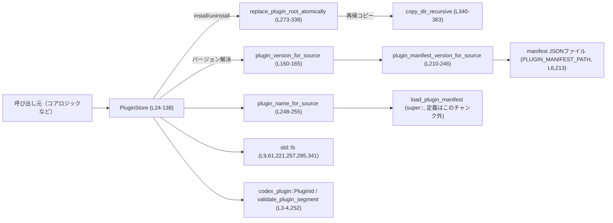
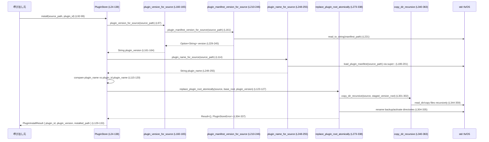

# core/src/plugins/store.rs

## 0. ざっくり一言

- プラグインをローカルディスク上にキャッシュ（インストール／更新／削除）し、アクティブなバージョンを決定するための「プラグインストア」を提供するモジュールです（`PluginStore` 構造体, `PluginInstallResult`, `PluginStoreError` など, 根拠: `core/src/plugins/store.rs:L17-27,29-138,141-158`）。

---

## 1. このモジュールの役割

### 1.1 概要

- このモジュールは、**プラグインのファイル一式を特定ディレクトリ配下に配置・差し替えすることでローカルキャッシュを管理する**ために存在し、次の機能を提供します。
  - プラグインのインストール／再インストール（既存ディレクトリのアトミックな置き換え）（`install`, `install_with_version`, `replace_plugin_root_atomically`。`L92-99,101-134,273-338`）
  - プラグインのアンインストール（`uninstall`, `remove_existing_target`。`L136-138,257-271`）
  - 利用可能／アクティブなプラグインバージョンの探索（`active_plugin_version`, `active_plugin_root`。`L60-86`）
  - プラグイン manifest(JSON) からのバージョン・名前取得と検証（`plugin_manifest_version_for_source`, `plugin_name_for_source`, `plugin_version_for_source`。`L160-165,210-246,248-255`）

### 1.2 アーキテクチャ内での位置づけ

このモジュールは「プラグイン管理コア」と「ファイルシステム／manifest 読み込み」の間に位置し、プラグイン ID とソースディレクトリから、キャッシュ上の配置・バージョン選択を抽象化します。



- `PluginStore` は呼び出し元から見た「プラグインキャッシュ API」であり、実体は `std::fs` と `tempfile` によるディスク操作です。
- manifest の詳細なパースや `PluginId` の構造は、他モジュール／外部 crate に委譲されています（`load_plugin_manifest`, `PluginManifest`, `PluginId`, `validate_plugin_segment` の定義はこのファイルには現れません）。

### 1.3 設計上のポイント

- **ディレクトリ構造ベースのキャッシュ**

  - キャッシュのルートは `codex_home.join("plugins/cache")` で決定され、絶対パスであることが強制されます（`PluginStore::new`, `DEFAULT_PLUGIN_VERSION`, `PLUGINS_CACHE_DIR`。`L14-15,29-35`）。
  - 各プラグインは `root/<marketplace_name>/<plugin_name>/<version>` というディレクトリ構造で配置されます（`plugin_base_root`, `plugin_root`。`L41-57`）。

- **アトミックな更新**

  - インストール時は、一時ディレクトリにコピー → 既存キャッシュをバックアップ → 新キャッシュを本番位置に `rename`、という手順でアトミックに差し替えます（`replace_plugin_root_atomically`, `copy_dir_recursive`。`L273-338,340-363`）。
  - 失敗時は可能な限りロールバックし、失敗した場合はバックアップ位置をエラーメッセージに残します（`L315-329`）。

- **入力の検証と安全性**

  - プラグインバージョンは `validate_plugin_version_segment` で検証され、`"."` や `".."` などのパストラバーサルや非 ASCII 許可外文字が拒否されます（`L167-183`）。
  - manifest 中の `version` は JSON としてパースされ、文字列かつ空白でないことが確認されます（`plugin_manifest_version_for_source`。`L221-245`）。
  - manifest の `name` は `validate_plugin_segment`（外部関数）で検証されます（`plugin_name_for_source`。`L248-255`）。

- **エラーハンドリング方針**

  - I/O などの OS 由来エラーは `PluginStoreError::Io { context, source }` で、検証失敗などは `PluginStoreError::Invalid(String)` で表現します（`L141-152,154-157`）。
  - 一部の前提条件違反（キャッシュルートが絶対でないなど）は `panic!` で即時中断されます（`PluginStore::new`, `plugin_base_root`, `plugin_root` の `unwrap_or_else(panic!)`。`L32-33,42-48,52-57`）。

- **並行性**

  - `PluginStore` 自体は `root: AbsolutePathBuf` だけを保持し、メソッドはすべて `&self` を取るため、Rust の意味での内部データ競合はありません（`L24-27,29-138`）。
  - ただし、ファイルシステム上のパスはプロセス間で共有され得るため、**別スレッド／別プロセスから同じキャッシュディレクトリを操作した場合の競合は OS レベルの挙動に依存**します（この点に関する同期はこのモジュールには現れません）。

---

## 2. 主要な機能一覧

このモジュールが提供する主な機能をまとめます。

- プラグインキャッシュのルートディレクトリ管理
  - `PluginStore::new`, `PluginStore::root` により、キャッシュのルートを表現します（`L29-39`）。
- プラグインごとのキャッシュパス生成
  - `plugin_base_root` で `<marketplace>/<plugin>`、`plugin_root` で `<marketplace>/<plugin>/<version>` の絶対パスを生成します（`L41-57`）。
- アクティブバージョンの決定
  - `active_plugin_version` がディレクトリ一覧から有効なバージョン名を検出し、`DEFAULT_PLUGIN_VERSION`（`"local"`）を優先的に採用します（`L14,60-81`）。
  - `active_plugin_root` がそのバージョンに対応するディレクトリパスを返します（`L83-86`）。
- インストール／再インストール
  - `install` が manifest からバージョンを推論してインストールし（`L92-99`）、
  - `install_with_version` が明示的なバージョンでインストールします（`L101-134`）。
- アンインストール
  - `uninstall` と `remove_existing_target` がプラグインキャッシュのディレクトリ削除を行います（`L136-138,257-271`）。
- manifest の読み込み・検証
  - `plugin_manifest_for_source` が JSON manifest を読み込み（`L186-201`）、
  - `plugin_manifest_version_for_source` が `version` フィールドの有無と形式を検査します（`L210-246`）。
  - `plugin_name_for_source` が manifest の `name` を取得し検証します（`L248-255`）。
- バージョン文字列の検証
  - `validate_plugin_version_segment` がバージョン文字列の安全性とフォーマットを確認します（`L167-183`）。
- ディレクトリのアトミック置き換え
  - `replace_plugin_root_atomically` と `copy_dir_recursive` が、一時ディレクトリ＋バックアップを用いた安全な差し替えを実装します（`L273-338,340-363`）。

---

## 3. 公開 API と詳細解説

### 3.1 型一覧（構造体・列挙体など）

| 名前 | 種別 | 役割 / 用途 | 定義位置 |
|------|------|-------------|----------|
| `PluginInstallResult` | 構造体（`pub`） | インストール結果として、`plugin_id`・`plugin_version`・インストール先パスを返すコンテナです。 | `core/src/plugins/store.rs:L17-22` |
| `PluginStore` | 構造体（`pub`） | プラグインキャッシュのルートと、インストール・アンインストール・バージョン解決などの操作を提供します。 | `L24-27,29-138` |
| `PluginStoreError` | 列挙体（`pub`） | このモジュールの公開 API 全体で使用されるエラー型。I/O エラーと入力不正の 2 種類を区別します。 | `L141-152,154-157` |
| `RawPluginManifestVersion` | 構造体（`pub` でない） | manifest JSON から `version` フィールドだけを取り出すための内部用構造体です。 | `L203-208` |

主な定数:

| 名前 | 種別 | 役割 / 用途 | 定義位置 |
|------|------|-------------|----------|
| `DEFAULT_PLUGIN_VERSION` | `&'static str`（`pub(crate)`） | manifest に `version` がない場合などに利用するデフォルトバージョン `"local"`。 | `L14` |
| `PLUGINS_CACHE_DIR` | `&'static str`（`pub(crate)`） | `codex_home` 以下のキャッシュディレクトリ名 `"plugins/cache"`。 | `L15` |

### 3.2 関数詳細（7 件）

#### `PluginStore::new(codex_home: PathBuf) -> PluginStore`  （L29-35）

**概要**

- プラグインキャッシュのルートディレクトリを `codex_home/plugins/cache` として持つ `PluginStore` を生成します（`L32-33`）。

**引数**

| 引数名 | 型 | 説明 |
|--------|----|------|
| `codex_home` | `PathBuf` | Codex 全体のホームディレクトリ。ここに対して `plugins/cache` を連結してキャッシュルートとします（`L32`）。 |

**戻り値**

- `PluginStore` インスタンス。内部フィールド `root` は `AbsolutePathBuf` としてキャッシュルートを保持します（`L24-27,32-33`）。

**内部処理の流れ**

1. `codex_home.join(PLUGINS_CACHE_DIR)` を実行し、キャッシュルートのパスを得る（`L32`）。
2. それを `AbsolutePathBuf::try_from(...)` に渡し、絶対パスとしてラップする（`L32-33`）。
3. `try_from` が失敗した場合は `panic!("plugin cache root should be absolute: {err}")` でプロセスを中断する（`L33`）。

**Examples（使用例）**

```rust
use std::path::PathBuf;
use core::plugins::store::PluginStore; // 実際のモジュールパスはこのファイルには現れないため仮です

fn create_store() -> PluginStore {
    // Codex のホームディレクトリが絶対パスで与えられる前提
    let codex_home = PathBuf::from("/opt/codex"); // 絶対パス
    PluginStore::new(codex_home)
}
```

**Errors / Panics**

- この関数自体は `Result` を返さず、**`panic!` する可能性があります**。
  - `codex_home.join(PLUGINS_CACHE_DIR)` を `AbsolutePathBuf::try_from` した結果がエラーになったとき（`L32-33`）。
  - エラーメッセージから、キャッシュルートは必ず絶対パスでなければならない前提です。

**Edge cases（エッジケース）**

- `codex_home` が相対パスの場合の挙動は、このファイルからは不明ですが、`try_from` がエラーとなる可能性があります（`L32-33`）。
- `PLUGINS_CACHE_DIR` は固定文字列のため、ここが原因で `try_from` が失敗することは通常ありません（`L15`）。

**使用上の注意点**

- `PluginStore::new` は失敗時に `panic!` する設計のため、「ユーザ入力からのパス」を直接渡すとプロセスが落ちるリスクがあります。
- キャッシュルートの妥当性検査を行いたい場合は、`AbsolutePathBuf::try_from` を呼び出すコードを呼び出し元側に置き、そこで `Result` を処理する設計に変更する必要があります（変更方法は 6 章参照）。

---

#### `PluginStore::active_plugin_version(&self, plugin_id: &PluginId) -> Option<String>` （L60-81）

**概要**

- 指定した `PluginId` に対して、キャッシュディレクトリに存在するバージョン一覧から「アクティブなバージョン」を決定して返します。
  - `"local"`（`DEFAULT_PLUGIN_VERSION`）が存在すればそれを優先し、それ以外は辞書順で最大のバージョン文字列を返します（`L71-80`）。

**引数**

| 引数名 | 型 | 説明 |
|--------|----|------|
| `plugin_id` | `&PluginId` | 対象のプラグイン。`marketplace_name` と `plugin_name` フィールドを使ってパスを構築します（`plugin_base_root`, `L41-47`）。 |

**戻り値**

- `Option<String>`:
  - `Some(version)`：アクティブなバージョン文字列。
  - `None`：プラグインがインストールされていない、またはバージョンディレクトリを列挙できなかった場合（`L61-63,71`）。

**内部処理の流れ**

1. `plugin_base_root(plugin_id).as_path()` を使って `<root>/<marketplace>/<plugin>` のパスを得る（`L61,41-49`）。
2. `fs::read_dir(...)` でサブディレクトリ一覧を取得し、失敗した場合は `None` を返す（`ok()?`, `L61-62`）。
3. 各エントリに対して:
   - 読み込みエラーは無視（`filter_map(Result::ok)`、`L63`）。
   - ディレクトリのみを対象とする（`entry.file_type().ok().filter(FileType::is_dir)`、`L64-65`）。
   - ファイル名を UTF-8 の `String` に変換できるものだけを残す（`into_string().ok()`、`L66`）。
   - `validate_plugin_version_segment` を通過したものだけを残す（`L68`）。
4. 残ったバージョン名を `Vec<String>` に収集し、`sort_unstable`（昇順）する（`L69-70`）。
5. リストが空なら `None`（`L71-72`）。
6. `DEFAULT_PLUGIN_VERSION`（`"local"`）が含まれていれば、それを返す（`L73-77`）。
7. そうでなければ、ソート済みの最後の要素（最大のバージョン文字列）を `pop()` で取り出して返す（`L78-80`）。

**Examples（使用例）**

```rust
use codex_plugin::PluginId;
use core::plugins::store::PluginStore;

fn print_active_version(store: &PluginStore, plugin_id: &PluginId) {
    match store.active_plugin_version(plugin_id) {
        Some(ver) => println!(
            "Active version for {} is {}",
            plugin_id.plugin_name, // フィールド名はこのファイルに現れる
            ver
        ),
        None => println!("Plugin {} is not installed", plugin_id.plugin_name),
    }
}
```

**Errors / Panics**

- この関数は `Option` を返し、`Result` ではないため、**I/O エラーは内部で握りつぶして `None` を返します**。
  - `fs::read_dir` が失敗した場合（権限不足、パス不存在など）は `ok()?` により `None` になります（`L61-62`）。
  - 各エントリの `file_type` 取得や `file_name` 変換のエラーも、単にそのエントリをスキップするだけです（`L63-67`）。
- `panic!` の可能性はありません（`unwrap` や `expect` は使用されていません）。

**Edge cases（エッジケース）**

- 対象ディレクトリが存在しない場合：
  - `read_dir` が `Err` となり、`None` が返ります（`L61-62`）。
- ディレクトリ名が UTF-8 でない場合：
  - `into_string().ok()` により、そのエントリは無視されます（`L66`）。
- バージョン名が検証に失敗する場合：
  - `validate_plugin_version_segment(version).is_ok()` を満たさないため無視されます（`L68`）。
- `"local"` と他のバージョンが併存する場合：
  - `"local"` が優先されます（`L73-77`）。
- `"local"` がなく、`["1.0.0", "1.2.0"]` のような複数バージョンがある場合：
  - ソート後の最大（ここでは `"1.2.0"`）が選択されます（`L69-70,78-80`）。
  - 文字列比較であるため、`"1.10.0"` と `"1.2.0"` の大小関係などは純粋な辞書順に依存します。

**使用上の注意点**

- エラーの詳細（権限不足・ファイル破損など）は呼び出し元からは分からず、単に「インストールされていない（`None`）」と見える点に注意が必要です。
- 必要であれば、別途「存在チェック＋エラー詳細取得」の API を追加する設計が考えられます（このファイルには存在しません）。

---

#### `PluginStore::install(&self, source_path: AbsolutePathBuf, plugin_id: PluginId) -> Result<PluginInstallResult, PluginStoreError>` （L92-99）

**概要**

- プラグインソースディレクトリから manifest を読み、`version` があればそれを、なければ `"local"` をバージョンとしてインストールする高レベル API です。
- 実際の処理は `plugin_version_for_source` と `install_with_version` に委譲されます（`L97-98`）。

**引数**

| 引数名 | 型 | 説明 |
|--------|----|------|
| `source_path` | `AbsolutePathBuf` | プラグインのソースディレクトリの絶対パス。manifest やコード一式がここに存在する前提です（`L94,160-165`）。 |
| `plugin_id` | `PluginId` | マーケットプレイス上のプラグイン ID。`plugin_name` が manifest の `name` と一致している必要があります（`L95,114-120`）。 |

**戻り値**

- `Ok(PluginInstallResult)`：インストールに成功した場合、インストールされたバージョンとパスを含む結果を返します（`L129-133`）。
- `Err(PluginStoreError)`：manifest 読み込み・バージョン検証・コピー・リネームなどのいずれかで失敗した場合（`L97,98` 経由）。

**内部処理の流れ**

1. `plugin_version_for_source(source_path.as_path())?` を呼び出し、manifest からバージョンを取得または `"local"` を決定する（`L97,160-165`）。
2. 得られた `plugin_version` を引数に `install_with_version(source_path, plugin_id, plugin_version)` を呼び出す（`L98,101-134`）。

**Examples（使用例）**

```rust
use codex_plugin::PluginId;
use codex_utils_absolute_path::AbsolutePathBuf;
use core::plugins::store::{PluginStore, PluginStoreError, PluginInstallResult};

fn install_plugin(
    store: &PluginStore,
    source: AbsolutePathBuf,
    plugin_id: PluginId,
) -> Result<PluginInstallResult, PluginStoreError> {
    // manifest の version があればそれを、なければ "local" としてインストール
    store.install(source, plugin_id)
}
```

**Errors / Panics**

- 返り値が `Result` なので `panic!` はしません（内部で `panic!` を呼ぶ関数は使っていません）。
- エラーの主な要因は次の通りです（それぞれ `PluginStoreError` として伝播します）。
  - manifest ファイルが存在しない／壊れている（`plugin_manifest_version_for_source`, `L213-228`）。
  - manifest の `version` が不正（型が文字列でない、空文字など、`L229-245`）。
  - `validate_plugin_version_segment` によるバージョン検証失敗（`L161-164,167-183`）。
  - `install_with_version` 内での各種 I/O エラーや検証エラー（`L101-134`）。

**Edge cases（エッジケース）**

- manifest に `version` プロパティが存在しない場合：
  - `plugin_manifest_version_for_source` は `Ok(None)` を返し（`L229-231`）、
  - `plugin_version_for_source` は `"local"` を採用します（`L161-162`）。
- manifest ファイルが存在しない場合：
  - `plugin_manifest_version_for_source` が `PluginStoreError::Invalid("missing plugin manifest: ...")` を返し（`L213-219`）、
  - インストール全体が失敗します。

**使用上の注意点**

- `install` は version の自動解決を行うため、明示的に特定バージョン名でインストールしたい場合は `install_with_version` を使用します（`L101-134`）。
- `source_path` はプラグインソースの「ディレクトリ」でなければなりません（`install_with_version` 内でチェック、`L107-112`）。

---

#### `PluginStore::install_with_version(&self, source_path: AbsolutePathBuf, plugin_id: PluginId, plugin_version: String) -> Result<PluginInstallResult, PluginStoreError>` （L101-134）

**概要**

- 指定された `plugin_version` 名前空間の下にプラグインをインストール（または再インストール）します。
- ソースディレクトリの検証、manifest 上の名前との整合性確認、バージョン文字列の検証、そしてアトミックなディレクトリ差し替えを行います。

**引数**

| 引数名 | 型 | 説明 |
|--------|----|------|
| `source_path` | `AbsolutePathBuf` | プラグインソースの絶対パス。ディレクトリである必要があります（`L107-112`）。 |
| `plugin_id` | `PluginId` | 対象プラグインの ID。`plugin_name` が manifest の `name` と一致していることが要求されます（`L114-120`）。 |
| `plugin_version` | `String` | インストールするバージョン名。`validate_plugin_version_segment` による検証を通過する必要があります（`L121`）。 |

**戻り値**

- 成功時：`PluginInstallResult`（`plugin_id`, `plugin_version`, `installed_path`）を返します（`L129-133`）。
- 失敗時：`PluginStoreError`（`Invalid` または `Io`）を返します。

**内部処理の流れ**

1. `source_path` がディレクトリであるか確認し、そうでなければ `PluginStoreError::Invalid("plugin source path is not a directory: ...")` を返す（`L107-112`）。
2. `plugin_name_for_source(source_path.as_path())?` で manifest を読み、`name` を取得する（`L114,248-255`）。
3. `plugin_name != plugin_id.plugin_name` であれば、manifest 上の名前とマーケットプレイス上の名前が一致していないとして `Invalid` エラーを返す（`L115-120`）。
4. `validate_plugin_version_segment(&plugin_version)` を呼び、失敗時は `Invalid` エラーに変換（`L121,167-183`）。
5. `installed_path = self.plugin_root(&plugin_id, &plugin_version)` でインストール先の絶対パスを計算する（`L122,51-57`）。
6. `replace_plugin_root_atomically(source_path.as_path(), self.plugin_base_root(&plugin_id).as_path(), &plugin_version)?` を呼び、キャッシュディレクトリをアトミックに更新する（`L123-127,273-338`）。
7. 成功したら `PluginInstallResult` を構築し `Ok` で返す（`L129-133`）。

**Examples（使用例）**

```rust
use codex_plugin::PluginId;
use codex_utils_absolute_path::AbsolutePathBuf;
use core::plugins::store::{PluginStore, PluginStoreError};

fn install_fixed_version(
    store: &PluginStore,
    source: AbsolutePathBuf,
    plugin_id: PluginId,
) -> Result<(), PluginStoreError> {
    // 例えば "1.0.0" という固定バージョンでインストール
    let version = "1.0.0".to_string();
    let result = store.install_with_version(source, plugin_id, version)?;

    println!(
        "Installed {} {} at {}",
        result.plugin_id.plugin_name,
        result.plugin_version,
        result.installed_path,
    );

    Ok(())
}
```

**Errors / Panics**

- `PluginStoreError::Invalid` が返されるケース:
  - `source_path` がディレクトリでない（`L107-112`）。
  - manifest が存在しない／不正（`plugin_name_for_source` 経由、`L186-201,248-255`）。
  - manifest の `name` と `plugin_id.plugin_name` が一致しない（`L115-120`）。
  - `plugin_version` が空文字や不正な文字を含むなど `validate_plugin_version_segment` に通らない（`L121,167-183`）。
  - `replace_plugin_root_atomically` 内でバックアップ復旧に失敗した特殊ケース（`L323-329`）。
- `PluginStoreError::Io` が返されるケース:
  - キャッシュディレクトリの作成、コピー、リネームなどファイルシステム操作が失敗したとき（`PluginStoreError::io` をラップしている箇所全般、`L155-157,285-287,294-303,305-310,312-335,341-359`）。
- `panic!` は発生しません（内部で利用していません）。

**Edge cases（エッジケース）**

- すでに同じプラグインの別バージョンがインストールされている場合：
  - `replace_plugin_root_atomically` が古いディレクトリをバックアップし、新しいディレクトリに入れ替えます（`L304-331`）。
  - 成功すれば、古いバージョンはバックアップディレクトリごと削除されます（`tempdir` の Drop に依存）。
- インストール途中でコピーに失敗した場合：
  - コピー先は一時ディレクトリ内であるため、キャッシュの本番ディレクトリは変更されません（`L294-303`）。
- アクティベーション（`rename`）中に失敗し、かつロールバックまで失敗した場合：
  - バックアップディレクトリがディスク上に残され、そのパスがエラーメッセージに含まれます（`L323-329`）。

**使用上の注意点**

- `plugin_id` は外部から与えられるため、このモジュール内では `marketplace_name`／`plugin_name` の妥当性をリチェックしていません（パスセグメントとして使用されるのは `plugin_base_root` だけであり、ここで追加検証は行われていません。`L41-47`）。
- 同じプラグインに対して頻繁にインストール・アンインストールを繰り返す場合は、ディスク I/O コストが高くなる点に注意が必要です（再帰コピー＋ディレクトリリネーム、`L294-303,304-335,340-359`）。

---

#### `PluginStore::uninstall(&self, plugin_id: &PluginId) -> Result<(), PluginStoreError>` （L136-138）

**概要**

- 指定された `PluginId` のキャッシュディレクトリ（`<root>/<marketplace>/<plugin>`）を削除します。

**引数**

| 引数名 | 型 | 説明 |
|--------|----|------|
| `plugin_id` | `&PluginId` | アンインストール対象のプラグイン ID（`plugin_base_root` でパスを構成、`L41-47,136-138`）。 |

**戻り値**

- 成功時：`Ok(())`。
- 失敗時：`Err(PluginStoreError::Io)`（削除に失敗した場合）。

**内部処理の流れ**

1. `self.plugin_base_root(plugin_id).as_path()` で `<root>/<marketplace>/<plugin>` の絶対パスを取得（`L136-137,41-49`）。
2. `remove_existing_target(...)` を呼び出し、対象が存在すれば削除、存在しなければ何もしない（`L136-138,257-271`）。

**Examples（使用例）**

```rust
use codex_plugin::PluginId;
use core::plugins::store::{PluginStore, PluginStoreError};

fn uninstall_plugin(store: &PluginStore, plugin_id: &PluginId) -> Result<(), PluginStoreError> {
    store.uninstall(plugin_id)
}
```

**Errors / Panics**

- 対象ディレクトリ／ファイルが存在しない場合は成功扱いで `Ok(())` を返します（`L258-260`）。
- `fs::remove_dir_all` または `fs::remove_file` が失敗した場合に `PluginStoreError::Io` が返されます（`L262-270`）。
- `panic!` はありません。

**Edge cases（エッジケース）**

- `plugin_base_root` がファイルだった場合：
  - `path.is_dir()` が `false` のため `remove_file` が呼ばれます（`L262-270`）。
- 削除中に別プロセスが同じパスに対して操作を行っている場合：
  - OS の挙動に依存し、削除失敗や一部削除などが起こり得ます。このモジュールには追加の排他制御はありません。

**使用上の注意点**

- アンインストールはディスク上のキャッシュを消すだけであり、実行中のプラグインプロセス停止などは行いません（そうした機能はこのファイルには現れません）。

---

#### `plugin_version_for_source(source_path: &Path) -> Result<String, PluginStoreError>` （L160-165）

**概要**

- プラグインソースディレクトリの manifest から `version` を取得し、存在しない場合は `"local"` を返す補助関数です。
- 取得したバージョン文字列には `validate_plugin_version_segment` による検証が適用されます。

**引数**

| 引数名 | 型 | 説明 |
|--------|----|------|
| `source_path` | `&Path` | プラグインソースディレクトリのパス。manifest ファイルが存在する必要があります（`L160-161,213-219`）。 |

**戻り値**

- 成功時：検証済みのバージョン文字列 `String`。
- 失敗時：`PluginStoreError`（manifest 不備やバージョン検証エラー）。

**内部処理の流れ**

1. `plugin_manifest_version_for_source(source_path)?` を呼び出し、`Option<String>` を取得（`L161,210-246`）。
2. `Option::unwrap_or_else` で、`None` の場合は `DEFAULT_PLUGIN_VERSION.to_string()`（`"local"`）を採用（`L161-162`）。
3. 得られたバージョン文字列に対して `validate_plugin_version_segment(&plugin_version)` を実行し、失敗時は `PluginStoreError::Invalid` に変換（`L163,167-183`）。
4. 成功したバージョン文字列を返す（`L164`）。

**Examples（使用例）**

```rust
use std::path::Path;
use core::plugins::store::{plugin_version_for_source, PluginStoreError};

fn detect_version(source: &Path) -> Result<String, PluginStoreError> {
    plugin_version_for_source(source)
}
```

**Errors / Panics**

- manifest が存在しない／読み込めない／パースできない場合は、`plugin_manifest_version_for_source` からの `PluginStoreError` がそのまま返されます（`L161,213-228`）。
- `version` が文字列でない・空白のみなどの場合も `PluginStoreError::Invalid` になります（`L229-245`）。
- `validate_plugin_version_segment` の検証に失敗した場合（不正文字・`.` や `..` のみなど）も `PluginStoreError::Invalid` になります（`L163,167-183`）。
- `panic!` はありません。

**Edge cases（エッジケース）**

- manifest に `version` フィールドがない場合：
  - `plugin_manifest_version_for_source` が `Ok(None)` を返し（`L229-231`）、
  - 結果として `"local"` が採用されます（`L161-162`）。
- manifest の `version` が `"   1.0.0   "` のように前後に空白を含む場合：
  - `trim()` により空白が削除され（`L238`）、`"1.0.0"` として扱われます。

**使用上の注意点**

- この関数はバージョンを「文字列」として扱い、その意味的なバージョニング（SemVer 準拠か等）は検証しません。文字列の安全性と簡単なフォーマットのみを保証します。

---

#### `plugin_manifest_version_for_source(source_path: &Path) -> Result<Option<String>, PluginStoreError>` （L210-246）

**概要**

- manifest JSON ファイルから `version` フィールドだけを読み出し、その存在と形式を検証する内部関数です。
- バージョンがないこと自体はエラーではなく、`Ok(None)` で表現されます。

**引数**

| 引数名 | 型 | 説明 |
|--------|----|------|
| `source_path` | `&Path` | プラグインソースディレクトリ。`source_path.join(PLUGIN_MANIFEST_PATH)` に manifest がある前提です（`L213`）。 |

**戻り値**

- `Ok(Some(version))`：正しい型・フォーマットの `version` が存在する場合。
- `Ok(None)`：`version` フィールド自体が存在しない場合。
- `Err(PluginStoreError)`：manifest が存在しない・読み込めない・パースできない・`version` が不正な場合。

**内部処理の流れ**

1. `manifest_path = source_path.join(PLUGIN_MANIFEST_PATH)` を構築し、ファイル存在を確認（`L213-218`）。
   - 無ければ `Invalid("missing plugin manifest: ...")` エラー（`L215-218`）。
2. `fs::read_to_string(&manifest_path)` で内容を読み取る。失敗時は `Io { context: "failed to read plugin manifest", source }` でラップ（`L221-222`）。
3. `serde_json::from_str::<RawPluginManifestVersion>(&contents)` で JSON としてパース（`L223-228`）。
   - 失敗時は `Invalid("failed to parse plugin manifest ...: {err}")`（`L223-228`）。
4. `manifest.version` を取り出し、`None` なら `Ok(None)` を返す（`L229-231`）。
5. `as_str()` で JSON 値が文字列か確認し、違えば `Invalid("expected string")`（`L232-237`）。
6. `trim()` して空白を除去し、空文字列なら `Invalid("must not be blank")`（`L238-243`）。
7. 問題が無ければ `Ok(Some(version.to_string()))` を返す（`L245`）。

**Examples（使用例）**

通常は `plugin_version_for_source` を通じて間接的に利用されるため、外部から直接呼び出されるケースは少ないと考えられます（このファイル内でも直接の公開はされていません）。

**Errors / Panics**

- 上記の通り、manifest に関するさまざまな不正を `PluginStoreError::Invalid` で表現します。
- I/O エラー（読み込み失敗）は `PluginStoreError::Io` になります（`L221-222`）。
- `panic!` はありません。

**Edge cases（エッジケース）**

- `version: null` のように `version` が `null` の場合:
  - `Option<JsonValue>` として `Some(JsonValue::Null)` が入り、その後 `as_str()` が `None` を返すため `Invalid("expected string")` となります（`L205-207,232-237`）。
- `version` が数値やオブジェクトなどの場合も同様にエラーとなります。

**使用上の注意点**

- バージョンの存在有無とフォーマット検証のみを行い、文字列の内容についての意味的な制約（SemVer など）は課していません。
- `plugin_version_for_source` 側で追加の文字種検証が行われる前提になっています（`L160-165`）。

---

#### `replace_plugin_root_atomically(source: &Path, target_root: &Path, plugin_version: &str) -> Result<(), PluginStoreError>` （L273-338）

**概要**

- プラグインソースディレクトリの内容を、`target_root` ディレクトリ配下の `plugin_version` サブディレクトリにコピーし、それをアトミックに入れ替える低レベル関数です。
- 一時ディレクトリとバックアップディレクトリを用いることで、更新中の不整合を最小化しつつ、可能な範囲でロールバックを行います。

**引数**

| 引数名 | 型 | 説明 |
|--------|----|------|
| `source` | `&Path` | インストール元のディレクトリパス。プラグインソースディレクトリ（`L274`）。 |
| `target_root` | `&Path` | `<root>/<marketplace>/<plugin>` に相当するディレクトリパス（`plugin_base_root` から渡される、`L275,41-49,123-126`）。 |
| `plugin_version` | `&str` | バージョン名。`target_root/<plugin_version>` にコピーされます（`L276,301-302`）。 |

**戻り値**

- 成功時：`Ok(())`。
- 失敗時：`Err(PluginStoreError)`（I/O エラーまたはロールバック失敗を含む）。

**内部処理の流れ（簡略）**

1. `target_root.parent()` を取得し、存在しなければ `Invalid("no parent")`（`L278-283`）。
2. `fs::create_dir_all(parent)` で親ディレクトリを作成（`L285-287`）。
3. `target_root.file_name()` を取得し、無ければ `Invalid("no directory name")`（`L288-293`）。
4. `tempfile::Builder::new().prefix("plugin-install-").tempdir_in(parent)` で一時ディレクトリを作成（`L294-299`）。
5. `staged_root = staged_dir.path().join(plugin_dir_name)`、`staged_version_root = staged_root.join(plugin_version)` を構築し、`copy_dir_recursive(source, &staged_version_root)` でソースの中身をコピー（`L300-302,340-359`）。
6. `target_root.exists()` を確認：
   - 存在する場合：
     1. `tempfile::Builder::new().prefix("plugin-backup-").tempdir_in(parent)` でバックアップ用の一時ディレクトリを作成（`L304-310`）。
     2. `backup_root = backup_dir.path().join(plugin_dir_name)` を計算（`L311`）。
     3. `fs::rename(target_root, &backup_root)` で現行キャッシュをバックアップへ移動（`L312-313`）。
     4. `fs::rename(&staged_root, target_root)` を試行：
        - 成功すれば終了（`L315,331-335`）。
        - 失敗した場合：
          - `fs::rename(&backup_root, target_root)` によるロールバックを試みる（`L316-321`）。
          - ロールバック成功 → `Io("failed to activate updated plugin cache entry")` を返す（`L318-321`）。
          - ロールバック失敗 → `backup_dir.keep().join(plugin_dir_name)` でバックアップを残し、そのパスを含む `Invalid` エラーを返す（`L322-329`）。
   - 存在しない場合：
     - `fs::rename(&staged_root, target_root)` を行い、失敗時は `Io("failed to activate plugin cache entry")`（`L332-335`）。
7. 最後に `Ok(())` を返す（`L337`）。

**Examples（使用例）**

- この関数は `PluginStore::install_with_version` からのみ呼び出される内部実装であり、直接利用されることは想定されていません（`L123-127`）。

**Errors / Panics**

- さまざまなファイルシステム操作で `PluginStoreError::Io` が返される可能性があります。
- ロールバックに失敗した場合のみ `PluginStoreError::Invalid` が返されます（バックアップ位置が追加情報として含まれる、`L323-329`）。
- `panic!` は呼び出されません。

**Edge cases（エッジケース）**

- `target_root` に親ディレクトリが存在しないパス（例: ルートそのもの）を渡した場合：
  - `parent` が `None` となり、`Invalid("plugin cache path has no parent")` エラーになります（`L278-283`）。
- `target_root` が存在せず、かつ `fs::rename(&staged_root, target_root)` が失敗する場合（権限不足や異なるファイルシステムなど）：
  - `Io("failed to activate plugin cache entry")` が返ります（`L332-335`）。
- 既存キャッシュのバックアップ作成に失敗した場合：
  - `Io("failed to create plugin cache backup directory")` などが返ります（`L304-310`）。

**使用上の注意点**

- この関数は「同一ファイルシステム上での `rename` がアトミックである」という OS の性質を前提としています。
- 別スレッドや別プロセスが同じ `target_root` を同時に更新しようとした場合の挙動は OS 依存であり、このモジュールには追加のロック機構はありません。

---

### 3.3 その他の関数

補助的な関数や単純なラッパーを一覧でまとめます。

| 関数名 | シグネチャ（簡略） | 役割（1 行） | 定義位置 |
|--------|--------------------|--------------|----------|
| `PluginStore::root` | `(&self) -> &AbsolutePathBuf` | キャッシュルートの絶対パスを参照で返します。 | `L37-39` |
| `PluginStore::plugin_base_root` | `(&self, &PluginId) -> AbsolutePathBuf` | `<root>/<marketplace>/<plugin>` の絶対パスを生成します。 | `L41-49` |
| `PluginStore::plugin_root` | `(&self, &PluginId, &str) -> AbsolutePathBuf` | `<root>/<marketplace>/<plugin>/<version>` の絶対パスを生成します。 | `L51-57` |
| `PluginStore::active_plugin_root` | `(&self, &PluginId) -> Option<AbsolutePathBuf>` | `active_plugin_version` の結果を `plugin_root` に適用してパスを返します。 | `L83-86` |
| `PluginStore::is_installed` | `(&self, &PluginId) -> bool` | `active_plugin_version.is_some()` によりインストール有無を判定します。 | `L88-90` |
| `PluginStoreError::io` | `fn(&'static str, io::Error) -> Self` | I/O エラーに文脈文字列を付与した `PluginStoreError::Io` を生成します。 | `L154-157` |
| `validate_plugin_version_segment` | `fn(&str) -> Result<(), String>` | バージョン文字列の長さ・パストラバーサル・文字種を検証します。 | `L167-183` |
| `plugin_manifest_for_source` | `fn(&Path) -> Result<PluginManifest, PluginStoreError>` | manifest ファイルの存在を確認し、`load_plugin_manifest` を用いてパースします。 | `L186-201` |
| `plugin_name_for_source` | `fn(&Path) -> Result<String, PluginStoreError>` | manifest の `name` を取得し、`validate_plugin_segment` で検証してから返します。 | `L248-255` |
| `remove_existing_target` | `fn(&Path) -> Result<(), PluginStoreError>` | 対象パスが存在すればファイルまたはディレクトリを削除します。 | `L257-271` |
| `copy_dir_recursive` | `fn(&Path, &Path) -> Result<(), PluginStoreError>` | ディレクトリ内容を再帰的にコピーします（シンボリックリンクなどは除外）。 | `L340-363` |

---

## 4. データフロー

### 4.1 プラグインインストール時のデータフロー

`PluginStore::install` を呼び出したときの典型的な処理の流れです。



要点:

- **manifest 読み込みフェーズ**で `version` と `name` を検証します（`L160-165,210-246,248-255`）。
- **ファイル操作フェーズ**では、一時ディレクトリとバックアップディレクトリを使って安全にキャッシュディレクトリを差し替えます（`L294-335,340-359`）。
- どこかでエラーが起きると、`PluginStoreError` が一貫して呼び出し元に返されます。

---

## 5. 使い方（How to Use）

### 5.1 基本的な使用方法

`PluginStore` を用いてプラグインをインストールし、アクティブパスを取得する基本的なフローの例です。

```rust
use std::path::PathBuf;
use codex_plugin::PluginId;
use codex_utils_absolute_path::AbsolutePathBuf;
use core::plugins::store::{PluginStore, PluginStoreError};

fn main_flow() -> Result<(), PluginStoreError> {
    // 1. PluginStore を初期化する（キャッシュルートは /opt/codex/plugins/cache）
    let codex_home = PathBuf::from("/opt/codex");
    let store = PluginStore::new(codex_home);

    // 2. プラグインソースの絶対パスを用意する
    // AbsolutePathBuf の具体的な生成方法はこのファイルには現れません。
    let source: AbsolutePathBuf = /* 事前に絶対パスとして構築する */ unimplemented!();

    // 3. PluginId を取得する
    // PluginId 型の定義はこのファイルには現れませんが、
    // 少なくとも marketplace_name と plugin_name フィールドが存在することが分かります（L45-46,115）。
    let plugin_id: PluginId = /* 呼び出し側の文脈で取得する */ unimplemented!();

    // 4. プラグインをインストールする（manifest の version か "local" が採用される）
    let install_result = store.install(source, plugin_id)?;

    println!(
        "Installed plugin {} version {} at {}",
        install_result.plugin_id.plugin_name,
        install_result.plugin_version,
        install_result.installed_path,
    );

    // 5. アクティブなインストール先ディレクトリを取得する
    if let Some(root) = store.active_plugin_root(&install_result.plugin_id) {
        println!("Active plugin root: {}", root);
    }

    Ok(())
}
```

※ `AbsolutePathBuf` や `PluginId` の具体的な生成方法は、このファイルには定義がないため不明です。

### 5.2 よくある使用パターン

1. **manifest に依存せず、明示的バージョンでインストール**

   ```rust
   fn install_specific_version(
       store: &PluginStore,
       source: AbsolutePathBuf,
       plugin_id: PluginId,
   ) -> Result<(), PluginStoreError> {
       // manifest の version に関わらず "dev-branch" としてインストール
       store.install_with_version(source, plugin_id, "dev-branch".to_string())?;
       Ok(())
   }
   ```

2. **インストール済みかどうかの簡易チェック**

   ```rust
   fn ensure_installed(store: &PluginStore, plugin_id: &PluginId) {
       if store.is_installed(plugin_id) {
           println!("Plugin {} is installed", plugin_id.plugin_name);
       } else {
           println!("Plugin {} is not installed", plugin_id.plugin_name);
       }
   }
   ```

3. **アンインストール**

   ```rust
   fn remove_plugin(store: &PluginStore, plugin_id: &PluginId) -> Result<(), PluginStoreError> {
       store.uninstall(plugin_id)
   }
   ```

### 5.3 よくある間違いと正しい例

```rust
use codex_utils_absolute_path::AbsolutePathBuf;
use core::plugins::store::{PluginStore, PluginStoreError};

// 間違い例: source_path にファイルパスを渡している
fn wrong_install(store: &PluginStore, file_path: AbsolutePathBuf, plugin_id: codex_plugin::PluginId)
    -> Result<(), PluginStoreError>
{
    // plugin source path is not a directory エラーになる（L107-112）
    let _ = store.install(file_path, plugin_id)?;
    Ok(())
}

// 正しい例: source_path はプラグインソースを含むディレクトリである必要がある
fn correct_install(store: &PluginStore, dir_path: AbsolutePathBuf, plugin_id: codex_plugin::PluginId)
    -> Result<(), PluginStoreError>
{
    // dir_path はディレクトリ
    let _ = store.install(dir_path, plugin_id)?;
    Ok(())
}
```

```rust
// 間違い例: manifest の name と一致しない PluginId を使っている
fn wrong_plugin_id(store: &PluginStore, source: AbsolutePathBuf, plugin_id: codex_plugin::PluginId)
    -> Result<(), PluginStoreError>
{
    // plugin manifest name `...` does not match marketplace plugin name `...` で失敗（L115-120）
    store.install(source, plugin_id)?;
    Ok(())
}
```

### 5.4 使用上の注意点（まとめ）

- **パスの前提条件**
  - `PluginStore::new` に与える `codex_home` は、`AbsolutePathBuf::try_from` が成功する（実質的に絶対パスである）必要があります（`L32-33`）。
  - `install(_with_version)` に渡す `source_path` はディレクトリでなければならず、manifest ファイル（`PLUGIN_MANIFEST_PATH`）が存在する必要があります（`L107-112,213-219`）。

- **エラーハンドリング**
  - インストール系関数はすべて `Result<_, PluginStoreError>` を返し、呼び出し側で `match` や `?` を用いてハンドリングする必要があります。
  - バージョン関連の不正は `PluginStoreError::Invalid` として区別されるため、ユーザ向けメッセージなどで再利用しやすい設計です（`L141-152`）。

- **並行性と一貫性**
  - 同一の `PluginStore` インスタンスを複数スレッドから参照すること自体は `&self` ベースのため安全ですが（内部に可変状態を持たない、`L24-27,29-138`）、ファイルシステム上の状態は他プロセスと共有されます。
  - インストール中は一時的に `<root>/<marketplace>/<plugin>` が存在しない瞬間があり得ます（バックアップとのリネーム間、`L312-315`）。別スレッドがそのタイミングで `active_plugin_version` を呼ぶと、一時的に `None` と判断される可能性があります。

- **性能面**
  - インストール処理ではソースディレクトリ全体を再帰コピーするため、大きなプラグインや頻繁なアップデートはディスク I/O 負荷が高くなります（`copy_dir_recursive`, `L340-359`）。
  - 不必要な再インストールを避けたい場合は、呼び出し側でバージョン差分を検知するなどの工夫が必要です（このモジュールにはそうした機構はありません）。

---

## 6. 変更の仕方（How to Modify）

### 6.1 新しい機能を追加する場合

例：manifest に追加メタデータ（例: 対応プラットフォーム）を導入し、インストール時に検証したい場合。

1. **manifest パース部分の拡張**
   - `RawPluginManifestVersion` は `version` のみを持つシンプルな構造体です（`L203-208`）。別のフィールドも読みたい場合、
     - 新しい構造体（例: `RawPluginManifestExtended`）を追加する、
     - もしくは既存構造体にフィールドを追加する必要があります。
2. **検証ロジックの追加**
   - `plugin_manifest_version_for_source` に倣い、新しい関数（例: `plugin_manifest_platform_for_source`）を追加し、manifest 読み込みと検証を行います（`L210-246` を参考）。
3. **インストールフローへの組み込み**
   - `PluginStore::install_with_version` 内に新関数を呼び出すステップを挿入し、条件に応じて `PluginStoreError::Invalid` を返すようにします（`L101-134` の `plugin_name` 検証ステップと同様）。

### 6.2 既存の機能を変更する場合

- **ディレクトリレイアウトを変えたい場合**
  - `<root>/<marketplace>/<plugin>/<version>` というレイアウトは `plugin_base_root` と `plugin_root` で定義されています（`L41-57`）。
  - レイアウト変更はここを修正することで実現できますが、同時に:
    - `active_plugin_version`・`uninstall` が期待するパス構造も変わるため、それらの実装も合わせて確認・修正する必要があります（`L60-81,136-138`）。
    - 既存のキャッシュディレクトリとの互換性についても考慮が必要です（このモジュールにはマイグレーション処理はありません）。

- **バージョン選択ポリシーを変更したい場合**
  - 現在は `"local"` を最優先し、それ以外は辞書順で最大のバージョンを選んでいます（`L71-80`）。
  - SemVer に基づく比較などに変えたい場合は、`active_plugin_version` 内でのソートロジック（`L69-70`）を修正することになります。

- **エラーの扱いを変えたい場合**
  - 例えば、`active_plugin_version` で I/O エラーの詳細を取得したい場合は、戻り値を `Result<Option<String>, PluginStoreError>` に変更し、`fs::read_dir(...).ok()?` の部分を `?` に置き換えるなどの変更が必要です（`L61-62`）。
  - その際、呼び出し元（このファイル外）もすべて修正する必要があります。

- **テストの追加／修正**
  - テストコードは `store_tests.rs` に分離されているため（`L366-368`）、振る舞いを変更した場合はそちらも更新する必要があります。
  - `store_tests.rs` の内容はこのチャンクには現れないため、具体的なケースは不明です。

---

## 7. 関連ファイル

このモジュールと密接に関係するファイル・外部コンポーネントです。

| パス / モジュール | 役割 / 関係 |
|-------------------|------------|
| `super::load_plugin_manifest`（実際のファイルパスは不明） | プラグイン manifest を読み込む関数。`plugin_manifest_for_source` から呼び出されます（`L186-201`）。定義場所はこのチャンクには現れません。 |
| `super::manifest::PluginManifest` | manifest を表現する構造体。少なくとも `name` フィールドを持ちます（`L2,248-252`）。具体的な定義はこのチャンクには現れません。 |
| `codex_plugin::PluginId` | プラグイン ID を表す型。`marketplace_name` と `plugin_name` フィールドが存在することが、このファイルから分かります（`L3,45-46,115,118`）。 |
| `codex_plugin::validate_plugin_segment` | プラグイン名などのパスセグメントを検証する関数。`plugin_name_for_source` で使用されます（`L4,248-255`）。 |
| `codex_utils_absolute_path::AbsolutePathBuf` | 絶対パスのみを表現するラッパー型。`PluginStore` のルートやインストールパスで使用されます（`L5,24-27,32-33,51-57,129-133`）。 |
| `codex_utils_plugins::PLUGIN_MANIFEST_PATH` | manifest ファイルの相対パスを表す定数。`source_path.join(PLUGIN_MANIFEST_PATH)` として使用されます（`L6,187,213`）。実際の値（例: `"plugin.json"`）はこのチャンクには現れません。 |
| `core/src/plugins/store_tests.rs` | `#[path = "store_tests.rs"] mod tests;` により参照されるテストコードファイルです（`L366-368`）。内容はこのチャンクには現れません。 |

---

## Bugs / Security / Contracts の補足（このモジュールに関して読み取れる範囲）

※ ここでは事実ベースで、挙動上注意が必要な点を整理します。

- **パス検証とセキュリティ**
  - バージョン名に対しては `validate_plugin_version_segment` が `"."` や `".."` を禁止し、許可文字も ASCII の英数字と `.-_+` に制限しているため、パストラバーサルや制御文字混入のリスクを軽減しています（`L167-183`）。
  - manifest の `name` に対しては `validate_plugin_segment` が適用されますが、その具体的なルールはこのファイルには現れません（`L252`）。
  - 一方で、`PluginId` の `marketplace_name`／`plugin_name` はこのモジュールでは再検証されず、`plugin_base_root` でそのままパスセグメントとして使用されます（`L41-47`）。これらが既に安全な値であることが前提です。

- **契約（Contracts）とエッジケース**
  - `install_with_version` の契約:
    - `source_path` はディレクトリかつ manifest とソース一式を含む必要があります（`L107-112,213-219`）。
    - manifest の `name` と `PluginId.plugin_name` が一致している必要があります（`L115-120`）。
    - `plugin_version` は `validate_plugin_version_segment` に通る文字列でなければなりません（`L121,167-183`）。
  - `active_plugin_version` の契約:
    - 「存在しない・読み込みできない・不正なバージョン名だけ」の場合はすべて `None`（未インストール相当）になります（`L61-72`）。
    - I/O エラーを詳細に区別しない点に注意が必要です。

- **並行性の観点**
  - このモジュールは OS レベルのファイルシステム操作に対して追加のロックを行っていないため、**複数プロセスが同じキャッシュディレクトリを同時に操作した場合の結果は OS に依存**します（明示的な同期機構はこのファイルには現れません）。
  - `rename` 操作は一般的にアトミックですが、その間のディレクトリ存在有無や `read_dir` の挙動はプラットフォームに依存します。

- **テスト**
  - `store_tests.rs` でこの挙動がどの程度カバーされているかは、このチャンクからは分かりませんが、少なくともこのモジュール専用のテストファイルが存在することは確認できます（`L366-368`）。
