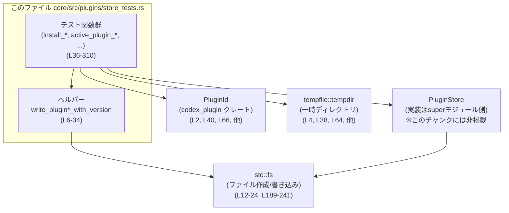
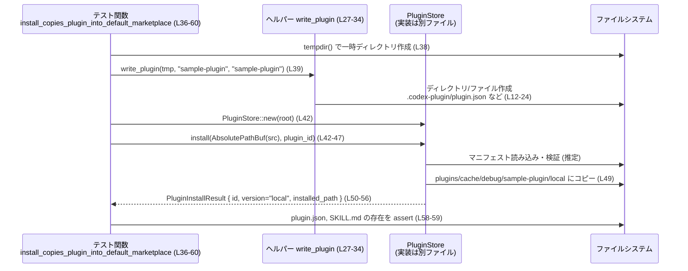

# core/src/plugins/store_tests.rs

## 0. ざっくり一言

`PluginStore` と `PluginId` 周辺の「プラグインのインストール・バージョン解決・名前検証」の仕様を、実ファイルシステムを使って検証するテスト群です（`core/src/plugins/store_tests.rs:L36-310`）。  

---

## 1. このモジュールの役割

### 1.1 概要

- このモジュールは、プラグインの
  - インストール先ディレクトリのレイアウト  
  - バージョンディレクトリの選択ルール  
  - プラグイン名・マーケットプレース名のバリデーション  
  を確認するテストを提供します（`store_tests.rs:L36-310`）。
- テスト用ヘルパー関数で最小限のプラグイン構造を作成し、本物の `PluginStore` API を呼び出して結果を検証します（`store_tests.rs:L6-34`）。

### 1.2 アーキテクチャ内での位置づけ

このテストモジュールは、上位モジュール（`super::*`）で定義されている `PluginStore` 実装の振る舞いを検証します（`store_tests.rs:L1`）。外部クレートの `PluginId` なども利用します。



### 1.3 設計上のポイント

コードから読み取れる設計の特徴は次の通りです。

- **実ファイルシステムベースのテスト**  
  - `tempdir()` で一時ディレクトリを作り、その中にプラグイン構造を作成します（`store_tests.rs:L38, L64, L102, 他`）。
  - `std::fs::write` / `create_dir_all` でディレクトリとファイルを実際に生成しています（`store_tests.rs:L12-24`）。

- **パスレイアウトの契約を明示するテスト**  
  - インストール先は `plugins/cache/{marketplace}/{plugin_name}/{version}` というパターンであることを前提に検証しています（`store_tests.rs:L49, L81, L96, L116-118, L148-150, L190-193`）。

- **名前とバージョンのバリデーション重視**  
  - プラグイン名・マーケットプレース名の許可文字種制限（ASCII 英数字・`_`・`-`）をエラーメッセージレベルで確認しています（`store_tests.rs:L255-257, L261-262, L278-281, L288-291`）。
  - マニフェストの `name` と `PluginId` の名前一致、マニフェスト version の空白拒否など、セキュリティ／一貫性に関わる条件を細かくテストしています（`store_tests.rs:L165-183, L295-309`）。

- **エラーハンドリングの方針（テスト側）**  
  - 正常系では `.unwrap()` を多用し、テスト失敗時に即座にパニックするようにしています（`store_tests.rs:L38, L40, L42-47, 他多数`）。
  - 異常系テストでは `expect_err` や `unwrap_err` を使い、エラーメッセージ文字列まで検証しています（`store_tests.rs:L168-183, L253-263, L271-276, L286-291, L299-304`）。

### 1.4 コンポーネント一覧（インベントリー）

#### ローカル関数（このファイルで定義）

| 名前 | 種別 | 行範囲 | 役割 / 用途 |
|------|------|--------|------------|
| `write_plugin_with_version` | 通常関数 | `core/src/plugins/store_tests.rs:L6-25` | 指定ルート下に `.codex-plugin/plugin.json`・`skills/SKILL.md`・`.mcp.json` を持つテスト用プラグインディレクトリを作成します。マニフェスト version を任意に指定できます。 |
| `write_plugin` | 通常関数 | `core/src/plugins/store_tests.rs:L27-34` | `write_plugin_with_version` のラッパーで、マニフェスト version を省略（=未設定）したプラグインを作成します。 |
| `install_copies_plugin_into_default_marketplace` | テスト関数 | `core/src/plugins/store_tests.rs:L36-60` | `PluginStore::install` がプラグインを `plugins/cache/debug/{name}/local` にコピーすることと、必要なファイルが存在することを検証します。 |
| `install_uses_manifest_name_for_destination_and_key` | テスト関数 | `core/src/plugins/store_tests.rs:L62-86` | インストール先のディレクトリ名に「ソースディレクトリ名」ではなく「マニフェストの name が使われる」ことを検証します。 |
| `plugin_root_derives_path_from_key_and_version` | テスト関数 | `core/src/plugins/store_tests.rs:L88-98` | `PluginStore::plugin_root` が `plugins/cache/{marketplace}/{name}/{version}` のパスを返すことを検証します。 |
| `install_with_version_uses_requested_cache_version` | テスト関数 | `core/src/plugins/store_tests.rs:L100-128` | `install_with_version` が引数で渡したバージョン文字列をディレクトリ名として利用することを検証します。 |
| `install_uses_manifest_version_when_present` | テスト関数 | `core/src/plugins/store_tests.rs:L130-160` | マニフェストに `version` がある場合、それがインストール先ディレクトリのバージョン名として使われることを検証します。 |
| `install_rejects_blank_manifest_version` | テスト関数 | `core/src/plugins/store_tests.rs:L162-184` | マニフェスト version が空白だけの場合に、`PluginStore::install` がエラーを返すことと、そのエラーメッセージ形式を検証します。 |
| `active_plugin_version_reads_version_directory_name` | テスト関数 | `core/src/plugins/store_tests.rs:L186-205` | `active_plugin_version` および `active_plugin_root` が、既存ディレクトリからバージョンを読み取り、正しいパスを返すことを検証します。 |
| `active_plugin_version_prefers_default_local_version_when_multiple_versions_exist` | テスト関数 | `core/src/plugins/store_tests.rs:L207-227` | 複数バージョンが存在するときに、`local` というディレクトリがあればそれを最優先に選ぶことを検証します。 |
| `active_plugin_version_returns_last_sorted_version_when_default_is_missing` | テスト関数 | `core/src/plugins/store_tests.rs:L229-249` | `local` がない場合、ディレクトリ名の「ソート済み最後の値」が選ばれることを検証します。 |
| `plugin_root_rejects_path_separators_in_key_segments` | テスト関数 | `core/src/plugins/store_tests.rs:L251-264` | `PluginId::parse` がプラグイン名・マーケット名にパスセパレータ（`../` を含む）を許さないことを検証します。 |
| `install_rejects_manifest_names_with_path_separators` | テスト関数 | `core/src/plugins/store_tests.rs:L266-282` | マニフェスト `name` にパスセパレータを含む場合に `PluginStore::install` がエラーとすることを検証します。 |
| `install_rejects_marketplace_names_with_path_separators` | テスト関数 | `core/src/plugins/store_tests.rs:L284-292` | `PluginId::new` がマーケット名にパスセパレータを含む値を拒否することを検証します。 |
| `install_rejects_manifest_names_that_do_not_match_marketplace_plugin_name` | テスト関数 | `core/src/plugins/store_tests.rs:L294-310` | マニフェスト name と `PluginId` の name が違う場合、`PluginStore::install` がエラーを返すことを検証します。 |

#### 外部コンポーネント（このファイルでは使用のみ）

| 名前 | 種別 | 使用箇所行範囲 | 役割 / 用途 |
|------|------|----------------|-------------|
| `PluginStore` | 構造体（推定） | `store_tests.rs:L42, L68, L91, L108-109, L141-142, L168-169, L194, L220, L242, L271, L299` | プラグインのインストールとバージョン解決を行うストア。`new`, `install`, `install_with_version`, `plugin_root`, `active_plugin_*` メソッドがテストから呼ばれています。定義は `super` モジュール側にあります。 |
| `PluginInstallResult` | 構造体 | `store_tests.rs:L52-56, L77-83, L121-125, L153-157` | インストール結果として返される型。`plugin_id`, `plugin_version`, `installed_path` フィールドを持つことがテストから分かります。 |
| `PluginId` | 構造体 | `store_tests.rs:L2, L40, L66, L92, L104-105, L139, L166, L195, L221, L243, L252-263, L274, L286, L302` | プラグイン名とマーケット名の組を表す識別子。`new` / `parse` で生成し、不正な名前に対してエラーを返します。 |
| `AbsolutePathBuf` | 構造体（推定） | `store_tests.rs:L44, L55, L70, L81, L110, L124, L143, L156, L171, L201-203, L273, L301` | インストール元・インストール先パスを保持する型。`try_from(PathBuf)` から生成されます。定義はこのチャンクにはありません。 |
| `tempfile::tempdir` | 関数 | `store_tests.rs:L4, L38, L64, L102, L132, L164, L188, L209, L231, L268, L296` | 一時ディレクトリを作成するユーティリティ。テストごとに独立したファイルシステム環境を提供します。 |

---

## 2. 主要な機能一覧（テストから見える仕様）

テストから読み取れる、`PluginStore` と `PluginId` の主な機能は次の通りです。

- プラグインのインストール:  
  - `install` により、プラグインディレクトリを `plugins/cache/{marketplace}/{plugin_name}/{version}` にコピーする（`store_tests.rs:L42-60`）。
  - マニフェストに version がなければ `"local"` を用いる（`store_tests.rs:L49-55, L75-80`）。
  - version 付きインストール (`install_with_version`) では、引数の version をそのままディレクトリ名に使う（`store_tests.rs:L108-118`）。
- マニフェスト名・バージョンの扱い:
  - マニフェスト `name` をインストール先ディレクトリ名・`PluginInstallResult.plugin_id` のキーとして使う（`store_tests.rs:L65-83`）。
  - マニフェストに `version` があればそれを利用し、空白のみの version はエラーとする（`store_tests.rs:L133-138, L148-157, L165-183`）。
  - マニフェスト name と `PluginId` name が一致しないとエラー（`store_tests.rs:L295-310`）。
- バージョン解決（active version）:
  - 既存ディレクトリからバージョン名を読み取り、`active_plugin_version` として返す（`store_tests.rs:L187-200`）。
  - 複数バージョンがある場合に `local` を優先し、無い場合はソート順で最後のディレクトリ名を選ぶ（`store_tests.rs:L207-227, L229-249`）。
  - 対応するルートパスを `active_plugin_root` で取得できる（`store_tests.rs:L201-204`）。
- 名前バリデーション:
  - `PluginId::new`/`parse` は、プラグイン名・マーケットプレース名に ASCII 英数字と `_`・`-` 以外を含むとエラーにする（`store_tests.rs:L252-263, L278-281, L286-291`）。
  - 特にパスセパレータや `../` を含む名前は拒否されます（`store_tests.rs:L252-263, L269-276`）。

---

## 3. 公開 API と詳細解説

ここでは、このテストから仕様が読み取れる主な API を対象に、契約を整理します。  
※ いずれも実装はこのチャンクには無く、**テストから観測できる振る舞い**に基づく説明です。

### 3.1 型一覧（構造体・列挙体など）

| 名前 | 種別 | 役割 / 用途 | 根拠 |
|------|------|-------------|------|
| `PluginStore` | 構造体（推定） | プラグインのインストールとバージョン解決を行うストア。`new`, `install`, `install_with_version`, `plugin_root`, `active_plugin_version`, `active_plugin_root` などのメソッドを持つ。 | `PluginStore::new` や各メソッド呼び出し: `store_tests.rs:L42, L68, L91, L108-109, L141-142, L168-169, L194, L220, L242, L271, L299` |
| `PluginInstallResult` | 構造体 | インストール処理の結果を表す。`plugin_id`, `plugin_version`, `installed_path` フィールドを含む。 | `store_tests.rs:L52-56, L77-83, L121-125, L153-157` |
| `PluginId` | 構造体 | プラグイン名とマーケットプレース名をまとめた識別子。`new` と `parse` で生成され、不正な名前に対してエラーを返す。 | `store_tests.rs:L2, L40, L66, L92, L104-105, L139, L166, L195, L221, L243, L252-263, L274, L286, L302` |
| `AbsolutePathBuf` | 構造体（推定） | 絶対パスとしてのプラグインディレクトリを表す型。`try_from(PathBuf)` から生成される。 | `store_tests.rs:L44, L55, L70, L81, L110, L124, L143, L156, L171, L201-203, L273, L301` |

### 3.2 関数詳細（主要 API・メソッド）

#### `PluginStore::install(src: AbsolutePathBuf, id: PluginId) -> Result<PluginInstallResult, E>`

**概要**

- 既存のプラグインディレクトリ（`src`）を、ストアのキャッシュディレクトリ配下にコピーしてインストールします。
- マニフェスト (`.codex-plugin/plugin.json`) の `name` と（存在すれば）`version` を読み取り、インストール先パスと `PluginInstallResult` の `plugin_version` を決定します。  
  根拠: `store_tests.rs:L42-60, L62-86, L130-160, L162-184, L266-282, L295-310`

**引数（テストから推測できる範囲）**

| 引数名 | 型 | 説明 |
|--------|----|------|
| `src` | `AbsolutePathBuf`（推定） | インストール元となるプラグインディレクトリ。テストでは `tmp.path().join("sample-plugin")` などから `try_from` で生成しています（`store_tests.rs:L44, L70, L143, L171, L273, L301`）。 |
| `id` | `PluginId` | マーケット側で管理されるプラグイン識別子。名前・マーケット名の検証に使用されます（`store_tests.rs:L40, L66, L139, L166, L274, L302`）。 |

**戻り値**

- 成功時: `Ok(PluginInstallResult)`  
  - `plugin_id`: 引数の `PluginId` をそのまま返す（`store_tests.rs:L52-53, L77-78, L153-154`）。
  - `plugin_version`: `"local"` またはマニフェスト / 引数で決まるバージョン（`store_tests.rs:L54-55, L79-80, L153-155`）。
  - `installed_path`: インストール先ディレクトリへの `AbsolutePathBuf`（`store_tests.rs:L55-56, L80-83, L124-125, L156-157`）。
- 失敗時: `Err(E)`  
  - 具体的なエラー型はこのチャンクには出てきませんが、`.to_string()` によりユーザ向けメッセージが生成されることが分かります（`store_tests.rs:L173-175, L276, L304`）。

**内部処理の流れ（テストから見える契約）**

1. **マニフェスト読み込み**  
   - `src/.codex-plugin/plugin.json` を読み、`name` と任意の `version` フィールドを参照すると考えられます。  
     根拠: テストがそのファイルを事前に作成し、そこに `name`/`version` を書き込んでいる（`store_tests.rs:L18-24, L133-138, L165`）。
2. **名前の検証**  
   - マニフェスト `name` が `id` 内のプラグイン名と一致するか検証し、一致しない場合はエラー `"plugin manifest name`...` does not match marketplace plugin name `...`"` を返します（`store_tests.rs:L295-310`）。
   - マニフェスト `name` 自体が不正な場合（パスセパレータなど）は `"invalid plugin name: only ASCII letters, digits,`_`, and`-`are allowed"` エラーになります（`store_tests.rs:L269-281`）。
3. **version の決定**  
   - マニフェストに `version` が存在し、空白以外の文字列ならそれを使用（`store_tests.rs:L133-138, L148-156`）。
   - マニフェストに `version` がない場合は `"local"` を使用（`store_tests.rs:L49-55, L75-80`）。
   - `version` フィールドが空白のみなら `"invalid plugin version in manifest {path}: must not be blank"` エラー（`store_tests.rs:L165, L176-183`）。
4. **インストール先パスの決定**  
   - ルートディレクトリ（`PluginStore::new` の引数）を `root` とすると、インストール先は  
     `root/plugins/cache/{marketplace}/{manifest_name}/{version}`  
     になります（`store_tests.rs:L49, L81, L96, L116-118, L148-150`）。
5. **コピー処理**  
   - 上記のインストール先パスにプラグインディレクトリをコピーし、必要なファイルが存在する状態にします。テストは `plugin.json` や `SKILL.md` の存在を検証します（`store_tests.rs:L58-59, L127-128, L159`）。

**Examples（使用例）**

基本的なインストール（成功パス）:

```rust
// 一時ディレクトリなど、PluginStore のルートとなるパスを用意
let root = tempdir()?; // store_tests.rs:L38, L64 などと同様

// ソースプラグインディレクトリを作成（ここではテストヘルパーを利用）
write_plugin(root.path(), "sample-plugin", "sample-plugin"); // L39

// Marketplace で定義された PluginId を作成
let plugin_id = PluginId::new("sample-plugin".to_string(), "debug".to_string())?; // L40

// PluginStore を初期化
let store = PluginStore::new(root.path().to_path_buf()); // L42

// プラグインをインストール
let result = store.install(
    AbsolutePathBuf::try_from(root.path().join("sample-plugin"))?, // L44
    plugin_id.clone(),
)?;

// 結果の利用
println!("installed version = {}", result.plugin_version);
println!("installed path = {}", result.installed_path);
# Ok::<(), Box<dyn std::error::Error>>(())
```

**Errors / Panics**

- 次の条件で `Err` を返すことがテストから分かります。
  - マニフェスト version が空白のみ（`"   "`など）の場合  
    → `"invalid plugin version in manifest {path}: must not be blank"`（`store_tests.rs:L165-183`）
  - マニフェスト name にパスセパレータ等の不正文字が含まれる場合  
    → `"invalid plugin name: only ASCII letters, digits,`_`, and`-`are allowed"`（`store_tests.rs:L269-281`）
  - マニフェスト name と `PluginId` の name が一致しない場合  
    → `"plugin manifest name`...` does not match marketplace plugin name `...`"`（`store_tests.rs:L295-310`）

- テスト側では `.unwrap()` / `.expect_err()` を使っているため、**テストが失敗するとパニック**しますが、`PluginStore::install` 自体は `Result` を返す設計であると読み取れます（`store_tests.rs:L42-47, L168-173`）。

**Edge cases（エッジケース）**

- マニフェストに version が存在しない:  
  → デフォルトで `"local"` を version として使用（`store_tests.rs:L49-55, L75-80`）。
- version が空白だけ:  
  → エラーでインストール失敗（`store_tests.rs:L165, L176-183`）。
- マニフェスト name がソースディレクトリ名と異なる:  
  → マニフェスト name がインストール先のディレクトリ名として採用される（`store_tests.rs:L65, L78-83`）。
- マニフェスト name と `PluginId` name が異なる:  
  → エラー（`store_tests.rs:L295-310`）。

**使用上の注意点**

- マニフェストの `name` とマーケットが期待するプラグイン名 (`PluginId`) を必ず一致させる必要があります。
- マニフェストの `version` を設定する場合は、空文字・空白のみを避ける必要があります。
- プラグイン名にはパスセパレータや空白など、許可されていない文字を含めないことが前提です（`store_tests.rs:L269-281`）。

---

#### `PluginStore::install_with_version(src: AbsolutePathBuf, id: PluginId, version: String) -> Result<PluginInstallResult, E>`

**概要**

- マニフェストの version とは無関係に、**呼び出し側が指定した version 文字列**でキャッシュディレクトリを作成してインストールするメソッドです。  
  根拠: `store_tests.rs:L100-128`

**引数**

| 引数名 | 型 | 説明 |
|--------|----|------|
| `src` | `AbsolutePathBuf`（推定） | インストール元ディレクトリ（`store_tests.rs:L110`）。 |
| `id` | `PluginId` | プラグインの識別子（`store_tests.rs:L104-105, L111-112`）。 |
| `version` | `String` | キャッシュディレクトリ名として使用するバージョン文字列（`store_tests.rs:L106, L112-113`）。 |

**戻り値**

- `PluginInstallResult` の `plugin_version` とインストール先パスに、この `version` がそのまま用いられることがテストから分かります（`store_tests.rs:L116-125`）。

**内部処理の流れ（テストから見える契約）**

1. `version` 引数を `"plugins/cache/{marketplace}/{name}/{version}"` の最後のセグメントとして用いる（`store_tests.rs:L116-118`）。
2. それ以外は `install` と同様にコピー・検証を行っていると推測できます（同じくファイル存在を確認しているため, `store_tests.rs:L127-128`）。

**Edge cases**

- テストからは version 文字列が 16 文字の16進を含むケースしか確認できません（`store_tests.rs:L106-118`）。  
  version のフォーマット制限があるかどうかは、このチャンクからは分かりません。

**使用上の注意点**

- マニフェスト version とは無関係に version を決めたい場合（例えば「マーケット側のバージョンハッシュ」）に利用されます。
- version 文字列がそのままディレクトリ名になるため、ファイルシステム上で問題になる文字（スラッシュなど）は避けるべきですが、その検証が API 内にあるかはこのチャンクからは不明です。

---

#### `PluginStore::plugin_root(id: &PluginId, version: &str) -> AbsolutePathBuf`

**概要**

- 指定した `PluginId` と version から、対応するプラグインのルートディレクトリパスを構築するメソッドです。  
  根拠: `store_tests.rs:L88-98`

**引数**

| 引数名 | 型 | 説明 |
|--------|----|------|
| `id` | `&PluginId` | プラグイン名とマーケット名を含む識別子（`store_tests.rs:L92, L95`）。 |
| `version` | `&str` | キャッシュディレクトリにおけるバージョン名（`"local"` など, `store_tests.rs:L95`）。 |

**戻り値**

- `AbsolutePathBuf`（推定）で、パスは  
  `root/plugins/cache/{marketplace}/{plugin_name}/{version}`  
  となることが確認できます（`store_tests.rs:L95-97`）。

**使用例**

```rust
let root = tempdir()?;
let store = PluginStore::new(root.path().to_path_buf()); // L90-91
let plugin_id = PluginId::new("sample".to_string(), "debug".to_string())?; // L92

let path = store.plugin_root(&plugin_id, "local"); // L95
assert_eq!(
    path.as_path(),
    root.path().join("plugins/cache/debug/sample/local") // L96
);
```

**使用上の注意点**

- `plugin_root` は **ファイルが存在するかどうかは検証しません**（テストでは、`install` やヘルパーで別途ディレクトリを用意しています）。存在チェックは利用側で行う必要があります。

---

#### `PluginStore::active_plugin_version(id: &PluginId) -> Option<String>`

**概要**

- キャッシュディレクトリ内に存在するバージョンディレクトリを調べ、そのプラグインの「アクティブなバージョン」を決定します。  
  根拠: `store_tests.rs:L186-205, L207-227, L229-249`

**戻り値のルール**

テストから読み取れる決定ルールは次の通りです。

1. `root/plugins/cache/{marketplace}/{name}` 直下のディレクトリ名を列挙する。
2. その中に `"local"` という名前のディレクトリがあれば、**常に `"local"` を返す**（`store_tests.rs:L190-193, L197-200, L211-219, L223-226`）。
3. `"local"` が存在しない場合は、**ディレクトリ名をソートしたときに最後になる名前**を返す（`store_tests.rs:L231-241, L245-248`）。
4. 該当ディレクトリが存在しない場合（テストには明示的なケースなし）は、おそらく `None` を返す設計と推測されますが、このチャンクからは断定できません。

**使用例**

```rust
let root = tempdir()?;
write_plugin(
    &root.path().join("plugins/cache/debug"),  // marketplace=debug
    "sample-plugin/local",                     // version ディレクトリ名 local
    "sample-plugin",
);
let store = PluginStore::new(root.path().to_path_buf());
let plugin_id = PluginId::new("sample-plugin".to_string(), "debug".to_string())?;

assert_eq!(
    store.active_plugin_version(&plugin_id),
    Some("local".to_string())                  // L197-200
);
```

**Edge cases**

- `local` ディレクトリが複数存在する状況は想定されていません（通常 1 つ）。
- `local` がない場合に、ソート順最後のディレクトリが何を意味するかは、命名戦略に依存します。テストでは16進バージョン文字列を使っています（`0123456789abcdef` と `fedcba9876543210`, `store_tests.rs:L233-240`）。

**使用上の注意点**

- `local` が常に優先されるため、**マーケットから配布されるバージョン**とローカル開発中のバージョンを併存させる設計になっていると解釈できます。
- ディレクトリ名のソート順に依存するため、バージョン文字列の命名規則（例: セマンティックバージョンをそのまま文字列として比較して良いか）に注意が必要です。

---

#### `PluginStore::active_plugin_root(id: &PluginId) -> Option<AbsolutePathBuf>`

**概要**

- `active_plugin_version` で決まるアクティブバージョンのルートパスを返すヘルパーです（`store_tests.rs:L201-204`）。

**使用例**

```rust
let root = tempdir()?;
write_plugin(
    &root.path().join("plugins/cache/debug"),
    "sample-plugin/local",
    "sample-plugin",
);
let store = PluginStore::new(root.path().to_path_buf());
let plugin_id = PluginId::new("sample-plugin".to_string(), "debug".to_string())?;

let active_root = store.active_plugin_root(&plugin_id).unwrap(); // L201-203
assert_eq!(
    active_root.as_path(),
    root.path().join("plugins/cache/debug/sample-plugin/local") // L203-204
);
```

**使用上の注意点**

- `active_plugin_version` が `None` を返すケースでは、この関数も `None` を返すと推測されます。呼び出し側は `Option` を考慮したハンドリングが必要です。
- テストでは `.unwrap()` としているため、アクティブバージョンが存在しないケースはカバーされていません（`store_tests.rs:L201-203`）。

---

#### `PluginId::new(name: String, marketplace: String) -> Result<PluginId, E>`

**概要**

- 個別に渡されたプラグイン名とマーケット名から、`PluginId` を生成します。
- 名前のバリデーションを行い、不正な文字を含む場合に `Err` を返します。  
  根拠: `store_tests.rs:L40, L66, L92, L104-105, L139, L166, L195, L221, L243, L274, L286, L302`

**バリデーション仕様（テストから分かる範囲）**

- マーケット名に `"../../etc"` のようなパスセパレータを含むと、  
  → `"invalid marketplace name: only ASCII letters, digits,`_`, and`-`are allowed"` エラー（`store_tests.rs:L285-291`）。
- プラグイン名が不正な場合のメッセージは `PluginStore::install` 側で検証されており、`PluginId::new` のメッセージと同一かどうかは、このチャンクからは不明です（`store_tests.rs:L278-281`）。

**使用上の注意点**

- 名前に使用できる文字は、ASCII 英数字・`_`・`-` に限定されていることがエラーメッセージから読み取れます（`store_tests.rs:L288-291`）。
- ユーザ入力などをそのまま渡すと、パスセパレータなどによりエラーとなる可能性があります。

---

#### `PluginId::parse(s: &str) -> Result<PluginId, E>`

**概要**

- `"plugin_name@marketplace_name"` の形式の文字列から `PluginId` をパースします。
- プラグイン名・マーケット名のいずれかが不正な場合に、明示的なエラーメッセージを返します。  
  根拠: `store_tests.rs:L251-264`

**バリデーション仕様**

- `"../../etc@debug"` のようにプラグイン名にパスセパレータを含む場合:
  - エラーメッセージ:  
    `"invalid plugin name: only ASCII letters, digits,`_`, and`-` are allowed in `../../etc@debug`"`（`store_tests.rs:L255-257`）。
- `"sample@../../etc"` のようにマーケット名が不正な場合:
  - エラーメッセージ:  
    `"invalid marketplace name: only ASCII letters, digits,`_`, and`-` are allowed in `sample@../../etc"`（`store_tests.rs:L261-262`）。

**使用上の注意点**

- メッセージから、パース時に元の入力文字列をエラーメッセージに埋め込んでいることが分かります（`store_tests.rs:L255-257, L261-262`）。
- パスセパレータ（`/` や `..` 含む）を使った ID 文字列は明示的に拒否され、「パス・トラバーサル」的な攻撃を防いでいます。

---

### 3.3 その他の関数（テスト用ヘルパー）

| 関数名 | 役割（1 行） | 根拠 |
|--------|--------------|------|
| `write_plugin_with_version` | テスト用に最小限のプラグイン構造をファイルシステム上に作成し、マニフェスト version を任意に設定できるヘルパーです。 | `store_tests.rs:L6-25` |
| `write_plugin` | `write_plugin_with_version` のラッパで、version 未設定（`None`）のマニフェストを作成します。 | `store_tests.rs:L27-34` |

---

## 4. データフロー

ここでは、代表的なシナリオとして「プラグインのインストール」を取り上げます。

1. テストが一時ディレクトリを作成し、その中に `write_plugin` でプラグイン構造を作成します（`store_tests.rs:L38-40`）。
2. `PluginStore::new` でストアを初期化し、`install` を呼び出します（`store_tests.rs:L42-47`）。
3. `PluginStore::install` がマニフェストを読み、インストール先パスを決定してコピーします（`store_tests.rs:L49-59`）。
4. テストが `PluginInstallResult` とファイル存在を検証し、期待通りのレイアウトになっていることを確認します（`store_tests.rs:L50-59`）。



---

## 5. 使い方（How to Use）

### 5.1 基本的な使用方法

テストコードを元に、実際に `PluginStore` を使う流れをまとめると次のようになります。

```rust
use codex_plugin::PluginId;
// use core::plugins::PluginStore; // 実際のパスはこのチャンクからは不明
// use crate::AbsolutePathBuf;

fn main() -> Result<(), Box<dyn std::error::Error>> {
    // 1. PluginStore のルートディレクトリを決める
    let root = std::path::PathBuf::from("/path/to/plugins/root");

    // 2. PluginStore を初期化
    let store = PluginStore::new(root.clone());

    // 3. Marketplace 側で決まっている PluginId を作成
    let plugin_id = PluginId::new("sample-plugin".to_string(), "debug".to_string())?;

    // 4. ソースディレクトリ（プラグイン配布物）の絶対パスを AbsolutePathBuf に変換
    let src = AbsolutePathBuf::try_from(root.join("incoming/sample-plugin"))?;

    // 5. プラグインをインストール（マニフェストの version があれば採用）
    let install_result = store.install(src, plugin_id.clone())?;

    println!(
        "Installed {} version {} at {}",
        install_result.plugin_id,        // Display 実装はこのチャンクには非掲載
        install_result.plugin_version,   // "local" など
        install_result.installed_path
    );

    // 6. アクティブなバージョンを取得して利用
    if let Some(version) = store.active_plugin_version(&plugin_id) {
        println!("Active version: {}", version);
        let root = store.active_plugin_root(&plugin_id).unwrap();
        println!("Active root path: {}", root);
    }

    Ok(())
}
```

### 5.2 よくある使用パターン

1. **ローカル開発版のインストール（version 未指定）**  
   - マニフェストに version を書かない場合、`install` は `"local"` ディレクトリにインストールします（`store_tests.rs:L49-55`）。
   - ローカル開発中のプラグインをテストする用途に向いています。

2. **マーケット配布版（特定バージョン）のインストール**  
   - マーケット側で管理するバージョンハッシュを `install_with_version` の `version` に与える（`store_tests.rs:L106-113`）。
   - `active_plugin_version` は `local` を優先するため、マーケット版のテスト時には `local` ディレクトリを削除するか、別の `PluginId` を使う必要があります（`store_tests.rs:L207-227`）。

3. **バージョンの自動解決**  
   - 利用側では `active_plugin_version` / `active_plugin_root` を呼び出すだけで、「local を最優先、無ければ最後のバージョン」のロジックを再実装せずに利用できます（`store_tests.rs:L197-204, L223-226, L245-248`）。

### 5.3 よくある間違い

テストが明示的に防いでいる誤用パターンです。

```rust
// 誤り例1: マニフェスト name と PluginId name が一致しない
write_plugin(tmp.path(), "source-dir", "manifest-name");
let err = PluginStore::new(tmp.path().to_path_buf())
    .install(
        AbsolutePathBuf::try_from(tmp.path().join("source-dir")).unwrap(),
        PluginId::new("different-name".to_string(), "debug".to_string()).unwrap(),
    )
    .unwrap_err(); // L295-304

// 正しい例: 両者を一致させる
write_plugin(tmp.path(), "source-dir", "manifest-name");
let ok_id = PluginId::new("manifest-name".to_string(), "debug".to_string()).unwrap();
let result = PluginStore::new(tmp.path().to_path_buf())
    .install(
        AbsolutePathBuf::try_from(tmp.path().join("source-dir")).unwrap(),
        ok_id,
    )
    .unwrap();
```

```rust
// 誤り例2: マニフェスト version に空白だけを設定
write_plugin_with_version(tmp.path(), "sample-plugin", "sample-plugin", Some("   ")); // L165
let err = PluginStore::new(tmp.path().to_path_buf())
    .install(
        AbsolutePathBuf::try_from(tmp.path().join("sample-plugin")).unwrap(),
        PluginId::new("sample-plugin".to_string(), "debug".to_string()).unwrap(),
    )
    .expect_err("blank manifest version should be rejected"); // L168-173

// 正しい例: version を未設定にするか、有効な文字列にする
write_plugin_with_version(tmp.path(), "sample-plugin", "sample-plugin", None);          // version未設定
// または
write_plugin_with_version(tmp.path(), "sample-plugin", "sample-plugin", Some("1.2.3")); // 妥当な version
```

```rust
// 誤り例3: PluginId にパスセパレータを含む名前を渡す
let err = PluginId::new("sample-plugin".to_string(), "../../etc".to_string()).unwrap_err(); // L286

// 正しい例: ASCII 英数字と `_`・`-` のみに制限された名前を使う
let ok_id = PluginId::new("sample-plugin".to_string(), "debug_market-1".to_string())?;
```

### 5.4 使用上の注意点（まとめ）

- **名前の制約**:  
  プラグイン名・マーケット名には **ASCII 英数字・`_`・`-` のみ** を使用する設計になっています（`store_tests.rs:L255-257, L261-262, L278-281, L288-291`）。
- **パス・トラバーサル防止**:  
  `PluginId::parse` や `PluginStore::install` は `../../etc` のような名前を拒否することで、ファイルシステム上でのパス・トラバーサルを防いでいます（`store_tests.rs:L252-263, L269-276`）。
- **version の扱い**:  
  - マニフェスト version が空白のみの場合はエラーになります（`store_tests.rs:L165-183`）。
  - `active_plugin_version` は `local` を優先し、無い場合にソート順最後のバージョンを選択します（`store_tests.rs:L207-227, L229-249`）。
- **エラーメッセージは契約の一部**:  
  テストがエラーメッセージ文字列まで厳密に比較しているため、メッセージを変更するとテストが壊れます（`store_tests.rs:L176-183, L255-257, L261-262, L278-281, L288-291, L306-309`）。

---

## 6. 変更の仕方（How to Modify）

### 6.1 新しい機能を追加する場合（テスト観点）

- **新しい `PluginStore` の機能を追加**した場合:
  1. まず `super` モジュール側（`PluginStore` 実装側）の API を拡張します（パスはこのチャンクからは不明）。
  2. その振る舞いをカバーする新しい `#[test]` 関数を、本ファイル末尾に追加します（既存テストと同様に `tempdir` とヘルパーを利用, `store_tests.rs:L36-310` を参考）。
  3. ファイルシステムを操作する機能であれば、ディレクトリ構造やファイル内容を `assert!` / `assert_eq!` で検証します。

- **新たなバリデーションルールを追加**する場合:
  - 例: プラグイン名の最大長を制限する場合、意図的に長すぎる名前を使ったテストを追加し、期待するエラーメッセージを確認するとよいです（本ファイルと同様に `err.to_string()` を比較）。

### 6.2 既存の機能を変更する場合

- **影響範囲の確認**:
  - `PluginStore::install` 周りの挙動を変更する場合、本ファイルのインストール関連テスト（`install_*` 系）全ての期待値が影響を受けます（`store_tests.rs:L36-86, L100-160, L162-184, L266-282, L295-310`）。
  - バージョン解決ロジックを変更する場合、`active_plugin_version_*` テストを確認する必要があります（`store_tests.rs:L186-205, L207-227, L229-249`）。
  - 名前バリデーションを変更する場合、`PluginId` 関連のテストも合わせて更新する必要があります（`store_tests.rs:L251-264, L284-292`）。

- **契約（前提条件・返り値の意味）に関する注意**:
  - エラーメッセージはテストで文字列比較されており、**メッセージ文言変更も仕様変更とみなされる**点に注意が必要です（`store_tests.rs:L176-183, L255-257, L261-262, L278-281, L288-291, L306-309`）。
  - ディレクトリレイアウト（`plugins/cache/{marketplace}/{name}/{version}`）は多くのテストが前提にしており、変更すると広範囲に影響します（`store_tests.rs:L49, L81, L96, L116-118, L148-150, L190-193, L202-204`）。

- **テストと並行性・パフォーマンスの観点**:
  - このファイルには非同期処理やマルチスレッドのコードは登場しません。`PluginStore` 自体のスレッドセーフ性や性能に関する情報は、このチャンクからは分かりません。
  - ただし、インストール処理はディスク I/O を伴うため、実装側でループ中に大量のインストールを行う場合にはパフォーマンスに注意が必要です（一般論）。

---

## 7. 関連ファイル

このモジュールと密接に関係するコンポーネントは、テストコードから次のように読み取れます。

| パス / モジュール | 役割 / 関係 |
|------------------|------------|
| `super` モジュール（具体的なファイルパスはこのチャンクには現れません） | `PluginStore` 本体と `PluginInstallResult` の定義があると考えられるモジュールです。`use super::*;` によりこのテストから参照されています（`store_tests.rs:L1`）。 |
| `codex_plugin::PluginId` | プラグイン識別子を提供する外部クレート。名前とマーケット名のバリデーションロジックがここに含まれます（`store_tests.rs:L2, L252-263, L286-291`）。 |
| `pretty_assertions::assert_eq` | テスト用のアサートマクロで、標準の `assert_eq!` と同様に使用されています（`store_tests.rs:L3, L50-57, L75-85, L94-97, 他`）。 |
| `tempfile` クレート | 一時ディレクトリ作成 (`tempdir`) に使用されており、テストごとにクリーンなファイルシステム環境を提供します（`store_tests.rs:L4, L38, L64, L102, L132, L164, L188, L209, L231, L268, L296`）。 |

このチャンクには、`PluginStore` や `PluginInstallResult` の定義そのものは含まれていないため、より詳細な内部実装を確認するには `super` 側のモジュール（おそらく `store.rs` など）を見る必要がありますが、その正確なパスはこのチャンクからは分かりません。
