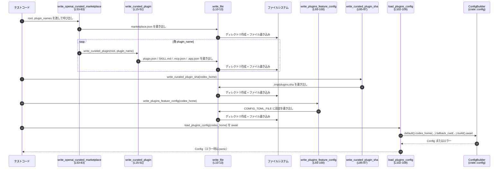

# core/src/plugins/test_support.rs

## 0. ざっくり一言

プラグイン機能に関連するテストで使うために、ファイルシステム上へプラグインのディレクトリ構造・マーケットプレイス設定・機能フラグ・SHA ファイルなどをまとめて書き出し、あわせて `Config` を読み込むユーティリティ関数群を提供するモジュールです（`core/src/plugins/test_support.rs:L8-109`）。

---

## 1. このモジュールの役割

### 1.1 概要

- プラグイン 1 件分のディレクトリ構造と設定ファイル一式を生成する関数を提供します（`write_curated_plugin`、`core/src/plugins/test_support.rs:L15-51`）。
- 複数プラグインを含む OpenAI curated marketplace 用の `marketplace.json` と各プラグインの内容を生成します（`write_openai_curated_marketplace`、`L53-83`）。
- プラグインの SHA ファイル、プラグイン機能を有効化する設定ファイル、`ConfigBuilder` を使った設定ロードを行います（`L85-109`）。
- すべての関数は副作用としてファイルシステムを操作し、エラーは `unwrap` / `expect` により panic として処理されます（例: `write_file` の `unwrap`、`L11-12`）。

### 1.2 アーキテクチャ内での位置づけ

- 下位レイヤーとして標準ライブラリの `std::fs` と `std::path::Path` に依存します（`L3-4`）。
- 上位の `crate::config::ConfigBuilder` / `CONFIG_TOML_FILE` を通じて設定ロードと設定ファイル位置を扱います（`L1-2, L93-99, L102-108`）。
- 親モジュールの `OPENAI_CURATED_MARKETPLACE_NAME` をマーケットプレイス JSON 内の `name` に使用します（`L6, L72-74`）。

主要な依存関係と呼び出し関係は次のようになります。

```mermaid
graph TD
    %% この図は core/src/plugins/test_support.rs:L8-109 の関数間関係を表します
    subgraph TestSupport[L8-109 test_support.rs]
        WF[write_file<br/>(L10-13)]
        WCP[write_curated_plugin<br/>(L15-51)]
        WOM[write_openai_curated_marketplace<br/>(L53-83)]
        WSHA[write_curated_plugin_sha<br/>(L85-87)]
        WSHAW[write_curated_plugin_sha_with<br/>(L89-91)]
        WFC[write_plugins_feature_config<br/>(L93-100)]
        LPC[load_plugins_config (async)<br/>(L102-109)]
    end

    WOM --> WF
    WCP --> WF
    WOM --> WCP
    WSHA --> WSHAW
    WSHAW --> WF
    WFC --> WF
    LPC --> CB[ConfigBuilder<br/>(crate::config)]
    WF --> FS[std::fs<br/>ファイルシステム]

    WFC -.-> CT[CONFIG_TOML_FILE<br/>(crate::config)]
    WOM -.-> OMN[OPENAI_CURATED_MARKETPLACE_NAME<br/>(super)]
```

### 1.3 設計上のポイント

- **ステートレスな設計**  
  すべての関数は引数のみを入力とし、内部に状態を保持しません。副作用はファイルシステムへの書き込みのみです（例: `write_file`、`L10-13`）。
- **ファイル書き込み処理の集中**  
  ディレクトリ作成とファイル書き込みは共通の `write_file` に集約されています（`L10-13`）。他の関数はこのヘルパーを通じて I/O を行います（例: `L17-18, L26-27, L30-31, L41-42, L69-71, L90, L94-95`）。
- **エラー処理方針（panic ベース）**  
  `fs::create_dir_all(...).unwrap()` と `fs::write(...).unwrap()` により I/O エラーはすべて panic になります（`L11-12`）。`ConfigBuilder::build().await` も `expect("config should load")` により失敗時に panic します（`L106-108`）。
- **非同期設定ロード**  
  設定ロードのみ `async fn` として定義され、外部の非同期ランタイム上から `await` する前提になっています（`load_plugins_config`、`L102-109`）。
- **テスト支援目的の命名**  
  ファイル名 `test_support.rs` や `TEST_CURATED_PLUGIN_SHA` という定数名から、テスト用ユーティリティであることが想定されますが、このチャンクだけでは実際の利用箇所は分かりません。

---

## 2. 主要な機能一覧

- プラグイン関連ファイルの基礎となる「ディレクトリ作成＋ファイル書き込み」処理（`write_file`）。
- 1 つのプラグインに必要な JSON / Markdown ファイル群の生成（`write_curated_plugin`）。
- OpenAI curated marketplace 用の `marketplace.json` と複数プラグインの生成（`write_openai_curated_marketplace`）。
- プラグイン SHA 情報の書き出し（`write_curated_plugin_sha` / `write_curated_plugin_sha_with`）。
- `CONFIG_TOML_FILE` に対応する設定ファイルでプラグイン機能を有効化（`write_plugins_feature_config`）。
- 上記で用意したディレクトリ・ファイルを前提とした `Config` のロード（`load_plugins_config`）。

### 2.1 コンポーネント一覧（関数・定数）

| 名称 | 種別 | 役割 / 用途 | 定義位置 |
|------|------|-------------|----------|
| `TEST_CURATED_PLUGIN_SHA` | `const &str` | テスト用の固定プラグイン SHA 値。`write_curated_plugin_sha` から SHA ファイル生成時に使用 | `core/src/plugins/test_support.rs:L8-8` |
| `write_file` | 関数 | 親ディレクトリを作成した上で指定パスに文字列を書き込む、共通ヘルパー | `core/src/plugins/test_support.rs:L10-13` |
| `write_curated_plugin` | 関数 | 指定されたプラグイン名のディレクトリ構造を作成し、`plugin.json` / `SKILL.md` / `.mcp.json` / `.app.json` を書き出す | `core/src/plugins/test_support.rs:L15-51` |
| `write_openai_curated_marketplace` | 関数 | `marketplace.json` を生成し、引数で渡されたすべてのプラグイン名について `write_curated_plugin` を呼び出す | `core/src/plugins/test_support.rs:L53-83` |
| `write_curated_plugin_sha` | 関数 | デフォルトのテスト用 SHA (`TEST_CURATED_PLUGIN_SHA`) を `.tmp/plugins.sha` に書き出すショートカット | `core/src/plugins/test_support.rs:L85-87` |
| `write_curated_plugin_sha_with` | 関数 | 任意の SHA 文字列を `.tmp/plugins.sha` に書き出す低レベル関数 | `core/src/plugins/test_support.rs:L89-91` |
| `write_plugins_feature_config` | 関数 | `CONFIG_TOML_FILE` に `[features]\nplugins = true\n` という内容を書き込み、プラグイン機能を有効化する設定ファイルを生成 | `core/src/plugins/test_support.rs:L93-100` |
| `load_plugins_config` | `async fn` | `ConfigBuilder` に `codex_home` と `fallback_cwd` を設定して `Config` を非同期に構築し、失敗時は panic する | `core/src/plugins/test_support.rs:L102-109` |

---

## 3. 公開 API と詳細解説

このファイル内の関数はいずれも `pub(crate)` で、クレート内のテストコードなどから利用される内部 API です。

### 3.1 型一覧（構造体・列挙体など）

このファイル内には独自の構造体・列挙体・トレイト定義はありません（`core/src/plugins/test_support.rs` 全体を確認）。

外部型として以下を利用しています:

- `std::path::Path`（ファイルパスの不変参照; `L4`）
- `crate::config::ConfigBuilder`（設定ビルダー; `L2, L102-108`）
- `crate::config::Config`（戻り値型; `L102`）

### 3.2 関数詳細

#### `write_file(path: &Path, contents: &str)`

**定義位置**

- `core/src/plugins/test_support.rs:L10-13`

**概要**

- 親ディレクトリをすべて作成したうえで、指定されたパスに文字列内容を書き込むヘルパー関数です（`L10-12`）。
- 他の関数はこの関数を通じてファイルシステムを操作します（例: `L17-18, L26-27, L30-31, L41-42, L69-71, L90, L94-95`）。

**引数**

| 引数名 | 型 | 説明 |
|--------|----|------|
| `path` | `&Path` | 書き込み対象ファイルのパス。`parent()` が `Some` を返す前提です（`L11`）。 |
| `contents` | `&str` | ファイルに書き込む UTF-8 文字列（`L12`）。 |

**戻り値**

- なし (`()` を暗黙に返します)。副作用として `path` にファイルを生成／上書きします。

**内部処理の流れ**

1. `path.parent()` で親ディレクトリを取得し、`expect("file should have a parent")` で `None` の場合に panic します（`L11`）。
2. `fs::create_dir_all` で親ディレクトリを再帰的に作成し、エラー時は `unwrap()` により panic します（`L11`）。
3. `fs::write(path, contents)` でファイルを書き込み、エラー時は `unwrap()` により panic します（`L12`）。

**Errors / Panics**

- `path.parent()` が `None` の場合（例: 空パスなど）`expect` により panic します（`L11`）。
- ディレクトリ作成やファイル書き込みに失敗した場合（権限不足・ディスクフルなど）、`unwrap()` により panic します（`L11-12`）。

**Edge cases（エッジケース）**

- `path` が空（`Path::new("")`）のように親ディレクトリを持たない場合: `parent()` が `None` となり panic します。
- 既にファイルやディレクトリが存在する場合:  
  - `create_dir_all` は既存ディレクトリがあっても成功するため、問題なく進みます。  
  - 既存ファイルは `fs::write` により上書きされます。
- 同じ `path` に対して並行に複数スレッド／タスクから呼び出された場合の挙動は OS 依存です。特別なロックなどはありません。

**使用上の注意点**

- エラーを `Result` として扱うのではなく、すべて panic で処理されるため、主にテスト用途に適した関数といえます。
- 非同期コンテキスト（`async fn` 内）から頻繁に呼ぶ場合、同期 I/O によるブロッキングでランタイムに影響する可能性があります。必要であれば `spawn_blocking` 等で隔離することが考えられますが、このファイルからはそのような利用パターンは分かりません。

---

#### `write_curated_plugin(root: &Path, plugin_name: &str)`

**定義位置**

- `core/src/plugins/test_support.rs:L15-51`

**概要**

- `root/plugins/<plugin_name>/` 以下に、プラグイン定義に必要な JSON / Markdown ファイルを一式生成します（`L16-50`）。
- 生成されるファイルは:
  - `.codex-plugin/plugin.json`（プラグインメタデータ; `L17-25`）
  - `skills/SKILL.md`（スキル定義; `L26-29`）
  - `.mcp.json`（MCP サーバー設定; `L30-40`）
  - `.app.json`（アプリコネクタ設定; `L41-50`）

**引数**

| 引数名 | 型 | 説明 |
|--------|----|------|
| `root` | `&Path` | プロジェクトルートや `codex_home` などの基準ディレクトリ。`plugins` ディレクトリがこの直下に作成されます（`L16`）。 |
| `plugin_name` | `&str` | プラグイン名。ディレクトリ名および JSON 内の `name` に埋め込まれます（`L16, L21`）。 |

**戻り値**

- なし (`()`); 副作用としてファイルとディレクトリを生成します。

**内部処理の流れ**

1. `root.join("plugins").join(plugin_name)` で `plugin_root` を構成します（`L16`）。
2. `plugin_root/.codex-plugin/plugin.json` に、`name` と固定の `description` を含む JSON を書き込みます（`L17-25`）。
3. `plugin_root/skills/SKILL.md` に、YAML フロントマター付きのサンプルスキル Markdown を書き込みます（`L26-29`）。
4. `plugin_root/.mcp.json` に、`sample-docs` という HTTP MCP サーバー設定を含む JSON を書き込みます（`L30-40`）。
5. `plugin_root/.app.json` に、`calendar` アプリコネクタ設定を含む JSON を書き込みます（`L41-50`）。
6. 各書き込みは `write_file` を通じて行われ、親ディレクトリが自動で作成されます（`L17, L26, L30, L41`）。

**Errors / Panics**

- 各 `write_file` 呼び出しにおいて、ディレクトリ作成／ファイル書き込みでエラーが発生すると panic します（`L17-18, L26-27, L30-31, L41-42` 経由で `L11-12`）。
- `root` や `plugin_name` が原因で不正なパス（例: 文字列長制限超過、権限のないディレクトリ）になった場合も同様です。

**Edge cases**

- `plugin_name` が空文字列のとき: `root/plugins/` 直下にファイル群が作成されます。JSON の `"name"` は空文字になります（`L16, L21`）。
- `plugin_name` に `..` などが含まれる場合:  
  `Path::join` はパスを正規化しないため、`root.join("plugins").join("../outside")` のように呼ばれると、`root` 外のディレクトリに書き込まれる可能性があります（`L16`）。呼び出し元が信頼できない入力をそのまま渡す場合には注意が必要です。
- 既に同名ファイルが存在している場合: 中身は上書きされます。

**使用上の注意点**

- テストで使う場合、`root` は一時ディレクトリなど、他のテストと干渉しない場所を指定するのが一般的です。
- セキュリティ上の観点から、もし実運用コードで再利用する場合は `plugin_name` によるディレクトリトラバーサルに注意が必要です（`L16` の `join` 連鎖）。

---

#### `write_openai_curated_marketplace(root: &Path, plugin_names: &[&str])`

**定義位置**

- `core/src/plugins/test_support.rs:L53-83`

**概要**

- `root/.agents/plugins/marketplace.json` に OpenAI curated marketplace 形式の JSON を書き出し、`plugin_names` に含まれる各プラグイン名のローカルプラグインエントリを列挙します（`L69-77`）。
- さらに、各プラグインについて `write_curated_plugin` を呼び出して、プラグインの中身を生成します（`L80-82`）。

**引数**

| 引数名 | 型 | 説明 |
|--------|----|------|
| `root` | `&Path` | マーケットプレイス設定と各プラグインディレクトリを配置する基準ディレクトリ（`L53, L69-71`）。 |
| `plugin_names` | `&[&str]` | マーケットプレイスに含めるプラグイン名のスライス。各要素に対してプラグインエントリとファイル群を生成します（`L54-56, L80-82`）。 |

**戻り値**

- なし (`()`); `marketplace.json` および各プラグインのファイル一式を生成します。

**内部処理の流れ**

1. `plugin_names.iter().map(...)` で、各プラグイン名を JSON オブジェクト文字列に変換します（`L54-66`）。  
   各オブジェクトは以下の形です（`L57-64`）:
   - `"name"`: プラグイン名
   - `"source"`: `{"source": "local", "path": "./plugins/<plugin_name>"}` （`OPENAI_CURATED_MARKETPLACE_NAME` はここでは使用されません）
2. `collect::<Vec<_>>().join(",\n")` で JSON オブジェクト列をカンマ区切りで連結し、`plugins` 配列部分の文字列を作成します（`L67-68`）。
3. `root/.agents/plugins/marketplace.json` に、`OPENAI_CURATED_MARKETPLACE_NAME` を `name` に持ち、`plugins` 配列に上記で構成した文字列を埋め込んだ JSON を書き出します（`L69-77`）。
4. 最後に `for plugin_name in plugin_names` で各プラグイン名に対して `write_curated_plugin(root, plugin_name)` を呼び出します（`L80-82`）。

**Errors / Panics**

- `write_file` 呼び出しにより、I/O エラーで panic する可能性があります（`L69-71` 経由で `L11-12`）。
- `write_curated_plugin` 内部の `write_file` でも同様です（`L80-82` 経由で `L17-18` など）。
- JSON 文字列生成自体はフォーマット文字列の展開のみのため、panic する可能性は低く（フォーマット文字列固定、`plugin_name` は `&str`）、ここからは追加のパニック条件は読み取れません。

**Edge cases**

- `plugin_names` が空スライスの場合:
  - `plugins` は空文字列になり、JSON 内の `"plugins": [\n\n  ]` のような、空配列に相当する表現になります（`L54-68, L75`）。
  - ループが 0 回のため、プラグインディレクトリは作成されません（`L80-82`）。
- `plugin_names` に同じ名前が複数含まれる場合:
  - `plugins` 配列には同じ `"name"` / `"path"` を持つオブジェクトが複数並びます（`L59-62`）。
  - `write_curated_plugin` が複数回呼ばれ、最後の呼び出しの書き込み内容が最終状態になります（`L80-82`）。
- `plugin_name` に `..` を含む場合:
  - `path: "./plugins/{plugin_name}"` の文字列自体はそのまま出力され、パス検証は行われません（`L62`）。
  - 実際のディレクトリ生成も `write_curated_plugin` の `root.join("plugins").join(plugin_name)` を通じて行われるため（`L16, L80-82`）、`..` によるディレクトリトラバーサルの可能性があります。

**使用上の注意点**

- `marketplace.json` の内容は文字列結合で組み立てているため（`L54-68, L69-77`）、JSON の正当性はフォーマット文字列に依存します。`plugin_name` や `OPENAI_CURATED_MARKETPLACE_NAME` に改行や引用符が含まれる場合、JSON として不正になる可能性があります。
- プラグイン名がユーザー入力に由来する場合は、ディレクトリトラバーサルや JSON インジェクションの観点で検証が必要です。このモジュール内では検証やエスケープは行われていません。

---

#### `write_curated_plugin_sha(codex_home: &Path)`

**定義位置**

- `core/src/plugins/test_support.rs:L85-87`

**概要**

- `.tmp/plugins.sha` にテスト用の固定 SHA (`TEST_CURATED_PLUGIN_SHA`) を書き出すショートカット関数です。内部で `write_curated_plugin_sha_with` を呼び出します（`L85-86`）。

**引数**

| 引数名 | 型 | 説明 |
|--------|----|------|
| `codex_home` | `&Path` | `.tmp/plugins.sha` を配置するベースディレクトリ（`L85-86`）。 |

**戻り値**

- なし (`()`); 副作用として `codex_home/.tmp/plugins.sha` を生成／上書きします。

**内部処理の流れ**

1. `write_curated_plugin_sha_with(codex_home, TEST_CURATED_PLUGIN_SHA)` を呼び出すだけの薄いラッパーです（`L85-86`）。

**Errors / Panics / Edge cases / 使用上の注意点**

- これらはすべて `write_curated_plugin_sha_with` に委譲されます。  

---

#### `write_curated_plugin_sha_with(codex_home: &Path, sha: &str)`

**定義位置**

- `core/src/plugins/test_support.rs:L89-91`

**概要**

- `.tmp/plugins.sha` に任意の SHA 文字列を 1 行として書き出す関数です（`L89-90`）。

**引数**

| 引数名 | 型 | 説明 |
|--------|----|------|
| `codex_home` | `&Path` | `.tmp/plugins.sha` を配置するベースディレクトリ（`L89-90`）。 |
| `sha` | `&str` | 書き込む SHA 文字列。末尾に改行が付与されて出力されます（`L90`）。 |

**戻り値**

- なし (`()`); `codex_home/.tmp/plugins.sha` の内容を上書きします。

**内部処理の流れ**

1. `codex_home.join(".tmp/plugins.sha")` でファイルパスを構成します（`L90`）。
2. `format!("{sha}\n")` で末尾に改行付きの文字列を生成します（`L90`）。
3. `write_file` を通じてファイルを書き込みます（`L90`）。

**Errors / Panics**

- `write_file` により、親ディレクトリ作成やファイル書き込みに失敗した場合は panic します（`L90` 経由で `L11-12`）。

**Edge cases**

- `sha` が空文字列の場合: 改行のみが書き込まれます（`L90`）。
- `codex_home` 直下に `.tmp` ディレクトリが存在しない場合: `write_file` が親ディレクトリを作成するため、自動的に `.tmp/` が生成されます（`L90` 経由で `L11`）。

**使用上の注意点**

- 複数回呼び出すと、前回の SHA は上書きされます。履歴を残す用途には向きません。
- SHA の内容は検証されず、そのまま書き込まれます。入力値の妥当性は呼び出し側で保証する必要があります。

---

#### `write_plugins_feature_config(codex_home: &Path)`

**定義位置**

- `core/src/plugins/test_support.rs:L93-100`

**概要**

- `codex_home.join(CONFIG_TOML_FILE)` に `[features]\nplugins = true\n` という内容の TOML 断片を書き出し、プラグイン機能を有効化する設定ファイルを生成します（`L94-99`）。

**引数**

| 引数名 | 型 | 説明 |
|--------|----|------|
| `codex_home` | `&Path` | 設定ファイルを置くベースディレクトリ。`CONFIG_TOML_FILE` は `crate::config` で定義された設定ファイル名です（`L93-95`）。 |

**戻り値**

- なし (`()`); 指定された設定ファイルを生成／上書きします。

**内部処理の流れ**

1. `codex_home.join(CONFIG_TOML_FILE)` で設定ファイルパスを構成します（`L94-95`）。
2. `r#"[features]\nplugins = true\n"#` という固定文字列を `write_file` で書き込みます（`L96-99`）。

**Errors / Panics**

- `write_file` によりディレクトリ作成／ファイル書き込み失敗時に panic します（`L94-95` 経由で `L11-12`）。

**Edge cases**

- 既存の設定ファイルがある場合: 内容は完全に上書きされます（`L94-99`）。他の設定セクションが失われる可能性があります。
- `CONFIG_TOML_FILE` の値自体はこのチャンクには現れません（`L1` のインポートのみ）。そのため、どのパスに書かれるかはここからは分かりません。

**使用上の注意点**

- 他のテストやコンポーネントが同じ `CONFIG_TOML_FILE` を共有している場合、上書きによる影響に注意が必要です。
- 設定内容が最小限であり、`[features]` セクションに `plugins = true` しか含まれないため、複雑な設定を必要とするシナリオでは別の方法で設定ファイルを準備する必要があります。

---

#### `load_plugins_config(codex_home: &Path) -> crate::config::Config`

**定義位置**

- `core/src/plugins/test_support.rs:L102-109`

**概要**

- `ConfigBuilder::default()` から構築したビルダーに `codex_home` と `fallback_cwd` を設定し、`build().await` で `Config` を生成する非同期関数です（`L102-107`）。
- 設定のロードに失敗した場合は `expect("config should load")` により panic します（`L108`）。

**引数**

| 引数名 | 型 | 説明 |
|--------|----|------|
| `codex_home` | `&Path` | `ConfigBuilder` の `codex_home` および `fallback_cwd` に渡すベースディレクトリ（`L103-105`）。 |

**戻り値**

- `crate::config::Config`  
  `ConfigBuilder::build()` によって構築された設定オブジェクトです（`L102-107`）。

**内部処理の流れ**

1. `ConfigBuilder::default()` でビルダーを生成します（`L103`）。
2. `.codex_home(codex_home.to_path_buf())` で `codex_home` を設定します（`L104`）。
3. `.fallback_cwd(Some(codex_home.to_path_buf()))` で、フォールバックのカレントディレクトリを `codex_home` に設定します（`L105`）。
4. `.build().await` で非同期に設定を構築します（`L106-107`）。
5. `.expect("config should load")` により、`build` が `Result::Err` を返した場合は panic し、`Ok` の場合は中身の `Config` を返します（`L108`）。

**Errors / Panics**

- `ConfigBuilder::build().await` がエラーを返した場合、`expect("config should load")` により panic します（`L106-108`）。  
  エラーの具体的な条件（設定ファイルが見つからない、パースエラー等）は、このチャンクだけからは分かりません。
- その他、内部でファイル I/O や環境変数参照などが行われている可能性がありますが、`ConfigBuilder` の実装はこのファイルには現れません。

**Edge cases**

- `codex_home` が存在しないディレクトリの場合:  
  `ConfigBuilder` がどのように扱うかは不明ですが、一般的には設定ファイルを見つけられずにエラーとなり、結果として panic する可能性があります。
- 非同期ランタイム外での利用:  
  `async fn` であるため、`tokio` や `async-std` 等のランタイム外から直接呼び出すことはできません。必ず `async` コンテキストで `.await` する必要があります。

**使用上の注意点**

- エラーが `Result` として返らず、panic になる設計であるため、テストでは「設定が必ずロードできる前提」を明示する用途に適しています。
- 実運用コードでの再利用を検討する場合は、`expect` を `?` に置き換えるなど、エラーを呼び出し元に返す形に変更する必要があるかもしれません。ただし、そのような変更はこのレポートの対象外です。

---

### 3.3 その他の関数

- このファイルには、上記 3.2 で説明した 7 つの関数以外の関数定義はありません（`core/src/plugins/test_support.rs` 全体を確認）。

---

## 4. データフロー

ここでは、テストコードがマーケットプレイスと複数プラグインを生成し、その後設定をロードする代表的なフローを示します。



この図から分かるポイント:

- すべてのファイル書き込みは `write_file` を経由して行われます（`L10-13`）。
- プラグイン関連ファイル群と設定ファイル、SHA ファイルが揃った状態で `load_plugins_config` により `Config` が構築されます（`L93-100, L102-109`）。
- エラーは途中で `unwrap` / `expect` による panic として停止するため、テストでは「セットアップに失敗したら即座にわかる」挙動になります。

---

## 5. 使い方（How to Use）

### 5.1 基本的な使用方法

テストコードから、このモジュールの関数を用いてプラグイン環境をセットアップし、設定をロードする一連の流れの例です。  
ここでは一時ディレクトリと `tokio` ランタイムを仮定した擬似コードです（`tokio` の利用自体は本ファイルには現れません）。

```rust
use std::path::Path;
use tempfile::tempdir; // 一時ディレクトリ作成用（クレートに追加する必要があります）

use crate::plugins::test_support::{
    write_openai_curated_marketplace,
    write_curated_plugin_sha,
    write_plugins_feature_config,
    load_plugins_config,
};

#[tokio::test] // 例として tokio ランタイムを使用
async fn test_plugins_integration() {
    // 一時ディレクトリを codex_home として使う                           // 独立したテスト用ディレクトリ
    let tmp = tempdir().unwrap();
    let codex_home = tmp.path();

    // プラグインとマーケットプレイスをセットアップ                      // marketplace.json とプラグイン群
    write_openai_curated_marketplace(
        codex_home,
        &["sample-plugin-a", "sample-plugin-b"],
    );

    // プラグイン機能を有効化する設定を書き出す                           // CONFIG_TOML_FILE に [features] セクションを書き込む
    write_plugins_feature_config(codex_home);

    // テスト用 SHA ファイルを書き出す                                    // .tmp/plugins.sha に固定 SHA を書き込む
    write_curated_plugin_sha(codex_home);

    // 設定を非同期にロードする                                            // load_plugins_config は async fn
    let config = load_plugins_config(codex_home).await;

    // 以降、config を使ったテストを行う                                   // ロードされた Config に対するアサーションなど
    assert!(config.features.plugins_enabled()); // 仮のメソッド名（実際の API は不明）
}
```

> `Config` の具体的な API（例: `features.plugins_enabled()`）はこのチャンクには現れないため、上記は説明のための仮コードです。

### 5.2 よくある使用パターン

1. **単一プラグインのみをセットアップする**

```rust
// 単一のプラグインだけを用意したい場合                             // marketplace.json を含めた環境を作る
write_openai_curated_marketplace(codex_home, &["single-plugin"]);

// Config のロードが不要なテストでは load_plugins_config を呼ばないこともある
```

1. **カスタム SHA を使ったテスト**

```rust
use crate::plugins::test_support::write_curated_plugin_sha_with;

let custom_sha = "feedfacefeedfacefeedfacefeedfacefeedface";
write_curated_plugin_sha_with(codex_home, custom_sha);
// .tmp/plugins.sha に custom_sha が 1 行だけ書き込まれる
```

1. **プラグイン機能だけを有効化して他は別の手段でセットアップする**

```rust
// features.plugins を true にした CONFIG_TOML_FILE だけ作りたい場合
write_plugins_feature_config(codex_home);

// プラグインディレクトリや marketplace.json は別のユーティリティや手作業で準備する
```

### 5.3 よくある間違い

```rust
use std::path::Path;

// 間違い例: 非 async コンテキストで load_plugins_config を呼び出す
fn bad_usage(codex_home: &Path) {
    // let config = load_plugins_config(codex_home); // コンパイルエラー: async fn の戻り値は Future
}

// 正しい例: async コンテキストで .await する
async fn good_usage(codex_home: &Path) {
    let config = load_plugins_config(codex_home).await;
}
```

```rust
// 間違い例: 親ディレクトリを持たない（空）Path を渡してしまう可能性
use std::path::Path;
use crate::plugins::test_support::write_file;

fn bad_path_usage() {
    let path = Path::new(""); // parent() が None になる可能性がある
    // write_file(path, "data"); // 実行すると panic の可能性
}

// 正しい例: 少なくともディレクトリを含むパスを渡す
fn good_path_usage() {
    let path = Path::new("dir/file.txt");
    write_file(path, "data");
}
```

### 5.4 使用上の注意点（まとめ）

- **エラー処理**  
  すべてのファイル I/O と設定ロードは `unwrap` / `expect` に依存しており、失敗時は panic します（`L11-12, L108`）。テストでは有用ですが、実運用コードへの転用には注意が必要です。
- **パス安全性**  
  `plugin_name` は `Path::join` や JSON 中の文字列としてそのまま使われます（`L16, L57-64`）。ユーザー入力を直接渡す場合、ディレクトリトラバーサルや JSON 破壊のリスクがあります。
- **同期 I/O と非同期処理**  
  `write_*` 系はすべて同期 I/O (`std::fs`) を使用します（`L3, L10-12`）。大量のプラグインを生成するテストを非同期ランタイム上で行う場合、ブロッキングによる影響に注意が必要です。
- **上書き挙動**  
  既存のファイル（`marketplace.json`, プラグインファイル群, 設定ファイル, `.tmp/plugins.sha`）は上書きされます（各 `write_file` 呼び出し、`L10-12`）。

---

## 6. 変更の仕方（How to Modify）

### 6.1 新しい機能を追加する場合

1. **新しいテスト用ファイルの生成を追加したい場合**

   - 例: プラグインごとに追加の設定ファイル `.extra.json` を作成したい場合。
   - `write_curated_plugin` に追記するのが自然です（`L15-51`）。
   - 手順:
     1. `plugin_root.join("...")` で新しいパスを作成するコードを追加します（`L16` のパターンを踏襲）。
     2. `write_file(&new_path, "content")` で書き込みます（`L17-18, L26-27` のパターンを踏襲）。
     3. 既存テストが新ファイルに依存していないことを確認し、新しいテストを追加します。

2. **マーケットプレイス JSON の形式を拡張したい場合**

   - `write_openai_curated_marketplace` の `format!` 文字列を更新します（`L57-64, L72-77`）。
   - 文字列連結で JSON を組み立てているため、構造を変える際はカンマの位置や改行に注意します。

3. **設定ロードの前後で追加処理を行いたい場合**

   - `load_plugins_config` に処理を挿入します（`L102-109`）。
   - `ConfigBuilder` の API を拡張する場合は、`crate::config` モジュール側の変更が必要ですが、そのファイルはこのチャンクには現れません。

### 6.2 既存の機能を変更する場合の注意点

- **ファイルパスの変更**

  - 例: `.tmp/plugins.sha` のパスを変更する場合、`write_curated_plugin_sha_with` の `codex_home.join` の引数を更新します（`L90`）。
  - 同時に、そのファイルを読み込む側のコード（このチャンクには現れません）も更新する必要があります。

- **JSON / Markdown 内容の変更**

  - `write_curated_plugin` や `write_openai_curated_marketplace` のフォーマット文字列は、テストが文字列一致で検証している可能性があります（`L20-23, L32-39, L43-49, L57-64, L72-77`）。
  - 変更後は当該テストを更新し、構造的に意味のある JSON / Markdown になっているか確認することが重要です。

- **エラー処理の変更**

  - panic ベースから `Result` ベースに変更する場合、戻り値型と呼び出し元のエラーハンドリングをすべて見直す必要があります。  
  - 特に `load_plugins_config` の `expect` を `?` に変更する場合、戻り値型を `Result<Config, Error>` とするなどの設計変更が伴います（`L102-109`）。

- **並行実行の考慮**

  - このモジュール内には明示的なロックや同期機構はありません。複数テストが同じ `codex_home` を共有してこれらの関数を呼ぶと、ファイル上書き競合が発生する可能性があります。  
  - テスト側で一時ディレクトリを分けるなどの工夫が必要です。

---

## 7. 関連ファイル

このモジュールと密接に関係する外部モジュール・定義は、インポートと参照から次のように読み取れます。

| パス / モジュール | 役割 / 関係 |
|------------------|------------|
| `crate::config` モジュール | `CONFIG_TOML_FILE` 定数と `ConfigBuilder` 型を提供し、`write_plugins_feature_config` での設定ファイルパス決定（`L1, L93-99`）と、`load_plugins_config` による設定構築（`L2, L102-108`）に利用されます。具体的なファイルパス（例: `core/src/config.rs` など）はこのチャンクからは分かりません。 |
| 親モジュール `super` | `OPENAI_CURATED_MARKETPLACE_NAME` を提供し、`write_openai_curated_marketplace` が生成する `marketplace.json` の `"name"` フィールドとして使用されます（`L6, L72-74`）。`OPENAI_CURATED_MARKETPLACE_NAME` がどのファイルで定義されているかは、このチャンクには現れません。 |

このレポートは `core/src/plugins/test_support.rs`（`L1-109`）内の情報のみに基づいており、他ファイルの実装詳細については言及していません。
