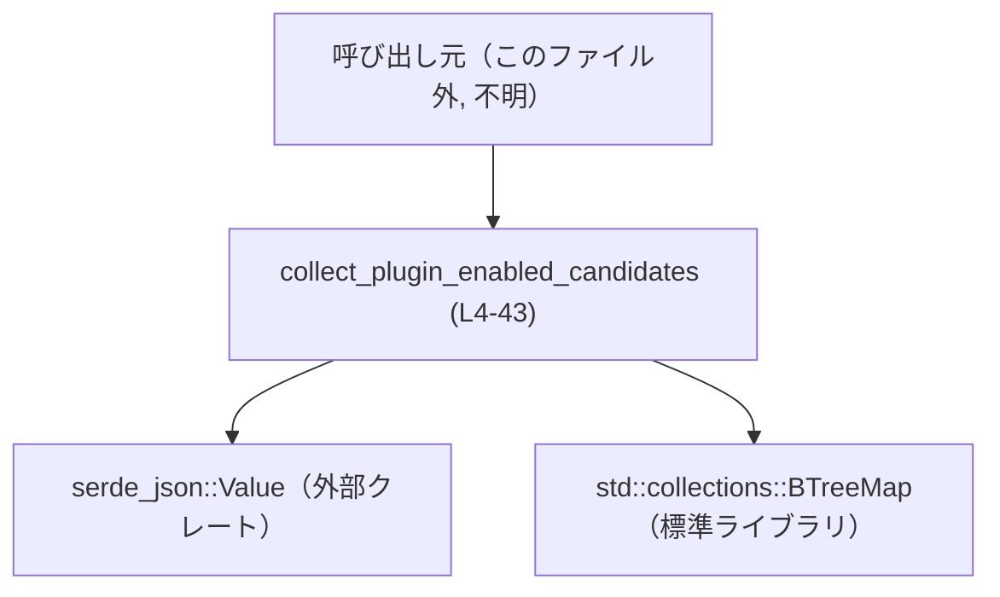
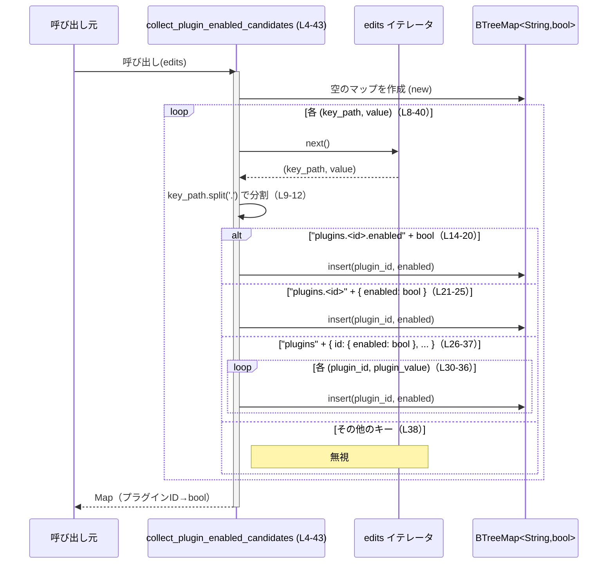
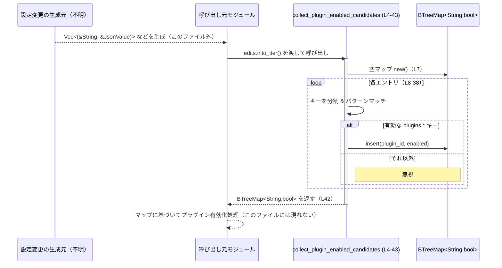

core/src/plugins/toggles.rs

---

## 0. ざっくり一言

設定変更（キーと JSON 値のペア）の一覧から、`plugins.<plugin_id>.enabled` に相当する情報だけを抜き出し、プラグイン ID → 有効フラグ（bool）のマップを作るユーティリティ関数を提供するモジュールです（core/src/plugins/toggles.rs:L4-43）。

---

## 1. このモジュールの役割

### 1.1 概要

- このモジュールは、「設定変更のストリームのうち、プラグインの有効／無効を表すものだけを集約する」という問題を解決するために存在し、`collect_plugin_enabled_candidates` 関数を提供します（core/src/plugins/toggles.rs:L4-43）。
- 入力は「キー文字列と `serde_json::Value` のペアのイテレータ」で、キーのパターンに応じて `BTreeMap<String, bool>`（プラグイン ID → 有効フラグ）を構築します（core/src/plugins/toggles.rs:L4-6, L8-38）。

### 1.2 アーキテクチャ内での位置づけ

このチャンクから分かるのは、次の依存関係だけです。

- 外部から `collect_plugin_enabled_candidates` が呼ばれる（呼び出し元はこのファイルには現れません）。
- `serde_json::Value` と `std::collections::BTreeMap` を利用します（core/src/plugins/toggles.rs:L1-2）。

これを簡略な依存関係図で表すと次のようになります。



呼び出し元がどのモジュールか、どのようなライフサイクルで呼ばれるかは、このチャンクには現れません。

### 1.3 設計上のポイント

コードから読み取れる設計上の特徴は次のとおりです。

- **純粋関数的な設計**  
  - グローバルな状態を持たず、入力イテレータからローカルな `BTreeMap` を構築して返すだけです（core/src/plugins/toggles.rs:L4-7, L40-42）。
- **キーのパターンマッチによる分岐**  
  - `"plugins.<plugin_id>.enabled"`・`"plugins.<plugin_id>"`・`"plugins"` の3パターンを `Vec<String>` のスライスパターンマッチで判別します（core/src/plugins/toggles.rs:L13-38）。
- **防御的な JSON 取り扱い**  
  - `value.is_boolean()` / `as_bool` や `as_object` を使い、型が期待通りでない場合は無視することで、パースエラーではなく「スキップ」で処理します（core/src/plugins/toggles.rs:L15-18, L21-27, L30-36）。
- **最後の書き込みが優先されるマップ構造**  
  - `BTreeMap::insert` によって、同じプラグイン ID への複数回の挿入では最後の値が残るため、「同じプラグインに対する最後の設定が有効になる」という振る舞いになります（core/src/plugins/toggles.rs:L7, L18-19, L23-24, L35-36; テスト core/src/plugins/toggles.rs:L82-98）。
- **順序づけられた結果**  
  - `BTreeMap` を使うため、戻り値のマップはキー（プラグイン ID）の昇順に並びます（core/src/plugins/toggles.rs:L2, L7, L42）。テストでも `BTreeMap::from([...])` を用いて順序を比較しています（core/src/plugins/toggles.rs:L47-50, L72-79）。

---

## 2. コンポーネント一覧（インベントリー）

このファイル内で定義されている主なコンポーネントを一覧にします。

| 名前 | 種別 | 公開範囲 | 役割 / 用途 | 根拠 |
|------|------|----------|-------------|------|
| `collect_plugin_enabled_candidates` | 関数 | `pub`（クレート外からも利用可能） | キーと JSON 値のイテレータから、プラグイン ID → 有効フラグのマップを収集する | core/src/plugins/toggles.rs:L4-43 |
| `tests` モジュール | モジュール | `cfg(test)` 下（テストビルド時のみ） | 関数の振る舞い（キーの各パターンと「最後の書き込みが優先される」性質）を検証する | core/src/plugins/toggles.rs:L45-100 |

このファイル内に新たな構造体・列挙体・トレイト定義は存在しません（core/src/plugins/toggles.rs:L1-100）。

---

## 3. 公開 API と詳細解説

### 3.1 型一覧（構造体・列挙体など）

このファイル内で新しく定義されている公開型はありません。利用している主な外部型は次のとおりです。

| 名前 | 種別 | 定義元 | 役割 / 用途 | 根拠 |
|------|------|--------|-------------|------|
| `JsonValue` | 型エイリアス（= `serde_json::Value`） | `serde_json` クレート | JSON 値全般を表す共通型 | core/src/plugins/toggles.rs:L1 |
| `BTreeMap<K, V>` | 構造体 | `std::collections` | ソートされたキーに対して値を保持する連想配列 | core/src/plugins/toggles.rs:L2, L7, L42, L49-50 |

### 3.2 関数詳細

#### `collect_plugin_enabled_candidates<'a>(edits: impl Iterator<Item = (&'a String, &'a JsonValue)>) -> BTreeMap<String, bool>`

**概要**

- 入力として「キー文字列と JSON 値の参照」のイテレータを受け取り、その中からプラグインの有効／無効設定に関わるものだけを抽出し、`plugin_id: String` をキー、`enabled: bool` を値とする `BTreeMap` を返します（core/src/plugins/toggles.rs:L4-7, L40-42）。
- 対象となるキーは `"plugins.<plugin_id>.enabled"`・`"plugins.<plugin_id>"`・`"plugins"` の3パターンです（core/src/plugins/toggles.rs:L13-38）。

**引数**

| 引数名 | 型 | 説明 | 根拠 |
|--------|----|------|------|
| `edits` | `impl Iterator<Item = (&'a String, &'a JsonValue)>` | 設定変更（キー文字列と JSON 値）のペアを順に返すイテレータ。キーはドット区切りのパス形式として扱われます。 | core/src/plugins/toggles.rs:L4-6, L8 |

- ライフタイム `'a` は、イテレータが返すキーと値の参照のライフタイムを表しており、関数内ではその参照から所有権を持つ `String` にクローンして使います（core/src/plugins/toggles.rs:L10-12, L18-19, L23-24, L35-36）。

**戻り値**

- 型: `BTreeMap<String, bool>`（core/src/plugins/toggles.rs:L6, L7, L42）。
- 意味:
  - キー: プラグイン ID（文字列）。`"plugins.<plugin_id>.enabled"` などのキー文字列から、`plugin_id` 部分だけを取り出したものです（core/src/plugins/toggles.rs:L14-15, L21, L26, L30）。
  - 値: ブール値。`true` ならプラグインを有効、`false` なら無効にする候補として解釈できます（テストの期待値から読み取れます: core/src/plugins/toggles.rs:L72-79, L95-98）。

**内部処理の流れ**

処理のフローをステップごとに見ると次のようになります。

1. **結果用マップの初期化**  
   - `let mut pending_changes = BTreeMap::new();` により、空の `BTreeMap<String, bool>` を作成します（core/src/plugins/toggles.rs:L7）。

2. **イテレータから 1 件ずつ `(key_path, value)` を取り出す**  
   - `for (key_path, value) in edits { ... }` で全てのエントリを順次処理します（core/src/plugins/toggles.rs:L8-40）。

3. **キー文字列の分解**  
   - `key_path.split('.')` によって `"."` 区切りで分割し、各セグメントを `String` に変換して `Vec<String>` に収集します（core/src/plugins/toggles.rs:L9-12）。

4. **セグメント数と内容によるパターンマッチ**（core/src/plugins/toggles.rs:L13-38）  
   1. `["plugins", plugin_id, "enabled"]` かつ `value` が bool の場合  
      - 条件: `plugins == "plugins" && enabled == "enabled" && value.is_boolean()`（core/src/plugins/toggles.rs:L14-16）。  
      - 動作: `value.as_bool()` で bool を取り出し、`pending_changes.insert(plugin_id.clone(), enabled)` を実行します（core/src/plugins/toggles.rs:L17-19）。
   2. `["plugins", plugin_id]` の場合  
      - 条件: `plugins == "plugins"`（core/src/plugins/toggles.rs:L21）。  
      - 動作: `value.get("enabled").and_then(JsonValue::as_bool)` で JSON オブジェクト中の `"enabled"` フィールドを bool として取得し、存在する場合のみ挿入します（core/src/plugins/toggles.rs:L21-24）。
   3. `["plugins"]` の場合  
      - 条件: `plugins == "plugins"`（core/src/plugins/toggles.rs:L26）。  
      - 動作:
        - `value.as_object()` で JSON オブジェクトかどうかを確認し、オブジェクトでなければスキップします（core/src/plugins/toggles.rs:L27-29）。
        - 各 `(plugin_id, plugin_value)` について、`plugin_value.get("enabled").and_then(JsonValue::as_bool)` によって `"enabled"` が bool で存在するものだけを挿入します（core/src/plugins/toggles.rs:L30-36）。
   4. 上記以外のキーは無視  
      - `_ => {}` で何もせずスキップします（core/src/plugins/toggles.rs:L38）。

5. **マップを返す**  
   - すべてのエントリ処理後、`pending_changes` をそのまま返します（core/src/plugins/toggles.rs:L40-42）。

この処理をシーケンス図で表すと以下のようになります。



**Examples（使用例）**

1. テストに近い基本的な使用例（直接キー・テーブル・トップレベルの3パターン）

```rust
use std::collections::BTreeMap;                   // BTreeMapを利用するためにインポート
use serde_json::json;                             // JSONリテラルマクロ
use crate::plugins::toggles::collect_plugin_enabled_candidates; // 関数をインポート

fn example() {
    // 設定の「差分」を表すようなキーと値のペアの配列を用意する
    let edits = [
        (&"plugins.sample@test.enabled".to_string(), &json!(true)),          // 直接 bool
        (
            &"plugins.other@test".to_string(),
            &json!({ "enabled": false, "ignored": true }),                   // オブジェクト中の enabled
        ),
        (
            &"plugins".to_string(),
            &json!({
                "nested@test": { "enabled": true },                           // テーブル形式
                "skip@test": { "name": "skip" },                              // enabled がないので無視される
            }),
        ),
    ];

    // into_iter() で (&String, &Value) のイテレータに変換して渡す
    let candidates = collect_plugin_enabled_candidates(edits.into_iter());

    // 結果: プラグインID → 有効フラグ
    let expected = BTreeMap::from([
        ("nested@test".to_string(), true),
        ("other@test".to_string(), false),
        ("sample@test".to_string(), true),
    ]);

    assert_eq!(candidates, expected);
}
```

上の例は、1つ目のテストと同じ振る舞いを示しています（core/src/plugins/toggles.rs:L52-80）。

1. 同じプラグイン ID に対する複数回の書き込み

```rust
use std::collections::BTreeMap;
use serde_json::json;
use crate::plugins::toggles::collect_plugin_enabled_candidates;

fn last_write_wins_example() {
    let edits = [
        (&"plugins.sample@test.enabled".to_string(), &json!(true)),    // 最初は true
        (
            &"plugins.sample@test".to_string(),
            &json!({ "enabled": false }),                              // 後から false に上書き
        ),
    ];

    let candidates = collect_plugin_enabled_candidates(edits.into_iter());

    // 同じプラグインIDへの重複書き込みでは最後の値が残る
    let expected = BTreeMap::from([("sample@test".to_string(), false)]);
    assert_eq!(candidates, expected);
}
```

これは2つ目のテストと同じで、「最後の書き込みが優先される」ことを確認できます（core/src/plugins/toggles.rs:L82-98）。

**Errors / Panics**

- この関数自体は `Result` を返さず、エラー型は使用していません（core/src/plugins/toggles.rs:L4-6, L42）。
- `serde_json::Value` からの変換はすべて `Option` で扱い、期待どおりの型でない場合は「無視」するだけです（core/src/plugins/toggles.rs:L17-18, L21-24, L27-36）。
- 明示的に `panic!` を呼び出している箇所はありません（core/src/plugins/toggles.rs:L1-43）。
- パニックがあり得るとすれば、標準ライブラリの内部要因（メモリ不足など）に限られます。`split`, `collect`, `BTreeMap::insert` など通常利用でパニックしない API を使用しています。

**エッジケース（代表的なケース）**

- **キーが `"plugins"` でない場合**  
  - すべて `_ => {}` の分岐で無視され、マップには何も追加されません（core/src/plugins/toggles.rs:L13-14, L38）。
- **キーが `"plugins"` で `"enabled"` を持たないプラグイン**  
  - 例: `"plugins"` に対する値で `"skip@test": { "name": "skip" }` のようなエントリはスキップされます（core/src/plugins/toggles.rs:L30-36, L62-66）。
- **`"plugins.<plugin_id>"` の値がオブジェクトだが `enabled` がない／boolでない**  
  - `value.get("enabled").and_then(JsonValue::as_bool)` が `None` を返し、挿入されません（core/src/plugins/toggles.rs:L21-24）。
- **`"plugins.<plugin_id>.enabled"` の値が bool でない場合**  
  - ガード `value.is_boolean()` で除外され、そのエントリは無視されます（core/src/plugins/toggles.rs:L15-16）。
- **同じ `plugin_id` に対する複数エントリ**  
  - どのパターンでも `BTreeMap::insert` は同じキーに対して値を上書きするため、「最後に走査されたエントリ」の値が残ります（core/src/plugins/toggles.rs:L7, L18-19, L23-24, L35-36; テスト core/src/plugins/toggles.rs:L82-98）。
- **空のイテレータ**  
  - ループが 1 度も実行されず、空の `BTreeMap` が返ります（core/src/plugins/toggles.rs:L7-8, L40-42）。

**使用上の注意点**

- **入力フォーマットの前提**  
  - キーは `"plugins"` から始まるドット区切りパスとして解釈されます。それ以外の形式は無視されます（core/src/plugins/toggles.rs:L13-15, L21, L26, L38）。
- **JSON の構造**  
  - `"plugins.<plugin_id>"` または `"plugins"` に対する値はオブジェクトであることが期待されています。そうでない場合は無視されます（core/src/plugins/toggles.rs:L21-24, L27-36）。
- **ライフタイムと所有権**  
  - 引数は `&String` と `&JsonValue` の参照ですが、関数内部で `plugin_id.clone()` により `String` を複製し、返り値は完全に所有権を持つ `BTreeMap<String, bool>` です（core/src/plugins/toggles.rs:L10-12, L18-19, L23-24, L35-36, L42）。  
    そのため、呼び出し元はイテレータや元データのライフタイムを意識せずに、戻り値のマップを独立して利用できます。
- **並行性**  
  - 関数は外部状態に依存せず、引数以外のミュータブルな共有状態を持ちません（core/src/plugins/toggles.rs:L4-43）。  
    同じ `edits` イテレータを複数スレッドから同時に使うような誤用をしない限り、この関数自体は複数スレッドから安全に並行呼び出しできます（各呼び出しがそれぞれ独立のイテレータと `BTreeMap` を持つため）。
- **エラー報告**  
  - 不正な JSON や想定外のキーに対しては「無視」する設計であり、何がスキップされたかは戻り値には現れません。  
    観測性（ログなど）はこのファイルには実装されていません（core/src/plugins/toggles.rs:L1-43）。

### 3.3 その他の関数

このファイルには補助的な非公開関数は存在せず、テスト内でのみ `collect_plugin_enabled_candidates` が直接呼ばれています（core/src/plugins/toggles.rs:L45-100）。

---

## 4. データフロー

代表的なシナリオとして、「設定変更イベントのリストから、プラグインの有効／無効設定を集約する」流れを示します。

1. 他モジュールが設定変更（キー文字列 + JSON 値）の一覧（またはストリーム）を用意する（呼び出し元はこのファイルには現れません）。
2. そのイテレータを `collect_plugin_enabled_candidates` に渡す（core/src/plugins/toggles.rs:L4-6）。
3. 関数内部で、キーの形に応じて `BTreeMap<String, bool>` を構築する（core/src/plugins/toggles.rs:L8-38）。
4. 呼び出し元は、返ってきたマップを使って、各プラグインの有効／無効状態を適用できます（呼び出し側の処理はこのファイルには現れません）。

これをシーケンス図で表現します。



---

## 5. 使い方（How to Use）

### 5.1 基本的な使用方法

典型的な利用フローは次のようになります。

1. 設定変更を表すキーと JSON 値のペアを準備する。
2. `.into_iter()` でイテレータにして `collect_plugin_enabled_candidates` に渡す。
3. 戻ってきた `BTreeMap<String, bool>` を使って、プラグインの有効／無効を更新する。

```rust
use std::collections::BTreeMap;
use serde_json::json;
use crate::plugins::toggles::collect_plugin_enabled_candidates;

fn apply_plugin_toggles() {
    // 例として固定配列だが、実際には設定差分などから作られる想定
    let edits = vec![
        (&"plugins.a.enabled".to_string(), &json!(true)),
        (&"plugins.b".to_string(), &json!({ "enabled": false })),
    ];

    let candidates = collect_plugin_enabled_candidates(edits.into_iter());

    for (plugin_id, enabled) in &candidates {
        // ここでプラグインマネージャなどに適用する（実際の適用処理はこのファイルにはありません）
        println!("plugin {plugin_id}: enabled = {enabled}");
    }
}
```

### 5.2 よくある使用パターン

- **設定の「差分」からの集約**  
  - テストコードのように、複数の書き込みが混在する差分から `last write wins` で集約する用途（core/src/plugins/toggles.rs:L52-80, L82-98）。
- **JSON フルダンプからの初期構築**  
  - `"plugins"` キーにプラグイン一覧が入っている形を想定し、初期状態の `plugin_id -> enabled` マップを構築する用途（core/src/plugins/toggles.rs:L26-37, L62-66）。

### 5.3 よくある間違い（起こり得る誤用）

```rust
use serde_json::json;
use crate::plugins::toggles::collect_plugin_enabled_candidates;

// 誤り例: "plugins" で始まらないキーを使っている
let edits = [
    (&"plugin.sample.enabled".to_string(), &json!(true)), // "plugins" ではない
];

let candidates = collect_plugin_enabled_candidates(edits.into_iter());
// candidates は空のままになる（キーが "_ => {}" にマッチして無視される）
```

```rust
// 正しい例: "plugins" で始まり、期待されるパターンに従う
let edits = [
    (&"plugins.sample.enabled".to_string(), &json!(true)),
];

let candidates = collect_plugin_enabled_candidates(edits.into_iter());
// "sample" という plugin_id で true が登録される
```

### 5.4 使用上の注意点（まとめ）

- キーは必ず `"plugins"` で始め、`.` 区切りのパターンに従う必要があります（core/src/plugins/toggles.rs:L13-15, L21, L26）。
- `"plugins.<plugin_id>"` の値や `"plugins"` の値は JSON オブジェクトである必要があり、`"enabled"` が bool でなければマップに反映されません（core/src/plugins/toggles.rs:L21-24, L27-36）。
- 不正なエントリや無視されたエントリについて、関数は何も知らせないため、必要であれば呼び出し元で検証やログ出力を行う必要があります（core/src/plugins/toggles.rs:L13-38）。
- 並行に利用する場合でも、各スレッドが独立した `edits` と返り値のマップを扱う限り、データ競合は発生しません（core/src/plugins/toggles.rs:L4-43）。

---

## 6. 変更の仕方（How to Modify）

### 6.1 新しい機能を追加する場合

例えば「`disabled_reason` など、enabled 以外のメタ情報も同時に収集したい」といった拡張を行う場合、コードから読み取れる範囲では次のようなステップが考えられます。

1. **戻り値の型を拡張する**  
   - 現在は `BTreeMap<String, bool>` 固定なので、必要に応じて別の構造体やタプルを値とする `BTreeMap` に変更する必要があります（core/src/plugins/toggles.rs:L6-7, L42）。
2. **パターンマッチ部分を拡張する**  
   - `match segments.as_slice()` の各分岐内で `"enabled"` 以外のキーを読むロジックを追加することになります（core/src/plugins/toggles.rs:L13-37）。
3. **テストの追加**  
   - 既存テストにならい、新しいフィールドが期待どおりに収集されるかを検証するテストケースを `mod tests` 内に追加するのが自然です（core/src/plugins/toggles.rs:L45-100）。

### 6.2 既存の機能を変更する場合

- **キー形式の変更**  
  - 例えば `"plugins"` 以外のプレフィックスを許容したい場合は、`match` の各ガード（`plugins == "plugins"`）を変更する必要があります（core/src/plugins/toggles.rs:L14-15, L21, L26）。
  - 影響範囲として、既存テストがすべてこの前提に依存しているため、テストの修正も必要です（core/src/plugins/toggles.rs:L56, L58, L62, L86, L88）。
- **「最後の書き込みが優先される」挙動の変更**  
  - 今は `BTreeMap::insert` による上書きで実現されています（core/src/plugins/toggles.rs:L7, L18-19, L23-24, L35-36）。履歴を残すなど挙動を変える場合は、`Vec` など別の構造を使う必要があります。
  - 2番目のテストがこの仕様を前提としているため、変更後はこのテストの期待値を更新する必要があります（core/src/plugins/toggles.rs:L82-98）。

---

## 7. 関連ファイル

このチャンクには、他のファイルやモジュールへの具体的な参照（`mod` や `use crate::...` など）は、`collect_plugin_enabled_candidates` をインポートするテスト以外に登場しません（core/src/plugins/toggles.rs:L47）。そのため：

| パス | 役割 / 関係 |
|------|------------|
| （不明） | `collect_plugin_enabled_candidates` の実際の呼び出し元や、プラグインマネージャなどの周辺コンポーネントは、このチャンクには現れません。 |

テストコードはこのファイル内の `mod tests` にまとまっており、関数の仕様（対応するキー形式と、最後の書き込みが優先される性質）を保証する役割を果たしています（core/src/plugins/toggles.rs:L45-100）。
