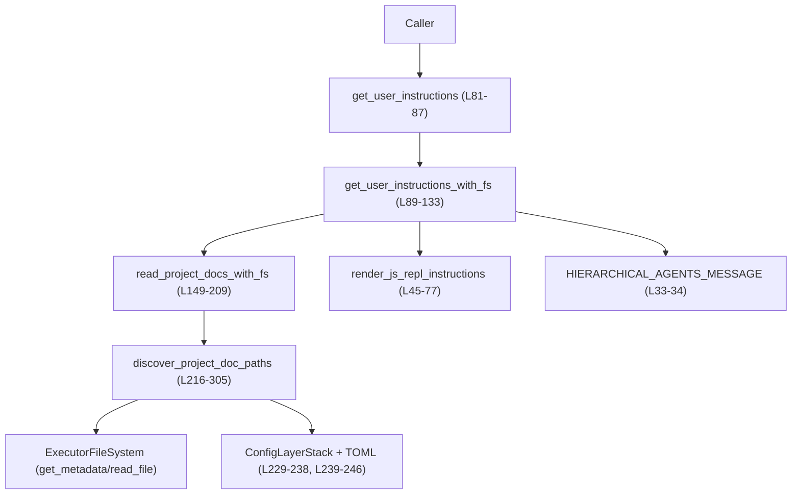
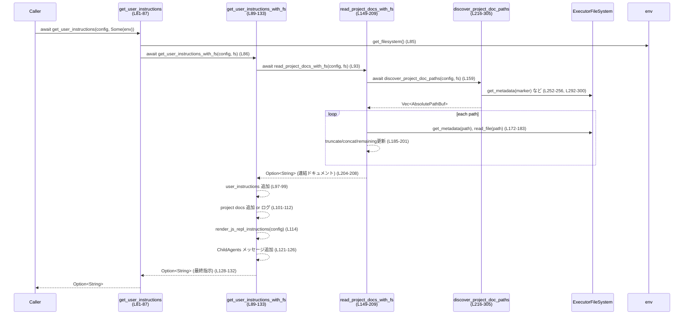

# core/src/project_doc.rs コード解説

## 0. ざっくり一言

プロジェクトルートからカレントディレクトリまでの階層にある `AGENTS.md` などのドキュメントを探索・連結し、`Config::user_instructions` や JS REPL 用の説明文と合わせて「ユーザー向け指示テキスト」を組み立てるモジュールです（`project_doc.rs:L1-16`, `L79-83`, `L89-133`）。

---

## 1. このモジュールの役割

### 1.1 概要

- プロジェクト内の階層的なドキュメント (`AGENTS.md` 等) を探索し、最大バイト数の制限付きで読み込んで連結します（`read_project_docs_with_fs`、`discover_project_doc_paths`。`project_doc.rs:L149-209`, `L216-305`）。
- `Config::user_instructions`、プロジェクトドキュメント、JS REPL のガイド、階層エージェント用メッセージを 1 本の文字列にまとめます（`get_user_instructions_with_fs`。`project_doc.rs:L89-133`）。
- プロジェクトルートの判定には `project_root_markers` 設定と `.git` などのデフォルトマーカーを利用します（`project_doc.rs:L229-246`, `L248-266`）。

### 1.2 アーキテクチャ内での位置づけ

主な依存関係は次のとおりです。

- `Config` から:
  - `cwd`（探索開始ディレクトリ）`L224`
  - `project_doc_max_bytes`（最大バイト数制限）`L153`, `L220`
  - `project_doc_fallback_filenames`（追加候補ファイル名）`L307-318`
  - `config_layer_stack`（ルートマーカー解釈用設定レイヤ）`L229-238`
  - `features`（JS REPL / ChildAgents 用フラグ）`L46`, `L68-71`, `L121`
  - `user_instructions` `L97`
- `Environment` / `ExecutorFileSystem` から:
  - ファイルシステムアクセス（`get_filesystem`, `get_metadata`, `read_file`）`L85`, `L145`, `L172-183`, `L252-256`, `L292-300`
- 設定解析ユーティリティ:
  - `project_root_markers_from_config`, `default_project_root_markers`, `merge_toml_values` `L20-22`, `L229-245`



### 1.3 設計上のポイント

- **責務分割**
  - ドキュメントの読み込み／連結は `read_project_docs_with_fs`（`L149-209`）。
  - パス探索は `discover_project_doc_paths`（`L216-305`）。
  - JS REPL 説明文の組み立ては `render_js_repl_instructions`（`L45-77`）。
  - それらをユーザー指示として統合するのが `get_user_instructions_with_fs`（`L89-133`）。
- **I/O とエラーハンドリング**
  - ファイル I/O はすべて `ExecutorFileSystem` トレイト経由で行われます（`L24-25`, `L172-183`, `L252-256`, `L292-300`）。
  - プロジェクトドキュメントの読み込み API (`read_project_docs*`, `discover_project_doc_paths`) は `io::Result` を返し、I/O エラーを呼び出し元に伝播します（`L141-147`, `L149-152`, `L216-219`）。
  - ユーザー指示統合 API (`get_user_instructions*`) は I/O エラーを `tracing::error!` でログに残しつつ握りつぶし、`Option` で有無のみを返します（`L101-112`）。
- **安全性**
  - `unsafe` ブロックは存在せず、UTF-8 変換は `String::from_utf8_lossy` で行い、不正なバイト列によるパニックを避けています（`L197`）。
  - バイト予算計算は `saturating_sub` を用いてアンダーフローを防いでいます（`L200-201`）。
- **非同期・並行性**
  - 主要な処理は `async fn` として定義され、非同期ファイル I/O を行います（`L81`, `L89`, `L141`, `L149`, `L216`）。
  - 共有ミュータブル状態はなく、関数は（渡される `Config` / `Environment` がスレッドセーフであれば）スレッド間で独立して安全に利用できる構造です。

### 1.4 コンポーネントインベントリー

| 名前 | 種別 | 公開範囲 | 役割 / 用途 | 定義位置 |
|------|------|----------|-------------|----------|
| `HIERARCHICAL_AGENTS_MESSAGE` | `&'static str` 定数 | `pub(crate)` | 階層エージェントに関する説明文を外部ファイルから埋め込む（`include_str!`） | `core/src/project_doc.rs:L33-34` |
| `DEFAULT_PROJECT_DOC_FILENAME` | `&'static str` 定数 | `pub` | デフォルトのプロジェクトドキュメントファイル名（`"AGENTS.md"`） | `L36-37` |
| `LOCAL_PROJECT_DOC_FILENAME` | `&'static str` 定数 | `pub` | ローカル上書き用優先ファイル名（`"AGENTS.override.md"`） | `L38-39` |
| `PROJECT_DOC_SEPARATOR` | `&'static str` 定数 | モジュール内 (`const`) | `Config::user_instructions` とプロジェクトドキュメントを区切るセパレータ | `L41-43` |
| `render_js_repl_instructions` | 関数 | 非公開 (`fn`) | JS REPL 機能が有効な場合に、JS REPL の使い方セクションを生成 | `L45-77` |
| `get_user_instructions` | 関数 | `pub(crate)` | `Environment` からファイルシステムを取得し、ユーザー指示文字列全体を構築 | `L79-87` |
| `get_user_instructions_with_fs` | 関数 | `pub(crate)` | 任意の `ExecutorFileSystem` 実装を用いてユーザー指示文字列を構築 | `L89-133` |
| `read_project_docs` | 関数 | `pub` | `Environment` 経由でプロジェクトドキュメントを読み込み、連結テキストを返す | `L135-147` |
| `read_project_docs_with_fs` | 関数 | 非公開 (`async fn`) | 任意のファイルシステム上でプロジェクトドキュメントを探索・読み込み・連結 | `L149-209` |
| `discover_project_doc_paths` | 関数 | `pub` | プロジェクトルートからカレントディレクトリまでの各階層でドキュメントファイルのパスを列挙 | `L211-305` |
| `candidate_filenames` | 関数 | 非公開 (`fn`) | 探索対象の候補ファイル名リスト（上書き・デフォルト・フォールバック）を構築 | `L306-321` |
| `tests` | モジュール | 非公開 (`mod`) | このモジュール専用のテスト（別ファイル `project_doc_tests.rs`） | `L323-325` |

---

## 2. 主要な機能一覧

- プロジェクトドキュメント探索: `discover_project_doc_paths` でルート〜カレントディレクトリ間の候補ファイルパスを検出（`L216-305`）。
- プロジェクトドキュメント読み込み・連結: `read_project_docs_with_fs` / `read_project_docs` でサイズ制限付きの読み込みと連結（`L149-209`, `L141-147`）。
- ユーザー指示の統合: `get_user_instructions_with_fs` / `get_user_instructions` で Config ベースの指示、プロジェクトドキュメント、JS REPL ガイド、階層エージェントメッセージを一つの文字列に統合（`L89-133`, `L81-87`）。
- JS REPL の利用ガイド生成: `render_js_repl_instructions` で JS REPL 機能の有無に応じたセクションを生成（`L45-77`）。
- ドキュメント候補ファイル名の決定: `candidate_filenames` で優先順位付きのファイル名リストを構築（`L306-321`）。

---

## 3. 公開 API と詳細解説

### 3.1 型一覧（構造体・列挙体など）

このファイル内で新たに定義されている構造体・列挙体はありません。  
利用している主な外部型のみ列挙します（詳細定義はこのチャンクには現れません）。

| 名前 | 種別 | 役割 / 用途 | 定義位置（参照のみ） |
|------|------|-------------|-----------------------|
| `Config` | 構造体（推定） | プロジェクトの各種設定（`cwd`, `project_doc_max_bytes`, `project_doc_fallback_filenames`, `config_layer_stack`, `features`, `user_instructions` など）を保持 | `use crate::config::Config;` `L18` |
| `Environment` | 構造体（推定） | 実行環境情報。`get_filesystem()` で `ExecutorFileSystem` を返す | `L24`, `L85`, `L145` |
| `ExecutorFileSystem` | トレイト（推定） | `get_metadata`, `read_file` などの非同期ファイルシステム操作を提供 | `L25`, `L172-183`, `L252-256`, `L292-300` |
| `AbsolutePathBuf` | 構造体 | 絶対パス表現。`try_from` や `join` により安全なパス操作を行う | `L27`, `L224-227`, `L251`, `L258`, `L268-283`, `L287-295` |
| `ConfigLayerSource` | 列挙体（推定） | 設定レイヤの種別。`Project` レイヤを除外してルートマーカー設定を決めるために利用 | `L23`, `L234` |
| `TomlValue` | 列挙体 | TOML 値。複数設定レイヤのマージに利用 | `L30`, `L229-239` |

> これら型のフィールド・メソッドの詳細は、他ファイルに定義されており、このチャンクからは分かりません。

---

### 3.2 関数詳細（7件）

#### `render_js_repl_instructions(config: &Config) -> Option<String>`

**定義位置**: `core/src/project_doc.rs:L45-77`

**概要**

- JS REPL 機能 (`Feature::JsRepl`) が有効なときに、Node ベースの JavaScript REPL の使い方を Markdown セクションとして生成します（`L45-47`, `L50-66`, `L68-75`）。
- `Feature::JsReplToolsOnly` が追加で有効な場合は、ツール呼び出しに関する制約の説明を追加します（`L68-71`）。

**引数**

| 引数名 | 型 | 説明 |
|--------|----|------|
| `config` | `&Config` | 有効な機能フラグ (`features.enabled(...)`) を判定するために利用します（`L46`, `L68`）。 |

**戻り値**

- `Some(String)`: JS REPL 機能が有効な場合、その詳細な利用ガイド（Markdown）を返します。
- `None`: `Feature::JsRepl` が無効な場合（`L46-48`）。

**内部処理の流れ**

1. `config.features.enabled(Feature::JsRepl)` を確認し、無効なら `None` を返す（`L45-48`）。
2. 見出し `"## JavaScript REPL (Node)\n"` から始まる文字列を作成（`L50`）。
3. REPL の利用方法やヘルパー関数、画像送信方法、トップレベルバインディングや import の扱いなど、多数の箇条書きを `section.push_str` で追記（`L51-66`）。
4. `Feature::JsReplToolsOnly` が有効な場合は、ツール呼び出し制限の説明を追加（`L68-71`）。
5. `process.stdout` 等への直接アクセス回避に関する注意文を追加（`L74`）。
6. `Some(section)` を返す（`L76`）。

**Examples（使用例）**

この関数はモジュール内部でのみ利用され、通常は `get_user_instructions_with_fs` を通じて間接的に呼び出されます（`L114`）。

```rust
// JS REPL セクションだけを個別に生成したいテスト用の例
fn js_repl_doc(config: &Config) -> Option<String> {
    // feature フラグ設定に応じて Some/None が返る
    render_js_repl_instructions(config) // 非公開関数のため同一モジュール内でのみ呼び出し可能
}
```

**Errors / Panics**

- この関数内では I/O を行わず、`unwrap` や `expect` も使用していないため、通常の利用で panic するコードはありません。
- 戻り値は常に `Option<String>` であり、エラーは表現しません。

**Edge cases（エッジケース）**

- `Feature::JsRepl` 無効: 常に `None` を返し、文字列を生成しません（`L46-48`）。
- `Feature::JsRepl` 有効だが `Feature::JsReplToolsOnly` 無効: ツール呼び出し制約の説明のみ省かれたセクションとなります（`L68-71` 分岐）。

**使用上の注意点**

- 機能フラグに依存するため、`Config.features` の状態が期待どおりになっていることが前提です。
- 出力は Markdown フォーマット前提の長文文字列であり、UI 側で追加改行などを行う場合は重複に注意が必要です。

---

#### `get_user_instructions(config: &Config, environment: Option<&Environment>) -> Option<String>`

**定義位置**: `core/src/project_doc.rs:L81-87`

**概要**

- `Environment` からファイルシステムを取得し、`get_user_instructions_with_fs` を呼び出して最終的なユーザー向け指示文字列を取得します（`L85-86`）。
- `Environment` が `None` の場合は、即座に `None` を返します（`L85` の `?` 演算子）。

**引数**

| 引数名 | 型 | 説明 |
|--------|----|------|
| `config` | `&Config` | ユーザー指示や機能フラグ、ドキュメント設定などを含む設定。 |
| `environment` | `Option<&Environment>` | 実行環境。`Some` の場合にのみ `get_filesystem()` を呼び出します（`L85`）。 |

**戻り値**

- `Some(String)`: `environment` が `Some` かつ、何らかの指示文（`Config::user_instructions`、プロジェクトドキュメント、JS REPL ガイド、階層エージェントメッセージ）が生成された場合。
- `None`: `environment` が `None` の場合、または全ての情報源が空で何も組み立てられない場合。

**内部処理の流れ**

1. `environment?` により、`environment` が `None` の場合は即座に `None` を返す（`L85`）。
2. `environment.get_filesystem()` で `ExecutorFileSystem` を取得（`L85`）。
3. `get_user_instructions_with_fs(config, fs.as_ref()).await` を呼び出し、その結果をそのまま返す（`L86`）。

**Examples（使用例）**

```rust
use std::io;
use crate::project_doc::get_user_instructions;

async fn print_instructions(env: &Environment, config: &Config) -> io::Result<()> {
    // Environment を Some で渡す
    if let Some(text) = get_user_instructions(config, Some(env)).await {
        println!("{text}");
    } else {
        println!("No user instructions available.");
    }
    Ok(())
}
```

**Errors / Panics**

- この関数自体は `Option` を返すのみで `Result` を使わず、I/O エラーは内部でログに出るだけで呼び出し元には伝播しません（エラー処理は `get_user_instructions_with_fs` 内 `L101-112`）。
- panic を誘発するコードはありません。

**Edge cases（エッジケース）**

- `environment == None`: たとえ `config.user_instructions` がセットされていても **必ず `None` が返る** 点に注意が必要です（`L85`）。
- `Config` 側に一切の情報がない・特徴フラグも無効: 内部的に空文字列となり、`None` が返ります（`L128-132`）。

**使用上の注意点**

- `Environment` が必須であること（`None` では何も返さない）を前提条件として扱う必要があります。
- I/O エラーを検知して処理したい場合には、この関数ではなく `read_project_docs` など `Result` を返す API を併用する必要があります。

---

#### `get_user_instructions_with_fs(config: &Config, fs: &dyn ExecutorFileSystem) -> Option<String>`

**定義位置**: `core/src/project_doc.rs:L89-133`

**概要**

- プロジェクトドキュメント、`Config::user_instructions`、JS REPL ガイド、階層エージェントメッセージを統合し、1 本の文字列として返します（`L93-127`）。
- プロジェクトドキュメントの読み込みエラーは `tracing::error!` でログに出しつつ、結果は `Option` の有無にのみ反映します（`L101-112`）。

**引数**

| 引数名 | 型 | 説明 |
|--------|----|------|
| `config` | `&Config` | 指示文や機能フラグ、プロジェクトドキュメント設定を含む。 |
| `fs` | `&dyn ExecutorFileSystem` | プロジェクトドキュメントを読むための抽象ファイルシステム。 |

**戻り値**

- `Some(String)`: 1 つ以上の情報源（`user_instructions`, プロジェクトドック, JS REPL セクション, 階層エージェントメッセージ）が有効な場合、その連結結果。
- `None`: どの情報源も利用できない場合。

**内部処理の流れ**

1. `read_project_docs_with_fs(config, fs).await` でプロジェクトドキュメントを読み込む（`L93`）。
2. `output` を空文字列で初期化（`L95`）。
3. `config.user_instructions.clone()` が `Some` なら、`output` に追加（`L97-99`）。
4. `project_docs` に対して:
   - `Ok(Some(docs))`: `output` が空でなければ `PROJECT_DOC_SEPARATOR` を挟み、`docs` を追加（`L101-107`）。
   - `Ok(None)`: 何もしない（`L108`）。
   - `Err(e)`: `tracing::error!` でログ出力し、`output` は変更しない（`L109-111`）。
5. `render_js_repl_instructions(config)` が `Some(section)` なら、必要に応じて空行 (`"\n\n"`) を挟んで追加（`L114-119`）。
6. `config.features.enabled(Feature::ChildAgentsMd)` が真なら、さらに空行を挟んで `HIERARCHICAL_AGENTS_MESSAGE` を追加（`L121-126`）。
7. `output` が空なら `None`、そうでなければ `Some(output)` を返す（`L128-132`）。

**Examples（使用例）**

テストや特殊なファイルシステムを使う場合に、この関数を直接呼び出すことが想定できます。

```rust
async fn build_instructions_with_custom_fs(
    config: &Config,
    fs: &dyn ExecutorFileSystem,
) -> Option<String> {
    get_user_instructions_with_fs(config, fs).await
}
```

**Errors / Panics**

- プロジェクトドキュメント探索・読み込み中の I/O エラーは `read_project_docs_with_fs` から `Err` として返されますが、ここでは `error!` ログに出力されるだけで、呼び出し元には `None` として扱われる可能性があります（`L101-112`）。
- panic を誘発するコードは使用していません。

**Edge cases（エッジケース）**

- `project_doc_max_bytes == 0`: `read_project_docs_with_fs` が `Ok(None)` を返すため、プロジェクトドキュメントは一切追加されません（`L153-157`）。
- `user_instructions` もプロジェクトドキュメントも JS REPL も ChildAgents も全て無効: `output` が空のままになり、`None` が返ります（`L128-132`）。
- エラー発生: I/O エラーでドキュメント読み込みに失敗しても、既に `user_instructions` や JS REPL セクションがあれば、それらのみが返されます。

**使用上の注意点**

- エラーをアプリケーションレベルで処理したい場合、この関数単体の戻り値 (`Option`) からはエラー情報が得られないため、ログ (`tracing::error!`) を併用する前提になります。
- 非同期関数のため、呼び出し側には非同期ランタイム（例: Tokio）が必要です。

---

#### `read_project_docs(config: &Config, environment: &Environment) -> io::Result<Option<String>>`

**定義位置**: `core/src/project_doc.rs:L141-147`

**概要**

- `Environment` から `ExecutorFileSystem` を取得し、`read_project_docs_with_fs` を呼び出す薄いラッパーです（`L145-146`）。
- プロジェクトドキュメントの読み込みと連結の結果を `io::Result<Option<String>>` として返します。

**引数**

| 引数名 | 型 | 説明 |
|--------|----|------|
| `config` | `&Config` | プロジェクトドキュメント関連の設定を含む。 |
| `environment` | `&Environment` | 利用可能なファイルシステムを提供します。 |

**戻り値**

- `Ok(Some(String))`: 一つ以上のドキュメントが見つかり、連結結果が得られた場合（`L204-208`）。
- `Ok(None)`: ドキュメントが見つからない、あるいは空だった場合（`L155-162`, `L203-205`）。
- `Err(io::Error)`: ファイルシステムアクセス中のエラー。`read_project_docs_with_fs` から伝播（`L159`, `L172-177`, `L179-183`）。

**内部処理の流れ**

1. `environment.get_filesystem()` でファイルシステムを取得（`L145`）。
2. `read_project_docs_with_fs(config, fs.as_ref()).await` を呼び出し、その `Result` をそのまま返す（`L146`）。

**Examples（使用例）**

```rust
use std::io;
use crate::project_doc::read_project_docs;

async fn load_project_docs(env: &Environment, config: &Config) -> io::Result<()> {
    match read_project_docs(config, env).await? {
        Some(text) => println!("Project docs:\n{text}"),
        None => println!("No project docs found."),
    }
    Ok(())
}
```

**Errors / Panics**

- I/O エラーは `Err(io::Error)` として呼び出し元に伝播します。
- panic を起こすコードは含まれていません。

**Edge cases（エッジケース）**

- `config.project_doc_max_bytes == 0`: `Ok(None)` が返却されます（`L153-157`）。
- `Environment.get_filesystem()` の実装がエラーを返す可能性については、このチャンクには現れません。

**使用上の注意点**

- エラー情報を扱いたい場合には、こちらの関数を利用するのが適切です（`get_user_instructions` 系ではエラーが `Option` に隠蔽されます）。
- 非同期処理であるため、非同期ランタイムの中で利用する必要があります。

---

#### `read_project_docs_with_fs(config: &Config, fs: &dyn ExecutorFileSystem) -> io::Result<Option<String>>`

**定義位置**: `core/src/project_doc.rs:L149-209`

**概要**

- 任意の `ExecutorFileSystem` 上でプロジェクトドキュメントファイルを探索し、最大サイズ制限 (`project_doc_max_bytes`) のもとで読み込み・連結します（`L153-201`）。
- I/O エラーは `io::Result` として呼び出し元に伝播します。

**引数**

| 引数名 | 型 | 説明 |
|--------|----|------|
| `config` | `&Config` | `project_doc_max_bytes` などの設定を提供（`L153`）。 |
| `fs` | `&dyn ExecutorFileSystem` | メタデータ確認とファイル読み込みに使用（`L172-183`）。 |

**戻り値**

- `Ok(Some(String))`: 1 個以上のドキュメントが非空で読み込まれた場合（`L197-201`, `L204-208`）。
- `Ok(None)`:
  - `project_doc_max_bytes == 0` の場合（`L153-157`）。
  - 探索でパスが見つからない場合（`L159-162`）。
  - 読み込めたファイルがすべて空白のみの場合（`L197-201`, `L203-205`）。
- `Err(io::Error)`: `discover_project_doc_paths` や `get_metadata` / `read_file` で発生したエラーの一部（`L159`, `L172-177`, `L179-183`）。

**内部処理の流れ**

1. `max_total = config.project_doc_max_bytes` を取得し、0 の場合は `Ok(None)` を返す（`L153-157`）。
2. `discover_project_doc_paths(config, fs).await?` でパス一覧を取得し、空なら `Ok(None)`（`L159-162`）。
3. `remaining` を `max_total` で初期化し、空の `parts` ベクタを用意（`L164-165`）。
4. 各パス `p` について:
   - `remaining == 0` ならループ終了（`L168-170`）。
   - `fs.get_metadata(&p)` でメタデータを取得し、ファイルでなければスキップ、`NotFound` もスキップ、それ以外のエラーは即 `Err` を返す（`L172-177`）。
   - `fs.read_file(&p)` で内容をバイト列として取得し、`NotFound` はスキップ、それ以外のエラーは `Err`（`L179-183`）。
   - 読み込んだデータ長を `size` として保存し（`L184`）、`size > remaining` の場合には `data.truncate(remaining as usize)` で切り詰める（`L185-187`）。
   - 元の `size` が `remaining` を超えていた場合には `tracing::warn!` でログを出す（`L189-195`）。
   - `String::from_utf8_lossy(&data)` で UTF-8（不正バイトは置換）として文字列化し（`L197`）、空白のみでないなら `parts` に追加し、`remaining` から `data.len()` を `saturating_sub` で減算（`L198-201`）。
5. `parts` が空なら `Ok(None)`、そうでなければ `parts.join("\n\n")` を `Some` で返す（`L204-208`）。

**Examples（使用例）**

```rust
async fn read_docs_with_custom_fs(
    config: &Config,
    fs: &dyn ExecutorFileSystem,
) -> std::io::Result<Option<String>> {
    read_project_docs_with_fs(config, fs).await
}
```

**Errors / Panics**

- `discover_project_doc_paths` が返すエラー、`get_metadata` / `read_file` の `io::Error` は、そのまま呼び出し元に伝播します（`?` と `return Err(err)`、`L159`, `L172-177`, `L179-183`）。
- UTF-8 変換は `from_utf8_lossy` を使っているため、不正なバイト列でも panic しません（`L197`）。
- `saturating_sub` を用いることで、`remaining` の減算時にアンダーフローしません（`L200-201`）。

**Edge cases（エッジケース）**

- `project_doc_max_bytes == 0`: ドキュメント探索も行わず `Ok(None)` を返します（`L153-157`）。
- ファイルが見つからない:
  - `discover_project_doc_paths` が空リストを返し `Ok(None)` になります（`L159-162`）。
  - `get_metadata` / `read_file` で `NotFound` が返ったファイルはスキップされます（`L175-176`, `L181-182`）。
- 非 UTF-8 データ:
  - `from_utf8_lossy` により代替文字に置換されつつ読み込みが続きます（`L197`）。
- `remaining` より大きなファイル:
  - メモリ上には一度全体を読み込んだ後に `truncate` している点に注意が必要です（`L179-187`）。
  - ログで警告が出ます（`L189-195`）。

**使用上の注意点**

- 最大バイト数制限は返却文字列の合計ではなく、「各ファイルを丸ごと読んだ後に truncate」しているため、大きなファイルに対しては一時的に `max_total` を超えるメモリを使う可能性があります。
- 読み込み順は `discover_project_doc_paths` が返す順序（プロジェクトルートから cwd へ向かう順）であり、これを前提に構成されます（`L216-283`）。

---

#### `discover_project_doc_paths(config: &Config, fs: &dyn ExecutorFileSystem) -> io::Result<Vec<AbsolutePathBuf>>`

**定義位置**: `core/src/project_doc.rs:L216-305`

**概要**

- `Config.cwd` から始めて親ディレクトリを遡り、`project_root_markers` に基づいてプロジェクトルートを決定します（`L224-227`, `L229-246`, `L248-266`）。
- プロジェクトルートから cwd までの各ディレクトリで、`AGENTS.override.md`, `AGENTS.md`, 設定されたフォールバック名の順にドキュメントファイルを探索します（`L287-295`, `L306-321`）。
- 見つかったファイルパスをプロジェクトルート→cwd の順序で返します（`L268-283`, `L287-304`）。

**引数**

| 引数名 | 型 | 説明 |
|--------|----|------|
| `config` | `&Config` | `cwd`, `project_doc_max_bytes`, `project_doc_fallback_filenames`, `config_layer_stack` などを提供。 |
| `fs` | `&dyn ExecutorFileSystem` | ルートマーカーの存在確認 (`get_metadata`) およびファイルの存在確認に使用。 |

**戻り値**

- `Ok(Vec<AbsolutePathBuf>)`: 発見されたドキュメントファイルの絶対パス。順序はルートから cwd へ向けて（`L268-283`, `L287-304`）。
- `Ok(empty vec)`: `project_doc_max_bytes == 0` またはファイルが一切見つからない場合（`L220-222`, `L287-304`）。
- `Err(io::Error)`: パス正規化やメタデータ取得等で発生した I/O エラー（`L225-227`, `L251-256`, `L292-300`）。

**内部処理の流れ**

1. `project_doc_max_bytes == 0` なら空ベクタで即返却（`L220-222`）。
2. `dir = config.cwd.clone()` を開始ディレクトリとし、`normalize_path` に成功すれば正規化（`L224-227`）。
3. TOML 値 `merged` を空のテーブルで初期化し（`L229`）、`config.config_layer_stack.get_layers(...)` で取得したレイヤのうち `ConfigLayerSource::Project` 以外の設定を `merge_toml_values` でマージ（`L230-238`）。
4. `project_root_markers_from_config(&merged)` でルートマーカーリストを取得し、未設定または不正な場合にはデフォルト（`default_project_root_markers`）を用いる（`L239-246`）。
5. `project_root_markers` が空でなければ、`dir` の祖先ディレクトリを順に探索し、マーカーいずれかを含む最初のディレクトリを `project_root` として決定（`L247-266`）。
6. `project_root` がある場合は、`dir` から `root` までの各ディレクトリを配列 `dirs` に詰めて逆順にし（ルートから cwd 順）、ない場合は `dirs = vec![dir]` とする（`L268-285`）。
7. `candidate_filenames(config)` で候補ファイル名一覧を作成（`L287-288`, `L306-321`）。
8. 各ディレクトリ `d` について候補ファイル名を順にチェックし、`fs.get_metadata(&candidate)` で存在かつ `is_file` であれば `found` に追加し、そのディレクトリの探索を打ち切る（`L289-299`）。
9. 最終的な `found` を `Ok(found)` で返す（`L304`）。

**Examples（使用例）**

```rust
async fn list_doc_paths(
    config: &Config,
    fs: &dyn ExecutorFileSystem,
) -> std::io::Result<Vec<AbsolutePathBuf>> {
    discover_project_doc_paths(config, fs).await
}
```

**Errors / Panics**

- 正規化したパスから `AbsolutePathBuf::try_from` への変換失敗時に `io::Error` 相当のエラーが返る可能性があります（`L225-227`, `L251`, `L258`）。
- `fs.get_metadata` で `NotFound` 以外のエラーが起きると即座に `Err` が返されます（`L252-256`, `L292-300`）。
- panic を発生させるコードは含まれていません。

**Edge cases（エッジケース）**

- `project_root_markers` が空: 祖先探索は行われず、`cwd` のみを対象とします（`L247-248`, `L268-285`）。
- マーカーがどこにも存在しない: `project_root` は `None` のままで、`cwd` のみを探索します（`L247-266`, `L283-285`）。
- `project_doc_fallback_filenames` に空文字列が含まれる: `candidate_filenames` 内で無視されます（`L311-315`）。
- 同じファイル名がフォールバックとデフォルト名の両方に設定されている: `candidate_filenames` 内の `names.contains` で重複が排除されます（`L316-317`）。

**使用上の注意点**

- ルートマーカーの解釈にはプロジェクトレイヤ以外の設定レイヤのみが使われるため（`L234-237`）、プロジェクト固有の設定からルートを変えたい場合には対応していません。
- パス探索は単純な親ディレクトリの辿りであり、シンボリックリンクの扱いや複雑なマルチプロジェクト構成などは考慮していないことが前提です。

---

#### `candidate_filenames<'a>(config: &'a Config) -> Vec<&'a str>`

**定義位置**: `core/src/project_doc.rs:L306-321`

**概要**

- ドキュメント探索時に利用する候補ファイル名のリストを構築します。
- `LOCAL_PROJECT_DOC_FILENAME`（`AGENTS.override.md`）を最優先、その次に `DEFAULT_PROJECT_DOC_FILENAME`（`AGENTS.md`）、さらに `Config::project_doc_fallback_filenames` から重複なしで追加します（`L307-318`）。

**引数**

| 引数名 | 型 | 説明 |
|--------|----|------|
| `config` | `&Config` | `project_doc_fallback_filenames` の参照を提供。 |

**戻り値**

- 探索順序に従ったファイル名スライスの `Vec`。

**内部処理の流れ**

1. `Vec::with_capacity(2 + config.project_doc_fallback_filenames.len())` で容量を確保（`L307-308`）。
2. `LOCAL_PROJECT_DOC_FILENAME` を追加（`L309`）。
3. `DEFAULT_PROJECT_DOC_FILENAME` を追加（`L310`）。
4. `config.project_doc_fallback_filenames` を順に走査し、空文字列はスキップ、既に `names` に含まれているものもスキップし、それ以外を追加（`L311-318`）。
5. `names` を返す（`L319-320`）。

**Examples（使用例）**

```rust
fn dump_candidates(config: &Config) {
    let names = candidate_filenames(config);
    for name in names {
        println!("Candidate filename: {name}");
    }
}
```

**Errors / Panics**

- この関数内で I/O は行われず、panic を誘発するコードもありません。

**Edge cases（エッジケース）**

- `project_doc_fallback_filenames` が空: 候補は `["AGENTS.override.md", "AGENTS.md"]` の 2 つのみとなります。
- フォールバックに `""` が含まれている: 空文字列は無視されます（`L313-315`）。
- フォールバックに `"AGENTS.md"` など既存と重複する名前が含まれる: `names.contains` により追加されません（`L316-317`）。

**使用上の注意点**

- 返却されるのは借用文字列スライス (`&str`) のベクタであり、`Config` のライフタイムに依存します。
- この関数は探索順序のポリシーを一元的に表現しているため、ドキュメント探索の優先度を変える場合はここを変更する必要があります。

---

### 3.3 その他の関数

- すべての関数を上記で詳細解説したため、この節に追加の関数はありません。

---

## 4. データフロー

### 4.1 代表的なシナリオ: ユーザー指示文字列の取得

このシナリオでは、呼び出し元が `get_user_instructions` を通じて、設定・プロジェクトドキュメント・JS REPL ガイド・階層エージェントメッセージを統合した指示文字列を取得します。



この図は `core/src/project_doc.rs:L81-209` の流れを表しています。

---

## 5. 使い方（How to Use）

### 5.1 基本的な使用方法

#### 5.1.1 プロジェクトドキュメントの読み込み

```rust
use std::io;
use crate::project_doc::read_project_docs;

async fn show_docs(env: &Environment, config: &Config) -> io::Result<()> {
    // プロジェクトルート〜cwd の AGENTS 系ファイルを探索して連結した結果を得る
    match read_project_docs(config, env).await? {
        Some(docs) => println!("=== Project docs ===\n{docs}"),
        None => println!("No project docs found."),
    }
    Ok(())
}
```

#### 5.1.2 ユーザー指示文字列の取得

```rust
use crate::project_doc::get_user_instructions;

async fn show_instructions(env: &Environment, config: &Config) {
    // 環境を Some で渡すことが重要（L85）
    if let Some(instructions) = get_user_instructions(config, Some(env)).await {
        println!("=== User instructions ===\n{instructions}");
    } else {
        println!("No instructions available.");
    }
}
```

### 5.2 よくある使用パターン

- **テストでの利用**:
  - `ExecutorFileSystem` を実装したモックを用意し、`get_user_instructions_with_fs` や `read_project_docs_with_fs` を直接呼び出すことで、I/O のないテストが可能です（`L89-93`, `L149-152`）。
- **ドキュメントパスだけを知りたい場合**:
  - 実際にはファイルを読み込まず、`discover_project_doc_paths` を呼び出してドキュメントの存在位置のみを取得できます（`L216-219`）。

```rust
async fn debug_paths(config: &Config, fs: &dyn ExecutorFileSystem) -> std::io::Result<()> {
    let paths = discover_project_doc_paths(config, fs).await?;
    for p in paths {
        println!("Doc path: {}", p.display());
    }
    Ok(())
}
```

### 5.3 よくある間違い

```rust
// 間違い例: Environment を渡さない
async fn wrong_usage(config: &Config) {
    // environment == None のため、常に None になる（L85）
    let instructions = get_user_instructions(config, None).await;
    assert!(instructions.is_none());
}

// 正しい例: Environment を Some で渡す
async fn correct_usage(env: &Environment, config: &Config) {
    let instructions = get_user_instructions(config, Some(env)).await;
    // Config 側設定に応じて Some/None
}
```

```rust
// 間違い例: project_doc_max_bytes を 0 に設定したまま docs を期待する
config.project_doc_max_bytes = 0;
// → read_project_docs* は常に Ok(None) を返す（L153-157, L220-222）
```

### 5.4 使用上の注意点（まとめ）

- **前提条件**
  - ユーザー指示取得 (`get_user_instructions*`) には有効な `Environment` / `ExecutorFileSystem` が必要です（`L85`, `L93`）。
  - ドキュメント探索には `cwd` が適切に設定されている必要があります（`L224-227`）。
- **エラー処理**
  - `read_project_docs*` / `discover_project_doc_paths` は `io::Result` を返し、I/O エラーを呼び出し元に伝播します（`L141-147`, `L149-152`, `L216-219`）。
  - `get_user_instructions*` はエラーをログ出力のみにとどめ、戻り値は `Option` で有無のみを示します（`L101-112`）。
- **並行性**
  - すべての非同期関数は共有ミュータブル状態を持たないため、同一プロセス内で複数タスクから呼び出しても競合しません。
  - 実際のスレッド安全性は渡される `Config` / `Environment` / `ExecutorFileSystem` の実装に依存します（このチャンクには詳細は現れません）。
- **文字コード**
  - ドキュメントはバイナリとして読み込まれ、UTF-8 変換時に不正バイトは置換されます（`String::from_utf8_lossy`、`L197`）。完全なバイト忠実性が必要な用途には不向きです。
- **サイズ制御**
  - `project_doc_max_bytes` は返却する合計文字列の上限ではなく、「読み込み後に truncate する上限」です（`L153-157`, `L185-187`）。

---

## 6. 変更の仕方（How to Modify）

### 6.1 新しい機能を追加する場合

- **追加のドキュメントソースを統合したい場合**
  1. 新しいドキュメント取得関数を別モジュールまたは同モジュールに追加。
  2. `get_user_instructions_with_fs` 内で `project_docs` に続けてその結果を組み込む処理を追加する（`L101-119` あたり）。
  3. 必要に応じてセパレータや見出しを定義するための定数を追加する（`PROJECT_DOC_SEPARATOR` のような形式、`L41-43`）。

- **新しいルートマーカー設定をサポートしたい場合**
  1. `project_root_markers_from_config` の呼び出し元（`discover_project_doc_paths` 内 `L239-246`）を確認。
  2. TOML のマージロジック (`merge_toml_values`, `L229-238`) に新しい設定キーを反映する。

### 6.2 既存の機能を変更する場合

- **ドキュメント探索順序を変更したい場合**
  - `candidate_filenames`（`L306-321`）で優先順位付けを行っているため、この関数を編集します。
  - 変更すると、`discover_project_doc_paths` を通じてすべての読み込みロジックに影響が及びます（`L287-295`）。

- **I/O エラーポリシーを変えたい場合**
  - `read_project_docs_with_fs` での `NotFound` をスキップするかどうかなどのポリシーは `match` 式に集約されています（`L172-177`, `L179-183`）。
  - `get_user_instructions_with_fs` がエラーを握りつぶしている箇所（`L101-112`）を `Result` 返却に変えると API 互換性に影響するため、呼び出し側全体の修正が必要です。

- **変更時に確認すべき点**
  - `project_doc_tests.rs` のテスト内容（このチャンクには現れませんが、`L323-325` で参照）を更新する。
  - `Config` のスキーマおよび `config_loader` 周辺の処理への影響を確認する（`L19-22`, `L229-246` で依存）。

---

## 7. 関連ファイル

| パス | 役割 / 関係 |
|------|------------|
| `core/src/hierarchical_agents_message.md`（推定パス） | `HIERARCHICAL_AGENTS_MESSAGE` が `include_str!("../hierarchical_agents_message.md")` で読み込むメッセージ本体（`L33-34`）。実際のパスはビルド時の相対位置に依存します。 |
| `core/src/project_doc_tests.rs` | `#[cfg(test)]` で読み込まれるこのモジュールのテストコード（`L323-325`）。内容はこのチャンクには現れません。 |
| `crate::config` モジュール（ファイルパス不明） | `Config` 型を定義。`cwd`, `project_doc_max_bytes`, `project_doc_fallback_filenames`, `config_layer_stack`, `features`, `user_instructions` などを提供します（`L18`, `L97`, `L153`, `L220`, `L224`, `L229-238`, `L307-318`）。 |
| `crate::config_loader` モジュール（ファイルパス不明） | `ConfigLayerStackOrdering`, `default_project_root_markers`, `merge_toml_values`, `project_root_markers_from_config` を提供し、プロジェクトルート検出に利用されます（`L19-22`, `L229-246`）。 |
| `codex_exec_server` クレート（ファイルパス不明） | `Environment`, `ExecutorFileSystem` の定義とファイルシステム API を提供（`L24-25`, `L85`, `L145`, `L172-183`, `L252-256`, `L292-300`）。 |
| `codex_features` クレート（ファイルパス不明） | `Feature::JsRepl`, `Feature::JsReplToolsOnly`, `Feature::ChildAgentsMd` などのフラグを定義し、機能の有効／無効を制御（`L26`, `L46`, `L68-71`, `L121`）。 |

---

### 補足: 想定される問題点・セキュリティ上の注意

- **環境依存のパス探索**:
  - プロジェクトルートはマーカー (`.git` 等) によって決められますが、`cwd` が意図しない場所を指していると、本来想定しないディレクトリ階層の `AGENTS.md` を読み込む可能性があります（`L224-227`, `L248-266`, `L287-295`）。
- **大きなファイルの読み込み**:
  - `read_file` はファイル全体を読み込んだ後に `truncate` しているため、非常に大きなファイルが存在すると一時的にメモリ使用量が増大します（`L179-187`）。
- **文字列内容の信頼性**:
  - 読み込んだドキュメントはそのままユーザー指示として利用されることが多く、コンテンツに含まれる命令文は事実上の「プロンプト注入」になり得ます。検証やサニタイズはこのモジュールでは行っていません（このチャンクには出現しませんが、用途からの推測です）。

これらを踏まえ、上位レイヤーでのコンテンツ検証や権限管理、`project_doc_max_bytes` の適切な設定が重要になります。
