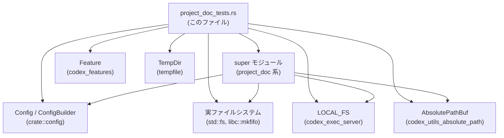
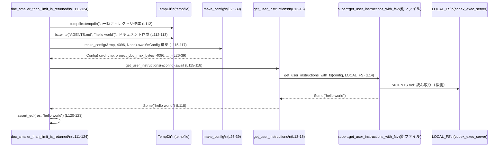

# core/src/project_doc_tests.rs コード解説

## 0. ざっくり一言

このファイルは、プロジェクトドキュメント（主に `AGENTS.md` 系ファイル）をもとにユーザー向けインストラクション文字列を生成・発見するロジック  
`super::get_user_instructions*` / `super::discover_project_doc_paths` の挙動を、実ファイルシステム上で検証する非公開テスト群です（根拠: `use super::*` と各テスト内呼び出し `get_user_instructions` / `discover_project_doc_paths`、core/src/project_doc_tests.rs:L1, L13-19, L84-539）。

---

## 1. このモジュールの役割

### 1.1 概要

- このモジュールは **プロジェクトディレクトリにあるドキュメントファイル（`AGENTS.md` 等）から、どのようにユーザーインストラクションを構築するか** を検証するために存在します。
- 具体的には、ファイル存在有無、サイズ制限、探索ルート、ファイル優先順位、機能フラグ（`Feature::JsRepl`, `Feature::Apps` など）に応じて  
  `get_user_instructions` / `discover_project_doc_paths` がどう振る舞うかを網羅的にテストしています（L84-539）。

### 1.2 アーキテクチャ内での位置づけ

このテストモジュールが他コンポーネントとどう関わるかを図示します。



- テストコードは `TempDir` を使って一時ディレクトリに実ファイルを作成し（L87, L112-113 など）、`ConfigBuilder` で構築した `Config` とともに `super` 側の関数へ渡します（L26-39, L84-91, L135-137 等）。
- `LOCAL_FS`（実ファイルシステム実装）を `get_user_instructions_with_fs` / `discover_project_doc_paths` に渡すためのラッパー関数 `get_user_instructions` / `discover_project_doc_paths` がこのファイル内に定義されています（L13-19）。
- パスの検証や順序確認には `AbsolutePathBuf` が利用されています（L329-342）。

### 1.3 設計上のポイント

- **非同期・実ファイルシステムベースのテスト**  
  - すべてのテストは `#[tokio::test] async fn` として定義され、非同期 API をそのまま検証しています（L85, L100, L111 など）。
  - 実際に `TempDir` 上にファイル／ディレクトリ／FIFO を作成し、`LOCAL_FS` 経由で読む想定の実装をそのままテストします（L87, L112-113, L451-456）。
- **設定生成ヘルパーで責務を分割**  
  - `make_config*` 系ヘルパーが `Config` の初期化、`cwd`、`project_doc_max_bytes`、fallback 設定、project root markers などを一括設定し、各テストの重複を減らしています（L26-82）。
- **探索ポリシーと優先順位の明示的検証**  
  - `.git`・`project_root_markers` によるルート判定（L143-169, L310-345）、
  - `AGENTS.override.md` と `AGENTS.md`、fallback ファイルとの優先順位（L348-371, L373-425, L470-492）、
  - 特殊ファイル（ディレクトリ、FIFO）の無視（L428-442, L444-467）
  を個別のテストで保証しています。
- **機能フラグに基づく追加インストラクションの仕様テスト**  
  - `Feature::JsRepl` / `JsReplToolsOnly` / `ImageDetailOriginal` / `Apps` の組み合わせで、ユーザーインストラクションへの追記内容がどう変化するかを固定文字列で検証しています（L197-248, L513-538）。
- **安全性配慮のテスト**  
  - FIFO を「ドキュメントとして扱わない」ことを確認するテストがあり、ブロッキング I/O などを避ける実装になっていることを間接的に示します（L444-467）。

---

## 2. 主要な機能一覧（コンポーネントインベントリー）

このモジュールが提供／検証している主な機能を列挙します。

- Config ヘルパー:
  - `make_config`: ベースとなる `Config` を生成し、`cwd`・`project_doc_max_bytes`・`user_instructions` を設定（L26-39）。
  - `make_config_with_fallback`: 上記に加え `project_doc_fallback_filenames` を設定（L41-53）。
  - `make_config_with_project_root_markers`: CLI override を通じて `project_root_markers` を設定（L55-82）。
- プロジェクトドキュメント読み取り（ラッパー）:
  - `get_user_instructions`: デフォルトのファイルシステム `LOCAL_FS` で `super::get_user_instructions_with_fs` を呼ぶヘルパー（L13-15）。
- プロジェクトドキュメントパス探索（ラッパー）:
  - `discover_project_doc_paths`: 同様に `super::discover_project_doc_paths` を `LOCAL_FS` で呼ぶヘルパー（L17-19）。
- `get_user_instructions` の仕様テスト:
  - ドキュメント欠如時の挙動（L84-107）。
  - サイズ制限（`project_doc_max_bytes`）の適用（L109-141, L171-195）。
  - 既存 `user_instructions` とのマージと保持（L250-280）。
  - Repo root / cwd / project root markers を跨いだドキュメント結合（L143-169, L282-346）。
  - 機能フラグごとの追加インストラクション（JsRepl, Apps, skills）（L197-248, L495-538）。
- `discover_project_doc_paths` の仕様テスト:
  - `project_doc_max_bytes == 0` で探索無効（L185-195）。
  - ルートマーカーを考慮した複数パス探索と順序（L310-345）。
  - 優先ファイル（override, fallback）の探索結果（L348-371, L373-425, L470-492）。
  - ディレクトリや FIFO を無視し、空リストを返す（L428-442, L444-467）。
- Skills/Apps に関する副作用テスト:
  - `create_skill` によって作られたスキルがプロジェクトドキュメントに自動的に追加されないこと（L495-511, L541-545）。
  - `Feature::Apps` が単独ではインストラクションを発生させず、既存のドキュメントにも追記しないこと（L513-538）。

---

## 3. 公開 API と詳細解説

このファイル自体には「公開 API」はありませんが、テストで使われるヘルパーやラッパー関数は、  
上位モジュールの API を理解するうえで重要な入口となるため、それらを中心に説明します。

### 3.1 型一覧（構造体・列挙体など）

このファイルで重要な役割を持つ型の一覧です（定義は他ファイルにあります）。

| 名前 | 種別 | 役割 / 用途 | 根拠 |
|------|------|-------------|------|
| `Config` | 構造体 | プロジェクトドキュメント関連の設定（`cwd`, `project_doc_max_bytes`, `user_instructions`, `project_doc_fallback_filenames`, `features`, `codex_home` など）を保持 | フィールド代入箇所から推定（L34-37, L47-52, L78-80, L320-326, L500-503） |
| `ConfigBuilder` | 構造体 | `Config` を非同期に構築するビルダー。`codex_home` や CLI overrides を設定可能 | `ConfigBuilder::default().codex_home(...).cli_overrides(...).build().await`（L28-32, L71-76） |
| `Feature` | 列挙体 | `JsRepl`, `JsReplToolsOnly`, `ImageDetailOriginal`, `Apps` などの機能フラグを表現 | `.enable(Feature::JsRepl)` 等（L201-203, L217-219, L236-238, L517-519） |
| `AbsolutePathBuf` | 構造体 | ルートを含む正規化済み/絶対パスを表現し、発見されたドキュメントパスの検証に使用 | `discover_project_doc_paths` の戻り値型と `try_from(canonicalize(...))`（L17-19, L329-339） |
| `TempDir` | 構造体 | テスト用の一時ディレクトリ。終了時に削除される | `TempDir::new()` や `tempfile::tempdir()`（L27, L87, L112, L130 など） |

### 3.2 関数詳細（最大 7 件）

#### `get_user_instructions(config: &Config) -> Option<String>`

**概要**

- 上位モジュールの `get_user_instructions_with_fs` を、デフォルトファイルシステム `LOCAL_FS` 付きで呼び出す非公開ラッパー関数です（L13-15）。
- テストからは、プロジェクトドキュメントと `Config` に応じたユーザーインストラクション文字列（または `None`）を返すことが確認できます。

**引数**

| 引数名 | 型 | 説明 |
|--------|----|------|
| `config` | `&Config` | カレントディレクトリ、ドキュメントのバイト制限、既存インストラクション、機能フラグなどを含む設定 |

**戻り値**

- `Option<String>`  
  - 一つ以上の情報源（既存 `user_instructions`、プロジェクトドキュメント、機能フラグ）から組み立てられたインストラクション文字列。  
  - 条件により `None` となるケースもあります（例: ドキュメント不在かつ制限 0、環境未設定などのテストから推定）。

**内部処理の流れ**

1. `super::get_user_instructions_with_fs(config, LOCAL_FS.as_ref())` を呼び出し（L14）。
2. その `Future` を `.await` で待ち、結果をそのまま返します（L14）。

**Examples（使用例）**

テスト内での典型的な利用例です。

```rust
// 一時ディレクトリを作成し、そこに AGENTS.md を置く（L112-113）
let tmp = tempfile::tempdir().expect("tempdir");
fs::write(tmp.path().join("AGENTS.md"), "hello world").unwrap();

// Config を生成し、ユーザーインストラクションを取得する（L115-118）
let cfg = make_config(&tmp, /*limit*/ 4096, /*instructions*/ None).await;
let res = get_user_instructions(&cfg).await.expect("doc expected");

// res は "hello world" になる（L120-123）
assert_eq!(res, "hello world");
```

**Errors / Panics**

- このラッパー自身は `Result` ではなく `Option` を返すため、エラーは上位でハンドリングされています。
- テストからは、ドキュメントが無効な場合（存在しない、ディレクトリ、FIFO、`project_doc_max_bytes == 0` 等）は `None` を返す実装であることが分かります（L84-97, L171-183, L428-442, L444-467）。
- ラッパー内でパニックは起きませんが、`super::get_user_instructions_with_fs` の実装詳細はこのチャンクでは不明です。

**Edge cases（エッジケース）** ※いずれもテストからの観測

- ドキュメント不在かつ `user_instructions == None` → `None`（L84-97）。
- `project_doc_max_bytes == 0` → ドキュメントが存在しても `None`（L171-183）。
- `AGENTS.md` がディレクトリまたは FIFO → `None`（L428-442, L444-467）。
- `Feature::JsRepl` が有効でドキュメントも既存指示もない → JsRepl 用の長い説明文が `Some` として返る（L197-209）。
- `Feature::Apps` のみ有効でドキュメントもない → `None`（L513-523）。

**使用上の注意点**

- 実運用コードでは通常 `super::get_user_instructions`（環境引数付き）を直接使うはずであり、このラッパーはテスト専用です（L100-106）。
- ファイルシステムに依存するため、テストで使う場合は `TempDir` のような隔離されたディレクトリを用いると安全です。

---

#### `discover_project_doc_paths(config: &Config) -> std::io::Result<Vec<AbsolutePathBuf>>`

**概要**

- `super::discover_project_doc_paths` を `LOCAL_FS` 付きで呼び出す非公開ラッパーです（L17-19）。
- プロジェクトドキュメント候補ファイルの絶対パス一覧を `Result<Vec<AbsolutePathBuf>>` として返します。

**引数**

| 引数名 | 型 | 説明 |
|--------|----|------|
| `config` | `&Config` | `cwd`, ルート探索マーカー、ファイル名優先順位、バイト制限などを含む設定 |

**戻り値**

- `std::io::Result<Vec<AbsolutePathBuf>>`  
  - 成功時: 発見されたドキュメントファイルの絶対パス一覧（優先順位付き）  
  - 失敗時: I/O エラー（このテストではエラーケースは発生していません）。

**内部処理の流れ**

1. `super::discover_project_doc_paths(config, LOCAL_FS.as_ref())` を呼び出し（L18）。
2. `await` で待機し、その `Result` をそのまま返します（L18）。

**Examples（使用例）**

```rust
// バイト制限 0 の設定で Config を用意（L190-192）
let cfg = make_config(&tmp, /*limit*/ 0, /*instructions*/ None).await;

// ドキュメントパスを探索（L190-194）
let discovery = discover_project_doc_paths(&cfg)
    .await
    .expect("discover paths");

// 制限 0 の場合は空ベクタが返る（L194）
assert_eq!(discovery, Vec::<AbsolutePathBuf>::new());
```

**Errors / Panics**

- テストコードではすべて `.expect("discover paths")` で unwrap されており、エラー発生ケースは検証されていません（L190-193, L329-331, L363-365 など）。
- 実装内部のエラー条件はこのチャンクからは分かりません。

**Edge cases**

- `project_doc_max_bytes == 0` の場合、ドキュメントがあっても返り値は空ベクタ（L185-195）。
- `AGENTS.override.md` が存在するとき、ルートではそれのみが 1 件として返る（L348-371）。
- fallback ファイルが使われる場合、AGENTS がないときだけそのパスが返る（L373-392）。
- `AGENTS.md` がディレクトリまたは FIFO の場合、空ベクタ（L428-442, L444-467）。

**使用上の注意点**

- このラッパーもテスト専用であり、実使用では `super` 側の関数を直接呼ぶのが自然です。
- 戻り値のベクタの順番に意味があり、ルートから cwd に向かう順序や override/fallback の優先順位がテストで確認されています（L303-307, L329-342, L363-370）。

---

#### `make_config(root: &TempDir, limit: usize, instructions: Option<&str>) -> Config`

**概要**

- テスト用に `Config` を構築するヘルパーです（L26-39）。
- `cwd`、`project_doc_max_bytes`、`user_instructions` を一括設定します。

**引数**

| 引数名 | 型 | 説明 |
|--------|----|------|
| `root` | `&TempDir` | プロジェクトルートとして使う一時ディレクトリ |
| `limit` | `usize` | `project_doc_max_bytes` に設定するバイト数 |
| `instructions` | `Option<&str>` | 既存の `user_instructions`。`None` の場合はクリア |

**戻り値**

- `Config`  
  - テストで使用する完全な設定オブジェクト。`ConfigBuilder` のデフォルトから構築されます。

**内部処理の流れ**

1. `TempDir::new()` で `codex_home` 用一時ディレクトリを作成（L27）。
2. `ConfigBuilder::default()` からビルダーを生成し、`codex_home` を設定（L28-29）。
3. `.build().await` で `Config` を構築し、エラーなら `expect` でパニック（テスト専用なので許容）（L30-32）。
4. `config.cwd = root.abs()` で cwd を `root` の絶対パスに設定（L34）。
5. `config.project_doc_max_bytes = limit` を設定（L35）。
6. `config.user_instructions = instructions.map(ToOwned::to_owned)` で `Option<&str>` から `Option<String>` へ変換（L37）。
7. 完成した `config` を返す（L38）。

**Examples（使用例）**

```rust
// ドキュメント無し・制限 4096・既存インストラクション無しの Config を生成（L84-91）
let tmp = tempfile::tempdir().expect("tempdir");
let cfg = make_config(&tmp, /*limit*/ 4096, /*instructions*/ None).await;

// これを使って get_user_instructions を呼び出す（L89-91）
let res = get_user_instructions(&cfg).await;
```

**Edge cases / 使用上の注意点**

- `limit` に 0 を指定すると、`get_user_instructions` / `discover_project_doc_paths` 側で「プロジェクトドキュメント無効」の挙動になります（L171-195）。
- `instructions` に `Some` を渡すと、既存 `user_instructions` とプロジェクトドキュメントのマージ挙動がテストで確認されています（L250-280）。

---

#### `make_config_with_fallback(root, limit, instructions, fallbacks) -> Config`

**概要**

- `make_config` の設定に加え、`project_doc_fallback_filenames` を設定した `Config` を返すヘルパーです（L41-53）。
- Fallback ドキュメントファイル名の優先度テストに利用されます（L373-425）。

**引数 / 戻り値**

- `root` / `limit` / `instructions` は `make_config` と同じ（L42-45）。
- `fallbacks: &[&str]` は、`EXAMPLE.md` などの fallback ファイル名リスト（L45）。
- 戻り値は `Config`。

**内部処理**

1. `make_config` を呼び出してベースの `Config` を取得（L47）。
2. `fallbacks.iter().map(ToString::to_string).collect()` で `Vec<String>` を作成し、`config.project_doc_fallback_filenames` に代入（L48-51）。
3. `config` を返却（L52）。

**使用例**

- AGENTS 不在時に fallback が使われるテスト（L373-392）。
- AGENTS と fallback が両方あるとき、AGENTS が優先されるテスト（L394-425）。

---

#### `make_config_with_project_root_markers(root, limit, instructions, markers) -> Config`

**概要**

- CLI override を利用して `project_root_markers` を設定する `Config` を生成するヘルパーです（L55-82）。
- `.codex-root` などの独自ルートマーカーによるドキュメント探索挙動をテストします（L310-345）。

**内部処理（要約）**

1. `TempDir::new()` で codex_home を作成（L61）。
2. `cli_overrides` ベクタを構築し、キー `"project_root_markers"` に `TomlValue::Array` で `markers` を設定（L62-70）。
3. `ConfigBuilder::default().codex_home(...).cli_overrides(cli_overrides).build().await` で `Config` を生成（L71-76）。
4. `cwd`, `project_doc_max_bytes`, `user_instructions` を設定（L78-80）。

---

#### `create_skill(codex_home: PathBuf, name: &str, description: &str)`

**概要**

- `codex_home/skills/{name}/SKILL.md` を作成するテストヘルパーです（L541-545）。
- Skills がプロジェクトドキュメントに自動的に追加されないことを確認するために使用されます（L495-511）。

**内部処理**

1. `skill_dir = codex_home.join(format!("skills/{name}"))`（L542）。
2. `fs::create_dir_all(&skill_dir)` でスキルディレクトリを作成（L543）。
3. YAML 風メタデータ＋本文を含むコンテンツを組み立て（L544）。
4. `SKILL.md` に書き出し（L545）。

---

### 3.3 その他の関数（テスト関数一覧）

各テスト関数は `get_user_instructions` / `discover_project_doc_paths` の仕様を表す「振る舞いの例」として重要です。

| 関数名 | 役割（1 行） | 根拠 |
|--------|--------------|------|
| `no_doc_file_returns_none` | AGENTS.md 不在かつ既存指示なし → `None` を返すことを確認 | L84-97 |
| `no_environment_returns_none` | 環境引数 `None` の場合、既存指示があっても `None` を返すことを確認（super API） | L99-107 |
| `doc_smaller_than_limit_is_returned` | ファイルサイズが制限以内なら内容をそのまま返す | L109-124 |
| `doc_larger_than_limit_is_truncated` | ファイルが制限より大きい場合、`project_doc_max_bytes` までで切り詰める | L126-141 |
| `finds_doc_in_repo_root` | `cwd` がネストしていても、`.git` を持つリポジトリルートの AGENTS.md を見つける | L143-169 |
| `zero_byte_limit_disables_docs` | `project_doc_max_bytes == 0` でドキュメント読み取りが無効化される | L171-183 |
| `zero_byte_limit_disables_discovery` | 同条件下でパス探索も空ベクタになる | L185-195 |
| `js_repl_instructions_are_appended_when_enabled` | `Feature::JsRepl` 有効時に JsRepl 用説明を返す | L197-210 |
| `js_repl_tools_only_instructions_are_feature_gated` | `JsReplToolsOnly` 追加でツール呼び出し制限文が追加される | L212-229 |
| `js_repl_image_detail_original_does_not_change_instructions` | `ImageDetailOriginal` の有無で JsRepl 文面が変わらないこと | L231-248 |
| `merges_existing_instructions_with_project_doc` | 既存指示 + プロジェクトドキュメントがセパレータ付きで結合される | L250-266 |
| `keeps_existing_instructions_when_doc_missing` | ドキュメント不在時は既存指示をそのまま返す | L268-280 |
| `concatenates_root_and_cwd_docs` | リポジトリルートと cwd の両方に AGENTS.md がある場合、root→cwd の順で連結 | L282-308 |
| `project_root_markers_are_honored_for_agents_discovery` | `project_root_markers` 設定で親子両方の AGENTS.md を探索し順序も保証 | L310-345 |
| `agents_local_md_preferred` | `AGENTS.override.md` があるとそちらが優先され、探索結果も1件になる | L348-371 |
| `uses_configured_fallback_when_agents_missing` | AGENTS 不在・fallback のみ存在 → fallback が使われる | L373-392 |
| `agents_md_preferred_over_fallbacks` | AGENTS + fallback 共存時は AGENTS が優先され、探索も AGENTS のみ | L394-425 |
| `agents_md_directory_is_ignored` | `AGENTS.md` がディレクトリの場合、無視され `None` / 空ベクタとなる | L428-442 |
| `agents_md_special_file_is_ignored` | Unix の FIFO（特別ファイル）も同様に無視される | L444-467 |
| `override_directory_falls_back_to_agents_md_file` | override 名のパスがディレクトリなら、AGENTS.md ファイルへフォールバック | L469-492 |
| `skills_are_not_appended_to_project_doc` | skill 定義が自動的にプロジェクトドキュメントに追加されないこと | L495-511 |
| `apps_feature_does_not_emit_user_instructions_by_itself` | Apps 機能単独ではインストラクションを生成しない | L513-523 |
| `apps_feature_does_not_append_to_project_doc_user_instructions` | Apps 機能は既存プロジェクトドキュメントにも追記しない | L525-538 |

---

## 4. データフロー

ここでは「小さな AGENTS.md を読み取ってユーザーインストラクションを返す」という代表的フローを説明します。

### フロー概要

1. テストが `TempDir` を作り、そこに `AGENTS.md` を書き込みます（L111-113）。
2. `make_config` で `cwd` とバイト制限・既存指示を設定した `Config` を生成します（L115-117, L26-39）。
3. `get_user_instructions` ラッパーを通じて、`super::get_user_instructions_with_fs` が `LOCAL_FS` でファイルを読むと推測されます（L13-15, L115-118）。
4. 返された `Some("hello world")` をテスト側で検証します（L120-123）。

### シーケンス図



`super::get_user_instructions_with_fs` の実装はこのチャンクには現れませんが、テストの期待値から「AGENTS.md の内容をそのまま返す」パスがあることが分かります。

---

## 5. 使い方（How to Use）

このファイルはテスト専用ですが、`get_user_instructions` / `discover_project_doc_paths` の利用方法を理解するうえで参考になるコードパターンが含まれています。

### 5.1 基本的な使用方法

**シナリオ:** プロジェクトルートにある `AGENTS.md` を、制限付きでユーザーインストラクションとして取得する。

```rust
// 一時的なプロジェクトルートを用意する                       // テスト環境のためのディレクトリ
let tmp = tempfile::tempdir().expect("tempdir");              // L87 など

// プロジェクトドキュメントを作成する                         // AGENTS.md にテキストを書く
fs::write(tmp.path().join("AGENTS.md"), "hello world").unwrap(); // L112-113

// Config を構築する                                             // cwd・制限・既存指示をセット
let cfg = make_config(&tmp, /*limit*/ 4096, /*instructions*/ None).await; // L115-117

// ユーザーインストラクションを取得する                          // ラッパー経由で super 実装を呼ぶ
let res = get_user_instructions(&cfg).await                     // L115-118
    .expect("doc expected");                                    // ドキュメントがある前提

// 結果を利用する                                                // ここではテストとして検証するだけ
assert_eq!(res, "hello world");                                 // L120-123
```

本番コードでは `Config` をアプリケーションの設定から構築し、`super::get_user_instructions` を呼び出す形になると考えられます（環境引数付き、L100-106）。

### 5.2 よくある使用パターン

1. **ドキュメントサイズ制限を設ける**

```rust
// 制限 1024 バイトで Config を作成                              // L128-136
let cfg = make_config(&tmp, /*limit*/ 1024, /*instructions*/ None).await;

// get_user_instructions の結果は最大 1024 バイトに切り詰められる // L132-140
let res = get_user_instructions(&cfg).await.expect("doc expected");
assert!(res.len() <= 1024);
```

1. **Repo ルートと cwd の両方のドキュメントを連結**

```rust
// リポジトリルートに .git と AGENTS.md を作る                   // L147-158
// cwd にも AGENTS.md を作る                                     // L298-301
let mut cfg = make_config(&repo, 4096, None).await;             // L303-304
cfg.cwd = nested.abs();                                         // cwd をネスト先へ（L304）

let res = get_user_instructions(&cfg).await.expect("doc expected");
// res は "root doc\n\ncrate doc" となる                         // L306-307
```

1. **fallback ドキュメントを使う**

```rust
// AGENTS.md が無く EXAMPLE.md だけある場合                      // L376-378
let cfg = make_config_with_fallback(&tmp, 4096, None, &["EXAMPLE.md"]).await; // L379-385
let res = get_user_instructions(&cfg).await.expect("fallback doc expected");
assert_eq!(res, "example instructions");                        // L387-391
```

### 5.3 よくある間違い

テストコードから推測される「やってはいけない」／「期待どおりに動かない」パターンです。

```rust
// 間違い例: project_doc_max_bytes を 0 にしたまま、             // ドキュメントを読みたいのに 0 にしている
let cfg = make_config(&tmp, /*limit*/ 0, /*instructions*/ None).await;

// 正しいつもりで呼んでも常に None になる                        // L171-183, L185-195
let res = get_user_instructions(&cfg).await;
assert!(res.is_none()); // ドキュメントがあっても None
```

```rust
// 間違い例: AGENTS.md をディレクトリとして作ってしまう          // L430-431
fs::create_dir(tmp.path().join("AGENTS.md")).unwrap();
let cfg = make_config(&tmp, 4096, None).await;

let res = get_user_instructions(&cfg).await;
// ディレクトリは無視されるため None になる                       // L435-437
assert_eq!(res, None);
```

### 5.4 使用上の注意点（まとめ）

- `project_doc_max_bytes` が 0 の場合、**読み取りも探索も完全に無効化** されます（L171-195）。
- ドキュメントファイルは **通常のファイル** である必要があり、**ディレクトリや FIFO などの特殊ファイルは無視** されます（L428-442, L444-467）。これはハングやセキュリティリスクを避ける観点でも重要です。
- `AGENTS.override.md` があればそれが優先され、`AGENTS.md` が存在しても無視されますが、override がディレクトリの場合は `AGENTS.md` にフォールバックします（L348-371, L469-492）。
- Fallback ファイルは **AGENTS.md が存在しない場合のみ** 使用され、存在する場合は AGENTS 側が優先されます（L373-392, L394-425）。
- `Feature::JsRepl` や `Feature::Apps` など機能フラグにより、インストラクションの内容が変化しますが、その仕様はテストの期待文字列に固定されているため、文面変更時はテストも合わせて更新する必要があります（L197-248, L513-538）。

---

## 6. 変更の仕方（How to Modify）

### 6.1 新しい機能を追加する場合

ここでいう「機能」は、`get_user_instructions` が参照するような新しい Feature フラグやドキュメント探索ルールを想定します。

1. **上位モジュールの実装を変更／追加**
   - 例: 新しい `Feature::Xxx` を追加し、そのフラグが有効なときに特定の文面を追加する。
   - 実装はこのチャンクには無いので、`super` 側ファイル（例: `project_doc.rs`）を編集します（このチャンクには現れません）。

2. **このテストファイルにテストを追加**
   - 既存の JsRepl や Apps のテストを参考に、新しいフラグ用のテストを追加します（L197-248, L513-538）。
   - 必要に応じて `make_config` で `features.enable(Feature::Xxx)` を行い、期待されるインストラクション文字列を `expected` として定義します。

3. **必要であれば Config ヘルパーを拡張**
   - 新しい設定項目が増えた場合は `make_config*` 系関数でそれを初期化するロジックを追加します（L26-39, L41-53, L55-82）。

### 6.2 既存の機能を変更する場合

- **影響範囲の確認**
  - `get_user_instructions` の振る舞いを変える場合、このファイルのほぼ全テストに影響する可能性があります（L84-539）。
  - 特に文字列を厳密比較しているテスト（JsRepl 系）は、文面変更ですぐに落ちます（L205-209, L224-228, L243-247）。

- **契約（前提条件・返り値の意味）**
  - `project_doc_max_bytes == 0` で「完全無効」にする契約（L171-195）。
  - `AGENTS.override.md` > `AGENTS.md` > fallback の優先順位（L348-371, L373-425, L470-492）。
  - ディレクトリ・FIFO の無視（L428-442, L444-467）。
  - これらの契約を変更する場合、対応するテストケースも必ず変更・追加する必要があります。

- **関連するテスト・使用箇所の再確認**
  - 仕様変更を行ったら、`cargo test --test ...` などでこのモジュールのテストを必ず実行し、挙動が期待通りか確認します。
  - 特にルート探索ロジック（`.git`, `project_root_markers`）は複数パス・順序を同時に検証しているため、順序を変えた場合は期待値の順番も更新する必要があります（L282-308, L310-345）。

---

## 7. 関連ファイル

このモジュールと密接に関係するファイル・ディレクトリです（このチャンクには定義が現れないものも含みます）。

| パス | 役割 / 関係 |
|------|------------|
| `core/src/project_doc.rs`（仮） | `super::get_user_instructions` / `get_user_instructions_with_fs` / `discover_project_doc_paths` など、このテストが対象としている本体ロジックを提供するモジュール（パス名は推定であり、このチャンクからは正確なファイル名は分かりません）。 |
| `crate::config` (`Config`, `ConfigBuilder`) | プロジェクトドキュメント機能を制御する設定構造体とビルダー。テスト内の `make_config*` で利用（L26-39, L55-82）。 |
| `codex_exec_server::LOCAL_FS` | 実ファイルシステムを扱う抽象化。`get_user_instructions_with_fs` / `discover_project_doc_paths` に渡される（L3, L13-19）。 |
| `codex_features` (`Feature`) | JsRepl、Apps などの機能フラグを定義するモジュール。インストラクション文面の追加や抑制に利用（L4, L201-203, L217-219, L236-238, L517-519）。 |
| `codex_utils_absolute_path::AbsolutePathBuf` | 発見されたドキュメントパスの表現に使われる型。パスの正規化と比較に利用（L5, L329-342, L363-371, L438-441, L463-466）。 |
| `core_test_support::{PathBufExt, TempDirExt}` | `abs()` などの拡張メソッドを通じてパス／テンポラリディレクトリ操作を簡略化（L6-7, L34, L165, L304, L327）。 |
| `tempfile` (`TempDir`) | テストで利用する一時ディレクトリを提供（L11, L27, L87 など）。 |
| `libc` (`mkfifo`) | Unix 上で FIFO を作成するために使用され、特殊ファイルを無視する挙動をテストする（L444-456）。 |

---

### Bugs / Security / Edge Cases の補足（このチャンクから分かる範囲）

- **セキュリティ・安全性**
  - ディレクトリや FIFO をドキュメントとして扱わない仕様により、任意の特殊ファイルへブロッキング読み取りする危険を避けています（L428-442, L444-467）。
  - `project_doc_max_bytes` によるバイト数制限は、巨大なドキュメントによるメモリ使用過多を防ぐ役割を持ちます（L126-141）。

- **潜在的なバグ**
  - このテストファイル自体には致命的なバグは見当たりません。ただし JsRepl 関連の期待文字列は非常に長く、仕様変更に対して脆い（メッセージの一部変更でもテストが失敗する）構造になっています（L205-209, L224-228, L243-247）。

- **並行性**
  - すべてのテストは `#[tokio::test]` による非同期テストであり、Tokio ランタイム上で並行に実行される可能性があります（L85, L100, L111 など）。
  - 一時ディレクトリは各テストで独立して作成されており、ファイルシステムの競合は起こりにくい構造です（L87, L112, L130 など）。ConfigBuilder や Feature フラグの内部並行性については、このチャンクからは分かりません。
