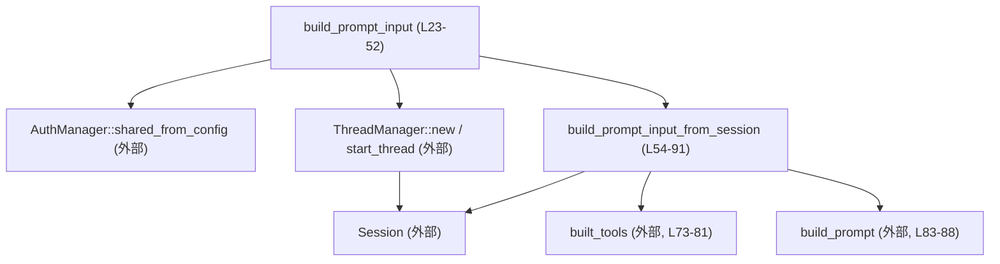
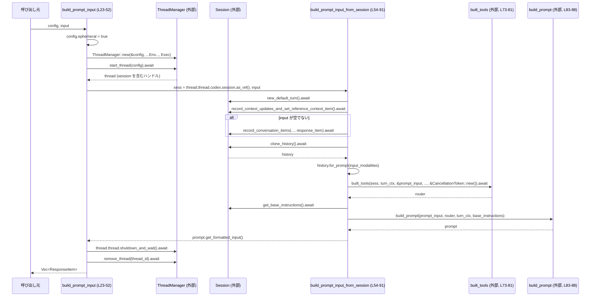

# core/src/prompt_debug.rs コード解説

## 0. ざっくり一言

`prompt_debug.rs` は、**デバッグ用の 1 ターン分の対話に対して、モデルに渡す `input`（`Vec<ResponseItem>`）を構築するためのユーティリティ**を提供するモジュールです（`build_prompt_input` / `build_prompt_input_from_session`、`prompt_debug.rs:L21-L52`, `L54-L91`）。

---

## 1. このモジュールの役割

### 1.1 概要

- このモジュールは、**デバッグ実行専用の一時的なセッション**を立ち上げ、そのセッション履歴・ユーザ入力・ベース指示をまとめてモデル向けの `Vec<ResponseItem>` に変換する役割を持ちます（`prompt_debug.rs:L21-L52`, `L54-L90`）。
- 外部からは `build_prompt_input` を呼ぶだけで、セッションの生成・終了やツールルータ構築など内部処理を意識せずに、モデルへ渡す入力リストを取得できます（`prompt_debug.rs:L21-L52`）。
- セッション自体をすでに持っている場合は、`build_prompt_input_from_session` を使って同様の処理を行えます（`prompt_debug.rs:L54-L91`）。

### 1.2 アーキテクチャ内での位置づけ

このモジュールは、コアの Codex セッション管理やプロンプト構築ロジックの「薄いフロントエンド」として機能しています。

- 依存先（このチャンクで確認できるもの）  
  - `ThreadManager` を使ってセッションを起動・終了（`prompt_debug.rs:L32-L48`）
  - `Session` を通じてターンコンテキスト管理・履歴取得・会話アイテム記録（`prompt_debug.rs:L58-L72`, `L82-L88`）
  - `built_tools` でツールルータを構築（`prompt_debug.rs:L73-L81`）
  - `build_prompt` で最終的なプロンプトを組み立て（`prompt_debug.rs:L83-L88`）
  - `AuthManager` / `EnvironmentManager` で認証および実行環境の構成（`prompt_debug.rs:L29-L42`）

Mermaid 図での全体像（このファイル範囲のみ）:



### 1.3 設計上のポイント

- **責務の分割**
  - `build_prompt_input` は「コンフィグからセッションを立ち上げて閉じるまで」を担当（`prompt_debug.rs:L21-L52`）。
  - `build_prompt_input_from_session` は「既存セッションから 1 ターン分のプロンプトを構築」するロジックに集中（`prompt_debug.rs:L54-L90`）。
- **状態管理**
  - 外部の長寿命オブジェクトは `Arc` で共有（`AuthManager`, `EnvironmentManager`）（`prompt_debug.rs:L29-L42`）。
  - 関数自体は状態を保持せず、必要な情報は `Config` または `Session` 経由で取得します。
- **エラーハンドリング**
  - 両関数とも `CodexResult<Vec<ResponseItem>>` を返し、内部呼び出しは `?` でエラーを伝播します（`prompt_debug.rs:L44`, `L81`, `L50`）。
- **並行性 / 非同期**
  - すべて `async fn` として定義され、Tokio などの非同期ランタイム上で実行する前提です（`prompt_debug.rs:L23`, `L54`）。
  - セッション操作は `&Session` への共有参照越しに行われ、内部で適切な同期が行われていると推測されます（`prompt_debug.rs:L54-L90`）。

---

## 2. 主要な機能一覧

- デバッグ用セッションからモデル入力を構築: `build_prompt_input`
- 既存セッションを用いたモデル入力構築: `build_prompt_input_from_session`
- テストによる挙動確認: `build_prompt_input_includes_context_and_user_message`（テストモジュール内）

### 2.1 コンポーネント一覧（関数・テスト）

| 名前 | 種別 | 可視性 | 行範囲 | 役割 |
|------|------|--------|--------|------|
| `build_prompt_input` | 非同期関数 | `pub` | `prompt_debug.rs:L23-L52` | `Config` から一時セッションを立ち上げ、1 ターン分のモデル入力 `Vec<ResponseItem>` を構築して返す |
| `build_prompt_input_from_session` | 非同期関数 | `pub(crate)` | `prompt_debug.rs:L54-L91` | 既存の `Session` とユーザ入力から、プロンプト用の `Vec<ResponseItem>` を構築する |
| `build_prompt_input_includes_context_and_user_message` | 非同期テスト関数 | テスト専用 | `prompt_debug.rs:L105-L148` | プロンプトにユーザメッセージとユーザ指示（`user_instructions`）が含まれることを検証する |

---

## 3. 公開 API と詳細解説

### 3.1 型一覧（構造体・列挙体など）

このファイル内で新たに定義されている型はありません。  
ただし、以下の外部型が主要な役割を担っています。

| 名前 | 所属 | 役割 / 用途 | 根拠行 |
|------|------|-------------|--------|
| `Config` | `crate::config` | セッションや機能フラグ、パス、ユーザ指示などを含む設定 | `prompt_debug.rs:L24`, `L32-L40`, `L109-L112` |
| `Session` | `crate::codex` | 対話セッション。ターン生成・履歴・コンテキスト・ベース指示を扱う | `prompt_debug.rs:L54-L90`（`new_default_turn`, `clone_history`, `get_base_instructions` などからの推測） |
| `ThreadManager` | `crate::thread_manager` | セッションを含むスレッドの生成・管理・終了 | `prompt_debug.rs:L32-L48` |
| `AuthManager` | `codex_login` | 認証設定の共有管理。`shared_from_config` から推測 | `prompt_debug.rs:L29-L30` |
| `EnvironmentManager` | `codex_exec_server` | 実行環境（おそらくファイルシステムやツール実行環境）の管理。`from_env` より推測 | `prompt_debug.rs:L41` |
| `ResponseItem` | `codex_protocol::models` | モデルに渡す対話アイテム（メッセージなど） | `prompt_debug.rs:L10`, `L57`, `L64`, `L124-L132` |
| `UserInput` | `codex_protocol::user_input` | ユーザからの入力（テキスト等） | `prompt_debug.rs:L12`, `L25`, `L56`, `L116-L119` |
| `CancellationToken` | `tokio_util::sync` | 非同期タスクのキャンセル制御用トークン | `prompt_debug.rs:L13`, `L79` |

> `Session`・`ThreadManager` 等の詳細な仕様はこのチャンクには現れません。メソッド名や利用方法から上記のように解釈できますが、厳密な振る舞いは元定義のコードを参照する必要があります。

---

### 3.2 関数詳細

#### `build_prompt_input(mut config: Config, input: Vec<UserInput>) -> CodexResult<Vec<ResponseItem>>`

**概要**

- デバッグ用に、与えられた `Config` とユーザ入力から一時セッション（エフェメラル）を起動し、そのセッションを用いて **1 ターン分のモデル入力 `Vec<ResponseItem>`** を構築して返します（`prompt_debug.rs:L21-L52`）。
- セッションの開始から終了 (`shutdown_and_wait`) までを内部で完結させるため、呼び出し側はセッション管理を意識する必要がありません。

**引数**

| 引数名 | 型 | 説明 | 根拠行 |
|--------|----|------|--------|
| `config` | `Config` | セッション・ThreadManager・認証などに利用される設定。関数内で `ephemeral` フラグが `true` に変更されます | `prompt_debug.rs:L24`, `L27`, `L32-L40` |
| `input` | `Vec<UserInput>` | 今回のデバッグターンでモデルに渡したいユーザ入力のリスト | `prompt_debug.rs:L25`, `L46` |

**戻り値**

- 型: `CodexResult<Vec<ResponseItem>>`（`codex_protocol::error::Result` の別名）（`prompt_debug.rs:L26`）。
- 意味:
  - `Ok(Vec<ResponseItem>)`: セッション履歴やコンテキストを含めて整形された、モデル向けの入力リスト。
  - `Err(e)`: スレッド開始・セッション操作・ツール構築・シャットダウンなどで発生したエラー。

**内部処理の流れ**

1. `config.ephemeral = true` で、一時セッション用のフラグを有効化（`prompt_debug.rs:L27`）。  
   - このフラグの具体的な意味はこのチャンクからは分かりませんが、「永続化しない」モードを示す名前になっています。
2. `AuthManager::shared_from_config` を用いて、設定に基づく認証マネージャを生成し `Arc` で共有（`prompt_debug.rs:L29-L30`）。
3. `ThreadManager::new` を呼び出し、以下を渡してスレッド管理オブジェクトを構築（`prompt_debug.rs:L32-L43`）。
   - `&config`
   - 認証マネージャ (`Arc`)
   - `SessionSource::Exec`（実行環境からのセッションであることを示す値）
   - `CollaborationModesConfig`（`config.features` に基づき `default_mode_request_user_input` を設定）
   - `EnvironmentManager::from_env()` を `Arc` でラップしたもの
   - `analytics_events_client` には `None`
4. `thread_manager.start_thread(config).await?` でスレッドを起動し、セッションなどを含む `thread` ハンドルを取得（`prompt_debug.rs:L44`）。
5. `build_prompt_input_from_session(thread.thread.codex.session.as_ref(), input)` を呼び出し、セッションと入力からプロンプト入力を構築（`prompt_debug.rs:L46`）。
6. セッション終了処理として `thread.thread.shutdown_and_wait().await` を実行し、結果を `shutdown` に保持（`prompt_debug.rs:L47`）。
7. `thread_manager.remove_thread(&thread.thread_id).await` でスレッド管理から登録を削除（`prompt_debug.rs:L48`）。
8. `shutdown?` により、シャットダウン処理でエラーがあればここで `Err` を返す（`prompt_debug.rs:L50`）。
9. シャットダウンが成功した場合、先に得ておいた `output`（`Vec<ResponseItem>`）を返す（`prompt_debug.rs:L46`, `L51`）。

**Examples（使用例）**

テストコードに近い形の使用例です（`prompt_debug.rs:L105-L122` を簡略化）。

```rust
use codex_protocol::user_input::UserInput;
use codex_protocol::models::ResponseItem;
use core::config::test_config; // 実際には crate 名に合わせてインポート

#[tokio::main]
async fn main() -> codex_protocol::error::Result<()> {
    // 設定を用意する（テスト用ヘルパーを利用）
    let mut config = test_config();                           // 基本設定を取得
    config.user_instructions = Some(
        "Project-specific test instructions".to_string(),     // 追加のユーザ指示
    );

    // デバッグ用のユーザ入力を1件用意
    let input = vec![UserInput::Text {
        text: "hello from debug prompt".to_string(),          // 実際にモデルへ渡したいメッセージ
        text_elements: Vec::new(),
    }];

    // デバッグプロンプト用の ResponseItem 一覧を構築
    let items: Vec<ResponseItem> = build_prompt_input(config, input).await?;

    // ここで items をモデルへの入力として利用する
    println!("Prompt items: {:#?}", items);

    Ok(())
}
```

**Errors / Panics**

この関数内で `?` で伝播されるエラーは以下の場面で発生し得ます。

- `ThreadManager::new` 自体は `Result` を返していませんが、`start_thread(config).await?` がエラーを返す可能性があります（`prompt_debug.rs:L44`）。
- 内部で呼ばれる `build_prompt_input_from_session(...).await` が `Err` を返す場合（`prompt_debug.rs:L46`）。
- `thread.thread.shutdown_and_wait().await` が `Err` を返す場合（`prompt_debug.rs:L47-L50`）。

このファイル内には `panic!` を直接呼び出すコードはなく、`expect` もテストコード以外では使用していないため、本関数からのパニック発生条件は読み取れません。

**Edge cases（エッジケース）**

- **入力が空のとき**  
  `input` が空でも `build_prompt_input_from_session` にそのまま渡されます（`prompt_debug.rs:L46`）。  
  実際の挙動は後述の `build_prompt_input_from_session` に依存しますが、少なくともここで特別扱いはしていません。
- **シャットダウンエラー**  
  `output` はすでに構築済みですが、`shutdown?` でエラーがあれば関数全体が `Err` を返し、`output` は呼び出し側に届きません（`prompt_debug.rs:L46-L51`）。
- **Config の内容不備**  
  `AuthManager::shared_from_config` や `ThreadManager::new`、`start_thread` は `config` の内容に依存するため、設定ミスによりエラーになる可能性がありますが、具体的条件はこのチャンクからは分かりません。

**使用上の注意点**

- **非同期実行の前提**  
  この関数は `async fn` のため、Tokio などの非同期ランタイム上で `.await` する必要があります（`prompt_debug.rs:L23`）。
- **セッション寿命**  
  内部でセッションを起動し、関数内で必ず `shutdown_and_wait` と `remove_thread` を行う設計になっています（`prompt_debug.rs:L44-L48`）。  
  このため、呼び出し側でセッションを継続利用する用途には向きません。
- **エフェメラルフラグの上書き**  
  引数 `config` の `ephemeral` フィールドは必ず `true` に上書きされます（`prompt_debug.rs:L27`）。  
  元の値を保持したい場合は、事前に別の変数にコピーしておく必要があります。
- **キャンセル**  
  セッション内部で使われる `CancellationToken` は `build_prompt_input_from_session` で `CancellationToken::new()` から生成されるものであり、外部からキャンセルする手段はここからは提供されません（`prompt_debug.rs:L73-L80`）。

---

#### `build_prompt_input_from_session(sess: &Session, input: Vec<UserInput>) -> CodexResult<Vec<ResponseItem>>`

**概要**

- 既存の `Session` に対して新しいターンを開始し、必要であればユーザ入力を会話履歴に記録し、その履歴とツールルータ・ベース指示をもとに **モデル向けの `Vec<ResponseItem>` を生成**します（`prompt_debug.rs:L54-L90`）。
- セッションを自前で持っている内部ロジックやテストから利用されるコア関数です。

**引数**

| 引数名 | 型 | 説明 | 根拠行 |
|--------|----|------|--------|
| `sess` | `&Session` | 対話状態を保持するセッション。新しいターンや履歴・指示の取得を行います | `prompt_debug.rs:L55-L59`, `L69-L72`, `L82` |
| `input` | `Vec<UserInput>` | このターンで記録したいユーザ入力リスト。空の場合は何も追加しません | `prompt_debug.rs:L56`, `L62-L66` |

**戻り値**

- 型: `CodexResult<Vec<ResponseItem>>`（`prompt_debug.rs:L57`）。
- 意味:
  - `Ok(Vec<ResponseItem>)`: セッション履歴・コンテキスト・ベース指示・ユーザ入力を統合したプロンプト用の `ResponseItem` 一覧。
  - `Err(e)`: セッション操作 (`new_default_turn`, `record_conversation_items` 等)、ツールルータ構築 (`built_tools`)、あるいはその他内部処理で発生したエラー。

**内部処理の流れ（アルゴリズム）**

1. `sess.new_default_turn().await` で新しいデフォルトターンを取得し、`turn_context` として保持（`prompt_debug.rs:L58`）。  
   - `turn_context` にはモデル情報 (`model_info`) やターンスキル (`turn_skills`) などが含まれます（`prompt_debug.rs:L72`, `L78` より）。
2. `sess.record_context_updates_and_set_reference_context_item(turn_context.as_ref()).await` を呼び、コンテキスト更新と参照コンテキストの設定を行う（`prompt_debug.rs:L59-L60`）。
3. `input` が空でない場合（`if !input.is_empty()`）、以下を行う（`prompt_debug.rs:L62-L67`）。
   - `ResponseInputItem::from(input)` で `Vec<UserInput>` から入力用アイテムを構築（`prompt_debug.rs:L63`）。
   - `ResponseItem::from(input_item)` でレスポンスアイテムに変換（`prompt_debug.rs:L64`）。
   - `sess.record_conversation_items(turn_context.as_ref(), std::slice::from_ref(&response_item)).await` により、現在のターンにユーザメッセージを記録（`prompt_debug.rs:L65-L66`）。
4. `sess.clone_history().await.for_prompt(&turn_context.model_info.input_modalities)` により、現在までの履歴からプロンプト用の入力に整形した `prompt_input` を取得（`prompt_debug.rs:L69-L72`）。
5. `built_tools(...)` を呼び出し、ツールルータ `router` を構築（`prompt_debug.rs:L73-L81`）。
   - 引数は `sess`, `turn_context`, `&prompt_input`, 空の `HashSet`、`Some(turn_context.turn_skills.outcome.as_ref())`、`&CancellationToken::new()`。
6. `sess.get_base_instructions().await` でベース指示 (`base_instructions`) を取得（`prompt_debug.rs:L82`）。
7. `build_prompt(prompt_input, router.as_ref(), turn_context.as_ref(), base_instructions)` でプロンプト構造 `prompt` を組み立てる（`prompt_debug.rs:L83-L88`）。
8. `prompt.get_formatted_input()` により、モデルが直接受け取る形式の `Vec<ResponseItem>` を取得し、`Ok(...)` で返す（`prompt_debug.rs:L90`）。

**Examples（使用例）**

セッションを既に持っている内部コンポーネントでの利用例（疑似コード; `Session` の生成方法はこのチャンクには出てこないため省略します）。

```rust
use crate::codex::Session;
use codex_protocol::user_input::UserInput;
use codex_protocol::models::ResponseItem;

async fn debug_with_existing_session(sess: &Session) -> codex_protocol::error::Result<()> {
    // このターンで追加したいユーザ入力
    let input = vec![UserInput::Text {
        text: "inspect current context".to_string(),  // コンテキスト確認用メッセージ
        text_elements: Vec::new(),
    }];

    // セッションを使ってプロンプト用入力を構築
    let items: Vec<ResponseItem> =
        build_prompt_input_from_session(sess, input).await?;

    // ここで items をモデル呼び出しなどに利用
    println!("Debug prompt items: {:#?}", items);

    Ok(())
}
```

**Errors / Panics**

`CodexResult` によってラップされる可能性のあるエラーは、主に以下の呼び出しから発生すると考えられます。

- `sess.new_default_turn().await`（`prompt_debug.rs:L58`）
- `sess.record_context_updates_and_set_reference_context_item(...).await`（`prompt_debug.rs:L59-L60`）
- `sess.record_conversation_items(...).await`（`prompt_debug.rs:L65-L66`）
- `sess.clone_history().await`（`prompt_debug.rs:L70`）
- `built_tools(...).await?`（`prompt_debug.rs:L73-L81`）
- `sess.get_base_instructions().await`（`prompt_debug.rs:L82`）

このファイル内には `panic!` や `unwrap` などは使われておらず、本関数から直接パニックを起こすコードは確認できません。

**Edge cases（エッジケース）**

- **`input` が空のとき**  
  - `if !input.is_empty()` により、会話アイテムの追加はスキップされます（`prompt_debug.rs:L62-L67`）。  
  - その場合でも、`clone_history` を通じて既存履歴だけから `prompt_input` が構築されます（`prompt_debug.rs:L69-L72`）。
- **履歴が空のとき**  
  - `clone_history().for_prompt(...)` の具体的挙動は不明ですが、履歴が空なら空に近い `prompt_input` になると推測されます（`prompt_debug.rs:L69-L72`）。
- **ツールスキルの不足**  
  - `built_tools` の引数として、`turn_context.turn_skills.outcome.as_ref()` が `Some(...)` で渡されますが（`prompt_debug.rs:L78`）、これが `None` になり得るか、なった場合どう扱うかはこのチャンクからは分かりません。
- **キャンセル**  
  - `CancellationToken::new()` を毎回新しく渡しているため（`prompt_debug.rs:L79`）、外部からキャンセルされることはありません。  
    長時間実行されるツールであっても、このコード経由ではキャンセルされないと考えられます。

**使用上の注意点**

- **セッションの整合性**  
  - `sess` は内部で複数メソッド越しに `.await` を挟みながら利用されるため、呼び出し側で同時に別の非同期タスクから同じ `Session` を操作する場合は注意が必要です。  
    ただし、`Session` のスレッド安全性 (`Sync` / `Send`) はこのチャンクからは判断できません。
- **入力の記録順序**  
  - `input` が空でなければ、**プロンプト構築前に必ず履歴に記録される**ため、`prompt_input` にはこのターンのユーザメッセージが含まれます（`prompt_debug.rs:L62-L72`）。  
    これを避けたい場合は、`input` を空にするか、別の関数を用意する必要があります。
- **ツールルータの引数**  
  - 利用可能ツール集合として `HashSet::new()`（空集合）が渡されています（`prompt_debug.rs:L77`）。  
    実態として「全ツール利用可」なのか「ツール無し」なのかは `built_tools` の定義次第で、このチャンクからは分かりません。

---

### 3.3 その他の関数（テスト）

| 関数名 | 役割（1 行） | 根拠行 |
|--------|--------------|--------|
| `build_prompt_input_includes_context_and_user_message` | `build_prompt_input` がユーザメッセージとユーザ指示（`user_instructions`）をプロンプトに含めることを検証する非同期テスト | `prompt_debug.rs:L105-L148` |

テストの要点:

- `Config` に `user_instructions` を設定し（`prompt_debug.rs:L109-L112`）、
- `build_prompt_input` を呼んで `Vec<ResponseItem>` を取得（`prompt_debug.rs:L114-L122`）。
- 最後の要素がユーザメッセージであり、テキストが入力と一致することを確認（`prompt_debug.rs:L124-L133`）。
- さらに、どこかのメッセージ内容に `user_instructions` の文字列が含まれていることを確認（`prompt_debug.rs:L134-L147`）。

このテストから、**ユーザ指示がプロンプトのどこかのメッセージ（InputText / OutputText）に埋め込まれる**ことが分かります。

---

## 4. データフロー

ここでは、`build_prompt_input` を呼んだときにどのようにデータが流れるかを示します（このファイル内の範囲のみ）。

### 4.1 シーケンス図



要点:

- **セッション起動〜終了**は `build_prompt_input` の責務であり、`ThreadManager` 経由で行われます。
- 実際のプロンプト構築ロジックは `build_prompt_input_from_session` に集中しており、履歴・ツール・ベース指示を統合して `Vec<ResponseItem>` を生成します。
- `CancellationToken::new()` は `built_tools` 呼び出し毎に新たに生成され、外部から取得・制御はされません（`prompt_debug.rs:L79`）。

---

## 5. 使い方（How to Use）

### 5.1 基本的な使用方法

テストコードに基づく、最小限の利用例です（`prompt_debug.rs:L105-L122` を簡略化）。

```rust
use codex_protocol::user_input::UserInput;
use codex_protocol::models::{ResponseItem, ContentItem};
use codex_protocol::error::Result as CodexResult;
use codex_utils_absolute_path::AbsolutePathBuf;
use core::config::test_config;         // 実際のパスは crate に依存
use core::prompt_debug::build_prompt_input;

#[tokio::main]
async fn main() -> CodexResult<()> {
    // 一時ディレクトリなどの準備は省略

    // 設定を用意（テスト用ヘルパを利用）
    let mut config = test_config();                      // 基本設定
    config.user_instructions = Some(
        "Project-specific test instructions".to_string() // 追加のユーザ指示
    );

    // ユーザ入力（ここではテキスト 1 件）
    let user_input = vec![UserInput::Text {
        text: "hello from debug prompt".to_string(),     // モデルに送りたい内容
        text_elements: Vec::new(),
    }];

    // デバッグ用プロンプトを構築
    let items: Vec<ResponseItem> = build_prompt_input(config, user_input).await?;

    // 最後のアイテムは 'user' ロールのメッセージであることがテストから分かる
    if let Some(ResponseItem::Message { role, content, .. }) = items.last() {
        assert_eq!(role, "user");
        assert!(matches!(
            content.first(),
            Some(ContentItem::InputText { text }) if text == "hello from debug prompt"
        ));
    }

    Ok(())
}
```

### 5.2 よくある使用パターン

1. **単発デバッグ呼び出し**
   - 1 回の `build_prompt_input` 呼び出しでセッションを作成・終了し、その結果をモデルに投げる。
   - テストケースと同様のパターン（`prompt_debug.rs:L105-L122`）。

2. **既存セッションのデバッグ**
   - すでに動作中の `Session` がある場合、内部コンポーネントが `build_prompt_input_from_session` を利用して現在のコンテキスト状態を確認するためのプロンプトを構築する。
   - このパターンではセッション管理は呼び出し側で行い、本関数は純粋にプロンプト構築のみを担う（`prompt_debug.rs:L54-L90`）。

3. **コンテキストのみ確認したい場合**
   - `input` を空の `Vec` にして `build_prompt_input_from_session(sess, Vec::new()).await` のように呼ぶと、現在までの履歴とベース指示のみを含むプロンプトを取得できると考えられます（`prompt_debug.rs:L62-L67`）。

### 5.3 よくある間違い

```rust
// 間違い例: 非同期コンテキスト外で呼び出している
let items = build_prompt_input(config, input); // コンパイルエラー: `await` が必要

// 正しい例: async コンテキストで .await する
let items = build_prompt_input(config, input).await?;
```

```rust
// 間違い例: セッションを後で再利用したいが、build_prompt_input を使っている
let prompt1 = build_prompt_input(config.clone(), input1).await?;
let prompt2 = build_prompt_input(config, input2).await?;
// -> 毎回新しいセッションが作られ、セッションは関数終了時に終了される

// 正しい例の方向性（セッションを再利用したい場合）
// ※ Session の生成方法はこのチャンクにはないため擬似コード
let sess = create_session_from_config(config).await?;
let prompt1 = build_prompt_input_from_session(&sess, input1).await?;
let prompt2 = build_prompt_input_from_session(&sess, input2).await?;
```

### 5.4 使用上の注意点（まとめ）

- **安全性（Rust 的観点）**
  - このファイル内には `unsafe` コードは存在せず、メモリ安全性は Rust の型システムに依存しています。
  - 共有リソースには `Arc` が使われており（`prompt_debug.rs:L29-L35`, `L41`）、所有権・ライフタイムは明示的に管理されています。
- **エラー伝播**
  - ほぼすべての失敗パスは `?` による早期リターンで表現されており（`prompt_debug.rs:L44`, `L81`, `L50`）、呼び出し側は `Result` を必ず扱う必要があります。
  - 特に `build_prompt_input` では、シャットダウンエラーが発生すると `output` が既に構築されていても `Err` が返される点に注意が必要です（`prompt_debug.rs:L46-L51`）。
- **並行性 / 非同期**
  - 非同期関数のため、Tokio などのランタイム内で呼び出す必要があります（テストも `#[tokio::test]` を使用、`prompt_debug.rs:L105`）。
  - `build_prompt_input_from_session` は `&Session` をまたいで複数の `.await` を行うため、同一 `Session` を複数タスクで同時に使う場合の安全性は `Session` の実装に依存します。
- **キャンセル制御**
  - `CancellationToken` は内部で新規生成されるのみであり、呼び出し側からキャンセルを指示する API はこのファイルからは提供されていません（`prompt_debug.rs:L79`）。
- **セキュリティ的観点**
  - `EnvironmentManager::from_env()` により環境変数等から実行環境を構成していることが分かりますが（`prompt_debug.rs:L41`）、具体的にどの変数を使うかなどはこのチャンクからは分かりません。
  - `AuthManager::shared_from_config(&config, false)` により、`enable_codex_api_key_env` が `false` であるため、環境変数からの Codex API キー読み取りは無効化されていると読み取れます（`prompt_debug.rs:L29-L30`）。

---

## 6. 変更の仕方（How to Modify）

### 6.1 新しい機能を追加する場合

例: デバッグプロンプトに追加のメタ情報（タグやタイムスタンプ）を付与したい場合。

1. **どこで追加するかを決める**
   - セッション履歴に残したいなら `build_prompt_input_from_session` 内で `record_conversation_items` に渡す `ResponseItem` を拡張する（`prompt_debug.rs:L62-L66`）。
   - モデルに渡す入力には出てほしいが履歴には残したくないなら、`build_prompt` 後の `prompt.get_formatted_input()` の結果を別の関数で加工するほうがよいかもしれません（`prompt_debug.rs:L83-L90`）。
2. **関連する型の確認**
   - `ResponseItem` / `ContentItem` のバリアントやフィールドを確認し、拡張したい情報を表現する最適な形を選ぶ（定義は別ファイル）。
3. **ツールやスキルとの連携**
   - 追加情報に応じてツールの選択ロジックを変えたい場合、`built_tools` に渡すパラメータ（`HashSet` や `turn_skills`）を拡張する箇所として `prompt_debug.rs:L73-L80` を検討します。

### 6.2 既存の機能を変更する場合

- **影響範囲の確認**
  - `build_prompt_input` はテストで直接利用されています（`prompt_debug.rs:L103-L104`, `L114-L122`）。  
    シグネチャや戻り値の意味を変える場合は、このテストと、クレート全体での呼び出し箇所を検索して確認する必要があります。
- **契約（前提条件・返り値）**
  - `build_prompt_input_from_session` は「`input` が非空なら履歴に記録される」という前提でテストが書かれており（`prompt_debug.rs:L124-L133`）、この挙動を変える場合はテストの修正が必要です。
  - `build_prompt_input` では `config.ephemeral` を必ず `true` にしているため（`prompt_debug.rs:L27`）、これをやめると「デバッグセッションはエフェメラルである」という暗黙の契約が崩れる可能性があります。
- **エラー時の挙動の変更**
  - 現状、`shutdown` エラー時には `output` を返さずエラーにしています（`prompt_debug.rs:L46-L51`）。  
    「シャットダウンに失敗してもプロンプトだけは欲しい」という要件がある場合、`shutdown` の結果をログに残しつつ `output` を返すように変更するなどの選択肢があります。
- **パフォーマンス面の注意**
  - `EnvironmentManager::from_env()` や `ThreadManager::new` / `start_thread` が重い処理である場合、`build_prompt_input` を高頻度に呼ぶとオーバーヘッドが大きくなる可能性があります（`prompt_debug.rs:L32-L44`）。  
    その場合、長寿命なスレッドやセッションを再利用し、`build_prompt_input_from_session` を中心に使う設計に変更することが考えられます。

---

## 7. 関連ファイル

このモジュールと密接に関係するコンポーネント（このチャンクから読み取れる範囲）は以下のとおりです。

| パス / モジュール | 役割 / 関係 | 根拠 |
|------------------|------------|------|
| `crate::config::Config` | セッションや機能フラグ、パス、ユーザ指示などを保持する設定構造体。`build_prompt_input` の入力として使用 | `prompt_debug.rs:L24`, `L32-L40`, `L109-L112` |
| `crate::config::test_config` | テスト用の `Config` を生成するヘルパ関数 | `prompt_debug.rs:L101` |
| `crate::codex::Session` | 対話セッション管理。ターン作成・履歴・ベース指示を扱う | `prompt_debug.rs:L55-L90` |
| `crate::codex::build_prompt` | `prompt_input`・ツールルータ・ターンコンテキスト・ベース指示からプロンプト構造を組み立てる関数 | `prompt_debug.rs:L16`, `L83-L88` |
| `crate::codex::built_tools` | セッションとコンテキストに基づいてツールルータを構築する非同期関数 | `prompt_debug.rs:L17`, `L73-L81` |
| `crate::thread_manager::ThreadManager` | セッションを含むスレッドの生成・管理・シャットダウンを行うコンポーネント | `prompt_debug.rs:L19`, `L32-L48` |
| `codex_protocol::models::{ResponseItem, ResponseInputItem, ContentItem}` | モデルに渡す入出力のデータ構造。プロンプト構築の入出力として利用 | `prompt_debug.rs:L9-L10`, `L57`, `L63-L65`, `L124-L132`, `L95` |
| `codex_protocol::user_input::UserInput` | ユーザ入力の表現。`build_prompt_input` / テストの入力として利用 | `prompt_debug.rs:L12`, `L25`, `L56`, `L97`, `L116-L119` |

> これらのコンポーネントの詳細実装はこのチャンクには含まれていないため、本レポートでは主に「どう使われているか」に基づいて役割を説明しています。
