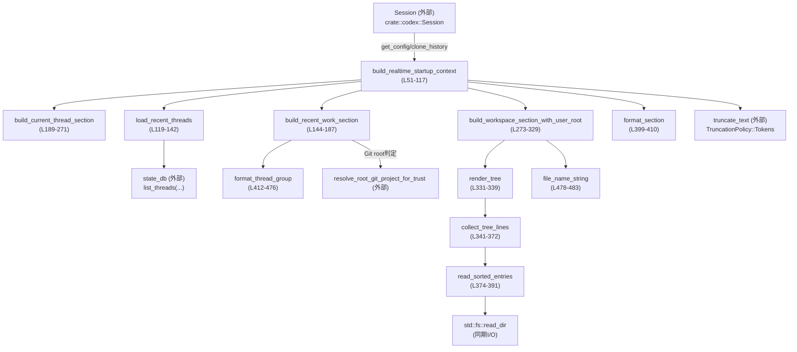
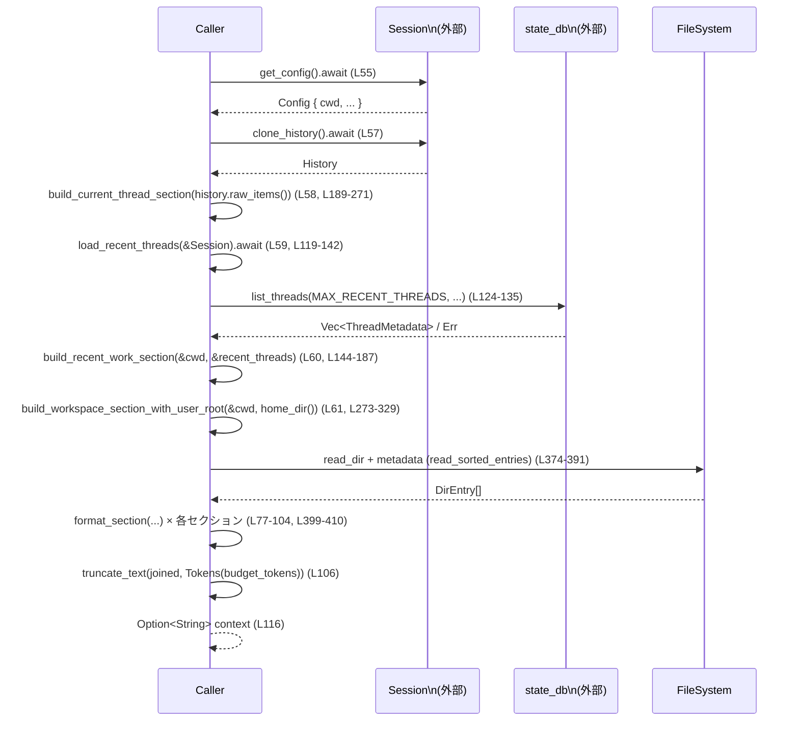

core/src/realtime_context.rs

---

## 0. ざっくり一言

- セッション履歴・永続化されたスレッド情報・ローカルファイルシステムを用いて、**リアルタイム起動時に LLM に渡す「スタートアップコンテキスト」文字列を構築するモジュール**です（`core/src/realtime_context.rs:L51-117`）。

---

## 1. このモジュールの役割

### 1.1 概要

- このモジュールは、リアルタイム対話開始時に LLM に渡すための **背景コンテキスト文字列**を構築するために存在します。
- 主な情報源は:
  - 現在のスレッドの直近のやりとり（ユーザー／アシスタント）`ResponseItem`（`L189-271`）
  - ステート DB に保存された最近のスレッドのメタデータ `ThreadMetadata`（`L119-187`, `L412-476`）
  - ローカルワークスペース（カレントディレクトリ・Git ルート・ユーザホームのツリー）`L273-372`
- これらをまとめて、トークン数制限内に収まるようトリミングした Markdown テキストを返します（`L51-117`, `L399-410`）。

### 1.2 アーキテクチャ内での位置づけ

- 主要な依存関係と呼び出し関係を簡略化した図です（このファイルのみが対象です）。



- `build_realtime_startup_context` がモジュールの入口であり、必要なサブ関数を順次呼び出してコンテキスト文字列を構築します。

### 1.3 設計上のポイント

- **責務の分割**
  - スタートアップコンテキスト構築本体: `build_realtime_startup_context`（`L51-117`）
  - 最近スレッドの取得: `load_recent_threads`（`L119-142`）
  - 最近の作業グループ要約: `build_recent_work_section` + `format_thread_group`（`L144-187`, `L412-476`）
  - 現在スレッド要約: `build_current_thread_section`（`L189-271`）
  - ワークスペースツリー構築: `build_workspace_section_with_user_root` + `render_tree` + `collect_tree_lines` + `read_sorted_entries`（`L273-372`, `L374-391`）
- **状態管理**
  - このモジュール内で長期的な状態は持たず、関数は基本的に引数から新しい文字列を組み立てて返す構造になっています。
- **エラーハンドリング方針**
  - DB やファイルシステム等の I/O エラーは、**ログ出力して空データとして扱う**ことで、スタートアップコンテキスト構築全体の失敗を避けています（`L119-142`, `L346-349`）。
  - `Option` と `Result` を活用し、`None` や空ベクタにフォールバックする構造です。
- **並行性・非同期**
  - 外部サービスとの通信（`Session` / state DB）は `async`/`await` で非同期処理として扱われます（`L51-60`, `L119-135`）。
  - 一方、ファイルシステム操作（`std::fs::read_dir`）は同期 I/O です（`L374-391`）。非同期コンテキスト内で実行されるため、ブロッキング I/O を含む点が挙げられます。
- **トークン制御**
  - セクションごと・全体でトークン数の上限を持ち、`truncate_text` によって内容をカットする設計です（`L24-37`, `L77-104`, `L106`, `L399-410`）。
- **安全性**
  - `unsafe` コードは存在せず、パニックを起こしうる箇所も見当たりません（`unwrap` は使用していません）。

---

## 2. 主要な機能一覧

### 2.1 機能の概要

- スタートアップコンテキスト構築
- 最近スレッド情報の取得とグルーピング
- 現在スレッドの直近ターン抽出
- ワークスペース（ディレクトリツリー）の要約表示
- セクションごとのフォーマットとトークン数制限管理

### 2.2 コンポーネントインベントリー（関数・定数）

このチャンク（1/1）に含まれる主なコンポーネント一覧です。

| 名前 | 種別 | 役割 / 用途 | 定義位置 |
|------|------|-------------|----------|
| `STARTUP_CONTEXT_HEADER` | 定数 `&'static str` | コンテキスト全体の先頭に付与する説明ヘッダ | `core/src/realtime_context.rs:L24` |
| `CURRENT_THREAD_SECTION_TOKEN_BUDGET` | 定数 | 「Current Thread」セクションのトークン上限 | `L25` |
| `RECENT_WORK_SECTION_TOKEN_BUDGET` | 定数 | 「Recent Work」セクションのトークン上限 | `L26` |
| `WORKSPACE_SECTION_TOKEN_BUDGET` | 定数 | 「Machine / Workspace Map」セクションのトークン上限 | `L27` |
| `NOTES_SECTION_TOKEN_BUDGET` | 定数 | 「Notes」セクションのトークン上限 | `L28` |
| `MAX_CURRENT_THREAD_TURNS` | 定数 | 現在スレッドから保持するターン数 | `L29` |
| `MAX_RECENT_THREADS` | 定数 | state DB から取得する最大スレッド数 | `L30` |
| `MAX_RECENT_WORK_GROUPS` | 定数 | 最近の作業グループ数の上限 | `L31` |
| `MAX_CURRENT_CWD_ASKS` | 定数 | カレントディレクトリグループの最大「ask」数 | `L32` |
| `MAX_OTHER_CWD_ASKS` | 定数 | その他グループの最大「ask」数 | `L33` |
| `MAX_ASK_CHARS` | 定数 | ask を切り詰める文字数上限 | `L34` |
| `TREE_MAX_DEPTH` | 定数 | ディレクトリツリーの最大再帰深さ | `L35` |
| `DIR_ENTRY_LIMIT` | 定数 | 1 ディレクトリあたり列挙するエントリ数上限 | `L36` |
| `APPROX_BYTES_PER_TOKEN` | 定数 | ログ用の「バイト数→トークン数」概算係数 | `L37` |
| `NOISY_DIR_NAMES` | 定数スライス | 除外する「ノイジー」ディレクトリ名一覧 | `L38-49` |
| `build_realtime_startup_context` | 非公開 API (`pub(crate)` async 関数) | スタートアップコンテキストの構築入口 | `L51-117` |
| `load_recent_threads` | async 関数 | state DB から最近スレッド一覧を取得 | `L119-142` |
| `build_recent_work_section` | 関数 | 最近の作業を Git ルート／ディレクトリごとに要約 | `L144-187` |
| `build_current_thread_section` | 関数 | 現スレッドの最近のユーザー／アシスタントターンを要約 | `L189-271` |
| `build_workspace_section_with_user_root` | 関数 | cwd / Git ルート / user root のツリーを出力 | `L273-329` |
| `render_tree` | 関数 | ルートディレクトリからツリー文字列を生成 | `L331-339` |
| `collect_tree_lines` | 関数 | ディレクトリツリーを再帰的に列挙し行として追加 | `L341-372` |
| `read_sorted_entries` | 関数 | ディレクトリエントリをフィルタ・ソートして取得 | `L374-391` |
| `is_noisy_name` | 関数 | ノイジーな名前か判定 | `L394-397` |
| `format_section` | 関数 | セクションタイトル＋本文の Markdown 文字列を構築 | `L399-410` |
| `format_thread_group` | 関数 | 1 作業グループのサマリ（セッション数・最新時刻・asks）を組み立て | `L412-476` |
| `file_name_string` | 関数 | パスからファイル／ディレクトリ名の文字列を抽出 | `L478-483` |
| `approx_token_count` | 関数 | バイト長から概算トークン数を算出 | `L485-487` |
| `tests` | モジュール（cfg(test)） | テストコードへのパス参照 | `L489-491` |

---

## 3. 公開 API と詳細解説

### 3.1 型一覧（構造体・列挙体など）

このモジュール内で **新しく定義された公開型はありません**。

参考として、外部から利用している主な型のみ記します（定義はこのチャンクにはありません）。

| 名前 | 種別 | 役割 / 用途 | 備考 |
|------|------|-------------|------|
| `Session` | 構造体（外部） | 設定・履歴・サービス（state DB など）へのアクセスを提供すると推測されます | `use crate::codex::Session;`（`L1`）※詳細はこのチャンクにはありません |
| `ThreadMetadata` | 構造体（外部） | スレッドの cwd・更新時刻・Git ブランチ・最初のユーザーメッセージなどを保持 | `L8`, `L144-187`, `L412-476`からフィールド名のみ分かります |
| `ResponseItem` | 列挙体（外部） | メッセージ（role, content など）を表現 | `L6`, `L189-228` で `Message { role, content, .. }` バリアントが使われています |
| `SortKey` | 列挙体（外部） | スレッド一覧取得のソートキー | `L7`, `L124-129` |
| `TruncationPolicy` | 列挙体（外部） | テキスト切り詰めのポリシー | `L9`, `L106`, `L408-409` |

※ いずれも実装はこのチャンクには現れないため、詳細は不明です。

---

### 3.2 関数詳細（重要な 7 件）

#### `build_realtime_startup_context(sess: &Session, budget_tokens: usize) -> Option<String>`

**定義位置**: `core/src/realtime_context.rs:L51-117`

**概要**

- リアルタイム起動時に LLM に渡すコンテキスト文字列を組み立てます。
- 現在スレッド・最近のスレッド・ワークスペースツリーの 3 セクション（＋Notes）を構築し、トークン数上限内に収まるようトリミングします（`L58-61`, `L77-104`, `L106`）。

**引数**

| 引数名 | 型 | 説明 |
|--------|----|------|
| `sess` | `&Session` | 設定・履歴・state DB などへのアクセスを行うセッションオブジェクト（`L55-60`, `L119-135`） |
| `budget_tokens` | `usize` | コンテキスト全体のトークン数上限。`truncate_text` に `TruncationPolicy::Tokens(budget_tokens)` として渡されます（`L106`）。 |

**戻り値**

- `Option<String>`:
  - `Some(context)` : 1 つ以上のセクションが生成できた場合の Markdown 文字列。
  - `None` : すべてのセクションが `None` または空となり、注入するコンテキストがない場合（`L63-69`）。

**内部処理の流れ**

1. `sess.get_config().await` で設定を取得し、`cwd` を取得（`L55-56`）。
2. `sess.clone_history().await` から履歴を取り、`build_current_thread_section` で現在スレッドセクションを構築（`L57-58`, `L189-271`）。
3. `load_recent_threads(sess).await` で最近スレッドメタデータを取得し、`build_recent_work_section` で最近作業セクションを構築（`L59-60`, `L119-187`）。
4. `home_dir()` と `build_workspace_section_with_user_root` でワークスペースセクションを構築（`L61`, `L273-329`）。
5. 3 つのセクションがすべて `None` の場合は、デバッグログを出して `None` を返す（`L63-69`）。
6. `STARTUP_CONTEXT_HEADER` を先頭に、各セクションを `format_section` 経由で条件付き追加（`L71-83`, `L84-97`, `L98-104`, `L399-410`）。
7. 固定の「Notes」セクションを追加（`L98-104`）。
8. `parts.join("\n\n")` で結合後、`truncate_text(..., TruncationPolicy::Tokens(budget_tokens))` で全体をトークン上限に合わせて切り詰める（`L106`）。
9. `approx_token_count` による概算トークン数とともに `debug!` ログ、そして `info!` で最終コンテキスト文字列をログ出力し `Some(context)` を返す（`L107-116`, `L485-487`）。

**Examples（使用例）**

```rust
// 非同期コンテキスト内での使用例
async fn build_prompt(sess: &Session) -> anyhow::Result<()> {
    // スタートアップコンテキストを 4000 トークン上限で生成する             // budget_tokens に 4000 を指定
    if let Some(ctx) = build_realtime_startup_context(sess, 4_000).await { // Option<String> を受け取る
        // LLM に渡すシステムプロンプトなどに埋め込む                          // 生成されたコンテキストを利用
        println!("Startup context:\n{}", ctx);                             // ここでは標準出力に出しているだけ
    }
    Ok(())
}
```

**Errors / Panics**

- この関数自身は `Result` を返さず、**パニックを起こしうる `unwrap` なども使用していません**。
- 依存先のエラーは内部でハンドリングされています:
  - state DB からの取得失敗: `load_recent_threads` 内で `warn!` ログを出し、空ベクタにフォールバック（`L119-142`）。
  - ファイルシステムの読み取り失敗: ツリー構築側で `Err(_) => return` として、その部分のツリーをスキップ（`L346-349`）。
- よって、この関数の呼び出し側から見ると、**失敗は `None` または情報が少ないコンテキストとして現れる**のみです。

**Edge cases（エッジケース）**

- `budget_tokens == 0` の場合:
  - `truncate_text` 実装次第ですが、ポリシー上、ほぼ空の文字列が返されると考えられます（詳細実装はこのチャンクにはありません）。
- `sess.services.state_db` が `None` の場合:
  - `load_recent_threads` が空ベクタを返し、「Recent Work」セクションが空になり得ます（`L119-122`, `L144-187`）。
- 履歴がない／すべて contextual ユーザーメッセージのみ:
  - `build_current_thread_section` が `None` を返し、「Current Thread」セクションが生成されません（`L189-271`）。
- cwd / git root / user root がいずれもディレクトリでない・読めない:
  - `build_workspace_section_with_user_root` が `None` を返します（`L273-295`, `L331-339`）。

**使用上の注意点**

- **非同期コンテキスト必須**: `async fn` のため、`.await` できる環境（`tokio` などのランタイム）が必要です（`L51`）。
- **ブロッキング I/O を含む**:
  - 内部で同期版の `std::fs::read_dir` を呼び出すため（`L374-381`）、高頻度で呼ぶと非同期ランタイムのスレッドをブロックし得ます。
  - 実行タイミング（例: アプリ起動時のみ）を考慮する必要があります。
- **ログにコンテキスト全文が出力される**:
  - `info!("realtime startup context: {context}")` により、ユーザーの過去発話やファイルパス等がログに記録されます（`L115`）。
  - プライバシー・セキュリティ上、ログ設定には注意が必要です。

---

#### `load_recent_threads(sess: &Session) -> Vec<ThreadMetadata>`

**定義位置**: `core/src/realtime_context.rs:L119-142`

**概要**

- state DB サービスから、更新時刻順に最大 `MAX_RECENT_THREADS` 件のスレッドメタデータを取得します。
- 取得に失敗した場合は警告をログに出し、空ベクタを返します。

**引数**

| 引数名 | 型 | 説明 |
|--------|----|------|
| `sess` | `&Session` | `services.state_db` にアクセスするためのセッション |

**戻り値**

- `Vec<ThreadMetadata>`:
  - 正常時: 取得したスレッドメタデータ一覧（`page.items`）（`L136`）。
  - state DB 未設定または取得失敗時: 空ベクタ（`L119-122`, `L137-140`）。

**内部処理の流れ**

1. `sess.services.state_db.as_ref()` で state DB の有無を確認。`None` なら即座に `Vec::new()` を返す（`L119-122`）。
2. `list_threads` を `await` し、`MAX_RECENT_THREADS` 件を `SortKey::UpdatedAt` 順で取得（`L124-135`）。
3. 結果が `Ok(page)` の場合は `page.items` を返す（`L136`）。
4. `Err(err)` の場合は `warn!` ログを出力し、`Vec::new()` を返す（`L137-140`）。

**Errors / Panics**

- `load_recent_threads` 自体はパニックしません。
- state DB のエラーは `Err(err)` として返りますが、ここでログ出力し、呼び出し側に `Result` として伝播しません（`L137-140`）。

**Edge cases**

- `sess.services.state_db` が設定されていない場合:
  - ログも出さずにただ空ベクタを返します（`L119-122`）。
- `list_threads` が空ページを返した場合:
  - 単に `page.items` が空ベクタとして返るだけです。

**使用上の注意点**

- エラーが `Result` として表面化しないため、呼び出し側では **「空 = データなし／エラーいずれもあり得る」** という前提で扱う必要があります。
- 同期的に heavy な処理はなく、非同期 I/O のみに依存しています。

---

#### `build_recent_work_section(cwd: &Path, recent_threads: &[ThreadMetadata]) -> Option<String>`

**定義位置**: `core/src/realtime_context.rs:L144-187`

**概要**

- `recent_threads` を Git ルートまたは cwd ディレクトリごとにグルーピングし、最近の作業セッションを要約したテキストを構築します。
- LLM にとって有用な「最近のユーザーの質問（ask）」リストを生成する役割を持ちます。

**引数**

| 引数名 | 型 | 説明 |
|--------|----|------|
| `cwd` | `&Path` | 現在の作業ディレクトリ。グルーピングや表示順の基準に使用（`L152-153`）。 |
| `recent_threads` | `&[ThreadMetadata]` | 最近のスレッドメタデータ一覧（`L145-150`）。 |

**戻り値**

- `Option<String>`:
  - `Some(text)` : 1 つ以上のグループで `format_thread_group` が有効なテキストを返した場合。
  - `None` : すべてのグループが無視され、セクションを構成できなかった場合（`L186-187`）。

**内部処理の流れ**

1. `recent_threads` を `cwd` または Git ルート単位で `HashMap<PathBuf, Vec<&ThreadMetadata>>` にグループ化（`L145-150`）。
   - `resolve_root_git_project_for_trust(&entry.cwd)` が `Some` ならそれをグループキーに、`None` なら `entry.cwd.clone()` を使用（`L147-149`）。
2. 現在の `cwd` に対するグループキー `current_group` を同様に計算（`L152-153`）。
3. `groups` を `Vec` に変換してソート（`L154-176`）:
   - カレントグループを先頭に（`*left_group != current_group` で bool 比較）。
   - 各グループ内最新更新時刻の降順（`Reverse(left_latest)`）。
   - パス文字列順（`left_group.as_os_str()`）。
4. 上位 `MAX_RECENT_WORK_GROUPS` 件を対象に、各グループのエントリを更新時刻降順に並べ替え（`L178-183`）。
5. `format_thread_group` でグループサマリ文字列を生成し、`filter_map` で `None` を除外（`L181-184`, `L412-476`）。
6. 結果ベクタが非空なら `Some(join("\n\n"))`、空なら `None`（`L185-187`）。

**Errors / Panics**

- この関数内には I/O や `unwrap` がなく、パニックを起こしそうな箇所はありません。
- `Utc::now()` を `max()` のフォールバックに使用していますが、グループ内エントリは必ず 1 件以上存在するため、本来到達しないケースを安全側でカバーしている形です（`L156-165`）。

**Edge cases**

- `recent_threads` が空:
  - `groups` も空になり、`sections.is_empty()` のため `None` を返します（`L178-187`）。
- すべてのグループで `format_thread_group` が `None`（ユーザ ask が一切無いなど）:
  - 同様に `None` になります。
- `cwd` に対応するグループが存在しない:
  - ソート順の「current_group 優先」の効果は消えますが、処理自体は通常通り動きます。

**使用上の注意点**

- `ThreadMetadata` に `updated_at` や `cwd` などが適切にセットされていないと、グルーピングや表示順が期待と異なる可能性があります。
- `resolve_root_git_project_for_trust` の挙動に依存しているため、この関数の意味的な出力はその実装に左右されます（実装はこのチャンクにはありません）。

---

#### `build_current_thread_section(items: &[ResponseItem]) -> Option<String>`

**定義位置**: `core/src/realtime_context.rs:L189-271`

**概要**

- 現在のスレッド履歴 `ResponseItem` から、直近のユーザー／アシスタントのターン（最大 `MAX_CURRENT_THREAD_TURNS`）を抽出し、Markdown 形式のセクションを構築します。
- LLM が「このスレッドで直前に何が話されていたか」を理解するための文脈を提供します。

**引数**

| 引数名 | 型 | 説明 |
|--------|----|------|
| `items` | `&[ResponseItem]` | スレッド履歴。`Message { role, content, .. }` バリアントが利用されます（`L195-226`）。 |

**戻り値**

- `Option<String>`:
  - `Some(text)` : 有効なユーザーまたはアシスタントメッセージが 1 つ以上ある場合。
  - `None` : 全く有効なメッセージがない場合（`L242-244`）。

**内部処理の流れ**

1. `turns`, `current_user`, `current_assistant` の 3 つのベクタを初期化（`L190-192`）。
2. `items` を順に走査し、`ResponseItem::Message` を role ごとに処理（`L194-226`）:
   - `role == "user"`:
     - `is_contextual_user_message_content(content)` が `true` ならスキップ（`L196-199`）。
     - `content_items_to_text(content)` をテキスト化し、トリム＆非空チェック（`L200-205`）。
     - 既に `current_user` か `current_assistant` にメッセージが溜まっていれば、それを 1 ターンとして `turns` に push し、両ベクタを `std::mem::take` でリセット（`L206-211`）。
     - 新しいテキストを `current_user` に追加（`L212`）。
   - `role == "assistant"`:
     - ユーザーと同様にテキスト変換・トリム・非空チェック（`L215-220`）。
     - ユーザー／アシスタントの両方が空の状態なら、このアシスタントメッセージはスキップ（`L221-223`）。
     - それ以外なら `current_assistant` に追加（`L224`）。
   - その他のバリアントは無視（`L226`）。
3. ループ終了後、`current_user` または `current_assistant` に残っているメッセージがあれば、それを最後のターンとして `turns` に追加（`L230-232`）。
4. `turns` を逆順にしてから `MAX_CURRENT_THREAD_TURNS` 件だけ取り出し、再び元の順に並べ直すことで「直近から最大 N ターン」を保持（`L234-241`）。
5. 保持ターンが空なら `None` を返す（`L242-244`）。
6. 説明文 1 行を先頭に、各ターンごとに:
   - `"### Latest turn"` または `"### Prior turn {i}"` の見出し（`L250-257`）。
   - `"User:"` セクションとユーザーメッセージ（複数行は `\n\n` で結合）（`L259-262`）。
   - `"Assistant:"` セクションとアシスタントメッセージ（`L263-267`）。
7. 行を `\n` で結合して `Some(...)` を返す（`L270`）。

**Errors / Panics**

- I/O や外部呼び出しはなく、パニックを起こしうる箇所もありません。
- `content_items_to_text` や `is_contextual_user_message_content` の内部で何が起きるかはこのチャンクにはありませんが、この関数からは `Result` を返しません。

**Edge cases**

- すべてのユーザーメッセージが `is_contextual_user_message_content` によってフィルタされる場合:
  - 有効なユーザーメッセージがなく、`turns` が空のままになり、`None` を返します。
- アシスタントメッセージのみ（先頭から）存在する場合:
  - `current_user` / `current_assistant` が最初は両方空なので、最初のアシスタントメッセージはスキップされます（`L221-223`）。
  - 以降にもユーザーメッセージがなければターンは生成されません。
- 1 つのターン内に複数のユーザー／アシスタントメッセージがある場合:
  - それぞれ改行空行 `\n\n` で結合され、1 ブロックとして出力されます（`L261`, `L266`）。

**使用上の注意点**

- `ResponseItem` の `role` は `"user"` / `"assistant"` の文字列で判定しているため、他のロール（system など）は無視されます（`L195-226`）。
- 「ターン」の区切りは、「新たな user メッセージが来たタイミング」で、それ以前に溜まっていた user/assistant メッセージペアを 1 ターンとみなすルールに依存します（`L206-213`）。

---

#### `build_workspace_section_with_user_root(cwd: &Path, user_root: Option<PathBuf>) -> Option<String>`

**定義位置**: `core/src/realtime_context.rs:L273-329`

**概要**

- カレントディレクトリ (`cwd`)、その Git ルート（存在すれば）、ユーザルート (`user_root`) を基準に、簡易的なディレクトリツリーを Markdown 形式で出力するセクションを構築します。

**引数**

| 引数名 | 型 | 説明 |
|--------|----|------|
| `cwd` | `&Path` | 現在の作業ディレクトリ（`L273-275`）。 |
| `user_root` | `Option<PathBuf>` | ユーザのホームディレクトリなどを想定（`home_dir()` の結果が渡される、`L61`）。 |

**戻り値**

- `Option<String>`:
  - `Some(text)` : 少なくとも 1 つのツリーまたは Git root 情報等を表示可能な場合。
  - `None` : すべてのツリーが取得できず、Git ルートも存在しない場合（`L293-295`）。

**内部処理の流れ**

1. `resolve_root_git_project_for_trust(cwd)` により Git ルートパスを推測（`L277`）。
2. `render_tree(cwd)` で cwd のツリーを取得（`L278`, `L331-339`）。
3. Git ルートが存在し、`cwd` と異なる場合のみ `render_tree(git_root)` を実行（`L279-282`）。
4. `user_root` が存在し、`cwd` や `git_root` と異なる場合のみ `render_tree(user_root)` を実行（`L283-291`）。
5. `cwd_tree`, `git_root`, `user_root_tree` のすべてが `None` なら `None` を返す（`L293-295`）。
6. それ以外の場合、以下の情報行を `lines` に追加（`L297-308`）:
   - `Current working directory: {cwd.display()}`
   - `Working directory name: {file_name_string(cwd)}`
   - Git root / Git project 名（存在する場合）
   - User root（存在する場合）
7. 各ツリーが `Some(vec)` の場合:
   - 空行 + `"Working directory tree:"` などの見出し（`L311-325`）。
   - `render_tree` からの各行を追加。
8. 最終的に `lines.join("\n")` を `Some` として返す（`L328`）。

**Errors / Panics**

- `render_tree` やその内部の `read_sorted_entries` で I/O エラーが発生した場合、そのツリー部分は単に `None` と見なされます（`L331-339`, `L346-349`）。
- パニックを起こしうる `unwrap` やインデックスアクセスはありません。

**Edge cases**

- `cwd` がディレクトリでない場合:
  - `render_tree(cwd)` は `None` になりますが、`Current working directory: ...` の行は出力されます。
- `git_root` が `Some` だが、そのディレクトリが読めない場合:
  - Git root 路径情報は出力されますが、`Git root tree` セクションは欠落します（`L279-283`, `L331-349`）。
- `user_root` が `Some` だが、`cwd` および `git_root` と同じパスの場合:
  - `filter` によってツリー表示対象から除外されます（`L283-291`）。

**使用上の注意点**

- `render_tree` が深さとエントリ数に制限をかけているため、大規模なディレクトリでも出力が暴走しない設計になっていますが、**出力はあくまでスナップショット的な一部**である点に注意が必要です（`TREE_MAX_DEPTH`, `DIR_ENTRY_LIMIT`, `L341-372`）。
- ファイル名やディレクトリ名が LLM に渡されるため、パス情報が機密に該当しないかの検討が必要です。

---

#### `collect_tree_lines(dir: &Path, depth: usize, lines: &mut Vec<String>)`

**定義位置**: `core/src/realtime_context.rs:L341-372`

**概要**

- 指定ディレクトリ以下を再帰的に走査し、Markdown 風の箇条書き形式で `lines` に追加します。
- 深さとエントリ数に制限を設けているため、ツリー表示が無制限に膨らむことを防ぎます。

**引数**

| 引数名 | 型 | 説明 |
|--------|----|------|
| `dir` | `&Path` | 走査対象ディレクトリ（`L341`）。 |
| `depth` | `usize` | 現在の再帰深さ。0 がルート（`L341-343`）。 |
| `lines` | `&mut Vec<String>` | 出力行を蓄積する可変ベクタ（`L341`, `L336-338`）。 |

**戻り値**

- なし（`()`）。`lines` 引数に副作用として行を追加します。

**内部処理の流れ**

1. `depth >= TREE_MAX_DEPTH` の場合は即時 return（`L342-344`）。
2. `read_sorted_entries(dir)` でディレクトリエントリを取得し、エラーなら return（`L346-349`）。
3. `entries.len()` を `total_entries` として保持（`L350`）。
4. `entries.into_iter().take(DIR_ENTRY_LIMIT)` で最大 `DIR_ENTRY_LIMIT` 件まで処理（`L352-353`）。
5. 各 `entry` について:
   - `entry.file_type()` を取得し失敗した場合は continue（`L353-355`）。
   - `file_name_string(&entry.path())` で表示名を取得（`L356`）。
   - `"  ".repeat(depth)` でインデントを計算（`L357`）。
   - ディレクトリの場合は末尾に `/` を付けてフォーマットし、`lines.push`（`L358-359`）。
   - ディレクトリであれば `collect_tree_lines` を深さ +1 で再帰呼び出し（`L360-361`）。
6. `total_entries > DIR_ENTRY_LIMIT` の場合、残り件数を `"  ".repeat(depth)` インデント付きで `"- ... {n} more entries"` として追加（`L365-371`）。

**Errors / Panics**

- `read_sorted_entries` からの `Err` は単に無視され、そのディレクトリ配下のツリーは出力されません（`L346-349`）。
- それ以外にパニックを起こす箇所はありません。

**Edge cases**

- 非ディレクトリパスが渡された場合:
  - 上位の `render_tree` で弾かれる設計のため、通常ここには到達しません（`L331-333`）。
- ディレクトリ内に `DIR_ENTRY_LIMIT` より多くのエントリがある場合:
  - 最初の `DIR_ENTRY_LIMIT` 件のみ列挙し、残り件数を 1 行で要約します（`L352-371`）。

**使用上の注意点**

- 再帰深さとエントリ数上限により、ツリーが完全ではない点に注意が必要です。
- `is_noisy_name` により一部のディレクトリ（`.git` や `node_modules` など）はそもそも列挙対象から除外されます（`L374-381`, `L394-397`）。

---

#### `format_thread_group(current_group: &Path, group: &Path, entries: Vec<&ThreadMetadata>) -> Option<String>`

**定義位置**: `core/src/realtime_context.rs:L412-476`

**概要**

- 1 つの作業グループ（Git リポジトリまたはディレクトリ）について、セッション数・最新活動時刻・最新ブランチ・代表的なユーザーの「ask」を列挙したテキストを構築します。
- 「Recent Work」セクションの 1 グループぶんの本文を担当します。

**引数**

| 引数名 | 型 | 説明 |
|--------|----|------|
| `current_group` | `&Path` | カレントディレクトリに対応するグループキー（`L441-445`）。 |
| `group` | `&Path` | このグループ自体のパス。ヘッダ表示や ask のプレフィックスに利用。 |
| `entries` | `Vec<&ThreadMetadata>` | このグループに属するスレッドメタデータ群。先頭要素が「最新」として扱われます（`L417-427`）。 |

**戻り値**

- `Option<String>`:
  - `Some(text)` : 少なくとも 1 つ以上の「User asks」行を含む場合（`lines.len() > 5` 条件、`L475`）。
  - `None` : ask が 1 行も追加されなかった場合など。

**内部処理の流れ**

1. `entries.first()?` で最新エントリを取得。なければ `None`（`L417`）。
2. `resolve_root_git_project_for_trust(latest.cwd.as_path()).is_some()` に基づき、見出しを `"### Git repo: {group}"` または `"### Directory: {group}"` として決定（`L418-422`）。
3. 初期行として以下を `lines` に追加（`L423-427`）:
   - グループ見出し
   - `Recent sessions: {entries.len()}`
   - `Latest activity: {latest.updated_at.to_rfc3339()}`
4. 最新エントリに `git_branch` が存在し非空なら、`"Latest branch: {git_branch}"` 行を追加（`L429-435`）。
5. 空行＋`"User asks:"` 行を追加（`L437-438`）。
6. `HashSet` `seen` を作成し、`group == current_group` かどうかで `max_asks` を `MAX_CURRENT_CWD_ASKS` / `MAX_OTHER_CWD_ASKS` から選択（`L440-445`）。
7. `entries` を順に走査し、以下を実施（`L447-473`）:
   - `first_user_message` が `None` ならスキップ（`L448-450`）。
   - `split_whitespace().collect::<Vec<_>>().join(" ")` で空白を正規化した `ask` を作成（`L451-454`）。
   - `dedupe_key = "{cwd}:{ask}"` でグループ内重複を除外（`L455-457`）。
   - `ask` が空でないかつ未出現なら、`MAX_ASK_CHARS` を超える場合に末尾 `...` を付けて切り詰め（`L459-467`）。
   - `"- {cwd}: {ask}"` として `lines` に追加（`L469`）。
   - `seen.len() == max_asks` に達したら break（`L470-472`）。
8. 最終的に `lines.len() > 5`（= 少なくとも 1 行以上の ask がある）場合に `Some(join("\n"))`、そうでなければ `None` を返す（`L475`）。

**Errors / Panics**

- ここでも I/O なし・パニック要因なしです。
- `first_user_message` は `Option<String>` と推測されますが、`as_deref()` と `let Some(...)` で安全に扱っています（`L448-450`）。

**Edge cases**

- すべての `ThreadMetadata` が `first_user_message == None`:
  - ask 行が追加されず、`lines.len() == 5` のままのため `None` が返ります。
- すべて同じ ask 内容で cwd も同じ:
  - `HashSet` により 1 行のみが出力されます（`L455-457`）。
- ask が長大なテキスト:
  - `MAX_ASK_CHARS` 文字で切り詰められ、末尾に `...` が付与されます（`L459-466`）。

**使用上の注意点**

- カレントグループの ask 上限は `MAX_CURRENT_CWD_ASKS`（`L32`）、その他は `MAX_OTHER_CWD_ASKS`（`L33`）で、`format_thread_group` 内で制御されています。
- `first_user_message` に過度に長い全文を保存していると、ここで切り詰められた ask でもまだ長くなり得るため、上流での要約ロジックとの整合が重要になります。

---

#### `format_section(title: &str, body: Option<String>, budget_tokens: usize) -> Option<String>`

**定義位置**: `core/src/realtime_context.rs:L399-410`

**概要**

- Markdown のセクションを `## {title}` 見出し付きで組み立て、本文をトークン数上限で切り詰めて返します。

**引数**

| 引数名 | 型 | 説明 |
|--------|----|------|
| `title` | `&str` | セクションタイトル（例: `"Current Thread"`）。 |
| `body` | `Option<String>` | セクション本文。`None` または空白のみの場合はセクション自体を生成しません。 |
| `budget_tokens` | `usize` | `truncate_text` に渡すトークン上限（`L408-409`）。 |

**戻り値**

- `Option<String>`:
  - `Some("## title\n{truncated_body}")` : 本文が非空の場合。
  - `None` : `body` が `None` またはトリム後に空文字列となる場合（`L400-404`）。

**内部処理の流れ**

1. `let body = body?;` で `None` の場合は即 `None` を返す（`L400`）。
2. `body.trim()` で前後の空白を削除し、空なら `None`（`L401-404`）。
3. `truncate_text(body, TruncationPolicy::Tokens(budget_tokens))` で本文を切り詰め（`L408-409`）。
4. `"## {title}\n{body}"` 形式の文字列にまとめて `Some` として返す（`L406-409`）。

**使用上の注意点**

- `budget_tokens` は本文部分に対する上限であり、**全体の budget** とは独立です（全体はさらに `build_realtime_startup_context` でトリミングされます、`L106`）。
- 本文がすでに空の場合にセクションを生成しないことで、無意味な空セクションを避けています。

---

#### `build_realtime_startup_context` 以外の非同期・安全性について

- 非同期関数は `build_realtime_startup_context` と `load_recent_threads` の 2 つです（`L51`, `L119`）。
- 同期 I/O を含むのは `read_sorted_entries` のみであり、その呼び出しは `build_workspace_section_with_user_root` → `render_tree` → `collect_tree_lines` → `read_sorted_entries` というパスに限定されます（`L273-372`, `L374-391`）。
- `unsafe` コードは存在せず、`panic!` や `unwrap` も使われていないため、**通常の使用においてパニックが起こる可能性は低い**構造です。

---

### 3.3 その他の関数

| 関数名 | 役割（1 行） | 定義位置 |
|--------|--------------|----------|
| `render_tree(root: &Path) -> Option<Vec<String>>` | 指定パスがディレクトリであれば `collect_tree_lines` を用いてツリー行を収集し、空でなければ返す | `L331-339` |
| `read_sorted_entries(dir: &Path) -> io::Result<Vec<DirEntry>>` | `std::fs::read_dir` からノイジーな名前を除外し、ディレクトリ優先＋名前順にソートしたエントリ一覧を返す | `L374-391` |
| `is_noisy_name(name: &OsStr) -> bool` | `"."` で始まる名前や `NOISY_DIR_NAMES` に含まれる名前を「ノイジー」と判定する | `L394-397` |
| `file_name_string(path: &Path) -> String` | `path.file_name` を UTF-8 文字列として取得し、失敗時は `path.display()` をそのまま文字列化する | `L478-483` |
| `approx_token_count(text: &str) -> usize` | `text.len()` を `APPROX_BYTES_PER_TOKEN` で割り、切り上げた値を概算トークン数として返す | `L485-487` |

---

## 4. データフロー

### 4.1 代表的なシナリオ: スタートアップコンテキスト構築

`build_realtime_startup_context` を呼び出したときの、外部コンポーネントを含む処理の流れです。



要点:

- **外部非同期 I/O**:
  - 設定と履歴取得 (`Session`) と state DB (`list_threads`)。
- **同期 I/O**:
  - ファイルシステム走査 (`std::fs::read_dir`) は非同期関数の中で同期呼び出しされます。
- エラーは基本的に **ログ + フォールバック** として扱われ、`build_realtime_startup_context` の戻り値には `Option` しか現れません。

---

## 5. 使い方（How to Use）

### 5.1 基本的な使用方法

このモジュールの入口は `build_realtime_startup_context` です。典型的には、リアルタイム対話開始時に以下のように使われる想定です。

```rust
use crate::codex::Session;                                 // Session 型をインポート
use crate::realtime_context::build_realtime_startup_context; // 本モジュールの関数をインポート（実際のモジュールパスはこのチャンクからは不明）

async fn handle_realtime_session(sess: &Session) -> anyhow::Result<()> {
    // スタートアップコンテキストを生成する                                // 起動時に一度だけ呼ぶことを想定
    let startup_ctx = build_realtime_startup_context(sess, 4_000).await; // 4000 トークン上限で生成

    if let Some(ctx) = startup_ctx {
        // LLM に渡すシステム文脈として利用する                             // 例えば system メッセージに埋め込む
        // llm_client.send_system_context(ctx).await?;
        println!("Using startup context:\n{}", ctx);                       // デモとして標準出力
    } else {
        // 適切なコンテキストがない場合のフォールバック処理                 // 何もしない、等
    }

    Ok(())
}
```

### 5.2 よくある使用パターン

- **パターン A: 起動時のみ 1 回生成**
  - セッション開始時に一度だけ `build_realtime_startup_context` を呼び、その結果を LLM のシステムプロンプトに常に付与する。
- **パターン B: 条件付き生成**
  - `Session` に十分な履歴や state DB がない場合に `None` になるため、その場合は「コンテキストなし」として処理する。
- **パターン C: トークンバジェットの調整**
  - `budget_tokens` をモデルごとに変える（例: gpt-4 用に 6000、より小さいモデルには 2000 など）。

### 5.3 よくある間違い

```rust
// 間違い例: 同期関数の中で直接 .await を使おうとしている
fn main() {
    let sess = create_session();                      // 仮のセッション作成
    // let ctx = build_realtime_startup_context(&sess, 4000).await; // コンパイルエラー
}

// 正しい例: 非同期ランタイムの中で .await する
#[tokio::main]
async fn main() -> anyhow::Result<()> {
    let sess = create_session();                      // セッション作成
    let ctx = build_realtime_startup_context(&sess, 4_000).await; // OK: async コンテキスト内
    println!("{:?}", ctx);
    Ok(())
}
```

```rust
// 間違い例: None の可能性を無視して unwrap する
let ctx = build_realtime_startup_context(&sess, 4000).await.unwrap(); // コンテキストがない場合パニックの可能性

// 正しい例: Option を明示的に扱う
if let Some(ctx) = build_realtime_startup_context(&sess, 4000).await {
    // コンテキストあり
} else {
    // コンテキストなし
}
```

### 5.4 使用上の注意点（まとめ）

- **非同期実行環境が前提**:
  - `build_realtime_startup_context` と `load_recent_threads` は `async fn` です。
- **ブロッキング I/O**:
  - ディレクトリ走査は同期 I/O（`std::fs::read_dir`）のため、頻繁な呼び出しは避けるのが安全です（`L374-381`）。
- **プライバシー・セキュリティ**:
  - 出力にはユーザーの過去の質問、ローカルファイルパス、Git ブランチ名など、潜在的に秘匿性のある情報が含まれます（`L297-307`, `L423-435`, `L469`）。
  - さらに、それらが `info` ログにそのまま出力されます（`L115`）。ログの出力先やレベル設定には注意が必要です。
- **エラー検出**:
  - 多くのエラーが「空のセクション」や「情報不足」としてのみ表面化するため、トラブルシューティング時はログ（`debug!`, `info!`, `warn!`）を確認することが重要です。

---

## 6. 変更の仕方（How to Modify）

### 6.1 新しい機能を追加する場合

例えば「最近のメモリーサマリ」セクションを追加する場合の手順です。

1. **セクション本文構築関数の追加**
   - `build_recent_memory_section(...) -> Option<String>` のような関数を本ファイルに追加し、必要な情報源からテキストを組み立てます。
   - `build_current_thread_section` や `build_recent_work_section` のパターンを参考に、`Option<String>` を返すようにします。
2. **トークンバジェット定数の追加**
   - ファイル先頭付近に `const RECENT_MEMORY_SECTION_TOKEN_BUDGET: usize = ...;` を追加（`L24-37` を参考）。
3. **`build_realtime_startup_context` への統合**
   - 新しいセクション構築関数を呼び、`format_section` を通して `parts` に条件付きで追加します（`L77-104` の既存の 3 セクション＋Notes と同様）。
4. **テストの追加**
   - `realtime_context_tests.rs`（`L489-491`）にテストケースを追加し、`None` および有効ケースを検証します（テスト内容自体はこのチャンクには現れません）。

### 6.2 既存の機能を変更する場合

- **トークンバジェットの変更**
  - 各セクションの上限は対応する定数で管理されています（`L25-28`）。
  - 値を変えると出力長が変わるため、LLM プロンプト全体の長さとのバランスを再確認する必要があります。
- **ディレクトリ走査の範囲調整**
  - `TREE_MAX_DEPTH`（`L35`）と `DIR_ENTRY_LIMIT`（`L36`）を変更するとツリー出力の詳細度が変わります。
  - 値を大きくしすぎると同期 I/O の負荷が増えます。
- **ノイジーディレクトリの調整**
  - `NOISY_DIR_NAMES`（`L38-49`）を変更することで、ツリー出力から除外するディレクトリを制御できます。
- **エラーの扱いを変えたい場合**
  - 例えば state DB エラーを呼び出し側に伝えたい場合、`load_recent_threads` の戻り値型を `Result<Vec<ThreadMetadata>, E>` に変更し、`build_realtime_startup_context` まで伝播させる設計変更が必要です。

---

## 7. 関連ファイル

| パス / モジュール | 役割 / 関係 |
|------------------|------------|
| `core/src/realtime_context_tests.rs` | `#[cfg(test)] mod tests;` で参照されるテストモジュール（`L489-491`）。テスト内容はこのチャンクには現れません。 |
| `crate::codex::Session` | このモジュールの主要な依存。設定・履歴・state DB などへのアクセスを提供します（`L1`, `L55-60`, `L119-122`）。ファイルパスはこのチャンクからは不明です。 |
| `codex_state::ThreadMetadata` | 最近スレッドやグループサマリを構築する際のメタデータとして使用されます（`L8`, `L144-187`, `L412-476`）。 |
| `codex_git_utils::resolve_root_git_project_for_trust` | 作業ディレクトリから Git ルートを特定する用途で使用されていますが、実装はこのチャンクにはありません（`L5`, `L147-149`, `L152-153`, `L277`, `L418-419`）。 |
| `codex_utils_output_truncation::{truncate_text, TruncationPolicy}` | 各セクションおよび全体のトークン数を制限するためのユーティリティです（`L9-10`, `L77-81`, `L84-88`, `L91-95`, `L98-103`, `L106`, `L406-409`）。 |

---

### Bugs / Security（このモジュールに関連する懸念点）

コードから読み取れる範囲での注意点をまとめます。

- **潜在的な情報漏えいリスク**
  - `info!("realtime startup context: {context}")` でコンテキスト全文（ユーザーの質問、ファイルパス、Git ブランチ等）がログに出力されます（`L115`）。
    - ログが外部に送信される環境では、プライバシー／機密情報の漏えいリスクとなり得ます。
- **エラーのサイレントな無視**
  - state DB 未設定 (`state_db.is_none()`) や `list_threads` の失敗、ディレクトリ読み取りエラーは、呼び出し側には `None` や空ベクタとしてしか現れず、アプリケーションロジックからは検知しにくいです（`L119-122`, `L137-140`, `L346-349`）。
- **同期 I/O の使用**
  - 非同期関数内で `std::fs::read_dir` 等の同期 I/O を使用しており、大規模なディレクトリ構造では非同期ランタイムのスレッドをブロックする可能性があります（`L374-381`）。
  - ただし `TREE_MAX_DEPTH` や `DIR_ENTRY_LIMIT` により負荷はある程度制限されています。

これらはいずれもコードから直接読み取れる事実に基づくものであり、アプリケーション全体での影響は周辺コンポーネントの設計次第となります。
