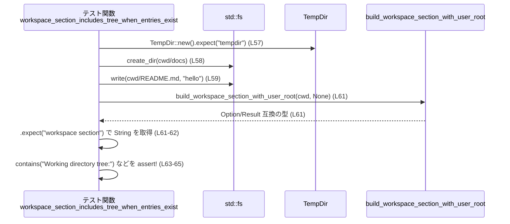
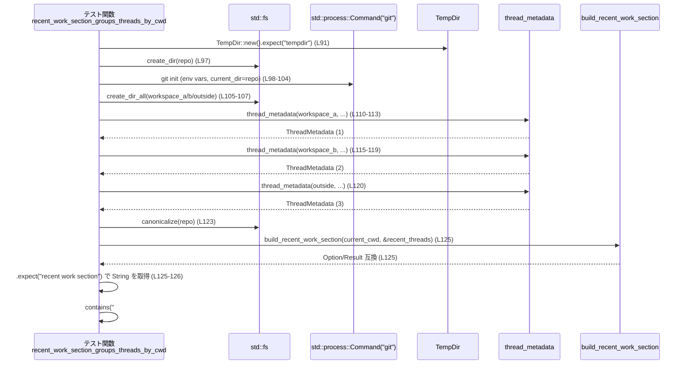
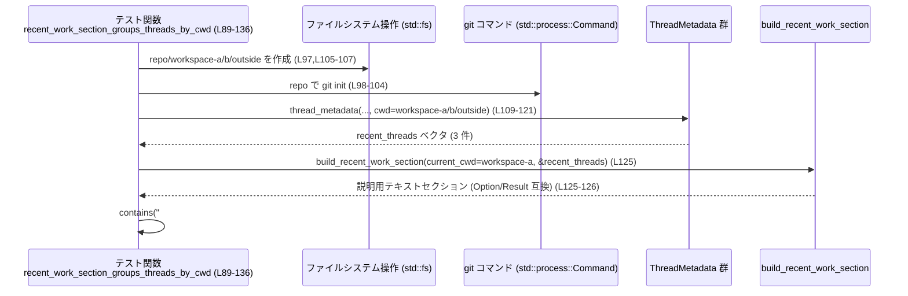

# core/src/realtime_context_tests.rs コード解説

## 0. ざっくり一言

このファイルは、リアルタイム起動コンテキスト中で使われる「ワークスペース情報」「最近の作業情報」を構築する関数群（`build_workspace_section_with_user_root` / `build_recent_work_section`）の振る舞いを検証するテストをまとめたモジュールです。あわせて、テスト用の `ThreadMetadata` を組み立てるヘルパー関数も定義されています（realtime_context_tests.rs:L13-43）。

---

## 1. このモジュールの役割

### 1.1 概要

- このモジュールは、リアルタイム文脈に差し込む説明セクションのうち、
  - カレントディレクトリ（ワークスペース）のツリー表示  
  - 最近のスレッド（セッション）を作業ディレクトリ／Git リポジトリ単位でグルーピングした一覧表示  
 について、**期待する文字列フォーマットとフィルタリングの契約**をテストで固定することを目的としています（realtime_context_tests.rs:L46-87,L89-135）。
- 具体的には、`super` モジュールに定義された以下の関数の出力を検証します（realtime_context_tests.rs:L1-2）。
  - `build_workspace_section_with_user_root`
  - `build_recent_work_section`

### 1.2 アーキテクチャ内での位置づけ

このファイル自身は **テストモジュール** であり、プロダクションコードからは呼ばれず、テストランナーからのみ実行されます。依存関係は次のようになっています。

```mermaid
graph TD
    subgraph "core/src/realtime_context_tests.rs (L1-136)"
        T[テストモジュール]
    end

    T --> WS[build_workspace_section_with_user_root<br/>（super モジュール）]
    T --> RW[build_recent_work_section<br/>（super モジュール）]
    T --> TM[ThreadMetadata<br/>(codex_state)]
    T --> TI[ThreadId<br/>(codex_protocol)]
    T --> Time[chrono::Utc<br/>timestamp_opt().single()]
    T --> Temp[tempfile::TempDir]
    T --> FS[std::fs]
    T --> Cmd[std::process::Command<br/>"git"]
    T --> Assert[pretty_assertions::assert_eq / assert!]
```

- `super::build_workspace_section_with_user_root` / `super::build_recent_work_section`  
  … テスト対象の関数。定義はこのチャンクには現れません（realtime_context_tests.rs:L1-2）。
- `ThreadMetadata` (`codex_state`) と `ThreadId` (`codex_protocol`)  
  … 「最近のセッション」のメタデータを表す型で、テスト用ヘルパー `thread_metadata` が構築します（realtime_context_tests.rs:L13-43, L109-121）。
- `TempDir` や `std::fs`, `std::process::Command("git")` を用いて、**実際のファイルシステム構造と Git リポジトリ** を再現し、その上で出力フォーマットを検証します（realtime_context_tests.rs:L48-52,L56-80,L90-107）。

### 1.3 設計上のポイント

- **テストデータ構築ヘルパーの分離**  
  `thread_metadata` 関数で `ThreadMetadata` の共通初期値を組み立て、テスト本体から詳細なフィールド設定を隠蔽しています（realtime_context_tests.rs:L13-43）。
- **決定的な日時・メタデータ**  
  日時は固定の Unix 時刻を `Utc.timestamp_opt(...).single().expect("valid timestamp")` で生成し（realtime_context_tests.rs:L17-24）、モデル名や Git ブランチも固定値とすることで、テスト結果が環境によらず安定するようにしています。
- **ファイルシステムを用いた現実に近い検証**  
  `tempfile::TempDir` と `std::fs` により、ディレクトリ構造やファイルを実際に作り、その `Path` をテスト対象関数に渡しています（realtime_context_tests.rs:L48-52,L56-80,L90-107）。
- **Git リポジトリ検出ロジックの検証**  
  `Command::new("git").args(["init"])` により本物の Git リポジトリを初期化し（realtime_context_tests.rs:L98-104）、`build_recent_work_section` が Git ルートを起点にセッションをグルーピングしていることを検証しています（realtime_context_tests.rs:L127-135）。
- **安全性 / エラー処理 / 並行性**  
  - すべての OS・I/O 操作は `expect("...")` によりエラー時に panic させる方針で、テスト失敗を即座に検知する設計です（realtime_context_tests.rs:L48,L57,L75-L80,L97-L98,L103-L104,L123）。
  - 各テストはそれぞれ独立したテンポラリディレクトリ配下で動作し、ディレクトリ名も毎回ランダムなため、テストハーネスが並列実行してもファイルパスの衝突が起こりにくい構成になっています（realtime_context_tests.rs:L48,L57,L70,L91）。

---

## 2. 主要な機能一覧（コンポーネントインベントリ）

### 2.1 このファイルで定義されている関数

| 名前 | 種別 | 役割 / 用途 | 定義位置 |
|------|------|-------------|----------|
| `thread_metadata` | ヘルパー関数 | `ThreadMetadata` をテスト用の固定値で構築する | realtime_context_tests.rs:L13-44 |
| `workspace_section_requires_meaningful_structure` | テスト関数 | 空ディレクトリではワークスペースセクションが生成されないこと（`None`）を検証 | realtime_context_tests.rs:L46-53 |
| `workspace_section_includes_tree_when_entries_exist` | テスト関数 | エントリが存在するディレクトリではツリー表示を含むセクション文字列が生成されることを検証 | realtime_context_tests.rs:L55-66 |
| `workspace_section_includes_user_root_tree_when_distinct` | テスト関数 | `cwd` と異なる `user_root` が指定された場合に、`User root tree:` セクションが生成され、ドットファイルが除外されることを検証 | realtime_context_tests.rs:L68-87 |
| `recent_work_section_groups_threads_by_cwd` | テスト関数 | 複数の `ThreadMetadata` を Git リポジトリ単位およびディレクトリ単位でグルーピングして表示することを検証 | realtime_context_tests.rs:L89-136 |

### 2.2 テスト対象の主な機能（このチャンクから読み取れる範囲）

このファイル自身には実装はありませんが、テスト内容から次のような機能が `super` モジュールで提供されていることが分かります。

- ワークスペースセクション構築
  - 空ディレクトリの場合は `None` を返す（realtime_context_tests.rs:L49-51）。
  - エントリが存在する場合は `"Working directory tree:"` および `"- docs/"` などのツリー表現を含む文字列を返す（realtime_context_tests.rs:L61-65）。
  - `user_root` が `Some` かつ `cwd` と異なるとき、 `"User root tree:"` および `"- code/"` 等を含むセクションを追加し、`.zshrc` のようなドットファイルは除外している（realtime_context_tests.rs:L79-80,L82-L86）。
- 最近の作業セクション構築
  - `ThreadMetadata` のリストを、現在の作業ディレクトリが属する Git リポジトリ単位 (`"### Git repo: ..."`) と、リポジトリ外のディレクトリ単位 (`"### Directory: ..."`) でグルーピングして表示する（realtime_context_tests.rs:L127,L134）。
  - Git リポジトリのセクションでは、`"Recent sessions: 2"` のようにセッション数を表示する（realtime_context_tests.rs:L128）。
  - 各セッションについて `"User asks:"` ラベルの下に、`"- <cwd>: <ユーザ発話>"` という形式で一覧を作成する（realtime_context_tests.rs:L129-L133,L135）。

---

## 3. 公開 API と詳細解説

このファイルはテストコードであり、ライブラリとして公開される API は含みません。ただし、テストで繰り返し利用されるヘルパー関数と、重要な契約を固定しているテスト関数について詳しく説明します。

### 3.1 型一覧（このファイルで利用している主要型）

| 名前 | 種別 | 定義元 | 役割 / 用途 | 使用箇所 |
|------|------|--------|-------------|----------|
| `ThreadMetadata` | 構造体 | `codex_state` | スレッド（セッション）のメタデータを表現する。ここではテスト入力として値を構築する | realtime_context_tests.rs:L13-43,L109-121 |
| `ThreadId` | 構造体 | `codex_protocol` | スレッド ID を表す。テストではランダム（もしくは新規）ID を生成して設定している | realtime_context_tests.rs:L15 |
| `PathBuf` | 構造体 | `std::path` | 各種パス（`cwd`, `rollout_path` など）を表現する | realtime_context_tests.rs:L16,L32,L40-L42,L70-L73,L90-L95 |
| `TempDir` | 構造体 | `tempfile` | 一時ディレクトリを表現し、スコープ終了時に自動削除される | realtime_context_tests.rs:L48,L57,L70,L91 |
| `Command` | 構造体 | `std::process` | 外部コマンド（ここでは `git`）の起動に使われる | realtime_context_tests.rs:L98-104 |

`ThreadMetadata` のフィールドのうち、このファイルで初期化されているものは以下の通りです（realtime_context_tests.rs:L14-43）。

- `id: ThreadId::new()`
- `rollout_path: PathBuf::from("/tmp/rollout.jsonl")`
- `created_at`, `updated_at`: 固定 Unix 時刻から生成（`Utc.timestamp_opt(...).single().expect("valid timestamp")`）
- `source: "cli"`
- `model_provider: "test-provider"`, `model: Some("gpt-5")`
- `cwd`: 引数 `cwd`
- `cli_version: "test"`
- `title`: 引数 `title`
- `sandbox_policy: "workspace-write"`, `approval_mode: "never"`
- `tokens_used: 0`
- `first_user_message`: 引数 `first_user_message`
- `git_branch: Some("main")`
- その他のフィールドは `None`（`agent_*`, `reasoning_effort`, `archived_at`, `git_sha`, `git_origin_url`）

### 3.2 関数詳細（5件）

#### `thread_metadata(cwd: &str, title: &str, first_user_message: &str) -> ThreadMetadata`

**概要**

テストで使用する `ThreadMetadata` インスタンスを、固定の初期値と指定された `cwd`・`title`・`first_user_message` から構築するヘルパー関数です（realtime_context_tests.rs:L13-43）。

**引数**

| 引数名 | 型 | 説明 |
|--------|----|------|
| `cwd` | `&str` | スレッドのカレントディレクトリパス文字列。`PathBuf::from(cwd)` に変換され `ThreadMetadata.cwd` に使われます（realtime_context_tests.rs:L32）。 |
| `title` | `&str` | スレッドタイトル。`title.to_string()` として `ThreadMetadata.title` に格納されます（realtime_context_tests.rs:L34）。 |
| `first_user_message` | `&str` | スレッドの最初のユーザ発話を表す文字列。`Some(first_user_message.to_string())` として `ThreadMetadata.first_user_message` に保持されます（realtime_context_tests.rs:L38）。 |

**戻り値**

- `ThreadMetadata`  
  テストで利用するセッションメタデータ。日時・モデル名などはファイル内で固定されており、主に `cwd` / `title` / `first_user_message` の違いで挙動を切り替える用途に使われます（realtime_context_tests.rs:L14-43, L109-121）。

**内部処理の流れ**

1. `ThreadId::new()` で新しいスレッド ID を生成し、`id` フィールドに設定します（realtime_context_tests.rs:L15）。
2. `rollout_path` を固定パス `"/tmp/rollout.jsonl"` に設定します（realtime_context_tests.rs:L16）。
3. `created_at` と `updated_at` に、それぞれ固定の Unix 秒から `Utc.timestamp_opt(sec, 0).single().expect("valid timestamp")` で生成した日時を設定します（realtime_context_tests.rs:L17-24）。
4. モデルや CLI 由来のメタデータ（`source`, `model_provider`, `model`, `cli_version`, `sandbox_policy`, `approval_mode`, `tokens_used` など）を固定値で設定します（realtime_context_tests.rs:L25,L29-31,L33,L35-37）。
5. 引数で受け取った `cwd`, `title`, `first_user_message` をそれぞれ `PathBuf` や `String`, `Option<String>` に変換してフィールドに格納します（realtime_context_tests.rs:L32,L34,L38）。
6. Git に関連するフィールドは、`git_branch` に `"main"` を設定し、それ以外は `None` とします（realtime_context_tests.rs:L40-L42）。
7. 組み立てた `ThreadMetadata` を返します（realtime_context_tests.rs:L14-43）。

**Examples（使用例）**

テストでの代表的な使用例です（realtime_context_tests.rs:L109-121）。

```rust
// テスト内での recent_threads ベクタ構築例
let recent_threads = vec![
    thread_metadata(                                  // workspace-a 用のメタデータ
        workspace_a.to_string_lossy().as_ref(),      // cwd: "…/repo/workspace-a"
        "Investigate realtime startup context",      // title
        "Log the startup context before sending it", // first_user_message
    ),
    thread_metadata(                                  // workspace-b 用
        workspace_b.to_string_lossy().as_ref(),
        "Trim websocket startup payload",
        "Remove memories from the realtime startup context",
    ),
    thread_metadata(                                  // repo 外のパス用
        outside.to_string_lossy().as_ref(),
        "",                                           // title は空文字
        "Inspect flaky test",
    ),
];
```

このように、`cwd` とユーザの最初のメッセージを変えるだけで、他のメタデータは固定のままテストを行えます。

**Errors / Panics**

- `Utc.timestamp_opt(...).single().expect("valid timestamp")` により、指定した秒数が曖昧または無効な場合には panic します（realtime_context_tests.rs:L17-24）。
  - このファイルでは固定値を使っているため、通常は常に成功する前提になっています。
- その他のフィールド設定は単なる値代入であり、エラーは発生しません。

**Edge cases（エッジケース）**

- `title` や `first_user_message` が空文字列でも、そのまま `String` に変換されて格納されます（realtime_context_tests.rs:L120）。このあとどう扱うかは `build_recent_work_section` 側の仕様に依存し、このチャンクからは分かりません。
- `cwd` には任意の文字列を渡せますが、パスの妥当性チェックは行っていません。

**使用上の注意点**

- 本関数はテスト用ヘルパーであり、プロダクションコードから直接利用する前提では定義されていません。このチャンクには公開設定（`pub` など）は現れません（realtime_context_tests.rs:L13）。
- タイムスタンプやモデル名などが固定されているため、「時間経過に依存するテスト」には向きませんが、フォーマット検証などには適しています。

---

#### `workspace_section_requires_meaningful_structure()`

**概要**

空のディレクトリを対象に `build_workspace_section_with_user_root` を呼び出した場合、`None` が返される（すなわち「意味のある構造がないとワークスペースセクションは生成されない」）ことを検証するテストです（realtime_context_tests.rs:L46-53）。

**引数**

- 引数なし。テスト内部で一時ディレクトリを生成します（realtime_context_tests.rs:L48）。

**戻り値**

- `()`（テスト関数としての標準的な戻り値）。`assert_eq!` がすべて通過すればテスト成功となります（realtime_context_tests.rs:L49-52）。

**内部処理の流れ**

1. `TempDir::new().expect("tempdir")` で空の一時ディレクトリ（`cwd`）を作成します（realtime_context_tests.rs:L48）。
2. そのディレクトリを `cwd.path()` として `build_workspace_section_with_user_root` に渡し、`user_root` には `None` を指定して呼び出します（realtime_context_tests.rs:L49-50）。
3. 返り値が `None` であることを `assert_eq!(..., None)` で検証します（realtime_context_tests.rs:L49-51）。

**Examples（使用例）**

テストと同様のパターンで、呼び出し元が `None` を扱う例です。

```rust
// ワークスペースセクションを Optional として扱う例
let cwd = TempDir::new().expect("tempdir"); // 空ディレクトリ

let section_opt = build_workspace_section_with_user_root(cwd.path(), None); // 返り値は Option 互換

match section_opt {
    Some(section) => {
        // 何かしらのエントリがある場合にのみ、セクションを利用する
        println!("{}", section);
    }
    None => {
        // エントリがない場合はセクションを出さない
    }
}
```

返り値の型はこのチャンクからは断定できませんが、`None` との比較と `.expect("workspace section")` 双方が使われているため、`Option<String>` など `Option` 互換の型であることが示唆されます（realtime_context_tests.rs:L49-51,L61-62）。

**Errors / Panics**

- `TempDir::new().expect("tempdir")`  
  一時ディレクトリの作成に失敗した場合（ディスクフル、パーミッションなど）、`expect` により panic します（realtime_context_tests.rs:L48）。
- `assert_eq!(..., None)`  
  実際の戻り値が `None` でなかった場合、テスト失敗として panic します（realtime_context_tests.rs:L49-51）。

**Edge cases（エッジケース）**

- このテストがカバーしているのは「エントリが一つもないディレクトリ」です。  
  ドットファイルのみが存在する場合などの挙動は、このチャンクだけでは分かりません。

**使用上の注意点**

- 呼び出し側は、返り値が `None` になりうることを前提としてコードを組む必要があります（`unwrap` などを安易に使うと panic の可能性があります）。
- ワークスペースに何もファイルがない状態では、起動コンテキストからワークスペース情報が省略される契約になっている点に注意が必要です。

---

#### `workspace_section_includes_tree_when_entries_exist()`

**概要**

ディレクトリにファイルとサブディレクトリが存在する場合、`build_workspace_section_with_user_root` が「Working directory tree:」とツリー状のリストを含むセクション文字列を返すことを検証するテストです（realtime_context_tests.rs:L55-66）。

**引数**

- 引数なし。テスト内部で一時ディレクトリとエントリを作成します（realtime_context_tests.rs:L57-59）。

**戻り値**

- `()`（テスト関数）。すべての `assert!` が通れば成功です（realtime_context_tests.rs:L63-65）。

**内部処理の流れ**

1. `TempDir::new().expect("tempdir")` で一時ディレクトリ `cwd` を作成します（realtime_context_tests.rs:L57）。
2. `fs::create_dir(cwd.path().join("docs"))` で `docs` サブディレクトリを作成し、`fs::write(cwd.path().join("README.md"), "hello")` で `README.md` ファイルを作成します（realtime_context_tests.rs:L58-59）。
3. `build_workspace_section_with_user_root(cwd.path(), None)` を呼び出し、その結果に対して `.expect("workspace section")` を呼び出して `section` 文字列を取得します（realtime_context_tests.rs:L61-62）。
4. `section` が以下の文字列を含むことを確認します（realtime_context_tests.rs:L63-65）。
   - `"Working directory tree:"`
   - `"- docs/"`
   - `"- README.md"`

**Mermaid（対象: workspace_section_includes_tree_when_entries_exist (L55-66)）**



**Examples（使用例）**

このテストが示すように、プロダクションコード側でも「ディレクトリツリーの簡易ダンプ」を得る用途で利用できます。

```rust
// プロダクションコード側での想定利用パターンの一例
let section = build_workspace_section_with_user_root(std::env::current_dir()?.as_path(), None);

if let Some(section) = section {
    // section は例えば以下のような行を含む:
    // "Working directory tree:"
    // "- src/"
    // "- Cargo.toml"
    println!("{}", section);
}
```

※ 上記はテストから推測した利用例であり、実際のフォーマット詳細は `super` モジュールの実装に依存します。このチャンクから確認できるのは少なくとも `"Working directory tree:"` と `"- <エントリ名>"` を含むことです（realtime_context_tests.rs:L63-65）。

**Errors / Panics**

- 一時ディレクトリやファイル作成に失敗した場合、`expect("...")` により panic します（realtime_context_tests.rs:L57-59）。
- `build_workspace_section_with_user_root(...).expect("workspace section")` は、返り値が `None` だった場合に panic します（realtime_context_tests.rs:L61-62）。
- `assert!(section.contains("..."))` がいずれか失敗した場合も panic し、テスト失敗になります（realtime_context_tests.rs:L63-65）。

**Edge cases（エッジケース）**

- エントリの数や名前が増えた場合の表示順序は、このテストからは分かりません。`contains` でサブ文字列のみ検査しており、順序やインデントレベルなどの詳細は検証していません（realtime_context_tests.rs:L63-65）。
- サブディレクトリ配下の再帰的なツリー表示をどこまで行うかも不明です（このテストでは 1 階層のみ利用しています）。

**使用上の注意点**

- 呼び出し側がフォーマットの細部（インデントや順序）に依存し過ぎると、将来的な仕様変更に弱くなります。このテストも「特定の部分文字列が含まれていること」のみに依存し、あえて厳密な全体一致を要求していません（realtime_context_tests.rs:L63-65）。

---

#### `workspace_section_includes_user_root_tree_when_distinct()`

**概要**

`cwd` とは別の `user_root` ディレクトリが指定された場合に、ワークスペースセクション内に `"User root tree:"` セクションが追加され、ディレクトリ `code/` は表示され、隠しファイル `.zshrc` は表示されないことを検証するテストです（realtime_context_tests.rs:L68-87）。

**引数**

- 引数なし。テスト内部で `root`, `cwd`, `git_root`, `user_root` の 3 つのパスを構成します（realtime_context_tests.rs:L70-73）。

**戻り値**

- `()`（テスト関数）。全ての `assert!` が通れば成功です（realtime_context_tests.rs:L84-86）。

**内部処理の流れ**

1. `TempDir::new().expect("tempdir")` で一時ディレクトリ `root` を作成し、その配下に `cwd`, `git`, `home` ディレクトリのパスオブジェクトを生成します（realtime_context_tests.rs:L70-73）。
2. `cwd` 配下に `docs` ディレクトリと `README.md` ファイルを作成します（realtime_context_tests.rs:L75-76）。
3. `git_root` 配下に `.git` ディレクトリと `Cargo.toml` ファイル（`"[workspace]"` を含む）を作成し、「Git リポジトリのルート」のような状態を模倣します（realtime_context_tests.rs:L77-78）。
4. `user_root` 配下に `code` ディレクトリと `.zshrc` ファイルを作成します（realtime_context_tests.rs:L79-80）。
5. `build_workspace_section_with_user_root(cwd.as_path(), Some(user_root))` を呼び出し、その結果に `.expect("workspace section")` を適用して `section` 文字列を取得します（realtime_context_tests.rs:L82-83）。
6. `section` が `"User root tree:"` と `"- code/"` を含み、`"- .zshrc"` を含まないことを `assert!` / `assert!(!...)` で検証します（realtime_context_tests.rs:L84-86）。

**Examples（使用例）**

この挙動から、`user_root` を明示的に指定するときの利用イメージが得られます。

```rust
// 例: cwd (プロジェクト) と user_root (ホームディレクトリ) の両方を表示したいケース
let cwd = std::env::current_dir()?;
let user_root = dirs::home_dir().expect("home dir");

let section = build_workspace_section_with_user_root(&cwd, Some(user_root));

if let Some(section) = section {
    // section 内には
    // "Working directory tree:" ...
    // "User root tree:" ...
    // が含まれていることが期待される（このチャンクのテストから読み取れる範囲）
    println!("{}", section);
}
```

**Errors / Panics**

- 一時ディレクトリやファイル作成に失敗した場合、`expect("...")` により panic します（realtime_context_tests.rs:L70,L75-L80）。
- `build_workspace_section_with_user_root(...).expect("workspace section")` は `None` を許容せず、セクションが生成されない場合は panic します（realtime_context_tests.rs:L82-83）。
- `assert!(!section.contains("- .zshrc"))` が失敗した場合（すなわち `.zshrc` がツリーに含まれた場合）も panic し、テスト失敗となります（realtime_context_tests.rs:L86）。

**Edge cases（エッジケース）**

- ドットファイルの除外ルールが「先頭が`.`のファイルをすべて除外する」のか、「特定のファイル名のみ」を除外しているのかは、このテストだけからは分かりません。ここでは `.zshrc` 一つだけを検証しています（realtime_context_tests.rs:L79-80,L86）。
- `user_root` の方が `cwd` 配下にある場合や、`user_root` が `None` の場合の挙動は別テストか実装を確認する必要があります。

**使用上の注意点**

- `user_root` を渡すと、ホームディレクトリのような広い範囲を見せることになりますが、このテストから分かる範囲では、少なくともドットファイルは非表示になるため、秘匿すべきシェル設定等を直接露出しないよう配慮されています（realtime_context_tests.rs:L79-80,L84-86）。
- ただし、他のファイル名（例えば `id_rsa` 等）の扱いはこのチャンクからは分からず、セキュリティ上の保証にはなりません。

---

#### `recent_work_section_groups_threads_by_cwd()`

**概要**

複数の `ThreadMetadata` を、Git リポジトリ配下のスレッドと、リポジトリ外のスレッドとにグルーピングし、それぞれを `"### Git repo: ..."`・`"### Directory: ..."` として表示することを検証するテストです（realtime_context_tests.rs:L89-136）。また、Git リポジトリ内のセッション数が `"Recent sessions: 2"` と表示され、各セッションの行には `first_user_message` 由来と思われる文言が含まれることも確認しています（realtime_context_tests.rs:L128-L133,L135）。

**引数**

- 引数なし。テスト内部で一時ディレクトリや `ThreadMetadata` を構築します（realtime_context_tests.rs:L91-95,L109-121）。

**戻り値**

- `()`（テスト関数）。全ての `assert!` が通れば成功です（realtime_context_tests.rs:L127-135）。

**内部処理の流れ（アルゴリズム）**

1. 一時ディレクトリ `root` を作成し、その配下に `repo`, `workspace-a`, `workspace-b`, `outside` の各パスを作成します（realtime_context_tests.rs:L91-95,L97,L105-L107）。
2. `repo` で `git init` を実行し、本物の Git リポジトリを初期化します。`GIT_CONFIG_GLOBAL=/dev/null` と `GIT_CONFIG_NOSYSTEM=1` を設定して、環境依存の Git 設定を避けています（realtime_context_tests.rs:L98-104）。
3. `recent_threads` ベクタとして、3 つの `ThreadMetadata` を `thread_metadata` ヘルパーで構築します（realtime_context_tests.rs:L109-121）。
   - 1件目: `cwd = workspace-a`, `title = "Investigate realtime startup context"`, `first_user_message = "Log the startup context before sending it"`（realtime_context_tests.rs:L110-113）。
   - 2件目: `cwd = workspace-b`, `title = "Trim websocket startup payload"`, `first_user_message = "Remove memories from the realtime startup context"`（realtime_context_tests.rs:L115-119）。
   - 3件目: `cwd = outside`, `title = ""`, `first_user_message = "Inspect flaky test"`（realtime_context_tests.rs:L120）。
4. `current_cwd` を `workspace-a` に設定し（realtime_context_tests.rs:L122）、`repo` パスを `fs::canonicalize` で正規化します（realtime_context_tests.rs:L123）。
5. `build_recent_work_section(current_cwd.as_path(), &recent_threads)` を呼び出し、その結果に `.expect("recent work section")` を適用して `section` 文字列を取得します（realtime_context_tests.rs:L125-126）。
6. `section` に対し、次の条件を検証します（realtime_context_tests.rs:L127-135）。
   - `"### Git repo: {repo}"` という見出しが含まれていること（realtime_context_tests.rs:L127）。
   - `"Recent sessions: 2"` が含まれていること（realtime_context_tests.rs:L128）。
   - `"User asks:"` ラベルが含まれていること（realtime_context_tests.rs:L129）。
   - `"- {current_cwd}: Log the startup context before sending it"` という行が含まれていること（realtime_context_tests.rs:L130-133）。
   - `"### Directory: {outside}"` という見出しが含まれていること（realtime_context_tests.rs:L134）。
   - `"- {outside}: Inspect flaky test"` という行が含まれていること（realtime_context_tests.rs:L134-135）。

**Mermaid（対象: recent_work_section_groups_threads_by_cwd (L89-136)）**



**Examples（使用例）**

テストのパターンを簡略化した利用イメージです。

```rust
// 例: 現在の作業ディレクトリと、保存済みスレッドメタデータから
// 「最近の作業」セクションを生成する
fn render_recent_section(
    current_cwd: &std::path::Path,
    recent_threads: &[ThreadMetadata],
) -> Option<String> {
    // 実際の戻り値の型はこのチャンクからは不明だが、.expect() を使っているため
    // Option または Result 互換の型であると考えられる (L125-126)。
    let section = build_recent_work_section(current_cwd, recent_threads).ok()?;
    Some(section)
}
```

**Errors / Panics**

- 一時ディレクトリやディレクトリ作成、`canonicalize`、`git init` の実行に失敗した場合、いずれも `expect("...")` により panic します（realtime_context_tests.rs:L91,L97-L98,L103-L104,L105-L107,L123）。
- `build_recent_work_section(...).expect("recent work section")`  
  返り値が `None` または `Err`（型による）だった場合に panic します（realtime_context_tests.rs:L125-126）。
- いずれかの `assert!(...)` が失敗した場合にも panic し、テスト失敗となります（realtime_context_tests.rs:L127-135）。

**Edge cases（エッジケース）**

- スレッドが 0 件の場合や、すべてリポジトリ外の場合、複数のリポジトリにまたがる場合の表示は、このテストからは分かりません。
- `title` が空文字列で `first_user_message` のみが指定されているスレッド（outside）に対して、表示行では `first_user_message` が使われていることが分かりますが（realtime_context_tests.rs:L120,L135）、一般的な優先ルール（title vs first_user_message）の仕様はこのチャンクからは読み取れません。

**使用上の注意点**

- 実際の環境では `git` コマンドが存在しない場合や、`GIT_CONFIG_GLOBAL=/dev/null` が無効な環境がありえますが、このテストはそれらが利用可能であることを前提としています（realtime_context_tests.rs:L98-104）。
- 出力フォーマットに `"### Git repo: ..."`, `"### Directory: ..."`, `"Recent sessions: N"`, `"User asks:"` 等が含まれる前提でコードを書くと、本関数の仕様変更に弱くなります。利用側は、あくまで「説明用テキスト」という前提で扱うのが安全です。

---

### 3.3 その他の関数

- 上記 3.2 でこのファイルに定義されているすべての関数（ヘルパー + テスト）をカバーしています。  
  追加の補助関数やラッパー関数は、このチャンクには現れません。

---

## 4. データフロー

ここでは、このファイルで最も複雑な `recent_work_section_groups_threads_by_cwd` を例に、どのようにデータが流れているかを整理します。

### 4.1 「最近の作業」セクション構築のデータフロー

処理の要点は次の通りです（realtime_context_tests.rs:L89-136）。

1. テストは一時ディレクトリ配下に Git リポジトリと 3 つの作業ディレクトリ（`workspace-a`, `workspace-b`, `outside`）を作成します（realtime_context_tests.rs:L91-95,L97,L105-L107）。
2. それぞれの作業ディレクトリを `cwd` とする `ThreadMetadata` を 3 件構築します（realtime_context_tests.rs:L109-121）。
3. `current_cwd`（現在の作業ディレクトリ）として `workspace-a` を選択します（realtime_context_tests.rs:L122）。
4. `build_recent_work_section(current_cwd, &recent_threads)` により、Git リポジトリとディレクトリ情報をもとに、説明用のテキストセクションを生成します（realtime_context_tests.rs:L125-126）。
5. 生成されたセクション文字列には、Git リポジトリ単位およびディレクトリ単位の見出しと、その配下のセッションの概要が含まれることが確認されています（realtime_context_tests.rs:L127-135）。

この流れをシーケンス図で示すと次のようになります（再掲）。



---

## 5. 使い方（How to Use）

このファイルはテストモジュールですが、ここでの使われ方から、上位モジュールの API 利用パターンを推測できます。

### 5.1 基本的な使用方法（ワークスペースセクション）

テスト `workspace_section_includes_tree_when_entries_exist` のパターンから、ワークスペースセクションを利用する典型的なフローを示します（realtime_context_tests.rs:L56-66）。

```rust
use std::path::Path;
use std::fs;

// 設定や依存オブジェクトを用意する
let cwd = std::env::current_dir()?;              // 現在の作業ディレクトリ

// ワークスペースセクションを構築する
let section_opt = build_workspace_section_with_user_root(&cwd, /* user_root */ None); // (L49-51,L61-62)

// 結果を利用する
if let Some(section) = section_opt {
    // section には "Working directory tree:" や "- README.md" などの行が含まれている想定
    println!("{}", section);
}
```

このコードは、テストで空ディレクトリに対して `None` が返ること（realtime_context_tests.rs:L49-51）と、エントリがあるときに `"Working directory tree:"` が含まれること（realtime_context_tests.rs:L63-65）を踏まえています。

### 5.2 基本的な使用方法（最近の作業セクション）

`recent_work_section_groups_threads_by_cwd` から得られる利用パターンです（realtime_context_tests.rs:L109-121,L125-135）。

```rust
// recent_threads はどこかで蓄積しておいた ThreadMetadata の一覧
let recent_threads: Vec<ThreadMetadata> = load_recent_threads()?; // 実装はこのチャンクには現れない

let current_cwd = std::env::current_dir()?;

// 最近の作業セクションを構築する
let section = build_recent_work_section(&current_cwd, &recent_threads)
    .expect("recent work section"); // テストでは expect を使っている (L125-126)

// section 内には
// "### Git repo: <repo>" や "Recent sessions: 2", "User asks:" 等が含まれている想定 (L127-129)
println!("{}", section);
```

### 5.3 よくある使用パターン・誤用パターン

**1) `None` を考慮しない誤用**

```rust
// 誤り例: ワークスペースセクションが必ず存在すると仮定している
let section = build_workspace_section_with_user_root(cwd, None).unwrap(); // 空ディレクトリでは panic の可能性

// 正しい例: Option を明示的に扱う
match build_workspace_section_with_user_root(cwd, None) {
    Some(section) => println!("{}", section),
    None => {
        // エントリがない場合は何も表示しない、など (L49-51)
    }
}
```

**2) user_root を指定したときのファイル露出**

```rust
// 誤り例: user_root にホームディレクトリを渡し、出力をそのままユーザに公開する前提で、
// ドットファイルの扱いを確認していない

// 正しい例: このテストから分かる範囲では .zshrc のようなドットファイルは除外される (L79-80,L84-86) が、
// 他の重要ファイルについては実装を確認し、必要に応じて呼び出し側で追加のフィルタを行う。
```

### 5.4 使用上の注意点（まとめ）

- **Option / Result 互換の戻り値**  
  - `build_workspace_section_with_user_root` は `None` を返しうることが、テストから明らかです（realtime_context_tests.rs:L49-51）。呼び出し側は `None` を適切に扱う必要があります。
  - `build_recent_work_section` の戻り値型はこのチャンクからは断定できませんが、`.expect("recent work section")` を呼び出しているため、`Option` あるいは `Result` 互換の型であると考えられます（realtime_context_tests.rs:L125-126）。
- **ファイルシステム / 外部コマンド依存**  
  - テストでは実際のファイルシステムおよび `git` コマンドを利用しています（realtime_context_tests.rs:L97-L98,L103-L104）。プロダクションコードも同様であれば、環境依存のエラー（権限、コマンド不在など）を意識する必要があります。
- **並行実行時の安全性**  
  - テストでは `TempDir` を利用し、各テストが独立した一時ディレクトリ配下でファイルを操作しているため、テストハーネスによる並行実行にも耐えやすい構成になっています（realtime_context_tests.rs:L48,L57,L70,L91）。  
    プロダクションコード側でも、一時ディレクトリや一意なパスを活用すると、並列アクセス時の競合を避けやすくなります。

---

## 6. 変更の仕方（How to Modify）

このファイルはテストコードであり、**`build_workspace_section_with_user_root` / `build_recent_work_section` の仕様をどのように固定しているか** が重要です。機能追加や変更を行う際は、テストとの整合性に注意します。

### 6.1 新しい機能を追加する場合

例: 「最近の作業セクションに、モデル名やトークン使用数を追加したい」など。

1. **super モジュール側の仕様を設計・実装する**  
   - `ThreadMetadata` に既に含まれている `model`, `tokens_used` 等（realtime_context_tests.rs:L29-31,L37）を利用することが考えられます。
2. **テストデータの拡充**  
   - 必要であれば `thread_metadata` にパラメータを追加し、モデル名やトークン数を可変にします。現在はすべて固定値です（realtime_context_tests.rs:L13-43）。
3. **新しいテスト関数の追加**  
   - 既存の `recent_work_section_groups_threads_by_cwd` を参考に、新しいフォーマットや追加情報を `section.contains("...")` で検証するテストを追加します（realtime_context_tests.rs:L127-135）。
4. **エッジケースのテスト**  
   - 例えば「スレッドが 0 件のとき」「すべてリポジトリ外のとき」など、現在カバーされていないケースのテストも追加すると、仕様が明確になります。

### 6.2 既存の機能を変更する場合

このファイルが暗黙に定めている「契約」を把握した上で変更する必要があります。

- **フォーマットを変更する場合**
  - 見出し行 `"### Git repo: ..."`, `"### Directory: ..."`, `"Working directory tree:"`, `"User root tree:"` や、`"- path: message"` 形式の行は、テストで直接 `contains` 検査されています（realtime_context_tests.rs:L63-65,L84-86,L127-135）。
  - これらを変更する場合は、対応するテスト文字列も変更し、新しい仕様を明示的に固定する必要があります。
- **ドットファイルの扱いを変更する場合**
  - 現在のテストでは `user_root` の `.zshrc` が表示されないことを前提としています（realtime_context_tests.rs:L79-80,L84-86）。  
    仕様を変える場合、この前提を満たさなくなるため、テストの期待値と実装の両方を同時に更新する必要があります。
- **Git リポジトリの検出ロジックを変更する場合**
  - `recent_work_section_groups_threads_by_cwd` は `repo` 直下に `.git` ディレクトリと `Cargo.toml`（`"[workspace]"` を含む）を置く構成を検証対象としています（realtime_context_tests.rs:L77-78）。  
    検出ロジックを大きく変更すると、テストの前提条件と合わなくなる可能性があるため、テストのセットアップも見直す必要があります。

---

## 7. 関連ファイル

このチャンクから分かる範囲で、このモジュールと密接に関係するファイル・モジュールを列挙します。

| パス / モジュール | 役割 / 関係 |
|------------------|------------|
| `super` モジュール（ファイルパス不明） | `build_workspace_section_with_user_root` と `build_recent_work_section` の実装を提供するモジュール。`use super::...;` から参照されていますが、このチャンクには定義が現れません（realtime_context_tests.rs:L1-2）。 |
| `codex_state::ThreadMetadata` | スレッドメタデータ構造体。`thread_metadata` ヘルパーで値を構築し、`build_recent_work_section` の入力として利用されています（realtime_context_tests.rs:L13-43,L109-121）。 |
| `codex_protocol::ThreadId` | スレッド ID 型。テストでは `ThreadId::new()` で新しい ID を生成するだけで、値自体の内容には依存していません（realtime_context_tests.rs:L15）。 |
| `chrono` | `Utc.timestamp_opt(...).single()` を通じて決定的な日時値を生成するために利用されています（realtime_context_tests.rs:L17-24）。 |
| `tempfile` | テストのファイルシステム隔離のために使用される一時ディレクトリを提供します（realtime_context_tests.rs:L48,L57,L70,L91）。 |
| `std::process::Command` (`git`) | `build_recent_work_section` の Git リポジトリ検出ロジックを現実に近い形で検証するため、`git init` を実行するのに使用されています（realtime_context_tests.rs:L98-104）。 |

このファイルは、これらのコンポーネントを組み合わせて **リアルタイムコンテキスト構築ロジックの契約** をテストレベルで固定している、という位置づけになります。
