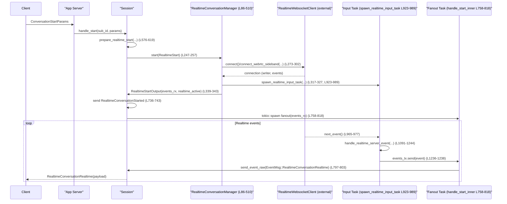
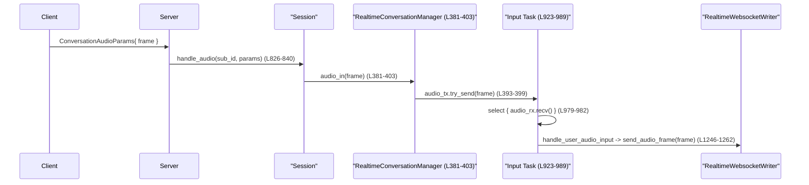

`core/src/realtime_conversation.rs`

---

## 0. ざっくり一言

リアルタイム会話セッション（音声＋テキスト）の開始・入出力・終了と、外部リアルタイム WebSocket/WebRTC API との非同期連携を管理するモジュールです。（根拠: `realtime_conversation.rs:L61-72,L86-88,L247-344,L707-824`）

---

## 1. このモジュールの役割

### 1.1 概要

- このモジュールは Codex の `Session` と外部の Realtime Websocket/WebRTC API の間で、**1 セッション分のリアルタイム会話を管理**します。
- 音声フレーム・テキスト入力・バックグラウンドエージェント（handoff）の結果を **非同期チャンネル経由で集約し、WebSocket writer に送信**します。（`spawn_realtime_input_task` とそのハンドラ群）
- 外部 API からの `RealtimeEvent` ストリームを受け取り、Codex プロトコルのイベント (`EventMsg::*`) に変換してクライアントへファンアウトします。（根拠: `handle_start_inner` の fanout タスク `L758-818`）
- Realtime 用のセッション設定（モデル・ボイス・プロンプト・認証/ヘッダ）の構築と検証も行います。（根拠: `build_realtime_session_config L621-671`, `realtime_api_key L854-878`, `realtime_request_headers L880-900`）

### 1.2 アーキテクチャ内での位置づけ

主要コンポーネントと依存関係を簡略化すると次のようになります。

```mermaid
flowchart LR
    Session["Session (crate::codex::Session)"] -->|start/finish| RCM["RealtimeConversationManager (L86-510)"]
    Session -->|handle_* 呼出| API["handle_start/handle_audio/handle_text/handle_close (L532-565,L826-840,L902-916,L919-921)"]
    RCM -->|start()| RTC["RealtimeStart/RealtimeWebsocketClient (L218-224,L273-302)"]
    RTC -->|events()| InputTask["spawn_realtime_input_task (L923-989)"]
    InputTask -->|events_tx| Fanout["fanout task in handle_start_inner (L758-818)"]
    Fanout -->|send_event_raw| Session
    InputTask -->|writer| RTC
```

- `Session` からこのモジュールの `handle_*` 関数 / `Session::conversation` 経由で呼び出されます。
- `RealtimeConversationManager` は 1 会話セッションの内部状態（チャンネル・タスク）を保持し、`RealtimeWebsocketClient` と WebSocket 接続を張ります。
- `spawn_realtime_input_task` が「ユーザー入力・handoff 出力・サーバーイベント・音声入力」の 4 系統を `tokio::select!` で multiplex します。（根拠: `L940-983`）
- 別の fanout タスクが Realtime イベントを Codex の `Event` としてクライアントに流します。（根拠: `L758-818`）

### 1.3 設計上のポイント

- **明示的なセッションライフサイクル**
  - `RealtimeConversationManager` が `ConversationState` を `Mutex<Option<...>>` で保持し、開始・終了時に状態を差し替え/破棄します。（`L86-88,L247-257,L500-510`）
  - `Arc<AtomicBool>` を用いて、複数のタスク間で「この会話セッションがまだ有効か」を共有します。（根拠: `ConversationState::realtime_active L207-216`, 使用箇所 `L240-245,L758-818`）

- **非同期並行処理**
  - `async_channel::bounded` で音声・テキスト・handoff 出力・イベントの各キューを構築し、`tokio::select!` で 1 つの input タスクに集約しています。（`L306-313,L923-983`）
  - キューが満杯のときの挙動（特に音声は「ドロップ」）が明示されています。（`audio_in` の `TrySendError::Full` `L393-399`）

- **エラーハンドリング方針**
  - 外部 API エラーは `map_api_error` で Codex 独自エラーに変換し、`RealtimeEvent::Error` 経由でクライアントに通知します。（例: `send_create_now L166-177`, `handle_realtime_server_event L1100-1114`）
  - モジュール外の API には基本的に `CodexResult`（= `Result<T, CodexErr>`）で失敗を伝えます。内部のタスク間処理は `anyhow::Result` を用いています。（`handle_user_text_input L991-1017` など）

- **Realtime V1/V2 差分の吸収**
  - `RealtimeSessionKind` と `RealtimeEventParser` により、V1/V2 のイベント仕様差を一箇所で切り替えています。（`L90-94,L267-271`）
  - V2 向けには `RealtimeResponseCreateQueue` による `response.create` のレース回避や defer 処理があります。（`L122-181`, `handle_realtime_server_event L1155-1184`）

- **handoff（バックグラウンドエージェント）との連携**
  - Realtime からの `HandoffRequested` イベントを捕捉して `Session::route_realtime_text_input` にテキストをルーティングし、その出力を再び Realtime に返します。（`realtime_text_from_handoff_request L842-852`, `handle_handoff_output L1019-1088`）

---

## 2. 主要な機能一覧

- 会話セッションの開始・接続確立
  - `handle_start` / `prepare_realtime_start` / `RealtimeConversationManager::start` で Realtime WebSocket or WebRTC への接続と内部タスクの起動。（`L532-565,L576-619,L247-344,L707-824`）
- 会話セッションの終了・クリーンアップ
  - `handle_close` / `end_realtime_conversation` / `shutdown` / `stop_conversation_state` でタスクの停止と状態破棄。（`L919-921,L1323-1330,L500-510,L513-530`）
- 音声入力の受け付けと送信
  - `handle_audio` → `RealtimeConversationManager::audio_in` → `handle_user_audio_input` → WebSocket 送信。（`L826-840,L381-403,L1246-1262`）
- テキスト入力の受け付けと送信
  - `handle_text` → `RealtimeConversationManager::text_in` → `handle_user_text_input` → Realtime conversation item 作成。（`L902-916,L405-422,L991-1017`）
- Realtime イベントの受信とクライアントへのファンアウト
  - `handle_realtime_server_event` でイベント種別ごとの処理後、`events_tx` 経由で fanout タスクへ渡し、`Session::send_event_raw` でクライアントに通知。（`L1091-1244,L758-803`）
- handoff（バックグラウンドエージェント）との橋渡し
  - `HandoffRequested` イベントからテキスト抽出・内部ルーティング・進捗/最終出力の Realtime への反映。（`L784-793,L842-852,L1019-1088,L1186-1225`）
- Realtime セッション設定の構築
  - プロンプト・起動コンテキスト・モデル・ボイス・イベントパーサ・セッションモードなどを組み立てる。（`build_realtime_session_config L621-671`）
- 認証情報とヘッダの組み立て
  - プロバイダ／セッション／環境変数から Realtime API 用 API キーを決定し、HTTP ヘッダを生成。（`realtime_api_key L854-878`, `realtime_request_headers L880-900`）
- 音声フレームメタデータ処理
  - `update_output_audio_state` / `audio_duration_ms` / `decoded_samples_per_channel` で AudioOut の長さを管理し、V2 用の音声トランケーションに用いる。（`L1264-1287,L1289-1298,L1300-1305,L1127-1151`）

---

## 3. 公開 API と詳細解説

### 3.1 型一覧（構造体・列挙体など）

| 名前 | 種別 | 公開範囲 | 役割 / 用途 | 根拠 |
|------|------|----------|-------------|------|
| `RealtimeConversationManager` | 構造体 | `pub(crate)` | 1 会話セッションの内部状態（チャンネル、タスク、writer、handoff 状態）を管理する。`Session` から利用される。 | `L86-88,L207-216,L232-510` |
| `ConversationState` | 構造体 | 非公開 | 実行中セッションの詳細状態を保持（input/fanout タスク、tx チャンネル、`realtime_active` フラグ）。 | `L207-216` |
| `RealtimeStart` | 構造体 | 非公開 | Realtime 接続開始に必要な情報（API プロバイダ、ヘッダ、セッション設定、`ModelClient`, SDP）を集約。 | `L218-224` |
| `RealtimeStartOutput` | 構造体 | 非公開 | `start_inner` の結果として、`realtime_active` と Realtime イベント受信用 rx、SDP を保持。 | `L226-230` |
| `RealtimeConversationEnd` | enum | 非公開 | 会話終了理由（リクエスト、トランスポート切断、エラー）を表す。 | `L74-79` |
| `RealtimeFanoutTaskStop` | enum | 非公開 | fanout タスクの停止ポリシー（Abort or Detach）を表す。 | `L81-84,L513-529` |
| `RealtimeSessionKind` | enum | 非公開 | Realtime セッション種別（V1/V2）。イベント処理や handoff 挙動の切替に使用。 | `L90-94,L267-271` |
| `RealtimeHandoffState` | 構造体 | 非公開 | 現在アクティブな handoff の ID と最後の出力、handoff 出力送信用 tx、session_kind を保持。 | `L96-102,L184-194` |
| `HandoffOutput` | enum | 非公開 | handoff から Realtime へ送る更新（進捗/最終更新）を表現。 | `L104-114` |
| `OutputAudioState` | 構造体 | 非公開 | V2 での AudioOut のアイテム ID と再生済み音声長（ms）を追跡。 | `L116-120,L1264-1287` |
| `RealtimeResponseCreateQueue` | 構造体 | 非公開 | Realtime V2 で `response.create` をいつ送るかを管理するキュー状態。 | `L122-126,L128-181` |
| `PreparedRealtimeConversationStart` | 構造体 | 非公開 | `prepare_realtime_start` の結果として、接続に必要な情報一式を保持。 | `L567-574` |

### 3.2 関数詳細（重要 API 7 件）

#### 1. `RealtimeConversationManager::audio_in(&self, frame: RealtimeAudioFrame) -> CodexResult<()>`

**概要**

- 実行中の会話セッションに対して、1 フレーム分の音声入力を非同期キューに enqueue します。
- セッション未実行、もしくはキュークローズ時には `CodexErr::InvalidRequest` を返します。（根拠: `L381-403`）

**引数**

| 引数名 | 型 | 説明 |
|--------|----|------|
| `self` | `&Self` | 会話マネージャ。内部で `state: Mutex<Option<ConversationState>>` を参照します。 |
| `frame` | `RealtimeAudioFrame` | 外部クライアントから受け取った音声フレーム（サンプル等を含む）。 |

**戻り値**

- `CodexResult<()>` (`Result<(), CodexErr>`)
  - `Ok(())` : 正常にキューへ送信したか、キューが満杯でフレームをドロップした場合。
  - `Err(CodexErr::InvalidRequest)` : セッションが存在しない、またはキューがクローズしている場合。

**内部処理の流れ**

1. `state` をロックし、`ConversationState` が存在すれば `audio_tx` をクローンします。（`L381-385`）
2. `state` がなければ `"conversation is not running"` エラーを返します。（`L387-391`）
3. `audio_tx.try_send(frame)` で非同期キューへ送信します。（`L393-400`）
   - `Ok(())` : 成功。
   - `Full(_)` : warn ログを出し、「フレームをドロップして」成功扱いにします。（`L395-399`）
   - `Closed(_)` : `"conversation is not running"` エラーを返します。（`L399-401`）

**Examples（使用例）**

`handle_audio` からの利用例です。

```rust
pub(crate) async fn handle_audio(
    sess: &Arc<Session>,
    sub_id: String,
    params: ConversationAudioParams,
) {
    if let Err(err) = sess.conversation.audio_in(params.frame).await {
        // 失敗時はログ＋クライアントへエラーイベント
    }
}
```

（根拠: `L826-840`）

**Errors / Panics**

- エラー:
  - セッションが存在しない/終了済み: `Err(CodexErr::InvalidRequest("conversation is not running"))`。（`L387-391,L399-401`）
- panic:
  - この関数内では `unwrap` や `expect` を使用しておらず、panic は発生しません。

**Edge cases（エッジケース）**

- キュー満杯 (`TrySendError::Full`):
  - 音声フレームを静かにドロップし、`Ok(())` を返します。高頻度入力時にバックプレッシャをかけず、リアルタイム性を優先する設計です。（`L395-399`）
- セッション終了直後に呼ばれた場合:
  - `audio_tx` が Closed であれば `InvalidRequest` エラーになります。

**使用上の注意点**

- この関数は **戻り値が成功でも音声が必ず送られているとは限りません**。キュー満杯の場合はフレームがドロップされる点に注意が必要です。
- 連続的な高頻度音声入力が必要な場合は、キュー容量 (`AUDIO_IN_QUEUE_CAPACITY=256`) の調整や、前段でのサンプリングレート・フレームサイズの制御が必要になります。（`L61`）

---

#### 2. `RealtimeConversationManager::text_in(&self, text: String) -> CodexResult<()>`

**概要**

- 実行中セッションにテキスト入力を enqueue し、Realtime サーバーへ会話アイテムとして送れるようにします。（根拠: `L405-422`）

**引数**

| 引数名 | 型 | 説明 |
|--------|----|------|
| `text` | `String` | ユーザーからのテキスト入力。 |

**戻り値**

- `CodexResult<()>`
  - `Ok(())` : テキストがキューに送信された。
  - `Err(CodexErr::InvalidRequest)` : セッションが存在しない、またはキューがクローズしている。

**内部処理の流れ**

1. `state` をロックし、`user_text_tx` を取得。（`L405-409`）
2. 存在しなければ `"conversation is not running"` エラー。（`L411-415`）
3. `user_text_tx.send(text).await` を実行。（`L417-420`）
   - エラーの場合は `InvalidRequest("conversation is not running")` にマップ。

**Examples**

`handle_text` から呼ばれます。

```rust
debug!(text = %params.text, "[realtime-text] appending realtime conversation text input");
if let Err(err) = sess.conversation.text_in(params.text).await {
    // エラー時のログとクライアントへの通知
}
```

（根拠: `L902-916`）

**Errors / Panics**

- エラー:
  - 会話未実行/終了: `InvalidRequest("conversation is not running")`。（`L411-415,L417-420`）

**Edge cases**

- `user_text_tx` が Drop 済（他タスク側で終了）だと send が失敗し、`InvalidRequest` になります。

**使用上の注意点**

- この関数はキュー満杯時にも block して待ちます（`async_channel::bounded` の `send`）。音声とは異なり、テキストはドロップされず、背圧がかかる構造です。（間接根拠: `bounded` と `send` の組み合わせ `L308-309,L417-420`）

---

#### 3. `pub(crate) async fn handle_start(sess: &Arc<Session>, sub_id: String, params: ConversationStartParams) -> CodexResult<()>`

**概要**

- クライアントからの「Realtime 会話開始」リクエストを処理するエントリポイントです。
- セッション設定の準備を行い、失敗時は `RealtimeEvent::Error` を返し、成功時は `handle_start_inner` で実際の接続を開始します。（根拠: `L532-565`）

**引数**

| 引数名 | 型 | 説明 |
|--------|----|------|
| `sess` | `&Arc<Session>` | 現在の Codex セッションコンテキスト。 |
| `sub_id` | `String` | クライアントのサブスクリプション ID（レスポンスの `Event.id` に使用）。 |
| `params` | `ConversationStartParams` | 会話開始のためのパラメータ（transport, prompt, session_id, voice 等）。 |

**戻り値**

- `CodexResult<()>`
  - 準備および開始処理自体の成否を表すが、失敗時もクライアントには `RealtimeEvent::Error` が送信されるため、トランスポートレベルでは成功（`Ok(())`）を返す場合があります。

**内部処理の流れ**

1. `prepare_realtime_start(sess, params).await` で接続準備。（`L537-551`）
   - 失敗時: error ログ＋`RealtimeEvent::Error` をクライアントへ送信し、`Ok(())` として戻る（上位にはエラーを伝播しない）。  
2. 成功時: `handle_start_inner(sess, &sub_id, prepared_start).await` を呼び出し。（`L553-561`）
   - ここでのエラーもログ＋`RealtimeEvent::Error` をクライアントに送るだけで、`handle_start` 自体は `Ok(())` を返す。

**Errors / Panics**

- `handle_start` 自体は呼び出し元にエラーを返しません（常に `Ok(())`）。  
  失敗はイベントレベルでクライアントへ通知されます。（`L537-551,L553-563`）

**Edge cases**

- 準備段階でのエラー（認証エラー、設定エラーなど）はすべて `RealtimeEvent::Error` として同じチャンネルでクライアントに流れます。

**使用上の注意点**

- 呼び出し側は `handle_start` の `Err` を期待してはいけません。エラーはプロトコルイベントとしてクライアントに返されています。

---

#### 4. `pub(crate) async fn build_realtime_session_config(...) -> CodexResult<RealtimeSessionConfig>`

署名（簡略）:

```rust
pub(crate) async fn build_realtime_session_config(
    sess: &Arc<Session>,
    prompt: Option<Option<String>>,
    session_id: Option<String>,
    voice: Option<RealtimeVoice>,
) -> CodexResult<RealtimeSessionConfig>
```

**概要**

- Realtime セッションに必要な `RealtimeSessionConfig` を構築します。
- プロンプト／起動コンテキスト／モデル／イベントパーサ／セッションモード／ボイスを `Session` の設定から合成し、ボイスの妥当性を検証します。（根拠: `L621-671`）

**引数**

| 引数名 | 型 | 説明 |
|--------|----|------|
| `sess` | `&Arc<Session>` | 設定とコンテキスト取得に用いるセッション。 |
| `prompt` | `Option<Option<String>>` | 外部から渡されたプロンプト設定。`None` / `Some(None)` / `Some(Some(String))` を区別。 |
| `session_id` | `Option<String>` | Realtime セッション ID。指定がなければ `sess.conversation_id` を使用。 |
| `voice` | `Option<RealtimeVoice>` | 明示されたボイス。なければ設定またはデフォルト。 |

**戻り値**

- `CodexResult<RealtimeSessionConfig>`  
  正常時は構築済み config、異常時は `CodexErr::InvalidRequest` など。

**内部処理の流れ**

1. `sess.get_config().await` で設定取得。（`L627`）
2. `prepare_realtime_backend_prompt` により、ユーザー指定とバックエンドプロンプトを合成。（`L628-631`）
3. 起動コンテキストを設定または `build_realtime_startup_context` から取得し、プロンプトと結合。（`L632-645`）
4. モデル名:
   - `config.experimental_realtime_ws_model` があればそれを、なければ `DEFAULT_REALTIME_MODEL` を使用。（`L646-651`）
5. イベントパーサ:
   - `config.realtime.version` に応じて `RealtimeEventParser::V1` or `RealtimeV2`。（`L652-655`）
6. セッションモード:
   - `config.realtime.session_type` → `Conversational` or `Transcription`。（`L656-659`）
7. ボイス:
   - `voice` 引数 → 設定値 → バージョンごとのデフォルトの優先で選択。（`L660-662,L674-680`）
   - `validate_realtime_voice` で対象バージョンでサポートされるボイスか検証。（`L663,L682-705`）
8. `RealtimeSessionConfig` を構築して返却。（`L664-671`）

**Errors / Panics**

- エラー:
  - ボイスが対象バージョンでサポートされない場合、`CodexErr::InvalidRequest` を返す（メッセージにサポートボイス一覧が含まれる）。`L682-705`

**Edge cases**

- プロンプトも起動コンテキストも空文字列の場合、`instructions` は空文字列になります。（`L640-645`）
- `session_id` が指定されない場合、会話 ID (`sess.conversation_id`) がセッション ID として利用されます。（`L667-668`）

**使用上の注意点**

- 呼び出し側は、`config.realtime.version` を変更した場合、ボイス設定も対応するリスト内の値に揃える必要があります。
- `prompt` の三重 Option を使っているため、「未指定」「明示的に空」「テキスト指定」を区別している点に注意が必要です。

---

#### 5. `async fn handle_start_inner(sess: &Arc<Session>, sub_id: &str, prepared_start: PreparedRealtimeConversationStart) -> CodexResult<()>`

**概要**

- 事前に準備された接続情報を用いて Realtime 接続を張り、入出力タスクを起動し、開始イベントをクライアントに通知するコアロジックです。（根拠: `L707-824`）

**引数**

| 引数名 | 型 | 説明 |
|--------|----|------|
| `sess` | `&Arc<Session>` | セッションコンテキスト。 |
| `sub_id` | `&str` | クライアントのサブスクリプション ID。 |
| `prepared_start` | `PreparedRealtimeConversationStart` | `prepare_realtime_start` で構築された接続用情報。 |

**戻り値**

- `CodexResult<()>` : 接続確立・タスク起動に失敗した場合はエラー。

**内部処理の流れ**

1. `prepared_start` を分解し、ログで「starting realtime conversation」を出力。（`L712-721`）
2. transport に応じて SDP をセット。
3. `RealtimeStart` を作り `sess.conversation.start(start).await` を呼び、`RealtimeConversationManager` 経由で接続と input タスクを起動。（`L725-733`）
4. 「realtime conversation started」をログし、`RealtimeConversationStarted` イベントをクライアントへ送信。（`L734-743`）
5. SDP があれば `RealtimeConversationSdp` イベントとして送信。（`L745-755`）
6. fanout タスクを `tokio::spawn` で起動:
   - `events_rx.recv()` ループで `RealtimeEvent` を受信。（`L767-804`）
   - 必要であれば `realtime_text_from_handoff_request` でテキストを抽出し、`route_realtime_text_input` へルーティング。（`L783-793`）
   - `RealtimeEvent::Error` を受信すると終了理由を `Error` に変更。（`L780-782`）
   - すべてのイベントを `EventMsg::RealtimeConversationRealtime` としてクライアントへ送信。（`L797-803`）
   - ループ終了後、`finish_if_active` で会話をクリーンアップし、`RealtimeConversationClosed` を送信。（`L805-817`）
7. fanout タスクの `JoinHandle` を `register_fanout_task` に渡して登録。（`L819-821`）

**Errors / Panics**

- Realtime 接続確立や `start` が失敗すると `CodexErr` が返され、上位 `handle_start` でログ＋エラーイベントに変換されます。（`L725-733,L553-563`）

**Edge cases**

- `events_rx.recv()` ループ中に `realtime_active` が false になった場合は即座にループを抜けます。（`L768-770,L794-796`）

**使用上の注意点**

- この関数は内部専用です。外部からは `handle_start` を通じて利用されます。
- fanout タスクは `Register/Abort` のロジックがあり、古いセッションのタスクが残らないように処理されています。（`register_fanout_task L346-365`）

---

#### 6. `fn spawn_realtime_input_task(input: RealtimeInputTask) -> JoinHandle<()>`

**概要**

- 1 会話セッションにつき 1 つ起動される「入力集約」タスクです。
- ユーザーのテキスト、ユーザー音声、handoff 出力、Realtime サーバーイベントの 4 つの入力ストリームを `tokio::select!` で multiplex し、それぞれ専用ハンドラに渡します。（根拠: `L923-989`）

**引数**

| 引数名 | 型 | 説明 |
|--------|----|------|
| `input` | `RealtimeInputTask` | writer, 各種 receiver, handoff 状態、session_kind, event_parser を含む。 |

**戻り値**

- `JoinHandle<()>` : 非同期タスクのハンドル。

**内部処理の流れ**

1. `RealtimeInputTask` を分解してローカル変数に束縛。（`L923-934`）
2. `tokio::spawn` で非同期ブロックを起動。（`L936-988`）
3. ループ内で `tokio::select!`:
   - `user_text_rx.recv()` → `handle_user_text_input`（`L943-952,L991-1017`）
   - `handoff_output_rx.recv()` → `handle_handoff_output`（`L954-963,L1019-1088`）
   - `events.next_event()` → `handle_realtime_server_event`（`L965-977,L1091-1244`）
   - `audio_rx.recv()` → `handle_user_audio_input`（`L979-982,L1246-1262`）
4. どのブランチでも、ハンドラが `Err` を返した場合はループを抜け、タスクを終了。（`L984-986`）

**Errors / Panics**

- 個々のハンドラが `anyhow::Result<()>` を返し、エラー時に必要なログや `RealtimeEvent::Error` を送信します。
- ループは **いずれかのストリームでエラー/終了が検出されると停止**し、上位の `stop_conversation_state` でタスクが `abort` される設計です。

**Edge cases**

- どれか 1 つのチャンネルが閉じられた場合でも、そのハンドラ側で `context("... channel closed")` エラーを返し、ループを終了します。

**使用上の注意点**

- `RealtimeInputTask` は `RealtimeConversationManager::start_inner` からのみ生成されます（外部からの直接利用は想定されていません）。  
- `events_tx` はすべてのハンドラから使用されるため、クローズされると `handle_realtime_server_event` で `bail!` し、タスク全体が終了します。（`L1236-1238`）

---

#### 7. `async fn handle_realtime_server_event(...) -> anyhow::Result<()>`

署名（簡略）:

```rust
async fn handle_realtime_server_event(
    event: Result<Option<RealtimeEvent>, ApiError>,
    writer: &RealtimeWebsocketWriter,
    events_tx: &Sender<RealtimeEvent>,
    handoff_state: &RealtimeHandoffState,
    session_kind: RealtimeSessionKind,
    output_audio_state: &mut Option<OutputAudioState>,
    response_create_queue: &mut RealtimeResponseCreateQueue,
) -> anyhow::Result<()>
```

**概要**

- Realtime サーバーからの単一イベントを処理し、必要な場合は追加の API 呼び出し（音声トランケーション、handoff steering、response.create 管理など）を行い、そのイベントを `events_tx` へ転送します。（根拠: `L1091-1244`）

**引数主要部**

| 引数名 | 型 | 説明 |
|--------|----|------|
| `event` | `Result<Option<RealtimeEvent>, ApiError>` | サーバーから読み取ったイベント、またはストリームエラー。 |
| `writer` | `&RealtimeWebsocketWriter` | 追加の Realtime コマンド送信用。 |
| `events_tx` | `&Sender<RealtimeEvent>` | fanout タスクへイベントを渡すためのチャンネル。 |
| `handoff_state` | `&RealtimeHandoffState` | handoff 状態の更新に使用。 |
| `session_kind` | `RealtimeSessionKind` | V1/V2 により挙動が変わる。 |
| `output_audio_state` | `&mut Option<OutputAudioState>` | AudioOut の音声長をトラッキング。 |
| `response_create_queue` | `&mut RealtimeResponseCreateQueue` | V2 の `response.create` 制御に使用。 |

**内部処理の流れ（概略）**

1. `event` を `match`:
   - `Ok(Some(event))` → 続行。
   - `Ok(None)` → `"realtime event stream ended"` としてエラー。（`L1100-1103`）
   - `Err(err)` → `map_api_error` → `RealtimeEvent::Error` を `events_tx` に送信し、エラーとして終了。（`L1104-1114`）
2. `event` の種類に応じて `should_stop` を決定。（`L1117-1234`）
   - `AudioOut`:
     - V2 の場合は `update_output_audio_state` で音声長を更新。（`L1118-1124,L1264-1287`）
   - `InputAudioSpeechStarted`:
     - V2 かつ `output_audio_state` があり、item_id が一致/未指定なら `conversation.item.truncate` ペイロードを `writer.send_payload` で送信し、音声を切り詰める。（`L1127-1151`）
   - `ResponseCreated`:
     - V2 の場合 `response_create_queue.mark_started()`。（`L1155-1159,L142-144`）
   - `ResponseCancelled` / `ResponseDone`:
     - `output_audio_state` をクリアし、V2 の場合 `response_create_queue.mark_finished(..., "deferred")` を呼ぶ。（`L1162-1183,L146-158`）
   - `HandoffRequested`:
     - V1: `active_handoff` と `last_output_text` を初期化。（`L1189-1193`）
     - V2: 既に active handoff があれば steering acknowledgement を `send_conversation_handoff_append` で送信し、`response.create` を発行。なければアクティブな handoff として登録。（`L1194-1225`）
   - `Error(_)`:
     - `should_stop = true`。（`L1228`）
   - その他のイベントは何もせず `should_stop = false`。（`L1229-1233`）
3. 処理した `event` を `events_tx.send(event).await` で転送。失敗時は `"realtime output event channel closed"` エラー。（`L1236-1238`）
4. `should_stop` が `true` の場合、エラーログを出し、`bail!` してタスク終了。（`L1239-1242`）

**Errors / Panics**

- チャンネルクローズ等で `events_tx.send` が失敗した場合、`bail!("realtime output event channel closed")`。
- Realtime ストリームから `ApiError` が返された場合、エラーイベントを送信しつつ `Err` を返します。

**Edge cases**

- `Ok(None)`（EOF 相当）はエラー扱いです。プロトコル側からは「エラー終了」として扱われます。
- `InputAudioSpeechStarted` のトランケーションは `item_id` が一致 or None の場合にのみ行われ、それ以外は無視されます。（`L1131-1136`）

**使用上の注意点**

- V2 の `response.create` は Realtime の制約を回避するために、`RealtimeResponseCreateQueue` を通じて **1 度に 1 つ** しかアクティブにしないよう調整されています。
- API エラーメッセージプレフィックスに依存した挙動（`REALTIME_ACTIVE_RESPONSE_ERROR_PREFIX`）があるため、サーバー側メッセージ仕様変更には注意が必要です。（`L166-173`）

---

### 3.3 その他の関数（一覧）

| 関数名 | 役割（1 行） | 根拠 |
|--------|--------------|------|
| `RealtimeConversationManager::new` | 会話マネージャを初期化（内部 state は `None`）。 | `L234-238` |
| `running_state` | 現在の会話が `realtime_active` かどうかを `Option<()>` で返す。 | `L240-245` |
| `start` / `start_inner` | 既存セッションを止め、新しい Realtime セッションを開始する内部関数。 | `L247-344` |
| `register_fanout_task` | fanout タスクの `JoinHandle` を現在のセッションに紐付け、古いタスクは即 abort。 | `L346-365` |
| `finish_if_active` | 指定された `realtime_active` に紐づく会話状態を Detach 方式で停止。 | `L367-378` |
| `handoff_out` | バックグラウンドエージェントの途中出力を Realtime へ流すために `HandoffOutput::ProgressUpdate` を送信。 | `L424-449` |
| `handoff_complete` | V2 のみ、最後の handoff 出力を `FinalUpdate` として送信。 | `L451-479` |
| `active_handoff_id` / `clear_active_handoff` | 現在アクティブな handoff ID の取得・クリア。 | `L481-498` |
| `shutdown` | 現在の会話状態を破棄し、タスクを停止。 | `L500-510` |
| `stop_conversation_state` | `ConversationState` 内の input/fanout タスクを `Abort` or `Detach` ポリシーで停止。 | `L513-530` |
| `prepare_realtime_start` | provider/config/auth から `PreparedRealtimeConversationStart` を構築。 | `L576-619` |
| `default_realtime_voice` / `validate_realtime_voice` | バージョンに応じたデフォルトボイスとボイス検証。 | `L674-705` |
| `handle_audio` / `handle_text` | セッションの `audio_in` / `text_in` を呼び、エラー時にログ+クライアント通知。 | `L826-840,L902-916` |
| `handle_close` | 会話を Requested 終了としてシャットダウン。 | `L919-921` |
| `realtime_text_from_handoff_request` | `HandoffRequested` からテキスト transcript を構築。 | `L842-852` |
| `realtime_api_key` / `realtime_request_headers` | Realtime API 用の API キー・HTTP ヘッダ決定ロジック。 | `L854-900` |
| `handle_user_text_input` / `handle_handoff_output` / `handle_user_audio_input` | input タスクから呼ばれる各入力種別用ハンドラ。 | `L991-1017,L1019-1088,L1246-1262` |
| `update_output_audio_state` / `audio_duration_ms` / `decoded_samples_per_channel` | AudioOut の累積長をサンプル数から ms に変換し、状態に反映。 | `L1264-1287,L1289-1298,L1300-1305` |
| `send_conversation_error` | Codex プロトコルの `ErrorEvent` を送信。 | `L1307-1321` |
| `end_realtime_conversation` / `send_realtime_conversation_closed` | 会話の終了と `RealtimeConversationClosed` 通知。 | `L1323-1347` |

---

## 4. データフロー

### 4.1 会話開始〜イベントファンアウトの流れ

クライアントが WebSocket 経由で「会話開始」を要求してから、Realtime イベントがクライアントに返るまでの流れを示します。



---

### 4.2 音声入力の流れ



---

## 5. 使い方（How to Use）

### 5.1 基本的な使用方法（サーバ側から見た流れ）

典型的な HTTP/WebSocket ハンドラからの利用イメージです。

```rust
// 会話開始リクエストを受け取ったとき
pub async fn on_conversation_start(sess: Arc<Session>, sub_id: String, params: ConversationStartParams) {
    // エラーはイベントとしてクライアントに返されるため、結果を無視しても良い
    let _ = core::realtime_conversation::handle_start(&sess, sub_id, params).await;
}

// 音声フレームを受け取ったとき
pub async fn on_conversation_audio(sess: Arc<Session>, sub_id: String, params: ConversationAudioParams) {
    core::realtime_conversation::handle_audio(&sess, sub_id, params).await;
}

// テキスト入力を受け取ったとき
pub async fn on_conversation_text(sess: Arc<Session>, sub_id: String, params: ConversationTextParams) {
    core::realtime_conversation::handle_text(&sess, sub_id, params).await;
}

// クライアントから会話終了リクエストが来たとき
pub async fn on_conversation_close(sess: Arc<Session>, sub_id: String) {
    core::realtime_conversation::handle_close(&sess, sub_id).await;
}
```

- `Session` には `conversation: RealtimeConversationManager` が含まれている前提です（定義はこのチャンクにはありません）。
- クライアントは `RealtimeConversationStarted` → `RealtimeConversationRealtime`（複数） → `RealtimeConversationClosed` といったイベントを受け取ることになります。（根拠: `L736-743,L797-803,L1332-1347`）

### 5.2 よくある使用パターン

1. **テキスト主体の会話**
   - `ConversationStartTransport::Websocket` で開始。（`L588-590,L721-724`）
   - `handle_text` のみを呼び、音声入力は行わない。
   - `build_realtime_session_config` で `RealtimeSessionMode::Conversational` が使われることが多い。（`L656-659`）

2. **音声＋テキスト混在の会話**
   - 上記に加え `handle_audio` を定期的に呼び、音声フレームを送信。
   - 音声はキュー満杯時にドロップされるため、クライアント側でフレームレート・サイズを調整しておく必要があります。（`L393-399`）

3. **バックグラウンドエージェントとの handoff 連携**
   - Realtime から `HandoffRequested` イベントを受けると、fanout タスク内で `realtime_text_from_handoff_request` が呼ばれ、テキストが内部経路 `route_realtime_text_input` に送られます。（`L783-793,L842-852`）
   - エージェント側は `RealtimeConversationManager::handoff_out` / `handoff_complete` を呼び、進捗や最終結果を Realtime に反映します。（`L424-479,L1019-1088`）

### 5.3 よくある間違い

```rust
// 間違い例: 会話開始前に音声を送信
let _ = sess.conversation.audio_in(frame).await?;
// → "conversation is not running" エラー (CodexErr::InvalidRequest) になる可能性がある

// 正しい例: まず handle_start を呼び、Started イベントを受け取ってから音声を送る
handle_start(&sess, sub_id.clone(), start_params).await?;
sess.conversation.audio_in(frame).await?;
```

- `audio_in` / `text_in` / `handoff_out` / `handoff_complete` はいずれも、会話セッションが起動していないと **"conversation is not running"** エラーになる可能性があります。（`L387-391,L411-415,L424-431,L451-458`）

### 5.4 使用上の注意点（まとめ）

- **並行性**
  - 会話セッションごとに input タスクと fanout タスクの 2 つのタスクが起動し、複数セッションが並行して存在しうる設計です。`Mutex<Option<ConversationState>>` によって 1 セッションにつき 1 状態に制限しています。（`L86-88,L207-216,L247-257`）
  - `Arc<AtomicBool>` により、タスク間で「まだ有効か」を共有し、終了時には両タスクが自発的に停止します。（`L215-216,L758-770,L805-817`）

- **エラー伝播**
  - 外部 API や内部処理の大半のエラーは `RealtimeEvent::Error` としてクライアントに送られます。呼び出し元に `Err` として伝わらないケースが多い点に注意が必要です。（`L166-177,L1104-1114,L1307-1321`）

- **パフォーマンス上の注意**
  - 音声入力はキュー満杯時にドロップする挙動のため、帯域を使いきるような高頻度入力では音声欠落が起こりえます。（`L61,L393-399`）
  - 一方でテキストは送信時に await し、満杯でもドロップしないため、過剰なテキスト送信はレイテンシ増大につながります。（`L417-420`）

- **Bugs / Security に関する注意**
  - `RealtimeResponseCreateQueue::send_create_now` はエラーメッセージ文字列の prefix (`REALTIME_ACTIVE_RESPONSE_ERROR_PREFIX`) に依存してレース検出を行っています。サーバー側のメッセージ仕様変更で機能しなくなる可能性があります。（`L169-173`）
  - `realtime_api_key` は OpenAI プロバイダに対し、環境変数からの API キー読み込みを「暫定 fallback」として許可していますが、コメントにある通り将来的に削除予定であり、運用上のセキュリティポリシーに注意が必要です。（`L867-873`）

---

## 6. 変更の仕方（How to Modify）

### 6.1 新しい機能を追加する場合

例: 新しい `RealtimeEvent` バリアントを処理したい場合

1. **イベント処理の追加**
   - `handle_realtime_server_event` の `match &event` に新しいバリアント用の分岐を追加し、必要な処理を実装します。（`L1117-1234`）
   - ここで `should_stop` を `true` にすると、エラー扱いで input タスクが終了します。

2. **クライアントへの通知**
   - `handle_realtime_server_event` の最後で `events_tx.send(event).await` を呼んでいるため、`RealtimeEvent` 自体を変更しない場合はそのままクライアントへファンアウトされます。（`L1236-1238`）

3. **handoff や response.create 管理との連携**
   - V2 専用の振る舞いが必要な場合は、`RealtimeSessionKind::V2` 分岐の中にロジックを追加します。（`L1119-1124,L1128-1151,L1155-1183,L1189-1225`）

### 6.2 既存の機能を変更する場合の注意点

- **会話ライフサイクル関連**
  - `stop_conversation_state` を変更する場合は、`RealtimeConversationManager::shutdown`・`finish_if_active`・`end_realtime_conversation` からの呼び出し元との整合性を確認します。（`L500-510,L513-530,L1323-1330`）
  - `RealtimeConversationEnd` の要素を増やした場合は、`send_realtime_conversation_closed` の `match`、そしてクライアント側の解釈も合わせて変更する必要があります。（`L74-79,L1337-1341`）

- **契約（Contracts）とエッジケース**
  - `"conversation is not running"` というエラーメッセージはハンドラ系 (`handle_audio` / `handle_text`) がクライアントエラー (`CodexErrorInfo::BadRequest`) を送るトリガーになっています。ここを変更するとクライアントへのエラー表示が変わります。（`L381-403,L405-422,L826-840,L902-916`）
  - 音声キューの満杯時挙動（ドロップ vs ブロック）を変える場合は、リアルタイム性と品質のトレードオフを意識する必要があります。

- **テスト**
  - このファイルに対応するテストモジュール `realtime_conversation_tests.rs` が存在しますが、内容はこのチャンクには含まれていません。（`L1350-1352`）
  - 変更時はこのテストファイルを参照し、既存の期待挙動（特にエラーメッセージやイベントシーケンス）が壊れていないかを確認する必要があります。

- **観測性（Observability）**
  - 多くの処理で `tracing::info` / `warn` / `error` / `debug` が用意されているため、新しい分岐を追加する際にも同レベル感でログを追加することでデバッグしやすさを保てます。（`L56-59,L170-176,L780-782,L826-839` など）

---

## 7. 関連ファイル

| パス | 役割 / 関係 |
|------|------------|
| `core/src/realtime_conversation_tests.rs` | このモジュールに対するテストコードが格納されるモジュール。`#[cfg(test)]` でインクルード。（`L1350-1352`） |
| `core/src/realtime_context.rs` | `build_realtime_startup_context` を提供し、Realtime 起動コンテキスト文字列の構築を担当。（`L3,L635-638`） |
| `core/src/realtime_prompt.rs` | `prepare_realtime_backend_prompt` により、プロンプトの前処理・マージを行う。（`L4,L628-631`） |
| `core/src/client.rs` | `ModelClient` を定義し、Realtime 用 WebRTC コールの作成に用いられる。（`L1,L273-281`） |
| `codex_api` クレート | `RealtimeWebsocketClient` / `RealtimeEvent` / `RealtimeSessionConfig` 等、Realtime API クライアントの型を提供。（`L12-22,L273-302`） |
| `codex_protocol` クレート | Codex プロトコルの `Event` / `EventMsg` / `Conversation*Params` / `Realtime*` イベント等を定義。ここからクライアント向けイベントが構築される。（`L30-46,L37-43,L826-840,L902-916`） |
| `codex_login` / `codex_model_provider_info` | Realtime API 呼び出しに利用する認証情報・プロバイダ情報の取得を担当。`realtime_api_key` で使用。（`L26-29,L854-878`） |

このモジュールは、上記の外部コンポーネントと密接に連携しながら、1 セッション分のリアルタイム会話のライフサイクルを完結する役割を果たしています。
