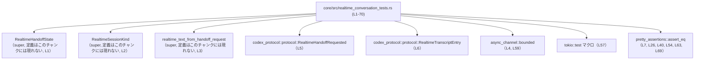

# core/src/realtime_conversation_tests.rs

## 0. ざっくり一言

`realtime_text_from_handoff_request` のテキスト抽出ロジックと、`RealtimeHandoffState` の `active_handoff` 状態クリア処理を検証するテストモジュールです（realtime_conversation_tests.rs:L9-70）。

---

## 1. このモジュールの役割

### 1.1 概要

- このモジュールは、リアルタイム会話ハンドオフの
  - テキスト抽出仕様（`RealtimeHandoffRequested` → `Option<String>`）と（realtime_conversation_tests.rs:L9-55）
  - アクティブなハンドオフ ID の明示的なクリア処理（`RealtimeHandoffState::active_handoff`）  
  を保証するためのテストを提供します（realtime_conversation_tests.rs:L57-70）。
- いずれも**振る舞いの検証のみ**を行っており、実際の実装（コアロジック）は `super` モジュールや外部クレート側にあり、このチャンクには現れません（realtime_conversation_tests.rs:L1-3, L5-6）。

### 1.2 アーキテクチャ内での位置づけ

`use` 文から、このテストモジュールが依存しているコンポーネントが分かります（realtime_conversation_tests.rs:L1-7）。

- 親モジュール (`super`) 提供:
  - `RealtimeHandoffState`（L1）
  - `RealtimeSessionKind`（L2）
  - `realtime_text_from_handoff_request`（L3）
- 外部クレート:
  - `codex_protocol::protocol::RealtimeHandoffRequested`（L5）
  - `codex_protocol::protocol::RealtimeTranscriptEntry`（L6）
  - `async_channel::bounded`（L4, 使用は L59）
  - `tokio::test` マクロ（L57）
  - `pretty_assertions::assert_eq`（L7, 使用は各アサーション）

これを依存関係図として表すと、次のようになります。



※ `RealtimeHandoffState` / `RealtimeSessionKind` / `realtime_text_from_handoff_request` の実装本体はこのチャンクには現れず、親モジュール側にあります。

### 1.3 設計上のポイント

コードから読み取れるテスト設計上の特徴は次の通りです。

- **テキスト抽出の優先順位をテストで明確化**
  - `active_transcript` が非空の場合は、そこから `"role: text"` 形式で結合された文字列を返すことを期待（realtime_conversation_tests.rs:L11-25, L26-29）。
  - `active_transcript` が空で `input_transcript` が非空の場合は、そのまま `input_transcript` を返すことを期待（L34-39, L40-43）。
  - 両方とも「意味のあるテキスト」を含まない場合は `None` を返すことを期待（L48-54）。
- **戻り値に `Option<String>` を用いた仕様のテスト**
  - `Some(String)` / `None` の両方がテストされており、テキストが存在しない場合の扱いが仕様として固定されています（L26-29, L40-43, L54）。
- **非同期状態の明示的制御**
  - `RealtimeHandoffState::active_handoff` は `.lock().await` を伴うフィールドアクセスから、非同期対応のミューテックス（`tokio::sync::Mutex` 等）で保護されていることが分かります（具体的な型はこのチャンクには現れません）（L62-65, L68-69）。
- **チャネルを介した依存関係注入**
  - `RealtimeHandoffState::new` に `async_channel::bounded(1)` の送信側を渡して初期化しており、ハンドオフ処理がチャネル経由のメッセージングに依存していることが示唆されます（L59-60）。

---

## 2. 主要な機能一覧

このファイルはテスト専用であり、公開 API は定義していません（exports=0）。  
ここでは「テストが検証している仕様」を機能として整理します。

- `extracts_text_from_handoff_request_active_transcript`（L9-30）:  
  `active_transcript` が存在するとき、`realtime_text_from_handoff_request` がそれを `"role: text"` 形式で結合して返すことを検証します。
- `extracts_text_from_handoff_request_input_transcript_if_messages_missing`（L32-44）:  
  `active_transcript` が空のとき、`input_transcript` がそのまま採用されることを検証します。
- `ignores_empty_handoff_request_input_transcript`（L46-55）:  
  `active_transcript` も `input_transcript` も有効なテキストを含まない場合に `None` が返ることを検証します。
- `clears_active_handoff_explicitly`（L57-70）:  
  `RealtimeHandoffState::active_handoff` フィールドが `Some` → `None` に明示的に更新できることを非同期で検証します。

---

## 3. 公開 API と詳細解説

このファイル自身に公開 API はありませんが、テスト対象となっている外部 API の振る舞いが見えます。

### 3.1 型一覧（構造体・列挙体など）

このチャンクに **利用のみ** が現れる主要な型を一覧にします。

| 名前 | 種別 | 定義場所 | 役割 / 用途 | 備考 |
|------|------|----------|------------|------|
| `RealtimeHandoffRequested` | 構造体 | `codex_protocol::protocol`（L5） | リアルタイムハンドオフ要求を表すリクエスト型です。テストではハンドオフ ID、アイテム ID、入力テキスト、アクティブなメッセージ群を保持します（L11-25, L34-39, L48-53）。 | 少なくとも `handoff_id`, `item_id`, `input_transcript`, `active_transcript` フィールドを持つことが分かります。その他のフィールド有無はこのチャンクには現れません。 |
| `RealtimeTranscriptEntry` | 構造体 | `codex_protocol::protocol`（L6） | 1件分のトランスクリプト（発話）を表し、`role`（話者種別）と `text`（内容）を保持します（L16-23）。 | `active_transcript: Vec<RealtimeTranscriptEntry>` の要素として使用されています（L15-24）。 |
| `RealtimeHandoffState` | 構造体（推定） | 親モジュール `super`（L1） | 現在のアクティブなハンドオフ ID 等、リアルタイムハンドオフの状態を保持する型と解釈できます。テストでは `active_handoff` フィールドにアクセスしています（L62, L68）。 | `new(tx, kind)` というコンストラクタ的メソッドを持ち（L60）、`active_handoff` は `.lock().await` が必要な同期プリミティブ（非同期ミューテックス）に包まれています。具体的な型はこのチャンクには現れません。 |
| `RealtimeSessionKind` | 列挙体（推定） | 親モジュール `super`（L2） | リアルタイムセッションのバージョンやモードを表す列挙と推測されます。テストでは `RealtimeSessionKind::V1` を渡しています（L60）。 | 定義内容・他のバリアントはこのチャンクには現れません。 |
| `Option<String>` | 列挙体 | 標準ライブラリ | `realtime_text_from_handoff_request` の戻り値型と考えられます。テストが `Some(String)` / `None` を比較しているためです（L26-29, L40-43, L54）。 | `Some` の場合は返却されたテキスト、`None` の場合は有効なテキストがないことを示します。 |

### 3.2 関数詳細

ここでは、このテストモジュール内の 4 つのテスト関数を、テスト対象の仕様という観点から解説します。

---

#### `extracts_text_from_handoff_request_active_transcript()`

**概要**

- `active_transcript` が非空の場合に、`realtime_text_from_handoff_request` が `active_transcript` の内容から `"role: text"` 形式の複数行テキストを生成して `Some(String)` で返すことを検証するテストです（realtime_conversation_tests.rs:L9-30）。

**引数**

- なし（テスト関数のため）。内部でローカル変数 `handoff` を構築します（L11-25）。

**戻り値**

- `()`（Rust のテスト関数は戻り値を利用しません）。

**内部処理の流れ**

1. `RealtimeHandoffRequested` のインスタンスを作成し（L11）、次のフィールドを設定します（L11-25）。
   - `handoff_id`: `"handoff_1"`（L12）
   - `item_id`: `"item_1"`（L13）
   - `input_transcript`: `"ignored"`（L14）  
     → このテストでは「無視されるべき値」であることが意図されています。
   - `active_transcript`: `RealtimeTranscriptEntry` を 2 要素持つベクタ（L15-24）
     - 1件目: `role = "user"`, `text = "hello"`（L16-19）
     - 2件目: `role = "assistant"`, `text = "hi there"`（L20-23）
2. `realtime_text_from_handoff_request(&handoff)` を呼び出します（L27）。
3. 戻り値が `Some("user: hello\nassistant: hi there".to_string())` と等しいことを `assert_eq!` で検証します（L26-29）。

**Examples（使用例）**

テストの中身を、仕様の例として抜粋すると次のようになります。

```rust
// ハンドオフ要求を構築する                                  // realtime_conversation_tests.rs:L11-25
let handoff = RealtimeHandoffRequested {
    handoff_id: "handoff_1".to_string(),                  // ハンドオフ ID
    item_id: "item_1".to_string(),                        // アイテム ID
    input_transcript: "ignored".to_string(),              // active_transcript があるので無視されることを期待
    active_transcript: vec![
        RealtimeTranscriptEntry {
            role: "user".to_string(),                     // 1件目の話者
            text: "hello".to_string(),                    // 1件目の内容
        },
        RealtimeTranscriptEntry {
            role: "assistant".to_string(),                // 2件目の話者
            text: "hi there".to_string(),                 // 2件目の内容
        },
    ],
};

// active_transcript からのテキスト生成を確認する           // realtime_conversation_tests.rs:L26-29
assert_eq!(
    realtime_text_from_handoff_request(&handoff),
    Some("user: hello\nassistant: hi there".to_string()),
);
```

この例から、`realtime_text_from_handoff_request` は `active_transcript` の各要素を `"role: text"` 形式で改行区切りに連結すると解釈できます。

**Errors / Panics**

- テストコード中に明示的な `panic!` 呼び出しやエラー処理はありません。
- アサーションが失敗した場合、通常の Rust テスト同様にテストが失敗（パニック）します（`assert_eq!` の仕様）。  
  これは `pretty_assertions::assert_eq` によるものです（L7, L26）。

**Edge cases（エッジケース）**

- このテストがカバーするケース:
  - `active_transcript` が **2件の要素を持つ** 場合（L15-24）。
  - `input_transcript` に値が入っていても `active_transcript` が優先され、「ignored」が使用されないケース（L14, L26-29）。
- カバーしていないケース（仕様はこのチャンクには現れない）:
  - `active_transcript` に 1件のみ、または 3件以上ある場合の挙動。
  - `role` や `text` が空文字列の場合のフォーマット。
  - `active_transcript` が `None` の場合（型定義も含めてこのチャンクには現れません）。

**使用上の注意点**

- 少なくともこのテストから、`realtime_text_from_handoff_request` は
  - `active_transcript` が非空ならそれを優先し、
  - `input_transcript` は無視される  
  という契約を暗黙的に前提としていると読み取れます（L14-15, L26-29）。
- ロジックを変更して `input_transcript` を優先する設計にする場合、このテストを含む仕様の見直しが必要になります。

---

#### `extracts_text_from_handoff_request_input_transcript_if_messages_missing()`

**概要**

- `active_transcript` が空のとき、`realtime_text_from_handoff_request` が `input_transcript` の値をそのまま `Some(String)` として返すことを検証するテストです（realtime_conversation_tests.rs:L32-44）。

**引数**

- なし。

**戻り値**

- `()`。

**内部処理の流れ**

1. `RealtimeHandoffRequested` を作成し、`active_transcript` を空ベクタ `vec![]` に設定します（L34-39）。
2. `input_transcript` に `"ignored"` を設定します（L37）。
3. `realtime_text_from_handoff_request(&handoff)` の結果が `Some("ignored".to_string())` であることを検証します（L40-43）。

**Examples（使用例）**

```rust
// active_transcript が空のハンドオフ要求                   // realtime_conversation_tests.rs:L34-39
let handoff = RealtimeHandoffRequested {
    handoff_id: "handoff_1".to_string(),
    item_id: "item_1".to_string(),
    input_transcript: "ignored".to_string(),              // この値がそのまま返ることを期待
    active_transcript: vec![],                            // メッセージが存在しない
};

// input_transcript が採用されることを検証                 // realtime_conversation_tests.rs:L40-43
assert_eq!(
    realtime_text_from_handoff_request(&handoff),
    Some("ignored".to_string()),
);
```

**Errors / Panics**

- 挙動は前述のテスト同様、`assert_eq!` の成否のみです（L40-43）。

**Edge cases（エッジケース）**

- カバーするケース:
  - `active_transcript` が完全に空で、`input_transcript` が非空文字列の場合（L37-39, L40-43）。
- 未カバーのケース（仕様はこのチャンクには現れない）:
  - `input_transcript` が空白のみや特定フォーマットの場合。
  - `active_transcript` が `None` を許容するようなデザインかどうか。

**使用上の注意点**

- このテストにより、「メッセージが 1 通も記録されていないハンドオフでは、入力文字列がそのまま採用される」という仕様が固定されています（L34-39, L40-43）。
- `input_transcript` を別の用途（例: ログのみ）に使いたい場合、この仕様との整合性に注意する必要があります。

---

#### `ignores_empty_handoff_request_input_transcript()`

**概要**

- `active_transcript` が空で、かつ `input_transcript` も空文字列の場合に、`realtime_text_from_handoff_request` が `None` を返すことを検証するテストです（realtime_conversation_tests.rs:L46-55）。

**引数**

- なし。

**戻り値**

- `()`。

**内部処理の流れ**

1. `RealtimeHandoffRequested` を作成し（L48-53）、
   - `input_transcript` に `String::new()`（空文字列）を設定（L51）。
   - `active_transcript` に空ベクタ `vec![]` を設定（L52）。
2. `realtime_text_from_handoff_request(&handoff)` の結果が `None` であることを検証します（L54）。

**Examples（使用例）**

```rust
// 入力文字列もメッセージも空のハンドオフ要求             // realtime_conversation_tests.rs:L48-53
let handoff = RealtimeHandoffRequested {
    handoff_id: "handoff_1".to_string(),
    item_id: "item_1".to_string(),
    input_transcript: String::new(),                      // 空文字列
    active_transcript: vec![],                            // メッセージなし
};

// 有効なテキストがないので None が返ることを期待         // realtime_conversation_tests.rs:L54
assert_eq!(
    realtime_text_from_handoff_request(&handoff),
    None
);
```

**Errors / Panics**

- テストコード自体に特別なエラー処理はなく、`assert_eq!` の失敗が唯一の失敗パスです（L54）。

**Edge cases（エッジケース）**

- カバーするケース:
  - **完全に空のハンドオフ**（メッセージなし・入力文字列も空）で `None` が返ること（L48-54）。
- 未カバーのケース（仕様はこのチャンクには現れない）:
  - `input_transcript` が空白のみ（`" "` 等）の場合に「空」とみなすかどうか。
  - `active_transcript` が空だが `input_transcript` が `"\n"` など特殊な文字列のときの扱い。

**使用上の注意点**

- このテストにより、「**有効なテキストが1つもない場合は `None`**」という仕様が示されています（L48-54）。
- 呼び出し側は、`None` を「ハンドオフに表示すべきテキストがない」という意味として扱う前提になります。

---

#### `clears_active_handoff_explicitly()`

**概要**

- 非同期コンテキストで `RealtimeHandoffState::active_handoff` フィールドを `Some(..)` から `None` に変更できることを確認するテストです（realtime_conversation_tests.rs:L57-70）。

**引数**

- なし（`#[tokio::test]` により非同期テスト関数として実行されます（L57））。

**戻り値**

- `()`（`async fn` であっても戻り値は `()` を期待していると解釈できます）。

**内部処理の流れ（非同期）**

1. `async_channel::bounded(1)` を呼び出し、容量 1 のチャネルの送信側 `tx` と受信側 `_rx` を取得します（L59）。  
   受信側 `_rx` はこのテストでは未使用です（名前が `_` から始まるため）。
2. `RealtimeHandoffState::new(tx, RealtimeSessionKind::V1)` を呼び出して状態オブジェクト `state` を作成します（L60）。
3. `state.active_handoff.lock().await` を通じてロックを取得し、`Some("handoff_1".to_string())` を代入します（L62）。
4. 再度 `lock().await` でロックを取得し、`clone()` した値が `Some("handoff_1".to_string())` であることを `assert_eq!` で検証します（L63-65）。
5. もう一度ロックを取得し、`None` を代入します（L68）。
6. 最後に同様の方法で `None` が設定されていることを検証します（L69）。

**Examples（使用例）**

```rust
#[tokio::test]                                           // tokio ランタイム上での非同期テスト（L57）
async fn clears_active_handoff_explicitly() {
    let (tx, _rx) = bounded(1);                          // 容量1のチャネルを作成（L59）
    let state = RealtimeHandoffState::new(               // 状態オブジェクトを初期化（L60）
        tx,
        RealtimeSessionKind::V1,
    );

    // active_handoff に handoff_1 を設定する             // realtime_conversation_tests.rs:L62-65
    *state.active_handoff.lock().await =
        Some("handoff_1".to_string());
    assert_eq!(
        state.active_handoff.lock().await.clone(),
        Some("handoff_1".to_string())
    );

    // active_handoff を None にクリアする                // realtime_conversation_tests.rs:L68-69
    *state.active_handoff.lock().await = None;
    assert_eq!(state.active_handoff.lock().await.clone(), None);
}
```

**Errors / Panics**

- `lock().await` がパニックする可能性は通常ありませんが、実際のミューテックス実装や `RealtimeHandoffState` の設計はこのチャンクには現れないため、詳細は不明です。
- このテストにおける唯一の明示的な失敗パスは `assert_eq!` の失敗です（L63-65, L69）。

**Edge cases（エッジケース）**

- カバーするケース:
  - `active_handoff` が既に `Some(..)` の状態から `None` に更新されるケース（L62-69）。
- カバーしていないケース（仕様はこのチャンクには現れない）:
  - 複数タスクから同時に `active_handoff` へアクセスした場合の競合。
  - `active_handoff` が初期状態で何になっているか（`None` かどうか）。

**使用上の注意点**

- `active_handoff` は `.lock().await` が必要な同期プリミティブに包まれており、**非同期コンテキストからのみ安全にアクセスできる**前提になっています（L62, L68）。
- `lock().await` を多用すると、その間ほかのタスクが `active_handoff` へアクセスできなくなるため、本番コードではロック保持時間をできるだけ短くすることが望まれます（一般的な Rust/async の注意点であり、このチャンクのコードから直接読み取れるわけではありません）。

---

### 3.3 その他の関数

- このファイル内に、上記 4 つ以外の関数定義はありません（realtime_conversation_tests.rs:L9-70）。

---

## 4. データフロー

ここでは、**テキスト抽出**に関する代表的なデータフローを示します。

### 4.1 テキスト抽出のフロー

`extracts_text_from_handoff_request_active_transcript` からみたデータの流れは次のようになります（realtime_conversation_tests.rs:L9-30）。

1. テスト関数にて、`RealtimeHandoffRequested` インスタンス `handoff` を構築（L11-25）。
2. `handoff.active_transcript` に 2 件の `RealtimeTranscriptEntry` を詰める（L15-24）。
3. `realtime_text_from_handoff_request(&handoff)` を呼び出す（L27）。
4. 戻ってきた `Option<String>` を期待値と比較（L26-29）。

これをシーケンス図で表すと次のようになります。

```mermaid
sequenceDiagram
    participant T as テスト関数<br/>extracts_text_from_handoff_request_active_transcript (L9-30)
    participant HR as RealtimeHandoffRequested<br/>インスタンス handoff (L11-25)
    participant F as realtime_text_from_handoff_request<br/>（定義はこのチャンクには現れない）

    T->>HR: handoff を構築（active_transcript に 2 件追加）
    T->>F: &handoff を引数に呼び出し
    F-->>T: Option&lt;String&gt; を返す<br/>（"user: hello\nassistant: hi there" を期待）
    T->>T: assert_eq! で期待値と比較
```

### 4.2 状態クリアのフロー（概要）

`clears_active_handoff_explicitly` における `active_handoff` の更新は次のステップで行われます（realtime_conversation_tests.rs:L57-70）。

1. `RealtimeHandoffState::new` で状態オブジェクト `state` を生成（L60）。
2. `state.active_handoff.lock().await` でミューテックスを取得し、`Some("handoff_1")` を代入（L62）。
3. 再度ロックを取得して `Some("handoff_1")` が入っていることを確認（L63-65）。
4. ロックを取得し直して `None` を代入（L68）。
5. 最後に `None` に変わっていることを確認（L69）。

この流れから、`active_handoff` は「**現在ハンドオフ中の ID を示すオプション値**」として利用されていることが推測できますが、厳密な意味付けはこのチャンクには現れません。

---

## 5. 使い方（How to Use）

このファイル自体はテストですが、テストコードは `realtime_text_from_handoff_request` と `RealtimeHandoffState` の実用的な使い方の例にもなっています。

### 5.1 基本的な使用方法（テキスト抽出）

`RealtimeHandoffRequested` からテキストを抽出する基本パターンは、1つ目のテストとほぼ同じです。

```rust
// ハンドオフ要求を用意する                                 // realtime_conversation_tests.rs:L11-25 を参考
let handoff = RealtimeHandoffRequested {
    handoff_id: "handoff_1".to_string(),                  // 任意のハンドオフ ID
    item_id: "item_1".to_string(),                        // 任意のアイテム ID
    input_transcript: "fallback text".to_string(),        // アクティブメッセージがない場合に使われる
    active_transcript: vec![
        RealtimeTranscriptEntry {
            role: "user".to_string(),
            text: "hello".to_string(),
        },
        RealtimeTranscriptEntry {
            role: "assistant".to_string(),
            text: "hi there".to_string(),
        },
    ],
};

// テキスト抽出を行う                                      // realtime_conversation_tests.rs:L27
let maybe_text: Option<String> =
    realtime_text_from_handoff_request(&handoff);

// 結果を利用する例
if let Some(text) = maybe_text {
    println!("{}", text);                                 // "user: hello\nassistant: hi there"
} else {
    println!("表示するテキストはありません");
}
```

※ `RealtimeHandoffRequested` の定義はこのチャンクには現れませんが、少なくともテストで使用されているフィールドは上記の通りです。

### 5.2 よくある使用パターン

テストから読み取れる代表的な呼び出しパターンは次の 3 つです。

1. **アクティブメッセージ優先パターン**（L11-25, L26-29）
   - `active_transcript` に内容がある場合、`input_transcript` は「ignored」のように無視される前提の値になっている。
   - 表示用テキストは `"role: text"` 形式の複数行文字列。

2. **入力文字列フォールバックパターン**（L34-43）
   - `active_transcript` が空ベクタのときに `input_transcript` がそのまま表示される。
   - ログや既存テキストをそのまま人間に見せたい場合に利用できる。

3. **テキストなしパターン**（L48-54）
   - `input_transcript` も `active_transcript` も空のとき `None` が返る。
   - 呼び出し側では「ハンドオフ表示を行わない」ことを示すシグナルとして解釈できる。

### 5.3 よくある間違い

テストから逆に、誤用になりそうなケースを挙げます。

```rust
// 誤りの例: active_transcript があるのに input_transcript に依存している
let handoff = RealtimeHandoffRequested {
    handoff_id: "handoff_1".to_string(),
    item_id: "item_1".to_string(),
    input_transcript: "こちらを優先してほしい".to_string(),
    active_transcript: vec![
        RealtimeTranscriptEntry {
            role: "user".to_string(),
            text: "hello".to_string(),
        },
    ],
};

let text = realtime_text_from_handoff_request(&handoff);

// テスト仕様からすると、text は Some("user: hello".to_string()) になると期待される。
// input_transcript の内容が優先されることはない（L11-15, L26-29）。
```

**正しい考え方の例**

- `active_transcript` にメッセージが存在する場合は、その内容を信頼すべきであり、`input_transcript` は補助的な情報とみなす設計になっています（L11-15, L26-29）。
- `input_transcript` を確実に表示したい場合は、`active_transcript` を空にするか、仕様の変更とそれに伴うテストの更新が必要です。

### 5.4 使用上の注意点（まとめ）

- **Option 戻り値の扱い**
  - `Some(String)` は「表示すべきテキストがある」、`None` は「テキストがない」という意味になります（L26-29, L40-43, L54）。
  - 呼び出し側は `match` や `if let` でこの 2 パターンを明示的に処理する必要があります。

- **非同期ロックの扱い**
  - `active_handoff` へのアクセスは `.lock().await` 経由で行われます（L62-65, L68-69）。
  - 非同期関数内でのみ呼び出し、ロック保持時間を必要最小限にすることが推奨されます（一般的な Rust async の指針）。

- **同時実行性と安全性**
  - ミューテックスを使うことで、複数タスクからの `active_handoff` 更新がレースコンディションなしに行える設計になっていると考えられますが、実際の実装詳細はこのチャンクには現れません。
  - `bounded(1)` を使用していることから、チャネル容量が 1 に制限されているため、送信ロジックではブロックやバックプレッシャーに注意する必要がある可能性があります（L59）。

- **セキュリティ面**
  - このチャンクには外部入力のバリデーションやシリアライズ／デシリアライズは現れておらず、セキュリティ上の問題は読み取れません。
  - 実際のセキュリティ要件は `codex_protocol` や親モジュール側の実装に依存します。

---

## 6. 変更の仕方（How to Modify）

このファイルは**テストモジュール**なので、「機能追加／変更」は主に**仕様に対するテストケースの追加／調整**を意味します。

### 6.1 新しい機能を追加する場合

例として、`realtime_text_from_handoff_request` に新たな振る舞いを追加する場合を想定します。

1. **仕様を整理する**
   - 追加したいルール（例: `active_transcript` のみを使用するフラグ、特定の `role` を除外するなど）を決めます。
   - 現行仕様は、少なくとも以下であることを確認します（L11-25, L34-39, L48-54）。
     - 非空の `active_transcript` があればそれを優先。
     - それが空で非空の `input_transcript` があればそれを使用。
     - 両方空なら `None`。

2. **テストケースを追加する**
   - このファイルに新しい `#[test] fn ...` を追加し、期待する入力／出力を明示します。
   - 既存テストと同様に `RealtimeHandoffRequested` を構築して `realtime_text_from_handoff_request` を呼び出し、`assert_eq!` で検証します。

3. **親モジュールの実装を変更する**
   - `realtime_text_from_handoff_request` の実装（定義はこのチャンクには現れません）を仕様に合わせて変更します。
   - テストがすべて通ることを確認します。

4. **状態管理の機能追加**
   - `RealtimeHandoffState` に新しいフィールドやメソッドを追加する場合も同様に、新しい `#[tokio::test]` を本ファイルに追加して振る舞いを固定します（L57-70 を参考）。

### 6.2 既存の機能を変更する場合

- **影響範囲の確認**
  - `realtime_text_from_handoff_request` の仕様変更は、少なくともこの 3 つのテストに影響します（L9-55）。
  - `active_handoff` のライフサイクルや `Option` の意味を変更する場合、`clears_active_handoff_explicitly`（L57-70）だけでなく、他のモジュールの利用箇所（このチャンクには現れない）も再確認する必要があります。

- **契約（前提条件・戻り値）の確認**
  - 「どの条件で `Some` / `None` を返すべきか」という契約をまず文書化し、それに合わせてテストと実装を同期させます。
  - `active_handoff` の初期値や、不整合状態（例えば存在しない `handoff_id` の設定など）をどう扱うかは、このチャンクには現れないため、親モジュール側の実装とテストを合わせて確認する必要があります。

- **テストの更新**
  - 仕様変更により期待値が変わる場合、必ず対応する `assert_eq!` の期待値も更新します（L26-29, L40-43, L54, L63-65, L69）。

---

## 7. 関連ファイル

このテストモジュールと密接に関係するコンポーネントを整理します。

| パス / モジュール | 役割 / 関係 |
|------------------|------------|
| `core/src/realtime_conversation_tests.rs` | 本ファイル。`realtime_text_from_handoff_request` と `RealtimeHandoffState::active_handoff` の挙動をテストします。 |
| 親モジュール `super`（具体的なファイルパスはこのチャンクには現れない） | `RealtimeHandoffState`, `RealtimeSessionKind`, `realtime_text_from_handoff_request` の実装本体を提供します（realtime_conversation_tests.rs:L1-3）。 |
| `codex_protocol::protocol` | `RealtimeHandoffRequested` と `RealtimeTranscriptEntry` の型定義を提供します（realtime_conversation_tests.rs:L5-6）。 |
| `async_channel` | `bounded` 関数により、`RealtimeHandoffState::new` へ渡すチャネルの送信側／受信側を生成します（realtime_conversation_tests.rs:L4, L59）。 |
| `tokio` | `#[tokio::test]` 属性により、非同期テスト用ランタイムを提供します（realtime_conversation_tests.rs:L57）。 |
| `pretty_assertions` | テストの結果比較に用いる `assert_eq!` の差分表示を拡張します（realtime_conversation_tests.rs:L7, L26, L40, L54, L63, L69）。 |

このチャンクには、親モジュールや `codex_protocol` 内の実装は現れていないため、詳細な仕様や内部アルゴリズムは不明です。
