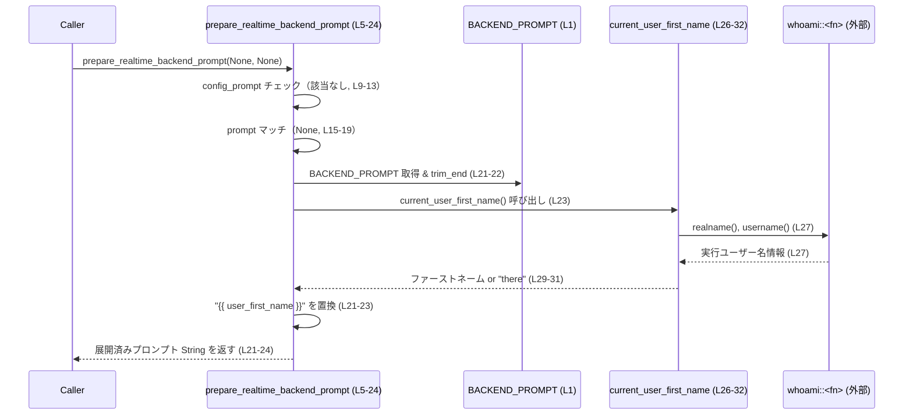

# core/src/realtime_prompt.rs コード解説

## 0. ざっくり一言

リアルタイム用バックエンドの「システムプロンプト」文字列を決定し、必要に応じて現在のユーザー名（ファーストネーム）をテンプレートに埋め込むためのユーティリティです（`prepare_realtime_backend_prompt` / `current_user_first_name`）。  
根拠: `prepare_realtime_backend_prompt` 定義と `BACKEND_PROMPT`・プレースホルダ定数、`current_user_first_name`（core/src/realtime_prompt.rs:L1-3, L5-24, L26-32）。

---

## 1. このモジュールの役割

### 1.1 概要

- リアルタイムバックエンドが利用するプロンプト文字列を、**設定ファイル・リクエスト・組み込みテンプレート**の三つの情報から選択・生成します（core/src/realtime_prompt.rs:L5-24, L34-80）。
- 設定値による上書き (`config_prompt`) を最優先とし、次にリクエスト由来のプロンプト (`prompt`)、最後に組み込みテンプレート `BACKEND_PROMPT` を用いる優先順位になっています（core/src/realtime_prompt.rs:L9-19）。
- 組み込みテンプレート内の `{{ user_first_name }}` プレースホルダは、実行中ユーザー名から推定したファーストネーム、または `"there"` に置き換えられます（core/src/realtime_prompt.rs:L1-3, L21-23, L26-32）。

### 1.2 アーキテクチャ内での位置づけ

このファイルは「**プロンプト決定ロジック**」を担当し、OS ユーザー情報とテンプレートファイルに依存します。

```mermaid
flowchart LR
    Caller["Caller（呼び出し元）"] --> P["prepare_realtime_backend_prompt (L5-24)"]
    P -->|設定を優先| ConfigPrompt["config_prompt 引数 (L6-7)"]
    P -->|次に利用| RequestPrompt["prompt 引数 (L6)"]
    P -->|最終的に利用| Tmpl["BACKEND_PROMPT 定数 (L1)"]
    Tmpl --> File["templates/realtime/backend_prompt.md（include_str! 経由, L1）"]
    P -->|ユーザー名埋め込み| NameFn["current_user_first_name (L26-32)"]
    NameFn --> Real["whoami::realname (L27)"]
    NameFn --> User["whoami::username (L27)"]
    NameFn --> DefName["DEFAULT_USER_FIRST_NAME \"there\" (L2)"]
    P --> Placeholder["USER_FIRST_NAME_PLACEHOLDER \"{{ user_first_name }}\" (L3)"]
```

- `prepare_realtime_backend_prompt` がエントリポイントとなり、テンプレートとユーザー名ユーティリティをまとめて扱います（core/src/realtime_prompt.rs:L5-24）。
- OS ユーザー情報の取得は `current_user_first_name` が一手に引き受けており、外部モジュール（クレートまたは別モジュール）`whoami` に依存しています（core/src/realtime_prompt.rs:L26-27）。

### 1.3 設計上のポイント

- **優先順位ベースのプロンプト決定**
  - `config_prompt`（設定） > `prompt`（リクエスト） > `BACKEND_PROMPT`（デフォルトテンプレート）の順で選択されます（core/src/realtime_prompt.rs:L9-24）。
- **二重の Option による状態表現**
  - `prompt: Option<Option<String>>` により、「引数自体が無い (`None`)」「明示的に空にしたい (`Some(None)`)」「具体的な文字列がある (`Some(Some(s))`)」を区別しています（core/src/realtime_prompt.rs:L5-7, L15-19）。
- **設定値とリクエスト値での扱いの違い**
  - `config_prompt` は `trim()` で空白のみの文字列を無効として扱う一方、`prompt` はトリムせずそのまま返します（core/src/realtime_prompt.rs:L9-13, L15-19）。  
    ⇒ 設定側は「空白のみ」は「未設定」とみなし、リクエスト側はそのままの文字列（たとえ空白だけでも）を尊重する設計です。
- **コンパイル時埋め込みテンプレート**
  - `include_str!` によりテンプレートファイルをコンパイル時にバンドルしているため、実行時にファイル I/O が発生しません（core/src/realtime_prompt.rs:L1）。
- **Rust 的な安全性**
  - `unwrap` ではなく `unwrap_or_else` による安全なデフォルト値の選択、`Option` によるエラーの明示的な表現など、ランタイムパニックを避ける構造になっています（core/src/realtime_prompt.rs:L26-32）。
- **並行性**
  - どちらの関数も可変グローバル状態を持たず、引数とローカル変数だけを扱うため、Rust の通常のルールのもとではマルチスレッドから同時に呼び出してもデータ競合は発生しない構造です（core/src/realtime_prompt.rs:L5-32）。

---

## 2. 主要な機能一覧

- プロンプト選択と生成: 設定・リクエスト・テンプレートから最終的なプロンプト文字列を決定します（core/src/realtime_prompt.rs:L5-24）。
- ユーザー名のファーストネーム決定: 実行ユーザーのフルネーム／ユーザー名から最初の単語を取り出し、空なら `"there"` にフォールバックします（core/src/realtime_prompt.rs:L26-32）。
- デフォルトテンプレートのプレースホルダ展開: テンプレート内の `{{ user_first_name }}` を、検出したファーストネームで置き換えます（core/src/realtime_prompt.rs:L1-3, L21-23）。

### 2.1 コンポーネントインベントリー（関数・定数・テスト）

| 名前 | 種別 | 可視性 | 役割 / 用途 | 根拠 |
|------|------|--------|-------------|------|
| `BACKEND_PROMPT` | 定数 `&'static str` | モジュール内（`const`） | `backend_prompt.md` テンプレートをコンパイル時に埋め込んだ文字列 | core/src/realtime_prompt.rs:L1-1 |
| `DEFAULT_USER_FIRST_NAME` | 定数 `&'static str` | モジュール内 | ユーザー名が取得できなかった場合に使う `"there"` | core/src/realtime_prompt.rs:L2-2 |
| `USER_FIRST_NAME_PLACEHOLDER` | 定数 `&'static str` | モジュール内 | テンプレート中のユーザー名プレースホルダ `"{{ user_first_name }}"` | core/src/realtime_prompt.rs:L3-3 |
| `prepare_realtime_backend_prompt` | 関数 | `pub(crate)` | プロンプトの優先順位ロジックとテンプレート展開を行うメイン関数 | core/src/realtime_prompt.rs:L5-24 |
| `current_user_first_name` | 関数 | private | 実行ユーザーのファーストネームを取得し、なければデフォルトを返す | core/src/realtime_prompt.rs:L26-32 |
| `tests` | モジュール | テスト時のみ（`#[cfg(test)]`） | `prepare_realtime_backend_prompt` の振る舞いを検証する 4 つのテストを含む | core/src/realtime_prompt.rs:L34-80 |
| `prepare_realtime_backend_prompt_prefers_config_override` | テスト関数 | `#[test]` | 設定プロンプトがリクエストプロンプトより優先されることを検証 | core/src/realtime_prompt.rs:L38-47 |
| `prepare_realtime_backend_prompt_uses_request_prompt` | テスト関数 | `#[test]` | 設定が無い場合にリクエストプロンプトが使われることを検証 | core/src/realtime_prompt.rs:L49-58 |
| `prepare_realtime_backend_prompt_preserves_empty_request_prompt` | テスト関数 | `#[test]` | リクエストで空が指定された場合に空文字が保たれることを検証 | core/src/realtime_prompt.rs:L60-70 |
| `prepare_realtime_backend_prompt_renders_default` | テスト関数 | `#[test]` | 両方のプロンプトが無い場合にデフォルトテンプレートが使われ、プレースホルダが解決されることを検証 | core/src/realtime_prompt.rs:L72-80 |

---

## 3. 公開 API と詳細解説

### 3.1 型一覧（構造体・列挙体など）

このファイル内には、公開されている構造体や列挙体の定義はありません（core/src/realtime_prompt.rs:L1-81）。  
主な公開要素は関数と定数です。

### 3.2 関数詳細

#### `prepare_realtime_backend_prompt(prompt: Option<Option<String>>, config_prompt: Option<String>) -> String`

**定義位置**: core/src/realtime_prompt.rs:L5-24  

**概要**

- バックエンド用の最終的なプロンプト文字列を決定し、必要に応じてテンプレートをユーザー名で展開します。
- 優先順位は「設定プロンプト `config_prompt`（空白以外の文字がある場合） ＞ リクエストプロンプト `prompt` ＞ デフォルトテンプレート」です（core/src/realtime_prompt.rs:L9-24）。

**引数**

| 引数名 | 型 | 説明 |
|--------|----|------|
| `prompt` | `Option<Option<String>>` | リクエスト由来のプロンプト。`None` = パラメータ自体が無い、`Some(None)` = 明示的に「空プロンプト」、`Some(Some(s))` = 文字列 `s` が指定された状態（core/src/realtime_prompt.rs:L5-7, L15-19, L63-68）。 |
| `config_prompt` | `Option<String>` | 設定ファイルや起動設定などから与えられるプロンプト。`Some(s)` かつ `s.trim().is_empty() == false` の場合のみ有効な上書きとして扱われます（core/src/realtime_prompt.rs:L6-7, L9-13）。 |

**戻り値**

- `String` — バックエンドに渡す最終的なプロンプト文字列。  
  どの分岐でも `String` を返し、`None` にはなりません（core/src/realtime_prompt.rs:L12, L16-18, L21-24）。

**内部処理の流れ（アルゴリズム）**

1. **設定プロンプトの優先利用**  
   `if let Some(config_prompt) = config_prompt && !config_prompt.trim().is_empty()` で、設定プロンプトが存在し、かつ空白以外の文字を含むかを確認します。条件を満たせば、そのまま `config_prompt` を返します（core/src/realtime_prompt.rs:L9-13）。
2. **リクエストプロンプトの確認**  
   `match prompt` により `prompt` の中身を確認します（core/src/realtime_prompt.rs:L15-19）。
   - `Some(Some(prompt))` の場合: 文字列 `prompt` をそのまま返します（core/src/realtime_prompt.rs:L16）。
   - `Some(None)` の場合: `String::new()` を返し、明示的な「空プロンプト」として扱います（core/src/realtime_prompt.rs:L17）。
   - `None` の場合: 何もせず次のステップへ進みます（core/src/realtime_prompt.rs:L18-19）。
3. **デフォルトテンプレートの適用**  
   上記どちらにも該当しなければ、`BACKEND_PROMPT.trim_end()` を呼び出し、末尾の改行や空白を削除したテンプレートを基にします（core/src/realtime_prompt.rs:L21-22）。
4. **ユーザー名プレースホルダの置き換え**  
   `.replace(USER_FIRST_NAME_PLACEHOLDER, &current_user_first_name())` により、`"{{ user_first_name }}"` に対応する部分を `current_user_first_name()` の結果に置き換えた文字列を返します（core/src/realtime_prompt.rs:L21-23）。

**処理フロー図（関数内部）**

```mermaid
flowchart TD
    A["呼び出し (prepare_realtime_backend_prompt, L5-8)"] --> B{"config_prompt が Some かつ 非空白? (L9-13)"}
    B -- Yes --> C["config_prompt をそのまま返す (L12)"]
    B -- No --> D{"prompt の値 (L15-19)"}
    D -- Some(Some(p)) --> E["p を返す (L16)"]
    D -- Some(None) --> F["空 String を返す (L17)"]
    D -- None --> G["BACKEND_PROMPT.trim_end() を取得 (L21-22)"]
    G --> H["current_user_first_name() を呼び出し (L23)"]
    H --> I["\"{{ user_first_name }}\" をユーザー名で置換して返す (L21-23)"]
```

**Examples（使用例）**

1. 設定プロンプトが存在する場合（設定が最優先）

```rust
// 設定からのプロンプト（空白以外を含む）
let config_prompt = Some("prompt from config".to_string());   // 設定側のプロンプト

// リクエストからもプロンプトが来ているが、設定を優先したい
let request_prompt = Some(Some("prompt from request".to_string())); // リクエスト由来

let result = prepare_realtime_backend_prompt(request_prompt, config_prompt);
// result == "prompt from config"
```

この挙動は `prepare_realtime_backend_prompt_prefers_config_override` テストで検証されています（core/src/realtime_prompt.rs:L38-47）。

1. 設定が無く、リクエストのプロンプトを使う場合

```rust
// 設定からのプロンプトは無い
let config_prompt = None;                                      // 設定は None

// リクエストで明示的にプロンプトを指定
let request_prompt = Some(Some("prompt from request".to_string()));

let result = prepare_realtime_backend_prompt(request_prompt, config_prompt);
// result == "prompt from request"
```

この挙動は `prepare_realtime_backend_prompt_uses_request_prompt` テストで検証されています（core/src/realtime_prompt.rs:L49-58）。

1. 両方とも指定されていない場合（デフォルトテンプレート）

```rust
let config_prompt = None;                      // 設定プロンプトなし
let request_prompt = None;                     // リクエストプロンプトもなし

let result = prepare_realtime_backend_prompt(request_prompt, config_prompt);

// result は BACKEND_PROMPT をベースに、
// "{{ user_first_name }}" が current_user_first_name() で置換された文字列になる
```

このとき、少なくとも以下が成り立つことがテストで確認されています（core/src/realtime_prompt.rs:L72-80）。

- `"You are Codex, an OpenAI Coding Agent"` で始まる。
- `"The user's name is "` を含む。
- `"{{ user_first_name }}"` という文字列は含まない。

**Errors / Panics**

- この関数内には `unwrap` や `expect` などのパニックを起こしうる呼び出しはありません（core/src/realtime_prompt.rs:L5-24）。
- 例外的状況でエラーを示すための `Result` 型も使用しておらず、常に何らかの `String` を返します。
- 間接的に呼び出される `current_user_first_name` も `Option` に対して `unwrap_or_else` を使用しているため、`whoami` 側がパニックしない限り、通常のケースでパニックは発生しません（core/src/realtime_prompt.rs:L26-32）。

**Edge cases（エッジケース）**

- `config_prompt = Some("   \n\t")` のように空白のみの場合  
  - `trim()` により空とみなされるため無効となり、リクエストプロンプトかデフォルトにフォールバックします（core/src/realtime_prompt.rs:L9-13）。
- `config_prompt = Some(String::new())`（空文字）  
  - 同様に無効となり、フォールバックします。
- `prompt = Some(Some(String::new()))`（リクエストで空文字が明示された場合）  
  - `Some(Some(prompt))` ブランチで空文字をそのまま返します（core/src/realtime_prompt.rs:L16, L60-65）。
- `prompt = Some(None)`  
  - `Some(None)` ブランチで `String::new()`（空文字）を返します。テストでこの挙動が確認されています（core/src/realtime_prompt.rs:L17, L66-69）。
- `prompt = None, config_prompt = None`  
  - デフォルトテンプレート + 現ユーザー名で生成された文字列が返ります（core/src/realtime_prompt.rs:L21-24, L72-80）。

**使用上の注意点**

- 設定プロンプトは空白のみの文字列だと「未指定」とみなされる一方、リクエストプロンプトは空白を含めてそのまま尊重されます。  
  - たとえば `"   "` を設定側に書いても無視されますが、リクエストで `"   "` を送るとそのまま返ります（core/src/realtime_prompt.rs:L9-19）。
- 「明示的に空プロンプトを指定したい」場合は `prompt = Some(None)` または `prompt = Some(Some(String::new()))` のいずれでも空文字が返りますが、前者は「値が None」、後者は「空文字」という意味的な違いがあります（core/src/realtime_prompt.rs:L16-17, L63-68）。
- 並行性の観点では、内部で共有ミュータブル状態やブロッキング I/O を使用していないため、複数スレッドから安全に呼び出せる構造になっています（core/src/realtime_prompt.rs:L5-24）。

---

#### `current_user_first_name() -> String`

**定義位置**: core/src/realtime_prompt.rs:L26-32  

**概要**

- 実行しているユーザーのファーストネーム（空白区切りで最初の単語）を取得します。
- フルネーム `whoami::realname()` とユーザー名 `whoami::username()` のいずれかから、最初に見つかった非空のファーストネームを返します。どちらからも取れない場合は `"there"` を返します（core/src/realtime_prompt.rs:L26-32）。

**引数**

- 引数はありません。

**戻り値**

- `String` — ユーザーのファーストネーム、または `DEFAULT_USER_FIRST_NAME`（`"there"`）です（core/src/realtime_prompt.rs:L26-32）。

**内部処理の流れ（アルゴリズム）**

1. **候補名リストの構築**  
   `[whoami::realname(), whoami::username()]` という 2 要素の配列を生成します（core/src/realtime_prompt.rs:L27）。
2. **イテレータ化**  
   `.into_iter()` でこの配列をイテレータに変換します（core/src/realtime_prompt.rs:L28）。
3. **ファーストネームへの変換**  
   `.filter_map(|name| name.split_whitespace().next().map(str::to_string))` により、各文字列について次の処理を行います（core/src/realtime_prompt.rs:L29）。
   - `split_whitespace()` で空白文字で分割。
   - `.next()` で最初のトークン（`Option<&str>`）を取得。
   - `.map(str::to_string)` で `Option<String>` に変換。
   - `filter_map` により、`None` はスキップされ、`Some(first)` の場合のみ次へ渡されます。
4. **最初の非空文字列を選択**  
   `.find(|name| !name.is_empty())` により、空でない最初の候補を選択します（core/src/realtime_prompt.rs:L30）。
5. **フォールバック**  
   `.unwrap_or_else(|| DEFAULT_USER_FIRST_NAME.to_string())` によって、候補が見つからなかった場合には `"there"` を返します（core/src/realtime_prompt.rs:L31）。

**Examples（使用例）**

```rust
// 実際の実行環境に依存する例です。
// whoami::realname() が "Ada Lovelace"
// whoami::username() が "ada" だと仮定します。

let first = current_user_first_name();

// 優先順位は realname -> username なので、"Ada" が返る想定です。
// （実際の値は環境のユーザー名に依存します）
println!("Hello, {first}!");
```

**Errors / Panics**

- `Option` に対して `unwrap_or_else` を使っているため、候補が一つも見つからない場合でもパニックせずデフォルト値 `"there"` を返します（core/src/realtime_prompt.rs:L31）。
- `whoami::realname()` / `whoami::username()` が内部でパニックするかどうかは、このチャンクからは分かりませんが、少なくとも本関数内では `Result` の `unwrap` などは使用していません（core/src/realtime_prompt.rs:L26-32）。

**Edge cases（エッジケース）**

- `whoami::realname()` / `whoami::username()` が空文字列を返す場合  
  - `split_whitespace().next()` が `None` となり候補から除外され、最終的に `"there"` が返ります（core/src/realtime_prompt.rs:L29-31）。
- 名前が空白のみの文字列（例: `"   "`）の場合  
  - `split_whitespace()` によりトークンが一つも得られず、同様に候補から除外されます。
- マルチワード名（例: `"Ada Lovelace"`）の場合  
  - `"Ada"` のみがファーストネームとして抽出されます（core/src/realtime_prompt.rs:L29）。
- `realname` では値が取れないが `username` なら取れる場合  
  - `realname` がスキップされ、`username` 側のファーストネームが使用されます。  
    （優先順は配列の順番 `realname`, `username` によります — core/src/realtime_prompt.rs:L27-30）

**使用上の注意点**

- 戻り値は常に 1 語（空白で区切った最初のトークン）になり、フルネームは返されません。
- 環境依存の値であり、テストなどでは特定の値を期待すると不安定になります。  
  本ファイル内のテストも、実際の名前ではなくプレースホルダ解決の有無だけを検証しています（core/src/realtime_prompt.rs:L72-80）。
- 並行性の観点では、外部の `whoami` 依存を除けば、共有状態に触れていないためスレッドセーフな構造です（core/src/realtime_prompt.rs:L26-32）。

### 3.3 その他の関数

公開 API 以外の関数は、すべてテストのための関数です。

| 関数名 | 役割（1 行） | 根拠 |
|--------|--------------|------|
| `prepare_realtime_backend_prompt_prefers_config_override` | 設定プロンプトが最優先であることのテスト | core/src/realtime_prompt.rs:L38-47 |
| `prepare_realtime_backend_prompt_uses_request_prompt` | 設定が無いときにリクエストプロンプトを使用することのテスト | core/src/realtime_prompt.rs:L49-58 |
| `prepare_realtime_backend_prompt_preserves_empty_request_prompt` | リクエストで空／None を指定した時に空文字が返ることのテスト | core/src/realtime_prompt.rs:L60-70 |
| `prepare_realtime_backend_prompt_renders_default` | 全て未指定時にデフォルトテンプレートが利用され、プレースホルダが消えていることのテスト | core/src/realtime_prompt.rs:L72-80 |

---

## 4. データフロー

ここでは、**どのプロンプトも指定されていない場合**のデータフローを示します。

1. 呼び出し元が `prepare_realtime_backend_prompt(None, None)` を呼びます（core/src/realtime_prompt.rs:L72-75）。
2. 設定プロンプトは `None` なのでスキップされます（core/src/realtime_prompt.rs:L9-13）。
3. リクエストプロンプトも `None` なのでマッチの `None` ブランチを通過し、何も返さずに次へ進みます（core/src/realtime_prompt.rs:L18-19）。
4. `BACKEND_PROMPT` を基に、`trim_end` で末尾の空白を削除したテンプレート文字列が取得されます（core/src/realtime_prompt.rs:L21-22）。
5. `current_user_first_name()` が呼ばれ、ユーザーのファーストネーム（または `"there"`）が計算されます（core/src/realtime_prompt.rs:L21-23, L26-32）。
6. テンプレート内の `"{{ user_first_name }}"` が、そのファーストネームに置き換えられた文字列が返されます（core/src/realtime_prompt.rs:L21-23）。



---

## 5. 使い方（How to Use）

### 5.1 基本的な使用方法

もっとも単純な利用は、「設定による上書きは行わず、リクエストに来たプロンプトをそのまま使う」ケースです。

```rust
// 同一モジュール内、あるいは適切に use された状況を想定した例です。

fn build_prompt_for_request() -> String {                          // リクエストに対するプロンプトを組み立てる関数
    let request_prompt = Some(Some("prompt from request".to_string())); // クライアントから渡されたプロンプト（Some(Some(...))）
    let config_prompt = None;                                      // システム設定からの上書きは無し（None）

    let backend_prompt =
        prepare_realtime_backend_prompt(request_prompt, config_prompt); // 優先順位ロジックを適用して最終プロンプトを得る

    backend_prompt                                                  // 呼び出し元へ結果を返す
}
```

### 5.2 よくある使用パターン

1. **設定で固定プロンプトを使う**

```rust
let request_prompt = Some(Some("user specific prompt".to_string())); // ユーザー固有の要求があっても
let config_prompt = Some("global override prompt".to_string());      // 設定側で固定プロンプトを定義

let result = prepare_realtime_backend_prompt(request_prompt, config_prompt);
// 設定の "global override prompt" がそのまま利用される
```

1. **空プロンプトを明示的に指定する**

```rust
// 「プロンプトを空にしたい」ことを明示する
let request_prompt = Some(None);                // Some(None) を指定
let config_prompt = None;

let result = prepare_realtime_backend_prompt(request_prompt, config_prompt);
// result == "" （空文字列）
```

1. **設定にもリクエストにも何も指定しない（デフォルトテンプレート）**

```rust
let result = prepare_realtime_backend_prompt(None, None);
// result は backend_prompt.md を元に、ユーザー名が埋め込まれた文字列になる
```

### 5.3 よくある間違い

```rust
// 誤り例: 空白だけの設定プロンプトを「明示的な空」と誤解している
let config_prompt = Some("   ".to_string());     // 空白だけの設定
let request_prompt = None;

let result = prepare_realtime_backend_prompt(request_prompt, config_prompt);
// 実際には config_prompt は無効扱いとなり、デフォルトテンプレートが使われる
```

```rust
// 正しい例: リクエスト側で空を明示するか、空文字を直接渡す
let config_prompt = None;
let request_prompt = Some(None);                 // または Some(Some(String::new()))

let result = prepare_realtime_backend_prompt(request_prompt, config_prompt);
// 空文字が返る
```

- **ポイント**: 「空白のみの設定文字列」は無視される一方、「空白のみのリクエスト文字列」はそのまま使われます（core/src/realtime_prompt.rs:L9-19）。

### 5.4 使用上の注意点（まとめ）

- 設定側で意図的にプロンプトを「空」にしたい場合、単に空白だけの文字列を設定しても無視されます。  
  その場合は設定ではなくリクエスト側で `prompt = Some(None)` などを使う必要があります（core/src/realtime_prompt.rs:L9-19）。
- 戻り値の `String` は常に何らかの値を持ち、`None` にはなりません。呼び出し側で「プロンプトが無い」状態を表現したい場合は、空文字かどうかなどを自前で判断する必要があります（core/src/realtime_prompt.rs:L12, L16-18, L21-24）。
- 並行実行環境での利用に関して、関数は共有ミュータブル状態にアクセスしないため、通常の Rust のスレッド安全性の制約の範囲内で安全に利用できます（core/src/realtime_prompt.rs:L5-32）。
- セキュリティの観点では、ユーザー名をそのままテンプレートに埋め込むため、生成されたプロンプトがどこへ送られるか（外部サービスなど）に応じて、個人情報としての扱いに注意が必要です（core/src/realtime_prompt.rs:L21-23, L26-32）。

---

## 6. 変更の仕方（How to Modify）

### 6.1 新しい機能を追加する場合

1. **新たなプレースホルダをテンプレートに追加する**  
   - `../templates/realtime/backend_prompt.md` に `{{ project_name }}` のような新しいプレースホルダを追記します（core/src/realtime_prompt.rs:L1）。
2. **コード側でプレースホルダ定数を定義する**  
   - `USER_FIRST_NAME_PLACEHOLDER` と同様に、新しい定数を追加します（core/src/realtime_prompt.rs:L3）。
3. **`prepare_realtime_backend_prompt` で置換処理を追加する**  
   - `.replace(USER_FIRST_NAME_PLACEHOLDER, ...)` に続けて `.replace(PROJECT_NAME_PLACEHOLDER, &project_name)` のような連鎖を追加するのが自然です（core/src/realtime_prompt.rs:L21-23）。
4. **必要なら新しい引数や設定値を増やす**  
   - 追加した情報が設定またはリクエスト由来なら、`config_prompt` や `prompt` に類する新パラメータを追加し、優先順位ロジックに組み込むことになります（優先順位ロジックは現在 L9-19 に集中しています）。

### 6.2 既存の機能を変更する場合

- **設定プロンプトの扱いを変える場合**
  - たとえば「空白のみの設定プロンプトも有効に扱いたい」場合は、`!config_prompt.trim().is_empty()` の条件を変更または削除する必要があります（core/src/realtime_prompt.rs:L9-11）。
  - その際、`prepare_realtime_backend_prompt_prefers_config_override` など既存テストにも影響するため、挙動に合わせてテストを修正する必要があります（core/src/realtime_prompt.rs:L38-47）。
- **「明示的に空プロンプト」を別の意味にしたい場合**
  - 現状 `Some(None)` と `Some(Some(String::new()))` のどちらも空文字を返します（core/src/realtime_prompt.rs:L16-17, L63-68）。
  - どちらかを「デフォルトテンプレートを使う」という意味に変えたい場合は、`match prompt` の分岐を変更し、該当ケースでデフォルトテンプレートを選ぶようにします（core/src/realtime_prompt.rs:L15-19）。
- **ユーザー名の決定ロジックを変える場合**
  - `current_user_first_name` だけを修正すれば済み、他のコードへの影響は限定的です（core/src/realtime_prompt.rs:L26-32）。
  - 例: ファミリーネームを使いたい、フルネームをそのまま使いたい等。

---

## 7. 関連ファイル

| パス | 役割 / 関係 |
|------|------------|
| `templates/realtime/backend_prompt.md` | `BACKEND_PROMPT` 定数として `include_str!` で読み込まれるテンプレートファイル。デフォルトのプロンプト文面と `{{ user_first_name }}` プレースホルダを定義します（core/src/realtime_prompt.rs:L1, L21-23, L72-80）。 |

※ `whoami` モジュール／クレートのソース位置はこのチャンクには現れないため不明ですが、`current_user_first_name` 内で利用されています（core/src/realtime_prompt.rs:L26-27）。

---

## バグ・セキュリティ・性能などの補足（見出し名としては分離しません）

- **バグの可能性**
  - このファイルだけを見る限り、`Option` の取り扱いやフォールバックのロジックはテストで主要パスがカバーされており、明らかなバグは確認できません（core/src/realtime_prompt.rs:L38-80）。
  - 設定とリクエストで空白文字列の扱いが異なる点は設計上の選択と考えられますが、利用者が意図を誤解すると予期しない挙動になる可能性があります（core/src/realtime_prompt.rs:L9-19, L60-70）。
- **セキュリティ**
  - 実行ユーザーの名前を外部システム（例: モデル API）に送る前提のため、プライバシー要件次第ではオプトアウトの仕組みやマスキング等が必要になる場合があります（core/src/realtime_prompt.rs:L21-23, L26-32）。
  - テンプレートへの埋め込みは単純な文字列置換であり、コードインジェクションのような危険を直接生む構造ではありません（core/src/realtime_prompt.rs:L21-23）。
- **性能 / スケーラビリティ**
  - 主な処理は文字列操作と 2 つのユーザー名取得呼び出しのみであり、1 回の呼び出しコストは軽量です（core/src/realtime_prompt.rs:L21-23, L26-32）。
  - `include_str!` によりテンプレートがバイナリに埋め込まれているため、実行時ファイルアクセスによるレイテンシは発生しません（core/src/realtime_prompt.rs:L1）。
  - 高頻度に呼び出す場合も、ユーザー名の取得コストが支配的になる可能性がありますが、このチャンクからは `whoami` の内部コストは分かりません。必要であれば呼び出し側でキャッシュを検討する余地があります。
