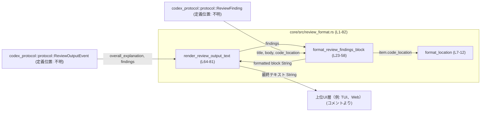
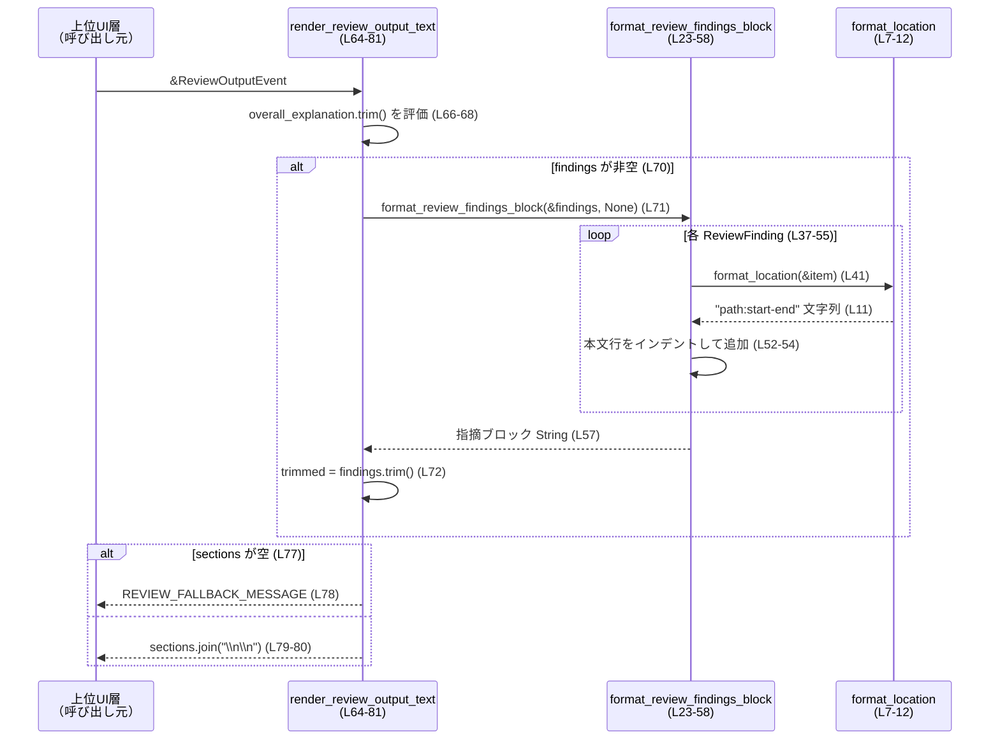

# core/src/review_format.rs コード解説

## 0. ざっくり一言

コードレビュー結果（`ReviewOutputEvent` / `ReviewFinding`）を、人間が読みやすいプレーンテキストメッセージに整形するためのフォーマット用モジュールです（UIに依存しない文字列を返します）。

---

## 1. このモジュールの役割

### 1.1 概要

- このモジュールは、**レビュー結果オブジェクトをプレーンテキストに変換する**役割を持ちます。
- 個々の指摘（`ReviewFinding`）を箇条書きブロックに整形し（チェックボックス付きにも対応）、それらを全体説明（`overall_explanation`）と組み合わせて、最終的なユーザ向けメッセージを作成します。
- UI には依存せず、「上位レイヤーが任意に装飾できる生の文字列」を返します（コメントより、core/src/review_format.rs:L4-5）。

### 1.2 アーキテクチャ内での位置づけ

- 依存関係:
  - 入力として `codex_protocol::protocol::ReviewOutputEvent` と `codex_protocol::protocol::ReviewFinding` を受け取ります（L1-2）。
  - それらのフィールド値を読み、`String` を生成して返します。
- このモジュール自身は UI を持たず、コメント上は「高レイヤー（例: TUI）がスタイル付けを行う」前段階のフォーマッタとして位置づけられています（L4-5）。



### 1.3 設計上のポイント

- **UI 非依存**  
  - コメントに明示されている通り、このモジュールはプレーンな `String` のみを返し、色付けやハイライトなどは行いません（L4-5）。
- **不変データのみを扱う純粋関数スタイル**  
  - すべての関数は引数に基づいて `String` を生成するだけで、副作用（I/O、グローバル状態の変更など）はありません（L7-12, L23-58, L64-81）。
- **安全性とエラー処理**  
  - Rust の安全な API のみを使用しており、`unsafe`、`unwrap`、`expect`、`panic!` などの呼び出しはありません。配列アクセスも `flags.get(idx)` による境界チェック付きで行われます（L45）。
  - エラーではなく「空/欠如」を明示的なフォーマット結果に落とし込む方針が取られており、説明も指摘もない場合に備えたフォールバックメッセージが定義されています（L14, L77-80）。
- **並行性**  
  - グローバルな可変状態や共有ミュータブルデータ構造は使用されておらず、`&` 参照と値のコピー/所有（`String`）だけを扱うため、同一インスタンスを複数スレッドから同時に呼び出してもデータ競合は生じない構造になっています。

---

## 2. 主要な機能一覧

- レビュー位置のフォーマット: `format_location`  
  `ReviewFinding` のコード位置を `"path:start-end"` 形式の文字列に変換します（L7-12）。
- 指摘一覧ブロックの整形: `format_review_findings_block`  
  `ReviewFinding` のスライスを、ヘッダと箇条書きのテキストブロック（チェックボックス付きにも対応）に変換します（L23-58）。
- レビュー全体テキストの生成: `render_review_output_text`  
  全体説明と指摘一覧ブロックを組み合わせた、人間向けレビューサマリ文字列を生成します（L64-81）。

---

## 3. 公開 API と詳細解説

### 3.1 コンポーネント一覧（関数・定数）

| 名前 | 種別 | 公開 | 役割 / 用途 | 定義位置 |
|------|------|------|-------------|----------|
| `format_location` | 関数 | 非公開 | `ReviewFinding` のコード位置を `"path:start-end"` 形式に整形する | `core/src/review_format.rs:L7-12` |
| `REVIEW_FALLBACK_MESSAGE` | 定数 `&'static str` | 非公開 | 説明も指摘も空のときに返すフォールバックメッセージ | `core/src/review_format.rs:L14` |
| `format_review_findings_block` | 関数 | 公開 | `ReviewFinding` の一覧をヘッダ付きテキストブロックに整形する | `core/src/review_format.rs:L23-58` |
| `render_review_output_text` | 関数 | 公開 | `ReviewOutputEvent` から最終的なレビュー説明テキストを生成する | `core/src/review_format.rs:L64-81` |

### 3.2 型一覧

このファイル内で新しく定義される構造体・列挙体・型エイリアスはありません。  
利用している型は外部モジュール由来です。

| 名前 | 種別 | 出典 | 主な利用箇所 |
|------|------|------|-------------|
| `ReviewFinding` | 構造体（と推定） | `codex_protocol::protocol` | `format_location`（L7-12）、`format_review_findings_block`（L23-58） |
| `ReviewOutputEvent` | 構造体（と推定） | `codex_protocol::protocol` | `render_review_output_text`（L64-81） |

※ `ReviewFinding` / `ReviewOutputEvent` のフィールド構成や定義場所のファイルパスは、このチャンクには現れません。

---

### 3.3 関数詳細

#### `format_review_findings_block(findings: &[ReviewFinding], selection: Option<&[bool]>) -> String`

**概要**

- 複数の `ReviewFinding` を、ヘッダ行と箇条書きの本文からなるテキストブロックに整形する関数です（L23-58）。
- `selection` が与えられた場合は、各行先頭にチェックボックス（`[x]` / `[ ]`）を付与します。インデックスに対応するフラグが無い場合は「選択されているもの」として扱います（L43-47）。

**引数**

| 引数名 | 型 | 説明 |
|--------|----|------|
| `findings` | `&[ReviewFinding]` | 整形対象となるレビュー指摘のスライスです。各要素の `title` / `body` / `code_location` が使用されます（L37-41, L52-53）。 |
| `selection` | `Option<&[bool]>` | 各指摘が「選択されているか」を表すフラグ配列を参照で受け取ります。`Some(flags)` の場合にチェックボックスを表示します（L43-47）。 |

**戻り値**

- 整形済みのレビュー指摘ブロック `String` を返します（L57）。
  - 先頭に空行、続いてヘッダ行（"Full review comments:" または "Review comment:"）、その後に各指摘の行が続く構造です（L27-35, L37-55）。

**内部処理の流れ**

1. 空の `Vec<String>` を作成し、まず空行を 1 行追加します（L27-28）。
2. `findings.len()` に応じてヘッダ行を決定し、`lines` に追加します（L30-35）。  
   - 2 件以上なら `"Full review comments:"`（L31-32）。  
   - それ以外（0 または 1 件）なら `"Review comment:"`（L33-34）。
3. `findings` を `enumerate()` でインデックス付きでループします（L37）。
   - 各指摘の前に空行を 1 行追加します（L38）。
   - `title` と `location`（`format_location` の結果）を取得します（L40-41）。
4. `selection` が `Some(flags)` の場合（L43-47）:
   - `flags.get(idx)` で境界チェック付きアクセスを行い、該当インデックスの値を取得します。存在しない場合は `true`（選択済み）とみなします（L45）。
   - `checked` に応じて `marker` を `"[x]"` あるいは `"[ ]"` とし（L46）、`"- {marker} {title} — {location}"` 形式の行を追加します（L47）。
5. `selection` が `None` の場合（L48-49）:
   - チェックボックスを付けず、`"- {title} — {location}"` 形式の行を追加します（L49）。
6. `item.body.lines()` ですべての本文行を走査し（L52）、各行に `"  "` を付加してインデントした形で `lines` に追加します（L52-54）。
7. 最後に `lines.join("\n")` により、全行を改行区切りで結合し、`String` として返します（L57）。

**Examples（使用例・疑似コード）**

`ReviewFinding` の定義がこのチャンクにはないため、疑似コードとして概要を示します。

```rust
use codex_protocol::protocol::ReviewFinding;
use core::review_format::format_review_findings_block;

fn example_use(findings: &[ReviewFinding]) {
    // すべて選択済みとして表示する（selection = None）
    let block = format_review_findings_block(findings, None);
    println!("{block}");

    // 先頭2件のみ選択済みとする selection 付きの例
    let selection_flags = vec![true, true, false];
    let block_with_flags = format_review_findings_block(findings, Some(&selection_flags));
    println!("{block_with_flags}");
}
```

※ 実際にコンパイルするには `ReviewFinding` の具体的なコンストラクタやフィールドに合わせて作成する必要があります。

**Errors / Panics**

- この関数内では、明示的な `panic!`、`unwrap`、`expect` は使用されていません（L23-58）。
- スライス `selection` へのアクセスは `flags.get(idx)` によって行われており、境界外アクセスは `None` として扱われます（L45）。その場合もパニックは発生せず、デフォルトで `true` になります（L45）。
- `format!` や `String` 操作は通常の Rust 標準ライブラリ関数であり、メモリ不足などの異常系はこのコードからは扱われていません。

**Edge cases（エッジケース）**

- `findings` が空 (`[]`) のとき（L31-35, L37-55）  
  - ループ本体は実行されず、ヘッダのみが出力されます。  
    - `findings.len() > 1` が偽のため、ヘッダは `"Review comment:"` になります（L33-34）。
- `selection` が `None` のとき（L48-49）  
  - チェックボックスは表示されず、単純な `"- Title — path:start-end"` 形式になります。
- `selection` が `Some(flags)` で `flags.len() < findings.len()` のとき（L45）  
  - 余分な `findings` については `flags.get(idx)` が `None` となり、`unwrap_or(true)` によりすべて選択済み (`[x]`) とみなされます（L45-47）。
- `selection` が `Some(flags)` で `flags.len() > findings.len()` のとき  
  - 余分な要素は単に使われず、エラーも発生しません。
- `item.body` に改行が含まれるとき（L52-54）  
  - `lines()` で 1 行ずつに分割され、それぞれ `"  "` でインデントされた行として追加されます。

**使用上の注意点**

- **インデックスとフラグ数の関係**  
  - `selection` の長さが `findings` より短い場合、残りは自動的に「選択済み」扱いになります（L45）。  
    「未選択」にしたい場合は、必要な長さまで `false` を埋めておく必要があります。
- **先頭の空行**  
  - 最初に `lines.push(String::new())` が実行されるため、生成される文字列の先頭は空行です（L27-28）。  
    `render_review_output_text` では `.trim()` により両端の空白行が削除されますが（L71-73）、この関数を単体で使う場合は先頭空行を想定に入れておく必要があります。
- **パス表示形式**  
  - ファイルパスは `Display` 実装に依存した文字列として出力されます（L8-11）。OS 依存の区切り文字（`/` や `\`）などがそのまま出力されます。

---

#### `render_review_output_text(output: &ReviewOutputEvent) -> String`

**概要**

- `ReviewOutputEvent` を入力として、人間向けのレビューサマリ文字列を生成する関数です（L64-81）。
- 全体説明 (`overall_explanation`) と、`format_review_findings_block` によって生成された指摘一覧ブロックを組み合わせます。
- どちらも存在しない場合は定数 `REVIEW_FALLBACK_MESSAGE` を返します（L77-78）。

**引数**

| 引数名 | 型 | 説明 |
|--------|----|------|
| `output` | `&ReviewOutputEvent` | 全体説明と指摘一覧などを含むレビュー結果です。`overall_explanation` と `findings` フィールドが利用されています（L66, L70-71）。 |

**戻り値**

- 整形済みのレビューサマリ `String`。
  - 構成:
    - 非空の `overall_explanation`（あれば）  
    - 1 行空行  
    - 非空の指摘一覧ブロック（あれば）  
  - 両方とも空／空ブロックの場合はフォールバックメッセージ `"Reviewer failed to output a response."` を返します（L77-78）。

**内部処理の流れ**

1. `sections` という空の `Vec<String>` を作成します（L65）。
2. `output.overall_explanation.trim()` を `explanation` として取得し（L66）、空文字かどうかをチェックします。
   - 空でなければ `sections` に追加します（L67-68）。
3. `output.findings` が空でない場合（L70）:
   - `format_review_findings_block(&output.findings, None)` を呼び出して、選択情報なしの指摘ブロック文字列を生成します（L71）。
   - 生成された文字列に対して `trim()` を行い（L72）、空でなければ `sections` に追加します（L72-74）。
4. `sections` が空の場合（L77）:
   - `REVIEW_FALLBACK_MESSAGE`（定数）を返します（L77-78）。
5. `sections` に 1 つ以上要素がある場合（L79-80）:
   - `sections.join("\n\n")` で 2 重改行を挟んで結合し、返します（L79-80）。

**Examples（使用例・疑似コード）**

定義がこのチャンクにはないフィールドも存在する可能性があるため、疑似コードとして示します。

```rust
use codex_protocol::protocol::{ReviewOutputEvent, ReviewFinding};
use core::review_format::render_review_output_text;

// ReviewOutputEvent / ReviewFinding の実際の定義に応じてフィールドは補ってください。
fn build_sample_output_event() -> ReviewOutputEvent {
    ReviewOutputEvent {
        overall_explanation: "全体としては良好ですが、いくつか改善点があります。".to_string(),
        findings: vec![
            ReviewFinding {
                title: "不要なunwrapの使用".to_string(),
                body: "エラー時にパニックする可能性があります。Resultを適切に扱ってください。".to_string(),
                code_location: /* 実際の code_location をここで設定 */,
            },
        ],
        // 他のフィールドがある場合は適宜設定
    }
}

fn show_review(event: &ReviewOutputEvent) {
    let text = render_review_output_text(event);
    println!("{text}");
}
```

**Errors / Panics**

- この関数自体も、明示的な `panic!`、`unwrap` 等を使用していません（L64-81）。
- `format_review_findings_block` を呼び出しますが、この関数も境界チェックされたアクセスのみを行います（L71 は関数呼び出し）。  
  したがって、通常の入力に対してパニックは発生しません。
- `trim()` は安全な文字列操作であり、エラーやパニックは発生しません（L66, L72）。

**Edge cases（エッジケース）**

- `overall_explanation` が空文字または空白のみのとき（L66-68）  
  - `trim()` 結果が空となるため、`sections` には追加されません。
- `findings` が空のとき（L70-71）  
  - `format_review_findings_block` 自体が呼び出されず、指摘ブロックは追加されません。
- `overall_explanation` も `findings` も（およびその結果のブロックも）空のとき（L65-77）  
  - `sections.is_empty()` が真となり、`REVIEW_FALLBACK_MESSAGE`（"Reviewer failed to output a response."）が返されます（L77-78）。
- `format_review_findings_block` の返す文字列が空白だけの場合（L71-74）  
  - `trim()` により空文字となり、やはり `sections` には追加されません（L72-74）。

**使用上の注意点**

- `overall_explanation` や `findings` が空でもパニックせず、フォールバックの文字列に自然に収束する設計になっています（L77-78）。
- `format_review_findings_block` の先頭空行は、この関数側で `trim()` をかけることで実質的に除去されています（L71-73）。  
  そのため、最終出力は不要な先頭空行を含みません。
- 上位 UI 層での整形（色付け・折り返しなど）は、この関数の返すプレーンテキストに対して行うことが想定されています（コメント L4-5）。

---

### 3.4 その他の関数

| 関数名 | 役割（1 行） | 定義位置 |
|--------|--------------|----------|
| `format_location` | `ReviewFinding` の `code_location` から `"path:start-end"` 形式の文字列を作る補助関数 | `core/src/review_format.rs:L7-12` |

**`format_location(item: &ReviewFinding) -> String` の簡単な説明**

- `item.code_location.absolute_file_path.display()` でパス表示用オブジェクトを取得し（L8）、`line_range.start` と `line_range.end` を取り出して（L9-10）、`format!("{path}:{start}-{end}")` で 1 つの文字列にまとめます（L11）。
- エラー処理やパニック要因はなく、単純なフィールドアクセスと文字列フォーマットのみです。

---

## 4. データフロー

ここでは `render_review_output_text` を呼び出したときの典型的なデータフローを示します。

1. 上位層が `ReviewOutputEvent` を構築し、`render_review_output_text` に参照を渡す（L64）。
2. 関数内で `overall_explanation` がトリムされ、非空であれば `sections` に格納される（L66-68）。
3. `findings` が存在する場合、`format_review_findings_block` が呼び出され、指摘ブロック文字列が生成される（L70-71）。
4. `format_review_findings_block` は各 `ReviewFinding` ごとに `format_location` を呼び、パスと行番号が付いた行を生成する（L37-41）。
5. 最終的に、説明と指摘ブロックが二重改行で連結され、上位 UI に返される（L79-80）。



---

## 5. 使い方（How to Use）

### 5.1 基本的な使用方法

上位層からは通常、`render_review_output_text` を直接呼び出して最終テキストを取得する使い方になります。

```rust
use codex_protocol::protocol::ReviewOutputEvent;
use core::review_format::render_review_output_text;

// `event` はどこか別の処理で構築済みの ReviewOutputEvent とする
fn show_review_to_user(event: &ReviewOutputEvent) {
    let text = render_review_output_text(event);  // 全体説明 + 指摘ブロックをプレーンテキスト化
    println!("{text}");                           // TUI などではここで色付けや装飾を行う
}
```

- `ReviewOutputEvent` の構築方法はこのチャンクには現れないため、実際には当該型の定義に従って初期化する必要があります。

### 5.2 よくある使用パターン

1. **単に全文を表示したい場合**

   - `render_review_output_text` の戻り値をそのままログやコンソールに出力する。

2. **指摘ブロックにチェックボックスを付けて表示したい場合**

   - `format_review_findings_block` を直接呼び出し、`selection` にチェック状態を渡す。

```rust
use codex_protocol::protocol::ReviewFinding;
use core::review_format::format_review_findings_block;

fn show_selectable_findings(findings: &[ReviewFinding], selection: &[bool]) {
    let block = format_review_findings_block(findings, Some(selection));
    println!("{block}");
}
```

### 5.3 よくある間違い

```rust
use core::review_format::format_review_findings_block;

// 間違い例: findings の数より短い selection を意図せず渡してしまう
fn bad_usage(findings: &[ReviewFinding]) {
    let selection = vec![false];  // 1件分しかない
    // 2件目以降は flags.get(idx) == None となり、デフォルトで true（選択済み）扱いになる
    let block = format_review_findings_block(findings, Some(&selection));
    println!("{block}");
}

// 正しい例: すべて「未選択」にしたいなら、findings.len() に合わせて false を埋める
fn good_usage(findings: &[ReviewFinding]) {
    let selection = vec![false; findings.len()];
    let block = format_review_findings_block(findings, Some(&selection));
    println!("{block}");
}
```

### 5.4 使用上の注意点（まとめ）

- **前提条件**
  - `selection` を渡す場合は、`findings` と同じ長さかそれ以上にしておくと意図しない `"[x]"` が付与されません（L45）。
- **禁止事項 / 注意**
  - このモジュールは UI 非依存を前提にしているため（L4-5）、色コードやマークアップタグなどをここで埋め込むと、呼び出し側の期待とズレる可能性があります。
- **性能**
  - すべての処理は文字列操作のみであり、I/O は行いません。`findings` の件数に比例した `String` の連結コストが発生しますが、通常のレビュー件数規模では問題になりにくい構造です。
- **並行性**
  - 共有ミュータブル状態はなく、関数はすべて引数に対してのみ計算を行います。複数スレッドから同じ `ReviewOutputEvent` を借用して `render_review_output_text` を呼ぶようなパターンでも、データ競合は発生しません。

---

## 6. 変更の仕方（How to Modify）

### 6.1 新しい機能を追加する場合

- **ヘッダやフォーマットのバリエーションを増やしたい場合**
  1. `format_review_findings_block` 内のヘッダ決定ロジック（L31-35）や行フォーマット部分（L47-49）を拡張して、新しいフォーマットパターンを追加します。
  2. 上位層から選択できるようにしたい場合は、追加の引数（例えば「フォーマットモード」enum）を導入する必要があります。
- **JSON や Markdown 形式も出力したい場合**
  - 本モジュールとは別に、新しいフォーマッタモジュールを用意し、`ReviewOutputEvent` から別形式を生成する関数を追加するのが自然です。本ファイルの関数には影響を与えずに、用途ごとにモジュールを分けると役割が明確になります。

### 6.2 既存の機能を変更する場合

- **影響範囲の確認**
  - `format_review_findings_block` と `render_review_output_text` は公開関数（`pub`）であるため（L23, L64）、外部モジュールから呼ばれている可能性があります。変更時は利用箇所を検索して影響範囲を把握する必要があります。
- **契約（前提条件・返り値の意味）**
  - `format_review_findings_block` が返す文字列の構造（先頭の空行、ヘッダ行、二重改行の有無など）を変える場合、`render_review_output_text` だけでなく、これを直接使っているコードがあればそこにも影響します。
  - `render_review_output_text` が「説明または指摘ブロック、あるいはフォールバックメッセージのいずれかを返す」という契約（L63-64, L77-80）を変える場合は、上位 UI の表示ロジックを見直す必要があります。
- **テスト**
  - このチャンクにはテストコードは現れませんが、変更時には少なくとも以下を確認するテストがあることが望ましいです（テストの有無自体は不明）:
    - 説明のみ、指摘のみ、両方、どちらもない、各パターンでの出力。
    - `selection` の長さと `findings` 件数の組み合わせによるチェックボックス表示。

---

## 7. 関連ファイル

このモジュールと密接に関係するのは、レビュー結果データの定義および生成部分です。

| パス / モジュール | 役割 / 関係 |
|-------------------|------------|
| `codex_protocol::protocol::ReviewFinding` | 個々のレビュー指摘を表す型。`title` / `body` / `code_location` が本モジュールで使用されます（L40-41, L52-53）。実際の定義ファイルパスはこのチャンクには現れません。 |
| `codex_protocol::protocol::ReviewOutputEvent` | レビュー全体の説明文と指摘一覧を含むイベント型。`overall_explanation` と `findings` が `render_review_output_text` で使用されます（L66, L70-71）。 |
| 上位 UI モジュール（TUI など） | コメント中に言及される、プレーンテキストを受け取ってスタイル付けや表示を行う層です（L4-5）。具体的なパスや実装はこのチャンクには現れません。 |

---

### Bugs / Security 観点（補足）

- **潜在的なバグ**
  - `findings` が空のときでもヘッダ `"Review comment:"` を出力する仕様になっています（L33-35）。これは仕様通りとも解釈できますが、「コメントがないのにヘッダが出る」ことを意図しているかどうかは、このチャンクからは判断できません。
- **セキュリティ**
  - このモジュールは純粋な文字列整形のみを行っており、外部コマンド実行やファイルアクセスはありません。  
  - 出力文字列は入力文字列（説明文・本文）をほぼそのまま利用するため、XSS やコマンドインジェクションの可能性があるかどうかは **表示側のコンテキスト** に依存します。ここでは特別なエスケープは行っていません（L52-54, L67-68）。

以上が、このファイル単体から読み取れる範囲での客観的な解説になります。
