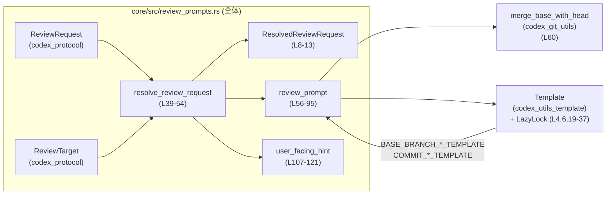

# core/src/review_prompts.rs コード解説

## 0. ざっくり一言

`ReviewTarget`（レビュー対象）に応じて、人間向けの「レビュー依頼プロンプト」と「短い表示用ヒント」を生成するユーティリティモジュールです（`core/src/review_prompts.rs:L8-13, L39-121`）。

---

## 1. このモジュールの役割

### 1.1 概要

- このモジュールは **「どの変更をレビューするか」という指定（`ReviewTarget`）から、LLM 等に渡す英語のレビュー依頼文を組み立てる** ために存在します。
- 併せて、UI などに表示するための **短い user-facing ヒント文字列** も生成します（`ResolvedReviewRequest`）。
- Git のベースブランチやコミット SHA など、レビュー対象に応じた情報をテンプレートに埋め込んで返します（`core/src/review_prompts.rs:L15-37, L56-95`）。

### 1.2 アーキテクチャ内での位置づけ

このモジュールが他コンポーネントとどう関わるかを、主な依存関係に絞って示します。



### 1.3 設計上のポイント

- **責務の分離**（`core/src/review_prompts.rs:L39-54, L56-95, L107-121）
  - LLM 向けプロンプト生成は `review_prompt` に集約。
  - UI 向けの短い文字列生成は `user_facing_hint` に分離。
  - これらを束ねて `ResolvedReviewRequest` を返すのが `resolve_review_request`。
- **テンプレート駆動**（L15-37, L98-105）
  - 英文は `Template` を使った文字列テンプレートとして定義し、静的にパースして `LazyLock` でキャッシュ。
  - 実行時はキー・値の配列を渡して埋め込み。
- **Git への依存**（L56-74, L60）
  - ベースブランチ比較時は `merge_base_with_head` を介して Git のマージベース SHA を取得し、プロンプトに明示。
- **エラーハンドリング方針**（L39-54, L56-95, L98-105）
  - 外部 I/O（`merge_base_with_head`）や「カスタム指示が空」のような論理エラーは `anyhow::Result` / `anyhow::bail!` で呼び出し元へ伝播。
  - テンプレートのパース・レンダリング失敗は `panic!`（テンプレートがコード内に固定されている前提で、基本は起こらない前提の扱い）。

---

## 2. 主要な機能一覧

- レビュー依頼の解決: `ReviewRequest` から `ResolvedReviewRequest` を生成（L39-54）。
- レビュー対象別プロンプト生成: `ReviewTarget` に応じた英語プロンプト文字列を生成（L56-95）。
- テンプレートレンダリング: 任意のテンプレートと変数から最終プロンプトを得る内部ユーティリティ（L98-105）。
- user-facing ヒント生成: UI 等に表示する短い説明文を生成（L107-121）。
- テンプレート定義とキャッシュ: 各種レビュー用プロンプトテンプレートを静的に定義して `LazyLock` で保持（L15-37）。

### 2.1 コンポーネントインベントリー

| 名前 | 種別 | 公開 | 役割 / 用途 | 定義位置 |
|------|------|------|-------------|----------|
| `ResolvedReviewRequest` | 構造体 | 公開 | 解決済みのレビュー依頼（ターゲット・プロンプト・ヒント）をまとめて保持 | `core/src/review_prompts.rs:L8-13` |
| `UNCOMMITTED_PROMPT` | 定数 &str | 非公開 | 未コミット変更用の固定プロンプト | `L15` |
| `BASE_BRANCH_PROMPT_BACKUP` | 定数 &str | 非公開 | マージベース SHA が取れなかった場合のベースブランチ比較プロンプト | `L17` |
| `BASE_BRANCH_PROMPT` | 定数 &str | 非公開 | マージベース SHA が分かっている場合のベースブランチ比較プロンプト | `L18` |
| `BASE_BRANCH_PROMPT_BACKUP_TEMPLATE` | `static LazyLock<Template>` | 非公開 | 上記バックアップ用テンプレートのパース結果をキャッシュ | `L19-22` |
| `BASE_BRANCH_PROMPT_TEMPLATE` | `static LazyLock<Template>` | 非公開 | ベースブランチ用テンプレートのパース結果をキャッシュ | `L23-26` |
| `COMMIT_PROMPT_WITH_TITLE` | 定数 &str | 非公開 | タイトル付きコミットレビュー用テンプレート文字列 | `L28` |
| `COMMIT_PROMPT` | 定数 &str | 非公開 | タイトル無しコミットレビュー用テンプレート文字列 | `L29` |
| `COMMIT_PROMPT_WITH_TITLE_TEMPLATE` | `static LazyLock<Template>` | 非公開 | 上記テンプレートのパース結果 | `L30-33` |
| `COMMIT_PROMPT_TEMPLATE` | `static LazyLock<Template>` | 非公開 | コミット用テンプレートのパース結果 | `L34-37` |
| `resolve_review_request` | 関数 | 公開 | `ReviewRequest` からプロンプトとヒントを解決して返す高レベル API | `L39-54` |
| `review_prompt` | 関数 | 公開 | `ReviewTarget` とカレントディレクトリからレビュー用プロンプト文字列を生成 | `L56-95` |
| `render_review_prompt` | 関数 | 非公開 | `Template` にキー・値を埋め込んで文字列を生成 | `L98-105` |
| `user_facing_hint` | 関数 | 公開 | `ReviewTarget` から短い表示用ヒントを生成 | `L107-121` |
| `impl From<ResolvedReviewRequest> for ReviewRequest` | トレイト実装 | 公開 | 解決済みリクエストから元の `ReviewRequest` を再構成 | `L123-130` |
| `review_prompt_template_renders_*` 系 | テスト関数 | 非公開 | テンプレートのレンダリング結果を検証 | `L137-183` |

---

## 3. 公開 API と詳細解説

### 3.1 型一覧（構造体・列挙体など）

| 名前 | 種別 | 役割 / 用途 | フィールド概要 | 定義位置 |
|------|------|-------------|----------------|----------|
| `ResolvedReviewRequest` | 構造体 | 解決済みのレビュー依頼を表現する高レベル構造体 | `target`: レビュー対象（`ReviewTarget`）、`prompt`: LLM 向け全文プロンプト、`user_facing_hint`: UI 表示用の短い説明 | `L8-13` |

`ReviewRequest` / `ReviewTarget` 自体はこのファイルには定義がなく、`codex_protocol::protocol` からインポートされています（`L2-3`）。  
ここでは、`ReviewTarget` に少なくとも以下のバリアントが存在することだけがコードから分かります（`L57-95, L107-120`）。

- `UncommittedChanges`
- `BaseBranch { branch }`
- `Commit { sha, title }`
- `Custom { instructions }`

### 3.2 関数詳細

#### `resolve_review_request(request: ReviewRequest, cwd: &Path) -> anyhow::Result<ResolvedReviewRequest>`（L39-54）

**概要**

- 呼び出し元から受け取った `ReviewRequest` をもとに、レビュー対象に応じたプロンプトと user-facing ヒントを解決し、`ResolvedReviewRequest` として返します。

**引数**

| 引数名 | 型 | 説明 |
|--------|----|------|
| `request` | `ReviewRequest` | レビュー対象（`target`）と任意の `user_facing_hint` を含むリクエスト。定義は別モジュール（`codex_protocol`）にあります。 |
| `cwd` | `&Path` | Git 操作等で利用するカレントディレクトリ（リポジトリルート想定）。`merge_base_with_head` に渡されます（L60）。 |

**戻り値**

- `anyhow::Result<ResolvedReviewRequest>`  
  - 成功時: プロンプトとヒントを含んだ `ResolvedReviewRequest`（L49-53）。
  - 失敗時: 主に `review_prompt` 内部の失敗（Git 操作エラー、`Custom` が空など）をラップした `anyhow::Error`。

**内部処理の流れ**

1. `request.target` を取り出してローカル変数 `target` に移動（L43）。
2. `review_prompt(&target, cwd)?` を呼び出し、対象に応じたプロンプト文字列を生成（L44）。
   - ここで `?` により、`review_prompt` が返すエラーをそのまま呼び出し元へ伝播します。
3. `request.user_facing_hint` が `Some` ならそれを使い、`None` の場合は `user_facing_hint(&target)` で自動生成（L45-47）。
4. 上記 `target` / `prompt` / `user_facing_hint` を詰めた `ResolvedReviewRequest` を `Ok(...)` で返却（L49-53）。

**Examples（使用例）**

以下は、コミットを対象にレビュー依頼を解決する例です。

```rust
use std::path::Path;                                              // Path 型を使うためにインポートする
use codex_protocol::protocol::{ReviewRequest, ReviewTarget};      // ReviewRequest と ReviewTarget をインポートする
use core::review_prompts::{resolve_review_request, ResolvedReviewRequest}; // このモジュールの公開APIをインポートする

fn main() -> anyhow::Result<()> {                                 // anyhow::Result でエラーをラップする main
    // 1. レビューリクエストを構築する
    let request = ReviewRequest {                                 // ReviewRequest 構造体を作成する
        target: ReviewTarget::Commit {                            // コミットを対象とするバリアントを指定する
            sha: "deadbeef".to_string(),                          // レビュー対象コミットの SHA
            title: Some("Fix bug".to_string()),                   // 任意のコミットタイトル
        },
        user_facing_hint: None,                                   // ヒントは自動生成に任せる
    };

    // 2. カレントディレクトリ（Git リポジトリのルート想定）を指定する
    let cwd = Path::new(".");                                    // "."（カレントディレクトリ）へのパスを作る

    // 3. レビュー依頼を解決してプロンプトとヒントを得る
    let resolved: ResolvedReviewRequest =                         // 戻り値の型を明示してもよい
        resolve_review_request(request, cwd)?;                    // エラーが起きれば ? で main から返る

    // 4. 結果を利用する（例: LLM への入力や UI 表示）
    println!("Prompt: {}", resolved.prompt);                      // LLM に渡す全文プロンプトを表示する
    println!("Hint: {}", resolved.user_facing_hint);              // UI に表示する短いヒントを表示する

    Ok(())                                                        // 正常終了を表す
}
```

**Errors / Panics**

- `Err` になる主な条件（`review_prompt` に依存、L56-95）
  - `ReviewTarget::Custom` で `instructions.trim()` が空文字列だった場合、`anyhow::bail!("Review prompt cannot be empty")` が実行されます（L88-92）。
  - `ReviewTarget::BaseBranch { .. }` の場合、`merge_base_with_head(cwd, branch)` が `Err` を返すと、そのエラーが `?` により `review_prompt` 経由で伝播します（L60）。
- `panic!` になる可能性
  - `resolve_review_request` 自身は `panic!` を呼びません。
  - ただし、内部で呼び出すテンプレート処理（`render_review_prompt`）が `panic!` する可能性はあります（L102-104）。

**Edge cases（エッジケース）**

- `request.user_facing_hint` が空文字列 `Some("".to_string())` の場合
  - `unwrap_or_else` は `Some` ならそのまま使うため、空文字列がそのまま `user_facing_hint` になります（L45-47）。
- `ReviewTarget::Custom` かつ `instructions` が空白のみ
  - `review_prompt` 内で `bail!` するため、`resolve_review_request` からも `Err` が返ります（L88-92）。
- `ReviewTarget` が `Commit` で SHA が 7 文字未満
  - `user_facing_hint` 内では `sha.chars().take(7)` を行いますが、実際の長さが短ければその長さ分だけの文字列になります（L112）。エラーにはなりません。

**使用上の注意点**

- `cwd` は実際の Git リポジトリルートを指している必要があります。そうでない場合、`merge_base_with_head` がエラーを返す可能性があります。
- `ReviewRequest` の `target` フィールドは所有権がムーブされるため、`resolve_review_request` 呼び出し後に元の `ReviewRequest` の `target` を使うことはできません（Rust の所有権ルールによる）。
- テンプレートやキー名を変更したい場合は、対応する定数・`LazyLock` の定義も合わせて変更する必要があります。

---

#### `review_prompt(target: &ReviewTarget, cwd: &Path) -> anyhow::Result<String>`（L56-95）

**概要**

- `ReviewTarget` とカレントディレクトリに基づいて、LLM に渡すための全文レビュー依頼プロンプト（英語）を生成します。
- ベースブランチやコミットなど、対象に応じて異なるテンプレートを使用します。

**引数**

| 引数名 | 型 | 説明 |
|--------|----|------|
| `target` | `&ReviewTarget` | レビュー対象を表す列挙体。どのバリアントかによって生成するプロンプトが変わります（L57-95）。 |
| `cwd` | `&Path` | Git コマンドを実行する際の作業ディレクトリとして `merge_base_with_head` に渡されます（L60）。 |

**戻り値**

- `anyhow::Result<String>`  
  - 成功時: レビューに使用する英語のプロンプト文字列。
  - 失敗時: Git 操作エラー、あるいは `Custom` 指示が空の場合などの論理エラー。

**内部処理の流れ（パターンマッチ）**

1. `match target` で `ReviewTarget` のバリアントごとに分岐（L57）。
2. `UncommittedChanges`（L58）
   - 固定文字列 `UNCOMMITTED_PROMPT` を返します。
3. `BaseBranch { branch }`（L59-74）
   - `merge_base_with_head(cwd, branch)?` を実行し、マージベースのコミット SHA を取得しようとします（L60）。
   - `Some(commit)` が返れば:
     - `BASE_BRANCH_PROMPT_TEMPLATE` と `("base_branch", branch.as_str())`, `("merge_base_sha", commit.as_str())` を使って `render_review_prompt` を呼び、プロンプトを生成（L61-67）。
   - `None` が返れば:
     - マージベースが取得できなかったケースとしてバックアップテンプレート `BASE_BRANCH_PROMPT_BACKUP_TEMPLATE` と `("branch", branch.as_str())` で `render_review_prompt` を呼ぶ（L69-72）。
4. `Commit { sha, title }`（L75-87）
   - `title` が `Some` の場合:
     - `COMMIT_PROMPT_WITH_TITLE_TEMPLATE` と `("sha", sha.as_str())`, `("title", title.as_str())` でプロンプト生成（L76-80）。
   - `title` が `None` の場合:
     - `COMMIT_PROMPT_TEMPLATE` と `("sha", sha.as_str())` でプロンプト生成（L81-86）。
5. `Custom { instructions }`（L88-94）
   - `instructions.trim()` で前後の空白を削除した文字列を `prompt` に代入（L89）。
   - `prompt.is_empty()` の場合は `anyhow::bail!("Review prompt cannot be empty")` でエラーを返す（L90-92）。
   - そうでなければ `prompt.to_string()` を返す（L93-94）。

**Examples（使用例）**

1. ベースブランチ比較の場合（マージベースがあるケース）

```rust
use std::path::Path;                                              // Path 型のためのインポート
use codex_protocol::protocol::ReviewTarget;                       // ReviewTarget をインポート
use core::review_prompts::review_prompt;                          // review_prompt 関数をインポート

fn main() -> anyhow::Result<()> {
    // ベースブランチ "main" に対するレビューターゲットを作る
    let target = ReviewTarget::BaseBranch {                       // BaseBranch バリアントを生成
        branch: "main".to_string(),                               // 比較対象のブランチ名
    };

    let cwd = Path::new(".");                                    // Git リポジトリのディレクトリ

    // review_prompt で LLM 向けのプロンプトを生成
    let prompt = review_prompt(&target, cwd)?;                    // 失敗時は anyhow::Error が返る

    println!("Prompt: {}", prompt);                               // 生成されたプロンプトを表示
    Ok(())
}
```

1. カスタム指示の例（空文字でエラーになる）

```rust
use std::path::Path;
use codex_protocol::protocol::ReviewTarget;
use core::review_prompts::review_prompt;

fn main() {
    let target = ReviewTarget::Custom {                           // Custom バリアントを作成
        instructions: "   ".to_string(),                          // 空白のみの指示（trim すると空になる）
    };

    let cwd = Path::new(".");

    // エラーになるケースを match で明示的に扱う
    match review_prompt(&target, cwd) {                           // review_prompt を呼び出す
        Ok(prompt) => println!("Prompt: {}", prompt),             // 成功時（このケースでは実行されない）
        Err(err) => eprintln!("Error: {:#}", err),                // "Review prompt cannot be empty" が含まれるはず
    }
}
```

**Errors / Panics**

- `Err` となる条件
  - `ReviewTarget::BaseBranch` かつ `merge_base_with_head` が `Err` を返した場合（L60）。
  - `ReviewTarget::Custom` かつ `instructions.trim()` が空文字列の場合（L90-92）。
- `panic!` となる条件
  - `render_review_prompt` 内部で `Template::render` が `Err` を返した場合、`panic!("review prompt template must render: {err}")` が呼ばれます（L102-104）。
  - ただし、このファイル内ではテンプレート文字列と埋め込みキーがすべてコードにハードコードされており、テストでも検証しているため（L137-183）、通常運用でのパニックは想定されていない構造です。

**Edge cases（エッジケース）**

- `BaseBranch` で `merge_base_with_head` が `Ok(None)` を返す場合
  - バックアップテンプレート `BASE_BRANCH_PROMPT_BACKUP` が使われ、`{{branch}}` のみ埋め込んだプロンプトになります（L69-72）。
- `Custom` で前後に空白が含まれる場合
  - `trim()` により前後の空白は取り除かれます（L89）。中間の空白はそのまま残ります。
- `Commit` で `title` が非常に長い場合
  - そのままプロンプトに埋め込まれます（L76-80）。このファイルには長さ制限やトリミングはありません。

**使用上の注意点**

- `cwd` は Git リポジトリを指していないと、`BaseBranch` の場合にエラーが出る可能性があります。
- `Custom` の場合、空白のみの指示はエラーになります。UI などでユーザー入力を受ける場合は事前にバリデーションするのが安全です。
- テンプレート文字列を変更する際は、対応するテスト（L137-183）も更新する必要があります。

---

#### `fn render_review_prompt<'a, const N: usize>(template: &Template, variables: [(&'a str, &'a str); N]) -> String`（L98-105）

**概要**

- `Template` インスタンスにキーと値のペア配列を与え、レンダリングされた文字列を返す内部ユーティリティ関数です。
- すべての呼び出し元（このファイル内）で使用される共通のラッパーです。

**引数**

| 引数名 | 型 | 説明 |
|--------|----|------|
| `template` | `&Template` | `codex_utils_template::Template` の参照。すでにパース済みのテンプレートを想定しています（L19-26, L30-37）。 |
| `variables` | `[(&'a str, &'a str); N]` | テンプレート内プレースホルダに対応するキーと値の配列。配列長はコンパイル時定数 `N`。 |

**戻り値**

- `String`  
  - テンプレートにすべての変数を埋め込んだ最終文字列。

**内部処理の流れ**

1. `template.render(variables)` を呼び出し、レンダリングを試みる（L102-103）。
2. `unwrap_or_else` で `Result` を展開し、失敗した場合は `panic!("review prompt template must render: {err}")` を実行（L103-104）。
3. 成功した場合は生成された `String` を返す。

**Examples（使用例）**

この関数はモジュール内部専用ですが、テストコードが典型例を示しています（L137-142）。

```rust
// テンプレートと変数を使ってプロンプトを生成するテスト（簡略版）
let rendered = render_review_prompt(                             // render_review_prompt を呼び出す
    &BASE_BRANCH_PROMPT_TEMPLATE,                                // ベースブランチ用テンプレートを指定する
    [("base_branch", "main"), ("merge_base_sha", "abc123")],     // 埋め込む変数のキーと値を配列で渡す
);
// rendered には "Review the code changes against the base branch 'main'. ..." という文字列が入る
```

**Errors / Panics**

- `Template::render` が `Err` を返した場合は、常に `panic!` します（L103-104）。
  - 例外処理（`Result` のまま呼び出し元に返す）にはしていません。

**Edge cases（エッジケース）**

- `variables` にテンプレート内で使われていないキーが含まれる場合
  - `Template` の仕様に依存するため、このチャンクからは挙動は分かりません（`Template` 実装は別ファイルです）。
- 必要なプレースホルダが `variables` に含まれていない場合
  - 同上で、`Template` の仕様に依存しますが、ここでは `Err` になった場合 `panic!` する実装になっています。

**使用上の注意点**

- この関数はエラーを `panic!` で処理するため、ライブラリ API としては公開されていません。
- テンプレートと変数の対応が正しいことを、テストやレビューで確認しておく前提の設計です。

---

#### `pub fn user_facing_hint(target: &ReviewTarget) -> String`（L107-121）

**概要**

- `ReviewTarget` から、人間向け UI に表示する短い説明テキスト（「current changes」「commit deadbee…」など）を生成します。

**引数**

| 引数名 | 型 | 説明 |
|--------|----|------|
| `target` | `&ReviewTarget` | レビュー対象を表す列挙体。各バリアントごとに異なるテキストを生成します（L108-120）。 |

**戻り値**

- `String`  
  - 「current changes」「changes against 'main'」「commit deadbee: Fix bug」など、短い説明文。

**内部処理の流れ**

1. `match target` で `ReviewTarget` のバリアントごとに分岐（L108）。
2. `UncommittedChanges`
   - `"current changes".to_string()` を返す（L109）。
3. `BaseBranch { branch }`
   - `format!("changes against '{branch}'")` を返す（L110）。
4. `Commit { sha, title }`
   - `sha.chars().take(7).collect()` で先頭 7 文字までの短い SHA を生成（L112）。
   - `title` が `Some` なら `format!("commit {short_sha}: {title}")`、`None` なら `format!("commit {short_sha}")`（L113-117）。
5. `Custom { instructions }`
   - `instructions.trim().to_string()` をそのまま返す（L119）。

**Examples（使用例）**

```rust
use codex_protocol::protocol::ReviewTarget;                       // ReviewTarget をインポートする
use core::review_prompts::user_facing_hint;                       // user_facing_hint 関数をインポートする

fn main() {
    // コミットを対象としたヒントを生成する
    let target = ReviewTarget::Commit {                           // Commit バリアントを作成
        sha: "deadbeefcafebabe".to_string(),                      // フル SHA を渡す
        title: Some("Fix bug".to_string()),                       // タイトルを指定する
    };

    let hint = user_facing_hint(&target);                         // 短いヒントを生成する
    println!("Hint: {}", hint);                                   // "Hint: commit deadbee: Fix bug" が出力される
}
```

**Errors / Panics**

- この関数は常に `String` を返し、`Result` を使いません。
- `panic!` を呼ぶような処理も含まれていません。

**Edge cases（エッジケース）**

- `Commit` の `sha` が 7 文字未満
  - 実際の長さ分だけの文字列が `short_sha` になりますが、そのままフォーマットに使用されます（L112）。
- `Custom` の `instructions` が空白のみ
  - `trim()` により空文字になり、そのまま返されます（L119）。  
    ただし実際には、`review_prompt` 側で空文字の `Custom` はエラーにしているため（L88-92）、通常のフローではここまで到達しない想定です。
- `BaseBranch` の `branch` に `'` を含む場合
  - `format!("changes against '{branch}'")` でシングルクォートに囲まれた文字列になりますが、エスケープ処理は行われません（L110）。  
    これは文字列表示上の問題になり得ますが、コード上はそのまま文字列として扱われます。

**使用上の注意点**

- `Custom` については `review_prompt` との一貫性に注意が必要です。
  - この関数は空文字を許容しますが、`review_prompt` は許容しません。
- ヒントは UI 表示用であり、LLM 入力用ではありません。レビュー内容そのものは `prompt` 側に依存します。

---

### 3.3 その他の関数

テスト関数を含む補助的な関数の一覧です。

| 関数名 | 役割（1 行） | 定義位置 |
|--------|--------------|----------|
| `review_prompt_template_renders_base_branch_backup_variant` | バックアップ用ベースブランチテンプレートのレンダリング結果を検証する単体テスト | `L137-143` |
| `review_prompt_template_renders_base_branch_variant` | 通常のベースブランチテンプレートのレンダリング結果を検証する単体テスト | `L145-153` |
| `review_prompt_template_renders_commit_variant` | タイトルなしコミット用プロンプト生成の結果を検証する単体テスト | `L156-168` |
| `review_prompt_template_renders_commit_variant_with_title` | タイトルありコミット用プロンプト生成の結果を検証する単体テスト | `L171-183` |

---

## 4. データフロー

典型的なシナリオとして、「`ReviewRequest` を渡して最終的なプロンプトとヒントを取得する」流れを示します。

### 4.1 シーケンス図

```mermaid
sequenceDiagram
    participant Caller as 呼び出し元
    participant Resolve as resolve_review_request (L39-54)
    participant PromptFn as review_prompt (L56-95)
    participant GitUtil as merge_base_with_head (外部; L60)
    participant Render as render_review_prompt (L98-105)
    participant HintFn as user_facing_hint (L107-121)

    Caller->>Resolve: ReviewRequest, cwd
    Resolve->>PromptFn: &ReviewTarget, cwd
    alt target == BaseBranch
        PromptFn->>GitUtil: merge_base_with_head(cwd, branch)?
        alt Some(commit)
            PromptFn->>Render: BASE_BRANCH_PROMPT_TEMPLATE, [("base_branch", branch), ("merge_base_sha", commit)]
        else None
            PromptFn->>Render: BASE_BRANCH_PROMPT_BACKUP_TEMPLATE, [("branch", branch)]
        end
        Render-->>PromptFn: String (prompt)
    else target == Commit
        alt title.is_some()
            PromptFn->>Render: COMMIT_PROMPT_WITH_TITLE_TEMPLATE, [("sha", sha), ("title", title)]
        else
            PromptFn->>Render: COMMIT_PROMPT_TEMPLATE, [("sha", sha)]
        end
        Render-->>PromptFn: String (prompt)
    else target == UncommittedChanges
        PromptFn-->>PromptFn: UNCOMMITTED_PROMPT.to_string()
    else target == Custom
        PromptFn-->>PromptFn: instructions.trim()\n(空ならエラー)
    end
    PromptFn-->>Resolve: Result<String>
    alt user_facing_hint is Some
        Resolve-->>Resolve: 既存ヒントを採用
    else None
        Resolve->>HintFn: &ReviewTarget
        HintFn-->>Resolve: String (hint)
    end
    Resolve-->>Caller: Result<ResolvedReviewRequest>
```

### 4.2 要点

- プロンプト生成の中心は `review_prompt` であり、Git へのアクセス（`merge_base_with_head`）とテンプレートレンダリング（`render_review_prompt`）を担当します（L56-95, L60, L98-105）。
- `resolve_review_request` は、**既存の user-facing ヒントを尊重しつつ**、足りない場合だけ `user_facing_hint` 関数に委譲します（L45-47）。
- すべてのテンプレートは静的にパースされ、`LazyLock<Template>` に格納されてから利用されるため、実行時のパースコストは初回アクセス時に限られます（L19-26, L30-37）。

---

## 5. 使い方（How to Use）

### 5.1 基本的な使用方法

もっとも一般的なフローは、「`ReviewRequest` を組み立てて `resolve_review_request` を呼び、結果を LLM と UI に使う」です。

```rust
use std::path::Path;                                              // ファイルパス操作のための型
use codex_protocol::protocol::{ReviewRequest, ReviewTarget};      // プロトコル定義をインポート
use core::review_prompts::{resolve_review_request, ResolvedReviewRequest};

fn main() -> anyhow::Result<()> {
    // 1. レビュー対象（ここでは未コミット変更）を指定する
    let target = ReviewTarget::UncommittedChanges;                // 未コミット変更（ステージング前後を含む）を対象にする

    // 2. ReviewRequest を構築する
    let request = ReviewRequest {
        target,                                                   // 上で作成したターゲットを渡す
        user_facing_hint: None,                                   // ヒントはこのモジュールに生成させる
    };

    // 3. 実行ディレクトリ（Git リポジトリルート想定）を指定する
    let cwd = Path::new(".");

    // 4. レビュー依頼を解決してプロンプトとヒントを得る
    let resolved: ResolvedReviewRequest = resolve_review_request(request, cwd)?; // エラーは ? で呼び出し元に伝播

    // 5. 結果を利用する（ここではログに表示するだけ）
    println!("Prompt for LLM:\n{}", resolved.prompt);             // LLM に渡すプロンプトを出力
    println!("User-facing hint: {}", resolved.user_facing_hint);  // UI に表示する短い説明を出力

    Ok(())
}
```

### 5.2 よくある使用パターン

1. **ベースブランチ比較**

```rust
use std::path::Path;
use codex_protocol::protocol::{ReviewRequest, ReviewTarget};
use core::review_prompts::resolve_review_request;

fn main() -> anyhow::Result<()> {
    // main ブランチに対する差分をレビューするケース
    let target = ReviewTarget::BaseBranch {
        branch: "main".to_string(),                               // 比較したいベースブランチ名
    };

    let request = ReviewRequest {
        target,
        user_facing_hint: None,                                   // 例: "changes against 'main'" が自動生成される
    };

    let cwd = Path::new(".");
    let resolved = resolve_review_request(request, cwd)?;         // ベースブランチとの差分に基づくプロンプトを得る

    // resolved.prompt を LLM に渡し、resolved.user_facing_hint を UI に表示する、など
    Ok(())
}
```

1. **特定コミットのレビュー**

```rust
use std::path::Path;
use codex_protocol::protocol::{ReviewRequest, ReviewTarget};
use core::review_prompts::resolve_review_request;

fn main() -> anyhow::Result<()> {
    let target = ReviewTarget::Commit {
        sha: "deadbeef".to_string(),                              // 対象コミットの SHA
        title: Some("Fix data race".to_string()),                 // 任意のコミットメッセージ
    };

    let request = ReviewRequest {
        target,
        user_facing_hint: None,                                   // 例: "commit deadbee: Fix data race" が自動生成される
    };

    let cwd = Path::new(".");
    let resolved = resolve_review_request(request, cwd)?;

    Ok(())
}
```

1. **カスタム指示によるレビュー**

```rust
use std::path::Path;
use codex_protocol::protocol::{ReviewRequest, ReviewTarget};
use core::review_prompts::resolve_review_request;

fn main() -> anyhow::Result<()> {
    let instructions = "Review only the security-sensitive changes in this branch."; // 任意の指示文

    let target = ReviewTarget::Custom {
        instructions: instructions.to_string(),                   // カスタム指示をそのまま渡す
    };

    let request = ReviewRequest {
        target,
        user_facing_hint: Some("custom security review".to_string()), // UI 用に任意の短い説明を付ける
    };

    let cwd = Path::new(".");
    let resolved = resolve_review_request(request, cwd)?;         // instructions がそのまま prompt になる

    Ok(())
}
```

### 5.3 よくある間違い

```rust
use std::path::Path;
use codex_protocol::protocol::ReviewTarget;
use core::review_prompts::review_prompt;

// 間違い例: Custom ターゲットに空文字列を渡している
fn wrong() {
    let target = ReviewTarget::Custom {
        instructions: "   ".to_string(),                          // 空白しか含まない
    };
    let cwd = Path::new(".");

    // これは "Review prompt cannot be empty" エラーになる
    let _ = review_prompt(&target, cwd);                          // エラーを無視しているのも問題
}

// 正しい例: instructions を事前にバリデーションする
fn correct() -> anyhow::Result<()> {
    let raw = "  Please focus on performance issues.  ";          // ユーザーからの入力を想定

    let trimmed = raw.trim();                                     // 前後の空白を取り除く
    if trimmed.is_empty() {                                       // 空になっていないか確認する
        anyhow::bail!("Custom review instructions must not be empty");
    }

    let target = ReviewTarget::Custom {
        instructions: trimmed.to_string(),                        // trim 済みの文字列を使う
    };

    let cwd = Path::new(".");
    let prompt = review_prompt(&target, cwd)?;                     // 正常にプロンプトが生成される

    println!("Prompt: {}", prompt);
    Ok(())
}
```

### 5.4 使用上の注意点（まとめ）

- **Git への依存**
  - `BaseBranch` ターゲットでのみ `merge_base_with_head` が呼ばれ、Git リポジトリ状態に依存する I/O が発生します（L60）。
  - 大量の並列呼び出しは Git コマンドの負荷になる可能性があります（このファイルからは具体的な実装は見えませんが、I/O が想定されます）。
- **テンプレートのパニック**
  - テンプレートのパース・レンダリング失敗は `panic!` になります（L19-22, L23-26, L30-37, L102-104）。
  - 現在のコードではテンプレート文字列とキーがすべてハードコードされており、テストもあるため（L137-183）、通常は問題になりにくい設計です。
- **Custom 指示の扱い**
  - `review_prompt` は `Custom` の空文字を禁止している一方、`user_facing_hint` は空文字も返しうる点に注意が必要です（L88-92, L119）。
- **スレッド安全性**
  - テンプレートは `LazyLock<Template>` で保持されており、初回アクセス時に一度だけパースされ、その後は読み取り専用です（L19-26, L30-37）。
  - `LazyLock` は標準ライブラリの同期プリミティブであり、テンプレートへのアクセス自体はスレッドセーフな作りになっています。

---

## 6. 変更の仕方（How to Modify）

### 6.1 新しい機能を追加する場合

例として、「新しいレビュー対象 `ReviewTarget::PullRequest { id }`」を追加するケースを考えます。

1. **`ReviewTarget` の拡張**
   - `codex_protocol::protocol::ReviewTarget` に新しいバリアントを追加する必要があります（このチャンクには定義がないため詳細は不明です）。
2. **テンプレートの追加**
   - 本ファイルに `const PULL_REQUEST_PROMPT: &str` のようなテンプレート文字列を追加します。
   - `static PULL_REQUEST_PROMPT_TEMPLATE: LazyLock<Template>` を定義し、`Template::parse` でパースします（L19-26, L30-37 と同様）。
3. **`review_prompt` への分岐追加**
   - `match target` に新しいバリアントの分岐を追加し、`render_review_prompt` を使ってプロンプトを生成します（L57-95 を参考）。
4. **`user_facing_hint` の拡張**
   - 同様に `match target` に新しいバリアント用の表示テキストを追加します（L107-120）。
5. **テストの追加**
   - テンプレートのレンダリング結果を検証するテスト関数を `mod tests` 内に追加します（L137-183 を参考）。

### 6.2 既存の機能を変更する場合

- **影響範囲の確認**
  - 変更したいテンプレート定義（定数・`LazyLock`）と、それを使用する `review_prompt` の分岐、およびテスト関数を確認します（L15-37, L56-95, L137-183）。
- **契約（前提条件・返り値）の注意**
  - `Custom` の空文字禁止（L88-92）など、エラー条件を変えると呼び出し側のバリデーションにも影響します。
  - `user_facing_hint` は常に成功し、単に文字列を返す契約になっているため、ここで `Result` を返すような変更は呼び出し側に広範な影響があります。
- **テストと使用箇所の確認**
  - テンプレートの文言を変更した場合、テストの期待文字列も更新する必要があります（L137-183）。
  - `resolve_review_request` を利用している呼び出し元（このチャンクには現れません）で、ヒントの文言に依存した処理がないか確認する必要があります。

---

## 7. 関連ファイル

| パス | 役割 / 関係 |
|------|------------|
| `codex_protocol::protocol::ReviewRequest` | 本モジュールで受け取り・返却しているレビューリクエスト型。`target` と任意の `user_facing_hint` を持つことが、このチャンクから読み取れます（L2, L39-53, L123-129）。定義本体はこのチャンクには現れません。 |
| `codex_protocol::protocol::ReviewTarget` | レビュー対象を表す列挙体。`UncommittedChanges` / `BaseBranch { branch }` / `Commit { sha, title }` / `Custom { instructions }` などのバリアントが存在することが分かります（L3, L56-95, L107-120）。定義本体は別ファイルです。 |
| `codex_git_utils::merge_base_with_head` | ベースブランチ比較時に、`cwd` と `branch` からマージベースのコミット SHA を計算する関数として利用されています（L1, L60）。戻り値の具体的な型はこのチャンクには現れませんが、`?` と `if let Some(commit)` の組合せから `Result<Option<…>>` のような形であると推測できます。 |
| `codex_utils_template::Template` | プロンプト文字列のテンプレートエンジン。`Template::parse` と `Template::render` を用いてテンプレートのパースとレンダリングを行っています（L4, L19-26, L30-37, L98-105）。詳細な仕様はこのチャンクには現れません。 |

---

### Bugs / Security に関する補足（このチャンクから分かる範囲）

- **テンプレートのパニックリスク**（L19-26, L30-37, L102-104）
  - テンプレート文字列と変数が不整合な場合に `panic!` する設計です。  
    ただし、すべてのテンプレートはコード内に固定されており、テストも存在するため、実運用での発生可能性は低く抑えられています。
- **シェルコマンド文字列の埋め込み**（L17）
  - `BASE_BRANCH_PROMPT_BACKUP` には `git merge-base` 等のシェルコマンド例が含まれ、`{{branch}}` が埋め込まれます。  
    この文字列自体は単なるプロンプトであり、コードから直接実行されることはありませんが、ユーザーがコピーしてシェルで実行する場合、ブランチ名にシェル特殊文字が含まれていると予期しない挙動を引き起こす可能性があります。コードからはそのような正規化は行っていません。
- **Custom 指示の取り扱い**（L88-92, L119）
  - `review_prompt` は空文字のカスタム指示を拒否しますが、`user_facing_hint` は空文字もそのまま返す構造です。  
    この差異は UI 上の挙動に影響し得ますが、意図的かどうかはコードからは判断できません。

これらはいずれも、コードから読み取れる事実に基づいた観察であり、設計の良し悪しについての評価ではありません。
