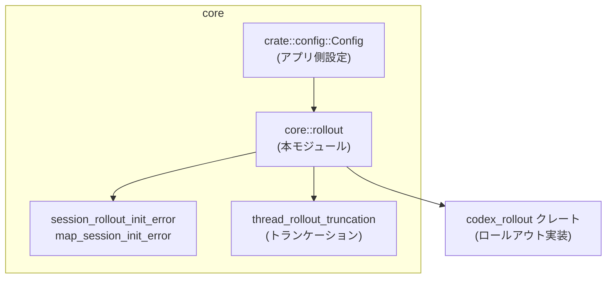
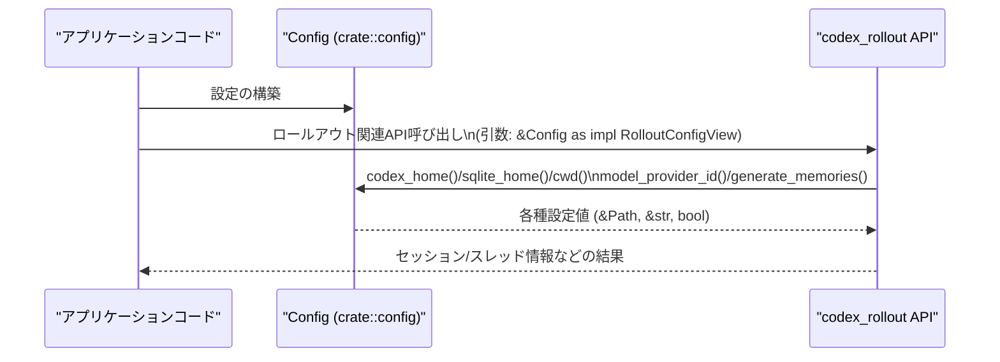

# core/src/rollout.rs

## 0. ざっくり一言

`core/src/rollout.rs` は、アプリケーションの `Config` 構造体を外部クレート `codex_rollout` の設定ビューに接続し、**ロールアウト（セッション・スレッド管理）関連の型・関数をまとめて再エクスポートする薄いラッパーモジュール**です（`core/src/rollout.rs:L1-24, L26-46`）。

---

## 1. このモジュールの役割

### 1.1 概要

- このモジュールは、アプリケーション側の `Config` を `codex_rollout::RolloutConfigView` トレイトとして利用できるようにし（`core/src/rollout.rs:L1, L26-46`）、
- `codex_rollout` クレートが提供するロールアウト関連の型・関数・定数を再エクスポートすることで、**ロールアウト機能への入口**を提供します（`core/src/rollout.rs:L2-24, L48-67`）。
- さらに、エラー変換やスレッドのトランケーション処理など、ロールアウト周辺の内部ユーティリティモジュールを束ねます（`core/src/rollout.rs:L69-72`）。

### 1.2 アーキテクチャ内での位置づけ

このモジュールの依存関係を簡略化して図示します。



- `Config` 型は `crate::config` モジュールで定義され、本モジュールで `use` されています（`core/src/rollout.rs:L1`）。
- `codex_rollout` クレートに対して `RolloutConfigView` を実装することで、`Config` がロールアウト処理に渡せる設定ビューになります（`core/src/rollout.rs:L26-46`）。
- 本モジュールは `codex_rollout` の型・関数を `pub use` / `pub(crate) use` で再エクスポートしています（`core/src/rollout.rs:L2-24, L48-67`）。
- ロールアウト初期化エラー変換 `map_session_init_error` と、スレッドのトランケーション処理は別モジュールにあり、それを本モジュール経由で利用可能にしています（`core/src/rollout.rs:L69-72`）。

### 1.3 設計上のポイント

コードから読み取れる特徴は次の通りです。

- **薄いアダプタ層**  
  - 本モジュール自身のロジックはほぼなく、実装しているのは `RolloutConfigView` の単純なゲッターのみです（`core/src/rollout.rs:L26-45`）。
  - ロールアウトの本体ロジックはすべて `codex_rollout` クレート側にあります（定義はこのチャンクには現れません）。
- **責務の分割**  
  - リスト表示関連を `list` サブモジュール（`core/src/rollout.rs:L48-54`）、
  - メタデータビルドを `metadata` サブモジュール（`core/src/rollout.rs:L56-58`）、
  - 永続化ポリシーを `policy` サブモジュール（`core/src/rollout.rs:L60-62`）、
  - レコーダ本体を `recorder` サブモジュール（`core/src/rollout.rs:L65-67`）、
  - トランケーションを `truncation` サブモジュール（`core/src/rollout.rs:L71-72`）
  に分けて露出しています。
- **エラーハンドリングの方針**  
  - 実際のエラー型変換は `session_rollout_init_error::map_session_init_error` に委譲し、本モジュールからは `pub(crate) use` で公開しています（`core/src/rollout.rs:L69`）。
  - どのようなエラーをどう変換するかは、このチャンクには現れません。
- **安全性・並行性**  
  - `RolloutConfigView` 実装は `&self` を取り、フィールドを参照して返すだけの安全な処理であり、`unsafe` は一切使用されていません（`core/src/rollout.rs:L26-45`）。
  - 並行性に関するプリミティブはこのファイルには現れません。`Config` の `Send`/`Sync` などの特性も、このチャンクからは分かりません。

---

## 2. 主要な機能 / コンポーネント一覧

### 2.1 コンポーネントインベントリー

このモジュールに登場する主なコンポーネントを一覧にします。

| 名称 | 種別 | 定義/再エクスポート元 | 公開範囲 | 役割（コードから分かる範囲） | 根拠 |
|------|------|------------------------|----------|------------------------------|------|
| `Config` | 構造体 | `crate::config` | 外部モジュール | アプリ全体の設定。ロールアウト設定ビューの実体として使われる | `core/src/rollout.rs:L1, L26` |
| `RolloutConfigView` | トレイト | `codex_rollout` | 外部クレート | ロールアウト処理が要求する設定インターフェース | `core/src/rollout.rs:L26` |
| `impl RolloutConfigView for Config` | トレイト実装 | 本ファイル | - | `Config` をロールアウト処理で利用可能にするアダプタ | `core/src/rollout.rs:L26-46` |
| `codex_home` | メソッド | 上記 impl | - | ロールアウト用のホームディレクトリパスを返す | `core/src/rollout.rs:L27-29` |
| `sqlite_home` | メソッド | 上記 impl | - | SQLite 用ディレクトリパスを返す | `core/src/rollout.rs:L31-33` |
| `cwd` | メソッド | 上記 impl | - | カレントディレクトリパスを返す | `core/src/rollout.rs:L35-37` |
| `model_provider_id` | メソッド | 上記 impl | - | モデルプロバイダID文字列を返す | `core/src/rollout.rs:L39-41` |
| `generate_memories` | メソッド | 上記 impl | - | メモリ生成フラグを返す | `core/src/rollout.rs:L43-45` |
| `ARCHIVED_SESSIONS_SUBDIR` | 定数（推定） | `codex_rollout` | `pub use` | アーカイブ済みセッションのサブディレクトリ名を表すと推測される | `core/src/rollout.rs:L2` |
| `SESSIONS_SUBDIR` | 定数（推定） | `codex_rollout` | `pub use` | セッション保存用サブディレクトリ名を表すと推測される | `core/src/rollout.rs:L8` |
| `INTERACTIVE_SESSION_SOURCES` | 定数（推定） | `codex_rollout` | `pub use` | インタラクティブセッションのソース種別を表す配列等と推測される | `core/src/rollout.rs:L5` |
| `Cursor` | 型 | `codex_rollout` | `pub use` | ページングなどに使うカーソル型と推測される | `core/src/rollout.rs:L3` |
| `EventPersistenceMode` | 列挙体（推定） | `codex_rollout` | `pub use` | イベント永続化のモード設定 | `core/src/rollout.rs:L4, L61` |
| `RolloutRecorder` | 構造体（推定） | `codex_rollout` | `pub use` / `pub(crate) use` | ロールアウトイベントの記録器と推測される | `core/src/rollout.rs:L6, L66` |
| `RolloutRecorderParams` | 構造体（推定） | `codex_rollout` | `pub use` | レコーダのパラメータ設定 | `core/src/rollout.rs:L7` |
| `SessionMeta` | 構造体（推定） | `codex_rollout` | `pub use` | セッションのメタ情報 | `core/src/rollout.rs:L9` |
| `ThreadItem` | 構造体（推定） | `codex_rollout` | `pub use` | スレッド一覧の1行分など | `core/src/rollout.rs:L10` |
| `ThreadSortKey` | 列挙体（推定） | `codex_rollout` | `pub use` | スレッドのソートキー種別 | `core/src/rollout.rs:L11, L51` |
| `ThreadsPage` | 構造体（推定） | `codex_rollout` | `pub use` | カーソル付きのスレッドページ結果 | `core/src/rollout.rs:L12` |
| `append_thread_name` | 関数 | `codex_rollout` | `pub use` | スレッド名の付加処理（詳細は不明） | `core/src/rollout.rs:L13` |
| `find_archived_thread_path_by_id_str` | 関数 | `codex_rollout` | `pub use` | アーカイブスレッドのパス探索（詳細は不明） | `core/src/rollout.rs:L14` |
| `find_conversation_path_by_id_str` | 関数 | `codex_rollout` | `pub use` (deprecated) | 旧API。`find_thread_path_by_id_str` の利用が推奨 | `core/src/rollout.rs:L15-16` |
| `find_thread_meta_by_name_str` | 関数 | `codex_rollout` | `pub use` | スレッド名からメタ情報検索（詳細不明） | `core/src/rollout.rs:L17` |
| `find_thread_name_by_id` | 関数 | `codex_rollout` | `pub use` | IDからスレッド名検索（詳細不明） | `core/src/rollout.rs:L18` |
| `find_thread_names_by_ids` | 関数 | `codex_rollout` | `pub use` | 複数IDからスレッド名群検索（詳細不明） | `core/src/rollout.rs:L19` |
| `find_thread_path_by_id_str` | 関数 | `codex_rollout` | `pub use` | ID文字列からスレッドパス検索（詳細不明） | `core/src/rollout.rs:L20` |
| `parse_cursor` | 関数 | `codex_rollout` | `pub use` | カーソル文字列のパース（詳細不明） | `core/src/rollout.rs:L21` |
| `read_head_for_summary` | 関数 | `codex_rollout` | `pub use` | スレッドの先頭部分読み出し（詳細不明） | `core/src/rollout.rs:L22` |
| `read_session_meta_line` | 関数 | `codex_rollout` | `pub use` | セッションメタ行の読み出し（詳細不明） | `core/src/rollout.rs:L23` |
| `rollout_date_parts` | 関数 | `codex_rollout` | `pub use` | 日付要素の抽出（詳細不明） | `core/src/rollout.rs:L24` |
| `list` モジュール | サブモジュール | 本ファイル | `pub(crate)` | スレッド一覧表示関連の API の集約 | `core/src/rollout.rs:L48-54` |
| `metadata` モジュール | サブモジュール | 本ファイル | `pub(crate)` | アイテム配列からメタデータビルダ生成 | `core/src/rollout.rs:L56-58` |
| `policy` モジュール | サブモジュール | 本ファイル | `pub(crate)` | イベント永続化ポリシー | `core/src/rollout.rs:L60-62` |
| `recorder` モジュール | サブモジュール | 本ファイル | `pub(crate)` | `RolloutRecorder` の内部用エイリアス | `core/src/rollout.rs:L65-67` |
| `truncation` モジュール | サブモジュール | 本ファイル | `pub(crate)` | スレッドロールアウトのトランケーションユーティリティを集約 | `core/src/rollout.rs:L71-72` |
| `map_session_init_error` | 関数 | `crate::session_rollout_init_error` | `pub(crate) use` | セッション初期化エラーのマッピング | `core/src/rollout.rs:L69` |

> ※ `codex_rollout` 側の型・関数の詳細なシグネチャや挙動は、このチャンクには定義が現れません。そのため、役割は名前から推測したものであり、正確な仕様は元クレートの定義を確認する必要があります。

### 2.2 主要な機能（箇条書き）

- `Config` を `RolloutConfigView` としてアダプトし、ロールアウト処理用の設定ビューを提供する（`core/src/rollout.rs:L26-46`）。
- セッション・スレッド一覧・ページング等のロールアウト関連 API を、`codex_rollout` から再エクスポートする（`core/src/rollout.rs:L2-24, L48-54`）。
- イベント永続化モードとそのポリシー判断関数を `policy` サブモジュール経由でまとめる（`core/src/rollout.rs:L60-62`）。
- トランケーションや初期化エラー変換等、ロールアウト周辺の内部ユーティリティをひとつのモジュール階層に集約する（`core/src/rollout.rs:L69-72`）。

---

## 3. 公開 API と詳細解説

### 3.1 型一覧（構造体・列挙体など）

本ファイルで直接定義されている新しい構造体・enum はありませんが、次の型をロールアウト関連の主要な型として再エクスポートしています。

| 名前 | 種別 | 役割 / 用途（コードから分かる範囲） | 根拠 |
|------|------|--------------------------------------|------|
| `Cursor` | 型 | ページング等の位置を表す型と推測される | `core/src/rollout.rs:L3` |
| `RolloutRecorder` | 構造体（推定） | ロールアウトイベントの記録を扱う型と推測 | `core/src/rollout.rs:L6, L66` |
| `RolloutRecorderParams` | 構造体（推定） | レコーダ用パラメータ | `core/src/rollout.rs:L7` |
| `SessionMeta` | 構造体（推定） | セッションメタ情報 | `core/src/rollout.rs:L9` |
| `ThreadItem` | 構造体（推定） | スレッド一覧の1項目 | `core/src/rollout.rs:L10` |
| `ThreadSortKey` | 列挙体（推定） | スレッドソートキー | `core/src/rollout.rs:L11, L51` |
| `ThreadsPage` | 構造体（推定） | カーソル付きのスレッドページ | `core/src/rollout.rs:L12` |
| `EventPersistenceMode` | 列挙体（推定） | イベント永続化のモード種別 | `core/src/rollout.rs:L4, L61` |

> これらの型のフィールドやメソッドの詳細は `codex_rollout` クレート内にあり、このチャンクには現れません。

### 3.2 関数・メソッド詳細（`RolloutConfigView` 実装）

ここでは、本ファイルで唯一ロジックを持つ `RolloutConfigView` 実装のメソッドを解説します。

#### `fn codex_home(&self) -> &std::path::Path`

**概要**

- ロールアウト関連のデータを保存する「codex home」ディレクトリを参照で返すゲッターメソッドです（`core/src/rollout.rs:L27-29`）。

**引数**

| 引数名 | 型 | 説明 |
|--------|----|------|
| `self` | `&Config` | 設定オブジェクト。`RolloutConfigView` として利用されます。 |

**戻り値**

- 型: `&std::path::Path`  
- 設定内の `codex_home` フィールドから取得したパスへの参照です（`core/src/rollout.rs:L27-29`）。

**内部処理の流れ**

1. `self.codex_home` フィールドにアクセスする（`core/src/rollout.rs:L28`）。
2. その値に対して `.as_path()` を呼び出し、`&Path` に変換して返します（`core/src/rollout.rs:L28`）。

**Examples（使用例）**

```rust
use codex_rollout::RolloutConfigView;             // トレイトをスコープに入れる
use crate::config::Config;                        // 実際の設定型

fn print_codex_home(config: &Config) {            // Config を参照で受け取る
    let path = config.codex_home();               // RolloutConfigView のメソッドとして呼び出す
    println!("codex home: {}", path.display());   // Path を表示する
}
```

**Errors / Panics**

- このメソッド自体はエラーを返さず、`panic!` も行いません。
- `as_path` は通常 panic を起こさないため、メモリアクセス上の危険はありません。
- ただし、返されたパスが無効（存在しないディレクトリなど）の場合は、そのパスを使う後続の処理で I/O エラーが起きる可能性があります（後続側の責務）。

**Edge cases（エッジケース）**

- 空のパス・相対パスが設定されている場合でも、そのまま `&Path` として返されます。妥当性チェックは行っていません（`core/src/rollout.rs:L27-29`）。

**使用上の注意点**

- 渡す `Config` に正しいディレクトリパスが設定されていることが前提です。
- セキュリティ上、外部入力から直接このパスを構成する場合は、パストラバーサル等の問題がないか事前に検証する必要があります（この検証処理は本ファイルには存在しません）。

---

#### `fn sqlite_home(&self) -> &std::path::Path`

**概要**

- SQLite 関連のデータベースファイルなどを保存するディレクトリパスを返すゲッターです（`core/src/rollout.rs:L31-33`）。

**引数**

| 引数名 | 型 | 説明 |
|--------|----|------|
| `self` | `&Config` | 設定。 |

**戻り値**

- 型: `&std::path::Path`  
- 設定内の `sqlite_home` フィールドに対応するパスです（`core/src/rollout.rs:L31-33`）。

**内部処理**

1. `self.sqlite_home` にアクセス（`core/src/rollout.rs:L32`）。
2. `.as_path()` を呼んで `&Path` を返却。

**Examples**

```rust
use codex_rollout::RolloutConfigView;
use crate::config::Config;

fn init_sqlite(config: &Config) {
    let db_dir = config.sqlite_home();           // SQLite 用ディレクトリ
    // db_dir を使って SQLite 接続を初期化する処理はここに実装される想定
}
```

**Errors / Panics**

- メソッド自体はエラーや panic を出しません。
- 不適切なディレクトリを返した場合の扱いは、SQLite 初期化側の処理に依存します。

**Edge cases**

- ディレクトリが存在しない場合でも、単にパスを返すだけです。

**使用上の注意点**

- 高い権限のディレクトリを指していないか、事前に構成段階で検証することが望ましいです。
- マルチスレッド環境で同じディレクトリに別プロセス/スレッドがアクセスする場合、排他制御はこのレベルでは行われません。

---

#### `fn cwd(&self) -> &std::path::Path`

**概要**

- カレントワーキングディレクトリのパスを返すゲッターです（`core/src/rollout.rs:L35-37`）。

**引数**

| 引数名 | 型 |
|--------|----|
| `self` | `&Config` |

**戻り値**

- 型: `&std::path::Path`  
- `Config` 内の `cwd` フィールドのパス参照（`core/src/rollout.rs:L35-37`）。

**内部処理**

1. `self.cwd` フィールドから `.as_path()` で `&Path` を取得して返却。

**Examples**

```rust
use codex_rollout::RolloutConfigView;
use crate::config::Config;

fn resolve_relative_path(config: &Config, file: &str) {
    let cwd = config.cwd();
    let path = cwd.join(file);       // cwd 基準でファイルパスを組み立てる
    println!("Resolved path: {}", path.display());
}
```

**Errors / Panics**

- 自身はエラーを返さず、 panic もしません。

**Edge cases**

- `cwd` が空パスや存在しないパスでも、そのまま返されます。

**使用上の注意点**

- 実行時に OS のカレントディレクトリと `Config` の `cwd` が異なる可能性があります。どちらを正として扱うかは設計に依存し、本コードからは分かりません。

---

#### `fn model_provider_id(&self) -> &str`

**概要**

- 利用するモデルプロバイダを識別する ID 文字列を返すゲッターです（`core/src/rollout.rs:L39-41`）。

**引数**

| 引数名 | 型 |
|--------|----|
| `self` | `&Config` |

**戻り値**

- 型: `&str`  
- `Config` の `model_provider_id` フィールドの文字列参照（`core/src/rollout.rs:L39-41`）。

**内部処理**

1. `self.model_provider_id.as_str()` を呼び、その参照を返す（`core/src/rollout.rs:L40`）。
   - フィールドは `as_str` を持つ型（例えば `String`）であることがわかりますが、厳密な型はこのチャンクには現れません。

**Examples**

```rust
use codex_rollout::RolloutConfigView;
use crate::config::Config;

fn select_client(config: &Config) {
    let provider = config.model_provider_id();
    println!("Using model provider: {}", provider);
    // provider に応じてクライアントを分岐するなど
}
```

**Errors / Panics**

- エラーや panic は行いません。

**Edge cases**

- 空文字列や未知の ID もそのまま返すため、妥当性チェックは呼び出し側で行う必要があります。

**使用上の注意点**

- セキュリティ上、ユーザー入力がそのまま `model_provider_id` になる場合は、許可された ID のリストに対して検証する必要があります。

---

#### `fn generate_memories(&self) -> bool`

**概要**

- メモリ（会話ログなどを知識化する機能と推測される）を生成するかどうかのフラグを返します（`core/src/rollout.rs:L43-45`）。

**引数**

| 引数名 | 型 |
|--------|----|
| `self` | `&Config` |

**戻り値**

- 型: `bool`  
- `self.memories.generate_memories` フィールドの値（`core/src/rollout.rs:L43-44`）。

**内部処理**

1. `self.memories.generate_memories` をそのまま返す（`core/src/rollout.rs:L43-44`）。
   - `Config` に `memories` サブ構造体があり、その中にブールフラグがあることがわかります。

**Examples**

```rust
use codex_rollout::RolloutConfigView;
use crate::config::Config;

fn maybe_generate_memories(config: &Config) {
    if config.generate_memories() {
        // メモリ生成を有効にした場合の処理
    } else {
        // 無効の場合
    }
}
```

**Errors / Panics**

- エラーや panic はありません。

**Edge cases**

- 特にエッジケースはなく、単純なブール値の返却のみです。

**使用上の注意点**

- プライバシーやデータ保持ポリシーに関わる可能性があるため、このフラグの意味とデフォルト値の決定は重要ですが、そのポリシーは本ファイルからは読み取れません。

---

### 3.3 その他の関数（再エクスポート）

本ファイルは多くの関数を `codex_rollout` から再エクスポートしていますが、定義はこのチャンクには現れません。

| 関数名 | 役割（名前からの推測） | 備考 |
|--------|------------------------|------|
| `append_thread_name` | スレッド名をどこかに付加するヘルパー | `pub use` のみ（`core/src/rollout.rs:L13`） |
| `find_archived_thread_path_by_id_str` | アーカイブ済みスレッドのパスを ID 文字列から検索 | `core/src/rollout.rs:L14` |
| `find_conversation_path_by_id_str` | 旧API。会話パス検索 | `#[deprecated]` 属性付き（`core/src/rollout.rs:L15-16`） |
| `find_thread_meta_by_name_str` | スレッド名からメタを検索 | `core/src/rollout.rs:L17` |
| `find_thread_name_by_id` | ID からスレッド名を取得 | `core/src/rollout.rs:L18` |
| `find_thread_names_by_ids` | 複数IDからまとめて名前取得 | `core/src/rollout.rs:L19` |
| `find_thread_path_by_id_str` | ID 文字列からスレッドパス検索 | `core/src/rollout.rs:L20` |
| `parse_cursor` | カーソル文字列を `Cursor` に変換 | `core/src/rollout.rs:L21` |
| `read_head_for_summary` | スレッドの先頭部分読み出し | `core/src/rollout.rs:L22` |
| `read_session_meta_line` | セッションメタの1行を読む | `core/src/rollout.rs:L23` |
| `rollout_date_parts` | 日付情報の分解 | `core/src/rollout.rs:L24` |
| `get_threads_in_root` | ルートディレクトリ配下のスレッド取得 | `list` モジュール経由（`core/src/rollout.rs:L48, L53`） |
| `builder_from_items` | アイテム配列からメタデータビルダ生成 | `metadata` モジュール経由（`core/src/rollout.rs:L56-57`） |
| `should_persist_response_item_for_memories` | イベントをメモリとして永続化すべきか判定 | `policy` モジュール経由（`core/src/rollout.rs:L60-62`） |
| `map_session_init_error` | セッション初期化エラーを別の型に変換 | `pub(crate) use`（`core/src/rollout.rs:L69`） |

> これらの関数の引数・戻り値・エラー条件などは、このチャンクには定義がなく不明です。

---

## 4. データフロー

ここでは、本モジュールを介した典型的なデータフロー（抽象レベル）を示します。

1. アプリケーションコードが `Config` を構築する（定義は `crate::config` で、本チャンクには現れません）。
2. `Config` は `RolloutConfigView` を実装しているため、`codex_rollout` 側のAPIから `&Config` として利用されます（`core/src/rollout.rs:L26-46`）。
3. `codex_rollout` のロールアウト処理中に、`codex_home` / `sqlite_home` / `cwd` / `model_provider_id` / `generate_memories` メソッドが呼び出され、設定値が参照されます（`core/src/rollout.rs:L27-45`）。
4. スレッド一覧・セッションメタ読み出し・永続化ポリシー判定などのロジックは `codex_rollout` 内部で行われ、必要に応じて本モジュールの再エクスポート関数を経由して利用されます（`core/src/rollout.rs:L2-24, L48-62`）。

これを概念的なシーケンス図で表すと次のようになります。



> 注意: `Rollout` に対してどの具体的な関数が呼ばれるか（例: `RolloutRecorder` のどのメソッドか）は、このチャンクには現れません。そのため、図では抽象的に「codex_rollout API」と記述しています。

---

## 5. 使い方（How to Use）

### 5.1 基本的な使用方法

本モジュールの主な役割は「`Config` を `RolloutConfigView` として扱えるようにすること」と「ロールアウト関連 API を集約すること」です。

#### `Config` を設定ビューとして使う

```rust
use codex_rollout::RolloutConfigView;        // トレイトをインポート
use crate::config::Config;                  // 実際の設定型

fn dump_paths(config: &Config) {
    // RolloutConfigView のメソッドとして呼び出せる
    println!("codex_home = {}", config.codex_home().display());
    println!("sqlite_home = {}", config.sqlite_home().display());
    println!("cwd         = {}", config.cwd().display());
    println!("provider    = {}", config.model_provider_id());
    println!("memories?   = {}", config.generate_memories());
}
```

- 上記のように `RolloutConfigView` をスコープに入れることで、`Config` に対して直接メソッドを呼び出せます（`core/src/rollout.rs:L26-45`）。

#### 再エクスポートされた API のインポート例

本モジュール経由でスレッド一覧関連の型・関数をまとめてインポートできます。

```rust
// モジュールパスは crate 構成に依存しますが、例として:
use crate::rollout::list::{                 // list サブモジュール経由
    ThreadListConfig,
    ThreadListLayout,
    ThreadSortKey,
    get_threads_in_root,
    find_thread_path_by_id_str,
};

// 引数・戻り値の詳細は codex_rollout 側の定義に依存し、
// このチャンクからは分かりません。
```

### 5.2 よくある使用パターン（推測を含まない範囲）

- **設定の単純な公開**  
  - アプリケーションの設定モジュール (`crate::config`) では `Config` を定義し、
  - ロールアウト関連コードからは `RolloutConfigView` を使って必要な設定だけにアクセスする、という分離を実現しています（`core/src/rollout.rs:L26-45`）。

- **内部用 API の整理**  
  - スレッド一覧やポリシーなど、用途ごとにサブモジュールで再エクスポートを分けることで、呼び出し元は必要なカテゴリだけをインポートできます（`core/src/rollout.rs:L48-54, L60-62`）。

### 5.3 よくある間違い（起こりうる点）

本ファイル自体から読み取れる範囲で、起こりそうな誤用例を挙げます。

```rust
// 間違い例: RolloutConfigView を use していないため、メソッド解決に失敗する可能性
use crate::config::Config;

fn bad_usage(config: &Config) {
    // error[E0599]: no method named `codex_home` found for struct `Config`
    // といったコンパイルエラーにつながることがあります。
    // let _ = config.codex_home();
}

// 正しい例: トレイトをスコープに入れてから呼び出す
use codex_rollout::RolloutConfigView;

fn good_usage(config: &Config) {
    let _ = config.codex_home(); // OK
}
```

### 5.4 使用上の注意点（まとめ）

- **設定値の妥当性**  
  - `codex_home` / `sqlite_home` / `cwd` / `model_provider_id` / `generate_memories` は、**検証なしにそのまま返されます**（`core/src/rollout.rs:L27-45`）。  
    → 実際にファイルパスとして使用する・外部サービスに接続する前に、上位レイヤーや設定読み込み時に妥当性チェックを行う必要があります。
- **セキュリティ**  
  - パスやプロバイダIDが外部入力由来の場合、パストラバーサルや不正なID指定につながる可能性があります。このファイルはその防御を行っていません。
- **非推奨 API**  
  - `find_conversation_path_by_id_str` は `#[deprecated]` 属性が付いており、代わりに `find_thread_path_by_id_str` を利用することが推奨されます（`core/src/rollout.rs:L15-16`）。
- **テスト / 観測性**  
  - 本ファイルにはテストコードやログ出力は含まれていません。このため、ロールアウト処理のテスト・ログは `codex_rollout` や呼び出し元のレイヤーで用意する必要があります（本チャンクには現れません）。

---

## 6. 変更の仕方（How to Modify）

### 6.1 新しい設定項目をロールアウト側に渡したい場合

`RolloutConfigView` にメソッドが追加された場合、または新しい設定値をロールアウト側に提供したい場合、本モジュールの変更ポイントは次の通りです。

1. `crate::config::Config` に対応するフィールドを追加する。  
   - 例: `new_option: SomeType` や、サブ構造体の中のフィールドなど。
2. `impl codex_rollout::RolloutConfigView for Config` に新しいメソッドを追加する。  
   - メソッド内では、新しいフィールドから値を返すだけのシンプルな実装にする（`core/src/rollout.rs:L27-45` の既存メソッドと同様のパターン）。
3. `codex_rollout` 側が新メソッドを利用できるように、対応するバージョンを参照する。

> どのようなメソッドを追加すべきかは `RolloutConfigView` トレイトの定義次第ですが、その定義はこのチャンクには現れません。

### 6.2 既存の機能を変更する場合

- **パスフィールドの型変更**  
  - `codex_home` / `sqlite_home` / `cwd` のフィールド型を変える場合、`.as_path()` を呼べる型である必要があります（`core/src/rollout.rs:L27-37`）。
  - 型を変えた結果 `as_path` が利用できなくなるとコンパイルエラーになります。
- **モデルプロバイダIDの保持方法変更**  
  - `model_provider_id` フィールドの型を変える場合、`.as_str()` を呼べることが前提です（`core/src/rollout.rs:L39-41`）。
- **メモリ生成ポリシーの変更**  
  - `generate_memories` が返すフラグの意味を変える場合、`codex_rollout` 側の期待する挙動が変わるため、影響範囲は広くなります。ロールアウト側の実装と整合性を取る必要があります。
- **再エクスポート API の追加・削除**  
  - `codex_rollout` に新しい関数を追加し、それをこのモジュールからも提供したい場合は、`pub use codex_rollout::...;` を追記します（`core/src/rollout.rs:L2-24` と同様）。
  - 逆に廃止したい場合は `pub use` 行を削除し、利用箇所のビルドエラーを手がかりに影響範囲を洗い出します。

---

## 7. 関連ファイル

このモジュールと密接に関係するモジュール・ファイルは次の通りです。

| パス / モジュール | 役割 / 関係 | 根拠 |
|-------------------|------------|------|
| `crate::config`（`Config` 定義） | ロールアウト設定ビューの実体。ここで定義されたフィールドを `RolloutConfigView` が参照する | `core/src/rollout.rs:L1, L26-45` |
| `codex_rollout` クレート | ロールアウトの本体実装。`RolloutConfigView` トレイトや各種型・関数の定義元 | `core/src/rollout.rs:L2-24, L26, L48-67` |
| `crate::session_rollout_init_error` | セッションロールアウト初期化エラーのマッピング関数 `map_session_init_error` の定義元 | `core/src/rollout.rs:L69` |
| `crate::thread_rollout_truncation` | スレッドロールアウトのトランケーション処理を集約したモジュール。`truncation` サブモジュールから `pub(crate) use` される | `core/src/rollout.rs:L71-72` |

> 各モジュールの具体的なファイルパス（例: `core/src/config.rs` など）は、このチャンクには明示されていませんが、モジュールパスから推測されます。正確なパスはプロジェクト全体を参照する必要があります。
