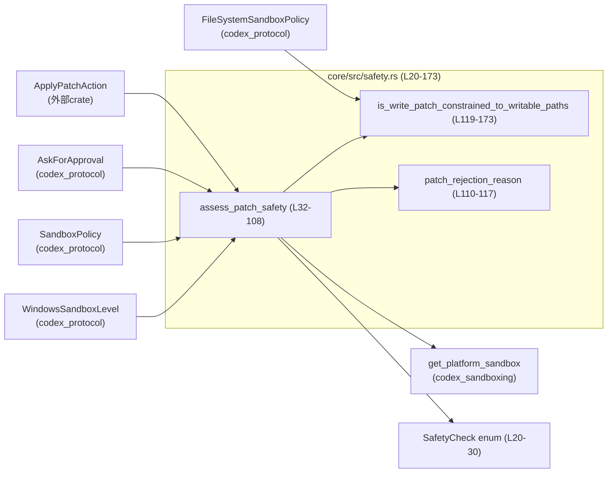
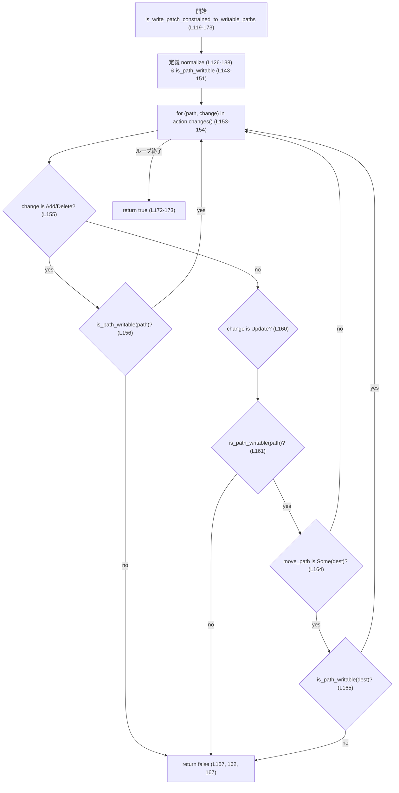
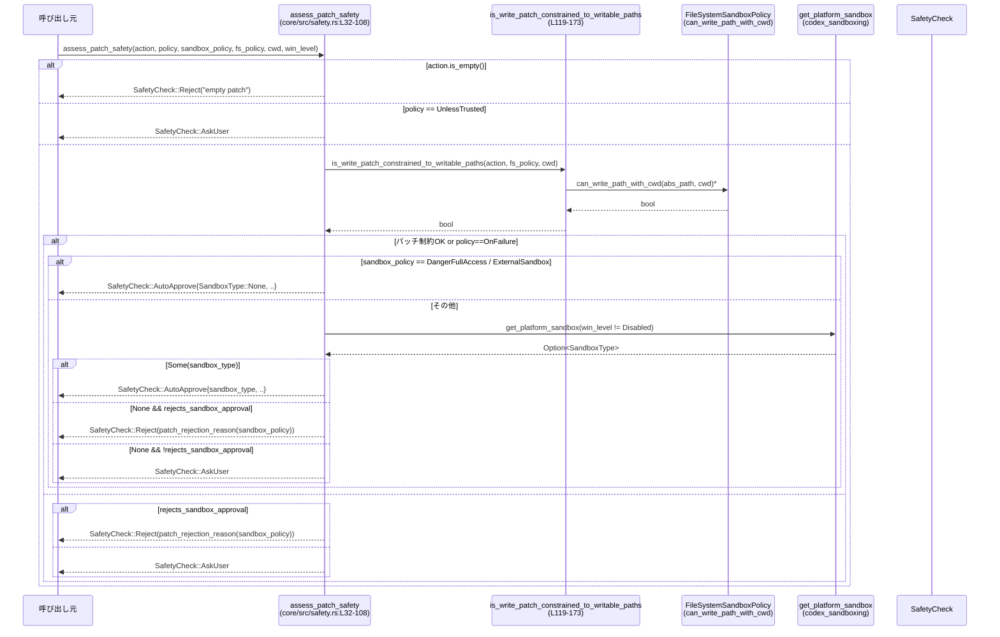

# core/src/safety.rs コード解説

## 0. ざっくり一言

- パッチ適用前に、ユーザー承認ポリシーとファイルシステムサンドボックス設定に基づき、「自動承認」「ユーザーに確認」「拒否」のどれにすべきかを判定するモジュールです（`SafetyCheck` と `assess_patch_safety`）。  
  根拠: `core/src/safety.rs:L20-30`, `L32-108`

---

## 1. このモジュールの役割

### 1.1 概要

- このモジュールは **パッチ適用の安全性評価** を行い、  
  - 自動でパッチを適用してよいか  
  - ユーザーに確認すべきか  
  - そもそも拒否すべきか  
  を `SafetyCheck` で表現します。  
  根拠: `core/src/safety.rs:L20-30`, `L32-108`
- 併せて、パッチがファイルシステムサンドボックスの「書き込み許可パス」に収まっているかを静的にチェックします。  
  根拠: `core/src/safety.rs:L119-173`

### 1.2 アーキテクチャ内での位置づけ

- 入力:
  - パッチ内容 (`ApplyPatchAction`)
  - ユーザーの承認ポリシー (`AskForApproval`)
  - サンドボックス全体の方針 (`SandboxPolicy`)
  - ファイルシステム用の詳細なポリシー (`FileSystemSandboxPolicy`)
  - カレントディレクトリ (`cwd`)
  - Windows 用サンドボックスレベル (`WindowsSandboxLevel`)
- 出力:
  - `SafetyCheck`（自動承認 / 要ユーザー確認 / 拒否）



### 1.3 設計上のポイント

- **ステートレスな判定ロジック**
  - すべての関数は引数だけに依存し、内部状態を持ちません。  
    根拠: モジュール内に `static mut` や `lazy_static!` などの共有状態が存在しない `core/src/safety.rs:L1-178`
- **結果を enum で表現**
  - 安全性判定は `SafetyCheck`（`AutoApprove` / `AskUser` / `Reject`）として返されます。  
    根拠: `core/src/safety.rs:L20-30`
- **ファイルパスの正規化とポリシー照合**
  - `is_write_patch_constrained_to_writable_paths` でパスを正規化し、`FileSystemSandboxPolicy` を使って書き込み可能かを判定します。  
    根拠: `core/src/safety.rs:L119-151`
- **OS サンドボックスとの連携**
  - 必要に応じて `get_platform_sandbox` を呼び、実際に利用する `SandboxType` を決定します。  
    根拠: `core/src/safety.rs:L85-99`
- **Rust 特有の安全性**
  - `unsafe` ブロックは存在せず、標準ライブラリと外部クレートの安全な API のみを使用しています。  
    根拠: `core/src/safety.rs:L1-178` に `unsafe` が出現しない

---

## 2. 主要な機能一覧（コンポーネントインベントリー）

### 2.1 型・関数の一覧

| 名前 | 種別 | 公開 | 役割 / 用途 | 定義位置 |
|------|------|------|-------------|----------|
| `SafetyCheck` | enum | 公開 | パッチ適用の安全性判定結果（自動承認 / 要ユーザー確認 / 拒否）を表現 | `core/src/safety.rs:L20-30` |
| `SafetyCheck::AutoApprove` | enum variant | 公開 | 自動承認と選ばれたサンドボックス種別・ユーザー明示承認有無を保持 | `core/src/safety.rs:L22-25` |
| `SafetyCheck::AskUser` | enum variant | 公開 | ユーザーに確認すべきことを示す | `core/src/safety.rs:L26` |
| `SafetyCheck::Reject` | enum variant | 公開 | 拒否とその理由文字列を保持 | `core/src/safety.rs:L27-29` |
| `assess_patch_safety` | 関数 | 公開 | パッチ内容・承認ポリシー・サンドボックス設定から `SafetyCheck` を決定 | `core/src/safety.rs:L32-108` |
| `patch_rejection_reason` | 関数 | 非公開 | サンドボックス方針に応じた拒否理由メッセージを返す | `core/src/safety.rs:L110-117` |
| `is_write_patch_constrained_to_writable_paths` | 関数 | 非公開 | パッチで触る全パスがファイルシステムサンドボックスの「書き込み許可範囲」に収まっているか判定 | `core/src/safety.rs:L119-173` |
| `normalize` | ローカル関数 | 非公開 | パスから `.` と `..` を解決して正規化（ファイルシステムを触らない） | `core/src/safety.rs:L126-138` |
| `is_path_writable` | ローカルクロージャ | 非公開 | 正規化済み絶対パスが `FileSystemSandboxPolicy` 上で書き込み可能か判定 | `core/src/safety.rs:L143-151` |
| `tests` | モジュール | テスト時のみ | このモジュールに対するテスト（内容はこのチャンクには現れない） | `core/src/safety.rs:L176-178` |

### 2.2 提供する主要機能（要約）

- パッチが空かどうかのチェックと即時拒否
- ユーザーの承認ポリシー (`AskForApproval`) に基づく初期フィルタリング
- パッチが「書き込み許可パス」に限定されているかの判定
- OS サンドボックス利用可否の確認と `SandboxType` の決定
- 上記情報を総合した `SafetyCheck` の決定

---

## 3. 公開 API と詳細解説

### 3.1 型一覧

| 名前 | 種別 | 役割 / 用途 | 主なフィールド |
|------|------|-------------|----------------|
| `SafetyCheck` | enum | パッチ適用前の最終的な安全性判定結果を表現します。 | `AutoApprove { sandbox_type, user_explicitly_approved }`, `AskUser`, `Reject { reason }` |

---

### 3.2 関数詳細

#### `assess_patch_safety(...) -> SafetyCheck`

```rust
pub fn assess_patch_safety(
    action: &ApplyPatchAction,
    policy: AskForApproval,
    sandbox_policy: &SandboxPolicy,
    file_system_sandbox_policy: &FileSystemSandboxPolicy,
    cwd: &Path,
    windows_sandbox_level: WindowsSandboxLevel,
) -> SafetyCheck
```

**概要**

- パッチ内容・承認ポリシー・サンドボックス設定から、パッチを自動適用してよいかどうかを判定する中核関数です。  
  根拠: `core/src/safety.rs:L32-108`

**引数**

| 引数名 | 型 | 説明 | 根拠 |
|--------|----|------|------|
| `action` | `&ApplyPatchAction` | 適用予定のパッチ全体。空パッチかどうかや変更対象のパス一覧を参照します。 | `L32-33`, `L40`, `L69`, `L153` |
| `policy` | `AskForApproval` | ユーザーの承認ポリシー（いつ問い合わせるか、など）。 | `L32-35`, `L46-58`, `L60-64`, `L69-70` |
| `sandbox_policy` | `&SandboxPolicy` | サンドボックスの種類・権限ポリシー。拒否理由の決定にも利用します。 | `L35`, `L72-75`, `L92-94`, `L101-104`, `L110-116` |
| `file_system_sandbox_policy` | `&FileSystemSandboxPolicy` | ファイルシステムの書き込み権限に関する詳細設定。 | `L36`, `L69` |
| `cwd` | `&Path` | カレントディレクトリ。相対パスの解決に使用されます。 | `L37`, `L69` |
| `windows_sandbox_level` | `WindowsSandboxLevel` | Windows 環境でのサンドボックスレベル。OS サンドボックス利用の可否に影響します。 | `L38`, `L85` |

**戻り値**

- `SafetyCheck`  
  - `AutoApprove { .. }`: サンドボックス種別とともに自動承認して良いと判断した場合。  
  - `AskUser`: ユーザーに確認する必要があると判断した場合。  
  - `Reject { reason }`: ポリシー上許可できず、パッチを拒否すべきと判断した場合。  
  根拠: `core/src/safety.rs:L40-43`, `L56-57`, `L77-80`, `L86-89`, `L91-97`, `L101-107`

**内部処理の流れ**

簡略化したフローは次の通りです:

1. **空パッチ拒否**  
   - `action.is_empty()` が `true` の場合、理由 `"empty patch"` で即 `Reject`。  
     根拠: `core/src/safety.rs:L40-43`

2. **承認ポリシーによる初期判定**  
   - `AskForApproval::UnlessTrusted` の場合は、その他のチェックを行わず `AskUser` を返す。  
     （コメントで TODO として挙動への疑問が記載されています）  
     根拠: `core/src/safety.rs:L46-58`

3. **「サンドボックス承認を拒否するポリシーか」の判定**  
   - `AskForApproval::Never` または `AskForApproval::Granular` で `sandbox_approval == false` の場合、`rejects_sandbox_approval = true`。  
     根拠: `core/src/safety.rs:L60-64`

4. **パッチのパス制約と OnFailure ポリシーの処理**  
   - `is_write_patch_constrained_to_writable_paths(...)` が `true`  
     または `policy == AskForApproval::OnFailure` の場合に「自動実行して良い候補」とみなされます。  
     根拠: `core/src/safety.rs:L66-71`

5. **サンドボックスタイプに応じた分岐**  
   - `SandboxPolicy::DangerFullAccess` または `SandboxPolicy::ExternalSandbox` の場合  
     → `SandboxType::None` で `AutoApprove`（OS サンドボックスを使わない）。  
     根拠: `core/src/safety.rs:L72-80`
   - それ以外の場合  
     - `get_platform_sandbox(windows_sandbox_level != Disabled)` を呼び出し、OS サンドボックス可否を判定。  
       根拠: `core/src/safety.rs:L81-89`
       - `Some(sandbox_type)` → その `sandbox_type` で `AutoApprove`。  
       - `None` → サンドボックスを使えない:
         - `rejects_sandbox_approval == true` → `Reject`（`patch_rejection_reason` を使用）  
           根拠: `core/src/safety.rs:L91-94`
         - それ以外 → `AskUser`  
           根拠: `core/src/safety.rs:L95-97`

6. **パッチが書き込み許可パス外に出る場合**  
   - `is_write_patch_constrained_to_writable_paths` が `false` かつ `policy != OnFailure` の場合
     - `rejects_sandbox_approval == true` → `Reject`  
       根拠: `core/src/safety.rs:L101-104`
     - それ以外 → `AskUser`  
       根拠: `core/src/safety.rs:L105-107`

**Mermaid フロー図（ロジック概要, assess_patch_safety (L32-108))**

```mermaid
flowchart TD
    A["開始\nassess_patch_safety (L32-108)"]
    B{"action.is_empty()? (L40)"}
    C["Reject(\"empty patch\") (L41-43)"]
    D{"policy == UnlessTrusted? (L46-56)"}
    E["AskUser (L56-57)"]
    F["計算: rejects_sandbox_approval (L60-64)"]
    G{"パッチ制約OK or policy==OnFailure? (L69-71)"}
    H{"sandbox_policy is DangerFullAccess or ExternalSandbox? (L72-75)"}
    I["AutoApprove(SandboxType::None) (L77-80)"]
    J["get_platform_sandbox(...) (L85)"]
    K{"Some? (L85-89)"}
    L["AutoApprove(platform sandbox) (L86-89)"]
    M{"rejects_sandbox_approval? (L91-94) / (L101-104)"}
    N["Reject(patch_rejection_reason(...)) (L92-94, 101-104)"]
    O["AskUser (L95-97, 105-107)"]

    A --> B
    B -- yes --> C
    B -- no --> D
    D -- yes --> E
    D -- no --> F
    F --> G
    G -- yes --> H
    G -- no --> M
    H -- yes --> I
    H -- no --> J
    J --> K
    K -- yes --> L
    K -- no --> M
    M -- yes --> N
    M -- no --> O
```

**Examples（使用例）**

> 注意: ここでは `ApplyPatchAction` やポリシーインスタンスの生成方法は、他ファイル・他クレートに依存しており、このチャンクには現れないため擬似的に記述します。

```rust
use std::path::Path;
use codex_apply_patch::ApplyPatchAction;
use codex_protocol::protocol::{AskForApproval, SandboxPolicy};
use codex_protocol::permissions::FileSystemSandboxPolicy;
use codex_protocol::config_types::WindowsSandboxLevel;
use crate::safety::{assess_patch_safety, SafetyCheck};

fn decide_patch() {
    // 他の処理から取得されると仮定する
    let action: ApplyPatchAction = obtain_patch_action();          // 実際の取得方法は不明（このチャンクには現れない）
    let sandbox_policy = SandboxPolicy::WorkspaceWrite { /* .. */ }; // 実際のフィールドは不明
    let fs_policy: FileSystemSandboxPolicy = obtain_fs_policy();   // 同上
    let cwd = Path::new("/project");
    let approval_policy = AskForApproval::OnRequest;
    let win_level = WindowsSandboxLevel::Disabled;

    let decision = assess_patch_safety(
        &action,
        approval_policy,
        &sandbox_policy,
        &fs_policy,
        cwd,
        win_level,
    );

    match decision {
        SafetyCheck::AutoApprove { sandbox_type, .. } => {
            // sandbox_type に応じてサンドボックスを立ち上げ、パッチを適用する想定
        }
        SafetyCheck::AskUser => {
            // ユーザーに確認ダイアログを出すなど
        }
        SafetyCheck::Reject { reason } => {
            // パッチを適用せず、理由をユーザーに表示するなど
            eprintln!("Rejected: {reason}");
        }
    }
}

// ダミー関数（実際の実装は別モジュールに存在し、このチャンクには現れません）
fn obtain_patch_action() -> ApplyPatchAction { unimplemented!() }
fn obtain_fs_policy() -> FileSystemSandboxPolicy { unimplemented!() }
```

**Errors / Panics**

- この関数自身は `Result` を返さず、明示的な `panic!` も含みません。  
  根拠: `core/src/safety.rs:L32-108`
- ただし、呼び出している外部関数（`get_platform_sandbox`, `is_write_patch_constrained_to_writable_paths` など）がパニックを起こすかどうかはこのファイルからは分かりません。

**Edge cases（代表的なエッジケース）**

- **空パッチ**: `action.is_empty() == true` の場合は必ず `SafetyCheck::Reject {"empty patch"}` を返します。  
  根拠: `core/src/safety.rs:L40-43`
- **`AskForApproval::UnlessTrusted`**:
  - パッチ内容やパス制約の有無に関係なく即座に `AskUser` を返します。  
    根拠: `core/src/safety.rs:L53-57`
  - コメントで「この挙動が正しいか不明」と記載されており、将来的な変更候補であることが示唆されています。  
    根拠: `core/src/safety.rs:L53-54`
- **サンドボックスが利用できない環境**:
  - `get_platform_sandbox(...)` が `None` を返し、かつ `rejects_sandbox_approval == true` の場合、パッチは自動的に拒否されます。  
    根拠: `core/src/safety.rs:L85-94`
- **`SandboxPolicy::DangerFullAccess` / `ExternalSandbox`**:
  - 条件を満たす場合、`SandboxType::None` で OS サンドボックスを使わずに `AutoApprove` されます。  
    根拠: `core/src/safety.rs:L72-80`

**使用上の注意点**

- `SafetyCheck::Reject` を受け取った場合にパッチを適用してしまうと、モジュールの意図した安全性保証が失われます。呼び出し側でこの契約を守る必要があります（この契約自体はこのファイルから推測されますが、強制はされません）。
- `SandboxPolicy::DangerFullAccess` を指定すると、条件によっては OS サンドボックス無しで自動承認されるため、セキュリティ的に強い権限を意味することが分かります。  
  根拠: `core/src/safety.rs:L72-80`
- 並行性について:
  - 関数自体は引数にのみ依存し、内部で可変な共有状態を持たないため、同じインスタンスを複数スレッドから参照してもロジック上の競合は発生しません。  
    ただし、`ApplyPatchAction` や `FileSystemSandboxPolicy` など引数型のスレッドセーフ性 (`Send`/`Sync`) はこのファイルからは分かりません。

---

#### `is_write_patch_constrained_to_writable_paths(...) -> bool`

```rust
fn is_write_patch_constrained_to_writable_paths(
    action: &ApplyPatchAction,
    file_system_sandbox_policy: &FileSystemSandboxPolicy,
    cwd: &Path,
) -> bool
```

**概要**

- パッチが変更・追加・削除するすべてのパスが、`FileSystemSandboxPolicy` の「書き込み可能」パスに収まっているかを検査します。  
  根拠: `core/src/safety.rs:L119-173`

**引数**

| 引数名 | 型 | 説明 | 根拠 |
|--------|----|------|------|
| `action` | `&ApplyPatchAction` | パッチ内容。`changes()` で変更対象とその種別を列挙します。 | `L119-121`, `L153-170` |
| `file_system_sandbox_policy` | `&FileSystemSandboxPolicy` | パスごとの書き込み可否を判定するためのポリシー。 | `L120-121`, `L150-151` |
| `cwd` | `&Path` | カレントディレクトリ。相対パスを絶対パスに解決する際に使用されます。 | `L122-123`, `L144-145`, `L150-151` |

**戻り値**

- `bool`  
  - `true`: パッチで触るすべてのパスが「書き込み可能」と判断された場合。  
  - `false`: 一つでも書き込み不許可のパスが含まれる場合、あるいはパス正規化に失敗した場合（将来的な拡張に備えた分岐）。  
  根拠: `core/src/safety.rs:L153-171`, `L147-148`, `L172-173`

**内部処理の流れ**

1. **パス正規化ローカル関数 `normalize` の定義**  
   - `.` を取り除き、`..` を親ディレクトリへの遷移として解決します。  
   - ファイルシステムにアクセスせず、`Path::components()` のみで処理します。  
   根拠: `core/src/safety.rs:L124-138`

2. **`is_path_writable` クロージャの定義**  
   - 入力 `p: &PathBuf` を `resolve_path(cwd, p)` で絶対パス化。  
     根拠: `core/src/safety.rs:L143-145`
   - `normalize(&abs)` で正規化し、失敗時は `false` を返す（現状の実装では `Some` しか返さないため、この分岐は到達しません）。  
     根拠: `core/src/safety.rs:L145-148`, `L126-138`
   - `file_system_sandbox_policy.can_write_path_with_cwd(&abs, cwd)` の結果をそのまま返します。  
     根拠: `core/src/safety.rs:L150-151`

3. **パッチ内のすべての変更を走査**  
   - `for (path, change) in action.changes()` で各ファイル変更を列挙。  
     根拠: `core/src/safety.rs:L153-154`
   - 変更種別ごとの処理:
     - `Add` / `Delete`: `path` が書き込み可能でなければ `false` を返して終了。  
       根拠: `core/src/safety.rs:L155-158`
     - `Update { move_path, .. }`:
       - 元の `path` が書き込み可能でなければ `false`。  
         根拠: `core/src/safety.rs:L160-163`
       - `move_path` が `Some(dest)` で、`dest` が書き込み不可能な場合も `false`。  
         根拠: `core/src/safety.rs:L164-167`

4. **すべて問題なければ `true`**  
   - ループを抜けたら `true` を返します。  
     根拠: `core/src/safety.rs:L172-173`

**Mermaid フロー図（is_write_patch_constrained_to_writable_paths (L119-173))**



**Examples（使用例）**

> 実際の `ApplyPatchAction` の構築方法はこのチャンクには現れないため、イメージのみを示します。

```rust
use std::path::Path;
use codex_apply_patch::ApplyPatchAction;
use codex_protocol::permissions::FileSystemSandboxPolicy;
use crate::safety::is_write_patch_constrained_to_writable_paths;

fn check_paths_only() {
    let action: ApplyPatchAction = obtain_patch_action();        // 実装不明
    let fs_policy: FileSystemSandboxPolicy = obtain_fs_policy(); // 実装不明
    let cwd = Path::new("/project");

    let all_writable =
        is_write_patch_constrained_to_writable_paths(&action, &fs_policy, cwd);

    if all_writable {
        // すべての変更が書き込み許可パス内にある
    } else {
        // 書き込み不許可パスを含んでいる
    }
}
```

**Errors / Panics**

- 関数内に `panic!` や `unwrap` は存在しません。  
  根拠: `core/src/safety.rs:L119-173`
- `resolve_path` や `can_write_path_with_cwd` の例外的挙動はこのファイルからは分かりません。

**Edge cases**

- 異常なパス（`..` を多用したパスなど）:
  - `normalize` により `..` は親ディレクトリとして解決されます。ルートより上に出るようなパスも、`PathBuf::pop()` の挙動に依存して最終的に正規化されます。  
    根拠: `core/src/safety.rs:L126-137`
- `normalize` が `None` を返すケース:
  - 現状の実装では常に `Some(out)` を返しており、`None` 分岐は到達しません。将来 `normalize` が失敗ケースを返す拡張に備えた形と考えられます。  
    根拠: `core/src/safety.rs:L126-138`, `L145-148`
- 変更なしのパッチ:
  - `action.changes()` が空であればループを一度も回らず、`true` を返します。つまり「変更対象が無ければ書き込み制約を満たす」とみなされます。  
    根拠: `core/src/safety.rs:L153-173`

**使用上の注意点**

- この関数は「パッチが書き込みポリシーに収まっているか」を判定するだけであり、ハードリンクなどファイルシステム固有の仕掛けまでは検出しません。そのため、実際には `assess_patch_safety` 側で OS サンドボックスを併用する方針がコメントで明示されています。  
  根拠: `core/src/safety.rs:L66-68`
- 大きなパッチ（多くのファイル変更）ではすべてのパスに対して正規化とポリシー判定を行うため、コストがかかります。とはいえ処理は線形（変更数に比例）です。

---

#### `patch_rejection_reason(sandbox_policy: &SandboxPolicy) -> &'static str`

**概要**

- サンドボックスポリシーに応じて、拒否理由メッセージのテンプレート文字列を返します。  
  根拠: `core/src/safety.rs:L110-117`

**引数**

| 引数名 | 型 | 説明 | 根拠 |
|--------|----|------|------|
| `sandbox_policy` | `&SandboxPolicy` | 現在のサンドボックス方針。これに応じて定数文字列を選択します。 | `L110-115` |

**戻り値**

- `&'static str`  
  - 読み取り専用サンドボックスの場合: `"writing is blocked by read-only sandbox; rejected by user approval settings"`  
  - それ以外（WorkspaceWrite / DangerFullAccess / ExternalSandbox）の場合: `"writing outside of the project; rejected by user approval settings"`  
  根拠: `core/src/safety.rs:L15-18`, `L111-115`

**内部処理**

- `match sandbox_policy` による単純な分岐のみです。  
  根拠: `core/src/safety.rs:L110-116`

**使用上の注意点**

- ここで返すメッセージは英語固定の定数文字列であり、ローカライズは行っていません。  
  根拠: `core/src/safety.rs:L15-18`

---

### 3.3 その他の関数

上で詳細説明した以外に、モジュール内で使用される補助的なローカル関数があります。

| 関数名 | 役割（1 行） | 定義位置 |
|--------|--------------|----------|
| `normalize` | `Path` から `.` と `..` を解決して正規化するローカル関数 | `core/src/safety.rs:L126-138` |

---

## 4. データフロー

ここでは、典型的な「パッチ適用前の安全性判定」のデータフローを示します。

- 入力: 呼び出し元が構築した `ApplyPatchAction` と各種ポリシー
- 中間: `is_write_patch_constrained_to_writable_paths` によるパス制約チェック、`get_platform_sandbox` による OS サンドボックス種別決定
- 出力: `SafetyCheck`（AutoApprove / AskUser / Reject）

### 4.1 シーケンス図（assess_patch_safety (L32-108) の呼び出しフロー）



※ `FS.can_write_path_with_cwd` や `get_platform_sandbox` の内部挙動はこのチャンクには現れません。

---

## 5. 使い方（How to Use）

### 5.1 基本的な使用方法

もっとも典型的な使い方は、パッチ適用前に一度 `assess_patch_safety` を呼び出し、その結果に応じて処理を分岐させる形です。

```rust
use std::path::Path;
use codex_apply_patch::ApplyPatchAction;
use codex_protocol::protocol::{AskForApproval, SandboxPolicy};
use codex_protocol::permissions::FileSystemSandboxPolicy;
use codex_protocol::config_types::WindowsSandboxLevel;
use crate::safety::{assess_patch_safety, SafetyCheck};

fn apply_patch_with_safety() {
    // 前段の処理で取得済みとする（実装はこのチャンクには現れません）
    let patch: ApplyPatchAction = obtain_patch_action();
    let sandbox_policy: SandboxPolicy = obtain_sandbox_policy();
    let fs_policy: FileSystemSandboxPolicy = obtain_fs_policy();
    let cwd = Path::new("/project");
    let approval = AskForApproval::OnRequest;
    let win_level = WindowsSandboxLevel::Disabled;

    let check = assess_patch_safety(&patch, approval, &sandbox_policy, &fs_policy, cwd, win_level);

    match check {
        SafetyCheck::AutoApprove { sandbox_type, .. } => {
            // sandbox_type に応じた環境で apply_patch を実行する想定
        }
        SafetyCheck::AskUser => {
            // ユーザーに確認ダイアログを表示し、Yes の場合のみパッチを適用する想定
        }
        SafetyCheck::Reject { reason } => {
            // パッチ適用を行わず、reason をログや UI に表示する
            eprintln!("Patch rejected: {reason}");
        }
    }
}

// ここもダミー。実際の実装は別ファイルに存在し、このチャンクには現れません。
fn obtain_patch_action() -> ApplyPatchAction { unimplemented!() }
fn obtain_sandbox_policy() -> SandboxPolicy { unimplemented!() }
fn obtain_fs_policy() -> FileSystemSandboxPolicy { unimplemented!() }
```

### 5.2 よくある使用パターン

1. **「安全な書き込みパスのみ」の場合は自動承認したい**

   - `AskForApproval::OnFailure` または `Granular` 設定を用いれば、  
     「書き込み許可パスに収まっている」「かつサンドボックスを利用できる」ケースで `AutoApprove` になりやすくなります。  
     根拠: `core/src/safety.rs:L46-50`, `L60-64`, `L66-71`, `L85-89`

2. **サンドボックス利用が必須な環境**

   - `AskForApproval::Never` かつ `SandboxPolicy::ReadOnly` 等の設定で、サンドボックスが利用できない環境 (`get_platform_sandbox` が `None`) では `Reject` になる挙動を組み合わせることができます。  
     根拠: `core/src/safety.rs:L60-64`, `L91-94`

### 5.3 よくある間違い

```rust
// 誤り例: SafetyCheck を無視して常にパッチを適用してしまう
let decision = assess_patch_safety(...);
// decision が Reject や AskUser でも apply_patch を実行してしまう
apply_patch_unconditionally(patch); // 安全性の意図を無視した呼び出し

// 正しい例: SafetyCheck のバリアを尊重する
let decision = assess_patch_safety(...);
match decision {
    SafetyCheck::AutoApprove { .. } => apply_patch_in_sandbox(patch),
    SafetyCheck::AskUser => {
        if user_confirms() {
            apply_patch_in_sandbox(patch);
        }
    }
    SafetyCheck::Reject { reason } => {
        log_rejection(reason);
        // パッチは適用しない
    }
}
```

### 5.4 使用上の注意点（まとめ）

- `SafetyCheck::Reject` を無視しないことが、このモジュールを利用する上での前提条件です。
- `SandboxPolicy::DangerFullAccess` や `ExternalSandbox` を使う場合、特定の条件では OS サンドボックス無し (`SandboxType::None`) で自動承認される挙動になります。権限レベルに注意が必要です。  
  根拠: `core/src/safety.rs:L72-80`
- 並列実行について:
  - このモジュールの関数は副作用を持たないため、同一プロセス内から並行に呼び出してもロジック上の干渉はありませんが、引数として渡す型のスレッドセーフ性は別途確認が必要です。

---

## 6. 変更の仕方（How to Modify）

### 6.1 新しい機能を追加する場合

例: 新しい `AskForApproval` バリアントを追加したい場合

1. **ポリシー enum 側の追加**  
   - `AskForApproval` はこのファイル外の定義なので、そちらに新バリアントを追加します（このチャンクには定義が現れません）。

2. **`assess_patch_safety` のポリシー分岐に反映**  
   - `match policy`（`core/src/safety.rs:L46-58`）に新バリアントの扱いを追加します。
   - `rejects_sandbox_approval` の定義（`L60-64`）にも必要に応じて条件を追加します。

3. **サンドボックス方針に紐づける場合**  
   - 新しい `SandboxPolicy` バリアントを追加する場合は、`patch_rejection_reason` の `match` にもケースを追加します。  
     根拠: `core/src/safety.rs:L110-116`

4. **テストの追加**  
   - `#[path = "safety_tests.rs"]` のテストモジュールで、新しいケースに対応したテストを追加するのが自然と思われますが、テスト内容はこのチャンクには現れません。

### 6.2 既存の機能を変更する場合

- **パッチ制約判定を変えたい場合**
  - `is_write_patch_constrained_to_writable_paths`（`L119-173`）内のロジックを確認し、  
    - どの変更種別（Add / Delete / Update）に対してどのパスをチェックしているか  
    - `normalize` の仕様（`L126-138`）  
    を理解した上で変更する必要があります。
- **拒否理由メッセージを変更・ローカライズしたい場合**
  - メッセージ定数 `PATCH_REJECTED_OUTSIDE_PROJECT_REASON` / `PATCH_REJECTED_READ_ONLY_REASON` を変更し  
    - `patch_rejection_reason` 経由で利用される箇所（`L110-116`）への影響を確認します。  
- **契約に関する注意**
  - `assess_patch_safety` の呼び出し側は `SafetyCheck` の意味に依存しているため、  
    - 例えば「どの条件で AutoApprove を返すか」を変える場合は、呼び出し側コードおよびテストを合わせて確認する必要があります。

---

## 7. 関連ファイル

| パス / モジュール | 役割 / 関係 |
|------------------|------------|
| `codex_apply_patch::ApplyPatchAction` | 適用するパッチ内容を表す型。本モジュールは `is_empty` と `changes` 経由で利用します。`core/src/safety.rs:L40`, `L153` |
| `codex_apply_patch::ApplyPatchFileChange` | パッチ内の各ファイル変更（Add / Delete / Update）を表す型。`is_write_patch_constrained_to_writable_paths` で使用されます。`core/src/safety.rs:L7`, `L155-170` |
| `codex_protocol::protocol::AskForApproval` | ユーザーへの承認確認ポリシー。`assess_patch_safety` の主要な分岐条件の一つです。`core/src/safety.rs:L10`, `L46-58` |
| `codex_protocol::protocol::SandboxPolicy` | サンドボックスの種類と権限レベルを表すポリシー。拒否理由や `DangerFullAccess` 判定などに使用されます。`core/src/safety.rs:L11`, `L72-75`, `L110-116` |
| `codex_protocol::permissions::FileSystemSandboxPolicy` | ファイルシステムの書き込み許可を判定するポリシー。パス制約チェックの中心です。`core/src/safety.rs:L9`, `L119-151` |
| `codex_protocol::config_types::WindowsSandboxLevel` | Windows 向けサンドボックスレベル設定。`get_platform_sandbox` の呼び出し条件に使用されます。`core/src/safety.rs:L8`, `L85` |
| `codex_sandboxing::get_platform_sandbox` | OS のサンドボックス実装を取得する関数。`assess_patch_safety` で自動承認時の `SandboxType` を決定します。`core/src/safety.rs:L13`, `L85-89` |
| `codex_sandboxing::SandboxType` | 実際に利用するサンドボックスの種類（None など）。`SafetyCheck::AutoApprove` に格納されます。`core/src/safety.rs:L12`, `L22-24`, `L77-79` |
| `crate::util::resolve_path` | `cwd` と相対パスを元にパスを解決するユーティリティ。本モジュールではパス正規化前の絶対化に利用されます。`core/src/safety.rs:L5`, `L144` |
| `core/src/safety_tests.rs` | `#[path = "safety_tests.rs"]` で指定されているテストコード。内容はこのチャンクには現れません。`core/src/safety.rs:L176-178` |

以上が `core/src/safety.rs` の構造と振る舞いの整理です。
