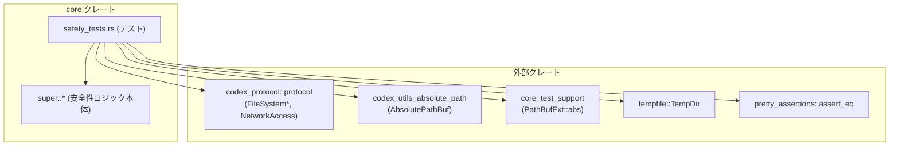
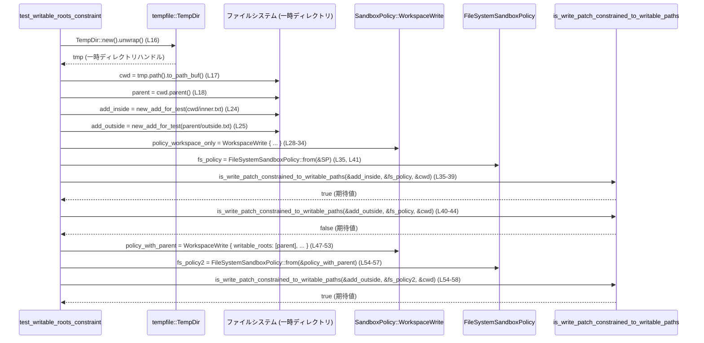

# core/src/safety_tests.rs コード解説

## 0. ざっくり一言

- パッチ適用の安全性判定ロジック（サンドボックス／ワークスペースポリシー）の**振る舞いをテストする統合テスト群**です。  
- 特に「どのパスへの書き込みが自動承認されるか／ユーザー確認になるか／即時拒否されるか」の挙動を検証しています（`core/src/safety_tests.rs:L12-308`）。

---

## 1. このモジュールの役割

### 1.1 概要

- このモジュールは、`assess_patch_safety` および `is_write_patch_constrained_to_writable_paths` といった安全性判定 API をテストします（`core/src/safety_tests.rs:L35-38, L70-83, L100-127`）。
- ワークスペース書き込みポリシー、外部サンドボックスポリシー、読み取り専用ポリシーなど、**複数のサンドボックス構成**に対する挙動をカバーしています（`L28-34, L67-68, L171, L284-290`）。
- 一時ディレクトリ `TempDir` を使うことで、テストが実ファイルシステムに影響を与えないようにしています（`L16-18, L63-65, L88-92`）。

### 1.2 アーキテクチャ内での位置づけ

このモジュールは「コア安全性ロジック（super モジュール）」と「プロトコル定義」「テスト支援ユーティリティ」の**利用側**です。自身はロジックを持たず、動作を検証する役割のみを担います。



- `use super::*;` により、安全性判定 API (`assess_patch_safety`, `is_write_patch_constrained_to_writable_paths` など) をインポートしています（`L1`）。
- `codex_protocol::protocol::*` 系の型は、ファイルシステムサンドボックスのパス指定やアクセスモード指定に使われています（`L2-6, L203-216, L246-259`）。
- `core_test_support::PathBufExt` の `abs()` 拡張メソッドで、テスト対象パスを絶対パスに変換しています（`L20-22, L65, L91-92, L169-170`）。

### 1.3 設計上のポイント

- **テストはすべて一時ディレクトリ上で実行**  
  - `TempDir::new().unwrap()` で一時ディレクトリを作成し（`L16, L63, L88, L132, L167, L195, L237, L280`）、`cwd` として扱っています（`L17-18, L64-65, L89-92`）。
  - これにより、テストは実際のカレントディレクトリやユーザー環境を汚さない構造になっています。

- **絶対パスに統一して判定**  
  - `PathBufExt::abs()` や `AbsolutePathBuf::resolve_path_against_base` により、パスは絶対パスに解決されています（`L20-22, L65, L91-92, L169-170, L198-199, L239-242`）。
  - これは、ポリシー評価が相対パスに依存しないことをテストする意図と解釈できます。

- **ポリシー + 実ファイルシステムポリシーという二層構造**  
  - 高レベルの `SandboxPolicy` と、具体的なパス許可を表す `FileSystemSandboxPolicy` を**常にペアで**使用しています（`L28-38, L70-76, L93-106, L171-173, L200-216, L243-259, L284-292`）。
  - テストでは、両者が一貫しているケースのみが扱われています。

- **エラー処理／安全性（Rust 言語仕様の観点）**  
  - 一時ディレクトリ生成や親ディレクトリ取得では `unwrap()` を使用し、失敗時にはテストが panic して即座に失敗します（`L16, L18, L63, L90, L132, L167, L195, L237, L280`）。
  - 並行処理・`unsafe` ブロックは使用されておらず、このファイル単体では**スレッド安全性やメモリ安全性に関する特別な配慮は不要**な構造です。

---

## 2. 主要な機能一覧

このテストモジュールが検証している主な振る舞いは次のとおりです。

- **ワークスペース書き込みルートの制約**:  
  `SandboxPolicy::WorkspaceWrite` で、明示的に指定された書き込みルート内の変更のみを許可する挙動を検証します（`test_writable_roots_constraint`, `L12-59`）。

- **外部サンドボックス + OnRequest での自動承認**:  
  外部サンドボックス (`SandboxPolicy::ExternalSandbox`) 利用時に、ワークスペース内への書き込みが `AskForApproval::OnRequest` で自動承認されることを検証します（`external_sandbox_auto_approves_in_on_request`, `L61-84`）。

- **Granular 承認設定と OnRequest の整合性**:  
  Granular な承認設定（`GranularApprovalConfig`）の全フラグが true の場合、ワークスペース外書き込みは `AskForApproval::OnRequest` と同様に `SafetyCheck::AskUser` になることを検証します（`L86-128`）。

- **Granular で sandbox_approval=false の場合の即時拒否**:  
  `sandbox_approval=false` の Granular 設定では、ワークスペース外へのパッチが `SafetyCheck::Reject` になることを検証します（`L130-163`）。

- **読み取り専用ポリシーによる拒否**:  
  `SandboxPolicy::new_read_only_policy()` の下では、書き込みパッチが `PATCH_REJECTED_READ_ONLY_REASON` 付きで拒否されることを検証します（`L165-192`）。

- **ExternalSandbox でも明示的な unreadable/read-only パスは自動承認されない**:  
  `FileSystemSandboxPolicy::restricted` による明示的な `None`/`Read` アクセス指定パスへの書き込みが、`AskForApproval::OnRequest` でも自動承認されず `SafetyCheck::AskUser` になることを検証します（`L193-233, L235-276`）。

- **`.codex/config.toml` の作成には承認が必要**:  
  プロジェクト設定ファイルと思われる `.codex/config.toml` への書き込みが、OnRequest モードでも `AskUser` になることを検証します（`L278-308`）。

### 関数インベントリ（このチャンクに現れる関数）

| 名前 | 種別 | 概要 | 参照箇所 |
|------|------|------|----------|
| `test_writable_roots_constraint` | テスト関数 | ワークスペース内外のパスに対する書き込み制約と `writable_roots` の挙動を検証 | `core/src/safety_tests.rs:L12-59` |
| `external_sandbox_auto_approves_in_on_request` | テスト関数 | ExternalSandbox + OnRequest でワークスペース内パッチが自動承認されることを検証 | `L61-84` |
| `granular_with_all_flags_true_matches_on_request_for_out_of_root_patch` | テスト関数 | Granular 全フラグ true が OnRequest と同じ挙動になることを検証 | `L86-128` |
| `granular_sandbox_approval_false_rejects_out_of_root_patch` | テスト関数 | Granular で `sandbox_approval=false` のときワークスペース外パッチが拒否されることを検証 | `L130-163` |
| `read_only_policy_rejects_patch_with_read_only_reason` | テスト関数 | 読み取り専用ポリシー下でのパッチ拒否と理由文字列を検証 | `L165-192` |
| `explicit_unreadable_paths_prevent_auto_approval_for_external_sandbox` | テスト関数 | ExternalSandbox でも明示的に `None` 指定されたパスは自動承認されないことを検証 | `L193-233` |
| `explicit_read_only_subpaths_prevent_auto_approval_for_external_sandbox` | テスト関数 | ExternalSandbox でも特定サブパスが read-only なら書き込みが自動承認されないことを検証 | `L235-276` |
| `missing_project_dot_codex_config_requires_approval` | テスト関数 | `.codex/config.toml` 作成が OnRequest でも承認必須になることを検証 | `L278-308` |

このほか、`assess_patch_safety` / `is_write_patch_constrained_to_writable_paths` / `FileSystemSandboxPolicy::from(_)/restricted` などの**実装はこのチャンクには現れません**が、テストから公開 API として利用されています。

---

## 3. 公開 API と詳細解説

このファイル自身は新しい型や公開関数を定義していませんが、**安全性ロジックの主要 API を利用するテスト**であるため、ここでは「テストから見えるインターフェース」として整理します。

### 3.1 型一覧（本テストで扱う主要な型）

| 名前 | 種別（このファイルから分かる範囲） | 役割 / 用途 | 参照箇所 |
|------|----------------------------------|-------------|----------|
| `SandboxPolicy` | 外部定義型 | パッチ適用時の高レベルなサンドボックス方針。`WorkspaceWrite` / `ExternalSandbox` / `new_read_only_policy` / `WorkspaceWrite` 構成などが使われる。 | `L28-33, L67-68, L137-142, L171, L200-202, L243-245, L284-290` |
| `FileSystemSandboxPolicy` | 外部定義型 | 実際のファイルシステム上のパスごとのアクセス権限を表すポリシー。`from`, `from_legacy_sandbox_policy`, `restricted` などのコンストラクタが使われる。 | `L35-38, L41-43, L70-76, L93-106, L155-156, L172-173, L200-216, L246-259, L291-292` |
| `AskForApproval` | 外部定義型 | パッチ適用前にユーザー承認をどう扱うかを指定する設定。`OnRequest`, `Granular(..)`, `Never` が使用される。 | `L73, L103, L113-120, L147-153, L182, L225, L268, L301-302` |
| `GranularApprovalConfig` | 構造体（フィールド初期化式から） | Granular 承認モード時の個別フラグ設定。`sandbox_approval`, `rules`, `skill_approval`, `request_permissions`, `mcp_elicitations` など。 | `L114-120, L147-153` |
| `SafetyCheck` | 外部定義型 | `assess_patch_safety` の結果を表す判定。`AutoApprove { .. }`, `AskUser`, `Reject { reason }` が確認できる。 | `L79-82, L109, L126, L159-161, L188-190, L231, L274, L307` |
| `SandboxType` | 外部定義型 | 自動承認時のサンドボックス種別。テストでは `SandboxType::None` が使用される。 | `L80` |
| `WindowsSandboxLevel` | 外部定義型 | Windows 環境でのサンドボックスレベル。テストでは `WindowsSandboxLevel::Disabled` のみが使用される。 | 各 `assess_patch_safety` 呼び出しの最終引数（`L77, L107, L157, L186, L229, L272, L305`） |
| `ApplyPatchAction` | 外部定義型 | 適用対象の「パッチ」（ファイル追加など）を表す型と推測される。テストでは `new_add_for_test` で生成される。 | `L22, L66, L92, L136, L170, L199, L242, L283` |
| `FileSystemSandboxEntry` | 構造体（リテラルから） | `FileSystemSandboxPolicy::restricted` に渡すエントリ。特定パスに対するアクセスモードを指定する。 | `L204-216, L247-259` |
| `FileSystemPath` | 列挙体（`Special` / `Path` バリアントから） | `FileSystemSandboxEntry` 内で、ルートやカレントディレクトリ等の特別なパス、任意のパスを表現する。 | `L205, L211, L248, L254` |
| `FileSystemSpecialPath` | 列挙体 | `Root`, `CurrentWorkingDirectory` など特殊パスの種類を表す。 | `L206-207, L249-250` |
| `FileSystemAccessMode` | 列挙体 | パスに対するアクセス権限。`Write`, `Read`, `None` が使われている。 | `L208-209, L214-215, L251-252, L257-258` |
| `AbsolutePathBuf` | 外部定義型 | 絶対パスを表すバッファ。`try_from` や `resolve_path_against_base` により生成される。 | `L47-48, L241-242` |
| `PathBufExt` | トレイト（拡張メソッド） | `PathBuf` に対する拡張で、`abs()` メソッドを提供する。 | `L20-22, L65, L91-92, L169-170, L198-199, L239-240, L282-283` |
| `TempDir` | 構造体 | テストで使う一時ディレクトリのライフサイクル管理用。 | `L16, L63, L88, L132, L167, L195, L237, L280` |

> 種別が「外部定義型」のものは、このファイル内に定義がなく、`use` でインポートされている型です。

### 3.2 主要関数の詳細（テストから見えるインターフェース）

ここでは、本ファイルから利用されている公開 API を**テストから観測できる範囲**で説明します。実装（アルゴリズム）はこのチャンクには現れません。

#### `is_write_patch_constrained_to_writable_paths(action, fs_policy, cwd) -> bool`

**概要**

- 与えられたパッチ `action` が、`FileSystemSandboxPolicy` で許可されている「書き込み可能パス」のみに限定されているかどうかを判定する関数として利用されています（`L35-44, L54-58, L174-178, L217-221, L260-263, L293-297`）。

**引数（テストから分かる範囲）**

| 引数名 | 説明 | 根拠 |
|--------|------|------|
| `action` | 適用しようとしているパッチ（主にファイル追加）。`ApplyPatchAction::new_add_for_test` で生成された値への参照が渡されている。 | `L22, L35-37, L40-42, L54-56, L174-176, L217-219, L260-262, L293-295` |
| `fs_policy` | ファイルシステムレベルのサンドボックスポリシー。`FileSystemSandboxPolicy::from` / `from_legacy_sandbox_policy` / `restricted` などで構築される。 | `L35-38, L41-43, L172-173, L200-216, L246-259, L291-292` |
| `cwd` | ワークスペースのベースディレクトリ（カレントディレクトリ）。`TempDir` から得られたパス。 | `L17-18, L35-39, L41-44, L54-58, L174-178, L217-221, L260-263, L293-297` |

**戻り値**

- `bool`  
  - `true`: パッチ内の書き込みが、すべて書き込み許可されたパスに限定されていると判定されたケース（例: `add_inside` に対して `true` を期待するアサーション、`L35-39`）。  
  - `false`: パッチが書き込み禁止パス（ワークスペース外、read-only、明示的に拒否されたパスなど）を含むと判定されたケース（`L40-44, L174-178, L217-221, L260-263, L293-297`）。

**内部処理の流れ（アルゴリズム）**

- 実装コードはこのファイルには含まれないため、アルゴリズムの詳細は不明です。  
- テストから観測できる振る舞いとして、以下が確認できます：

  - `SandboxPolicy::WorkspaceWrite` + `writable_roots: []` のとき、ワークスペース内ファイルへの追加は `true`、親ディレクトリ上のファイル追加は `false` になります（`L24-25, L28-34, L35-44`）。
  - `SandboxPolicy::WorkspaceWrite` に `parent` を `writable_roots` として追加すると、親ディレクトリへの書き込みも `true` になります（`L45-53, L54-58`）。
  - 読み取り専用ポリシーや、明示的に `None` / `Read` に指定されたパスへの書き込みは `false` になります（`L171-178, L200-216, L246-259, L293-297`）。

**Errors / Panics**

- この関数の内部で `Result` を返したり panic するかどうかは、このファイルには現れません。  
- テスト側では、返り値を `assert!` / `assert!(!...)` で評価しているのみで、エラー処理は行っていません（`L35-44, L54-58, L174-178, L217-221, L260-263, L293-297`）。

**Edge cases（エッジケース）**

- **ワークスペース外の絶対パス**:  
  - `cwd.parent()` で親ディレクトリを取得し（`L18, L90, L134`）、その配下のファイルへの追加パッチは、`writable_roots` に追加されていない限り `false` となっています（`L24-25, L40-44`）。
- **明示的にアクセス禁止 (`None`) のパス**:  
  - `FileSystemAccessMode::None` が指定されたパスへの書き込みは `false` になります（`L211-215, L217-221`）。
- **read-only サブパス**:  
  - 親ディレクトリには `Write` 権限があっても、そのサブパスに `Read` 権限しかない場合、サブパスへの書き込みは `false` になります（`L247-259, L260-263`）。
- **特定設定ファイル（`.codex/config.toml`）**:  
  - `.codex/config.toml` への書き込みパッチも `false` 判定となっています（`L282-283, L293-297`）。

**使用上の注意点**

- テストからは、`cwd` をベースとした絶対パスで評価している点が一貫しています。相対パスを渡した場合の挙動はこのチャンクには現れません。
- `SandboxPolicy` と `FileSystemSandboxPolicy` の内容が整合している前提で使用されています。異なるポリシーの組み合わせに対する挙動は不明です。

---

#### `assess_patch_safety(action, ask_for_approval, sandbox_policy, fs_policy, cwd, windows_sandbox_level) -> SafetyCheck`

**概要**

- あるパッチ `action` を適用してよいかどうかを総合的に評価し、`SafetyCheck`（AutoApprove / AskUser / Reject）を返す関数として使用されています（`L70-83, L100-127, L144-162, L179-191, L222-231, L265-275, L298-307`）。

**引数（テストから分かる範囲）**

| 引数名 | 説明 | 根拠 |
|--------|------|------|
| `action` | 評価対象のパッチ。`ApplyPatchAction::new_add_for_test` により生成された参照。 | `L22, L66, L92, L136, L170, L199, L242, L283` |
| `ask_for_approval` | ユーザー承認の方針。`AskForApproval::OnRequest` / `Granular(GranularApprovalConfig)` / `Never` が使われる。 | `L73, L103, L113-120, L147-153, L182, L225, L268, L301-302` |
| `sandbox_policy` | 高レベルなサンドボックス方針（WorkspaceWrite, ExternalSandbox, ReadOnly 等）。 | `L67-68, L93-99, L137-143, L171, L200-202, L243-245, L284-290` |
| `fs_policy` | ファイルシステムサンドボックスポリシー。`FileSystemSandboxPolicy::from`, `from_legacy_sandbox_policy`, `restricted` などで構築。 | `L70-76, L104-106, L155-156, L172-173, L203-216, L246-259, L291-292` |
| `cwd` | ワークスペースのルートディレクトリ（`PathBuf` の参照）。 | 各呼び出しの第5引数（`L76, L106, L156, L185, L228, L271, L304`） |
| `windows_sandbox_level` | Windows 環境におけるサンドボックスレベル。ここでは常に `WindowsSandboxLevel::Disabled`。 | 各呼び出し末尾（`L77, L107, L157, L186, L229, L272, L305`） |

**戻り値**

- `SafetyCheck`（列挙体）  
  テストから、以下のバリアントが使用されていることが分かります：

  - `SafetyCheck::AutoApprove { sandbox_type, user_explicitly_approved }`（`L79-82`）  
    - ExternalSandbox + OnRequest + ワークスペース内パッチ のケースで返されています。
  - `SafetyCheck::AskUser`（`L109, L126, L231, L274, L307`）  
    - ワークスペース外パッチ・read-only パス・設定ファイルなど、**自動承認できないが即時拒否もされないケース**で返されています。
  - `SafetyCheck::Reject { reason }`（`L159-161, L188-190`）  
    - ワークスペース外かつ `sandbox_approval=false` の Granular 設定や、読み取り専用ポリシー下でのパッチに対して返されています。

**内部処理の流れ（アルゴリズム）**

- 実際のコードはこのファイルには存在しないため、内部アルゴリズムは不明です。  
- テストから読み取れる**振る舞いのパターン**は次のとおりです：

  1. **ExternalSandbox + OnRequest + ワークスペース内パッチ**  
     - 結果: `AutoApprove { sandbox_type: SandboxType::None, user_explicitly_approved: false }`（`L67-83`）。
  2. **WorkspaceWrite + OnRequest + ワークスペース外パッチ**  
     - 結果: `AskUser`（`L93-107, L100-110`）。
  3. **WorkspaceWrite + Granular(全フラグ true) + ワークスペース外パッチ**  
     - 結果: `AskUser`（`L113-127`）。
  4. **WorkspaceWrite + Granular(sandbox_approval=false, 他 true) + ワークスペース外パッチ**  
     - 結果: `Reject { reason: PATCH_REJECTED_OUTSIDE_PROJECT_REASON.to_string() }`（`L147-161`）。
  5. **ReadOnly ポリシー + Never（承認を求めない） + ワークスペース内パッチ**  
     - 結果: `Reject { reason: PATCH_REJECTED_READ_ONLY_REASON.to_string() }`（`L171-191`）。
  6. **ExternalSandbox + OnRequest + 明示的に `None` 指定されたパスへのパッチ**  
     - 結果: `AskUser`（`L200-216, L222-231`）。
  7. **ExternalSandbox + OnRequest + サブパスが read-only のパスへのパッチ**  
     - 結果: `AskUser`（`L243-259, L265-275`）。
  8. **WorkspaceWrite + OnRequest + `.codex/config.toml` へのパッチ**  
     - 結果: `AskUser`（`L282-308`）。

**Errors / Panics**

- `assess_patch_safety` 自体が `Result` を返しているかどうかは、このチャンクからは分かりません。テストは `assert_eq!` で直接 `SafetyCheck` 値と比較しています（`L70-83, L100-127, L144-162, L179-191, L222-231, L265-275, L298-307`）。
- panic の可能性についても、このファイルからは判断できません（例外や `unwrap` は呼び出し前後でしか使われていません）。

**Edge cases（エッジケース）**

- **ワークスペース外書き込み**  
  - OnRequest / Granular(全 true) では `AskUser`、Granular で `sandbox_approval=false` のときは `Reject` となる点がテストされています（`L86-128, L130-163`）。
- **読み取り専用ポリシー**  
  - `SandboxPolicy::new_read_only_policy()` の下では、承認モードが `Never` でも `Reject` になります（`L171-191`）。
- **ファイルシステムポリシーによる明示的拒否・read-only**  
  - `FileSystemAccessMode::None` や `Read` のパスに対する書き込みは、AskUser 判定になっており、自動承認されません（`L203-216, L222-231, L246-259, L265-275`）。
- **プロジェクト設定ファイル（`.codex/config.toml`）**  
  - 特別扱いされており、自動承認されず `AskUser` になることがテストされています（`L278-308`）。

**使用上の注意点**

- テストでは、`SandboxPolicy` とそれから導出された `FileSystemSandboxPolicy` を組み合わせて `assess_patch_safety` に渡しています。異なる組み合わせの場合の挙動はこのチャンクからは分かりません。
- `AskForApproval` のモードによって、同じパッチでも `AskUser` / `Reject` のどちらになるかが変化するため、呼び出し側で意図したモードを選択する必要があります（`L100-127, L144-162`）。
- Windows 向けの `WindowsSandboxLevel` を常に `Disabled` としてテストしているため、他のレベルでの挙動はこのファイルには現れません。

---

### 3.3 その他の関数（テスト関数）

テスト関数はすべて `#[test]` 属性付きで、Rust の標準テストフレームワークから直接呼び出される非公開関数です。

| 関数名 | 役割（1 行） | 参照箇所 |
|--------|--------------|----------|
| `test_writable_roots_constraint` | `WorkspaceWrite` ポリシーにおける `writable_roots` とワークスペース内外パスの挙動を検証 | `L12-59` |
| `external_sandbox_auto_approves_in_on_request` | ExternalSandbox + OnRequest で、安全なパッチが自動承認されることを検証 | `L61-84` |
| `granular_with_all_flags_true_matches_on_request_for_out_of_root_patch` | GranularApprovalConfig の全フラグが true の場合、ワークスペース外パッチが AskUser になることを検証 | `L86-128` |
| `granular_sandbox_approval_false_rejects_out_of_root_patch` | Granular 設定で `sandbox_approval=false` の場合に、ワークスペース外パッチが Reject されることを検証 | `L130-163` |
| `read_only_policy_rejects_patch_with_read_only_reason` | 読み取り専用ポリシー下での書き込みパッチが、専用の理由付きで Reject されることを検証 | `L165-192` |
| `explicit_unreadable_paths_prevent_auto_approval_for_external_sandbox` | ExternalSandbox であっても、明示的に AccessMode::None のパスがある場合は AskUser になることを検証 | `L193-233` |
| `explicit_read_only_subpaths_prevent_auto_approval_for_external_sandbox` | ExternalSandbox で、特定サブディレクトリが read-only 指定されている場合の AskUser 判定を検証 | `L235-276` |
| `missing_project_dot_codex_config_requires_approval` | `.codex/config.toml` 作成パッチが自動承認されず AskUser になることを検証 | `L278-308` |

---

## 4. データフロー

ここでは代表例として、`test_writable_roots_constraint` 内の処理フローを整理します。

### 4.1 処理の要点

- 一時ディレクトリをワークスペース (`cwd`) として用意し、その親ディレクトリと組み合わせて**ワークスペース内／外のパス**を作成します（`L16-18, L24-25`）。
- ワークスペースに限定された `SandboxPolicy::WorkspaceWrite` と、そこから導出された `FileSystemSandboxPolicy` を生成します（`L28-34, L35-38`）。
- `is_write_patch_constrained_to_writable_paths` を呼び出し、パッチが「許可された書き込みルート内に収まっているか」を判定します（`L35-44, L54-58`）。

### 4.2 シーケンス図



この図から分かるポイント:

- `SandboxPolicy` → `FileSystemSandboxPolicy` の変換を通じて、**高レベルポリシーを実際のパス許可ルールに落とし込んでいる**ことが確認できます。
- `is_write_patch_constrained_to_writable_paths` は、パッチと `cwd` と `FileSystemSandboxPolicy` を入力として、ブール値を返す純粋関数として振る舞っています（少なくともテスト観点では状態を持っていません）。

---

## 5. 使い方（How to Use）

### 5.1 基本的な使用方法

このモジュールから見える典型的な使用フローは、次のようになります（ワークスペース書き込みポリシーの場合）。

```rust
use tempfile::TempDir;                                  // 一時ディレクトリを扱うためのクレート
use core_test_support::PathBufExt;                      // abs() 拡張メソッド
// use super::*;  // 実際のコードでは core 側で安全性 API をインポートする

fn example_usage() {
    // 1. ワークスペースとなる一時ディレクトリを作成する                // 実際のプロジェクトでは本物の cwd を使う
    let tmp = TempDir::new().unwrap();                  // 失敗時は panic してテスト失敗扱い
    let cwd = tmp.path().to_path_buf();                 // ワークスペースのパス

    // 2. パッチ（ここではファイル追加）を作成する
    let file_path = cwd.join("example.txt").abs();      // ワークスペース内ファイルへの絶対パス
    let action = ApplyPatchAction::new_add_for_test(    // テスト用のパッチ生成ヘルパー
        &file_path,
        "".to_string(),                                 // 追加する内容（空文字列）
    );

    // 3. サンドボックスポリシーを構築する
    let sandbox_policy = SandboxPolicy::WorkspaceWrite {
        writable_roots: vec![],                         // デフォルトでは cwd のみ書き込み可能
        read_only_access: Default::default(),
        network_access: false,
        exclude_tmpdir_env_var: true,
        exclude_slash_tmp: true,
    };

    // 4. ファイルシステムポリシーを生成する
    let fs_policy = FileSystemSandboxPolicy::from_legacy_sandbox_policy(
        &sandbox_policy,
        &cwd,
    );

    // 5. パッチが書き込み許可されたパスに限定されているかをチェックする
    let constrained = is_write_patch_constrained_to_writable_paths(
        &action,
        &fs_policy,
        &cwd,
    );

    // 6. 総合的な安全性判定を行う
    let decision = assess_patch_safety(
        &action,
        AskForApproval::OnRequest,                      // ユーザー承認のポリシー
        &sandbox_policy,
        &fs_policy,
        &cwd,
        WindowsSandboxLevel::Disabled,                  // このテストでは常に Disabled
    );

    // 7. decision の内容（AutoApprove / AskUser / Reject）に応じて処理を分岐する
    match decision {
        SafetyCheck::AutoApprove { .. } => {
            // そのままパッチを適用してよいと判断されたケース
        }
        SafetyCheck::AskUser => {
            // ユーザーに確認を求めるべきケース
        }
        SafetyCheck::Reject { reason } => {
            // ログなどに reason を出力してパッチを適用しない
            eprintln!("Patch rejected: {}", reason);
        }
    }
}
```

> 上記はテストから抽出した典型利用パターンであり、実際のアプリケーションでは `ApplyPatchAction` の生成方法や `sandbox_policy` の構成は異なる可能性があります。

### 5.2 よくある使用パターン

1. **ExternalSandbox + OnRequest**

   - 安全なワークスペース内パッチであれば、自動承認したいケース（`L61-84`）。
   - ポリシー構成例（テストから）:

     ```rust
     let sandbox_policy = SandboxPolicy::ExternalSandbox {
         network_access: codex_protocol::protocol::NetworkAccess::Enabled,
     };
     let fs_policy = FileSystemSandboxPolicy::from(&sandbox_policy);
     let decision = assess_patch_safety(
         &action,
         AskForApproval::OnRequest,
         &sandbox_policy,
         &fs_policy,
         &cwd,
         WindowsSandboxLevel::Disabled,
     );
     // decision == SafetyCheck::AutoApprove { sandbox_type: SandboxType::None, user_explicitly_approved: false }
     ```

2. **WorkspaceWrite + Granular 承認**

   - ワークスペース外パッチを検出したら、ユーザー確認または即時拒否したいケース（`L86-128, L130-163`）。

   - 「確認に回す」例（全フラグ true）:

     ```rust
     let ask = AskForApproval::Granular(GranularApprovalConfig {
         sandbox_approval: true,
         rules: true,
         skill_approval: true,
         request_permissions: true,
         mcp_elicitations: true,
     });
     let decision = assess_patch_safety(
         &outside_action,
         ask,
         &policy_workspace_only,
         &fs_policy,
         &cwd,
         WindowsSandboxLevel::Disabled,
     );
     // decision == SafetyCheck::AskUser
     ```

   - 「即時拒否する」例（sandbox_approval=false）:

     ```rust
     let ask = AskForApproval::Granular(GranularApprovalConfig {
         sandbox_approval: false,
         rules: true,
         skill_approval: true,
         request_permissions: true,
         mcp_elicitations: true,
     });
     let decision = assess_patch_safety(/* ... */);
     // decision == SafetyCheck::Reject { reason: PATCH_REJECTED_OUTSIDE_PROJECT_REASON.to_string() }
     ```

### 5.3 よくある間違い（推測されるもの）

このチャンクには誤用例は直接現れませんが、テストのパターンから、次のような点に注意する必要があると考えられます（推測であり、実装側の仕様はこのファイルからは断定できません）。

```rust
// （推測される誤用例）SandboxPolicy と FileSystemSandboxPolicy の整合性がない
let sandbox_policy = SandboxPolicy::WorkspaceWrite { /* ... */ };
let fs_policy = FileSystemSandboxPolicy::from(
    &SandboxPolicy::ExternalSandbox { /* 別のポリシー */ }
);
// この状態で assess_patch_safety を呼ぶと、ポリシーの前提が崩れる可能性がある

// （テストから見た正しい例）
let sandbox_policy = SandboxPolicy::WorkspaceWrite { /* ... */ };
let fs_policy = FileSystemSandboxPolicy::from_legacy_sandbox_policy(
    &sandbox_policy,
    &cwd,
);
// テストでは常に、このように同じ sandbox_policy から fs_policy を生成している
```

- テストでは一貫して「同じ `SandboxPolicy` から `FileSystemSandboxPolicy` を作る」形になっているため（`L35-38, L41-43, L70-76, L93-106, L171-173, L284-292`）、実利用でもこれに倣うことが安全と考えられます。

### 5.4 使用上の注意点（まとめ）

- **パスは絶対パスで評価される前提**  
  - テストはすべて `abs()` や `AbsolutePathBuf` を用いて絶対パスで評価しています（`L20-22, L65, L91-92, L169-170, L198-199, L239-242, L282-283`）。

- **承認モードの違いが結果に影響**  
  - 同じパッチでも `AskForApproval::OnRequest` / `Granular` / `Never` によって `AskUser` / `Reject` のどちらになるかが変わるケースがあります（`L100-127, L144-162, L179-191`）。

- **read-only / 明示的な拒否設定は ExternalSandbox でも尊重される**  
  - ExternalSandbox を使っているからといって、`FileSystemSandboxPolicy` で `Read` / `None` にされたパスへの書き込みが自動承認されることはありません（`L203-216, L222-231, L246-259, L265-275`）。

- **テストコードでの `unwrap` の扱い**  
  - `TempDir::new()` や `cwd.parent()` に対する `unwrap()` は、失敗時に panic してテスト自体が失敗する前提です（`L16, L18, L63, L90, L132, L167, L195, L237, L280`）。実運用コードでは、これらのエラーに対して適切なハンドリングが必要になる可能性があります。

- **並行性・ロギング**  
  - このファイルには並列実行やログ出力・メトリクス収集に関するコードは登場しません。観測可能な振る舞いは、テスト結果（成功／失敗）と `SafetyCheck` 戻り値のみです。

---

## 6. 変更の仕方（How to Modify）

このモジュールは**テスト専用**であり、機能拡張や仕様変更時にはテストケースの追加・修正を通じて挙動を検証する位置づけになります。

### 6.1 新しい機能を追加する場合（テスト観点）

- 例: `SafetyCheck` に新たなバリアントが追加された場合
  1. 新バリアントを返すような条件を `SandboxPolicy` / `FileSystemSandboxPolicy` 側で設計する（実装は別ファイル）。
  2. 本ファイルに、新バリアントを期待値とするテスト関数を追加する。
     - 一時ディレクトリとパッチのセットアップは既存テストと同様のパターンを流用する（`L12-25, L61-66, L88-92` など）。
  3. 既存のテストの期待値と矛盾しないかを確認する。

- 例: 新しい `AskForApproval` モードを追加する場合
  - OnRequest / Granular / Never と同様の形で、新モードに対する `SafetyCheck` の振る舞いをテストで固定します（呼び出しシグネチャは `L73, L103, L147, L182, L225, L268, L301-302` を参照）。

### 6.2 既存の機能を変更する場合（契約の確認）

- **影響範囲の確認**
  - `assess_patch_safety` や `is_write_patch_constrained_to_writable_paths` の仕様を変更する場合、本ファイルのすべてのテスト関数が影響を受ける可能性があります（各テストでこれらの関数が直接呼ばれているため）。

- **変更時に守るべき契約（テストから読み取れるもの）**
  - ワークスペース外パッチは、少なくとも OnRequest / Granular 全 true のときには `AskUser` 以上の厳しさで扱われる（`L100-110, L113-127`）。
  - Granular で `sandbox_approval=false` のときは、ワークスペース外パッチを `Reject` する（`L147-161`）。
  - 読み取り専用ポリシー下では、書き込みパッチは `Reject` され、その理由に `PATCH_REJECTED_READ_ONLY_REASON` が使われる（`L171-191`）。
  - ExternalSandbox でも、ファイルシステムポリシーで明示的に拒否／read-only とされたパスへの書き込みは自動承認されない（`L200-216, L222-231, L246-259, L265-275`）。
  - `.codex/config.toml` は特別扱いされ、少なくとも OnRequest では自動承認されない（`L278-308`）。

- **テスト・使用箇所の再確認**
  - 仕様変更後は、このファイルのテストがすべて通ることを確認するほか、`assess_patch_safety` を呼び出している他のモジュール（このチャンクには現れません）も合わせて確認する必要があります。

---

## 7. 関連ファイル

このモジュールと密接に関係するファイル・モジュールは、次のとおりです（いずれも実装はこのチャンクには現れません）。

| パス / モジュール | 役割 / 関係 |
|-------------------|------------|
| `super::*`（親モジュール） | `assess_patch_safety`, `is_write_patch_constrained_to_writable_paths`, `SandboxPolicy`, `FileSystemSandboxPolicy`, `SafetyCheck`, `AskForApproval`, `WindowsSandboxLevel` などの実装・定義を提供していると考えられます（`L1`）。具体的なファイルパスはこのチャンクには現れません。 |
| `codex_protocol::protocol` | `FileSystemAccessMode`, `FileSystemPath`, `FileSystemSandboxEntry`, `FileSystemSpecialPath`, `GranularApprovalConfig`, `NetworkAccess` など、サンドボックスのプロトコルレベル定義を提供します（`L2-6, L200-216, L246-259`）。 |
| `codex_utils_absolute_path` | `AbsolutePathBuf` と関連ユーティリティ（`try_from`, `resolve_path_against_base`）を提供し、パスを絶対パスとして扱うために用いられます（`L7, L47-48, L241-242`）。 |
| `core_test_support` | `PathBufExt` トレイトにより、`PathBuf::abs()` 拡張を提供し、テスト用にパスを簡易に絶対化するために使われています（`L8, L20-22, L65, L91-92, L169-170, L198-199, L239-240, L282-283`）。 |
| `tempfile` | `TempDir` により、一時ディレクトリを簡易に作成・破棄する仕組みを提供します（`L10, L16, L63, L88, L132, L167, L195, L237, L280`）。 |
| `pretty_assertions` | `assert_eq!` マクロの差分表示を改善するテスト用ユーティリティとして使用されています（`L9, L70-83, L100-127, L144-162, L179-191, L222-231, L265-275, L298-307`）。 |

> このファイルは主にテストとして機能し、安全性ロジックの「契約（どの条件で AutoApprove / AskUser / Reject になるか）」を固定する役割を持っています。実稼働コードのロジックは、上記の関連ファイル・モジュールの実装側に存在します。
