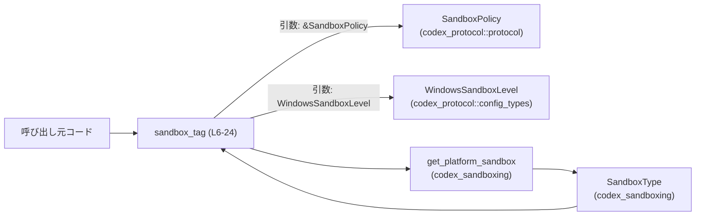
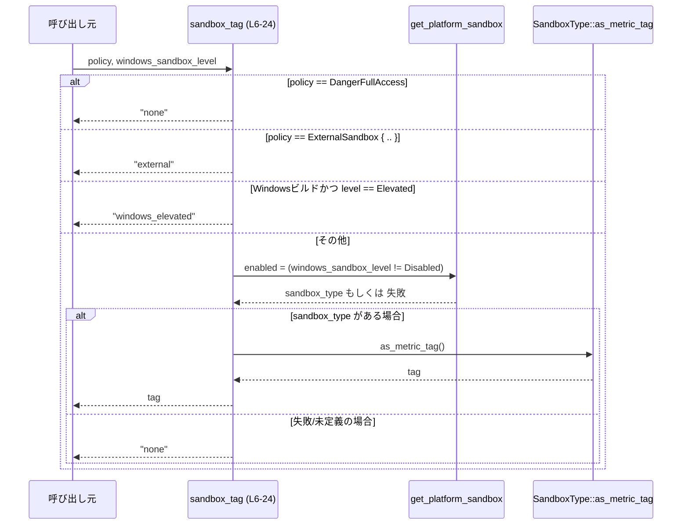
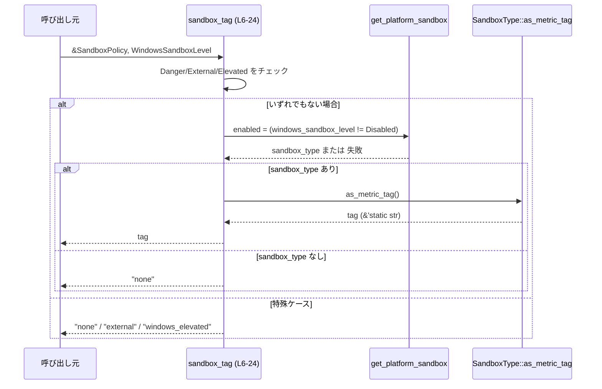

# core/src/sandbox_tags.rs

## 0. ざっくり一言

`SandboxPolicy` と Windows 向けの sandbox 設定から、メトリクスなどで使う「サンドボックスタグ」文字列（`"none"`, `"external"` など）を決定するユーティリティ関数を提供するモジュールです。  
（根拠: `sandbox_tag` の返り値とリテラル `"none"`, `"external"`, `"windows_elevated"`、および `SandboxType::as_metric_tag` 呼び出し `core/src/sandbox_tags.rs:L6-24`）

---

## 1. このモジュールの役割

### 1.1 概要

- このモジュールは、**現在のサンドボックス構成を表す短いタグ文字列を決定する** ために存在し、  
  **ポリシー（`SandboxPolicy`）と Windows 用レベル設定（`WindowsSandboxLevel`）を入力として、`&'static str` のタグを返す機能** を提供します。  
  （根拠: `sandbox_tag` のシグネチャと内部条件分岐 `core/src/sandbox_tags.rs:L6-23`）

### 1.2 アーキテクチャ内での位置づけ

このモジュールは、プロトコル層の設定型 (`SandboxPolicy`, `WindowsSandboxLevel`) と、プラットフォーム依存のサンドボックス実装 (`get_platform_sandbox`, `SandboxType`) の間に位置し、「タグ決定ロジック」を担います。

- 上位から:
  - 呼び出し元（コアロジックやメトリクス／ロギング処理）が `sandbox_tag` を呼び出します。
- 下位へ:
  - プラットフォームごとのサンドボックス選択関数 `get_platform_sandbox` を呼び出し、その戻り値の `SandboxType` からタグ文字列を取得します。  
    （根拠: `get_platform_sandbox(...).map(SandboxType::as_metric_tag)` `core/src/sandbox_tags.rs:L21-23`）



### 1.3 設計上のポイント

- **単一関数による責務の集中**  
  - ファイル内の実装は `sandbox_tag` 1 関数のみで、サンドボックスタグ決定ロジックが一箇所に集約されています。  
    （根拠: 関数定義は `sandbox_tag` のみ `core/src/sandbox_tags.rs:L6-24`）
- **ポリシー優先の分岐順序**  
  - `DangerFullAccess` → `ExternalSandbox` → Windows 固有 Elevated → それ以外、の順に優先度付きで判定しています。  
    （根拠: if 連鎖と `matches!` マクロの並び順 `core/src/sandbox_tags.rs:L10-18`）
- **プラットフォーム依存処理のカプセル化**  
  - 実際のプラットフォーム依存ロジックは `get_platform_sandbox` に委譲し、ここではブール値 `enabled` の指定とタグ変換のみに責務を限定しています。  
    （根拠: `get_platform_sandbox(windows_sandbox_level != WindowsSandboxLevel::Disabled)` `core/src/sandbox_tags.rs:L21-22`）
- **フォールバック戦略**  
  - サンドボックス情報が得られない場合は `"none"` にフォールバックする設計になっています。  
    （根拠: `.unwrap_or("none")` `core/src/sandbox_tags.rs:L23`）
- **コンパイル時 OS 判定**  
  - `cfg!(target_os = "windows")` により、Windows 向け Elevated 判定はコンパイル時フラグに基づく静的条件になります。  
    （根拠: `if cfg!(target_os = "windows") && ...` `core/src/sandbox_tags.rs:L16-18`）

---

## 2. 主要な機能一覧

- サンドボックスタグ決定: `SandboxPolicy` と `WindowsSandboxLevel` から、`"none"`, `"external"`, `"windows_elevated"` またはプラットフォーム依存のタグ文字列を返す。

---

## 3. 公開 API と詳細解説

### 3.0 コンポーネントインベントリー（このファイル内）

| 名前 | 種別 | 定義位置 | 役割 / 用途 |
|------|------|----------|-------------|
| `sandbox_tag` | 関数 | `core/src/sandbox_tags.rs:L6-24` | サンドボックス構成からタグ文字列を決定して返す |
| `tests` | モジュール（テスト用、`cfg(test)`） | `core/src/sandbox_tags.rs:L26-28` | `sandbox_tag` の動作を検証するテスト群を別ファイルから読み込む |

### 3.1 型一覧（構造体・列挙体など）

このファイルでは独自の型定義は行っておらず、外部モジュールから型をインポートしています。

| 名前 | 種別 | 定義位置（このファイル内での参照） | 役割 / 用途 |
|------|------|------------------------------------|-------------|
| `WindowsSandboxLevel` | 列挙体と推測（詳細不明） | インポート: `core/src/sandbox_tags.rs:L1` / 利用: `L8, L16, L21` | Windows 向けのサンドボックスレベル（`Elevated`, `Disabled` など）を表す設定値として使用 |
| `SandboxPolicy` | 列挙体と推測（詳細不明） | インポート: `core/src/sandbox_tags.rs:L2` / 利用: `L7, L10, L13` | 全体のサンドボックス方針（`DangerFullAccess`, `ExternalSandbox { .. }` など）を表すポリシー |
| `SandboxType` | 列挙体もしくは構造体と推測（詳細不明） | インポート: `core/src/sandbox_tags.rs:L3` / 利用: `L22` | 実際に選択されたサンドボックス種別を表す型。`as_metric_tag` メソッド経由でタグ文字列を得る |
| 型（不明名） | `map`, `unwrap_or` を持つジェネリック型（`Option`または`Result`等と推測） | 利用: `core/src/sandbox_tags.rs:L21-23` | `get_platform_sandbox` の戻り値の型。サンドボックス取得の成功／失敗を表し、タグ文字列へ変換後 `"none"` をデフォルトとする |

> `WindowsSandboxLevel`, `SandboxPolicy`, `SandboxType` の正確な定義は他ファイルにあり、このチャンクには現れません。

### 3.2 関数詳細

#### `sandbox_tag(policy: &SandboxPolicy, windows_sandbox_level: WindowsSandboxLevel) -> &'static str`

**概要**

- サンドボックスのポリシーと Windows 向けサンドボックスレベルを元に、現在のサンドボックス状態を表す短いタグ文字列を返す関数です。  
  （根拠: 関数シグネチャと if 条件分岐、返却リテラル `core/src/sandbox_tags.rs:L6-23`）

**引数**

| 引数名 | 型 | 説明 |
|--------|----|------|
| `policy` | `&SandboxPolicy` | 適用中のサンドボックス方針。`DangerFullAccess` や `ExternalSandbox { .. }` といったバリアントに応じてタグを分岐します。`core/src/sandbox_tags.rs:L7, L10, L13` |
| `windows_sandbox_level` | `WindowsSandboxLevel` | Windows 環境向けのサンドボックスレベル設定。`Elevated`・`Disabled` などのバリアントを用いてタグや `get_platform_sandbox` へのフラグに影響します。`core/src/sandbox_tags.rs:L8, L16, L21` |

**戻り値**

- `&'static str`  
  - サンドボックス状態を表すタグ文字列です。
  - このファイル内で明示的に返される可能性のある文字列は `"none"`, `"external"`, `"windows_elevated"` と、`SandboxType::as_metric_tag` が返す文字列です。  
    （根拠: return 文およびメソッドチェーン `core/src/sandbox_tags.rs:L11, L14, L18, L21-23`）

**内部処理の流れ（アルゴリズム）**

処理の優先順位付きフローは次の通りです。

1. **危険なフルアクセスの場合**  
   - `policy` が `SandboxPolicy::DangerFullAccess` とマッチする場合、タグとして `"none"` を即座に返します。  
     （根拠: `if matches!(policy, SandboxPolicy::DangerFullAccess) { return "none"; }` `core/src/sandbox_tags.rs:L10-12`）
2. **外部サンドボックスの場合**  
   - 1 に当てはまらず、`policy` が `SandboxPolicy::ExternalSandbox { .. }` の場合、 `"external"` を即座に返します。  
     （根拠: `if matches!(policy, SandboxPolicy::ExternalSandbox { .. }) { return "external"; }` `core/src/sandbox_tags.rs:L13-15`）
3. **Windows Elevated の場合（Windows ビルドのみ）**  
   - 上記 2 つに該当せず、かつ `cfg!(target_os = "windows")` が `true`（Windows 向けビルド）であり、`windows_sandbox_level` が `WindowsSandboxLevel::Elevated` の場合、 `"windows_elevated"` を即座に返します。  
     （根拠: `if cfg!(target_os = "windows") && matches!(windows_sandbox_level, WindowsSandboxLevel::Elevated)` + `return "windows_elevated"` `core/src/sandbox_tags.rs:L16-18`）
4. **その他のケース**  
   - 上記いずれにも該当しない場合、`get_platform_sandbox` に対して「サンドボックスを有効にするか」を表すブール値を渡して問い合わせます。  
     - `enabled` フラグとして `windows_sandbox_level != WindowsSandboxLevel::Disabled` を渡します。`Disabled` 以外なら `true`。  
       （根拠: `get_platform_sandbox(windows_sandbox_level != WindowsSandboxLevel::Disabled)` `core/src/sandbox_tags.rs:L21`）
   - `get_platform_sandbox` の結果に対し、`map(SandboxType::as_metric_tag)` を呼び、サンドボックスタイプをタグ文字列に変換します。  
     （根拠: `.map(SandboxType::as_metric_tag)` `core/src/sandbox_tags.rs:L22`）
   - 最後に `.unwrap_or("none")` を呼び、サンドボックスが得られなかった場合（`None` や `Err` など）には `"none"` を返します。  
     （根拠: `.unwrap_or("none")` `core/src/sandbox_tags.rs:L23`）

フローをシーケンス図にすると、以下のようになります。



**Examples（使用例）**

以下の例は、このファイル内に補助関数を追加した場合のイメージです。モジュールパスなどは省略しています。

```rust
use codex_protocol::config_types::WindowsSandboxLevel;   // WindowsSandboxLevel を使う
use codex_protocol::protocol::SandboxPolicy;             // SandboxPolicy を使う

// sandbox_tag を使ってタグ文字列を得る例
fn log_sandbox_tag_example() {
    // フルアクセス許可のポリシー
    let policy = SandboxPolicy::DangerFullAccess;        // core/src/sandbox_tags.rs:L10 と同じバリアント

    // Windows サンドボックスレベルは Disabled とする
    let windows_level = WindowsSandboxLevel::Disabled;   // core/src/sandbox_tags.rs:L21 で参照されているバリアント

    // タグを取得
    let tag = sandbox_tag(&policy, windows_level);       // core/src/sandbox_tags.rs:L6-9

    // このケースでは "none" が返る
    assert_eq!(tag, "none");
}

// 外部サンドボックス利用時のタグ
fn external_sandbox_tag_example() {
    let policy = SandboxPolicy::ExternalSandbox {        // core/src/sandbox_tags.rs:L13 でマッチしているバリアント
        // フィールドはこのチャンクにないため詳細不明
    };

    let windows_level = WindowsSandboxLevel::Disabled;

    let tag = sandbox_tag(&policy, windows_level);

    // "external" が返る
    assert_eq!(tag, "external");
}
```

> `SandboxPolicy::ExternalSandbox { .. }` のフィールドの中身はこのチャンクにはないため、省略しています。

**Errors / Panics**

- この関数は `Result` ではなく `&'static str` を返すため、**エラー値は返しません**。  
  （根拠: 戻り値型 `-> &'static str` `core/src/sandbox_tags.rs:L9`）
- 明示的な `panic!` 呼び出しや `unwrap()`（デフォルトなし）は使用していません。  
  - 使用している `unwrap_or("none")` は、内部的には「失敗時に `"none"` を返す」ための安全な処理です。  
    （根拠: `.unwrap_or("none")` `core/src/sandbox_tags.rs:L23`）
- したがって、この関数内で直接的にパニックが発生する可能性は低く、主な失敗モードは `"none"` タグへのフォールバックです。  
  - ただし、`get_platform_sandbox` や `SandboxType::as_metric_tag` の内部でパニックが発生する可能性については、このチャンクからは判断できません。

**Edge cases（エッジケース）**

- `policy` が `SandboxPolicy::DangerFullAccess` の場合  
  - Windows 設定やプラットフォームに関係なく、常に `"none"` が返されます。  
    （根拠: 冒頭で `return "none"` しており、以降の条件は評価されない `core/src/sandbox_tags.rs:L10-12`）
- `policy` が `SandboxPolicy::ExternalSandbox { .. }` の場合  
  - Windows 設定やプラットフォームに関係なく、常に `"external"` が返されます。  
    （根拠: 2 つ目の if で即 return `core/src/sandbox_tags.rs:L13-15`）
- Windows ビルドで `windows_sandbox_level == WindowsSandboxLevel::Elevated` の場合  
  - `DangerFullAccess` / `ExternalSandbox` でない限り、 `"windows_elevated"` が返されます。  
    （根拠: 3 つ目の if と return `core/src/sandbox_tags.rs:L16-18`）
- 非 Windows ビルドで `windows_sandbox_level == Elevated` の場合  
  - `cfg!(target_os = "windows")` がコンパイル時に `false` となるため、Elevated 判定の分岐はスキップされ、`get_platform_sandbox` 経由の処理にフォールバックします。  
    （根拠: `cfg!` はコンパイル時に定数となるマクロ `core/src/sandbox_tags.rs:L16`）
- `windows_sandbox_level == WindowsSandboxLevel::Disabled` の場合  
  - `get_platform_sandbox` には `enabled = false` が渡されます（`!= Disabled` の否定）。  
    - このとき、どのような `SandboxType`（または `None`）が返るかはこのチャンクからは分かりません。  
    （根拠: `windows_sandbox_level != WindowsSandboxLevel::Disabled` `core/src/sandbox_tags.rs:L21`）
- `get_platform_sandbox` がサンドボックス情報を返さない場合（`None`／エラー）  
  - `.unwrap_or("none")` により `"none"` が返されます。  
    （根拠: `map(...).unwrap_or("none")` `core/src/sandbox_tags.rs:L22-23`）

**使用上の注意点**

- **前提条件（契約）**
  - `policy` 引数は有効な `SandboxPolicy` への参照である必要があります（`&SandboxPolicy`）。  
    - 参照であるため、この関数の呼び出しにより所有権は移動しません（Rust の所有権・借用ルール）。  
      （根拠: 引数型 `&SandboxPolicy` `core/src/sandbox_tags.rs:L7`）
  - `windows_sandbox_level` は値で受け取るため、呼び出し側からは所有権が移動します。必要に応じてコピー／クローンが求められますが、このチャンクからは `Copy` 実装の有無は分かりません。
- **スレッド安全性・並行性**
  - この関数自身は
    - グローバルな可変状態にアクセスしていない
    - 引数と戻り値が（参照を除き）値レベルで完結している
    ため、**関数レベルでは状態を持たない純粋な計算に近く、並行に呼び出しやすい構造**になっています。  
    （根拠: 関数内に static 変数や可変な共有データ、I/O などが存在しない `core/src/sandbox_tags.rs:L6-24`）
  - ただし、並行呼び出し時の振る舞いは `get_platform_sandbox` の実装にも依存します。このチャンクにはその実装がないため、完全なスレッド安全性は断定できません。
- **セキュリティ観点**
  - サンドボックスが利用できない／判定できない場合でも `"none"` を返して処理を継続する設計です。  
    - これにより、メトリクスなどでは「サンドボックスなし」と記録される可能性がありますが、エラーやパニックにはなりません。  
    （根拠: `.unwrap_or("none")` `core/src/sandbox_tags.rs:L23`）
  - `DangerFullAccess` ポリシーはあくまで呼び出し側の設定値であり、この関数はそれをタグ `"none"` で表現するだけで、権限を直接変更するものではありません。

### 3.3 その他の関数

- このファイルには `sandbox_tag` 以外の通常関数はありません。  
  （根拠: 関数定義は `sandbox_tag` のみ `core/src/sandbox_tags.rs:L6-24`）

---

## 4. データフロー

代表的なシナリオとして、一般的なポリシー（危険フルアクセスでも外部サンドボックスでもない）で呼び出されたときのデータフローを示します。

1. 呼び出し元が `SandboxPolicy` と `WindowsSandboxLevel` を構築し、`sandbox_tag` に渡します。
2. `sandbox_tag` は Danger/External/Elevated でないことを確認し、`get_platform_sandbox` に `enabled` フラグを渡して問い合わせます。
3. `get_platform_sandbox` が返したサンドボックスタイプを `SandboxType::as_metric_tag` で文字列に変換し、呼び出し元に返します。
4. もしサンドボックス情報が取得できなければ `"none"` が返ります。



---

## 5. 使い方（How to Use）

### 5.1 基本的な使用方法

以下は、ポリシーと Windows サンドボックスレベルからタグを取得する基本的な例です。

```rust
use codex_protocol::config_types::WindowsSandboxLevel;   // WindowsSandboxLevel を使用
use codex_protocol::protocol::SandboxPolicy;             // SandboxPolicy を使用
// このファイルと同じモジュール内で呼び出す想定
// （別モジュールから呼ぶ場合のパスは、このチャンクからは不明）

fn main() {
    // 例: 通常の（ここでは仮の）サンドボックスポリシー
    let policy = SandboxPolicy::DangerFullAccess;        // 危険フルアクセス

    // Windows 向けサンドボックスレベル
    let windows_level = WindowsSandboxLevel::Disabled;   // サンドボックス無効

    // タグを取得
    let tag = sandbox_tag(&policy, windows_level);       // 参照と値を渡す

    // tag は "none" になる
    println!("sandbox tag = {}", tag);
}
```

### 5.2 よくある使用パターン

1. **メトリクスやログへのタグ付け**

```rust
fn record_metrics(policy: &SandboxPolicy, windows_level: WindowsSandboxLevel) {
    let tag = sandbox_tag(policy, windows_level);        // タグを決定
    // メトリクスのラベルやログのフィールドとして利用する
    // metrics.record("sandbox_state", 1, &["sandbox_tag", tag]);
}
```

- `policy` を借用で渡しているため、呼び出し側は `policy` を引き続き利用できます。

1. **設定検証やデバッグ出力**

```rust
fn debug_sandbox_configuration(policy: &SandboxPolicy, windows_level: WindowsSandboxLevel) {
    let tag = sandbox_tag(policy, windows_level);
    eprintln!("Current sandbox configuration tag: {}", tag);
}
```

### 5.3 よくある間違い

```rust
// 間違い例: policy の所有権を渡してしまう（仮想的な例）
fn wrong(policy: SandboxPolicy, windows_level: WindowsSandboxLevel) {
    // ここで sandbox_tag に所有権付きの policy を渡すと、
    // 呼び出し側で policy を再利用できなくなる
    let tag = sandbox_tag(&policy, windows_level); // この行自体はOKだが、所有権の設計が不自然
}

// 正しい例: policy を参照で渡す
fn correct(policy: &SandboxPolicy, windows_level: WindowsSandboxLevel) {
    let tag = sandbox_tag(policy, windows_level);  // & を付けなくても型が &SandboxPolicy なら OK
    // policy は呼び出し元で再利用できる
}
```

> この関数は `&SandboxPolicy` を受け取るように設計されているため、共有して使える `policy` を保持しつつタグ計算だけを行う使い方が自然です。  
> （根拠: 引数型 `&SandboxPolicy` `core/src/sandbox_tags.rs:L7`）

### 5.4 使用上の注意点（まとめ）

- `SandboxPolicy` の特定バリアント（`DangerFullAccess` / `ExternalSandbox`）は Windows 設定より優先されます。
- Windows 固有の `"windows_elevated"` タグは **Windows ビルドでのみ** 有効です（他プラットフォームではこの分岐は無効）。  
  （根拠: `cfg!(target_os = "windows")` `core/src/sandbox_tags.rs:L16`）
- サンドボックス情報取得に失敗した場合でも `"none"` が返るため、「タグが `"none"` = 常にサンドボックスなし」とは限らず、「情報が取得できなかった」ケースも含まれ得ます。  
  （根拠: `.unwrap_or("none")` `core/src/sandbox_tags.rs:L23`）

---

## 6. 変更の仕方（How to Modify）

### 6.1 新しい機能を追加する場合

例: 新しいタグ（例えば `"docker"` など）を追加したいケース。

1. **ポリシーやサンドボックス種別の拡張**
   - 新しいポリシーに対応する場合は、`SandboxPolicy` に新バリアントを追加し、そのバリアントに対する分岐を `sandbox_tag` に追加します。  
     - これは `matches!(policy, SandboxPolicy::...)` の if を追加／修正する形になります。  
       （根拠: 既存の判定ロジック `core/src/sandbox_tags.rs:L10-15`）
   - もしくは `SandboxType` 側に新しい種別と `as_metric_tag` の対応を追加し、既存の `get_platform_sandbox` の戻りに反映させる方法も考えられます（このチャンクからは実装詳細不明）。
2. **タグ決定ロジックの拡張**
   - 新規タグを追加する場合は、既存の優先順位を維持するか変更するかを検討し、if の順序を調整します。  
   - 例えば、`DangerFullAccess` よりも前に優先すべきケースがあれば、最初の if の前に新しい条件を挿入します。
3. **テストの追加**
   - `#[path = "sandbox_tags_tests.rs"]` で別ファイルにテストが置かれているため、そのテストファイルに新しいケースを追加します。  
     （根拠: `#[cfg(test)]` と `#[path]` 属性 `core/src/sandbox_tags.rs:L26-28`）

### 6.2 既存の機能を変更する場合

- **影響範囲の確認**
  - `sandbox_tag` の戻り値が変わると、そのタグ文字列を使用しているメトリクスやログなど、クレート内の広い箇所に影響する可能性があります。  
    - 呼び出し箇所は grep 等で `"sandbox_tag"` を検索して洗い出す必要があります（このチャンクからは使用箇所不明）。
- **契約（前提条件・返り値の意味）の維持**
  - `"none"` タグが「サンドボックスなし」または「情報取得失敗」を意味しているという現状のニュアンスを変える場合、利用側の解釈も合わせて更新する必要があります。
  - Windows 以外のプラットフォームでは `cfg!(target_os = "windows")` が false になる点を踏まえ、Elevated 判定の仕様変更は OS ごとに検討する必要があります。
- **テストの再確認**
  - 既存テスト（`sandbox_tags_tests.rs`）で想定されているタグ文字列が変わるため、必ずテストの期待値を更新し、全テストを再実行する必要があります。

---

## 7. 関連ファイル

| パス / モジュール | 役割 / 関係 |
|-------------------|------------|
| `core/src/sandbox_tags.rs` | 本レポート対象。`sandbox_tag` を提供し、サンドボックスタグ決定ロジックを実装する。 |
| `core/src/sandbox_tags_tests.rs` | テストコード。`#[cfg(test)]` と `#[path = "sandbox_tags_tests.rs"]` により、このモジュールのテストが配置されていることが分かる（内容はこのチャンクには現れない）。`core/src/sandbox_tags.rs:L26-28` |
| `codex_protocol::config_types` | 外部クレート／モジュール。`WindowsSandboxLevel` を提供し、Windows 用サンドボックスレベルの設定型として利用される。`core/src/sandbox_tags.rs:L1` |
| `codex_protocol::protocol` | 外部クレート／モジュール。`SandboxPolicy` を提供し、全体のサンドボックス方針を表す。`core/src/sandbox_tags.rs:L2` |
| `codex_sandboxing` | 外部クレート／モジュール。`SandboxType` および `get_platform_sandbox` を提供し、プラットフォームごとのサンドボックス実装とそのタグ表現を担う。`core/src/sandbox_tags.rs:L3-4` |

> 外部クレート内の具体的な実装や追加のファイル構成は、このチャンクには現れないため不明です。
