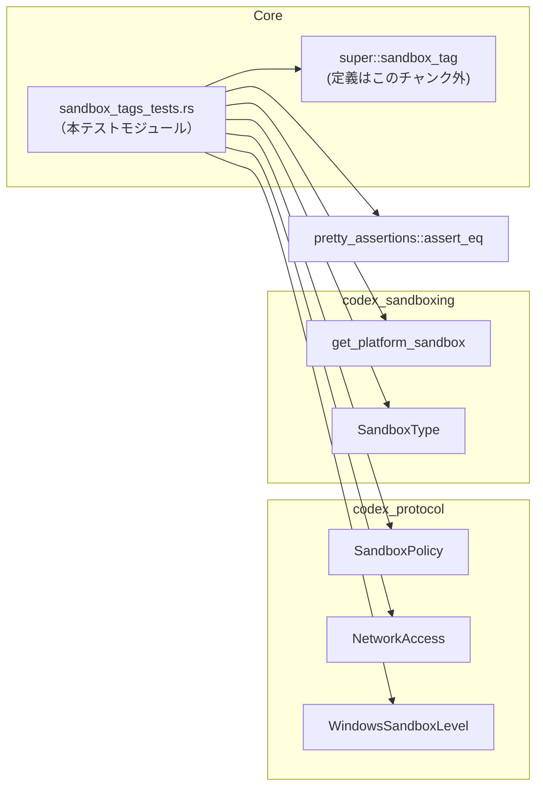

# core/src/sandbox_tags_tests.rs

## 0. ざっくり一言

このファイルは、親モジュールの `sandbox_tag` 関数に対して、特定のサンドボックスポリシーと Windows サンドボックス設定の組み合わせで期待されるタグ文字列が返ることを検証するユニットテスト群です（`sandbox_tags_tests.rs:L9-39`）。

---

## 1. このモジュールの役割

### 1.1 概要

- このモジュールは、`sandbox_tag` 関数の挙動が **Linux サンドボックスのデフォルト設定** において期待どおりであることを確認するためのテストを提供します（`sandbox_tags_tests.rs:L9-39`）。
- 具体的には、以下の 3 ケースを検証します：
  - `DangerFullAccess` ポリシーがタグ付けされないこと（`"none"`）（`L9-16`）。
  - `ExternalSandbox` ポリシーが `"external"` タグを保持すること（`L18-27`）。
  - デフォルトの Linux サンドボックス（読み取り専用ポリシー）が **プラットフォーム依存のサンドボックスタイプ** に対応するタグを返すこと（`L29-38`）。

### 1.2 アーキテクチャ内での位置づけ

このテストファイルは、親モジュールに定義された `sandbox_tag` を中心に、プロトコル設定とサンドボックス実装にまたがる依存関係を検証します。



- `use super::sandbox_tag;` により、同一クレート内の親モジュールにある `sandbox_tag` 関数をテスト対象としています（`sandbox_tags_tests.rs:L1`）。
- サンドボックスポリシーとネットワークアクセス、Windows サンドボックスレベルは `codex_protocol` クレートからインポートされています（`L2-4`）。
- プラットフォーム固有のサンドボックス種別は `codex_sandboxing` クレートから取得します（`L5-6`）。
- アサーションには `pretty_assertions::assert_eq` を使用し、通常の `assert_eq!` と互換の動作をしつつ出力を見やすくしています（`L7`）。

### 1.3 設計上のポイント

コードから読み取れる設計上の特徴は次のとおりです。

- **ピンポイントなケーステスト**  
  - 各テスト関数は、1 つの入力パターンと 1 つの期待するタグにフォーカスしています（`L9-16`, `L18-27`, `L29-38`）。
- **外部依存の明示**  
  - テストは、`SandboxPolicy`・`WindowsSandboxLevel`・`SandboxType`・`get_platform_sandbox` など、実際のプロダクションコードが依存する型と関数をそのまま使用しており、実運用に近い条件で `sandbox_tag` を検証しています（`L11-14`, `L20-25`, `L31-37`）。
- **文字列タグの契約の固定化**  
  - 期待値を `"none"`・`"external"` といった具体的な文字列で比較しており、タグの仕様変更があればテストが即座に検知します（`L15`, `L26`, `L38`）。
- **エラーハンドリングの方針**  
  - テスト内では `Option` に対して `unwrap_or("none")` を用いており、テストが不要にパニックしないようにデフォルト値を指定しています（`L35-37`）。
- **並行性**  
  - このファイル内に非同期処理（`async/await`）やスレッド生成はなく、すべて単一スレッド・同期的に評価される通常のユニットテストです（`L9-39`）。

---

## 2. 主要な機能一覧（コンポーネントインベントリー）

### 2.1 このファイルで定義される関数

| 名前 | 種別 | 定義箇所 | 役割 / 用途 |
|------|------|----------|-------------|
| `danger_full_access_is_untagged_even_when_linux_sandbox_defaults_apply` | テスト関数 | `sandbox_tags_tests.rs:L9-16` | `SandboxPolicy::DangerFullAccess` かつ `WindowsSandboxLevel::Disabled` のとき、タグ `"none"` が返ることを検証します。 |
| `external_sandbox_keeps_external_tag_when_linux_sandbox_defaults_apply` | テスト関数 | `sandbox_tags_tests.rs:L18-27` | `SandboxPolicy::ExternalSandbox { network_access: Enabled }` かつ `WindowsSandboxLevel::Disabled` のとき、タグ `"external"` が返ることを検証します。 |
| `default_linux_sandbox_uses_platform_sandbox_tag` | テスト関数 | `sandbox_tags_tests.rs:L29-38` | 読み取り専用ポリシーかつ `WindowsSandboxLevel::Disabled` のとき、`get_platform_sandbox(false)` 由来のタグが返ることを検証します。 |

### 2.2 外部から利用している主な型・関数

（このファイル内で新たな型定義はありませんが、理解のために主要な外部コンポーネントを挙げます。）

| 名前 | 種別 | 出所 | 使用箇所 / 役割 |
|------|------|------|----------------|
| `sandbox_tag` | 関数 | 親モジュール（`super`） | 3 つのテストすべてで実際のタグ生成ロジックとして呼び出されます（`L11`, `L20`, `L31`）。 |
| `SandboxPolicy` | 列挙体（と推定） | `codex_protocol::protocol` | テスト対象のサンドボックスポリシーを構築するために利用されます（`L12`, `L21`, `L32`）。 |
| `NetworkAccess` | 列挙体（と推定） | `codex_protocol::protocol` | `ExternalSandbox` ポリシーのフィールドに使用されます（`L22`）。 |
| `WindowsSandboxLevel` | 列挙体（と推定） | `codex_protocol::config_types` | すべてのテストで `Disabled` を渡し、「Linux サンドボックスのデフォルトが効いている」条件を表現します（`L13`, `L24`, `L33`）。 |
| `get_platform_sandbox` | 関数 | `codex_sandboxing` | プラットフォーム固有のサンドボックス種別を取得し、期待されるタグを算出するために利用されます（`L35-37`）。 |
| `SandboxType` | 列挙体（と推定） | `codex_sandboxing` | `as_metric_tag` メソッドでメトリクスタグ用の文字列に変換します（`L36`）。 |
| `assert_eq` | マクロ | `pretty_assertions` | 実際のタグと期待値を比較し、テストの成否を判定します（`L15`, `L26`, `L38`）。 |

> `SandboxPolicy`・`NetworkAccess`・`WindowsSandboxLevel`・`SandboxType` の具体的な定義は、このチャンクには現れません。

---

## 3. 公開 API と詳細解説

このファイル内には外部に公開される API はなく、すべて Rust のテストフレームワークが実行する `#[test]` 関数です（`sandbox_tags_tests.rs:L9,18,29`）。しかし、`sandbox_tag` の振る舞いを理解するうえで重要なため、各テスト関数の役割と内部処理を整理します。

### 3.1 型一覧（構造体・列挙体など）

- このファイル内で **新たに定義されている構造体・列挙体はありません**（`sandbox_tags_tests.rs:L1-39`）。
- 使用している外部型については、前節 2.2 を参照してください。

### 3.2 関数詳細（テスト関数 3 件）

#### `danger_full_access_is_untagged_even_when_linux_sandbox_defaults_apply()`

**概要**

- `SandboxPolicy::DangerFullAccess` と `WindowsSandboxLevel::Disabled` の組み合わせで `sandbox_tag` を呼び出した結果が `"none"` であることを検証するテストです（`sandbox_tags_tests.rs:L9-16`）。

**引数**

- 引数はありません（テスト関数であり、グローバルスコープの型や関数を直接利用しています）。

**戻り値**

- 戻り値は `()`（ユニット型）です。Rust の `#[test]` 関数として、成功時は何も返さず、そのまま終了します。
- アサーションが失敗した場合はパニックを起こし、そのテストは失敗として報告されます（`L15`）。

**内部処理の流れ**

1. `sandbox_tag` を `SandboxPolicy::DangerFullAccess` と `WindowsSandboxLevel::Disabled` で呼び出し、結果を `actual` に格納します（`L11-14`）。
2. 期待されるタグ `"none"` と `actual` を `assert_eq!` で比較します（`L15`）。
3. タグが `"none"` でない場合、テストはパニックし失敗します。

**Examples（使用例）**

この関数自身が使用例にあたるため、簡略化したパターンを示します。

```rust
// DangerFullAccess ポリシー + Windows サンドボックス無効の組み合わせ
let actual = sandbox_tag(
    &SandboxPolicy::DangerFullAccess,     // 危険なフルアクセスを許可するポリシー
    WindowsSandboxLevel::Disabled,        // Windows サンドボックスは無効
);
assert_eq!(actual, "none");               // タグが付かない（"none"）ことを期待
```

**Errors / Panics**

- `sandbox_tag` がパニックを起こす条件は、このチャンクからは分かりません。
- テスト側で発生しうるパニックは、
  - `actual != "none"` の場合に `assert_eq!(actual, "none")` が失敗したときです（`sandbox_tags_tests.rs:L15`）。

**Edge cases（エッジケース）**

- このテストでは、以下の組み合わせのみを検証しています（`L11-14`）。
  - ポリシー: `SandboxPolicy::DangerFullAccess`
  - Windows サンドボックス: `WindowsSandboxLevel::Disabled`
- それ以外の組み合わせ（例: Windows サンドボックス有効、他のポリシー種別）は、このテストではカバーされていません。

**使用上の注意点**

- このテストは「**DangerFullAccess はタグ付けされない**」という契約を固定します。  
  `sandbox_tag` の実装側で DangerFullAccess にタグを付ける変更を行う場合、このテストも合わせて更新する必要があります。

---

#### `external_sandbox_keeps_external_tag_when_linux_sandbox_defaults_apply()`

**概要**

- `SandboxPolicy::ExternalSandbox { network_access: Enabled }` と `WindowsSandboxLevel::Disabled` の組み合わせで `sandbox_tag` を呼び出し、結果が `"external"` であることを検証するテストです（`sandbox_tags_tests.rs:L18-27`）。

**引数**

- 引数はありません。

**戻り値**

- 戻り値は `()` で、アサーションに失敗するとパニックします（`L26`）。

**内部処理の流れ**

1. `sandbox_tag` を、ネットワークアクセスが有効な `ExternalSandbox` ポリシーと `WindowsSandboxLevel::Disabled` で呼び出します（`L20-25`）。
   - ポリシー生成:  
     `SandboxPolicy::ExternalSandbox { network_access: NetworkAccess::Enabled }`（`L21-22`）。
2. 期待されるタグ `"external"` と実際の `actual` を `assert_eq!` で比較します（`L26`）。

**Examples（使用例）**

```rust
// ExternalSandbox ポリシー + ネットワークアクセス有効 + Windows サンドボックス無効
let actual = sandbox_tag(
    &SandboxPolicy::ExternalSandbox {
        network_access: NetworkAccess::Enabled,  // 外部サンドボックスでネットワークを許可
    },
    WindowsSandboxLevel::Disabled,               // Windows サンドボックスは無効
);
assert_eq!(actual, "external");                  // "external" タグであることを期待
```

**Errors / Panics**

- `actual != "external"` の場合に `assert_eq!(actual, "external")` が失敗し、このテストはパニックします（`sandbox_tags_tests.rs:L26`）。
- `sandbox_tag` の内部でのエラーやパニック条件は、このファイルからは分かりません。

**Edge cases（エッジケース）**

- このテストがカバーする条件（`L20-25`）:
  - ポリシー: `SandboxPolicy::ExternalSandbox { network_access: NetworkAccess::Enabled }`
  - Windows サンドボックス: `WindowsSandboxLevel::Disabled`
- 以下はカバーされていません（このチャンクには現れません）:
  - `NetworkAccess::Disabled` や他の値をとる場合。
  - `ExternalSandbox` 以外のポリシーとの組み合わせ。
  - Windows サンドボックスが有効なケース。

**使用上の注意点**

- 外部サンドボックスに対して `"external"` という固定文字列を期待しているため、タグの名前変更（例: `"external-sandbox"` へ変更など）を行うと、このテストが必ず失敗します。
- タグ名の変更が意図的な仕様変更である場合は、テスト側の期待値も同期して変更する必要があります。

---

#### `default_linux_sandbox_uses_platform_sandbox_tag()`

**概要**

- デフォルトの Linux サンドボックス（ここでは `SandboxPolicy::new_read_only_policy()` と `WindowsSandboxLevel::Disabled` の組み合わせ）に対して、`sandbox_tag` の返すタグが、`get_platform_sandbox(false)` から導かれるタグと一致することを検証するテストです（`sandbox_tags_tests.rs:L29-38`）。

**引数**

- 引数はありません。

**戻り値**

- 戻り値は `()` で、アサーション失敗時にパニックします（`L38`）。

**内部処理の流れ（アルゴリズム）**

1. `SandboxPolicy::new_read_only_policy()` と `WindowsSandboxLevel::Disabled` を引数に `sandbox_tag` を呼び出し、その結果を `actual` に格納します（`L31-34`）。
2. `get_platform_sandbox(false)` を呼び出して、プラットフォーム固有のサンドボックス種別（`Option<SandboxType>` と推定）を取得します（`L35`）。
   - 引数 `false` はコメント `/*windows_sandbox_enabled*/ false` から、「Windows サンドボックスが無効」であることを表します（`L35`）。
3. 取得した `Option<SandboxType>` に対して `map(SandboxType::as_metric_tag)` を適用し、`Some(SandboxType)` の場合はタグ文字列（メトリクスタグ）に変換します（`L36`）。
4. 上記の結果に対して `unwrap_or("none")` を呼び、`None` だった場合には `"none"` をデフォルトとします（`L37`）。
   - これにより、`get_platform_sandbox` が何も返さないケースでもテストがパニックせず、 `"none"` を期待値として扱います。
5. 最後に、`assert_eq!(actual, expected)` で `sandbox_tag` の出力と `expected` を比較します（`L38`）。

**Examples（使用例）**

```rust
// デフォルトの読み取り専用サンドボックス + Windows サンドボックス無効
let actual = sandbox_tag(
    &SandboxPolicy::new_read_only_policy(),  // デフォルトの読み取り専用ポリシー
    WindowsSandboxLevel::Disabled,           // Windows サンドボックス無効（Linux デフォルトが有効）
);

// プラットフォーム依存のサンドボックス種別から期待されるタグを計算
let expected = get_platform_sandbox(/*windows_sandbox_enabled*/ false)
    .map(SandboxType::as_metric_tag)        // SandboxType -> &str（メトリクスタグ）
    .unwrap_or("none");                     // 種別未定義なら "none" を採用

assert_eq!(actual, expected);               // sandbox_tag の結果と比較
```

**Errors / Panics**

- `get_platform_sandbox(false)` が `None` を返しても、このテストは `unwrap_or("none")` により `"none"` を期待値とするため、そこでパニックすることはありません（`sandbox_tags_tests.rs:L35-37`）。
- このテストでパニックが発生するのは、`actual != expected` の場合に `assert_eq!(actual, expected)` が失敗したときです（`L38`）。

**Edge cases（エッジケース）**

- このテストが想定している条件（`L31-37`）:
  - Windows サンドボックスは無効 (`windows_sandbox_enabled = false`)。
  - Linux 側は「読み取り専用」ポリシー。
- カバーされていないケース（このチャンクには登場しません）:
  - `get_platform_sandbox(true)`（Windows サンドボックス有効）のときの挙動。
  - 読み取り専用以外のポリシーとの組み合わせ。
  - `get_platform_sandbox(false)` が `Some` だが、`SandboxType::as_metric_tag` がどのような文字列を返すかの詳細。

**使用上の注意点**

- このテストは「デフォルト Linux サンドボックスのタグは、プラットフォーム定義に対して常に同じであるべき」という契約を表現しています。
- `get_platform_sandbox(false)` や `SandboxType::as_metric_tag` の仕様が変わると、`sandbox_tag` が変わっていなくてもテストが失敗する可能性があります。  
  そのため、プラットフォームサンドボックスの仕様変更時には、このテストの期待値計算ロジックも確認する必要があります。

---

### 3.3 その他の関数

- このファイル内には、補助的な関数やラッパー関数は存在しません（`sandbox_tags_tests.rs:L1-39`）。

---

## 4. データフロー

### 4.1 代表的なシナリオ：デフォルト Linux サンドボックスのタグ決定

`default_linux_sandbox_uses_platform_sandbox_tag` テストでは、`sandbox_tag` と `get_platform_sandbox` の両方を用いて、デフォルトの Linux サンドボックスに対するタグが期待どおりであることを検証しています（`sandbox_tags_tests.rs:L29-38`）。

```mermaid
sequenceDiagram
    %% シーケンス図は sandbox_tags_tests.rs:L29-38 に基づく
    participant Test as Test関数<br/>default_linux_sandbox_uses_platform_sandbox_tag (L29-38)
    participant STAG as sandbox_tag(..)<br/>(親モジュール; 定義はこのチャンク外)
    participant GPS as get_platform_sandbox(false)
    participant MAP as map(SandboxType::as_metric_tag)
    participant DEF as unwrap_or("none")
    participant ASSERT as assert_eq!

    Test->>STAG: sandbox_tag(&new_read_only_policy(), Disabled)\n→ actual（&str）
    Note over Test,STAG: デフォルト Linux サンドボックスのタグを計算

    Test->>GPS: get_platform_sandbox(false)
    GPS-->>Test: Option<SandboxType>

    Test->>MAP: map(SandboxType::as_metric_tag)
    MAP-->>Test: Option<&str>

    Test->>DEF: unwrap_or("none")
    DEF-->>Test: expected (&str)

    Test->>ASSERT: assert_eq!(actual, expected)
    ASSERT-->>Test: 成功 / パニック（失敗）
```

**要点**

- `sandbox_tag` が返すタグ（実装依存）と、`get_platform_sandbox(false)` → `SandboxType::as_metric_tag` → `"none"` デフォルトという計算過程によるタグが一致することを確認しています（`sandbox_tags_tests.rs:L31-38`）。
- `Option` に対して `unwrap_or` を使うことで、`get_platform_sandbox` が `None` を返した場合でも、テストは `"none"` を想定しつつ処理を継続します（`L35-37`）。
- 並行処理は関与せず、すべて 1 スレッド内で順次実行されます。

---

## 5. 使い方（How to Use）

### 5.1 基本的な使用方法（テストの実行）

このモジュールは Rust の標準的なテスト機構により自動的に実行されます。プロジェクトのルートで以下のようにコマンドを実行することで、このファイルのテストも含めてすべてのテストが走ります。

```bash
# プロジェクト全体のテストを実行
cargo test
```

特定のテスト関数だけを実行する場合は、関数名を指定します。

```bash
# DangerFullAccess に関するテストのみ実行
cargo test danger_full_access_is_untagged_even_when_linux_sandbox_defaults_apply

# ExternalSandbox に関するテストのみ実行
cargo test external_sandbox_keeps_external_tag_when_linux_sandbox_defaults_apply
```

### 5.2 よくある使用パターン（テストの追加）

このファイルでは、`sandbox_tag` に新しい振る舞いを追加したときに、それを検証するテストを追加するパターンが想定されます。既存テストの形に倣うことで、一貫性のあるテストを書けます。

例：新しいポリシー `SandboxPolicy::SomeNewPolicy` に対するタグ `"new"` を検証したい場合（具体的なポリシー名やタグはこのチャンクには現れませんが、パターンとしての例です）。

```rust
#[test]
fn some_new_policy_uses_new_tag() {
    // テスト対象のポリシーと Windows サンドボックス設定を用意
    let actual = sandbox_tag(
        &SandboxPolicy::SomeNewPolicy,        // 新しいポリシー（仮の例）
        WindowsSandboxLevel::Disabled,        // 既存テストと同様に Disabled を使用する場合
    );
    // 期待されるタグと比較
    assert_eq!(actual, "new");
}
```

### 5.3 よくある間違い（想定される誤用例）

このファイルから推測できる範囲で、誤用例とその是正例を挙げます。

```rust
// 誤りの例: 期待値に誤ったタグを指定している
let actual = sandbox_tag(
    &SandboxPolicy::DangerFullAccess,
    WindowsSandboxLevel::Disabled,
);
assert_eq!(actual, "external"); // DangerFullAccess に external を期待してしまっている

// 正しい例: 本ファイルのテストが示す契約に従う
let actual = sandbox_tag(
    &SandboxPolicy::DangerFullAccess,
    WindowsSandboxLevel::Disabled,
);
assert_eq!(actual, "none"); // sandbox_tags_tests.rs:L11-15 に倣う
```

- 上記の「誤りの例」は、本ファイルのテスト `danger_full_access_is_untagged_even_when_linux_sandbox_defaults_apply` が示している契約（DangerFullAccess → "none"）と矛盾する点を示したものです（`sandbox_tags_tests.rs:L9-16`）。

### 5.4 使用上の注意点（まとめ）

- このファイルのテストは、**特定のポリシーと Windows サンドボックス設定の組み合わせ** についての期待値を固定するものです。
  - DangerFullAccess → `"none"`（`L11-15`）
  - ExternalSandbox (NetworkAccess::Enabled) → `"external"`（`L20-26`）
  - デフォルト Linux サンドボックス → `get_platform_sandbox(false)` 由来のタグ or `"none"`（`L31-38`）
- `sandbox_tag` のロジックを変更する場合は、これらのテストが失敗するかどうかを確認し、仕様変更であればテストの期待値も含めて整合性を取る必要があります。
- 並行性や非同期要素はないため、スレッド安全性に関する特別な注意はこのファイル単体では必要ありません。

---

## 6. 変更の仕方（How to Modify）

### 6.1 新しい機能（新しいタグルール）を追加する場合

`sandbox_tag` に新しいタグ付けルールを追加した場合、このファイルでの変更の入口は以下のようになります。

1. **どのポリシーと設定の組み合わせかを決める**  
   - 既存テストが `SandboxPolicy` と `WindowsSandboxLevel::Disabled` の組み合わせをテストしているように（`sandbox_tags_tests.rs:L11-14`, `L20-25`, `L31-34`）、対象となる組み合わせを決定します。
2. **新しいテスト関数を追加する**  
   - `#[test]` 属性を付与し、既存テストと同様に `sandbox_tag` を呼び出して期待値を `assert_eq` で検証します。
3. **期待値に使う文字列タグを決める**  
   - 仕様として決定したタグ（例: `"new-policy"` など）を直接 `assert_eq` に記述するか、`get_platform_sandbox` など既存のヘルパーから導く形を選びます。
4. **テストを実行して確認する**  
   - `cargo test` により新しいテストが通ることを確認します。

### 6.2 既存の機能（既存タグルール）を変更する場合

`sandbox_tag` の既存の振る舞いを変更する場合、このファイルに対する注意点は次のとおりです。

- **影響範囲の確認**
  - DangerFullAccess・ExternalSandbox・読み取り専用ポリシーに関するタグ仕様を変えると、このファイルの 3 テストすべてに影響します（`sandbox_tags_tests.rs:L9-38`）。
- **契約の見直し**
  - 例えば DangerFullAccess にタグを付ける仕様に変える場合、`danger_full_access_is_untagged_even_when_linux_sandbox_defaults_apply` の期待値 `"none"` は新仕様と矛盾します。そのため、テスト名・期待値の両方を見直す必要があります。
- **プラットフォーム依存部分の変更**
  - `get_platform_sandbox(false)` や `SandboxType::as_metric_tag` の仕様変更は、`default_linux_sandbox_uses_platform_sandbox_tag` の期待値計算ロジックと整合性を取る必要があります（`sandbox_tags_tests.rs:L35-38`）。

---

## 7. 関連ファイル

このモジュールと密接に関係するコンポーネントは、コードから次のように読み取れます。

| パス / シンボル | 役割 / 関係 |
|-----------------|------------|
| `super::sandbox_tag` | 親モジュールに定義された、本テストが直接検証している関数です。実装はこのチャンクには含まれていません（`sandbox_tags_tests.rs:L1, L11, L20, L31`）。 |
| `codex_protocol::protocol::SandboxPolicy` | サンドボックスのポリシー（危険なフルアクセス、外部サンドボックス、読み取り専用など）を表す型であり、テスト入力として利用されています（`sandbox_tags_tests.rs:L12, L21, L32`）。 |
| `codex_protocol::protocol::NetworkAccess` | 外部サンドボックスでのネットワークアクセスの有効/無効を表す型であり、`ExternalSandbox` のフィールドとして使用されています（`sandbox_tags_tests.rs:L22`）。 |
| `codex_protocol::config_types::WindowsSandboxLevel` | Windows におけるサンドボックスレベル（ここでは `Disabled` のみ使用）を表す型で、Linux サンドボックスのデフォルトが適用される状況を表現するために使われています（`sandbox_tags_tests.rs:L13, L24, L33`）。 |
| `codex_sandboxing::get_platform_sandbox` | プラットフォームごとのサンドボックス種別を取得する関数であり、デフォルト Linux サンドボックスの期待タグ算出に用いられています（`sandbox_tags_tests.rs:L35`）。 |
| `codex_sandboxing::SandboxType` | サンドボックス種別を表す型であり、`as_metric_tag` メソッドによってメトリクスタグ用の文字列に変換されています（`sandbox_tags_tests.rs:L36`）。 |
| `pretty_assertions::assert_eq` | アサーション用マクロであり、テスト結果を人間に読みやすい形で出力します。通常の `assert_eq!` と置き換え可能です（`sandbox_tags_tests.rs:L7, L15, L26, L38`）。 |

---

## バグ・セキュリティ観点（補足）

- **バグ検知の観点**
  - 文字列タグの比較により、`sandbox_tag` の仕様変更（タグ名の変更、DangerFullAccess/ExternalSandbox の扱い変更など）が即座に検出されます（`sandbox_tags_tests.rs:L15, L26, L38`）。
  - 一方で、このファイルは限られた組み合わせしかテストしておらず、他のポリシー種別や Windows サンドボックス有効時の挙動は別のテストでカバーする必要があります。
- **セキュリティの観点**
  - テスト名から、DangerFullAccess が「タグ付けされない（untagged）」ことは意図された仕様であり、監視・メトリクス設定上の意味を持つ可能性がありますが、このチャンク単体からはその安全性への直接的な影響までは分かりません。
  - テストは実行時の権限やサンドボックスそのものを変更するわけではなく、**タグ文字列の契約のみ** を検証しているため、このファイル単体がセキュリティ上のリスクとなることはありません。
