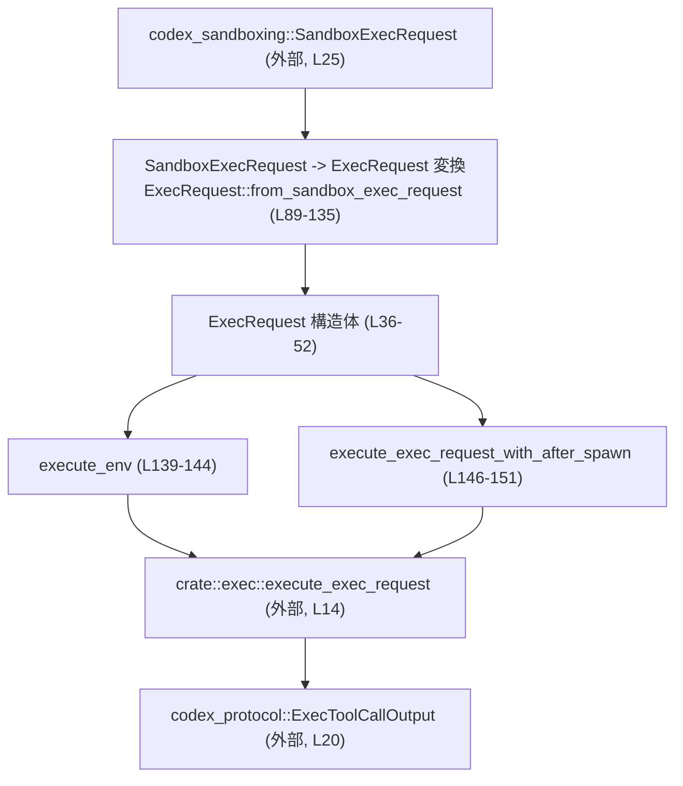
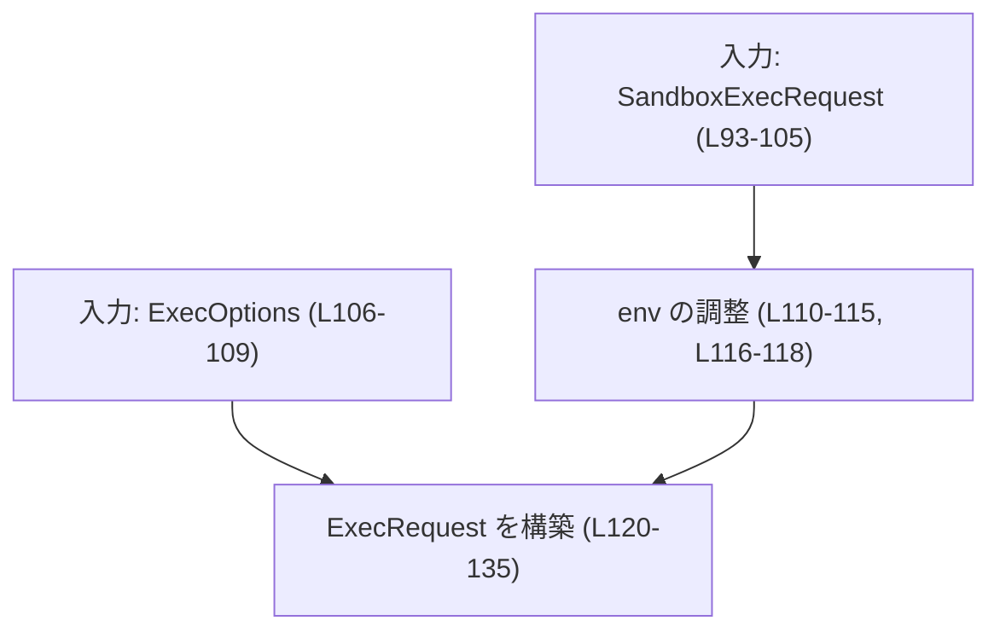
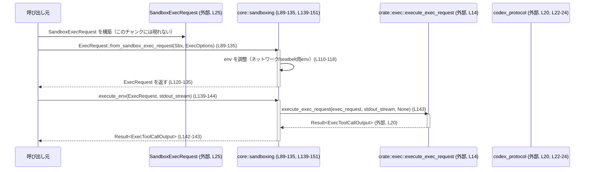

# core/src/sandboxing/mod.rs コード解説

## 0. ざっくり一言

`SandboxExecRequest`（sandbox 専用の実行要求）と exec 実行系との間をつなぐ **アダプタ層** で、  
sandbox 情報付きの `ExecRequest` を組み立てて非同期に実行するための公開 API を提供するモジュールです  
（core/src/sandboxing/mod.rs:L1-7, L36-52, L139-152）。

---

## 1. このモジュールの役割

### 1.1 概要

- 問題: sandbox ポリシーや OS 依存の設定を含む「実行要求」を、exec 実行基盤が扱える形に統一する必要があります。  
- 機能:
  - `SandboxExecRequest`（codex_sandboxing 側の型）から、exec 実行用の `ExecRequest` を生成する（core/src/sandboxing/mod.rs:L89-135）。
  - `ExecRequest` を受け取り、`execute_exec_request` を通じて非同期にコマンドを実行する API を提供する（同:L139-152）。

### 1.2 アーキテクチャ内での位置づけ

このモジュールは「sandbox ポリシー決定／変換」を担う `codex_sandboxing` と、実際にプロセスを起動する `crate::exec` の間に入るアダプタです（L1-7, L25-26, L14）。



### 1.3 設計上のポイント

- **純粋なデータコンテナとしての ExecRequest**  
  - フィールドはすべて所有型（`String`・`Vec<String>`・`HashMap` など）で、参照やライフタイムパラメータを持たないため、所有権まわりはシンプルです（L36-51）。
- **ポリシーと実行オプションの分離**  
  - `ExecOptions` が「期限／出力キャプチャ方式」をまとめ（L30-34）、sandbox ポリシーは `SandboxExecRequest` 側からそのまま引き継ぐ形になっています（L93-104, L106-109）。
- **環境変数による機能フラグ**  
  - ネットワーク制限や macOS seatbelt の有効化を **環境変数で子プロセスに伝える** 仕組みを持ちます（L110-115, L116-118）。
- **非同期・並行実行を前提とした API**  
  - 実行関数は `async fn` で、`after_spawn: Box<dyn FnOnce() + Send>` により、プロセス起動直後に一度だけ実行する「スレッドセーフなフック」を受け付けます（L146-151）。

### 1.4 コンポーネント一覧（インベントリー）

#### 型・関数インベントリー

| 名前 | 種別 | 公開範囲 | 行範囲 | 説明 |
|------|------|----------|--------|------|
| `ExecOptions` | 構造体 | `pub(crate)` | L30-34 | 期限 (`ExecExpiration`) とキャプチャポリシー (`ExecCapturePolicy`) をまとめた内部用オプション。 |
| `ExecRequest` | 構造体 | `pub` | L36-52 | exec 実行に必要なコマンド・環境・sandbox 情報をまとめた公開リクエスト型。 |
| `ExecRequest::new` | 関数（関連関数） | `pub` | L55-87 | 生のパラメータから `ExecRequest` を直接組み立てるコンストラクタ。 |
| `ExecRequest::from_sandbox_exec_request` | 関数（関連関数） | `pub(crate)` | L89-135 | `SandboxExecRequest` + `ExecOptions` から `ExecRequest` を生成し、環境変数を調整するアダプタ。 |
| `execute_env` | 関数（非同期） | `pub` | L139-144 | `ExecRequest` を実行し、`ExecToolCallOutput` を返す基本 API。 |
| `execute_exec_request_with_after_spawn` | 関数（非同期） | `pub` | L146-151 | 上記に、プロセス起動後に一度だけ実行するフック (`after_spawn`) を追加した API。 |

#### 外部依存インベントリー

| 依存先 | 種別 | 行範囲 | 用途 |
|--------|------|--------|------|
| `crate::exec::ExecCapturePolicy` | 型 | L10 | 出力キャプチャ方法を表す exec 側の設定。 |
| `crate::exec::ExecExpiration` | 型 | L11 | 実行要求の有効期限を表す設定。 |
| `crate::exec::StdoutStream` | 型 | L12 | 標準出力をストリーミングするためのハンドル。 |
| `crate::exec::WindowsSandboxFilesystemOverrides` | 型 | L13 | Windows sandbox のファイルシステム上書き設定。 |
| `crate::exec::execute_exec_request` | 関数 | L14 | 実際にプロセスを起動する非公開の実行関数。 |
| `crate::spawn::CODEX_SANDBOX_ENV_VAR` | 定数 | L15-16 | macOS seatbelt 対応のための環境変数名。 |
| `crate::spawn::CODEX_SANDBOX_NETWORK_DISABLED_ENV_VAR` | 定数 | L17 | ネットワーク無効化を示す環境変数名。 |
| `codex_network_proxy::NetworkProxy` | 型 | L18 | ネットワークプロキシ設定。 |
| `codex_protocol::config_types::WindowsSandboxLevel` | 型 | L19 | Windows sandbox のレベル指定。 |
| `codex_protocol::exec_output::ExecToolCallOutput` | 型 | L20 | 実行結果（ツール呼び出し結果）を表す型。 |
| `codex_protocol::models::SandboxPermissions` | 型（再エクスポート） | L21 | sandbox 権限を表すモデル。 |
| `codex_protocol::permissions::FileSystemSandboxPolicy` | 型 | L22 | ファイルシステム sandbox ポリシー。 |
| `codex_protocol::permissions::NetworkSandboxPolicy` | 型 | L23 | ネットワーク sandbox ポリシー。 |
| `codex_protocol::protocol::SandboxPolicy` | 型 | L24 | 全体的な sandbox ポリシー。 |
| `codex_sandboxing::SandboxExecRequest` | 型 | L25 | sandbox 化された exec 要求。 |
| `codex_sandboxing::SandboxType` | 列挙体 | L26 | 使用する sandbox 実装種別。 |
| `codex_utils_absolute_path::AbsolutePathBuf` | 型 | L27 | 絶対パスを表すパス型。 |
| `std::collections::HashMap` | 型 | L28 | 環境変数マップ `env` の実装。 |

---

## 2. 主要な機能一覧

- `ExecRequest` 構築（直接指定）: コマンド・環境・sandbox ポリシーを受け取り `ExecRequest` を生成する（`ExecRequest::new`、L55-87）。
- `SandboxExecRequest` からの変換: `SandboxExecRequest` と `ExecOptions` から `ExecRequest` を作り、環境変数を調整する（`from_sandbox_exec_request`、L89-135）。
- sandbox 実行の非同期実行: `ExecRequest` を exec 実行基盤に渡して非同期に実行する（`execute_env`、L139-144）。
- after_spawn フック付き実行: プロセス spawn 直後に一回だけ実行されるフックを受け取って実行する（`execute_exec_request_with_after_spawn`、L146-151）。
- sandbox 権限モデルの再エクスポート: `SandboxPermissions` をこのモジュール経由で公開する（L21）。

---

## 3. 公開 API と詳細解説

### 3.1 型一覧（構造体・列挙体など）

| 名前 | 種別 | 公開範囲 | 役割 / 用途 |
|------|------|----------|-------------|
| `ExecOptions` | 構造体 | `pub(crate)` | 実行期限 (`ExecExpiration`) と出力キャプチャポリシー (`ExecCapturePolicy`) のペアをまとめる内部用オプション（L30-34）。 |
| `ExecRequest` | 構造体 | `pub` | exec 実行に必要な全情報を保持するリクエスト型。sandbox 種別や Windows sandbox 設定、sandbox ポリシー類も含む（L36-52）。 |
| `SandboxPermissions` | 構造体/型（再エクスポート） | `pub` | sandbox 権限モデル。`pub use` により、`core::sandboxing::SandboxPermissions` として利用可能（L21）。 |

#### `ExecRequest` フィールド概略

根拠: core/src/sandboxing/mod.rs:L36-51

| フィールド名 | 型 | 説明 |
|-------------|----|------|
| `command` | `Vec<String>` | 実行するコマンドと引数（`command[0]` が実行ファイル、以降が引数であることが多いと推測されますが、コードからは保証していません）。 |
| `cwd` | `AbsolutePathBuf` | 実行時のカレントディレクトリ（絶対パス）。 |
| `env` | `HashMap<String, String>` | 子プロセスに渡す環境変数マップ。network/sandbox 設定に応じて本モジュールで一部キーが追加されます（L110-115, L116-118）。 |
| `network` | `Option<NetworkProxy>` | ネットワークプロキシ設定。`None` ならプロキシ未設定。 |
| `expiration` | `ExecExpiration` | 実行期限。いつまでこのリクエストが有効かを exec 側に伝える。 |
| `capture_policy` | `ExecCapturePolicy` | 標準出力／標準エラーなどのキャプチャ方法。 |
| `sandbox` | `SandboxType` | 使用する sandbox 実装種別（例: Windows sandbox, Mac seatbelt など。具体的バリアントはこのチャンクには出てきません）。 |
| `windows_sandbox_level` | `WindowsSandboxLevel` | Windows sandbox の強度レベル。 |
| `windows_sandbox_private_desktop` | `bool` | Windows sandbox をプライベートデスクトップ上で動かすかどうか。 |
| `sandbox_policy` | `SandboxPolicy` | 高レベルな sandbox ポリシー。 |
| `file_system_sandbox_policy` | `FileSystemSandboxPolicy` | ファイルシステムに対する sandbox ポリシー。 |
| `network_sandbox_policy` | `NetworkSandboxPolicy` | ネットワークアクセスに対する sandbox ポリシー。`is_enabled()` を通じて使用されます（L110）。 |
| `windows_sandbox_filesystem_overrides` | `Option<WindowsSandboxFilesystemOverrides>` | Windows sandbox 用のファイルシステム上書き設定。ここでは常に `None` で初期化されています（L50, L84, L133）。 |
| `arg0` | `Option<String>` | 実行時の `argv[0]` を上書きしたいときに使うと思われるフィールドですが、用途はコードからは断定できません（L51）。 |

> `ExecRequest` は参照フィールドを持たないため、ライフタイムパラメータが不要で、所有権モデルが単純です（L36-51）。

### 3.2 関数詳細（4 件）

#### `ExecRequest::new(...) -> ExecRequest`（L55-87）

**概要**

生のパラメータ列から `ExecRequest` を構築する公開コンストラクタです。  
Windows sandbox のファイルシステム上書きと `arg0` 以外は、引数で渡された値をそのままフィールドに格納します（L71-85）。

**引数**

根拠: core/src/sandboxing/mod.rs:L56-69

| 引数名 | 型 | 説明 |
|--------|----|------|
| `command` | `Vec<String>` | 実行するコマンド・引数列。 |
| `cwd` | `AbsolutePathBuf` | 実行時のカレントディレクトリ。 |
| `env` | `HashMap<String, String>` | 環境変数マップ。 |
| `network` | `Option<NetworkProxy>` | ネットワークプロキシ設定。 |
| `expiration` | `ExecExpiration` | 実行期限。 |
| `capture_policy` | `ExecCapturePolicy` | 出力キャプチャポリシー。 |
| `sandbox` | `SandboxType` | 使用する sandbox 種別。 |
| `windows_sandbox_level` | `WindowsSandboxLevel` | Windows sandbox レベル。 |
| `windows_sandbox_private_desktop` | `bool` | プライベートデスクトップを使うかどうか。 |
| `sandbox_policy` | `SandboxPolicy` | sandbox ポリシー。 |
| `file_system_sandbox_policy` | `FileSystemSandboxPolicy` | ファイルシステム sandbox ポリシー。 |
| `network_sandbox_policy` | `NetworkSandboxPolicy` | ネットワーク sandbox ポリシー。 |
| `arg0` | `Option<String>` | 任意の `argv[0]` 指定。 |

**戻り値**

- `ExecRequest`  
  渡されたパラメータをフィールドに設定した新しいインスタンスを返します（L71-85）。

**内部処理の流れ**

1. 引数をそのまま `Self { ... }` のフィールドに代入する（L71-83）。
2. `windows_sandbox_filesystem_overrides` はコンストラクタ内部で必ず `None` に設定される（L84）。
3. `arg0` は渡された `Option<String>` がそのまま格納される（L85）。

**Examples（使用例）**

`ExecRequest` を直接組み立てて、`execute_env` で実行する最小例です。

```rust
use std::collections::HashMap;
use codex_network_proxy::NetworkProxy;
use codex_sandboxing::SandboxType;
use codex_utils_absolute_path::AbsolutePathBuf;
use core::exec::{ExecCapturePolicy, ExecExpiration};
use core::sandboxing::{ExecRequest, execute_env};

async fn run_example() -> codex_protocol::error::Result<()> {
    // コマンドと引数
    let command = vec!["/usr/bin/echo".to_string(), "hello".to_string()];

    // カレントディレクトリ（仮のパス）
    let cwd = AbsolutePathBuf::from("/tmp".to_string()); // 実際の API はこのチャンクには現れません

    // 環境変数
    let mut env = HashMap::new();
    env.insert("LANG".to_string(), "C".to_string());

    // ネットワーク設定・期限・キャプチャポリシーなどは適切な値を設定する
    let network = None::<NetworkProxy>;
    let expiration = ExecExpiration::default();      // default 実装有無はこのチャンクには現れません
    let capture_policy = ExecCapturePolicy::default();

    // sandbox 関連のポリシーや種別は省略（ダミー値）
    let sandbox = SandboxType::None;                 // 実際のバリアント名はこのチャンクには現れません
    let windows_level = WindowsSandboxLevel::default();
    let windows_private_desktop = false;
    let sandbox_policy = SandboxPolicy::default();
    let fs_policy = FileSystemSandboxPolicy::default();
    let net_policy = NetworkSandboxPolicy::default();

    let req = ExecRequest::new(
        command,
        cwd,
        env,
        network,
        expiration,
        capture_policy,
        sandbox,
        windows_level,
        windows_private_desktop,
        sandbox_policy,
        fs_policy,
        net_policy,
        None, // arg0
    );

    let output = execute_env(req, None).await?;
    println!("{:?}", output);
    Ok(())
}
```

> 上記の `default()` 呼び出しや `SandboxType::None` バリアントは、**このチャンクには定義がない** ため、実際に存在するかどうかは不明です。例示目的の擬似コードです。

**Errors / Panics**

- 本コンストラクタ自身は `Result` を返さず、内部で panic を発生させるコードもありません（L55-87）。
- したがって、`ExecRequest::new` の呼び出し自体はエラーを返さないことがコードから読み取れます。
- ただし、引数に渡した値が他の処理（`execute_exec_request` など）でどのようなエラーを引き起こすかは、このチャンクからは分かりません。

**Edge cases（エッジケース）**

- `command` が空のベクタであっても、特別なチェックは行われていません（L56-71）。  
  → 後段の実行関数が空コマンドをどう扱うかは不明です。
- `env` に特定のキー（例: `CODEX_SANDBOX_NETWORK_DISABLED_ENV_VAR`）が入っていても、このコンストラクタでは何も変更しません（L56-71）。
- Windows 関連フィールドはプラットフォームによらず設定可能ですが、Windows 以外のプラットフォームでどう解釈されるかは他モジュールの実装次第です。

**使用上の注意点**

- `ExecRequest` はすべての値をそのまま保持するだけでバリデーションは行わないため、**有効なコマンド・パス・ポリシーであるかどうかのチェックは呼び出し側か実行側で行う前提**と思われます（L71-85）。
- `windows_sandbox_filesystem_overrides` を外部から設定する API はこのファイルにはなく、ここでは必ず `None` になります（L84）。上書きを行いたい場合は、別のモジュールやメソッドがないかを確認する必要があります。

---

#### `ExecRequest::from_sandbox_exec_request(request, options) -> ExecRequest`（L89-135）

**概要**

`SandboxExecRequest` と内部オプション `ExecOptions` を受け取り、実行基盤が扱う `ExecRequest` を組み立てます。  
この過程で、一部の sandbox ポリシーに応じて環境変数を追加します（L110-115, L116-118）。

**引数**

根拠: core/src/sandboxing/mod.rs:L89-92, L93-104, L106-109

| 引数名 | 型 | 説明 |
|--------|----|------|
| `request` | `SandboxExecRequest` | codex_sandboxing 側で構築された sandbox 付き実行要求。コマンド・環境・sandbox ポリシーなどを含む。 |
| `options` | `ExecOptions` | `expiration` と `capture_policy` をまとめた内部用オプション。 |

**戻り値**

- `ExecRequest`  
  `SandboxExecRequest` の内容と `ExecOptions` の内容を統合し、必要ならば環境変数を追加したものを返します（L120-135）。

**内部処理の流れ**

1. `SandboxExecRequest` をパターンマッチで分解し、ローカル変数として各フィールドを取り出す（L93-105）。
2. 同様に `ExecOptions` から `expiration` と `capture_policy` を取り出す（L106-109）。
3. `network_sandbox_policy.is_enabled()` をチェックし、**無効な場合（`false`）には** `env` にネットワーク無効化フラグの環境変数を追加する（L110-115）。
4. macOS ビルド時のみ、かつ `sandbox == SandboxType::MacosSeatbelt` の場合に、seatbelt 用の環境変数を設定する（L116-118）。
5. 取り出した値と調整済みの `env` を使い、`ExecRequest` を構築して返す。`windows_sandbox_filesystem_overrides` は `None` に固定（L120-135）。

**Mermaid フロー（from_sandbox_exec_request, L89-135）**



**Examples（使用例）**

`SandboxExecRequest` から `ExecRequest` を生成して実行する流れの擬似コードです。  
※ `SandboxExecRequest` のコンストラクタやフィールドはこのチャンクにはないため、概要のみの例です。

```rust
use core::sandboxing::{ExecRequest, execute_env};
use codex_sandboxing::SandboxExecRequest;
use crate::exec::{ExecCapturePolicy, ExecExpiration};

async fn run_sandboxed(req: SandboxExecRequest) -> codex_protocol::error::Result<()> {
    // 実行期限とキャプチャポリシーを決める
    let options = ExecOptions {
        expiration: ExecExpiration::default(),      // 実際の default 実装はこのチャンクには現れません
        capture_policy: ExecCapturePolicy::default(),
    };

    // SandboxExecRequest から ExecRequest を生成
    let exec_req = ExecRequest::from_sandbox_exec_request(req, options);

    // 実行
    let output = execute_env(exec_req, None).await?;
    println!("{:?}", output);
    Ok(())
}
```

**Errors / Panics**

- 本関数も `Result` を返さず、`panic!` を呼ぶようなコードはありません（L89-135）。
- `network_sandbox_policy.is_enabled()` がどのような条件でエラーを起こすかは分かりませんが、戻り値は bool であり、この関数内では例外的な扱いをしていません（L110）。

**Edge cases（エッジケース）**

- ネットワーク sandbox が **無効** (`is_enabled() == false`) の場合、  
  - `env.insert(CODEX_SANDBOX_NETWORK_DISABLED_ENV_VAR.to_string(), "1".to_string())` が呼ばれます（L110-114）。  
  - 既に同名の環境変数が存在した場合、`HashMap::insert` により上書きされます（この挙動は HashMap の仕様からの推論ですがコード上に直接のコメントはありません）。
- ネットワーク sandbox が **有効** の場合は、特別な環境変数は追加されません（L110-115）。
- macOS ビルドで、`sandbox == SandboxType::MacosSeatbelt` のときだけ seatbelt 用環境変数が追加され、それ以外の sandbox 種別では追加されません（L116-118）。
- Windows 以外の OS 上でも、`windows_sandbox_level` や `windows_sandbox_private_desktop` がそのまま `ExecRequest` に引き継がれますが、それが実際にどう使われるかはこのチャンクには現れません（L93-104, L120-129）。

**使用上の注意点**

- **セキュリティ観点**  
  - ネットワーク sandbox 無効時にセットされる環境変数は、**子プロセス側がこの値を尊重することが前提** のフラグです（L110-115）。  
    実際のネットワーク遮断が OS レベルで行われるのか、プロセス側の自己制御に依存するのかはこのコードからは分かりません。
  - macOS seatbelt 用の環境変数も同様に、別のコンポーネントがこのフラグを見て専用の sandbox 設定を有効にすることが前提です（L116-118）。
- `env` に同名のキーが既に存在する場合、上書きされる可能性があります。  
  重要な環境変数を意図せず上書きしないよう、もとの `SandboxExecRequest` をどのように構築しているかを確認する必要があります（L110-114）。
- この関数は crate 内部 (`pub(crate)`) に限定されており、外部クレートから直接呼び出すことはできません（L89-92）。

---

#### `execute_env(exec_request, stdout_stream) -> Result<ExecToolCallOutput>`（L139-144）

**概要**

`ExecRequest` を受け取り、標準出力ストリームのオプションと共に exec 実行基盤へ渡して非同期に実行する最もシンプルな公開 API です（L139-144）。  
「after_spawn フック」を指定しない点が、次の関数との違いです。

**引数**

根拠: core/src/sandboxing/mod.rs:L139-141

| 引数名 | 型 | 説明 |
|--------|----|------|
| `exec_request` | `ExecRequest` | 実行対象コマンドと sandbox 設定などを含むリクエスト。所有権はこの関数にムーブされます。 |
| `stdout_stream` | `Option<StdoutStream>` | 実行中の標準出力をストリーミングするためのハンドル。`None` の場合はストリーミングしないか、デフォルト方法で扱われると推測されますが、このチャンクでは未定義です。 |

**戻り値**

- `codex_protocol::error::Result<ExecToolCallOutput>`（L142）  
  - 成功時: `ExecToolCallOutput` – ツール実行結果（標準出力・終了コードなどを含む型だと推測されますが、定義はこのチャンクにはありません）。
  - 失敗時: error 型 – 正確な型は `error::Result` の定義に依存し、このファイルからは分かりません。

**内部処理の流れ**

1. `execute_exec_request(exec_request, stdout_stream, /*after_spawn*/ None)` を呼び出す（L143）。
2. 返された Future に `.await` し、その結果をそのまま呼び出し元に返す（L143）。

**安全性・並行性（Rust 言語固有の観点）**

- `exec_request` は所有型で受け取り、そのまま `execute_exec_request` にムーブするため、呼び出し側での二重利用はコンパイル時に防止されます（L139-143）。
- `async fn` なので、非同期ランタイム（Tokio など）の中から `await` する必要があります。  
  この関数自身は内部で `&mut` 参照などを保持しておらず、`await` 中に借用問題が起きることはありません（L139-144）。

**Edge cases（エッジケース）**

- `stdout_stream` が `None` でも特別な分岐は行っていません（L139-143）。  
  実際の挙動（ログが捨てられるのか、バッファリングされるのか）は `execute_exec_request` の実装に依存します。
- `exec_request` の中身（`command` が空、`cwd` が存在しないディレクトリなど）についてはここでチェックしていないため、後段でエラーになる可能性があります。

**使用上の注意点**

- 実際のエラー条件・リトライポリシーなどは `execute_exec_request` および `codex_protocol::error` の定義に依存し、このチャンクには現れません（L14, L142）。
- ブロッキング I/O を行うかどうかもこの関数からは判断できませんが、非同期 API であるため、呼び出し側は **必ず非同期ランタイム上で実行する必要があります**。

---

#### `execute_exec_request_with_after_spawn(exec_request, stdout_stream, after_spawn) -> Result<ExecToolCallOutput>`（L146-151）

**概要**

`execute_env` に似ていますが、プロセス spawn 直後に一度だけ実行される `after_spawn` フックを指定できる非同期関数です（L146-151）。  
`after_spawn` は `Send` 制約付きの `FnOnce` なので、スレッド間移動可能かつ一回だけ実行されるクロージャを渡します。

**引数**

根拠: core/src/sandboxing/mod.rs:L146-150

| 引数名 | 型 | 説明 |
|--------|----|------|
| `exec_request` | `ExecRequest` | 実行要求。所有権がムーブされます。 |
| `stdout_stream` | `Option<StdoutStream>` | 標準出力ストリームオプション。 |
| `after_spawn` | `Option<Box<dyn FnOnce() + Send>>` | プロセス起動直後に実行されるクロージャ。`Send` 制約により、spawn されたスレッド/タスクに安全にムーブできる関数だけが許容されます。 |

**戻り値**

- `codex_protocol::error::Result<ExecToolCallOutput>` – `execute_env` と同様です（L150-151）。

**内部処理の流れ**

1. `execute_exec_request(exec_request, stdout_stream, after_spawn)` を呼び出す（L151）。
2. `.await` して結果をそのまま返します（L151）。

**安全性・並行性（Rust 言語固有の観点）**

- `after_spawn` の型が `Box<dyn FnOnce() + Send>` であるため:
  - クロージャは **一度しか呼ばれない**（`FnOnce`）ので、所有権を消費する操作を安全に行えます。
  - `Send` 制約により、別スレッドにムーブして実行してもデータ競合を起こさない前提のクロージャのみが渡されます（L149）。
- 明示的なライフタイム境界（`'static` など）はここでは指定されていません。  
  trait オブジェクトのライフタイム詳細は型定義側に依存し、このチャンクからは厳密には判断できません。

**Edge cases（エッジケース）**

- `after_spawn` が `None` の場合、`execute_env` とほぼ同じ挙動になると推測されますが、実際にどう扱うかは `execute_exec_request` の実装次第です（L151）。
- `after_spawn` 内で panic が発生した場合の扱いは不明です（このチャンクにはエラーハンドリングが書かれていません）。  
  例外が exec 実行にどう影響するかを知るには、`execute_exec_request` の実装を確認する必要があります。

**使用上の注意点**

- `after_spawn` には、**非同期処理を含めるべきかどうか** はこのコードからは分かりません。  
  `FnOnce()` のシグネチャからは同期クロージャであるとしか読み取れないため、時間のかかる処理を入れるとプロセス起動後のフローをブロックする可能性があります。
- デバッグやメトリクスなど「短時間で終わる副作用」を入れる用途が想定されますが、詳細は実装や呼び出し元の設計に依存します。

---

### 3.3 その他の関数

このファイルには、上記以外の補助関数やラッパー関数は定義されていません（L1-152）。

---

## 4. データフロー

### 4.1 代表的シナリオ: SandboxExecRequest から実行まで

`SandboxExecRequest` が生成されてから、`ExecToolCallOutput` が得られるまでの代表的なフローは以下のようになります。



`execute_exec_request_with_after_spawn` を使う場合は、`execute_env` の部分が置き換わり、`after_spawn` が Exec 実行側に渡されるだけで、その他のフローは同様です（L146-151）。

---

## 5. 使い方（How to Use）

### 5.1 基本的な使用方法

`SandboxExecRequest` ベースのフローを想定した、高レベルの利用例です。  
実際の型コンストラクタはこのチャンクにはないため、疑似コードとして示します。

```rust
use core::sandboxing::{ExecRequest, execute_env};
use codex_sandboxing::SandboxExecRequest;
use crate::exec::{ExecCapturePolicy, ExecExpiration};

async fn run_sandboxed_command() -> codex_protocol::error::Result<()> {
    // 1. SandboxExecRequest をどこかで構築する（詳細は別モジュール）
    let sbx_req: SandboxExecRequest = /* ... */;

    // 2. 実行期限とキャプチャポリシーを指定
    let options = ExecOptions {
        expiration: ExecExpiration::default(),
        capture_policy: ExecCapturePolicy::default(),
    };

    // 3. SandboxExecRequest から ExecRequest を生成（環境変数が調整される）
    let exec_req = ExecRequest::from_sandbox_exec_request(sbx_req, options);

    // 4. ExecRequest を非同期に実行
    let output = execute_env(exec_req, None).await?;

    // 5. 結果を利用
    println!("{:?}", output);
    Ok(())
}
```

### 5.2 よくある使用パターン

1. **シンプル実行**

   - `ExecRequest::new` で直接構築し、`execute_env` を呼ぶ。
   - `after_spawn` が不要なケース（通常のツール実行など）に向いています。

2. **起動直後フック付き実行**

   - ログ出力やメトリクス計測など、プロセス起動直後に一度だけ実行したい処理がある場合に `execute_exec_request_with_after_spawn` を利用します。

   ```rust
   use core::sandboxing::{ExecRequest, execute_exec_request_with_after_spawn};

   async fn run_with_hook(exec_req: ExecRequest) -> codex_protocol::error::Result<()> {
       let after_spawn = Some(Box::new(|| {
           // ここに軽量な処理を書く（ログ、メトリクスなど）
           eprintln!("process spawned");
       }) as Box<dyn FnOnce() + Send>);

       let output = execute_exec_request_with_after_spawn(exec_req, None, after_spawn).await?;
       println!("{:?}", output);
       Ok(())
   }
   ```

### 5.3 よくある間違い（推測されるもの）

コードから推測される、起こりやすそうな誤用例とその対比です。

```rust
// 間違い例: ExecRequest を再利用しようとする
let exec_req = ExecRequest::new(/* ... */);
let out1 = execute_env(exec_req, None).await?;
// let out2 = execute_env(exec_req, None).await?; // コンパイルエラー: exec_req はムーブ済み

// 正しい例: ExecRequest は消費されるので、必要なら再構築する
let exec_req1 = ExecRequest::new(/* ... */);
let out1 = execute_env(exec_req1, None).await?;

let exec_req2 = ExecRequest::new(/* ... */);
let out2 = execute_env(exec_req2, None).await?;
```

```rust
// 間違い例: after_spawn で重い処理やブロッキングI/Oを行う
let after_spawn = Some(Box::new(|| {
    std::thread::sleep(std::time::Duration::from_secs(10)); // 起動直後に10秒ブロック
}) as Box<dyn FnOnce() + Send>);

// 正しい例（推奨されそうな形）: after_spawn には軽い処理のみを書く
let after_spawn = Some(Box::new(|| {
    eprintln!("process spawned"); // 軽量なログのみ
}) as Box<dyn FnOnce() + Send>);
```

> after_spawn 内で重い処理を行って良いかどうかは `execute_exec_request` の実装に依存し、このチャンクからは断定できませんが、`FnOnce()` シグネチャからは同期処理であるため、**ブロッキングになりうる** ことは意識する必要があります。

### 5.4 使用上の注意点（まとめ）

- **所有権・ライフタイム**
  - `ExecRequest` は完全所有型であり、`execute_*` 関数に渡すとムーブされて再利用できません（L139-143, L146-151）。
  - 参照やライフタイムパラメータを持たず、async 関数の中でライフタイム問題を起こしにくい設計です（L36-52）。
- **エラー処理**
  - 実行関数は `codex_protocol::error::Result` を返しますが、どのような状況で `Err` になるかはこのチャンクには現れません（L142, L150）。  
    呼び出し側では `?` 演算子や `match` を使ったエラー処理が必須です。
- **セキュリティ / sandbox**
  - ネットワーク sandbox 無効化や macOS seatbelt 有効化は環境変数を通じて子プロセスに伝達されます（L110-118）。  
    したがって、**実際の sandbox 強制は別コンポーネントに依存** しており、このモジュール単体ではセキュリティを完結させていません。
- **並行性**
  - `after_spawn: Box<dyn FnOnce() + Send>` により、別スレッドで実行される可能性のあるフックを安全に渡せます（L149）。  
    共有状態にアクセスする場合は、`Arc<Mutex<...>>` のような同期プリミティブを使うなど、`Send` に加えて追加のスレッド安全性確保が必要です。
- **テスト**
  - このファイル内にはテストコードは含まれておらず（L1-152）、挙動の詳細な検証状況はこのチャンクからは分かりません。

---

## 6. 変更の仕方（How to Modify）

### 6.1 新しい機能を追加する場合

例: 新しい sandbox 種別に応じて追加の環境変数をセットしたい場合。

1. `SandboxType` の新しいバリアントが `codex_sandboxing` 側に追加されていることを確認する（L26）。  
   ※ 具体的なバリアントはこのチャンクには現れません。
2. `ExecRequest::from_sandbox_exec_request` 内で、`sandbox` に応じた条件分岐を追加する（L93-104, L116-118）。
3. 必要な環境変数名を `crate::spawn` などから import するか、新たに定義する（L15-17）。
4. 追加した振る舞いに合わせて、関係するドキュメントや上位 API の説明を更新する。

### 6.2 既存の機能を変更する場合

- **ネットワーク sandbox の扱いを変更する場合**
  - `network_sandbox_policy.is_enabled()` のチェックとそれに伴う環境変数設定ロジックを確認し、必要に応じて `from_sandbox_exec_request` 内の `if` ブロックを変更する（L110-115）。
  - 呼び出し側（`SandboxExecRequest` を構築するコード）が前提としている挙動との整合性に注意する必要があります（このチャンクには呼び出し側は現れません）。
- **ExecRequest フィールドを追加・変更する場合**
  - 構造体宣言（L36-51）と `ExecRequest::new`（L56-85）、`from_sandbox_exec_request`（L93-135）の両方で同じフィールドセットを保つ必要があります。
  - `execute_exec_request` 側が新フィールドを使用するかどうかも別途確認が必要です（L14）。

---

## 7. 関連ファイル

このモジュールと密接に関係するコンポーネント（コードから読み取れる範囲）をまとめます。

| パス / モジュール | 役割 / 関係 |
|-------------------|------------|
| `crate::exec`（例: `core/src/exec/*.rs`） | `ExecCapturePolicy`, `ExecExpiration`, `StdoutStream`, `WindowsSandboxFilesystemOverrides`, `execute_exec_request` を提供する exec 実行基盤（L10-14, L50）。`execute_*` 関数の実際の挙動はここで定義されます。 |
| `crate::spawn` | `CODEX_SANDBOX_ENV_VAR`, `CODEX_SANDBOX_NETWORK_DISABLED_ENV_VAR` など、spawn 时に使う環境変数名の定義を持つモジュール（L15-17）。 |
| `codex_sandboxing` クレート | `SandboxExecRequest`, `SandboxType` を定義し、sandbox ポリシー決定とコマンド変換を担う外部クレート（L25-26）。本モジュールはここから実行要求を受け取ります。 |
| `codex_protocol` クレート | `WindowsSandboxLevel`, `ExecToolCallOutput`, `SandboxPermissions`, sandbox ポリシー型 (`SandboxPolicy`, `FileSystemSandboxPolicy`, `NetworkSandboxPolicy`) などを提供するプロトコル定義クレート（L19-24）。 |
| `codex_network_proxy` クレート | ネットワークプロキシ設定 `NetworkProxy` を提供（L18）。 |
| `codex_utils_absolute_path` クレート | 絶対パス型 `AbsolutePathBuf` を提供（L27）。 |

このチャンクの範囲では、これら関連ファイルの内部実装は示されておらず、詳細な挙動は不明です。
