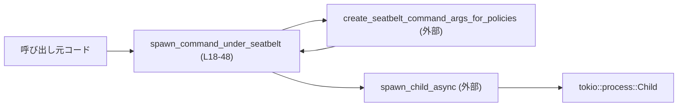
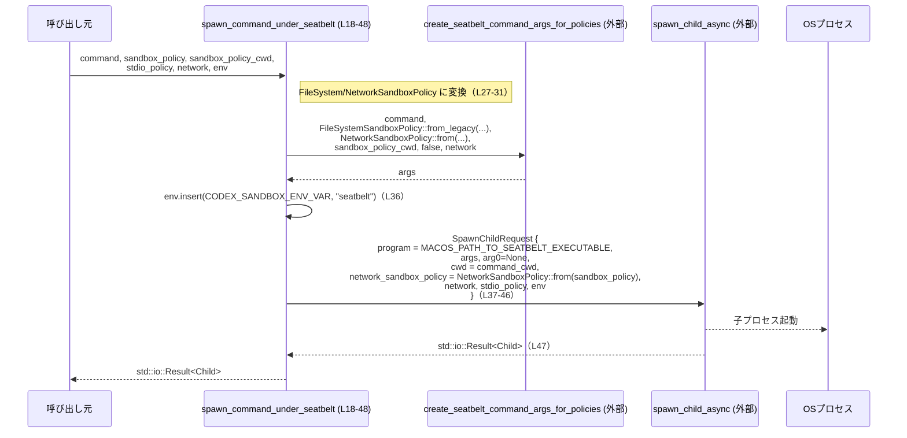

# core/src/seatbelt.rs

## 0. ざっくり一言

- macOS 上で、外部コマンドを Apple Seatbelt サンドボックスの下で起動するための **非同期ラッパ関数**を提供するモジュールです（`cfg(target_os = "macos")` により macOS 限定、`core/src/seatbelt.rs:L1-1`）。
- ファイルシステム／ネットワークのサンドボックスポリシーを組み合わせて Seatbelt 用のコマンド引数を作成し、その設定で子プロセスを起動します（`core/src/seatbelt.rs:L27-46`）。

---

## 1. このモジュールの役割

### 1.1 概要

- このモジュールは、**サンドボックス付きで外部コマンドを起動する問題**を解決するために存在し、macOS の Seatbelt 仕組みを利用してコマンドを起動する機能を提供します。
- 呼び出し元が指定したコマンド・カレントディレクトリ・サンドボックスポリシー・環境変数などを受け取り、Seatbelt 実行ファイルと適切な引数を構成した `SpawnChildRequest` を `spawn_child_async` に渡します（`core/src/seatbelt.rs:L18-46`）。
- 戻り値として、Tokio の `Child` ハンドル（非同期に操作可能な子プロセス）を `std::io::Result` で返します（`core/src/seatbelt.rs:L16, L26-26`）。

### 1.2 アーキテクチャ内での位置づけ

このモジュールは、以下のようなモジュール／型に依存しています。

- `crate::spawn::{spawn_child_async, SpawnChildRequest, StdioPolicy, CODEX_SANDBOX_ENV_VAR}`（`core/src/seatbelt.rs:L3-6, L37-45`）
- `codex_sandboxing::seatbelt::{MACOS_PATH_TO_SEATBELT_EXECUTABLE, create_seatbelt_command_args_for_policies}`（`core/src/seatbelt.rs:L11-12`）
- `codex_protocol::protocol::SandboxPolicy` とそこから導出される `FileSystemSandboxPolicy`, `NetworkSandboxPolicy`（`core/src/seatbelt.rs:L8-10, L27-32, L42-42`）
- `codex_network_proxy::NetworkProxy`（`core/src/seatbelt.rs:L7, L24-24`）
- 非同期プロセスハンドル `tokio::process::Child`（`core/src/seatbelt.rs:L16, L26-26`）

依存関係の概略は次のようになります。



### 1.3 設計上のポイント

- **プラットフォーム依存**  
  - クレートレベル属性 `#![cfg(target_os = "macos")]` により、このファイルは macOS ターゲットでのみコンパイルされます（`core/src/seatbelt.rs:L1-1`）。
- **ステートレスなユーティリティ**  
  - 構造体やグローバル状態を持たず、単一の `pub async fn` のみが定義されています（`core/src/seatbelt.rs:L18-48`）。
- **非同期 API**  
  - Tokio の `Child` を返す非同期関数として設計されており、外部プロセスの起動が非同期 I/O として扱われます（`core/src/seatbelt.rs:L16, L18, L26`）。
- **サンドボックスポリシーの分解**  
  - 呼び出し元から受け取る `SandboxPolicy` から、ファイルシステム用・ネットワーク用の専用ポリシー型に変換して利用しています（`core/src/seatbelt.rs:L27-31, L42-42`）。
- **エラーハンドリング方針**  
  - この関数自身は新たなエラー生成や `panic!` を行わず、`spawn_child_async` の戻り値 `std::io::Result<Child>` をそのまま呼び出し元に返します（`core/src/seatbelt.rs:L37-47`）。
- **環境変数によるサンドボックス種別の明示**  
  - 渡された `env` に `CODEX_SANDBOX_ENV_VAR="seatbelt"` を追加してから子プロセスを起動しており、サンドボックスの種類を子プロセス側に伝える仕組みになっています（`core/src/seatbelt.rs:L3, L36-36`）。

### 1.4 コンポーネント一覧（インベントリー）

| 名前 | 種別 | 公開? | 定義位置 | 概要 |
|------|------|-------|----------|------|
| `spawn_command_under_seatbelt` | 関数（非同期） | `pub` | `core/src/seatbelt.rs:L18-48` | Seatbelt サンドボックスの下で子プロセスを起動し、Tokio の `Child` を返す高レベルラッパ |

---

## 2. 主要な機能一覧

- `spawn_command_under_seatbelt`:  
  macOS Seatbelt を利用して、指定されたコマンドをファイルシステム／ネットワークサンドボックス付きで非同期に起動する関数です（`core/src/seatbelt.rs:L18-48`）。

---

## 3. 公開 API と詳細解説

### 3.1 型一覧（構造体・列挙体など）

このファイル内で **新しく定義されている型はありません**。  
ただし、公開 API のシグネチャに現れる重要な型を整理します（すべて他モジュールで定義、`core/src/seatbelt.rs:L3-16, L18-26`）:

| 名前 | 種別 | 定義場所（モジュール） | このファイルでの役割 |
|------|------|------------------------|----------------------|
| `SandboxPolicy` | 構造体/列挙体（詳細不明） | `codex_protocol::protocol` | 呼び出し元から渡される「レガシー」なサンドボックス定義。FS/ネットワーク用ポリシーに変換して使用。 |
| `FileSystemSandboxPolicy` | 構造体（詳細不明） | `codex_protocol::permissions` | `SandboxPolicy` から変換されるファイルシステム用ポリシー。Seatbelt 引数生成に使用。 |
| `NetworkSandboxPolicy` | 構造体（詳細不明） | `codex_protocol::permissions` | `SandboxPolicy` から変換されるネットワーク用ポリシー。Seatbelt 引数生成と `SpawnChildRequest` に使用。 |
| `NetworkProxy` | 構造体（詳細不明） | `codex_network_proxy` | ネットワークアクセスのプロキシ設定を表すと考えられますが、詳細はこのチャンクには現れません。 |
| `StdioPolicy` | 構造体/列挙体（詳細不明） | `crate::spawn` | 子プロセスの標準入出力の扱い（継承やパイプなど）を表すポリシー。 |
| `SpawnChildRequest` | 構造体（詳細不明） | `crate::spawn` | 子プロセス起動に必要な情報（プログラムパス、引数、env 等）をまとめるリクエスト。 |
| `Child` | 構造体 | `tokio::process` | 非同期に操作できる子プロセスハンドル。`wait` などのメソッドで終了待ちができます。 |

> 注: これらの型の内部構造やメソッドは、このチャンクには現れません。

### 3.2 関数詳細

#### `spawn_command_under_seatbelt(...) -> std::io::Result<Child>`

```rust
pub async fn spawn_command_under_seatbelt(
    command: Vec<String>,
    command_cwd: PathBuf,
    sandbox_policy: &SandboxPolicy,
    sandbox_policy_cwd: &Path,
    stdio_policy: StdioPolicy,
    network: Option<&NetworkProxy>,
    mut env: HashMap<String, String>,
) -> std::io::Result<Child> { /* ... */ }
```

（定義: `core/src/seatbelt.rs:L18-48`）

##### 概要

- macOS Seatbelt 用のラッパバイナリ (`MACOS_PATH_TO_SEATBELT_EXECUTABLE`) を起動し、その下で与えられた `command` を実行するための **非同期プロセス起動関数**です。
- 呼び出し元からの `SandboxPolicy` をファイルシステム／ネットワークの専用ポリシーに変換し、`create_seatbelt_command_args_for_policies` に渡して Seatbelt 用の引数を生成します（`core/src/seatbelt.rs:L27-32`）。
- 環境変数に `CODEX_SANDBOX_ENV_VAR=seatbelt` を追加したうえで、`spawn_child_async` に `SpawnChildRequest` を渡して子プロセスを起動し、その結果をそのまま返します（`core/src/seatbelt.rs:L35-47`）。

##### 引数

| 引数名 | 型 | 説明 |
|--------|----|------|
| `command` | `Vec<String>` | 実行したいコマンドとその引数のリスト。先頭要素がプログラム名（推測）ですが、このチャンクからは形式の詳細は分かりません。値渡しされ、`create_seatbelt_command_args_for_policies` にそのまま渡されます（`core/src/seatbelt.rs:L19, L27-27`）。 |
| `command_cwd` | `PathBuf` | 子プロセスのカレントディレクトリ。`SpawnChildRequest.cwd` に設定されます（`core/src/seatbelt.rs:L20, L41-41`）。 |
| `sandbox_policy` | `&SandboxPolicy` | レガシー形式のサンドボックスポリシー。ファイルシステム／ネットワーク用の専用ポリシーに変換して使われます（`core/src/seatbelt.rs:L21, L29-30, L42-42`）。 |
| `sandbox_policy_cwd` | `&Path` | サンドボックスポリシーの基準となるパス（多くの場合ルートディレクトリ相当と推測）。`FileSystemSandboxPolicy::from_legacy_sandbox_policy` と Seatbelt 引数生成に渡されます（`core/src/seatbelt.rs:L22, L29, L31`）。 |
| `stdio_policy` | `StdioPolicy` | 子プロセスの stdin/stdout/stderr の扱いを定義するポリシー。`SpawnChildRequest.stdio_policy` にそのまま渡されます（`core/src/seatbelt.rs:L23, L44-44`）。 |
| `network` | `Option<&NetworkProxy>` | ネットワークプロキシ／ネットワーク設定。`Some` の場合、Seatbelt 引数生成と `SpawnChildRequest` 両方に渡されます（`core/src/seatbelt.rs:L24, L33, L43`）。 |
| `env` | `HashMap<String, String>`（可変） | 子プロセスに渡す環境変数のマップ。関数内で `CODEX_SANDBOX_ENV_VAR="seatbelt"` が追加され、その後 `SpawnChildRequest.env` として渡されます（`core/src/seatbelt.rs:L25, L35-36, L45`）。 |

##### 戻り値

- 型: `std::io::Result<Child>`（`core/src/seatbelt.rs:L26-26`）
  - `Ok(Child)`  
    - 成功時は、起動した子プロセスを表す `tokio::process::Child` を返します。これを使って非同期にプロセスの終了待ちや標準入出力の操作を行えます。
  - `Err(std::io::Error)`  
    - 子プロセス起動時、または `spawn_child_async` 内部で I/O エラーが発生した場合などに返されます。具体的なエラー条件は `spawn_child_async` の実装に依存し、このチャンクからは分かりません。

##### 内部処理の流れ（アルゴリズム）

1. **Seatbelt 引数の構築**（`core/src/seatbelt.rs:L27-34`）
   - `create_seatbelt_command_args_for_policies` を呼び出し、Seatbelt 実行ファイルに渡す引数リスト `args` を生成します。
   - この際、`sandbox_policy` から:
     - `FileSystemSandboxPolicy::from_legacy_sandbox_policy(sandbox_policy, sandbox_policy_cwd)` によりファイルシステム用ポリシーを生成（`L29-29`）。
     - `NetworkSandboxPolicy::from(sandbox_policy)` によりネットワーク用ポリシーを生成（`L30-30`）。
   - `enforce_managed_network` 引数には `false` がハードコードされています（`L32-32`）。
2. **`arg0` の設定**（`core/src/seatbelt.rs:L35-35`）
   - `let arg0 = None;` として、明示的な `argv[0]` 差し替えは行わない設定になっています。
3. **環境変数の更新**（`core/src/seatbelt.rs:L36-36`）
   - `env.insert(CODEX_SANDBOX_ENV_VAR.to_string(), "seatbelt".to_string());` により、環境変数 `CODEX_SANDBOX_ENV_VAR`（名前は外部定数）に `"seatbelt"` をセットします。既存の同名キーがあれば上書きされます。
4. **`SpawnChildRequest` の構築**（`core/src/seatbelt.rs:L37-46`）
   - 以下のフィールドを持つ `SpawnChildRequest` を構築し、`spawn_child_async` に渡します。
     - `program`: `PathBuf::from(MACOS_PATH_TO_SEATBELT_EXECUTABLE)`（Seatbelt ラッパバイナリへのパス、`L38-38`）。
     - `args`: ステップ 1 で生成した `args`（`L39-39`）。
     - `arg0`: ステップ 2 の `arg0`（`L40-40`）。
     - `cwd`: 引数 `command_cwd`（`L41-41`）。
     - `network_sandbox_policy`: `NetworkSandboxPolicy::from(sandbox_policy)`（再度ネットワーク用ポリシーを生成、`L42-42`）。
     - `network`: 引数 `network`（`L43-43`）。
     - `stdio_policy`: 引数 `stdio_policy`（`L44-44`）。
     - `env`: 更新済みの `env`（`L45-45`）。
5. **子プロセスの起動と結果の返却**（`core/src/seatbelt.rs:L37-47`）
   - `spawn_child_async(...)` を `await` し、その `std::io::Result<Child>` をそのまま呼び出し元に返します（`L47-47`）。

##### Examples（使用例）

> 注意: ここで示すコードは、他モジュールの型・関数（例: `SandboxPolicy` の構築方法）を簡略化するために一部ダミー関数を使っています。パターン理解のための例であり、そのままではコンパイルできない場合があります。

**基本的な使い方（ネットワーク制限なし・標準 I/O 継承）**

```rust
use std::collections::HashMap;                          // env 用の HashMap
use std::path::{Path, PathBuf};                         // パス型
use tokio::process::Child;                              // 戻り値の型
use codex_protocol::protocol::SandboxPolicy;            // サンドボックスポリシー
use crate::spawn::StdioPolicy;                          // 標準 I/O ポリシー
use crate::seatbelt::spawn_command_under_seatbelt;      // 本関数

// 仮: SandboxPolicy をどこかで構築してくる関数                        // 実際にはプロジェクト固有の方法で作成する
fn build_sandbox_policy() -> SandboxPolicy {
    unimplemented!()
}

#[tokio::main]                                          // Tokio ランタイム上で実行
async fn main() -> std::io::Result<()> {
    let command = vec![
        "/usr/bin/env".to_string(),                     // 実行するプログラム
        "echo".to_string(),                             // 第1引数
        "hello from seatbelt".to_string(),              // 第2引数
    ];

    let command_cwd = PathBuf::from("/tmp");            // 子プロセスのカレントディレクトリ
    let sandbox_policy = build_sandbox_policy();        // サンドボックスポリシーを用意
    let sandbox_policy_cwd = Path::new("/");            // ポリシーのベースディレクトリ例
    let stdio_policy = StdioPolicy::Inherit;            // 標準 I/O を親プロセスから継承する例（仮）
    let network = None;                                 // ネットワークプロキシなし
    let env = HashMap::new();                           // 追加環境変数なしで開始（関数内で1つ追加される）

    let child: Child = spawn_command_under_seatbelt(
        command,
        command_cwd,
        &sandbox_policy,
        sandbox_policy_cwd,
        stdio_policy,
        network,
        env,
    ).await?;                                           // エラーならここで戻り、成功なら Child が得られる

    // 必要に応じて子プロセスの終了を待つ
    let status = child.await?;                          // 非同期にプロセス終了を待つ
    println!("exit status = {}", status);

    Ok(())
}
```

**ネットワークプロキシを指定する例**

```rust
use std::collections::HashMap;
use std::path::{Path, PathBuf};
use codex_protocol::protocol::SandboxPolicy;
use codex_network_proxy::NetworkProxy;                  // ネットワークプロキシ型
use crate::spawn::StdioPolicy;
use crate::seatbelt::spawn_command_under_seatbelt;

async fn run_with_proxy(
    command: Vec<String>,
    sandbox_policy: SandboxPolicy,
    proxy: &NetworkProxy,                               // 共有の NetworkProxy への参照
) -> std::io::Result<()> {
    let cwd = PathBuf::from("/tmp");
    let sandbox_cwd = Path::new("/");
    let stdio = StdioPolicy::Inherit;
    let env = HashMap::new();

    let child = spawn_command_under_seatbelt(
        command,
        cwd,
        &sandbox_policy,
        sandbox_cwd,
        stdio,
        Some(proxy),                                    // Some(&NetworkProxy) を渡す
        env,
    ).await?;

    let _status = child.await?;
    Ok(())
}
```

##### Errors / Panics

- **Errors**
  - この関数の戻り値は `std::io::Result<Child>` であり、内部の `spawn_child_async` から返された `Err(std::io::Error)` をそのまま返します（`core/src/seatbelt.rs:L26, L37-47`）。
  - この関数内で新たに `std::io::Error` を生成したり、`?` 演算子で他の I/O 操作をラップしたりはしていません（`L27-36`）。
  - どのような条件で `spawn_child_async` が `Err` を返すかは、このチャンクには現れません。

- **Panics**
  - この関数内には `panic!`・`unwrap`・`expect` などの明示的なパニック要因はありません（`core/src/seatbelt.rs:L18-48`）。
  - ただし、呼び出している外部関数（`create_seatbelt_command_args_for_policies`, `FileSystemSandboxPolicy::from_legacy_sandbox_policy`, `NetworkSandboxPolicy::from`, `spawn_child_async`）内部でのパニック可能性については、このチャンクからは分かりません。

##### Edge cases（エッジケース）

この関数自身は入力値に対するバリデーションを行っていません。そのため、以下のケースでは挙動が **外部関数の実装依存** になります。

- `command` が空のベクタ（`Vec::new()`）の場合（`core/src/seatbelt.rs:L19, L27`）
  - 本関数内では空チェックを行っていません。
  - Seatbelt 引数生成関数や子プロセス起動がどのように扱うかは不明です。
- `sandbox_policy` が極端に制限的／不正値を含む場合（`L21, L29-30, L42`）
  - 本関数内での検証はありません。
  - 実行時にコマンド起動失敗や早期終了などが起きる可能性がありますが、このチャンクからは詳細は分かりません。
- `sandbox_policy_cwd` が存在しないパス・権限のないパスを指す場合（`L22, L29, L31`）
  - そのような場合に起きるエラーや挙動は、外部ポリシー変換処理や Seatbelt 実行ファイルの実装に依存します。
- `env` にすでに `CODEX_SANDBOX_ENV_VAR` が設定されている場合（`L25, L36`）
  - `HashMap::insert` により既存値は上書きされます。元の値は失われます。

##### 使用上の注意点

- **非同期コンテキスト必須**
  - `async fn` であり、`.await` を伴うため、Tokio などの非同期ランタイム内で呼び出す必要があります（`core/src/seatbelt.rs:L16, L18, L47`）。
- **macOS 限定**
  - `#![cfg(target_os = "macos")]` により、他 OS ではこのモジュール自体がコンパイルされません（`L1-1`）。
  - クロスプラットフォームコードから利用する場合は、呼び出し側でも `cfg(target_os = "macos")` などでガードする必要があります。
- **環境変数の上書き**
  - この関数は `env` に `CODEX_SANDBOX_ENV_VAR="seatbelt"` を必ず設定します（`L3, L36`）。
  - 既存の同名キーがある場合は上書きされるので、呼び出し元が同じキーを他用途で使っている場合は注意が必要です。
- **所有権とライフタイム**
  - `command` と `env` は値で渡され、本関数内で消費されます（`L19, L25, L27, L36, L45`）。呼び出し後にこれらの変数を使うことはできません。
  - `sandbox_policy`・`sandbox_policy_cwd`・`network` は参照として渡されるため、この関数の実行中はそれらの参照元が有効である必要があります（Rust の借用規則に従います）。
- **ネットワーク制御のフラグ**
  - `enforce_managed_network` が `false` に固定されているため（`L32-32`）、Seatbelt 側で管理されたネットワーク制御がどの程度有効かは外部実装に依存します。この値を変えたい場合はコード変更が必要です。

### 3.3 その他の関数

- このファイルには `spawn_command_under_seatbelt` 以外の関数は定義されていません（`core/src/seatbelt.rs:L18-48`）。

---

## 4. データフロー

このセクションでは、`spawn_command_under_seatbelt` 呼び出し時のデータフローと処理の流れを示します。

1. 呼び出し元から `command`・各種ポリシー・環境変数 `env` などが渡されます。
2. 関数内で Seatbelt 用の引数 `args` を生成します。
3. `env` に `CODEX_SANDBOX_ENV_VAR="seatbelt"` を追加します。
4. `SpawnChildRequest` を構築して `spawn_child_async` に渡します。
5. `spawn_child_async` が OS の子プロセスを起動し、そのハンドルを `Child` として返します。

### シーケンス図



---

## 5. 使い方（How to Use）

### 5.1 基本的な使用方法

以下は、Seatbelt サンドボックス下でコマンドを 1 つ実行し、終了コードを確認する典型的なフローです。

```rust
use std::collections::HashMap;                          // env 用
use std::path::{Path, PathBuf};                         // パス型
use tokio::process::Child;                              // 戻り値の型
use codex_protocol::protocol::SandboxPolicy;            // サンドボックスポリシー
use crate::spawn::StdioPolicy;                          // 標準 I/O ポリシー
use crate::seatbelt::spawn_command_under_seatbelt;      // 本関数

// プロジェクト固有の方法で SandboxPolicy を構築する                       // 実装はこのチャンクには現れない
fn build_sandbox_policy() -> SandboxPolicy {
    unimplemented!()
}

#[tokio::main]                                          // Tokio ランタイムを起動
async fn main() -> std::io::Result<()> {
    // 実行したいコマンドと引数                                    // ["プログラム名", "引数1", "引数2", ...]
    let command = vec![
        "/usr/bin/env".to_string(),
        "echo".to_string(),
        "hello".to_string(),
    ];

    // 子プロセスのカレントディレクトリ                             // 例として /tmp
    let command_cwd = PathBuf::from("/tmp");

    // サンドボックスポリシーとその基準ディレクトリ                  // 実際の内容はプロジェクト依存
    let sandbox_policy = build_sandbox_policy();
    let sandbox_policy_cwd = Path::new("/");

    // 標準 I/O とネットワークの設定                                // 詳細なバリアントは crate::spawn 側の定義による
    let stdio_policy = StdioPolicy::Inherit;
    let network = None;                                 // ネットワークプロキシなし

    // 子プロセスに渡す環境変数                                   // 空でもかまわない
    let env = HashMap::<String, String>::new();

    // Seatbelt 下で子プロセスを起動
    let child: Child = spawn_command_under_seatbelt(
        command,
        command_cwd,
        &sandbox_policy,
        sandbox_policy_cwd,
        stdio_policy,
        network,
        env,
    ).await?;                                           // 起動失敗時は Err を返して終了

    // プロセス終了を待ち、終了ステータスを取得
    let status = child.await?;                          // 非同期に wait
    println!("child exited with status: {}", status);

    Ok(())
}
```

### 5.2 よくある使用パターン

1. **ネットワークをオフにしたサンドボックス実行**

   - `SandboxPolicy` 側でネットワーク禁止設定を行い、`network: None` を渡します。
   - これにより、Seatbelt のネットワークポリシーと Proxy なしの状態でプロセスが起動すると考えられます（詳細は `NetworkSandboxPolicy` 実装依存）。

2. **複数のコマンドを順番にサンドボックスで実行**

   - 同じ `sandbox_policy` と `sandbox_policy_cwd` を使い回し、コマンドとカレントディレクトリだけを変えながら `spawn_command_under_seatbelt` を複数回呼び出す形になります。
   - 各呼び出しごとに独立した `env` を渡すことで、子プロセス間の環境変数を分離できます。

3. **共通の `NetworkProxy` を共有しつつ複数プロセスを起動**

   - 1つの `NetworkProxy` インスタンスを作成し、`&NetworkProxy` を `Some(&proxy)` として複数回渡します。
   - この場合、`NetworkProxy` は複数の子プロセスに対して共有されますが、このファイル内ではスレッドセーフ性などについての情報はありません。

### 5.3 よくある間違い

```rust
// 間違い例: 非同期コンテキスト外で .await を使用しようとしている
// fn main() {
//     let result = spawn_command_under_seatbelt(/* ... */).await;
// }

// 正しい例: Tokio などのランタイム内で async main を使う
#[tokio::main]
async fn main() -> std::io::Result<()> {
    let result = spawn_command_under_seatbelt(/* 必要な引数 */).await?;
    Ok(())
}
```

```rust
// 間違い例: &SandboxPolicy のライフタイムが足りない
async fn run() -> std::io::Result<()> {
    let child = {
        let sandbox = build_sandbox_policy();          // ここで sandbox が作られる
        spawn_command_under_seatbelt(
            vec!["cmd".into()],
            PathBuf::from("."),
            &sandbox,                                  // &sandbox を渡す
            Path::new("."),
            stdio_policy,
            None,
            HashMap::new(),
        ).await?                                       // ← await の間も sandbox は必要
    };                                                 // sandbox はここでドロップされる

    Ok(())
}

// 上記は Rust のライフタイムルールによりコンパイルエラーになる              // &sandbox のライフタイムが足りないため

// 正しい例: sandbox を run 関数全体で有効なスコープに置く
async fn run() -> std::io::Result<()> {
    let sandbox = build_sandbox_policy();              // スコープを広く取る
    let child = spawn_command_under_seatbelt(
        vec!["cmd".into()],
        PathBuf::from("."),
        &sandbox,                                      // &sandbox は run が終わるまで有効
        Path::new("."),
        stdio_policy,
        None,
        HashMap::new(),
    ).await?;

    Ok(())
}
```

### 5.4 使用上の注意点（まとめ）

- 非同期ランタイム（Tokio など）の中でのみ `.await` 可能です。
- macOS 専用コードであり、他 OS から条件分岐なしに呼び出すことはできません。
- `command`・`env` は所有権が移動し、関数内で消費されます。
- `env` 内の `CODEX_SANDBOX_ENV_VAR` は必ず `"seatbelt"` に上書きされます。
- `SandboxPolicy` の具体的な内容によっては、コマンド起動自体が拒否されたり、実行中に権限エラーが発生する可能性がありますが、その挙動はこのファイルからは分かりません。

---

## 6. 変更の仕方（How to Modify）

### 6.1 新しい機能を追加する場合

例: Seatbelt の追加オプションを指定できるようにしたい場合

1. **引数の追加**
   - `spawn_command_under_seatbelt` のシグネチャに、新しいオプションを表す引数を追加します（例: `extra_seatbelt_flags: Vec<String>` など）。
   - 定義位置: `core/src/seatbelt.rs:L18-26` を変更します。

2. **Seatbelt 引数生成への受け渡し**
   - `create_seatbelt_command_args_for_policies` 呼び出し部分（`L27-34`）に新しい引数を渡せるよう、該当関数のシグネチャと呼び出し部分を調整します。
   - この関数の定義は別モジュールにあるため、その側の変更も必要です。

3. **`SpawnChildRequest` への反映**
   - 追加したオプションが実行ファイル側ではなく Seatbelt 側の引数に関わるだけなら、`args` の生成ロジックの変更のみで済みます。
   - 子プロセス側で読ませたい情報の場合は、`env` に追加の環境変数を挿入するなどの変更を検討できます（`L36-36`）。

### 6.2 既存の機能を変更する場合

- **`enforce_managed_network` の挙動を変えたい**
  - 現在は `false` に固定されています（`core/src/seatbelt.rs:L32-32`）。
  - これを呼び出し元から制御したい場合は、新しいブール引数を追加し、ここに渡すよう変更します。
  - 変更に際しては、`create_seatbelt_command_args_for_policies` 側の期待する意味と一致しているかを確認する必要があります。

- **ネットワークサンドボックスポリシーの渡し方を変えたい**
  - 現在、`NetworkSandboxPolicy::from(sandbox_policy)` が 2 回呼ばれています（Seatbelt 引数と `SpawnChildRequest` の両方で、`L30, L42`）。
  - ポリシー生成が高コストな場合は、一度変換した結果を変数に保持して両方に渡すようリファクタリングすることが可能です。

- **影響範囲の確認方法**
  - `spawn_command_under_seatbelt` は `pub` であるため、クレート内の検索（`rg "spawn_command_under_seatbelt"` など）で利用箇所を洗い出す必要があります。
  - シグネチャを変更した場合は、すべての呼び出し側コードを更新し、コンパイルエラーを解消することで影響範囲を確認できます。

- **契約（前提条件・返り値の意味）の確認**
  - `SandboxPolicy`・`FileSystemSandboxPolicy`・`NetworkSandboxPolicy`・`NetworkProxy` の意味や前提条件は、それぞれの定義モジュールのドキュメントとコードを参照する必要があります。
  - `spawn_child_async` が返す `io::Error` の意味も、そちらの実装を確認してから変更することが望ましいです。

---

## 7. 関連ファイル

このモジュールと密接に関係するモジュール／ファイルは、インポート文から次のように推測できます（ただし具体的なファイルパスはこのチャンクには現れません）。

| パス / モジュール | 役割 / 関係 |
|-------------------|------------|
| `crate::spawn` | `SpawnChildRequest`, `StdioPolicy`, `CODEX_SANDBOX_ENV_VAR`, `spawn_child_async` を提供。子プロセス起動の共通インターフェースになっていると考えられます（`core/src/seatbelt.rs:L3-6, L37-45`）。 |
| `codex_sandboxing::seatbelt` | `MACOS_PATH_TO_SEATBELT_EXECUTABLE` と `create_seatbelt_command_args_for_policies` を提供。Seatbelt 用ラッパ実行ファイルのパスと、その引数の生成ロジックを持つモジュールです（`core/src/seatbelt.rs:L11-12`）。 |
| `codex_protocol::permissions` | `FileSystemSandboxPolicy`, `NetworkSandboxPolicy` を提供。プロトコルレベルのサンドボックス設定を具体的なポリシー型に変換する役割を担っていると考えられます（`core/src/seatbelt.rs:L8-9, L29-30, L42`）。 |
| `codex_protocol::protocol` | 高レベルな `SandboxPolicy` 型を定義するモジュール。呼び出し側で利用されるポリシーの入力形式です（`core/src/seatbelt.rs:L10-10, L21`）。 |
| `codex_network_proxy` | `NetworkProxy` 型を提供。ネットワークアクセスを仲介／制御するための設定を表していると推測されます（`core/src/seatbelt.rs:L7, L24, L33, L43`）。 |
| `tokio::process` | 非同期子プロセスハンドル `Child` を提供。`spawn_command_under_seatbelt` の戻り値として利用されます（`core/src/seatbelt.rs:L16, L26`）。 |

このファイル単体では、テストコードや追加のユーティリティは定義されていません。テストが存在する場合は、別ファイル（例: `core/tests/seatbelt_tests.rs` など）で定義されている可能性がありますが、このチャンクからは特定できません。
