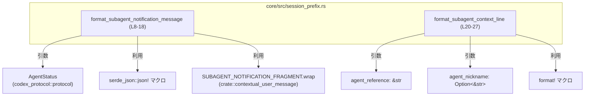
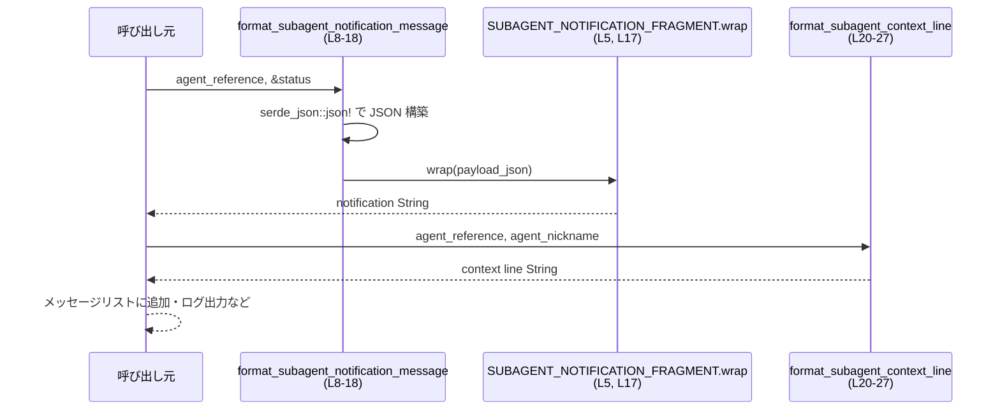

# core/src/session_prefix.rs コード解説

## 0. ざっくり一言

ユーザー向けの「通常の発話」ではなく、**サブエージェントの状態を示すメタ情報を文字列として整形するヘルパ関数をまとめたモジュール**です（core/src/session_prefix.rs:L3-4, L8-27）。

---

## 1. このモジュールの役割

### 1.1 概要

- モデルから見えるセッション状態（サブエージェントのステータスや説明行）を、一定のフォーマットで文字列に整形する役割を持ちます（core/src/session_prefix.rs:L3-4）。
- JSON 文字列にラップされた通知メッセージと、Markdown風の 1 行テキストを生成します（core/src/session_prefix.rs:L8-18, L20-27）。

### 1.2 アーキテクチャ内での位置づけ

- 入力:
  - `agent_reference: &str` … サブエージェントを一意に指す識別子（core/src/session_prefix.rs:L9, L21）。
  - `status: &AgentStatus` … 外部モジュール `codex_protocol::protocol` で定義される状態情報（core/src/session_prefix.rs:L1, L10）。
  - `agent_nickname: Option<&str>` … 表示用のニックネーム（core/src/session_prefix.rs:L22）。
- 依存関係:
  - `codex_protocol::protocol::AgentStatus` … サブエージェントの状態型（定義はこのチャンクには現れません）。
  - `crate::contextual_user_message::SUBAGENT_NOTIFICATION_FRAGMENT` … JSON 文字列を包むためのフラグメント（core/src/session_prefix.rs:L5, L17）。
  - `serde_json::json!` マクロで JSON オブジェクトを構築します（core/src/session_prefix.rs:L12-15）。

依存関係を簡略図にすると次のようになります。



### 1.3 設計上のポイント

- **純粋関数・ステートレス**
  - グローバルな可変状態を一切持たず、入力から新しい `String` を生成して返すだけです（core/src/session_prefix.rs:L8-18, L20-27）。
- **構造化情報→文字列への変換**
  - `AgentStatus` や `agent_reference` といった構造化情報を、下位レイヤー（LLM など）に渡しやすい文字列形式に変換します（core/src/session_prefix.rs:L12-15, L25-26）。
- **共通プリフィックスのカプセル化**
  - 通知メッセージには `SUBAGENT_NOTIFICATION_FRAGMENT.wrap` を通すことで、プレフィックスや特殊マーカーの付与を一箇所に集約しています（core/src/session_prefix.rs:L5, L17）。
- **エラーハンドリング**
  - どちらの関数も `Result` ではなく `String` を直接返しており、JSON シリアライズやフォーマットでの失敗をアプリケーションレベルのエラーとしては扱いません（core/src/session_prefix.rs:L8-18, L20-27）。
- **並行性**
  - 引数はすべて参照かコピー可能な値であり、内部で共有可変状態を持たないため、複数スレッドから同時に呼び出してもデータ競合は発生しません。

---

## 2. 主要な機能一覧（コンポーネントインベントリー）

### 2.1 本ファイル内で定義されるコンポーネント

| 名前 | 種別 | 役割 / 用途 | 定義位置 |
|------|------|-------------|----------|
| `format_subagent_notification_message` | 関数 | サブエージェントの状態を JSON 文字列にシリアライズし、通知用フラグメントでラップする | core/src/session_prefix.rs:L8-18 |
| `format_subagent_context_line` | 関数 | サブエージェントの識別子と任意ニックネームから、Markdown風の 1 行テキストを生成する | core/src/session_prefix.rs:L20-27 |

### 2.2 このファイルから利用している外部コンポーネント

| 名前 | 種別 | このファイルでの役割 | このファイル上の出現箇所 |
|------|------|----------------------|---------------------------|
| `AgentStatus` | 列挙体または構造体（推定） | サブエージェントの状態を表す型。通知メッセージの JSON に埋め込まれる | インポート: core/src/session_prefix.rs:L1, 引数: L10, JSON 内: L14 |
| `SUBAGENT_NOTIFICATION_FRAGMENT` | 定数または静的値（型不明） | `wrap` メソッドを通じて JSON 文字列をラップし、モデルに渡すメタ情報のフォーマットを統一する | インポート: core/src/session_prefix.rs:L5, 利用: L17 |
| `serde_json::json!` | マクロ | `agent_reference` と `status` を持つ JSON オブジェクトを構築する | core/src/session_prefix.rs:L12-15 |
| `format!` | マクロ | コンテキスト行 `"- {agent_reference}: {agent_nickname}"` 等を生成する | core/src/session_prefix.rs:L25-26 |

※ `AgentStatus` や `SUBAGENT_NOTIFICATION_FRAGMENT` の定義そのものは、このチャンクには含まれません。

---

## 3. 公開 API と詳細解説

### 3.1 型一覧（構造体・列挙体など）

このファイル内で新たに定義される構造体・列挙体はありません（core/src/session_prefix.rs:L1-28）。

### 3.2 関数詳細

#### `format_subagent_notification_message(agent_reference: &str, status: &AgentStatus) -> String`

**概要**

- サブエージェントの識別子と状態を含む JSON オブジェクトを生成し、それを `SUBAGENT_NOTIFICATION_FRAGMENT` でラップした文字列を返します（core/src/session_prefix.rs:L8-18）。
- モデルにとって認識しやすい「通知用メタメッセージ」を作るためのヘルパ関数です（core/src/session_prefix.rs:L3-4, L12-17）。

**引数**

| 引数名 | 型 | 説明 |
|--------|----|------|
| `agent_reference` | `&str` | サブエージェントの識別子。JSON フィールド `"agent_path"` として埋め込まれます（core/src/session_prefix.rs:L9, L13）。 |
| `status` | `&AgentStatus` | サブエージェントの状態。JSON フィールド `"status"` としてシリアライズされます（core/src/session_prefix.rs:L10, L14）。 |

※ `AgentStatus` が `serde::Serialize` を実装している前提で `serde_json::json!` に渡しています（core/src/session_prefix.rs:L12-15）。

**戻り値**

- `String`  
  `SUBAGENT_NOTIFICATION_FRAGMENT.wrap` によってラップされた JSON 文字列です（core/src/session_prefix.rs:L12-17）。
  - JSON 部分には最低限 `"agent_path"` と `"status"` フィールドが含まれます（core/src/session_prefix.rs:L12-15）。
  - ラップ方法（プレフィックス／サフィックスや囲い文字など）は `wrap` 実装に依存し、このチャンクからは詳細不明です（core/src/session_prefix.rs:L5, L17）。

**内部処理の流れ（アルゴリズム）**

1. `serde_json::json!` で次のようなオブジェクトを構築します（core/src/session_prefix.rs:L12-15）。
   - `"agent_path": agent_reference`
   - `"status": status`
2. 生成した JSON 値を `.to_string()` で `String` にシリアライズし、`payload_json` に格納します（core/src/session_prefix.rs:L12-16）。
3. `SUBAGENT_NOTIFICATION_FRAGMENT.wrap(payload_json)` を呼び出し、その戻り値（`String`）をそのまま返します（core/src/session_prefix.rs:L17）。

**Examples（使用例）**

> 実際の `AgentStatus` や `SUBAGENT_NOTIFICATION_FRAGMENT` の定義は省略し、呼び出しイメージのみを示します。

```rust
use codex_protocol::protocol::AgentStatus;
use crate::session_prefix::format_subagent_notification_message;

fn notify_subagent_started(agent_ref: &str, status: &AgentStatus) {
    // サブエージェントの開始を表す通知メッセージを生成する
    let msg = format_subagent_notification_message(agent_ref, status); // JSON をラップした String（core/src/session_prefix.rs:L8-18）

    // 生成した msg をユーザー role のメッセージとしてコンテキストに追加する、などの用途が想定されます
    // （具体的な利用箇所はこのチャンクには現れません）
}
```

**Errors / Panics**

- 戻り値は `String` であり、明示的なエラー型（`Result`）は返しません（core/src/session_prefix.rs:L8-18）。
- `serde_json::json!` と `.to_string()` は、型が正しく `Serialize` を実装している限り、通常の利用で panic しない前提で用いられています（core/src/session_prefix.rs:L12-16）。
  - メモリ不足などのランタイムレベルの例外的状況は、一般的な Rust プログラムと同様に考慮範囲外です。

**Edge cases（エッジケース）**

- `agent_reference` が空文字列の場合  
  → `"agent_path": ""` のような JSON が生成されます。特別な分岐はありません（core/src/session_prefix.rs:L12-15）。
- `status` がどのような JSON 表現になるか  
  → `AgentStatus` のシリアライズ実装に依存し、このチャンクだけからは不明です（core/src/session_prefix.rs:L1, L10, L14）。
- `agent_reference` に改行や制御文字が含まれる場合  
  → `serde_json` が JSON 文字列として適切にエスケープします。これにより JSON 構造が壊れることはありません（core/src/session_prefix.rs:L12-15）。

**使用上の注意点**

- **フォーマットの互換性**
  - 呼び出し側が `"agent_path"` や `"status"` というフィールド名、あるいは `wrap` 後の全体フォーマットに依存してパースしている可能性があります。変更する場合は利用箇所への影響調査が必要です。
- **並行性**
  - グローバルな可変状態にアクセスせず、引数とローカル変数だけで完結するため、複数スレッドからの同時呼び出しは安全と考えられます（core/src/session_prefix.rs:L8-18）。
- **性能**
  - 呼び出しごとに JSON オブジェクトの生成と `String` へのシリアライズが行われるため、非常に高頻度に呼び出す処理のホットパスではコストになる可能性があります。

---

#### `format_subagent_context_line(agent_reference: &str, agent_nickname: Option<&str>) -> String`

**概要**

- サブエージェントの識別子と任意のニックネームを、Markdown の箇条書き風の 1 行テキストに整形します（core/src/session_prefix.rs:L20-27）。
- ニックネームが空文字列または `None` の場合は、識別子だけを表示します。

**引数**

| 引数名 | 型 | 説明 |
|--------|----|------|
| `agent_reference` | `&str` | サブエージェントの識別子。常に出力行に含まれます（core/src/session_prefix.rs:L21, L25-26）。 |
| `agent_nickname` | `Option<&str>` | 表示用のニックネーム。`Some` かつ非空文字列のときだけ表示されます（core/src/session_prefix.rs:L22, L24-25）。 |

**戻り値**

- `String`  
  - ニックネームあり（非空）の場合: `"- {agent_reference}: {agent_nickname}"`（core/src/session_prefix.rs:L25）。
  - ニックネームなし／空の場合: `"- {agent_reference}"`（core/src/session_prefix.rs:L26）。

**内部処理の流れ（アルゴリズム）**

1. `agent_nickname.filter(|nickname| !nickname.is_empty())` を呼び出します（core/src/session_prefix.rs:L24）。
   - `Some("")` の場合は `None` に変換されます。
   - `None` はそのまま `None` です。
2. `match` で `Some` / `None` を分岐します（core/src/session_prefix.rs:L24-27）。
   - `Some(agent_nickname)` の場合:
     - `format!("- {agent_reference}: {agent_nickname}")` を実行します（core/src/session_prefix.rs:L25）。
   - `None` の場合:
     - `format!("- {agent_reference}")` を実行します（core/src/session_prefix.rs:L26）。
3. 生成された `String` をそのまま返します（core/src/session_prefix.rs:L23-27）。

**Examples（使用例）**

```rust
use crate::session_prefix::format_subagent_context_line;

fn build_context_lines() {
    let line_with_nick =
        format_subagent_context_line("agents/planner", Some("プランナー")); // "- agents/planner: プランナー"

    let line_without_nick =
        format_subagent_context_line("agents/worker", None);              // "- agents/worker"

    let line_empty_nick =
        format_subagent_context_line("agents/logger", Some(""));          // "- agents/logger"（空文字は無視される）
}
```

**Errors / Panics**

- `String` を直接返し、エラー型は利用していません（core/src/session_prefix.rs:L20-27）。
- `format!` のフォーマット文字列は固定のリテラルであり、プレースホルダと引数の個数も一致しているため、フォーマットに起因する panic は想定されません（core/src/session_prefix.rs:L25-26）。

**Edge cases（エッジケース）**

- `agent_nickname` が `None` の場合  
  → `"- {agent_reference}"` の形式で、ニックネーム部分は出力されません（core/src/session_prefix.rs:L24, L26）。
- `agent_nickname` が `Some("")`（空文字）の場合  
  → `filter` により `None` 扱いとなり、`"- {agent_reference}"` のみが出力されます（core/src/session_prefix.rs:L24, L26）。
- `agent_nickname` が空白のみ `"   "` の場合  
  → `is_empty()` は `false` なので `Some("   ")` として扱われ、そのまま出力されます（core/src/session_prefix.rs:L24-25）。
- `agent_reference` に改行が含まれる場合  
  → 改行もそのまま含まれた `String` が生成されます。1 行の想定で使う場合は事前整形が必要です（core/src/session_prefix.rs:L25-26）。

**使用上の注意点**

- **ニックネームの扱い**
  - 空文字のニックネームは「ニックネーム無し」と同じ扱いになります。空文字を特別な意味で使いたい場合は別の表現（例: `None`）を検討する必要があります（core/src/session_prefix.rs:L24）。
- **フォーマット依存**
  - 先頭に `"- "` が付き、`": "` 区切りでニックネームが続く固定フォーマットであるため、呼び出し側がパースしている場合は変更の影響に注意が必要です（core/src/session_prefix.rs:L25-26）。
- **並行性**
  - 内部で共有可変状態を持たないため、複数スレッドで共有しても安全です（core/src/session_prefix.rs:L20-27）。

### 3.3 その他の関数

- このファイルに定義されている関数は上記 2 つのみです（core/src/session_prefix.rs:L8-18, L20-27）。

---

## 4. データフロー

このモジュールの典型的な利用シナリオを、サブエージェントの状態更新時を例に説明します。

1. 呼び出し元コンポーネントが `agent_reference` と `AgentStatus` を決定します。
2. `format_subagent_notification_message` で、状態更新通知用のマーカー付き JSON 文字列を生成します（core/src/session_prefix.rs:L8-18）。
3. 必要に応じて `format_subagent_context_line` で、UI やコンテキスト表示用の 1 行テキストを生成します（core/src/session_prefix.rs:L20-27）。
4. これらの文字列が、その後のメッセージ配列やログなどに組み込まれます（組み込み先はこのチャンクには現れません）。



---

## 5. 使い方（How to Use）

### 5.1 基本的な使用方法

サブエージェントの状態遷移時に、通知メッセージとコンテキスト行を生成する例です。

```rust
use codex_protocol::protocol::AgentStatus;
use crate::session_prefix::{
    format_subagent_notification_message,
    format_subagent_context_line,
};

fn on_subagent_status_changed(agent_ref: &str, status: &AgentStatus) {
    // 1. モデル向けの通知メッセージ（JSON + フラグメント）を生成する
    let notification = format_subagent_notification_message(agent_ref, status);
    // 例: "<SUBAGENT_NOTIFY>{\"agent_path\":\"agents/planner\",\"status\":\"Running\"}</SUBAGENT_NOTIFY>"
    // ※実際のラップ形式は SUBAGENT_NOTIFICATION_FRAGMENT.wrap に依存（core/src/session_prefix.rs:L5, L17）

    // 2. 人向け / ログ向けのコンテキスト行を生成する
    let context_line = format_subagent_context_line(agent_ref, Some("プランナー"));
    // 例: "- agents/planner: プランナー"（core/src/session_prefix.rs:L20-27）

    // 3. これらの文字列を会話履歴やログに追加する等の処理を行う
}
```

### 5.2 よくある使用パターン

1. **ニックネーム無しでのコンテキスト出力**

```rust
let line = format_subagent_context_line("agents/worker", None);
// 出力: "- agents/worker"（core/src/session_prefix.rs:L24, L26）
```

1. **空文字ニックネームを渡した場合**

```rust
let line = format_subagent_context_line("agents/logger", Some(""));
// 出力: "- agents/logger"（空文字は filter で無視される）（core/src/session_prefix.rs:L24, L26）
```

1. **状態に応じた通知の作成**

```rust
fn notify_finished(agent_ref: &str, status: &AgentStatus) {
    // 終了ステータスを含む JSON 通知を作成
    let msg = format_subagent_notification_message(agent_ref, status); // core/src/session_prefix.rs:L8-18
    // 生成した msg をそのままメッセージキューやコンテキストに入れる想定
}
```

### 5.3 よくある間違い

```rust
// 誤りの例: 空文字ニックネームを表示させたい
let line = format_subagent_context_line("agents/ui", Some(""));
// 想定: "- agents/ui: " と表示される
// 実際: "- agents/ui" （空文字は filter で None と同等扱い）（core/src/session_prefix.rs:L24-26）
```

```rust
// 正しい例: 空白を含むニックネームを渡す
let line = format_subagent_context_line("agents/ui", Some(" "));
// 出力: "- agents/ui:  "（空白は is_empty() ではないので表示される）（core/src/session_prefix.rs:L24-25）
```

### 5.4 使用上の注意点（まとめ）

- どちらの関数も、**フォーマット文字列が固定** であり、呼び出し側が文字列をパースしている場合に変更の影響が大きくなります。
- 文字列生成のみで副作用はありませんが、**JSON 生成や `String` の確保はコストを持つ** ため、大量ループで頻繁に呼び出す場合は必要に応じてキャッシュを検討できます。
- ログや UI に表示する前提であれば、`agent_reference` や `agent_nickname` に制御文字などが含まれないよう、事前にバリデーションすることが望ましいです。

---

## 6. 変更の仕方（How to Modify）

### 6.1 新しい機能を追加する場合

- **通知 JSON にフィールドを追加したい場合**
  1. `format_subagent_notification_message` 内の `serde_json::json!` 呼び出しに新フィールドを追加します（core/src/session_prefix.rs:L12-15）。
  2. そのフィールドに必要な値を関数引数として追加します（core/src/session_prefix.rs:L8-11）。
  3. 呼び出し元すべてで新しい引数を渡すように修正します。

- **別種のコンテキスト行フォーマットを追加したい場合**
  - 新しいフォーマットごとに別関数を追加し、本関数（`format_subagent_context_line`）は既存フォーマットを維持する形にすると、後方互換性を保ちやすくなります（core/src/session_prefix.rs:L20-27）。

### 6.2 既存の機能を変更する場合

- **JSON フォーマットの変更**
  - `"agent_path"` や `"status"` というキー名を変える際は、これらをパースしている全箇所を合わせて変更する必要があります（core/src/session_prefix.rs:L12-15）。
- **`wrap` の呼び出しを変更したい場合**
  - ラップ方法を変えたい場合は、可能であれば `SUBAGENT_NOTIFICATION_FRAGMENT` 側の実装で吸収すると、呼び出しシグネチャを変えずに済みます（core/src/session_prefix.rs:L5, L17）。
- **コンテキスト行フォーマットの変更**
  - 先頭の `"- "` や `": "` の有無・位置を変えると、ログ解析ツールや UI 側での期待とずれる可能性があるため、変更前に依存箇所を確認する必要があります（core/src/session_prefix.rs:L25-26）。

---

## 7. 関連ファイル

| パス / モジュール | 役割 / 関係 |
|-------------------|------------|
| `crate::contextual_user_message` | `SUBAGENT_NOTIFICATION_FRAGMENT` を提供するモジュール。`wrap` メソッドで JSON 文字列をラップします（このチャンクには実装は現れませんが、インポートと利用が確認できます: core/src/session_prefix.rs:L5, L17）。 |
| `codex_protocol::protocol` | `AgentStatus` 型を提供する外部クレート／モジュール。サブエージェントの状態を表し、本ファイルでは JSON 化されて通知に含まれます（core/src/session_prefix.rs:L1, L10, L14）。 |

**テスト**

- このファイル内にはテストモジュールやテスト関数は定義されていません（core/src/session_prefix.rs:L1-28）。  
  テストを追加する場合は、これらの関数が返す文字列の「完全一致」を検証する形が分かりやすいと考えられます。
