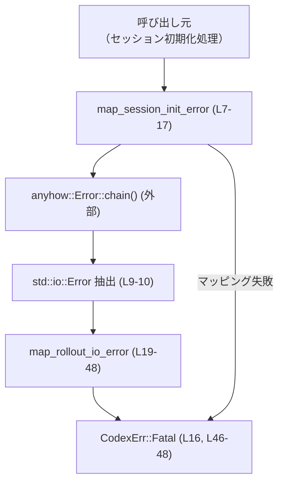
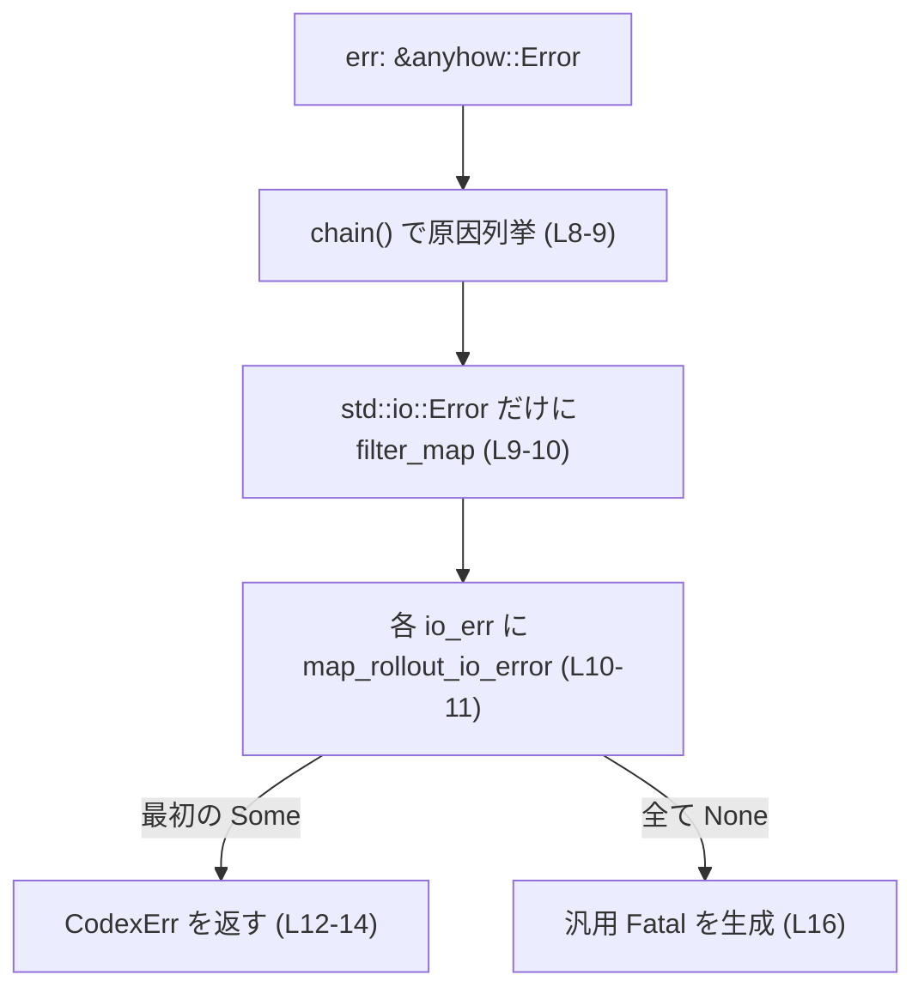
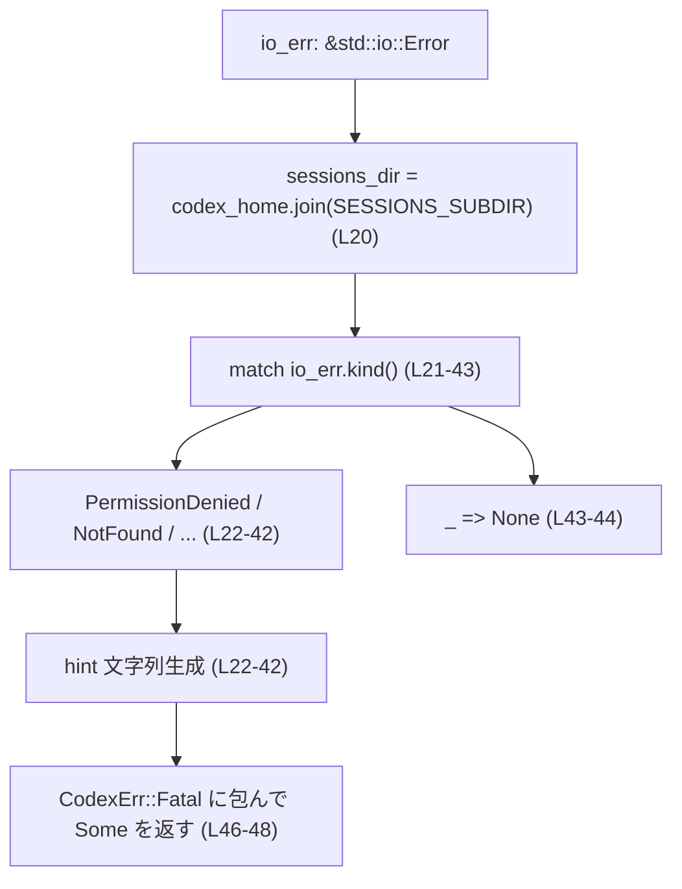

# core/src/session_rollout_init_error.rs コード解説

## 0. ざっくり一言

セッション初期化時に発生した `anyhow::Error` を調べ、`std::io::Error` に起因するものを判別して、ユーザー向けの説明を含んだ `CodexErr`（致命エラー）にマッピングするモジュールです（core/src/session_rollout_init_error.rs:L7-17, L19-48）。

---

## 1. このモジュールの役割

### 1.1 概要

- このモジュールは **セッション初期化に失敗したときのエラー内容を解析し、分かりやすいメッセージ付きの致命エラーに変換する** ために存在します。
- 具体的には `anyhow::Error` から `std::io::Error` を抽出し、`ErrorKind` ごとに、セッションディレクトリ（`codex_home` + `SESSIONS_SUBDIR`）に関するヒント付きメッセージを組み立てます（L7-11, L19-44）。

### 1.2 アーキテクチャ内での位置づけ

このファイルは、セッションの「ロールアウト」（作成・初期化）処理のうち、**エラー変換層**に相当します。

- 入力: 上位処理から渡される `anyhow::Error` と `codex_home: &Path`（L7-8）
- 内部:
  - `anyhow::Error::chain()` で原因チェーンを走査（L8-11）
  - `std::io::Error` だけを抽出し、`map_rollout_io_error` で `CodexErr` に変換（L10-11, L19-48）
- 出力: `CodexErr::Fatal` 型のエラー（L16, L46-48）



### 1.3 設計上のポイント（コードから読み取れる範囲）

- **責務の分離**
  - 公開エントリポイント相当: `map_session_init_error` が `anyhow::Error` 全体を扱う（L7-17）。
  - 詳細な `std::io::Error` → `CodexErr` マッピングは `map_rollout_io_error` に切り出し（L19-48）。
- **エラーの段階的マッピング**
  - `anyhow::Error` の原因チェーン全体を `chain()` で走査し（L8-11）、その中に含まれる `std::io::Error` だけを対象にする設計です（L9-11）。
- **安全性**
  - `unsafe` ブロックは使用されていません（このチャンク全体に存在しません）。
  - 共有可変状態はなく、引数のみを読み取り、ローカル変数だけを生成しています（L7-17, L19-48）。
- **エラーハンドリング方針**
  - マッチ可能な I/O エラー種別のみユーザーフレンドリなメッセージを出し、それ以外は汎用的な「Failed to initialize session」メッセージにフォールバックします（L21-44, L16）。
- **並行性**
  - グローバル状態へのアクセスやロックはなく、関数は引数に対して純粋に計算を行うだけです（L7-17, L19-48）。
  - このコードだけを見る限り、同時に複数スレッドから呼び出しても競合は発生しない構造になっています。

---

## 2. 主要な機能一覧

- セッション初期化エラー全体を `CodexErr` にマッピングする（`map_session_init_error`）
- `std::io::Error` とセッションディレクトリパスから、具体的なヒント付き `CodexErr` を構築する（`map_rollout_io_error`）

### 2.1 コンポーネントインベントリー

| 名前 | 種別 | 公開範囲 | 役割 / 用途 | 定義位置 |
|------|------|----------|------------|----------|
| `map_session_init_error` | 関数 | `pub(crate)` | `anyhow::Error` からセッションロールアウト関連の I/O エラーを見つけ、`CodexErr` に変換するエントリポイント | `core/src/session_rollout_init_error.rs:L7-17` |
| `map_rollout_io_error` | 関数 | `fn`（モジュール内プライベート） | `std::io::Error` と `codex_home` から、エラー種別ごとにヒント付き `CodexErr::Fatal` を構成する | `core/src/session_rollout_init_error.rs:L19-48` |
| `SESSIONS_SUBDIR` | 定数（他モジュール） | 不明 | セッション用サブディレクトリ名を表す定数と推測されますが、このチャンクには定義が現れません | 利用: `L20` |
| `CodexErr` | エラー型（他クレート） | 不明 | Codex 全体のエラー表現。ここでは `Fatal` という関連コンストラクタ/バリアントが使われています | 利用: `L5, L16, L46-48` |

※ `SESSIONS_SUBDIR` と `CodexErr` の具体的な定義場所や中身は、このチャンクには現れません。

---

## 3. 公開 API と詳細解説

### 3.1 型一覧（構造体・列挙体など）

このファイル内で新たに定義される構造体・列挙体・型エイリアスはありません（L1-49）。

### 3.2 関数詳細

#### `map_session_init_error(err: &anyhow::Error, codex_home: &Path) -> CodexErr`

**概要**

- セッション初期化処理から渡された `anyhow::Error` を解析し、その原因チェーンに含まれる `std::io::Error` を `map_rollout_io_error` で `CodexErr` にマッピングします（L7-11）。
- 対応可能な I/O エラーが見つからない場合は、元のエラー内容を含む汎用的な `CodexErr::Fatal` を返します（L16）。

**引数**

| 引数名 | 型 | 説明 | 根拠 |
|--------|----|------|------|
| `err` | `&anyhow::Error` | セッション初期化で発生したエラー。`anyhow` によるラップを想定し、内部の原因チェーンを走査します。 | シグネチャ参照: L7 |
| `codex_home` | `&Path` | Codex のホームディレクトリパス。セッション保存用サブディレクトリパスの計算に使われます（最終的には `map_rollout_io_error` に渡される）。 | シグネチャ: L7, 呼び出し: L11 |

**戻り値**

- `CodexErr`: Codex 用のエラー型で、ここでは常に致命エラー（`CodexErr::Fatal`）として構築されています（L16, L46-48）。

**内部処理の流れ（アルゴリズム）**

1. `err.chain()` を呼び出し、`anyhow::Error` の原因チェーン（自分自身と source の列）をイテレートします（L8-9）。
2. 各要素（`cause`）に対して `downcast_ref::<std::io::Error>()` を試み、`std::io::Error` にダウンキャスト可能なものだけを残します（L9-10）。
3. 残った `std::io::Error` それぞれについて `map_rollout_io_error(io_err, codex_home)` を呼び、最初に `Some(CodexErr)` を返したものを `find_map` で取得します（L10-11）。
4. 該当する `CodexErr` が見つかった場合は、それをそのまま返します（L12-14）。
5. 1〜4 で何もヒットしなかった場合は、`format!("Failed to initialize session: {err:#}")` で元エラーの詳細（`{:#}` で pretty-print）を含んだメッセージを作り、`CodexErr::Fatal` に包んで返します（L16）。



**Examples（使用例）**

簡易的な利用例です。このコードは、セッション初期化処理で得られた `anyhow::Error` を `CodexErr` に変換するイメージを示します。

```rust
use std::path::Path;
use std::io;
use anyhow::{anyhow, Context};
use codex_protocol::error::CodexErr;

fn init_session(codex_home: &Path) -> Result<(), anyhow::Error> {
    // ダミー: セッションディレクトリ作成で I/O エラーが出たとする
    std::fs::create_dir_all(codex_home.join("sessions"))
        .context("failed to create sessions directory")?;
    Ok(())
}

fn run(codex_home: &Path) -> CodexErr {
    match init_session(codex_home) {
        Ok(()) => {
            // 実際のコードでは成功パスに進む想定
            CodexErr::Fatal("unexpected".into()) // ダミー
        }
        Err(e) => {
            // ここで今回の関数を使って CodexErr に変換する
            map_session_init_error(&e, codex_home)
        }
    }
}
```

**Errors / Panics**

- 本関数自体は `Result` を返さず、常に `CodexErr` を返します。
- コード上、`panic!` や `unwrap` などは使用されていません（L7-17）。
- 文字列フォーマットや `anyhow::Error::chain()` がパニックを起こすケースは通常ありません。

**Edge cases（エッジケース）**

- `err` に `std::io::Error` が含まれない場合  
  → `map_rollout_io_error` は一度も `Some` を返さず、汎用的な `"Failed to initialize session: …"` メッセージが使われます（L8-16）。
- `err` に複数の `std::io::Error` が含まれる場合  
  → `find_map` により、**チェーン中で最初にマッピング可能なもの** だけが使われ、それ以外は無視されます（L10-12）。
- `err` が `std::io::Error` 単体の場合  
  → `chain()` により最初の要素としてその `std::io::Error` が現れ、`filter_map` + `find_map` 経由で `map_rollout_io_error` に渡されます（L8-11）。
- `codex_home` が存在しないパスであっても  
  → この関数はファイルシステム操作を行わず、`Path::display()` で文字列化するだけなので、そのままメッセージに出力されます（間接的に L11, L19-21）。

**使用上の注意点（安全性・エラー・並行性）**

- **安全性（Rust の観点）**
  - 共有可変状態や `unsafe` を持たないため、関数自体はデータ競合を起こしにくい構造です（L7-17）。
- **エラー契約**
  - 戻り値は必ず `CodexErr::Fatal` であり、「リカバリ可能な軽微なエラー」を表現する用途には向いていません（L16, L46-48）。
  - I/O 以外のエラー（例えばパースエラーなど）は、すべて同じ汎用メッセージにまとめられます（L8-16）。
- **並行性**
  - グローバル変数に依存せず、入出力も行わないため、複数スレッド・非同期タスクから同時に呼び出しても、関数内部で競合は発生しません（L7-17）。
- **セキュリティ**
  - メッセージに `err` の詳細を `"{err:#}"` で埋め込むため、エラーの原因に含まれるファイルパスなどが、そのままユーザに見える可能性があります（L16）。  
    この `CodexErr` がどこまで外部に露出するかは、このチャンクには現れません。

---

#### `map_rollout_io_error(io_err: &std::io::Error, codex_home: &Path) -> Option<CodexErr>`

**概要**

- `std::io::Error` の `ErrorKind` と `codex_home` から、セッションディレクトリに関するヒント付きの `CodexErr::Fatal` を生成します（L19-44, L46-48）。
- 対応していない `ErrorKind` の場合は `None` を返し、呼び出し元に「ここではマッピングしない」という意思を伝えます（L43-44）。

**引数**

| 引数名 | 型 | 説明 | 根拠 |
|--------|----|------|------|
| `io_err` | `&std::io::Error` | セッション初期化時に発生した I/O エラー。`kind()` で種別を確認し、メッセージ生成の材料にします。 | シグネチャ: L19, 利用: L21 |
| `codex_home` | `&Path` | Codex ホームディレクトリ。`join(SESSIONS_SUBDIR)` でセッションディレクトリパスを計算します。 | シグネチャ: L19, 利用: L20 |

**戻り値**

- `Option<CodexErr>`:
  - 対応するエラー種別であれば `Some(CodexErr::Fatal(...))`（L21-42, L46-48）。
  - 想定外の `ErrorKind` の場合は `None`（L43-44）。

**内部処理の流れ**

1. `codex_home.join(SESSIONS_SUBDIR)` でセッションディレクトリパス `sessions_dir` を構成します（L20）。
2. `io_err.kind()` に対して `match` 式を行い、主な `ErrorKind` ごとにユーザ向けヒント文字列 `hint` を構成します（L21-42）。
   - `PermissionDenied` → 所有権の修正（`chown`）を促すメッセージ（L22-26）。
   - `NotFound` → ディレクトリが無いので作成またはホーム変更を促す（L27-30）。
   - `AlreadyExists` → ファイルがディレクトリパスを塞いでいることを説明（L31-34）。
   - `InvalidData` / `InvalidInput` → セッションデータが壊れている可能性と、ディレクトリ削除の提案（L35-38）。
   - `IsADirectory` / `NotADirectory` → パスの種別が想定外であることを指摘（L39-42）。
   - その他 → `None` を返してマッピングを行わない（L43-44）。
3. 一つでも上記のケースに該当すれば、その `hint` に `"(underlying error: {io_err})"` を付けた文字列を `format!` で作成し、`CodexErr::Fatal` でラップして `Some` として返します（L46-48）。



**Examples（使用例）**

`map_rollout_io_error` を単体でテスト／利用するイメージです。

```rust
use std::path::Path;
use std::io;

fn example(codex_home: &Path) -> Option<CodexErr> {
    // PermissionDenied エラーを仮に生成する（実際には OS 依存）
    let io_err = io::Error::new(io::ErrorKind::PermissionDenied, "permission denied by OS");

    // セッション用 I/O エラーとしてマッピングを試みる
    map_rollout_io_error(&io_err, codex_home)
}
```

**Errors / Panics**

- `Result` ではなく `Option` を返すため、本関数自体はエラーではなく「マッピングできるかどうか」の判定に徹しています。
- `panic!` を明示的に呼ぶコードはありません（L19-48）。
- パスの文字列表現は `Path::display()` を用いるため、UTF-8 でなくてもパニックにはなりません（L24-25, L29, L33, L37, L41）。

**Edge cases（エッジケース）**

- `io_err.kind()` が `Interrupted` や `WouldBlock` など、`match` で列挙されていない場合  
  → `_ => return None` により、マッピングされずに `None` が返ります（L43-44）。
- `codex_home` がルートディレクトリなどの場合  
  → `sessions_dir` は `SESSIONS_SUBDIR` との連結結果であり、その値自体はこの関数内では検証されません（L20）。
- `SESSIONS_SUBDIR` の中身が空文字や不正なパスであった場合  
  → そのまま `join` の結果として使われますが、ここでは文字列化するだけで、I/O 操作は行われません（L20-21）。  
    `SESSIONS_SUBDIR` の定義はこのチャンクには現れません。

**使用上の注意点（安全性・エラー・並行性・セキュリティ）**

- **契約（Contract）**
  - 戻り値 `None` は「この `io_err` はセッションロールアウトの I/O 問題としては扱わない」ことを意味します。呼び出し側は `None` を受け取った場合に別の処理（汎用エラーなど）にフォールバックする前提です（L43-44）。
- **安全性**
  - ローカル変数と引数のみを扱い、副作用はエラーオブジェクト生成だけです（L19-48）。
- **並行性**
  - ファイルシステムへのアクセスはなく、どのスレッドから呼び出しても共有状態への影響はありません（L19-48）。
- **セキュリティ**
  - メッセージに `sessions_dir.display()` および `codex_home.display()`、さらに `io_err` の文字列表現（OS 由来の詳細を含む可能性あり）が含まれるため（L22-26, L46-48）、  
    もしこのメッセージが外部ユーザにそのまま見える場合、環境依存のパス・エラー内容が露出します。

### 3.3 その他の関数

- このファイルには上記 2 関数のみが定義されています（L7-17, L19-48）。

---

## 4. データフロー

代表的なシナリオ: セッション初期化処理が I/O エラーで失敗し、そのエラーをユーザー向けの `CodexErr` に変換する流れです。

```mermaid
sequenceDiagram
    participant C as 呼び出し元
    participant M as map_session_init_error (L7-17)
    participant A as anyhow::Error::chain (外部)
    participant R as map_rollout_io_error (L19-48)
    participant E as CodexErr::Fatal

    C->>M: err: &anyhow::Error, codex_home
    M->>A: chain() で原因列挙
    loop 各 cause
        A-->>M: cause
        M->>M: downcast_ref::<io::Error>()
        alt io::Error の場合
            M->>R: map_rollout_io_error(io_err, codex_home)
            alt Some(CodexErr)
                R-->>M: Some(CodexErr::Fatal)
                M-->>C: CodexErr::Fatal（詳細メッセージ付き）
                break
            else None
                R-->>M: None
            end
        else それ以外
            M->>M: 無視
        end
    end
    alt 一度もマッピングされない
        M->>E: Fatal("Failed to initialize session: {err:#}")
        E-->>C: CodexErr::Fatal（汎用メッセージ）
    end
```

要点:

- `map_session_init_error` (L7-17) は、`anyhow::Error` の原因チェーンから **最初にマッピング可能な I/O エラーだけ** を拾います（L8-12）。
- 実際の I/O は一切行わず、メッセージ構築専用の層になっています（L19-48）。

---

## 5. 使い方（How to Use）

### 5.1 基本的な使用方法

典型的なフローは「セッション初期化関数 → `Result` で失敗 → `anyhow::Error` を `CodexErr` に変換」です。

```rust
use std::path::Path;
use anyhow::Context;
use codex_protocol::error::CodexErr;

fn initialize_session_storage(codex_home: &Path) -> Result<(), anyhow::Error> {
    // ここではセッションディレクトリの作成などを行う想定
    // 実際には SESSIONS_SUBDIR を用いた処理が他所にあると考えられます（このチャンクには現れません）
    std::fs::create_dir_all(codex_home.join("sessions"))
        .context("failed to prepare session storage")?;
    Ok(())
}

fn run_session_setup(codex_home: &Path) -> CodexErr {
    match initialize_session_storage(codex_home) {
        Ok(()) => {
            // 成功時の処理（この例では省略）
            CodexErr::Fatal("unexpected".into()) // ダミー
        }
        Err(err) => {
            // ここで変換
            map_session_init_error(&err, codex_home)
        }
    }
}
```

### 5.2 よくある使用パターン

- **セッションストレージの初期化ラッパーで一括変換**
  - セッション関連の I/O を行う関数群では、下位からは `anyhow::Error` を返し、最上位でだけ `map_session_init_error` によって `CodexErr` に変換するという構成が適しています（L7-17）。
- **テスト時に `map_rollout_io_error` を直接呼ぶ**
  - 特定の `ErrorKind` がどのようなメッセージになるか確認したいとき、人工的に `std::io::Error` を作り、この関数を直接呼び出すことができます（L19-42）。

### 5.3 よくある間違い（予想されるもの）

このファイルだけから推測できる範囲での誤用例です。

```rust
// 誤りの可能性: map_rollout_io_error を単独で使い、None だった場合のフォールバックを忘れる
fn bad_use(io_err: std::io::Error, codex_home: &Path) -> CodexErr {
    // None の場合にどうするかを考慮していない
    map_rollout_io_error(&io_err, codex_home).unwrap() // ← パニックの原因になりうる
}

// 正しい扱いの一例: None の場合は汎用エラーにフォールバックする
fn good_use(io_err: std::io::Error, codex_home: &Path) -> CodexErr {
    if let Some(mapped) = map_rollout_io_error(&io_err, codex_home) {
        mapped
    } else {
        CodexErr::Fatal(format!("Session I/O failed: {io_err}"))
    }
}
```

### 5.4 使用上の注意点（まとめ）

- **Contracts / Edge Cases**
  - `map_session_init_error` は「セッション初期化に関する I/O 問題」を想定したメッセージのみ特別扱いし、それ以外は汎用的な Fatal として扱います（L8-16, L19-44）。
  - `map_rollout_io_error` が `None` を返しうることを前提に、呼び出し元でフォールバック処理を持つ必要があります（L43-44）。
- **安全性**
  - 両関数とも副作用は `CodexErr` インスタンスの生成のみであり、メモリ安全性に影響する操作（`unsafe`、生ポインタ）はありません（L7-17, L19-48）。
- **並行性**
  - グローバル状態を持たず、I/O を行わないため、同期コード・非同期コードどちらからでも問題なく呼び出せる構造です。
- **Bugs / Security の観点**
  - エラーメッセージに `codex_home` やセッションディレクトリパス、`io_err` の詳細を含めるため（L22-26, L27-41, L46-48）、  
    これをそのまま外部ユーザへ表示する場合は、環境依存情報の露出に注意が必要です。
  - このファイルからは、`CodexErr::Fatal` がどのようにログ出力・UI 表示されるかは分かりません（このチャンクには現れません）。

---

## 6. 変更の仕方（How to Modify）

### 6.1 新しい機能を追加する場合

例: 新たな `ErrorKind` に対して専用のメッセージを追加したい場合。

1. `map_rollout_io_error` の `match io_err.kind()` に新しい分岐を追加します（L21-42）。

   ```rust
   ErrorKind::Interrupted => format!(
       "Session I/O at {} was interrupted. Please retry the operation.",
       sessions_dir.display()
   ),
   ```

2. 追加した分岐で `hint` を返すだけで、末尾の `Some(CodexErr::Fatal(...))` 作成ロジック（L46-48）はそのまま再利用されます。
3. `map_session_init_error` 側には変更は不要で、原因チェーンから新しい `ErrorKind` も自動的にカバーされます（L8-12）。

### 6.2 既存の機能を変更する場合

- **メッセージ文言の変更**
  - 各 `ErrorKind` ごとのメッセージは `format!` の第一引数として直接埋め込まれているため（L22-26, L27-30, L31-34, L35-38, L39-42）、ここを書き換えることで対応できます。
- **影響範囲**
  - 変更は `map_rollout_io_error` → `map_session_init_error` → `CodexErr` を通じて、セッション初期化関連のすべてのエラーハンドリングに影響します（L7-17, L19-48）。
- **契約に関する注意**
  - `map_rollout_io_error` が `None` を返すケースを減らす／増やすと、`map_session_init_error` が汎用メッセージにフォールバックする頻度も変わります（L43-44）。
- **テスト**
  - このチャンクにはテストコードは現れません。  
    呼び出し側や別ファイルにテストがあるかどうかは不明です。

---

## 7. 関連ファイル

このファイルと密接に関係しそうなモジュール・型（このチャンクから分かる範囲）を列挙します。

| パス / モジュール | 役割 / 関係 | 根拠 |
|-------------------|------------|------|
| `crate::rollout::SESSIONS_SUBDIR` | セッション用サブディレクトリ名を表す定数。`codex_home.join(SESSIONS_SUBDIR)` でセッションストレージパスを構築するために使われます。 | 利用箇所: `core/src/session_rollout_init_error.rs:L4, L20` |
| `codex_protocol::error::CodexErr` | Codex 全体で利用されるエラー型。ここでは `Fatal` という関連コンストラクタ/バリアントを通じて致命エラーとして扱われます。 | 利用箇所: `core/src/session_rollout_init_error.rs:L5, L16, L46-48` |
| `anyhow::Error` | 汎用エラーラッパー。原因チェーン (`chain()`) を通じて内包された `std::io::Error` を取り出すために用いられます。 | 利用箇所: `core/src/session_rollout_init_error.rs:L7-11` |
| `std::io::Error` / `ErrorKind` | OS 由来の I/O エラーとその種別。セッションストレージの状態を判断し、メッセージに反映するために使用されます。 | 利用箇所: `core/src/session_rollout_init_error.rs:L1, L10, L19, L21-44` |

※ テストコードやこのエラーを実際に発生させるセッション初期化ロジックの実装ファイルは、このチャンクには現れません。
