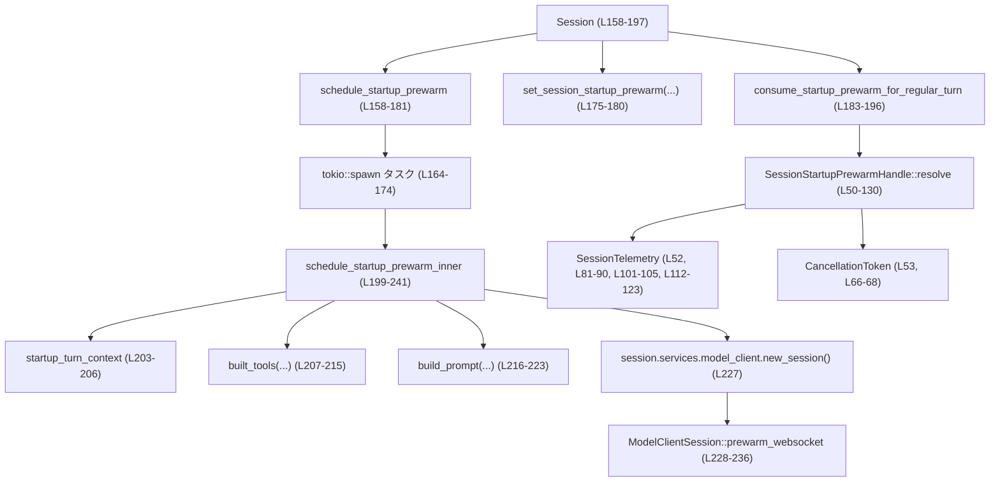
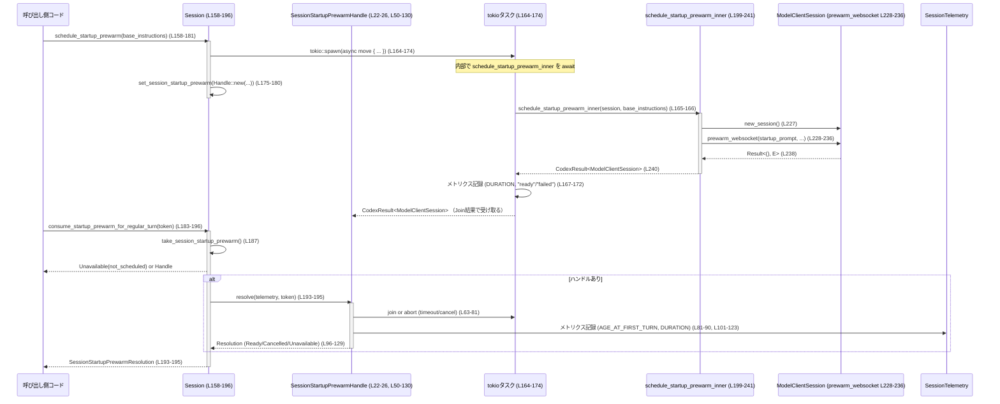

# core/src/session_startup_prewarm.rs コード解説

## 0. ざっくり一言

セッション開始時に、モデル用 WebSocket セッションをバックグラウンドで「プレウォーム（事前接続）」し、最初のターンで即利用できるようにするための非同期処理と、その結果を管理・計測するモジュールです（`core/src/session_startup_prewarm.rs:L22-241`）。

---

## 1. このモジュールの役割

### 1.1 概要

- このモジュールは、セッション開始直後の**レスポンス遅延を減らす**ために、モデルクライアントの WebSocket 接続をあらかじめ確立しておく仕組みを提供します（`Session::schedule_startup_prewarm` / `schedule_startup_prewarm_inner`）。  
  根拠: `schedule_startup_prewarm_inner` 内の `prewarm_websocket` 呼び出し（`L227-236`）。
- プレウォーム結果は `SessionStartupPrewarmHandle` でラップされ、通常ターン開始時に `consume_startup_prewarm_for_regular_turn` で取り出されます（`L22-26`, `L183-196`）。
- 成功・失敗・タイムアウト・キャンセルなどの結果は `SessionStartupPrewarmResolution` で表現され、合わせて OpenTelemetry 由来と思われるメトリクスが記録されます（`L28-35`, `L50-130`, `L158-181`）。

### 1.2 アーキテクチャ内での位置づけ

主なコンポーネント間の依存関係は次のようになっています。



- `Session` はこのモジュールのエントリポイントであり、プレウォームをスケジュールし、後で消費します（`L158-181`, `L183-196`）。
- 実際のプレウォーム処理は `schedule_startup_prewarm_inner` に集約されています（`L199-241`）。
- `SessionStartupPrewarmHandle` は、バックグラウンドで走る `tokio::task::JoinHandle` をラップし、タイムアウト・キャンセル・メトリクス記録を担当します（`L22-26`, `L37-155`）。

### 1.3 設計上のポイント

- **責務分割**（`L37-155`, `L158-196`, `L199-241`）
  - セッション API (`Session` の `schedule_*` / `consume_*`) と、内部の非同期タスク管理 (`SessionStartupPrewarmHandle`) と、実際の接続準備ロジック (`schedule_startup_prewarm_inner`) が分離されています。
- **状態管理**
  - `SessionStartupPrewarmHandle` は開始時刻 (`started_at`) とタイムアウト (`timeout`) を内部に保持し、実行状況に応じて残り時間やメトリクスを計算します（`L22-26`, `L55-61`）。
  - 実際の `ModelClientSession` は `SessionStartupPrewarmResolution::Ready(Box<ModelClientSession>)` で一度だけ引き渡されます（`L28-35`, `L137-139`）。
- **エラーハンドリング**
  - プレウォーム中のエラーは `CodexResult<ModelClientSession>` と `tokio::task::JoinError` に二段階で表現され、それぞれ `"failed"` / `"join_failed"` / `"timed_out"` / `"not_scheduled"` / `"cancelled"` といったステータス文字列で分類されます（`L70-78`, `L140-152`, `L187-191`）。
- **並行性とキャンセル**
  - プレウォームは `tokio::spawn` でバックグラウンドタスクとして起動され、消費時には `tokio::select!` でキャンセル要求とタスク完了・タイムアウトを同時に待つ構造になっています（`L164-174`, `L66-69`）。
  - `CancellationToken` を使うことで、外部からのキャンセル指示と内側（ツールビルド等）でのキャンセル連携の両方に対応しています（`L7`, `L53`, `L206-214`）。

---

## 2. 主要な機能一覧

- セッション開始時プレウォームのスケジューリング: `Session::schedule_startup_prewarm`（`L158-181`）
- プレウォーム済みセッションの消費（通常ターンで利用）: `Session::consume_startup_prewarm_for_regular_turn`（`L183-196`）
- バックグラウンドタスクの解決とメトリクス記録: `SessionStartupPrewarmHandle::resolve`（`L50-130`）
- ジョイン結果からの解決種別判定: `SessionStartupPrewarmHandle::resolution_from_join_result`（`L132-155`）
- 実際の WebSocket プレウォーム処理: `schedule_startup_prewarm_inner`（`L199-241`）

### 2.1 コンポーネントインベントリー（型・関数一覧）

| 名前 | 種別 | 役割 / 用途 | 定義位置 |
|------|------|-------------|----------|
| `SessionStartupPrewarmHandle` | 構造体 | バックグラウンドプレウォームタスクとタイムアウト情報のハンドラ | `core/src/session_startup_prewarm.rs:L22-26` |
| `SessionStartupPrewarmResolution` | enum | プレウォーム結果（成功・キャンセル・利用不可）を表現 | `L28-35` |
| `SessionStartupPrewarmHandle::new` | 関数（impl） | ハンドルの初期化 | `L38-48` |
| `SessionStartupPrewarmHandle::resolve` | 非公開 async 関数 | タスク完了・タイムアウト・キャンセルを待ち、結果＋メトリクスを返す | `L50-130` |
| `SessionStartupPrewarmHandle::resolution_from_join_result` | 非公開関数 | `JoinHandle` の結果を `SessionStartupPrewarmResolution` に変換 | `L132-155` |
| `Session::schedule_startup_prewarm` | メソッド | セッション起動時にプレウォームをスケジュールし、ハンドルを保存 | `L158-181` |
| `Session::consume_startup_prewarm_for_regular_turn` | メソッド | 通常ターンの開始時にプレウォーム済みセッションを消費 | `L183-196` |
| `schedule_startup_prewarm_inner` | 非公開 async 関数 | 実際のツール構築・プロンプト生成・WebSocket プレウォームを行う | `L199-241` |

---

## 3. 公開 API と詳細解説

※ ここではクレート内から利用される `pub(crate)` API も「公開 API」とみなして解説します。

### 3.1 型一覧（構造体・列挙体など）

| 名前 | 種別 | 役割 / 用途 | 主なフィールド / バリアント | 定義位置 |
|------|------|-------------|------------------------------|----------|
| `SessionStartupPrewarmHandle` | 構造体 | プレウォームタスクとそのメタ情報を保持し、解決処理を提供する | `task: JoinHandle<CodexResult<ModelClientSession>>`, `started_at: Instant`, `timeout: Duration` | `L22-26` |
| `SessionStartupPrewarmResolution` | enum | プレウォーム結果を表現 | `Cancelled`, `Ready(Box<ModelClientSession>)`, `Unavailable { status: &'static str, prewarm_duration: Option<Duration> }` | `L28-35` |

---

### 3.2 関数詳細

#### `SessionStartupPrewarmHandle::new(task, started_at, timeout) -> SessionStartupPrewarmHandle`

**概要**

- プレウォーム用 `JoinHandle` と開始時刻、タイムアウトを受け取り、それを保持するハンドルを生成します（`L38-48`）。

**引数**

| 引数名 | 型 | 説明 |
|--------|----|------|
| `task` | `JoinHandle<CodexResult<ModelClientSession>>` | バックグラウンドでプレウォーム処理を行うタスク |
| `started_at` | `Instant` | プレウォームを開始した時刻 |
| `timeout` | `Duration` | プレウォームを利用可能とみなすまでの最大待機時間 |

**戻り値**

- `SessionStartupPrewarmHandle`: 与えられたタスクと時間情報を内部に保持する新しいハンドル（`L43-47`）。

**内部処理**

- フィールドにそのまま代入するだけで、追加ロジックはありません（`L43-47`）。

**Errors / Panics**

- エラー処理や panic は含まれていません。

**Edge cases**

- 特になし（単純な構築処理）。

**使用上の注意点**

- `resolve` は `self` を消費するため、`new` で作ったハンドルは通常一度きり利用される前提です（`resolve` のシグネチャ `self` 取り `L50-54`）。

---

#### `SessionStartupPrewarmHandle::resolve(self, session_telemetry, cancellation_token) -> SessionStartupPrewarmResolution`

**概要**

- バックグラウンドタスクの状態に応じて、プレウォーム結果を取得します。キャンセルやタイムアウトも考慮し、メトリクスを記録したうえで `SessionStartupPrewarmResolution` を返します（`L50-130`）。

**引数**

| 引数名 | 型 | 説明 |
|--------|----|------|
| `self` | `SessionStartupPrewarmHandle` | 対象のプレウォームハンドル（所有権を消費） |
| `session_telemetry` | `&SessionTelemetry` | メトリクス記録に利用するテレメトリオブジェクト |
| `cancellation_token` | `&CancellationToken` | 呼び出し側からのキャンセル指示を待つためのトークン |

**戻り値**

- `SessionStartupPrewarmResolution`:  
  - `Ready(Box<ModelClientSession>)`: プレウォーム成功し、WebSocket セッションが利用可能。  
  - `Cancelled`: 呼び出し側がキャンセルしたため利用されなかった。  
  - `Unavailable { status, prewarm_duration }`: タイムアウトや失敗などで利用できない状況。

**内部処理の流れ**

1. `self` から `task`, `started_at`, `timeout` を取り出し、`age_at_first_turn = started_at.elapsed()` を計算します（`L55-61`）。
2. 残り時間 `remaining = timeout.saturating_sub(age_at_first_turn)` を計算します（`L61`）。
3. すでに `task.is_finished()` なら即座に `JoinHandle` を `await` し、`resolution_from_join_result` で解決します（`L63-65`）。
4. 未完了なら `tokio::select!` で
   - `cancellation_token.cancelled()` 完了 → `None` を返す
   - `tokio::time::timeout(remaining, &mut task)` → `Some(Result<...>)` を返す  
   のいずれかを待ちます（`L66-69`）。
5. `Some(Ok(result))`: タスク自体は完了 → `resolution_from_join_result(result, started_at)`（`L70`）。
6. `Some(Err(_elapsed))`: `timeout` 経過 → `task.abort()` し、ログを出し、`Unavailable { status: "timed_out", prewarm_duration: Some(started_at.elapsed()) }` を返します（`L71-78`）。
7. `None`: キャンセル → `task.abort()` し、`status="cancelled"` として `STARTUP_PREWARM_AGE_AT_FIRST_TURN_METRIC` と `STARTUP_PREWARM_DURATION_METRIC` を記録し、`Cancelled` を返します（`L79-91`）。
8. その後、`resolution` の内容に応じてメトリクスを記録したうえで、同じ `resolution` を返します（`L96-129`）。
   - `Cancelled`: 追加メトリクスは記録せずそのまま返す（`L97-99`）。
   - `Ready`: `status="consumed"` で `AGE_AT_FIRST_TURN` を記録（`L100-107`）。
   - `Unavailable`: `status` ごとに `AGE_AT_FIRST_TURN` と、`prewarm_duration` があればそれも `DURATION` に記録（`L108-123`）。

**Errors / Panics**

- `JoinHandle::await` が返す `JoinError` 自体は `resolution_from_join_result` 内で `Unavailable { status: "join_failed", ... }` に変換されます（`L132-155`）。
- `tokio::time::timeout` のタイムアウトも `status: "timed_out"` として扱われます（`L71-78`）。
- 明示的な panic や `unwrap` は使用されていません。`?` 演算子もなく、この関数はエラーを返さず、全て `Resolution` に畳み込みます。

**Edge cases（代表的なケース）**

- **プレウォームタスクがすでに終了している**  
  - `task.is_finished()` が `true` の場合、タイムアウト・キャンセル待ちをスキップし、即座に `resolution_from_join_result` で結果を取得します（`L63-65`）。
- **呼び出し時点でタイムアウトを超えている**  
  - `remaining = timeout.saturating_sub(age_at_first_turn)` のため、負値にはならず 0 になります（`L61`）。  
    その場合 `tokio::time::timeout(remaining, &mut task)` は即タイムアウトし、`"timed_out"` として処理されます（`L71-78`）。
- **キャンセルとタスク完了がほぼ同時**  
  - `tokio::select!` のレースになる可能性があります。どちらが先に進むかは保証されませんが、どちらの経路でも `task.abort()` / `JoinHandle.await` を通じて後片付けが行われます（`L66-81`）。順序は Tokio のスケジューラ依存であり、コードからは決定できません。

**使用上の注意点**

- この関数は `self` の所有権を消費するため、一つのハンドルに対し一度だけ呼び出す設計です（`L50-54`）。
- 呼び出し側は、`CancellationToken` を使って「プレウォーム結果をもう使わない」と判断した場合にキャンセルできますが、その場合でも内部で `task.abort()` が呼ばれるため、タスクは中断されます（`L79-81`）。
- メトリクスは `resolve` から返却される前に記録されるため、呼び出し側が結果を無視しても計測は残ります（`L100-123`）。

**根拠**

- 処理フロー・分岐: `core/src/session_startup_prewarm.rs:L50-130`  
- タイムアウトとキャンセルの扱い: `L61-69`, `L71-81`  
- メトリクス記録: `L81-90`, `L101-105`, `L112-123`。

---

#### `SessionStartupPrewarmHandle::resolution_from_join_result(result, started_at) -> SessionStartupPrewarmResolution`

**概要**

- `JoinHandle` の `await` 結果を解釈し、`SessionStartupPrewarmResolution` に変換します（`L132-155`）。

**引数**

| 引数名 | 型 | 説明 |
|--------|----|------|
| `result` | `std::result::Result<CodexResult<ModelClientSession>, tokio::task::JoinError>` | タスクの join 結果。内側の `Ok/Err` がビジネスロジックの結果、外側の `Err` がタスク自体の失敗を表す |
| `started_at` | `Instant` | プレウォーム開始時刻。失敗時の経過時間計測に利用 |

**戻り値**

- `SessionStartupPrewarmResolution`  
  - 成功: `Ready(Box<ModelClientSession>)`  
  - 内部エラー: `Unavailable { status: "failed", prewarm_duration: None }`  
  - Join 失敗: `Unavailable { status: "join_failed", prewarm_duration: Some(started_at.elapsed()) }`

**内部処理**

1. `match result` で 3 パターンに分岐（`L136-147`）。
2. `Ok(Ok(prewarmed_session))`: 成功 → `Ready(Box::new(prewarmed_session))`（`L137-139`）。
3. `Ok(Err(err))`: ビジネスロジックエラー → 警告ログを出し、`status: "failed"` で `Unavailable` を返す（`L140-145`）。
4. `Err(err)`: タスク Join 失敗（panic 等） → 警告ログを出し、`status: "join_failed"` & `prewarm_duration: Some(started_at.elapsed())` を返す（`L147-152`）。

**Errors / Panics**

- ここでも `unwrap` や `?` は使用されておらず、全てのケースを `Resolution` に包んで呼び出し元に渡します。
- Join 失敗（例えば内部 panic）は `"join_failed"` として表現されるだけで、ここでは再 panic はしません。

**Edge cases**

- ビジネスロジック側のエラー型は `CodexResult` の型定義に依存しており、本チャンクでは詳細不明です（`L19`）。  
  エラー内容はログ出力 `{err:#}` に含まれますが、ここでは扱いません。

**使用上の注意点**

- `resolve` 内のみに使用されるヘルパーであり、外部から直接呼び出すことは想定されていません（`L63-65`, `L70`）。

**根拠**

- `core/src/session_startup_prewarm.rs:L132-155`。

---

#### `Session::schedule_startup_prewarm(self: &Arc<Self>, base_instructions: String)`

**概要**

- セッション開始時にプレウォーム処理をバックグラウンドで開始し、そのハンドルを `Session` 内に登録します（`L158-181`）。

**引数**

| 引数名 | 型 | 説明 |
|--------|----|------|
| `self` | `&Arc<Self>` | `Session` の共有ポインタ参照。`tokio::spawn` に渡すために `Arc` を要求していると考えられます（コードから読み取れるのは `Arc` をクローンしている事実）。 |
| `base_instructions` | `String` | プロンプト生成に使用されるベース指示文。`schedule_startup_prewarm_inner` にそのまま渡されます（`L165-166`, `L220-222`）。 |

**戻り値**

- `()`（暗黙）。エラーは返さず、プレウォーム処理の結果は後から `consume_startup_prewarm_for_regular_turn` を通して取得します。

**内部処理の流れ**

1. `session_telemetry` をクローン（`L160`）。
2. プロバイダから WebSocket 接続タイムアウトを取得（`self.provider().await.websocket_connect_timeout()` `L161`）。  
   ここでのエラー処理は見えず、`provider()` がエラーをどう扱うかはこのチャンクには出てきません。
3. 現在時刻を `started_at` として記録（`L162`）。
4. `Arc::clone(self)` でプレウォーム用の `Session` を取得（`L163`）。
5. `tokio::spawn` でバックグラウンドタスクを開始（`L164-174`）。  
   タスク内では:
   - `schedule_startup_prewarm_inner(startup_prewarm_session, base_instructions).await` を呼ぶ（`L165-166`）。
   - 結果に応じて `"ready"` or `"failed"` の status を決める（`L167`）。
   - `STARTUP_PREWARM_DURATION_METRIC` に `started_at` からの経過時間を status とともに記録（`L168-172`）。
   - `result` をそのまま返す（`L173`）。
6. `SessionStartupPrewarmHandle::new` でハンドルを作成し、`self.set_session_startup_prewarm(...)` に渡してセッションに保存、`await` する（`L175-180`）。

**Errors / Panics**

- `tokio::spawn` 内部のエラーは `CodexResult<ModelClientSession>` としてタスク側に蓄積され、`schedule_startup_prewarm` 自体は一切エラーを返しません（`L164-174`）。
- この関数内には `unwrap` や `?` がなく、panic の可能性は他メソッド呼び出しの内部に限られます（`provider`, `set_session_startup_prewarm` など）。

**Edge cases**

- `set_session_startup_prewarm` が既に別のハンドルを持っている場合の挙動は、このチャンクからは分かりません（`L175-180`）。  
  ただし名前からは「上書きする」か「エラーにする」実装が想定されますが、断定はできません。
- `websocket_connect_timeout` が非常に短い場合、ほぼすぐにタイムアウト扱いになる可能性がありますが、この制御は `resolve` 側で行われます（`L161`, `L61`）。

**使用上の注意点**

- この関数は非同期であり、`await` しないと `set_session_startup_prewarm` が完了しませんが、プレウォーム自体は `tokio::spawn` により完全にバックグラウンドで進みます（`L164-174`）。
- `base_instructions` は所有権を移動してタスクに渡されます。呼び出し側で後から再利用することはできません（`L159`, `L165-166`）。

**根拠**

- `core/src/session_startup_prewarm.rs:L158-181`。

---

#### `Session::consume_startup_prewarm_for_regular_turn(&self, cancellation_token) -> SessionStartupPrewarmResolution`

**概要**

- セッションに保存されているプレウォームハンドルを取得し、通常ターンで利用します。ハンドルが存在しない場合や利用不能な場合はその理由を `SessionStartupPrewarmResolution::Unavailable` で返します（`L183-196`）。

**引数**

| 引数名 | 型 | 説明 |
|--------|----|------|
| `self` | `&Self` | 対象セッション |
| `cancellation_token` | `&CancellationToken` | このターンでプレウォームを諦める場合に使用するキャンセルトークン |

**戻り値**

- `SessionStartupPrewarmResolution`: プレウォームセッションの状態。

**内部処理**

1. `self.take_session_startup_prewarm().await` でハンドルを取得（`L187`）。
2. 取得できなかった場合（`None`）は、  
   `Unavailable { status: "not_scheduled", prewarm_duration: None }` を即座に返す（`L187-191`）。
3. 取得できた場合は、そのハンドルに対して `.resolve(&self.services.session_telemetry, cancellation_token).await` を呼び出し、結果をそのまま返す（`L193-195`）。

**Errors / Panics**

- `take_session_startup_prewarm` のエラー挙動は不明ですが、本関数内ではエラーを返しません。`resolve` も `Resolution` を返すだけで例外的なエラー型は使っていません。

**Edge cases**

- `consume_startup_prewarm_for_regular_turn` を複数回呼んだ場合の挙動は `take_session_startup_prewarm` の実装に依存します（`L187`）。  
  一般的な「take」命名からは、一度目は `Some(handle)`、二度目以降は `None` になる動作が想定されますが、このチャンクからは確証は得られません。
- 呼び出しが遅れ、`resolve` 内で `timeout` 超過となる場合は `"timed_out"` として `Unavailable` が返ります（`L61`, `L71-78`）。

**使用上の注意点**

- 呼び出し側は `CancellationToken` を使って「このターンではプレウォームを使わない」と判断した場合にキャンセルできます。その場合 `SessionStartupPrewarmResolution::Cancelled` が返ります（`L66-68`, `L79-91`）。
- `not_scheduled` が返ってきた場合は、そもそもプレウォームが設定されていない状態なので、通常の新規セッション確立パスにフォールバックする必要があります。

**根拠**

- `core/src/session_startup_prewarm.rs:L183-196`。

---

#### `schedule_startup_prewarm_inner(session: Arc<Session>, base_instructions: String) -> CodexResult<ModelClientSession>`

**概要**

- セッションの初期ターンコンテキストを作成し、ツール群の初期化とプロンプト生成を行った上で、`ModelClientSession::prewarm_websocket` を呼び出して WebSocket をプレウォームします（`L199-241`）。

**引数**

| 引数名 | 型 | 説明 |
|--------|----|------|
| `session` | `Arc<Session>` | 対象セッションの共有ポインタ |
| `base_instructions` | `String` | `BaseInstructions { text }` としてプロンプト生成に渡される |

**戻り値**

- `CodexResult<ModelClientSession>`:  
  - 成功時: プレウォーム済みの `ModelClientSession`  
  - 失敗時: `CodexResult` のエラー型（詳細不明）  

**内部処理の流れ**

1. `session.new_default_turn_with_sub_id(INITIAL_SUBMIT_ID.to_owned()).await` で初期ターンコンテキストを作成（`L203-205`）。
2. `CancellationToken::new()` を生成し、ツールビルドへ渡す（`L206`, `L213-214`）。
3. `built_tools(...)` を呼び出し、ツールルーターを初期化（`L207-215`）。  
   - 引数にはセッション本体、ターンコンテキスト、空のツールリストと空の `HashSet`、`skills_outcome: None`、`startup_cancellation_token` が渡されます。
   - エラー時には `?` により即座に呼び出し元へエラーを返します（`L215`）。
4. `build_prompt(...)` で初期プロンプトを構築（`L216-223`）。  
   - メッセージリストとして空の `Vec::new()` を渡し、ルーターとターンコンテキスト、`BaseInstructions { text: base_instructions }` を使用。
5. `startup_turn_context.turn_metadata_state.current_header_value()` でメタデータヘッダを取得（`L224-226`）。
6. `session.services.model_client.new_session()` で新しい `ModelClientSession` を作成（`L227`）。
7. そのセッションに対し、`prewarm_websocket(...)` を呼び出し（`L228-236`）。  
   - 引数: プロンプト、モデル情報、セッションテレメトリ、reasoning 関連の設定、サービス階層、メタデータヘッダなど。
   - エラー時は `?` により即エラーを返す（`L238`）。
8. 成功時はプレウォーム済みの `client_session` を `Ok(client_session)` で返す（`L240`）。

**Errors / Panics**

- `built_tools(...).await?` および `prewarm_websocket(...).await?` の `?` により、非同期処理中のエラーはすべて `CodexResult` の `Err` として呼び出し元（`tokio::spawn` 内のクロージャ）に伝播します（`L207-215`, `L228-238`）。
- `new_default_turn_with_sub_id` や `new_session` の失敗時の挙動はこのチャンクからは分かりません。
- `unsafe` ブロックや `unwrap` は存在せず、Rust のエラー処理機構 (`Result`, `?`) のみを利用しています。

**Edge cases**

- `INITIAL_SUBMIT_ID` の値や意味（初回送信 ID など）はこのチャンクからは不明ですが、常に同じ ID で初期ターンを作る設計になっています（`L12`, `L203-205`）。
- `build_prompt` へのメッセージリストが常に空 (`Vec::new()`) である点から、プレウォームは「実際のユーザー入力前の初期プロンプトだけ」を対象としていることが読み取れます（`L216-218`）。
- `startup_cancellation_token` はこの関数内で `cancel()` されておらず、外側からのキャンセルは `built_tools` 内でのみ考慮される可能性がありますが、詳細はこのチャンクにはありません（`L206-214`）。

**使用上の注意点**

- この関数は基本的に `Session::schedule_startup_prewarm` からのみ呼ばれ、直接外部から呼び出す設計ではありません（`L164-166`）。
- `base_instructions` がそのまま `BaseInstructions { text }` に埋め込まれるため、内容のバリデーションやサニタイズは呼び出し側または `build_prompt` 側で行う必要があります（`L216-223`）。

**根拠**

- `core/src/session_startup_prewarm.rs:L199-241`。

---

### 3.3 その他の関数

このファイルには、上記以外の補助関数やラッパー関数は定義されていません。

---

## 4. データフロー

ここでは、「セッション開始 → プレウォームスケジュール → プレウォーム完了 → 通常ターンでプレウォーム消費」という典型的なシナリオのデータフローを示します。

### 4.1 シーケンス図



### 4.2 要点

- プレウォーム処理そのもの（WebSocket 接続確立）はバックグラウンドタスク内で完結しており、ユーザーコードは `schedule_startup_prewarm` の完了を待つ必要はありません（`L164-174`）。
- 通常ターン開始時に `consume_startup_prewarm_for_regular_turn` を呼び、あらかじめ用意された `ModelClientSession` を `Ready` として受け取るか、未利用・失敗・タイムアウトの情報を `Unavailable` / `Cancelled` で受け取ります（`L183-196`, `L50-130`）。
- メトリクスは「プレウォーム完了までの時間」（DURATION）と「最初のターンでのエイジ」（AGE_AT_FIRST_TURN）の 2 種類が記録され、ステータスによってラベルが変わります（`L81-90`, `L101-123`, `L168-172`）。

---

## 5. 使い方（How to Use）

### 5.1 基本的な使用方法

ここでは、セッション作成後にプレウォームをスケジュールし、最初の通常ターンでそれを利用する例を示します。

```rust
use std::sync::Arc;
use tokio_util::sync::CancellationToken;

async fn handle_new_session(session: Arc<Session>) -> codex_protocol::error::Result<()> {
    // ベースとなる指示文を準備する（内容は任意）
    let base_instructions = "You are a helpful assistant.".to_string();

    // セッション開始時にプレウォームをスケジュールする
    session
        .schedule_startup_prewarm(base_instructions) // L158-181
        .await;

    // ...（他の初期処理）

    // 最初の通常ターン開始時にプレウォームを消費する
    let cancellation_token = CancellationToken::new();
    match session
        .consume_startup_prewarm_for_regular_turn(&cancellation_token) // L183-196
        .await
    {
        SessionStartupPrewarmResolution::Ready(prewarmed_client_session) => {
            // prewarmed_client_session を使ってすぐに推論リクエストなどを行う
            // （ここでは ModelClientSession の API はこのチャンクには出てこないため詳細不明）
            let client_session = *prewarmed_client_session; // Box から取り出す
            // 以降 client_session を通常のセッションとして利用
        }
        SessionStartupPrewarmResolution::Unavailable { status, .. } => {
            // プレウォームが使えなかった理由（"not_scheduled", "failed", "timed_out", "join_failed" など）
            // に応じて、通常の新規セッション確立フローにフォールバックする
            eprintln!("prewarm unavailable: status={}", status);
        }
        SessionStartupPrewarmResolution::Cancelled => {
            // 呼び出し側のポリシーとしてプレウォームを使わなかったケース
        }
    }

    Ok(())
}
```

### 5.2 よくある使用パターン

1. **プレウォームを試み、ダメならフォールバック**

   - `consume_startup_prewarm_for_regular_turn` の結果が `Ready` でなければ、通常のセッション初期化ルートにフォールバックする、というパターンが自然です。

2. **キャンセルトークンによる締め切り管理**

   - レイテンシ要件が厳しい場合、一定時間が経過したら `CancellationToken` をキャンセルして `Cancelled` を受け取り、即座に別ルートに切り替えることができます。`resolve` はキャンセル時にメトリクスを `"cancelled"` として記録します（`L79-90`）。

### 5.3 よくある間違いとその影響（推測を含まない範囲）

```rust
// （誤用例の可能性）プレウォームを消費せずに何度も schedule のみ呼ぶ
async fn incorrect_usage(session: Arc<Session>) {
    let base_instructions = "instr".to_string();
    session.schedule_startup_prewarm(base_instructions).await;
    // consume_startup_prewarm_for_regular_turn を呼ばない
}

// 望ましいパターン: スケジュール→1回のコンシューム
async fn correct_usage(session: Arc<Session>) {
    let base_instructions = "instr".to_string();
    session.schedule_startup_prewarm(base_instructions).await;

    let token = CancellationToken::new();
    let _resolution = session
        .consume_startup_prewarm_for_regular_turn(&token)
        .await;
}
```

- `schedule_startup_prewarm` を呼ぶだけでは、プレウォームされたセッションは `Session` 内に保持されたままになり、`consume_startup_prewarm_for_regular_turn` を呼ばなければ実際には利用されません（`L175-180`, `L183-187`）。
- ただし、こうした未消費ハンドルがどう扱われるか（例えばセッション終了時に破棄されるか）は、このファイルだけでは分かりません。

### 5.4 使用上の注意点（まとめ）

- **前提条件**
  - `Session` 内に `SessionStartupPrewarmHandle` を保持・取得する `set_session_startup_prewarm` / `take_session_startup_prewarm` が正しく実装されていることが前提です（`L175-180`, `L187`）。実装はこのチャンクには含まれません。
- **エラーと失敗の区別**
  - ビジネスロジックの失敗（`CodexResult` の `Err`）は `"failed"` として扱われ、タスクの Join 失敗は `"join_failed"` として区別されています（`L140-145`, `L147-152`）。
  - 呼び出しが間に合わなかった場合は `"timed_out"`、そもそもスケジュールされていない場合は `"not_scheduled"` です（`L71-78`, `L187-191`）。
- **並行性**
  - `resolve` は `tokio::select!` を使ってキャンセルとタスク完了・タイムアウトを同時に待つため、呼び出し側がブロックされることなくキャンセルを適用できます（`L66-69`）。
  - `JoinHandle` に対する `abort` は idempotent なので、二重に呼ばれても安全です。コード中ではプレウォームタスクに対し一度だけ `abort` が呼ばれています（`L72`, `L80`）。
- **パフォーマンス**
  - プレウォーム処理はツール構築 (`built_tools`) やプロンプト生成 (`build_prompt`)、WebSocket 接続確立 (`prewarm_websocket`) など比較的高コストな処理を実行します（`L207-215`, `L216-223`, `L228-236`）。これらを分離してバックグラウンド化していることが、本モジュールの主な目的です。
- **セキュリティ・安全性**
  - このモジュール内では `unsafe` コードは使用されておらず、外部入力を直接パースしたりシステムコールを行う部分もありません。`base_instructions` はそのままプロンプト構築に渡されるため、プロンプトインジェクション等の対策は上位レイヤーや `build_prompt` 側で行う必要があります（`L216-223`）。

---

## 6. 変更の仕方（How to Modify）

### 6.1 新しい機能を追加する場合

1. **結果バリアントの拡張**
   - プレウォーム結果の分類を増やしたい場合（例: `"partial_ready"`）は、`SessionStartupPrewarmResolution` に新しいバリアントを追加し（`L28-35`）、`resolve` と `resolution_from_join_result` の `match` 部分を拡張する必要があります（`L96-129`, `L136-154`）。
2. **メトリクスの追加**
   - 新しいメトリクスを追加する場合は、`SessionTelemetry` を用いた `record_duration` 呼び出し箇所に追加することになります（`L81-90`, `L101-105`, `L112-123`, `L168-172`）。
3. **プレウォーム内容の変更**
   - 例えば、追加のツールやメッセージを含めたい場合は、`schedule_startup_prewarm_inner` 内の `built_tools` / `build_prompt` 呼び出し部分を編集します（`L207-223`）。

### 6.2 既存の機能を変更する場合の注意点

- **タイムアウト挙動の変更**
  - タイムアウト計算 (`remaining = timeout.saturating_sub(age_at_first_turn)`) を変更すると、`websocket_connect_timeout` の意味が変わるため、`Session::schedule_startup_prewarm` 側の期待とも整合性を取る必要があります（`L161`, `L61`）。
- **キャンセルポリシーの変更**
  - 現状、キャンセル時は `"cancelled"` としてメトリクスに記録され、`Cancelled` が返されます（`L79-91`）。ここを `"not_used"` 等に変える場合、ダッシュボードやアラートの前提とも合わせて変更する必要があります。
- **影響範囲の確認**
  - `Session::schedule_startup_prewarm` / `consume_startup_prewarm_for_regular_turn` はクレート内で広く呼ばれている可能性があり、シグネチャ変更（引数や戻り値）を行う際は、全呼び出し元の再確認が必要です（呼び出し元のコードはこのチャンクには現れません）。

---

## 7. 関連ファイル

このモジュールと密接に関係する型や関数は、他ファイルで定義されていますが、本チャンクには定義が含まれていません。名前と役割から推測される関係のみを列挙します。

| パス（推定） | 役割 / 関係 |
|-------------|------------|
| `core/src/codex/session.rs` 等 | `Session` 型、および `set_session_startup_prewarm` / `take_session_startup_prewarm` / `provider` / `new_default_turn_with_sub_id` などのメソッド定義元（`L13`, `L158-181`, `L183-196`, `L203-205`） |
| `core/src/client.rs` または類似 | `ModelClientSession` 型と `prewarm_websocket` メソッドの実装元（`L11`, `L228-236`） |
| `core/src/codex/prompt.rs` 等 | `build_prompt` 関数の実装元（`L14`, `L216-223`） |
| `core/src/codex/tools.rs` 等 | `built_tools` 関数の実装元（`L15`, `L207-215`） |
| `codex_otel` クレート | `SessionTelemetry` と各種メトリクス定義 (`STARTUP_PREWARM_AGE_AT_FIRST_TURN_METRIC`, `STARTUP_PREWARM_DURATION_METRIC`)（`L16-18`） |
| `codex_protocol::error` | `CodexResult` の定義元（`L19`） |
| `codex_protocol::models` | `BaseInstructions` 型の定義元（`L20`, `L220-222`） |

※ 上記のファイルパスは命名からの推定であり、実際のパスはこのチャンクからは確定できません。
