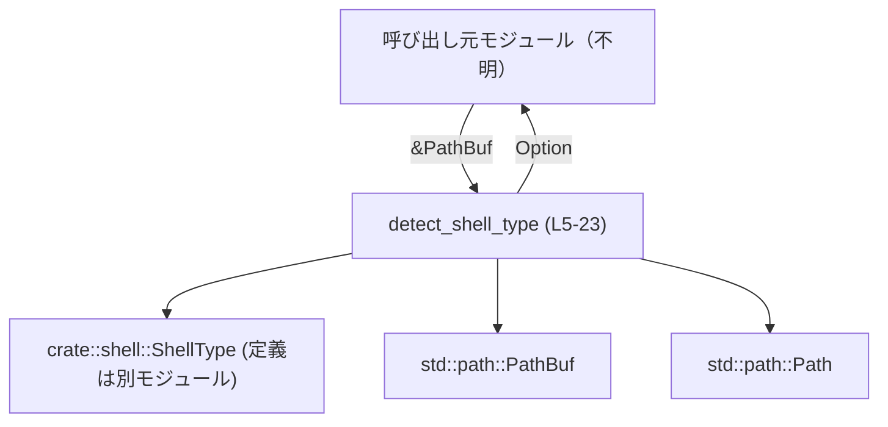
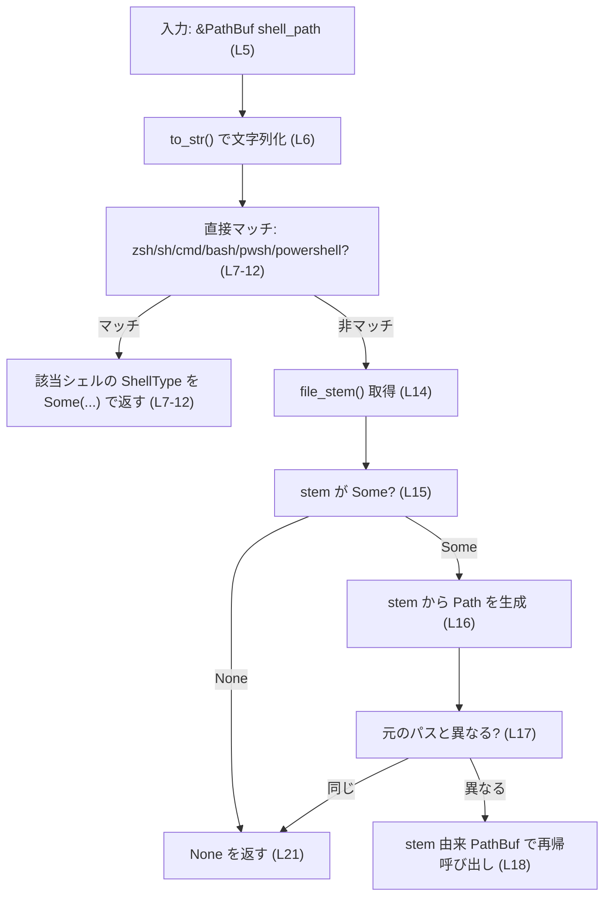

# core/src/shell_detect.rs コード解説

## 0. ざっくり一言

`core/src/shell_detect.rs` は、与えられたシェルのパスから、内部で使う `ShellType` 列挙体を推定するユーティリティ関数 `detect_shell_type` を提供するモジュールです（`core/src/shell_detect.rs:L1-3,5-23`）。

---

## 1. このモジュールの役割

### 1.1 概要

- このモジュールは **シェルの実行ファイルパスからシェル種類（ShellType）を推定する問題** を解決するために存在し、  
  **既知のシェル名（`zsh`, `sh`, `cmd`, `bash`, `pwsh`, `powershell`）を `ShellType` にマッピングする機能** を提供します（`core/src/shell_detect.rs:L1,5-12`）。
- 拡張子付きのファイル名（例: `bash.exe`, `pwsh.exe`）やフルパス（例: `/usr/bin/bash`）にも対応するため、**パスからファイル名の「stem」（拡張子を除いた部分）を再帰的にたどる**仕組みになっています（`core/src/shell_detect.rs:L13-21`）。

### 1.2 アーキテクチャ内での位置づけ

- 依存している外部要素:
  - `crate::shell::ShellType`  
    シェルの種類を表す列挙型で、本モジュールはこの型を返します（`core/src/shell_detect.rs:L1,7-12`）。
  - `std::path::{Path, PathBuf}`  
    シェルパスの表現と、ファイル名の stem 抽出に使用します（`core/src/shell_detect.rs:L2-3,13-18`）。
- このモジュール自体は **1 つの純粋関数のみを定義**しており、状態や I/O を持たないユーティリティ的な位置づけです（`core/src/shell_detect.rs:L5-23`）。

主要な依存関係を Mermaid 図で示します（このファイル 1 チャンクのみなので、依存グラフもこのチャンク内で完結しています）。



### 1.3 設計上のポイント

コードから読み取れる設計上の特徴は次のとおりです。

- **単一責務**  
  - `detect_shell_type` 1 関数のみで、「パス → ShellType?」という変換に専念しています（`core/src/shell_detect.rs:L5-23`）。
- **状態を持たない純粋関数**  
  - グローバル状態や可変参照を一切使用せず、引数にのみ依存して結果を返します（`core/src/shell_detect.rs:L5-23`）。
- **名前ベースの判定**  
  - 判定はパスの文字列表現とファイル名 stem の文字列表現に対して行われ、実際にファイルが存在するかどうかは確認しません（`core/src/shell_detect.rs:L6-12,14-18`）。
- **再帰による拡張子・パス成分の削ぎ落とし**  
  - フルパスや拡張子付きファイル名から、stem を再帰的にたどることで本体名（例: `bash`）を抽出する設計です（`core/src/shell_detect.rs:L13-21`）。
- **安全性 / エラーハンドリング**  
  - `Option<ShellType>` を返すことで、「判定できない」場合を `None` として安全に表現します（`core/src/shell_detect.rs:L5,21`）。
  - `unwrap` などのパニックを引き起こす呼び出しはなく、標準ライブラリ API も panic 条件を含まないものだけが使われています。

---

## 2. 主要な機能一覧

このモジュールが提供する主要な機能は 1 つです。

- `detect_shell_type`: シェル実行ファイルのパスから、既知のシェル種別 (`ShellType`) を推定する（`core/src/shell_detect.rs:L5-23`）

---

## 3. 公開 API と詳細解説

### 3.1 型一覧（構造体・列挙体など）

このファイル内に新しい型定義はありませんが、外部の型を利用しています。

| 名前 | 種別 | 役割 / 用途 | 定義場所 / 根拠 |
|------|------|-------------|------------------|
| `ShellType` | 列挙体（と推定） | シェルの種類を表現する。`detect_shell_type` の戻り値として使われる。利用されているバリアントは `Zsh`, `Sh`, `Cmd`, `Bash`, `PowerShell`。 | `crate::shell` モジュールからインポートされている（`core/src/shell_detect.rs:L1,7-12`）。定義自体はこのチャンクには現れない。 |
| `Path` | 構造体 | OS のパス文字列を所有権なしで表現するスライスタイプ。ここでは `file_stem` から得られた `OsStr` から一時的なパスオブジェクトを生成する用途で使用。 | `std::path::Path` を `use` している（`core/src/shell_detect.rs:L2,16-18`）。 |
| `PathBuf` | 構造体 | 可変な所有権付きパス型。`detect_shell_type` の入力引数として使用される。 | `std::path::PathBuf` を `use` している（`core/src/shell_detect.rs:L3,5`）。 |

### 3.1.1 関数・構造体インベントリー（本チャンク）

| 種別 | 名前 | シグネチャ / 概要 | 定義箇所 |
|------|------|------------------|----------|
| 関数 | `detect_shell_type` | `pub(crate) fn detect_shell_type(shell_path: &PathBuf) -> Option<ShellType>` | `core/src/shell_detect.rs:L5-23` |

このチャンクには他の関数・構造体・enum の定義は現れません。

---

### 3.2 関数詳細

#### `detect_shell_type(shell_path: &PathBuf) -> Option<ShellType>`

**概要**

- 与えられたシェルパス `shell_path` から、そのシェルが `zsh`, `sh`, `cmd`, `bash`, `pwsh`, `powershell` のいずれかであれば対応する `ShellType` を返し、そうでなければ `None` を返す関数です（`core/src/shell_detect.rs:L5-12,21`）。
- フルパスや拡張子付きファイル名の場合でも、ファイル名の stem を再帰的に取り出して判定を試みます（`core/src/shell_detect.rs:L13-21`）。
- `pub(crate)` なので **クレート内部専用の API** です（`core/src/shell_detect.rs:L5`）。

**引数**

| 引数名 | 型 | 説明 |
|--------|----|------|
| `shell_path` | `&PathBuf` | 判定対象のシェル実行ファイルを表すパス。フルパス・相対パス・単なるファイル名のいずれも受け付ける。UTF-8 で表現できないパスも受け付けるが、その場合は名前による判定ができない可能性がある（`core/src/shell_detect.rs:L5-6,13-18`）。 |

**戻り値**

- 型: `Option<ShellType>`（`core/src/shell_detect.rs:L5`）
  - `Some(ShellType::Zsh)` など: パスから既知のシェル名が判定できた場合（`core/src/shell_detect.rs:L7-12`）。
  - `None`: 判定ロジックでどのシェルにもマッチしなかった場合（`core/src/shell_detect.rs:L21`）。

**内部処理の流れ（アルゴリズム）**

コードの流れを 7 ステップ程度に分解します（`core/src/shell_detect.rs:L5-23`）。

1. **パス全体を文字列に変換**  
   `shell_path.as_os_str().to_str()` を呼び出し、`PathBuf` から OS 依存の文字列（`OsStr`）を経由して UTF-8 `&str` への変換を試みます（`core/src/shell_detect.rs:L6`）。  
   - UTF-8 として解釈できない場合は `None` になります。

2. **パス全体の文字列に対する直接マッチ**  
   `match` 式で、文字列全体が特定のシェル名と完全一致するかを判定します（`core/src/shell_detect.rs:L6-12`）。
   - `"zsh"` → `Some(ShellType::Zsh)` を返す（`L7`）。
   - `"sh"` → `Some(ShellType::Sh)` を返す（`L8`）。
   - `"cmd"` → `Some(ShellType::Cmd)` を返す（`L9`）。
   - `"bash"` → `Some(ShellType::Bash)` を返す（`L10`）。
   - `"pwsh"` → `Some(ShellType::PowerShell)` を返す（`L11`）。
   - `"powershell"` → `Some(ShellType::PowerShell)` を返す（`L12`）。
   - 上記以外 (`Some(…)` でかつどれにも一致しない、または `None`) は `_` パターンに落ちます（`L13`）。

3. **直接マッチしなかった場合の処理開始**  
   `_ => { ... }` ブロックに入り、パスからファイル名の stem を取り出して再度判定を試みます（`core/src/shell_detect.rs:L13-21`）。

4. **ファイル名 stem の取得**  
   `let shell_name = shell_path.file_stem();` により、拡張子を除いたファイル名部分（`Option<&OsStr>`）を取得します（`core/src/shell_detect.rs:L14`）。  
   - 例: `/usr/bin/bash` → `Some("bash")`  
   - 例: `pwsh.exe` → `Some("pwsh")`

5. **stem が存在する場合の再帰判定準備**  
   `if let Some(shell_name) = shell_name { ... }` で、`file_stem` の結果が `Some` の場合のみ処理を行います（`core/src/shell_detect.rs:L15`）。  
   - `let shell_name_path = Path::new(shell_name);`  
     ここで `shell_name` から新しい `&Path` を作成します（`core/src/shell_detect.rs:L16`）。

6. **パスが変化する場合のみ再帰呼び出し**  
   `if shell_name_path != Path::new(shell_path) { ... }` で、  
   「`file_stem` から作ったパス」と「元のパス」が異なるかを判定し、異なる場合のみ再帰します（`core/src/shell_detect.rs:L17`）。
   - 異なる場合: `return detect_shell_type(&shell_name_path.to_path_buf());` として、stem を `PathBuf` 化したものを引数に自身を再帰的に呼び出します（`core/src/shell_detect.rs:L18`）。
   - 同一の場合: stem を取ってもパスが変化しないため、無限再帰を防ぐ目的で再帰は行わず後続に進みます。

7. **いずれの方法でも判定できなかった場合**  
   stem が `None` だったか、stem に基づく再帰でも最終的にマッチできなかった場合、`None` を返します（`core/src/shell_detect.rs:L21`）。

この再帰処理により、次のようなケースに対応できます。

- `/usr/bin/bash`  
  - 1 回目: `" /usr/bin/bash"` → マッチせず → stem `"bash"` → 再帰 → `"bash"` → `ShellType::Bash`
- `C:\Windows\System32\WindowsPowerShell\v1.0\powershell.exe`  
  - 1 回目: `"C:\Windows\System32\WindowsPowerShell\v1.0\powershell.exe"` → マッチせず → stem `"powershell"` → 再帰 → `"powershell"` → `ShellType::PowerShell`

**処理フロー図（関数内の簡易フロー）**



**Examples（使用例）**

> ここでは、このモジュールを呼び出す側が同一クレート内にあることを前提とした例です。  
> 実際のモジュールパス（`use crate::...` の形）はプロジェクトの `mod` 構成に依存するため、このチャンクからは不明です。

1. **UNIX 系環境: `/usr/bin/bash` を判定**

```rust
use std::path::PathBuf;
// use crate::core::shell_detect::detect_shell_type; // 実際のパスはプロジェクト構成による
use crate::shell::ShellType;

fn example_unix_bash() {
    let path = PathBuf::from("/usr/bin/bash");             // bash のフルパスを仮定
    let ty = detect_shell_type(&path);                     // 判定を実行

    match ty {
        Some(ShellType::Bash) => {
            // bash と判定できた場合の処理
        }
        Some(other) => {
            // 他シェルとして判定された場合の処理
            println!("Detected other shell: {:?}", other);
        }
        None => {
            // 判定できなかった場合の処理
            eprintln!("Could not detect shell type");
        }
    }
}
```

- 1 回目の呼び出しではパス全体 `" /usr/bin/bash"` は既知名と一致しないため、stem `"bash"` で再帰され、2 回目で `Some(ShellType::Bash)` が返る形になります（`core/src/shell_detect.rs:L6-12,14-18`）。

1. **Windows 系環境: `C:\...\pwsh.exe` を判定**

```rust
use std::path::PathBuf;
use crate::shell::ShellType;

fn example_windows_pwsh() {
    let path = PathBuf::from(r"C:\Program Files\PowerShell\7\pwsh.exe");
    let ty = detect_shell_type(&path);

    assert!(matches!(ty, Some(ShellType::PowerShell)));    // pwsh → PowerShell と判定される想定
}
```

- 1 回目で `"C:\Program Files\PowerShell\7\pwsh.exe"` はマッチせず、  
  stem `"pwsh"` を使った 2 回目の呼び出しで `Some(ShellType::PowerShell)` が返る挙動です（`core/src/shell_detect.rs:L11,13-18`）。

1. **判定できないケース**

```rust
use std::path::PathBuf;

fn example_unknown_shell() {
    let path = PathBuf::from("/opt/custom/my_shell");      // 未知の名前
    let ty = detect_shell_type(&path);

    assert!(ty.is_none());                                 // ShellType に対応しないため None
}
```

- `"my_shell"` はマッチ候補リストに無いため、最終的に `None` が返ります（`core/src/shell_detect.rs:L6-12,21`）。

**Errors / Panics**

- この関数内で明示的に `Result` やエラー型は使用していません。
- `panic!` マクロや `unwrap` など、パニックを引き起こす処理はありません（`core/src/shell_detect.rs:L5-23`）。
- 使用している標準ライブラリメソッド:
  - `PathBuf::as_os_str`, `OsStr::to_str`, `PathBuf::file_stem`, `Path::new`, `Path::to_path_buf`  
    いずれも正常系で panic を起こさない API です（ここでは Rust 標準ライブラリの仕様に基づく一般的事実であり、コード内に panic 条件は現れていません）。

したがって、この関数は **常に正常に終了し、判定できなければ `None` を返す** だけで、パニックすることはありません（`core/src/shell_detect.rs:L21`）。

**Edge cases（エッジケース）**

コードから読み取れる代表的なエッジケースは次のとおりです。

- **UTF-8 で表現できないパス**  
  - `as_os_str().to_str()` が `None` を返すと、`match` の `_` ブランチに落ちます（`core/src/shell_detect.rs:L6,13`）。
  - その後 `file_stem` も `OsStr` ベースで計算されますが、最終的に `to_str()` が常に `None` になるようなパスであれば、どのシェルにもマッチせず `None` で終了します（`core/src/shell_detect.rs:L14-21`）。
- **拡張子を含むファイル名**  
  - `bash.exe`, `pwsh.exe` のようなファイル名は、一度 `file_stem` によって `bash`, `pwsh` となり再帰されるため、正しく判定されます（`core/src/shell_detect.rs:L14-18`）。
- **ディレクトリパスが渡された場合**  
  - `file_stem` は「最後のコンポーネントの stem」を返します。  
    - 例: `/usr/bin/` や `/usr/bin` では、最後のコンポーネントが `bin` となるため、`"bin"` を対象に 2 回目の判定が行われます。  
    - その結果、`"bin"` が候補リストに無いため `None` になります（`core/src/shell_detect.rs:L6-12,14-21`）。
- **複数のドットを含むファイル名**  
  - 例: `"powershell.preview.exe"` のような名前の場合、`file_stem` の挙動は `OsStr` に依存しますが、`file_stem` が分割した stem（例: `"powershell.preview"`）で再帰が行われ、さらに拡張子があれば複数回の再帰が起き得ます（`core/src/shell_detect.rs:L14-18`）。
  - 再帰は常に「同じ文字列に戻らない」限り続くため、無限ループは防がれます（`core/src/shell_detect.rs:L17-18`）。
- **大文字小文字の違い**  
  - 判定は `Some("zsh")` などへの **完全一致** で行われているため（`core/src/shell_detect.rs:L7-12`）、  
    `"ZSH"`, `"PwSh"` のように大文字が含まれる名前は、このコードのままではマッチしません。
  - Windows のようなファイルシステムが大文字小文字を区別しない環境でも、ここでの比較は文字列レベルで区別される点に注意が必要です。

**使用上の注意点**

- **判定できない場合は必ず `None` を確認する必要がある**  
  - `Option` を返すため、呼び出し側は `match` などで `None` ケースを必ず扱う必要があります（`core/src/shell_detect.rs:L5,21`）。
- **名前ベースの判定であり、ファイルの実在や中身は確認しない**  
  - 実際には存在しないパス（例: `"bash"` と名付けられた別のバイナリ）でも `ShellType::Bash` と判定されます（`core/src/shell_detect.rs:L6-12`）。
- **大文字小文字は区別される**  
  - `"pwsh"` は PowerShell と判定されますが、`"PwSh"` など混在ケースは `None` になる設計です（`core/src/shell_detect.rs:L11`）。
- **再帰の深さはパスの形に依存するが、無限再帰しないように制御されている**  
  - `file_stem` によってパスが変化しない場合には再帰しないため（`core/src/shell_detect.rs:L17-18`）、無限ループが起きないようになっています。

---

### 3.3 その他の関数

- このチャンクには `detect_shell_type` 以外の関数は定義されていません（`core/src/shell_detect.rs:L1-23`）。

---

## 4. データフロー

ここでは、「呼び出し元がシェルのパスを持っていて、`detect_shell_type` で判定して使う」という代表的なシナリオのデータフローを示します。

1. 呼び出し元がシェルのパス（`PathBuf`）を構築または取得する。
2. その参照 `&PathBuf` を `detect_shell_type` に渡す（`core/src/shell_detect.rs:L5`）。
3. 関数内部で、パス → 文字列 → 既知名称判定 → 必要なら stem 抽出 → 再帰判定 という流れが行われる（`core/src/shell_detect.rs:L6-18`）。
4. 戻り値の `Option<ShellType>` に応じて、呼び出し元が分岐処理を行う。

Mermaid のシーケンス図で表すと次のようになります。

```mermaid
sequenceDiagram
    participant C as 呼び出し元
    participant F as detect_shell_type (L5-23)
    participant P as std::path::Path / PathBuf
    participant ST as ShellType

    C->>F: &PathBuf shell_path
    activate F

    F->>P: as_os_str().to_str() (L6)
    alt 文字列が既知名と一致 (zsh/sh/cmd/bash/pwsh/powershell) (L7-12)
        F-->>C: Some(ShellType::<対応するバリアント>) (L7-12)
        deactivate F
    else それ以外 (to_str()がNoneまたは非一致) (L13)
        F->>P: file_stem() で stem を取得 (L14)
        alt stem が Some かつ 元のパスと異なる (L15-18)
            F->>F: detect_shell_type(stem の PathBuf) を再帰呼び出し (L18)
            F-->>C: 再帰呼び出しの結果を返す
            deactivate F
        else stem が None または同一パス (L15,17)
            F-->>C: None (L21)
            deactivate F
        end
    end
```

この関数は **シンプルな同期処理** であり、外部 I/O やスレッド操作は行っていません（`core/src/shell_detect.rs:L5-23`）。

---

## 5. 使い方（How to Use）

### 5.1 基本的な使用方法

典型的な利用パターンは、「環境変数や設定から取得したシェルパスを判定する」ケースです。

```rust
use std::env;
use std::path::PathBuf;
// use crate::core::shell_detect::detect_shell_type; // 実際のモジュールパスはプロジェクト構成に依存
use crate::shell::ShellType;

fn detect_from_env() {
    // 例: UNIX 系では SHELL、Windows では COMSPEC などからパスを得る
    let shell_str = env::var("SHELL").unwrap_or_else(|_| "/bin/sh".to_string());
    let shell_path = PathBuf::from(shell_str);

    let ty = detect_shell_type(&shell_path);

    match ty {
        Some(ShellType::Bash) => println!("Use bash specific logic"),
        Some(ShellType::Zsh) => println!("Use zsh specific logic"),
        Some(ShellType::PowerShell) => println!("Use PowerShell specific logic"),
        Some(other) => println!("Detected other shell: {:?}", other),
        None => println!("Unknown shell, using fallback logic"),
    }
}
```

- `detect_shell_type` は純粋関数であり、副作用がないため、どのスレッドから呼び出しても安全です（`core/src/shell_detect.rs:L5-23`）。

### 5.2 よくある使用パターン

1. **設定ファイルなどから得た文字列を判定**

```rust
use std::path::PathBuf;

fn detect_from_config(value: &str) {
    // 設定に "bash" や "pwsh.exe" といった文字列が書かれているケース
    let path = PathBuf::from(value);
    let ty = detect_shell_type(&path);

    if let Some(shell_type) = ty {
        println!("Configured shell type: {:?}", shell_type);
    } else {
        eprintln!("Configured shell is not recognized: {value}");
    }
}
```

1. **すでにファイル名のみが分かっているケース**

```rust
use std::path::PathBuf;

fn detect_from_name_only() {
    let path = PathBuf::from("bash");    // すでにファイル名のみ
    let ty = detect_shell_type(&path);   // 1 回目のマッチで Bash と判定される

    assert!(ty.is_some());
}
```

### 5.3 よくある間違い

コードから推測される「起こりやすそうな誤用例」と、その正しい使い方です。

```rust
use std::path::Path;

// 間違い例: &Path をそのまま渡そうとする（シグネチャは &PathBuf）
fn wrong_type_usage(path: &Path) {
    // detect_shell_type(path); // コンパイルエラー: &Path を &PathBuf に強制変換できない
}

// 正しい例: PathBuf を作成してから参照を渡す
fn correct_type_usage(path: &Path) {
    let buf = path.to_path_buf();
    let _ = detect_shell_type(&buf);
}
```

```rust
use std::path::PathBuf;

// 間違い例: 大文字小文字の違いを考慮していない
fn wrong_case() {
    let path = PathBuf::from("PwSh.exe");         // 大文字混じり
    let ty = detect_shell_type(&path);

    // 期待に反して None になる可能性がある
    assert!(ty.is_none());
}

// 対策例: 呼び出し側で小文字に正規化してから PathBuf を作る
fn normalized_case() {
    let raw = "PwSh.exe".to_lowercase();          // "pwsh.exe"
    let path = PathBuf::from(raw);
    let ty = detect_shell_type(&path);

    assert!(ty.is_some());                        // PowerShell として判定される想定
}
```

### 5.4 使用上の注意点（まとめ）

- `detect_shell_type` は **名前ベースの軽量な推定関数** であり、ファイルの実在やバージョンは確認しません。
- 判定結果が `None` になる可能性は常にあるため、呼び出し側は `None` を適切に扱う必要があります。
- 判定は **大文字小文字を区別** します。特に Windows 環境では、実ファイル名と異なる大文字小文字で文字列を組み立てると `None` になる点に注意が必要です（`core/src/shell_detect.rs:L7-12`）。
- 再帰処理がありますが、`file_stem` による変換でパスが変化しない場合には再帰しないため、無限再帰にはなりません（`core/src/shell_detect.rs:L17-18`）。

---

## 6. 変更の仕方（How to Modify）

### 6.1 新しい機能を追加する場合

この関数の役割を保ちつつ機能を拡張する場合、次のような方針が考えられます。

1. **新しいシェルの種類を追加したい場合**
   - `ShellType` に新しいバリアントを追加する必要があります（`ShellType` の定義はこのチャンクには無いので、`crate::shell` モジュール側を修正する必要があります）。
   - そのうえで、`match` 式に新しいパターンを追加します（`core/src/shell_detect.rs:L6-12`）。

   例（イメージ、実際の `ShellType` 定義に依存）:

   ```rust
   match shell_path.as_os_str().to_str() {
       Some("fish") => Some(ShellType::Fish),        // 新しいシェル
       // 既存のパターン...
       Some("bash") => Some(ShellType::Bash),
       // ...
       _ => { /* 既存の処理 */ }
   }
   ```

2. **大文字小文字を無視して判定したい場合**
   - 文字列化した後に `.to_lowercase()` などで正規化し、その結果に対して `match` を行うように変更する案が考えられます。
   - ただし、`to_lowercase()` は一時的な `String` を生成するため、パフォーマンスと可読性のトレードオフがあります。

3. **拡張子をより直接的に扱いたい場合**
   - 現状は `file_stem` による抽象的な処理に任せていますが、拡張子を `extension()` で取得し、特定の拡張子（例: `.exe`）のときだけ stem を取る、といった細かい制御も可能です（その場合は `core/src/shell_detect.rs:L14-18` 周辺を変更）。

### 6.2 既存の機能を変更する場合

`detect_shell_type` を変更する際に注意すべき点を整理します。

- **影響範囲の確認**
  - この関数は `pub(crate)` なので、同一クレート内の任意の場所から呼ばれている可能性があります（`core/src/shell_detect.rs:L5`）。
  - 変更時には、`rg detect_shell_type` などで使用箇所を検索し、`Option<ShellType>` の扱いに変更を加える場合は特に影響を確認する必要があります。
- **契約（前提条件・返り値の意味）の維持**
  - 「判定できない場合は `None`」という契約を変える（例: `Unknown` バリアントを導入して常に `Some` を返す）と、既存コードが `None` を前提とした分岐を書いている場合に挙動が変わるため注意が必要です。
- **テストの観点**
  - このチャンクにはテストコードは含まれていません（`core/src/shell_detect.rs:L1-23`）。
  - 変更時には、少なくとも以下のパターンをカバーするテストを用意するのが有用です（テスト場所はこのチャンクからは不明）:
    - `"bash"`, `"zsh"`, `"sh"`, `"cmd"`, `"pwsh"`, `"powershell"` それぞれについて `Some(対応する ShellType)` が返ること。
    - `"bash.exe"`, `"pwsh.exe"` のような拡張子付きパスで正しく判定されること。
    - `/usr/bin/bash` のようなフルパスで正しく判定されること。
    - 未知の名前（`"my_shell"`）で `None` になること。
    - `PwSh.exe` のような大文字混在のケースでの挙動（設計方針に応じて期待値を決める）。
- **パフォーマンス上の注意**
  - 現状の実装は、再帰深さが「拡張子の数＋1」程度にしかならないため、一般的なパスでは性能問題はほとんどありません（`core/src/shell_detect.rs:L14-18`）。
  - 将来的に多くのパターンを追加したり、文字列の正規化（`to_lowercase` など）を行う場合には、そのコストが頻出パスで問題にならないか検討する必要があります。
- **観測性（ログなど）**
  - 現状この関数はログ出力などを一切行わないため、「どのパスがなぜ `None` になったか」を直接観測する手段はありません（`core/src/shell_detect.rs:L5-23`）。
  - デバッグの必要が高い場合、呼び出し側で `None` ケースに対してログを出すか、この関数をラップした別関数（ログ付き）を用意することが考えられます。

---

## 7. 関連ファイル

このチャンクから分かる範囲で、関係が強いモジュール・ファイルをまとめます。

| パス / モジュール名 | 役割 / 関係 |
|---------------------|-------------|
| `core/src/shell_detect.rs` | 本レポートの対象。`detect_shell_type` によってパスから `ShellType` を推定するユーティリティを提供する（`core/src/shell_detect.rs:L5-23`）。 |
| `crate::shell` モジュール | `ShellType` 列挙体の定義を提供し、本モジュールで利用される（`core/src/shell_detect.rs:L1,7-12`）。具体的なファイルパス（例: `core/src/shell.rs` など）はこのチャンクには現れないため不明です。 |

このチャンクにはテストモジュールや他のサポート用ユーティリティファイルは登場しないため、それらとの関係は不明です。
