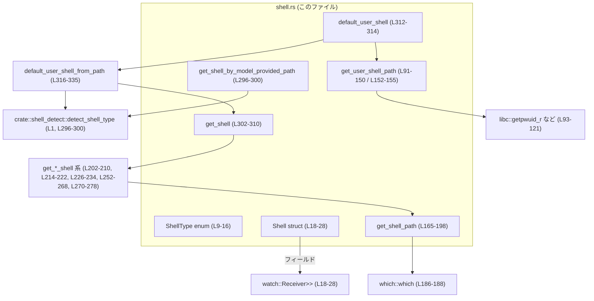
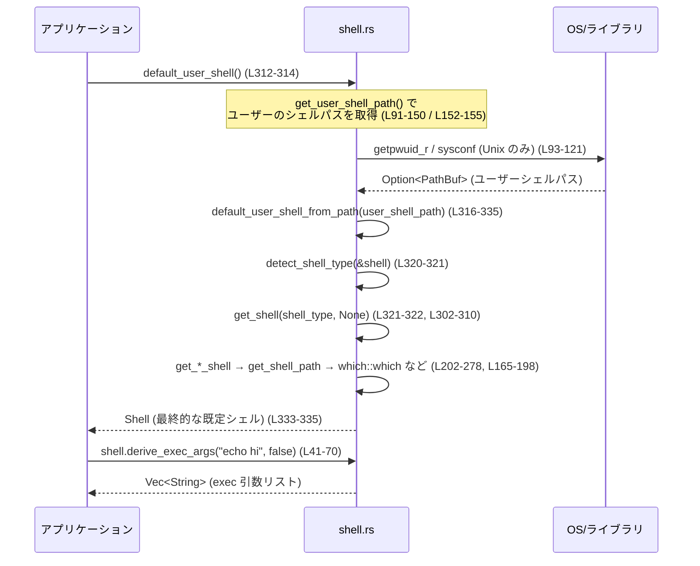

# core/src/shell.rs

## 0. ざっくり一言

ユーザー環境の「シェル種別」と実行パスを判定し、適切なコマンドライン引数を組み立てるためのユーティリティと、既定シェルの選択ロジックをまとめたモジュールです（core/src/shell.rs:L9-16, L165-198, L296-336）。

---

## 1. このモジュールの役割

### 1.1 概要

このモジュールは、以下の問題を解決するために存在します。

- **問題**  
  - プラットフォーム（Unix / Windows）やユーザー設定によって、利用すべきシェルとそのパスが異なる。  
  - シェルごとにコマンド実行時の引数形式が異なる。

- **提供する機能**  
  - 代表的なシェル種別 (`ShellType`) と、その実行パス・スナップショット情報を表す `Shell` 構造体の定義（L9-28）。  
  - シェルからコマンドを実行するための引数列を構築する `Shell::derive_exec_args`（L41-70）。  
  - ユーザーのデフォルトシェルや、指定されたパスに対応するシェルを解決する関数群（L91-198, L202-310, L312-336, L296-300）。

### 1.2 アーキテクチャ内での位置づけ

このモジュールは、外部コンポーネントと次のように連携します。

- `crate::shell_detect::detect_shell_type` を使ってパスからシェル種別を判定（L1, L296-300, L316-323）。  
- `crate::shell_snapshot::ShellSnapshot` と `tokio::sync::watch` を用いて、シェルの状態スナップショットを監視（L2, L18-28, L78-81）。  
- Unix環境では `libc` を利用して `/etc/passwd` からユーザーのログインシェルを取得（L91-150）。  
- 実行可能ファイルの検索に `which::which` を利用（L186-188）。

依存関係を簡略化した図です（各ノードに行番号を明記しています）。



`crate::shell_detect` や `crate::shell_snapshot` の実装は、このチャンクには現れません（不明）。

### 1.3 設計上のポイント

- **ShellType と Shell の分離**  
  - シェルの種別（Zsh/Bash/PowerShell/Sh/Cmd）は `ShellType` 列挙体で表現し（L9-16）、実際のパスやスナップショットは `Shell` 構造体で保持します（L18-28）。

- **スナップショットの非シリアライズ**  
  - `Shell.shell_snapshot` フィールドは `serde` でシリアライズ／デシリアライズしないよう明示されており（L22-27）、デフォルトとして `empty_shell_snapshot_receiver` が使われます（L22-27, L78-81）。  
  - これにより、永続化された `Shell` を復元する際に、スナップショットの監視チャンネルは常に新しく生成されます。

- **エラーハンドリング方針**  
  - シェルの探索に失敗した場合は `Option<Shell>` や `Option<PathBuf>` を返し、最終的な公開 API では `ultimate_fallback_shell` を用いて必ず `Shell` を返す設計です（L197-198, L280-294, L296-300, L312-336）。  
  - `Result` ではなく `Option` を使い、詳細なエラー種別は外に出しません。

- **並行性と安全性**  
  - Unix でユーザーシェルを取得する際、スレッド安全でない `getpwuid` ではなく、再入可能な `getpwuid_r` を使用しています（コメント L100-104, 実装 L111-121）。  
  - シェルスナップショットには `tokio::sync::watch::Receiver<Option<Arc<ShellSnapshot>>>` を用いて、複数のクローンから同じ状態を読み取れる並行設計になっています（L18-28, L72-75, L78-81）。

- **プラットフォームごとの分岐**  
  - `#[cfg(unix)]` / `#[cfg(windows)]` / `cfg!(target_os = "macos")` により、Unix / Windows / macOS で異なるデフォルトやフォールバックパスを選択します（L91, L152, L241-250, L280-293, L324-332）。

---

## 2. 主要な機能一覧（コンポーネントインベントリー）

### 型・構造体

| 名前 | 種別 | 公開範囲 | 役割 / 用途 | 行 |
|------|------|----------|-------------|----|
| `ShellType` | enum | `pub` | 対応するシェルの種別（Zsh/Bash/PowerShell/Sh/Cmd）を表現する（L9-16）。 | core/src/shell.rs:L9-16 |
| `Shell` | struct | `pub` | シェルの種別・実行パス・スナップショット受信側を保持するコンテナ（L18-28）。 | core/src/shell.rs:L18-28 |

### 主要な公開関数 / メソッド

| 名前 | 種別 | 公開範囲 | 一言説明 | 行 |
|------|------|----------|----------|----|
| `Shell::name` | メソッド | `pub` | 内部の `ShellType` からシェル名文字列（"bash" など）を返す（L31-39）。 | L31-39 |
| `Shell::derive_exec_args` | メソッド | `pub` | コマンド文字列とログインシェルフラグから、`exec()` に渡す引数リストを生成する（L41-70）。 | L41-70 |
| `Shell::shell_snapshot` | メソッド | `pub` | 現在のスナップショット（`Option<Arc<ShellSnapshot>>`）を取得する（L72-75）。 | L72-75 |
| `get_shell_by_model_provided_path` | 関数 | `pub` | 与えられたパスからシェル種別を判定し、対応する `Shell` を返す（失敗時はフォールバック）（L296-300）。 | L296-300 |
| `get_shell` | 関数 | `pub` | 指定された `ShellType` と任意のパスから `Shell` を構築する（L302-310）。 | L302-310 |
| `default_user_shell` | 関数 | `pub` | ユーザーのデフォルトシェル（もしくは妥当なフォールバック）を返す（L312-314）。 | L312-314 |

### 内部ヘルパー関数

| 名前 | 公開範囲 | 一言説明 | 行 |
|------|----------|----------|----|
| `empty_shell_snapshot_receiver` | `pub(crate)` | `watch::Receiver<Option<Arc<ShellSnapshot>>>` を `None` 初期値で生成（L78-81）。 | L78-81 |
| `get_user_shell_path` | `fn` | Unix では `getpwuid_r` を使ってユーザーのログインシェルパスを取得、他では `None`（L91-150, L152-155）。 | L91-150 / L152-155 |
| `file_exists` | `fn` | 引数パスが既存のファイルならそのパスを `Some` で返す（L157-163）。 | L157-163 |
| `get_shell_path` | `fn` | 指定されたパス・ユーザー既定シェル・`which`・フォールバックパスの順に実行パスを探索（L165-198）。 | L165-198 |
| `get_zsh_shell` ほか | `fn` | 各 `ShellType` に対応する `Shell` を構築するヘルパー（L202-210, L214-222, L226-234, L252-268, L270-278）。 | L202-210 他 |
| `ultimate_fallback_shell` | `fn` | 最後のフォールバックとして `cmd.exe`（Windows）または `/bin/sh`（非 Windows）を返す（L280-294）。 | L280-294 |
| `default_user_shell_from_path` | `fn` | OS別ロジックでユーザー既定シェルと多段フォールバックを選択する（L316-335）。 | L316-335 |

---

## 3. 公開 API と詳細解説

### 3.1 型一覧（構造体・列挙体など）

| 名前 | 種別 | フィールド / バリアント | 役割 / 用途 | 行 |
|------|------|------------------------|-------------|----|
| `ShellType` | enum | `Zsh`, `Bash`, `PowerShell`, `Sh`, `Cmd` | 利用するシェルの論理的な種別を表す（L9-16）。 | L9-16 |
| `Shell` | struct | `shell_type: ShellType`, `shell_path: PathBuf`, `shell_snapshot: watch::Receiver<Option<Arc<ShellSnapshot>>>` | 実際に使うシェルの種別・実行パス・スナップショットチャンネルをまとめた型（L18-28）。 | L18-28 |

#### `Shell` のシリアライズ仕様

- `Debug`, `Clone`, `Serialize`, `Deserialize` を派生（L18）。  
- `shell_snapshot` は `skip_serializing` / `skip_deserializing` され、デフォルトで `empty_shell_snapshot_receiver` が使用されます（L22-27）。  
- そのため、`Shell` をシリアライズしてもスナップショットの内容は保存されません。

### 3.2 関数詳細（主要 7 件）

#### `Shell::derive_exec_args(&self, command: &str, use_login_shell: bool) -> Vec<String>`  

**概要**

`Shell` が表すシェルで `command` を実行するために必要な、`exec()` 互換の引数リストを構築します。シェルの種類に応じて引数形式を変えるのがコアロジックです（L41-70）。

**引数**

| 引数名 | 型 | 説明 |
|--------|----|------|
| `self` | `&Shell` | 対象となるシェル。`self.shell_type` と `self.shell_path` を参照します（L18-21, L44-69）。 |
| `command` | `&str` | シェルに渡すコマンド文字列。例えば `"echo hello"`（L43, L50, L60, L66）。 |
| `use_login_shell` | `bool` | ログインシェルとして起動するかどうか。シェル毎に意味が異なります（L43, L46, L55）。 |

**戻り値**

- `Vec<String>`  
  - `exec()` や `Command::new(...).args(...)` にそのまま渡せる、コマンドライン引数のリストです。  
  - 先頭要素は常に `self.shell_path` の文字列表現（L48, L54, L64）。

**内部処理の流れ（アルゴリズム）**

1. `self.shell_type` に対して `match` を行い、シェルごとに分岐します（L44-69）。
2. `Zsh` / `Bash` / `Sh` の場合（L45-52）:
   - `use_login_shell` に応じて `arg` を `"-lc"` または `"-c"` に設定（L46）。  
   - 引数リスト `[shell_path, arg, command]` を作成（L47-51）。
3. `PowerShell` の場合（L53-62）:
   - 引数リストを `[shell_path]` で開始（L54）。  
   - `use_login_shell` が `false` の場合に限り `"-NoProfile"` を追加（L55-57）。  
   - その後、`"-Command"` と `command` を追加して返却（L59-61）。
4. `Cmd` の場合（Windows のコマンドプロンプト）（L63-68）:
   - 引数リストを `[shell_path]` で開始し、`"/c"` と `command` を追加（L64-66）。

**Examples（使用例）**

Unix 系シェルで単純なコマンドを実行したい場合の例です。

```rust
use std::path::PathBuf;
use crate::shell::{Shell, ShellType}; // 実際のパスはプロジェクト構成に依存（このチャンクには現れません）

// 手動で Shell インスタンスを構築する例
let shell = Shell {
    shell_type: ShellType::Bash,                        // Bash を使う
    shell_path: PathBuf::from("/bin/bash"),             // 実行パス
    shell_snapshot: crate::shell::empty_shell_snapshot_receiver(), // スナップショットは空で初期化
};

// "echo hello" をログインシェルとして実行する引数を生成
let args = shell.derive_exec_args("echo hello", true);  // core/src/shell.rs:L41-52

// 期待される args のイメージ: ["/bin/bash", "-lc", "echo hello"]
assert_eq!(args[0], "/bin/bash");
assert_eq!(args[1], "-lc");
assert_eq!(args[2], "echo hello");
```

PowerShell でログインシェル相当を使わずにコマンドを実行する場合:

```rust
let shell = Shell {
    shell_type: ShellType::PowerShell,
    shell_path: PathBuf::from("pwsh"),                  // PATH から解決されることを想定
    shell_snapshot: crate::shell::empty_shell_snapshot_receiver(),
};

let args = shell.derive_exec_args("Write-Host 'hi'", false); // L53-62

// 例: ["pwsh", "-NoProfile", "-Command", "Write-Host 'hi'"]
assert_eq!(args[1], "-NoProfile");
assert_eq!(args[2], "-Command");
```

**Errors / Panics**

- この関数自体は `Result` を返さず、パニックを起こしうる操作も行っていません。  
  - `to_string_lossy` や `to_string` はパニックしません（L48-50, L54-57, L60-66）。

**Edge cases（エッジケース）**

- `command` が空文字列 `""` の場合も、そのまま引数として渡されます。シェル側の挙動に依存します（L47-51, L60-66）。
- `self.shell_path` が実在しないパスでも、ここではチェックしません。実行時に OS 側で「コマンドが見つからない」エラーになる可能性があります（L48, L54, L64）。

**使用上の注意点**

- 事前に `get_shell` や `default_user_shell` を利用して、存在するパスを持つ `Shell` を選ぶ前提になっています（L302-310, L312-336）。  
- Windows の `Cmd` の場合、`"/c"` によってコマンド実行後すぐ終了します。インタラクティブセッションを開きたい場合は、この関数ではなく別の引数構成が必要になる可能性があります。

---

#### `get_user_shell_path() -> Option<PathBuf>`（Unix / 非 Unix）

**概要**

- Unix 環境では、`getpwuid_r` を利用して現在ユーザーのログインシェル（`/etc/passwd` の `pw_shell`）のパスを取得します（L91-150）。  
- 非 Unix (`#[cfg(not(unix))]`) では常に `None` を返します（L152-155）。

**引数**

- なし。

**戻り値**

- `Some(PathBuf)` : ログインシェルの絶対パスが取得できた場合。  
- `None` : 情報が取得できなかった場合（ユーザー情報なし、`pw_shell` が `NULL`、`getpwuid_r` エラー、バッファ上限超過など）（L123-147, L152-155）。

**内部処理（Unix 版）**

1. 現在の UID を `libc::getuid` で取得（L93）。  
2. `libc::passwd` 構造体用の `MaybeUninit` を用意し（L98）、`sysconf(_SC_GETPW_R_SIZE_MAX)` で推奨バッファサイズを取得（L104-108）。  
3. 推奨サイズまたは 1024 バイトのいずれかでバッファを確保（L105-109）。  
4. ループ内で `getpwuid_r` を呼び出し、結果 `status` を判定（L111-121）。  
   - `status == 0` かつ `result` 非 NULL の場合、`passwd.pw_shell` を `CStr::from_ptr` から文字列に変換（L123-136）。  
   - `status == ERANGE` の場合はバッファを 2 倍に拡張して再試行。ただし最大 1 MiB まで（L139-148）。  
   - 上記以外のエラーは `None` を返して終了（L139-141）。
5. いずれの分岐でも `unsafe` ブロックは `libc` 関数呼び出しや C ポインタの参照に限定しています（L93, L104, L111-121, L128-136）。

**Examples（使用例）**

※テストやサンプルからのみ利用し、アプリケーションコードでは通常 `default_user_shell` を使うことが想定されます。

```rust
#[cfg(unix)]
{
    if let Some(shell_path) = crate::shell::get_user_shell_path() {
        println!("User login shell: {:?}", shell_path);
    } else {
        println!("Could not detect user login shell");
    }
}
```

**安全性・並行性**

- コメントにもある通り、`getpwuid` は内部で共有バッファを使うため、並行呼び出しで安全ではないことがあります（特に musl 静的リンク環境）（L100-103）。  
- この実装では `getpwuid_r` を利用し、呼び出し側が所有するバッファを渡しているため、スレッドごとのバッファが分離され、並行使用が可能です（L104-121）。  
- `unsafe` の利用範囲は C API 呼び出しとポインタからの文字列変換に限られ、`result` や `pw_shell` が NULL でないことをチェックした上で使用しています（L123-131, L133-136）。

**Errors / Panics**

- エラーは `Option::None` として表現されます。詳細なエラーコードは返しません（L123-147）。  
- 1 MiB を超えるバッファサイズが必要な場合は `None` となります（L143-147）。  
- パニックを引き起こす `unwrap` は使用していません。

**Edge cases（エッジケース）**

- 該当 UID のエントリがない場合 (`result.is_null()`)、`None` を返します（L123-126）。  
- `pw_shell` が NULL の場合も `None`（L128-131）。  
- `sysconf` が負の値を返す、もしくは `usize` に変換できない場合はバッファ長を 1024 バイトとして初期化します（L104-108）。

**使用上の注意点**

- 非 Unix 環境では必ず `None` になるため、呼び出し側ではフォールバック手段が必要です（L152-155, L316-335）。  
- エラー理由の区別をつけたい場合は、別途ラッパーを用意してエラーコードを記録する必要があります（このチャンクにはそのようなラッパーは現れません）。

---

#### `get_shell_path(shell_type: ShellType, provided_path: Option<&PathBuf>, binary_name: &str, fallback_paths: &[&str]) -> Option<PathBuf>`

**概要**

指定されたシェル種別と候補情報（明示されたパス、バイナリ名、フォールバックパス）に基づき、実際に存在するシェルの実行パスを探索します（L165-198）。この関数は `get_*_shell` ヘルパーのコアロジックです。

**引数**

| 引数名 | 型 | 説明 |
|--------|----|------|
| `shell_type` | `ShellType` | 探索対象のシェル種別（L166）。 |
| `provided_path` | `Option<&PathBuf>` | 呼び出し側が指定した明示パス。存在するファイルなら優先採用（L167, L171-174）。 |
| `binary_name` | `&str` | `which::which` で検索する実行ファイル名（例: `"bash"`, `"pwsh"`）（L168, L186-188）。 |
| `fallback_paths` | `&[&str]` | 最後に試す絶対パスのリスト（L169, L190-195）。 |

**戻り値**

- `Some(PathBuf)` : いずれかの手段で見つかった実行パス。  
- `None` : すべての手段で見つからなかった場合（L197-198）。

**内部処理の流れ**

1. **provided_path のチェック**  
   - `provided_path.and_then(file_exists)` で、指定されたパスが既存のファイルかどうかを確認（L171-173）。  
   - 存在すれば、元の `provided_path` をクローンして返します（L173-174）。

2. **ユーザーのデフォルトシェルとの一致判定**  
   - `get_user_shell_path()` でユーザーのデフォルトシェルパスを取得（L176-178）。  
   - `detect_shell_type(&default_shell_path)` が `Some(shell_type)` かつ `file_exists` が `Some` の場合、そのパスを返却（L179-183）。

3. **`which::which` による PATH 検索**  
   - `which::which(binary_name)` が成功した場合、そのパスを返す（L186-188）。

4. **フォールバック絶対パスの走査**  
   - `fallback_paths` の各パスに対して `file_exists(PathBuf::from(path))` を実行し、最初に見つかったものを返す（L190-195）。

5. 上記いずれでも見つからなければ `None`（L197-198）。

**Examples（使用例）**

Zsh のパスを解決する例（`get_zsh_shell` 内部の利用と同等、L202-210）:

```rust
use std::path::PathBuf;
use crate::shell::{ShellType};

let provided = Some(&PathBuf::from("/usr/local/bin/zsh"));        // ユーザー指定
let zsh_path = crate::shell::get_shell_path(
    ShellType::Zsh,
    provided,
    "zsh",
    &["/bin/zsh"],                                                // フォールバック
); // L165-198

if let Some(path) = zsh_path {
    println!("Using zsh at {:?}", path);
} else {
    println!("No zsh found, use fallback shell");
}
```

**Errors / Panics**

- エラーはすべて `Option::None` によって表現されます（L197-198）。  
- `which::which` の `Err` は無視され、そのままフォールバックに進みます（L186-188）。  
- パニックは発生しません。

**Edge cases（エッジケース）**

- `provided_path` が存在しない場合でも、そのまま無視されて後続の探索に進みます（L171-174）。  
- `get_user_shell_path` が `None` を返す環境（Windows/その他）では、ユーザーシェル判定ステップは実質スキップされます（L176-183）。  
- `fallback_paths` が空スライスの場合、フォールバック絶対パスは一切試しません（L190-195）。

**使用上の注意点**

- `shell_type` と `binary_name` / `fallback_paths` の対応関係は呼び出し側で正しく維持する必要があります。`get_zsh_shell` 等ではこの対応がコード内で固定されています（L202-210 など）。  
- セキュリティ観点では、`which::which` を用いるため、`PATH` が攻撃者に制御されうるコンテキストでは、意図しないバイナリが選ばれる可能性があります。この前提は呼び出し元の権限設計によります。

---

#### `get_powershell_shell(path: Option<&PathBuf>) -> Option<Shell>`

**概要**

PowerShell (`ShellType::PowerShell`) に対応する `Shell` を取得するヘルパーです。`pwsh`（PowerShell Core）と `powershell`（Windows PowerShell）の両方を順に探します（L252-268, L241-250）。

**引数**

| 引数名 | 型 | 説明 |
|--------|----|------|
| `path` | `Option<&PathBuf>` | 呼び出し側が指定した PowerShell の実行パス（省略可）（L252）。 |

**戻り値**

- `Some(Shell)` : 発見した PowerShell 実行ファイルを使った `Shell`。  
- `None` : `get_shell_path` が `None` を返した場合（`pwsh` / `powershell` のどちらも見つからない）（L252-261, L263-268）。

**内部処理の流れ**

1. `get_shell_path(ShellType::PowerShell, path, "pwsh", PWSH_FALLBACK_PATHS)` を呼び出し、PowerShell Core のバイナリを探す（L253-254）。  
2. 見つからなければ `or_else` で `get_shell_path(ShellType::PowerShell, path, "powershell", POWERSHELL_FALLBACK_PATHS)` を試す（L255-260）。  
3. いずれかで `Some(shell_path)` が得られた場合、`Shell { shell_type: PowerShell, shell_path, shell_snapshot: empty_shell_snapshot_receiver() }` を構築して返す（L263-267）。

**Examples（使用例）**

```rust
use crate::shell::{get_powershell_shell, ShellType};

let shell_opt = get_powershell_shell(None); // PATH とフォールバックから PowerShell を探す (L252-268)
if let Some(shell) = shell_opt {
    assert_eq!(shell.shell_type, ShellType::PowerShell);
    println!("Found PowerShell at {:?}", shell.shell_path);
}
```

**エッジケース / プラットフォーム依存**

- Windows では `PWSH_FALLBACK_PATHS` は `"C:\\Program Files\\PowerShell\\7\\pwsh.exe"` に、`POWERSHELL_FALLBACK_PATHS` は `"C:\\Windows\\System32\\WindowsPowerShell\\v1.0\\powershell.exe"` に設定されています（L241-248）。  
- 非 Windows では `PWSH_FALLBACK_PATHS` は `"/usr/local/bin/pwsh"`、`POWERSHELL_FALLBACK_PATHS` は空配列です（L243-250）。  
- いずれのフォールバックパスも存在しない場合には、PATH 上の `pwsh` / `powershell` のみが対象となり、それもなければ `None` が返ります（L252-261）。

**使用上の注意点**

- この関数を直接使うよりも、通常は `get_shell(ShellType::PowerShell, None)` を通じて利用するのが想定されています（L302-310, L252-268）。  
- PowerShell が見つからない環境では `None` となるため、最終的には `ultimate_fallback_shell` が用いられる（`default_user_shell_from_path` 経由）ことになります（L316-335, L280-294）。

---

#### `get_shell_by_model_provided_path(shell_path: &PathBuf) -> Shell`

**概要**

外部から与えられた「シェルのパス」情報を使い、実際に利用可能な `Shell` を決定します。指定パスが既知のシェル種別に判定できなかった場合も、必ずフォールバック `Shell` を返します（L296-300）。

**引数**

| 引数名 | 型 | 説明 |
|--------|----|------|
| `shell_path` | `&PathBuf` | ユーザーや上位レイヤから提供されたシェルのパス（L296）。 |

**戻り値**

- `Shell` :  
  - 判定・探索に成功した場合は、そのシェルを表す `Shell`。  
  - 失敗した場合は `ultimate_fallback_shell()` の結果（L296-300, L280-294）。

**内部処理の流れ**

1. `detect_shell_type(shell_path)` でシェル種別を推定（L297）。  
2. `Some(shell_type)` であれば `get_shell(shell_type, Some(shell_path))` を呼び、実際の `Shell` を構築（L298）。  
3. いずれかのステップで `None` になった場合は、`unwrap_or(ultimate_fallback_shell())` によってフォールバックシェルを返す（L299-300）。

**Examples（使用例）**

```rust
use std::path::PathBuf;
use crate::shell::{get_shell_by_model_provided_path, ShellType};

let path = PathBuf::from("/bin/bash");
let shell = get_shell_by_model_provided_path(&path); // L296-300

assert!(matches!(shell.shell_type, ShellType::Bash | ShellType::Sh)); // detect_shell_type の実装に依存
println!("Will use shell at {:?}", shell.shell_path);
```

**Errors / Panics**

- `detect_shell_type` や `get_shell` が `None` を返した場合も、`ultimate_fallback_shell` があるためパニックは発生しません（L296-300, L280-294）。  
- `detect_shell_type` の失敗理由はこの関数からは観測できません（実装はこのチャンクには現れません）。

**Edge cases（エッジケース）**

- `shell_path` が実在しない場合でも、`detect_shell_type` の実装次第で `Some(shell_type)` が返る可能性があります。その場合 `get_shell` 内の探索ロジックにより、別のパスが採用されることがあります（L165-198, L296-300）。  
- `shell_path` が未知のシェル（例: fish）に対応している場合、`detect_shell_type` が `None` となり、フォールバックシェルが選ばれます（L296-300）。

**使用上の注意点**

- 「必ず `Shell` を返す」仕様なので、呼び出し側は `Option` を扱う必要がない反面、「本当に指定のシェルが使われたかどうか」は `shell_type` や `shell_path` を確認しないと分かりません。  
- セキュリティ上、ユーザー入力の `shell_path` をそのまま信頼すると、不正なバイナリを実行してしまう可能性があります。`detect_shell_type` で種別を制限しているとはいえ、バイナリの中身の検証はしていません。

---

#### `get_shell(shell_type: ShellType, path: Option<&PathBuf>) -> Option<Shell>`

**概要**

指定したシェル種別と任意のパスをもとに、実際に利用可能な `Shell` を構築します。各種シェルごとのヘルパー (`get_zsh_shell` など) にディスパッチする薄いラッパーです（L302-310）。

**引数**

| 引数名 | 型 | 説明 |
|--------|----|------|
| `shell_type` | `ShellType` | 利用したいシェルの種別（L302-309）。 |
| `path` | `Option<&PathBuf>` | 優先的に試したいパス（ない場合は PATH やフォールバックパスから探索）（L302）。 |

**戻り値**

- `Some(Shell)` : 指定種別のシェルを見つけられた場合。  
- `None` : 探索に失敗した場合（L302-310）。

**内部処理**

- `match shell_type` で各種シェルに分岐し、対応するヘルパー関数を呼ぶだけです（L303-309）。

```rust
match shell_type {
    ShellType::Zsh => get_zsh_shell(path),
    ShellType::Bash => get_bash_shell(path),
    ShellType::PowerShell => get_powershell_shell(path),
    ShellType::Sh => get_sh_shell(path),
    ShellType::Cmd => get_cmd_shell(path),
}
```

**Examples（使用例）**

```rust
use crate::shell::{ShellType, get_shell};

if let Some(shell) = get_shell(ShellType::Zsh, None) {  // PATH などから zsh を探す (L302-310)
    println!("Using zsh at {:?}", shell.shell_path);
} else {
    println!("No zsh found, will use fallback later");
}
```

**使用上の注意点**

- `None` が返りうるため、この関数を直接使う場合は `Option` の処理が必要です。  
- 直接 `unwrap` するのではなく、`ultimate_fallback_shell` を使うラッパー（例: `default_user_shell`）経由で使う方が安全です（L280-294, L312-336）。

---

#### `default_user_shell() -> Shell` / `default_user_shell_from_path(user_shell_path: Option<PathBuf>) -> Shell`

**概要**

ユーザー環境における「通常使うべきシェル」を決定する関数です。  
`default_user_shell` は OS からユーザーのデフォルトシェルパスを取得し、それを `default_user_shell_from_path` に渡してプラットフォーム別のフォールバックを含めた選択を行います（L312-336）。

**引数**

- `default_user_shell` : なし。内部で `get_user_shell_path()` を呼び出します（L312-314）。  
- `default_user_shell_from_path` : `user_shell_path: Option<PathBuf>`  
  - OS から取得したユーザーシェルパス、もしくはテスト用に差し込まれた値（L316, L320）。

**戻り値**

- いずれの関数も `Shell` を返し、決して `None` にはなりません（L312-314, L334-335, L280-294）。

**内部処理（概要）**

1. `default_user_shell`  
   - `get_user_shell_path()` を呼び、その結果を `default_user_shell_from_path` に渡します（L312-314）。

2. `default_user_shell_from_path`  
   - Windows の場合（`cfg!(windows)` が `true`）:  
     - `get_shell(ShellType::PowerShell, None)` を試し、失敗した場合は `ultimate_fallback_shell()`（Cmd）を返す（L317-319, L280-287）。
   - 非 Windows の場合:  
     - `user_shell_path` に対して `detect_shell_type` を適用し、判定できた種別で `get_shell(shell_type, None)` を試す（L320-322）。  
     - macOS の場合:  
       - `user_default_shell` → `get_shell(Zsh)` → `get_shell(Bash)` の順でフォールバック（L324-327）。  
     - その他 Unix の場合:  
       - `user_default_shell` → `get_shell(Bash)` → `get_shell(Zsh)` の順でフォールバック（L328-331）。  
     - それでも見つからない場合は `ultimate_fallback_shell()`（通常 `/bin/sh`）を返す（L333-335, L288-293）。

**Examples（使用例）**

```rust
use crate::shell::{default_user_shell};

let shell = default_user_shell();                       // L312-314
println!("Default shell type: {}", shell.name());       // name() は L31-39
println!("Default shell path: {:?}", shell.shell_path);
```

テスト用に擬似的なユーザーシェルパスを指定する場合（`default_user_shell_from_path` を直接使用）:

```rust
use std::path::PathBuf;
use crate::shell::{default_user_shell_from_path, ShellType};

// macOS/macOS 以外かは cfg! に依存
let user_shell = Some(PathBuf::from("/bin/zsh"));
let shell = default_user_shell_from_path(user_shell);   // L316-335

assert!(matches!(shell.shell_type, ShellType::Zsh | ShellType::Bash | ShellType::Sh));
```

**Errors / Panics**

- いずれの分岐でも `unwrap` ではなく `unwrap_or` とフォールバックの組み合わせを使っているため、パニックしない設計です（L317-319, L333-335, L280-294）。

**Edge cases（エッジケース）**

- ユーザーのデフォルトシェルが未知のシェル（fish など）であっても、`detect_shell_type` が `None` となるだけで、その後のフォールバックにより Bash や Zsh, /bin/sh 等が選択されます（L320-335）。  
- 全ての既知シェルがインストールされていない極端な環境では、Windows は `"cmd.exe"`, 非 Windows は `"/bin/sh"` の `Shell` が返ります（L280-294）。

**使用上の注意点**

- 「ユーザーの意図したシェル」と「実際に選択されたシェル」が異なる可能性があります。特に未知シェルや PATH が壊れている環境では、フォールバックに頼ることになります。  
- どのシェルが選択されたかは `Shell.shell_type` / `Shell.shell_path` をログなどに記録しておくとトラブルシューティングに役立ちます（ログ出力自体はこのファイルには含まれていません）。

---

### 3.3 その他の関数

| 関数名 | 公開範囲 | 役割（1 行） | 行 |
|--------|----------|--------------|----|
| `Shell::name` | `pub` | `ShellType` を `"bash"` などの静的文字列に変換する（L31-39）。 | L31-39 |
| `Shell::shell_snapshot` | `pub` | `watch::Receiver` 内の最新スナップショットを `Option<Arc<ShellSnapshot>>` として返す（L72-75）。 | L72-75 |
| `empty_shell_snapshot_receiver` | `pub(crate)` | `None` 初期値の `watch` チャンネルを生成し、受信側を返す（L78-81）。 | L78-81 |
| `file_exists` | `fn` | パスが既存の通常ファイルであれば `Some(PathBuf)` を返すユーティリティ（L157-163）。 | L157-163 |
| `get_zsh_shell` | `fn` | Zsh のパスを探索し、`Shell` を構築する（L202-210）。 | L202-210 |
| `get_bash_shell` | `fn` | Bash のパスを探索し、`Shell` を構築する（L214-222）。 | L214-222 |
| `get_sh_shell` | `fn` | `/bin/sh` などの POSIX sh を探索し、`Shell` を構築する（L226-234）。 | L226-234 |
| `get_cmd_shell` | `fn` | Windows Cmd を探索し、`Shell` を構築する（L270-278）。 | L270-278 |
| `ultimate_fallback_shell` | `fn` | Windows なら Cmd, それ以外なら `/bin/sh` を固定値で返す（L280-294）。 | L280-294 |

---

## 4. データフロー

### 4.1 代表的なシナリオ: 既定シェルを取得してコマンドを実行

このシナリオでは、`default_user_shell` から `Shell::derive_exec_args` までのデータの流れを示します。



この図では、以下のポイントが重要です。

- OS に依存する情報（ユーザーのログインシェル、PATH 上のバイナリなど）はすべて内部で吸収し、アプリケーション側には `Shell` と単純な引数リストだけを返します。  
- エラー状況（ログインシェル取得失敗、バイナリ未発見など）は `Option` とフォールバックによって内部的に処理されます。

---

## 5. 使い方（How to Use）

### 5.1 基本的な使用方法

既定シェルを取得し、任意のコマンドを実行するための典型的なフローです。

```rust
use std::process::Command;
use crate::shell::default_user_shell;       // core/src/shell.rs:L312-314

fn run_command_via_default_shell(cmd: &str) -> std::io::Result<()> {
    // 1. 既定シェルを取得
    let shell = default_user_shell();       // 最終的に常に Shell を返す

    // 2. シェル用の引数リストを構築
    let args = shell.derive_exec_args(cmd, false); // ログインシェルを使わない (L41-70)

    // 3. std::process::Command で実行
    let status = Command::new(&args[0])     // シェルパス
        .args(&args[1..])                   // 残りの引数
        .status()?;                         // OS エラーは Result 経由

    println!("Command exited with {}", status);
    Ok(())
}
```

### 5.2 よくある使用パターン

1. **特定シェルを強制したい場合**

```rust
use crate::shell::{ShellType, get_shell};

let shell = get_shell(ShellType::Zsh, None)           // PATH や /bin/zsh から Zsh を探す (L302-310, L202-210)
    .unwrap_or_else(|| crate::shell::ultimate_fallback_shell());

let args = shell.derive_exec_args("echo via zsh", false);
```

1. **ユーザー指定のシェルパスを尊重したい場合**

```rust
use std::path::PathBuf;
use crate::shell::get_shell_by_model_provided_path;

let user_shell_path = PathBuf::from("/usr/local/bin/zsh");
let shell = get_shell_by_model_provided_path(&user_shell_path); // L296-300

println!("Using shell {:?} at {:?}", shell.name(), shell.shell_path);
```

### 5.3 よくある間違い

```rust
// 間違い例: ShellSnapshot が常に Some だと想定する
let snapshot = shell.shell_snapshot().unwrap(); // パニックする可能性あり (L72-75)

// 正しい例: None を許容する
if let Some(snapshot) = shell.shell_snapshot() { // Option をそのまま扱う
    // snapshot を利用する
}
```

```rust
// 間違い例: get_shell の結果を即 unwrap する
let shell = get_shell(ShellType::Bash, None).unwrap(); // Bash が無い環境ではパニック (L302-310)

// 正しい例: ultimate_fallback_shell との組み合わせ
let shell = get_shell(ShellType::Bash, None)
    .unwrap_or_else(|| crate::shell::ultimate_fallback_shell()); // L280-294
```

### 5.4 使用上の注意点（まとめ）

- `Shell::derive_exec_args` はパスの存在チェックを行わないため、`Shell` の構築時にパス検証が行われていることが前提です（L41-70, L165-198）。  
- `Shell.shell_snapshot` は `Option<Arc<ShellSnapshot>>` を返し、デフォルトでは `None` です。スナップショットを必ず利用できる前提でコードを書くとパニックする可能性があります（L72-75, L78-81）。  
- ユーザー入力から来たパスを `get_shell_by_model_provided_path` に渡す場合、`detect_shell_type` による種別判定以外の検証は行われないため、バイナリの真正性は別途検証する必要があります（L296-300）。  
- Windows / Unix / macOS ごとに選択される既定シェルが異なるため、環境依存の動作になります（L241-250, L280-294, L316-335）。

---

## 6. 変更の仕方（How to Modify）

### 6.1 新しいシェル種別を追加する場合

例として `Fish` シェルを追加したい場合の、大まかな変更点です。

1. **列挙体への追加**  
   - `ShellType` に `Fish` バリアントを追加（L9-16）。  
2. **名前解決**  
   - `Shell::name` 内の `match` に `ShellType::Fish => "fish"` を追加（L31-39）。  
3. **引数構築ロジック**  
   - `Shell::derive_exec_args` に Fish 用の分岐を追加し、正しいコマンドライン形式を実装（L44-69）。  
4. **パス探索ロジック**  
   - `get_shell_path` は汎用なので再利用し、Fish 専用の `const FISH_FALLBACK_PATHS` と `get_fish_shell` を追加（L200-234 と同様のパターン）。  
5. **ディスパッチ**  
   - `get_shell` の `match` に `ShellType::Fish => get_fish_shell(path)` を追加（L302-310）。  
6. **既定シェル候補**  
   - 必要に応じて `default_user_shell_from_path` のフォールバック順に Fish を組み込む（L324-332）。  

テストファイル（`shell_tests.rs` など）の中身はこのチャンクには現れないため、新しいシェル追加時にはそちらも更新する必要があります（L408-409）。

### 6.2 既存の機能を変更する場合

- **`get_user_shell_path` の変更**  
  - Unix の `unsafe` 部分を変更する場合は、`getpwuid_r` の仕様や再入性を十分に確認する必要があります（L93-121）。  
  - バッファサイズ上限（現在 1 MiB）を変更する際は、極端な `/etc/passwd` エントリでの挙動をテストする必要があります（L143-147）。

- **フォールバックパスの変更**  
  - `ZSH_FALLBACK_PATHS` などの定数変更は、`get_shell_path` の動作に直接影響します（L200-224, L241-250）。  
  - 変更後は、該当シェルが存在しない環境で `default_user_shell` の挙動がどうなるかを確認するべきです（L316-335）。

- **契約（前提条件）の確認**  
  - `get_shell` が `None` を返しうること、`default_user_shell` / `get_shell_by_model_provided_path` は必ず `Shell` を返すことといった契約を壊さないようにする必要があります（L296-300, L302-310, L312-336）。  

---

## 7. 関連ファイル

| パス | 役割 / 関係 |
|------|------------|
| `crate::shell_detect`（ファイルパス不明・このチャンクには現れない） | `detect_shell_type` を提供し、パスから `ShellType` を判定する（L1, L296-300, L316-323）。 |
| `crate::shell_snapshot`（ファイルパス不明・このチャンクには現れない） | `ShellSnapshot` 型を提供し、`Shell.shell_snapshot` で監視されるスナップショットの実体を定義する（L2, L18-28）。 |
| `which` クレート | `which::which` により PATH 上のバイナリ探索を行う（L186-188）。 |
| `libc` | Unix 環境でのユーザー情報取得（`getuid`, `getpwuid_r`, `sysconf`）に使用（L93-121, L104）。 |
| `core/src/shell_tests.rs`（推定: `#[path = "shell_tests.rs"]` より） | Unix 向け追加テストを含むと推定されますが、内容はこのチャンクには現れません（L406-409）。 |

---

### テストとカバレッジ（補足）

- 本ファイル内には `detect_shell_type` の挙動を検証するテスト `test_detect_shell_type` が含まれます（L338-404）。  
  - 様々なパス表現に対して正しく `ShellType` が判定されることを確認しています。  
  - `get_shell` や `default_user_shell` の直接のテストは `shell_tests.rs` 側にあると推測されますが、このチャンクには現れません。

### Bugs / Security の観点（補足）

- 既知の潜在バグは、コードからは特定できませんでした。すべての `unwrap` にフォールバックがあり、明らかなパニックパスはありません（L280-294, L296-300, L316-335）。  
- セキュリティ面では、`which::which` とユーザー提供パスを利用して実行するバイナリを決定するため、攻撃者に制御された PATH やパス入力がある環境では注意が必要です（L165-198, L296-300）。ログや署名検証などの観測・検証機構は、このチャンクには現れません。
