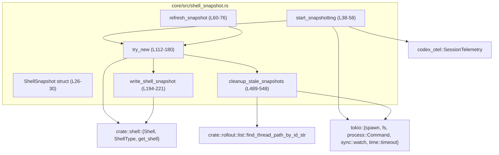
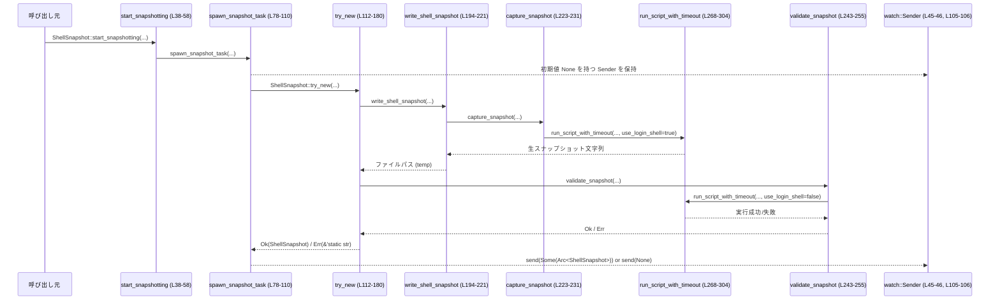
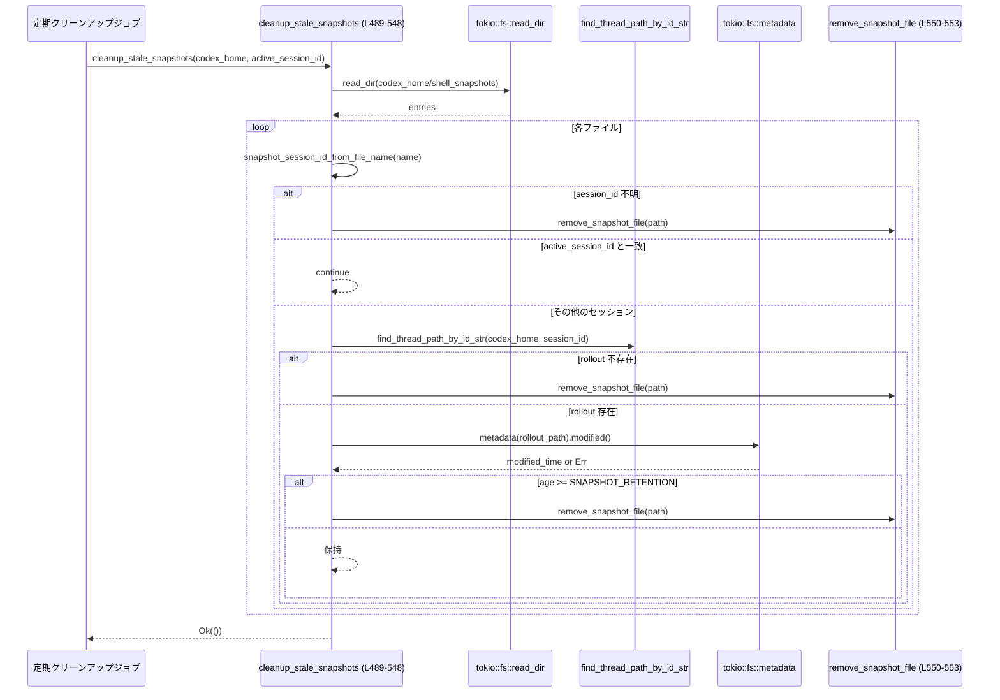

# core/src/shell_snapshot.rs コード解説

## 0. ざっくり一言

このモジュールは、対話セッション用のシェルの状態（関数・オプション・エイリアス・環境変数など）をスクリプトとしてスナップショット保存し、その寿命管理と古いスナップショットのクリーンアップを行う処理を提供します。

---

## 1. このモジュールの役割

### 1.1 概要

- このモジュールは **シェルの実行環境を再現可能な形で保存する** ために存在し、以下を行います。
  - 現在のシェル環境を、再度 `source`（読み込み）できるシェルスクリプトとして書き出す
  - 書き出したスクリプトがエラーなく読み込めるか検証する
  - セッション単位でスナップショットファイルを管理し、不要になったファイルを削除する

### 1.2 アーキテクチャ内での位置づけ

- 他モジュールとの関係は以下のとおりです。



※ 行番号は、このチャンクを 1 行目から手動採番したものです。

### 1.3 設計上のポイント

- **責務分割**
  - `ShellSnapshot` 構造体: スナップショットファイルのパスと、そのときの CWD を保持し、`Drop` でファイル削除を担当します（`shell_snapshot.rs:L26-30`, `L183-191`）。
  - スナップショット作成フロー: `start_snapshotting` / `refresh_snapshot` → `spawn_snapshot_task` → `try_new` → `write_shell_snapshot` / `validate_snapshot`（`L38-110`, `L112-180`, `L194-221`, `L243-255`）。
  - クリーンアップフロー: `cleanup_stale_snapshots` が単体で機能します（`L489-548`）。
- **状態管理**
  - スナップショット自体は `Arc<ShellSnapshot>` で共有され、`tokio::sync::watch::channel` を使って購読者へ配信されます（`L45-46`, `L90-97`, `L105-106`）。
- **エラーハンドリング**
  - 外部公開関数は基本的に `anyhow::Result` を返し、詳細なコンテキストメッセージを付与します（例: `write_shell_snapshot` `L194-221`, `cleanup_stale_snapshots` `L489-548`）。
  - `ShellSnapshot::try_new` は内部的な成功/失敗の原因を `'static str` のタグ（`"write_failed"`, `"validation_failed"`）で返し、テレメトリに使います（`L117`, `L155`, `L167`, `L103`）。
- **並行性**
  - スナップショット作成と古いスナップショットの削除はともに `tokio::spawn` によりバックグラウンドで実行されます（`L87-109`, `L137-141`）。
  - 子プロセス実行には `tokio::process::Command` と `tokio::time::timeout` を併用し、ハングを防いでいます（`L268-304`）。
- **安全性**
  - `Drop` で同期的に `std::fs::remove_file` を呼び、スナップショットファイルの取り残しを防ぎます（`L183-191`）。
  - シェル実行時には、UNIX では `pre_exec` フックで TTY から切り離し、親プロセスと干渉しないようにしています（`L285-290`）。

---

## 2. 主要な機能とコンポーネント一覧

### 2.1 機能一覧（概要）

- シェルスナップショットの非同期作成・更新
- スナップショットスクリプトの検証（エラーなく読み込めるか）
- シェル種別（zsh / bash / sh / PowerShell）ごとのスナップショットスクリプト生成
- スナップショットディレクトリ内の不要ファイルのクリーンアップ

### 2.2 コンポーネントインベントリー

| 名前 | 種別 | 公開 | 行範囲 | 役割 / 用途 |
|------|------|------|--------|-------------|
| `ShellSnapshot` | 構造体 | `pub` | `L26-30` | スナップショットファイルのパス (`path`) と、そのときの CWD (`cwd`) を保持する |
| `SNAPSHOT_TIMEOUT` | 定数 | `const`(モジュール内) | `L32` | スナップショット取得と検証に使うコマンドのタイムアウト（10 秒） |
| `SNAPSHOT_RETENTION` | 定数 | 同上 | `L33` | スナップショット保持期間（3 日） |
| `SNAPSHOT_DIR` | 定数 | 同上 | `L34` | スナップショットを保存するサブディレクトリ名 |
| `EXCLUDED_EXPORT_VARS` | 定数 | 同上 | `L35` | スナップショットから除外する環境変数名（`PWD`, `OLDPWD`） |
| `ShellSnapshot::start_snapshotting` | 関数(関連) | `pub` | `L38-58` | watch チャネルを作成し、バックグラウンドでスナップショット取得タスクを開始する |
| `ShellSnapshot::refresh_snapshot` | 関数(関連) | `pub` | `L60-76` | 既存のセッションでスナップショットを再取得するためにタスクを起動する |
| `ShellSnapshot::spawn_snapshot_task` | 関数(関連) | `fn` | `L78-110` | `tokio::spawn` でスナップショット作成タスクを起動し、テレメトリを記録する |
| `ShellSnapshot::try_new` | 関数(関連, async) | `async fn` | `L112-180` | スナップショットファイルの生成・検証・ファイナライズを行い、`ShellSnapshot` を構築する |
| `Drop for ShellSnapshot::drop` | メソッド | 自動 | `L183-191` | `ShellSnapshot` が最後にドロップされたとき、対応するファイルを削除する |
| `write_shell_snapshot` | 関数(async) | `fn`（非公開） | `L194-221` | 指定シェルでスナップショットを取得し、前処理をしてファイルに書き出す |
| `capture_snapshot` | 関数(async) | 同上 | `L223-231` | シェル種別に応じたスナップショットスクリプトを実行し、生の出力を取得する |
| `strip_snapshot_preamble` | 関数 | 同上 | `L234-241` | 出力から `# Snapshot file` 以前の行を削除し、本体のみを返す |
| `validate_snapshot` | 関数(async) | 同上 | `L243-255` | 生成したスナップショットスクリプトを実際に `source` し、エラーがないか確認する |
| `run_shell_script` | 関数(async) | 同上 | `L257-266` | ログインシェルとしてスクリプトを実行し、出力を返す |
| `run_script_with_timeout` | 関数(async) | 同上 | `L268-304` | `tokio::process::Command` でスクリプトを実行し、タイムアウト・終了ステータスを処理する |
| `excluded_exports_regex` | 関数 | 同上 | `L306-307` | 除外する環境変数名を `PWD\|OLDPWD` のような正規表現に結合する |
| `zsh_snapshot_script` | 関数 | 同上 | `L310-352` | zsh 用のスナップショット取得スクリプト文字列を生成する |
| `bash_snapshot_script` | 関数 | 同上 | `L354-393` | bash 用スクリプト生成 |
| `sh_snapshot_script` | 関数 | 同上 | `L396-462` | POSIX sh 用スクリプト生成 |
| `powershell_snapshot_script` | 関数 | 同上 | `L464-487` | PowerShell 用スナップショットスクリプト（ただし現状は上位で未使用） |
| `cleanup_stale_snapshots` | 関数(async) | `pub` | `L489-548` | 古い or 対応する rollout がないスナップショットファイルを削除する |
| `remove_snapshot_file` | 関数(async) | 非公開 | `L550-553` | スナップショットファイル削除の補助関数 |
| `snapshot_session_id_from_file_name` | 関数 | 非公開 | `L556-565` | スナップショットファイル名からセッション ID 部分を抽出する |
| `mod tests` | テストモジュール | `cfg(test)` | `L568-570` | テストコードは `shell_snapshot_tests.rs` に別ファイルとして存在（このチャンクには未掲載） |

---

## 3. 公開 API と詳細解説

### 3.1 型一覧

| 名前 | 種別 | 役割 / 用途 | フィールド |
|------|------|-------------|-----------|
| `ShellSnapshot` | 構造体 | スナップショットファイルのメタ情報（パスと CWD）を保持し、`Drop` でファイルのライフサイクルを管理する | `path: PathBuf`（スナップショットファイルへの絶対 or 相対パス）、`cwd: PathBuf`（スナップショット取得時のカレントディレクトリ） |

`ShellSnapshot` 自体は `Clone`, `Debug`, `PartialEq`, `Eq` を実装しており（派生）、さらに `Arc<ShellSnapshot>` として watch チャネルで共有されます（`L26-27`, `L45-46`, `L90-97`）。

---

### 3.2 重要関数の詳細

#### `ShellSnapshot::start_snapshotting(...) -> watch::Sender<Option<Arc<ShellSnapshot>>>`  （`L38-58`）

**概要**

指定されたセッションについて、シェルスナップショットをバックグラウンドで取得し、その結果を watch チャネルで配信するための初期化関数です。セッション開始時の 1 回目のスナップショット取得を想定したエントリポイントです。

**引数**

| 引数名 | 型 | 説明 |
|--------|----|------|
| `codex_home` | `PathBuf` | Codex のホームディレクトリ。`SNAPSHOT_DIR` 配下にスナップショットを保存します。 |
| `session_id` | `ThreadId` | セッション（スレッド）識別子。ファイル名の一部に使われます（`L127-132`）。 |
| `session_cwd` | `PathBuf` | スナップショット取得時のカレントディレクトリ。 |
| `shell` | `&mut Shell` | 対象シェルインスタンス。内部フィールド `shell.shell_snapshot` にレシーバをセットします（型はこのチャンクには明示的に出てきません）。 |
| `session_telemetry` | `SessionTelemetry` | スナップショット作成時間や成功/失敗を計測するテレメトリオブジェクト（`L89-106`）。 |

**戻り値**

- `watch::Sender<Option<Arc<ShellSnapshot>>>`  
  スナップショットを配信する送信側です。初期値は `None`（まだスナップショットがない状態）です（`L45`）。

**内部処理の流れ**

1. `watch::channel(None)` で `Option<Arc<ShellSnapshot>>` 用のチャネルを作成し、送受信両方を取得（`L45`）。
2. `shell.shell_snapshot = shell_snapshot_rx;` で、`Shell` 側にレシーバを保存（`L46`）。
3. `spawn_snapshot_task(...)` を呼び、バックグラウンドでスナップショット作成を開始（`L48-55`）。
4. 送信側 `shell_snapshot_tx` を呼び出し元に返す（`L57`）。

**Examples（使用例）**

```rust
// セッション開始時にスナップショット取得を開始する例
async fn start_session(
    codex_home: std::path::PathBuf,      // Codex ホーム
    session_id: codex_protocol::ThreadId,// セッション ID
    session_cwd: std::path::PathBuf,     // CWD
    shell: &mut crate::shell::Shell,     // シェル
    telemetry: codex_otel::SessionTelemetry,
) {
    // スナップショット取得タスクと watch チャネルをセットアップする
    let sender = ShellSnapshot::start_snapshotting(
        codex_home,
        session_id,
        session_cwd,
        shell,
        telemetry,
    );

    // sender を保持しておけば、後で refresh_snapshot に渡して再取得を指示できる
    let _shell_snapshot_tx = sender;
    // shell.shell_snapshot（レシーバ）はこのチャンク外のコードで参照される想定です。
}
```

**Errors / Panics**

- 本関数自体は `Result` を返さず、パニックも行いません。
- スナップショット作成中のエラーは、`spawn_snapshot_task` 内でログとテレメトリに記録され、チャネルには `None` もしくは未更新のままになる可能性があります（`L89-107`）。

**Edge cases（エッジケース）**

- スナップショット作成タスクが失敗した場合
  - `ShellSnapshot::try_new` から `"write_failed"` or `"validation_failed"` が返されると、テレメトリに `success=false` と `failure_reason` が記録されます（`L98-104`）。
  - チャネル送信は `snapshot.ok()` なので、失敗時には `None` が送信されます（`L106`）。

**使用上の注意点**

- `Shell` の `shell.shell_snapshot` フィールドはここで上書きされます。既存のレシーバを使っているコードがある場合、その挙動を確認する必要があります（`L45-46`）。
- 本関数はスナップショット取得を非同期タスクとして起動するだけであり、呼び出し直後にはスナップショットが存在しない可能性があります。チャネル側で `Option` を確認する必要があります。

---

#### `ShellSnapshot::refresh_snapshot(...)`  （`L60-76`）

**概要**

既にスナップショット取得がセットアップされたセッションで、新しいスナップショットを再取得するためのヘルパーです。`start_snapshotting` とは異なり、`Shell` の `shell_snapshot` レシーバは変更せず、既存の `Sender` を再利用します。

**引数**

| 引数名 | 型 | 説明 |
|--------|----|------|
| `codex_home` | `PathBuf` | スナップショットディレクトリのベースパス |
| `session_id` | `ThreadId` | 対象セッション ID |
| `session_cwd` | `PathBuf` | 再取得時の CWD |
| `shell` | `Shell` | スナップショットを取得するためのシェルインスタンス（値渡し） |
| `shell_snapshot_tx` | `watch::Sender<Option<Arc<ShellSnapshot>>>` | 既存のスナップショット送信用チャネル |
| `session_telemetry` | `SessionTelemetry` | テレメトリ記録用 |

**戻り値**

- なし（`()`）。

**内部処理**

- `spawn_snapshot_task(...)` をそのまま呼び出すだけです（`L68-75`）。

**使用上の注意点**

- `shell` は値として渡されるため、`Clone` 可能な前提です。このチャンクでは `Shell` 型の詳細は不明ですが、`start_snapshotting` では `shell.clone()` が使われていることから `Clone` 実装があると分かります（`L52`）。
- `shell_snapshot_tx` を使って新しい `Arc<ShellSnapshot>` が配信されるため、レシーバ側は値の変化を watch する必要があります。

---

#### `ShellSnapshot::try_new(...) -> std::result::Result<ShellSnapshot, &'static str>`  （`L112-180`）

**概要**

実際にスナップショットファイルを生成し、検証し、最終ファイル名にリネームした上で `ShellSnapshot` を構築するコアロジックです。失敗時のエラーは `'static str` のコードで返され、テレメトリ用に利用されます。

**引数**

| 引数名 | 型 | 説明 |
|--------|----|------|
| `codex_home` | `&Path` | Codex ホームディレクトリ |
| `session_id` | `ThreadId` | セッション ID |
| `session_cwd` | `&Path` | カレントディレクトリ |
| `shell` | `&Shell` | 対象シェル |

**戻り値**

- `Ok(ShellSnapshot)`  
  正常にスナップショットが作成・検証・リネームされた場合。
- `Err("write_failed")`  
  スナップショットの書き出し or リネームに失敗した場合（`L155`, `L173`）。
- `Err("validation_failed")`  
  検証（`validate_snapshot`）に失敗した場合（`L167`）。

**内部処理の流れ**

1. シェル種別に応じて拡張子を決定（PowerShell: `ps1`, その他: `sh`）（`L119-122`）。
2. UNIX エポックからのナノ秒を `nonce` として取得し、セッション ID + nonce + 拡張子で本番パスを生成（`L123-130`）。
3. 同じく `session_id.tmp-{nonce}` という一時ファイルパスを生成（`L131-132`）。
4. リークしていた古いスナップショットをクリーンアップするタスクを `tokio::spawn` で起動（`cleanup_stale_snapshots` 呼び出し）（`L134-141`）。
5. `write_shell_snapshot` を用いて、一時パスにスナップショットを書き出す（`L144-157`）。
   - 成功時: パスを受け取りログを出す（`L146-148`）。
   - 失敗時: 警告ログを出し、`Err("write_failed")` を返す（`L150-156`）。
6. 一時スナップショットオブジェクト `temp_snapshot` を構築（`L159-162`）。
7. `validate_snapshot` でスナップショットを検証する（`L164-168`）。
   - 失敗時: エラーログを出し、一時ファイルを削除して `Err("validation_failed")` を返す（`L165-167`）。
8. `fs::rename` で一時ファイルを本番パスへ移動（`L170-174`）。
   - 失敗時: 警告ログ、一時ファイル削除、`Err("write_failed")` を返す。
9. 最終的な `ShellSnapshot` を `Ok(Self { path, cwd })` で返す（`L176-179`）。

**Errors / Panics**

- 戻り値の `Err` は `"write_failed"` または `"validation_failed"` の 2 種類のみ（`L155`, `L167`, `L173`）。
- 内部では `write_shell_snapshot` / `validate_snapshot` / `fs::rename` の失敗に依存しますが、詳細なエラーオブジェクトはここでは保持せず、ログにのみ出力されます。

**Edge cases**

- PowerShell/Cmd の場合
  - `write_shell_snapshot` 側で `bail!` するため、ここでは `"write_failed"` として扱われます（上位関数から見た区別はつきません）（`L194-201`）。
- `SystemTime::now().duration_since(UNIX_EPOCH)` が失敗した場合
  - `unwrap_or(0)` により `nonce` は 0 にフォールバックします（`L123-126`）。この場合も処理は継続しますが、ファイル名の一意性はセッション ID + `.tmp-0` のみになります。

**使用上の注意点**

- この関数は `async fn` であり、Tokio ランタイムなどの非同期コンテキストで `await` する必要があります。
- エラーコードが限定的であるため、呼び出し側で失敗理由の詳細を知るにはログを参照する必要があります（`tracing::info/warn/error`）。

---

#### `async fn write_shell_snapshot(shell_type: ShellType, output_path: &Path, cwd: &Path) -> Result<PathBuf>`  （`L194-221`）

**概要**

指定されたシェル種別で環境スナップショットを取得し、所定のパスにシェルスクリプトとして書き出します。スナップショットの内容には関数/オプション/エイリアス/環境変数などが含まれます。

**引数**

| 引数名 | 型 | 説明 |
|--------|----|------|
| `shell_type` | `ShellType` | 対象シェルの種類（Zsh, Bash, Sh, PowerShell, Cmd など） |
| `output_path` | `&Path` | スナップショットを書き出すファイルパス（一時パスを想定） |
| `cwd` | `&Path` | スナップショット取得用シェルのカレントディレクトリ |

**戻り値**

- `Ok(PathBuf)`  
  実際に書き込まれたファイルパス（`output_path` のクローン、`L220`）。
- `Err(anyhow::Error)`  
  シェル未サポート、シェル取得失敗、スナップショット失敗、ディレクトリ作成失敗、ファイル書き込み失敗など。

**内部処理**

1. PowerShell または Cmd の場合、まだスナップショット未対応のため `bail!` して即座にエラーを返す（`L199-201`）。
2. `get_shell(shell_type.clone(), None)` で実行可能なシェルを取得し、失敗時にはコンテキストメッセージを付加（`L202-203`）。
3. `capture_snapshot(&shell, cwd)` を実行し、生のスナップショット文字列を取得（`L205`）。
4. `strip_snapshot_preamble` で出力の先頭からコメントや不要な行を削除し、`# Snapshot file` 以降だけを残す（`L206`, `L234-241`）。
5. `output_path` の親ディレクトリが存在しなければ `fs::create_dir_all` で作成（`L208-213`）。
6. `fs::write(output_path, snapshot)` でファイルに書き出し、失敗時には `anyhow::Context` 付きのエラーを返す（`L215-218`）。
7. 最後に `Ok(output_path.to_path_buf())` を返す（`L220`）。

**Errors / Panics**

- PowerShell/Cmd の場合: `"Shell snapshot not supported yet for {shell_type:?}"` というメッセージで `Err`（`L199-201`）。
- シェルが見つからない場合: `"No available shell for {shell_type:?}"`（`L202-203`）。
- スナップショット実行エラー: `capture_snapshot` 内でのエラー（後述）（`L205`）。
- ディレクトリ作成・ファイル書き込みエラー: コンテキスト付き `Err`（`L210-213`, `L215-218`）。

**Edge cases**

- `output_path.parent()` が `None` の場合（ルートに直接書くなど）
  - 親ディレクトリ作成処理はスキップされ、直接書き込みが行われます（`L208` の if が通らない）。
- スナップショット出力に `# Snapshot file` マーカーがない場合
  - `strip_snapshot_preamble` が `bail!("Snapshot output missing marker {marker}")` でエラーになります（`L235-238`）。

**使用上の注意点**

- 非同期 I/O (`tokio::fs`) を利用しているため、必ず `await` する必要があります。
- PowerShell / Cmd のスナップショットは現時点ではサポートされていないため、この関数を直接呼ぶ場合はシェル種別を確認する必要があります。
- `EXCLUDED_EXPORT_VARS`（`PWD`, `OLDPWD`）は下位のスクリプト生成関数の中で使われ、環境変数をフィルタします（`L306-352`, `L354-393`, `L396-462`）。

---

#### `async fn capture_snapshot(shell: &Shell, cwd: &Path) -> Result<String>`  （`L223-231`）

**概要**

指定されたシェルインスタンスで、スナップショット取得用のシェルスクリプトを実行し、その標準出力（テキスト）を取得します。

**引数**

| 引数名 | 型 | 説明 |
|--------|----|------|
| `shell` | `&Shell` | 実行対象のシェル |
| `cwd` | `&Path` | スクリプト実行時の CWD |

**戻り値**

- `Ok(String)`  
  スナップショットスクリプトの標準出力（マーカーなどを含む）。
- `Err(anyhow::Error)`  
  スクリプト実行失敗 or 未サポートシェル。

**内部処理**

1. `shell.shell_type.clone()` でシェル種別を取得（`L224`）。
2. `match` によりシェル種別ごとに以下を呼び分け（`L225-231`）:
   - `Zsh` → `run_shell_script(shell, &zsh_snapshot_script(), cwd)`
   - `Bash` → `run_shell_script(shell, &bash_snapshot_script(), cwd)`
   - `Sh` → `run_shell_script(shell, &sh_snapshot_script(), cwd)`
   - `PowerShell` → `run_shell_script(shell, powershell_snapshot_script(), cwd)`
   - `Cmd` → `bail!("Shell snapshotting is not yet supported for {shell_type:?}")`

**Errors / Panics**

- `Cmd` の場合は直接 `bail!` で `Err`（`L230`）。
- それ以外は `run_shell_script` のエラーに準じます（後述）。

**Edge cases**

- PowerShell について
  - この関数は PowerShell 用スクリプトを実行する分岐を持ちますが、`write_shell_snapshot` の上位チェックにより実際には呼ばれません（`L199-201`）。
- `cwd` が存在しない or アクセス不可
  - 子プロセス起動時の `current_dir(cwd)` でエラーとなり、`run_script_with_timeout` の `with_context` 部分のエラーに反映されます（`L283`, `L295`）。

**使用上の注意点**

- この関数は「生の」スナップショット文字列を返すのみで、前処理（マーカー以前の削除）は `strip_snapshot_preamble` に任されています。
- シェル種別によってスナップショットのフォーマットが異なりますが、すべて最終的には `# Snapshot file` というマーカーを含むように設計されています（`L318-319`, `L359`, `L401`, `L466`）。

---

#### `async fn run_script_with_timeout(...) -> Result<String>`  （`L268-304`）

**概要**

指定したシェルにスクリプトを渡して実行し、標準出力を文字列として返します。タイムアウトと異常終了を扱う汎用ヘルパーです。

**引数**

| 引数名 | 型 | 説明 |
|--------|----|------|
| `shell` | `&Shell` | 実行対象のシェル |
| `script` | `&str` | 実行するスクリプト |
| `snapshot_timeout` | `Duration` | タイムアウト時間（通常 `SNAPSHOT_TIMEOUT`） |
| `use_login_shell` | `bool` | ログインシェルとして起動するかどうか。スナップショット取得では `true`、検証では `false`（`L257-265`, `L243-252`）。 |
| `cwd` | `&Path` | 実行時のカレントディレクトリ |

**戻り値**

- `Ok(String)`  
  子プロセスの標準出力。
- `Err(anyhow::Error)`  
  プロセス起動エラー、タイムアウト、非ゼロ終了ステータスなど。

**内部処理**

1. `shell.derive_exec_args(script, use_login_shell)` で実際に起動するコマンドライン引数配列を取得（`L275`）。実装はこのチャンクにはありません。
2. `Command::new(&args[0])` で `tokio::process::Command` を作成し、残りの引数を `.args(&args[1..])` で設定（`L280-281`）。
3. 標準入力は `Stdio::null()` にし、CWD を設定（`L282-283`）。
4. UNIX 環境では、`pre_exec` で TTY から切り離す `detach_from_tty()` を実行（`L285-290`）。これは `unsafe` ブロック内で行われます。
5. `handler.kill_on_drop(true)` を設定し、ハンドラがドロップされた場合に子プロセスが kill されるようにします（`L291`）。
6. `timeout(snapshot_timeout, handler.output())` で、子プロセスの終了＋出力取得をタイムアウト付きで待機（`L292-295`）。
   - タイムアウト時: `"Snapshot command timed out for {shell_name}"` というメッセージで `Err` を返す（`L293-294`）。
   - 出力取得失敗: `"Failed to execute {shell_name}"` というコンテキスト付きエラー（`L295`）。
7. プロセスの終了コードをチェックし、成功でない場合にはステータスと stderr を含むエラーメッセージで `bail!`（`L297-301`）。
8. 成功時には stdout を UTF-8 としてロスレス変換し `String` にして返す（`L303`）。

**Errors / Panics**

- タイムアウト、起動失敗、非 0 ステータスはすべて `anyhow::Error` として返されます。
- パニックは発生しません。

**Edge cases**

- stdout/stderr が非 UTF-8 の場合
  - `String::from_utf8_lossy` により置換文字入りの文字列になります（`L299`, `L303`）。
- タイムアウト発生時
  - `timeout` が `Err(_)` を返し、`map_err(|_| anyhow!("..."))` でラップされます（`L292-295`）。この場合、`kill_on_drop(true)` により子プロセスはキャンセルされることが期待されます。

**使用上の注意点**

- 非同期関数ですので、必ず `await` が必要です。
- `derive_exec_args` の挙動（シェルのラッパなど）はこのチャンクには定義がなく、コマンドラインインジェクション対策などを行っているかどうかはここからは分かりません。
- `pre_exec` は `unsafe` な OS レベル操作を行うため、`codex_utils_pty::process_group::detach_from_tty()` の実装に依存した安全性上の前提があります（`L285-289`）。

---

#### `pub async fn cleanup_stale_snapshots(codex_home: &Path, active_session_id: ThreadId) -> Result<()>`  （`L489-548`）

**概要**

スナップショットディレクトリ内のファイルを走査し、以下に該当するファイルを削除します。

- 対応する rollout ファイルが存在しないセッション ID のスナップショット
- rollout が `SNAPSHOT_RETENTION`（3 日）以上更新されていないセッションのスナップショット

アクティブなセッション ID に対応するスナップショットは削除しません。

**引数**

| 引数名 | 型 | 説明 |
|--------|----|------|
| `codex_home` | `&Path` | Codex ホームディレクトリ |
| `active_session_id` | `ThreadId` | 現在アクティブなセッション ID |

**戻り値**

- `Ok(())`  
  正常に処理が完了した場合（削除の有無は問わない）。
- `Err(anyhow::Error)`  
  スナップショットディレクトリの読み込みエラー、`find_thread_path_by_id_str` のエラーなど。

**内部処理**

1. `snapshot_dir = codex_home.join(SNAPSHOT_DIR)` を構築（`L493`）。
2. `fs::read_dir(&snapshot_dir)` を実行し、ディレクトリが存在しない (`ErrorKind::NotFound`) 場合は即座に `Ok(())` を返す（`L495-498`）。
3. `SystemTime::now()` と `active_session_id.to_string()` を取得（`L501-502`）。
4. ディレクトリエントリを `while let Some(entry) = entries.next_entry().await?` で非同期に反復（`L504-545`）。
   - ファイルでない場合はスキップ（`L505-507`）。
   - ファイル名から `snapshot_session_id_from_file_name` でセッション ID を抽出（`L511-515`）。失敗した場合はファイルを削除しスキップ（`L513-515`）。
   - 抽出した ID が `active_session_id` と一致する場合はスキップ（`L517-518`）。
   - `find_thread_path_by_id_str(codex_home, session_id).await?` で rollout ファイルパスを探す（`L521`）。
     - 見つからなければスナップショットファイル削除（`L522-524`）。
   - rollout ファイルの `metadata().modified()` を取得（`L527-528`）。失敗時には警告ログを出してスキップ（`L529-535`）。
   - `now.duration_since(modified).ok()` で差分時間を求め、`age >= SNAPSHOT_RETENTION` の場合にスナップショットファイルを削除（`L538-543`）。
5. ループ終了後、`Ok(())` を返す（`L547`）。

**Errors / Panics**

- `fs::read_dir` が `NotFound` 以外のエラーを返した場合、`Err` で伝搬（`L495-499`）。
- `entries.next_entry().await?` でエラーが起きた場合も `Err` で伝搬（`L504`）。
- `find_thread_path_by_id_str` が `Err` の場合、そのまま `?` で返されます（`L521`）。

**Edge cases**

- スナップショットファイル名が期待するパターンでない場合
  - `snapshot_session_id_from_file_name` が `None` を返し、そのファイルは削除対象になります（`L511-515`, `L556-565`）。
- rollout ファイルの `modified()` が取得できない場合
  - 警告をログに出し、そのスナップショットは削除も保持もせずスキップされます（`L529-536`）。
- `now.duration_since(modified)` が `Err` になる場合
  - `ok()` により `None` となり、削除条件 `is_some_and` が `false` になるため削除されません（`L538-541`）。

**使用上の注意点**

- 非同期関数ですので、定期的なクリーンアップジョブから `await cleanup_stale_snapshots(...)` のように呼び出す設計が自然です。
- `active_session_id` は文字列表現ベースで比較されるため、`ThreadId::to_string()` の出力フォーマットがファイル名中のセッション ID と一致していることが前提です（`L502`, `L513-518`）。この前提はこのチャンク外の実装に依存します。
- クリーンアップはスナップショットディレクトリのエントリ数に比例する時間がかかりますが、非同期 I/O を利用しており、イベントループをブロックしにくい構造になっています。

---

#### `fn snapshot_session_id_from_file_name(file_name: &str) -> Option<&str>`  （`L556-565`）

**概要**

スナップショットファイル名から、セッション ID 部分を推定して返します。`cleanup_stale_snapshots` の内部でのみ使用されます。

**主要ロジック**

- `file_name.rsplit_once('.')` で拡張子を分離し、以下のように分岐（`L557-565`）。
  - 拡張子が `"sh"` または `"ps1"` の場合
    - `stem` を `.` で再度分割し、`session_id.generation` のような形式を想定しつつ、`session_id` 部分だけを返す（`L559-562`）。
  - 拡張子が `"tmp-*"` で始まる場合
    - `stem` 全体をセッション ID と見なして返す（`L563`）。
  - その他の拡張子は `None`。

**注意点**

- ファイル名フォーマットの詳細はこのチャンク内で明文化されていませんが、`try_new` で生成されるファイル名 `"{session_id}.{nonce}.{extension}"` および `"{session_id}.tmp-{nonce}"` に整合するように設計されています（`L127-132`）。

---

### 3.3 その他の関数（一覧）

| 関数名 | 行範囲 | 役割（1 行） |
|--------|--------|--------------|
| `ShellSnapshot::spawn_snapshot_task` | `L78-110` | スナップショット作成タスクを `tokio::spawn` し、テレメトリの計測と watch チャネルへの送信を行う |
| `validate_snapshot` | `L243-255` | 生成したスナップショットスクリプトを非ログインシェルで `source` して検証する |
| `run_shell_script` | `L257-266` | ログインシェルとしてスナップショット取得スクリプトを実行する薄いラッパ |
| `strip_snapshot_preamble` | `L234-241` | スナップショット出力から `# Snapshot file` 以前のノイズを切り落とす |
| `excluded_exports_regex` | `L306-307` | 除外する環境変数名を正規表現文字列に連結する |
| `zsh_snapshot_script` | `L310-352` | Zsh 用スナップショット取得スクリプト文字列（エイリアス/関数/オプション/環境変数を収集）を返す |
| `bash_snapshot_script` | `L354-393` | Bash 用スナップショット取得スクリプト |
| `sh_snapshot_script` | `L396-462` | POSIX sh 用スナップショット取得スクリプト |
| `powershell_snapshot_script` | `L464-487` | PowerShell 用スナップショット取得スクリプト（現状 write 側からは呼ばれない） |
| `remove_snapshot_file` | `L550-553` | 非同期にスナップショットファイルを削除し、失敗時には警告ログを出す |
| `Drop for ShellSnapshot` | `L183-191` | `ShellSnapshot` のライフタイム終了時にファイルを同期的に削除する |

---

## 4. データフロー

ここでは、「スナップショット取得」と「スナップショットクリーンアップ」の 2 つの代表的シナリオについて、データフローを示します。

### 4.1 スナップショット取得フロー



要点:

- 実際のシェル環境取得は別プロセス（子シェル）として実行されます（`run_script_with_timeout`, `L268-304`）。
- スナップショット検証も同様にシェルを起動して行われます。
- 呼び出し元は `ShellSnapshot` そのものではなく、`watch::Receiver<Option<Arc<ShellSnapshot>>>` を通じて更新通知を受け取る構造です（レシーバ側のコードはこのチャンクにはありません）。

### 4.2 クリーンアップフロー



---

## 5. 使い方（How to Use）

### 5.1 基本的な使用方法

セッション開始時にスナップショット取得を開始し、必要に応じて再取得・クリーンアップを行う典型的な流れです。

```rust
use std::path::PathBuf;
use codex_protocol::ThreadId;
use core::shell_snapshot::ShellSnapshot;       // 実際のパスは crate 構成に依存
use crate::shell::Shell;                       // このチャンク外で定義
use codex_otel::SessionTelemetry;

// 非同期コンテキスト（tokio ランタイム）内の想定
async fn setup_session(
    codex_home: PathBuf,
    session_id: ThreadId,
    session_cwd: PathBuf,
    shell: &mut Shell,
    telemetry: SessionTelemetry,
) {
    // 1. 初回スナップショット取得のセットアップ
    let shell_snapshot_tx = ShellSnapshot::start_snapshotting(
        codex_home.clone(),
        session_id,
        session_cwd.clone(),
        shell,
        telemetry.clone(),
    );

    // shell.shell_snapshot（レシーバ）は start_snapshotting 内で設定されます（L45-46）。

    // 2. セッション中にスナップショットを更新したい場合
    // （例: 環境が大きく変わったタイミング）
    let refreshed_shell = shell.clone();  // Shell が Clone を実装している前提（L52）
    ShellSnapshot::refresh_snapshot(
        codex_home.clone(),
        session_id,
        session_cwd.clone(),
        refreshed_shell,
        shell_snapshot_tx.clone(),
        telemetry.clone(),
    );

    // 3. 適当なタイミングで古いスナップショットをクリーンアップ
    cleanup_stale_snapshots(&codex_home, session_id).await.unwrap();
}
```

### 5.2 よくある使用パターン

1. **セッションごとに 1 つのスナップショットを保持する**
   - `start_snapshotting` により最初のスナップショットを取得。
   - セッション中に大きな変化（大量の `export` や `alias` 追加）があれば `refresh_snapshot` を呼び、新しいスナップショットを配信。

2. **バッチクリーンアップ**
   - 別のタスク or 定期ジョブで `cleanup_stale_snapshots` を定期的に呼び出し、古いスナップショットを削除してディスク使用量を制御する。

### 5.3 よくある間違いと注意点

```rust
// 間違い例: PowerShell セッションで write_shell_snapshot を直接呼ぶ
let result = write_shell_snapshot(ShellType::PowerShell, &output_path, &cwd);
// ↑ PowerShell/Cmd はまだサポートされていないため、必ず Err になる（L199-201）

// 正しい例: サポート対象シェルのみでスナップショットを取得する
let result = write_shell_snapshot(ShellType::Bash, &output_path, &cwd);
```

```rust
// 間違い例: start_snapshotting 直後にスナップショットが存在すると決め打ちする
let snapshot_arc = shell.shell_snapshot.borrow().as_ref().unwrap(); // panic の危険

// 正しい例: Option を確認してから利用する
if let Some(snapshot_arc) = shell.shell_snapshot.borrow().as_ref() {
    println!("Snapshot path = {}", snapshot_arc.path.display());
} else {
    // まだスナップショットが作成されていない状態
}
```

※ `shell.shell_snapshot` の具体的な型やアクセス方法はこのチャンクには定義がないため、上記は一般的な `watch::Receiver<Option<Arc<_>>>` に対する例です。

### 5.4 使用上の注意点（まとめ）

- **並行性**
  - スナップショット作成とクリーンアップは `tokio::spawn` でバックグラウンド実行されるため、呼び出し元はノンブロッキングです（`L87-109`, `L137-141`）。
  - ただし、`ShellSnapshot` の `Drop` は同期的な `std::fs::remove_file` を呼ぶため、最後の `Arc` がドロップされるスレッドで短時間のブロッキングが発生します（`L183-191`）。
- **エラー処理**
  - 多くの関数は `anyhow::Result` を返すため、`?` 演算子で自然に伝播できます。
  - `try_new` のみ `'static str` をエラーとして返し、テレメトリ用途に利用しています。
- **安全性・セキュリティ**
  - 実行するスクリプトはこのモジュール内で固定文字列として定義されており（zsh/bash/sh/PowerShell スクリプト、`L310-487`）、外部から直接注入されることはありません。
  - ただし、`validate_snapshot` では生成したスナップショットファイルを `source` するため、そのファイル内容が安全である前提です（ファイル内容はこのモジュールのスクリプト生成ロジックに由来します）。
- **環境変数の除外**
  - `PWD` と `OLDPWD` は `EXCLUDED_EXPORT_VARS` によってスナップショットから除外されます（`L35`, `L306-307`, `L332-344`, `L376-391`, `L431-443`）。
  - PowerShell 用スクリプトでは、この除外ロジックは使われていません（`L464-485`）。ただし PowerShell スナップショット自体が write パスで無効化されているため、実際には利用されません（`L199-201`）。

---

## 6. 変更の仕方（How to Modify）

### 6.1 新しい機能を追加する場合

例: **新しいシェル種別（例: Fish）に対応したい場合**

1. **シェル種別の追加**
   - `ShellType` 列挙体（別モジュール; このチャンクには未掲載）に `Fish` を追加し、`get_shell` / `Shell::derive_exec_args` の対応を整える必要があります。
2. **スナップショットスクリプトの追加**
   - `zsh_snapshot_script` / `bash_snapshot_script` / `sh_snapshot_script` と同様に、`fish_snapshot_script` 関数を追加し、Fish 用のスクリプト文字列を返すようにします。
3. **`capture_snapshot` の更新**
   - `match shell_type` の分岐に `ShellType::Fish => run_shell_script(shell, &fish_snapshot_script(), cwd).await` を追加します（`L225-231`）。
4. **サポートフラグの確認**
   - PowerShell/Cmd のように未サポート扱いにしたい場合は、`write_shell_snapshot` の最初のチェックに Fish を含めるかどうかを決めます（`L199-201`）。

### 6.2 既存の機能を変更する場合の注意点

- **ファイル名フォーマットを変更する場合**
  - `try_new` が生成するファイル名（`L127-132`）と、`snapshot_session_id_from_file_name` の解析ロジック（`L556-565`）が整合するように同時に変更する必要があります。
  - `cleanup_stale_snapshots` はこのロジックに依存しているため、影響範囲に注意します（`L511-515`）。
- **保持期間 (`SNAPSHOT_RETENTION`) を変更する場合**
  - 定数値の変更のみで済みますが、クリーンアップタイミングがシステム全体のディスク使用量とトレードオフになることに留意する必要があります（`L33`, `L538-541`）。
- **テレメトリのタグを拡張する場合**
  - `spawn_snapshot_task` 内で success / failure_reason のタグを組み立てています（`L98-104`）。ここに新しいタグを追加することができますが、ダッシュボードやアラートとの整合が必要になります。
- **子プロセス実行ポリシーを変える場合**
  - タイムアウト時間 (`SNAPSHOT_TIMEOUT`, `L32`) や `kill_on_drop(true)`（`L291`）、`pre_exec` での TTY 切り離し（`L285-290`）は、安全性と安定性に大きく関わるため、変更時には十分なテストが必要です。

---

## 7. 関連ファイル

| パス / モジュール | 役割 / 関係 |
|-------------------|------------|
| `crate::shell::{Shell, ShellType, get_shell}` | 対象シェルの抽象化と実行方法（引数生成）を提供します。`write_shell_snapshot`, `capture_snapshot`, `run_script_with_timeout` などで使用されています（`L119`, `L194-203`, `L223-231`, `L275-276`）。 |
| `crate::rollout::list::find_thread_path_by_id_str` | セッション ID から rollout ファイルのパスを検索する関数で、クリーンアップ対象を判断するために用いられます（`L9`, `L521`）。 |
| `codex_otel::SessionTelemetry` | スナップショット処理の時間計測と成功/失敗カウンタ送信に使用されます（`L17`, `L89-106`）。 |
| `codex_protocol::ThreadId` | セッション ID 型。ファイル名生成や `active_session_id` 比較に使用されます（`L18`, `L114`, `L492`, `L502`）。 |
| `codex_utils_pty::process_group::detach_from_tty` | UNIX 環境で子プロセスを TTY から切り離すための低レベル関数です（`L287-288`）。実装はこのチャンクには存在しません。 |
| `core/src/shell_snapshot_tests.rs` | テストコード。`#[cfg(test)]` モジュールとして `mod tests;` からインクルードされますが、このチャンクには内容が含まれていません（`L568-570`）。 |

このモジュールを利用または変更する場合は、特に `crate::shell` と `crate::rollout::list` の API との整合性に注意する必要があります。
