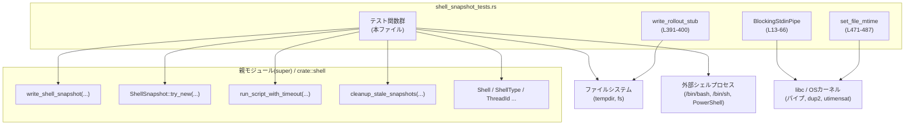
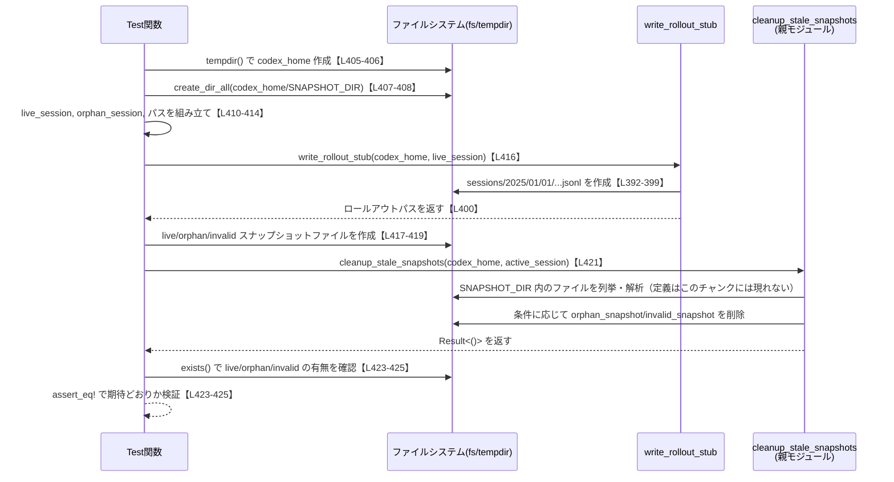
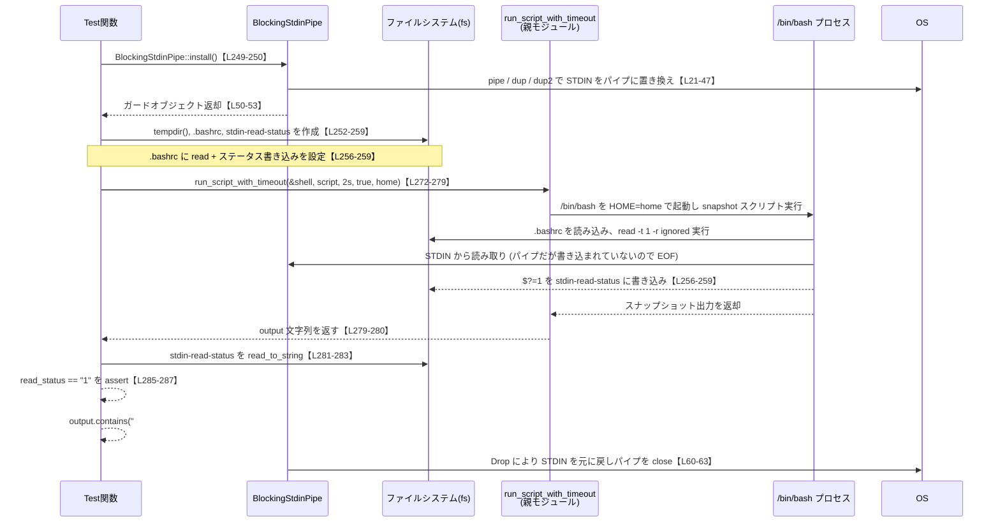

# core/src/shell_snapshot_tests.rs

## 0. ざっくり一言

このファイルは、シェルスナップショット機能（環境のダンプ、ファイル生成・クリーンアップ、タイムアウト挙動など）を検証する **統合テスト群とテスト用ユーティリティ** をまとめたモジュールです。

---

## 1. このモジュールの役割

### 1.1 概要

- このモジュールは、`Shell` / `ShellSnapshot` まわりの機能が OS ごとに期待どおり動作することを検証するために存在します。
- スナップショットファイルのフォーマットやファイル名のパース、シェル起動時の環境変数の扱い、標準入力の継承有無、タイムアウト時の挙動、古いスナップショットの削除ロジックをテストします。
- また、テストのために stdin を一時差し替える `BlockingStdinPipe` や、ロールアウトファイルを生成する `write_rollout_stub` などの補助関数を提供します。

### 1.2 アーキテクチャ内での位置づけ

このファイルは `super::*` をインポートしており、親モジュール側で定義されている以下のような機能に依存してテストを行います（実体定義はこのチャンクには現れません）。

- `write_shell_snapshot`（スナップショットスクリプトを生成）【L80-85】
- `strip_snapshot_preamble`（スナップショットのプレアンブル除去）【L88-99】
- `snapshot_session_id_from_file_name`（スナップショットファイル名からセッション ID 抜き出し）【L101-121】
- `Shell`, `ShellSnapshot::try_new`（スナップショット生成・ライフサイクル）【L187-245】
- `run_script_with_timeout`（シェルスクリプトのタイムアウト付き実行）【L272-323】
- `cleanup_stale_snapshots`, `SNAPSHOT_DIR`, `SNAPSHOT_RETENTION`（古いスナップショットやロールアウトの削除）【L403-447】
- `ThreadId`, `ShellType` 等のドメイン型【L187-245, L359-385, L391-400】

依存関係を簡略化した図は次のとおりです。



### 1.3 設計上のポイント

- **OS / プラットフォームごとの分岐**  
  - `#[cfg(unix)]`, `#[cfg(target_os = "...")]`, `#[cfg(not(target_os = "windows"))]` でテストを分岐し、利用可能なシェル・システムコールに合わせています【L3-8, L12, L18-19, L57-58, L68, L123-125, L147-149, L187-189, L211-213, L247-249, L298-300, L356-358, L364-366, L372-374, L380-383, L429-431, L451-452, L471】。
- **非同期テストと並行性**  
  - 多くのテストは `#[tokio::test]` を用いた async 関数であり、`tokio` ランタイム上で非同期にファイル I/O・プロセス待機・タイムアウト制御を行います【L187-189, L211-213, L247-249, L298-300, L356-358, L364-366, L372-374, L380-383, L403-404, L429-431, L451-452】。
- **安全性とエラーハンドリング**  
  - テスト内では `Result<()>` と `?` 演算子によりエラーを明示的に伝播させつつ、動作検証のために `assert!`, `assert_eq!`, `.expect()` を多用します。
  - 低レベルな `libc` 呼び出しを行う箇所（`BlockingStdinPipe`, `set_file_mtime`）では、エラーコードを `std::io::Error::last_os_error()` から取得し、`anyhow::Context` で文脈を付与しています【L22-24, L27-34, L36-43, L473-479, L483-486】。
- **テストの隔離性**  
  - 実ファイルは `tempfile::tempdir()` で毎回テンポラリディレクトリを作成しており、テスト間でファイルが衝突しないようになっています【L80-82, L190, L214, L252, L306-308, L405, L432, L453】。
- **プロセス全体の状態を扱うテスト**  
  - `BlockingStdinPipe` により **プロセス全体の標準入力を一時差し替え** するなど、グローバルな状態を前提としたテストも含まれます【L13-16, L19-54, L58-66】。並列実行には注意が必要です（詳細は後述）。

---

## 2. 主要な機能一覧

このモジュールがテストしている代表的な機能を列挙します。

- スナップショット文字列のプレアンブル除去ロジックの検証【L88-99】
- スナップショットファイル名からのセッション ID 抽出ロジックの検証【L101-121】
- Bash 用スナップショットスクリプトの環境変数フィルタリング・マルチライン値の保持の検証【L123-145, L147-185】
- `ShellSnapshot::try_new` によるスナップショットファイル生成・削除のライフサイクル／世代管理の検証【L187-245】
- スナップショット取得に用いるシェルプロセスが **標準入力を継承しない** ことの検証【L247-295】
- タイムアウト付きシェル実行 (`run_script_with_timeout`) がタイムアウト後にプロセスを終了させることの検証【L298-353】
- 各 OS/シェル種別ごとに、スナップショット内容に必須のセクションが含まれることの検証【L68-78, L356-378, L380-388】
- スナップショットおよび関連するロールアウトファイルのクリーンアップロジック (`cleanup_stale_snapshots`) の検証  
  - 孤児スナップショットの削除【L403-427】  
  - 古いロールアウトに対応するスナップショットの削除【L429-447】  
  - アクティブセッションのスナップショット保持【L451-468】
- テスト用のロールアウトファイル作成ユーティリティ `write_rollout_stub`【L391-400】
- ファイルの mtime を任意の「過去時刻」に書き換えるユーティリティ `set_file_mtime`【L471-487】

---

## 3. 公開 API と詳細解説

このファイルはテストモジュールであり外部公開 API はありませんが、他のテストからも再利用しうる **補助型・補助関数** を主な対象として整理します。

### 3.1 型一覧（構造体・列挙体など）

| 名前 | 種別 | 役割 / 用途 | 定義場所 |
|------|------|-------------|----------|
| `BlockingStdinPipe` | 構造体 | Unix 環境で、プロセスの標準入力 (`STDIN_FILENO`) を一時的にパイプで置き換え、テスト終了時に元に戻すガードオブジェクトです。`Drop` 実装により自動で後片付けを行います。 | `core/src/shell_snapshot_tests.rs:L13-16, L19-54, L58-66` |

### 3.2 関数詳細（最大 7 件）

#### `BlockingStdinPipe::install() -> Result<BlockingStdinPipe>`

**概要**

- 標準入力に対して **読み端だけをプロセスに残し、書き端を保持するパイプ** を作成し、現在の `STDIN` を保存した上で `STDIN` をこのパイプに差し替えます【L19-54】。
- 戻り値の `BlockingStdinPipe` が `Drop` されると、元の `STDIN` に復旧され、パイプの両端が閉じられます【L58-66】。

**引数**

なし（関連する設定は内部で行います）。

**戻り値**

- `Result<BlockingStdinPipe>`  
  - `Ok(BlockingStdinPipe { original, write_end })`: 差し替えに成功した場合。`original` は元の `STDIN` の FD、`write_end` は新しいパイプの書き端の FD です【L50-53】。  
  - `Err(anyhow::Error)`: `pipe`, `dup`, `dup2` のいずれかが失敗した場合に、`std::io::Error` にコンテキスト文字列を付けて返します【L22-24, L27-34, L36-43】。

**内部処理の流れ**

1. `libc::pipe` で 2 要素の FD 配列 `fds` を作成（読み端 `fds[0]`, 書き端 `fds[1]`）【L21-22】。
2. `pipe` が `-1` を返した場合、`std::io::Error::last_os_error()` を `Err` として返す【L22-24】。
3. `libc::dup(STDIN_FILENO)` で元の `STDIN` を複製し保存【L26】。失敗時はパイプの両端を `close` してエラーを返す【L27-34】。
4. `libc::dup2(fds[0], STDIN_FILENO)` で `STDIN` をパイプの読み端に置き換える【L36】。失敗時はパイプと `original` をすべて閉じてエラーを返す【L36-43】。
5. 使い終わった読み端 `fds[0]` を閉じ、書き端だけを保持する【L46-47, L50-53】。
6. `BlockingStdinPipe { original, write_end: fds[1] }` を返す【L50-53】。

`Drop` 実装の処理:

1. `dup2(self.original, STDIN_FILENO)` で元の `STDIN` を復元【L61】。
2. `original` と `write_end` の FD を閉じる【L62-63】。

**Examples（使用例）**

Unix 用のテスト `snapshot_shell_does_not_inherit_stdin` で使用されています【L247-250】。

```rust
#[cfg(unix)]
#[tokio::test]
async fn snapshot_shell_does_not_inherit_stdin() -> Result<()> {
    // プロセスの stdin をパイプに差し替え、そのガードを保持
    let _stdin_guard = BlockingStdinPipe::install()?;    // Drop 時に自動で復元される【L249-250】

    // 以降、run_script_with_timeout で起動するシェルが EOF を見るかを検証する …
    # Ok(())
}
```

**Errors / Panics**

- `Err` になる条件:
  - `libc::pipe` が失敗した場合（ファイルディスクリプタが枯渇している等）【L21-24】。
  - `dup(STDIN_FILENO)` が失敗した場合【L26-34】。
  - `dup2(fds[0], STDIN_FILENO)` が失敗した場合【L36-43】。
- パニックは使用していません。すべて OS エラーとして `Result` に包んで返します。

**Edge cases（エッジケース）**

- 既に `STDIN_FILENO` が閉じられているプロセスで呼び出した場合、`dup` や `dup2` が失敗し `Err` になります。
- テストプロセスがマルチスレッドであり、他スレッドでも `STDIN` に依存した処理を行っている場合、`STDIN` 差し替えの影響を受ける可能性があります（このファイル内ではそうしたケースは扱っていませんが、テストランナー側の並列実行設定に依存します）。

**使用上の注意点**

- プロセス全体の `STDIN` を変更するため、**同一プロセス内で並行に走る他のテストと干渉する可能性** があります。並列実行が有効なテストランナーで利用する場合は、テストのシリアライズなどが必要になることがあります。
- `BlockingStdinPipe` を保持している間に `fork` した場合など、`Drop` の復元が意図どおりに届かないシナリオについてはこのテストでは検証されていません。

---

#### `get_snapshot(shell_type: ShellType) -> Result<String>`

**概要**

- 指定した `ShellType` 用のスナップショットスクリプトを書き出し、そのファイル内容を文字列として読み取る **テスト用ヘルパー** です【L80-85】。

**引数**

| 引数名 | 型 | 説明 |
|--------|----|------|
| `shell_type` | `ShellType` | どのシェル種別のスナップショットを生成するか（例: `Bash`, `Sh`, `Zsh`, `PowerShell`）。定義はこのチャンクには現れませんが、テストでは `ShellType::Bash`, `ShellType::Sh`, `ShellType::Zsh`, `ShellType::PowerShell` を使用しています【L359-359, L367-367, L375-375, L384-384】。 |

**戻り値**

- `Result<String>`  
  - `Ok(snapshot_text)`: 生成された `snapshot.sh` ファイルの内容。
  - `Err(anyhow::Error)`: 一時ディレクトリの作成、スナップショット生成、ファイル読み込みのいずれかでエラーが発生した場合。

**内部処理の流れ**

1. `tempdir()` でテンポラリディレクトリを作成【L81】。
2. `dir.path().join("snapshot.sh")` でスナップショットファイルパスを組み立て【L82】。
3. `write_shell_snapshot(shell_type, &path, dir.path()).await?` で親モジュールのロジックを使ってスナップショットを生成【L83】。
4. `fs::read_to_string(&path).await?` でファイル内容を読み込む【L84】。
5. 読み込んだ内容を `Ok(content)` として返す【L85】。

**Examples（使用例）**

macOS / Linux / Windows のシェルごとのスナップショット内容検証に使われています【L356-378, L380-388】。

```rust
#[cfg(target_os = "linux")]
#[tokio::test]
async fn linux_bash_snapshot_includes_sections() -> Result<()> {
    let snapshot = get_snapshot(ShellType::Bash).await?;  // Bash 用スナップショットを取得【L367】
    assert_posix_snapshot_sections(&snapshot);            // 共通のセクションが含まれているか検証【L368】
    Ok(())
}
```

**Errors / Panics**

- `Err` になる主な条件:
  - 一時ディレクトリ作成に失敗した場合【L81】。
  - `write_shell_snapshot` 実行時にエラーが発生した場合【L83】。
  - ファイルの読み込みに失敗した場合【L84】。
- パニックはありません。

**Edge cases**

- `write_shell_snapshot` がファイルを書き出さなかった場合、`read_to_string` でエラーとなります。
- スナップショットが非常に大きい場合の性能は、テストコードからは特に制御していません。

**使用上の注意点**

- 一時ディレクトリの寿命は `dir` のスコープに依存するため、`get_snapshot` 内で完結したファイルパス以外は外部で保持しない前提のヘルパーです。
- シェル実行に時間がかかる場合、テスト全体の実行時間にも影響します（`write_shell_snapshot` 側の実装に依存）。

---

#### `try_new_creates_and_deletes_snapshot_file(...) -> Result<()>`

（テスト関数ですが、`ShellSnapshot::try_new` の契約を理解する上で重要なため詳細に説明します。）

**シグネチャ**

```rust
#[cfg(unix)]
#[tokio::test]
async fn try_new_creates_and_deletes_snapshot_file() -> Result<()> { ... }
```

【L187-209】

**概要**

- `ShellSnapshot::try_new` がスナップショットファイルを生成し、`ShellSnapshot` のドロップ時にファイルを削除するという **ライフサイクル契約** を検証するテストです。

**引数**

- テスト関数なので外部引数はありません。

**内部処理の流れ**

1. `tempdir()` で専用ディレクトリを作成【L190】。
2. `Shell` 構造体を `ShellType::Bash`, `/bin/bash` を用いて生成【L191-195】。`shell_snapshot` フィールドには `crate::shell::empty_shell_snapshot_receiver()` をセットしています（定義はこのチャンクには現れません）。
3. `ShellSnapshot::try_new(dir.path(), ThreadId::new(), dir.path(), &shell).await` を実行し、スナップショットが生成されることを期待【L197-199】。
4. 生成された `snapshot.path` を退避し【L200】、ファイルが存在することを `assert!(path.exists())` で確認【L201】。
5. `snapshot.cwd` が `dir.path()` と一致することを `assert_eq!` で確認【L202】。
6. `drop(snapshot);` により `ShellSnapshot` を明示的にドロップ【L204】。
7. ドロップ後に `path.exists()` が `false`（ファイル削除済み）であることを確認【L206】。

**Examples（使用例）**

他のテストでも同じパターンで `ShellSnapshot` を生成・破棄しています【L211-245】。

**Errors / Panics**

- `Result<()>` を返しますが、テスト本体では `.expect("snapshot should be created")` により `ShellSnapshot::try_new` 失敗時はパニックします【L197-199】。
- その後の `assert!` が失敗した場合もパニックします【L201-202, L206】。

**Edge cases**

- このテストは `ThreadId::new()` によるセッション ID の具体値には依存せず、単一の呼び出しがファイルを生成し、ドロップで削除されることだけを検証しています。
- スナップショットファイル名のフォーマットやディレクトリ構造などの詳細は別テスト／別モジュール側の責務です。

**使用上の注意点**

- `ShellSnapshot::try_new` 自体は非同期関数のため、テストには `#[tokio::test]` が必須です【L188-189】。
- 実際のコードで `ShellSnapshot` を利用する場合も、ドロップ時にファイルが削除される前提で設計されていると考えられます（ただし、実装の詳細はこのチャンクにはありません）。

---

#### `snapshot_shell_does_not_inherit_stdin(...) -> Result<()>`

**シグネチャ**

```rust
#[cfg(unix)]
#[tokio::test]
async fn snapshot_shell_does_not_inherit_stdin() -> Result<()> { ... }
```

【L247-295】

**概要**

- スナップショット取得に使うシェルプロセスが **親プロセスの stdin をブロックしない（EOF を即座に見る）** ことを検証するテストです。
- これにより、スナップショット取得処理が標準入力を消費してしまい、ユーザシェルなどの挙動に悪影響を与えることを防いでいると解釈できます。

**引数**

- 外部引数なし。

**内部処理の流れ**

1. `BlockingStdinPipe::install()?` でプロセス全体の `STDIN` をパイプに差し替える【L249-250】。
   - これにより、呼び出し後に `STDIN` から読み出すと EOF がすぐに返る状況を作ります（`write_end` に誰も書き込まないため）。
2. `tempdir()` でホームディレクトリ用ディレクトリを作成し【L252-253】、`stdin-read-status` というファイルパスを用意【L254】。
3. `.bashrc` に、起動時に `read -t 1 -r ignored` を実行し、その終了ステータス `$?` を `stdin-read-status` ファイルに書き出すスクリプトを書き込む【L256-259】。
4. `Shell` を `ShellType::Bash` と `/bin/bash` で構築【L261-265】。
5. `HOME` をテンポラリディレクトリに設定した上でシェルスナップショットスクリプトを実行するためのコマンド文字列を作成【L267-271】。
6. `run_script_with_timeout` でスナップショットスクリプトを 2 秒タイムアウトで実行【L272-280】。エラー時には `"run snapshot command"` というコンテキスト付きで `Err` を返します【L279-280】。
7. 実行後、`stdin-read-status` の内容を読み取り【L281-283】、その値が `"1"` であることを確認【L285-287】。
   - Bash の `read` は EOF を読むと終了ステータス 1 を返すため、stdin が EOF だったことを意味します。
8. シェル出力 `output` に `"# Snapshot file"` というマーカーが含まれることを確認【L290-293】。

**Examples（使用例）**

このテスト自体が代表例です。`BlockingStdinPipe` と `run_script_with_timeout` を組み合わせ、stdin の継承有無を検証しています。

**Errors / Panics**

- `BlockingStdinPipe::install` やファイル I/O, `run_script_with_timeout` が失敗した場合は `Err` を返します【L249-250, L252-259, L272-283】。
- `assert_eq!(read_status, "1", ...)` や `assert!(output.contains("# Snapshot file"), ...)` が失敗した場合はパニックします【L285-287, L290-293】。

**Edge cases**

- `.bashrc` が起動時に読み込まれないシェル設定になっている場合（例: ログインシェルでないなど）、このテストの前提が崩れますが、ここでは `run_script_with_timeout` 側の実装に依存しているため、詳細はこのチャンクからは分かりません。
- `read -t 1` のタイムアウトや OS・Bash バージョン依存の仕様による微妙な違いは、このテストでは 1 という終了ステータスに依存している点で前提になります。

**使用上の注意点**

- 実 OS の `/bin/bash` とその初期化挙動に依存するため、環境によりテスト結果が変わりうる点に注意が必要です。
- stdin の差し替えはプロセス全体に影響するため、このテストを他の stdin 利用テストと同時に走らせることは避ける必要があります。

---

#### `timed_out_snapshot_shell_is_terminated(...) -> Result<()>`

**シグネチャ**

```rust
#[cfg(target_os = "linux")]
#[tokio::test]
async fn timed_out_snapshot_shell_is_terminated() -> Result<()> { ... }
```

【L298-353】

**概要**

- `run_script_with_timeout` がタイムアウトした場合に、起動したシェルプロセスが **きちんと kill される** ことを検証する Linux 専用テストです。

**内部処理の流れ**

1. テンポラリディレクトリを作成【L306】し、そこに `pid` ファイルパスを作成【L307】。
2. シェル内で自身の PID (`$$`) を `pid` ファイルに書き込み、その後 30 秒 sleep するスクリプト `"echo $$ > \"{pid_path}\"; sleep 30"` を組み立て【L308】。
3. `Shell { shell_type: ShellType::Sh, shell_path: "/bin/sh", ... }` を構築【L310-314】。
4. `run_script_with_timeout` を 1 秒タイムアウトで実行し【L316-322】、`expect_err("snapshot shell should time out")` により **必ずタイムアウトエラーになる前提** を検証【L323-324】。
5. 得られたエラー文字列に `"timed out"` を含むことを確認【L325-327】。
6. `pid` ファイルを読み取り、そこから PID を `i32` にパース【L330-334】。
7. `tokio::time::Instant` と `TokioDuration::from_secs(1)` を使い、最大 1 秒間 `kill -0 PID` をポーリングしてプロセスが存在するかを確認【L336-351】。
   - `kill -0` が失敗したらプロセスは終了していると見なしてループを抜ける【L337-345】。
   - 1 秒経過してもプロセスが生きていれば `panic!("timed out snapshot shell is still alive after grace period")`【L347-349】。

**Errors / Panics**

- `run_script_with_timeout` がタイムアウト以外の理由で失敗した場合（例えば実行不可など）は、エラー文字列に `"timed out"` が含まれず、`assert!(err.to_string().contains("timed out"), ...)` がパニックします【L325-327】。
- `pid` ファイルが作成されない／読み取り失敗／パース失敗の場合は `?` により `Err` を返します【L330-334】。
- シェルプロセスが 1 秒以内に終了しない場合は `panic!` します【L347-349】。

**Edge cases**

- OS のスケジューリングやシェル実装によって、プロセス終了のタイミングが微妙に揺れる可能性がありますが、ここでは 1 秒の猶予を与えています【L336-337, L347-349】。
- `kill` コマンドが存在しない環境ではこのテストは失敗しますが、`#[cfg(target_os = "linux")]` により Linux のみで実行される前提です【L298-300】。

**使用上の注意点**

- このテストは実 OS プロセスを起動・kill するため、テスト実行環境に `/bin/sh` と `kill` コマンドが存在する必要があります。
- `run_script_with_timeout` の具体的な実装（シグナルの送信方法など）はこのチャンクには現れませんが、このテストにより「タイムアウト後にプロセスが生き残らないこと」が契約として固定されます。

---

#### `cleanup_stale_snapshots_removes_orphans_and_keeps_live(...) -> Result<()>`

**シグネチャ**

```rust
#[tokio::test]
async fn cleanup_stale_snapshots_removes_orphans_and_keeps_live() -> Result<()> { ... }
```

【L403-427】

**概要**

- スナップショットとロールアウトファイルのクリーンアップロジック `cleanup_stale_snapshots` が以下の挙動をすることを検証します。
  - **ロールアウトに対応する「ライブ」セッションのスナップショットは残す**。
  - 対応するロールアウトが存在しない孤児スナップショットは削除する。
  - スナップショット命名規則に合わないファイルは削除する。

**内部処理の流れ**

1. `tempdir()` で `codex_home` として使うディレクトリを作成【L405-406】。
2. `codex_home.join(SNAPSHOT_DIR)` でスナップショットディレクトリを作成し、`create_dir_all` で作成【L407-408】。`SNAPSHOT_DIR` は親モジュール側の定数で、このチャンクには定義がありません。
3. `ThreadId::new()` でライブ／孤児セッション ID を生成【L410-411】。
4. `"{session}.123.sh"` 形式でライブ／孤児スナップショットのパスを作成し【L412-413】、`.join("not-a-snapshot.txt")` で無効ファイルパスを作成【L414】。
5. `write_rollout_stub(codex_home, live_session).await?` でライブセッション用のロールアウトファイルを作成【L416】。
6. 各スナップショットファイルに内容 `"live"`, `"orphan"`, `"invalid"` を書き出す【L417-419】。
7. `cleanup_stale_snapshots(codex_home, ThreadId::new()).await?` を実行【L421】。
   - 第 2 引数の `ThreadId::new()` は「アクティブセッション ID」であり、このテストではライブセッションとは異なる値です。
8. 以下を確認【L423-425】:
   - ライブスナップショット (`live_snapshot`) は残っている (`exists() == true`)。
   - 孤児スナップショット (`orphan_snapshot`) は削除されている (`exists() == false`)。
   - 無効ファイル (`invalid_snapshot`) も削除されている (`exists() == false`)。

**Errors / Panics**

- ファイル I/O や `write_rollout_stub`, `cleanup_stale_snapshots` の内部エラーがあれば `Err` を返します【L405-408, L416-421】。
- `assert_eq!` に失敗した場合はパニックします【L423-425】。

**Edge cases / 契約の読み取り**

- `cleanup_stale_snapshots` は、**「スナップショットが残る条件」を「対応ロールアウトの存在」に基づいて判断している** と解釈できます。
  - `live_session` は `ThreadId::new()` で生成した値であり、アクティブセッション引数（別の `ThreadId::new()`）と一致していなくても、ロールアウトファイルが存在するため削除されません【L410-411, L421, L423】。
- スナップショット命名規則に合致しないファイル (`"not-a-snapshot.txt"`) が削除されることから、クリーンアップ対象ディレクトリに残存しているゴミファイルも除去する設計と読み取れます【L414, L425】。

**使用上の注意点**

- 実装側で `SNAPSHOT_DIR` の場所や命名規則を変更した場合、このテストも更新が必要です。
- アクティブセッション引数は、このテストでは「live_session とは別のセッション ID を渡した場合でも、ロールアウトがあれば削除されない」ことを検証しており、他のテスト（後述）で「アクティブセッションを無条件に残す」挙動も検証されています【L451-468】。

---

#### `set_file_mtime(path: &Path, age: Duration) -> Result<()>`

**概要**

- 指定されたファイルの mtime（最終更新時刻）を、現在時刻から `age` 秒だけ過去にずらした値に設定する Unix 専用ユーティリティです【L471-487】。
- `cleanup_stale_snapshots` のテストで「ロールアウトが十分古い」状態を人工的に作るために使われます【L442-443】。

**引数**

| 引数名 | 型 | 説明 |
|--------|----|------|
| `path` | `&Path` | mtime を変更したいファイルのパス【L472, L482】 |
| `age`  | `Duration` | 現在時刻からどれだけ過去にずらすか（秒単位で減算されます）【L471, L476】 |

**戻り値**

- `Result<()>`  
  - 成功時は `Ok(())`。
  - 失敗時は `std::io::Error` または `anyhow::Error` にラップされて `Err` になります【L477-479, L482-486】。

**内部処理の流れ**

1. `SystemTime::now().duration_since(SystemTime::UNIX_EPOCH)?` で現在の UNIX 時刻（秒）を取得【L473-475】。
2. `.as_secs().saturating_sub(age.as_secs())` で `age` 秒ぶんだけ減算し、`u64` のままオーバーフローしないよう `saturating_sub` を使用【L475-476】。
3. `u64` を `libc::time_t`（通常 `i64`）に `try_into()` し、変換不能な場合は `anyhow!("Snapshot mtime is out of range for libc::timespec")` でエラーを返す【L477-479】。
4. `libc::timespec { tv_sec, tv_nsec: 0 }` から 2 要素の配列 `times`（atime 用と mtime 用）を作成【L480-481】。
5. `path` を `OsStrExt::as_bytes()` でバイト列に変換し、`CString::new` で NUL 終端文字列に変換【L482】。
   - パスに NUL バイトが含まれているとエラーになります。
6. `libc::utimensat(AT_FDCWD, c_path.as_ptr(), times.as_ptr(), 0)` を呼び出してファイルの時刻を更新【L483】。
7. 戻り値が 0 以外なら `std::io::Error::last_os_error()` を `Err` として返す【L484-486】。
8. 成功時は `Ok(())` を返す【L487】。

**Examples（使用例）**

`cleanup_stale_snapshots_removes_stale_rollouts` テストで使用されています【L441-443】。

```rust
let rollout_path = write_rollout_stub(codex_home, stale_session).await?;
fs::write(&stale_snapshot, "stale").await?;

// retention より 60 秒古い mtime に書き換える【L442】
set_file_mtime(&rollout_path, SNAPSHOT_RETENTION + Duration::from_secs(60))?;

cleanup_stale_snapshots(codex_home, ThreadId::new()).await?;
```

**Errors / Panics**

- `duration_since` で「現在時刻が UNIX_EPOCH より前」の場合はエラーになりますが、通常は起こりません【L473-475】。
- `try_into()` で `u64` → `libc::time_t` 変換に失敗した場合（極端な未来日時）は `anyhow!` エラーを返します【L477-479】。
- `CString::new` でパスに NUL バイトが含まれている場合はエラーを返します【L482】。
- `utimensat` が OS 側で失敗した場合（ファイルが存在しない、権限がないなど）は `std::io::Error` を返します【L483-486】。
- パニックはありません。

**Edge cases**

- `age` が非常に大きい場合、`saturating_sub` により `now` が 0 以下にクリップされますが、その後も `try_into()` により `time_t` の範囲チェックが行われます【L475-479】。
- パスに NUL バイトが含まれると `CString::new` が失敗しますが、そのようなパスは多くの OS でそもそも通常のファイル名として許可されません。

**使用上の注意点**

- Unix 専用であり、Windows などではコンパイルされません【L471】。
- 実運用コードでも利用できる低レベル関数ですが、本ファイルではテスト用（古いファイルを人工的に作る）目的で使用されています。

---

#### `write_rollout_stub(codex_home: &Path, session_id: ThreadId) -> Result<PathBuf>`

**概要**

- 指定された `codex_home` 配下に、`sessions/2025/01/01/rollout-...-{session_id}.jsonl` という空ファイルを作成するテスト用ユーティリティです【L391-400】。
- クリーンアップテスト用に「ロールアウトファイルが存在する状態」を作るために使われます【L403-427, L429-447, L451-468】。

**引数**

| 引数名 | 型 | 説明 |
|--------|----|------|
| `codex_home` | `&Path` | セッションおよびロールアウトファイルを格納するルートパス【L391-397】 |
| `session_id` | `ThreadId` | セッションを識別する ID。`ThreadId` の定義はこのチャンクには現れません【L391, L398】 |

**戻り値**

- `Result<PathBuf>`  
  - 作成されたロールアウトファイルのパスを返します【L398-400】。

**内部処理の流れ**

1. `codex_home.join("sessions").join("2025").join("01").join("01")` でディレクトリ階層を構築【L392-396】。
2. `fs::create_dir_all(&dir).await?` でディレクトリを再帰的に作成【L397】。
3. `dir.join(format!("rollout-2025-01-01T00-00-00-{session_id}.jsonl"))` でファイルパスを生成【L398】。
4. そのパスに空文字列を書き込む（空ファイルとして作成）【L399】。
5. 作成した `path` を `Ok(path)` として返す【L400】。

**使用上の注意点**

- 日付部分 `"2025/01/01"` はテストに固定された値であり、実運用のロールアウト日付とは無関係です。
- セッション ID をファイル名に含める命名規則を暗黙に前提としており、実装側でルールを変える場合はテストの更新が必要です。

---

### 3.3 その他の関数（インベントリー）

テスト関数と補助関数の一覧です。行番号は `core/src/shell_snapshot_tests.rs:L開始-終了` 形式で示します。

| 関数名 | 役割（1 行） | cfg / 備考 | 定義場所 |
|--------|--------------|-----------|----------|
| `assert_posix_snapshot_sections(snapshot: &str)` | POSIX 系シェルのスナップショット内容に必須セクション（`# Snapshot file`, `aliases`, `exports`, `PATH`, `setopts`）が含まれていることを検証するヘルパー【L68-78】。 | `#[cfg(not(target_os = "windows"))]`【L68】 | `L68-78` |
| `strip_snapshot_preamble_removes_leading_output()` | `strip_snapshot_preamble` が余分な出力を取り除き、マーカー行以降だけを返すか検証【L88-93】。 | `#[test]`【L88】 | `L88-93` |
| `strip_snapshot_preamble_requires_marker()` | マーカーがない場合に `strip_snapshot_preamble` がエラーを返すことを検証【L95-99】。 | `#[test]`【L95】 | `L95-99` |
| `snapshot_file_name_parser_supports_legacy_and_suffixed_names()` | `snapshot_session_id_from_file_name` が複数のファイル名パターンからセッション ID を正しく抽出／拒否することを検証【L101-121】。 | `#[test]`【L101】 | `L101-121` |
| `bash_snapshot_filters_invalid_exports()` | Bash スナップショットスクリプトが無効な環境変数や内部利用の変数をフィルタリングすることを検証【L123-145】。 | `#[cfg(unix)] #[test]`【L123-125】 | `L123-145` |
| `bash_snapshot_preserves_multiline_exports()` | マルチラインの環境変数値（証明書など）を正しく保持し、再ロード可能なスナップショットになることを検証【L147-185】。 | `#[cfg(unix)] #[test]`【L147-149】 | `L147-185` |
| `try_new_uses_distinct_generation_paths()` | 同じセッション ID でも連続した `ShellSnapshot::try_new` 呼び出しが異なるパスを使い、かつ個別に削除されることを検証【L211-245】。 | `#[cfg(unix)] #[tokio::test]`【L211-213】 | `L211-245` |
| `macos_zsh_snapshot_includes_sections()` | macOS の Zsh スナップショットに POSIX セクションが含まれることを検証【L356-362】。 | `#[cfg(target_os = "macos")] #[tokio::test]`【L356-358】 | `L356-362` |
| `linux_bash_snapshot_includes_sections()` | Linux の Bash スナップショットに POSIX セクションが含まれることを検証【L364-370】。 | `#[cfg(target_os = "linux")] #[tokio::test]`【L364-366】 | `L364-370` |
| `linux_sh_snapshot_includes_sections()` | Linux の `/bin/sh` スナップショットに POSIX セクションが含まれることを検証【L372-378】。 | `#[cfg(target_os = "linux")] #[tokio::test]`【L372-374】 | `L372-378` |
| `windows_powershell_snapshot_includes_sections()` | Windows PowerShell スナップショットに基本的なセクションが含まれることを検証【L380-388】。 | `#[cfg(target_os = "windows")] #[ignore] #[tokio::test]`【L380-383】 | `L380-388` |
| `cleanup_stale_snapshots_removes_stale_rollouts()` | ロールアウトが `SNAPSHOT_RETENTION` より古い場合、そのセッションのスナップショットが削除されることを検証【L429-447】。 | `#[cfg(unix)] #[tokio::test]`【L429-431】 | `L429-447` |
| `cleanup_stale_snapshots_skips_active_session()` | アクティブなセッション ID に対応するスナップショットは、ロールアウトが古くても削除されないことを検証【L451-468】。 | `#[cfg(unix)] #[tokio::test]`【L451-452】 | `L451-468` |

---

## 4. データフロー

ここでは代表的な 2 つのシナリオについて、データと処理の流れを示します。

### 4.1 スナップショットクリーンアップのデータフロー

`cleanup_stale_snapshots_removes_orphans_and_keeps_live (L403-427)` の処理に対応します。



要点:

- 「ライブかどうか」は **ロールアウトファイルの存在** によって判断されます。
- アクティブセッション ID（第 2 引数）に関しては、このテストでは「live_session とは別 ID でもライブとして残る」ケースを検証しています【L410-411, L421, L423】。
- 命名規則に合わないファイル (`invalid_snapshot`) も削除対象です【L414, L425】。

### 4.2 スナップショットシェルと stdin のデータフロー

`snapshot_shell_does_not_inherit_stdin (L247-295)` の処理フローです。



要点:

- `BlockingStdinPipe` により、シェル起動時に stdin は EOF のみを返すようになります。
- `.bashrc` 内の `read` が EOF に遭遇することを、終了コード `1` を通じてテストが確認しています。

---

## 5. 使い方（How to Use）

このファイルはテスト専用モジュールですが、ここでのパターンは **新しいテスト追加や既存ロジックの変更検証** に再利用できます。

### 5.1 基本的な使用方法（テスト追加の典型フロー）

以下は、新しいスナップショット検証テストを追加する場合の典型的なフロー例です。

```rust
// 1. スナップショット文字列を取得する（既存ヘルパーを利用）【L80-85】
#[tokio::test]
async fn new_snapshot_property_is_verified() -> Result<()> {
    // どのシェルタイプのスナップショットを検証するか選択
    let snapshot = get_snapshot(ShellType::Bash).await?;

    // 2. スナップショットのフォーマット／内容を検証する
    assert!(snapshot.contains("some expected pattern"));

    Ok(())
}
```

また、クリーンアップロジックや時間経過に依存するテストを追加する場合は次のようにします。

```rust
#[tokio::test]
async fn new_cleanup_behavior() -> Result<()> {
    let dir = tempdir()?;                           // テスト専用の codex_home【L405-406】
    let codex_home = dir.path();

    // 必要に応じてロールアウトファイル・スナップショットを作成
    let session_id = ThreadId::new();
    let rollout_path = write_rollout_stub(codex_home, session_id).await?;

    // 任意の古さを再現
    set_file_mtime(&rollout_path, Duration::from_secs(3600))?;

    // cleanup_stale_snapshots を呼び出して挙動を検証
    cleanup_stale_snapshots(codex_home, session_id).await?;

    // ファイルの存在有無を assert する …
    Ok(())
}
```

### 5.2 よくある使用パターン

- **OS 固有の挙動をテストするときのパターン**  
  - `#[cfg(target_os = "linux")]` や `#[cfg(unix)]` を使い、対象 OS でのみテストを有効化する【L123-125, L147-149, L187-189, L298-300, L356-358, L364-366, L372-374, L429-431, L451-452】。
- **非同期 API のテストパターン**
  - `#[tokio::test]` を付与し、`Result<()>` を返しつつ `?` 演算子でエラーを伝播するスタイル【L187-189, L211-213, L247-249, L298-300, L356-358, L364-366, L372-374, L380-383, L403-404, L429-431, L451-452】。
- **実シェルプロセスを使った検証**
  - `std::process::Command` を使って `/bin/bash` 等を直接実行し、標準出力を解析する【L126-144, L151-177】。
  - あるいは `run_script_with_timeout` 経由でシェルを起動し、タイムアウトを含む挙動を検証する【L272-323】。

### 5.3 よくある間違い

このファイルのパターンから想定される誤用例と修正例を示します。

```rust
// 間違い例: 非同期処理なのに #[tokio::test] を付け忘れている
#[test]
async fn missing_tokio_attribute() -> Result<()> {
    let snapshot = get_snapshot(ShellType::Bash).await?; // コンパイルエラー or 実行時に動かない
    Ok(())
}

// 正しい例: 非同期テストには #[tokio::test] を付ける
#[tokio::test]
async fn correct_async_test() -> Result<()> {
    let snapshot = get_snapshot(ShellType::Bash).await?;
    Ok(())
}
```

```rust
// 間違い例: Unix 専用の機能を cfg なしに使っている
#[tokio::test]
async fn uses_unix_only_function_on_all_platforms() -> Result<()> {
    set_file_mtime(Path::new("some"), Duration::from_secs(60))?; // Windows ではコンパイル不可
    Ok(())
}

// 正しい例: Unix のみでコンパイル／実行されるようにする
#[cfg(unix)]
#[tokio::test]
async fn uses_unix_only_function_on_unix() -> Result<()> {
    set_file_mtime(Path::new("some"), Duration::from_secs(60))?;
    Ok(())
}
```

### 5.4 使用上の注意点（まとめ）

- **プロセス全体の状態を変更するテスト**  
  - `BlockingStdinPipe` のように `STDIN` を差し替えるテストは、プロセス内の他スレッド・他テストと干渉する可能性があります【L13-16, L19-54, L58-66, L247-250】。テストランナーの並列実行設定に注意が必要です。
- **実シェル・外部コマンドへの依存**  
  - `/bin/bash`, `/bin/sh`, `kill` コマンド、PowerShell など、環境に依存するコマンドを利用しています【L126, L151, L170, L310-313, L338-343, L383-384】。CI 環境での有無を確認する必要があります。
- **テストの時間依存性**  
  - タイムアウトや `sleep` を用いるテストは、低速環境で不安定になりがちです【L308, L319-320, L336-351】。時間のマージンやリトライ戦略を設計側で検討する価値があります。
- **パスや日付の固定**  
  - `write_rollout_stub` は `"2025/01/01"` 固定でパスを作っています【L392-398】。実装側で日付やディレクトリ構造を変えると、テストの前提も更新が必要になります。

---

## 6. 変更の仕方（How to Modify）

### 6.1 新しい機能を追加する場合（テスト観点）

例えば、スナップショットファイルに新しいセクションを追加した場合に、このモジュールをどう拡張するかの目安です。

1. **親モジュール側の API を確認する**  
   - `super::*` から利用可能な関数（`write_shell_snapshot`, `cleanup_stale_snapshots`, `run_script_with_timeout` など）を確認します。
2. **対応するテスト関数を追加する**  
   - 既存のテストに近いシナリオを探し、同様のスタイルで新しい検証を追加します。  
     例: 新しいスナップショットセクション → `assert_posix_snapshot_sections` と同様にヘルパー関数を追加【L68-78】。
3. **OS / シェルごとの分岐を設計する**  
   - 新機能が特定の OS / シェルにのみ適用される場合は、`#[cfg(...)]` でテストを適切に限定します【L356-378, L380-388】。
4. **テスト用ユーティリティの再利用・拡張**  
   - ロールアウトやスナップショットファイルを操作する必要があれば、`write_rollout_stub` や `set_file_mtime` を利用または拡張します【L391-400, L471-487】。

### 6.2 既存の機能を変更する場合（契約の確認）

- **`ShellSnapshot::try_new` の挙動変更**  
  - ファイル生成タイミング、削除タイミングを変える場合は、`try_new_creates_and_deletes_snapshot_file` および `try_new_uses_distinct_generation_paths` のテストが前提としている契約【L187-245】を見直し、必要に応じて更新します。
- **スナップショットファイル名やディレクトリ構造の変更**  
  - `snapshot_file_name_parser_supports_legacy_and_suffixed_names`【L101-121】やクリーンアップテスト【L403-447, L451-468】が前提としている命名規則、`SNAPSHOT_DIR` の構造と整合するように変更します。
- **クリーンアップポリシーの変更**  
  - 「ロールアウト存在 vs アクティブセッション」の優先度を変える場合、3 つのクリーンアップテスト【L403-427, L429-447, L451-468】がどの挙動を期待しているかを確認し、仕様とテストを同期させます。
- **stdin / タイムアウト挙動の変更**  
  - `run_script_with_timeout` がタイムアウトの扱いやシグナル送信方法を変更する場合、`snapshot_shell_does_not_inherit_stdin` と `timed_out_snapshot_shell_is_terminated` のテストが成立するかを確認します【L247-295, L298-353】。

---

## 7. 関連ファイル・モジュール

このモジュールと密接に関係する（が、このチャンクには定義が現れない）モジュールを示します。パスはコードからは判別できないため、モジュール名ベースで記載します。

| パス / モジュール名 | 役割 / 関係 |
|---------------------|------------|
| 親モジュール (`super`) | `write_shell_snapshot`, `strip_snapshot_preamble`, `snapshot_session_id_from_file_name`, `cleanup_stale_snapshots`, `SNAPSHOT_DIR`, `SNAPSHOT_RETENTION` 等を提供し、本ファイルのテスト対象ロジックになっています【L80-85, L88-121, L403-447】。 |
| `crate::shell` モジュール | `Shell`, `ShellType`, `ThreadId`, `empty_shell_snapshot_receiver` など、シェル実行・スナップショット取得のための型と補助関数を提供します【L191-195, L216-220, L261-265, L310-314, L359-376, L391-400】。 |
| 外部 crate: `tokio` | `#[tokio::test]` による非同期テストランタイム、および時間制御 (`tokio::time::Instant`, `TokioDuration`, `sleep`) を提供し、タイムアウトテストで使用されています【L298-305, L336-351】。 |
| 外部 crate: `tempfile` | 一時ディレクトリ作成 (`tempdir`) を提供し、テストのファイル隔離に利用されています【L10-10, L81, L190, L214, L252, L306, L405, L432, L453】。 |
| 外部 crate: `anyhow` | `Result` 型エイリアスや `anyhow!`, `Context` によるエラーの文脈付与に利用されています（`Result` は `super::*` 由来、`anyhow!` は `set_file_mtime` 内で使用）【L22-24, L27-34, L36-43, L279-283, L477-479】。 |
| 外部 crate: `pretty_assertions` | `assert_eq` の出力を見やすくするために `pretty_assertions::assert_eq` を利用しています【L2, L92】。 |

このように、本ファイルは「シェルスナップショット関連機能の契約を網羅的に検証する統合テスト」として、親モジュールや `crate::shell` モジュールの仕様を固定する役割を持っています。
