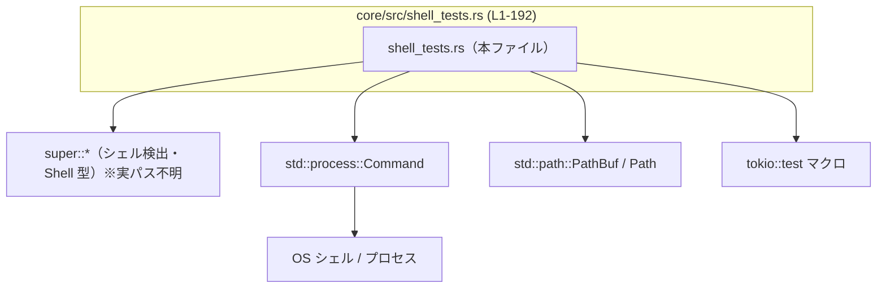
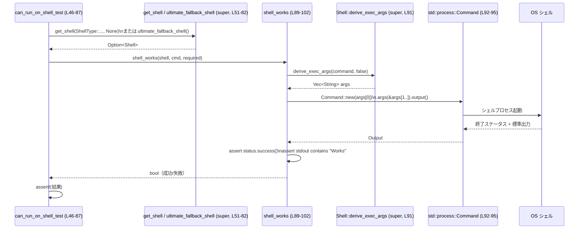
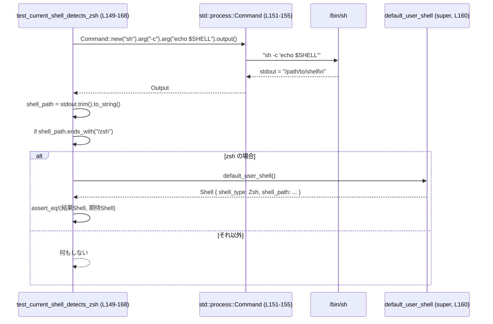

# core/src/shell_tests.rs コード解説

## 0. ざっくり一言

このファイルは、親モジュールが提供する **シェル検出ロジックとコマンド実行ロジック** の動作を、実際に OS のシェルを起動して検証するテスト群と、そのための小さなユーティリティ関数をまとめたものです（`core/src/shell_tests.rs:L1-192`）。

---

## 1. このモジュールの役割

### 1.1 概要

- このモジュールは、親モジュール（`super::*`）で定義されている `Shell` / `ShellType` と、`get_shell`・`default_user_shell` などの関数が **期待どおりのシェルを検出し、適切な引数でコマンドを実行できるか** を検証します（`core/src/shell_tests.rs:L1-3, L5-192`）。
- macOS / Windows / それ以外の OS ごとに分岐し、**/bin/zsh や /bin/bash、PowerShell などが正しく見つかるか** をテストします。
- 非テスト関数 `shell_works` を使って、`Shell::derive_exec_args` の結果を `std::process::Command` に渡し、実際にコマンドが成功するかを確認します（`core/src/shell_tests.rs:L89-102`）。

### 1.2 アーキテクチャ内での位置づけ

このファイルは「テストモジュール」として、シェル検出ロジック本体を利用する側に位置し、以下の依存関係があります。



- `use super::*;` により、`Shell`, `ShellType`, `get_shell`, `default_user_shell`, `default_user_shell_from_path`, `ultimate_fallback_shell`, `empty_shell_snapshot_receiver` などを利用しています（`core/src/shell_tests.rs:L1`）。
- `std::process::Command` を使って実際にシェルプロセスを起動し、標準出力と終了ステータスを検証します（`core/src/shell_tests.rs:L3, L92-97, L151-155`）。
- 一部テストは `#[tokio::test]` で非同期コンテキスト上で実行されます（`core/src/shell_tests.rs:L149, L170`）。

### 1.3 設計上のポイント

- **プラットフォーム依存のテスト分岐**  
  - macOS 限定テストに `#[cfg(target_os = "macos")]` を使用（`core/src/shell_tests.rs:L5-7, L15-17`）。
  - Windows / 非 Windows を `cfg!(windows)` でランタイム分岐（`core/src/shell_tests.rs:L49, L172, L184`）。
- **共通ヘルパー関数 `shell_works` の利用**  
  - `Shell` からコマンドライン引数を導出し、実際に実行・検証する処理を一か所にまとめています（`core/src/shell_tests.rs:L89-102`）。
- **構成テスト（struct literal）による契約の明示**  
  - `Shell` 構造体をテスト内で直接構築し、`derive_exec_args` の振る舞いを固定化した期待値で検証しています（`core/src/shell_tests.rs:L104-147`）。
- **非同期テストでの環境依存チェック**  
  - `$SHELL` や Windows のデフォルトシェルを外部コマンド経由で取得し、それに基づき `default_user_shell` の結果を検証します（`core/src/shell_tests.rs:L149-168, L170-180`）。

---

## 2. 主要な機能一覧

このファイルが提供する主な機能は、すべてテストとテスト用ヘルパーです。

- シェル検出テスト（macOS）: `detects_zsh`, `fish_fallback_to_zsh`（`core/src/shell_tests.rs:L5-23`）
- シェル検出テスト（汎用 Unix 系）: `detects_bash`, `detects_sh`（`core/src/shell_tests.rs:L25-44`）
- シェル経由でのコマンド実行テスト: `can_run_on_shell_test` とヘルパー `shell_works`（`core/src/shell_tests.rs:L46-87, L89-102`）
- コマンドライン引数生成ロジックのテスト: `derive_exec_args`（テスト関数名。`Shell::derive_exec_args` メソッドの期待値検証）（`core/src/shell_tests.rs:L104-147`）
- 現在のユーザーシェル判定テスト（非同期）: `test_current_shell_detects_zsh`（`core/src/shell_tests.rs:L149-168`）
- Windows 上の PowerShell デフォルトシェルテスト（非同期・同期）:  
  `detects_powershell_as_default`, `finds_powershell`（`core/src/shell_tests.rs:L170-192`）

---

## 2.x コンポーネント一覧（インベントリー）

### 関数一覧

| 名前 | 種別 | 役割 / 用途 | 行範囲 |
|------|------|-------------|--------|
| `detects_zsh` | テスト関数 | macOS で `ShellType::Zsh` が `/bin/zsh` を指すことを検証 | `core/src/shell_tests.rs:L5-13` |
| `fish_fallback_to_zsh` | テスト関数 | macOS で `/bin/fish` を与えた場合に zsh へフォールバックすることを検証 | `core/src/shell_tests.rs:L15-23` |
| `detects_bash` | テスト関数 | Bash シェル検出 (`ShellType::Bash`) が正しく `bash` 実行ファイルを指すか検証 | `core/src/shell_tests.rs:L25-34` |
| `detects_sh` | テスト関数 | `ShellType::Sh` が `sh` 実行ファイルを指すか検証 | `core/src/shell_tests.rs:L36-44` |
| `can_run_on_shell_test` | テスト関数 | 各種シェルを通じて `echo "Works"` が実行できるか検証 | `core/src/shell_tests.rs:L46-87` |
| `shell_works` | ヘルパー関数 | `Shell` から実行引数を生成し、`Command` でコマンドを実行して成功可否を返す | `core/src/shell_tests.rs:L89-102` |
| `derive_exec_args` | テスト関数 | `Shell::derive_exec_args` がシェル種別・ログインモードに応じた正しい引数を生成するか検証 | `core/src/shell_tests.rs:L104-147` |
| `test_current_shell_detects_zsh` | 非同期テスト関数 | 実際の `$SHELL` が zsh のとき、`default_user_shell` が同じパス・種別の `Shell` を返すことを検証 | `core/src/shell_tests.rs:L149-168` |
| `detects_powershell_as_default` | 非同期テスト関数 | Windows で `default_user_shell` が PowerShell 実行ファイルを指すことを検証 | `core/src/shell_tests.rs:L170-180` |
| `finds_powershell` | テスト関数 | Windows で `get_shell(ShellType::PowerShell)` が PowerShell 実行ファイルを返すことを検証 | `core/src/shell_tests.rs:L182-192` |

### 外部コンポーネント呼び出し一覧（このチャンクに現れる範囲）

| 名前 | 種別 | 役割 / 用途 | 出現箇所 |
|------|------|-------------|----------|
| `Shell` | 構造体（`super::*` から） | シェル種別・パス・スナップショットを保持し、`derive_exec_args` メソッドを提供 | `core/src/shell_tests.rs:L89-91, L104-110, L120-124, L134-138, L160-165` |
| `ShellType` | 列挙体（`super::*` から） | シェルの種類（`Zsh`, `Bash`, `Sh`, `PowerShell`, `Cmd` など）を表現 | `core/src/shell_tests.rs:L8, L18, L27, L38, L51, L56, L72, L77, L82, L107, L121, L135, L162, L188` |
| `get_shell` | 関数（`super::*` から） | 指定された `ShellType` と任意のパスから `Option<Shell>` を返す | `core/src/shell_tests.rs:L8, L27, L38, L51, L56, L72, L77, L82, L188` |
| `default_user_shell_from_path` | 関数 | 指定パスからユーザーのデフォルトシェルを推定 | `core/src/shell_tests.rs:L18` |
| `ultimate_fallback_shell` | 関数 | どのシェルも見つからない場合に使うフォールバック `Shell` を取得 | `core/src/shell_tests.rs:L61, L67` |
| `default_user_shell` | 関数 | 環境から検出されたユーザーのデフォルト `Shell` を返す | `core/src/shell_tests.rs:L160, L176` |
| `empty_shell_snapshot_receiver` | 関数 | `Shell` の `shell_snapshot` フィールド用に空のスナップショット受信者を生成 | `core/src/shell_tests.rs:L109, L123, L137, L164` |
| `Shell::derive_exec_args` | メソッド | 与えられたコマンド文字列とログインシェルフラグから、実行用の引数配列を生成 | `core/src/shell_tests.rs:L91, L112, L116, L126, L130, L140, L144` |
| `std::process::Command` | 標準ライブラリ構造体 | 外部プロセスを起動し、出力を取得 | `core/src/shell_tests.rs:L3, L92, L151` |

---

## 3. 公開 API と詳細解説

### 3.1 型一覧（構造体・列挙体など）

このファイル自身は新たな型を定義していませんが、テストから見える型情報を整理します。

| 名前 | 種別 | 役割 / 用途 | 備考（このチャンクから読み取れる範囲） |
|------|------|-------------|----------------------------------------|
| `Shell` | 構造体 | シェルの種別・実行パス・スナップショットを保持し、`derive_exec_args` を提供 | フィールド `shell_type`, `shell_path`, `shell_snapshot` を持つことが struct リテラルから分かります（`core/src/shell_tests.rs:L104-110, L120-124, L134-138`）。定義本体は `super` モジュール側で管理されており、このチャンクからは詳細不明です。 |
| `ShellType` | 列挙体 | シェルの種類を表す | 少なくとも `Zsh`, `Bash`, `Sh`, `PowerShell`, `Cmd` のバリアントが存在すると推測できます（`core/src/shell_tests.rs:L8, L27, L38, L51, L56, L72, L77, L82, L107, L121, L135, L162, L188`）。定義本体はこのチャンクには現れません。 |

### 3.2 関数詳細（7 件）

以下は、このファイルの理解に特に重要な関数・テストを選んで詳細に解説します。

---

#### `shell_works(shell: Option<Shell>, command: &str, required: bool) -> bool`

**概要**

- 与えられた `Shell`（存在すれば）を用いてコマンド文字列を実行し、成功したかどうかを検証するテスト用ヘルパー関数です（`core/src/shell_tests.rs:L89-102`）。
- シェルが `None` の場合、`required` フラグに応じてテスト継続の可否を表すブール値を返します。

**引数**

| 引数名 | 型 | 説明 |
|--------|----|------|
| `shell` | `Option<Shell>` | 実行に使用する `Shell`。`None` の場合はシェルが見つからなかったことを意味します。 |
| `command` | `&str` | 実行したいコマンド文字列（例: `echo "Works"`）（`core/src/shell_tests.rs:L91`）。 |
| `required` | `bool` | シェルが必須かどうか。`true` の場合、`shell` が `None` ならば失敗とみなします（`core/src/shell_tests.rs:L100`）。 |

**戻り値**

- `bool`  
  - シェルが存在し、コマンド実行およびアサーションがすべて成功した場合は `true`（`core/src/shell_tests.rs:L98`）。
  - シェルが存在しない (`None`) 場合は `!required`（`core/src/shell_tests.rs:L100`）。

**内部処理の流れ**

1. `shell` が `Some` かどうかを `if let Some(shell) = shell` で分岐（`core/src/shell_tests.rs:L90`）。
2. `Some` の場合:
   - `shell.derive_exec_args(command, false)` を呼び、実行用引数 `args: Vec<String>` を取得（`core/src/shell_tests.rs:L91`）。
   - `Command::new(args[0].clone())` でプロセスビルダーを作成し、`args[1..]` を `.args()` で渡して実行（`core/src/shell_tests.rs:L92-94`）。
   - `.output().unwrap()` でプロセス完了まで待機し、入出力を取得（`core/src/shell_tests.rs:L94-95`）。
   - `output.status.success()` を `assert!` で検証（`core/src/shell_tests.rs:L96`）。
   - 標準出力に `"Works"` が含まれることを `String::from_utf8_lossy` + `.contains("Works")` で検証（`core/src/shell_tests.rs:L97`）。
   - すべて成功した場合、`true` を返す（`core/src/shell_tests.rs:L98`）。
3. `None` の場合:
   - `required` が `false` なら `true`、`true` なら `false` を返すため、`!required` を返却（`core/src/shell_tests.rs:L100`）。

**Examples（使用例）**

この関数は `can_run_on_shell_test` からのみ使用されています。

```rust
// Windows で PowerShell が動作するかどうかを検証
assert!(shell_works(
    get_shell(ShellType::PowerShell, /*path*/ None), // Option<Shell>
    "Out-String 'Works'",                            // コマンド文字列
    /*required*/ true,                               // 見つからなかったらテスト失敗
)); // core/src/shell_tests.rs:L50-54
```

**Errors / Panics**

- `Command::new(...).output().unwrap()` により、プロセス起動・実行中にエラーが発生した場合は panic します（`core/src/shell_tests.rs:L92-95`）。
- `args[0]` アクセスは `derive_exec_args` が空ベクタを返した場合に panic します（`core/src/shell_tests.rs:L92`）。ただし、テスト `derive_exec_args` がそのようなケースを想定していないことから、「常に 1 要素以上である」という契約が暗黙に期待されています。
- 2 つの `assert!` が失敗した場合も同様に panic し、テスト失敗となります（`core/src/shell_tests.rs:L96-97`）。

**Edge cases（エッジケース）**

- `shell` が `None` かつ `required == false` の場合のみ `true` を返し、実行をスキップします（`core/src/shell_tests.rs:L99-100`）。
- 標準出力が空、または `"Works"` を含まない場合、`assert!` によりテスト失敗となります（`core/src/shell_tests.rs:L97`）。
- コマンドが大量の出力をする場合も `.output()` により全出力をメモリに取り込む点に注意が必要です（ただし、このファイル内では短い固定文字列のみ使用しています）。

**使用上の注意点**

- `command` にユーザー入力をそのまま渡すと、シェルインジェクションのリスクが生じますが、このファイルではすべてテスト内で固定文字列を使用しているため、そのような利用は行われていません。
- `assert!` と `unwrap()` により、エラーはすべて panic として扱われます。これはテストコードとしては一般的ですが、ライブラリ本体から再利用する場合には適していません。
- `derive_exec_args` の契約（少なくとも 1 要素以上を返すこと）に強く依存しています。実装変更時にはこの関数も含めて動作確認が必要です。

---

#### `fn derive_exec_args()`

**概要**

- `Shell::derive_exec_args` メソッドが、シェル種別と `use_login_shell` フラグに応じて **正しい引数配列を生成するか** を検証するテストです（`core/src/shell_tests.rs:L104-147`）。
- Bash・Zsh・PowerShell の 3 種類のシェルについて、ログインシェルモードと非ログインシェルモードそれぞれの期待値を `assert_eq!` でチェックします。

**引数**

- なし。

**戻り値**

- なし（テスト関数）。アサーションがすべて通過すれば成功、1 つでも失敗すればテスト失敗です。

**内部処理の流れ**

1. Bash 用の `Shell` インスタンスを struct リテラルで作成（`/bin/bash`）（`core/src/shell_tests.rs:L104-110`）。
2. `use_login_shell = false` で `derive_exec_args` を呼び、  
   `["/bin/bash", "-c", "echo hello"]` を期待値として `assert_eq!`（`core/src/shell_tests.rs:L111-114`）。
3. `use_login_shell = true` で `derive_exec_args` を呼び、  
   `["/bin/bash", "-lc", "echo hello"]` を期待値として `assert_eq!`（`core/src/shell_tests.rs:L115-118`）。
4. 同様の検証を Zsh について実施（`/bin/zsh`）（`core/src/shell_tests.rs:L120-132`）。
5. PowerShell 用の `Shell` インスタンスを `shell_path: "pwsh.exe"` で作成（`core/src/shell_tests.rs:L134-138`）。
6. `use_login_shell = false` で `["pwsh.exe", "-NoProfile", "-Command", "echo hello"]` を期待（`core/src/shell_tests.rs:L139-142`）。
7. `use_login_shell = true` で `["pwsh.exe", "-Command", "echo hello"]` を期待（`core/src/shell_tests.rs:L143-146`）。

**Errors / Panics**

- `assert_eq!` 失敗時に panic します（`core/src/shell_tests.rs:L111-114, L115-118, L125-128, L129-132, L139-142, L143-146`）。

**Edge cases**

- このテストは **空のコマンド文字列** や **特殊文字を含むコマンド** を扱っていません。いずれも `"echo hello"` 固定です。
- シェルパスが存在しない場合の挙動は検証していません。ここでは純粋に文字列組み立てロジックのみを対象としています。

**使用上の注意点**

- `Shell` の struct リテラルを直接組み立てているため、`Shell` のフィールドに変更が加わると、このテストも更新が必要です。
- PowerShell で `use_login_shell = true` の際に `-NoProfile` が付かないことが契約として固定化されている点に注意が必要です（`core/src/shell_tests.rs:L143-146`）。

---

#### `fn can_run_on_shell_test()`

**概要**

- 対応している各シェルを通じて簡単なコマンド (`echo "Works"` など) を実行し、実際に動作するかどうかを検証するテストです（`core/src/shell_tests.rs:L46-87`）。
- Windows と非 Windows でテスト対象のシェルが分岐します。

**引数**

- なし。

**戻り値**

- なし（テスト関数）。

**内部処理の流れ**

1. `let cmd = "echo \"Works\"";` で共通のコマンド文字列を定義（`core/src/shell_tests.rs:L48`）。
2. `if cfg!(windows)` 分岐（コンパイル時条件ではなく、ランタイムで `bool` として扱われます）（`core/src/shell_tests.rs:L49`）。
3. Windows の場合（`core/src/shell_tests.rs:L49-64`）:
   - PowerShell で `Out-String 'Works'` を実行するテスト（`required = true`）（`core/src/shell_tests.rs:L50-54`）。
   - `ShellType::Cmd` に対して `cmd` を実行するテスト（`required = true`）（`core/src/shell_tests.rs:L55-59`）。
   - `ultimate_fallback_shell()` で得たシェルに対して `cmd` を実行（`required = true`）（`core/src/shell_tests.rs:L60-64`）。
4. 非 Windows の場合（`core/src/shell_tests.rs:L65-85`）:
   - `ultimate_fallback_shell()` で `cmd` を実行（`required = true`）（`core/src/shell_tests.rs:L66-70`）。
   - `ShellType::Zsh` で `cmd` を実行（`required = false`）… zsh が見つからない環境を許容（`core/src/shell_tests.rs:L71-75`）。
   - `ShellType::Bash` で `cmd` を実行（`required = true`）（`core/src/shell_tests.rs:L76-80`）。
   - `ShellType::Sh` で `cmd` を実行（`required = true`）（`core/src/shell_tests.rs:L81-85`）。
5. 各ケースで `assert!(shell_works(...))` により実行成否をチェック。

**Errors / Panics**

- `shell_works` 内部の `unwrap()` や `assert!` により、シェルが起動できない・コマンド失敗・出力不一致などの場合に panic します。
- 対応シェルが見つからず `get_shell(...)` が `None` を返した場合、`required = true` のテストは `shell_works` が `false` を返し、外側の `assert!` で panic します。

**Edge cases**

- 非 Windows で zsh がインストールされていない場合、`required = false` のためその部分だけはスキップされます（`core/src/shell_tests.rs:L71-75`）。
- `ultimate_fallback_shell()` が存在しないシェルを返すような不具合がある場合、対応するテストも失敗します。

**使用上の注意点**

- このテストは **実際に OS のシェルを起動する** ため、CI 環境やコンテナのような最小構成の環境ではシェルの有無によってテストが失敗する可能性があります。
- パフォーマンス面では、複数回シェルプロセスを起動するため、それなりのオーバーヘッドがありますが、テストとしては一般的な範囲です。

---

#### `fn detects_bash()`

**概要**

- `get_shell(ShellType::Bash, None)` により取得した `Shell` が、実際に `bash` 実行ファイルを指すかどうかを検証するテストです（`core/src/shell_tests.rs:L25-34`）。

**内部処理の流れ**

1. `get_shell(ShellType::Bash, None).unwrap()` で Bash の `Shell` を取得（`core/src/shell_tests.rs:L27`）。
2. `shell_path.file_name().and_then(|name| name.to_str())` により、パスの末尾名を `Option<&str>` として取得（`core/src/shell_tests.rs:L30-31`）。
3. それが `Some("bash")` と等しいことを `assert!` で検証（`core/src/shell_tests.rs:L30-31`）。
4. 失敗時には `"shell path: {shell_path:?}"` がメッセージとして表示されます（`core/src/shell_tests.rs:L32`）。

**Errors / Panics**

- `get_shell(...).unwrap()` が `None` の場合に panic（`core/src/shell_tests.rs:L27`）。
- `assert!` が失敗した場合に panic（`core/src/shell_tests.rs:L30-33`）。

**Edge cases**

- `shell_path` が UTF-8 で表現できない場合、`to_str()` が `None` を返し、アサーションが失敗します（`core/src/shell_tests.rs:L31`）。

**使用上の注意点**

- `/bin/bash` 固定ではなくファイル名のみをチェックしているため、`/usr/local/bin/bash` など別パスでも `bash` であればテストは通過します。

---

#### `async fn test_current_shell_detects_zsh()`

**概要**

- 現在の `$SHELL` が zsh の環境でのみ、`default_user_shell()` が同じパスの `Shell` を返すかどうかを検証する非同期テストです（`core/src/shell_tests.rs:L149-168`）。

**引数 / 戻り値**

- 引数なし、戻り値なし（`#[tokio::test]` による非同期テスト）。

**内部処理の流れ**

1. `Command::new("sh").arg("-c").arg("echo $SHELL").output().unwrap()` で `$SHELL` の値を取得（`core/src/shell_tests.rs:L151-155`）。
2. 標準出力を UTF-8 として解釈し、`trim()` してシェルパス文字列を得る（`core/src/shell_tests.rs:L157`）。
3. `if shell_path.ends_with("/zsh")` で zsh かどうかを判定（`core/src/shell_tests.rs:L158`）。
4. zsh の場合のみ、`default_user_shell()` の戻り値が期待される `Shell` 構造体（`shell_type: Zsh`, `shell_path: shell_path`）と等しいことを `assert_eq!` で検証（`core/src/shell_tests.rs:L159-166`）。

**Errors / Panics**

- `output().unwrap()` の `unwrap()` により、`sh` の起動に失敗すると panic します（`core/src/shell_tests.rs:L151-155`）。
- `assert_eq!` 失敗時に panic しますが、これは zsh 環境でのみ実行されます（`core/src/shell_tests.rs:L159-166`）。

**Edge cases**

- `$SHELL` が空または設定されていない場合の挙動は、このテストからは読み取れません。`echo $SHELL` の結果に依存します。
- zsh 以外のシェル環境では `if` ブロックがスキップされるため、実質的に何も検証されません。

**使用上の注意点**

- テスト結果は **実行環境の `$SHELL` 設定に依存** するため、環境により動作する範囲が部分的です。
- `tokio::test` を利用していますが、この関数自体は非同期処理（`await`）を含んでおらず、同期処理として振る舞っています。

---

#### `async fn detects_powershell_as_default()`

**概要**

- Windows 環境でのみ、`default_user_shell()` が PowerShell 実行ファイル（`pwsh.exe` または `powershell.exe`）を指すことを検証する非同期テストです（`core/src/shell_tests.rs:L170-180`）。

**内部処理の流れ**

1. `if !cfg!(windows) { return; }` により、非 Windows では即座に何もせず終了（`core/src/shell_tests.rs:L172-174`）。
2. `default_user_shell()` でデフォルト `Shell` を取得（`core/src/shell_tests.rs:L176`）。
3. `shell_path.ends_with("pwsh.exe") || shell_path.ends_with("powershell.exe")` を `assert!` で検証（`core/src/shell_tests.rs:L179`）。

**Errors / Panics**

- `default_user_shell()` がエラーを返すかどうかはこのチャンクからは分かりませんが、少なくともここでは `unwrap` 等は使用されていません（`core/src/shell_tests.rs:L176`）。
- `assert!` 条件が満たされないと panic します（`core/src/shell_tests.rs:L179`）。

**Edge cases**

- PowerShell のパスが大文字小文字違いで存在する場合や、`.EXE` を含まないパスなどは考慮されていません。
- WSL など特殊な Windows 環境での挙動は、このテストからは分かりません。

---

#### `fn finds_powershell()`

**概要**

- Windows 環境で `get_shell(ShellType::PowerShell, None)` が PowerShell 実行ファイルへのパスを返すかどうかを検証するテストです（`core/src/shell_tests.rs:L182-192`）。

**内部処理の流れ**

1. 非 Windows では `if !cfg!(windows) { return; }` で終了（`core/src/shell_tests.rs:L184-186`）。
2. `get_shell(ShellType::PowerShell, None).unwrap()` で `Shell` を取得（`core/src/shell_tests.rs:L188`）。
3. `shell_path.ends_with("pwsh.exe") || shell_path.ends_with("powershell.exe")` を `assert!` で検証（`core/src/shell_tests.rs:L191`）。

**Errors / Panics**

- `unwrap()` により、PowerShell が見つからない場合は panic します（`core/src/shell_tests.rs:L188`）。
- `assert!` 条件が満たされない場合に panic（`core/src/shell_tests.rs:L191`）。

---

### 3.3 その他の関数

詳細解説に含めなかった補助的なテスト関数を一覧します。

| 関数名 | 役割（1 行） | 行範囲 |
|--------|--------------|--------|
| `detects_zsh` | macOS で `ShellType::Zsh` が `/bin/zsh` を指すことを検証 | `core/src/shell_tests.rs:L5-13` |
| `fish_fallback_to_zsh` | macOS で `/bin/fish` を指定した場合に zsh にフォールバックすることを検証 | `core/src/shell_tests.rs:L15-23` |
| `detects_sh` | `ShellType::Sh` が `sh` 実行ファイルを指すことを検証 | `core/src/shell_tests.rs:L36-44` |

---

## 4. データフロー

### 4.1 シェル経由のコマンド実行フロー（`can_run_on_shell_test` → `shell_works`）

このフローは、テストからシェルを起動してコマンドを検証する典型パターンです。



- この図は `can_run_on_shell_test` と `shell_works` の関係、および `Shell::derive_exec_args` がどの位置にあるかを示しています（`core/src/shell_tests.rs:L46-87, L89-102`）。
- 実際の OS シェルが起動されるため、環境依存性が高いテスト構造になっています。

### 4.2 現在のシェル検出フロー（`test_current_shell_detects_zsh`）



- `$SHELL` に zsh が設定されている場合のみ、`default_user_shell` の結果を検証します（`core/src/shell_tests.rs:L149-168`）。

---

## 5. 使い方（How to Use）

このファイル自体はテスト専用ですが、`Shell` の利用パターンやテスト拡張の仕方を理解するのに役立ちます。

### 5.1 基本的な使用方法（テストヘルパーの利用）

`shell_works` は、任意の `Shell` で特定のコマンドが実行可能かどうかを確認する汎用テストヘルパーとして利用できます。

```rust
// 例: 新しいシェル種別 MyShellType を追加したときのテスト
#[test]
fn can_run_on_my_shell() {
    let cmd = "echo \"Works\""; // 標準出力に "Works" を出すコマンド
    let shell = get_shell(ShellType::MyShellType, None); // 新しいシェル種別
    assert!(shell_works(shell, cmd, /*required*/ true)); // 必須として扱う
}
```

このように、新しいシェルタイプを追加した際にも同じパターンで動作確認が行えます。

### 5.2 よくある使用パターン

- **構成テストとしての struct リテラル**  
  `derive_exec_args` テストのように、`Shell` を直接構築してメソッドの出力を検証するパターン（`core/src/shell_tests.rs:L104-147`）。

- **環境検出テスト**  
  `test_current_shell_detects_zsh` のように、外部コマンドで環境情報（`$SHELL`）を取得し、それとライブラリの戻り値を突き合わせるパターン（`core/src/shell_tests.rs:L149-168`）。

### 5.3 よくある間違い（推測されるもの）

このチャンクから推測できる範囲で、誤用と正しい利用例を対比します。

```rust
// 誤りの例: derive_exec_args の戻り値をチェックせずに直接 Command に渡す
let args = shell.derive_exec_args(user_input, false); // user_input をそのまま渡している
let output = Command::new(args[0].clone())            // args が空かもしれない
    .args(&args[1..])
    .output()
    .unwrap();

// 正しいパターン（テスト内での利用に近い形）
let args = shell.derive_exec_args("echo \"Works\"", false); // 固定の安全なコマンド
assert!(!args.is_empty());                                 // 空でないことを確認してから使う
let output = Command::new(args[0].clone())
    .args(&args[1..])
    .output()
    .unwrap();
assert!(output.status.success());
```

- 本ファイル内では `args[0]` が空でないことを `derive_exec_args` の契約として暗黙に仮定していますが、実際のアプリケーションコードでは安全のためのチェックが必要になる場合があります。

### 5.4 使用上の注意点（まとめ）

- **環境依存性**  
  - `/bin/zsh`, `/bin/bash`, `/bin/sh`, `pwsh.exe`, `powershell.exe` といった特定パス・名前を前提しています（`core/src/shell_tests.rs:L8, L18, L104-123, L134-137, L176-179, L188-191`）。
  - CI やミニマルなコンテナ環境ではシェルが存在せず、テストが失敗する可能性があります。

- **安全性・エラー処理**  
  - すべての異常は `unwrap()` や `assert!` による panic で扱われています。これはテストコードとしては許容されますが、同じパターンを本番コードに持ち込むとクラッシュの原因になります。
  - コマンド文字列は固定のリテラルのみを使用しており、ユーザー入力は含まれないため、このファイルに限ればシェルインジェクションのリスクは低いです。

- **非同期テストと tokio**  
  - `#[tokio::test]` を使用していますが、非同期 I/O を実際には行っていません（`core/src/shell_tests.rs:L149-168, L170-180`）。
  - 非同期テストで本当に非同期関数を呼ぶ場合は、ランタイムのバージョンや機能（マルチスレッド/シングルスレッド）との整合性に注意が必要です。

---

## 6. 変更の仕方（How to Modify）

### 6.1 新しい機能（新しいシェル種別など）を追加する場合

1. **`ShellType` / `Shell` 実装側を拡張**  
   - 新しいシェル種別（例: `ShellType::Fish`）や新しい検出ロジックを親モジュールに追加します（定義はこのチャンクにはありません）。

2. **`derive_exec_args` テストの拡張**  
   - `derive_exec_args` テスト関数に、新しい `Shell` struct リテラルと対応する `assert_eq!` を追加し、引数生成ロジックを固定化します（`core/src/shell_tests.rs:L104-147` 参照）。

3. **実行テストへの組み込み**  
   - `can_run_on_shell_test` に新しいシェル種別を追加し、`shell_works` を利用して実行テストを追加します（`core/src/shell_tests.rs:L46-87`）。

4. **環境依存性の調整**  
   - 新しいシェルが一般的に存在しないプラットフォームでは、`required` を `false` にしてテストを「ベストエフォート」にするなど、`required` フラグを適切に調整します（`core/src/shell_tests.rs:L71-75` を参考）。

### 6.2 既存の機能を変更する場合

- **シェルパスの変更**  
  - `/bin/zsh` などの固定パスを変更した場合、対応するテスト（`detects_zsh`, `fish_fallback_to_zsh`, `derive_exec_args` など）の期待値も更新が必要です（`core/src/shell_tests.rs:L8, L18, L120-123`）。

- **`derive_exec_args` の仕様変更**  
  - 引数の順序やオプションが変わると、`derive_exec_args` テストが失敗するため、先にテストを更新し、新しい契約に合わせて実装を変更する流れが望ましいです（`core/src/shell_tests.rs:L111-118, L125-132, L139-146`）。

- **デフォルトシェル検出ロジックの変更**  
  - `default_user_shell` の挙動を変える場合、`test_current_shell_detects_zsh` と `detects_powershell_as_default` の期待値を確認し、新しい仕様に合うよう修正する必要があります（`core/src/shell_tests.rs:L149-168, L170-180`）。

- **影響範囲の確認**  
  - `get_shell`, `default_user_shell`, `ultimate_fallback_shell` のシグネチャや返り値の契約を変える場合、このファイル全体でそれらが使われている箇所を再確認する必要があります（`core/src/shell_tests.rs:L8, L18, L27, L38, L51, L56, L61, L67, L72, L77, L82, L160, L176, L188`）。

---

## 7. 関連ファイル

このチャンクから直接パス名は分かりませんが、論理的に関連するモジュール・ライブラリは次のとおりです。

| パス / モジュール名（推定含む） | 役割 / 関係 |
|---------------------------------|------------|
| `super`（親モジュール、実ファイルパスは不明） | `Shell`, `ShellType`, `get_shell`, `default_user_shell`, `default_user_shell_from_path`, `ultimate_fallback_shell`, `empty_shell_snapshot_receiver`, `Shell::derive_exec_args` など、シェル検出とコマンド引数生成の本体ロジックを提供します（`core/src/shell_tests.rs:L1, L8, L18, L27, L38, L51, L56, L61, L67, L72, L77, L82, L89-91, L104-110, L120-124, L134-138, L160, L176, L188`）。 |
| `std::process::Command`（標準ライブラリ） | 外部プロセス（シェル）起動と標準出力・終了ステータスの取得を行います（`core/src/shell_tests.rs:L3, L92-95, L151-155`）。 |
| `tokio::test`（クレート: tokio） | 非同期テストのランタイムとして利用され、`test_current_shell_detects_zsh` と `detects_powershell_as_default` を async 関数として実行します（`core/src/shell_tests.rs:L149, L170`）。 |

このファイルは、これらのコンポーネントが正しく連携することを保証する「結合テスト」としての役割を持っています。
