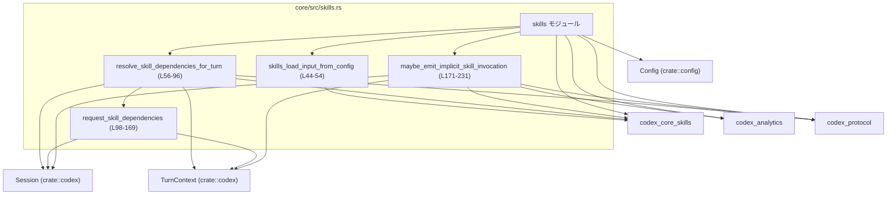
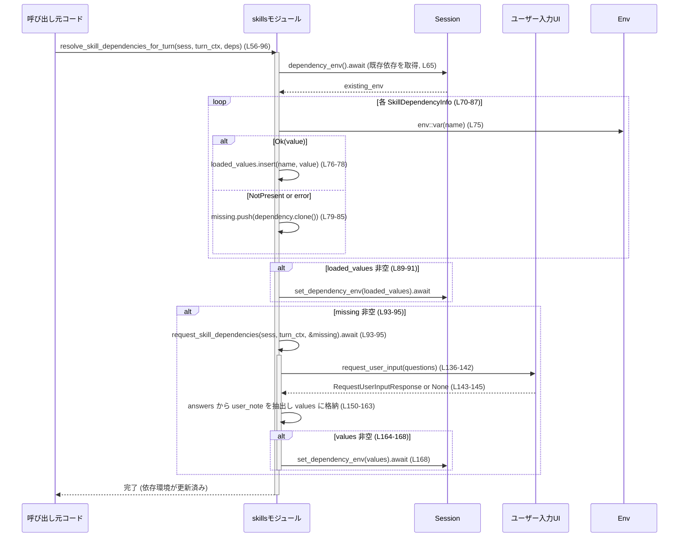

# core/src/skills.rs コード解説

## 0. ざっくり一言

このモジュールは、`codex_core_skills` クレートのスキル関連 API を再エクスポートしつつ、

- 設定 (`Config`) から `SkillsLoadInput` を構築する補助
- スキルが要求する環境変数（依存）の解決と、必要に応じたユーザー問い合わせ
- コマンドからの暗黙的なスキル呼び出しを検出してテレメトリに送信

といった、セッション単位のスキルまわりのユーティリティ機能を提供しています  
（根拠: `core/src/skills.rs:L20-42`, `L44-54`, `L56-96`, `L98-169`, `L171-231`）。

---

## 1. このモジュールの役割

### 1.1 概要

- このモジュールは **スキルの読み込み・依存解決・トラッキングを、セッション／ターンの文脈に結び付ける役割** を持ちます。
- 具体的には:
  - `Config` から `SkillsLoadInput` を組み立て、スキルローダーに渡すための入力を構築します（`skills_load_input_from_config`）。  
    （`core/src/skills.rs:L44-54`）
  - スキルが要求する環境変数の一覧（`SkillDependencyInfo`）を受け取り、既存の依存環境、プロセス環境変数、ユーザー入力を組み合わせて解決します（`resolve_skill_dependencies_for_turn` / `request_skill_dependencies`）。  
    （`L56-96`, `L98-169`）
  - コマンド文字列から暗黙的に呼び出されたと判断されるスキルを検出し、その情報を一回だけテレメトリとアナリティクスに送信します（`maybe_emit_implicit_skill_invocation`）。  
    （`L171-231`）

### 1.2 アーキテクチャ内での位置づけ

主な依存関係を示すと次のようになります。



- `CoreSkills`（`codex_core_skills`）の API を大量に再エクスポートしており、上位レイヤーからは「スキル関連の窓口モジュール」として使える構造になっています（`L20-42`）。
- セッション状態（`Session`）、ターンコンテキスト（`TurnContext`）、テレメトリ／アナリティクス（`codex_analytics`）と連携し、「どのスキルがどの環境でどう呼ばれたか」を追跡します。

### 1.3 設計上のポイント

- **再エクスポートによる集約**  
  多数のスキル関連型・関数・モジュールを `pub use` で再エクスポートすることで、利用側が `codex_core_skills` を直接意識せずに済む構造になっています（`L20-42`）。
- **非同期かつ共有セッション状態**  
  - `Arc<Session>` / `Arc<TurnContext>` を用いて、非同期コンテキストでセッション／ターン状態を共有する設計です（`L56-60`, `L98-101`）。
  - `async fn` と `.await` により、I/O やロック取得をブロックせずに行っています。
- **環境変数依存の安全な解決**  
  - プロセス環境変数は `std::env::var` の `Result` を明示的に扱い、存在しない場合とその他のエラーを区別して処理しています（`L75-86`）。
  - 読み取り失敗時は `warn!` ログを残しつつ、ユーザー問い合わせ対象に回す形でフェイルソフトに振る舞います（`L82-85`）。
- **ユーザー入力からの秘密情報取得**  
  - 必要な環境変数を `RequestUserInputQuestion` として問い合わせ、`is_secret: true` とすることで UI 側に秘匿扱いを要求しています（`L120-128`）。
  - 取得した値は「セッション内メモリにのみ保存」と明示されており（`L123-125` の文言）、永続化しない前提で設計されています。
- **暗黙的スキル呼び出しの一度きりカウント**  
  - `implicit_invocation_seen_skills` に対して非同期ロックを取得し（`L200-205`）、すでにカウントした `(scope, path, skill)` の組み合わせは二重カウントしないようにしています（`L198-207`）。

---

## 2. 主要な機能一覧

このモジュールが提供する主な機能は次のとおりです。

- スキルロード入力の構築:  
  `Config` とスキル探索ルートから `SkillsLoadInput` を生成します（`skills_load_input_from_config`, `L44-54`）。
- スキル依存環境変数の解決:  
  スキルが要求する環境変数 (`SkillDependencyInfo`) を、既存セッション環境・プロセス環境・ユーザー入力から解決します（`resolve_skill_dependencies_for_turn`, `request_skill_dependencies`, `L56-96`, `L98-169`）。
- ユーザー入力 UI との連携:  
  不足している環境変数を `RequestUserInputArgs`/`RequestUserInputQuestion` を通じて問い合わせ、回答から値を抽出してセッションに保存します（`L103-169`）。
- 暗黙的スキル呼び出しの検出と記録:  
  コマンド文字列と作業ディレクトリから検出されたスキル呼び出しを、一度だけテレメトリ・アナリティクスに送信します（`maybe_emit_implicit_skill_invocation`, `L171-231`）。
- スキル関連 API の集約エクスポート:  
  `SkillDependencyInfo`, `SkillError`, `SkillsManager` など多数の型・関数・モジュールを再エクスポートし、利用側からは `crate::skills` 経由で参照できるようにします（`L20-42`）。

---

## 3. 公開 API と詳細解説

### 3.1 型・モジュール一覧（コンポーネントインベントリー）

このファイルで **再エクスポートされている主なコンポーネント** と、**このファイル内で利用している外部型** の一覧です。

> 種別が「詳細不明」となっているものは、このチャンクに定義が無く、名前と利用方法だけからはっきりとした種別を断定できないものです。

#### 再エクスポートされるスキル関連コンポーネント（`codex_core_skills` 由来）

| 名前 | 種別（このチャンクから分かる範囲） | 役割 / 用途 | 根拠 |
|------|--------------------------------------|------------|------|
| `SkillDependencyInfo` | フィールドを持つ型（おそらく構造体） | スキルが必要とする環境変数依存を表現する。`name`, `skill_name`, `description` フィールドにアクセスしていることから、依存のメタ情報を保持するデータ型です。 | 再エクスポート: `core/src/skills.rs:L20` / 利用: `L70-81`, `L103-118`, `L120-129` |
| `SkillError` | 型（詳細不明） | スキル処理に関するエラー型と推測されますが、このチャンク内での利用はありません。 | 再エクスポートのみ: `L21` |
| `SkillLoadOutcome` | 型（詳細不明） | スキル読み込み結果を表す型と推測されますが、このチャンク内での利用はありません。 | `L22` |
| `SkillMetadata` | 型（詳細不明） | スキルのメタ情報を表現する型と推測されます。利用はこのチャンクにはありません。 | `L23` |
| `SkillPolicy` | 型（詳細不明） | スキルに関するポリシーを表現する型と推測されます。 | `L24` |
| `SkillsLoadInput` | メソッド `new` を持つ型（おそらく構造体） | スキルローダーに渡す「読み込み入力」。カレントディレクトリ、スキルルート、設定レイヤスタック、バンドルスキル有効フラグを保持しています。 | 再エクスポート: `L25` / 利用: `L44-53` |
| `SkillsManager` | 型（詳細不明） | スキルを管理するマネージャと推測されますが、このチャンクでは利用されていません。 | `L26` |
| `build_skill_name_counts` | 関数（詳細不明） | スキル名の出現回数集計に関する関数と推測されますが、このチャンク内での利用はありません。 | `L27` |
| `collect_env_var_dependencies` | 関数（詳細不明） | スキルから環境変数依存を収集する関数と推測されます。`SkillDependencyInfo` と合わせて使われる可能性がありますが、このファイル内には呼び出しがありません。 | `L28` |
| `config_rules` | 項目（詳細不明） | スキル関連の設定ルールを定義するモジュールまたは関数と推測されます。 | `L29` |
| `detect_implicit_skill_invocation_for_command` | 関数 | コマンドと作業ディレクトリから、暗黙的に呼ばれるスキル候補を検出します。返り値は `maybe_emit_implicit_skill_invocation` 内で `candidate.name`, `candidate.scope`, `candidate.path_to_skills_md` として利用されています。 | 再エクスポート: `L30` / 利用: `L177-188` |
| `filter_skill_load_outcome_for_product` | 関数（詳細不明） | プロダクト別にスキル読み込み結果をフィルタする関数と推測されます。 | `L31` |
| `injection` | モジュールまたは名前空間（と推測） | スキルへのインジェクション関連の API を含む名前空間と推測されます。 | `L32` |
| `SkillInjections` | 型（詳細不明） | スキルに対するインジェクション設定を表す型と推測されます。 | `L33` |
| `build_skill_injections` | 関数（詳細不明） | インジェクション定義を構築する関数と推測されます。 | `L34` |
| `collect_explicit_skill_mentions` | 関数（詳細不明） | 入力中の明示的なスキル言及を収集する関数と推測されます。 | `L35` |
| `loader` | モジュールまたは名前空間（と推測） | スキル読み込みロジックの実装部分と推測されます。 | `L36` |
| `manager` | モジュールまたは名前空間（と推測） | スキル管理ロジックの実装部分と推測されます。 | `L37` |
| `model` | モジュールまたは名前空間（と推測） | スキルに関するデータモデルの定義と推測されます。 | `L38` |
| `remote` | モジュールまたは名前空間（と推測） | リモートスキル関連の API を提供する部分と推測されます。 | `L39` |
| `render` | モジュールまたは名前空間（と推測） | スキル情報を UI/テキストにレンダリングする機能を含むと推測されます。 | `L40` |
| `render_skills_section` | 関数（詳細不明） | スキル一覧セクションを描画する関数と推測されます。 | `L41` |
| `system` | モジュールまたは名前空間（と推測） | システムスキル関連の API と推測されます。 | `L42` |

> 上記の「推測」と記載した用途は名前からの推定であり、このチャンクに定義が無いため断定はできません。

#### このファイルで利用している外部型（インポートのみ）

| 名前 | 所属 | 役割 / 用途 | 根拠 |
|------|------|-------------|------|
| `Session` | `crate::codex` | セッション全体の状態・サービスを表す型。依存環境の取得・設定、ユーザー入力の要求、アナリティクスクライアントなどを提供します。 | インポート: `L8`, 利用: `L56-57`, `L98-99`, `L136-145`, `L168`, `L171-172`, `L220-229` |
| `TurnContext` | `crate::codex` | 一回の対話ターンに関するコンテキスト。`turn_skills` 情報、サブ ID、テレメトリ、モデル情報などを保持します。 | インポート: `L9`, 利用: `L56-58`, `L98-101`, `L136-145`, `L171-176`, `L177-181`, `L190-205`, `L211-219`, `L223-227` |
| `Config` | `crate::config` | 実行時構成を表す設定型。`cwd`, `config_layer_stack`, バンドルスキル利用可否などを持ちます。 | インポート: `L10`, 利用: `L44-52` |
| `SkillInvocation` | `codex_analytics` | スキル呼び出しイベントのペイロード。`skill_name`, `skill_scope`, `skill_path`, `invocation_type` フィールドを持つデータ型です。 | インポート: `L12`, 利用: `L184-189`, `L228-229` |
| `InvocationType` | `codex_analytics` | スキル呼び出しの種別（Implicit など）を表す列挙体と推測されます。 | インポート: `L11`, 利用: `L188` |
| `SkillScope` | `codex_protocol::protocol` | スキルのスコープ（User/Repo/System/Admin）を表す列挙体です。 | インポート: `L14`, 利用: `L190-195` |
| `RequestUserInputArgs` | `codex_protocol::request_user_input` | ユーザー入力要求のパラメータコンテナ。`questions` フィールドを持ちます。 | インポート: `L15`, 利用: `L136-141` |
| `RequestUserInputQuestion` | 同上 | 単一の質問を表すデータ型。`id`, `header`, `question`, `is_other`, `is_secret`, `options` フィールドを持ちます。 | インポート: `L16`, 利用: `L120-129` |
| `RequestUserInputResponse` | 同上 | ユーザー入力の回答全体。`answers` マップを持ちます。 | インポート: `L17`, 利用: `L143-145`, `L146-163` |

### 3.2 関数詳細（主要 4 件）

#### `skills_load_input_from_config(config: &Config, effective_skill_roots: Vec<PathBuf>) -> SkillsLoadInput`

**概要**

- `Config` と有効なスキルルートの一覧から、スキルローダー用の `SkillsLoadInput` を構築するヘルパー関数です（`core/src/skills.rs:L44-54`）。

**引数**

| 引数名 | 型 | 説明 |
|--------|----|------|
| `config` | `&Config` | 実行時設定。`cwd`, `config_layer_stack`, `bundled_skills_enabled()` などを利用します。 |
| `effective_skill_roots` | `Vec<PathBuf>` | スキル探索のために有効と判断されたルートディレクトリの一覧です。 |

**戻り値**

- `SkillsLoadInput`  
  スキルローダーに渡す入力。カレントディレクトリ、スキルルート群、設定レイヤスタック、バンドルスキル有効フラグが埋め込まれています（`L48-53`）。

**内部処理の流れ**

1. `SkillsLoadInput::new` を呼び出し、次の値を渡します（`L48-53`）。
   - `config.cwd.clone().to_path_buf()`  
     設定が持つカレントディレクトリをクローンして `PathBuf` に変換。
   - 引数 `effective_skill_roots`
   - `config.config_layer_stack.clone()`  
     設定レイヤスタックのクローン。
   - `config.bundled_skills_enabled()`  
     バンドルされたスキルを利用するかどうかのフラグ。
2. 生成された `SkillsLoadInput` をそのまま返します。

**Examples（使用例）**

> 実際には `Config` や `SkillsLoadInput` の定義は別モジュールにあります。ここでは疑似コード的な例です。

```rust
use std::path::PathBuf;
use crate::config::Config;
use crate::skills::skills_load_input_from_config;
use crate::skills::SkillsLoadInput;

fn prepare_skills_input(config: &Config) -> SkillsLoadInput {
    // スキルを探索するルート（例: プロジェクトルート配下の .skills ディレクトリ）
    let skill_roots = vec![
        config.cwd.join(".skills"), // Config が持つ作業ディレクトリからの相対パス
    ];

    // skills モジュールのヘルパーで SkillsLoadInput を構築
    skills_load_input_from_config(config, skill_roots)
}
```

**Errors / Panics**

- この関数は `Result` ではなく `SkillsLoadInput` を直接返します。
- 本文中に `unwrap` や `panic!` は無く、`SkillsLoadInput::new` の中身はこのチャンクからは分かりません。  
  `SkillsLoadInput::new` がパニックを起こすかどうかは、このファイルからは判断できません。

**Edge cases（エッジケース）**

- `effective_skill_roots` が空ベクタの場合でも、そのまま `SkillsLoadInput::new` に渡されます（空でも許容される前提の設計と見られます）。  
  どのような挙動になるかは `SkillsLoadInput` の実装依存です。
- `config.cwd` や `config.config_layer_stack` が未設定であるケースは、このチャンクには表れません。

**使用上の注意点**

- `Config` が適切な `cwd` と `config_layer_stack` を持っていることが前提になっています。
- `effective_skill_roots` に存在しないパスを含めた場合の扱いは `SkillsLoadInput` 側次第であり、この関数では検証していません。

---

#### `resolve_skill_dependencies_for_turn(sess: &Arc<Session>, turn_context: &Arc<TurnContext>, dependencies: &[SkillDependencyInfo])`

**概要**

- 一つのターンにおいて、指定されたスキル依存（環境変数）一覧 `dependencies` を解決します。  
  既にセッションに登録されている値・プロセス環境変数・ユーザー入力を組み合わせ、足りないものだけを問い合わせます（`L56-96`）。

**引数**

| 引数名 | 型 | 説明 |
|--------|----|------|
| `sess` | `&Arc<Session>` | セッション状態。依存環境の取得・設定、およびユーザー入力要求に使用されます。 |
| `turn_context` | `&Arc<TurnContext>` | 現在のターンのコンテキスト。ユーザー入力のサブ ID やスキル情報に使用されます。 |
| `dependencies` | `&[SkillDependencyInfo]` | スキルが必要とする環境変数（依存）の一覧。`name`, `skill_name`, `description` などの情報を持ちます。 |

**戻り値**

- なし（`()`）。  
  ただし、副作用として `Session` 内の依存環境が更新されます。

**内部処理の流れ**

1. 依存リストが空なら即返す（`L61-63`）。
2. `sess.dependency_env().await` を呼び出して、既にセッションに格納済みの依存環境を取得します（`L65`）。
3. 以下のローカル変数を初期化します（`L66-68`）。
   - `loaded_values: HashMap<String, String>` – この関数内で新たに読み込んだ値。
   - `missing: Vec<SkillDependencyInfo>` – 依然として値が見つからなかった依存。
   - `seen_names: HashSet<String>` – 同じ環境変数名の重複処理を避けるための集合。
4. `dependencies` を順に走査し、各 `dependency` について次を行います（`L70-87`）。
   1. `name = dependency.name.clone()` を取得。
   2. `seen_names` に挿入できなかった（既に見た名前） **または** `existing_env.contains_key(&name)`（既にセッションに登録済み）ならスキップ（`L72-74`）。
   3. `env::var(&name)` でプロセス環境変数を読み取る（`L75`）。
      - `Ok(value)` の場合: `loaded_values.insert(name.clone(), value)` に追加（`L76-78`）。
      - `Err(NotPresent)` の場合: `missing.push(dependency.clone())` に追加（`L79-81`）。
      - それ以外の `Err(err)` の場合:
        - `warn!("failed to read env var {name}: {err}")` で警告ログを出す（`L82-83`）。
        - `missing.push(dependency.clone())` に追加（`L84-85`）。
5. `loaded_values` が空でなければ、`sess.set_dependency_env(loaded_values).await` でセッションの依存環境に追加します（`L89-91`）。
6. `missing` が空でなければ、`request_skill_dependencies(sess, turn_context, &missing).await` を呼んで、足りない値をユーザーから取得します（`L93-95`）。

**Examples（使用例）**

```rust
use std::sync::Arc;
use crate::codex::{Session, TurnContext};
use crate::skills::{resolve_skill_dependencies_for_turn, SkillDependencyInfo};

async fn ensure_dependencies(
    sess: Arc<Session>,
    turn_ctx: Arc<TurnContext>,
    deps: Vec<SkillDependencyInfo>,
) {
    // 依存を解決する（既存セッション環境 → プロセス env → ユーザー入力）
    resolve_skill_dependencies_for_turn(&sess, &turn_ctx, &deps).await;

    // 以降、sess.dependency_env().await からは、
    // deps で指定した名前のうち解決できたものが参照できる前提になります。
}
```

**Errors / Panics**

- `env::var` のエラーはすべて `match` で処理され、パニックにはなりません（`L75-86`）。
  - `NotPresent` は単に「足りない値」として `missing` に追加。
  - それ以外は `warn!` ログを残した上で同様に `missing` に追加。
- `sess.dependency_env`／`sess.set_dependency_env`／`request_skill_dependencies` は `await` される非同期メソッドですが、その内部でのエラー処理やパニックについてはこのチャンクからは分かりません。
- `unwrap`／`expect` はこの関数内にはありません。

**Edge cases（エッジケース）**

- `dependencies` が空スライス:  
  先頭で即 return し、セッション状態には一切変更を加えません（`L61-63`）。
- 同じ `dependency.name` が複数含まれている場合:  
  `seen_names` により最初の1つだけが処理され、それ以降はスキップされます（`L72-74`）。
- 既に `sess.dependency_env()` 内に存在する名前:  
  プロセス環境変数やユーザーに再度問い合わせることなくスキップされます（`L72-74`）。
- プロセス環境変数で、存在はするが OS 側の理由で読み出しに失敗するケース（`VarError` のその他の種別）:  
  警告ログを出しつつ、ユーザー問い合わせ対象に回されます（`L82-85`）。

**使用上の注意点**

- この関数の呼び出し後に `request_skill_dependencies` が実行されるため、**ユーザーが入力を拒否した場合** や UI 側でエラーになった場合には、依然として未解決の依存が残る可能性があります（`request_skill_dependencies` 側で empty の場合は何もしないため、`L146-148`, `L164-166`）。
- 依存解決の最終的な状態は `Session` の `dependency_env` にのみ保存されます。プロセス環境や永続ストレージは変更されません（このチャンクの範囲）。

---

#### `request_skill_dependencies(sess: &Arc<Session>, turn_context: &Arc<TurnContext>, dependencies: &[SkillDependencyInfo])`

> モジュール内のヘルパー関数であり、外部から直接呼ばれることは想定されていません（`async fn` かつ `pub` ではない / `L98`）。

**概要**

- 指定された `dependencies` に対し、ユーザー入力 UI を通じて不足している環境変数の値を取得し、セッションの依存環境に追加します（`L98-169`）。

**引数**

| 引数名 | 型 | 説明 |
|--------|----|------|
| `sess` | `&Arc<Session>` | セッション状態。ユーザー入力要求・依存環境設定に使用します。 |
| `turn_context` | `&Arc<TurnContext>` | ターンコンテキスト。サブ ID や `turn_skills` 情報に基づいて、ユーザー入力リクエスト ID を生成するために使われます。 |
| `dependencies` | `&[SkillDependencyInfo]` | ユーザーに問い合わせるべき環境変数依存一覧。 |

**戻り値**

- なし（`()`）。  
  副作用として `Session` の依存環境が更新されます。

**内部処理の流れ**

1. `dependencies` を `iter()` で走査し、それぞれから `RequestUserInputQuestion` を構築して `questions` ベクタに詰めます（`L103-131`）。
   - `requirement` 文字列生成ロジック:
     - `dependency.description` が `None` の場合:  
       `"The skill "<skill_name>" requires "<name>" to be set."`（`L106-112`）
     - `Some(description)` の場合:  
       `"The skill "<skill_name>" requires "<name>" to be set (<description>)."`（`L113-118`）
   - `RequestUserInputQuestion` のフィールド:
     - `id`: `dependency.name.clone()`（`L121`）
     - `header`: 固定文 `"Skill requires environment variable"`（`L122`）
     - `question`: `requirement` に続けて  
       `" This is an experimental internal feature. The value is stored in memory for this session only."` を連結（`L123-125`）
     - `is_other: false`, `is_secret: true`, `options: None`（`L126-128`）
2. `questions` が空なら即 return（`L132-134`）。
3. `sess.request_user_input(...)` を呼び出してユーザー入力を要求します（`L136-142`）。
   - リクエスト ID は `"skill-deps-<sub_id>"`（`L138-140`）。
   - 戻り値が `None` の場合でも `unwrap_or_else` により、`answers: HashMap::new()` を持つ空の `RequestUserInputResponse` にフォールバックします（`L143-145`）。
4. `response.answers` が空であれば何もせず return（`L146-148`）。
5. `response.answers`（`HashMap<String, AnswerType>` と推測）を走査し、次を行います（`L150-163`）。
   - 各 `(name, answer)` について、`answer.answers`（`Vec<String>` と推測）を見て、
     - 各 `entry` に対し `entry.strip_prefix("user_note: ")` を試み、かつ残りの部分が空白トリム後も空でなければ、`user_note` にそのトリム済み文字列を格納する（`L152-158`）。
     - 最後に見つかった `user_note` が優先されます（ループで上書き）。
   - `user_note` があれば `values.insert(name, value)` に追加します（`L160-162`）。
6. `values` が空なら return（`L164-166`）。
7. `sess.set_dependency_env(values).await` を呼び出して、依存環境として登録します（`L168`）。

**Examples（使用例）**

> 通常は `resolve_skill_dependencies_for_turn` からのみ呼び出される想定のため、直接使用する状況は少ないと考えられます。

```rust
// resolve_skill_dependencies_for_turn 内部の挙動に相当する擬似コードです。
// 実際には dependencies は「プロセス env に無かった分」だけが渡されます。

use std::sync::Arc;
use crate::codex::{Session, TurnContext};
use crate::skills::{SkillDependencyInfo};

async fn ask_user_for_missing(
    sess: Arc<Session>,
    turn_ctx: Arc<TurnContext>,
    missing: Vec<SkillDependencyInfo>,
) {
    // 非公開関数 request_skill_dependencies の概念的な呼び出し
    // request_skill_dependencies(&sess, &turn_ctx, &missing).await; // 実際にはモジュール内のみ
}
```

**Errors / Panics**

- `sess.request_user_input` が `None` を返した場合（エラーやキャンセルを含む可能性あり）、`unwrap_or_else` により空回答として扱われ、パニックは発生しません（`L143-145`）。
- `response.answers` や `answer.answers` が期待通りの構造でない場合（例: 空など）は、単に `values` が空のままになり、`set_dependency_env` は呼ばれません。
- この関数内に `unwrap`・`expect`・`panic!` はありません。

**Edge cases（エッジケース）**

- `dependencies` が空:  
  質問リストも空となり、早期 return（`L132-134`）。
- ユーザーが全ての質問に回答しなかった場合、`response.answers` は空、または対象のキーが欠ける可能性があります。いずれにせよ `values` に入らないため、依存環境は更新されません（`L146-148`, `L150-163`）。
- `answer.answers` に `"user_note: "` プレフィックスを持たないエントリしか含まれない場合:  
  `user_note` が設定されず、その依存は `values` に含まれません（`L154-158`）。
- 複数の `"user_note: "` エントリがある場合:  
  ループの最後に見つかったものが有効になります（`user_note` を上書きしているため）。

**使用上の注意点**

- セキュリティ:
  - `RequestUserInputQuestion` で `is_secret: true` としているため、UI 側では入力値がマスク表示されることを意図しています（`L120-128`）。
  - 入力値は「このセッションのメモリにのみ保存される」と質問文中で明示しており（`L123-125`）、永続化しない前提になっています。
  - この関数内では、ユーザーから取得した値をログなどに出力していないため、少なくともこのファイルの範囲では情報漏洩リスクは抑えられています。
- フォーマット依存:
  - `entry.strip_prefix("user_note: ")` という文字列前置詞に依存しているため、UI 側がこのフォーマットを変更すると値を認識できなくなります（`L154-158`）。この仕様は、UI とバックエンド間の暗黙契約になっています。
- バリデーション:
  - 入力値の内容（文字種・長さなど）を検証していません。そのため、不正な値が設定される可能性があり、実際に環境変数として使う側でのバリデーションが必要になります。

---

#### `maybe_emit_implicit_skill_invocation(sess: &Session, turn_context: &TurnContext, command: &str, workdir: &Path)`

**概要**

- コマンド文字列と作業ディレクトリをもとに暗黙的なスキル呼び出しを検出し、それが未記録であればテレメトリとアナリティクスに一度だけ送信します（`L171-231`）。

**引数**

| 引数名 | 型 | 説明 |
|--------|----|------|
| `sess` | `&Session` | セッション状態。アナリティクスクライアントと会話 ID を提供します。 |
| `turn_context` | `&TurnContext` | ターンコンテキスト。スキル情報、テレメトリ、モデル情報、サブ ID などを提供します。 |
| `command` | `&str` | ユーザーやシステムが実行しようとしているコマンド文字列。 |
| `workdir` | `&Path` | コマンドが実行される作業ディレクトリ。暗黙スキル検出に利用されます。 |

**戻り値**

- なし（`()`）。  
  副作用として:
  - テレメトリカウンタ `codex.skill.injected` の更新
  - スキル呼び出しアナリティクスイベントの送信
  が行われます。

**内部処理の流れ**

1. `detect_implicit_skill_invocation_for_command(...)` を呼び出して候補を取得（`L177-181`）。
   - 引数:
     - `turn_context.turn_skills.outcome.as_ref()`
     - `command`
     - `workdir`
   - `Some(candidate)` が返ってこなければ return（`L177-183`）。
2. `SkillInvocation` 構造体を組み立てる（`L184-189`）。
   - `skill_name`: `candidate.name`
   - `skill_scope`: `candidate.scope`
   - `skill_path`: `candidate.path_to_skills_md`
   - `invocation_type`: `InvocationType::Implicit`
3. `invocation.skill_scope` を `"user" | "repo" | "system" | "admin"` の文字列にマッピング（`L190-195`）。
4. `skill_path = invocation.skill_path.to_string_lossy()` でパスを文字列化し、`skill_name` をクローン（`L196-197`）。
5. `seen_key` として `"<scope>:<path>:<skill_name>"` を構築（`L198`）。
6. `turn_context.turn_skills.implicit_invocation_seen_skills.lock().await` でセットへの排他アクセスを取得し、`seen_skills.insert(seen_key)` を実行して、既に記録済みかどうかを判定（`L199-205`）。
   - `inserted` が `false`（既に存在）なら return（`L207-208`）。
7. テレメトリのカウンタをインクリメント（`L211-219`）。
   - 名前: `"codex.skill.injected"`
   - インクリメント値: `1`
   - ラベル:
     - `("status", "ok")`
     - `("skill", skill_name.as_str())`
     - `("invoke_type", "implicit")`
8. アナリティクスイベントクライアントに `track_skill_invocations` を送信（`L220-229`）。
   - コンテキストは `build_track_events_context(...)` で構築（`L223-227`）。
   - ペイロードは `vec![invocation]`（単一の呼び出し）です（`L228-229`）。

**Examples（使用例）**

```rust
use std::path::Path;
use crate::codex::{Session, TurnContext};
use crate::skills::maybe_emit_implicit_skill_invocation;

async fn on_command_executed(
    sess: &Session,
    turn_ctx: &TurnContext,
    cmd: &str,
    cwd: &Path,
) {
    // コマンドが実行されたタイミングで、
    // 暗黙的に関連するスキルがあれば一度だけテレメトリに送信する
    maybe_emit_implicit_skill_invocation(sess, turn_ctx, cmd, cwd).await;
}
```

**Errors / Panics**

- この関数内に明示的な `unwrap`／`expect`／`panic!` はありません。
- `detect_implicit_skill_invocation_for_command` が `None` を返す場合は単になにも行わずに終わります（`L177-183`）。
- `implicit_invocation_seen_skills.lock().await` でのロック取得がパニックを起こすかどうかは、このチャンクからは分かりません（ロック型の実装次第です）。
- `track_skill_invocations` や `counter` が内部でエラーを持つかどうかもこのファイルからは判断できませんが、ここでは戻り値を無視しており、エラーを表向きには伝播しません。

**Edge cases（エッジケース）**

- 検出対象なし:  
  `detect_implicit_skill_invocation_for_command` が `None` を返せば、ログやテレメトリ更新は全く行われません（`L177-183`）。
- 同じ `(scope, path, skill_name)` が複数回検出される場合:  
  1回目だけ `inserted == true` となり、テレメトリ・アナリティクスが送信されます。2回目以降は早期 return します（`L198-207`）。
- `skill_path` に非 UTF-8 文字列が含まれる場合:  
  `to_string_lossy()` によりロスのある変換で文字列化されます（`L196`）。

**使用上の注意点**

- この関数は暗黙的なスキル呼び出し「検出結果」のレポートに特化しており、実際にスキルを実行したりはしません。
- 同一ターン内で多くの暗黙スキルが検出されると、`implicit_invocation_seen_skills` のセットが増大します。ターンのライフタイムが長い場合にはメモリ消費に注意が必要です（このファイルでは上限管理はしていません）。
- テレメトリ／アナリティクス送信の成功・失敗は呼び出し元に伝わらないため、「失敗しても続行する」前提の設計となっています。

---

### 3.3 その他の関数一覧

このファイルで定義されている残りの公開関数は 1 件です。

| 関数名 | シグネチャ | 役割（1 行） | 根拠 |
|--------|------------|--------------|------|
| `resolve_skill_dependencies_for_turn` | `pub(crate) async fn resolve_skill_dependencies_for_turn(sess: &Arc<Session>, turn_context: &Arc<TurnContext>, dependencies: &[SkillDependencyInfo])` | 依存環境変数をセッション内に解決し、必要に応じてユーザー入力を要求する非同期関数です。 | `core/src/skills.rs:L56-96` |

（`request_skill_dependencies` は 3.2 で詳細解説済みの非公開関数、`skills_load_input_from_config` と `maybe_emit_implicit_skill_invocation` も同様です。）

---

## 4. データフロー

ここでは、**スキル依存環境変数解決の一連の流れ** について、代表的なシナリオを示します。

### 4.1 スキル依存解決のフロー

1. 呼び出し元コードが、特定のスキルセットに必要な環境変数依存一覧 `dependencies` を用意する（取得方法はこのチャンクには現れませんが、`SkillDependencyInfo` の配列です）。
2. `resolve_skill_dependencies_for_turn` を呼び出し、既存セッション環境とプロセス環境変数から可能な限り値を埋めます（`L56-96`）。
3. なお足りない依存については `request_skill_dependencies` がユーザーに質問を送り、回答された値をセッションの依存環境に登録します（`L98-169`）。
4. 最終的に、以降の処理（スキル実行など）は `Session` の `dependency_env` から必要な値を取得できる前提になります。



> このシーケンス図は、このファイルの `resolve_skill_dependencies_for_turn (L56-96)` と `request_skill_dependencies (L98-169)` のコードに基づいています。

---

## 5. 使い方（How to Use）

### 5.1 基本的な使用方法

典型的なフローとして、

1. 設定からスキルロード入力を構築する。
2. 選択したスキルの依存を解決する。
3. コマンド実行時に暗黙スキル呼び出しを記録する。

という流れを想定できます。

```rust
use std::path::PathBuf;
use std::sync::Arc;
use crate::config::Config;
use crate::codex::{Session, TurnContext};
use crate::skills::{
    skills_load_input_from_config,
    resolve_skill_dependencies_for_turn,
    maybe_emit_implicit_skill_invocation,
    SkillDependencyInfo,
    // collect_env_var_dependencies なども併用される可能性があります（実装は別ファイル）
};

async fn handle_turn(
    config: &Config,
    sess: Arc<Session>,
    turn_ctx: Arc<TurnContext>,
    command: &str,
) {
    // 1. スキルのロード入力を準備（L44-54 相当）
    let skill_roots: Vec<PathBuf> = vec![config.cwd.join(".skills")];
    let load_input = skills_load_input_from_config(config, skill_roots);

    // 2. （仮）load_input からスキル情報を読み込み、依存一覧を得る（実装はこのチャンク外）
    let deps: Vec<SkillDependencyInfo> = Vec::new(); // 実際にはスキル定義から収集する

    // 3. 依存環境変数を解決（L56-96 相当）
    resolve_skill_dependencies_for_turn(&sess, &turn_ctx, &deps).await;

    // 4. コマンド実行後に暗黙的スキル呼び出しを記録（L171-231 相当）
    let cwd = &config.cwd;
    maybe_emit_implicit_skill_invocation(&sess, &turn_ctx, command, cwd).await;

    // 以降、スキル実行などの処理へ…
}
```

### 5.2 よくある使用パターン

- **依存解決をターン開始時にまとめて行う**  
  ターン内で実行し得るスキルを先に確定させておき、ターン開始時にまとめて `resolve_skill_dependencies_for_turn` を呼び出すパターンが考えられます。これにより、スキル実行中に追加のユーザー入力を要求する頻度を減らせます。
- **コマンドごとに暗黙呼び出しを記録**  
  シェルコマンドなどをユーザーに提案・実行するたびに、`maybe_emit_implicit_skill_invocation` を呼び出してテレメトリを送信し、どのスキルがどのように使われているかを計測できます（`L171-231`）。

### 5.3 よくある間違い（起こり得る誤用）

コードから推測できる、起こり得る誤用を挙げます。

```rust
// 誤り例: dependencies を解決せずにスキルを実行する
async fn wrong(sess: Arc<Session>, turn_ctx: Arc<TurnContext>) {
    // ここでスキルの依存に必要な env が未解決のままかもしれない
    // run_skill(...) などを直接呼ぶと、実行時にエラーになる可能性がある
}

// 正しい例: スキル実行の前に依存を解決しておく
async fn correct(
    sess: Arc<Session>,
    turn_ctx: Arc<TurnContext>,
    deps: Vec<SkillDependencyInfo>,
) {
    resolve_skill_dependencies_for_turn(&sess, &turn_ctx, &deps).await;
    // ここまでで、可能な限り env 値が埋まっている前提でスキルを実行する
}
```

- `resolve_skill_dependencies_for_turn` を呼ばずにスキルを実行すると、スキル側で環境変数不足によるエラーが発生する可能性があります。
- `maybe_emit_implicit_skill_invocation` を複数箇所から重複して呼ぶこと自体は問題ありませんが、`implicit_invocation_seen_skills` によって二重カウントは自動的に抑制されます（`L198-207`）。

### 5.4 使用上の注意点（まとめ）

- **依存解決はベストエフォート**  
  - プロセス環境変数 → ユーザー入力 → それでも得られなかった値は未設定のまま残る可能性があります。
  - スキル利用側で依存が満たされているか確認する仕組みが別途必要です。
- **ユーザー入力のフォーマット依存**  
  - `user_note:` というプレフィックスに依存したパースを行っており（`L154-158`）、UI 側とのプロトコルが変更されると値を取得できなくなります。
- **テレメトリ／アナリティクスは非致命的**  
  - 送信の成功・失敗は呼び出し側に伝播しない設計であり、計測機能が壊れてもスキル自体の実行には影響しない前提になっています（`L211-229`）。

---

## 6. 変更の仕方（How to Modify）

### 6.1 新しい機能を追加する場合

例: 依存解決ソースを追加したい（例: 設定ファイルからの読み込み）

1. **エントリポイントの選択**  
   - 既存のフローに組み込みたい場合は、`resolve_skill_dependencies_for_turn` 内で行うのが自然です（`L56-96`）。
2. **既存ロジックとの順序関係を検討**  
   - 現在は「既存セッション環境 → プロセス env → ユーザー入力」という順序になっています。  
     追加するソースをどこに挿入するか（例: プロセス env より前か後か）を明示的に決める必要があります。
3. **非同期性とロックに注意**  
   - `Session` 内部は非同期メソッド・ロックを用いて状態を管理しているため、追加処理がブロッキング I/O を行う場合は `async` 化を検討します。
4. **ユーザーとの契約を明示**  
   - 新しい入力経路（例: 別 UI、設定項目）を追加する場合は、`RequestUserInputQuestion` 同様に「どこまで保存されるか」などの情報を文言として明示することが望ましいです。

### 6.2 既存の機能を変更する場合

- **影響範囲の確認**
  - `skills_load_input_from_config`:  
    - `Config` や `SkillsLoadInput` のフィールド構成に依存します（`L48-53`）。これらの型の変更時には、本関数の引数・呼び出し箇所をすべて確認する必要があります。
  - `resolve_skill_dependencies_for_turn` / `request_skill_dependencies`:  
    - `SkillDependencyInfo` のフィールド（`name`, `skill_name`, `description`）に依存しています（`L70-81`, `L103-118`, `L120-129`）。
    - `Session` の `dependency_env`, `set_dependency_env`, `request_user_input` のシグネチャ変更はこの関数に直接影響します（`L65`, `L89-91`, `L136-145`, `L168`）。
  - `maybe_emit_implicit_skill_invocation`:  
    - `detect_implicit_skill_invocation_for_command` の返り値構造（`name`, `scope`, `path_to_skills_md`）と、`SkillScope` の列挙値に依存しています（`L177-188`, `L190-195`）。
- **契約（前提条件・返り値の意味）の維持**
  - `request_skill_dependencies` が「ユーザーが何も回答しなくてもエラーとしない」「セッション環境のみを更新する」という契約を暗黙に持っています。これを変更する場合、呼び出し元の期待も見直す必要があります。
  - `maybe_emit_implicit_skill_invocation` が一度だけテレメトリを送信するという性質（`implicit_invocation_seen_skills` による重複抑止）も、利用側にとって重要な契約です（`L198-207`）。
- **関連テスト・使用箇所の確認**
  - このチャンクにテストコードは含まれていません（テストの所在は不明）。  
    変更時は、リポジトリ内の `skills` モジュール利用箇所と `codex_core_skills` への依存部分のテストを確認する必要があります。

---

## 7. 関連ファイル・モジュール

このモジュールと密接に関係するコンポーネントを列挙します。

| パス / モジュール | 役割 / 関係 |
|-------------------|------------|
| `crate::config::Config` | スキルロード入力構築 (`skills_load_input_from_config`) に利用される設定型です（`L44-53`）。 |
| `crate::codex::Session` | セッション状態。依存環境の取得・設定、ユーザー入力要求、アナリティクスクライアントなどを提供します（`L8`, `L56-57`, `L98-99`, `L136-145`, `L168`, `L220-229`）。 |
| `crate::codex::TurnContext` | ターン単位のコンテキスト。スキル結果、テレメトリ、モデル情報などを保持し、暗黙スキル検出やテレメトリ送信に利用されます（`L9`, `L56-58`, `L98-101`, `L171-176`, `L177-181`, `L190-205`, `L211-219`, `L223-227`）。 |
| `codex_core_skills`（各種再エクスポート） | スキル定義・読み込み・管理・レンダリング・インジェクションなど、スキルドメインの中核を担うクレートです。`SkillDependencyInfo`, `SkillsLoadInput`, `SkillsManager`, `detect_implicit_skill_invocation_for_command` などがこのモジュールの外側に定義されています（`L20-42`）。 |
| `codex_analytics` | スキル呼び出しの計測に用いるアナリティクスクライアントとイベント型を提供します（`InvocationType`, `SkillInvocation`, `build_track_events_context` など）。`maybe_emit_implicit_skill_invocation` から利用されています（`L11-13`, `L184-189`, `L220-229`）。 |
| `codex_protocol::request_user_input` | ユーザー入力 UI と通信するためのプロトコル定義です。`RequestUserInputArgs`, `RequestUserInputQuestion`, `RequestUserInputResponse` が `request_skill_dependencies` で使われます（`L15-17`, `L120-129`, `L136-145`, `L150-163`）。 |
| `codex_protocol::protocol::SkillScope` | スキルのスコープを表す列挙体で、テレメトリラベルとして使用されます（`L14`, `L190-195`）。 |

---

### このチャンクからは分からない点

- `SkillDependencyInfo`, `SkillsLoadInput`, `SkillsManager` などの具体的なフィールド構成や内部実装。
- `Session` および `TurnContext` の正確なフィールドとスレッドセーフティの詳細（`Arc` と async ロックが使われていることは分かりますが、中身はこのチャンクには現れません）。
- テストコードの場所・網羅範囲。

これらについては、該当モジュール（`codex_core_skills`、`crate::codex`、`crate::config` など）の実装やドキュメントを参照する必要があります。
