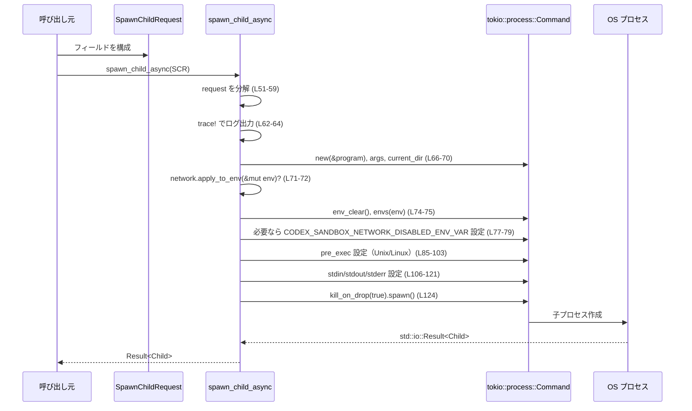

# core/src/spawn.rs コード解説

## 0. ざっくり一言

`spark_child_async` 関数と補助型を定義し、**ネットワークサンドボックスや標準入出力ポリシーを考慮して非同期に子プロセスを起動する**モジュールです（`tokio::process::Command` ベース）。

---

## 1. このモジュールの役割

### 1.1 概要

- このモジュールは、Codex 内でツール（特に `"shell"` ツール）を実行する際に使う **子プロセス起動の共通ロジック** を提供します。
- 実行ファイルパス・引数・作業ディレクトリ・環境変数・ネットワークサンドボックス設定・標準入出力ポリシーをまとめて受け取り、`tokio::process::Command` を構成して `Child` を返します（`spawn_child_async`、`core/src/spawn.rs:L50-124`）。
- Linux/Unix では `pre_exec` を使って **TTY からのデタッチ** や **親プロセス死亡時の SIGTERM 配送設定** を行い、親子プロセスのライフサイクルを揃えます（`core/src/spawn.rs:L81-103`）。

### 1.2 アーキテクチャ内での位置づけ

このファイルは「プロセス起動層」として、他モジュールから呼ばれ、OS プロセスやネットワーク・TTY 制御ライブラリに橋渡しします。

```mermaid
graph TD
    %% spawn_child_async (core/src/spawn.rs:L50-124)
    A["呼び出し元 (例: ツール実行ロジック)"]
    B["SpawnChildRequest<'a> (L39-48)"]
    C["spawn_child_async (L50-124)"]
    D["tokio::process::Command / Child (外部)"]
    E["NetworkProxy.apply_to_env (外部, codex_network_proxy)"]
    F["NetworkSandboxPolicy.is_enabled (外部, codex_protocol)"]
    G["codex_utils_pty::process_group (外部)"]
    H["OS プロセス / シェルコマンド"]

    A -->|構成して渡す| B
    B --> C
    C --> D
    C -->|環境変数を更新| E
    C -->|サンドボックス判定| F
    C -->|pre_exec 内で TTY/親死亡シグナル設定| G
    D -->|spawn() 呼び出し| H
```

### 1.3 設計上のポイント（根拠付き）

- パラメータオブジェクト `SpawnChildRequest` による集約  
  - 子プロセス起動に必要な情報（プログラムパス、引数、cwd、ネットワーク設定、環境変数など）を 1 つの構造体にまとめています（`core/src/spawn.rs:L39-47`）。
- OS 依存コードを `#[cfg]` で分離  
  - Unix のみ `arg0` の上書きや `pre_exec` を利用し、Linux のみ親死亡シグナル設定を行うように条件付きコンパイルしています（`core/src/spawn.rs:L67-68, L85-103`）。
- 環境変数の明示的な再構成  
  - `cmd.env_clear();` のあとで、引数の `env` マップを `envs` でセットし直し、さらにネットワークサンドボックス用の環境変数を追加しています（`core/src/spawn.rs:L71-79`）。
- ネットワークサンドボックス状態のエクスポート  
  - `NetworkSandboxPolicy::is_enabled()` の結果に応じて `CODEX_SANDBOX_NETWORK_DISABLED_ENV_VAR` を設定し、子プロセスからサンドボックス状態を判定できるようにしています（`core/src/spawn.rs:L11-19, L77-79`）。
- 子プロセスの自動終了（RAII + 非同期）  
  - `cmd.kill_on_drop(true)` を設定することで、`Child` ハンドルが drop されたときに子プロセスを kill する挙動を有効にしています（`core/src/spawn.rs:L124`）。
- `"shell"` ツール用の STDIO ポリシー  
  - `StdioPolicy` により、「親プロセスからの標準入出力継承」か、「ツール用に stdin を null、stdout/stderr を piped」にするかを切り替えています（`core/src/spawn.rs:L26-30, L106-121`）。

---

## 2. 主要な機能一覧

- 子プロセス起動（非同期）: `spawn_child_async` により、`SpawnChildRequest` を元に `tokio::process::Child` を生成します。
- ネットワークサンドボックス環境の設定: `NetworkSandboxPolicy` と `NetworkProxy` から環境変数を構成し、ネットワーク制限状態を子プロセスに伝えます。
- STDIO ポリシー制御: `StdioPolicy` に応じて、stdin/stdout/stderr の扱いを切り替えます。
- 親プロセス死亡時の子プロセス制御（Linux/Unix）: TTY からのデタッチと、親死亡時 SIGTERM の配信設定を行います。
- 親プロセス環境の遮断: `env_clear` により、子プロセスには明示的に渡した環境変数のみを見せます。

---

## 3. 公開 API と詳細解説

### 3.1 コンポーネント一覧

#### 定数

| 名前 | 種別 | 可視性 | 役割 / 用途 | 定義箇所 |
|------|------|--------|-------------|----------|
| `CODEX_SANDBOX_NETWORK_DISABLED_ENV_VAR` | `&'static str` | `pub` | ネットワークサンドボックスが特定状態のときに設定される環境変数名 | `core/src/spawn.rs:L11-19` |
| `CODEX_SANDBOX_ENV_VAR` | `&'static str` | `pub` | サンドボックス下でプロセスが起動されたことを示す環境変数名（値は例として macOS では `"seatbelt"`） | `core/src/spawn.rs:L21-24` |

※ `CODEX_SANDBOX_ENV_VAR` はこのファイル内では参照されていません（他モジュールで使用される前提と考えられますが、コードからは詳細不明です）。

#### 型（構造体・列挙体）

| 名前 | 種別 | 可視性 | 役割 / 用途 | 定義箇所 |
|------|------|--------|-------------|----------|
| `StdioPolicy` | enum | `pub` | 子プロセスの stdin/stdout/stderr をどう扱うかのポリシー（`RedirectForShellTool` / `Inherit`） | `core/src/spawn.rs:L26-30` |
| `SpawnChildRequest<'a>` | struct | `pub(crate)` | `spawn_child_async` に渡すパラメータオブジェクト。プログラムパス・引数・cwd・サンドボックス設定・環境変数などを保持 | `core/src/spawn.rs:L39-47` |

#### 関数

| 名前 | 戻り値 | 可視性 | 役割 / 用途 | 定義箇所 |
|------|--------|--------|-------------|----------|
| `spawn_child_async` | `std::io::Result<Child>` | `pub(crate)` | `SpawnChildRequest` に基づいて `tokio::process::Command` を構築し、非同期に子プロセスを起動する | `core/src/spawn.rs:L50-124` |

---

### 3.2 関数詳細: `spawn_child_async`

#### `spawn_child_async(request: SpawnChildRequest<'_>) -> std::io::Result<Child>`

**概要**

- 与えられた `SpawnChildRequest` から `tokio::process::Command` を構築し、環境変数やサンドボックス関連設定、STDIO 設定を反映した上で **非同期に子プロセスを spawn** する関数です（`core/src/spawn.rs:L50-124`）。
- 成功時には `tokio::process::Child` を `Ok` で返し、失敗時には `std::io::Error` を返します。

**引数**

`SpawnChildRequest<'a>` のフィールド（`core/src/spawn.rs:L39-47`）:

| フィールド名 | 型 | 説明 |
|-------------|----|------|
| `program` | `PathBuf` | 実行するプログラムのパス |
| `args` | `Vec<String>` | プログラムに渡す引数リスト |
| `arg0` | `Option<&'a str>` | Unix のみ有効。`execve` の `argv[0]` に相当する見かけのコマンド名を上書きするための値 |
| `cwd` | `PathBuf` | 子プロセスのカレントディレクトリ |
| `network_sandbox_policy` | `NetworkSandboxPolicy` | ネットワークサンドボックスのポリシー（詳細は外部 crate、`core/src/spawn.rs:L44`） |
| `network` | `Option<&'a NetworkProxy>` | ネットワークプロキシ設定。あれば `apply_to_env` で環境変数を追加する（`core/src/spawn.rs:L45, L71-72`） |
| `stdio_policy` | `StdioPolicy` | 標準入出力の扱いポリシー（`RedirectForShellTool` / `Inherit`） |
| `env` | `HashMap<String, String>` | 子プロセスに渡す環境変数一式。親プロセスの環境はクリアされ、このマップのみが適用される（`core/src/spawn.rs:L47, L74-75`） |

**戻り値**

- `std::io::Result<Child>`  
  - `Ok(Child)`: 子プロセスの起動に成功し、`Child` ハンドルを返す。非同期でプロセスを制御できる。
  - `Err(std::io::Error)`: コマンドが spawn できなかった場合の OS 由来の I/O エラー（例: 実行ファイルが存在しない、権限不足などがあり得ますが、このファイルのコードから具体的なエラー条件は判別できません）。

**内部処理の流れ（アルゴリズム）**

根拠となるコード: `core/src/spawn.rs:L50-124`

1. `SpawnChildRequest` を分解  
   - `let SpawnChildRequest { ... } = request;` でフィールドを個別変数に展開します（`L51-59`）。
2. ログ出力  
   - `tracing::trace!` で、プログラム・引数・cwd・サンドボックス設定などをトレースログに出力します（`L62-64`）。
3. `Command` 初期化と基本設定  
   - `Command::new(&program)` でコマンドを生成し（`L66`）、Unix では `arg0` を適用（なければプログラムパスから文字列を生成）します（`L67-68`）。
   - 引数を `cmd.args(args)` で追加し（`L69`）、カレントディレクトリを設定します（`L70`）。
4. ネットワークプロキシの環境変数適用  
   - `network` が `Some` の場合、`network.apply_to_env(&mut env)` で環境変数マップを更新します（`L71-72`）。
5. 環境変数のクリアと再設定  
   - `cmd.env_clear();` で親プロセスから引き継いだ環境変数を全て消去し（`L74`）、`cmd.envs(env);` で先ほどのマップの内容を再設定します（`L75`）。
6. ネットワークサンドボックス用環境変数の設定  
   - `if !network_sandbox_policy.is_enabled()` の場合に `CODEX_SANDBOX_NETWORK_DISABLED_ENV_VAR` を `"1"` に設定します（`L77-79`）。  
     ※ `is_enabled()` が何を意味するか（ネットワーク許可か、サンドボックス有効か）は、外部型のためこのファイルだけでは断定できません。
7. Unix における `pre_exec` 設定  
   - `stdio_policy` に基づいて TTY から切り離すかどうかを決定し（`L86-87`）、Linux では親 PID を取得します（`L88-89`）。
   - `cmd.pre_exec(move || { ... })` のクロージャ内で、必要なら TTY からデタッチし（`L91-93`）、Linux では `set_parent_death_signal` により「親が死んだら SIGTERM を送る」よう OS に依頼します（`L95-101`）。最後に `Ok(())` を返します（`L102-103`）。
8. 標準入出力ポリシーの適用  
   - `match stdio_policy { ... }` で分岐します（`L106-121`）。
     - `RedirectForShellTool` の場合: `stdin` を `Stdio::null()` にし、`stdout` と `stderr` を `Stdio::piped()` に設定します（`L107-115`）。
     - `Inherit` の場合: 親プロセスの stdin/stdout/stderr をそのまま継承します（`L116-121`）。
9. 子プロセスの kill-on-drop 設定と spawn  
   - `cmd.kill_on_drop(true)` を呼んだ後で `.spawn()` し、その結果（`Result<Child>`）を返します（`L124`）。

**処理フロー図**



**使用例（基本的な使い方）**

この関数は `async` なので、Tokio ランタイム上の非同期コンテキストから呼び出す必要があります。

```rust
use std::collections::HashMap;
use std::path::PathBuf;
use tokio::process::Child;

use codex_protocol::permissions::NetworkSandboxPolicy;
use codex_network_proxy::NetworkProxy;

use crate::spawn::{SpawnChildRequest, StdioPolicy};
use crate::spawn::spawn_child_async;

async fn run_ls_example() -> std::io::Result<Child> {
    // 実行するプログラム
    let program = PathBuf::from("/bin/ls");                             // 子プロセスで実行したいコマンド
    let args = vec!["-l".to_string(), "/".to_string()];                 // コマンド引数

    // 環境変数: 親環境を渡したい場合は自力でコピーする必要がある
    let mut env = HashMap::new();
    for (k, v) in std::env::vars() {                                    // 親プロセスの環境をコピー
        env.insert(k, v);
    }

    let request = SpawnChildRequest {
        program,
        args,
        arg0: None,                                                     // Unix で argv[0] を上書きしたいときだけ Some(...) にする
        cwd: PathBuf::from("/tmp"),                                     // 作業ディレクトリ
        network_sandbox_policy: NetworkSandboxPolicy::default(),        // 具体的な中身は外部クレート依存
        network: None,                                                  // プロキシが不要なら None
        stdio_policy: StdioPolicy::RedirectForShellTool,                // stdout/stderr をパイプで受けたい場合
        env,
    };

    let child = spawn_child_async(request).await?;                       // 非同期に spawn
    Ok(child)                                                            // Child ハンドルを返す
}
```

**Errors / Panics**

- **Errors (`Err(std::io::Error)`)**
  - `cmd.spawn()` による OS レベルのエラーがそのまま返されます（`core/src/spawn.rs:L124`）。
  - 例としては「実行ファイルが存在しない」「権限がない」「リソース不足」などが一般的ですが、コードから具体的なエラー条件は読み取れません。
- **Panics**
  - この関数内で明示的な `panic!` 呼び出しはありません。
  - `pre_exec` 内部で呼んでいる `codex_utils_pty::process_group::...` が panic/panic 相当のエラーを起こすかどうかは、このファイルだけでは不明です（`core/src/spawn.rs:L91-93, L98-100`）。コード上は `?` でエラーを `pre_exec` に伝播し、`Ok(())` を返しているため、`pre_exec` の失敗は spawn 失敗として扱われることが期待されます。

**Edge cases（エッジケース）**

- `network` が `None` の場合  
  - `apply_to_env` は呼ばれず、ネットワークプロキシ関連の環境変数は追加されません（`core/src/spawn.rs:L71-72`）。
- `env` が空の場合  
  - `cmd.env_clear()` のあとで `envs` に何も渡さなければ、子プロセスは環境変数を一切持たない状態で起動します（`L74-75`）。PATH なども消えるため、絶対パスでないプログラムは見つからない可能性があります。
- `StdioPolicy::RedirectForShellTool` の場合  
  - `stdin` が `Stdio::null()` となるため、標準入力を待つタイプのコマンド（例: 対話的プロンプト）は入力を受け取れません（`core/src/spawn.rs:L108-113`）。  
  - コメントにも「stdin を作ると一部コマンドが永遠に入力を待ち続けることがある」と記載されています（`L108-111`）。
- `StdioPolicy::Inherit` の場合  
  - 親プロセスのコンソール・TTY にそのままぶら下がるため、親が対話的に動いている場合、子も対話的になります（`L116-121`）。
- 非 Unix / 非 Linux 環境  
  - `#[cfg(unix)]` と `#[cfg(target_os = "linux")]` によって、`arg0` 上書きや `pre_exec`、親死亡シグナル設定は該当 OS でのみ有効です（`L67-68, L85-103`）。Windowsなどではこれらの機能が無効になる点に注意が必要です。

**使用上の注意点（安全性・並行性を含む）**

- **非同期実行の前提**
  - `tokio::process::Command` / `Child` を使っているため、Tokio ランタイム内の `async` コンテキストから `spawn_child_async` を呼び出す必要があります（`core/src/spawn.rs:L5-6, L50`）。
- **環境変数の完全上書き**
  - `cmd.env_clear()` により親環境は完全に消去され、`SpawnChildRequest.env` で渡したマップのみが適用されます（`L74-75`）。  
    PATH, HOME など必要な変数は呼び出し側で明示的にコピーする必要があります。
- **子プロセスの自動 kill**
  - `kill_on_drop(true)` により、`Child` が drop されたときに OS 側で子プロセスを kill するよう試みます（`L124`）。  
    - 長時間走らせたいプロセスを `Child` のライフタイムより長く動かしたい場合は、`Child` をスコープ外に出さないか、他の場所に保持するなどの工夫が必要です。
- **親プロセス死亡時の挙動（Linux/Unix）**
  - Unix では `pre_exec` で `detach_from_tty` を行う場合があります（`L87, L91-93`）。
  - Linux では `set_parent_death_signal` を呼ぶことで、「親が死んだときに SIGTERM を受け取る」よう OS に設定しています（コメント `L95-101`）。  
    これにより、`SIGKILL` などで Codex 本体プロセスが落ちた場合でも、関連する `"shell"` ツールの子プロセスが残りにくくなります。
- **unsafe ブロックの存在**
  - `pre_exec` 設定は `unsafe` ブロック内で行われています（`L85-86, L90`）。  
    呼び出し側からは安全な API として使えますが、`pre_exec` 内で呼べる関数は制約が大きいため、この部分を変更する際は注意が必要です。

---

### 3.3 その他の関数

- このチャンクには、補助的な自由関数や単純なラッパー関数は定義されていません。  
  `spawn_child_async` が唯一の関数です（`core/src/spawn.rs:L50-124`）。

---

## 4. データフロー

代表的なシナリオ: **Codex のツール実行ロジックが `"shell"` コマンドを実行する**場合。

1. ツール実行ロジックが `SpawnChildRequest` を組み立てる（プログラム、引数、cwd、ネットワーク設定、環境変数、stdio ポリシー）。
2. `spawn_child_async` を `await` し、内部で `Command` を構築。
3. ネットワークプロキシやサンドボックスポリシーに応じて環境変数を調整。
4. Unix/Linux では `pre_exec` による TTY / 親死亡時シグナル設定を行う。
5. STDIO ポリシーに応じて stdin/stdout/stderr を構成。
6. `spawn()` で OS にプロセスを作成させ、結果として `Child` を返す。

```mermaid
sequenceDiagram
    %% データフロー: ツール実行 -> spawn_child_async (core/src/spawn.rs:L39-124)
    participant Tool as ツール実行ロジック
    participant SCR as SpawnChildRequest
    participant SCA as spawn_child_async
    participant Env as 環境変数マップ(env)
    participant Cmd as Command
    participant OS as OS

    Tool->>SCR: program, args, cwd, network_sandbox_policy, network, stdio_policy, env をセット
    Tool->>SCA: spawn_child_async(SCR)
    SCA->>Env: network.apply_to_env(&mut env)? (L71-72)
    SCA->>Cmd: new(program), args, current_dir 設定 (L66-70)
    SCA->>Cmd: env_clear(); envs(env) (L74-75)
    SCA->>Cmd: CODEX_SANDBOX_NETWORK_DISABLED_ENV_VAR を設定する可能性 (L77-79)
    SCA->>Cmd: pre_exec 設定 (Unix/Linux) (L85-103)
    SCA->>Cmd: stdin/stdout/stderr 設定 (L106-121)
    SCA->>Cmd: kill_on_drop(true).spawn() (L124)
    Cmd->>OS: 子プロセス生成
    OS-->>SCA: Result<Child>
    SCA-->>Tool: Result<Child>
```

---

## 5. 使い方（How to Use）

### 5.1 基本的な使用方法

典型的なコードフローは以下のとおりです。

```rust
use std::collections::HashMap;
use std::path::PathBuf;
use tokio::process::Child;

use codex_protocol::permissions::NetworkSandboxPolicy;
use codex_network_proxy::NetworkProxy;

use crate::spawn::{SpawnChildRequest, StdioPolicy};
use crate::spawn::spawn_child_async;

async fn run_command() -> std::io::Result<Child> {
    // 1. 設定や依存オブジェクトを用意する
    let program = PathBuf::from("/usr/bin/env");                       // 実行するプログラム
    let args = vec!["bash".into(), "-c".into(), "echo hello".into()];  // 実行したいコマンド列

    let mut env = HashMap::new();
    for (k, v) in std::env::vars() {                                   // 必要なら親環境をコピー
        env.insert(k, v);
    }

    let network_policy = NetworkSandboxPolicy::default();              // 外部クレート定義（詳細不明）
    let network_proxy: Option<&NetworkProxy> = None;                   // プロキシ不要なら None

    // 2. SpawnChildRequest を構築する
    let request = SpawnChildRequest {
        program,
        args,
        arg0: None,                                                    // Unix で argv[0] を変えたいときは Some("表示名")
        cwd: std::env::current_dir().unwrap(),
        network_sandbox_policy: network_policy,
        network: network_proxy,
        stdio_policy: StdioPolicy::RedirectForShellTool,               // stdout/stderr をパイプで取りたい場合
        env,
    };

    // 3. メイン処理呼び出し
    let child = spawn_child_async(request).await?;                      // 子プロセス起動

    // 4. 結果の利用（例: stdout を読み取るなど）
    // child.stdout などを非同期で読み取ることができる

    Ok(child)
}
```

### 5.2 よくある使用パターン

1. **ツールの出力をプログラム側で処理したい場合**  
   - `StdioPolicy::RedirectForShellTool` を使用し、`Child` の `stdout` / `stderr` を `Some` として受け取る（`core/src/spawn.rs:L107-115`）。

2. **ユーザと対話する CLI をそのまま起動したい場合**  
   - `StdioPolicy::Inherit` を使用し、親プロセスのコンソールをそのまま利用する（`core/src/spawn.rs:L116-121`）。

3. **ネットワークプロキシを適用したい場合**  
   - `network: Some(&NetworkProxy)` を渡して `apply_to_env` により環境変数をセットし、HTTP(S)_PROXY などを子プロセスにも適用する（`core/src/spawn.rs:L45, L71-72`）。

### 5.3 よくある間違い（起こり得る誤用）

※ 以下はコードの挙動から推測した「起こりそうな誤用例」です。

```rust
// 誤り例: PATH を env に含めずに相対コマンド名だけを渡す
let program = PathBuf::from("ls");          // 絶対パスではない
let env = HashMap::new();                   // 空の環境
// cmd.env_clear() により PATH も消えるので、"ls" が見つからない可能性が高い

// 正しい例: 親の PATH などをコピーするか、絶対パスを指定する
let program = PathBuf::from("/bin/ls");     // もしくは env に PATH を含める
let mut env = HashMap::new();
for (k, v) in std::env::vars() {
    env.insert(k, v);
}
```

```rust
// 誤り例: 対話的なコマンドに RedirectForShellTool を指定して stdin を null にしてしまう
let stdio_policy = StdioPolicy::RedirectForShellTool; // stdin は null
// 対話的パスワードプロンプトなどは入力を受け取れない

// 正しい例: 対話が必要な場合は Inherit を使う
let stdio_policy = StdioPolicy::Inherit; // 親の stdin を共有
```

### 5.4 使用上の注意点（まとめ）

- 子プロセスに渡す環境変数は **明示的に構築する必要がある**（親環境は自動では引き継がれない）。
- `kill_on_drop(true)` のため、`Child` を drop すると子プロセスが kill される可能性が高い。  
  長時間走らせたいプロセスを扱う場合は、`Child` のライフタイム管理に注意が必要です。
- 非 Unix / 非 Linux 環境では `pre_exec` や親死亡シグナル設定は行われません。  
  その場合、親が強制終了したあとに子がゾンビ的に残る可能性があります。
- `spawn_child_async` 自体は `unsafe` ではありませんが、内部で `unsafe` ブロックを使用しているため、この関数の実装を変更する際は Rust の `pre_exec` 安全制約を理解しておく必要があります。

---

## 6. 変更の仕方（How to Modify）

### 6.1 新しい機能を追加する場合

例: **新しい STDIO ポリシー（ログのみ書き出すなど）を追加したい場合**

1. `StdioPolicy` に新しいバリアントを追加する（`core/src/spawn.rs:L26-30`）。
2. `spawn_child_async` の `match stdio_policy` に新しいバリアントの処理を追加する（`L106-121`）。
3. 必要であれば、`SpawnChildRequest` を使う呼び出し元コードに新ポリシーを選択するロジックを追加する（このチャンクには呼び出し元コードは現れません）。

例: **追加のサンドボックス情報を環境変数で渡したい場合**

1. 新しい定数（`pub const ...`）をこのファイルに定義する（`CODEX_SANDBOX_ENV_VAR` と同様、`L21-24` 付近）。
2. `spawn_child_async` 内で `cmd.env("NEW_ENV", "value")` を設定する場所を追加する（`L74-79` 付近が適所）。

### 6.2 既存の機能を変更する場合

- `SpawnChildRequest` にフィールドを追加・変更する場合  
  - `spawn_child_async` でのパターン分解（`L51-59`）と、そのフィールドを使う箇所（`L66-79, L106-121` など）を忘れずに追従させる必要があります。
- 環境変数の扱いを変更する場合  
  - `cmd.env_clear()` の前後関係を変えると、親環境が残る・残らないといった契約が変わります（`L74-75`）。  
    これを変更する場合、呼び出し元が期待する「どの環境変数が見えるか」の契約が変化するため、影響範囲が大きくなります。
- ネットワークサンドボックスの条件を変更する場合  
  - `if !network_sandbox_policy.is_enabled()` の条件式を変更すると、`CODEX_SANDBOX_NETWORK_DISABLED_ENV_VAR` が設定されるケースが変わります（`L77-79`）。  
    この環境変数を読んでいるツール側の挙動が変わるため、連携先のコード確認が必要です。

---

## 7. 関連ファイル・モジュール

このモジュールと密接に関係する外部モジュール（ファイルパスはこのチャンクからは分かりませんが、モジュールパスとして）:

| パス / モジュール | 役割 / 関係 |
|-------------------|------------|
| `codex_network_proxy::NetworkProxy` | `SpawnChildRequest.network` フィールドの型。`apply_to_env(&mut env)` でネットワークプロキシ設定を環境変数に反映する（`core/src/spawn.rs:L1, L45, L71-72`）。 |
| `codex_protocol::permissions::NetworkSandboxPolicy` | ネットワークサンドボックスのポリシー型。`is_enabled()` により環境変数設定の条件に使われる（`core/src/spawn.rs:L9, L44, L77-79`）。 |
| `codex_utils_pty::process_group` | Unix/Linux で TTY デタッチ・親死亡シグナル設定を行うユーティリティ。`pre_exec` 内で呼ばれる（`core/src/spawn.rs:L91-93, L98-100`）。 |
| `tokio::process::{Command, Child}` | 非同期子プロセス起動の基盤となる型。`spawn_child_async` がこれを使って OS プロセスを生成する（`core/src/spawn.rs:L5-6, L66-70, L124`）。 |
| `tracing::trace` | 子プロセス起動パラメータをトレースログに出力するために使用（`core/src/spawn.rs:L7, L62-64`）。 |

※ テストコードはこのチャンクには現れません。テストが存在するかどうかは、他ファイルを確認しないと分かりません。
