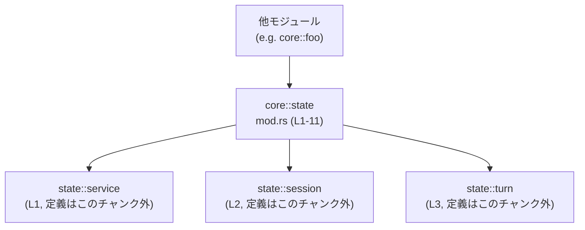
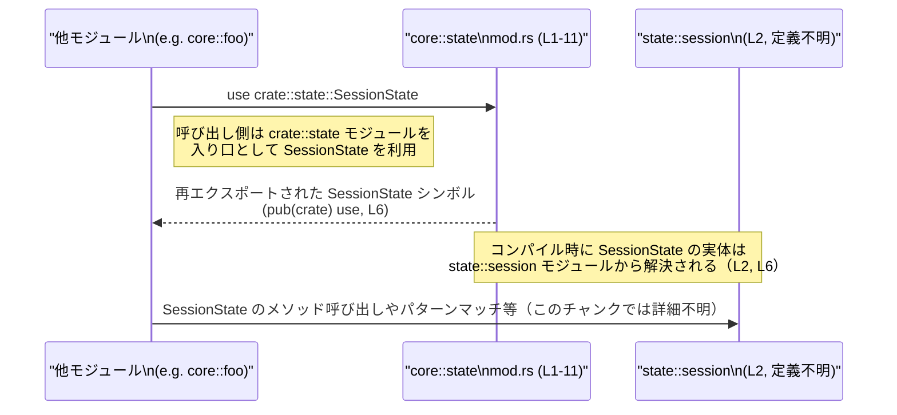

core/src/state/mod.rs コード解説です。

---

# 0. ざっくり一言

このモジュールは、`state` 配下のサブモジュール（`service`, `session`, `turn`）をまとめ、その中で定義されているセッション・ターン・タスク関連の型をクレート内向けに再エクスポートする「ハブモジュール」として機能しています（`core/src/state/mod.rs:L1-L3, L5-L11`）。

---

# 1. このモジュールの役割

## 1.1 概要

- `mod service; mod session; mod turn;` により、`state` 名前空間の下に 3 つのサブモジュールを宣言しています（`core/src/state/mod.rs:L1-L3`）。
- それぞれのサブモジュールから、セッション・ターン・タスクに関係すると思われる複数の型を `pub(crate) use` で再エクスポートしています（`core/src/state/mod.rs:L5-L11`）。
- これにより、クレート内部の他モジュールは `crate::state::…` というパスだけを知っていれば、セッション状態やターン状態などの型にアクセスできる構造になっています。

## 1.2 アーキテクチャ内での位置づけ

このファイルは `core::state` モジュールのルートであり、サブモジュールとクレート内の利用者の間に立つ「ファサード（窓口）」として振る舞っています（`core/src/state/mod.rs:L1-L3, L5-L11`）。

下図は、このチャンクで確認できる範囲の依存関係を示したものです。



- `caller` はこのクレート内の任意の他モジュールを表します。
- `state_mod` は本ファイル（`core/src/state/mod.rs`）です。
- 具体的な処理ロジックやフィールドはサブモジュール側にあり、このチャンクには現れていません。

## 1.3 設計上のポイント

コードから読み取れる設計上の特徴は以下の通りです。

- **責務の分割**  
  - セッション関連 (`SessionServices`, `SessionState`) は `service` / `session` モジュールに分離されています（`core/src/state/mod.rs:L1-L2, L5-L6`）。
  - ターン／タスク関連 (`ActiveTurn`, `MailboxDeliveryPhase`, `RunningTask`, `TaskKind`, `TurnState`) は `turn` モジュールに集約されています（`core/src/state/mod.rs:L3, L7-L11`）。
- **ファサードとしての再エクスポート**  
  - すべて `pub(crate) use` で再エクスポートされており、`crate::state` を通じてこれらの型にアクセスできるようにしています（`core/src/state/mod.rs:L5-L11`）。
  - 可視性が `pub` ではなく `pub(crate)` であるため、これらの型は「クレート内専用 API」であり、外部クレートには直接公開されません。
- **状態・エラーハンドリング・並行性に関する情報**  
  - このファイル自身には、状態を保持するフィールド定義や関数ロジックは一切なく、エラー処理や並行実行（スレッド・async など）に関係するコードも現れていません（`core/src/state/mod.rs:L1-L11`）。
  - したがって、メモリ安全性・エラー・並行性に関する具体的な挙動は、このチャンクからは読み取れません。実際の挙動は `service`, `session`, `turn` モジュール側の実装に依存します。

---

# 2. 主要な機能一覧（コンポーネントインベントリー）

このファイル自体は関数や構造体を「定義」しておらず、**サブモジュールの型を再エクスポートする機能**のみを提供しています。

再エクスポートされている主なコンポーネントは次の通りです（すべて `pub(crate)`、`core/src/state/mod.rs:L5-L11`）。

- `SessionServices`: `service` モジュールから再エクスポートされる型。種別（構造体・列挙体・トレイトなど）はこのチャンクでは不明。
- `SessionState`: `session` モジュールから再エクスポートされる型。種別はこのチャンクでは不明。
- `ActiveTurn`: `turn` モジュールからの型。種別は不明。
- `MailboxDeliveryPhase`: `turn` モジュールからの型。種別は不明。
- `RunningTask`: `turn` モジュールからの型。種別は不明。
- `TaskKind`: `turn` モジュールからの型。種別は不明。
- `TurnState`: `turn` モジュールからの型。種別は不明。

---

# 3. 公開 API と詳細解説

## 3.1 型一覧（構造体・列挙体など）

このファイル内で **新たな型定義はありません**。  
ただし、モジュールとしては以下の型を「クレート内 API」として提供しています（`pub(crate) use` による再エクスポート、`core/src/state/mod.rs:L5-L11`）。

| 名前                   | 種別                           | 定義元モジュール | 役割 / 用途（このチャンクから分かる範囲）                                                                 | 根拠 |
|------------------------|--------------------------------|------------------|------------------------------------------------------------------------------------------------------------|------|
| `SessionServices`      | 不明（このチャンクには定義なし） | `state::service` | セッションに紐づく複数サービスをまとめる型である可能性がありますが、実際の用途はこのチャンクからは不明です。 | `core/src/state/mod.rs:L1, L5` |
| `SessionState`         | 不明                           | `state::session` | セッションの状態（例: 接続中/切断など）を表す可能性がありますが、詳細は不明です。                             | `core/src/state/mod.rs:L2, L6` |
| `ActiveTurn`           | 不明                           | `state::turn`    | 「現在アクティブなターン」を表現する型名ですが、具体的な構造・振る舞いは不明です。                             | `core/src/state/mod.rs:L3, L7` |
| `MailboxDeliveryPhase` | 不明                           | `state::turn`    | メールボックス配達のフェーズを表すような名前ですが、どういった状態があるかはこのチャンクでは分かりません。   | `core/src/state/mod.rs:L3, L8` |
| `RunningTask`          | 不明                           | `state::turn`    | 実行中のタスクを表す型名ですが、スレッド・非同期タスクなどどのレベルの「タスク」かは不明です。              | `core/src/state/mod.rs:L3, L9` |
| `TaskKind`             | 不明                           | `state::turn`    | タスクの種類を区別する列挙体である可能性がありますが、実際のバリアントや意味は不明です。                    | `core/src/state/mod.rs:L3, L10` |
| `TurnState`            | 不明                           | `state::turn`    | ターンの状態を持つ型と想定されますが、具体的な状態遷移やフィールドはこのチャンクには現れません。            | `core/src/state/mod.rs:L3, L11` |

> 種別やフィールド構成、メソッドなどはすべてサブモジュール側に定義されており、このチャンクには現れないため「不明」としています。

## 3.2 関数詳細（最大 7 件）

このファイルには **関数定義が一つも存在しません**（`core/src/state/mod.rs:L1-L11`）。  
そのため、このセクションで詳しく解説できる関数はありません。

- エラー処理（`Result` / `Option`）、`async fn`、`unsafe` ブロックなども登場しないため、このモジュール自身が直接関与するメモリ安全性・エラー・並行性のロジックは確認できません。

## 3.3 その他の関数

- 該当なし（このファイルには関数が定義されていません）。

---

# 4. データフロー

このファイルには実行時ロジックはありませんが、**型やモジュールの「名前解決フロー」**という意味でのデータフローを説明します。

## 4.1 型の名前解決フロー

他モジュールが `SessionState` などを利用する際の流れを、コンパイル時の解決プロセスという観点で示します。



要点:

- `Caller` は `crate::state::SessionState` というパスだけを指定します。
- コンパイラは `core::state::mod.rs` にある `pub(crate) use session::SessionState;`（`core/src/state/mod.rs:L6`）を辿り、その定義を `state::session` モジュール側に解決します。
- 実際のメソッド呼び出しや状態遷移は `state::session` などのサブモジュール側で実装されており、このチャンクには現れません。

このプロセスには実行時オーバーヘッドはなく、あくまでコンパイル時の名前解決の話です。  
従って、このファイルの存在がパフォーマンスや並行性に直接影響することはありません。

---

# 5. 使い方（How to Use）

## 5.1 基本的な使用方法

このモジュールは **クレート内部の他モジュールからのインポート窓口**として利用されます。  
`pub(crate)` なので、同じクレート内であれば次のように利用できます（`core/src/state/mod.rs:L5-L11`）。

```rust
// クレート内の別モジュールからの利用例
use crate::state::{
    SessionServices,   // service::SessionServices を再エクスポート経由で利用
    SessionState,      // session::SessionState
    ActiveTurn,        // turn::ActiveTurn
    MailboxDeliveryPhase,
    RunningTask,
    TaskKind,
    TurnState,
};

fn example_usage(state: SessionState, turn: TurnState) {
    // ここで state や turn に対して、サブモジュール側で定義された
    // メソッド呼び出し・パターンマッチ等を行うはずですが、
    // その詳細はこのチャンクには現れません。
    let _ = (state, turn); // ダミー使用
}
```

ポイント:

- 呼び出し側は `crate::state::…` パスにだけ依存し、`state::session` や `state::turn` の細かい構造を知らなくて済む構造になっています（`core/src/state/mod.rs:L1-L3, L5-L11`）。
- このモジュールは再エクスポートのみであり、実行時の処理・エラー・並行性に関するロジックは持ちません。

## 5.2 よくある使用パターン

このチャンクから推測できる典型的なパターンは次の通りです。

1. **状態型の集約インポート**

   ```rust
   use crate::state::{SessionState, TurnState};

   fn handle_state(session: SessionState, turn: TurnState) {
       // 状態に応じた分岐などを行う（詳細はサブモジュール側）
   }
   ```

   - 状態に関連する型を `crate::state` からまとめてインポートすることで、呼び出し側コードの可読性が上がる構造になっています（`core/src/state/mod.rs:L5-L11`）。

2. **サービスオブジェクトの利用**

   ```rust
   use crate::state::SessionServices;

   fn use_services(services: SessionServices) {
       // services に含まれる各種サービスを利用する想定ですが、
       // 実際のメソッドやフィールドはこのチャンクには現れません。
   }
   ```

   - `SessionServices` がセッションに紐づくサービス群のコンテナであると仮定すると、単一のインポートで関連機能にアクセスできる形になっている可能性があります（ただし、これは型名からの推測であり、コードからは断定できません）。

## 5.3 よくある間違い（起こりうる注意点）

このファイルのコードから推測できる「誤用パターン」とその注意点です。

1. **外部クレートからの直接利用を想定してしまう**

   ```rust
   // 別クレート側のコード（これはコンパイルエラーになる）
   use some_crate::state::SessionState; // NG: pub(crate) なので外部からは見えない
   ```

   正しくは:

   ```rust
   // 正しい例: 同じクレート内からの利用のみ可能
   use crate::state::SessionState; // OK: pub(crate) なのでクレート内からは利用できる
   ```

   - 原因: 再エクスポートが `pub` ではなく `pub(crate)` であるため、外部クレートからはアクセスできません（`core/src/state/mod.rs:L5-L11`）。
   - 対応: これらの型を外部クレートにも公開したい場合は、このファイル側の可視性修正が必要になります（設計判断となるため、このドキュメントでは評価しません）。

2. **サブモジュールを直接インポートしてしまう**

   ```rust
   // 動作としては問題ないが、一貫性を失う可能性があるパターン
   use crate::state::session::SessionState; // 直接サブモジュールを参照

   // 一般には次のようにファサード経由でインポートする方が一貫した構造になる
   use crate::state::SessionState;
   ```

   - この点は設計ポリシー次第ですが、本ファイルがファサードとして用意されていることから、`crate::state::SessionState` という形で統一する意図がある可能性があります（`core/src/state/mod.rs:L5-L6`）。

## 5.4 使用上の注意点（まとめ）

- **可視性の範囲**  
  - すべて `pub(crate)` 再エクスポートであるため、外部クレートからは見えません（`core/src/state/mod.rs:L5-L11`）。
- **安全性・エラー・並行性**  
  - このモジュールは関数・フィールド・`unsafe` ブロック・`async` 関数を持たないため、このファイル単体でメモリ安全性や並行性に関するリスクはありません（`core/src/state/mod.rs:L1-L11`）。
  - 実際の安全性やエラー処理、スレッド／非同期タスクの扱いは、再エクスポートされている型の実装側（`service`, `session`, `turn` モジュール）に依存します。
- **依存方向の管理**  
  - 呼び出し側はできるだけ `crate::state` ファサード経由で型を利用することで、内部構造の変更に強い設計になります。

---

# 6. 変更の仕方（How to Modify）

## 6.1 新しい機能を追加する場合

このモジュールの役割から考えると、「新しい状態／サービス関連の型を追加」する際の変更入口になります。

典型的なステップ:

1. **サブモジュールに新しい型を追加する**  
   - 例: `state::turn` モジュールに `PausedTask` という型を追加する（定義は別ファイル。実際のパスはこのチャンクからは特定できません）。

2. **`mod` 宣言が必要であれば追加する**  
   - 既存の `mod turn;`（`core/src/state/mod.rs:L3`）のように、まだ `mod` 宣言されていない新規モジュールを追加する場合は、同様に `mod new_mod;` を追加します。

3. **このファイルから新しい型を再エクスポートする**

   ```rust
   // 既存の再エクスポート群（L5-L11）に倣う
   pub(crate) use turn::PausedTask; // 例: 新たな型をクレート内 API に追加
   ```

   - これにより、他モジュールからは `crate::state::PausedTask` で型を利用できるようになります。

## 6.2 既存の機能を変更する場合

1. **型名の変更**

   - 例えば `SessionState` の名前を変更する場合:
     - 定義元モジュール（`state::session`）側の型名を変更する。
     - このファイルの再エクスポート行も合わせて変更する（`core/src/state/mod.rs:L6` の行）。

2. **型の可視性の変更**

   - クレート外からも利用できるようにしたい場合:
     - このファイルでの `pub(crate)` を `pub` に変更する必要があります（`core/src/state/mod.rs:L5-L11`）。
     - その際、外部 API の安定性やバージョニングへの影響を考慮する必要がありますが、それはこのドキュメントの範囲外です。

3. **影響範囲の確認**

   - `grep` や IDE の「シンボルの参照先検索」を利用して、`crate::state::SessionState` 等を利用している箇所を確認し、型名や可視性変更による影響を洗い出す必要があります。
   - 実行ロジックや状態遷移はサブモジュール側にあるため、それらのテストコードも併せて確認する必要があります（このチャンクにはテストコードは現れていません）。

---

# 7. 関連ファイル

このモジュールと密接に関係するファイル・モジュールは、`mod` 宣言と再エクスポートから次のように推定できます。

| パス / モジュール名     | 役割 / 関係                                                                                  | 根拠 |
|-------------------------|---------------------------------------------------------------------------------------------|------|
| `state::service`        | `SessionServices` 型を定義しているモジュール。セッション関連サービスの集合を扱う可能性があります。 | `core/src/state/mod.rs:L1, L5` |
| `state::session`        | `SessionState` 型を定義しているモジュール。セッション状態に関するロジックを持つと考えられます。   | `core/src/state/mod.rs:L2, L6` |
| `state::turn`           | `ActiveTurn`, `MailboxDeliveryPhase`, `RunningTask`, `TaskKind`, `TurnState` を定義するモジュール。ターン／タスク管理の中心と推測されます。 | `core/src/state/mod.rs:L3, L7-L11` |
| （対応する .rs ファイル） | `mod service;` 等から、Rust のモジュール規約に従う `.rs` or `mod.rs` ファイルが存在するはずですが、具体的なファイル名・パスはこのチャンクには現れていません。 | `core/src/state/mod.rs:L1-L3` |

> 上記のうち、「どのようなロジックを持つか」「どのようなエッジケースやエラー処理を行うか」などの詳細は、このチャンクには現れません。実際の挙動の理解には、各サブモジュールのコードを参照する必要があります。

---

## このチャンクから分かる Bugs / Security / Contracts / Edge Cases / Performance

- **Bugs / Security**  
  - このファイルは `mod` 宣言と `pub(crate) use` のみで構成され、実行ロジックや `unsafe` コードを含まないため、このファイル単体から明らかなバグやセキュリティ上の問題は読み取れません（`core/src/state/mod.rs:L1-L11`）。
- **Contracts / Edge Cases**  
  - ここで再エクスポートされている型の「契約」（前提条件・不変条件）やエッジケースの扱いは、すべてサブモジュール側の実装に依存しており、このチャンクからは不明です。
- **Performance / Scalability / Concurrency**  
  - 再エクスポートはコンパイル時の名前解決に関わるだけで、実行時のオーバーヘッドはほぼありません。
  - 並行性（スレッド／async タスク）に関する挙動も、このファイルからは全く読み取れません。`RunningTask` 等の型名から並行処理との関連が推測されますが、コード上の裏付けはこのチャンクにはありません。
