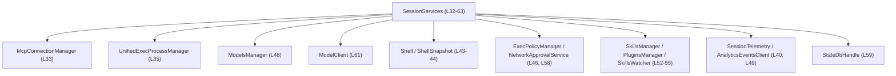
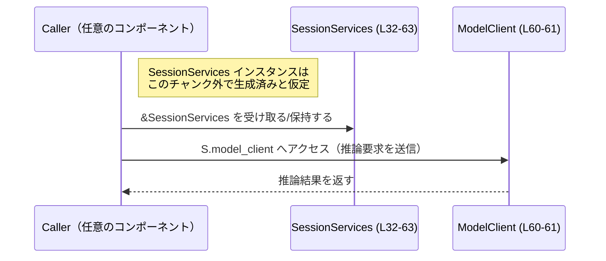

# core/src/state/service.rs コード解説

## 0. ざっくり一言

`SessionServices` 構造体で、1 セッションの間に利用される多数のサービス（MCP 接続、実行環境、モデル、権限管理、テレメトリなど）を 1 箇所に集約して保持するモジュールです（`service.rs:L32-63`）。

---

## 1. このモジュールの役割

### 1.1 概要

- このモジュールは、セッション単位で必要になるさまざまなサービスオブジェクトを 1 つの構造体 `SessionServices` にまとめて保持するために存在します（`service.rs:L32-63`）。
- 外部クレートや他モジュールから提供されるマネージャ・クライアント・設定・テレメトリなどをフィールドとして持ち、セッション内の他コンポーネントに再利用可能な形で渡す役割があると解釈できます（名前と型からの読み取りであり、具体的な利用箇所はこのチャンクには現れません）。

### 1.2 アーキテクチャ内での位置づけ

このファイルから読み取れるのは、「`SessionServices` が多くの外部サービスに依存している」という一方向の依存関係です。`SessionServices` を誰が生成・利用するかは、このチャンクには現れません。

主な依存関係（抜粋）:

- MCP 関連: `McpConnectionManager`, `McpManager`（`service.rs:L33, L54`）
- 実行環境: `UnifiedExecProcessManager`, `Environment`（`service.rs:L35, L63`）
- モデル/クライアント: `ModelsManager`, `ModelClient`（`service.rs:L48, L61`）
- ポリシー/権限: `ExecPolicyManager`, `NetworkApprovalService`, `ApprovalStore`（`service.rs:L46, L58, L50`）
- Shell 関連: `Shell`, `ShellSnapshot`, `shell_zsh_path`, `main_execve_wrapper_exe`（`service.rs:L37, L39, L43-44`）
- プラグイン/スキル: `SkillsManager`, `PluginsManager`, `SkillsWatcher`（`service.rs:L52-53, L55`）
- テレメトリ/ロールアウト: `SessionTelemetry`, `AnalyticsEventsClient`, `RolloutRecorder`（`service.rs:L40, L42, L49`）

これを簡略化した依存関係図は次のとおりです。



※ 矢印は「`SessionServices` のフィールドとして保持している」という静的な依存関係を示し、実際の呼び出し・データの流れはこのチャンクには現れません。

### 1.3 設計上のポイント

コードから読み取れる特徴を列挙します。

- **サービス集約構造体**  
  - `SessionServices` は多数のサービスをフィールドとして保持する「集約構造体」として設計されています（`service.rs:L32-63`）。
- **並行性を意識したフィールド型**
  - `Arc`, `Mutex`, `RwLock`, `watch::Sender`, `CancellationToken` など、非同期・マルチスレッド環境での共有を前提とした型が使われています（`service.rs:L2, L27-30, L33-34, L42-43, L44, L58, L63`）。
- **セッションスコープ**
  - フィールド名および型名から、「セッションごとに 1 つ生成され、そのセッション内で共有される」ことを意図した設計と解釈できます（`SessionTelemetry`, `RolloutRecorder`, `SessionServices` という名前などからの推測）。
- **条件付きフィールド**
  - `Option<PathBuf>`, `Option<StartedNetworkProxy>`, `Option<StateDbHandle>`, `Option<Arc<Environment>>` など、環境や設定によって存在しない可能性があるサービスを `Option` で表現しています（`service.rs:L37, L39, L57, L59, L63`）。
- **crate 内公開 (`pub(crate)`)**
  - 構造体と全フィールドは `pub(crate)` で公開されており、同一クレート内から直接フィールドにアクセスできる設計になっています（`service.rs:L32-63`）。

---

## 2. 主要な機能一覧

このファイルには関数はなく、`SessionServices` 構造体のみが定義されています。そのため「機能」は各フィールドを通じて利用できるサービスに対応します（`service.rs:L32-63`）。

- MCP 接続管理: `mcp_connection_manager`, `mcp_manager`
- MCP 起動キャンセル制御: `mcp_startup_cancellation_token`
- 統合実行プロセス管理: `unified_exec_manager`
- シェル関連設定・状態: `shell_zsh_path`, `main_execve_wrapper_exe`, `user_shell`, `shell_snapshot_tx`
- 分析・テレメトリ: `analytics_events_client`, `session_telemetry`, `rollout`
- 実行ポリシー/権限管理: `exec_policy`, `tool_approvals`, `guardian_rejections`, `network_approval`
- 認証管理: `auth_manager`
- モデル管理・クライアント: `models_manager`, `model_client`
- スキル/プラグイン関連: `skills_manager`, `plugins_manager`, `skills_watcher`
- エージェント制御と説明表示: `agent_control`, `show_raw_agent_reasoning`
- ネットワークプロキシ: `network_proxy`
- 状態 DB へのアクセス: `state_db`
- コードモード機能: `code_mode_service`
- 実行環境情報: `environment`

※ これらの「機能」がどのように呼び出されるかは、このチャンクには定義されていません。

---

## 3. 公開 API と詳細解説

### 3.1 型一覧（構造体・列挙体など）

このファイルで定義されている型は `SessionServices` のみです（`service.rs:L32-63`）。

| 名前 | 種別 | 役割 / 用途 | 定義位置 |
|------|------|-------------|----------|
| `SessionServices` | 構造体 | セッション単位で利用する各種サービスオブジェクトを集約して保持するコンテナ | `service.rs:L32-63` |

`SessionServices` の主要フィールド一覧（このファイルで定義されているもののみ）:

| フィールド名 | 型 | 説明（名前と型からの解釈） | 定義位置 |
|-------------|----|----------------------------|----------|
| `mcp_connection_manager` | `Arc<RwLock<McpConnectionManager>>` | MCP 接続管理オブジェクトへの共有・排他アクセス | `service.rs:L33` |
| `mcp_startup_cancellation_token` | `Mutex<CancellationToken>` | MCP 起動処理をキャンセルするためのトークンを守る非同期 Mutex | `service.rs:L34` |
| `unified_exec_manager` | `UnifiedExecProcessManager` | 統合された実行プロセス管理 | `service.rs:L35` |
| `shell_zsh_path` | `Option<PathBuf>` | Zsh シェルのパス（非 Unix 環境では未使用になりうる） | `service.rs:L37` |
| `main_execve_wrapper_exe` | `Option<PathBuf>` | execve ラッパーの実行ファイルパス | `service.rs:L39` |
| `analytics_events_client` | `AnalyticsEventsClient` | 分析イベント送信用クライアント | `service.rs:L40` |
| `hooks` | `Hooks` | 外部フック（拡張ポイント）管理 | `service.rs:L41` |
| `rollout` | `Mutex<Option<RolloutRecorder>>` | ロールアウト記録のオプション値を守る Mutex | `service.rs:L42` |
| `user_shell` | `Arc<crate::shell::Shell>` | ユーザーシェルインスタンスの共有参照 | `service.rs:L43` |
| `shell_snapshot_tx` | `watch::Sender<Option<Arc<crate::shell_snapshot::ShellSnapshot>>>` | シェル状態スナップショットのウォッチチャネル送信側 | `service.rs:L44` |
| `show_raw_agent_reasoning` | `bool` | エージェントの内部推論の表示フラグ | `service.rs:L45` |
| `exec_policy` | `Arc<ExecPolicyManager>` | 実行ポリシー管理 | `service.rs:L46` |
| `auth_manager` | `Arc<AuthManager>` | 認証管理 | `service.rs:L47` |
| `models_manager` | `Arc<ModelsManager>` | モデル管理 | `service.rs:L48` |
| `session_telemetry` | `SessionTelemetry` | セッション単位のテレメトリ情報 | `service.rs:L49` |
| `tool_approvals` | `Mutex<ApprovalStore>` | ツール利用の承認情報を保持するストア | `service.rs:L50` |
| `guardian_rejections` | `Mutex<HashMap<String, GuardianRejection>>` | Guardian による拒否情報のマップ | `service.rs:L51` |
| `skills_manager` | `Arc<SkillsManager>` | スキル管理 | `service.rs:L52` |
| `plugins_manager` | `Arc<PluginsManager>` | プラグイン管理 | `service.rs:L53` |
| `mcp_manager` | `Arc<McpManager>` | MCP 関連の上位管理 | `service.rs:L54` |
| `skills_watcher` | `Arc<SkillsWatcher>` | スキルの変化監視 | `service.rs:L55` |
| `agent_control` | `AgentControl` | エージェント制御インターフェース | `service.rs:L56` |
| `network_proxy` | `Option<StartedNetworkProxy>` | 起動済みネットワークプロキシのハンドル | `service.rs:L57` |
| `network_approval` | `Arc<NetworkApprovalService>` | ネットワークアクセス承認サービス | `service.rs:L58` |
| `state_db` | `Option<StateDbHandle>` | 状態 DB へのハンドル | `service.rs:L59` |
| `model_client` | `ModelClient` | セッションスコープのモデルクライアント | `service.rs:L60-61` |
| `code_mode_service` | `CodeModeService` | コードモード関連サービス | `service.rs:L62` |
| `environment` | `Option<Arc<Environment>>` | 実行環境情報（存在しない場合もある） | `service.rs:L63` |

※ 説明欄は型・名前からの解釈であり、実際の振る舞いはそれぞれの型の定義側を参照する必要があります。このチャンクには実装は現れません。

### 3.2 関数詳細（最大 7 件）

このファイルには関数・メソッドの定義が存在しません（コンストラクタやメソッドも含めて未定義です）。（`service.rs:L1-63`）

そのため、関数詳細テンプレートを適用できる対象はありません。

### 3.3 その他の関数

- このチャンクには補助関数やラッパー関数も定義されていません（`service.rs:L1-63`）。

---

## 4. データフロー

このファイル単体では関数呼び出しが定義されていないため、「実際の処理フロー」は読み取れません。ただし、`SessionServices` を経由してどのようにデータが流れうるかの典型パターンを、型とフィールド構成から推測しつつ整理します。

### 4.1 概念的なフロー概要

- どこか別のモジュールで `SessionServices` が生成され、セッションコンテキストとして保持される（この生成処理はこのチャンクには現れません）。
- セッション中の各処理は、`&SessionServices` または `Arc<SessionServices>` のような形でこの構造体へアクセスし、必要なサービス（例: `model_client`, `exec_policy`, `network_approval`）を利用することが想定されます。
- 状態の更新を伴うものは `Mutex` や `RwLock` を通じて変更され、他のタスクからも安全に共有されます（`service.rs:L33-34, L42, L50-51`）。

### 4.2 典型利用のシーケンス図（概念図）

以下は、「あるコンポーネントがモデル推論を行う際に `SessionServices` を経由して `ModelClient` を利用する」という典型的な利用イメージです。**このシーケンスは一般的な利用例であり、実装コードはこのチャンクには現れません。**



同様に、キャンセルや監査情報の更新、スキルの変更なども `SessionServices` のフィールドを経由して行われると考えられますが、それぞれの具体的な呼び出しはこのチャンクには現れません。

---

## 5. 使い方（How to Use）

このファイルには `SessionServices` のコンストラクタやメソッドがないため、「どう初期化するか」は別ファイル側の責務です。この節では、「既に初期化された `SessionServices` を受け取った側が、どのようにフィールドを扱うことになるか」という観点で使用例を示します。

> 注意: 以下のコードは **一般的な利用例** を示すものであり、このリポジトリに実際に存在するコードではありません。

### 5.1 基本的な使用方法

例として、MCP 起動処理をキャンセルする処理のイメージです。

```rust
use crate::state::service::SessionServices;          // SessionServices をインポートする（モジュールパスは例示）

// セッション中に呼ばれうる非同期関数のイメージ
pub async fn cancel_mcp_startup(services: &SessionServices) {
    // 非同期 Mutex をロックして CancellationToken への排他的アクセスを得る
    let token_guard = services
        .mcp_startup_cancellation_token                 // Mutex<CancellationToken> フィールド（service.rs:L34）
        .lock()
        .await;

    // CancellationToken に対してキャンセル指示（tokio_util::sync::CancellationToken の一般的な使い方）
    token_guard.cancel();                               // 実際に cancel メソッドを呼ぶコードはこのチャンクにはありません
}
```

この例では:

- 呼び出し側は `&SessionServices` を受け取り、必要なフィールドにアクセスします。
- `Mutex`/`RwLock` で守られているフィールドは `lock().await` や `read().await` 経由で操作します。

### 5.2 よくある使用パターン（想定されるもの）

1. **共有リソースの読み取り**

```rust
pub async fn log_guardian_rejections(services: &SessionServices) {
    let rejections = services
        .guardian_rejections                       // Mutex<HashMap<_, GuardianRejection>>（service.rs:L51）
        .lock()
        .await;

    // ここで rejections をイテレートしてログ出力するなどの処理を行うイメージ
    for (key, rejection) in rejections.iter() {
        println!("rejected key = {}", key);
        // GuardianRejection の詳細はこのチャンクには現れません
    }
}
```

1. **`Option` なフィールドの条件付き利用**

```rust
pub fn maybe_use_network_proxy(services: &SessionServices) {
    if let Some(proxy) = &services.network_proxy { // Option<StartedNetworkProxy>（service.rs:L57）
        // proxy を使った処理を行う（詳細はこのチャンクには現れません）
        println!("network proxy is available");
    } else {
        println!("network proxy is not started");
    }
}
```

1. **watch チャネルでの状態通知**

```rust
use std::sync::Arc;
use crate::shell_snapshot::ShellSnapshot;

pub fn publish_shell_snapshot(
    services: &SessionServices,
    snapshot: Arc<ShellSnapshot>,                 // ShellSnapshot の型は別モジュール定義
) {
    // Option<Arc<ShellSnapshot>> を送信（service.rs:L44）
    let _ = services
        .shell_snapshot_tx
        .send(Some(snapshot));
}
```

### 5.3 よくある間違い（起こりうる誤用イメージ）

このファイルはロジックを含まないため「実際に起きているバグ」は分かりませんが、フィールド型から想定される誤用を挙げます。

```rust
// 間違い例: Mutex をロックしたまま重い処理や await を行う
pub async fn do_something_wrong(services: &SessionServices) {
    let mut approvals = services.tool_approvals.lock().await; // service.rs:L50

    // 非同期 I/O や長時間かかる処理をここで await してしまうと、
    // Mutex ロックが長時間保持され、他タスクがブロックされる可能性がある
    do_heavy_async_io().await;

    approvals.insert_approval(...); // 仮のメソッド呼び出し（例）
}
```

```rust
// 正しい例のイメージ: 必要な情報だけ取り出してからロックを外す
pub async fn do_something_better(services: &SessionServices) {
    let approvals_clone = {
        let approvals = services.tool_approvals.lock().await; // service.rs:L50
        approvals.clone()                                     // ApprovalStore が Clone 可能だと仮定した例
    }; // この時点で approvals のロックは解放される

    // ロック不要な重い処理を別途行う
    process_approvals_offline(approvals_clone).await;
}
```

### 5.4 使用上の注意点（まとめ）

このファイルから読み取れる前提条件・注意点を整理します。

- **並行性**
  - `Mutex`, `RwLock`, `Arc` を組み合わせているため、`SessionServices` 自体は並行環境で共有される前提に見えます（`service.rs:L2, L27-28, L33-34, L42-43, L50-51`）。
  - `Mutex` をロックしたまま長時間ブロッキング処理・重い処理・`await` を行うと、他タスクが待たされる可能性があります。
- **`Option` フィールドの扱い**
  - `shell_zsh_path`, `main_execve_wrapper_exe`, `network_proxy`, `state_db`, `environment` などは `None` になりうるため、利用時に `match` / `if let` で `Some` の場合だけアクセスする必要があります（`service.rs:L37, L39, L57, L59, L63`）。
- **セキュリティ関連情報の取り扱い**
  - `tool_approvals`, `guardian_rejections`, `network_approval` など、権限や拒否情報を扱うフィールドは、ログ出力や外部への露出の扱いに注意が必要です（`service.rs:L50-51, L58`）。
- **可視性**
  - すべて `pub(crate)` で公開されているため、クレート内の多くの場所から直接フィールドを操作できます。設計上は便利ですが、不注意な変更やバイパスを防ぐため、利用側において一定のコーディング規約が必要になる可能性があります（`service.rs:L32-63`）。

---

## 6. 変更の仕方（How to Modify）

### 6.1 新しい機能を追加する場合

セッション全体で共有したい新しいサービスを追加したい場合の流れです。

1. **`SessionServices` へのフィールド追加**
   - 新しい型（例: `NewService`) を `use` し、`SessionServices` にフィールドを追加します（`service.rs:L32-63`）。
   - 同時に `Arc` や `Mutex` で包むかどうかを検討します。並行アクセスが想定される場合はラッピングが必要です。

2. **初期化コードの更新**
   - `SessionServices` を生成するコンストラクタ/ビルダはこのチャンクには現れませんが、別ファイルに存在するはずです。  
     そこに新フィールドの初期化ロジックを追加する必要があります（場所はこのチャンクからは不明）。

3. **利用箇所の更新**
   - 新しいサービスを利用したいモジュールで `SessionServices` にアクセスし、新しいフィールドを経由して機能を呼び出します。

4. **契約の整理**
   - `Option` にするか、必ず存在する前提にするかを決めます。  
     もし `Option` にする場合は、「`None` のときどう振る舞うか」を利用側コードに明示的に実装する必要があります。

### 6.2 既存の機能を変更する場合

1. **型変更の影響範囲**
   - 既存フィールドの型を変更すると、クレート内のすべての利用箇所に影響します。`pub(crate)` なため、検索対象はクレート全体です。
2. **並行性の契約**
   - `Mutex` → `RwLock` 変更、`Arc` の削除などは、並行性の条件を変化させます。  
     たとえば `Mutex` を削除すると、複数タスクから書き込みを行うコードがデータ競合を起こす可能性があります。
3. **`Option` から非 `Option` への変更**
   - `Option<StateDbHandle>` を `StateDbHandle` に変更するような場合、これまで `None` を許容していた呼び出しコードがコンパイルエラーになるので、初期化保証とハンドリングコードの整理が必要です（`service.rs:L59`）。
4. **テレメトリやロールアウト**
   - `session_telemetry` や `rollout` の型や存在を変える場合、観測・分析パイプラインへの影響が大きい可能性があります（`service.rs:L42, L49`）。  
     これらの利用箇所（ログ、メトリクス送信）を合わせて確認する必要があります。

---

## 7. 関連ファイル

このモジュールは多くの外部型に依存しており、それぞれの具体的な挙動は対応するモジュール/クレート側に実装されています。ファイルパスはこのチャンクには現れませんが、モジュールパスとして以下が特に関連が深いと考えられます。

| モジュール / 型 | 役割 / 関係 | 根拠 |
|----------------|------------|------|
| `codex_mcp::McpConnectionManager` | MCP 接続管理。`SessionServices` の `mcp_connection_manager` フィールドで使用 | `service.rs:L22-23, L33` |
| `crate::mcp::McpManager` | MCP 関連の高レベル管理。`mcp_manager` フィールドで保持 | `service.rs:L11, L54` |
| `crate::unified_exec::UnifiedExecProcessManager` | 統合実行プロセスの管理。`unified_exec_manager` フィールドで保持 | `service.rs:L17, L35` |
| `crate::tools::network_approval::NetworkApprovalService` | ネットワークアクセスの承認処理。`network_approval` フィールドで保持 | `service.rs:L15, L58` |
| `crate::tools::sandboxing::ApprovalStore` | ツール利用の承認情報ストア。`tool_approvals` フィールドで `Mutex` 付きで保持 | `service.rs:L16, L50` |
| `codex_models_manager::manager::ModelsManager` | モデル管理。`models_manager` フィールドで `Arc` 付きで保持 | `service.rs:L23, L48` |
| `crate::client::ModelClient` | モデル呼び出しクライアント。`model_client` フィールドで保持 | `service.rs:L7, L60-61` |
| `codex_otel::SessionTelemetry` | セッション単位のテレメトリ。`session_telemetry` フィールドで保持 | `service.rs:L24, L49` |
| `codex_rollout::state_db::StateDbHandle` | 状態 DB へのハンドル。`state_db` フィールドで `Option` として保持 | `service.rs:L25, L59` |
| `tokio::sync::{Mutex, RwLock, watch}` | 非同期同期プリミティブ。複数フィールドで使用 | `service.rs:L27-29, L33-34, L42, L50-51, L44` |

---

### Bugs / Security / Edge Cases / Tests / Performance についての補足

- **Bugs**  
  - このファイルにはロジックがなく、データ構造の宣言のみであるため、明確なバグは特定できません（`service.rs:L1-63`）。
- **Security**  
  - セキュリティ関連の情報（承認、拒否、認証、ネットワークプロキシなど）が `SessionServices` に集中しているため、利用側での誤ったログ出力や不適切な公開に注意が必要です（`service.rs:L47, L50-51, L57-58`）。
- **Contracts / Edge Cases**  
  - `Option` フィールドは `None` を取りうる前提で利用側が実装されている必要があります。  
  - Mutex/RwLock で守られたフィールドは、ロックの粒度・スコープが重要な契約になります。
- **Tests**  
  - このチャンクにはテストコードは含まれていません（`service.rs:L1-63`）。
- **Performance / Scalability**  
  - セッション内で頻繁にアクセスされるフィールドが `Mutex` で保護されている場合、ロック競合がボトルネックになりうるため、利用側でのロック時間を短く保つ設計が望ましいと考えられます（一般的な Rust/Tokio の設計原則に基づく注意であり、このチャンク内に具体的な問題コードはありません）。

以上が、このチャンクに基づいて客観的に説明できる `core/src/state/service.rs` の内容です。
