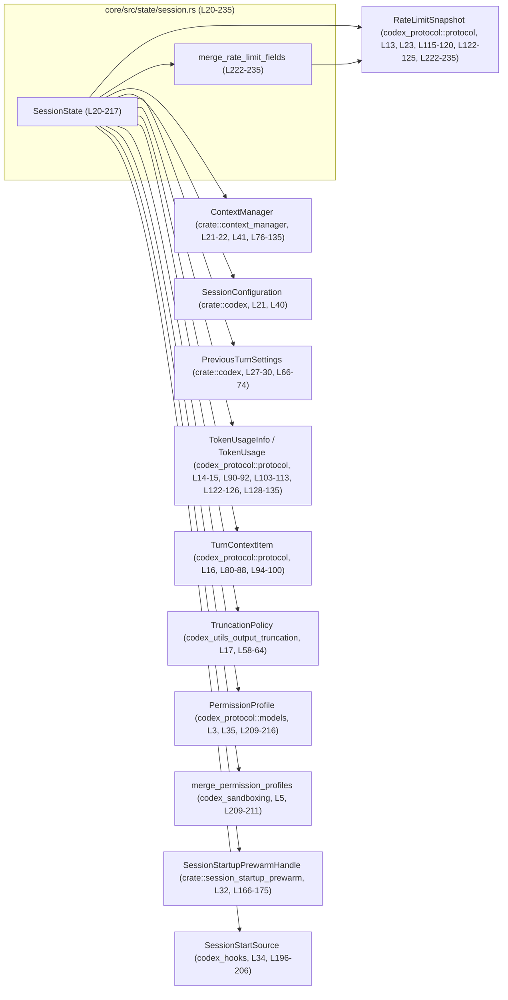
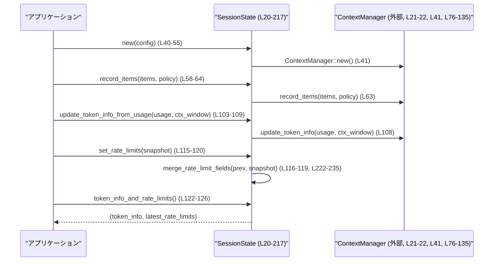

# core/src/state/session.rs コード解説

## 0. ざっくり一言

このモジュールは、1 セッション全体で共有される可変状態（履歴・トークン使用量・レートリミット・権限・コネクタ選択など）を `SessionState` 構造体として一元管理するためのコードです（`core/src/state/session.rs:L20-35`）。

---

## 1. このモジュールの役割

### 1.1 概要

- このモジュールは、**セッション単位の長寿命な状態を一か所にまとめて保持・操作する**ために存在します（`SessionState`、`core/src/state/session.rs:L20-35`）。
- 会話履歴 (`ContextManager`)、トークン使用情報、最新のレートリミット情報、依存関係用の環境変数、接続中コネクタ、起動時のプリウォームハンドル、権限プロファイルなどを `SessionState` のフィールドとして保持します（`core/src/state/session.rs:L20-35`）。
- トークン使用量・レートリミットの更新や、権限プロファイルのマージなど、セッション状態の更新ロジックもこのモジュールで提供します（`set_rate_limits`, `record_granted_permissions` など、`core/src/state/session.rs:L115-120, L209-211, L222-235`）。

### 1.2 アーキテクチャ内での位置づけ

`SessionState` を中心とした、主な依存関係を示します。



- `SessionState` は、他の多くのクレート・モジュールの型を**集約して保持するコンテナ**として機能します（`core/src/state/session.rs:L20-35`）。
- トークン・レートリミット関連のロジックは `ContextManager` と `RateLimitSnapshot` を介して処理されます（`core/src/state/session.rs:L21-23, L41, L76-135, L115-120, L222-235`）。

### 1.3 設計上のポイント

- **責務の分割**
  - 会話履歴やトークン情報の管理は `ContextManager` に委譲し、本モジュールはそれらをまとめる**ファサード的な役割**になっています（`record_items`, `update_token_info_from_usage` など、`core/src/state/session.rs:L58-64, L103-109, L128-135`）。
  - レートリミットスナップショットの補完ロジックは、専用のヘルパー関数 `merge_rate_limit_fields` に切り出されています（`core/src/state/session.rs:L222-235`）。
- **状態の保持**
  - すべてのセッション状態は `SessionState` のフィールドとして保持され、メソッドは `&mut self` を受け取るミューテータとして実装されています（`core/src/state/session.rs:L20-35, L38-217`）。
- **エラーハンドリング**
  - このモジュール内の公開メソッドは `Result` を返さず、主に `Option` とクローン／テイク (`take()`) を用いた**全関数的な更新**になっています（例: `token_info_and_rate_limits`, `take_session_startup_prewarm`、`core/src/state/session.rs:L122-126, L173-175`）。
- **並行性**
  - すべての更新メソッドは `&mut self` を取るため、**コンパイル時に排他的アクセスが保証**されます（`core/src/state/session.rs:L38-217`）。
  - このモジュール自体はスレッド同期プリミティブ（`Mutex` など）を使用しておらず、並行実行時のロックは呼び出し側で行う前提とみなせます。

---

## 2. 主要な機能一覧

- セッション設定 (`SessionConfiguration`) と履歴 (`ContextManager`) の保持・クローン・差し替え（`core/src/state/session.rs:L20-22, L40-55, L76-88`）。
- トークン使用情報 (`TokenUsageInfo`) とモデルコンテキストウィンドウの管理（`update_token_info_from_usage`, `set_token_usage_full`, `get_total_token_usage`、`core/src/state/session.rs:L103-109, L128-135`）。
- レートリミットスナップショット (`RateLimitSnapshot`) の保持と、欠落フィールドの補完ロジック（`set_rate_limits`, `merge_rate_limit_fields`、`core/src/state/session.rs:L115-120, L219-235`）。
- 前回ユーザーターン設定 (`PreviousTurnSettings`) の保存・取得（`core/src/state/session.rs:L27-30, L66-74`）。
- 依存関係環境変数 (`dependency_env`) と MCP 依存関係プロンプト済みセットの管理（`core/src/state/session.rs:L25-26, L145-159`）。
- 接続中のコネクタ ID セットのマージ・取得・クリア（`merge_connector_selection`, `get_connector_selection`, `clear_connector_selection`、`core/src/state/session.rs:L177-193`）。
- 起動時プリウォームハンドルとセッション開始ソースの一度きり取得 (`take_*` メソッド)（`core/src/state/session.rs:L32, L166-175, L196-206`）。
- 付与済み権限プロファイル (`PermissionProfile`) のマージと取得（`record_granted_permissions`, `granted_permissions`、`core/src/state/session.rs:L35, L209-216`）。

### 2.1 コンポーネント一覧

| 種別 | 名前 | 概要 | 行番号 |
|------|------|------|--------|
| 構造体 | `SessionState` | セッションスコープのすべての可変状態を保持するコンテナ | `core/src/state/session.rs:L20-35` |
| impl ブロック | `impl SessionState` | `SessionState` の初期化・更新・取得メソッド群 | `core/src/state/session.rs:L38-217` |
| 関数 | `merge_rate_limit_fields` | レートリミットスナップショット同士をマージし、欠落フィールドを補完するヘルパー | `core/src/state/session.rs:L222-235` |
| テストモジュール | `tests` | `session_tests.rs` にあるテストを参照するモジュール | `core/src/state/session.rs:L238-240` |

---

## 3. 公開 API と詳細解説

### 3.1 型一覧（構造体）

#### `SessionState`

| フィールド名 | 型 | 公開性 | 役割 / 用途 | 行番号 |
|-------------|----|--------|------------|--------|
| `session_configuration` | `SessionConfiguration` | `pub(crate)` | セッション全体の設定値 | `L21` |
| `history` | `ContextManager` | `pub(crate)` | 会話履歴とトークン情報の管理 | `L22` |
| `latest_rate_limits` | `Option<RateLimitSnapshot>` | `pub(crate)` | 最新のレートリミットスナップショット | `L23` |
| `server_reasoning_included` | `bool` | `pub(crate)` | サーバー側の reasoning トークンを利用カウントに含めるかどうかのフラグ | `L24` |
| `dependency_env` | `HashMap<String, String>` | `pub(crate)` | 依存関係用環境変数のキー・値マップ | `L25` |
| `mcp_dependency_prompted` | `HashSet<String>` | `pub(crate)` | MCP 依存関係についてユーザにプロンプト済みの名前集合 | `L26` |
| `previous_turn_settings` | `Option<PreviousTurnSettings>` | 非公開 | 直近の通常ユーザーターンで使われた設定（再開時などに使用） | `L27-30` |
| `startup_prewarm` | `Option<SessionStartupPrewarmHandle>` | `pub(crate)` | セッション初期化時に準備されたプリウォームハンドル | `L31-32` |
| `active_connector_selection` | `HashSet<String>` | `pub(crate)` | 現在アクティブなコネクタ ID の集合 | `L33` |
| `pending_session_start_source` | `Option<codex_hooks::SessionStartSource>` | `pub(crate)` | セッション開始元の情報（まだ反映されていないもの） | `L34` |
| `granted_permissions` | `Option<PermissionProfile>` | 非公開 | セッションに付与された権限プロファイル | `L35` |

**安全性・エラー・並行性（型レベル）**

- すべてのフィールドは所有権を持つ標準コレクションや `Option` で構成されており、**`unsafe` コードは存在しません**（`core/src/state/session.rs` 全体に `unsafe` キーワードなし）。
- エラー状態は `Option` の `None` や空の `HashMap` / `HashSet` で表現され、例外的なエラーは発生しません（本ファイル内に `Result`・`panic!` などは登場しません）。
- 並行性に関して、本構造体自体はロックを持たず、**`&mut SessionState` を通じてのみ変更される設計**になっています（`impl SessionState` のメソッドシグネチャ参照、`core/src/state/session.rs:L40-217`）。

---

### 3.2 関数詳細（重要な 7 件）

#### 3.2.1 `SessionState::new(session_configuration: SessionConfiguration) -> Self`

**概要**

- 新しい `SessionState` を作成し、履歴やレートリミット等をデフォルト状態（空または `None`）に初期化します（`core/src/state/session.rs:L39-55`）。

**引数**

| 引数名 | 型 | 説明 |
|--------|----|------|
| `session_configuration` | `SessionConfiguration` | セッション設定。状態にそのまま格納されます（`L40, L43`）。 |

**戻り値**

- `SessionState`：すべてのオプションフィールドが `None`、コレクションが空、`server_reasoning_included` が `false` に設定された新規インスタンス（`core/src/state/session.rs:L42-53`）。

**内部処理の流れ**

1. `ContextManager::new()` で空の履歴管理オブジェクトを作成します（`L41`）。
2. フィールドに引数やデフォルト値を代入して `Self` リテラルを構築します（`L42-53`）。
   - `latest_rate_limits: None`（`L45`）
   - `server_reasoning_included: false`（`L46`）
   - `dependency_env: HashMap::new()`（`L47`）
   - `mcp_dependency_prompted: HashSet::new()`（`L48`）
   - その他の `Option` はすべて `None`（`L49-53`）。

**Examples（使用例）**

```rust
use crate::codex::SessionConfiguration;
use crate::state::session::SessionState;

fn create_session_state(config: SessionConfiguration) -> SessionState {
    // 新しい SessionState を作成する
    let state = SessionState::new(config); // core/src/state/session.rs:L40-55

    // まだレートリミット情報は存在しない
    let (_, rate_limits) = state.token_info_and_rate_limits(); // L122-126
    assert!(rate_limits.is_none());

    state
}
```

**Errors / Panics**

- この関数自身には明示的なエラーや `panic!` はありません。
- 内部での `HashMap::new` や `HashSet::new` によるメモリアロケーションは、極端なメモリ不足時にはランタイムパニックを起こす可能性がありますが、これは Rust の標準的な挙動です。

**Edge cases**

- 特にありません。`session_configuration` がどのような値であっても、そのままフィールドに格納されるだけです（`L42-43`）。

**使用上の注意点**

- セッションごとに 1 インスタンスを作成し、並行アクセスが必要な場合は呼び出し側で `Arc<Mutex<SessionState>>` などでラップする必要があります（本モジュールではロックを提供しません）。

---

#### 3.2.2 `SessionState::record_items<I>(&mut self, items: I, policy: TruncationPolicy)`

**概要**

- 応答アイテム列を履歴 (`ContextManager`) に記録し、与えられたトランケーションポリシーに従って保存内容を調整します（`core/src/state/session.rs:L57-64`）。

**引数**

| 引数名 | 型 | 説明 |
|--------|----|------|
| `items` | `I`（`IntoIterator` で、`Item: Deref<Target=ResponseItem>`） | 記録する応答アイテム列。`ResponseItem` もしくはそれを指す参照／スマートポインタの反復可能コレクション（`L58-61`）。 |
| `policy` | `TruncationPolicy` | 履歴をどのようにトランケートするかを示すポリシー（`L58`）。 |

**戻り値**

- なし（`()`）。

**内部処理の流れ**

1. すべての引数をそのまま内部の `ContextManager::record_items` に渡します（`self.history.record_items(items, policy);`、`core/src/state/session.rs:L63`）。
2. トランケーションの詳細は `ContextManager` に委譲されています（このチャンクには定義がありません）。

**Examples（使用例）**

```rust
use codex_protocol::models::ResponseItem;
use codex_utils_output_truncation::TruncationPolicy;

fn add_response_items(state: &mut SessionState, responses: Vec<ResponseItem>) {
    // &ResponseItem への参照をイテレートして渡す例
    state.record_items(&responses, TruncationPolicy::default()); // L58-64
}
```

**Errors / Panics**

- このメソッド自体にエラー戻り値はありません。
- 実際のトランケーションや検証は `ContextManager::record_items` によって行われるため、
  その実装に依存するエラーやパニックの可能性があります（このチャンクには現れません）。

**Edge cases**

- 空の `items` を渡した場合、`ContextManager` 側で何も追加しない挙動になると推測されますが、本チャンクからは断定できません。
- `items` に同一内容が重複していても、このメソッドはそれを検査しません（単に委譲します）。

**使用上の注意点**

- `items` の `Item` は `Deref<Target=ResponseItem>` であればよいので、`Vec<ResponseItem>` だけでなく、`Vec<Arc<ResponseItem>>` なども渡しやすい設計になっています（`L60-61`）。
- 履歴のトランケーションポリシーを誤ると、必要なコンテキストが破棄される可能性があります。

---

#### 3.2.3 `SessionState::update_token_info_from_usage(&mut self, usage: &TokenUsage, model_context_window: Option<i64>)`

**概要**

- 単一ターンのトークン使用情報 (`TokenUsage`) を履歴のトークン情報に反映し、必要に応じてコンテキストウィンドウ情報も更新します（`core/src/state/session.rs:L103-109`）。

**引数**

| 引数名 | 型 | 説明 |
|--------|----|------|
| `usage` | `&TokenUsage` | 現在のターンでのトークン使用量などの情報（`L105`）。 |
| `model_context_window` | `Option<i64>` | モデルのコンテキストウィンドウサイズ。`None` の場合は既存値やデフォルトに依存（`L106`）。 |

**戻り値**

- なし（`()`）。

**内部処理の流れ**

1. 受け取った `usage` と `model_context_window` を、`ContextManager::update_token_info` にそのまま渡します（`core/src/state/session.rs:L108`）。

**Examples（使用例）**

```rust
use codex_protocol::protocol::{TokenUsage, TokenUsageInfo};

fn record_usage(state: &mut SessionState, usage: &TokenUsage, ctx_window: i64) {
    // トークン使用情報を更新する
    state.update_token_info_from_usage(usage, Some(ctx_window)); // L103-109

    // 後で集計情報を取得
    let info: Option<TokenUsageInfo> = state.token_info(); // L111-113
}
```

**Errors / Panics**

- このメソッド自体はエラーを返しません。
- 実処理は `ContextManager::update_token_info` に委譲されます。例えば不正値チェックなどがある場合、その側でエラーやパニックになる可能性がありますが、このチャンクからは不明です。

**Edge cases**

- `model_context_window` に `None` を渡した場合、`ContextManager` 側の扱いに依存します（本チャンクには定義がありません）。
- `usage` にゼロや極端に大きい値を含めても、このメソッドでは検証しません。

**使用上の注意点**

- モデルごとにコンテキストウィンドウが異なる場合は、適切な値を `Some(...)` で渡す必要があります。
- `server_reasoning_included` フラグ（`L24, L137-143`）と合わせて、どのトークンを集計するかを呼び出し側で整合させる必要があります。

---

#### 3.2.4 `SessionState::set_rate_limits(&mut self, snapshot: RateLimitSnapshot)`

**概要**

- 新しいレートリミットスナップショットを設定し、欠落フィールドを前回スナップショットから補完するヘルパー `merge_rate_limit_fields` を使ってマージします（`core/src/state/session.rs:L115-120, L219-235`）。

**引数**

| 引数名 | 型 | 説明 |
|--------|----|------|
| `snapshot` | `RateLimitSnapshot` | 新しく取得したレートリミット情報（`L115, L223-225`）。 |

**戻り値**

- なし（`()`）。

**内部処理の流れ**

1. 既存の `latest_rate_limits` を参照として取得します（`self.latest_rate_limits.as_ref()`、`core/src/state/session.rs:L116-117`）。
2. `merge_rate_limit_fields(previous, snapshot)` を呼び、新旧スナップショットをマージします（`L116-119`）。
3. その結果を `Some(...)` に包んで `latest_rate_limits` に保存します（`L115-120`）。

**関連ヘルパー `merge_rate_limit_fields` のアルゴリズム（L222-235）**

1. `snapshot.limit_id` が `None` の場合、`"codex"` をデフォルト値として設定します（`L226-228`）。
2. `snapshot.credits` が `None` の場合、`previous` が `Some` ならば `previous.credits.clone()` を継承します（`L229-231`）。
3. `snapshot.plan_type` が `None` の場合、`previous.plan_type` を継承します（`L232-233`）。
4. マージ後の `snapshot` を返します（`L235`）。

**Examples（使用例）**

```rust
use codex_protocol::protocol::RateLimitSnapshot;

fn update_rate_limits(state: &mut SessionState, new_snapshot: RateLimitSnapshot) {
    // 古いスナップショットに不足している情報を補完しつつ上書き
    state.set_rate_limits(new_snapshot); // L115-120
}

fn get_limits(state: &SessionState) -> Option<RateLimitSnapshot> {
    let (_token_info, limits) = state.token_info_and_rate_limits(); // L122-126
    limits
}
```

**Errors / Panics**

- このメソッドと `merge_rate_limit_fields` 本体には `Result` 返却や明示的なパニックはありません（`L222-235`）。
- `snapshot.limit_id` が `None` の場合でも `"codex"` に補完されるため、その点でのエラーは発生しません。

**Edge cases**

- `previous = None`（初回呼び出し）の場合:
  - `limit_id` が `None` なら `"codex"` になります（`L226-228`）。
  - `credits` と `plan_type` が `None` のままの可能性があります（`previous` が `None` なので継承されない、`L229-233`）。
- 新しい `snapshot` が特定のフィールドだけを更新し、他をあえて `None` にしてきた場合、そのフィールドは前回値が維持されます（`credits`, `plan_type`、`L229-233`）。

**使用上の注意点**

- 呼び出し側で「`credits` や `plan_type` を意図的に `None` にリセットしたい」場合でも、本関数は前回値を継承するため、**リセットには向きません**。
- すべてのフィールドを明示的に更新したい場合は、新しい `RateLimitSnapshot` に必須フィールドをすべて設定する必要があります。

---

#### 3.2.5 `merge_rate_limit_fields(previous: Option<&RateLimitSnapshot>, snapshot: RateLimitSnapshot) -> RateLimitSnapshot`

**概要**

- 新旧 2 つの `RateLimitSnapshot` をマージし、新しいスナップショットに欠けているフィールドを前回スナップショットから補完します（`core/src/state/session.rs:L219-235`）。

**引数**

| 引数名 | 型 | 説明 |
|--------|----|------|
| `previous` | `Option<&RateLimitSnapshot>` | 直前に保持していたスナップショット。ない場合は `None`（`L222-224`）。 |
| `snapshot` | `RateLimitSnapshot`（`mut`） | 新しく取得したスナップショット。関数内でフィールドが上書きされます（`L223-225`）。 |

**戻り値**

- `RateLimitSnapshot`：`snapshot` を元に欠落フィールドを補完した最終スナップショット（`L225, L235`）。

**内部処理の流れ**

1. `limit_id` が `None` の場合、`Some("codex".to_string())` を代入（`L226-228`）。
2. `credits` が `None` の場合、`previous.and_then(|prior| prior.credits.clone())` で前回値を継承（`L229-231`）。
3. `plan_type` が `None` の場合、`previous.and_then(|prior| prior.plan_type)` で前回値を継承（`L232-233`）。
4. 最終的な `snapshot` を返す（`L235`）。

**Examples（使用例）**

```rust
use codex_protocol::protocol::RateLimitSnapshot;

// SessionState 外で直接使う場合の例（実際には set_rate_limits がラップしています）
fn merge_example(prev: Option<&RateLimitSnapshot>, new: RateLimitSnapshot) -> RateLimitSnapshot {
    // 欠落フィールドを補完しつつマージ
    merge_rate_limit_fields(prev, new) // L222-235
}
```

**Errors / Panics**

- `None` であっても単に継承されないだけであり、エラーにはなりません。
- 文字列 `"codex"` は固定のリテラルであり、ここでのフォーマットエラーなどはありません（`L226-228`）。

**Edge cases**

- `previous = None` かつ `snapshot` の該当フィールドも `None` の場合:
  - `limit_id` は `"codex"` にセットされますが（`L226-228`）、`credits` と `plan_type` は `None` のままです（`L229-233`）。
- `previous` が `Some` でも、その内部フィールドが `None` の場合は補完されません。

**使用上の注意点**

- 「前回値を継承する」という意味的な仕様があるため、`previous` に古い情報を保持し続けると、最新スナップショットがフィールドを意図せず引きずる可能性があります。
- 本関数はこのファイル内では `SessionState::set_rate_limits` からのみ呼ばれています（`L115-120`）。

---

#### 3.2.6 `SessionState::merge_connector_selection<I>(&mut self, connector_ids: I) -> HashSet<String>`

**概要**

- 新たに指定されたコネクタ ID 群を既存のアクティブコネクタ集合に追加し、**マージ後の集合**を返します（`core/src/state/session.rs:L177-184`）。

**引数**

| 引数名 | 型 | 説明 |
|--------|----|------|
| `connector_ids` | `I`（`IntoIterator<Item = String>`） | 追加したいコネクタ ID 群（`L178-180`）。 |

**戻り値**

- `HashSet<String>`：マージ後のアクティブコネクタ ID の集合（`L183`）。

**内部処理の流れ**

1. `self.active_connector_selection.extend(connector_ids);` で、既存セットに新しい ID 群を追加します（`L182`）。
2. 更新後の `active_connector_selection` をクローンして返します（`L183`）。

**Examples（使用例）**

```rust
use std::collections::HashSet;

fn activate_connectors(state: &mut SessionState) {
    // 新たに2つのコネクタをアクティブ化
    let merged: HashSet<String> = state.merge_connector_selection(
        vec!["db".to_string(), "search".to_string()]
    ); // L177-184

    assert!(merged.contains("db"));
    assert!(merged.contains("search"));
}
```

**Errors / Panics**

- `extend` や `clone` によるメモリアロケーション以外、明示的なエラーやパニックはありません。

**Edge cases**

- 既に存在するコネクタ ID を渡しても、`HashSet` の特性により重複は自動的に排除されます（`L182-183`）。
- 空のイテレータを渡した場合、集合は変化せず、クローンだけが返ります。

**使用上の注意点**

- 更新後の集合が返されますが、内部状態もすでに更新済みです。戻り値を無視しても状態は反映されます。
- 状態を「完全に置き換えたい」場合は、まず `clear_connector_selection` を呼ぶか、別のメソッドを追加する必要があります（`L192-193`）。

---

#### 3.2.7 `SessionState::record_granted_permissions(&mut self, permissions: PermissionProfile)`

**概要**

- 新たに付与された権限プロファイルを、既存の `granted_permissions` とマージし、統合された権限プロファイルとして保持します（`core/src/state/session.rs:L209-216`）。

**引数**

| 引数名 | 型 | 説明 |
|--------|----|------|
| `permissions` | `PermissionProfile` | 新たに付与された権限セット（`L209`）。 |

**戻り値**

- なし（`()`）。

**内部処理の流れ**

1. 現在の `self.granted_permissions.as_ref()` を取得し、`Option<&PermissionProfile>` として `merge_permission_profiles` に渡します（`L210-211`）。
2. 新しい `permissions` は `Some(&permissions)` として渡されます（`L210-211`）。
3. `merge_permission_profiles` の戻り値（`Option<PermissionProfile>`）で `self.granted_permissions` を更新します（`L209-211`）。

**Examples（使用例）**

```rust
use codex_protocol::models::PermissionProfile;

fn grant_permissions(state: &mut SessionState, new_perm: PermissionProfile) {
    // 新しい権限を既存の権限とマージして保存
    state.record_granted_permissions(new_perm); // L209-211
}

fn current_permissions(state: &SessionState) -> Option<PermissionProfile> {
    state.granted_permissions() // L214-216
}
```

**Errors / Panics**

- このメソッド自体にエラー戻り値はなく、パニックコードもありません。
- 実際のマージロジックと整合性検証は `merge_permission_profiles` に委譲されています（`L5, L210-211`）。

**Edge cases**

- `granted_permissions` が `None` の場合、新しい `permissions` がそのまま保存される（と推測されますが、実際の挙動は `merge_permission_profiles` に依存します）。
- `permissions` が非常に大きな権限セットである場合、メモリ使用量が増加しますが、このメソッドはそれを特別扱いしません。

**使用上の注意点**

- マージポリシー（上書き／和集合／交差など）は `merge_permission_profiles` の実装に依存し、このチャンクからは判定できません。
- セキュリティの観点では、「どのタイミングでどの権限を記録するか」は呼び出し側の責務です。本モジュールは単に状態を保持します。

---

### 3.3 その他の関数一覧

補助的なゲッター／セッターや単純ラッパーの一覧です。

| 関数名 | シグネチャ（抜粋） | 役割 | 行番号 |
|--------|--------------------|------|--------|
| `previous_turn_settings` | `(&self) -> Option<PreviousTurnSettings>` | 直近ユーザーターンの設定をクローンして返す | `L66-68` |
| `set_previous_turn_settings` | `(&mut self, Option<PreviousTurnSettings>)` | 上記設定を保存する | `L69-74` |
| `clone_history` | `(&self) -> ContextManager` | 履歴オブジェクトのクローンを返す | `L76-78` |
| `replace_history` | `(&mut self, Vec<ResponseItem>, Option<TurnContextItem>)` | 履歴を新しい項目列で置き換え、参照コンテキストを設定 | `L80-88` |
| `set_token_info` | `(&mut self, Option<TokenUsageInfo>)` | `ContextManager` にトークン情報を直接セット | `L90-92` |
| `set_reference_context_item` | `(&mut self, Option<TurnContextItem>)` | 参照コンテキストアイテムを設定 | `L94-96` |
| `reference_context_item` | `(&self) -> Option<TurnContextItem>` | 現在の参照コンテキストアイテムを取得 | `L98-100` |
| `token_info` | `(&self) -> Option<TokenUsageInfo>` | 現在のトークン使用情報を取得 | `L111-113` |
| `token_info_and_rate_limits` | `(&self) -> (Option<TokenUsageInfo>, Option<RateLimitSnapshot>)` | トークン情報と最新レートリミットをタプルで返す | `L122-126` |
| `set_token_usage_full` | `(&mut self, i64)` | コンテキストウィンドウを満たすトークン使用状況を `ContextManager` にセット | `L128-129` |
| `get_total_token_usage` | `(&self, bool) -> i64` | reasoning トークンを含むかどうかのフラグ付きで合計トークン数を取得 | `L132-135` |
| `set_server_reasoning_included` | `(&mut self, bool)` | reasoning トークンを集計対象に含めるかどうかを設定 | `L137-139` |
| `server_reasoning_included` | `(&self) -> bool` | 上記フラグの現在値を返す | `L141-143` |
| `record_mcp_dependency_prompted` | `(&mut self, I: IntoIterator<Item=String>)` | MCP 依存関係について「プロンプト済み」の名前を集合に追加 | `L145-150` |
| `mcp_dependency_prompted` | `(&self) -> HashSet<String>` | プロンプト済みの MCP 依存関係名集合をクローンして返す | `L152-154` |
| `set_dependency_env` | `(&mut self, HashMap<String, String>)` | 依存環境変数マップにキー・値をマージ（既存キーは上書き） | `L156-159` |
| `dependency_env` | `(&self) -> HashMap<String, String>` | 依存環境変数マップをクローンして返す | `L162-164` |
| `set_session_startup_prewarm` | `(&mut self, SessionStartupPrewarmHandle)` | 起動時プリウォームハンドルを設定 | `L166-170` |
| `take_session_startup_prewarm` | `(&mut self) -> Option<SessionStartupPrewarmHandle>` | ハンドルを取り出し、内部は `None` にする | `L173-175` |
| `get_connector_selection` | `(&self) -> HashSet<String>` | 現在アクティブなコネクタ ID セットをクローンして返す | `L187-189` |
| `clear_connector_selection` | `(&mut self)` | アクティブなコネクタ ID セットをクリア | `L192-193` |
| `set_pending_session_start_source` | `(&mut self, Option<codex_hooks::SessionStartSource>)` | 待ち状態のセッション開始ソース情報を設定 | `L196-200` |
| `take_pending_session_start_source` | `(&mut self) -> Option<codex_hooks::SessionStartSource>` | 上記ソース情報を取り出し、内部は `None` にする | `L203-206` |
| `granted_permissions` | `(&self) -> Option<PermissionProfile>` | マージ済みの権限プロファイルをクローンして返す | `L214-216` |

---

## 4. データフロー

### 4.1 代表的な処理シナリオ

**シナリオ**:  
1 回のユーザーターン後に、応答アイテム・トークン使用量・レートリミットを記録し、その後に集計情報を取得する流れです。



この図は、**履歴 (`ContextManager`)・トークン使用情報・レートリミット** がどのように `SessionState` を経由して更新・取得されるかを表しています。

---

## 5. 使い方（How to Use）

### 5.1 基本的な使用方法

セッション生成から、1 ターン分の情報更新・集計取得までの典型的なフローです。

```rust
use crate::codex::SessionConfiguration;
use crate::state::session::SessionState;
use codex_protocol::models::ResponseItem;
use codex_protocol::protocol::{TokenUsage, RateLimitSnapshot};
use codex_utils_output_truncation::TruncationPolicy;

fn handle_turn(
    mut state: SessionState,                 // すでにセッションごとに持っていると仮定
    responses: Vec<ResponseItem>,            // モデルのレスポンス
    usage: &TokenUsage,                      // トークン使用情報
    snapshot: RateLimitSnapshot,             // 新しいレートリミット情報
) -> SessionState {
    // 1. 応答アイテムを履歴に記録 (L58-64)
    state.record_items(&responses, TruncationPolicy::default());

    // 2. トークン使用情報を更新 (L103-109)
    state.update_token_info_from_usage(usage, None);

    // 3. レートリミットを更新 (L115-120, L222-235)
    state.set_rate_limits(snapshot);

    // 4. 集計情報を取得してロギングなどに利用 (L122-126)
    let (token_info, rate_limits) = state.token_info_and_rate_limits();
    // ここで token_info や rate_limits を使ってログを出したり監視に回したりできる

    state
}
```

### 5.2 よくある使用パターン

1. **セッション再開時の履歴差し替え**

```rust
use codex_protocol::protocol::TurnContextItem;
use codex_protocol::models::ResponseItem;

fn restore_history(
    state: &mut SessionState,
    restored_items: Vec<ResponseItem>,
    reference: Option<TurnContextItem>,
) {
    // 永続化ストアから読み戻した履歴で置き換える (L80-88)
    state.replace_history(restored_items, reference);
}
```

1. **依存環境変数の増分更新**

```rust
use std::collections::HashMap;

fn add_dependency_env(state: &mut SessionState) {
    let mut new_env = HashMap::new();
    new_env.insert("DATABASE_URL".into(), "postgres://...".into());
    // 既存の env にマージ（上書き）される (L156-159)
    state.set_dependency_env(new_env);
}
```

1. **一度きりのプリウォームハンドル取得**

```rust
use crate::session_startup_prewarm::SessionStartupPrewarmHandle;

fn consume_prewarm(state: &mut SessionState) {
    if let Some(handle) = state.take_session_startup_prewarm() { // L173-175
        // handle を使って初回リクエストを高速化する
    }
    // 2回目以降は常に None が返る
}
```

### 5.3 よくある間違い

```rust
// 間違い例: take_* メソッドを複数回呼んでしまう
fn wrong(state: &mut SessionState) {
    let first = state.take_session_startup_prewarm(); // Some(handle) かもしれない
    let second = state.take_session_startup_prewarm(); // 常に None（L173-175）
    // second に期待して処理を書くとバグになる可能性がある
}

// 正しい例: 一度取り出したら、その値を必要なところに保持して再利用する
fn correct(state: &mut SessionState) {
    if let Some(handle) = state.take_session_startup_prewarm() {
        // handle をどこかに保存して再利用する
        use_handle(handle);
    }
}
```

```rust
// 間違い例: 「レートリミットをリセットしたい」と思って set_rate_limits に
// None を含むフィールドを渡す
fn wrong_reset(state: &mut SessionState, snapshot: RateLimitSnapshot) {
    // snapshot の credits, plan_type を None にしても、前回値が継承される可能性がある (L229-233)
    state.set_rate_limits(snapshot);
}

// 正しい例（方針）: 「リセット」セマンティクスが必要なら、
// 別途専用メソッドを追加するか、RateLimitSnapshot 側で「リセット用」値を定義する必要がある。
```

### 5.4 使用上の注意点（まとめ）

- **所有権・クローン**
  - 多くのゲッターが `clone()` を行い、新しい `HashMap` や `HashSet`・構造体を返します（例: `mcp_dependency_prompted`, `dependency_env`, `granted_permissions`、`core/src/state/session.rs:L152-154, L162-164, L214-216`）。
  - 大きな状態を頻繁にクローンするとコストが増えるため、必要な場所だけで取得するのが望ましいです。
- **`take_*` メソッドの一度きりセマンティクス**
  - `take_session_startup_prewarm` や `take_pending_session_start_source` は内部を `None` にするため、**再取得はできません**（`L173-175, L203-206`）。
- **並行性**
  - 本モジュールはスレッドセーフな同期を提供しません。複数スレッドから利用する場合、呼び出し側で `Mutex`・`RwLock` などを用いる必要があります。
- **エラー処理**
  - ここでの操作は基本的に「状態の更新・取得」のみで、I/O やバリデーションは行っていません。実際のエラー処理は周辺モジュールで行う設計になっています。

---

## 6. 変更の仕方（How to Modify）

### 6.1 新しい機能を追加する場合

例: 新しい種類のセッション状態を追跡したい場合。

1. **フィールドを追加する**
   - `SessionState` に新しいフィールドを追加します（`core/src/state/session.rs:L20-35`）。
   - 初期値を `SessionState::new` に追加します（`L40-55`）。
2. **アクセサ／ミューテータを追加する**
   - `impl SessionState` に対応する getter / setter / 操作用メソッドを定義します（`L38-217`）。
   - 他のフィールドと同様に、`Option` や `HashSet` などを使って一貫した API にします。
3. **他コンポーネントとの接続**
   - 必要であれば `ContextManager` や他モジュールにメソッドを追加し、`SessionState` からそれを呼び出します（`record_items`, `update_token_info_from_usage` のパターンを参考、`L58-64, L103-109`）。
4. **テストの追加**
   - `session_tests.rs`（`mod tests;`、`L238-240`）に新機能のテストを追加します。

### 6.2 既存の機能を変更する場合

- **影響範囲の確認**
  - 変更するメソッドがどのフィールドを読み書きしているかを確認します（例: `set_rate_limits` は `latest_rate_limits` のみ、`L115-120`）。
  - 他のメソッドからの呼び出し関係がある場合（例: `set_rate_limits` → `merge_rate_limit_fields`）、両方を確認します（`L115-120, L222-235`）。
- **セマンティクスの維持**
  - `take_*` 系や `merge_*` 系など、明確なセマンティクスを持つメソッドは、その意味が変わらないよう注意が必要です。
  - 例えば `merge_rate_limit_fields` の「欠落フィールドは前回値を継承する」という前提を変えると、レートリミット関連の動作が大きく変化します（`L219-235`）。
- **テストの更新**
  - 変更したメソッドに対応するテスト（`session_tests.rs`）があれば更新・追加する必要があります（テスト内容はこのチャンクには現れません）。

---

## 7. 関連ファイル

| モジュール / パス（推定） | 役割 / 関係 |
|---------------------------|------------|
| `crate::context_manager` | `ContextManager` を提供し、履歴とトークン情報の詳細な管理を担当。`SessionState` から頻繁に呼び出されます（`core/src/state/session.rs:L21-22, L41, L76-135`）。 |
| `crate::codex` | `SessionConfiguration` と `PreviousTurnSettings` を提供し、セッション設定やターンごとの設定を表現します（`L9-10, L27-30, L40, L66-74`）。 |
| `crate::session_startup_prewarm` | `SessionStartupPrewarmHandle` を提供し、セッション起動時のプリウォーム処理に関わります（`L12, L31-32, L166-175`）。 |
| `codex_protocol::models` | `ResponseItem` や `PermissionProfile` など、プロトコルレベルのモデル型を提供します（`L3-4, L35, L58-64, L209-216`）。 |
| `codex_protocol::protocol` | `RateLimitSnapshot`, `TokenUsage`, `TokenUsageInfo`, `TurnContextItem` など、プロトコル関連型を提供します（`L13-16, L23, L80-88, L90-92, L103-113, L115-120, L122-126, L128-135, L222-235`）。 |
| `codex_sandboxing::policy_transforms` | `merge_permission_profiles` を提供し、権限プロファイルのマージロジックを担います（`L5, L209-211`）。 |
| `codex_utils_output_truncation` | `TruncationPolicy` を提供し、履歴トランケーションのポリシーを定義します（`L17, L58-64`）。 |
| `core/src/state/session_tests.rs`（テスト） | `mod tests;` で参照されるテストコード。`SessionState` の振る舞いを検証するテストが含まれていると考えられます（`L238-240`）。 |

---

### Bugs / Security について（このチャンクから読める範囲）

- 明らかなバグやセキュリティホールは、このチャンクからは確認できません。
- 本モジュールは状態の保持と単純なマージのみを行っており、**認可判定や外部 I/O は行っていません**。したがって、権限の安全性は `PermissionProfile` の解釈側および `merge_permission_profiles` の実装に依存します（`L3, L5, L209-211`）。
- `set_rate_limits` / `merge_rate_limit_fields` は、欠落フィールドを自動継承するため、**古いレートリミット情報が残り続ける**可能性があります。設計として意図されたものと考えられますが、リセット用途には適さない点に注意が必要です（`L219-235`）。

この範囲で確認できる事実のみを記載しており、他モジュールの実装や仕様に関する詳細は、このチャンクからは分かりません。
