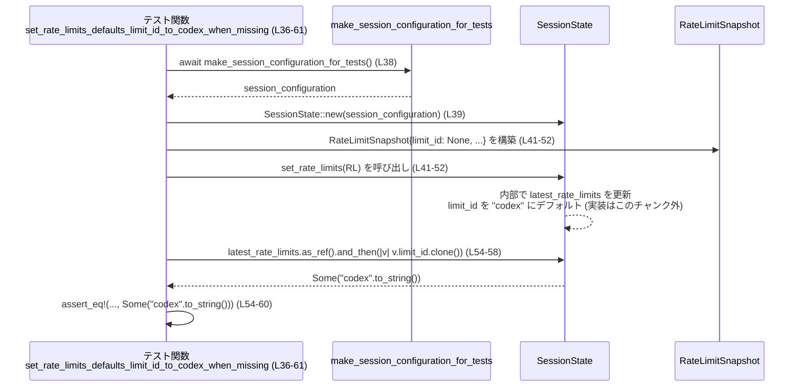

# core/src/state/session_tests.rs コード解説

## 0. ざっくり一言

`SessionState` の振る舞い（コネクタ選択の管理とレートリミット情報の保持）を検証する、非同期テスト群を定義しているファイルです。

---

## 1. このモジュールの役割

### 1.1 概要

- このモジュールは、`SessionState` に関する次のような振る舞いをテストしています。
  - コネクタ ID のマージ時に重複が削除されること  
    （`merge_connector_selection`）  
    根拠: `core/src/state/session_tests.rs:L7-22`
  - コネクタ選択のクリアで保存済み ID がすべて消えること  
    （`clear_connector_selection` / `get_connector_selection`）  
    根拠: `core/src/state/session_tests.rs:L24-34`
  - レートリミット設定時に、`limit_id` が欠けている場合 `codex` にフォールバックすること  
    根拠: `core/src/state/session_tests.rs:L36-61`, `L63-100`
  - `codex` バケットから `codex_other` バケットへクレジット情報とプラン種別が引き継がれること  
    根拠: `core/src/state/session_tests.rs:L102-155`

### 1.2 アーキテクチャ内での位置づけ

このモジュールはテスト専用であり、親モジュールの `SessionState` およびプロトコル定義に依存しています。

- 依存関係（このチャンクから確認できる範囲）

  - 親モジュール (`super::*`)  
    - `SessionState` 型と、そのメソッド  
      - `new` / `merge_connector_selection` / `clear_connector_selection`  
      - `get_connector_selection` / `set_rate_limits`  
      - フィールド `latest_rate_limits`  
    根拠: `core/src/state/session_tests.rs:L10-12`, `L27-33`, `L38-41`, `L54-58`, `L65-69`, `L93-97`, `L104-108`, `L124-138`
  - `crate::codex::make_session_configuration_for_tests`  
    - テスト用のセッション設定を作る補助関数  
    根拠: `core/src/state/session_tests.rs:L2`, `L10`, `L27`, `L38`, `L65`, `L104`
  - `codex_protocol::protocol::{RateLimitWindow, CreditsSnapshot}`  
    および `codex_protocol::account::PlanType`  
    - レートリミットやクレジット状態を表現するプロトコル層の型  
    根拠: `core/src/state/session_tests.rs:L3-4`, `L41-52`, `L68-79`, `L80-90`, `L107-122`, `L124-135`, `L139-154`
  - `pretty_assertions::assert_eq`  
    - テスト用の `assert_eq!` マクロ（差分が見やすい）  
    根拠: `core/src/state/session_tests.rs:L5`, `L18-21`, `L33-34`, `L54-60`, `L93-99`, `L137-155`
  - `HashSet`  
    - コネクタ ID の集合管理に使用  
    根拠: `core/src/state/session_tests.rs:L20-21`, `L33-34`  
    （インポートはこのチャンクには現れませんが、リテラル `HashSet::from` / `HashSet::new` の利用から推測できます）

依存関係を簡略化した図は次のとおりです。

```mermaid
graph TD
    subgraph テストモジュール[session_tests.rs]
        T1[merge_connector_selection_deduplicates_entries]
        T2[clear_connector_selection_removes_entries]
        T3[set_rate_limits_defaults_limit_id_to_codex_when_missing]
        T4[set_rate_limits_defaults_to_codex_when_limit_id_missing_after_other_bucket]
        T5[set_rate_limits_carries_credits_and_plan_type_from_codex_to_codex_other]
    end

    T1 --> S[SessionState (super::*)]
    T2 --> S
    T3 --> S
    T4 --> S
    T5 --> S

    T1 --> Cfg[make_session_configuration_for_tests]
    T2 --> Cfg
    T3 --> Cfg
    T4 --> Cfg
    T5 --> Cfg

    S --> RL[RateLimitSnapshot / RateLimitWindow]
    S --> CR[CreditsSnapshot]
    S --> PL[PlanType]

    T1 --> HS[HashSet]
    T2 --> HS
```

（`RateLimitSnapshot` はこのファイル内でリテラルとして使用されていますが、定義は別モジュールにあります。）

### 1.3 設計上のポイント

- すべてのテストは `#[tokio::test]` でマークされており、非同期コンテキストで動作します。  
  根拠: `core/src/state/session_tests.rs:L7`, `L24`, `L36`, `L63`, `L102`
- 各テストは独立した `SessionState` インスタンスを生成し、副作用を共有しません。  
  根拠: `core/src/state/session_tests.rs:L10-12`, `L27-28`, `L38-39`, `L65-66`, `L104-105`
- コネクタ ID の管理には集合（`HashSet`）が使われ、重複排除が検証されています。  
  根拠: `core/src/state/session_tests.rs:L12-16`, `L18-21`, `L29-34`
- レートリミット関連では、`SessionState.latest_rate_limits: Option<RateLimitSnapshot>` の内容を直接検査し、  
  - `limit_id` のフォールバックロジック  
  - `CreditsSnapshot` と `PlanType` の引き継ぎ  
  の契約がテストされています。  
  根拠: `core/src/state/session_tests.rs:L41-60`, `L68-99`, `L107-122`, `L124-155`
- エラーハンドリングは行わず、期待が外れた場合は `assert_eq!` のパニックを通じてテストを失敗させる構造です。  
  根拠: `core/src/state/session_tests.rs:L18-21`, `L33-34`, `L54-60`, `L93-99`, `L137-155`

---

## 2. 主要な機能一覧

このファイルに定義されたテスト関数と、その検証対象の振る舞いは次のとおりです。

- `merge_connector_selection_deduplicates_entries`:  
  `merge_connector_selection` が同じコネクタ ID を重複して保持しないことを検証します。  
  根拠: `core/src/state/session_tests.rs:L7-22`
- `clear_connector_selection_removes_entries`:  
  `clear_connector_selection` により、すべてのコネクタ選択が空になることを検証します。  
  根拠: `core/src/state/session_tests.rs:L24-34`
- `set_rate_limits_defaults_limit_id_to_codex_when_missing`:  
  `set_rate_limits` で `limit_id: None` のスナップショットを渡した場合に、自動的に `"codex"` が設定されることを検証します。  
  根拠: `core/src/state/session_tests.rs:L36-61`
- `set_rate_limits_defaults_to_codex_when_limit_id_missing_after_other_bucket`:  
  一度 `"codex_other"` のスナップショットを設定した後に、`limit_id: None` で再設定した場合でも `"codex"` にフォールバックすることを検証します。  
  根拠: `core/src/state/session_tests.rs:L63-100`
- `set_rate_limits_carries_credits_and_plan_type_from_codex_to_codex_other`:  
  `"codex"` バケット設定時のクレジット情報とプラン種別が、その後の `"codex_other"` バケット設定に引き継がれることを検証します。  
  根拠: `core/src/state/session_tests.rs:L102-155`

---

## 3. 公開 API と詳細解説

### 3.1 型一覧（構造体・列挙体など）

このファイル内で利用されている主要な型（定義は他モジュール）の一覧です。

| 名前 | 種別 | 役割 / 用途 | このファイルでの利用位置 |
|------|------|-------------|--------------------------|
| `SessionState` | 構造体（親モジュール） | セッションに紐づく状態（コネクタ選択・レートリミット情報など）を保持する状態オブジェクトと解釈できますが、このチャンクではフィールド詳細は `latest_rate_limits` 以外不明です。 | インスタンス生成・メソッド呼び出し: `core/src/state/session_tests.rs:L10-12`, `L27-33`, `L38-41`, `L54-58`, `L65-69`, `L93-97`, `L104-108`, `L124-138` |
| `RateLimitSnapshot` | 構造体（外部クレート） | レートリミットに関するスナップショット情報（`limit_id`, `limit_name`, `primary`, `secondary`, `credits`, `plan_type`）をまとめた型です。フィールド構造はこのファイルのリテラルから判読できます。 | スナップショットの生成および比較: `core/src/state/session_tests.rs:L41-52`, `L68-79`, `L80-90`, `L107-122`, `L124-135`, `L139-154` |
| `RateLimitWindow` | 構造体（外部クレート） | 一つのレートリミット「窓」の状態（使用率 `used_percent`、窓長 `window_minutes`、リセット時刻 `resets_at`）を表します。 | フィールド設定: `core/src/state/session_tests.rs:L44-48`, `L71-75`, `L83-87`, `L110-114`, `L127-131`, `L142-146` |
| `CreditsSnapshot` | 構造体（外部クレート） | クレジット残高とフラグ（利用可能か・無制限かなど）を表します。 | 設定・比較: `core/src/state/session_tests.rs:L116-120`, `L148-152` |
| `PlanType` | 列挙体と推測（外部クレート） | アカウントのプラン種別 (`Plus` など) を表します。 | `PlanType::Plus` の設定・比較: `core/src/state/session_tests.rs:L121-122`, `L153-154` |
| `HashSet<String>` | コレクション | コネクタ ID の集合を保持し、重複排除された選択を表現します。 | 比較値として使用: `core/src/state/session_tests.rs:L20-21`, `L33-34` |

`SessionState` には少なくとも次のフィールドとメソッドが存在することが、このテストから読み取れます。

- フィールド
  - `latest_rate_limits: Option<RateLimitSnapshot>`  
    根拠: `core/src/state/session_tests.rs:L54-58`, `L93-97`, `L137-139`
- メソッド
  - `new(session_configuration)`  
  - `merge_connector_selection(...)`  
  - `clear_connector_selection()`  
  - `get_connector_selection()`  
  - `set_rate_limits(RateLimitSnapshot)`  
  （いずれもシグネチャの詳細はこのチャンクには現れません）

### 3.2 関数詳細（テスト 5 件）

#### `merge_connector_selection_deduplicates_entries()`

**概要**

- `SessionState::merge_connector_selection` に重複したコネクタ ID を渡した際、結果が重複を含まない集合になることを検証する非同期テストです。  
  根拠: `core/src/state/session_tests.rs:L7-22`

**引数**

- 引数はありません（テスト関数のシグネチャは `async fn name()` です）。

**戻り値**

- 戻り値は `()` であり、失敗時は内部の `assert_eq!` がパニックを発生させ、テストが失敗します。

**内部処理の流れ**

1. テスト用セッション設定を `make_session_configuration_for_tests().await` で取得する。  
   根拠: `core/src/state/session_tests.rs:L10`
2. その設定から `SessionState::new` で新しい状態を生成する。  
   根拠: `core/src/state/session_tests.rs:L11`
3. `merge_connector_selection` に、`["calendar", "calendar", "drive"]` の 3 つの ID（うち 2 つが重複）を配列として渡し、戻り値を `merged` に保持する。  
   根拠: `core/src/state/session_tests.rs:L12-16`
4. `merged` が `{"calendar", "drive"}` からなる `HashSet` と一致することを `assert_eq!` で検証する。  
   根拠: `core/src/state/session_tests.rs:L18-21`

**Examples（使用例）**

このテスト関数自体が典型的な使い方の例になっています。

```rust
// セッション設定を用意する
let session_configuration = make_session_configuration_for_tests().await;

// SessionState を初期化する
let mut state = SessionState::new(session_configuration);

// コネクタ選択をマージし、重複が自動で排除されることを期待する
let merged = state.merge_connector_selection([
    "calendar".to_string(),
    "calendar".to_string(),
    "drive".to_string(),
]);

// 期待される集合と比較する
assert_eq!(
    merged,
    HashSet::from(["calendar".to_string(), "drive".to_string()])
);
```

（すべて `core/src/state/session_tests.rs:L10-21` からの抜粋）

**Errors / Panics**

- `merge_connector_selection` 自体のエラー条件はこのチャンクからは分かりません。
- テストとしては、`assert_eq!` が不一致時にパニックを起こします。  
  根拠: `core/src/state/session_tests.rs:L18-21`

**Edge cases（エッジケース）**

- 同じ文字列 ID を複数回渡した場合でも、結果は一意な ID の集合になることが確認されます。  
  根拠: `core/src/state/session_tests.rs:L12-16`, `L18-21`
- 空の入力や非常に多い ID についての挙動は、このテストからは分かりません。

**使用上の注意点**

- コネクタ選択の重複排除は `SessionState` 側に委ねられているため、呼び出し側で事前に重複を削除する必要があるかどうかは、この実装（テスト）から判断すると「必須ではない」と解釈できます。ただし最終的な仕様は `SessionState` 実装側を確認する必要があります。

---

#### `clear_connector_selection_removes_entries()`

**概要**

- 一度コネクタ選択を登録した後、`clear_connector_selection` を呼ぶことで選択が空集合になることを検証します。  
  根拠: `core/src/state/session_tests.rs:L24-34`

**内部処理の流れ**

1. セッション設定を取得し、`SessionState` を初期化する。  
   根拠: `core/src/state/session_tests.rs:L27-28`
2. `merge_connector_selection` に `"calendar"` のみを渡して、選択済みコネクタを一つ登録する。  
   根拠: `core/src/state/session_tests.rs:L29`
3. `clear_connector_selection` を呼び出して、登録済みコネクタ選択をクリアする。  
   根拠: `core/src/state/session_tests.rs:L31`
4. `get_connector_selection` の結果が `HashSet::new()`（空集合）であることを `assert_eq!` で検証する。  
   根拠: `core/src/state/session_tests.rs:L33-34`

**Edge cases**

- 「一つだけ選択されている状態からのクリア」がテストされており、「すでに空の場合」や「複数要素を含む場合のクリア」についてはこのテストからは分かりません。

**使用上の注意点**

- コネクタ選択状態をセッションまたはユーザー操作単位でリセットする必要がある場合は、`clear_connector_selection` を明示的に呼び出す契約になっていることが読み取れます。

---

#### `set_rate_limits_defaults_limit_id_to_codex_when_missing()`

**概要**

- `set_rate_limits` に `limit_id: None` を含む `RateLimitSnapshot` を渡した際、`SessionState.latest_rate_limits` に保存されるスナップショットでは `limit_id` が `"codex"` にデフォルトされることを検証します。  
  根拠: `core/src/state/session_tests.rs:L36-61`

**内部処理の流れ**

1. セッション設定を取得し、`SessionState` を初期化する。  
   根拠: `core/src/state/session_tests.rs:L38-39`
2. `RateLimitSnapshot` を生成し、`limit_id: None`, `limit_name: None`, `primary: Some(RateLimitWindow { ... })`, `secondary: None`, `credits: None`, `plan_type: None` を設定して `state.set_rate_limits` に渡す。  
   根拠: `core/src/state/session_tests.rs:L41-52`
3. `state.latest_rate_limits.as_ref().and_then(|v| v.limit_id.clone())` を取得し、これが `Some("codex".to_string())` であることを `assert_eq!` で確認する。  
   根拠: `core/src/state/session_tests.rs:L54-60`

**Rust の安全性・エラー処理の観点**

- `latest_rate_limits` は `Option<RateLimitSnapshot>` であり、`as_ref().and_then(...)` を通じて「状態が存在しない場合」も型システムで扱えるようになっています。このため、ヌルポインタ参照のようなランタイムエラーを避けることができます。  
  根拠: `core/src/state/session_tests.rs:L54-58`
- `set_rate_limits` が `Result` を返すかどうかはこのチャンクからは分かりませんが、テストではエラーを考慮していません（パニックしない前提）。  

**Edge cases**

- レートリミットの主要窓 (`primary`) が存在し、`limit_id` が `None` のケースのみが検証対象です。
- `secondary` や `credits` が絡む複雑なケースは、この関数ではテストされていません。

**使用上の注意点**

- `limit_id` を明示的に指定しない場合でも、`SessionState` 側が `"codex"` にフォールバックする契約になっていることが読み取れます。そのため、呼び出し側が `limit_id` を省略することが仕様上許容されている可能性があります（ただし最終判断は `SessionState` 実装を参照する必要があります）。

---

#### `set_rate_limits_defaults_to_codex_when_limit_id_missing_after_other_bucket()`

**概要**

- まず `"codex_other"` という別のバケット ID を設定し、その後に `limit_id: None` のスナップショットを設定しても、再度 `"codex"` にフォールバックすることを検証するテストです。  
  根拠: `core/src/state/session_tests.rs:L63-100`

**内部処理の流れ**

1. セッション設定を取得し、`SessionState` を初期化する。  
   根拠: `core/src/state/session_tests.rs:L65-66`
2. 最初の `RateLimitSnapshot` で `limit_id: Some("codex_other")`, `limit_name: Some("codex_other")`, `primary: Some(RateLimitWindow { used_percent: 20.0, ... })` などを設定し、`set_rate_limits` に渡す。  
   根拠: `core/src/state/session_tests.rs:L68-79`
3. 続けて、`limit_id: None`, `limit_name: None` を持つ別のスナップショット（`primary` は 30.0%）を `set_rate_limits` に渡す。  
   根拠: `core/src/state/session_tests.rs:L80-90`
4. 最終的な `state.latest_rate_limits` から `limit_id` を取り出し、`Some("codex".to_string())` であることを `assert_eq!` で確認する。  
   根拠: `core/src/state/session_tests.rs:L93-99`

**Edge cases**

- 「`codex_other` → `limit_id: None`」という 2 段階の遷移パターンのみが検証されています。
- 逆方向（`codex` → `limit_id: None` → どうなるか）や、`limit_name` だけが変化するケースなどは、このテストからは分かりません。

**使用上の注意点**

- フォールバックロジックは、直前のバケット ID に依存せず、`limit_id: None` なら `"codex"` に戻す、といった仕様である可能性が高いことが読み取れます。
- バケット ID の扱いに依存した外部ロジックを組む場合、このフォールバック仕様を前提にするかどうかを慎重に検討する必要があります。

---

#### `set_rate_limits_carries_credits_and_plan_type_from_codex_to_codex_other()`

**概要**

- `"codex"` バケットで一度設定したクレジット残高 (`CreditsSnapshot`) とプラン種別 (`PlanType`) が、その後 `"codex_other"` バケットのレートリミットを設定しても維持されることを検証します。  
  根拠: `core/src/state/session_tests.rs:L102-155`

**内部処理の流れ**

1. セッション設定を取得し、`SessionState` を初期化する。  
   根拠: `core/src/state/session_tests.rs:L104-105`
2. 最初の `RateLimitSnapshot` で  
   - `limit_id: Some("codex")`, `limit_name: Some("codex")`  
   - `primary: Some(RateLimitWindow { used_percent: 10.0, ... })`  
   - `credits: Some(CreditsSnapshot { has_credits: true, unlimited: false, balance: Some("50") })`  
   - `plan_type: Some(PlanType::Plus)`  
   を設定し、`set_rate_limits` に渡す。  
   根拠: `core/src/state/session_tests.rs:L107-122`
3. 続けて、`limit_id: Some("codex_other")`, `limit_name: None`, `primary` が 30% / 120 分の新しいスナップショットを `set_rate_limits` に渡す。ただし `credits` と `plan_type` は `None` として渡す。  
   根拠: `core/src/state/session_tests.rs:L124-135`
4. 最終的な `state.latest_rate_limits` が  
   - `limit_id: Some("codex_other")`, `limit_name: None`  
   - `primary` は 2 回目の設定内容（30%, 120 分）  
   - `credits` と `plan_type` は 1 回目の `"codex"` 設定時の値  
   になっていることを `assert_eq!` で検証する。  
   根拠: `core/src/state/session_tests.rs:L137-155`

**Rust の安全性・データ流用の観点**

- スナップショットの二回呼び出しの間で、`CreditsSnapshot` と `PlanType` を `SessionState` 側が保持し、`None` が渡された場合は既存値を保持する、という「マージ」ロジックが存在することが推測されます。  
  （この推測は、テストの期待値からのものです。実装はこのチャンクには現れません。）  

**Edge cases**

- `"codex"` → `"codex_other"` の方向のみが検証されています。
- `"codex_other"` → `"codex"` や、`credits` だけ / `plan_type` だけが指定される場合の挙動は、このテストからは分かりません。

**使用上の注意点**

- レートリミット情報を更新する際に、`credits` や `plan_type` を毎回明示指定しなくても、以前の `"codex"` 設定から引き継がれることが期待されています。
- ただし、この振る舞いを前提に外部ロジックを組むと、将来的な仕様変更の影響を強く受けるため、`SessionState` の公式ドキュメントや実装を確認したうえで使用することが望ましいです。

---

### 3.3 その他の関数

このファイルには、上記 5 つのテスト関数以外の関数定義は存在しません。

---

## 4. データフロー

ここでは、代表的な処理として

- `set_rate_limits_defaults_limit_id_to_codex_when_missing`（L36-61）  
におけるデータの流れを示します。

### 処理の要点

- テストは、テスト用コンフィグから `SessionState` を構築し、
- `RateLimitSnapshot` を `set_rate_limits` に渡し、
- その結果として更新された `SessionState.latest_rate_limits.limit_id` を検査します。

### シーケンス図



この図から分かるように、テストコードは

1. 外部から `RateLimitSnapshot` を構築して渡す「入力レイヤ」として振る舞い、
2. `SessionState` はそれを内部状態に反映し、
3. テストは `latest_rate_limits` から値を取り出して契約どおりになっているかを確認する、

という 3 層構造になっています。

---

## 5. 使い方（How to Use）

このファイルはテストですが、`SessionState` の実際の利用方法のサンプルとしても読み取ることができます。

### 5.1 基本的な使用方法

`SessionState` を用いてコネクタ選択とレートリミット情報を扱う基本フローは、テストから次のように抽出できます。

```rust
// 1. 設定や依存オブジェクトを用意する
let session_configuration = make_session_configuration_for_tests().await; // テスト環境用。実環境では別のファクトリかもしれません

// 2. SessionState のインスタンスを生成する
let mut state = SessionState::new(session_configuration);

// 3. コネクタ選択をマージする（重複は SessionState 側で排除される）
let merged = state.merge_connector_selection([
    "calendar".to_string(),
    "drive".to_string(),
]);

// 4. 必要に応じて選択をクリアする
state.clear_connector_selection();

// 5. レートリミット情報のスナップショットを構築して設定する
state.set_rate_limits(RateLimitSnapshot {
    limit_id: None,           // None を渡すと "codex" にフォールバックする契約がテストされています
    limit_name: None,
    primary: Some(RateLimitWindow {
        used_percent: 12.0,
        window_minutes: Some(60),
        resets_at: Some(100),
    }),
    secondary: None,
    credits: None,
    plan_type: None,
});

// 6. 最新のレートリミット情報から limit_id を取り出す
let latest_limit_id = state
    .latest_rate_limits
    .as_ref()
    .and_then(|v| v.limit_id.clone());
```

（上記は `core/src/state/session_tests.rs:L10-21`, `L27-34`, `L41-60` の記述を組み合わせた例です。）

### 5.2 よくある使用パターン

1. **コネクタ選択の更新パターン**

   - すでに選択されたコネクタ集合に対して、新しい選択を追加していく（重複は内部で排除）。
   - テストでは、`merge_connector_selection` に配列を渡してマージしています。  
     根拠: `core/src/state/session_tests.rs:L12-16`, `L29`

2. **レートリミットスナップショットの連続更新**

   - 複数回 `set_rate_limits` を呼び出し、特定フィールドのみ新しい値で上書きし、他のフィールドは既存の値を維持するパターン。  
   - `"codex"` で `credits` や `plan_type` を設定 → `"codex_other"` で `credits: None` / `plan_type: None` としても既存値が維持される。  
     根拠: `core/src/state/session_tests.rs:L107-122`, `L124-135`, `L137-155`

### 5.3 よくある間違い（想定されるもの）

このファイルから推測できる、誤用しやすそうな点を挙げます（いずれもテストの内容に基づく推測であり、実装を確認する必要があります）。

```rust
// 誤りの可能性がある例: limit_id を None にしておけば「前のバケットが維持される」と思い込む
state.set_rate_limits(RateLimitSnapshot {
    limit_id: None,
    limit_name: None,
    primary: Some(...),
    secondary: None,
    credits: None,
    plan_type: None,
});

// このテストから読み取れる挙動では、limit_id: None の場合は "codex" にフォールバックする
// （直前のバケットに依存しない可能性がある）
```

```rust
// 誤りの可能性がある例: credits / plan_type を None にすると「値が消える」と考える
state.set_rate_limits(RateLimitSnapshot {
    limit_id: Some("codex_other".to_string()),
    limit_name: None,
    primary: Some(...),
    secondary: None,
    credits: None,            // 値を消したいと思っている
    plan_type: None,          // 値を消したいと思っている
});

// テストからは、codex で設定した credits / plan_type が codex_other にも引き継がれる
// => None は「削除」ではなく「前の値を維持」の意味を持つ可能性があります
```

### 5.4 使用上の注意点（まとめ）

- `latest_rate_limits` は `Option` で包まれているため、「まだ一度もレートリミットを設定していない状態」がありうると考えるべきです。
- `set_rate_limits` に `None` を渡すフィールドは、「リセット」ではなく「前の値を維持」する意味を持つ可能性があります（特に `credits` と `plan_type`）。  
  これは `set_rate_limits_carries_credits_and_plan_type_from_codex_to_codex_other` テストから読み取れる挙動です。
- `limit_id` を `None` にした場合、`"codex"` にフォールバックすることがテストで保証されています。別の挙動を期待する場合は、明示的に `limit_id` を指定する必要があります。

---

## 6. 変更の仕方（How to Modify）

### 6.1 新しい機能を追加する場合（テスト観点）

このファイルはテストモジュールなので、「新しい `SessionState` の仕様」を追加したときに、次のようなステップでテストを拡張するのが自然です。

1. **仕様を確認する**
   - 追加されたメソッドやフィールド、または既存メソッドの新しい振る舞いを `SessionState` 側で確認します（このチャンクには実装がないため、別ファイルを参照する必要があります）。

2. **テストケースを設計する**
   - 既存のテスト名は「何を検証しているか」が明示されている英語文になっています（例: `..._deduplicates_entries`）。
   - 新しい仕様に対しても、同様の命名規則で非同期テスト関数を追加するのが一貫したスタイルです。

3. **テスト関数を追加する**
   - `#[tokio::test]` 属性を付けた `async fn` として、新たなテストをこのファイルに追加します。
   - セッション設定の準備 → `SessionState::new` → 新機能メソッド呼び出し → `assert_eq!` 等で期待値検証、という流れは既存テストと同様です。

4. **データ構造の更新パターンを意識する**
   - レートリミット関連のテストでは、「複数回の `set_rate_limits` 呼び出しを通じてフィールドがどう変化するか」が重要になっています。
   - 新しい仕様でも、単発の呼び出しだけでなく「連続呼び出し」のパターンを含めることで、マージロジックのバグを検出しやすくなります。

### 6.2 既存の機能を変更する場合（仕様変更の影響）

`SessionState` の仕様を変更した場合、このテストファイルがどのように影響を受けるかを考える必要があります。

- **コネクタ選択関連**
  - `merge_connector_selection` の重複排除仕様を変更すると、  
    - `merge_connector_selection_deduplicates_entries`  
    - `clear_connector_selection_removes_entries`  
    の両テストが失敗する可能性があります。  
    根拠: `core/src/state/session_tests.rs:L7-22`, `L24-34`

- **レートリミットのデフォルト値仕様**
  - `limit_id` のフォールバック先を `"codex"` から別の値に変えると、  
    - `set_rate_limits_defaults_limit_id_to_codex_when_missing`  
    - `set_rate_limits_defaults_to_codex_when_limit_id_missing_after_other_bucket`  
    の期待値を更新する必要があります。  
    根拠: `core/src/state/session_tests.rs:L36-61`, `L63-100`

- **クレジット・プラン種別のマージ仕様**
  - `set_rate_limits` が `credits` や `plan_type` を上書きするように仕様変更された場合、  
    - `set_rate_limits_carries_credits_and_plan_type_from_codex_to_codex_other`  
    のテスト内容（特に期待値のスナップショット）を新仕様に合わせて変更する必要があります。  
    根拠: `core/src/state/session_tests.rs:L102-155`

変更に際しては、呼び出し元のコード群（このチャンクには現れません）で `limit_id` や `credits` をどう使っているかも合わせて確認することが重要です。

---

## 7. 関連ファイル

このモジュールと密接に関係するコンポーネントは、モジュール名ベースで次のように整理できます。実際のファイルパスは、このチャンクの情報だけからは特定できません。

| パス / モジュール | 役割 / 関係 |
|-------------------|------------|
| `super::*`（親モジュール） | `SessionState` 型およびそのメソッド・フィールド（`new`, `merge_connector_selection`, `clear_connector_selection`, `get_connector_selection`, `set_rate_limits`, `latest_rate_limits` など）を提供します。テスト対象のコアロジックがここに含まれます。 |
| `crate::codex::make_session_configuration_for_tests` | `SessionState::new` の引数となるテスト専用セッション設定を生成します。環境依存の設定をテストから切り離す役割を持つと考えられます。 |
| `codex_protocol::protocol::RateLimitWindow` | レートリミットの単一ウィンドウ状態（使用率・期間・リセット時刻）を表す型です。`RateLimitSnapshot.primary` などで使用されています。 |
| `codex_protocol::protocol::CreditsSnapshot` | クレジット残高や無制限フラグを表す型で、`RateLimitSnapshot.credits` の一部です。 |
| `codex_protocol::account::PlanType` | アカウントのプラン種別 (`Plus` など) を示す列挙体で、`RateLimitSnapshot.plan_type` に格納されています。 |
| `pretty_assertions::assert_eq` | 期待値比較のためのテストユーティリティで、失敗時に見やすい差分を表示します。 |

---

### バグ・セキュリティ観点から読み取れること（このチャンクの範囲）

- **バグ検出の観点**
  - このテスト群は、`SessionState` のレートリミットマージロジックやコネクタ集合操作における基本的な仕様をカバーしていますが、入力の異常系（`None` の組み合わせや極端な値）までは網羅していません。
  - 例えば、`secondary` フィールドの扱いや、`credits.unlimited == true` といったケースはこのチャンクには現れません。

- **セキュリティ観点**
  - このファイルは単にデータのマージとデフォルト値のロジックをテストしているだけであり、直接外部入力のパースや認可判定などは行いません。
  - したがって、このチャンクだけからはセキュリティ上の問題の有無を判断することはできません。

このように、このファイルは `SessionState` のコアロジックに対する「契約テスト」の役割を担っており、実装変更時に仕様が破られていないかを検出するための重要な補助モジュールになっています。
