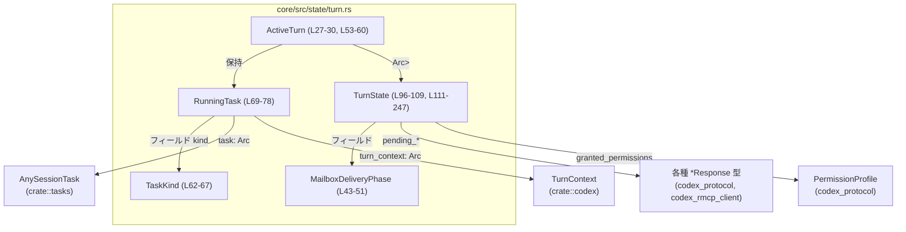

# core/src/state/turn.rs コード解説

## 0. ざっくり一言

このモジュールは、**1ターン（会話ステップ）ごとの実行状態**を管理するための仕組みです。  
実行中タスク群と、そのターン内で保留中のレビュー・権限要求・ユーザー入力・動的ツール応答などをまとめて管理し、メールボックス配送フェーズや権限プロファイルも追跡します。  
（根拠: `core/src/state/turn.rs:L26-30, L96-109, L32-51`）

---

## 1. このモジュールの役割

### 1.1 概要

- このモジュールは、**対話システムの「ターン」単位の状態管理**という問題を解決するために存在し、次の機能を提供します。
  - 同一ターン内で現在走っているタスクの登録・削除・一括取り出し（`ActiveTurn.tasks` と `RunningTask`）  
    （根拠: `core/src/state/turn.rs:L27-30, L69-78, L80-93`）
  - ターン中に発行された各種「保留中の要求」の管理（レビュー承認・権限・ユーザー入力・RMCP elicitation・動的ツール応答）  
    （根拠: `core/src/state/turn.rs:L96-104, L111-198`）
  - モデルへの次回リクエストに渡す入力バッファ（`pending_input`）の管理  
    （根拠: `core/src/state/turn.rs:L104, L200-221, L223-225`）
  - メールボックスのメッセージを「今のターンに取り込むか／次のターンに回すか」を制御する状態機械 `MailboxDeliveryPhase`  
    （根拠: `core/src/state/turn.rs:L32-51, L105, L227-237`）
  - 権限プロファイル（`PermissionProfile`）をターン中に段階的にマージして記録する仕組み  
    （根拠: `core/src/state/turn.rs:L106, L239-242`）
  - ツール呼び出し回数・ターン開始時トークン使用量などメタデータの保持  
    （根拠: `core/src/state/turn.rs:L107-108`）

### 1.2 アーキテクチャ内での位置づけ

このモジュールは、セッション全体の中で「**ターンスコープの状態コンテナ**」として振る舞います。

- `ActiveTurn`
  - 外側から見た「現在のターン」を表す構造体で、実行中タスク（`RunningTask`）一覧と、同期的にアクセスされるターン状態 `TurnState` を保持します。  
    （根拠: `core/src/state/turn.rs:L27-30`）
- `TurnState`
  - `ActiveTurn` 内の `Arc<Mutex<_>>` でラップされ、非同期ロックを通して変更される可変状態です。  
    （根拠: `core/src/state/turn.rs:L27-30, L96-109`）
- `RunningTask`
  - 実際のセッションタスク（`AnySessionTask`）と、そのキャンセル・完了通知・トレーシングタイマーなどを束ねた単位です。  
    （根拠: `core/src/state/turn.rs:L69-78`）

依存関係を簡略化して図示すると、次のようになります。



> 図のノードに付いている行番号は、それぞれの型定義やメソッド群が現れる範囲を示します。

### 1.3 設計上のポイント

- **責務分離**
  - `ActiveTurn` は「タスクの集合」と「ターン内の共有状態」という**2つの大きな責務**を持ち、それぞれ `tasks` と `turn_state` に分かれています。  
    （根拠: `core/src/state/turn.rs:L27-30`）
  - ターン内の細かい状態（保留中リクエスト、入力バッファ、権限など）は `TurnState` に閉じ込められています。  
    （根拠: `core/src/state/turn.rs:L96-109`）
- **非同期安全性**
  - `TurnState` は `Arc<Mutex<TurnState>>` で共有され、`ActiveTurn::clear_pending` では `tokio::sync::Mutex` の `lock().await` を用いて非同期に排他制御されています。  
    （根拠: `core/src/state/turn.rs:L27-30, L7, L249-254`）
  - 各タスクの完了通知は `Arc<Notify>` で、キャンセルは `CancellationToken` と `AbortOnDropHandle<()>` により制御できるような構造になっています（具体的なキャンセル処理はこのファイルにはありません）。  
    （根拠: `core/src/state/turn.rs:L69-77`）
- **ワンショットチャンネルによる待ち合わせ**
  - レビュー決定やユーザー入力、動的ツールの応答などは `tokio::sync::oneshot::Sender<_>` を `HashMap` に保存することで、非同期の「一度きりの結果受け渡し」を実現する足場を提供しています。  
    （根拠: `core/src/state/turn.rs:L96-104, L111-198`）
- **シンプルな状態機械**
  - メールボックス配送に関しては、`MailboxDeliveryPhase` という2状態（`CurrentTurn` / `NextTurn`）の enum でモデル化されています。  
    （根拠: `core/src/state/turn.rs:L32-51, L105, L227-237`）
- **権限のマージ**
  - `record_granted_permissions` は、既存の `granted_permissions` と新しい `PermissionProfile` を `merge_permission_profiles` で統合する設計になっており、「上書き」ではなく「マージ」志向になっています。  
    （根拠: `core/src/state/turn.rs:L3, L106, L239-242`）

---

## 2. 主要な機能一覧

このモジュールが提供する主要機能を箇条書きでまとめます。

- 実行中タスク管理: `ActiveTurn::add_task`, `remove_task`, `drain_tasks` によるタスク登録・削除・一括取得  
  （根拠: `core/src/state/turn.rs:L27-30, L80-93`）
- ターン内の保留中リクエスト管理: レビュー、権限要求、ユーザー入力、elicitation、動的ツール応答の `insert_*` / `remove_*` API  
  （根拠: `core/src/state/turn.rs:L96-104, L111-198`）
- 入力バッファ管理: `push_pending_input`, `prepend_pending_input`, `take_pending_input`, `has_pending_input` による次リクエスト用入力の蓄積と取り出し  
  （根拠: `core/src/state/turn.rs:L104, L200-225`）
- メールボックス配送制御: `MailboxDeliveryPhase` と `accept_mailbox_delivery_for_current_turn`, `accepts_mailbox_delivery_for_current_turn`, `set_mailbox_delivery_phase`  
  （根拠: `core/src/state/turn.rs:L32-51, L105, L227-237`）
- 権限プロファイルの蓄積: `record_granted_permissions`, `granted_permissions` による許可済み権限のマージと取得  
  （根拠: `core/src/state/turn.rs:L106, L239-246`）
- メタデータ追跡: `tool_calls`, `token_usage_at_turn_start` フィールドでの統計情報の保持  
  （根拠: `core/src/state/turn.rs:L107-108`）
- ペンディング状態の一括クリア: `TurnState::clear_pending` と `ActiveTurn::clear_pending` によるターン終了時のリセット  
  （根拠: `core/src/state/turn.rs:L127-134, L249-254`）

---

## 3. 公開 API と詳細解説

### 3.1 型一覧（構造体・列挙体など）

このモジュール内の主要な型を一覧にします。

| 名前 | 種別 | 役割 / 用途 | 定義位置 |
|------|------|-------------|----------|
| `ActiveTurn` | 構造体 | 現在進行中のターン全体を表し、実行中タスク群と共有ターン状態 `TurnState` を保持する。 | `core/src/state/turn.rs:L27-30` |
| `MailboxDeliveryPhase` | 列挙体 | メールボックスからのメッセージを「現在のターンに取り込むか／次ターンに回すか」を表す2状態の状態機械。 | `core/src/state/turn.rs:L32-51` |
| `TaskKind` | 列挙体 | 実行中タスクの種別（通常、レビュー、コンパクトなど）を区別する。 | `core/src/state/turn.rs:L62-67` |
| `RunningTask` | 構造体 | 1つのセッションタスクのメタデータ（完了通知、キャンセル、トレーシングタイマー、`TurnContext` 等）をまとめたコンテナ。 | `core/src/state/turn.rs:L69-78` |
| `TurnState` | 構造体 | 1ターン内で変化する可変状態（保留中リクエスト群、入力バッファ、メールボックスフェーズ、権限、メトリクス）を保持する。 | `core/src/state/turn.rs:L96-109` |

#### 関数・メソッド インベントリー

関数・メソッドを一覧に整理します（詳細解説対象を除き、1行説明のみ）。

| メソッド名 | 所属型 | 役割（1行） | 返り値 | 定義位置 |
|-----------|--------|-------------|--------|----------|
| `default()` | `ActiveTurn` (impl Default) | 空のタスク一覧とデフォルトの `TurnState` を持つ `ActiveTurn` を生成する。 | `Self` | `L53-60` |
| `add_task(&mut self, task)` | `ActiveTurn` | `TurnContext.sub_id` をキーとして `tasks` に `RunningTask` を登録する。 | `()` | `L80-84` |
| `remove_task(&mut self, sub_id)` | `ActiveTurn` | 指定サブIDのタスクを削除し、一覧が空になったかどうかを返す。 | `bool` | `L86-89` |
| `drain_tasks(&mut self)` | `ActiveTurn` | 全タスクを取り出して内部の `tasks` を空にする。 | `Vec<RunningTask>` | `L91-93` |
| `insert_pending_approval(&mut self, key, tx)` | `TurnState` | レビュー決定用 oneshot Sender をキー付きで登録する。 | `Option<Sender<_>>` | `L111-118` |
| `remove_pending_approval(&mut self, key)` | `TurnState` | レビュー決定用 Sender を取り出しつつ削除する。 | `Option<Sender<_>>` | `L120-125` |
| `clear_pending(&mut self)` | `TurnState` | すべての保留中リクエストと入力バッファをクリアする。 | `()` | `L127-134` |
| `insert_pending_request_permissions(&mut self, key, tx)` | `TurnState` | 権限要求用 Sender を登録する。 | `Option<Sender<_>>` | `L136-141` |
| `remove_pending_request_permissions(&mut self, key)` | `TurnState` | 権限要求用 Sender を削除する。 | `Option<Sender<_>>` | `L144-149` |
| `insert_pending_user_input(&mut self, key, tx)` | `TurnState` | ユーザー入力待ち Sender を登録する。 | `Option<Sender<_>>` | `L151-156` |
| `remove_pending_user_input(&mut self, key)` | `TurnState` | ユーザー入力待ち Sender を削除する。 | `Option<Sender<_>>` | `L159-164` |
| `insert_pending_elicitation(&mut self, server_name, request_id, tx)` | `TurnState` | `(server_name, RequestId)` をキーに RMCP elicitation 用 Sender を登録する。 | `Option<Sender<_>>` | `L166-174` |
| `remove_pending_elicitation(&mut self, server_name, request_id)` | `TurnState` | 指定キーの elicitation Sender を削除する。 | `Option<Sender<_>>` | `L176-183` |
| `insert_pending_dynamic_tool(&mut self, key, tx)` | `TurnState` | 動的ツール応答 Sender を登録する。 | `Option<Sender<_>>` | `L185-190` |
| `remove_pending_dynamic_tool(&mut self, key)` | `TurnState` | 動的ツール応答 Sender を削除する。 | `Option<Sender<_>>` | `L193-197` |
| `push_pending_input(&mut self, input)` | `TurnState` | 出力構築用の `ResponseInputItem` を末尾に追加する。 | `()` | `L200-202` |
| `prepend_pending_input(&mut self, input_vec)` | `TurnState` | 渡された入力リストを既存バッファの先頭側に結合する。 | `()` | `L204-211` |
| `take_pending_input(&mut self)` | `TurnState` | バッファ内容を返し、内部バッファを空にする。 | `Vec<ResponseInputItem>` | `L213-221` |
| `has_pending_input(&self)` | `TurnState` | バッファに1件以上要素があるかどうかを返す。 | `bool` | `L223-225` |
| `accept_mailbox_delivery_for_current_turn(&mut self)` | `TurnState` | メールボックス配送フェーズを `CurrentTurn` に設定する。 | `()` | `L227-229` |
| `accepts_mailbox_delivery_for_current_turn(&self)` | `TurnState` | 現在のフェーズが `CurrentTurn` かどうかを返す。 | `bool` | `L231-233` |
| `set_mailbox_delivery_phase(&mut self, phase)` | `TurnState` | メールボックス配送フェーズを任意の値に更新する。 | `()` | `L235-237` |
| `record_granted_permissions(&mut self, permissions)` | `TurnState` | 既存の権限プロファイルと新しいものをマージして保存する。 | `()` | `L239-242` |
| `granted_permissions(&self)` | `TurnState` | 現在記録されている権限プロファイルのコピーを返す。 | `Option<PermissionProfile>` | `L244-245` |
| `clear_pending(&self)` | `ActiveTurn` | `TurnState` の `clear_pending` を非同期ロック越しに呼び出す。 | `()` （`async`） | `L249-254` |

---

### 3.2 関数詳細（重要な7件）

#### `ActiveTurn::add_task(&mut self, task: RunningTask)`

**概要**

- `RunningTask` を `turn_context.sub_id` をキーとして `tasks` に登録します。  
  これにより、ターン中のサブリクエスト単位のタスクを追跡できます。  
  （根拠: `core/src/state/turn.rs:L80-84`）

**引数**

| 引数名 | 型 | 説明 |
|--------|----|------|
| `self` | `&mut ActiveTurn` | タスク一覧を保持する `ActiveTurn` インスタンス（可変参照）。 |
| `task` | `RunningTask` | 登録対象のタスク。内部の `turn_context.sub_id` がキーに利用される。 |

**戻り値**

- `()`（戻り値なし）。`tasks` にタスクが追加されます。  
  （根拠: `core/src/state/turn.rs:L81-84`）

**内部処理の流れ**

1. `task.turn_context.sub_id.clone()` でサブID文字列を取得します。  
   （根拠: `core/src/state/turn.rs:L82`）
2. `self.tasks.insert(sub_id, task)` で `IndexMap` に登録します。  
   （根拠: `core/src/state/turn.rs:L83`）

**使用例（代表的なパターン）**

```rust
use std::sync::Arc;
use tokio::sync::Notify;
use tokio_util::sync::CancellationToken;
use tokio_util::task::AbortOnDropHandle;

async fn register_task_example(mut active: ActiveTurn, turn_ctx: Arc<TurnContext>) {
    // 実際の AnySessionTask, AbortOnDropHandle は別の場所で生成される前提の疑似コードです。
    let my_task: Arc<dyn AnySessionTask> = unimplemented!();
    let handle: AbortOnDropHandle<()> = unimplemented!();

    let running = RunningTask {
        done: Arc::new(Notify::new()),
        kind: TaskKind::Regular,
        task: my_task,
        cancellation_token: CancellationToken::new(),
        handle: Arc::new(handle),
        turn_context: turn_ctx,
        _timer: None,
    };

    active.add_task(running); // サブIDごとにタスクを登録する
}
```

**Errors / Panics**

- このメソッド内で明示的な `panic!` や `Result` は使用されていません。
- `IndexMap::insert` は通常 O(1) で、ここではメモリ不足など異常系以外の panic は発生しません。

**Edge cases（エッジケース）**

- 同じ `sub_id` を持つタスクを複数回追加した場合、最後のタスクで上書きされます。既存エントリは `IndexMap::insert` の戻り値として捨てられています（呼び出し側からは見えません）。  
  （根拠: `core/src/state/turn.rs:L82-83`）
- `sub_id` が空文字列でも、そのままキーとして使われます（バリデーションは行われません）。

**使用上の注意点**

- 同一 `sub_id` に複数のタスクを紐づけたい場合、`sub_id` を一意になるよう設計する必要があります。
- 登録したタスクは `remove_task` や `drain_tasks` で明示的に取り除かない限り、このマップに残り続けます。

---

#### `ActiveTurn::remove_task(&mut self, sub_id: &str) -> bool`

**概要**

- サブIDをキーに `tasks` からタスクを削除し、削除後にタスク一覧が空になったかどうかを返します。  
  （根拠: `core/src/state/turn.rs:L86-89`）

**引数**

| 引数名 | 型 | 説明 |
|--------|----|------|
| `self` | `&mut ActiveTurn` | タスク一覧を保持しているインスタンス。 |
| `sub_id` | `&str` | 削除対象タスクのキーとなるサブID。 |

**戻り値**

- `bool`: 削除後に `tasks` が空なら `true`、そうでなければ `false`。  
  （根拠: `core/src/state/turn.rs:L88`）

**内部処理の流れ**

1. `self.tasks.swap_remove(sub_id)` を呼び、対応する要素があれば末尾要素と交換して削除します。  
   （根拠: `core/src/state/turn.rs:L87`）
2. その後 `self.tasks.is_empty()` の結果を返します。  
   （根拠: `core/src/state/turn.rs:L88`）

**使用例**

```rust
fn finish_task_example(active: &mut ActiveTurn, sub_id: &str) {
    let is_last = active.remove_task(sub_id);

    if is_last {
        // 全てのタスクが終了したタイミングで、何らかのクリーンアップを行う設計にできる
        // 例: ログ出力や次ターンへの状態遷移など
    }
}
```

**Errors / Panics**

- `swap_remove` は、キーが存在しない場合は何もせず `None` を返すだけであり、panic はしません。  
  （ライブラリ仕様に基づく一般的な性質で、このコード自体には `unwrap` などはありません。`L87`）
- このメソッド自体にエラー結果型はありません。

**Edge cases**

- 存在しない `sub_id` を渡した場合、何も削除されず、単に現在の `tasks.is_empty()` の状態が返されます。  
- 1件だけタスクが登録されている状態で削除すると `true` が返るため、「最後のタスク終了フラグ」として利用できます。

**使用上の注意点**

- 戻り値 `bool` は「削除に成功したかどうか」ではなく、「削除後にタスクが残っているかどうか」を表します。存在しないキーでも `false` が返る可能性があります（タスクが他にあれば）。この点を誤解しないことが重要です。

---

#### `TurnState::clear_pending(&mut self)`

**概要**

- レビュー・権限要求・ユーザー入力・elicitation・動的ツールのすべての保留エントリと入力バッファをクリアし、ターン内の「待ち状態」を一括でリセットします。  
  （根拠: `core/src/state/turn.rs:L96-104, L127-134`）

**引数**

| 引数名 | 型 | 説明 |
|--------|----|------|
| `self` | `&mut TurnState` | ターン内可変状態。 |

**戻り値**

- `()`（戻り値なし）。

**内部処理の流れ**

1. 各 `pending_*` の `HashMap` に対して `clear()` を呼び、全要素を削除します。  
   （根拠: `core/src/state/turn.rs:L127-133`）
2. `pending_input` ベクタも `clear()` で空にします。  
   （根拠: `core/src/state/turn.rs:L133-134`）

**使用例**

```rust
fn reset_turn_state(ts: &mut TurnState) {
    ts.clear_pending(); // このターンで待っていた全ての非同期要求と入力を破棄
}
```

`ActiveTurn` 経由で使う代表例は 7番目の `ActiveTurn::clear_pending` の節を参照してください。

**Errors / Panics**

- 各 `HashMap::clear` と `Vec::clear` はメモリを保持したまま要素のみ削除する操作であり、通常 panic しません。
- ここでもエラー型を返していません。

**Edge cases**

- すでにすべてが空の場合でも問題なく呼び出せます。その場合は副作用なしです。

**使用上の注意点**

- `oneshot::Sender` を保持している状態でこれを呼び出すと、対応する `Receiver` 側は結果を受け取れずに `closed` になる可能性が高く、待ち側のロジック次第ではエラー扱いになる設計も考えられます。このファイルからは待ち側処理は見えませんが、「ターン中にまだ必要な保留がないか」を呼び出し側で判断する必要があります。

---

#### `TurnState::take_pending_input(&mut self) -> Vec<ResponseInputItem>`

**概要**

- モデルへの次回リクエストに使う入力バッファ `pending_input` の内容をまとめて取り出し、内部バッファを空にします。  
  （根拠: `core/src/state/turn.rs:L104, L213-221`）

**引数**

| 引数名 | 型 | 説明 |
|--------|----|------|
| `self` | `&mut TurnState` | 入力バッファを保持している状態。 |

**戻り値**

- `Vec<ResponseInputItem>`: 現在バッファに溜まっている全要素。要素数0のときは容量0のベクタが返ります。  
  （根拠: `core/src/state/turn.rs:L213-221`）

**内部処理の流れ**

1. `if self.pending_input.is_empty()` のチェックで空かどうかを確認します。  
   （根拠: `core/src/state/turn.rs:L214`）
2. 空であれば `Vec::with_capacity(0)` を返します（不要な `swap` を避ける実装）。  
   （根拠: `core/src/state/turn.rs:L215-216`）
3. 要素がある場合は空の `Vec` を作成し、`std::mem::swap(&mut ret, &mut self.pending_input)` で中身を丸ごと入れ替えます。  
   （根拠: `core/src/state/turn.rs:L217-218`）
4. `ret` を返すことで、呼び出し側に所有権を移しつつ内部バッファを空にします。  
   （根拠: `core/src/state/turn.rs:L219-220`）

**使用例**

```rust
fn build_model_request(ts: &mut TurnState) -> Vec<ResponseInputItem> {
    // バッファに溜まっている入力を全て取得し、TurnState 側は空にする
    let inputs = ts.take_pending_input();

    // ここで inputs を使ってモデルへのリクエストを構築する、というような使い方が想定されます。
    inputs
}
```

**Errors / Panics**

- `Vec::with_capacity(0)` と `std::mem::swap` は通常 panic しません。
- OOM などシステムレベルの問題を除き、実用上の panic 要因はありません。

**Edge cases**

- バッファが空のときに呼び出すと、容量0の `Vec` が返り、`has_pending_input` も `false` のはずです。  
  （根拠: `core/src/state/turn.rs:L213-216, L223-225`）
- 複数回連続で呼んだ場合、2回目以降は常に空ベクタが返ります（再び `push_pending_input` や `prepend_pending_input` で追加されない限り）。

**使用上の注意点**

- `take_*` という名前どおり、呼び出しは「破壊的」です。`TurnState` 側のバッファを空にするので、同じデータを複数回使いたい場合は呼び出し側でクローンする必要があります。
- 空のときに `None` ではなく空ベクタを返す設計なので、戻り値を `Option` と誤解しないようにする必要があります。

---

#### `TurnState::accepts_mailbox_delivery_for_current_turn(&self) -> bool`

**概要**

- 現在のメールボックス配送フェーズが `MailboxDeliveryPhase::CurrentTurn` かどうかを判定します。  
  これにより、メールボックスからのメッセージを「今のターンに取り込むべきか」を判定できます。  
  （根拠: `core/src/state/turn.rs:L231-233, L32-51`）

**引数**

| 引数名 | 型 | 説明 |
|--------|----|------|
| `self` | `&TurnState` | メールボックス配送フェーズを含む状態。 |

**戻り値**

- `bool`: `mailbox_delivery_phase == MailboxDeliveryPhase::CurrentTurn` の結果。  
  （根拠: `core/src/state/turn.rs:L231-233`）

**内部処理の流れ**

1. `self.mailbox_delivery_phase == MailboxDeliveryPhase::CurrentTurn` を評価して、そのまま返します。  
   （根拠: `core/src/state/turn.rs:L231-233`）

**使用例**

```rust
fn should_fold_mailbox_into_turn(ts: &TurnState) -> bool {
    ts.accepts_mailbox_delivery_for_current_turn()
}
```

**Errors / Panics**

- 単純な比較演算のみであり、panic 要因はありません。

**Edge cases**

- フェーズが `NextTurn` の場合は必ず `false` になります。  
  （根拠: `core/src/state/turn.rs:L43-51, L231-233`）
- それ以外のバリアントが enum に追加された場合、比較の結果は新バリアントかどうかに応じて変化します。

**使用上の注意点**

- フェーズの切り替えは `accept_mailbox_delivery_for_current_turn` や `set_mailbox_delivery_phase` で行われます。判定だけでは状態は変化しません。
- コメントによれば、ユーザー向け最終出力を出した後は `NextTurn` に切り替える運用が想定されています（この切り替え自体は別のコードで行われる必要があります）。  
  （根拠: `core/src/state/turn.rs:L32-42`）

---

#### `TurnState::record_granted_permissions(&mut self, permissions: PermissionProfile)`

**概要**

- 新たに付与された権限プロファイルを、既存の `granted_permissions` とマージして記録します。  
  （根拠: `core/src/state/turn.rs:L239-242`）

**引数**

| 引数名 | 型 | 説明 |
|--------|----|------|
| `self` | `&mut TurnState` | 権限プロファイルを保持する状態。 |
| `permissions` | `PermissionProfile` | 新たに付与された権限。 |

**戻り値**

- `()`（戻り値なし）。

**内部処理の流れ**

1. `self.granted_permissions.as_ref()` で既存の権限プロファイルをオプション参照として取得します。  
   （根拠: `core/src/state/turn.rs:L240`）
2. `merge_permission_profiles(self.granted_permissions.as_ref(), Some(&permissions))` を呼び出し、両者を統合した新しい `PermissionProfile`（または `None`）を取得します。  
   （根拠: `core/src/state/turn.rs:L3, L240-241`）
3. 結果を `self.granted_permissions` に格納します。  
   （根拠: `core/src/state/turn.rs:L239-241`）

**使用例**

```rust
fn update_permissions(ts: &mut TurnState, newly_granted: PermissionProfile) {
    ts.record_granted_permissions(newly_granted);

    // 後で現在の権限を参照したい場合は granted_permissions() を使う
    let current = ts.granted_permissions();
}
```

**Errors / Panics**

- このメソッド内に `unwrap` などはなく、通常は panic しません。
- `merge_permission_profiles` の内部実装はこのファイルには現れないため、その中でのエラー挙動は不明です。

**Edge cases**

- まだ権限が何も記録されていない（`self.granted_permissions` が `None`）状態で呼び出した場合、`merge_permission_profiles` には `None` と `Some(&permissions)` が渡されます。これが新規セットとして扱われる設計が一般的に想定されますが、具体的挙動は関数実装に依存します。  
  （根拠: `core/src/state/turn.rs:L239-241`）
- 同じ権限を何度も追加した場合の重複処理も `merge_permission_profiles` 依存です。

**使用上の注意点**

- 既存の権限を「リセット」したい場合は、このメソッドではなく `granted_permissions` フィールドを `None` に直接するようなAPIが別途必要になります（本モジュールにはそのようなAPIはありません）。  
  （根拠: `core/src/state/turn.rs:L106, L239-245`）
- 権限の「削除」はこのメソッドの責務ではなく、権限は追加・マージ方向の設計になっています。

---

#### `ActiveTurn::clear_pending(&self)`

```rust
pub(crate) async fn clear_pending(&self) {
    let mut ts = self.turn_state.lock().await;
    ts.clear_pending();
}
```

**概要**

- `TurnState` に対して非同期ロックを取得し、`TurnState::clear_pending` を呼び出すことで、現在のターンに紐づく保留中リクエストと入力バッファを一括クリアします。  
  （根拠: `core/src/state/turn.rs:L249-254`）

**引数**

| 引数名 | 型 | 説明 |
|--------|----|------|
| `self` | `&ActiveTurn` | 内部に `Arc<Mutex<TurnState>>` を保持するターンインスタンス。 |

**戻り値**

- `()`（`async fn` なので `impl Future<Output = ()>` として振る舞います）。

**内部処理の流れ**

1. `self.turn_state.lock().await` を呼び出して非同期ロックを取得し、`MutexGuard<TurnState>` を `mut ts` に束縛します。  
   （根拠: `core/src/state/turn.rs:L251-252`）
2. `ts.clear_pending()` を呼び出して、`TurnState` 内の保留状態をリセットします。  
   （根拠: `core/src/state/turn.rs:L252-253`）

**使用例**

```rust
async fn end_turn(active: &ActiveTurn) {
    // 非同期コンテキストから呼び出し、現在のターンに紐づく保留状態をリセットする
    active.clear_pending().await;
}
```

**非同期・並行性上の注意**

- `tokio::sync::Mutex` を使っているため、このロックは `.await` による協調的な非同期ロックです。  
  同じ `TurnState` へのアクセスが他の `async` タスクで待機している場合、ここでロックを取得するまで待機します。  
  （根拠: `core/src/state/turn.rs:L7, L27-30, L249-254`）
- `MutexGuard` は `ts` がスコープを抜けたタイミングで解放されます。

**Errors / Panics**

- `lock().await` は通常 panic しません（`tokio::sync::Mutex` は poisoning がなく、panic 後も再利用可能な設計です）。
- `TurnState::clear_pending` 自体も panic を含んでいません（前述）。

**Edge cases**

- すでに保留状態が空でも問題なく動作します。
- 非同期ロックの保持時間は `ts.clear_pending()` の実行中のみで非常に短いため、ロック競合によるスループット劣化は限定的です。

**使用上の注意点**

- `async fn` なので、同期コンテキストから直接呼び出すことはできません。`tokio` ランタイム上などの非同期コンテキストで `.await` 付きで呼び出す必要があります。
- `clear_pending` はタスク自体 (`RunningTask`) には手を触れず、保留中リクエストと入力だけをクリアします。タスクは `remove_task` / `drain_tasks` で別途管理する必要があります。  
  （根拠: `core/src/state/turn.rs:L91-93, L249-254`）

---

### 3.3 その他の関数（概要）

前節で詳細説明しなかったメソッドの役割を簡潔にまとめます。

| 関数名 | 所属型 | 役割（1行） | 定義位置 |
|--------|--------|-------------|----------|
| `ActiveTurn::drain_tasks` | `ActiveTurn` | 全ての `RunningTask` をベクタとして取り出し、内部 `tasks` を空にする。 | `L91-93` |
| `TurnState::insert_pending_*` 系 | `TurnState` | 各種保留中リクエストの Sender をキー付きで登録する（既存エントリがあれば `Some(old)` を返す）。 | `L111-118, L136-141, L151-156, L166-174, L185-190` |
| `TurnState::remove_pending_*` 系 | `TurnState` | 指定キーの Sender を `HashMap` から削除して返す。 | `L120-125, L144-149, L159-164, L176-183, L193-197` |
| `TurnState::push_pending_input` | `TurnState` | `pending_input` ベクタの末尾にアイテムを追加する。 | `L200-202` |
| `TurnState::prepend_pending_input` | `TurnState` | 渡されたリストを先頭に結合する形で `pending_input` にマージする（空入力なら何もしない）。 | `L204-211` |
| `TurnState::has_pending_input` | `TurnState` | `pending_input` が空かどうかを返す。 | `L223-225` |
| `TurnState::accept_mailbox_delivery_for_current_turn` | `TurnState` | フェーズを `CurrentTurn` に更新するヘルパー。 | `L227-229` |
| `TurnState::set_mailbox_delivery_phase` | `TurnState` | フェーズを任意の `MailboxDeliveryPhase` に設定する。 | `L235-237` |
| `TurnState::granted_permissions` | `TurnState` | `granted_permissions` のクローンを返すゲッター。 | `L244-245` |

---

## 4. データフロー

### 4.1 代表的な処理シナリオの流れ

このファイルから読み取れる範囲で、「ターン中にタスクを登録し、ターン終了時に保留状態をクリアする」という典型的なシナリオを説明します。

1. セッション管理コードが `ActiveTurn::default()` で新しいターン状態を作成します。  
   （根拠: `core/src/state/turn.rs:L53-60`）
2. 各サブリクエストの開始時に `ActiveTurn::add_task` で `RunningTask` が `tasks` に登録されます。  
   （根拠: `core/src/state/turn.rs:L80-84`）
3. ターンの進行中に、各種保留中リクエストが `TurnState::insert_pending_*` を通じて登録されます。  
   （根拠: `core/src/state/turn.rs:L96-104, L111-198`）
4. モデルへのリクエストを組み立てる際には、`TurnState::take_pending_input` で `pending_input` を取り出して使用します。  
   （根拠: `core/src/state/turn.rs:L104, L213-221`）
5. ターン終了時に `ActiveTurn::clear_pending().await` が呼ばれ、`TurnState` 内の保留状態・入力バッファが一括クリアされます。  
   （根拠: `core/src/state/turn.rs:L249-254`）
6. 終了したサブタスクは `remove_task` / `drain_tasks` で整理されます。  
   （根拠: `core/src/state/turn.rs:L86-93`）

この流れをシーケンス図で表すと次のようになります。

```mermaid
sequenceDiagram
    %% 図中の括弧内は主な行番号
    participant Session as セッション管理コード
    participant AT as ActiveTurn (L27-30)
    participant TS as TurnState (L96-109)

    Session->>AT: ActiveTurn::default() (L53-60)
    Note right of AT: tasks=空, turn_state=Arc<Mutex<TurnState::default()>>

    Session->>AT: add_task(RunningTask) (L81-84)
    AT->>AT: tasks.insert(sub_id, task)

    Session->>TS: insert_pending_* / push_pending_input (L111-198, L200-202)
    Note right of TS: 保留中リクエストと pending_input を蓄積

    Session->>TS: take_pending_input() (L213-221)
    TS-->>Session: Vec<ResponseInputItem>

    Session->>AT: clear_pending().await (L249-254)
    AT->>TS: lock().await; clear_pending() (L127-134)
    TS-->>AT: ()
    AT-->>Session: ()
```

> メールボックスフェーズや権限のマージなども、このシナリオの途中で `TurnState` に対して操作されると考えられますが、呼び出し元の具体的なコードはこのチャンクには現れません。

---

## 5. 使い方（How to Use）

### 5.1 基本的な使用方法

ここでは、`ActiveTurn` と `TurnState` を使って「ターン中にタスクと保留状態を管理し、終了時にクリーンアップする」という典型的な流れの例を示します。

```rust
use std::sync::Arc;
use tokio::sync::Notify;
use tokio_util::sync::CancellationToken;
use tokio_util::task::AbortOnDropHandle;

async fn handle_turn(turn_ctx: Arc<TurnContext>) {
    // 1. ActiveTurn の初期化
    let mut active_turn = ActiveTurn::default(); // tasks: 空 / TurnState: デフォルト (L53-60)

    // 2. タスクの作成（実際には別のロジックで生成される想定）
    let any_task: Arc<dyn AnySessionTask> = unimplemented!();
    let handle: AbortOnDropHandle<()> = unimplemented!();

    let running_task = RunningTask {
        done: Arc::new(Notify::new()),
        kind: TaskKind::Regular,
        task: any_task,
        cancellation_token: CancellationToken::new(),
        handle: Arc::new(handle),
        turn_context: turn_ctx.clone(),
        _timer: None,
    };

    // 3. タスクを ActiveTurn に登録
    active_turn.add_task(running_task); // (L81-84)

    // 4. 保留中リクエストや入力を TurnState に登録
    {
        // TurnState へのアクセスには Arc<Mutex<>> のロックが必要
        let mut ts = active_turn.turn_state.lock().await; // (L27-30, L249-252)

        // 例: レビュー決定待ちチャンネルを登録
        let (tx_review, _rx_review) = tokio::sync::oneshot::channel();
        ts.insert_pending_approval("review1".to_string(), tx_review); // (L111-118)

        // 例: モデル入力バッファにアイテムを追加
        let item: ResponseInputItem = unimplemented!();
        ts.push_pending_input(item); // (L200-202)
    }

    // ... ここでターン中の処理を実行 ...

    // 5. ターン終了時に保留状態をクリア
    active_turn.clear_pending().await; // TurnState::clear_pending を呼ぶ (L249-254)

    // 6. タスクを削除
    let sub_id = "some_sub_id"; // 実際は turn_context.sub_id と対応するもの
    let _is_last = active_turn.remove_task(sub_id); // (L86-89)
}
```

### 5.2 よくある使用パターン

#### パターン1: oneshot チャンネルでの応答待ち

`TurnState::insert_pending_*` 系は、いずれも `oneshot::Sender<T>` を登録する API です。一般的な tokio のパターンでは、次のような使い方が想定されます（待ち側はこのファイルには現れません）。

```rust
async fn request_user_input(ts: &mut TurnState) {
    let (tx, rx) = tokio::sync::oneshot::channel::<RequestUserInputResponse>();

    // 1. Sender を TurnState に登録
    ts.insert_pending_user_input("input1".to_string(), tx); // (L151-156)

    // 2. Receiver を使ってどこかで応答を待つ
    // 実際には別のタスク・関数に rx を渡す設計が考えられます。
    tokio::spawn(async move {
        match rx.await {
            Ok(response) => {
                // ユーザー入力が届いた際の処理
                let _ = response;
            }
            Err(_closed) => {
                // TurnState 側から Sender がドロップされた場合など
            }
        }
    });
}
```

> 上記の「待ち側ロジック」はこのファイルには定義されていませんが、`oneshot::Sender` を保存する API であることから、このようなパターンとの組み合わせが自然と考えられます。

#### パターン2: メールボックスフェーズの切り替え

```rust
fn mark_after_final_output(ts: &mut TurnState) {
    // 最終出力をユーザーに表示した後は、遅延到着したメールボックスメッセージを
    // 次のターンに回すためにフェーズを NextTurn にする設計がコメントから読み取れます。
    ts.set_mailbox_delivery_phase(MailboxDeliveryPhase::NextTurn); // (L35-42, L235-237)
}

fn reopen_current_turn(ts: &mut TurnState) {
    // 同じタスクに対する明示的な追加入力があった場合などに、
    // 再び CurrentTurn に戻すことがコメントで言及されています。
    ts.accept_mailbox_delivery_for_current_turn(); // (L40-42, L227-229)
}
```

### 5.3 よくある間違い（起こりうる誤用）

このファイルから推測される、「起こりうる誤用」の例を挙げます。

```rust
// 誤り例: ActiveTurn::clear_pending を同期コンテキストから直接呼び出している
fn wrong_usage(active: &ActiveTurn) {
    // active.clear_pending(); // コンパイルエラー: async fn を await していない
}

// 正しい例: 非同期関数の中で .await を付けて呼び出す
async fn correct_usage(active: &ActiveTurn) {
    active.clear_pending().await;
}
```

```rust
// 誤り例: remove_task の戻り値を「削除成功フラグ」と誤解している
fn wrong_remove(active: &mut ActiveTurn, sub_id: &str) {
    if !active.remove_task(sub_id) {
        // ここで「削除に失敗した」と判断するのは誤り。
        // 実際には「削除後に tasks が空でない」だけかもしれません。
    }
}
```

### 5.4 使用上の注意点（まとめ）

- **非同期ロック**
  - `TurnState` へのアクセスは必ず `tokio::sync::Mutex` を通じて行う必要があります。同期コードからロックすることはできません。  
    （根拠: `core/src/state/turn.rs:L7, L27-30, L249-252`）
- **破壊的 API**
  - `take_pending_input` や `clear_pending` は内部状態をクリアするため、呼び出しタイミングに注意が必要です。  
    （根拠: `core/src/state/turn.rs:L127-134, L213-221`）
- **権限管理**
  - `record_granted_permissions` は権限をマージするのみで、権限の削除は行いません。権限の取り消しが必要な場合は別の仕組みが必要です。  
    （根拠: `core/src/state/turn.rs:L239-242`）
- **oneshot チャンネル**
  - `clear_pending` で Sender を破棄すると、対応する Receiver は `closed` になるため、待ち側ロジックでその可能性を考慮する必要があります（待ち側はこのファイルにはありません）。

---

## 6. 変更の仕方（How to Modify）

### 6.1 新しい「保留中リクエスト」種類を追加する場合

例えば、新しい種類のレスポンス `NewResponse` に対して `pending_new: HashMap<String, Sender<NewResponse>>` を追加したい場合、既存のパターンに従って変更できます。

1. `TurnState` にフィールドを追加する。  

   ```rust
   // TurnState 内 (L96-109 付近)
   pending_new: HashMap<String, oneshot::Sender<NewResponse>>,
   ```

2. `TurnState` の `impl` ブロックに `insert_pending_new` / `remove_pending_new` を追加する。  
   同じパターンは `insert_pending_dynamic_tool` などを参照できます。  
   （根拠: `core/src/state/turn.rs:L185-197`）
3. `clear_pending` に新フィールドの `clear()` 呼び出しを追加する。  
   （根拠: `core/src/state/turn.rs:L127-134`）
4. 呼び出し側からは、他の `insert_pending_*` と同様にチャンネルを登録・削除する。

### 6.2 既存の機能を変更する場合の注意点

- **メールボックスフェーズの仕様変更**
  - `MailboxDeliveryPhase` に新しいバリアントを追加する場合、`accepts_mailbox_delivery_for_current_turn` が `CurrentTurn` のみを真とする前提が変わるかどうかを検討する必要があります。  
    （根拠: `core/src/state/turn.rs:L43-51, L231-233`）
- **タスク管理の挙動変更**
  - `ActiveTurn::remove_task` の戻り値を別の意味（例: 削除成功／失敗）に変えたい場合、既存の呼び出しコードがその bool をどう解釈しているかを確認する必要があります（このチャンクには呼び出し側は現れません）。
- **権限マージのロジック**
  - 権限のマージ方式を変えたい場合は `merge_permission_profiles` の実装変更になりますが、その前提で `record_granted_permissions` を使っている箇所がないか確認が必要です。  
    （根拠: `core/src/state/turn.rs:L3, L239-242`）
- **テスト**
  - このファイル内にテストコードは含まれていません（`#[cfg(test)]` などが存在しない）。テストは別ファイルまたは上位モジュールにあると考えられますが、このチャンクからは場所を特定できません。

---

## 7. 関連ファイル

このモジュールと密接に関係する型・モジュールを、`use` 文から読み取れる範囲で列挙します。

| パス / 型 | 役割 / 関係 | 根拠 |
|-----------|------------|------|
| `crate::codex::TurnContext` | `RunningTask.turn_context` として各タスク固有の文脈（サブIDなど）を提供する。`add_task` のキーとして利用される。 | `core/src/state/turn.rs:L20, L69-76, L81-83` |
| `crate::tasks::AnySessionTask` | 実際のセッションタスクを抽象化するトレイトオブジェクト。`RunningTask.task` に格納される。 | `core/src/state/turn.rs:L21, L72` |
| `codex_protocol::models::ResponseInputItem` | モデルへの入力を構成するアイテム。`TurnState.pending_input` に蓄積される。 | `core/src/state/turn.rs:L13, L104, L200-221` |
| `codex_protocol::protocol::ReviewDecision` | レビューの承認／却下などの決定を表す型。`pending_approvals` の値型。 | `core/src/state/turn.rs:L23, L96, L111-118` |
| `codex_protocol::request_permissions::RequestPermissionsResponse` | 権限要求に対する応答。`pending_request_permissions` の値型。 | `core/src/state/turn.rs:L14, L96, L136-149` |
| `codex_protocol::request_user_input::RequestUserInputResponse` | ユーザー入力要求への応答。`pending_user_input` の値型。 | `core/src/state/turn.rs:L15, L96, L151-164` |
| `codex_rmcp_client::ElicitationResponse` | RMCP プロトコルにおける情報引き出し応答。`pending_elicitations` の値型。 | `core/src/state/turn.rs:L16, L96, L166-183` |
| `codex_protocol::dynamic_tools::DynamicToolResponse` | 動的ツール実行の応答。`pending_dynamic_tools` の値型。 | `core/src/state/turn.rs:L12, L96, L185-197` |
| `codex_protocol::models::PermissionProfile` | 権限プロファイル。`TurnState.granted_permissions` に保存され、`merge_permission_profiles` で統合される。 | `core/src/state/turn.rs:L22, L106, L239-245` |
| `codex_sandboxing::policy_transforms::merge_permission_profiles` | 複数の `PermissionProfile` をマージする関数。権限記録ロジックの中核。 | `core/src/state/turn.rs:L3, L239-242` |
| `tokio::sync::{Mutex, Notify, oneshot}` | 非同期ロック・完了通知・ワンショットチャンネルなど、非同期制御の基本プリミティブ。 | `core/src/state/turn.rs:L7-8, L18, L27-30, L69-71, L96-104, L111-198` |
| `tokio_util::sync::CancellationToken` | タスクキャンセル制御用トークン。`RunningTask` 内で保持される。 | `core/src/state/turn.rs:L9, L69-77` |
| `tokio_util::task::AbortOnDropHandle` | ドロップ時にタスクを中止できるハンドル。ターンのライフタイムとタスクの寿命を連動させるために使われる構造。 | `core/src/state/turn.rs:L10, L69-77` |

---

### Bugs / Security に関する補足（このチャンクで見える範囲）

- コードから明確に判明するロジック上のバグやセキュリティ脆弱性は見当たりません。
- `clear_pending` 系 API を誤ったタイミングで呼び出すと、`oneshot::Sender` が破棄されて待ち側がエラーになる可能性がありますが、これは使用方法の問題であり、このモジュール単体のバグとは言えません。
- 権限のマージ (`record_granted_permissions`) は追加・統合方向の設計であり、権限の取り消しは扱っていません。この挙動がセキュリティ要件に合致しているかどうかは、`merge_permission_profiles` の仕様と上位レイヤの要求に依存し、このチャンクからは判断できません。

### テスト・性能に関する補足

- このファイルにはユニットテストやベンチマークコードは含まれていません。
- パフォーマンス面では、`HashMap` / `IndexMap` の O(1) 操作と、`take_pending_input` 内の `std::mem::swap` によるバッファ移動など、典型的な効率の良い実装が使われています。大規模なデータになると `IndexMap` のメモリ使用量やクローンコスト（`granted_permissions()`）の影響がありますが、具体的なボトルネックは上位レイヤの使い方に依存し、このチャンクだけからは判断できません。
