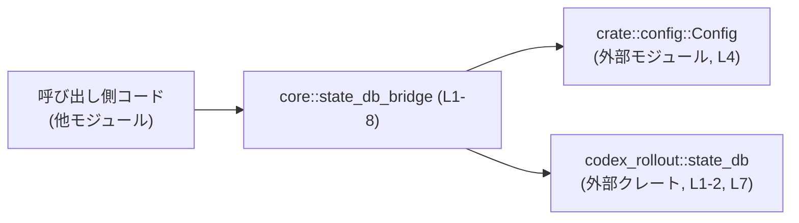
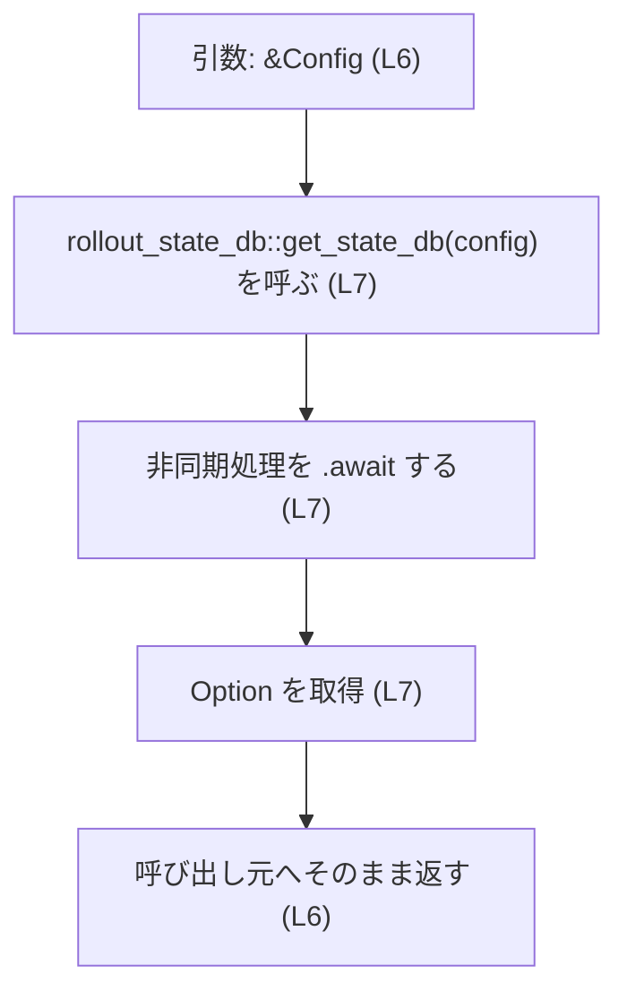

# core/src/state_db_bridge.rs コード解説

## 0. ざっくり一言

`codex_rollout::state_db` モジュールに対する **薄いブリッジ層** です。  
自クレートの `Config` を使って状態DBハンドル `StateDbHandle` を非同期に取得する関数と、そのハンドル型の再輸出を提供しています（`core/src/state_db_bridge.rs:L1-2, L4-7`）。

---

## 1. このモジュールの役割

### 1.1 概要

- このモジュールは、外部クレート `codex_rollout` の `state_db` モジュールに対して、現在のクレートからアクセスしやすくする **ブリッジ** として存在しています（`L1-2`）。
- 自クレートで定義された設定型 `Config`（`crate::config::Config`）を引数として受け取り、状態DBハンドル `StateDbHandle` を非同期に取得する関数を公開します（`L4, L6-7`）。
- 同時に `StateDbHandle` 型を再輸出することで、このモジュールを通じて状態DB関連のAPIにアクセスできるようにしています（`L2`）。

### 1.2 アーキテクチャ内での位置づけ

このモジュールは、「自クレートの設定」から「codex_rollout の state_db 実装」への接続点として機能します。



- 呼び出し側は `core::state_db_bridge::get_state_db` を呼び出すだけで、`codex_rollout::state_db` の詳細を意識せずに状態DBハンドルを取得できます（`L6-7`）。
- `Config` 型と `StateDbHandle` 型の定義内容自体は、それぞれ別モジュールにあります。このチャンクにはそれらの実装は現れません（`L2, L4`）。

### 1.3 設計上のポイント

- **責務の分割**  
  - 状態DBの実装詳細は `codex_rollout::state_db` に閉じ込められ、本モジュールは取得用の入口のみを提供しています（`L1-2, L6-7`）。
- **公開APIの統一窓口**  
  - `StateDbHandle` をこのモジュール経由で再輸出しており、呼び出し側は `codex_rollout` のモジュール構成を知らなくても状態DBハンドル型を使えます（`L2`）。
- **非同期処理（async/await）**  
  - `get_state_db` は `async fn` であり、内部で `await` を使って `rollout_state_db::get_state_db` の非同期処理完了を待っています（`L6-7`）。
- **エラーハンドリング方針**  
  - 戻り値は `Option<StateDbHandle>` であり、`Result` ではありません（`L6`）。  
    このため呼び出し側は「ある／ない」の二値（`Some` / `None`）は判別できますが、「なぜ取得できないか」の詳細な理由は、この関数の戻り値からは取得できません。
- **状態を持たない**  
  - このモジュール内に状態を保持するフィールドや構造体はなく、純粋な関数＋型再輸出のみです（`L1-8`）。

---

## 2. 主要な機能一覧

- 状態DBハンドル型の再輸出: `codex_rollout::state_db::StateDbHandle` を再輸出し、このクレートの利用者が直接 `codex_rollout` に依存せずにハンドル型を使用できるようにします（`L2`）。
- 状態DBハンドル取得関数: `Config` から `Option<StateDbHandle>` を非同期に取得する `get_state_db` を提供します（`L4, L6-7`）。

### 2.1 コンポーネントインベントリー（このファイル内）

このファイル内に登場する主要なコンポーネント（関数・型・モジュール）の一覧です。

| 名前 | 種別 | 公開? | 定義位置 | 説明 |
|------|------|-------|----------|------|
| `rollout_state_db` | モジュールエイリアス (`use ... as ...`) | いいえ | `core/src/state_db_bridge.rs:L1` | 外部クレート `codex_rollout::state_db` へのローカル別名。`get_state_db` 内で使用されます。 |
| `StateDbHandle` | 型（外部からの再輸出） | はい | `core/src/state_db_bridge.rs:L2` | `codex_rollout::state_db::StateDbHandle` の再輸出。状態DBへのハンドルを表す型ですが、実体は外部モジュールにあります。 |
| `Config` | 型（外部からのインポート） | いいえ | `core/src/state_db_bridge.rs:L4` | `crate::config` モジュールで定義された設定型。`get_state_db` の引数として使われます。定義内容はこのチャンクには現れません。 |
| `get_state_db` | 関数（`async fn`） | はい | `core/src/state_db_bridge.rs:L6-8` | `Config` を受け取り、`rollout_state_db::get_state_db` を呼び出して `Option<StateDbHandle>` を非同期に返すブリッジ関数です。 |

---

## 3. 公開 API と詳細解説

### 3.1 型一覧（構造体・列挙体など）

このファイルで直接公開している型は、外部モジュールからの再輸出のみです。

| 名前 | 種別 | 役割 / 用途 | 定義位置 |
|------|------|-------------|----------|
| `StateDbHandle` | 型（外部定義の再輸出） | 状態DBへのハンドルを表す型です。`get_state_db` の戻り値として使われますが、フィールドやメソッドなど具体的な構造は `codex_rollout::state_db` 内にあり、このチャンクからは不明です。 | `core/src/state_db_bridge.rs:L2` |

※ `StateDbHandle` の具体的な実装（構造体か列挙体かなど）は、コードから直接参照しておらず、このファイルには現れません。

### 3.2 関数詳細

#### `get_state_db(config: &Config) -> Option<StateDbHandle>`

**定義位置**

- `core/src/state_db_bridge.rs:L6-8`

**概要**

- 自クレートの `Config` を引数に取り、外部モジュール `codex_rollout::state_db` の `get_state_db` を呼び出して、その結果（`Option<StateDbHandle>`）をそのまま返す **非同期ブリッジ関数** です（`L6-7`）。
- 戻り値が `Option` であるため、「状態DBハンドルが取得できたかどうか」だけを呼び出し側に伝えます。

**引数**

| 引数名 | 型 | 説明 |
|--------|----|------|
| `config` | `&Config` | `crate::config::Config` 型への不変参照です（`L4, L6`）。状態DBの取得に必要な設定情報を保持していると考えられますが、実際にどのフィールドが使われるかは、このチャンクからは分かりません。 |

- Rust の参照（`&T`）で渡しているため、この関数は `Config` の所有権を奪わず、呼び出し元は同じ設定を他の処理でも再利用できます。  
  これは所有権システムによるメモリ安全性の一部です。

**戻り値**

- 型: `Option<StateDbHandle>`（`L6`）
  - `Some(StateDbHandle)`  
    - 状態DBハンドルが取得できた場合に返されます。どのような条件で取得が成功するかは、委譲先 `rollout_state_db::get_state_db` の実装に依存し、このチャンクからは分かりません（`L7`）。
  - `None`  
    - 状態DBハンドルが取得できない場合に返される可能性があります。原因（設定不足・接続失敗など）がどのように扱われているかは、同様にこのチャンクからは不明です。

※ 少なくとも型レベルでは、「取得できなかった理由」は表現されておらず、「ある／ない」の区別のみが可能です。

**内部処理の流れ（アルゴリズム）**

この関数内部の処理は非常に単純で、ラップして委譲しているだけです。

1. 引数として渡された `&Config` をそのまま `rollout_state_db::get_state_db` に渡します（`L6-7`）。
2. `rollout_state_db::get_state_db(config)` が返す `Future` に対して `.await` を呼び出し、非同期処理の完了を待ちます（`L7`）。
3. `await` の結果として得られた `Option<StateDbHandle>` を、そのままこの関数の戻り値として返します（`L6-7`）。

フローチャート的には以下のような形です：



**Examples（使用例）**

以下は、`get_state_db` を使って状態DBハンドルを取得し、存在する場合のみ処理を行う想定の例です。

```rust
use crate::config::Config;                                // Config 型のインポート（定義は別モジュール）
use crate::state_db_bridge::{get_state_db, StateDbHandle}; // ブリッジ関数とハンドル型のインポート

// 状態DBハンドルの初期化を行う非同期関数の例
async fn init_state_db(config: &Config) {                  // Config への参照を受け取る
    // 状態DBハンドルの取得を試みる（非同期なので .await が必要）
    if let Some(handle) = get_state_db(config).await {     // Some の場合のみハンドルが取得できる
        // ここで handle を使って状態DBにアクセスする処理を書く
        // 具体的なメソッドは StateDbHandle の定義側に依存し、このチャンクからは不明
        let _db: StateDbHandle = handle;                   // 所有権を受け取っていることを明示
    } else {
        // None の場合、状態DBが利用できない前提でフォールバック処理を行う
        // 例: メモリ内の代替ストレージを使う 等（ここでは処理内容は省略）
    }
}
```

このコードでは：

- `Config` の所有権は呼び出し元に残り、安全に再利用できます（参照渡し）。
- `get_state_db` の結果が `Option` であるため、`Some` / `None` の両方を明示的に扱う必要があります。

**Errors / Panics**

- **この関数自身の型レベルの挙動**
  - `Result` ではなく `Option` を返しているため、「失敗」という概念は `None` の形でのみ表現されます（`L6`）。
  - この関数内で明示的に `panic!` を呼んでいる箇所はありません（`L6-8`）。
- **委譲先に依存する挙動**
  - 実際にどのような条件で `None` が返るか、あるいは内部で `panic!` やエラーが発生するかは、`rollout_state_db::get_state_db` の実装に依存し、このチャンクには現れません（`L7`）。
- **Rustの型安全性**
  - `config` は `&Config` として借用されているため、所有権関連の `use-after-free` のようなメモリ安全性の問題はコンパイル時に防がれます。

**Edge cases（エッジケース）**

コード上から確実に言える範囲のエッジケースは次の通りです。

- `config` が不正な内容を持っている場合  
  - 本関数内では検証を行っていないため、その影響はすべて `rollout_state_db::get_state_db` に委ねられます（`L6-7`）。このチャンクからは具体的な挙動は分かりません。
- 状態DBが利用できない環境  
  - このような環境では `None` が返る可能性がありますが、その判断ロジックは外部モジュールにあり、このファイルには現れません（`L7`）。
- 並行呼び出し  
  - `&Config` を引数に取っているため、同じ `Config` を共有して複数回 `get_state_db` を呼ぶことは型レベルでは可能です。  
    実際にそれが安全かどうか（`Config` が内部的に安全か）は、その定義に依存し、このチャンクには現れません。

**使用上の注意点**

- **`await` の必須性（非同期文脈）**
  - `get_state_db` は `async fn` なので、呼び出し側では `.await` が必須です（`L6-7`）。  
    `.await` を付け忘れると、`Future` 型のまま扱うことになり、ほとんどのケースでコンパイルエラーになります。
- **戻り値が `Option` であること**
  - 状態DBハンドルが常に存在するとは限らない前提でコードを書く必要があります。  
    `get_state_db(config).await.unwrap()` のように `unwrap()` を用いると、`None` の場合には `panic!` になるため、意図しないクラッシュの原因になります。
- **エラー内容を知りたい場合**
  - この関数の戻り値からは「なぜ取得できなかったか」は分かりません。詳細な理由が必要な場合は、`rollout_state_db::get_state_db` を直接呼ぶか、そちら側のAPI設計を確認する必要があります（このチャンクにはその情報は現れません）。
- **非同期ランタイム**
  - `.await` は非同期ランタイム（例: tokio）上でポーリングされる必要があります。  
    どのランタイムが使われているか、このファイルからは分かりませんが、Rust の `async` 関数である以上、非同期文脈内で呼び出される前提になります。

### 3.3 その他の関数

- このファイルには `get_state_db` 以外の関数定義は存在しません（`L1-8`）。

---

## 4. データフロー

このモジュールを経由した場合の代表的なデータフローは以下のようになります。

1. 呼び出し元が `Config` への参照（`&Config`）を保持している。
2. 呼び出し元が `get_state_db(&config).await` を実行する（`L6`）。
3. `get_state_db` が `rollout_state_db::get_state_db(config)` を呼び出し、その `Future` を `.await` する（`L7`）。
4. `rollout_state_db::get_state_db` が `Option<StateDbHandle>` を返す（実装は外部）。
5. `get_state_db` がその `Option<StateDbHandle>` を呼び出し元にそのまま返す（`L6-7`）。

```mermaid
sequenceDiagram
    participant Caller as 呼び出し元
    participant Bridge as "state_db_bridge::get_state_db (L6-8)"
    participant Rollout as "codex_rollout::state_db::get_state_db (外部)"

    Caller->>Bridge: &Config を渡して呼び出し
    Bridge->>Rollout: &Config を渡して呼び出し (L7)
    Rollout-->>Bridge: Option&lt;StateDbHandle&gt; (外部実装)
    Bridge-->>Caller: Option&lt;StateDbHandle&gt; をそのまま返す (L6-7)
```

この図から分かるポイント：

- `Config` は参照のままブリッジを通過し、コピーや変換は行われません。
- `StateDbHandle` は `codex_rollout::state_db` 側で生成され、そのまま呼び出し元に渡されます。
- ブリッジ関数はロジックを持たず、データの「通り道」として機能しています。

---

## 5. 使い方（How to Use）

### 5.1 基本的な使用方法

典型的な利用フローは「設定を用意して、状態DBハンドルを取得し、存在すれば利用する」という形になります。

```rust
use crate::config::Config;                                 // 設定型 Config をインポート
use crate::state_db_bridge::{get_state_db, StateDbHandle}; // ブリッジ関数とハンドル型をインポート

// アプリケーション起動時などに呼ばれる初期化用の非同期関数の例
async fn init(config: &Config) {                           // Config への参照を受け取る
    // 状態DBハンドルの取得を試みる
    let maybe_handle: Option<StateDbHandle> =
        get_state_db(config).await;                        // 非同期に取得（L6-7 に対応）

    match maybe_handle {
        Some(handle) => {
            // 状態DBが利用可能な場合の処理
            // 例: アプリケーション状態に保存して再利用する 等
            let _state_db = handle;                        // 所有権を受け取ったことを明示
        }
        None => {
            // 状態DBが利用できない場合の処理
            // 例: ログ出力やフォールバックの設定、fail-fast など
        }
    }
}
```

この例では、Rustの所有権と借用により：

- `config` は参照で渡されるため、`init` 呼び出し元でも引き続き利用できます。
- `StateDbHandle` の所有権は `maybe_handle` → `handle` → `_state_db` へと移動していきますが、いずれも同時に一つの所有者しか持たない形で管理されています。

### 5.2 よくある使用パターン

このチャンクから実際の使用箇所は分かりませんが、API の形から考えられる代表的なパターンを示します（あくまで一般的な例です）。

1. **起動時に1度だけハンドルを取得して保持するパターン**

```rust
use crate::state_db_bridge::{get_state_db, StateDbHandle};

struct AppState {
    state_db: Option<StateDbHandle>,                       // 状態DBハンドルをオプションで保持
}

async fn build_app_state(config: &Config) -> AppState {
    let state_db = get_state_db(config).await;             // Option<StateDbHandle> を取得
    AppState { state_db }                                  // そのまま保存
}
```

- `AppState` に保持しておくことで、その後の処理は `AppState` 経由で状態DBにアクセスできます。  
- `StateDbHandle` が `Clone` や `Send` を実装しているかどうかは、このチャンクからは分かりません。そのため、並行環境での共有方法は定義側のトレイト実装に依存します。

1. **必要なときに都度ハンドルを問い合わせるパターン**

```rust
async fn handle_request(config: &Config) {
    if let Some(handle) = get_state_db(config).await {     // 処理ごとにハンドル取得を試みる
        // このリクエストの処理中にだけ handle を使う
    } else {
        // 状態DBが利用できない場合のレスポンスを返す 等
    }
}
```

- 都度問い合わせることで「その時点で利用可能か」を判定できますが、実際にどの程度コストがかかるかは `rollout_state_db::get_state_db` の実装次第です（このチャンクには現れません）。

### 5.3 よくある間違い

Rust の `async` / `Option` の特性から起こりやすい誤用例と、その修正版です。

```rust
// 誤り例1: async 関数を .await せずに使おうとしている
// let handle = get_state_db(&config);                    // 戻り値は Future であり、Option<StateDbHandle> ではない

// 正しい例: 必ず .await を付けて Future を完了させる
let handle = get_state_db(&config).await;                  // Option<StateDbHandle> が得られる
```

```rust
// 誤り例2: 戻り値が Some であることを無条件に仮定している
// let handle = get_state_db(&config).await.unwrap();     // None の場合に panic! する可能性がある

// 正しい例: Option をパターンマッチなどで扱う
if let Some(handle) = get_state_db(&config).await {
    // handle を使った処理
} else {
    // None の場合のフォールバック処理
}
```

- `async fn` を `await` せずに値を使おうとすると、型が `Future` のままになるため、多くの場面でコンパイルエラーになります。
- `Option::unwrap()` は `None` のときに必ず `panic!` します。状態DBの有無が環境や設定に依存する可能性がある以上、安全のために `Some`/`None` の両方を扱う方が堅牢です。

### 5.4 使用上の注意点（まとめ）

- **非同期ランタイム前提**  
  - `get_state_db` は `async fn` であり、非同期コンテキスト内から `.await` される前提です（`L6-7`）。  
    `tokio` 等のランタイムの種類や初期化方法は、このファイルからは分かりません。
- **Config のライフタイム**  
  - 引数が `&Config` であり、`rollout_state_db::get_state_db` の `Future` の中でも参照されることが想定されます（`L6-7`）。  
    Rust のライフタイム検査により、`Config` が `await` 中に破棄されるようなコードはコンパイルされません。
- **並行実行とスレッド安全性**  
  - この関数自体は `&Config` を不変参照で扱うだけであり、内部で共有状態を直接変更していません（`L6-7`）。  
    ただし、`Config` や `StateDbHandle` が `Send` / `Sync` かどうかは、このチャンクからは判定できません。そのため、スレッド間で共有する場合は、それらの型定義側の制約に従う必要があります。
- **エラー情報の欠如**  
  - `Option` しか返さないため、「なぜ状態DBが取得できなかったのか」が分からない設計になっています（`L6`）。  
    監視・障害解析の観点から詳細なエラー情報が必要な場合は、上位層（呼び出し元）でログを追加するか、`codex_rollout::state_db` 側でのエラー設計を確認する必要があります。
- **観測可能性（Observability）**  
  - このファイル内にはログ出力やメトリクス送出の処理は一切ありません（`L1-8`）。  
    状態DB取得の成功・失敗を可視化したい場合は、呼び出し側で `Some` / `None` の分岐に応じてログやメトリクスを記録するのが自然です。

---

## 6. 変更の仕方（How to Modify）

### 6.1 新しい機能を追加する場合

このモジュールに新たなブリッジ機能を追加する場合の一般的な手順です（実際にどのようなAPIが存在するかは、このチャンクには現れません）。

1. **外部APIの確認**
   - `codex_rollout::state_db` にどのような関数や型が定義されているかを確認します（例: クローズ処理、トランザクション開始など）。  
     この情報はこのファイルには含まれていません。
2. **`use` もしくは `pub use` の追加**
   - 必要に応じて新しい型や関数を `use` / `pub use` でインポート・再輸出します。  
   - 例: 新しいハンドル型を公開したい場合は、`StateDbHandle` と同様に `pub use` する形が一貫しています（`L2`）。
3. **ブリッジ関数の実装**
   - 今の `get_state_db` と同様に、外部モジュールへの呼び出しを薄く包む関数を追加します。  
   - 可能であれば、引数に `Config` を受け取る形に統一することで、呼び出し側のAPIが揃います（`L4, L6`）。

### 6.2 既存の機能を変更する場合

特に `get_state_db` のシグネチャを変更する場合は、以下の点に注意が必要です。

- **影響範囲の確認**
  - `get_state_db` は `pub` であり、クレート外からも利用されている可能性があります（`L6`）。  
    シグネチャ（引数・戻り値）を変更すると、利用箇所のコンパイルエラーが発生します。
- **契約（前提条件・返り値の意味）の明示**
  - 戻り値を `Option` から `Result` に変更する・`None` の意味を変えるなどの変更は、呼び出し側のエラーハンドリングロジックに直接影響します。
  - 特に、「いつ `None` なのか」「どんなエラーを `Err` として返すのか」といった契約は、ドキュメントや型コメントで明示する必要があります。
- **テスト**
  - このファイル内にはテストコードは存在しませんが（`L1-8`）、別ファイルに `get_state_db` を利用するテストが存在する可能性があります。  
    シグネチャや挙動を変更した場合は、それらのテストも確認・更新する必要があります（どのファイルにあるかはこのチャンクからは分かりません）。

---

## 7. 関連ファイル

このモジュールと密接に関係するモジュール（ファイルパスはこのチャンクからは分からないものを含みます）の一覧です。

| パス / モジュール | 役割 / 関係 |
|-------------------|------------|
| `crate::config` | `Config` 型を定義するモジュールです。`get_state_db` の引数として使用されます（`core/src/state_db_bridge.rs:L4, L6`）。ファイルの具体的なパスはこのチャンクには現れません。 |
| `codex_rollout::state_db` | 状態DB関連の実装を提供する外部クレートのモジュールです。`StateDbHandle` 型および `get_state_db` 関数を定義しており、本モジュールからはモジュールエイリアスと再輸出を通じて利用されています（`L1-2, L7`）。 |

- このファイルに対応するテストモジュール（例: `tests` ディレクトリ内）は、このチャンクには現れません。そのため、どのようなテストが存在するかは不明です。

---

### まとめ

- `core/src/state_db_bridge.rs` は、`Config` から `StateDbHandle` を取得するための **薄い非同期ブリッジ** を提供するモジュールです（`L1-2, L4, L6-7`）。
- 公開APIは、`StateDbHandle` の再輸出と `get_state_db(&Config) -> Option<StateDbHandle>` の2つに限られます。
- エラー情報は `Option` に圧縮されており、詳細な原因は把握できない設計になっています。その分、APIは単純であり、Rust の所有権・借用・非同期の仕組みによって安全に利用できます。
