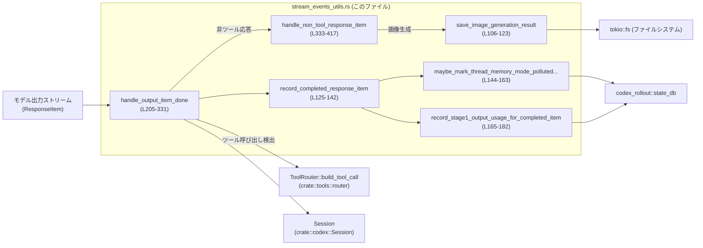
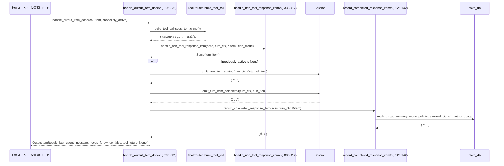

core/src/stream_events_utils.rs

---

## 0. ざっくり一言

このモジュールは、**モデルのストリーム出力（`ResponseItem`）を受け取り、会話履歴への保存・メモリ利用記録・ツール実行のキューイング・画像生成結果の保存・ユーザ向けテキストの抽出** を行うユーティリティ群です  
（`core/src/stream_events_utils.rs:L35-490`）。

---

## 1. このモジュールの役割

### 1.1 概要

- このモジュールは、**モデルからストリーミングされる各種 `ResponseItem` を処理するため**に存在し、次の機能を提供します。
  - 会話履歴（`Session`）への確定アイテムの保存と、メモリ関連の記録  
    （`record_completed_response_item` 系、`core/src/stream_events_utils.rs:L125-142`）
  - ツール呼び出しの検出と、ツール実行用 Future の組み立て  
    （`handle_output_item_done`、`L205-331`）
  - 通常メッセージ／推論／Web 検索／画像生成要求を内部 `TurnItem` に変換し、必要なら画像をファイルに保存  
    （`handle_non_tool_response_item`、`L333-417`）
  - モデルが出したテキストから、ユーザに見せないマークアップ（引用やプランブロック）を除去し、メモリ引用情報を解析  
    （`strip_hidden_assistant_markup*` 系、`L65-88`）
  - `ResponseInputItem` ⇔ `ResponseItem` の変換  
    （`response_input_to_response_item`、`L454-490`）

### 1.2 アーキテクチャ内での位置づけ

このファイルは、**モデル出力ストリームの 1 イテム分の終了処理**を担う層に位置し、`Session`・ツール実行ランタイム・状態 DB・ファイルシステムと連携します。



- `HandleOutputCtx` で `Session`・`TurnContext`・`ToolCallRuntime`・`CancellationToken` を束ね、`handle_output_item_done` がそれらを利用します  
  （`HandleOutputCtx` 定義 `L197-202`、`handle_output_item_done` 引数 `L205-209`）。
- ツール呼び出し有無の判定は `ToolRouter::build_tool_call` に委譲されています  
  （`L213-214`）。
- メモリ関連の状態は `codex_rollout::state_db` に記録されます  
  （`L157-162`, `L179-181`）。

### 1.3 設計上のポイント

- **非同期／並行処理指向**
  - 主要関数は `async fn` で実装されており、`tokio::fs` や DB 操作を非同期で行います  
    （例: `save_image_generation_result` `L106-123`, `handle_output_item_done` `L205-331`）。
  - ツール実行は `InFlightFuture`（`Future + Send`）として返し、呼び出し側で並行に待機できる設計です  
    （`InFlightFuture` `L187-188`, `OutputItemResult.tool_future` `L191-195`）。
  - `CancellationToken` の子トークンをツール実行に渡し、キャンセル制御を可能にしています  
    （`L231-233`）。

- **責務分割**
  - 「履歴への記録＋メモリ記録」は `record_completed_response_item` に集約  
    （`L125-142`）。
  - 「非ツール応答の `TurnItem` 化＋画像保存＋テキスト整形」は `handle_non_tool_response_item` に集約  
    （`L333-417`）。
  - 「テキストからの隠しマークアップ除去」は小さな純粋関数に分割  
    （`strip_hidden_assistant_markup` `L65-72`）。

- **安全なパス生成**
  - 画像ファイルの保存先は、セッション ID・コール ID をサニタイズして生成され、ファイルパスインジェクションを避ける構造です  
    （`image_generation_artifact_path` 内の `sanitize` 関数 `L42-57`）。

- **ガードレール／エラーハンドリング**
  - ツール呼び出しの不正（`MissingLocalShellCallId`）や「モデルにそのまま返すべきエラー」は、`FunctionCallError` を通じて明示的に扱い、会話履歴に記録します  
    （`handle_output_item_done` の `Err(...)` 分岐 `L275-327`）。
  - 画像生成のデコード失敗は `CodexErr::InvalidRequest` として表現されます  
    （`L112-116`）。

- **ユーザ非表示情報（隠しマークアップ）の整理**
  - 引用・プランブロックを削除したテキストをユーザ表示用としつつ、引用からメモリ ID を抽出して内部メモリ管理に利用します  
    （`strip_hidden_assistant_markup_and_parse_memory_citation` `L74-88`,  
    `record_stage1_output_usage_for_completed_item` `L165-182`）。

---

## 2. 主要な機能一覧

- ツール呼び出し処理:
  - `handle_output_item_done`: `ResponseItem` を解析し、ツール実行が必要かを判定し、必要なら実行用 Future を返す  
    （`L205-331`）。
- 非ツール応答の変換:
  - `handle_non_tool_response_item`: メッセージ／推論／Web 検索／画像生成を `TurnItem` に変換し、画像ファイルの保存や隠しマークアップ除去を行う  
    （`L333-417`）。
- 履歴・メモリ関連の記録:
  - `record_completed_response_item`: 完了した `ResponseItem` を履歴に保存し、メモリ汚染フラグ・ステージ1出力の利用状況を記録  
    （`L125-142`）。
- テキスト処理/抽出:
  - `raw_assistant_output_text_from_item`: `ResponseItem` からアシスタントテキストのみを抽出  
    （`L90-104`）。
  - `last_assistant_message_from_item`: ユーザに見える最終メッセージ（隠しマークアップ除去済み）を取り出す  
    （`L419-434`）。
- メモリ citation 処理:
  - `strip_hidden_assistant_markup_and_parse_memory_citation`: 隠しマークアップ除去とメモリ引用解析を同時に行う  
    （`L74-88`）。
  - `record_stage1_output_usage_for_completed_item`: メモリ citation から thread ID を抽出し、ステージ1出力の利用を state DB に記録  
    （`L165-182`）。
- 画像生成処理:
  - `image_generation_artifact_path`: 画像生成アーティファクトの保存パスを生成  
    （`L37-63`）。
  - `save_image_generation_result`: Base64 画像をデコードして上記パスに保存  
    （`L106-123`）。
- モデル I/O 変換:
  - `response_input_to_response_item`: `ResponseInputItem` を `ResponseItem` に変換（MCP を通常の FunctionCallOutput へ正規化）  
    （`L454-490`）。

---

## 3. 公開 API と詳細解説

### 3.1 型一覧（構造体・型エイリアスなど）

| 名前 | 種別 | 公開範囲 | 役割 / 用途 | 定義位置 |
|------|------|----------|------------|----------|
| `GENERATED_IMAGE_ARTIFACTS_DIR` | 定数 `&'static str` | モジュール内 | 画像生成結果を保存するサブディレクトリ名（`"generated_images"`） | `core/src/stream_events_utils.rs:L35-35` |
| `InFlightFuture<'f>` | 型エイリアス | `pub(crate)` | ツール実行中の非同期処理 (`Future<Output = Result<ResponseInputItem>> + Send`) を表す `Pin<Box<...>>` | `L187-188` |
| `OutputItemResult` | 構造体 | `pub(crate)` | `handle_output_item_done` の結果。最後のエージェントメッセージ文字列・後続処理が必要か・ツール実行 Future をまとめる | `L190-195` |
| `HandleOutputCtx` | 構造体 | `pub(crate)` | `Session`・`TurnContext`・ツールランタイム・キャンセルトークンをまとめたコンテキスト | `L197-202` |

※ `Session` や `TurnContext` などは他ファイルで定義されており、このチャンクには現れません（`use crate::codex::Session;` `L13`, `use crate::codex::TurnContext;` `L14`）。

### 3.2 関数詳細（主要 7 件）

#### `image_generation_artifact_path(codex_home: &Path, session_id: &str, call_id: &str) -> PathBuf`

**定義位置**: `core/src/stream_events_utils.rs:L37-63`

**概要**

- 画像生成のアーティファクトを保存する **ファイルパス** を構築します。
- セッション ID とコール ID をサニタイズし、安全なパスを生成します。

**引数**

| 引数名 | 型 | 説明 |
|--------|----|------|
| `codex_home` | `&Path` | Codex 全体のルートディレクトリ |
| `session_id` | `&str` | セッションを識別する ID（ファイル名に使用される） |
| `call_id` | `&str` | ツール／画像生成呼び出しの ID（ファイル名に使用される） |

**戻り値**

- `PathBuf`: `codex_home/generated_images/<session_id>/<call_id>.png` 形式のパス。  
  非英数字は `_` に置き換えられ、空文字は `"generated_image"` に置き換えられます（`sanitize` クロージャ `L42-57`）。

**内部処理の流れ**

1. ローカルクロージャ `sanitize` で文字列を走査し、英数字・`-`・`_` 以外を `_` に変換（`L42-51`）。
2. サニタイズ後が空の場合、`"generated_image"` に差し替え（`L53-55`）。
3. `codex_home.join("generated_images")` → サニタイズされた `session_id` → `"{call_id}.png"` の順で `join` し、`PathBuf` を返す（`L59-62`）。

**Examples（使用例）**

```rust
use std::path::Path;
use core::stream_events_utils::image_generation_artifact_path;

let home = Path::new("/var/lib/codex");                // Codex のホームディレクトリ
let session_id = "user-123";
let call_id = "img:1";                                 // `:` は `_` にサニタイズされる

let path = image_generation_artifact_path(home, session_id, call_id);
// 例: "/var/lib/codex/generated_images/user-123/img_1.png"
println!("{}", path.display());
```

**Errors / Panics**

- 本関数単体ではエラーも panic も発生しません。
- 生成されたパスは後続のファイル I/O で利用され、その時点で I/O エラーの可能性があります。

**Edge cases（エッジケース）**

- `session_id` や `call_id` が空文字列の場合、サニタイズ後 `"generated_image"` に置き換わります（`L53-55`）。
- 非 ASCII 文字（日本語など）はすべて `_` に置換されます（`ch.is_ascii_alphanumeric()` のみ許可、`L46-49`）。

**使用上の注意点**

- ユーザ入力が `session_id` / `call_id` に含まれていても、この関数によりパスとして安全な文字列になります（パス・トラバーサル防止に寄与）。
- 拡張子は固定で `.png` です（`L62`）。他形式のファイルを扱いたい場合は別途変更が必要です。

---

#### `save_image_generation_result(codex_home: &Path, session_id: &str, call_id: &str, result: &str) -> Result<PathBuf>`

**定義位置**: `core/src/stream_events_utils.rs:L106-123`

**概要**

- Base64 形式の画像データをデコードし、`image_generation_artifact_path` で決定されるパスに非同期で保存します。

**引数**

| 引数名 | 型 | 説明 |
|--------|----|------|
| `codex_home` | `&Path` | Codex ルートディレクトリ |
| `session_id` | `&str` | セッション ID |
| `call_id` | `&str` | 呼び出し ID |
| `result` | `&str` | Base64 エンコードされた画像データ文字列 |

**戻り値**

- `Result<PathBuf>`: 成功時は保存先パス。失敗時は `CodexErr` を返す（`Result` は `codex_protocol::error::Result` エイリアス、`L21-22`）。

**内部処理の流れ**

1. `result.trim().as_bytes()` を `BASE64_STANDARD.decode(..)` でデコード（`L112-113`）。
2. デコードエラー時は `CodexErr::InvalidRequest("invalid image generation payload: {err}")` に変換して返す（`L114-116`）。
3. `image_generation_artifact_path` で保存パスを構築（`L117`）。
4. 親ディレクトリが存在しない場合に備え、`tokio::fs::create_dir_all(parent).await?` で作成（`L118-120`）。
5. `tokio::fs::write(&path, bytes).await?` でファイルを書き出し（`L121`）。
6. `Ok(path)` を返す（`L122`）。

**Examples（使用例）**

```rust
use std::path::Path;
use core::stream_events_utils::save_image_generation_result;

#[tokio::main]
async fn main() -> codex_protocol::error::Result<()> {
    let codex_home = Path::new("/var/lib/codex");
    let session_id = "sess123";
    let call_id = "img1";
    let base64_png = "iVBORw0KGgoAAAANSUhEUgAA...";      // 省略: Base64 画像

    let saved_path = save_image_generation_result(codex_home, session_id, call_id, base64_png).await?;
    println!("saved to {}", saved_path.display());

    Ok(())
}
```

**Errors / Panics**

- Base64 デコード失敗 → `CodexErr::InvalidRequest(...)` として `Err`  
  （`L112-116`）。
- ディレクトリ作成やファイル書き込み時の I/O エラー → `?` によって `Result` の `Err` として呼び出し元へ伝播（`L118-121`）。
- panic の可能性はコード上ありません。

**Edge cases（エッジケース）**

- `result` が空文字列や空白のみ → Base64 デコードでエラーとなり `InvalidRequest` に変換されます。
- 非 PNG データもそのまま保存されます（拡張子 `.png` ですが、内容の検証は行っていません）。

**使用上の注意点**

- 大きな画像を多数保存するとディスク使用量が増えるため、上位レイヤでクリーンアップ方針が必要になります（このファイルでは未管理）。
- I/O は非同期 (`tokio::fs`) のため、必ず Tokio などのランタイム上で呼び出す必要があります。

---

#### `record_completed_response_item(sess: &Session, turn_context: &TurnContext, item: &ResponseItem)`

**定義位置**: `core/src/stream_events_utils.rs:L125-142`

**概要**

- 完了したモデル応答 (`ResponseItem`) を **会話履歴に保存**し、必要に応じて:
  - メールボックス配信を次ターンへ延期
  - Web 検索による「メモリ汚染」フラグの設定
  - ステージ1出力の利用状況を state DB に記録  
  を行います。

**引数**

| 引数名 | 型 | 説明 |
|--------|----|------|
| `sess` | `&Session` | 会話全体のセッションオブジェクト |
| `turn_context` | `&TurnContext` | 現在のターン固有コンテキスト |
| `item` | `&ResponseItem` | 完了したモデル応答アイテム |

**戻り値**

- なし（`()`）。失敗時も `Result` を返さず、内部で完結する設計です。

**内部処理の流れ**

1. `sess.record_conversation_items(turn_context, std::slice::from_ref(item)).await;`  
   → 応答アイテムを履歴に保存（`L131-132`）。
2. `completed_item_defers_mailbox_delivery_to_next_turn` でメールボックス配信延期の判定  
   （`L133-136`）。
3. 延期が必要な場合、`sess.defer_mailbox_delivery_to_next_turn(&turn_context.sub_id).await;` を呼ぶ（`L137-138`）。
4. `maybe_mark_thread_memory_mode_polluted_from_web_search(sess, turn_context, item).await;`  
   → Web 検索によるメモリモード汚染フラグの更新（`L140`）。
5. `record_stage1_output_usage_for_completed_item(turn_context, item).await;`  
   → メモリ citation に基づくステージ1出力利用記録を DB に保存（`L141`）。

**Examples（使用例）**

```rust
async fn on_response_completed(
    sess: &Session,
    turn_ctx: &TurnContext,
    item: &ResponseItem,
) {
    // 応答が「完了した」と判断したタイミングで呼び出す
    record_completed_response_item(sess, turn_ctx, item).await;
}
```

**Errors / Panics**

- `Session` や `state_db` 内部でエラーが起きる可能性はありますが、この関数自体は `Result` を返さず、呼び出し側へは伝播しません。
- panic はコード上からは読み取れません（`unwrap` 等は未使用）。

**Edge cases（エッジケース）**

- `item` がアシスタント最終メッセージでない場合、`completed_item_defers_mailbox_delivery_to_next_turn` は `false` となり、メールボックス配信延期は行われません  
  （判定ロジックは `completed_item_defers_mailbox_delivery_to_next_turn` `L436-451` を参照）。
- `state_db` が取得できない場合（`get_state_db` が `None` を返す）でも、処理は静かにスキップされます  
  （`record_stage1_output_usage_for_completed_item` 内 `L179-181`）。

**使用上の注意点**

- この関数は **「完了した」`ResponseItem` に対してのみ** 呼ぶ前提の設計です。部分的なストリームチャンクに対して呼ぶと、履歴・メモリ記録が意図しない形になる可能性があります。
- エラーが呼び出し元に伝播しないため、ログや telemetry での監視が重要です（state DB 側の関数がどうログするかはこのチャンクには現れません）。

---

#### `handle_output_item_done(ctx: &mut HandleOutputCtx, item: ResponseItem, previously_active_item: Option<TurnItem>) -> Result<OutputItemResult>`

**定義位置**: `core/src/stream_events_utils.rs:L205-331`

**概要**

- モデルストリームからの **1 つの完了済み `ResponseItem`** を処理する中核関数です。
- ツール呼び出しかどうかを判定し:
  - ツール呼び出しならツール実行用 Future を組み立てて返す
  - そうでなければ `TurnItem` に変換して完了イベントを発火し、履歴に保存
  - 特定の `FunctionCallError` は会話履歴用のメッセージとして書き戻す  
  という振る舞いを行います。

**引数**

| 引数名 | 型 | 説明 |
|--------|----|------|
| `ctx` | `&mut HandleOutputCtx` | セッション／ターン／ツールランタイム／キャンセルトークンを含むコンテキスト（`L197-202`） |
| `item` | `ResponseItem` | モデルからの完了済み出力アイテム |
| `previously_active_item` | `Option<TurnItem>` | すでに「進行中」として扱われている `TurnItem`（画像生成など）の有無 |

**戻り値**

- `Result<OutputItemResult>`:
  - `Ok(OutputItemResult)`:
    - `last_agent_message`: ユーザに提示すべきアシスタント最終メッセージ（隠しマークアップ除去済み）。非ツールパスでのみ設定されます（`L270-272`）。
    - `needs_follow_up`: ツール実行やエラー応答のために、後続のモデル呼び出しが必要かどうか（`tool_future` がある場合やエラー応答が履歴に追加された場合に `true`）。
    - `tool_future`: ツール呼び出しが必要な場合、その実行を表す `InFlightFuture<'static>`（`L231-239`）。
  - `Err(CodexErr::Fatal(..))`: ツール側の致命的エラーにより処理継続不能な場合（`L325-327`）。

**内部処理の流れ（アルゴリズム）**

1. `OutputItemResult::default()` で出力構造体を初期化（`L210`）。
2. `plan_mode` を `TurnContext` の `collaboration_mode.mode == ModeKind::Plan` から判定（`L211`）。
3. `ToolRouter::build_tool_call(ctx.sess.as_ref(), item.clone()).await` を呼び、`item` がツール呼び出しかどうか判定（`L213-214`）。

   - **`Ok(Some(call))`（ツール呼び出し）: `L215-240`**
     1. `sess.accept_mailbox_delivery_for_current_turn` を呼び、メールボックス配信をこのターンで受け入れ（`L216-218`）。
     2. `call.payload.log_payload()` でツール呼び出し内容をログに残す（`tracing::info!`、`L220-226`）。
     3. `record_completed_response_item` で `item` を履歴とメモリ記録に反映（`L228-229`）。
     4. `ctx.cancellation_token.child_token()` を生成し、`ToolCallRuntime::handle_tool_call` に渡す形で `tool_future` を組み立てる（`L231-236`）。
     5. `needs_follow_up = true`, `tool_future = Some(...)` を設定（`L238-239`）。

   - **`Ok(None)`（非ツール応答）: `L241-273`**
     1. `handle_non_tool_response_item` で `ResponseItem` を `TurnItem` に変換（`L243-249`）。
     2. `Some(turn_item)` の場合:
        - まだ進行中アイテムがない場合 (`previously_active_item.is_none()`)、画像生成 `TurnItem` なら状態を `"in_progress"` に変更し、一時的に結果をクリアした `started_item` を `emit_turn_item_started` に送る（`L251-258`, `L259-261`）。
        - いずれにせよ `emit_turn_item_completed` を呼んで完了イベントを送出（`L264-266`）。
     3. `record_completed_response_item` で履歴保存・メモリ記録（`L268-269`）。
     4. `last_assistant_message_from_item` でユーザ向け最終メッセージを抽出し、`output.last_agent_message` に設定（`L270-272`）。

   - **`Err(FunctionCallError::MissingLocalShellCallId)` ガードレール: `L275-301`**
     1. メッセージ `"LocalShellCall without call_id or id"` を作成（`L276`）。
     2. `session_telemetry.log_tool_failed("local_shell", msg)` と `tracing::error!(msg)` で記録（`L277-280`）。
     3. `ResponseInputItem::FunctionCallOutput` を組み立て、`record_completed_response_item` で元の `item` を確定（`L282-289`）。
     4. `response_input_to_response_item` 経由で `ResponseItem` に変換し、会話履歴に追加（`L291-298`）。
     5. `needs_follow_up = true` を設定（`L300`）。

   - **`Err(FunctionCallError::RespondToModel(message))`: `L303-323`**
     1. `message` を本文とする `FunctionCallOutput` を作成（`L304-310`）。
     2. `record_completed_response_item` で元 `item` を確定（`L311-312`）。
     3. 変換後 `ResponseItem` を会話履歴に追加（`L313-320`）。
     4. `needs_follow_up = true` を設定（`L322`）。

   - **`Err(FunctionCallError::Fatal(message))`: `L325-327`**
     1. `CodexErr::Fatal(message)` として `Err` を返し、呼び出し元に致命的エラーを伝播。

4. 最終的な `output` を `Ok(output)` として返す（`L330`）。

**Examples（使用例）**

```rust
use crate::core::stream_events_utils::{HandleOutputCtx, handle_output_item_done};
use codex_protocol::models::ResponseItem;
use codex_protocol::items::TurnItem;

async fn process_stream_item(
    ctx: &mut HandleOutputCtx,                  // セッション/ターンコンテキストなどを事前に構築しておく
    item: ResponseItem,
    previously_active: Option<TurnItem>,
) -> codex_protocol::error::Result<()> {
    let result = handle_output_item_done(ctx, item, previously_active).await?;

    if let Some(tool_future) = result.tool_future {
        // ツール実行が必要。必要に応じて並行に実行する
        let next_input: ResponseInputItem = tool_future.await?;
        // next_input を使って次のモデル呼び出しを行う等、上位で処理する
    }

    if let Some(msg) = result.last_agent_message {
        // ユーザ向けに表示する
        println!("Assistant: {}", msg);
    }

    if result.needs_follow_up {
        // 追加のモデル呼び出しなど follow up の判断材料にする
    }

    Ok(())
}
```

**Errors / Panics**

- 戻り値の `Result` を通じて:
  - `FunctionCallError::Fatal` → `CodexErr::Fatal` にラップされ `Err` として返されます（`L325-327`）。
- それ以外のケース（ツール呼び出し/非ツール応答/ガードレールエラー）は `Ok` が返ります。
- panic を引き起こす `unwrap` 等は使われておらず、この関数内での panic の可能性は読み取れません。

**Edge cases（エッジケース）**

- `ToolRouter::build_tool_call` が `Ok(None)` を返した場合、`item` がツール関連の `ResponseItem` だったとしても、`handle_non_tool_response_item` 側でフィルタされ、`TurnItem` が生成されないことがあります（`L409-413`）。
- `handle_non_tool_response_item` が `None` を返すと、`emit_turn_item_started` / `emit_turn_item_completed` は呼ばれませんが、`record_completed_response_item` は呼ばれます（`L243-269`）。
- `last_assistant_message_from_item` は `ResponseItem::Message` の `assistant` ロールのみを対象にするため、他の種類の応答では常に `None` になります（`raw_assistant_output_text_from_item` の実装 `L90-104`）。

**使用上の注意点**

- `handle_output_item_done` は **ストリームの「1 アイテムが終わったタイミング」**で呼び出す設計です。トークン単位の細かいチャンクには直接使わない前提です。
- 返された `tool_future` は **必ずどこかで `await` する**必要があります。無視するとツールが実行されず、`needs_follow_up` は `true` のままになります。
- `ctx` に格納される `Session`・`TurnContext` は `Arc` で共有されており、`tool_future` 内でも安全に参照される想定ですが、詳細は `ToolCallRuntime` 側の実装に依存します（このチャンクには現れません）。

---

#### `handle_non_tool_response_item(sess: &Session, turn_context: &TurnContext, item: &ResponseItem, plan_mode: bool) -> Option<TurnItem>`

**定義位置**: `core/src/stream_events_utils.rs:L333-417`

**概要**

- ツール呼び出しでない `ResponseItem` を、内部表現である `TurnItem` に変換します。
- エージェントメッセージについては、**隠しマークアップを除去し、メモリ citation を構造化**して保持します。
- 画像生成呼び出しについては、実際に画像を保存し、その保存先パスを `TurnItem` に埋め込みます。

**引数**

| 引数名 | 型 | 説明 |
|--------|----|------|
| `sess` | `&Session` | セッションハンドラ |
| `turn_context` | `&TurnContext` | ターンコンテキスト（設定・パス情報など） |
| `item` | `&ResponseItem` | モデルからの応答アイテム |
| `plan_mode` | `bool` | コラボレーションモードが `ModeKind::Plan` かどうか |

**戻り値**

- `Option<TurnItem>`:
  - 対応可能な `ResponseItem` なら `Some(TurnItem)`。
  - 対応不可能な種類（例: ツール出力）は `None` を返します（`L409-415`）。

**内部処理の流れ**

1. デバッグログ出力 `debug!(?item, "Output item");`（`L339`）。
2. `match item` で `ResponseItem` のバリアントごとに処理分岐（`L341-416`）。

   - **対応するバリアント群**:  
     `Message` / `Reasoning` / `WebSearchCall` / `ImageGenerationCall`（`L342-345`）
     1. `parse_turn_item(item)?` で `TurnItem` に変換（`L346`）。失敗した場合は `None` を返して早期終了（`?` 演算子により）。
     2. `TurnItem::AgentMessage` の場合:
        - `agent_message.content` ベクタを走査し、`AgentMessageContent::Text { text }` を全て結合（`L348-354`）。
        - `strip_hidden_assistant_markup_and_parse_memory_citation` で隠しマークアップを除去し、メモリ citation を解析（`L355-356`）。
        - 結果文字列のみを 1 要素の Text コンテンツとして再設定し、`agent_message.memory_citation` に解析結果を格納（`L357-359`）。
     3. `TurnItem::ImageGeneration` の場合:
        - `session_id` を `sess.conversation_id.to_string()` から得る（`L362`）。
        - `save_image_generation_result` で画像保存を試行（`L363-368`）。
          - **成功時**（`Ok(path)`、`L371-389`）:
            - `image_item.saved_path` に保存パス文字列を設定（`L372-373`）。
            - ユーザ向けではなく**開発者指示**として、「生成画像はデフォルトでどこに保存されるか」「コピーして使い、元ファイルは削除しないこと」を説明する `DeveloperInstructions` メッセージを作成し、会話履歴に追加（`L374-388`）。
          - **失敗時**（`Err(err)`、`L390-404`）:
            - 期待される出力パスとディレクトリを計算し（`L391-397`）、`tracing::warn!` で失敗をログ出力（`L399-403`）。
     4. 最終的な `turn_item` を `Some(turn_item)` として返す（`L407`）。

   - **ツール出力系**: `FunctionCallOutput` / `CustomToolCallOutput` / `ToolSearchOutput`（`L409-413`）
     - `debug!("unexpected tool output from stream");` を出し、`None` を返す。

   - **それ以外**: `_ => None`（`L415`）

**Examples（使用例）**

```rust
async fn convert_and_emit(
    sess: &Session,
    turn_ctx: &TurnContext,
    item: &ResponseItem,
    plan_mode: bool,
) {
    if let Some(turn_item) = handle_non_tool_response_item(sess, turn_ctx, item, plan_mode).await {
        // ここで turn_item を UI や他コンポーネントに渡して利用できる
        println!("Turn item: {:?}", turn_item);
    } else {
        // 非対応の ResponseItem だった場合
        println!("Ignored ResponseItem");
    }
}
```

**Errors / Panics**

- `save_image_generation_result` 内で `Result` が返りますが、本関数内では `match` で明示的に処理され、`handle_non_tool_response_item` 自体は `Result` を返しません（`L363-405`）。
- `parse_turn_item(item)?` によって `None` が返る可能性がありますが、これは `Option` を通じて呼び出し元に伝わるのみです（`L346`）。
- `unwrap` などによる panic は使用していません。  
  - 例外は、`image_output_path.parent().unwrap_or(...)` ですが、`PathBuf::parent()` が `None` を返すケースを `unwrap_or` でカバーしているため panic はしません（`L378-380`, `L396-398`）。

**Edge cases（エッジケース）**

- `AgentMessage` の content に `Text` 以外のバリアントが追加された場合、`match entry` の分岐がコンパイルエラーになるか、変更が必要になる可能性があります（現在は `Text` のみを前提、`L351-353`）。  
  このチャンクには他の variant は現れません。
- `save_image_generation_result` が失敗した場合でも `TurnItem::ImageGeneration` は返されますが、`saved_path` は `None` のままです（`L390-405`）。
- `DeveloperInstructions` によるメッセージは `ResponseItem` として会話履歴に追加されますが、その表示方法（ユーザに見えるかどうか）はこのチャンクからは不明です（`L381-388`）。

**使用上の注意点**

- ツール出力系 `ResponseItem`（FunctionCallOutput, CustomToolCallOutput, ToolSearchOutput）は `None` を返すため、ツールパスの処理は必ず `handle_output_item_done` を通して行う前提です。
- `plan_mode` が `true` の場合、プラン用マークアップが除去されるため、モデルにプランをそのまま見せたい場合はこの関数を経由しない利用パスを設計する必要があります（`strip_hidden_assistant_markup_and_parse_memory_citation` 内 `L81-86`）。

---

#### `last_assistant_message_from_item(item: &ResponseItem, plan_mode: bool) -> Option<String>`

**定義位置**: `core/src/stream_events_utils.rs:L419-434`

**概要**

- `ResponseItem` からユーザ向けに表示する **最後のアシスタントメッセージ文字列**を抽出します。
- 引用やプランブロックなどの隠しマークアップを除去し、空であれば `None` を返します。

**引数**

| 引数名 | 型 | 説明 |
|--------|----|------|
| `item` | `&ResponseItem` | 対象の応答アイテム |
| `plan_mode` | `bool` | プランモードかどうか（隠しマークアップ除去方法に影響） |

**戻り値**

- `Option<String>`:  
  - 有効なメッセージがある場合は、そのテキスト（隠しマークアップ除去済み）。  
  - それ以外は `None`。

**内部処理の流れ**

1. `raw_assistant_output_text_from_item(item)` で `assistant` ロールのテキストを全結合（`L423` / `L90-104`）。
2. 取得できなければ `None` を返す（`L423, L433`）。
3. 結合結果が空文字列なら `None`（`L424-426`）。
4. `strip_hidden_assistant_markup(&combined, plan_mode)` で citation やプランブロックを削除（`L427` / `L65-72`）。
5. `stripped.trim().is_empty()` なら、ユーザに見える内容が何もないと判断し `None`（`L428-430`）。
6. それ以外の場合は `Some(stripped)` を返す（`L431`）。

**Examples（使用例）**

```rust
fn display_if_any(item: &ResponseItem, plan_mode: bool) {
    if let Some(text) = last_assistant_message_from_item(item, plan_mode) {
        println!("Assistant: {}", text);
    }
}
```

**Errors / Panics**

- エラー型は返さず、panic を発生させるコードもありません。

**Edge cases（エッジケース）**

- `ResponseItem` が `Message` 以外（例: `ImageGenerationCall`）の場合、`raw_assistant_output_text_from_item` が `None` を返し、結果として `None` になります（`L90-104`）。
- `assistant` ロールのメッセージでも、テキスト部分が全て citation やプランブロックのみで構成されている場合、最終的には `None` になります（`L427-430`）。

**使用上の注意点**

- この関数は「ユーザに見えるテキストがあるかどうか」の判定にも使われており、メールボックス配信の遅延判定にも影響します（`completed_item_defers_mailbox_delivery_to_next_turn` `L446-448`）。

---

#### `response_input_to_response_item(input: &ResponseInputItem) -> Option<ResponseItem>`

**定義位置**: `core/src/stream_events_utils.rs:L454-490`

**概要**

- 上位レイヤから渡される `ResponseInputItem` を、内部で扱う `ResponseItem` に変換します。
- MCP ツール出力など、一部の形式を通常の FunctionCallOutput に正規化します。

**引数**

| 引数名 | 型 | 説明 |
|--------|----|------|
| `input` | `&ResponseInputItem` | 変換対象となる入力アイテム |

**戻り値**

- `Option<ResponseItem>`:
  - 対応する variant の場合は `Some(ResponseItem)`。
  - 対応外の variant は `None`。

**内部処理の流れ**

1. `match input` で variant ごとに分岐（`L455-489`）:
   - `FunctionCallOutput { call_id, output }` → そのまま `ResponseItem::FunctionCallOutput { call_id.clone(), output.clone() }` に変換（`L456-460`）。
   - `CustomToolCallOutput { call_id, name, output }` → 同名フィールドを持つ `ResponseItem::CustomToolCallOutput` に変換（`L462-470`）。
   - `McpToolCallOutput { call_id, output }` →  
     `output.as_function_call_output_payload()` で `FunctionCallOutputPayload` に変換し、`ResponseItem::FunctionCallOutput` として扱う（`L471-476`）。
   - `ToolSearchOutput { call_id, status, execution, tools }` → `ResponseItem::ToolSearchOutput` に変換。`call_id` は `Some(call_id.clone())` で必ず `Some` にする（`L478-487`）。
   - その他 → `None`（`L489`）。

**Examples（使用例）**

```rust
fn normalize_input(input: &ResponseInputItem) {
    if let Some(resp_item) = response_input_to_response_item(input) {
        // 以降のパイプラインは ResponseItem 前提で動かせる
        println!("Normalized response item: {:?}", resp_item);
    }
}
```

**Errors / Panics**

- 戻り値は `Option` であり、エラー型は使っていません。
- panic を起こすコードは含まれていません。

**Edge cases（エッジケース）**

- MCP ツール出力は常に通常の `FunctionCallOutput` として扱われるため、元の MCP 固有の構造は `as_function_call_output_payload()` 実装に依存します（`L471-476`）。この詳細はこのチャンクには現れません。
- `ToolSearchOutput` の `call_id` は `Option` ですが、この変換で必ず `Some` にラップされます（`L484-485`）。

**使用上の注意点**

- `ResponseInputItem` の variant が増えた場合、ここを更新しないと新 variant が無視される（`None`）ことになります。
- `response_input_to_response_item` 自体は純粋な変換ロジックなので、I/O や DB に依存しません。

---

#### `strip_hidden_assistant_markup(text: &str, plan_mode: bool) -> String`

**定義位置**: `core/src/stream_events_utils.rs:L65-72`

**概要**

- アシスタントメッセージ中の **citation とプラン用ブロックを除去**したテキストを返します。

**引数**

| 引数名 | 型 | 説明 |
|--------|----|------|
| `text` | `&str` | 元のメッセージテキスト |
| `plan_mode` | `bool` | プランモードかどうか（プランブロック除去の有無に影響） |

**戻り値**

- citation と（`plan_mode == true` のとき）プランブロックを除去した `String`。

**内部処理の流れ**

1. `strip_citations(text)` で citation を除去し、テキストと citation 情報のタプルを得る（citation 情報は捨てる）（`L66`）。
2. `plan_mode` が `true` なら `strip_proposed_plan_blocks(&without_citations)` を呼び、プランブロックを除去（`L67-69`）。
3. そうでなければ citation 削除済みテキストをそのまま返す（`L69-71`）。

**使用上の注意点**

- citation 情報は返さないため、メモリ citation 解析をしたい場合は `strip_hidden_assistant_markup_and_parse_memory_citation` を使う必要があります（`L74-88`）。

---

#### `strip_hidden_assistant_markup_and_parse_memory_citation(...) -> (String, Option<MemoryCitation>)`

**定義位置**: `core/src/stream_events_utils.rs:L74-88`

**概要**

- `strip_hidden_assistant_markup` と同様に citation / プランブロックを除去したテキストを返すと同時に、citation 情報からメモリ citation を解析して返します。

**引数 / 戻り値**

- 引数は `text: &str`, `plan_mode: bool`（`L75-76`）。
- 戻り値は `(String, Option<MemoryCitation>)`。`MemoryCitation` 型は `codex_protocol::memory_citation` からのものですが、このチャンクには定義が現れません（`L79`）。

**内部処理の流れ**

1. `strip_citations(text)` で citation を除去し、citation 情報を保持（`L81`）。
2. `plan_mode` に応じてプランブロックを除去（`L82-86`）。
3. citation 情報を `parse_memory_citation(citations)` に渡して `Option<MemoryCitation>` を得る（`L87`）。
4. `(visible_text, memory_citation)` を返す。

**使用上の注意点**

- citation からどのように `MemoryCitation` が構築されるかは `parse_memory_citation` の実装に依存し、このチャンクには現れません（`use crate::memories::citations::parse_memory_citation;` `L16-17`）。

---

### 3.3 その他の関数

| 関数名 | 役割（1 行） | 定義位置 |
|--------|--------------|----------|
| `raw_assistant_output_text_from_item` | `ResponseItem::Message` かつ `role == "assistant"` の Text コンテンツを全結合して返す | `core/src/stream_events_utils.rs:L90-104` |
| `maybe_mark_thread_memory_mode_polluted_from_web_search` | Web 検索呼び出しが行われた場合に、設定に応じてスレッドのメモリモードを「汚染」とマークする | `L144-163` |
| `record_stage1_output_usage_for_completed_item` | アシスタントメッセージから citation を抽出し、stage1 出力の利用を state DB に記録する | `L165-182` |
| `completed_item_defers_mailbox_delivery_to_next_turn` | 応答アイテムがメールボックス配信を次ターンに延期すべきかどうかを判定する | `L436-451` |

---

## 4. データフロー

ここでは、**非ツール応答**を処理する典型シナリオのデータフローを示します（`handle_output_item_done (L205-331)` を中心）。

### 処理の要点

- モデルが `ResponseItem::Message`（assistant ロール）を返したとき、`handle_output_item_done` はツール呼び出しでないと判定すると、次の処理を行います。
  - `handle_non_tool_response_item` で `TurnItem` に変換、必要なら画像保存やメモリ citation 設定。
  - `Session` 経由で `emit_turn_item_started` / `emit_turn_item_completed` を発火。
  - `record_completed_response_item` 経由で履歴保存とメモリ関連記録。
  - ユーザ向けテキストを `last_assistant_message_from_item` で抽出し、呼び出し元に返す。

### シーケンス図（非ツール応答パス）



ツール呼び出しパスの場合は、`TR` が `Ok(Some(call))` を返し、その後 `ToolCallRuntime::handle_tool_call` への Future 作成と `needs_follow_up = true` の設定が行われます（`L215-240`）。

---

## 5. 使い方（How to Use）

### 5.1 基本的な使用方法

代表的な使い方は、「モデルからストリームで `ResponseItem` を受信するループ」の中で `handle_output_item_done` を呼び出す形です。

```rust
use std::sync::Arc;
use codex_protocol::models::ResponseItem;
use codex_protocol::items::TurnItem;
use crate::core::stream_events_utils::{
    HandleOutputCtx,
    OutputItemResult,
    handle_output_item_done,
};
use crate::codex::{Session, TurnContext};
use crate::tools::parallel::ToolCallRuntime;
use tokio_util::sync::CancellationToken;

async fn run_stream_loop(
    sess: Arc<Session>,
    turn_ctx: Arc<TurnContext>,
    tool_runtime: ToolCallRuntime,
) -> codex_protocol::error::Result<()> {
    let cancellation_token = CancellationToken::new();

    let mut ctx = HandleOutputCtx {              // L197-202
        sess,
        turn_context: turn_ctx,
        tool_runtime,
        cancellation_token,
    };

    let mut previously_active: Option<TurnItem> = None;

    // ここで ResponseItem をストリームから順次受け取る想定
    while let Some(item) = next_response_item().await {
        let OutputItemResult {
            last_agent_message,
            needs_follow_up,
            tool_future,
        } = handle_output_item_done(&mut ctx, item, previously_active.clone()).await?;

        if let Some(tool_future) = tool_future {
            // ツール実行を非同期で進める例（単純化のため直列に await）
            let next_input = tool_future.await?;
            // next_input を使って次のモデル呼び出しを行うなど、上位で処理
        }

        if let Some(msg) = last_agent_message {
            println!("Assistant: {}", msg);
        }

        if !needs_follow_up {
            break; // ターンを終了するなど
        }
    }

    Ok(())
}
```

※ `next_response_item()` はこのチャンクには現れない仮想関数です。

### 5.2 よくある使用パターン

1. **ツール呼び出しが発生した場合**
   - `OutputItemResult.tool_future` が `Some(fut)` となり、`needs_follow_up` が `true`（`L238-239`）。
   - 呼び出し側は `fut.await` して `ResponseInputItem` を取得し、次のモデル呼び出しの入力に組み込みます。

2. **通常のアシスタント最終回答の場合**
   - `tool_future` は `None`、`last_agent_message` に最終回答テキストが入る（`L270-272`）。
   - `needs_follow_up` は状況により変化しますが、ツール呼び出しやエラーがなければ `false` になる想定です（このチャンク内では明示的に `false` 代入はしておらず、デフォルト値から変更されない）。

3. **ツール呼び出しのミス（`MissingLocalShellCallId`）や「モデルに返すべきエラー」**
   - `needs_follow_up = true` になり（`L300`, `L322`）、会話履歴には `FunctionCallOutput` 経由でエラーメッセージが追加されます（`L282-288`, `L304-310`）。

### 5.3 よくある間違い

```rust
// 間違い例: tool_future を無視する
let result = handle_output_item_done(&mut ctx, item, None).await?;
// result.tool_future を await していないため、ツールが実行されない可能性がある

// 正しい例: tool_future を必ず処理する
let result = handle_output_item_done(&mut ctx, item, None).await?;
if let Some(fut) = result.tool_future {
    let next_input = fut.await?;
    // ここで next_input を使ってモデルを呼び出す等の follow up を行う
}
```

```rust
// 間違い例: plan_mode を無視して自前でテキストを結合する
if let ResponseItem::Message { content, .. } = &item {
    let text = content.iter().map(|c| format!("{:?}", c)).collect::<String>();
    println!("{}", text); // citation やプランブロックがそのまま表示される可能性

// 正しい例: last_assistant_message_from_item を利用する
if let Some(text) = last_assistant_message_from_item(&item, plan_mode) {
    println!("{}", text); // 隠しマークアップ除去済み
}
```

### 5.4 使用上の注意点（まとめ）

- **非同期コンテキスト必須**:
  - `save_image_generation_result`, `handle_output_item_done`, `handle_non_tool_response_item`, `record_completed_response_item` などは `async fn` であり、Tokio などのランタイム上で呼び出す必要があります（`L106`, `L125`, `L205`, `L333`）。

- **キャンセルの扱い**:
  - ツール実行は `CancellationToken::child_token()` によってキャンセル制御される設計です（`L231-233`）。上位で親トークンをキャンセルすれば、ツール実行 Future もキャンセルされることが期待されます。

- **メモリ／プライバシー**:
  - Web 検索呼び出しがあった場合、設定によりスレッドメモリモードが「汚染」とマークされ、以降のメモリ利用が制限される可能性があります（`maybe_mark_thread_memory_mode_polluted_from_web_search` `L144-163`）。  
    これはユーザデータ保護や外部情報の扱いに関するポリシーに関係します。

- **セキュリティ（パス安全性）**:
  - 画像保存パスは `image_generation_artifact_path` でサニタイズされているため、パス・トラバーサル攻撃に対して一定の防御があります（`L42-57`）。

---

## 6. 変更の仕方（How to Modify）

### 6.1 新しい機能を追加する場合

例: 新しい `ResponseItem` バリアント（例えば「コード実行結果」など）を追加する場合。

1. **`ResponseItem` → `TurnItem` への変換ロジックを追加**
   - `handle_non_tool_response_item` の `match item` 部分に新バリアントを追加し、`parse_turn_item` と組み合わせて `TurnItem` を生成します（`L341-407`）。

2. **メールボックス配信の扱いを調整**
   - 新バリアントが「ユーザに届く最終回答」に相当するなら、`completed_item_defers_mailbox_delivery_to_next_turn` に条件を追加し、メールボックス配信を次ターンへ延期するかのポリシーを定めます（`L436-451`）。

3. **メモリ／ステージ1出力への影響を検討**
   - 新バリアントがアシスタントテキストを含む場合、`raw_assistant_output_text_from_item` と `record_stage1_output_usage_for_completed_item` にも対応を追加する必要があります（`L90-104`, `L165-182`）。

4. **テストの追加**
   - `mod tests;` で外部テストモジュールが参照されているため（`L493-495`）、`stream_events_utils_tests.rs` に新バリアントに対応したテストケースを追加します（このチャンクには内容は現れません）。

### 6.2 既存の機能を変更する場合

- **契約（前提条件・返り値の意味）の確認**
  - `handle_output_item_done` は「ツール呼び出しの場合は `tool_future` がセットされる」という契約を前提として上位コードから利用される可能性があります。`needs_follow_up` や `last_agent_message` の意味を変えるときは、呼び出し側の影響範囲を調査する必要があります。
  - `response_input_to_response_item` が MCP 出力を FunctionCallOutput として正規化している点（`L471-476`）を変更すると、下流のツール結果処理ロジックが影響を受けます。

- **DB・外部リソースへの影響**
  - `record_stage1_output_usage_for_completed_item` や `maybe_mark_thread_memory_mode_polluted_from_web_search` は state DB への書き込みを行うため（`L157-162`, `L179-181`）、スキーマやパフォーマンスへの影響を考慮する必要があります。

- **エラーハンドリングの一貫性**
  - 現状、致命的なツールエラーのみ `Err(CodexErr::Fatal)` として返され、それ以外は履歴に埋め込まれる設計です（`L275-327`）。このポリシーを変更すると、上位の再試行ロジックや UI 表示に影響します。

---

## 7. 関連ファイル

| パス / モジュール | 役割 / 関係 |
|-------------------|------------|
| `crate::codex::Session` | 会話履歴の記録 (`record_conversation_items`)、ターンアイテムの開始／完了イベント送出、メールボックス配信制御を提供（`use crate::codex::Session;` `L13`, 使用箇所 `L131-138`, `L216-218`, `L259-266` など）。 |
| `crate::codex::TurnContext` | コラボレーションモード（`collaboration_mode.mode`）、設定 (`config`)、サブ ID (`sub_id`)、telemetry (`session_telemetry`) などターン固有情報を保持（`L14`, 使用箇所多数: `L133-136`, `L149-152`, `L165-181`, `L276-280` など）。 |
| `crate::tools::router::ToolRouter` | `ToolRouter::build_tool_call` を通じて、`ResponseItem` からツール呼び出し構造を構築（`L20`, `L213-214`）。 |
| `crate::tools::parallel::ToolCallRuntime` | `handle_output_item_done` 内でツール実行 Future (`handle_tool_call`) を生成するランタイム（`L19`, `L231-236`）。 |
| `crate::memories::citations` モジュール | `get_thread_id_from_citations` / `parse_memory_citation` を提供し、メモリ citation を解析（`L16-17`, 使用箇所 `L174`, `L87`）。 |
| `codex_utils_stream_parser` | `strip_citations` / `strip_proposed_plan_blocks` により、モデルテキストから citation・プランブロックを除去（`L10`, `L30`, 使用箇所 `L65-66`, `L81-83`）。 |
| `codex_rollout::state_db` | スレッドメモリモードの汚染フラグ設定と、ステージ1出力利用記録の DB I/O を提供（`L29`, 使用箇所 `L157-162`, `L179-181`）。 |
| `core/src/stream_events_utils_tests.rs` | `mod tests;` で参照されるテストモジュール。具体的なテスト内容はこのチャンクには現れません（`L493-495`）。 |

このレポートは、`core/src/stream_events_utils.rs` に含まれるコードのみを根拠としており、それ以外のファイルの実装詳細は「このチャンクには現れない」ため不明です。
