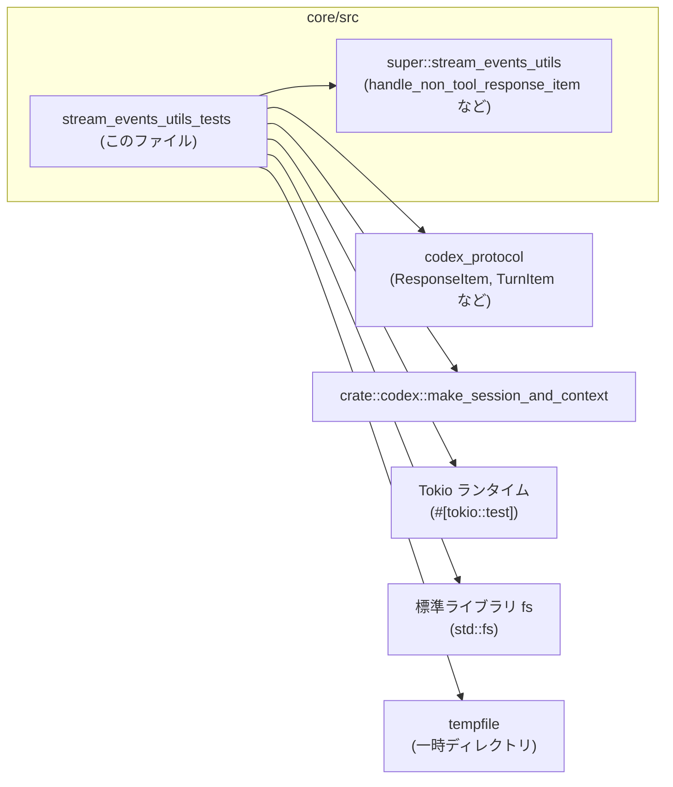
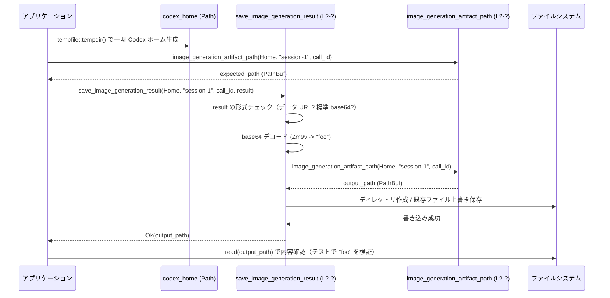

core/src/stream_events_utils_tests.rs

---

## 0. ざっくり一言

このファイルは、ストリームイベント処理用ユーティリティ（親モジュールの `handle_non_tool_response_item` など）が期待どおりに動くかを検証するテスト群です。  
特に、アシスタントメッセージからの引用タグ・プランブロックの除去、および画像生成結果のファイル保存ロジック（base64 検証・パスサニタイズ）の振る舞いを確認しています。

> 行番号情報はチャンクに含まれていないため、本レポートでは根拠として `core/src/stream_events_utils_tests.rs:L?-?` のように「ファイル単位」でのみ示します。

---

## 1. このモジュールの役割

### 1.1 概要

- このテストモジュールは、ストリーミングレスポンス処理ユーティリティが **以下の契約を満たしているか** を検証します。
  - アシスタントメッセージの本文から、独自タグ（`<oai-mem-citation>`、`<proposed_plan>`）を安全に取り除きつつ、関連メタデータを構造化して保持すること。
  - `ResponseItem` の種類・フェーズに応じて、メールボックス（メッセージ配送）を「次ターンに繰り延べるかどうか」を判定すること。
  - 画像生成の結果文字列から **標準 base64 のみ** を受け付け、Codex ホームディレクトリ配下に安全なパスで PNG を保存すること。

### 1.2 アーキテクチャ内での位置づけ

このファイルは「テストモジュール」であり、親モジュールのユーティリティ関数のふるまいを検証する立場にあります。依存関係は概ね次のようになります。



- `super::...` として親モジュールのユーティリティを import しており、このファイル自身はその利用者（テストコード）です（`core/src/stream_events_utils_tests.rs:L?-?`）。
- `codex_protocol` の `ResponseItem`, `TurnItem`, `ContentItem`, `MessagePhase` と連携し、ストリームイベントの構造を前提にテストを組んでいます。
- ファイル I/O を伴う画像保存ロジックは、`tempfile` で一時ディレクトリを作成し、`std::fs` で内容確認を行うことで契約を検証しています。

### 1.3 設計上のポイント

このテストモジュールの設計上の特徴は次のとおりです。

- **共通ヘルパーによるメッセージ生成**
  - `assistant_output_text` / `assistant_output_text_with_phase` で `ResponseItem::Message` を一貫した形で生成し、テストごとの重複を減らしています（`core/src/stream_events_utils_tests.rs:L?-?`）。
- **非同期 API の検証**
  - `#[tokio::test]` を用いて、`handle_non_tool_response_item` や `save_image_generation_result` のような `async` 関数を実際に `await` して検証しています。
- **ファイルシステムとセキュリティの検証**
  - 画像保存ロジックについて、既存ファイルの上書き・パスサニタイズ・不正フォーマット拒否（データ URL / 非標準 base64）まで含めてカバーしています。
- **エラーハンドリングの契約確認**
  - 異常系では `Result::Err` を `expect_err` と `matches!(err, CodexErr::InvalidRequest(_))` で確認し、`CodexErr::InvalidRequest` が使われることを契約として固定しています。

---

## 2. 主要な機能一覧（テスト対象の振る舞い）

このモジュールが検証している主な機能は次のとおりです（いずれも親モジュール側のロジックの挙動です）。

- アシスタントメッセージ処理:
  - `handle_non_tool_response_item`:
    - `<oai-mem-citation>` タグを本文から除去しつつ、`TurnItem::AgentMessage` の `memory_citation` に構造化して格納する。
- アシスタントテキスト抽出:
  - `last_assistant_message_from_item`:
    - `<oai-mem-citation>` と `<proposed_plan>` ブロックを取り除いた「ユーザ向けテキスト」を返す。
    - メタデータのみ（citation だけ / plan だけ）のメッセージでは `None` を返す。
- メールボックス配送制御:
  - `completed_item_defers_mailbox_delivery_to_next_turn`:
    - フェーズ不明のメッセージや `ImageGenerationCall` では配送を次ターンに繰り延べる。
    - `MessagePhase::Commentary` のメッセージでは配送を「開いたまま」にする。
- 画像生成結果の保存:
  - `image_generation_artifact_path`:
    - Codex ホームディレクトリ・セッション ID・コール ID から出力ファイルパスを決める。
  - `save_image_generation_result`:
    - 標準 base64 文字列を PNG として保存し、データ URL や非標準 base64 は `CodexErr::InvalidRequest` として拒否する。
    - 既存ファイルは上書きし、コール ID に `../` などが含まれていても Codex ホーム外へ出ないようサニタイズされたパスを用いる。

---

## 2.5 コンポーネントインベントリー（関数一覧）

このファイル内で定義・使用されている主な関数の一覧です。

| 名前 | 種別 | 役割 / 用途 | 根拠 |
|------|------|-------------|------|
| `assistant_output_text` | ヘルパー関数 | `ResponseItem::Message` を `phase=None` で組み立てる | `core/src/stream_events_utils_tests.rs:L?-?` |
| `assistant_output_text_with_phase` | ヘルパー関数 | `ResponseItem::Message` を任意の `MessagePhase` 付きで組み立てる | 同上 |
| `handle_non_tool_response_item_strips_citations_from_assistant_message` | テスト | citation タグが本文から除去され、`memory_citation` に格納されることを検証 | 同上 |
| `last_assistant_message_from_item_strips_citations_and_plan_blocks` | テスト | citation および plan ブロックが除去されてテキストが残ることを検証 | 同上 |
| `last_assistant_message_from_item_returns_none_for_citation_only_message` | テスト | citation のみのメッセージでは `None` が返ることを検証 | 同上 |
| `last_assistant_message_from_item_returns_none_for_plan_only_hidden_message` | テスト | plan ブロックのみ（plan_mode=true）のメッセージでは `None` が返ることを検証 | 同上 |
| `completed_item_defers_mailbox_delivery_for_unknown_phase_messages` | テスト | フェーズ不明メッセージで配送が次ターンに繰り延べられることを検証 | 同上 |
| `completed_item_keeps_mailbox_delivery_open_for_commentary_messages` | テスト | Commentary フェーズでは配送を開いたままにすることを検証 | 同上 |
| `completed_item_defers_mailbox_delivery_for_image_generation_calls` | テスト | 画像生成呼び出しで配送を次ターンに繰り延べることを検証 | 同上 |
| `save_image_generation_result_saves_base64_to_png_in_codex_home` | テスト | 標準 base64 を PNG として保存できることを検証 | 同上 |
| `save_image_generation_result_rejects_data_url_payload` | テスト | base64 データ URL を拒否することを検証 | 同上 |
| `save_image_generation_result_overwrites_existing_file` | テスト | 既存ファイルを上書きすることを検証 | 同上 |
| `save_image_generation_result_sanitizes_call_id_for_codex_home_output_path` | テスト | コール ID に `../` を含めても Codex ホーム配下に保存されることを検証 | 同上 |
| `save_image_generation_result_rejects_non_standard_base64` | テスト | 非標準 base64（URL セーフ）を拒否することを検証 | 同上 |
| `save_image_generation_result_rejects_non_base64_data_urls` | テスト | base64 でないデータ URL を拒否することを検証 | 同上 |

---

## 3. 公開 API と詳細解説

ここでは、このテストから振る舞いが読み取れる「親モジュール側の関数」を中心に整理します。  
シグネチャの詳細（型名など）はこのチャンクには出てこないため、わかる範囲で記載し、不明な部分は「不明」と明示します。

### 3.1 型一覧（外部型）

| 名前 | 種別 | 役割 / 用途 | 定義元 / 備考 | 根拠 |
|------|------|-------------|----------------|------|
| `ResponseItem` | 列挙体 | ストリーミングレスポンスの 1 要素を表す。ここでは `Message` と `ImageGenerationCall` を使用。 | `codex_protocol::models` | パターン構築 `ResponseItem::Message { ... }` および `ResponseItem::ImageGenerationCall { ... }`（`core/src/stream_events_utils_tests.rs:L?-?`） |
| `ContentItem` | 列挙体 | `ResponseItem::Message` の本文要素。ここでは `OutputText { text }` を使用。 | 同上 | `ContentItem::OutputText { text: ... }`（同ファイル） |
| `MessagePhase` | 列挙体 | アシスタントメッセージのフェーズを表す。ここでは `Commentary` を使用。 | 同上 | `Some(MessagePhase::Commentary)` の利用 |
| `TurnItem` | 列挙体 | 内部的な「ターン単位」のイベント表現。ここでは `AgentMessage` 変種を利用。 | `codex_protocol::items` | `let TurnItem::AgentMessage(agent_message) = turn_item` |
| `AgentMessageContent` | 列挙体 | `AgentMessage` の本文要素。ここでは `Text { text }` のみ使用。 | `codex_protocol::items` | `codex_protocol::items::AgentMessageContent::Text { text }` へのマッチ |
| `CodexErr` | 列挙体 | Codex 内部でのエラー型。ここでは `InvalidRequest(_)` バリアントがテストで確認される。 | `codex_protocol::error` | `matches!(err, CodexErr::InvalidRequest(_))` |

> これらの型の正確なフィールド構成はこのファイルには定義がなく、テストの利用パターンから読み取れる範囲でのみ説明しています。

---

### 3.2 関数詳細（テスト対象の主要 API）

#### `handle_non_tool_response_item(session, turn_context, item, plan_mode) -> impl Future<Output = Result<TurnItem, E>>`

**概要**

- ストリーミング API から届いた「ツール以外の」`ResponseItem`（ここではアシスタントメッセージ）を内部表現の `TurnItem` に変換する関数です。
- 少なくともテストされている範囲では、`<oai-mem-citation>` タグを解析して `AgentMessage.memory_citation` に格納し、タグ本体はユーザ向けテキストから取り除きます。

**引数（テストから分かる範囲）**

| 引数名 | 型 | 説明 |
|--------|----|------|
| `session` | 不明（`make_session_and_context` の戻り値の 1 要素） | セッション情報を表すオブジェクト。`make_session_and_context().await` の戻り値として使われています。 |
| `turn_context` | 不明（同上） | 現在ターンに関するコンテキスト。 |
| `item` | `&ResponseItem` | 処理対象のレスポンスアイテム。テストでは `ResponseItem::Message` を渡しています。 |
| `plan_mode` | `bool` | プラン関連の処理に影響するフラグですが、このテストケースでは `false` 固定のため具体的な影響は不明です。 |

**戻り値**

- `impl Future<Output = Result<TurnItem, E>>` であり、`.await` すると `Result<TurnItem, E>` を返す非同期関数であることがテストから分かります。
- `Ok` の場合、少なくとも `TurnItem::AgentMessage(agent_message)` となるケースが存在します。
- `E` の具体的な型はこのチャンクでは不明です（テストでは `expect` で成功前提にしており、エラー型を検査していません）。

**内部処理の流れ（テストから読み取れる範囲）**

1. `ResponseItem::Message` の本文テキスト中から `<oai-mem-citation> ... </oai-mem-citation>` ブロックを検出します。  
   - 根拠: テスト文字列に `hello<oai-mem-citation>... </oai-mem-citation> world` が含まれ、結果テキストが `hello world` になっています（`core/src/stream_events_utils_tests.rs:L?-?`）。
2. `<citation_entries>` セクション内の行（例: `MEMORY.md:1-2|note=[x]`）をパースし、`memory_citation.entries` に少なくとも `path="MEMORY.md"` を持つエントリを追加します。
3. `<rollout_ids>` セクション内の ID 行（例: `019cc2ea-1dff-7902-8d40-c8f6e5d83cc4`）を読み取り、`memory_citation.rollout_ids` に格納します。
4. ユーザ向けテキストから `<oai-mem-citation>` ブロック全体を削除した文字列（例: `"hello world"`）を `AgentMessage.content` 内の `AgentMessageContent::Text` として格納します。
5. 以上を含む `TurnItem::AgentMessage` を `Ok(...)` として返します。

**Examples（使用例）**

テストと同様のシナリオを簡略化した例です。

```rust
// 非同期コンテキスト（Tokio など）内で実行する想定
let (session, turn_context) = make_session_and_context().await;  // セッションとターンコンテキストを用意

let item = assistant_output_text(
    "hello<oai-mem-citation><citation_entries>\n\
     MEMORY.md:1-2|note=[x]\n\
     </citation_entries>\n\
     <rollout_ids>\n\
     019cc2ea-1dff-7902-8d40-c8f6e5d83cc4\n\
     </rollout_ids></oai-mem-citation> world",
); // citation タグ付きのアシスタントメッセージ

let turn_item = handle_non_tool_response_item(&session, &turn_context, &item, false)
    .await
    .expect("assistant message should parse");  // 成功前提でパース

let TurnItem::AgentMessage(agent_message) = turn_item else {
    panic!("expected agent message");
};

let text: String = agent_message.content.iter().map(|entry| {
    match entry {
        codex_protocol::items::AgentMessageContent::Text { text } => text.as_str(),
    }
}).collect();
// text == "hello world" が期待される
```

**Errors / Panics**

- テストでは成功パスのみを検証しており、どのような入力で `Err` になるかは分かりません。
- `expect("assistant message should parse")` を使っているため、`Err` の場合はテストが panic しますが、実運用時の挙動（具体的なエラー型・メッセージ）はこのチャンクからは不明です。

**Edge cases（エッジケース）**

- `<oai-mem-citation>` ブロックが本文中に 1 つ存在するケースはテストでカバーされています。
- citation ブロックが存在しないケース、複数あるケース、フォーマットが崩れているケースなどの挙動はこのファイルからは分かりません。

**使用上の注意点**

- 非同期関数であるため、Tokio などの async ランタイム内で `.await` する必要があります。
- citation タグのフォーマットに依存するため、将来フォーマットを変更する場合はこの関数のパーサの契約も合わせて確認する必要があります。

---

#### `last_assistant_message_from_item(item, plan_mode) -> Option<String>`

**概要**

- `ResponseItem::Message` からユーザ向けに表示すべき最終的なアシスタントテキストを抽出する関数です。
- citation や plan ブロックなど、UI から隠したいメタ情報を除去したテキストを `Some(String)` として返します。

**引数**

| 引数名 | 型 | 説明 |
|--------|----|------|
| `item` | `&ResponseItem` | 対象のレスポンスアイテム。テストでは常に `Message` 変種が渡されています。 |
| `plan_mode` | `bool` | プラン関連のブロックを隠すかどうかを制御するフラグ。`true` の場合、`<proposed_plan>` ブロックが除去されます。 |

**戻り値**

- `Some(String)`:
  - citation / plan ブロックを除去した後に、ユーザ向けのテキストが残っている場合。
- `None`:
  - メッセージが citation のみ、または plan のみで構成されており、表示すべきテキストが残らない場合。

**内部処理の流れ（テストから読み取れる範囲）**

1. `item` がアシスタントメッセージである前提で、その本文テキストを取り出します（呼び出し側ヘルパー `assistant_output_text` が常にそう構築しています）。
2. テキスト中の `<oai-mem-citation>... </oai-mem-citation>` ブロックを削除します。
3. `plan_mode == true` の場合、テキスト中の `<proposed_plan>... </proposed_plan>` ブロックも削除します。
4. 上記除去後のテキストが空白を除いて空なら `None`、何らかのテキストが残るなら `Some(残りのテキスト)` を返します。

**Examples（使用例）**

```rust
let item = assistant_output_text(
    "before<oai-mem-citation>doc1</oai-mem-citation>\n\
     <proposed_plan>\n- x\n</proposed_plan>\n\
     after",
);

// plan_mode = true の場合、citation と plan が除去される
let message = last_assistant_message_from_item(&item, true)
    .expect("assistant text should remain after stripping");
assert_eq!(message, "before\nafter");

// citation だけのメッセージは None
let citation_only = assistant_output_text("<oai-mem-citation>doc1</oai-mem-citation>");
assert_eq!(
    last_assistant_message_from_item(&citation_only, false),
    None
);

// plan だけ（plan_mode=true）のメッセージも None
let plan_only = assistant_output_text("<proposed_plan>\n- x\n</proposed_plan>");
assert_eq!(
    last_assistant_message_from_item(&plan_only, true),
    None
);
```

**Errors / Panics**

- この関数自体は `Option` を返す純関数であり、テストを見る限り panic を起こすことは想定されていません。
- 呼び出し側が `expect` で `None` ケースを無視すると panic が発生する点に注意が必要です。

**Edge cases（エッジケース）**

- citation と plan の両方を含むメッセージで、両方を除去したあとにテキストが残るケース（`"before\nafter"`）がテストされています。
- citation だけ・plan だけのメッセージでは `None` となることが確認されています。
- citation / plan 以外のタグ（存在するかどうかも含めて）についての扱いはこのファイルからは分かりません。

**使用上の注意点**

- `None` が返りうることを前提に、呼び出し側では `Option` を必ず安全に扱う必要があります（`expect` や `unwrap` の乱用は避けるほうが安全です）。
- `plan_mode` によって戻り値が変化しうるため、UI 側で「プラン表示モード」と「最終回答表示モード」を切り替える場合は、このフラグの値の扱いに注意が必要です。

---

#### `completed_item_defers_mailbox_delivery_to_next_turn(item, plan_mode) -> bool`

**概要**

- ストリーミングレスポンスの「完了した」アイテムに対して、そのメッセージをメールボックスに今すぐ配送するか、次のターンまで繰り延べるかを判定する関数です。
- テストからは主に **`MessagePhase` と `ResponseItem` の種類に基づく判定ロジック** が読み取れます。

**引数**

| 引数名 | 型 | 説明 |
|--------|----|------|
| `item` | `&ResponseItem` | 判定対象のレスポンスアイテム。`Message` や `ImageGenerationCall` が渡されます。 |
| `plan_mode` | `bool` | プラン関連判定に影響しうるフラグですが、テストではすべて `false` のため具体的な影響は不明です。 |

**戻り値**

- `true`:
  - 「配送を次のターンまで繰り延べる」ことを示すフラグとして使われています。
- `false`:
  - 「まだ配送を開いたままにする（すぐにはクローズしない）」ことを示します。

**内部処理の流れ（テストから読み取れる範囲）**

1. `item` が `ResponseItem::Message` で、`phase == Some(MessagePhase::Commentary)` の場合は `false` を返す。  
   - Commentary フェーズは「作業中」のようなコメントであり、配送を締めない。
2. `item` が `ResponseItem::Message` で、`phase == None`（フェーズ不明）の場合は `true` を返す。  
   - 「完了した最終回答」とみなされ、次ターンに繰り延べる。
3. `item` が `ResponseItem::ImageGenerationCall` で `status == "completed"` の場合も `true` を返す。  
   - 画像生成コールはツール実行に近く、次ターンで結果を扱う前提になっていると解釈できます。

**Examples（使用例）**

```rust
// フェーズ不明メッセージ（最終回答想定）
let final_answer = assistant_output_text("final answer");
assert!(completed_item_defers_mailbox_delivery_to_next_turn(&final_answer, false));

// Commentary フェーズのメッセージ（作業中）
let working = assistant_output_text_with_phase("still working", Some(MessagePhase::Commentary));
assert!(!completed_item_defers_mailbox_delivery_to_next_turn(&working, false));

// 画像生成呼び出し（完了済み）
let image_call = ResponseItem::ImageGenerationCall {
    id: "ig-1".to_string(),
    status: "completed".to_string(),
    revised_prompt: None,
    result: "Zm9v".to_string(),
};
assert!(completed_item_defers_mailbox_delivery_to_next_turn(&image_call, false));
```

**Errors / Panics**

- この関数は `bool` を返す純関数であり、テストからは panic するパスは見えません。

**Edge cases（エッジケース）**

- `MessagePhase::Commentary` と `phase=None` の両方がテストされており、それぞれ異なる結果になることが確認されています。
- `ImageGenerationCall` 以外の `ResponseItem` 変種や、`status` が `"completed"` 以外の場合の扱いはこのファイルからは分かりません。

**使用上の注意点**

- この返り値に基づいてメールボックスのクローズタイミングを変える設計であるため、`true/false` の意味（即配送 vs 次ターン繰り延べ）をコード全体で一貫して扱う必要があります。

---

#### `image_generation_artifact_path(codex_home, session_id, call_id) -> PathBuf`（推測含む）

**概要**

- 画像生成結果の出力パス（PNG ファイルのパス）を組み立てる関数です。
- テストでは、この関数の返すパスと `save_image_generation_result` が実際に保存したファイルのパスが一致することを確認しています。

**引数（テストから推測される範囲）**

| 引数名 | 型（推測） | 説明 |
|--------|-----------|------|
| `codex_home` | `&Path` または `impl AsRef<Path>` | Codex のホームディレクトリ。テストでは `tempfile::tempdir().path()` を渡しています。 |
| `session_id` | `&str` | セッション ID（例: `"session-1"`）。 |
| `call_id` | `&str` | 画像生成コールを一意に識別する ID。`"ig_save_base64"` や `"../ig/.."` などが使用されています。 |

**戻り値**

- `PathBuf`（と推測）であり、画像生成結果の保存先パスを表します。
- `save_image_generation_result` の戻り値と `assert_eq!(saved_path, expected_path);` で比較されているため、少なくとも `Eq` を実装したパス型であると見なせます。

**内部処理（このファイルからは未確認）**

- 実装はこのファイルには存在しませんが、`call_id` に `"../ig/.."` のような値を渡したテストと「サニタイズ」というテスト名から、**Codex ホームディレクトリから外に出ないように `call_id` を正規化する処理**がどこかで行われていると考えられます。

**使用上の注意点**

- `codex_home` や `session_id` の構造はこのファイルからは分かりませんが、同じ入力に対して常に同じパスを返す純関数として扱うのが自然です。
- パスサニタイズの実装詳細は親モジュール側のコードを確認する必要があります。

---

#### `save_image_generation_result(codex_home, session_id, call_id, result) -> impl Future<Output = Result<PathBuf, CodexErr>>`

**概要**

- 画像生成 API の結果文字列（画像データ）を受け取り、Codex ホーム配下に PNG ファイルとして保存する非同期関数です。
- テストから、次のような契約が読み取れます。
  - 標準 base64 のみ受け付ける。
  - データ URL形式や非標準 base64 は `CodexErr::InvalidRequest` として拒否する。
  - 指定されたパスに既存ファイルがあれば上書きする。
  - `call_id` に `../` 等が含まれていても Codex ホーム外に書き出さない。

**引数**

| 引数名 | 型（推測を含む） | 説明 |
|--------|-----------------|------|
| `codex_home` | `&Path` または `impl AsRef<Path>` | Codex ホームディレクトリ。 |
| `session_id` | `&str` | セッション ID。 |
| `call_id` | `&str` | 画像生成コール ID（パスサニタイズ対象）。 |
| `result` | `&str` | 画像データ文字列。標準 base64 のみ受け付け、データ URL 形式などは拒否します。 |

**戻り値**

- `impl Future<Output = Result<PathBuf, CodexErr>>`  
  テストから、`await` 後の戻り値型が `Result<PathBuf, CodexErr>` であると読み取れます。
- `Ok(PathBuf)`:
  - 実際に保存された画像ファイルの完全なパス。
- `Err(CodexErr::InvalidRequest(_))`:
  - 入力 `result` が不正（データ URL、非標準 base64 など）な場合。

**内部処理の流れ（テストから読み取れる範囲）**

1. `result` が `"data:"` で始まるデータ URL 形式かどうかを判定し、そうであれば `CodexErr::InvalidRequest` を返す。  
   - 根拠: `"data:image/jpeg;base64,Zm9v"` や `"data:image/svg+xml,<svg/>"` に対して `InvalidRequest` が返っている。
2. データ URL ではない場合、`result` を **標準 base64** としてデコードする。  
   - `"Zm9v"` は `"foo"` に変換され成功。  
   - `"_-8"`（URL セーフ base64）はデコードエラーとなり、`InvalidRequest` が返される。
3. `image_generation_artifact_path(codex_home, session_id, call_id)` で保存先パスを求める。
4. 必要に応じて保存ディレクトリを作成し、既存ファイルがあっても上書きで書き込む。  
   - 既存ファイル `"existing"` が `"foo"` に置き換わることがテストされています。
5. 書き込み完了後、そのパスを `Ok(path)` として返す。

**Examples（使用例）**

正常系:

```rust
let codex_home = tempfile::tempdir().expect("create codex home");
let expected_path = image_generation_artifact_path(
    codex_home.path(),   // Codex ホーム
    "session-1",         // セッション ID
    "ig_save_base64",    // コール ID
);

// "Zm9v" は "foo" の標準 base64
let saved_path = save_image_generation_result(
        codex_home.path(),
        "session-1",
        "ig_save_base64",
        "Zm9v",
    )
    .await
    .expect("image should be saved");

assert_eq!(saved_path, expected_path);
assert_eq!(std::fs::read(&saved_path).unwrap(), b"foo");
```

異常系（データ URL）:

```rust
let codex_home = tempfile::tempdir().expect("create codex home");
let err = save_image_generation_result(
        codex_home.path(),
        "session-1",
        "ig_456",
        "data:image/jpeg;base64,Zm9v", // データ URL 形式
    )
    .await
    .expect_err("data url payload should error");

assert!(matches!(err, CodexErr::InvalidRequest(_)));
```

異常系（非標準 base64）:

```rust
let codex_home = tempfile::tempdir().expect("create codex home");
let err = save_image_generation_result(
        codex_home.path(),
        "session-1",
        "ig_urlsafe",
        "_-8", // URL セーフ base64
    )
    .await
    .expect_err("non-standard base64 should error");

assert!(matches!(err, CodexErr::InvalidRequest(_)));
```

**Errors / Panics**

- `result` が以下のような場合は `Err(CodexErr::InvalidRequest(_))` になります。
  - `"data:image/jpeg;base64,Zm9v"` のような **base64 データ URL**。
  - `"data:image/svg+xml,<svg/>"` のような **非 base64 データ URL**。
  - `"_-8"` のような **非標準（URL セーフ）base64 文字列**。
- ファイルシステムや権限に関わる I/O エラーがどのように扱われるか（`InvalidRequest` 以外のエラーになるか）は、このファイルからは分かりません。

**Edge cases（エッジケース）**

- 既に同じパスにファイルが存在する場合でも、エラーにはならず上書きされることが確認されています。
- `call_id` に `"../ig/.."` のような相対パス成分が入っていても、`image_generation_artifact_path` を経由することで Codex ホーム内の安全なパスに保存されることがテスト名から示唆されています。

**使用上の注意点**

- **標準 base64 しか受け付けない**ため、URL セーフ base64 をそのまま渡すと `InvalidRequest` になります。クライアント側で標準 base64 に変換する必要があります。
- ブラウザ等からデータ URL をそのまま送ってしまうとエラーになります。データ URL からプレフィックスを除去し、純粋な base64 部分だけを渡すのが前提です。
- 非同期関数であるため、Tokio などのランタイム上で `.await` する必要があります。

---

### 3.3 その他の関数（このファイル内のヘルパー・テスト）

| 関数名 | 役割（1 行） | 根拠 |
|--------|--------------|------|
| `assistant_output_text(text: &str) -> ResponseItem` | アシスタントロール・`end_turn=true`・`phase=None` の `ResponseItem::Message` を生成するヘルパー。 | `core/src/stream_events_utils_tests.rs:L?-?` |
| `assistant_output_text_with_phase(text: &str, phase: Option<MessagePhase>) -> ResponseItem` | 任意のフェーズ付きアシスタントメッセージを生成するヘルパー。 | 同上 |
| 各 `#[test]` / `#[tokio::test]` 関数 | 上記ユーティリティ関数の契約（citation・plan の扱い、配送判定、画像保存と検証）を確認する単体テスト。 | 同上 |

---

## 4. データフロー

ここでは代表的な処理シナリオとして「画像生成結果の保存」のデータフローを示します。

### 4.1 画像生成結果保存のフロー

アプリケーションが画像生成ツールの結果を受け取り、Codex ホーム配下に PNG として保存するまでの流れは、テストから次のように整理できます。



- `save_image_generation_result` 内で `image_generation_artifact_path` が再利用されていることはテストコードから明示されていませんが、`expected_path` と `saved_path` の一致検証から、**少なくとも同一ロジックで出力パスが決まる**ことが分かります。
- `result` の内容に応じて早期に `Err(CodexErr::InvalidRequest(_))` を返すパスも存在します。

---

## 5. 使い方（How to Use）

ここでは、「親モジュールのユーティリティを実際にどう使うか」という観点で、テストをもとにした典型的な利用パターンを示します。

### 5.1 基本的な使用方法

#### アシスタントメッセージの処理フロー

```rust
#[tokio::main]
async fn main() -> Result<(), Box<dyn std::error::Error>> {
    // セッションとターンコンテキストを用意する
    let (session, turn_context) = make_session_and_context().await;

    // どこかからストリーミングで届いた ResponseItem::Message を想定
    let item = assistant_output_text(
        "before<oai-mem-citation>doc1</oai-mem-citation>\n\
         <proposed_plan>\n- x\n</proposed_plan>\n\
         after",
    );

    // ユーティリティ関数で内部表現に変換
    let turn_item = handle_non_tool_response_item(&session, &turn_context, &item, /*plan_mode*/ true)
        .await?;

    // ユーザ向けテキストを抽出したい場合は last_assistant_message_from_item を利用
    let visible_text = last_assistant_message_from_item(&item, /*plan_mode*/ true);

    println!("visible_text = {:?}", visible_text); // Some("before\nafter") が期待される

    Ok(())
}
```

#### 画像生成結果の保存

```rust
#[tokio::main]
async fn main() -> Result<(), CodexErr> {
    let codex_home = std::path::Path::new("/path/to/codex_home");

    // 画像生成 API から返った標準 base64 文字列を想定
    let base64_result = "Zm9v"; // "foo"

    let saved_path = save_image_generation_result(
        codex_home,
        "session-1",
        "call-123",
        base64_result,
    ).await?;

    println!("image saved to {:?}", saved_path);
    Ok(())
}
```

### 5.2 よくある使用パターン

- **ストリーミングの最後に配送判定を行う**
  - 各 `ResponseItem` を処理した後、`completed_item_defers_mailbox_delivery_to_next_turn` を使って、メールボックスをクローズするタイミングを制御できます。

```rust
fn handle_completed_item(item: &ResponseItem) {
    let should_defer = completed_item_defers_mailbox_delivery_to_next_turn(item, /*plan_mode*/ false);

    if should_defer {
        // 次のターンまで配送を繰り延べる
    } else {
        // まだ配送を開いたままにする（Commentary など）
    }
}
```

- **テキスト抽出だけを行う軽量処理**
  - 既に `ResponseItem::Message` がある場合、非同期コンテキストを必要としない `last_assistant_message_from_item` だけで UI 向けテキストを取り出すこともできます。

### 5.3 よくある間違い

```rust
// 間違い例 1: データ URL をそのまま渡してしまう
let err = save_image_generation_result(
    codex_home.path(),
    "session-1",
    "ig_456",
    "data:image/jpeg;base64,Zm9v", // ❌ データ URL のまま
).await.expect_err("should error");

// 正しい例: データ URL から base64 部分だけを抽出して渡す
let base64_only = "Zm9v"; // ここでは例として手動で抜き出し
let path = save_image_generation_result(
    codex_home.path(),
    "session-1",
    "ig_456",
    base64_only,          // ✅ 純粋な base64 だけを渡す
).await?;
```

```rust
// 間違い例 2: last_assistant_message_from_item の None を想定しない
let item = assistant_output_text("<oai-mem-citation>doc1</oai-mem-citation>");
// let text = last_assistant_message_from_item(&item, false).unwrap(); // ❌ citation だけなので panic する

// 正しい例: None を考慮して処理する
if let Some(text) = last_assistant_message_from_item(&item, false) {
    println!("assistant says: {}", text);
} else {
    // 表示用テキストはない（citation だけ）のケースを扱う
}
```

### 5.4 使用上の注意点（まとめ）

- **非同期関数の実行環境**
  - `handle_non_tool_response_item` や `save_image_generation_result` は async 関数であり、Tokio などのランタイム上で `.await` する必要があります。
- **エラーハンドリング**
  - `save_image_generation_result` は入力検証に失敗すると `CodexErr::InvalidRequest(_)` を返します。クライアント側でエラー種別に応じた処理を用意することが推奨されます。
- **セキュリティ（パスサニタイズ）**
  - `call_id` に `../` が含まれていても Codex ホーム外に書き出さないよう実装されていることがテストから示唆されていますが、パスサニタイズの詳細は親モジュール側の実装を確認する必要があります。

---

## 6. 変更の仕方（How to Modify）

このファイルはテストモジュールであるため、「変更する」とは主に **親モジュールの仕様変更に合わせてテストを追加・更新する** ことを意味します。

### 6.1 新しい機能を追加する場合

例: `<proposed_plan>` 以外の新しいメタタグ（例: `<debug_info>`）を導入する場合。

1. 親モジュールのユーティリティ（例: `last_assistant_message_from_item`）に新タグの扱いを実装する。
2. このテストファイルに、新タグを含む `assistant_output_text(...)` を使ったテストケースを追加する。
3. 期待する動作（テキストから除去される / 残る / `None` になるなど）を `assert_eq!` や `matches!` で明示する。
4. 必要に応じて、`completed_item_defers_mailbox_delivery_to_next_turn` など配送ロジックに対するテストも追加する。

### 6.2 既存の機能を変更する場合

例: 将来的にデータ URL を許可したい場合。

- 影響範囲の確認:
  - `save_image_generation_result_*` 系のすべてのテストを確認し、「何が InvalidRequest になるべきか」の契約を洗い出します。
- 変更方針:
  - 親モジュールの実装を変更する前に、まずテストの期待値を新仕様に合わせて書き換える（例: データ URL のテストを `expect_ok` に変える）。
- 契約の明文化:
  - どの形式（標準 base64 / URL セーフ / データ URL）の入力を許可するか、テストコード内の関数名・メッセージで明確に表現することで、将来読み返したときの理解を助けます。

---

## 7. 関連ファイル

このテストモジュールと密接に関係するファイル・モジュールは次のとおりです。

| パス / モジュール | 役割 / 関係 |
|------------------|------------|
| 親モジュール `super`（ファイルパスはこのチャンクからは不明） | `handle_non_tool_response_item`, `last_assistant_message_from_item`, `completed_item_defers_mailbox_delivery_to_next_turn`, `image_generation_artifact_path`, `save_image_generation_result` など、本ファイルでテストしているユーティリティ関数を提供します。 |
| `crate::codex::make_session_and_context` | `handle_non_tool_response_item` のテストで利用されるセッション・ターンコンテキスト生成関数です。 |
| `codex_protocol::models` | `ResponseItem`, `ContentItem`, `MessagePhase` など、ストリーミングレスポンスの型定義を提供します。 |
| `codex_protocol::items` | `TurnItem`, `AgentMessageContent` など、内部イベント表現の型を提供します。 |
| `core/src` 配下の他テストファイル（パス不明） | 同様に Codex の別機能を検証するテスト群が存在する可能性がありますが、このチャンクからは詳細不明です。 |

---

### Bugs / Security に関する補足（このファイルから読み取れる範囲）

- **セキュリティ的にポジティブな点**
  - `save_image_generation_result` が
    - データ URL（base64/非 base64 問わず）を `InvalidRequest` で拒否すること、
    - 非標準 base64（URL セーフ）も拒否すること、
    - `call_id` に相対パス的な文字列が入っても Codex ホーム配下に保存すること  
    をテストしており、パス・入力のサニタイズが意識されているといえます。
- **潜在的な注意点**
  - URL セーフ base64 を意図的に拒否しているため、クライアントが誤って URL セーフ形式を使った場合、互換性問題が発生する可能性があります（これはバグというより仕様上の制約です）。
  - I/O エラーなど、ファイル書き込み時の他のエラーケースについてはこのファイルでは検証されていないため、実運用でのエラー種別・ログ出力などは別途確認が必要です。
