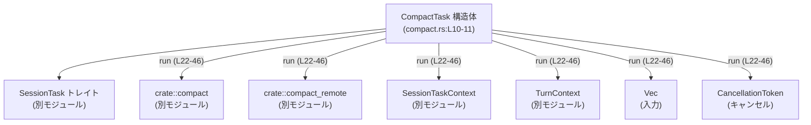
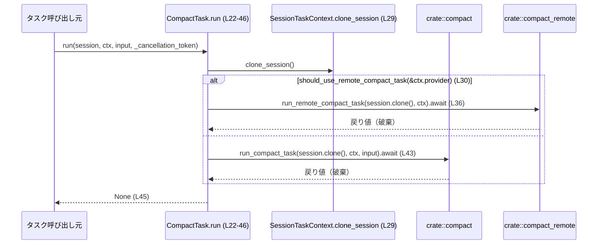
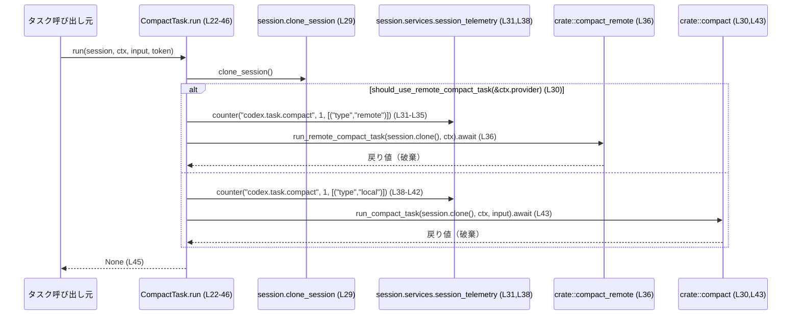

# core/src/tasks/compact.rs

## 0. ざっくり一言

- セッション処理フレームワークにおける「コンパクト」タスク（`TaskKind::Compact`）を実装し、条件に応じてローカル／リモートのコンパクション処理を非同期に呼び出すタスク実装です（`compact.rs:L10-L16, L22-L44`）。

---

## 1. このモジュールの役割

### 1.1 概要

- このモジュールは、セッション内で実行されるタスクの一種として **コンパクション処理（Compact タスク）** を提供します。
- `SessionTask` トレイトを実装した `CompactTask` が、`run` メソッド内で
  - リモート実装 `crate::compact_remote::run_remote_compact_task`
  - ローカル実装 `crate::compact::run_compact_task`
  を条件分岐しながら呼び出します（`compact.rs:L13-L16, L22-L44`）。
- 実際のコンパクション処理のロジックは他モジュール（`crate::compact`, `crate::compact_remote`）に委譲され、このタスク自体は **切り替え・メトリクス計測・タスク種別識別** を担当します。

### 1.2 アーキテクチャ内での位置づけ

このモジュールが依存している主なコンポーネントの関係を示します。



- `CompactTask` は `SessionTask` トレイト実装として、セッション管理のタスクスケジューラから呼び出されると考えられます（`compact.rs:L13`）。
- `run` 実装は、`SessionTaskContext` と `TurnContext`、`Vec<UserInput>` を受け取り、`crate::compact` / `crate::compact_remote` の関数に委譲します（`compact.rs:L22-L27, L30-L44`）。
- `CancellationToken` は引数で受け取られますが、このチャンク内では未使用です（`compact.rs:L27`）。

### 1.3 設計上のポイント

コードから読み取れる特徴です。

- **薄いタスク実装**  
  - 実際のビジネスロジックは `crate::compact` / `crate::compact_remote` へ完全に委譲されています（`compact.rs:L30-L37, L38-L43`）。
- **タスク種別の識別**  
  - `SessionTask::kind` で `TaskKind::Compact` を返しており（`compact.rs:L14-L16`）、これによりタスクスケジューラがタスク種別を認識できます。
- **トレーシング用の span 名の提供**  
  - `span_name` で `"session_task.compact"` という静的文字列を返し、トレーシング／ログの名前空間として利用されます（`compact.rs:L18-L20`）。
- **メトリクス計測（オブザーバビリティ）**  
  - 実行パスごとに `session.services.session_telemetry.counter(...)` が呼ばれ、`"remote"` / `"local"` のラベルで区別されたカウンタがインクリメントされます（`compact.rs:L31-L35, L38-L42`）。
- **並行性配慮**  
  - `self`, `session`, `ctx` は `Arc` で共有され、非同期タスク／スレッド間で安全に共有できる設計です（`compact.rs:L1, L22-L25`）。
- **キャンセル要求の未利用**  
  - `CancellationToken` を受け取りながら `_cancellation_token` として未使用であり（`compact.rs:L27`）、このタスクレベルではキャンセルを考慮していません。
- **戻り値の無視**  
  - リモート／ローカルのコンパクション処理の戻り値を `let _ = ...;` で明示的に破棄し、`run` の戻り値は常に `None` です（`compact.rs:L30, L36, L43, L45`）。

---

## 2. 主要な機能一覧（コンポーネントインベントリー）

### 2.1 構造体・トレイト実装

| 名前 | 種別 | 役割 / 用途 | 定義位置 |
|------|------|------------|----------|
| `CompactTask` | 構造体 | コンパクトタスクの実体。`SessionTask` トレイトの実装を提供する。フィールドを持たないゼロサイズ型。 | `compact.rs:L10-L11` |
| `SessionTask for CompactTask` | トレイト実装 | セッションタスクとしての共通インターフェース（`kind`, `span_name`, `run`）を提供する。 | `compact.rs:L13-L46` |

### 2.2 関数（メソッド）一覧

| 関数名 | シグネチャ（簡略） | 役割（1 行） | 定義位置 |
|--------|--------------------|--------------|----------|
| `CompactTask::kind` | `fn kind(&self) -> TaskKind` | タスク種別として `TaskKind::Compact` を返す。 | `compact.rs:L14-L16` |
| `CompactTask::span_name` | `fn span_name(&self) -> &'static str` | トレーシング用の span 名 `"session_task.compact"` を返す。 | `compact.rs:L18-L20` |
| `CompactTask::run` | `async fn run(self: Arc<Self>, session: Arc<SessionTaskContext>, ctx: Arc<TurnContext>, input: Vec<UserInput>, _cancellation_token: CancellationToken) -> Option<String>` | リモート／ローカルのコンパクション処理を条件に応じて呼び出し、メトリクスを記録した上で `None` を返す。 | `compact.rs:L22-L46` |

---

## 3. 公開 API と詳細解説

このファイルからは `pub(crate)` な `CompactTask` とその `SessionTask` 実装が **crate 内部向け公開 API** となっています（外部 crate には公開されません）。

### 3.1 型一覧（構造体・列挙体など）

| 名前 | 種別 | 役割 / 用途 | 主なフィールド | 定義位置 |
|------|------|------------|----------------|----------|
| `CompactTask` | 構造体 | Compact タスクを表すゼロサイズのマーカー型。`SessionTask` 実装のみを持ち、状態は持たない。`Clone`, `Copy`, `Default` を自動導出。 | フィールドなし | `compact.rs:L10-L11` |

補足:

- `#[derive(Clone, Copy, Default)]` により、`CompactTask` はコピー可能かつデフォルト構築可能です（`compact.rs:L10`）。
- フィールドがないため、`Copy` の実装はメモリ的なコストがほぼありません。

### 3.2 関数詳細

#### `CompactTask::kind(&self) -> TaskKind`

**概要**

- このタスクの種類を `TaskKind::Compact` として返します（`compact.rs:L14-L16`）。
- タスクスケジューラなどがタスクの種別を識別するために使用されると考えられます（`TaskKind` 型はこのチャンクには定義がありません）。

**引数**

| 引数名 | 型 | 説明 |
|--------|----|------|
| `&self` | `&CompactTask` | タスクインスタンスへの参照。内部状態を持たないため、この引数は識別のためだけに用いられます。 |

**戻り値**

- 型: `TaskKind`
- 内容: 常に `TaskKind::Compact` を返します（`compact.rs:L15`）。

**内部処理の流れ**

1. `TaskKind::Compact` をそのまま返す（`compact.rs:L15`）。

**Examples（使用例）**

```rust
// CompactTask の種別を取得する例
use std::sync::Arc;
// use crate::state::TaskKind; // 実際のパスはこのチャンク外

let task = CompactTask::default();           // Defaultでインスタンスを生成（compact.rs:L10）
let kind = task.kind();                      // TaskKind::Compact が返る（compact.rs:L14-L16）
// match kind {
//     TaskKind::Compact => { /* Compact 用の処理 */ }
//     _ => { /* 他のタスク種別 */ }
// }
```

**Errors / Panics**

- エラーも panic も発生しません。単なる列挙値返却です。

**Edge cases（エッジケース）**

- 内部状態を持たないため、エッジケースは特にありません。

**使用上の注意点**

- `CompactTask` はゼロサイズであり、`kind` の結果だけが意味を持つため、呼び出し前に特別な初期化は不要です。

---

#### `CompactTask::span_name(&self) -> &'static str`

**概要**

- トレーシングやログで利用される span 名として、静的文字列 `"session_task.compact"` を返します（`compact.rs:L18-L20`）。

**引数**

| 引数名 | 型 | 説明 |
|--------|----|------|
| `&self` | `&CompactTask` | タスクインスタンスへの参照。内部状態は利用されません。 |

**戻り値**

- 型: `&'static str`
- 内容: `"session_task.compact"`（`compact.rs:L19`）

**内部処理の流れ**

1. リテラル文字列 `"session_task.compact"` を返す（`compact.rs:L19`）。

**Examples（使用例）**

```rust
// span_name を使ってトレーシング span を開始するイメージ例
// 実際のトレーシングクレートはこのチャンクには現れません。
let task = CompactTask::default();
let span_name = task.span_name(); // "session_task.compact" が返る（compact.rs:L18-L20）

// 例: tracingクレート風の疑似コード
// let span = tracing::info_span!(span_name);
// let _enter = span.enter();
```

**Errors / Panics**

- エラーも panic も発生しません。

**Edge cases（エッジケース）**

- 戻り値は常に同一の静的文字列です。空文字列になることや変更されることはありません（このチャンクのコードに基づく）。

**使用上の注意点**

- ログ／トレースの名前をこの値に依存させる場合、文字列変更は外部の可観測性ツールに影響します。変更は慎重に行う必要があります（が、このチャンクには変更処理はありません）。

---

#### `CompactTask::run(self: Arc<Self>, session: Arc<SessionTaskContext>, ctx: Arc<TurnContext>, input: Vec<UserInput>, _cancellation_token: CancellationToken) -> Option<String>`

**概要**

- コンパクトタスクのメイン処理です（`compact.rs:L22-L46`）。
- `ctx.provider` に基づいて「リモートコンパクト」か「ローカルコンパクト」を選択し、対応する関数を非同期に実行します（`compact.rs:L30-L44`）。
- 実行経路ごとにメトリクスカウンタをインクリメントし、戻り値は常に `None` です（`compact.rs:L31-L35, L38-L42, L45`）。

**引数**

| 引数名 | 型 | 説明 |
|--------|----|------|
| `self` | `Arc<CompactTask>` | タスク自身。`Arc` により複数タスク間で共有されます（`compact.rs:L22-L23`）。 |
| `session` | `Arc<SessionTaskContext>` | セッション単位の状態・サービス群を表すコンテキスト（`compact.rs:L24`）。`clone_session` メソッドを呼び出します（`compact.rs:L29`）。 |
| `ctx` | `Arc<TurnContext>` | 現在のターン（リクエスト）に関する文脈情報。`ctx.provider` を参照してリモート利用可否を判断します（`compact.rs:L25, L30`）。 |
| `input` | `Vec<UserInput>` | ユーザーからの入力一覧。ローカルコンパクト時に `run_compact_task` に渡されます（`compact.rs:L26, L43`）。 |
| `_cancellation_token` | `CancellationToken` | 非同期処理のキャンセル通知用トークンですが、このメソッド内では未使用です（`compact.rs:L27`）。 |

**戻り値**

- 型: `Option<String>`
- 内容: 常に `None` を返します（`compact.rs:L45`）。
  - 呼び出し先の `run_remote_compact_task` / `run_compact_task` がどのような値を返すかはこのチャンクからは不明ですが、その戻り値は `let _ = ...` により破棄されます（`compact.rs:L30, L36, L43`）。

**内部処理の流れ（アルゴリズム）**

1. `session.clone_session()` を呼び出して新しい `session` コンテキストを取得します（`compact.rs:L29`）。  
   - `clone_session` の詳細な挙動はこのチャンクには現れません。
2. `crate::compact::should_use_remote_compact_task(&ctx.provider)` を評価し、リモート利用可否を判定します（`compact.rs:L30`）。
3. **リモートを使用する場合（true）**（`compact.rs:L30-L37`）:
   1. `session.services.session_telemetry.counter("codex.task.compact", 1, &[("type", "remote")])` で `"remote"` ラベル付きカウンタをインクリメントします（`compact.rs:L31-L35`）。
   2. `crate::compact_remote::run_remote_compact_task(session.clone(), ctx).await` を実行し、結果を `let _ =` で破棄します（`compact.rs:L36`）。
4. **ローカルを使用する場合（false）**（`compact.rs:L37-L43`）:
   1. 同様に `"local"` ラベル付きのカウンタをインクリメントします（`compact.rs:L38-L42`）。
   2. `crate::compact::run_compact_task(session.clone(), ctx, input).await` を実行し、結果を破棄します（`compact.rs:L43`）。
5. if 式全体の結果を `let _ =` で代入し、明示的に無視します（`compact.rs:L30`）。
6. 最後に `None` を返して終了します（`compact.rs:L45`）。

この処理のフローをシーケンス図で示します。



**Examples（使用例）**

このチャンクには `SessionTask` をどのようにスケジューリングしているかのコードはありませんが、最小限の直接呼び出し例を示します。

```rust
use std::sync::Arc;
use tokio_util::sync::CancellationToken;
// use crate::tasks::compact::CompactTask;
// use crate::tasks::SessionTask;
// use crate::codex::TurnContext;
// use crate::session::SessionTaskContext;
// use codex_protocol::user_input::UserInput;

// 非同期コンテキスト内の例
async fn run_compact_example(
    session: Arc<SessionTaskContext>,   // 実際の型定義はこのチャンク外
    ctx: Arc<TurnContext>,              // 同上
    input: Vec<UserInput>,              // ユーザー入力
) {
    let task = Arc::new(CompactTask::default());          // CompactTask を Arc で包む（compact.rs:L10-L11, L22-L23）
    let token = CancellationToken::new();                 // キャンセルトークンを作成

    // SessionTask トレイトを通して実行（compact.rs:L13, L22-L46）
    let result: Option<String> = SessionTask::run(
        task.clone(),                                     // self: Arc<Self>
        session.clone(),                                  // session: Arc<SessionTaskContext>
        ctx.clone(),                                      // ctx: Arc<TurnContext>
        input,                                            // Vec<UserInput>
        token,                                            // CancellationToken（未使用）
    ).await;

    // CompactTask::run は常に None を返す（compact.rs:L45）
    assert!(result.is_none());
}
```

**Errors / Panics**

- この関数自体は `Result` を返さず、内部で明示的なエラーハンドリングや `panic!` は行っていません。
- ただし、以下の点に注意が必要です:
  - `crate::compact::should_use_remote_compact_task` および
  - `crate::compact_remote::run_remote_compact_task`、
  - `crate::compact::run_compact_task`  
    の内部でエラーや panic が発生する可能性はありますが、このチャンクには実装がないため不明です。
  - これらの戻り値は `let _ =` により完全に無視されており、エラー情報が上位へ伝播しない設計となっています（`compact.rs:L30, L36, L43`）。

**Edge cases（エッジケース）**

- `input` が空のベクタである場合
  - このメソッド内では特にチェックしておらず、そのままローカルパスの `run_compact_task` に渡されます（`compact.rs:L26, L43`）。  
    空入力時の挙動は `run_compact_task` の実装に依存し、このチャンクからは不明です。
- リモートパス選択時の `input`
  - リモートパスでは `input` は全く使用されません（`compact.rs:L36` には引数 `input` がない）。  
    したがって、リモートコンパクションを行う場合、`input` を生成するコストはこの関数内では活用されません。
- `CancellationToken`
  - `_cancellation_token` という未使用パラメータ名になっていることから（`compact.rs:L27`）、キャンセル要求があっても `run` の処理フローには影響しません。
- `TaskKind` や `TurnContext` の状態
  - `ctx.provider` の実際の値に何が入るかは不明ですが、その値がどのようなものであっても `should_use_remote_compact_task` が bool を返さない限りコンパイルできないため、型の整合性は Rust の型システムにより保証されます。

**使用上の注意点**

- **戻り値を期待しない**  
  - `run` の戻り値は常に `None` であり（`compact.rs:L45`）、コンパクション結果を `Option<String>` から取得することはできません。  
    結果が必要な場合は、呼び出し先の `run_compact_task` / `run_remote_compact_task` が副作用（例: セッション状態の更新）として結果を反映している前提で扱う必要があります。
- **エラーの伝播がない**  
  - 呼び出し先のエラーを上位へ伝播せずに破棄する設計であるため（`compact.rs:L30, L36, L43`）、タスクレベルでのリトライやエラーログ出力は別途行われているか、もしくは行われていない可能性があります。  
    エラー監視が必要な場合は、`crate::compact` / `crate::compact_remote` 側の実装や周辺の観測基盤を確認する必要があります。
- **キャンセルを考慮したい場合**  
  - 現状この関数は `CancellationToken` を見ていないため（`compact.rs:L27`）、キャンセルを考慮するには将来的に `token.cancelled()` などをチェックするような変更が必要になります。
- **並行性**  
  - `session` や `ctx` は `Arc` に包まれているため、複数のタスクから安全に共有されることが前提です（`compact.rs:L1, L22-L25`）。  
    ただし、内部でどの程度スレッドセーフな設計になっているかは、このチャンクからは不明です。

### 3.3 その他の関数

- このファイルには、上記 3 つ以外の独立した関数や補助関数はありません。

---

## 4. データフロー

### 4.1 代表的な処理シナリオ

「Compact タスクが実行される」ときの典型的なデータフローです。

1. タスクスケジューラが `CompactTask::run` を呼び出します（`compact.rs:L22`）。
2. `SessionTaskContext` から `clone_session` されたセッションオブジェクトを通じて、メトリクス計測とコンパクション関数の呼び出しが行われます（`compact.rs:L29-L44`）。
3. リモート or ローカルのどちらのコンパクション実装が利用されたかは、`ctx.provider` に基づいて決まります（`compact.rs:L30`）。
4. コンパクション結果の詳細はこのレベルでは扱われず、`run` の戻り値は `None` で終わります（`compact.rs:L45`）。



---

## 5. 使い方（How to Use）

### 5.1 基本的な使用方法

`CompactTask` 自体は状態を持たないため、`Default` で生成し `Arc` に包んで `SessionTask` として使用するのが自然です。

```rust
use std::sync::Arc;
use tokio_util::sync::CancellationToken;
// use crate::tasks::{SessionTask, compact::CompactTask};
// use crate::codex::TurnContext;
// use crate::session::SessionTaskContext;
// use codex_protocol::user_input::UserInput;

async fn run_compact_task_once(
    session: Arc<SessionTaskContext>,
    ctx: Arc<TurnContext>,
    input: Vec<UserInput>,
) {
    let task = Arc::new(CompactTask::default());   // ゼロサイズのタスクインスタンスを作成（compact.rs:L10-L11）
    let token = CancellationToken::new();          // キャンセルトークンを作成（compact.rs:L27）

    // SessionTask::run を通じて CompactTask を実行（compact.rs:L13, L22-L46）
    let result = task.run(session, ctx, input, token).await;

    // CompactTask::run の戻り値は常に None（compact.rs:L45）
    debug_assert!(result.is_none());
}
```

### 5.2 よくある使用パターン

このチャンクから読み取れるのは次のようなパターンです。

- **タスク種別ベースのディスパッチ**
  - 他のタスクと同様に `TaskKind::Compact` をキーとして、このタスクをスケジューラに登録しておく（`compact.rs:L14-L16`）。
- **オブザーバビリティ**
  - `session.services.session_telemetry.counter` により、リモート／ローカル利用状況をメトリクスとして収集する（`compact.rs:L31-L35, L38-L42`）。
- **リモート／ローカル切り替え**
  - `ctx.provider` に紐づいて、どちらの実装を使うかが自動で選択される（`compact.rs:L30`）。  
    呼び出し元では特に分岐を意識せずに `run` を呼ぶだけで良い設計です。

### 5.3 よくある間違い（起こりうる誤解）

このコードから推測できる、起こりそうな誤用・誤解です。

```rust
// 誤解の例: run の戻り値に結果が入っていると思い込む
let output: Option<String> = task.run(session, ctx, input, token).await;
// ここで output を Some(...) だと想定して処理するとバグになる可能性
if let Some(text) = output {
    // CompactTask::run は None しか返さないので、ここに到達しない（compact.rs:L45）
    println!("compacted: {}", text);
}

// 正しい理解: CompactTask::run は副作用のみ（セッション更新など）を行い None を返す
let _ = task.run(session, ctx, input, token).await;
// 結果が必要なら session など他のコンテキストから取得する設計が想定される（詳細はこのチャンクからは不明）
```

### 5.4 使用上の注意点（まとめ）

- `run` の戻り値 `Option<String>` に意味のある値が返ってくることを前提にしない（常に `None`）。
- キャンセルを考慮した停止は、このタスクレベルでは行われない（`_cancellation_token` 未使用）。
- リモート／ローカルの選択は `ctx.provider` に依存しており、`CompactTask` インスタンス側からは制御できません（`compact.rs:L30`）。
- メトリクス用の名前やラベル（`"codex.task.compact"`, `"remote"`, `"local"`）は監視側の設定に影響するため、変更時は周辺設定との整合性を確認する必要があります（`compact.rs:L31-L35, L38-L42`）。

---

## 6. 変更の仕方（How to Modify）

### 6.1 新しい機能を追加する場合

このモジュールに機能を追加するとした場合の典型的なパターンです。

1. **キャンセル対応を追加する**
   - 目的: `CancellationToken` を使って長時間のコンパクション処理を途中で中断できるようにする。
   - 変更候補:
     - `run` 内で `_cancellation_token` を `token` にリネームし、処理前後で `token.is_cancelled()` などをチェックするコードを追加する（`compact.rs:L27, L30-L44`）。  
       実際のメソッド名は `CancellationToken` の定義に依存するため、このチャンクからは不明です。
     - 必要であれば `crate::compact` / `crate::compact_remote` の関数にも `CancellationToken` を渡すようにシグネチャを変更する（このチャンクには現れない）。
2. **メトリクスの詳細化**
   - 目的: タスクの所要時間やエラー発生なども計測したい。
   - 変更候補:
     - `counter` 呼び出し前後でタイマーを取得し、ヒストグラム系メトリクスに記録するロジックを追加する（`compact.rs:L31-L35, L38-L42`）。
     - エラーがあれば別名のカウンタをインクリメントするなど、エラーパスのメトリクスを追加する（エラー情報は現在破棄されているため、まずは戻り値の扱いを変える必要があります）。

### 6.2 既存の機能を変更する場合

変更時に考慮するべき点を挙げます。

- **リモート／ローカル切り替えロジックの変更**
  - 対象箇所: `crate::compact::should_use_remote_compact_task(&ctx.provider)`（`compact.rs:L30`）。
  - 影響:
    - リモート利用頻度の変化により、`"remote"` / `"local"` メトリクスの比率が変化します。
    - ネットワーク負荷やローカル CPU 負荷のバランスが変わる可能性があるため、性能面の影響を考慮する必要があります（詳細は他モジュールに依存）。
- **戻り値の扱いを変える**
  - 現状は `let _ = ...` で捨てています（`compact.rs:L30, L36, L43`）。
  - もしエラーや結果を上位へ伝播したい場合は:
    - `run` の戻り値型を `Result<Option<String>, E>` のように変更する、
    - もしくは `Option<String>` 内に意味のある値を設定するように `run_remote_compact_task` / `run_compact_task` の戻り値とハンドリングを整合させる必要があります。
- **TaskKind や span 名の変更**
  - `TaskKind::Compact` や `"session_task.compact"` を変更すると、スケジューラやトレーシング設定に影響を与えます（`compact.rs:L14-L16, L18-L20`）。
  - 変更前に、参照しているすべての箇所（このチャンク外を含む）の調査が必要です。

---

## 7. 関連ファイル

このモジュールと関係がある型・モジュールです。このチャンクには実装が含まれていませんが、パスと役割を整理します。

| パス / 型 | 役割 / 関係 | 備考 |
|-----------|------------|------|
| `super::SessionTask` | タスク共通インターフェースとなるトレイト。`CompactTask` がこれを実装します（`compact.rs:L3, L13`）。 | 実装内容はこのチャンクには現れません。 |
| `super::SessionTaskContext` | セッション単位のコンテキスト。`run` の引数として渡され、`clone_session` メソッドが利用されます（`compact.rs:L4, L24, L29`）。 | `clone_session` の挙動は不明。 |
| `crate::codex::TurnContext` | 現在のターンに関する文脈情報。`ctx.provider` を通じてリモート利用可否判断に使用されます（`compact.rs:L5, L25, L30`）。 | `provider` の型・意味はこのチャンクには現れません。 |
| `crate::state::TaskKind` | タスクの種類を表す列挙体。`kind` メソッドの戻り値として使用されます（`compact.rs:L6, L14-L16`）。 | 列挙値の一覧は不明ですが、少なくとも `Compact` が定義されています。 |
| `codex_protocol::user_input::UserInput` | ユーザー入力を表す型。`run` の `input: Vec<UserInput>` として渡され、ローカルコンパクト時に利用されます（`compact.rs:L7, L26, L43`）。 | 詳細な構造は不明。 |
| `tokio_util::sync::CancellationToken` | 非同期処理のキャンセルを表すトークン。`run` の引数として受け取りますが、この関数内では未使用です（`compact.rs:L8, L27`）。 | 将来的なキャンセル対応のために用意されている可能性があります。 |
| `crate::compact` | ローカルコンパクション関連のモジュール。`should_use_remote_compact_task`, `run_compact_task` を提供します（`compact.rs:L30, L43`）。 | 実装はこのチャンクには現れません。 |
| `crate::compact_remote` | リモートコンパクション関連のモジュール。`run_remote_compact_task` を提供します（`compact.rs:L36`）。 | 実装はこのチャンクには現れません。 |

---

### Bugs / Security / Contracts / Edge Cases / Tests / 性能に関する補足

最後に、ユーザー指定の観点に沿って、このチャンクから読み取れる事項をまとめておきます。

- **潜在的な懸念点（Bug になり得る挙動）**
  - 戻り値（特にエラー情報）を完全に無視している点（`compact.rs:L30, L36, L43`）は、失敗が上位に伝わらない設計です。  
    これは意図された「ベストエフォート」動作である可能性もありますが、エラー検出が難しくなる懸念があります。
  - `CancellationToken` が未使用であり（`compact.rs:L27`）、キャンセル要求を無視する挙動です。長時間処理の場合は UX に影響する可能性があります。
- **セキュリティ**
  - このチャンク内にはネットワークアクセスや外部入力の直接処理はなく、セキュリティ上特有の処理は見られません。  
    リモートコンパクションの安全性は `crate::compact_remote` 側に依存します。
- **契約（Contracts）**
  - `SessionTask::run` が `Option<String>` を返しながら、この実装では常に `None` を返すこと（`compact.rs:L45`）は、インターフェース上の契約と実装の関係として重要です。  
    「Compact タスクではテキスト結果は返さない」という契約になっていると解釈できます。
- **エッジケース**
  - 入力ベクタが空／巨大である場合、キャンセルが要求された場合などの挙動は、すべて呼び出し先モジュールに依存し、このチャンクからは不明です。
- **テスト**
  - このファイル内にはテストコードは存在しません。  
    Compact タスクのテストは、別ファイル（例えば `tests` モジュールやタスク全体の統合テスト）で書かれている可能性がありますが、このチャンクには現れません。
- **性能 / スケーラビリティ**
  - ローカル／リモートの切り替えにより、リソース消費（CPU vs ネットワークなど）を制御する設計であると推測できますが、詳細は他モジュール依存です。
  - `Arc` による共有でオブジェクトのコピーコストを抑えており（`compact.rs:L1, L22-L25`）、タスクを多数起動することを想定した設計に適しています。

このチャンクに現れる情報は以上です。それ以外の詳細（個々のコンパクションアルゴリズム、`SessionTaskContext` の内部など）は、他ファイルを参照しないと分かりません。
