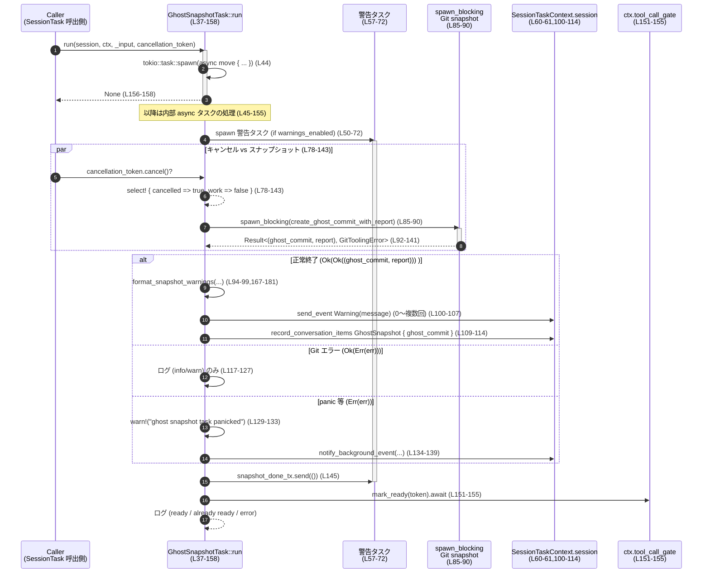

# core/src/tasks/ghost_snapshot.rs

## 0. ざっくり一言

Git リポジトリの「ゴーストスナップショット」（undo 用の隠しコミット）の取得を、セッションタスクとしてバックグラウンドで実行し、長時間実行時の警告や、巨大な未追跡ファイルに関する警告メッセージを組み立てて送信するモジュールです（`core/src/tasks/ghost_snapshot.rs` 全体）。

---

## 1. このモジュールの役割

### 1.1 概要

- このモジュールは、**セッション中に Git リポジトリのスナップショットを取得する非同期タスク**を実装しています。
- スナップショット取得が長時間かかる場合の警告イベント送信、および **大きな未追跡ファイル／ディレクトリをスキップした際の警告文生成**を行います（`ghost_snapshot.rs:L37-158`, `L167-234`）。
- スナップショット完了・中断にかかわらず、**ツール呼び出しゲートの Readiness トークンを準備完了にする**ことで、他コンポーネントに「スナップショット処理が一段落した」ことを伝えます（`L45`, `L151-155`）。

### 1.2 アーキテクチャ内での位置づけ

このモジュールの中心は `GhostSnapshotTask` で、`SessionTask` トレイトを実装し、セッション処理フレームワークから呼び出される前提になっています（`L22-24`, `L28-158`）。

依存関係の概要を図示します。

```mermaid
graph TD
    subgraph "ghost_snapshot.rs"
        GST["GhostSnapshotTask<br/>SessionTask実装<br/>(run, kind, span_name)<br/>(L22-24,28-158)"]
        FSW["format_snapshot_warnings<br/>(L167-181)"]
        FLUD["format_large_untracked_warning<br/>(L184-205)"]
        FIUF["format_ignored_untracked_files_warning<br/>(L207-234)"]
        FBY["format_bytes<br/>(L237-247)"]
    end

    Caller["セッションタスク呼び出し側<br/>(別モジュール, 不明)"] -->|SessionTask::run| GST
    GST -->|spawn_blocking<br/>Git スナップショット| GitSnap["create_ghost_commit_with_report<br/>(外部クレート)"]
    GitSnap -->|GhostSnapshotReport| GST
    GST -->|警告メッセージ生成| FSW
    FSW --> FLUD
    FSW --> FIUF
    FLUD --> FBY
    FIUF --> FBY

    GST -->|send_event / record_conversation_items| Session["SessionTaskContext.session<br/>(L100-114)"]
    GST -->|mark_ready(token)| ToolGate["ctx.tool_call_gate<br/>(L151-155)"]
    GST -->|CancellationToken, oneshot<br/>SNAPSHOT_WARNING_THRESHOLD| Timer["警告タイマー用 Tokio タスク<br/>(L50-72)"]
```

**図1: GhostSnapshotTask::run (L37-158) を中心とした依存関係**

### 1.3 設計上のポイント

コードから読み取れる設計上の特徴は以下の通りです。

- **セッションタスクの分離**
  - `GhostSnapshotTask` は `SessionTask` トレイト実装として定義され、セッション全体の中では「通常タスク」として扱われます（`kind` が `TaskKind::Regular`、`L29-31`）。
- **非同期・バックグラウンド実行**
  - `run` 自体はすぐに `tokio::task::spawn` で内側の非同期タスクを起動し、自身は `None` を返します（`L44`, `L156-158`）。
  - スナップショット作業はさらに `spawn_blocking` で専用スレッドプール上の同期処理として実行されます（`L85-90`）。
- **キャンセルと警告タイムアウトの管理**
  - `CancellationToken` と `oneshot::channel` を組み合わせて、スナップショットが一定時間（240秒）以内に終わらない場合に警告イベントを送信し、それより早く終わった場合は警告タスクを自然終了させます（`L47-75`, `L58-71`）。
- **Git レポートに基づく警告メッセージ生成**
  - `GhostSnapshotReport` の内容（大きな未追跡ディレクトリや未追跡ファイル）から、ユーザー向けの警告文を組み立てます（`L92-116`, `L167-234`）。
- **エラーハンドリング**
  - Git リポジトリでない場合は情報ログのみでスキップ（`L117-121`）。
  - Git ツールのその他のエラーや `spawn_blocking` の panic は `warn!` ログとユーザーへの通知に変換し、上位には Result としては伝播しません（`L122-140`）。
- **Readiness ゲート**
  - スナップショット処理がキャンセルされたかどうかに関わらず、最後に `ctx.tool_call_gate.mark_ready(token)` を呼び出し、ツール呼び出しゲートの状態を更新します（`L145-155`）。

---

## 2. 主要な機能一覧

このモジュールが提供する主要機能は次の通りです。

- ゴーストスナップショットタスク実装: `GhostSnapshotTask` が `SessionTask` を実装し、Git スナップショットをバックグラウンドで取得する（`L22-24`, `L28-158`）。
- 長時間スナップショット警告: スナップショットが 240 秒以上継続している場合に警告イベントを送信する（`L26`, `L50-72`）。
- Git スナップショット実行: `create_ghost_commit_with_report` を専用スレッドプールで呼び出し、コミットとレポートを取得する（`L81-90`, `L92`）。
- スナップショット結果の記録: `ResponseItem::GhostSnapshot` としてセッションに記録する（`L109-114`）。
- 大きな未追跡ディレクトリに関する警告文の生成: `format_large_untracked_warning`（`L184-205`）。
- 大きな未追跡ファイルに関する警告文の生成: `format_ignored_untracked_files_warning`（`L207-234`）。
- 人間可読なサイズ表現への変換: `format_bytes` による KiB / MiB 単位表現（`L237-247`）。

---

## 3. 公開 API と詳細解説

### 3.1 型一覧（構造体・定数など）

| 名前 | 種別 | 役割 / 用途 | 公開範囲 | 定義位置 |
|------|------|-------------|----------|----------|
| `GhostSnapshotTask` | 構造体 | ゴーストスナップショット取得を行うセッションタスク。内部に Readiness トークンを保持する。 | `pub(crate)` | `core/src/tasks/ghost_snapshot.rs:L22-24` |
| `SNAPSHOT_WARNING_THRESHOLD` | 定数 | スナップショットが長時間継続していると判断する閾値（240秒） | モジュール内可視 | `core/src/tasks/ghost_snapshot.rs:L26` |

> 備考: `codex_utils_readiness::Readiness` はインポートされていますが、このファイル内では使用されていません（`L13`）。

### 3.1-2 トレイト実装

| 型 | トレイト | 主なメソッド | 概要 | 定義位置 |
|----|---------|-------------|------|----------|
| `GhostSnapshotTask` | `SessionTask` | `kind`, `span_name`, `run` | セッションタスクとしての種別、トレース用スパン名、実行ロジックを提供する | `core/src/tasks/ghost_snapshot.rs:L28-159` |

### 3.1-3 関数一覧（インベントリー）

| 名前 | 種別 | 概要 | 定義位置 |
|------|------|------|----------|
| `GhostSnapshotTask::kind` | メソッド | タスク種別として `TaskKind::Regular` を返す | `core/src/tasks/ghost_snapshot.rs:L29-31` |
| `GhostSnapshotTask::span_name` | メソッド | トレース用のスパン名 `"session_task.ghost_snapshot"` を返す | `core/src/tasks/ghost_snapshot.rs:L33-35` |
| `GhostSnapshotTask::run` | メソッド（async） | スナップショット取得・警告送信・Readiness 更新をバックグラウンドで実行する | `core/src/tasks/ghost_snapshot.rs:L37-158` |
| `GhostSnapshotTask::new` | 関連関数 | Readiness トークンを受け取り `GhostSnapshotTask` を生成する | `core/src/tasks/ghost_snapshot.rs:L161-165` |
| `format_snapshot_warnings` | 関数 | 2 種類の警告文生成関数をまとめて呼び出し、文字列リストを返す | `core/src/tasks/ghost_snapshot.rs:L167-181` |
| `format_large_untracked_warning` | 関数 | 大きな未追跡ディレクトリに関する警告文を 0〜1 個生成する | `core/src/tasks/ghost_snapshot.rs:L184-205` |
| `format_ignored_untracked_files_warning` | 関数 | 大きな未追跡ファイルに関する警告文を 0〜1 個生成する | `core/src/tasks/ghost_snapshot.rs:L207-234` |
| `format_bytes` | 関数 | バイト数を B / KiB / MiB 表現の文字列に変換する | `core/src/tasks/ghost_snapshot.rs:L237-247` |
| `tests` | テストモジュール | `ghost_snapshot_tests.rs` 内のテストを取り込む | `core/src/tasks/ghost_snapshot.rs:L250-252` |

---

### 3.2 関数詳細（6件）

#### `GhostSnapshotTask::run(self: Arc<Self>, session: Arc<SessionTaskContext>, ctx: Arc<TurnContext>, _input: Vec<UserInput>, cancellation_token: CancellationToken) -> Option<String>`

**概要**

- セッションタスクとして呼び出され、**実際の処理を別の Tokio タスクに委譲**します（`tokio::task::spawn`、`L44`）。
- バックグラウンドで Git スナップショットを取得し、必要に応じて:
  - 長時間実行の警告イベント送信（`L58-67`）
  - Git レポートに基づく警告イベント送信（`L92-116`）
  - ゴーストコミット情報の会話ログへの記録（`L109-114`）
  - Readiness ゲートの更新（`L151-155`）
  を行います。
- `run` 自体は常に `None` を返し、結果文字列は使用しません（`L156-158`）。

**引数**

| 引数名 | 型 | 説明 |
|--------|----|------|
| `self` | `Arc<Self>` | タスク本体。`Arc` 共有によりタスク間で共有可能です（`L37-38`）。 |
| `session` | `Arc<SessionTaskContext>` | セッション固有のコンテキスト。イベント送信や会話アイテム記録に使用されます（`L39`, `L60-61`, `L100-114`）。 |
| `ctx` | `Arc<TurnContext>` | コマンド実行に関するコンテキスト。作業ディレクトリや設定（`ghost_snapshot`）を含みます（`L40`, `L81-83`）。 |
| `_input` | `Vec<UserInput>` | ユーザー入力。現在の実装では使用しておらず、パラメータ名が `_input` になっています（`L41`）。 |
| `cancellation_token` | `CancellationToken` | 外部からのキャンセル指示を受けるトークン。`tokio::select!` によりキャンセルを監視します（`L42`, `L78-80`）。 |

**戻り値**

- `Option<String>`  
  常に `None` が返されます（`L156-158`）。
  - 実際の成果物（ゴーストコミット ID 等）は `session.session.record_conversation_items` 経由でログに残されるため、戻り値には含めません（`L109-115`）。

**内部処理の流れ（アルゴリズム）**

1. **バックグラウンドタスクの起動**  
   `tokio::task::spawn` で内側の async ブロックを実行します（`L44`）。

2. **警告用チャネルとフラグの設定**
   - `token` をローカルに退避（`L45`）。
   - `warnings_enabled = !ctx.ghost_snapshot.disable_warnings` で警告有効フラグを決定（`L46`）。
   - `oneshot::channel` でスナップショット完了通知チャネルを生成（`L49`）。

3. **長時間スナップショット警告タスクの起動（警告有効時のみ）**
   - `ctx`, `cancellation_token`, `session` をクローン（`L51-53`）。
   - 別の `tokio::task::spawn` で警告タスクを起動（`L57-72`）。
   - 警告タスクでは `tokio::select!` により、以下の 3 通りを待ちます（`L58-71`）:
     - 240 秒スリープ完了 → 警告イベント `EventMsg::Warning(WarningEvent { ... })` を送信（`L59-67`）。
     - `snapshot_done_rx` 通知受信 → 何もせず終了（`L69`）。
     - `cancellation_token_for_warning.cancelled()` → 何もせず終了（`L70`）。
   - 警告無効時は `snapshot_done_rx` を即座に drop（`L73-75`）。

4. **スナップショット作業とキャンセルの競合**
   - `ctx_for_task = ctx.clone()`（`L77`）。
   - `tokio::select!` で以下の 2 分岐を同時に待ち、先に完了した側を採用（`L78-143`）:
     - **キャンセル側**: `cancellation_token.cancelled()` が完了した場合 `cancelled = true`（`L79-80`）。
     - **作業側**: async ブロック内で Git スナップショット処理を実行し、終了すると `cancelled = false`（`L80-142`）。

5. **Git スナップショット処理の詳細（作業側ブランチ）**
   1. コンテキストから値を取得:
      - `repo_path = ctx_for_task.cwd.clone()`（`L81`）
      - `ghost_snapshot = ctx_for_task.ghost_snapshot.clone()`（`L82`）
      - `ghost_snapshot_for_commit = ghost_snapshot.clone()`（`L83`）
   2. `spawn_blocking` でブロッキング処理を実行（`L85-90`）:
      - `CreateGhostCommitOptions::new(&repo_path).ghost_snapshot(ghost_snapshot_for_commit)` でオプションを構築（`L86-87`）。
      - `create_ghost_commit_with_report(&options)` を実行し、ゴーストコミットとレポートを取得（`L88`）。
   3. `spawn_blocking` の結果に応じて処理分岐（`L92-141`）:
      - `Ok(Ok((ghost_commit, report)))`:
        - ログ: `"ghost snapshot blocking task finished"`（`L93`）。
        - 警告有効なら、`format_snapshot_warnings(...)` で警告メッセージを列挙し、それぞれ `EventMsg::Warning` として送信（`L94-107`）。
        - `ResponseItem::GhostSnapshot { ghost_commit: ghost_commit.clone() }` を会話アイテムとして記録（`L109-114`）。
        - ゴーストコミット ID をログ出力（`L115`）。
      - `Ok(Err(err))`:
        - `GitToolingError::NotAGitRepository` の場合:
          - サブ ID を付加して「Git リポジトリではないのでスナップショットをスキップ」とログ（`L117-121`）。
        - その他のエラー:
          - サブ ID とエラーメッセージ付きで `warn!` ログ（`L122-127`）。
      - `Err(err)`（`spawn_blocking` 自体が panic などで失敗した場合）:
        - サブ ID とエラーで `warn!` ログ（`L129-133`）。
        - `session.session.notify_background_event` でユーザーに「panic によりスナップショット無効化」の通知を送信（`L134-139`）。

6. **警告タスクへの完了通知**
   - `let _ = snapshot_done_tx.send(());` で oneshot チャネルに完了通知を送信（`L145`）。
     - 警告タスクが `snapshot_done_rx` をまだ待っていれば、即座に select を抜けて終了します。

7. **キャンセルのログ**
   - `cancelled` が `true` の場合、`"ghost snapshot task cancelled"` をログ出力（`L147-149`）。

8. **Readiness ゲートの更新**
   - `ctx.tool_call_gate.mark_ready(token).await` を呼び出し、結果に応じてログ（`L151-155`）:
     - `Ok(true)` → `"ghost snapshot gate marked ready"`。
     - `Ok(false)` → `"ghost snapshot gate already ready"`。
     - `Err(err)` → `"failed to mark ghost snapshot ready: {err}"`。

**Examples（使用例）**

実際のコンテキスト型の定義はこのファイル内にはないため、簡略化した例を示します。

```rust
use std::sync::Arc;
use tokio_util::sync::CancellationToken;
use codex_utils_readiness::Token;

// 擬似的な SessionTaskContext / TurnContext 型。
// 実際の型定義は他ファイルにあります。
struct SessionTaskContext { /* ... */ }
struct TurnContext { /* ... */ }

async fn launch_ghost_snapshot_task(
    session: Arc<SessionTaskContext>,
    ctx: Arc<TurnContext>,
    token: Token,
) {
    let task = Arc::new(GhostSnapshotTask::new(token)); // Readiness トークンを埋め込んだタスクを作成 (L161-165)
    let cancellation_token = CancellationToken::new();

    // 実際には SessionTask 実装としてフレームワークから呼び出される想定ですが、
    // ここでは直接 run を呼んでいます。
    let _ = task
        .run(
            session,
            ctx,
            Vec::new(),        // 現状 run 内では _input は使用されない (L41)
            cancellation_token,
        )
        .await;
}
```

**Errors / Panics**

- `run` メソッド自体は `Result` を返さず、内部で発生したエラーはログ・イベントに変換されます。
- 具体的なエラー処理:
  - Git リポジトリではない場合: `GitToolingError::NotAGitRepository` を検出し、情報ログのみ（`L117-121`）。
  - Git 操作のその他のエラー: 警告ログ（`L122-127`）。
  - `spawn_blocking` タスクの panic など: `Err(err)` 経由でキャッチし、警告ログとユーザーへの通知（`L129-140`）。
  - Readiness 更新失敗: `mark_ready` の `Err(err)` を警告ログに記録（`L151-155`）。
- `run` 外での panic:
  - このメソッド内で明示的に panic を発生させるコードはありません。
  - 内部で呼び出す関数（例えば `create_ghost_commit_with_report`）が panic する可能性はありますが、`spawn_blocking` 結果として `Err` で受け止められます（`L129-136`）。

**Edge cases（エッジケース）**

- **キャンセルのタイミング**
  - `tokio::select!` により、キャンセルの発生とスナップショット処理の完了のどちらか早い方を採用します（`L78-143`）。
  - ただし `async { ... }` ブロック内で `spawn_blocking` が既に開始されている場合、キャンセルが先に選択されると:
    - ブロック内の後続処理（警告送信や記録）は実行されません。
    - `spawn_blocking` で起動されたブロッキングタスク自体は Tokio の設計上キャンセルされず、バックグラウンドで完了する点に注意が必要です（このファイルには明示的なキャンセル処理は存在しません）。
- **警告無効時 (`disable_warnings = true`)**
  - 長時間スナップショット警告タスクは起動されず（`L50-72`）、`snapshot_done_rx` は即座に drop されます（`L73-75`）。
  - スナップショット完了時にも `format_snapshot_warnings` は呼び出されません（`L94-107`）。
- **Git レポートの内容**
  - `GhostSnapshotReport` のフィールド `large_untracked_dirs` または `ignored_untracked_files` が空のとき、対応する警告は生成されません（`L188-190`, `L212-213`）。
- **Readiness トークン**
  - `mark_ready(token)` は、キャンセルされた場合でも呼び出されます（`L145-155`）。
  - 既に ready な場合 (`Ok(false)`) というケースも明示的にログされています（`L152-153`）。

**使用上の注意点**

- `run` は処理の本体をさらに `tokio::task::spawn` で実行するため、**呼び出し元は `run` の完了を待ってもスナップショット完了を保証できません**（`L44`, `L156-158`）。
  - スナップショット完了を待つ制御は、`ctx.tool_call_gate` 側の Readiness トークンを通じて実現される設計と思われます（`L45`, `L151-155`）。
- 長時間実行警告は `SNAPSHOT_WARNING_THRESHOLD`（240秒）の固定値に依存しており、現状このファイル内からは変更できません（`L26`, `L59`）。
- `CancellationToken` はスナップショット処理の外側に対してのみキャンセルの有無を知らせます。
  - Git のブロッキング処理自体は中断されない点に注意が必要です（`L85-90`）。

---

#### `GhostSnapshotTask::new(token: Token) -> Self`

**概要**

- `GhostSnapshotTask` を初期化するコンストラクタです。
- 内部フィールド `token` に `codex_utils_readiness::Token` を格納します（`L161-165`）。

**引数**

| 引数名 | 型 | 説明 |
|--------|----|------|
| `token` | `Token` | Readiness ゲートに渡すトークン。スナップショット完了時に `mark_ready` へ渡されます（`L45`, `L151-155`）。 |

**戻り値**

- `GhostSnapshotTask` の新しいインスタンス。

**内部処理**

1. 構造体リテラル `Self { token }` によりフィールドを初期化（`L162-163`）。

**Examples**

```rust
use codex_utils_readiness::Token;

fn create_task(token: Token) -> GhostSnapshotTask {
    // Readiness トークンを内部に保持したタスクを作成 (L161-165)
    GhostSnapshotTask::new(token)
}
```

**使用上の注意点**

- 他のフィールドは存在せず、現時点では `Token` のみを保持します（`L22-24`）。
- `GhostSnapshotTask` は `Arc` で共有される前提のため、`new` で作成した後は `Arc::new` で包んで使われることが想定されます（`L37-39`）。

---

#### `format_snapshot_warnings(ignore_large_untracked_files: Option<i64>, ignore_large_untracked_dirs: Option<i64>, report: &GhostSnapshotReport) -> Vec<String>`

**概要**

- `GhostSnapshotReport` から **2 種類の警告文をまとめて生成**します。
- ディレクトリ警告 (`format_large_untracked_warning`) とファイル警告 (`format_ignored_untracked_files_warning`) を呼び出し、その結果を `Vec<String>` に詰めて返します（`L167-181`）。

**引数**

| 引数名 | 型 | 説明 |
|--------|----|------|
| `ignore_large_untracked_files` | `Option<i64>` | 未追跡ファイルの「大きさ」閾値。`None` の場合、ファイル警告は生成されません（`L168`, `L207-212`）。 |
| `ignore_large_untracked_dirs` | `Option<i64>` | 未追跡ディレクトリの「ファイル数」閾値。`None` の場合、ディレクトリ警告は生成されません（`L169`, `L191-192`）。 |
| `report` | `&GhostSnapshotReport` | Git スナップショット処理から返されるレポート。大きな未追跡ディレクトリ・ファイルの情報を含みます（`L170`, `L188-199`, `L212-227`）。 |

**戻り値**

- `Vec<String>`  
  - 各要素は 1 つの警告メッセージ。
  - 最大 2 要素（ディレクトリ警告 + ファイル警告）になります（`L172-181`）。

**内部処理**

1. 空の `warnings` ベクタを作成（`L172`）。
2. `format_large_untracked_warning(ignore_large_untracked_dirs, report)` を呼び出し、`Some(message)` ならベクタに push（`L173-175`）。
3. `format_ignored_untracked_files_warning(ignore_large_untracked_files, report)` を呼び出し、`Some(message)` ならベクタに push（`L176-179`）。
4. ベクタを返す（`L181`）。

**Examples**

```rust
// GhostSnapshotReport の実際の定義は別ファイルですが、ここでは最小限のダミー定義で例示します。
use std::path::PathBuf;

struct LargeUntrackedDir {
    path: PathBuf,
    file_count: usize,
}
struct IgnoredUntrackedFile {
    path: PathBuf,
    byte_size: i64,
}
struct DummyReport {
    large_untracked_dirs: Vec<LargeUntrackedDir>,
    ignored_untracked_files: Vec<IgnoredUntrackedFile>,
}

fn example(report: &GhostSnapshotReport) {
    // 閾値 1000 ファイル以上のディレクトリ、10MiB 以上のファイルを対象とした警告生成
    let dir_threshold = Some(1000);
    let file_threshold = Some(10 * 1024 * 1024);

    let warnings = format_snapshot_warnings(file_threshold, dir_threshold, report);
    for w in warnings {
        println!("warning: {w}");
    }
}
```

※ `GhostSnapshotReport` の本当の型定義はこのファイルには現れませんが、`large_untracked_dirs` と `ignored_untracked_files` に必要なフィールド（`path`, `file_count`, `byte_size`）が存在することはコードから分かります（`L194-196`, `L218-223`）。

**Errors / Panics**

- この関数内で panic を発生させるコードはありません。
- 引数が `None` の場合は単に対応する警告をスキップします（`L173-179`）。

**Edge cases**

- `ignore_large_untracked_files` や `ignore_large_untracked_dirs` が `None` の場合:
  - 対応する警告は生成されません（`L191-192`, `L211-212`）。
- `report` 側の対象リストが空の場合:
  - 対応する警告関数は `None` を返し、何も追加されません（`L188-190`, `L212-213`）。

**使用上の注意点**

- 警告メッセージの生成順序は固定で、ディレクトリ警告 → ファイル警告の順です（`L173-179`）。
- 実際の送信は呼び出し元（`GhostSnapshotTask::run`）が行うため、この関数はメッセージ文字列の生成のみを担当します（`L94-107`）。

---

#### `format_large_untracked_warning(ignore_large_untracked_dirs: Option<i64>, report: &GhostSnapshotReport) -> Option<String>`

**概要**

- `GhostSnapshotReport` 内の `large_untracked_dirs` 情報から、**大きな未追跡ディレクトリ**に関する警告メッセージを 1 つ組み立てます（`L184-205`）。
- 閾値が `None` の場合は警告を生成しません。

**引数**

| 引数名 | 型 | 説明 |
|--------|----|------|
| `ignore_large_untracked_dirs` | `Option<i64>` | 「大きい」とみなすファイル数の閾値。`Some(threshold)` の場合のみメッセージを生成（`L191-192`）。 |
| `report` | `&GhostSnapshotReport` | 大きな未追跡ディレクトリ情報を含むレポート。`large_untracked_dirs` フィールドを参照します（`L188-199`）。 |

**戻り値**

- `Option<String>`  
  - 対象ディレクトリが存在し、かつ閾値が `Some` の場合 → `Some(メッセージ)`（`L201-204`）。
  - それ以外 → `None`（`L188-190`, `L191-192`）。

**内部処理**

1. `report.large_untracked_dirs.is_empty()` が真なら `None` で早期リターン（`L188-190`）。
2. `let threshold = ignore_large_untracked_dirs?;` によって、`None` なら `None` を返し、`Some` の場合は値を取り出し（`L191-192`）。
3. `MAX_DIRS = 3` を定義し、最大 3 つのディレクトリを表示対象にする（`L192`）。
4. `report.large_untracked_dirs.iter().take(MAX_DIRS)` をループし、それぞれ `"path (file_count files)"` 形式で `parts` ベクタに追加（`L193-196`）。
5. 要素数が `MAX_DIRS` を超えている場合、`"{remaining} more"` を追加（`L197-199`）。
6. 最終的なメッセージ文字列を `format!` で構築し、`Some(...)` で返す（`L201-204`）。

**Examples**

```rust
fn print_dir_warning(report: &GhostSnapshotReport) {
    let threshold = Some(500); // 500 ファイル以上あるディレクトリを警告対象とする

    if let Some(msg) = format_large_untracked_warning(threshold, report) {
        println!("{msg}");
    }
}
```

**Errors / Panics**

- この関数内で panic を起こす可能性のある箇所は見当たりません。
  - インデックスアクセスは使用しておらず、`iter().take()` と `len()` のみです（`L193-199`）。

**Edge cases**

- `large_untracked_dirs` が 0 件 → `None`（`L188-190`）。
- `ignore_large_untracked_dirs` が `None` → `threshold` 行で `?` により即 `None` 返却（`L191-192`）。
- `large_untracked_dirs` が 1〜3 件 → その全件を列挙（`L193-196`）。
- `large_untracked_dirs` が 4 件以上 → 先頭 3 件を列挙し、最後に `"N more"` を追加（`L197-199`）。

**使用上の注意点**

- メッセージ中では `"Repository snapshot ignored large untracked directories (>= {threshold} files): ..."` として `threshold` をそのまま出力します（`L201-204`）。
  - 単位はファイル数である点が明示されています（`files`）。

---

#### `format_ignored_untracked_files_warning(ignore_large_untracked_files: Option<i64>, report: &GhostSnapshotReport) -> Option<String>`

**概要**

- `GhostSnapshotReport` 内の `ignored_untracked_files` から、**大きすぎてスナップショットから除外された未追跡ファイル**に関する警告文を生成します（`L207-234`）。
- ファイルサイズは `format_bytes` を使って人間可読な形に変換されます（`L219-223`, `L237-247`）。

**引数**

| 引数名 | 型 | 説明 |
|--------|----|------|
| `ignore_large_untracked_files` | `Option<i64>` | 「大きい」とみなすバイト数の閾値。`Some(threshold)` の場合のみメッセージを生成（`L211-212`）。 |
| `report` | `&GhostSnapshotReport` | `ignored_untracked_files` を含むレポート（`L209-210`, `L218-223`, `L225-227`）。 |

**戻り値**

- `Option<String>`  
  - ファイルが存在し、かつ閾値が `Some` → `Some(メッセージ)`。
  - そうでなければ `None`。

**内部処理**

1. `let threshold = ignore_large_untracked_files?;` により、`None` の場合は即 `None` 返却（`L211-212`）。
2. `report.ignored_untracked_files.is_empty()` なら `None`（`L212-213`）。
3. `MAX_FILES = 3` を定義し、最大 3 つのファイルを列挙対象とする（`L216`）。
4. `iter().take(MAX_FILES)` でファイルを列挙し、`"path (size)"` 形式の文字列を `parts` に push（`L218-223`）。
   - `size` は `format_bytes(file.byte_size)` で変換（`L221-223`）。
5. ファイル数が `MAX_FILES` を超える場合、`"{remaining} more"` を追加（`L225-227`）。
6. `format!` で最終メッセージを組み立てる（`L230-234`）。

**Examples**

```rust
fn print_file_warning(report: &GhostSnapshotReport) {
    // 50 MiB 以上の未追跡ファイルを警告対象とする
    let threshold = Some(50 * 1024 * 1024);

    if let Some(msg) = format_ignored_untracked_files_warning(threshold, report) {
        println!("{msg}");
    }
}
```

**Errors / Panics**

- 内部で panic を起こすコードはありません。
- `format_bytes` は負の値も一応文字列化できますが（`L237-247`）、そのような入力は通常想定されていません。

**Edge cases**

- `ignore_large_untracked_files` が `None` → 警告なし（`L211-212`）。
- `ignored_untracked_files` が空 → 警告なし（`L212-213`）。
- ファイル数が 1〜3 件 → 全件列挙（`L218-223`）。
- 4 件以上 → 先頭 3 件 + `"N more"`（`L225-227`）。

**使用上の注意点**

- メッセージ文面には、「undo cleanup 時にはファイルは保持されるが、内容はスナップショットに含まれない」ことや、`.gitignore` の更新を促す文言が含まれています（`L230-234`）。
- `threshold` の表示には `format_bytes` が使われるため、MiB / KiB / B 単位でユーザーに提示されます（`L231-233`, `L237-247`）。

---

#### `format_bytes(bytes: i64) -> String`

**概要**

- バイト数を人間が読みやすい単位（MiB, KiB, B）に変換する単純なユーティリティ関数です（`L237-247`）。

**引数**

| 引数名 | 型 | 説明 |
|--------|----|------|
| `bytes` | `i64` | バイト数。負の値も受け取れますが、特別な処理は行われません（`L237`）。 |

**戻り値**

- `String`  
  - `>= 1 MiB` → `"N MiB"`（`L241-243`）
  - `>= 1 KiB` → `"N KiB"`（`L244-245`）
  - それ以外 → `"N B"`（`L247`）

**内部処理**

1. `KIB = 1024`, `MIB = 1024 * 1024` を定数定義（`L238-239`）。
2. `bytes >= MIB` → `bytes / MIB` を `MiB` 単位でフォーマット（`L241-243`）。
3. そうでなければ `bytes >= KIB` → `bytes / KIB` を `KiB` 表示（`L244-245`）。
4. それ以外 → `"bytes B"` の形式で文字列化（`L247`）。

**Examples**

```rust
fn example_bytes() {
    assert_eq!(format_bytes(500), "500 B");
    assert_eq!(format_bytes(2048), "2 KiB");
    assert_eq!(format_bytes(5 * 1024 * 1024), "5 MiB");
}
```

**Edge cases**

- `bytes` が負の値の場合、どの条件にもマッチせず `"N B"` 形式（N は負数）で出力されます（`L241-247`）。
  - コード上は許容されていますが、そのような入力は通常想定されていないと考えられます。

**使用上の注意点**

- 単純な整数除算のため、例えば `1536` バイトは `"1 KiB"` ではなく `"1 KiB"`（小数切り捨て）になります（`L244-245`）。
- 四捨五入や小数表示は行われません。

---

### 3.3 その他の関数

- `GhostSnapshotTask::kind` / `GhostSnapshotTask::span_name`  
  ログやトレーシングのためのメタ情報を返す単純なメソッドです（`L29-35`）。

| 関数名 | 役割（1 行） | 定義位置 |
|--------|--------------|----------|
| `GhostSnapshotTask::kind` | タスクを `TaskKind::Regular` として識別する | `core/src/tasks/ghost_snapshot.rs:L29-31` |
| `GhostSnapshotTask::span_name` | トレーシング用スパン名 `"session_task.ghost_snapshot"` を返す | `core/src/tasks/ghost_snapshot.rs:L33-35` |

---

## 4. データフロー

ここでは、`GhostSnapshotTask::run` が呼ばれてからスナップショット処理・警告・Readiness 更新までの典型的なフローを示します。

### 4.1 処理の要点（文章）

1. セッションフレームワークが `SessionTask::run` を呼び出すと、`GhostSnapshotTask` はすぐに内部の Tokio タスクを `spawn` し、自身は `None` を返します（`L44`, `L156-158`）。
2. 内部タスクは、警告タスクを（必要なら）起動しつつ、`tokio::select!` でキャンセルとスナップショット処理のどちらが先に終わるかを監視します（`L50-72`, `L78-143`）。
3. スナップショット処理は `spawn_blocking` で Git 用のブロッキング処理として実行され、`GhostSnapshotReport` を受け取ります（`L81-90`, `L92`）。
4. レポートをもとに警告文を生成・送信し、ゴーストコミットをセッション会話アイテムとして記録します（`L94-116`, `L109-114`）。
5. 最後に `snapshot_done_tx` で警告タスクに完了を通知し、`mark_ready(token)` で Readiness ゲートを更新します（`L145`, `L151-155`）。

### 4.2 シーケンス図



**図2: GhostSnapshotTask::run (L37-158) の典型的なデータフロー**

---

## 5. 使い方（How to Use）

### 5.1 基本的な使用方法

このファイル単体からはセッションフレームワーク全体は分かりませんが、`SessionTask` を実装していることから、以下のような利用が想定されます。

```rust
use std::sync::Arc;
use tokio_util::sync::CancellationToken;
use codex_utils_readiness::Token;

// 擬似的な型定義（実際の定義は別ファイルにあります）
struct SessionTaskContext {
    // session: ...
}
struct TurnContext {
    // ghost_snapshot: { disable_warnings, ignore_large_untracked_files, ... }
}

async fn attach_ghost_snapshot_task(
    session: Arc<SessionTaskContext>,
    ctx: Arc<TurnContext>,
    gate_token: Token,
) {
    let task = Arc::new(GhostSnapshotTask::new(gate_token)); // (L161-165)
    let cancellation_token = CancellationToken::new();

    // フレームワークから呼び出される想定の run を直接呼ぶ例
    let _ = task
        .run(
            session.clone(),
            ctx.clone(),
            Vec::new(),       // _input は未使用 (L41)
            cancellation_token,
        )
        .await;

    // run は内部で tokio::spawn 済みなので、ここでは処理は既にバックグラウンドに移っています。
}
```

### 5.2 よくある使用パターン

1. **ツール呼び出し前のスナップショット取得**

   - `ctx.tool_call_gate` の Readiness トークンを使って、「スナップショットが完了したらツール呼び出しを許可する」といった制御が考えられます。
   - 本ファイルでは `mark_ready(token)` を `run` の最後で呼んでいるため（`L151-155`）、スナップショット処理の成否に関わらずゲートは「準備完了」となります。

2. **大きなファイル・ディレクトリのしきい値変更**

   - `ctx.ghost_snapshot.ignore_large_untracked_files` / `.ignore_large_untracked_dirs` を変えることで、`format_snapshot_warnings` の挙動が変わります（`L96-97`, `L167-181`）。

### 5.3 よくある間違い

```rust
// 間違い例: run がスナップショット完了までブロックすると期待している
async fn wrong_usage(task: Arc<GhostSnapshotTask>, session: Arc<SessionTaskContext>, ctx: Arc<TurnContext>) {
    let cancellation_token = CancellationToken::new();

    // run の await が完了した時点でも、スナップショットはまだ実行中の可能性があります。
    let _ = task.run(session, ctx, Vec::new(), cancellation_token).await;

    // ここで「スナップショットが終わった」と決め打ちすると誤動作の原因になります。
}

// 正しい例: Readiness ゲートなど別の同期メカニズムを利用する前提で設計する
async fn correct_usage(task: Arc<GhostSnapshotTask>, session: Arc<SessionTaskContext>, ctx: Arc<TurnContext>) {
    let cancellation_token = CancellationToken::new();
    let _ = task.run(session, ctx.clone(), Vec::new(), cancellation_token).await;

    // ここでは run 完了は「バックグラウンドタスクの起動完了」でしかない点に注意します。
    // 実際の完了判定は ctx.tool_call_gate などの仕組みに委ねます（L151-155）。
}
```

### 5.4 使用上の注意点（まとめ）

- `run` は非同期メソッドですが、**実質的には「さらに中で spawn してすぐ戻る」薄いラッパー**です（`L44`, `L156-158`）。
- 長時間警告は `ctx.ghost_snapshot.disable_warnings` に依存し、無効化されていると警告タスク自体が起動されません（`L46`, `L50-75`）。
- キャンセル発生時にも `spawn_blocking` で起動した Git 処理は中断されない可能性が高く、単にその結果を無視するだけになります（`L78-90`）。
- Readiness トークンはスナップショット処理が正常終了していなくても `mark_ready` されます（`L145-155`）。
  - ツール側が「スナップショットが必ず成功した状態」を期待しているとズレが生じます。

---

## 6. 変更の仕方（How to Modify）

### 6.1 新しい機能を追加する場合

1. **新しい警告種別の追加**
   - 例: 特定ディレクトリパターンの除外警告など。
   - 追加先:
     - メッセージ組み立てロジック → `format_snapshot_warnings` に新しい関数呼び出しを追加（`L167-181`）。
     - 実際の検出ロジック → `GhostSnapshotReport` を生成する側（別ファイル）に変更を加える必要があります。このチャンクには定義がありません（不明）。
2. **警告閾値の設定オプションを増やす**
   - `TurnContext` の `ghost_snapshot` 設定構造体に新フィールドを追加し（このファイル外）、`run` 内でそれを `format_*` 関数に渡す処理を追加します（`L95-97` 周辺）。
3. **スナップショット完了を待つ API の追加**
   - もし「完了を待ちたい」用途があるなら、`GhostSnapshotTask` に `JoinHandle` や `oneshot` を公開する別 API を追加するなどの設計が考えられます。
   - 現状のコードでは、内部の `tokio::task::spawn` の `JoinHandle` は保持していません（`L44`）。

### 6.2 既存の機能を変更する場合

- **SNAPSHOT_WARNING_THRESHOLD の変更**
  - 閾値を変更する場合は `SNAPSHOT_WARNING_THRESHOLD` を修正します（`L26`）。
  - これに依存しているのは警告タスクの `tokio::time::sleep` のみです（`L59`）。
- **エラーハンドリングの変更**
  - Git が非リポジトリだった場合の挙動（現在は info ログのみ）を変えたい場合、`GitToolingError::NotAGitRepository` 分岐を修正します（`L117-121`）。
  - panic 時の通知メッセージを書き換えるには、`format!("Snapshots disabled after ghost snapshot panic: {err}.")` 部分を編集します（`L134-136`）。
- **Readiness ゲートの扱いを変更**
  - 「成功時のみ ready にしたい」場合は、`mark_ready` 呼び出しを `cancelled == false` かつ `Ok(Ok((ghost_commit, report)))` のフロー内に移動する必要があります（`L92-116`, `L145-155`）。
- 変更時に確認すべき点:
  - `ghost_snapshot_tests.rs` が存在しますが、本チャンクにはその内容はありません。変更後はこのテストモジュールを実行してリグレッションがないか確認する必要があります（`L250-252`）。

---

## 7. 関連ファイル

このモジュールと密接に関係する型・関数は他のファイルで定義されていますが、パスはこのチャンクからは分かりません。

| パス/シンボル | 役割 / 関係 |
|--------------|------------|
| `crate::tasks::SessionTask` | `GhostSnapshotTask` が実装しているセッションタスク用トレイト（`L3`, `L28-159`）。ファイルパスはこのチャンクには現れません。 |
| `crate::tasks::SessionTaskContext` | `session` フィールドを通じてイベント送信・会話アイテム記録を提供するコンテキスト（`L4`, `L39`, `L60-61`, `L100-114`, `L136-138`）。 |
| `crate::codex::TurnContext` | 作業ディレクトリ `cwd` や `ghost_snapshot` 設定、`tool_call_gate` を保持するコンテキスト（`L1`, `L40`, `L81-83`, `L95-97`, `L151-155`）。 |
| `codex_git_utils::create_ghost_commit_with_report` | Git リポジトリのスナップショット（ゴーストコミット）と `GhostSnapshotReport` を生成する関数（`L8`, `L85-89`）。 |
| `codex_git_utils::GhostSnapshotReport` | スナップショット時に無視された大きな未追跡ファイル・ディレクトリ情報を含むレポート（`L6`, `L170`, `L184-205`, `L207-234`）。 |
| `codex_protocol::models::ResponseItem` | セッション会話アイテムの一種としてゴーストスナップショットを表現する enum（`L9`, `L109-113`）。 |
| `codex_protocol::protocol::{EventMsg, WarningEvent}` | ユーザーへの警告イベントを表す型。長時間スナップショットや大きな未追跡ファイルに関する警告送信に使用されます（`L10-11`, `L60-66`, `L100-105`）。 |
| `codex_utils_readiness::{Token, Readiness}` | Readiness ゲート制御に使われるトークンと関連型。`Token` は `GhostSnapshotTask` に保持され、`mark_ready` に渡されます（`L13-14`, `L22-24`, `L45`, `L151-155`）。 |
| `core/src/tasks/ghost_snapshot_tests.rs` | このモジュール用のテストコードを含むと推測されるファイル。`#[cfg(test)]` で参照されています（`L250-252`）。 |

---

## Bugs / Security 視点の補足（このファイルから読み取れる範囲）

- **キャンセル時に Git 処理が走り続ける可能性**
  - `spawn_blocking` は `CancellationToken` に連動していないため、キャンセル後もバックグラウンドで Git 処理が継続する可能性があります（`L85-90`）。
  - 処理結果は捨てられるため、CPU / I/O リソースを無駄に消費するリスクがあります。
- **Readiness と実際のスナップショット状態の乖離**
  - `mark_ready(token)` は、成功・失敗・キャンセルに関わらず呼び出されます（`L145-155`）。
  - ツール側が「Readiness=ready ⇒ スナップショット成功」と解釈すると、実際にはスナップショットが失敗しているケースで誤った前提に立つ可能性があります。
- **セキュリティ上の観点**
  - このファイル内にはファイル内容やパスをユーザーにそのまま返す処理があります（`WarningEvent.message` や警告メッセージに `path.display()` を含める部分、`L194-196`, `L220-223`）。
  - ただし、これはローカルリポジトリのパス情報をユーザーに知らせる動作であり、外部への送信先や権限モデルはこのチャンクからは分かりません。

---

## Contracts / Edge Cases（契約と境界条件のまとめ）

※ 見出し名としては使いませんが、内容を簡潔に整理します。

- 前提条件
  - `TurnContext.cwd` が（可能であれば）Git リポジトリルートであることを想定しています。そうでない場合は `NotAGitRepository` として処理されます（`L81`, `L117-121`）。
  - `ctx.ghost_snapshot` が `disable_warnings`, `ignore_large_untracked_files`, `ignore_large_untracked_dirs` といったフィールドを持つこと（`L46`, `L95-97`）。
- 出力契約
  - `GhostSnapshotTask::run` は常に `None` を返す（`L156-158`）。
  - 成功時には `ResponseItem::GhostSnapshot { ghost_commit }` がセッションに記録される（`L109-114`）。
  - エラーや非 Git リポジトリの場合は、記録されないか、ログ・通知のみになります（`L117-127`, `L129-140`）。
- エッジケース
  - 大きな未追跡ディレクトリ／ファイルが存在しても、閾値が `None` の場合は警告が出ません（`L191-192`, `L211-212`）。
  - 警告が無効 (`disable_warnings = true`) の場合でも、実際にはスナップショットのスキップや除外は行われていますが、ユーザーには通知されません（`L46`, `L50-75`）。

---

## テストについて

- `#[cfg(test)]` で `ghost_snapshot_tests.rs` が参照されています（`L250-252`）。
- このチャンクにはテストコード本体は含まれていないため、どの関数がどのようにテストされているかは不明です。
- 変更を行う場合は、このテストモジュールの内容を確認し、テストケースの前提条件（特にエラー・キャンセル時の挙動）が契約として機能していないかを確認する必要があります。
