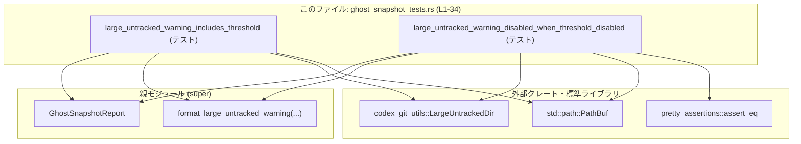
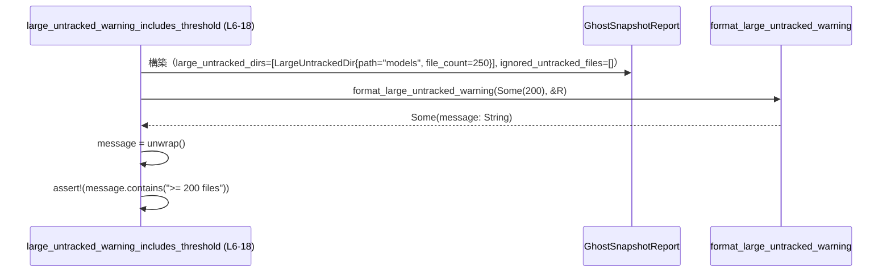
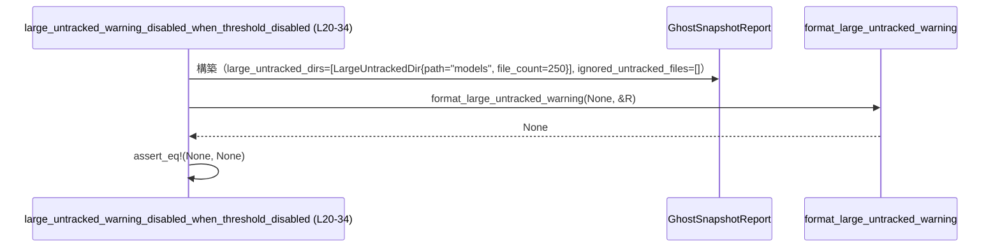

# core/src/tasks/ghost_snapshot_tests.rs コード解説

## 0. ざっくり一言

`GhostSnapshotReport` に対する `format_large_untracked_warning` の振る舞いを検証する **ユニットテスト** を定義したモジュールです（ghost_snapshot_tests.rs:L6-34）。

---

## 1. このモジュールの役割

### 1.1 概要

- Git の「大きな未追跡ディレクトリ」に関するレポート `GhostSnapshotReport` を元に、  
  警告メッセージを組み立てる関数 `format_large_untracked_warning` の挙動をテストするモジュールです（ghost_snapshot_tests.rs:L6-34）。
- 具体的には、しきい値（threshold）が指定された場合と、「無効（None）」にされた場合のメッセージ有無を確認しています（ghost_snapshot_tests.rs:L16-17, L30-32）。

### 1.2 アーキテクチャ内での位置づけ

- 親モジュール（`super`）で定義されている `GhostSnapshotReport` と `format_large_untracked_warning` に依存するテストモジュールです（ghost_snapshot_tests.rs:L1）。
- 外部クレート `codex_git_utils` の `LargeUntrackedDir` と標準ライブラリの `PathBuf` を使ってテスト用データを構築します（ghost_snapshot_tests.rs:L2, L4）。
- アサーションには標準の `assert!` とクレート `pretty_assertions` の `assert_eq` を使用しています（ghost_snapshot_tests.rs:L3, L17, L30-33）。



### 1.3 設計上のポイント

- **純粋なユニットテストのみ**  
  - 新しい型やビジネスロジックは定義せず、既存 API の振る舞い検証に特化しています（ghost_snapshot_tests.rs:L6-34）。
- **状態を持たない**  
  - すべてのテスト関数はローカルな変数だけを使用し、グローバル状態や静的変数は利用していません（ghost_snapshot_tests.rs:L8-14, L22-28）。
- **エラーハンドリングの前提をテストで保証**  
  - `format_large_untracked_warning` の戻り値に対し、`unwrap()` を使うケース（Some を想定）と `None` を直接比較するケースの両方を検証しています（ghost_snapshot_tests.rs:L16-17, L30-32）。
- **並行性なし**  
  - 非同期処理やスレッドは一切使われておらず、単一スレッドで完結するテストです。

---

## 2. コンポーネントインベントリー / 主要な機能一覧

### 2.1 このファイルで定義される関数一覧

| 名前 | 種別 | 役割 / 説明 | 定義行 |
|------|------|-------------|--------|
| `large_untracked_warning_includes_threshold` | テスト関数 (`#[test]`) | しきい値が指定された場合に、フォーマットされた警告メッセージ内にそのしきい値が含まれることを検証します。 | ghost_snapshot_tests.rs:L6-18 |
| `large_untracked_warning_disabled_when_threshold_disabled` | テスト関数 (`#[test]`) | 「大きな未追跡ディレクトリ」警告機能が無効（しきい値 None）な場合、メッセージが生成されない（`None` が返る）ことを検証します。 | ghost_snapshot_tests.rs:L20-34 |

### 2.2 このテストが前提とする主な機能（親モジュール側）

このファイル内には定義がありませんが、テストコードから分かる範囲での整理です。

- `GhostSnapshotReport`
  - フィールド `large_untracked_dirs` と `ignored_untracked_files` を持つ構造体として利用されています（ghost_snapshot_tests.rs:L8-14, L22-28）。
- `format_large_untracked_warning`
  - 引数:
    - 第 1 引数: 「未追跡ディレクトリを警告するしきい値」を表す `Option<整数>` と推測されます（`Some(200)` や `None` を渡しているため, ghost_snapshot_tests.rs:L16, L30-31）。
    - 第 2 引数: `&GhostSnapshotReport`（レポートへの参照）と推測されます（ghost_snapshot_tests.rs:L16, L30-31）。
  - 戻り値:
    - `Option<String>` と考えられます。  
      根拠:
      - `unwrap()` で中身を取り出した値に対し、`contains("&str")` を呼んでいる（`String` のメソッド）（ghost_snapshot_tests.rs:L16-17）。
      - 別のテストでは `assert_eq!(..., None)` として `None` と比較している（`Option` 型であることの根拠, ghost_snapshot_tests.rs:L30-32）。

※ これらのシグネチャはテストから読み取れる範囲での推定であり、実際の定義はこのチャンクには現れません。

---

## 3. 公開 API と詳細解説

このファイル自体には公開 API はありませんが、テストが示す **コアな挙動** を理解しやすくするため、テスト関数を通じて `format_large_untracked_warning` の契約を整理します。

### 3.1 型一覧（このファイルから見える範囲）

| 名前 | 種別 | 役割 / 用途 | 根拠 |
|------|------|-------------|------|
| `GhostSnapshotReport` | 構造体（親モジュール定義） | 「大きな未追跡ディレクトリ」と「無視された未追跡ファイル」の情報をまとめて保持するレポート。テストではフィールド初期化に使用。 | フィールド `large_untracked_dirs`, `ignored_untracked_files` を初期化している（ghost_snapshot_tests.rs:L8-14, L22-28） |
| `LargeUntrackedDir` | 構造体（外部クレート `codex_git_utils`） | 1 つの「大きな未追跡ディレクトリ」を表す。パスとファイル数を保持。 | フィールド `path`, `file_count` を初期化している（ghost_snapshot_tests.rs:L9-12, L23-26） |
| `PathBuf` | 構造体（標準ライブラリ） | ファイルシステム上のパスを所有権付きで表す型。ここではディレクトリ `"models"` を表現。 | `PathBuf::from("models")` として使用（ghost_snapshot_tests.rs:L10, L24） |

### 3.2 関数詳細

#### `large_untracked_warning_includes_threshold()`

**概要**

- 「大きな未追跡ディレクトリ」の警告しきい値が `Some(200)` の場合に、`format_large_untracked_warning` が返すメッセージ内に「`>= 200 files`」という文言が含まれていることを確認します（ghost_snapshot_tests.rs:L6-18）。

**引数**

- なし（テスト関数なので、外部から引数は取りません）。

**戻り値**

- なし（戻り値型は `()`）。テストに失敗した場合はパニックします。

**内部処理の流れ**

1. `GhostSnapshotReport` を構築する  
   - `large_untracked_dirs` に `LargeUntrackedDir` を 1 件追加し、`path = "models"`, `file_count = 250` とします（ghost_snapshot_tests.rs:L8-12）。
   - `ignored_untracked_files` は空の `Vec` とします（ghost_snapshot_tests.rs:L13-14）。
2. `format_large_untracked_warning` を呼び出す  
   - 第 1 引数に `Some(200)`（しきい値 200）、第 2 引数に上記レポートへの参照を渡します（ghost_snapshot_tests.rs:L16）。
   - 戻り値は `Option<String>` と想定されており、`unwrap()` により `String` を取り出します（ghost_snapshot_tests.rs:L16）。
3. 生成されたメッセージを検証する  
   - `message.contains(">= 200 files")` が `true` であることを `assert!` で検証します（ghost_snapshot_tests.rs:L17）。



**Examples（使用例）**

このテスト自体が、`format_large_untracked_warning` の典型的な使用例になっています。

```rust
// しきい値を 200 に設定し、250 ファイルを含む未追跡ディレクトリがあるレポートを作成する
let report = GhostSnapshotReport {
    large_untracked_dirs: vec![LargeUntrackedDir {
        path: PathBuf::from("models"),
        file_count: 250,
    }],
    ignored_untracked_files: Vec::new(),
};

// 警告メッセージを生成する（Some(String) を想定）
let message = format_large_untracked_warning(Some(200), &report).unwrap();

// メッセージにしきい値表現が含まれていることを確認する
assert!(message.contains(">= 200 files"));
```

**Errors / Panics**

- この関数内で明示的にエラー型は扱っていませんが、次の条件でパニックが発生します。
  - `format_large_untracked_warning(Some(200), &report)` が `None` を返した場合、`unwrap()` によりパニックします（ghost_snapshot_tests.rs:L16）。
- これは「しきい値が有効な場合にはメッセージが必ず生成されるべき」という契約をテストで保証しているとも解釈できます。

**Edge cases（エッジケース）**

- `file_count = 250` と `threshold = 200` の関係から、少なくとも「しきい値以上のファイル数がある場合」にメッセージが生成されることが期待されていると読み取れます（ghost_snapshot_tests.rs:L9-12, L16-17）。
- しきい値未満（例: `file_count = 150`）や、`large_untracked_dirs` が空の場合の挙動は、このファイルには現れません（テスト無し）。

**使用上の注意点**

- `format_large_untracked_warning` を `unwrap()` 付きで呼ぶ場合、必ず `Some` を返すことが前提になります。  
  テストではこの前提を確認するために `unwrap()` を使っていますが、実運用コードでは `None` のケースも考慮する必要があります。
- テストは同期的に実行され、スレッド安全性や同時実行についてはここでは検証していません。

---

#### `large_untracked_warning_disabled_when_threshold_disabled()`

**概要**

- 「大きな未追跡ディレクトリ」の警告機能が無効（しきい値が `None`）な場合に、`format_large_untracked_warning` が `None`（メッセージ無し）を返すことを検証します（ghost_snapshot_tests.rs:L20-34）。

**引数**

- なし（テスト関数）。

**戻り値**

- なし（戻り値型は `()`）。

**内部処理の流れ**

1. `GhostSnapshotReport` を構築する  
   - 構築内容は前のテストと同じく、`"models"` ディレクトリで `file_count = 250` の `LargeUntrackedDir` を 1 件含みます（ghost_snapshot_tests.rs:L22-26）。
2. `format_large_untracked_warning` を呼び出す  
   - 第 1 引数として `None` を渡し、コード上のコメントで「`ignore_large_untracked_dirs`」に対応することが示されています（ghost_snapshot_tests.rs:L30-31）。
   - 返り値は `Option<String>` と想定されます。
3. 戻り値が `None` であることを検証する  
   - `assert_eq!(..., None)` により、メッセージが生成されないことを確認します（ghost_snapshot_tests.rs:L30-32）。



**Examples（使用例）**

```rust
// 警告機能が無効な設定（threshold=None）
let report = GhostSnapshotReport {
    large_untracked_dirs: vec![LargeUntrackedDir {
        path: PathBuf::from("models"),
        file_count: 250,
    }],
    ignored_untracked_files: Vec::new(),
};

// しきい値 None の場合はメッセージが生成されないことを期待する
let warning = format_large_untracked_warning(/*ignore_large_untracked_dirs*/ None, &report);
assert_eq!(warning, None);
```

**Errors / Panics**

- このテスト内では `unwrap()` を使っていないため、`format_large_untracked_warning` が `None` を返してもパニックは発生しません。
- `assert_eq!` は比較自体がパニックを起こすことはなく、「`warning != None`」のときにテスト失敗としてパニックします（ghost_snapshot_tests.rs:L30-32）。

**Edge cases（エッジケース）**

- 「しきい値が `None` の場合は、未追跡ディレクトリがどれだけ大きくてもメッセージを出さない」という契約をテストしています（ghost_snapshot_tests.rs:L22-28, L30-32）。
- `None` の意味が「完全無効」なのか「別の挙動をとる」のかは、このテストからは「メッセージ非生成」という部分だけが確定情報です。

**使用上の注意点**

- アプリケーション側で「ユーザーが警告を無効にした」設定を表現する場合、このテストからは「`threshold = None` にマップする」と解釈できます（コメント `/*ignore_large_untracked_dirs*/` がヒント, ghost_snapshot_tests.rs:L30-31）。
- この挙動依存のロジック（例: UI 表示、ログ出力など）を変更する場合は、このテストの期待値も合わせる必要があります。

---

### 3.3 その他の関数

このファイルには補助的な関数やラッパー関数は定義されていません（ghost_snapshot_tests.rs:L1-34）。

---

## 4. データフロー

ここでは、`large_untracked_warning_includes_threshold` テストにおける代表的なデータフローを整理します。

1. テスト関数内で `GhostSnapshotReport` がローカルに構築されます（ghost_snapshot_tests.rs:L8-14）。
2. レポート内の `large_untracked_dirs[0]` には `"models"` ディレクトリと `file_count = 250` が設定されます（ghost_snapshot_tests.rs:L9-12）。
3. `format_large_untracked_warning` に `Some(200)` と `&report` が渡されます（ghost_snapshot_tests.rs:L16）。
4. 関数は内部でレポート内容としきい値を評価し、必要なら `Some(String)` を返し、テストでは `unwrap()` で `String` を取り出します（ghost_snapshot_tests.rs:L16）。
5. 取り出した `String` に対し、`contains(">= 200 files")` でしきい値情報の存在が確認されます（ghost_snapshot_tests.rs:L17）。

```mermaid
flowchart LR
    A["テスト関数<br/>large_untracked_warning_includes_threshold (L6-18)"]
    B["GhostSnapshotReport<br/>(large_untracked_dirs, ignored_untracked_files)"]
    C["format_large_untracked_warning<br/>(threshold: Some(200), &report)"]
    D["Option<String><br/>Some(message)"]
    E["assert!(message.contains(\"&gt;= 200 files\"))"]

    A --> B
    B --> C
    C --> D
    D --> E
```

同様に、`large_untracked_warning_disabled_when_threshold_disabled` では `threshold = None` となり、`Option<String>` の値が `None` として比較されるデータフローになります（ghost_snapshot_tests.rs:L22-28, L30-32）。

---

## 5. 使い方（How to Use）

このファイルはテストモジュールですが、`GhostSnapshotReport` と `format_large_untracked_warning` の使用方法を示す実用的な例になっています。

### 5.1 基本的な使用方法

1. `LargeUntrackedDir` と `PathBuf` を用いて未追跡ディレクトリ情報を構築する。
2. それらを `GhostSnapshotReport` に詰める。
3. `format_large_untracked_warning(threshold, &report)` を呼び出し、戻り値の `Option<String>` を評価する。

```rust
use codex_git_utils::LargeUntrackedDir;          // ghost_snapshot_tests.rs:L2
use std::path::PathBuf;                         // ghost_snapshot_tests.rs:L4

// 1. 未追跡ディレクトリ情報を作成
let large_dir = LargeUntrackedDir {
    path: PathBuf::from("models"),
    file_count: 250,
};

// 2. レポートを作成
let report = GhostSnapshotReport {
    large_untracked_dirs: vec![large_dir],
    ignored_untracked_files: Vec::new(),
};

// 3. しきい値を設定し、警告メッセージを取得
let maybe_warning = format_large_untracked_warning(Some(200), &report);

// 4. 必要に応じてメッセージを利用
if let Some(msg) = maybe_warning {
    println!("Warning: {msg}");
}
```

### 5.2 よくある使用パターン

- **警告機能を有効にする場合**  
  - `Some(threshold)` を渡す（例: `Some(200)`）。  
  - テストから、しきい値以上の未追跡ファイルがあるときにメッセージが生成されることが期待されます（ghost_snapshot_tests.rs:L8-12, L16-17）。

- **警告機能を完全に無効にする場合**  
  - `None` を渡す。  
  - テストでは、この場合 `None` が返り、メッセージは生成されないと検証しています（ghost_snapshot_tests.rs:L22-28, L30-32）。

### 5.3 よくある間違い

テストから推測できる誤用例と正しい使用例です。

```rust
// 誤りの可能性がある例: None の場合にも unwrap() してしまう
let msg = format_large_untracked_warning(None, &report).unwrap(); // None の場合パニックする可能性

// 正しい例: None / Some を分岐して扱う
match format_large_untracked_warning(None, &report) {
    Some(msg) => println!("Warning: {msg}"),
    None => {
        // 警告機能が無効、または警告不要な状態
    }
}
```

### 5.4 使用上の注意点（まとめ）

- `format_large_untracked_warning` の戻り値は `Option<String>` と想定されるため、`unwrap()` を安易に使うと `None` のケースでパニックする可能性があります（ghost_snapshot_tests.rs:L16）。
- `threshold = None` のときはメッセージが生成されないことが、このテストで前提になっています（ghost_snapshot_tests.rs:L30-32）。  
  アプリケーション側でこの挙動に依存するロジックを組む場合、この契約を変更するとテストの修正が必要になります。
- テストでは並行実行や競合状態は扱っていないため、マルチスレッド環境での利用可否は、このチャンクからは分かりません。

---

## 6. 変更の仕方（How to Modify）

このファイルはテスト専用であり、変更は主に **振る舞いの仕様変更に追随する** 目的で行われると考えられます。

### 6.1 新しい機能を追加する場合

例: `format_large_untracked_warning` が新たな条件でメッセージを生成／抑制するようになった場合。

- 追加すべき場所
  - 同じファイルに新しい `#[test]` 関数を追加するのが自然です（ghost_snapshot_tests.rs:L6, L20 のスタイルに倣う）。
- 依存すべき既存の型・関数
  - `GhostSnapshotReport`, `LargeUntrackedDir`, `format_large_untracked_warning` を再利用し、  
    新しい条件（例: ディレクトリ名や複数ディレクトリ）を表現するテストデータを組み立てます。
- 呼び出し元
  - 追加したテストは `cargo test` により自動的に検出・実行されます（Rust の標準テストメカニズム）。

### 6.2 既存の機能を変更する場合

`format_large_untracked_warning` の仕様を変更する場合の注意点です。

- 影響範囲の確認
  - このファイルの 2 つのテストは、以下の契約を前提としています。
    - `threshold = Some(value)` でしきい値以上の未追跡ファイルがあるときに `Some(String)` を返す（ghost_snapshot_tests.rs:L8-12, L16-17）。
    - `threshold = None` のときに `None` を返す（ghost_snapshot_tests.rs:L22-28, L30-32）。
  - これらの前提条件を変える場合、テストの期待値も合わせて修正する必要があります。
- 契約（前提条件・返り値の意味）
  - `None` の意味（完全に警告を無効にするのか、別の挙動をとるのか）は、既存テストでは「メッセージ非生成」として固定されています。
- 関連するテスト・使用箇所の再確認
  - このファイル以外にも `format_large_untracked_warning` を直接呼んでいるコードやテストが存在する可能性があります。  
    それらも合わせて確認する必要があります（このチャンクには現れません）。

---

## 7. 関連ファイル

このモジュールと密接に関係すると考えられるコンポーネントを、このチャンクに現れる情報だけで整理します。

| パス / モジュール | 役割 / 関係 | 根拠 |
|------------------|------------|------|
| `super`（親モジュール） | `GhostSnapshotReport` と `format_large_untracked_warning` を定義・公開しているモジュール。テスト対象の本体。 | `use super::*;` により親モジュールの全公開アイテムをインポートしている（ghost_snapshot_tests.rs:L1） |
| `codex_git_utils::LargeUntrackedDir` | Git リポジトリ内の「大きな未追跡ディレクトリ」を表す型。テスト用レポートデータの構築に使用。 | `use codex_git_utils::LargeUntrackedDir;` と構造体初期化から（ghost_snapshot_tests.rs:L2, L9-12, L23-26） |
| `std::path::PathBuf` | ディレクトリパスを表す標準ライブラリ型。`LargeUntrackedDir.path` に設定される。 | `use std::path::PathBuf;` と `PathBuf::from("models")` から（ghost_snapshot_tests.rs:L4, L10, L24） |
| `pretty_assertions::assert_eq` | 差分表示が分かりやすい `assert_eq` のラッパーマクロ。戻り値の `Option<String>` が `None` であることを検証するのに使用。 | `use pretty_assertions::assert_eq;` と `assert_eq!(..., None)` から（ghost_snapshot_tests.rs:L3, L30-32） |

このチャンクには、親モジュールの実装ファイル名やパスは現れないため、そこについての詳細は不明です。
