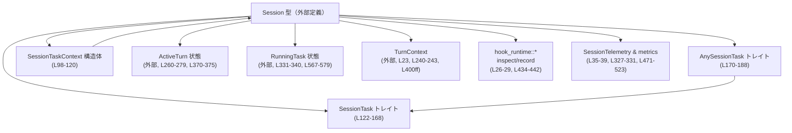
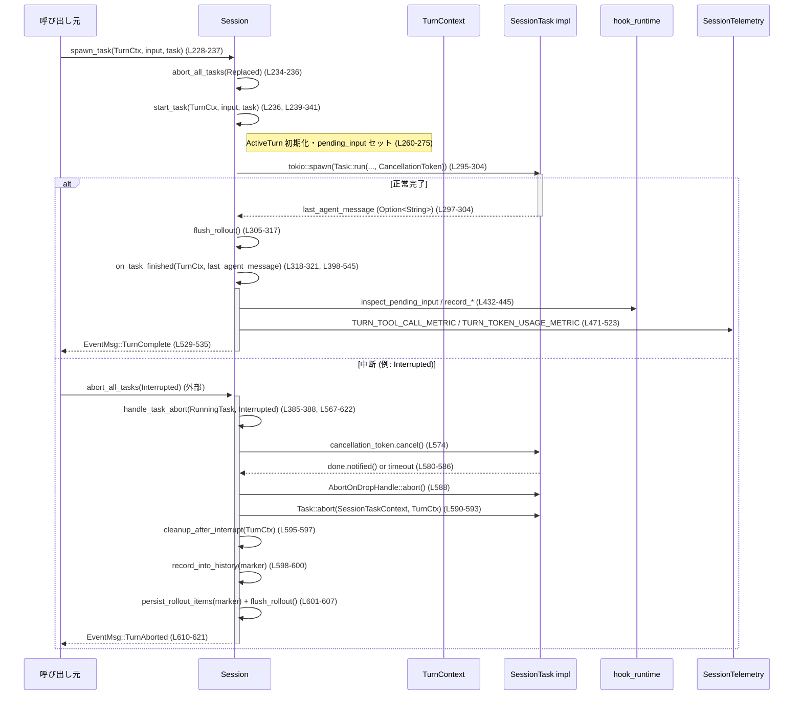

# core/src/tasks/mod.rs コード解説

## 0. ざっくり一言

このモジュールは、`Session` に紐づく「ターン実行タスク」（通常チャット、レビュー、Undo、ユーザーシェルなど）を共通のインターフェースで扱い、Tokio 上での実行・キャンセル・完了処理・メトリクス送信をまとめて管理する基盤です（`core/src/tasks/mod.rs:L1-623`）。

---

## 1. このモジュールの役割

### 1.1 概要

- このモジュールは **セッション内での 1 ターン分の処理を非同期タスクとして実行・制御する問題** を解決するために存在し、以下の機能を提供します。
  - 各種タスク（通常ターン、レビュー、Undo など）の共通トレイト `SessionTask`（`L122-168`）
  - タスクの実行・キャンセル・終了処理を統一的に扱うランタイム (`Session::spawn_task`, `start_task`, `abort_all_tasks`, `handle_task_abort` など、`L227-396`, `L567-622`)
  - ターン完了／中断時のイベント送信とメトリクス集計（`on_task_finished`, `emit_turn_network_proxy_metric` など、`L398-523`, `L81-96`）
  - 「中断されたターン」を履歴に残すためのマーカー生成（`interrupted_turn_history_marker`, `L65-79`）

### 1.2 アーキテクチャ内での位置づけ

`Session` を中心として、タスク実装・状態管理・テレメトリ・フック処理と連携しています。



位置づけの要点（根拠行番号付き）:

- `SessionTask` は「1 ターンを実行するタスク」の共通インターフェースです（`SessionTask: Send + Sync + 'static`, `L130-152`）。
- `AnySessionTask` は `BoxFuture` を使って `SessionTask` をオブジェクトとして扱うためのラッパートレイトです（`L170-188`, `L190-225`）。
- `Session` 実装内でタスク起動・管理・終了処理が行われます（`impl Session { ... }`, `L227-623`）。
- `ActiveTurn` と `RunningTask` はターン状態と実行中タスクのコンテナとして利用されています（`L260-279`, `L331-340`, `L385-392`, `L567-579`）。
- hook_runtime（`inspect_pending_input`, `record_pending_input`, `record_additional_contexts`）はターン完了時の pending input 処理に使われます（`L26-29`, `L432-445`）。
- SessionTelemetry とメトリクス定数（`TURN_*_METRIC`）はターンごとの性能・利用状況を観測するために使われます（`L35-39`, `L327-331`, `L471-523`）。

### 1.3 設計上のポイント

コードから読み取れる特徴を列挙します。

- **責務分割**
  - タスクの「何をするか」は `SessionTask` 実装側（`compact`, `regular` などのサブモジュール）に委ね、ここでは「どう実行・管理するか」に集中しています（`L1-6`, `L53-60`, `L122-168`, `L227-341`）。
  - セッション本体 `Session` へのアクセスは `SessionTaskContext` に限定することで、タスクから見える API を絞っています（`L98-120`）。
- **型とトレイトによる抽象化**
  - `SessionTask` は `impl Future` を返し、実装者は非同期処理を柔軟に書ける設計です（`L146-152`）。
  - `AnySessionTask` + `BoxFuture` により、トレイトオブジェクトとしてタスクを `Arc<dyn AnySessionTask>` で動的に管理しています（`L170-188`, `L245-247`, `L331-336`）。
- **並行性 / キャンセル制御**
  - すべてのタスクは `tokio::spawn` で別タスクとして実行されます（`L294-326`）。
  - キャンセルは `CancellationToken` の階層構造で行われ（`L255`, `L284-285`, `L302`, `L569`, `L574`）、協調的終了を一定時間待ってから強制 abort するフローになっています（`GRACEFULL_INTERRUPTION_TIMEOUT_MS`, `L62`, `L580-586`, `L588`）。
  - `RunningTask` は `AbortOnDropHandle` を保持し、タスク終了・中断時のリソース解放が容易になっています（`L331-339`, `L588`）。
- **エラーハンドリング**
  - 永続化やネットワークプロキシ状態取得の失敗はログや `WarningEvent` としてクライアント/ログに通知しつつ、処理自体は継続します（`L305-317`, `L457-467`）。
  - トークン利用状況取得の失敗は `unwrap_or_default` で吸収し、メトリクスのみが影響を受ける設計です（`L253`, `L481`）。
- **安全性**
  - このファイル内には `unsafe` ブロックは存在しません（全体 `L1-627` に `unsafe` なし）。
  - 共有はすべて `Arc` と非同期ロック (`.lock().await`) で行われています（`L8`, `L100-119`, `L227-241`, `L260-279`, `L547-549`）。

---

## 2. 主要な機能一覧

### 2.1 コンポーネント一覧（このチャンク）

#### サブモジュールと再エクスポート

| コンポーネント | 種別 | 説明 | 定義位置 |
|----------------|------|------|----------|
| `compact` | サブモジュール | Compact なタスク実装（詳細はこのチャンクには現れない） | `core/src/tasks/mod.rs:L1` |
| `ghost_snapshot` | サブモジュール | ゴーストスナップショット用タスク（詳細不明） | `L2` |
| `regular` | サブモジュール | 通常チャットターン用タスク（`RegularTask`） | `L3` |
| `review` | サブモジュール | レビューワークフロー用タスク | `L4` |
| `undo` | サブモジュール | Undo ワークフロー用タスク | `L5` |
| `user_shell` | サブモジュール | ユーザーシェルコマンド関連タスク | `L6` |
| `CompactTask` | 再エクスポート(struct など) | `compact` 内のタスク型 | `L53` |
| `GhostSnapshotTask` | 再エクスポート | ゴーストスナップショットタスク | `L54` |
| `RegularTask` | 再エクスポート | 通常ターンタスク | `L55` |
| `ReviewTask` | 再エクスポート | レビュータスク | `L56` |
| `UndoTask` | 再エクスポート | Undo タスク | `L57` |
| `UserShellCommandMode` | 再エクスポート | ユーザーシェルモード enum 等（詳細不明） | `L58` |
| `UserShellCommandTask` | 再エクスポート | ユーザーシェルコマンドタスク | `L59` |
| `execute_user_shell_command` | 再エクスポート | ユーザーシェルコマンド実行関数 | `L60` |

#### 型・トレイト

| 名前 | 種別 | 役割 / 用途 | 定義位置 |
|------|------|-------------|----------|
| `SessionTaskContext` | 構造体 | タスクが利用できる `Session` 関連 API のラッパー | `L98-120` |
| `SessionTask` | トレイト | 1 ターン分のタスクの共通インターフェース | `L122-168` |
| `AnySessionTask` | トレイト | `SessionTask` を `BoxFuture` ベースの trait object として扱うラッパー | `L170-188` |

#### 関数（自由関数 + メソッド）

| 名前 | 種別 | 説明 | 定義位置 |
|------|------|------|----------|
| `interrupted_turn_history_marker` | 自由関数 | 中断ターンを履歴に残すための共通メッセージ生成 | `L65-79` |
| `emit_turn_network_proxy_metric` | 自由関数 | ネットワークプロキシ状態メトリクスの送信 | `L81-96` |
| `Session::spawn_task` | メソッド | 既存タスクを中断し、新しいタスクを起動 | `L228-237` |
| `Session::start_task` | メソッド (非公開) | タスク起動の詳細実装（状態/メトリクス/トレース設定） | `L239-341` |
| `Session::maybe_start_turn_for_pending_work` | メソッド | ペンディング作業があれば Regular ターンを自動開始 | `L350-353` |
| `Session::maybe_start_turn_for_pending_work_with_sub_id` | メソッド | 指定 sub-id でペンディング用 Regular ターンを開始 | `L359-382` |
| `Session::abort_all_tasks` | メソッド | すべての実行中タスクを指定理由で中断 | `L384-396` |
| `Session::on_task_finished` | メソッド | タスク完了後の pending input 処理とメトリクス、`TurnComplete` イベント送信 | `L398-545` |
| `Session::take_active_turn` | メソッド (非公開) | `ActiveTurn` を取り出して `None` にする | `L547-550` |
| `Session::close_unified_exec_processes` | メソッド | `unified_exec_manager` 上の全プロセスを停止 | `L552-557` |
| `Session::cleanup_after_interrupt` | メソッド | JS REPL カーネルの中断など、割り込み後のクリーンアップ | `L559-564` |
| `Session::handle_task_abort` | メソッド | 個別タスクのキャンセル・強制 abort・マーカー記録・`TurnAborted` イベント送信 | `L567-622` |

### 2.2 機能一覧（概要）

- タスク抽象化: `SessionTask` トレイトで、各種ワークフローを統一的に扱う（`L122-168`）。
- タスク実行ラッパー: `AnySessionTask` + `SessionTaskContext` により、タスクを動的に実行しつつ `Session` の一部機能だけを公開（`L98-120`, `L170-225`）。
- タスク起動と状態管理: `Session::spawn_task` / `start_task` により、アクティブターンの生成・トークン使用量のスナップショット取得・タスクスパン作成・`RunningTask` 登録を行う（`L228-341`）。
- ペンディング作業からの自動ターン起動: mailbox や queued items に基づき、アイドル時に Regular ターンを起動（`L350-382`）。
- タスク中断: `abort_all_tasks` + `handle_task_abort` による協調キャンセル・タイムアウト・強制 abort・中断マーカー記録・`TurnAborted` イベント送信（`L384-396`, `L567-622`）。
- ターン完了処理: `on_task_finished` による pending input hook 実行、メトリクス集計、`TurnComplete` イベント送信、および次のペンディングターンの起動（`L398-545`）。
- 中断マーカー生成: モデルから見える「前ターン中断」の案内メッセージを共通形式で生成（`L65-79`, `L595-603`）。
- 外部プロセス／REPL のクリーンアップ: Unified Exec プロセスと JS REPL カーネルの停止処理（`L552-557`, `L559-564`）。

---

## 3. 公開 API と詳細解説

### 3.1 型一覧（構造体・列挙体・トレイト）

| 名前 | 種別 | 役割 / 用途 | 主な関連関数 | 定義位置 |
|------|------|-------------|--------------|----------|
| `SessionTaskContext` | 構造体 | `Session` への限定的なアクセスをタスクに提供するコンテキスト | `new`, `clone_session`, `auth_manager`, `models_manager` | `core/src/tasks/mod.rs:L98-120` |
| `SessionTask` | トレイト | タスク実装が従うべきインターフェース（`kind`, `span_name`, `run`, `abort`） | `Session::start_task`, `impl<T> AnySessionTask for T` | `L122-168` |
| `AnySessionTask` | トレイト | `SessionTask` を `BoxFuture` ベースの trait object として扱うためのアダプタ | `impl<T> AnySessionTask for T` | `L170-188`, `L190-225` |
| `CompactTask` ほか | 構造体/タスク型（外部定義） | 個別ワークフロー毎の `SessionTask` 実装（詳細はそれぞれのモジュールに依存） | `Session::start_task` 経由で実行 | `L53-60` |

### 3.2 関数詳細（重要な 7 件）

#### 3.2.1 `interrupted_turn_history_marker() -> ResponseItem`  

（`core/src/tasks/mod.rs:L67-79`）

**概要**

- ターンがユーザーによって中断されたことを会話履歴に明示するための、共通フォーマットの `ResponseItem::Message` を生成します。
- 実際の記録・永続化は `Session::handle_task_abort` 内で利用されています（`L595-603`）。

**引数**

- なし

**戻り値**

- `ResponseItem`（`ResponseItem::Message` バリアント）  
  - role は `"user"` 固定（`L70`）。
  - content は `ContentItem::InputText` 1 要素で、`TURN_ABORTED_OPEN_TAG` / `TURN_ABORTED_CLOSE_TAG` で挟んだガイダンス文を含みます（`L71-75`）。

**内部処理の流れ**

1. `ResponseItem::Message` バリアントを構築する（`L68-78`）。
2. `role` に `"user"` を設定（`L70`）。
3. `content` に `ContentItem::InputText { text: ... }` を 1 要素の `Vec` として設定し、`format!` でタグ + ガイダンス文を組み立てる（`L71-75`）。
4. `end_turn` と `phase` は `None` のまま返す（`L76-77`）。

**Examples（使用例）**

`Session::handle_task_abort` からの利用例（抜粋）:

```rust
// 中断時 (TurnAbortReason::Interrupted) に履歴へマーカーを追加する           // ターンがユーザーにより中断された場合の処理
let marker = interrupted_turn_history_marker();                             // 共通フォーマットの中断メッセージを生成 (L595-603)
self.record_into_history(std::slice::from_ref(&marker), task.turn_context.as_ref())
    .await;                                                                 // 履歴へ記録
self.persist_rollout_items(&[RolloutItem::ResponseItem(marker)])
    .await;                                                                 // ロールアウトへ永続化
```

**Errors / Panics**

- この関数内部では I/O や `Result`/`Option` のアンラップは行っておらず、パニック要因は特にありません。
- `format!` マクロはフォーマット文字列が静的リテラルのため安全です（`L73`）。

**Edge cases（エッジケース）**

- `TURN_ABORTED_OPEN_TAG` / `CLOSE_TAG` / ガイダンス文字列が非常に長い場合は、そのまま長いメッセージが生成されますが、ここでは特別な制限・切り詰め処理は行われません（タグ/文言は別モジュールで定義、`L24-25`, `L62-63`）。
- 文字コードやローカライズ（多言語対応）に関する処理はありません。

**使用上の注意点**

- モデルに「前のターンがユーザーにより中断された」ことを認識させるためのマーカーであり、**中断時のみ** 使用されます（`Session::handle_task_abort`, `L595-603`）。
- 同じターン内で複数回呼び出すと履歴に同じマーカーが重複して記録される可能性があります。実際の利用では 1 回に限定されています。

---

#### 3.2.2 `trait SessionTask::run`  

（シグネチャ定義: `core/src/tasks/mod.rs:L146-152`）

```rust
fn run(
    self: Arc<Self>,
    session: Arc<SessionTaskContext>,
    ctx: Arc<TurnContext>,
    input: Vec<UserInput>,
    cancellation_token: CancellationToken,
) -> impl std::future::Future<Output = Option<String>> + Send;
```

**概要**

- 1 つのターンを「最後まで」実行する非同期処理を定義するメソッドです（`L138-145`）。
- 実装は、`session` と `ctx` を用いてプロトコルイベントをストリーミングし、完了時に「最終エージェントメッセージ」（任意）を返します。
- `cancellation_token` がキャンセルされた場合は **迅速に終了する** ことが期待されています（`L142-144`）。

**引数**

| 引数名 | 型 | 説明 |
|--------|----|------|
| `self` | `Arc<Self>` | タスクインスタンス本体。`Arc` による所有権移動で `tokio::spawn` などへ安全に渡せる設計です。 |
| `session` | `Arc<SessionTaskContext>` | タスクが利用できる `Session` 機能のラッパー（認証やモデル管理など） |
| `ctx` | `Arc<TurnContext>` | 当該ターン固有のコンテキスト（サブ ID・モデル情報・テレメトリなど） |
| `input` | `Vec<UserInput>` | ターン開始時に与えられるユーザー入力のリスト |
| `cancellation_token` | `CancellationToken` | セッションからの中断要求を表すトークン。`is_cancelled` や `cancelled().await` で監視します。 |

**戻り値**

- `impl Future<Output = Option<String>> + Send`  
  - `Some(String)` の場合: 最終エージェントメッセージを表す文字列が返され、`Session::on_task_finished` によりクライアントへ通知されます（`L320-321`, `L398-402`, `L529-535`）。
  - `None` の場合: 特別な最終メッセージを伴わずにターンが完了したと見なされます。

**内部処理の流れ**

- `SessionTask` はトレイトであり、**このファイル内には具体的な実装はありません**。
- このメソッドは「シグネチャと契約（contract）」のみを定めており、実装は各タスク型（`RegularTask` や `ReviewTask` など）のモジュールで定義されています（`L53-60`）。

**Examples（使用例）**

簡易なエコータスクのイメージ例です（実際のコードベースには存在しません）。

```rust
use std::sync::Arc;
use tokio_util::sync::CancellationToken;
use codex_protocol::user_input::UserInput;
use crate::codex::{Session, TurnContext};
use crate::tasks::{SessionTask, SessionTaskContext}; // モジュール構成に応じて調整

struct EchoTask;                                                       // シンプルなタスク型

impl SessionTask for EchoTask {
    fn kind(&self) -> crate::state::TaskKind {                         // タスク種別
        crate::state::TaskKind::Regular                               // 例: Regular として扱う
    }

    fn span_name(&self) -> &'static str {                              // トレーススパン名
        "echo_turn"
    }

    fn run(
        self: Arc<Self>,
        _session: Arc<SessionTaskContext>,
        _ctx: Arc<TurnContext>,
        input: Vec<UserInput>,
        cancellation_token: CancellationToken,
    ) -> impl std::future::Future<Output = Option<String>> + Send {
        async move {
            if cancellation_token.is_cancelled() {                     // 中断要求を確認
                return None;
            }

            // 入力をそのまま文字列化して返す（例示用）                 // 実際にはイベント送信などを行うはず
            let text = format!("Received {} inputs", input.len());
            Some(text)
        }
    }
}
```

**Errors / Panics**

- トレイトレベルではエラー型は定義されていません。エラーは以下のいずれかで扱うことになります。
  - 内部でログ出力・イベント送信して `Ok` 相当として終了する。
  - `panic!` による異常終了（ただしセッション全体には影響するため慎重な扱いが必要）。
- `Send + Sync + 'static` 制約（`L130`）により、**非 `Send` 型を保持したり、短命な参照を閉じ込めたりする実装はコンパイルエラー**になります。

**Edge cases（エッジケース）**

- `input` が空 (`Vec::new()`) の場合: 多くのタスクでは「内部ペンディングキュー（`pending_input`）だけで処理する」形になります。実際に `RegularTask` 自動起動時は `Vec::new()` が渡されています（`L380-381`）。
- `cancellation_token` がすでにキャンセル済みで `run` が呼ばれる可能性もあります。その場合でも、タスク側はトークンをチェックしてすぐに終了できるようにする必要があります（契約上の期待）。

**使用上の注意点**

- `run` は `self: Arc<Self>` を受け取るため、**内部で `self` をクローンして別タスクに渡すことも可能ですが、循環参照に注意**する必要があります。
- 長時間ブロッキングする同期 I/O を直接行うと、Tokio のスレッドプールをブロックするため、必要な場合は `spawn_blocking` 等を利用する設計が適切です（このファイル内にはそのようなブロッキング I/O 呼び出しはありません）。
- `cancellation_token` の監視を怠ると、`abort_all_tasks` 呼び出しからの中断が遅延し、`GRACEFULL_INTERRUPTION_TIMEOUT_MS` 経過後に強制 abort されます（`L62`, `L580-588`）。

---

#### 3.2.3 `Session::spawn_task`  

（`core/src/tasks/mod.rs:L228-237`）

```rust
pub async fn spawn_task<T: SessionTask>(
    self: &Arc<Self>,
    turn_context: Arc<TurnContext>,
    input: Vec<UserInput>,
    task: T,
)
```

**概要**

- 新しい `SessionTask` を現在のセッションに対して起動するエントリポイントです。
- 既存の実行中タスクを指定理由 `TurnAbortReason::Replaced` で中断し、コネクタ選択状態をクリアしたうえで、`start_task` に処理を委譲します（`L234-236`）。

**引数**

| 引数名 | 型 | 説明 |
|--------|----|------|
| `self` | `&Arc<Session>` | タスクを起動する対象セッション |
| `turn_context` | `Arc<TurnContext>` | 起動するターンのコンテキスト（サブ ID, モデル情報等） |
| `input` | `Vec<UserInput>` | ターンに渡すユーザー入力 |
| `task` | `T: SessionTask` | 実行するタスク実装 |

**戻り値**

- `Future<Output = ()>`（`async fn`）  
  - 完了すると、新しいタスクが `RunningTask` として登録済みになっています。

**内部処理の流れ**

1. 既存タスクをすべて `TurnAbortReason::Replaced` で中断します（`abort_all_tasks`, `L234`）。
2. セッションのコネクタ選択状態をクリアします（`clear_connector_selection().await`, `L235`）。
3. `start_task` を呼び出し、実際のタスク起動処理を行います（`L236`）。

**Examples（使用例）**

```rust
// Session と TurnContext が既にあると仮定                                   // 既存のセッション・ターンコンテキスト
use std::sync::Arc;
use codex_protocol::user_input::UserInput;
use crate::codex::{Session, TurnContext};
use crate::tasks::{SessionTask, SessionTaskContext};

async fn start_regular_turn(session: Arc<Session>, ctx: Arc<TurnContext>, input: Vec<UserInput>) {
    // 既存のタスクは TurnAbortReason::Replaced として中断される              // 既存ターンは置き換え扱い
    session.spawn_task(ctx, input, crate::tasks::RegularTask::new()).await;
}
```

**Errors / Panics**

- `abort_all_tasks` と `start_task` から伝搬する `Result` はなく、明示的なエラー戻り値はありません（`L234-237`）。
- どちらの内部でもパニックを引き起こすコードはこのチャンクには見当たりません（`L384-396`, `L239-341`）。

**Edge cases（エッジケース）**

- 実行中タスクがない状態で `spawn_task` を呼び出した場合、`abort_all_tasks` はノーオペレーションに等しく、そのまま新タスクが起動します（`take_active_turn` が `None` を返す可能性, `L384-386`, `L547-550`）。
- `clear_connector_selection` の挙動はこのチャンクでは不明ですが、コネクタ依存の振る舞いに影響します（`L235`）。  

**使用上の注意点**

- `spawn_task` は常に既存タスクを **置き換える** 振る舞いをします。並行して複数のターンを走らせたい場合は、別セッションや別 API を検討する必要があります（このチャンクには並列ターン実行は現れません）。
- `turn_context` は呼び出し側で構築する必要があり、`Session` 内にも「自動生成する」経路はありますが、それは `maybe_start_turn_for_pending_work*` の方です（`L350-382`）。

---

#### 3.2.4 `Session::start_task`  

（`core/src/tasks/mod.rs:L239-341`）

```rust
async fn start_task<T: SessionTask>(
    self: &Arc<Self>,
    turn_context: Arc<TurnContext>,
    input: Vec<UserInput>,
    task: T,
)
```

**概要**

- `spawn_task` から呼び出される、タスク起動のコアロジックです。
- ターン開始時刻・トークン利用量のスナップショット取得、ペンディング入力の取り込み、`RunningTask` の生成・登録、Tokio タスクへの実行委譲などをまとめて行います。

**引数**

- `spawn_task` と同じ（`L239-244`）。

**戻り値**

- `Future<Output = ()>`（`async fn`）  
  - 正常完了時には `ActiveTurn` に `RunningTask` が 1 件登録されます（`L331-340`）。

**内部処理の流れ**

1. `task` を `Arc<dyn AnySessionTask>` にアップキャストし、`kind` と `span_name` を取得（`L245-247`）。
2. 現在時刻を取得し、ターン開始を `turn_timing_state` に記録（`L248-252`）。
3. セッション全体のトークン利用量を読み、ターン開始時のスナップショットを保持（`total_token_usage().await.unwrap_or_default()`, `L253`）。
4. 新しい `CancellationToken` と `Notify` を作成（`L255-257`）。
5. 次ターン用にキューされているレスポンスや mailbox アイテムを取り出し（`take_queued_response_items_for_next_turn`, `get_pending_input`, `L258-259`）、`ActiveTurn` の `turn_state.pending_input` に追加する（`L260-275`）。
6. `active_turn` を再度ロックし、`RunningTask` を追加する前提としてタスクリストが空であることを `debug_assert!` で確認（`L277-279`, `L340`）。
7. `SessionTaskContext`, `TurnContext`, `AnySessionTask` への `Arc` クローン、および子 `CancellationToken` を準備（`L281-285`）。
8. `info_span!` で "turn" スパンを作成し（`L285-293`）、`tokio::spawn` でタスクを起動。内部では:
   - `SessionTask::run` を実行（`task_for_run.run(...)`, `L297-304`）。
   - `flush_rollout` を試行し、失敗時には `WarningEvent` をクライアントへ送信（`L305-317`）。
   - `task_cancellation_token` が未キャンセルなら `on_task_finished` を呼び出す（`L318-321`）。
   - 最後に `done.notify_waiters()` で待機中のキャンセル処理へ通知（`L323`）。
9. E2E ターンタイマーを開始し、`RunningTask` を構築・`ActiveTurn` へ登録（`L327-340`）。

**Examples（使用例）**

`start_task` 自体は非公開ですが、起動の全体像は `spawn_task` 経由で以下のように利用されます（3.2.3 の例を参照）。

**Errors / Panics**

- `total_token_usage().await.unwrap_or_default()`  
  - 内部 `Result` が `Err` の場合でも `unwrap_or_default` により 0 相当の値が使われます（`L253`）。
- `session_telemetry.start_timer(...).ok()`  
  - テレメトリ初期化失敗は silently ignore されます（`L327-331`）。
- `tokio::spawn`・`info_span!`・`AbortOnDropHandle::new` は、通常の使用ではパニックを引き起こしません。

**Edge cases（エッジケース）**

- `active_turn` が既に存在するが `tasks.is_empty()` でない場合、`debug_assert!` によりデバッグビルドではパニックします（`L263`, `L279`）。本番ビルドでは無視されます。
- `take_queued_response_items_for_next_turn` または `get_pending_input` が大量のデータを返すと、`pending_input` の初期サイズが大きくなりますが、このファイル内にはサイズ制限やストリーミング分割処理はありません（`L258-275`）。

**使用上の注意点**

- `start_task` は **1 アクティブターンに 1 タスク** という前提で設計されており、複数タスクを同時に同一ターンにぶら下げる用途には向いていません（`debug_assert!(turn.tasks.is_empty())`, `L263`, `L279`）。
- タスク実装 (`SessionTask::run`) が `cancellation_token` を無視すると、`handle_task_abort` による中断時に 100ms 待機後に強制 abort されます（`L62`, `L580-588`）。

---

#### 3.2.5 `Session::abort_all_tasks`  

（`core/src/tasks/mod.rs:L384-396`）

```rust
pub async fn abort_all_tasks(self: &Arc<Self>, reason: TurnAbortReason)
```

**概要**

- 現在アクティブなターンに紐づくすべての `RunningTask` を指定された `TurnAbortReason` で中断し、必要に応じてペンディング作業から次のターンを起動します。

**引数**

| 引数名 | 型 | 説明 |
|--------|----|------|
| `self` | `&Arc<Session>` | 対象セッション |
| `reason` | `TurnAbortReason` | 中断理由（例: `Interrupted`, `Replaced` など） |

**戻り値**

- `Future<Output = ()>`。

**内部処理の流れ**

1. `take_active_turn()` で現在の `ActiveTurn` を取り出し、`self.active_turn` を `None` にします（`L384-386`, `L547-550`）。
2. `ActiveTurn::drain_tasks()` で全 `RunningTask` を取り出し、それぞれについて `handle_task_abort(task, reason.clone()).await` を呼びます（`L385-388`）。
3. コメントに記載されているように、「タスクがキャンセルを観測する前に pending approvals を削除すると、モデルから見える拒否が `TurnAborted` より先に現れる」ことを避けるため、タスクのキャンセル処理完了後に `active_turn.clear_pending().await` を行います（`L389-391`）。
4. `reason == TurnAbortReason::Interrupted` の場合、`maybe_start_turn_for_pending_work().await` を呼び、ペンディング作業があれば新たな Regular ターンを自動開始します（`L393-395`）。

**Examples（使用例）**

ユーザー操作による「STOP ボタン」などから呼ばれることを想定した例です。

```rust
use std::sync::Arc;
use codex_protocol::protocol::TurnAbortReason;
use crate::codex::Session;

async fn user_pressed_stop(session: Arc<Session>) {
    session.abort_all_tasks(TurnAbortReason::Interrupted).await;   // ユーザーによる中断
}
```

**Errors / Panics**

- `take_active_turn` が `None` を返す（アクティブターンがない）場合は、タスクの中断処理は行われず、そのまま終了します（`L384-386`）。
- `handle_task_abort` 内には `flush_rollout` のエラー処理がありますが、`abort_all_tasks` 自体はエラーを返しません（`L595-607`）。

**Edge cases（エッジケース）**

- `reason == TurnAbortReason::Replaced` の場合は、ターン中断後にペンディングから自動ターンを起動しません（`L393-395`）。
- 再入可能性: `abort_all_tasks` 実行中に再度 `abort_all_tasks` が呼ばれた場合の挙動は、このチャンクからは分かりませんが、`take_active_turn` によって `ActiveTurn` は一度しか取得できない設計です（`L547-550`）。

**使用上の注意点**

- `abort_all_tasks` は、**アクティブターン全体の終了** を意図しています。個別タスクだけを中断したい場合は、`ActiveTurn` の管理側 API を利用する必要があります（このチャンクにはそのような API は現れません）。
- `TurnAbortReason::Interrupted` を指定した場合、ペンディング作業があると自動的に次の Regular ターンを起動するため、「ユーザーが完全に会話を止めたい」用途では `Interrupted` 以外の理由を使う設計もありえます（理由と挙動の対応は `maybe_start_turn_for_pending_work`, `L350-382` に依存）。

---

#### 3.2.6 `Session::on_task_finished`  

（`core/src/tasks/mod.rs:L398-545`）

```rust
pub async fn on_task_finished(
    self: &Arc<Self>,
    turn_context: Arc<TurnContext>,
    last_agent_message: Option<String>,
)
```

**概要**

- タスクが正常完了した後に呼び出されるフックで、以下を行います。
  - ターン状態 (`ActiveTurn` / `turn_state`) の更新と `pending_input` 取り出し
  - pending input の hook 実行 (`inspect_pending_input`) と記録 (`record_pending_input`, `record_additional_contexts`)
  - トークン使用量・ツール呼び出し回数などのメトリクス送信
  - `TurnCompleteEvent` をクライアントに送信
  - ターン終了後のペンディング作業に応じた次ターンの自動起動

**引数**

| 引数名 | 型 | 説明 |
|--------|----|------|
| `self` | `&Arc<Session>` | 対象セッション |
| `turn_context` | `Arc<TurnContext>` | 終了したタスクのターンコンテキスト |
| `last_agent_message` | `Option<String>` | `SessionTask::run` から返された最終メッセージ |

**戻り値**

- `Future<Output = ()>`。

**内部処理の流れ（要約）**

1. `turn_metadata_state.cancel_git_enrichment_task()` で Git 関連の非同期タスクをキャンセル（`L403-405`）。
2. ローカル変数を初期化（`pending_input`, `should_clear_active_turn`, `token_usage_at_turn_start`, `turn_tool_calls`, `L407-410`）。
3. `self.active_turn` をロックし、`remove_task(&turn_context.sub_id)` で当該ターンのタスクを除去（`L412-421`）。
   - 成功した場合、`should_clear_active_turn = true` とし、`active_turn` 全体を `None` にします（`L416-420`）。
   - `turn_state` への `Arc` を取り出します（`L417`）。
4. `turn_state` が取得できた場合、ロックして `pending_input`・`tool_calls`・`token_usage_at_turn_start` を取り出します（`L426-431`）。
5. `pending_input` を 1 件ずつ `inspect_pending_input(self, &turn_context, pending_input_item).await` に渡し、  
   - `Accepted(pending_input)` なら `record_pending_input` で記録（`L435-437`）。
   - `Blocked{ additional_contexts }` なら `record_additional_contexts` で追加コンテキストを保存（`L438-442`）。
6. `token_usage_at_turn_start` があれば、ターン内で消費されたトークン数を計算して、各種メトリクスを送信（`L447-523`）。
7. `turn_timing_state.completed_at_and_duration_ms()` で完了時刻とターン時間を取得し、`TurnCompleteEvent` を作成・送信（`L525-535`）。
8. `should_clear_active_turn` が `true` なら、`spawn_blocking` で `maybe_start_turn_for_pending_work` を実行し、ペンディング作業に応じた次ターン起動を試みる（`L537-544`）。

**Examples（使用例）**

`SessionTask::run` の終了後、`start_task` の内部から次のように呼び出されます。

```rust
// start_task 内の抜粋 (L295-323)
let ctx_for_finish = Arc::clone(&ctx);
let last_agent_message = task_for_run
    .run(
        Arc::clone(&session_ctx),
        ctx,
        input,
        task_cancellation_token.child_token(),
    )
    .await;
let sess = session_ctx.clone_session();

// ... flush_rollout 処理 ...

if !task_cancellation_token.is_cancelled() {
    sess.on_task_finished(Arc::clone(&ctx_for_finish), last_agent_message)
        .await;                                                     // 正常完了時の後処理
}
```

**Errors / Panics**

- `inspect_pending_input`, `record_pending_input`, `record_additional_contexts` は `await` されていますが、戻り値型はこのチャンクには現れません（`L434-442`）。エラー処理がどう行われるかは不明です。
- `total_token_usage().await.unwrap_or_default()` の失敗は 0 として扱われます（`L481`）。
- `i64::try_from(turn_tool_calls).unwrap_or(i64::MAX)` により、ツール呼び出し回数が `i64` に収まらない場合でも、`i64::MAX` を使うことでパニックを防いでいます（`L477-479`）。
- 例外的なケースでも、`on_task_finished` は `Result` を返さず、失敗時の詳細はログやテレメトリに依存します。

**Edge cases（エッジケース）**

- `remove_task(&turn_context.sub_id)` が `false` を返す場合（該当タスクが見つからない等）は、`turn_state` は `None` となり、pending input の処理やメトリクス送信は行われません（`L412-425`）。
- `pending_input` が空の場合は、hook 処理はスキップされます（`L432-445`）。
- `network_proxy_active` 取得に失敗した場合は警告ログを出力しつつ `false` とみなします（`L457-467`）。
- `token_usage_at_turn_start` が `None` の場合（理論上）は、トークン利用メトリクスは送信されません（`L447` の条件）。

**使用上の注意点**

- `on_task_finished` は、**キャンセルされていないタスク** に対してのみ呼び出される設計です。`start_task` 側で `task_cancellation_token.is_cancelled()` をチェックしているためです（`L318-321`）。
- ターンが終了すると `ActiveTurn` 自体が `None` にされるため、`ActiveTurn` に依存する他のコンポーネントは、`on_task_finished` 以外のタイミングで状態を読まない設計が前提になります（`L412-421`）。

---

#### 3.2.7 `Session::handle_task_abort`  

（`core/src/tasks/mod.rs:L567-622`）

```rust
async fn handle_task_abort(self: &Arc<Self>, task: RunningTask, reason: TurnAbortReason)
```

**概要**

- 個々の `RunningTask` を中断するための詳細処理です。
- キャンセルトークンによる協調的終了を待機し、一定時間を過ぎたら `AbortOnDropHandle` で強制中断し、必要に応じて中断マーカーを履歴・ロールアウトに記録し、`TurnAbortedEvent` をクライアントに送信します。

**引数**

| 引数名 | 型 | 説明 |
|--------|----|------|
| `self` | `&Arc<Session>` | 対象セッション |
| `task` | `RunningTask` | 中断対象タスク（`done`, `handle`, `cancellation_token`, `turn_context`, `task` フィールドなどを持つ） |
| `reason` | `TurnAbortReason` | 中断理由 |

**戻り値**

- `Future<Output = ()>`。

**内部処理の流れ**

1. `sub_id` をローカルに保持し、`task.cancellation_token.is_cancelled()` が `true` の場合は早期リターン（`L568-571`）。
2. `trace!` ログで中断開始を記録し、`task.cancellation_token.cancel()` と `cancel_git_enrichment_task()` を呼ぶ（`L573-577`）。
3. `session_task = task.task` を取り出す（`L578`）。
4. `tokio::select!` で以下のどちらかを待つ（`L580-586`）。
   - `task.done.notified()`: タスクが自発的に完了する。
   - `tokio::time::sleep(Duration::from_millis(GRACEFULL_INTERRUPTION_TIMEOUT_MS))`: 100ms 経過。経過した場合は警告ログを出す（`L583-585`）。
5. `task.handle.abort()` で強制的に Tokio タスクを中断（`L588`）。
6. 新たに `SessionTaskContext` を作り、`session_task.abort(session_ctx, Arc::clone(&task.turn_context)).await` でタスク固有のクリーンアップ処理を呼ぶ（`L590-593`）。
7. `reason == TurnAbortReason::Interrupted` の場合は、さらに:
   - `cleanup_after_interrupt(&task.turn_context).await` で JS REPL カーネルの中断を試みる（`L595-597`）。
   - `interrupted_turn_history_marker()` でマーカーを生成し、履歴とロールアウトに記録（`L598-602`）。
   - `flush_rollout().await` でマーカーを永続化し、失敗時は警告ログ（`L603-607`）。
8. `turn_timing_state.completed_at_and_duration_ms()` で完了時刻と時間を取得し、`TurnAbortedEvent` を生成・送信（`L610-621`）。

**Examples（使用例）**

外部から直接呼び出されることはなく、`abort_all_tasks` からのみ使われます（`L385-388`）。

**Errors / Panics**

- `flush_rollout().await` の失敗はログで報告されますが、処理は継続します（`L603-607`）。
- JS REPL カーネル中断の失敗 (`interrupt_turn_exec`) も警告ログのみで扱われます（`L559-564` が `cleanup_after_interrupt` の定義）。
- `session_task.abort(...)` 内のエラー処理は各タスク実装に依存し、このチャンクには現れません。

**Edge cases（エッジケース）**

- `task.cancellation_token` がすでにキャンセル済みの場合は、一切の処理を行わずに終了します（`L569-571`）。  
  → `on_task_finished` 側との二重処理を避ける意図が読み取れます。
- タスクが 100ms 以内に終了しない場合は、ログに警告が出ますが、それ以上の遅延対策（リトライなど）はありません（`L580-586`）。
- `reason != Interrupted` の場合でも、`TurnAbortedEvent` は常に送信されますが、中断マーカーは履歴に記録されません（`L595-603`）。

**使用上の注意点**

- `RunningTask` の `done` と `cancellation_token` が正しく連携していることが前提となっています。タスク実装側で `done.notify_waiters()` を呼び損ねると、`GRACEFULL_INTERRUPTION_TIMEOUT_MS` 経過後に強制 abort されがちになります（実際には `start_task` 内の closure で必ず `notify_waiters` しています, `L323`）。
- `reason == Interrupted` の場合にのみ JS REPL や履歴マーカー処理が行われるため、「Replaced」など他の理由では外部リソースが残る可能性があります（ただし `close_unified_exec_processes` など他の経路でクリーンアップする設計かどうかは、このチャンクからは不明です）。

---

### 3.3 その他の関数（簡易一覧）

| 関数名 | 役割（1 行） | 定義位置 |
|--------|--------------|----------|
| `emit_turn_network_proxy_metric` | ターン中にネットワークプロキシが有効だったかどうかをメトリクスに記録する | `L81-96`, 呼び出し: `L471-475` |
| `SessionTaskContext::new` / `clone_session` / `auth_manager` / `models_manager` | タスクから `Session` や関連サービスへ安全にアクセスするためのヘルパー | `L104-119` |
| `AnySessionTask::run/abort`（トレイト + 実装） | `SessionTask::run/abort` を `BoxFuture` に包んで動的ディスパッチ可能にする | `L170-188`, `L190-225` |
| `Session::maybe_start_turn_for_pending_work` | ペンディング作業があり、現在アイドルならサブ ID を生成して Regular ターンを起動する | `L350-353` |
| `Session::maybe_start_turn_for_pending_work_with_sub_id` | 引数の `sub_id` を使って上記処理を行う実装本体 | `L359-382` |
| `Session::take_active_turn` | `self.active_turn` を取り出して `None` にする内部ヘルパー | `L547-550` |
| `Session::close_unified_exec_processes` | `unified_exec_manager` 上の全プロセスを終了 | `L552-557` |
| `Session::cleanup_after_interrupt` | JS REPL カーネルの `interrupt_turn_exec` を呼び出す | `L559-564` |

---

## 4. データフロー

ここでは、「`spawn_task` で通常ターンが開始され、完了または中断に至る」までの代表的なフローを示します。

### 4.1 処理フローの概要

1. 呼び出し元が `Session::spawn_task` を呼び、既存タスクを `abort_all_tasks(Replaced)` で中断したうえで `start_task` を実行（`L228-237`）。
2. `start_task` は `ActiveTurn` を初期化し、pending input をセットし、`RunningTask` を登録して `tokio::spawn` で `SessionTask::run` を起動（`L245-341`）。
3. タスクが正常完了すると、`start_task` 内の closure が `flush_rollout` を試み、成功・失敗に関わらず（キャンセルされていなければ）`on_task_finished` を呼ぶ（`L295-323`）。
4. `on_task_finished` は pending input hook 処理、メトリクス送信、`TurnCompleteEvent` の送信、ペンディング作業に応じた次ターン起動を行う（`L398-545`）。
5. ユーザーやシステムから中断指示が出た場合、`abort_all_tasks(reason)` → `handle_task_abort` が呼ばれ、協調キャンセル → 強制 abort → `TurnAbortedEvent` 送信が行われる（`L384-396`, `L567-622`）。

### 4.2 シーケンス図



---

## 5. 使い方（How to Use）

### 5.1 基本的な使用方法

1. `SessionTask` を実装したタスク型を用意します（例: `RegularTask` は既に実装済み、`L55`）。
2. `Session` と `TurnContext` を用意し、`session.spawn_task(turn_context, input, task)` を呼びます（`L228-237`）。
3. タスク内 (`SessionTask::run`) では `SessionTaskContext` や `TurnContext` を使ってイベント送信などを行い、最後に `Option<String>` を返します。

例として、単純なタスクを定義して起動するコードです（コンセプト例）。

```rust
use std::sync::Arc;
use tokio_util::sync::CancellationToken;
use codex_protocol::user_input::UserInput;
use crate::codex::{Session, TurnContext};
use crate::tasks::{SessionTask, SessionTaskContext};

struct SimpleTask;                                                       // シンプルなタスク

impl SessionTask for SimpleTask {
    fn kind(&self) -> crate::state::TaskKind {                           // タスク種別
        crate::state::TaskKind::Regular
    }

    fn span_name(&self) -> &'static str {                                // トレース用スパン名
        "simple_task"
    }

    fn run(
        self: Arc<Self>,
        _session: Arc<SessionTaskContext>,
        _ctx: Arc<TurnContext>,
        input: Vec<UserInput>,
        cancellation_token: CancellationToken,
    ) -> impl std::future::Future<Output = Option<String>> + Send {
        async move {
            if cancellation_token.is_cancelled() {                       // 中断ならすぐ終了
                return None;
            }
            let msg = format!("Processed {} inputs", input.len());       // 結果文字列を生成
            Some(msg)                                                    // 最終メッセージとして返す
        }
    }
}

async fn start_simple_task(
    session: Arc<Session>,
    ctx: Arc<TurnContext>,
    input: Vec<UserInput>,
) {
    session.spawn_task(ctx, input, SimpleTask).await;                     // タスクを起動 (L228-237)
}
```

### 5.2 よくある使用パターン

- **通常ターンの起動**
  - ユーザー入力が届いたタイミングで `RegularTask::new()` を `spawn_task` に渡して実行（`L55`, `L228-237`）。
- **ペンディング作業からの自動ターン**
  - 明示的なユーザー入力がない場合でも、queued items / mailbox に `trigger_turn` があると `maybe_start_turn_for_pending_work*` により `RegularTask` が自動起動されます（`L350-382`）。
- **ユーザーによる割り込み**
  - UI の「停止」操作などから `abort_all_tasks(TurnAbortReason::Interrupted)` を呼ぶことで、現在ターンを中断し、中断マーカー付きで `TurnAbortedEvent` を送信（`L384-396`, `L567-622`）。

### 5.3 よくある間違いと正しい利用

```rust
// 間違い例: SessionTask::run で cancellation_token を無視している
fn run(
    self: Arc<Self>,
    session: Arc<SessionTaskContext>,
    ctx: Arc<TurnContext>,
    input: Vec<UserInput>,
    _cancellation_token: CancellationToken,             // 無視してしまっている
) -> impl Future<Output = Option<String>> + Send {
    async move {
        // 長時間ループしてしまい、中断要求を受け取れない
        loop {
            // ...
        }
    }
}

// 正しい例: cancellation_token をチェックし、中断時には早期終了する
fn run(
    self: Arc<Self>,
    session: Arc<SessionTaskContext>,
    ctx: Arc<TurnContext>,
    input: Vec<UserInput>,
    cancellation_token: CancellationToken,
) -> impl Future<Output = Option<String>> + Send {
    async move {
        loop {
            if cancellation_token.is_cancelled() {       // 中断要求を確認
                break;
            }
            // 1 ステップ分の処理
            // ...
        }
        None
    }
}
```

このようにしないと、`handle_task_abort` 側で協調キャンセルを待ってもタスクが終了せず、100ms 後に強制 abort されてしまいます（`L62`, `L580-588`）。

### 5.4 使用上の注意点（まとめ）

- **スレッド安全性**
  - すべてのタスクは `Send + Sync + 'static` 制約を満たす必要があり（`SessionTask`, `L130`）、Tokio のマルチスレッドランタイム上で安全に動作することが保証されます。
- **キャンセルの扱い**
  - `CancellationToken` を必ず監視し、`is_cancelled` チェックや `cancelled().await` を利用して早期終了する必要があります（`L142-144`, `L255`, `L284-285`, `L302`, `L574`）。
- **ターン状態の一貫性**
  - `ActiveTurn` は `on_task_finished` や `abort_all_tasks` からしか変更されない前提です。その他の場所で直接 `active_turn` を操作すると一貫性が崩れる可能性があります（`L260-279`, `L370-375`, `L384-396`, `L412-421`, `L547-550`）。
- **性能**
  - 多数の pending input やツール呼び出しがある場合、`on_task_finished` での hook 処理とメトリクス送信がある程度重くなる可能性がありますが、すべて非同期で処理されています（`L432-445`, `L471-523`）。

---

## 6. 変更の仕方（How to Modify）

### 6.1 新しいタスク機能を追加する場合

1. **タスク実装モジュールの追加**
   - 例: `core/src/tasks/my_task.rs` を作成し、`SessionTask` を実装した型 `MyTask` を定義します（`SessionTask` の定義は `L122-168`）。
2. **`mod` と `pub(crate) use` 登録**
   - `mod my_task;` および `pub(crate) use my_task::MyTask;` を本ファイルに追加します（既存の `mod regular;` や `pub(crate) use regular::RegularTask;` と同様, `L1-6`, `L53-60` を参照）。
3. **タスク起動ポイントからの呼び出し**
   - ユーザー入力などのトリガーがある場所で `session.spawn_task(turn_context, input, MyTask::new(...))` のように呼び出します（`spawn_task`, `L228-237`）。
4. **中断時の挙動が必要なら `abort` を実装**
   - 外部リソース（プロセス・ファイル・ソケット）を扱う場合には、`SessionTask::abort` をオーバーライドし、`handle_task_abort` から呼ばれるクリーンアップ処理を提供します（`L154-167`, `L590-593`）。

### 6.2 既存の機能を変更する場合

- **タスク中断ポリシーを変更したい場合**
  - 協調キャンセルの待ち時間を変えるには `GRACEFULL_INTERRUPTION_TIMEOUT_MS` を調整します（`L62`, `L580-586`）。
  - 中断理由ごとの挙動（中断マーカー記録の有無など）は `handle_task_abort` の `if reason == TurnAbortReason::Interrupted` ブロックを確認します（`L595-603`）。
- **メトリクスの追加・変更**
  - ターン完了時のメトリクスは `on_task_finished` 内で送信されています（`L447-523`）。追加したいメトリクスがあれば、同じ `session_telemetry` を利用するのが自然です（`L471-523`）。
- **ペンディング作業からの自動ターン起動ロジック**
  - キュー条件やアイドル判定を変更する場合は `maybe_start_turn_for_pending_work_with_sub_id` を確認します（`L359-382`）。
- **契約（前提条件）に注意すべき点**
  - `SessionTask::run` は `CancellationToken` を尊重すること。
  - `RunningTask` の `done` は、タスク終了時に必ず `notify_waiters` される前提（`L323`, `L580-582`）。
  - `ActiveTurn::remove_task` の戻り値を、「このターンに属するタスクがなくなったかどうか」の判定に使っている点に留意する必要があります（`L412-421`）。

---

## 7. 関連ファイル

| パス / モジュール | 役割 / 関係 |
|-------------------|------------|
| `crate::tasks::compact` （実ファイルは `compact.rs` または `compact/mod.rs` 推定） | `CompactTask` の定義と `SessionTask` 実装（詳細はこのチャンクには現れません, `L1`, `L53`）。 |
| `crate::tasks::regular` | `RegularTask` の定義と通常チャットターンのロジック（`L3`, `L55`）。 |
| `crate::tasks::review` | `ReviewTask` の定義とレビュー用ワークフロー（`L4`, `L56`）。 |
| `crate::tasks::undo` | `UndoTask` の定義（`L5`, `L57`）。 |
| `crate::tasks::user_shell` | `UserShellCommandTask`, `UserShellCommandMode`, `execute_user_shell_command` の実装（`L6`, `L58-60`）。 |
| `crate::state` モジュール | `ActiveTurn`, `RunningTask`, `TaskKind` の定義（`L30-32`）。タスク状態の管理に利用。 |
| `crate::hook_runtime` モジュール | `inspect_pending_input`, `record_pending_input`, `record_additional_contexts`, `PendingInputHookDisposition` の定義（`L26-29`, `L434-442`）。ターン完了時の pending input 処理に利用。 |
| `codex_otel` クレート | `SessionTelemetry` と各種 TURN_* メトリクス定義（`L35-39`, `L327-331`, `L471-523`）。 |
| `turn_context.js_repl` 関連モジュール | JS REPL カーネル管理 (`manager_if_initialized`, `interrupt_turn_exec`)（`L559-564`）。中断時の REPL 停止に利用。 |
| `core/src/tasks/mod_tests.rs` | 本モジュールのテストコード。`#[cfg(test)] #[path = "mod_tests.rs"] mod tests;` により読み込まれます（`L625-627`）。内容はこのチャンクには現れません。 |

---

### Bugs / Security に関するコメント（このチャンクから読み取れる範囲）

- 明らかなパニックやデータ競合の可能性は、このファイル単体からは確認できません。`unsafe` も使用されていません（`L1-627`）。
- エラー詳細をクライアントに返す `WarningEvent` のメッセージには内部エラー内容（`err`）が含まれます（`L305-317`）。これは設計上の選択ですが、環境によっては内部実装情報が漏れる可能性がある点には注意が必要です。
- セッション状態・タスク状態の整合性（`ActiveTurn` と `RunningTask` の対応）は、外部の `ActiveTurn` 実装にも依存しているため、このファイルだけでは完全には検証できません。

### Contracts / Edge Cases のまとめ（モジュール全体）

- 1 セッションにつき同時に 1 つの `ActiveTurn` と、その中に 0 または 1 の `RunningTask` が存在する前提（`debug_assert!`, `L263`, `L279`）。
- `SessionTask::run` は `cancellation_token` を尊重し、キャンセル後は速やかに終了する契約（`L142-144`）。
- `on_task_finished` は「キャンセルされていないタスク」に対してのみ呼び出される前提（`start_task` 内のチェック, `L318-321`）。
- `TurnAbortReason::Interrupted` の場合のみ、中断マーカーを履歴・ロールアウトに記録し、JS REPL を中断する（`L595-603`）。

これらの契約を踏まえてタスク実装や周辺コードを変更することで、セッション管理の一貫性と安全性を保つことができます。
