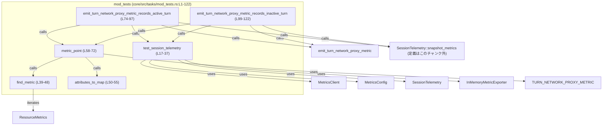
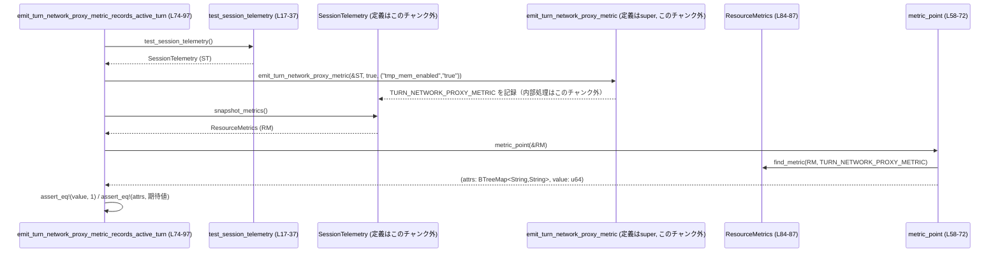

# core/src/tasks/mod_tests.rs コード解説

## 0. ざっくり一言

TURN ネットワークプロキシ用メトリクス `TURN_NETWORK_PROXY_METRIC` が、期待どおりの値と属性で記録されるかを検証するテストモジュールです（`core/src/tasks/mod_tests.rs:L17-122`）。  
OpenTelemetry のメモリエクスポータを用いて、`emit_turn_network_proxy_metric` の振る舞いを検査します。

---

## 1. このモジュールの役割

### 1.1 概要

- このモジュールは、`emit_turn_network_proxy_metric` が
  - 常にカウンタ値 `1` を記録していること
  - `network_proxy_active` フラグに応じて `"active"` 属性が `"true"/"false"` になること
  - 追加属性 `"tmp_mem_enabled"` が期待どおりに設定されること  
  をテストで保証する役割を持ちます（`core/src/tasks/mod_tests.rs:L74-97,99-122`）。
- OpenTelemetry の `InMemoryMetricExporter` を利用し、実際の外部システムに送信せずにメトリクス内容を検査します（`L18-23`）。

### 1.2 アーキテクチャ内での位置づけ

このモジュールは `core::tasks` モジュール（親モジュール `super`）に属するテストコードであり、親モジュール側で定義されている `emit_turn_network_proxy_metric` の挙動を検証します（`L1`）。

依存関係の概略は次のとおりです。



- `emit_turn_network_proxy_metric` や `SessionTelemetry::snapshot_metrics` の実装本体はこのチャンクには現れません（`super::emit_turn_network_proxy_metric` 呼び出しのみ、`L1, L78-82, L103-107`）。

### 1.3 設計上のポイント

コードから読み取れる設計上の特徴は次のとおりです。

- **ヘルパー関数による共通処理の抽出**
  - テレメトリ初期化を `test_session_telemetry` に切り出し（`L17-37`）、テストケースから重複を排除しています。
  - メトリクス探索・属性抽出・値抽出を `find_metric` / `attributes_to_map` / `metric_point` に分割しています（`L39-55,58-72`）。
- **OpenTelemetry に密着した検証**
  - `ResourceMetrics` / `Metric` / `AggregatedMetrics` / `MetricData` を直接操作し、メトリクスの型・集計種別・データポイント数まで確認しています（`L58-71`）。
- **エラーハンドリング方針**
  - テストヘルパーでは、条件が満たされない場合は即座に `panic!` させる設計です（`find_metric` の `panic!`、`metric_point` の `panic!` と `assert_eq!`、`L47,68,70`）。
  - メトリクスクライアント生成やスナップショット取得も `expect` でラップし、失敗時にはテストを明示的に失敗させます（`L23,85-86,110-111`）。
- **状態と並行性**
  - このファイル内ではスレッド生成や共有可変状態は登場せず、各テストはローカルな `SessionTelemetry` インスタンスのみを操作します（`L76,101`）。
  - メトリクス実装内部にどのような並行処理があるかはこのチャンクには現れません。

---

## 2. 主要な機能一覧

このモジュールが提供する主な機能（テスト用ヘルパーとテストケース）は次のとおりです。

- テレメトリ初期化ヘルパー: `test_session_telemetry` – メモリベースの `SessionTelemetry` を構築します（`L17-37`）。
- メトリクス取得ヘルパー: `find_metric` – `ResourceMetrics` から名前で `Metric` を検索します（`L39-48`）。
- 属性変換ヘルパー: `attributes_to_map` – OTEL の属性列を `BTreeMap<String, String>` に変換します（`L50-55`）。
- メトリクス値抽出ヘルパー: `metric_point` – `TURN_NETWORK_PROXY_METRIC` の属性マップとカウンタ値を取得します（`L58-72`）。
- テスト: `emit_turn_network_proxy_metric_records_active_turn` – TURN がアクティブなケースのメトリクスを検証します（`L74-97`）。
- テスト: `emit_turn_network_proxy_metric_records_inactive_turn` – TURN が非アクティブなケースのメトリクスを検証します（`L99-122`）。

### コンポーネントインベントリー（関数一覧）

| 名前 | 種別 | 役割 / 用途 | 定義位置 |
|------|------|-------------|----------|
| `test_session_telemetry` | 関数（ヘルパー） | メモリエクスポータを用いる `SessionTelemetry` を構築し、テストで利用可能なメトリクスクライアントを組み込みます | `core/src/tasks/mod_tests.rs:L17-37` |
| `find_metric` | 関数（ヘルパー） | `ResourceMetrics` 内から、指定されたメトリクス名の `Metric` を 1 つ探し、見つからなければ `panic!` します | `core/src/tasks/mod_tests.rs:L39-48` |
| `attributes_to_map` | 関数（ヘルパー） | `Iterator<Item = &KeyValue>` から、キー・値とも文字列の `BTreeMap` を生成します | `core/src/tasks/mod_tests.rs:L50-55` |
| `metric_point` | 関数（ヘルパー） | `TURN_NETWORK_PROXY_METRIC` の単一データポイントから属性マップと `u64` 値を取り出します | `core/src/tasks/mod_tests.rs:L58-72` |
| `emit_turn_network_proxy_metric_records_active_turn` | テスト関数 | `network_proxy_active = true` で `emit_turn_network_proxy_metric` を呼び出し、メトリクスの値と属性を検証します | `core/src/tasks/mod_tests.rs:L74-97` |
| `emit_turn_network_proxy_metric_records_inactive_turn` | テスト関数 | `network_proxy_active = false` の場合のメトリクスの値と属性を検証します | `core/src/tasks/mod_tests.rs:L99-122` |

このモジュール内で新たな構造体・列挙体の定義はありません（`core/src/tasks/mod_tests.rs:L1-122`）。

---

## 3. 公開 API と詳細解説

### 3.1 型一覧（構造体・列挙体など）

このファイル内で新たに定義され、外部に公開される型はありません。

利用している主な外部型（定義は他モジュールで、このチャンクには現れません）:

| 名前 | 種別 | 役割 / 用途 | 出現箇所 |
|------|------|-------------|----------|
| `SessionTelemetry` | 構造体（外部） | セッション単位のテレメトリ収集コンテキスト。メトリクススナップショット機能を提供します | `L4,24-36,84-87,109-112` |
| `ResourceMetrics` | 構造体（外部） | OpenTelemetry SDK におけるリソース単位のメトリクス集合 | `L13,39,58-59` |
| `Metric` | 構造体（外部） | 単一のメトリクス（カウンタなど）を表します | `L11,39-47,59-60` |
| `KeyValue` | 構造体（外部） | OTEL の属性を表すキー・値ペア | `L8,50-54,66` |
| `ThreadId` | 構造体（外部） | プロトコル上のスレッド ID | `L6,25` |

> これらの型の実装詳細は、このチャンクには現れません。

### 3.2 関数詳細

#### `test_session_telemetry() -> SessionTelemetry`

**概要**

メモリベースのメトリクスクライアントを内包した `SessionTelemetry` を構築し、テストで利用できる状態にして返します（`core/src/tasks/mod_tests.rs:L17-37`）。

**引数**

- なし。

**戻り値**

- `SessionTelemetry`  
  - メトリクスを `InMemoryMetricExporter` に出力するよう構成されたセッションテレメトリ。

**内部処理の流れ**

1. `InMemoryMetricExporter::default()` でメモリエクスポータを作成（`L18`）。
2. `MetricsConfig::in_memory` で in-memory 用の設定を構築し（`L20`）、`.with_runtime_reader()` でランタイムからの読み出しを有効化（`L21`）。
3. `MetricsClient::new` でメトリクスクライアントを作成し、`expect` で失敗時にパニックさせます（`L19-23`）。
4. `SessionTelemetry::new` にスレッド ID・モデル名・起動元情報などを渡してインスタンスを生成（`L24-35`）。
5. `.with_metrics_without_metadata_tags(metrics)` により、メトリクスクライアントを紐付けた新しい `SessionTelemetry` を返します（`L36`）。

**Examples（使用例）**

このヘルパーはテスト内で次のように使われています（`L76,101`）。

```rust
// テスト用に SessionTelemetry を初期化する
let session_telemetry = test_session_telemetry(); // core/src/tasks/mod_tests.rs:L76
```

**Errors / Panics**

- `MetricsClient::new(...).expect("in-memory metrics client")` が失敗すると `panic!` します（`L19-23`）。
  - これはメトリクス初期化の失敗をテストの失敗として扱う意図と解釈できます（コード上の `expect` が根拠）。

**Edge cases（エッジケース）**

- 引数がないため、直接の入力エッジケースはありません。
- `MetricsConfig::in_memory` や `SessionTelemetry::new` の詳細なエッジケースはこのチャンクには現れません。

**使用上の注意点**

- テスト専用の初期化関数であり、プロダクションコードから利用される前提には見えません（ファイル名 `mod_tests` が根拠）。
- 返される `SessionTelemetry` はメタデータタグが付与されていない構成です（メソッド名 `.with_metrics_without_metadata_tags`、`L36`）。

---

#### `find_metric<'a>(resource_metrics: &'a ResourceMetrics, name: &str) -> &'a Metric`

**概要**

`ResourceMetrics` に含まれるすべてのメトリクスから、指定された名前に一致する `Metric` を探索して返します。見つからなければ `panic!` します（`L39-48`）。

**引数**

| 引数名 | 型 | 説明 |
|--------|----|------|
| `resource_metrics` | `&'a ResourceMetrics` | 検査対象のメトリクススナップショット |
| `name` | `&str` | 探索するメトリクスの名前 |

**戻り値**

- `&'a Metric`  
  - `name` と一致する最初の `Metric` への参照。

**内部処理の流れ**

1. `resource_metrics.scope_metrics()` をループし、各スコープのメトリクス集合を走査（`L40`）。
2. 各スコープ内の `metrics()` に対してループし、`metric.name() == name` を満たすものを探す（`L41-43`）。
3. 見つかった時点でその `metric` への参照を返す（`L42-43`）。
4. どのスコープにも存在しない場合は `panic!("metric {name} missing")` を実行（`L47`）。

**Examples（使用例）**

`metric_point` の中で使用され、`TURN_NETWORK_PROXY_METRIC` を検索しています（`L59`）。

```rust
let metric = find_metric(resource_metrics, TURN_NETWORK_PROXY_METRIC);
```

**Errors / Panics**

- 指定した `name` のメトリクスが存在しない場合、`panic!("metric {name} missing")` を発生させます（`L47`）。

**Edge cases（エッジケース）**

- 対象メトリクスが複数存在する場合:
  - 最初に見つかったものだけを返します（`for` ループの構造から明らか、`L40-43`）。
- `ResourceMetrics` が空、または該当スコープが存在しない場合:
  - `panic!` に到達します（`L40-47`）。

**使用上の注意点**

- テストにおいて「対象メトリクスが必ず存在する」ことを前提にしているため、存在有無をオプションで扱う API ではありません。
- 他のコンテキストで再利用する場合は、`panic!` ではなく `Option<&Metric>` や `Result<&Metric, _>` を返す設計が望ましい可能性があります（このコードから派生した一般論であり、設計の推奨です）。

---

#### `attributes_to_map<'a>(attributes: impl Iterator<Item = &'a KeyValue>) -> BTreeMap<String, String>`

**概要**

`KeyValue` のイテレータから、キーと値を文字列に変換して `BTreeMap<String, String>` に格納します（`L50-55`）。

**引数**

| 引数名 | 型 | 説明 |
|--------|----|------|
| `attributes` | `impl Iterator<Item = &'a KeyValue>` | OpenTelemetry 属性のイテレータ |

**戻り値**

- `BTreeMap<String, String>`  
  - キーを属性キー文字列、値を属性値文字列とするマップ。キー順にソートされます（`BTreeMap` の性質）。

**内部処理の流れ**

1. `attributes.map(|kv| (...))` で各 `KeyValue` から
   - `kv.key.as_str().to_string()` をキーに、
   - `kv.value.as_str().to_string()` を値にしてペアを生成（`L53-54`）。
2. `.collect()` で `BTreeMap<String, String>` に収集（`L55`）。

**Examples（使用例）**

`metric_point` 内で `point.attributes()` から呼び出されています（`L66`）。

```rust
let attrs_map = attributes_to_map(point.attributes());
```

**Errors / Panics**

- この関数単体では `panic!` や `Result` を返さず、属性列挙がパニックしない限り常に成功します。

**Edge cases（エッジケース）**

- 属性が 0 個の場合:
  - 空の `BTreeMap` が返ります（`collect()` の挙動、`L53-55`）。
- 同じキーが複数存在する場合:
  - 最後に出現した値がマップに残る可能性がありますが、属性の列挙順序や重複の有無はこのチャンクには現れません。

**使用上の注意点**

- 属性値はすべて文字列に変換されるため、数値やブールなどの元の型情報は失われます。
- テストでは `BTreeMap::from([...])` と比較して属性の完全一致（キーセットと値）が検証されています（`L90-96,115-121`）。

---

#### `metric_point(resource_metrics: &ResourceMetrics) -> (BTreeMap<String, String>, u64)`

**概要**

`ResourceMetrics` 内の `TURN_NETWORK_PROXY_METRIC` カウンタの単一データポイントから、その属性マップとカウンタ値を抽出します（`L58-72`）。

**引数**

| 引数名 | 型 | 説明 |
|--------|----|------|
| `resource_metrics` | `&ResourceMetrics` | スナップショットされたメトリクス |

**戻り値**

- `(BTreeMap<String, String>, u64)`  
  - 第1要素: データポイントの属性を `BTreeMap<String, String>` として保持したもの。  
  - 第2要素: カウンタ値（`u64`）。

**内部処理の流れ**

1. `find_metric(resource_metrics, TURN_NETWORK_PROXY_METRIC)` で対象メトリクスを検索（`L59`）。
2. `match metric.data()` でメトリクスの集計種別とデータ型を確認（`L60-71`）。
   - `AggregatedMetrics::U64(data)` の場合のみ処理を継続（`L61`）。
   - それ以外は `panic!("unexpected counter data type")`（`L70-71`）。
3. `MetricData::Sum(sum)` の場合のみ処理を継続（`L62`）。
   - それ以外は `panic!("unexpected counter aggregation")`（`L68-69`）。
4. `sum.data_points().collect()` でデータポイントを `Vec` に収集し、長さが 1 であることを `assert_eq!(points.len(), 1)` で検証（`L63-64`）。
5. `point = points[0]` を取得し、その属性と値を `(attributes_to_map(point.attributes()), point.value())` として返す（`L65-67`）。

**Examples（使用例）**

テスト関数内で、`SessionTelemetry::snapshot_metrics()` の結果に対して呼び出されています（`L87,112`）。

```rust
let snapshot = session_telemetry
    .snapshot_metrics()
    .expect("runtime metrics snapshot");
let (attrs, value) = metric_point(&snapshot); // (属性マップ, u64値) を取得
```

**Errors / Panics**

- `find_metric` が対象メトリクスを見つけられない場合、`metric {name} missing` で `panic!`（`L59` 経由で `L47`）。
- `metric.data()` が `AggregatedMetrics::U64` 以外の場合、`unexpected counter data type` で `panic!`（`L70-71`）。
- `MetricData::Sum` 以外の場合、`unexpected counter aggregation` で `panic!`（`L62-69`）。
- データポイント数が 1 以外の場合、`assert_eq!(points.len(), 1)` が失敗し `panic!`（`L63-64`）。
- `points[0]` アクセスは、上記 `assert_eq` が失敗していなければ安全です（`L63-66`）。

**Edge cases（エッジケース）**

- データポイント 0 件:
  - `points.len()` が 0 となり、`assert_eq!(0, 1)` が失敗して `panic!`（`L63-64`）。
- データポイント複数件:
  - `points.len()` が 1 以外の値となり、同様に `panic!`。
- 異なるメトリクス種別（例えばヒストグラムなど）に変更された場合:
  - `AggregatedMetrics::U64` でなくなり、`unexpected counter data type` で `panic!` します（`L61,70-71`）。

**使用上の注意点**

- この関数は「`TURN_NETWORK_PROXY_METRIC` は `u64` の Sum カウンタであり、データポイントが 1 つだけ」という前提に強く依存しています。
- 前提が変わるとテストが即座に壊れるため、仕様変更時にはこの関数の実装とテスト期待値の両方を更新する必要があります。

---

#### `emit_turn_network_proxy_metric_records_active_turn()`

**概要**

`network_proxy_active = true` の状態で `emit_turn_network_proxy_metric` を呼び出し、`TURN_NETWORK_PROXY_METRIC` が値 `1` と期待される属性で記録されることを検証するテストです（`L74-97`）。

**引数**

- なし（テスト関数）。

**戻り値**

- なし。テストとして実行され、失敗時には `panic!` します。

**内部処理の流れ**

1. `test_session_telemetry()` で `SessionTelemetry` を初期化（`L76`）。
2. `emit_turn_network_proxy_metric(&session_telemetry, true, ("tmp_mem_enabled", "true"))` を呼び出し、メトリクスを記録（`L78-82`）。  
   - `emit_turn_network_proxy_metric` の実装はこのチャンクには現れません（`L1` の use のみ）。
3. `session_telemetry.snapshot_metrics().expect("runtime metrics snapshot")` でメトリクススナップショットを取得（`L84-86`）。
4. `metric_point(&snapshot)` で属性マップと値を取得（`L87`）。
5. 値が `1` であることを `assert_eq!(value, 1)` で検証（`L89`）。
6. 属性マップが `"active" = "true"` と `"tmp_mem_enabled" = "true"` の 2 つだけであることを `BTreeMap::from([...])` との等価性で検証（`L90-96`）。

**Examples（使用例）**

テスト自体が使用例です（値や属性を変えれば別のケースを検証できます）。

```rust
#[test]
fn emit_turn_network_proxy_metric_records_active_turn() {
    let session_telemetry = test_session_telemetry();

    emit_turn_network_proxy_metric(
        &session_telemetry,
        true,                            // アクティブ
        ("tmp_mem_enabled", "true"),
    );

    let snapshot = session_telemetry.snapshot_metrics().expect("runtime metrics snapshot");
    let (attrs, value) = metric_point(&snapshot);

    assert_eq!(value, 1);
    assert_eq!(
        attrs,
        BTreeMap::from([
            ("active".to_string(), "true".to_string()),
            ("tmp_mem_enabled".to_string(), "true".to_string()),
        ])
    );
}
```

**Errors / Panics**

- `test_session_telemetry` 内のメトリクス初期化が失敗すると `expect` により `panic!`（`L19-23`）。
- `snapshot_metrics()` が失敗した場合も `expect("runtime metrics snapshot")` で `panic!`（`L85-86`）。
- `metric_point` 内でメトリクス種別やデータポイント数が想定と異なる場合は `panic!`（`L58-71`）。
- `assert_eq!` が期待値と異なる場合もテスト失敗（`L89-96`）。

**Edge cases（エッジケース）**

- `emit_turn_network_proxy_metric` が呼び出されなかった場合:
  - メトリクスが存在せず `find_metric` で `panic!` します（`L39-48`）。
- 追加の属性が付与された場合:
  - `attrs == BTreeMap::from([...])` 比較が `false` となり、テストが失敗します（`L90-96`）。

**使用上の注意点**

- このテストは `"active"` と `"tmp_mem_enabled"` 以外の属性が *存在しない* ことも確認します（`BTreeMap` 同値比較から分かります）。
- メトリック名や属性キーの変更は、テストの更新が必要になることを意味します。

---

#### `emit_turn_network_proxy_metric_records_inactive_turn()`

**概要**

`network_proxy_active = false` の状態で `emit_turn_network_proxy_metric` を呼び出したときのメトリクス内容を検証するテストです（`L99-122`）。

**引数**

- なし（テスト関数）。

**戻り値**

- なし。

**内部処理の流れ**

アクティブケースとほぼ同様で、フラグと期待値のみが異なります。

1. `test_session_telemetry()` で `SessionTelemetry` を初期化（`L101`）。
2. `emit_turn_network_proxy_metric(&session_telemetry, false, ("tmp_mem_enabled", "false"))` を呼び出し（`L103-107`）。
3. メトリクススナップショット取得（`L109-111`）。
4. `metric_point(&snapshot)` で属性マップと値を取得（`L112`）。
5. 値が `1` であることを検証（`L114`）。
6. 属性マップが `"active" = "false"` と `"tmp_mem_enabled" = "false"` のみであることを検証（`L115-121`）。

**Errors / Panics**

- アクティブケースと同様に、初期化・スナップショット取得・`metric_point`・`assert_eq!` のいずれかが失敗した場合に `panic!` します（`L101-121`）。

**Edge cases（エッジケース）**

- `emit_turn_network_proxy_metric` の実装が `network_proxy_active` によらず `"active": "true"` を設定している場合:
  - 本テストが失敗し、バグを検知できます（`L115-121`）。

**使用上の注意点**

- アクティブケースと非アクティブケースで `"active"` 属性の値が確実に変化することをテストで保証しています。
- 他の属性や値が変化した場合も、`BTreeMap` 比較により検出されます。

---

### 3.3 その他の関数

- 上記 6 関数で本ファイルのすべての関数を網羅しているため、別途列挙すべき補助関数はありません。

---

## 4. データフロー

ここでは、アクティブケースのテスト `emit_turn_network_proxy_metric_records_active_turn` を例としたデータフローを示します（`L74-97`）。

1. テスト関数が `test_session_telemetry()` を呼び出し、`SessionTelemetry` を構築（`L76`）。
2. テスト関数が `emit_turn_network_proxy_metric` を呼び出し、内部で `TURN_NETWORK_PROXY_METRIC` カウンタがインクリメントされ、属性が付与される（`L78-82`）。  
   - 実際のメトリクス記録処理はこのチャンクには現れません。
3. テスト関数が `snapshot_metrics()` を呼び出して `ResourceMetrics` スナップショットを取得（`L84-86`）。
4. `metric_point(&snapshot)` から `(属性マップ, 値)` を取得（`L87`）。
5. テスト関数が `value` と `attrs` に対して `assert_eq!` を行い、期待どおりであることを検証（`L89-96`）。



- この図は本ファイルのコード範囲 `core/src/tasks/mod_tests.rs:L17-97` に対応します。
- 非アクティブケースも同じフローで、`network_proxy_active` と属性の値が異なるだけです（`L99-122`）。

---

## 5. 使い方（How to Use）

### 5.1 基本的な使用方法

このモジュールはテスト用ですが、「メトリクスを発行する関数のテストを書く」という観点で、次のような使い方のパターンが示されています。

```rust
// 1. テスト用 SessionTelemetry を準備する
let session_telemetry = test_session_telemetry(); // L17-37

// 2. テスト対象のメトリクス発行関数を呼び出す
emit_turn_network_proxy_metric(
    &session_telemetry,
    true,                                 // または false
    ("tmp_mem_enabled", "true"),         // テストしたい追加属性
);

// 3. メトリクススナップショットを取得する
let snapshot = session_telemetry
    .snapshot_metrics()
    .expect("runtime metrics snapshot");

// 4. ヘルパーで属性と値を抽出する
let (attrs, value) = metric_point(&snapshot);

// 5. 期待値と比較する
assert_eq!(value, 1);
assert_eq!(
    attrs,
    BTreeMap::from([
        ("active".to_string(), "true".to_string()),
        ("tmp_mem_enabled".to_string(), "true".to_string()),
    ])
);
```

このパターンに従うことで、`emit_turn_network_proxy_metric` のようなメトリクス発行関数の挙動をテストできます。

### 5.2 よくある使用パターン

このファイルから推測できる典型パターンは次の 2 つです。

1. **ブール属性の検証**
   - `network_proxy_active` のようなブールフラグに応じて `"active"` 属性値が変わることを検証（`L80-81,105-106`）。
2. **追加属性の検証**
   - `("tmp_mem_enabled", "true"/"false")` というペアを渡し、それがメトリクス属性に反映されていることを検証（`L81-82,106-107,90-96,115-121`）。

属性名や値を変更すれば、別のフラグや設定値に対応するメトリクスを同様に検証できます。

### 5.3 よくある間違い

このコードから読み取れる、起こりうる誤りパターンは次のとおりです。

```rust
// 誤り例: メトリクス発行を忘れている
let session_telemetry = test_session_telemetry();
// emit_turn_network_proxy_metric(...) を呼んでいない

let snapshot = session_telemetry
    .snapshot_metrics()
    .expect("runtime metrics snapshot");
let (_attrs, _value) = metric_point(&snapshot); // find_metric が panic! する可能性
```

- 上記のようにメトリクスを発行しないと、`TURN_NETWORK_PROXY_METRIC` が存在せず、`metric_point` → `find_metric` 内で `panic!("metric {name} missing")` になります（`L39-48,58-72`）。

```rust
// 正しい例: 先に emit_turn_network_proxy_metric を呼び出す
let session_telemetry = test_session_telemetry();
emit_turn_network_proxy_metric(&session_telemetry, false, ("tmp_mem_enabled", "false"));

let snapshot = session_telemetry
    .snapshot_metrics()
    .expect("runtime metrics snapshot");
let (attrs, value) = metric_point(&snapshot);
// attrs / value に対して assert_eq! で検証する
```

### 5.4 使用上の注意点（まとめ）

- **前提条件**
  - `metric_point` は `TURN_NETWORK_PROXY_METRIC` が `u64` の Sum カウンタであり、データポイントが 1 つだけであることを前提にしています（`L58-72`）。
  - `find_metric` は指定メトリクスが必ず存在すると想定しています（`L39-48`）。
- **エラー・パニック条件**
  - メトリクスが見つからない、型が異なる、データポイント数が 1 でない場合はいずれも `panic!` でテストを失敗させます（`L47,63-64,68-71`）。
  - メトリクスクライアントやスナップショットの取得が失敗した場合も `expect` により `panic!` します（`L23,85-86,110-111`）。
- **並行性**
  - このファイル内ではスレッド生成や共有可変状態はなく、テストごとに独立した `SessionTelemetry` が使われています（`L76,101`）。  
    メトリクス実装内部の並行性は、このチャンクからは判断できません。
- **セキュリティ**
  - 外部入出力やネットワーク通信は行っておらず、`InMemoryMetricExporter` に限定されたメトリクス検証であるため、このモジュール単体からは特別なセキュリティリスクは読み取れません。

---

## 6. 変更の仕方（How to Modify）

### 6.1 新しい機能を追加する場合

ここでは「新しいメトリクスのテストを追加する」ケースを想定した変更手順を示します。

1. **テレメトリ初期化の再利用**
   - 既存の `test_session_telemetry` を利用して、テスト用 `SessionTelemetry` を取得します（`L17-37`）。
2. **新しいメトリクス発行関数の呼び出し**
   - 親モジュールに新しいメトリクス発行関数がある場合は、それをテスト内で呼び出します。
   - `emit_turn_network_proxy_metric` と同様に、必要なフラグ・属性を引数で渡します（`L78-82,103-107`）。
3. **スナップショット取得**
   - `snapshot_metrics().expect("runtime metrics snapshot")` で `ResourceMetrics` を取得します（`L84-86,109-111`）。
4. **検証用ヘルパーの追加/改造**
   - 既存の `metric_point` は `TURN_NETWORK_PROXY_METRIC` 固定であるため、別のメトリクス名を検証する場合は
     - 新たなヘルパー関数を定義するか、
     - `metric_point` を汎用化する必要があります。
   - いずれの場合も `find_metric` と `attributes_to_map` は再利用できます（`L39-55`）。
5. **期待値の `assert_eq!`**
   - 値および属性マップに対して `assert_eq!` を使い、期待される仕様をテストで固定します（`L89-96,114-121`）。

### 6.2 既存の機能を変更する場合

特に `TURN_NETWORK_PROXY_METRIC` の仕様を変更する場合、影響範囲は次のとおりです。

- **メトリクス名の変更**
  - `TURN_NETWORK_PROXY_METRIC` 定数の値を変更すると、`metric_point` 内の `find_metric` が影響を受けます（`L59`）。
  - 定数自体は別モジュール定義で、このチャンクには現れませんが、テストは新しい値に追従する必要があります。
- **型・集計種別の変更**
  - カウンタからゲージやヒストグラムに変えるなど、メトリクス型を変更した場合:
    - `metric_point` の `AggregatedMetrics::U64` / `MetricData::Sum` 前提が壊れ、`panic!` するようになります（`L61-62,68-71`）。
- **属性仕様の変更**
  - `"active"` や `"tmp_mem_enabled"` の属性名・値・有無を変更した場合:
    - `assert_eq!(attrs, BTreeMap::from([...]))` による比較が失敗するため、テストを新仕様に合わせて更新する必要があります（`L90-96,115-121`）。

変更時のチェックポイント:

- `metric_point` の契約（返す値の意味）を変えた場合は、すべての呼び出しサイト（両テスト関数）を確認します（`L87,112`）。
- `find_metric` の挙動（見つからないと `panic!`）は、仕様変更後もテストとして妥当かどうかを確認します。

---

## 7. 関連ファイル

このモジュールと密接に関係すると考えられるファイル・モジュールは次のとおりです。

| パス / モジュール | 役割 / 関係 |
|-------------------|------------|
| `super::emit_turn_network_proxy_metric`（親モジュール） | 本テストで検証しているメトリクス発行関数。実装はこのチャンクには現れませんが、`use super::emit_turn_network_proxy_metric;` から親モジュールに定義されていることが分かります（`L1, L78-82, L103-107`）。 |
| `codex_otel::MetricsClient` / `MetricsConfig` / `SessionTelemetry` | メトリクス収集のためのクライアント・設定・セッションコンテキストを提供する外部クレート。`test_session_telemetry` で利用されます（`L2-5, L17-37`）。 |
| `opentelemetry_sdk::metrics` 関連型 | `ResourceMetrics` / `Metric` / `AggregatedMetrics` / `MetricData` など、OpenTelemetry SDK のメトリクス表現。`find_metric` および `metric_point` がこれらに依存します（`L10-13, L39-48, L58-71`）。 |

> これら外部モジュールの具体的な実装は、このチャンクには現れません。利用方法のみが示されています。
