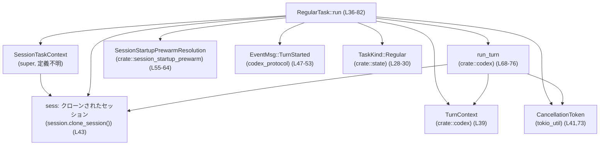

# core/src/tasks/regular.rs

## 0. ざっくり一言

通常のターン処理を担当する `RegularTask` を定義し、セッションコンテキストとユーザー入力を受けて `run_turn` をループ実行する非同期タスクの実装です（core/src/tasks/regular.rs:L18-83）。

---

## 1. このモジュールの役割

### 1.1 概要

- このモジュールは、セッション内の「通常ターン（Regular）」を処理するタスクを実装します。
- `SessionTask` トレイトを実装した `RegularTask` を定義し、イベント送出、プレウォーム（prewarm）の消費、`run_turn` の呼び出しとキャンセル制御を行います（L18-27, L36-82）。
- 非同期に動作し、キャンセルや追加のペンディング入力がある限り `run_turn` を繰り返し呼び出します（L67-80）。

### 1.2 アーキテクチャ内での位置づけ

`RegularTask::run` が、セッションコンテキストや Codex のコア処理(`run_turn`)とどのように連携しているかを示します。



- `SessionTask` と `SessionTaskContext` の定義はこのチャンクには現れませんが、`RegularTask` はそれらを通してセッションに作用します（L27-27, L36-43）。
- 実際のターンの中身は `crate::codex::run_turn` に委譲され、このモジュールは「1 ターンのライフサイクル管理」と「イベント・キャンセル・プレウォーム制御」を担当している構造になっています（L44-82）。

### 1.3 設計上のポイント

- **タスクのポリモーフィズム**  
  - `RegularTask` はフィールドを持たないゼロサイズ構造体で、`SessionTask` トレイトを実装することで「タスクの一種」として扱われます（L18-27）。
- **非同期処理とキャンセル**  
  - `async fn run` と `tokio_util::sync::CancellationToken` により、非同期かつキャンセル可能なターン実行を実現しています（L36-42, L55-59, L73）。
- **イベント駆動**  
  - `TurnStartedEvent` を `EventMsg::TurnStarted` としてセッションに送出し、クライアント側にターン開始を通知します（L47-53）。
- **プレウォーム（prewarm）との連携**  
  - `SessionStartupPrewarmResolution` を使って、プレウォーム済みのクライアントセッションがあれば最初の `run_turn` にだけ渡す設計になっています（L55-64, L68-73）。
- **ループによる追加入力対応**  
  - `sess.has_pending_input().await` が `true` の間、`run_turn` をループ実行し続けることで「ペンディング入力（ツール呼び出し結果など）」を処理し続けます（L67-80）。
- **トレーシングによる観測性**  
  - `trace_span!("run_turn")` と `.instrument(...)` を用いて、`run_turn` 呼び出しをトレーススパンに紐付けています（L44, L75-76）。

---

## 2. 主要な機能一覧

- Regular タスク種別の定義: `TaskKind::Regular` を返すことで、タスク種別を区別します（L28-30）。
- トレーススパン名の提供: `"session_task.turn"` というスパン名を返します（L32-34）。
- ターン開始イベントの送出: `TurnStartedEvent` を作成し、`EventMsg::TurnStarted` としてセッションに送ります（L47-53）。
- セッションのサーバー推論フラグ設定: `set_server_reasoning_included(false)` を通して、当該ターンにサーバー推論を含まないことを記録します（L54）。
- プレウォーム結果の消費: `consume_startup_prewarm_for_regular_turn` を呼び出し、`Cancelled / Unavailable / Ready` に応じて挙動を分岐します（L55-64）。
- `run_turn` のループ実行: ペンディング入力がなくなるまで `run_turn` を繰り返し実行し、最終的なエージェントメッセージを返します（L67-80）。
- キャンセル制御: 親 `CancellationToken` から `child_token()` を生成し、各 `run_turn` 呼び出しに渡します（L73）。

---

## 3. 公開 API と詳細解説

### 3.1 型一覧（構造体・列挙体など）

| 名前         | 種別   | 役割 / 用途                                                                 | 定義位置                                    |
|--------------|--------|-------------------------------------------------------------------------------|---------------------------------------------|
| `RegularTask` | 構造体 | `SessionTask` を実装する「通常ターン」用タスク。フィールドを持たないゼロサイズ型です。 | `core/src/tasks/regular.rs:L18-25` |

※ `SessionTask` トレイト自体の定義は、このチャンクには現れません（L15, L27）。

### 3.2 関数詳細

#### `RegularTask::run(self: Arc<Self>, session: Arc<SessionTaskContext>, ctx: Arc<TurnContext>, input: Vec<UserInput>, cancellation_token: CancellationToken) -> Option<String>`

**定義位置**

- `core/src/tasks/regular.rs:L36-82`

**概要**

- 1 回の「通常ターン」を非同期に実行するメイン関数です。
- ターン開始イベントを送出し、プレウォーム済みセッションがあれば最初の `run_turn` に渡し、ペンディング入力がなくなるまで `run_turn` を繰り返し呼び出します（L43-80）。
- キャンセルされた場合や、何らかの理由でエージェントメッセージが得られなかった場合は `None` を返します（L59, L68-76, L77-79）。

**引数**

| 引数名              | 型                                  | 説明 |
|---------------------|-------------------------------------|------|
| `self`              | `Arc<Self>`                        | `RegularTask` インスタンスへの共有所有権。タスクが他スレッドからも共有される前提で `Arc` が使われています（L36-37）。 |
| `session`           | `Arc<SessionTaskContext>`          | セッション実行コンテキスト。`clone_session()` を通じて、イベント送信などに使うセッションハンドルを取得します（L38, L43）。定義はこのチャンクには現れません。 |
| `ctx`               | `Arc<TurnContext>`                 | このターンに関するコンテキスト（ターン ID、タイミング情報、コラボレーション情報など）を保持するオブジェクトです（L39, L47-51）。定義はこのチャンクには現れません。 |
| `input`             | `Vec<UserInput>`                   | ターンの最初のユーザー入力一覧です。以降のループでは `next_input` として扱われます（L40, L65）。 |
| `cancellation_token` | `CancellationToken`               | このターン全体に対するキャンセル用トークンです。プレウォームの待機や `run_turn` の子トークン生成に使用されます（L41, L55-57, L73）。 |

**戻り値**

- 型: `Option<String>`
  - `Some(last_agent_message)`  
    - `run_turn` が返した「最後のエージェントメッセージ」をそのまま返します（L68-76, L77-79）。
  - `None`  
    - プレウォーム待機が `Cancelled` になった場合（L59）。  
    - または `run_turn` が `None` を返した場合など、エージェントメッセージが得られなかったケース（`run_turn` の実装はこのチャンクには現れないため詳細は不明）。

**内部処理の流れ（アルゴリズム）**

1. **セッションのクローンとトレーススパンの生成**  
   - `let sess = session.clone_session();` でセッションハンドルを取得（L43）。  
   - `let run_turn_span = trace_span!("run_turn");` で `run_turn` 用のトレーススパンを生成（L44）。
2. **ターン開始イベントの送出**  
   - `TurnStartedEvent` を組み立て (`turn_id`, `started_at`, `model_context_window`, `collaboration_mode_kind` を `ctx` から取得)、`EventMsg::TurnStarted` として送出します（L47-53）。
   - これにより、クライアント側は「ターンが開始された」ことを知ることができます。
3. **サーバー推論フラグの設定**  
   - `sess.set_server_reasoning_included(false).await;` で、このターンではサーバー側の推論を含まないことをセッションに記録します（L54）。
4. **プレウォーム結果の取得と分岐**  
   - `sess.consume_startup_prewarm_for_regular_turn(&cancellation_token).await` を呼び出し、プレウォーム結果を取得します（L55-57）。  
   - `match` の分岐（L58-64）:
     - `Cancelled` の場合: 即座に `return None`（L59）。
     - `Unavailable { .. }` の場合: プレウォームなしとして `prewarmed_client_session = None`（L60）。
     - `Ready(prewarmed_client_session)` の場合: 所有権を `Option` に包んで `Some(..)` として保存（L61-63）。
5. **初期入力とプレウォームセッションのセットアップ**  
   - `next_input = input;` で、最初のループ入力を設定（L65）。  
   - `prewarmed_client_session` を可変の `Option` として保持します（L66）。
6. **ペンディング入力がなくなるまでループ**（L67-80）  
   - `loop { ... }` に入る（L67）。
   - 各イテレーションで `run_turn` を呼び出す（L68-76）:
     - 引数: `sess`, `ctx`, `next_input`, `prewarmed_client_session.take()`, `cancellation_token.child_token()`（L68-74）。
       - `prewarmed_client_session.take()` により、プレウォームセッションは最初の 1 回だけ渡され、その後のループでは `None` になります（L72）。
       - `child_token()` によって、ターン全体のキャンセルと紐付いた子トークンを `run_turn` に渡します（L73）。
     - `.instrument(run_turn_span.clone())` でトレーススパンに紐付けて実行（L75-76）。
     - 結果を `last_agent_message` として受け取ります（L68, L75-76）。
   - ループ終了条件の判定（L77-79）:
     - `if !sess.has_pending_input().await { return last_agent_message; }`
       - ペンディング入力がなければ、最後のエージェントメッセージを返して終了（L77-79）。
     - まだペンディング入力がある場合:
       - `next_input = Vec::new();` として、次回ループでユーザー入力を空にし、セッション内部のペンディング入力だけを処理する形になります（L80）。

**Examples（使用例）**

> 注: `SessionTaskContext` や `TurnContext` の具体的な生成方法はこのチャンクには現れないため、疑似コードとしての例になります。

```rust
use std::sync::Arc;
use tokio_util::sync::CancellationToken;

// 必要な型は crate の他モジュールからインポートされている想定です。
// use crate::tasks::RegularTask;
// use crate::tasks::SessionTaskContext;
// use crate::codex::TurnContext;
// use codex_protocol::user_input::UserInput;

async fn run_regular_turn_example(
    session_ctx: Arc<SessionTaskContext>,  // 既存セッションのコンテキスト
    turn_ctx: Arc<TurnContext>,           // このターンのコンテキスト
    user_inputs: Vec<UserInput>,          // ユーザー入力一覧
) -> Option<String> {
    let task = Arc::new(RegularTask::default());        // RegularTask を Arc で包む（L18-21）
    let cancellation = CancellationToken::new();        // 親キャンセルトークンを作成（L41）

    // Regular ターンを実行。キャンセルされた場合などは None が返る（L36-82）
    let last_agent_message = task
        .run(session_ctx, turn_ctx, user_inputs, cancellation)
        .await;

    last_agent_message
}
```

**Errors / Panics**

- この関数自体は `Result` を返さず、戻り値は `Option<String>` のみです（L36-42）。
  - したがって、エラーは `run_turn` や `sess.send_event` などの呼び出し先で処理されているか、内部で `panic` しているかのいずれかですが、どちらであるかはこのチャンクからは分かりません（L47-58, L68-77）。
- 明示的な `panic!` や `unwrap` / `expect` はこのコードには含まれていません（全体確認: L1-83）。

**Edge cases（エッジケース）**

- **プレウォーム中のキャンセル**  
  - `consume_startup_prewarm_for_regular_turn` が `Cancelled` を返すと即 `return None` となり、`run_turn` は一度も呼ばれません（L55-59）。
- **プレウォーム未設定（Unavailable）**  
  - `Unavailable { .. }` の場合は `prewarmed_client_session = None` となり、最初からプレウォームなしで `run_turn` が実行されます（L60, L66, L72）。
- **ペンディング入力が永続的に存在する場合**  
  - `sess.has_pending_input().await` が常に `true` を返し続けると、`loop` が終了せず、`run` も返らないことになります（L67-80）。
  - `has_pending_input` の実装はこのチャンクには現れないため、実際にそうなるかどうかは不明です。
- **`run_turn` が `None` を返す場合**  
  - `last_agent_message` は `Option<String>` であり、`run_turn` の戻り値がそのまま伝播します（L68-76, L77-79）。
  - 具体的にどの条件で `None` になるかは `run_turn` の実装がこのチャンクには現れないため不明です。
- **入力ベクタが空の場合**  
  - 最初の `input` が空でも、そのまま `next_input` として `run_turn` に渡されます（L40, L65, L71）。
  - このケースでの挙動は `run_turn` 側の実装に依存します。

**使用上の注意点**

- **キャンセルの伝播**  
  - `CancellationToken` を外側でキャンセルすると、プレウォーム待機や `run_turn` に渡した `child_token()` にキャンセルが伝播し、`Cancelled` 分岐や `run_turn` 内のキャンセル処理が走る設計になっています（L55-59, L73）。
- **ターン開始イベントの重複**  
  - この関数内で `TurnStarted` イベントを送出しているため（L47-53）、同じターンに対して別の場所で同種のイベントを送ると重複する可能性があります。  
    重複が許容されるかどうかはプロトコル仕様に依存し、このチャンクからは判断できません。
- **ループ終了条件への依存**  
  - `run` が終了するかどうかは `sess.has_pending_input().await` の挙動に依存します（L77-80）。  
    ここで `true` が返り続ける場合、`run` は終了しません。
- **スレッドセーフ性**  
  - `self`, `session`, `ctx` はすべて `Arc` 経由で共有されており（L36-39, L68-70）、複数タスク/スレッドから共有される前提の設計です。  
    内部の実際のスレッドセーフ性（`Send` / `Sync` の制約）は型定義側に依存し、このチャンクからは分かりません。
- **エラーの扱い**  
  - `Result` を返していないため、呼び出し側からは成功/失敗を `Option<String>` だけでは区別できません。  
    エラーの詳細が必要な場合、`run_turn` などの呼び出し先の仕様を参照する必要があります。

### 3.3 その他の関数

| 関数名                            | シグネチャ | 役割（1 行） | 定義位置 |
|-----------------------------------|-----------|--------------|----------|
| `RegularTask::new`                | `pub(crate) fn new() -> Self` | `RegularTask` の新しいインスタンスを生成する簡易コンストラクタです。`Default` 実装と等価です（L21-24）。 | `core/src/tasks/regular.rs:L21-24` |
| `RegularTask::kind` (SessionTask impl) | `fn kind(&self) -> TaskKind` | このタスクが `TaskKind::Regular` であることを返し、タスク種別を識別します（L28-30）。 | `core/src/tasks/regular.rs:L28-30` |
| `RegularTask::span_name` (SessionTask impl) | `fn span_name(&self) -> &'static str` | トレーススパン名 `"session_task.turn"` を返し、観測時の識別に利用されます（L32-34）。 | `core/src/tasks/regular.rs:L32-34` |

---

## 4. データフロー

このセクションでは、`RegularTask::run` を中心とした 1 回のターン処理のデータフローを示します（core/src/tasks/regular.rs:L36-82）。

### 4.1 シーケンス図

```mermaid
sequenceDiagram
    participant Caller as 呼び出し元
    participant Task as RegularTask::run (L36-82)
    participant SessionCtx as SessionTaskContext\n(super, 定義不明)
    participant Sess as sess: クローンされたセッション (L43)
    participant Ctx as TurnContext (L39,47-51)
    participant RunTurn as run_turn (crate::codex) (L68-76)
    participant Cancel as CancellationToken (L41,55-59,73)

    Caller->>Task: run(Arc<Self>, session, ctx, input, cancellation_token)
    Task->>SessionCtx: clone_session() (L43)
    SessionCtx-->>Task: sess
    Task->>Task: trace_span!(\"run_turn\") (L44)

    Note over Task,Ctx: TurnStartedEvent を構築 (L47-52)
    Task->>Sess: send_event(ctx, EventMsg::TurnStarted) (L53)
    Task->>Sess: set_server_reasoning_included(false) (L54)

    Task->>Sess: consume_startup_prewarm_for_regular_turn(&cancellation_token) (L55-57)
    Sess-->>Task: SessionStartupPrewarmResolution (L58-64)

    alt Cancelled (L59)
        Task-->>Caller: return None
    else Ready / Unavailable (L60-64)
        Task->>Task: next_input = input; prewarmed_client_session = Option<_> (L65-66)
        loop has_pending_input() が true の間 (L67-80)
            Task->>Cancel: child_token() (L73)
            Task->>RunTurn: run_turn(sess, ctx, next_input, prewarmed_client_session.take(), child_token) (L68-74)
            RunTurn-->>Task: last_agent_message: Option<String> (L68-76)
            Task->>Sess: has_pending_input().await (L77)
            alt ペンディング入力なし
                Task-->>Caller: return last_agent_message (L77-79)
            else ペンディング入力あり
                Task->>Task: next_input = Vec::new() (L80)
            end
        end
    end
```

**要点**

- 呼び出し元は、既存の `SessionTaskContext` と `TurnContext` を用意した上で `RegularTask::run` を呼び出します。
- `run` はターン開始イベントを即時送信し、セッション起動プレウォームがあれば最初の `run_turn` にだけ渡します（L47-54, L61-63, L68-73）。
- `run_turn` 実行後、セッションにまだペンディング入力がある場合は、ユーザー入力を空にしてループを継続します（L67-80）。
- 最後に処理されたエージェントメッセージ（`Option<String>`）が `run` の戻り値として返されます（L68-79）。

---

## 5. 使い方（How to Use）

### 5.1 基本的な使用方法

以下は、すでに用意されたセッションとターンコンテキストを使って `RegularTask` を実行する概念的な例です。

```rust
use std::sync::Arc;
use tokio_util::sync::CancellationToken;
// use crate::tasks::{RegularTask, SessionTaskContext};
// use crate::codex::TurnContext;
// use codex_protocol::user_input::UserInput;

async fn handle_user_turn(
    session_ctx: Arc<SessionTaskContext>,   // セッションコンテキスト（外部で生成）
    turn_ctx: Arc<TurnContext>,            // このターンのコンテキスト（外部で生成）
    user_inputs: Vec<UserInput>,           // ユーザーからの入力
) -> Option<String> {
    // RegularTask を作成（L18-21）
    let task = Arc::new(RegularTask::new());

    // このターンのキャンセル制御用トークンを作成（L41, L55-59, L73）
    let cancel_token = CancellationToken::new();

    // ターンを実行（L36-82）
    let last_agent_message = task
        .run(session_ctx, turn_ctx, user_inputs, cancel_token)
        .await;

    last_agent_message
}
```

- 実際には、`SessionTask` を実装した複数のタスク（Regular, ほかの種別）が存在し、タスクスケジューラのようなコンポーネントから呼び出される構成になっていると解釈できますが、その詳細はこのチャンクには現れません。

### 5.2 よくある使用パターン

1. **通常のターン処理（キャンセルなし）**

   - 親タスク側で `CancellationToken` を保持し、キャンセルを呼ばないケースです。
   - `run` は、セッションのペンディング入力がなくなるまで `run_turn` を繰り返し、最後のメッセージをそのまま返します（L67-80）。

2. **キャンセルを連携したターン処理**

   ```rust
   async fn run_with_cancel(
       session_ctx: Arc<SessionTaskContext>,
       turn_ctx: Arc<TurnContext>,
       user_inputs: Vec<UserInput>,
   ) -> Option<String> {
       let task = Arc::new(RegularTask::default());
       let cancel_token = CancellationToken::new();

       // どこか別のタスクでキャンセルをトリガーする可能性がある
       let cancel_clone = cancel_token.clone();
       tokio::spawn(async move {
           // 何らかの条件でキャンセル
           // cancel_clone.cancel();
       });

       task.run(session_ctx, turn_ctx, user_inputs, cancel_token).await
   }
   ```

   - `consume_startup_prewarm_for_regular_turn` が `Cancelled` を返す場合（L55-59）や、`run_turn` 側が `child_token()` を監視して早期終了する場合に、`run` の戻り値が `None` になる可能性があります。

### 5.3 よくある間違い

```rust
// 間違い例: Arc で包まずに直接 run を呼ぼうとしている
// let task = RegularTask::new();
// let result = task.run(session_ctx, turn_ctx, inputs, cancel_token).await;
// ↑ self: Arc<Self> を要求しているためコンパイルエラーになります（L36-37）。

// 正しい例: Arc<Self> で self を渡す
use std::sync::Arc;

let task = Arc::new(RegularTask::new());
let result = task
    .run(session_ctx, turn_ctx, inputs, cancel_token)
    .await;
```

- `self: Arc<Self>` というシグネチャのため、`RegularTask` インスタンスは `Arc` で共有される前提になっており（L36-37）、裸の値のままでは `run` を呼び出せません。

### 5.4 使用上の注意点（まとめ）

- `CancellationToken` をキャンセルせずに長時間放置すると、`has_pending_input` の挙動によっては `run` が長時間または無期限にブロックされる可能性があります（L67-80）。
- `run` 自体が `Result` を返さないため、外からは「キャンセルされた」「内部エラーがあった」「ただ応答しないケース」の区別が付きません（L36-42）。詳細な区別が必要な場合は `run_turn` やセッション側の API を確認する必要があります。
- `TurnStarted` イベントはこの関数内で送出されるため（L47-53）、同一ターンについて別途イベントを送る場合はプロトコル仕様との整合性に注意する必要があります。

---

## 6. 変更の仕方（How to Modify）

### 6.1 新しい機能を追加する場合

- **ターン開始時に追加情報を送る**  
  - `TurnStartedEvent` を構築している部分（L47-52）にフィールドを追加する場合、まず `codex_protocol::protocol::TurnStartedEvent` の定義の拡張が必要です（このチャンクには現れません）。
  - その上で、このファイルの event 構築箇所に新フィールドの設定を追加するのが自然です（L47-52）。

- **プレウォーム利用ロジックの拡張**  
  - プレウォームの状態に応じた分岐は `match` 式に集中しています（L58-64）。  
  - 新しい状態を追加する場合は、`SessionStartupPrewarmResolution` の列挙体にバリアントを追加し、それに対応する分岐をこの `match` に足す形が想定されます。

- **`run_turn` の呼び出し方を変更する**  
  - 引数やキャンセルの渡し方を変える場合、`run_turn` 呼び出し部分（L68-74）を変更し、合わせて `run_turn` のシグネチャや実装を調整する必要があります。

### 6.2 既存の機能を変更する場合

- **影響範囲の確認**  
  - `SessionTask` トレイトの実装を変更する場合（たとえば `span_name` の値を変えるなど）、同じトレイトを実装している他のタスクとの一貫性を確認する必要があります。  
    これらの実装はこのチャンクには現れません。
  - `run` の戻り値や実行タイミングを変更すると、タスクスケジューラや応答生成ロジック全体に影響する可能性があります。

- **契約（前提条件・返り値の意味）**  
  - 現状、`run` は「ターン開始イベントを送信し、最後のエージェントメッセージ（あれば）を返す」という契約で動いています（L47-53, L68-79）。  
    この契約を変更する場合、呼び出し側がその前提に依存していないかを確認する必要があります。
  - `SessionStartupPrewarmResolution::Cancelled` の場合に `None` を返す挙動（L59）は、呼び出し側で「キャンセルされた」と解釈されている可能性があります。

- **テスト・使用箇所の再確認**  
  - このファイルにはテストコードは含まれていません（L1-83）。  
  - 変更時には、関連する単体テスト・統合テストがどこにあるか（他ファイル）を確認し、`RegularTask::run` の挙動変更がテストに反映されているかをチェックする必要があります。

---

## 7. 関連ファイル

このモジュールと密接に関係する型・モジュールの一覧です。パスはモジュールパスで表記し、定義がこのチャンクにないものについてはその旨を明記します。

| パス / シンボル | 役割 / 関係 |
|-----------------|------------|
| `super::SessionTask` | セッションタスクの共通インターフェースとなるトレイトです。`RegularTask` はこれを実装しています（L15, L27）。トレイトの定義はこのチャンクには現れません。 |
| `super::SessionTaskContext` | セッション実行時のコンテキストを表す型です。`clone_session` や `has_pending_input` などのメソッドを通じてセッション操作を行っていると解釈できますが、定義はこのチャンクには現れません（L16, L38, L43, L55-57, L77）。 |
| `crate::codex::TurnContext` | ターンに関するコンテキスト（ID、タイミング、コラボレーションモードなど）を保持する型です。`TurnStartedEvent` の生成に利用されています（L5, L39, L47-51）。定義はこのチャンクには現れません。 |
| `crate::codex::run_turn` | 1 回のターン処理の本体を実行する非同期関数です。`RegularTask::run` からループ内で呼び出されます（L6, L68-76）。実装はこのチャンクには現れません。 |
| `crate::session_startup_prewarm::SessionStartupPrewarmResolution` | セッション起動時のプレウォーム状態を表す列挙体で、`Cancelled` / `Unavailable` / `Ready` の各バリアントを持ちます（L7, L58-64）。定義はこのチャンクには現れません。 |
| `crate::state::TaskKind` | タスクの種別を表す列挙体で、`RegularTask::kind` から `TaskKind::Regular` が返されています（L8, L28-30）。 |
| `codex_protocol::protocol::EventMsg` | プロトコル上のイベントメッセージ種別を表す型です。ここでは `EventMsg::TurnStarted` が使用されています（L9, L47-53）。 |
| `codex_protocol::protocol::TurnStartedEvent` | ターン開始イベントのペイロードを表す型です。`TurnContext` から取得した情報で初期化されています（L10, L47-52）。 |
| `codex_protocol::user_input::UserInput` | ユーザー入力 1 件を表す型で、`run` の `input: Vec<UserInput>` 引数として使用されています（L11, L40）。 |
| `tokio_util::sync::CancellationToken` | 非同期タスクのキャンセル制御を行うトークンです。プレウォーム待機と `run_turn` のキャンセルに利用されています（L3, L41, L55-59, L73）。 |

以上が、このファイルに基づいて読み取れる `RegularTask` モジュールの構造・挙動・データフローです。
