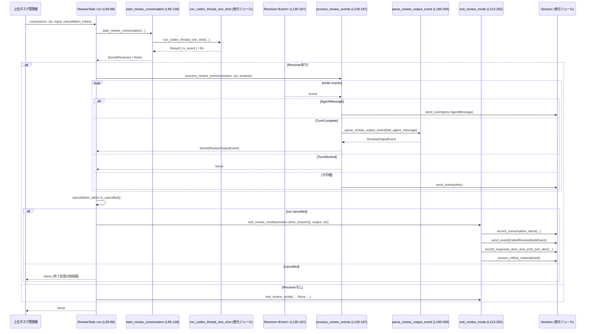

# core/src/tasks/review.rs コード解説

## 0. ざっくり一言

`ReviewTask` セッションタスクとしてレビュー専用のサブエージェント会話を起動し、そのイベントストリームから `ReviewOutputEvent` を抽出して、最終的なレビュー結果メッセージと `ExitedReviewMode` イベントを送出するモジュールです（`core/src/tasks/review.rs:L41-92, L95-187, L213-282`）。

---

## 1. このモジュールの役割

### 1.1 概要

- このモジュールは **コードレビュータスク**（`TaskKind::Review`）を実行するために存在し、レビュー用のサブエージェント会話を起動して結果を集約し、クライアントに適した形で通知する機能を提供します（`core/src/tasks/review.rs:L41-53, L59-88`）。
- 内部では、レビュー用に制限された設定で `run_codex_thread_one_shot` を呼び出し、`async_channel::Receiver<Event>` 経由でイベントを受信します（`L95-138`）。
- 受信したイベントストリームから、レビュー出力（`ReviewOutputEvent`）を JSON もしくはテキストから抽出し（`L189-209`）、終了時に `ExitedReviewModeEvent` とメッセージ記録を行います（`L213-282`）。

### 1.2 アーキテクチャ内での位置づけ

このモジュールは「セッションタスク」の 1 つとして動作し、`SessionTaskContext` / `TurnContext` / `Session` と連携します。外部の Codex スレッド起動関数やレビュー書式ヘルパーとも連携します。

```mermaid
graph TD
    A["ReviewTask (SessionTask実装) (L41-92)"]
    B["SessionTaskContext (他モジュール)"]
    C["TurnContext (他モジュール)"]
    D["run_codex_thread_one_shot (crate::codex_delegate) (L123-135)"]
    E["async_channel::Receiver<Event> (L139-187)"]
    F["ReviewOutputEvent (codex_protocol)"]
    G["Session (crate::codex) (L213-282)"]
    H["review_format::{format_..., render_...} (L224-233, L270-271)"]
    I["Templates (LazyLock<Template>) (L34-39, L284-288)"]

    A -->|run(...)| D
    D -->|rx_event| E
    A -->|process_review_events| E
    E -->|JSON/text| F
    A -->|exit_review_mode| G
    G -->|record/send| 外部クライアント
    A -->|テンプレート&書式| I
    A -->|レビュー出力整形| H
```

### 1.3 設計上のポイント

- **責務分割**
  - `ReviewTask::run` がタスク全体のオーケストレーションを担当（`L59-88`）。
  - `start_review_conversation` が「レビュー専用サブエージェント」の起動と設定を担当（`L95-138`）。
  - `process_review_events` がイベントストリームの集約と `ReviewOutputEvent` 取得を担当（`L139-187`）。
  - `exit_review_mode` がレビュー終了時のイベント送信と会話ログ記録を担当（`L213-282`）。
- **状態管理**
  - `ReviewTask` 自体は状態を持たない `Copy` 構造体（`L41-42`）。
  - 状態は `SessionTaskContext`, `TurnContext`, `Session` など外部コンポーネントに保持され、ここではすべて `Arc` 経由で参照されます（`L59-64, L213-217`）。
- **エラーハンドリング方針**
  - サブエージェント起動失敗（`run_codex_thread_one_shot` が `Err`）は `None` として扱い、レビュー中断として処理（`L123-138`）。
  - レビュー出力 JSON のパース失敗は、プレーンテキストを `overall_explanation` に格納した `ReviewOutputEvent` でフォールバック（`L195-209`）。
  - テンプレートのパース／レンダリング失敗は `panic!` で扱われ、プロセス全体がクラッシュし得ます（`L34-39, L284-288`）。
- **並行性**
  - `Arc` による共有と `CancellationToken` によるキャンセル制御を利用した非同期処理（`L59-65, L95-100`）。
  - `async_channel::Receiver<Event>` による非同期イベントストリーム処理（`L139-146`）。
  - `LazyLock<Template>` によるテンプレートのスレッド安全な遅延初期化（`L34-39`）。

---

## 2. 主要な機能一覧

- レビューモードタスクの定義: `ReviewTask` が `SessionTask` を実装し、`TaskKind::Review` を表現（`L41-53`）。
- レビュー用サブエージェント会話の起動: `start_review_conversation` による設定・起動とイベント受信チャネルの取得（`L95-138`）。
- レビューイベントストリームの処理: `process_review_events` によるイベント転送・抑制・集約（`L139-187`）。
- レビュー出力テキストのパース: `parse_review_output_event` による JSON / 部分 JSON / テキストの 3 段階パース（`L189-209`）。
- レビューモード終了処理: `exit_review_mode` によるレビュー結果メッセージと `ExitedReviewModeEvent` の送出、およびロールアウトの永続化（`L213-282`）。
- テンプレートベースのユーザーメッセージ整形: `REVIEW_EXIT_SUCCESS_TEMPLATE` と `render_review_exit_success` による XML 風ラッパー生成（`L34-39, L284-288`）。
- 改行コード正規化: `normalize_review_template_line_endings` によるテンプレートの `\r` → `\n` 変換（`L290-295`）。

---

## 3. 公開 API と詳細解説

### 3.1 型・定数一覧

| 名前 | 種別 | 公開範囲 | 役割 / 用途 | 定義位置 |
|------|------|----------|-------------|----------|
| `ReviewTask` | 構造体（`Clone`, `Copy`） | `pub(crate)` | レビューモードのセッションタスクを表す型。`SessionTask` トレイトを実装し、レビュー処理のエントリポイントとなる。 | `core/src/tasks/review.rs:L41-42, L50-92` |
| `REVIEW_EXIT_SUCCESS_TEMPLATE` | `static LazyLock<Template>` | モジュール内 private | レビューモード成功時のユーザーメッセージを生成するテンプレートを保持。初期化時に改行を正規化してパース。 | `L34-39` |

> `SessionTask`, `SessionTaskContext`, `Session` などの型定義は、このチャンクには現れません。

### 3.2 重要関数の詳細

以下では、特に重要な 7 関数について詳しく説明します。

---

#### `impl SessionTask for ReviewTask::run(...) -> Option<String>`  

**定義位置:** `core/src/tasks/review.rs:L59-88`

```rust
async fn run(
    self: Arc<Self>,
    session: Arc<SessionTaskContext>,
    ctx: Arc<TurnContext>,
    input: Vec<UserInput>,
    cancellation_token: CancellationToken,
) -> Option<String> { /* ... */ }
```

**概要**

- レビューモードタスクのメイン処理です。
- レビュー専用サブエージェント会話を起動し、イベントからレビュー結果を取得し、キャンセルされていなければ `exit_review_mode` を呼び出します（`L59-88`）。
- 戻り値の `Option<String>` は常に `None` で、実際の結果はイベントと会話ログとして外部に伝達されます。

**引数**

| 引数名 | 型 | 説明 |
|--------|----|------|
| `self` | `Arc<Self>` | `ReviewTask` インスタンスへの共有参照。タスクはステートレスなので `Arc<Self>` で共有されます。 |
| `session` | `Arc<SessionTaskContext>` | セッション関連サービス (`Session` やモデル管理など) を含むコンテキスト（`L59-62`）。 |
| `ctx` | `Arc<TurnContext>` | 現在のターンに関する設定やモデル情報を含むコンテキスト（`L62-63`）。 |
| `input` | `Vec<UserInput>` | レビュー対象やプロンプトなど、サブエージェントに渡すユーザー入力（`L63-64`）。 |
| `cancellation_token` | `CancellationToken` | レビュータスクをキャンセルするためのトークン（`L64-65`）。 |

**戻り値**

- `Option<String>`: 現状の実装では常に `None` を返します（`L84-88`）。
  - 実際のレビュー結果は `exit_review_mode` 内でイベントとメッセージとして送出されるため、呼び出し元は戻り値ではなくイベントを監視する想定です。

**内部処理の流れ**

1. テレメトリカウンタ `codex.task.review` を 1 増加（観測性向上のため）（`L66-70`）。
2. `start_review_conversation` を呼び出してレビュー用サブエージェント会話を開始し、イベント受信チャネルを取得（`L72-80`）。
3. 戻り値に応じて分岐（`L80-83`）:
   - `Some(receiver)` の場合: `process_review_events(session.clone(), ctx.clone(), receiver)` を await し、`Option<ReviewOutputEvent>` を得る。
   - `None` の場合: 出力も `None`（サブエージェント起動失敗や早期終了）。
4. `cancellation_token.is_cancelled()` が `false` の場合のみ、`exit_review_mode` を呼び出して終了処理を行う（`L84-86`）。
5. 最後に `None` を返す（`L87`）。

**Examples（使用例）**

```rust
use std::sync::Arc;
use tokio_util::sync::CancellationToken;
use crate::tasks::{ReviewTask, SessionTask};
use crate::codex::{Session, TurnContext};
use crate::tasks::SessionTaskContext;
use codex_protocol::user_input::UserInput;

// 非同期コンテキスト内の例
async fn run_review_example(
    session_ctx: Arc<SessionTaskContext>,
    turn_ctx: Arc<TurnContext>,
    review_inputs: Vec<UserInput>,
) {
    let review_task = Arc::new(ReviewTask::new());      // ReviewTaskを生成（L44-48）
    let cancel = CancellationToken::new();              // キャンセルトークンを用意（L64）

    // 戻り値は常にNone。結果はイベントとメッセージとして処理される。
    let _ = review_task
        .run(session_ctx.clone(), turn_ctx.clone(), review_inputs, cancel)
        .await;
}
```

**Errors / Panics**

- `run` 自体には `panic!` はありません。
- ただし内部で呼び出される `start_review_conversation` が、`web_search_mode.set(WebSearchMode::Disabled)` 失敗時に `panic!` を起こします（`L105-110`）。  
  これは「`Constrained<WebSearchMode>` は Disabled を必ず受け付ける」という前提条件に依存しています。
- サブエージェント起動失敗などは `None` として扱われ、`exit_review_mode` に `None` が渡されます。

**Edge cases（エッジケース）**

- `start_review_conversation` が `None` を返した場合でも、`cancellation_token` が未キャンセルなら `exit_review_mode` が呼び出され、「中断されたレビュー」として終了します（`L80-86, L221-243`）。
- `cancellation_token` が終了時点でキャンセルされている場合、`exit_review_mode` は呼ばれません（`L84-86`）。  
  キャンセル時の最終処理がどこで行われるかは、このファイルだけでは分かりません（`abort` メソッドや外部ロジックに依存）。

**使用上の注意点**

- 戻り値にレビュー内容は含まれないため、呼び出し側は **イベントと会話ログを基準に処理を行う必要** があります。
- キャンセル動作（`CancellationToken`）と `abort` メソッドの呼び出しタイミングは、セッションタスクのライフサイクル設計に依存しており、このファイル単独では仕様を判断できません。

---

#### `start_review_conversation(...) -> Option<async_channel::Receiver<Event>>`  

**定義位置:** `core/src/tasks/review.rs:L95-138`

**概要**

- レビュー用サブエージェント会話を起動し、そのイベントストリームを受信するための `async_channel::Receiver<Event>` を返します。
- Web 検索やコラボ機能を強制的に無効化し、レビュー専用プロンプトと承認ポリシーを設定します（`L101-117`）。

**引数**

| 引数名 | 型 | 説明 |
|--------|----|------|
| `session` | `Arc<SessionTaskContext>` | 認証情報・モデル管理など、サブエージェント起動に必要な情報を提供（`L95-97, L124-129`）。 |
| `ctx` | `Arc<TurnContext>` | 元のターンの設定・モデル情報を参照するために使用。レビュー用モデルやプロンプトを決定する際に参照（`L97-101, L118-122`）。 |
| `input` | `Vec<UserInput>` | サブエージェントに渡す入力（レビュー対象など）（`L98-99, L127`）。 |
| `cancellation_token` | `CancellationToken` | サブエージェントの実行を中断するために渡されるキャンセルトークン（`L99-100, L130`）。 |

**戻り値**

- `Option<async_channel::Receiver<Event>>`:
  - `Some(receiver)`: サブエージェントが正常に起動し、イベントを受信できるチャネル。
  - `None`: `run_codex_thread_one_shot` が `Err` を返したなどの理由で起動に失敗した場合（`L135-137`）。

**内部処理の流れ**

1. `ctx.config` をクローンして `sub_agent_config` として取得（`L101-102`）。
2. レビュー専用の制約を設定（`L103-113`）。
   - `web_search_mode` を `Disabled` に設定。失敗時は `panic!`（`L105-110`）。
   - `Feature::SpawnCsv`, `Feature::Collab` を disable（戻り値は無視）（`L111-112`）。
3. レビュー用プロンプトと承認ポリシーを設定（`L114-117`）。
   - `base_instructions` に `crate::REVIEW_PROMPT` を設定。
   - `approval_policy` を `AskForApproval::Never` のみに制限。
4. 使用するモデルを決定（`L118-122`）。
   - `config.review_model` があればそれを使用。
   - なければ `ctx.model_info.slug` を使用。
5. `run_codex_thread_one_shot` を呼び出し、サブエージェントを起動（`L123-135`）。
6. `await` 後の `Result` から `.ok()` で成功時のみ取り出し、`io.rx_event` を `Some` で返却（`L135-137`）。

**Examples（使用例）**

この関数はモジュール内 private であり、直接呼び出されることは想定されていません。`ReviewTask::run` からのみ利用されます（`L72-80`）。

**Errors / Panics**

- `sub_agent_config.web_search_mode.set(WebSearchMode::Disabled)` が `Err` を返した場合に、メッセージ付きで `panic!` します（`L105-110`）。
- `sub_agent_config.features.disable(...)` の戻り値は破棄されており、エラー発生時の挙動はこのコードからは分かりません（`L111-112`）。
- `run_codex_thread_one_shot(...).await` のエラーは `.ok()` により握りつぶされ、起動失敗として扱われますが、詳細な原因は失われます（`L135-137`）。

**Edge cases（エッジケース）**

- `review_model` が指定されていない場合、現在のターンで使用中のモデルスラグにフォールバックします（`L118-122`）。
- 起動に失敗した場合（`None`）は、上位の `run` にて「レビュー中断」として扱われます（`L80-83, L221-243`）。

**使用上の注意点**

- レビュー用サブエージェントはツール使用が強制的に制限されています（検索やコラボ機能など）。この制約を緩めたい場合は、この関数付近の設定変更が必要になります。
- `panic!` に依存している前提（`Constrained<WebSearchMode>` が `Disabled` をサポートする）が崩れるとプロセス全体に影響します。

---

#### `process_review_events(...) -> Option<ReviewOutputEvent>`  

**定義位置:** `core/src/tasks/review.rs:L139-187`

**概要**

- サブエージェントからの `Event` ストリームを受信し、外部に転送すべきイベントを `Session` に送出しつつ、最終的な `ReviewOutputEvent` を抽出します。
- 一部のイベント（`AgentMessageDelta` など）はレビュー固有の理由で抑制されます（`L157-165`）。

**引数**

| 引数名 | 型 | 説明 |
|--------|----|------|
| `session` | `Arc<SessionTaskContext>` | イベントをクライアントに転送するために `Session` を取得するコンテキスト（`L140-142, L150-153, L179-182`）。 |
| `ctx` | `Arc<TurnContext>` | イベント送信時に必要なターンコンテキスト（`L141-143, L151-153, L180-182`）。 |
| `receiver` | `async_channel::Receiver<Event>` | サブエージェントから送られてくるイベント受信チャネル（`L143-146`）。 |

**戻り値**

- `Option<ReviewOutputEvent>`:
  - `Some(ev)`: ターン完了時に `last_agent_message` からパースした `ReviewOutputEvent`（`L166-172`）。
  - `None`:
    - `EventMsg::TurnAborted` を受信した場合（`L173-176`）。
    - チャネルがクローズされ、`TurnComplete` を受け取らずにループを抜けた場合（`L185-187`）。

**内部処理の流れ**

1. `prev_agent_message: Option<Event>` を `None` で初期化（`L145`）。
2. `while let Ok(event) = receiver.recv().await` でイベントを受信し続ける（`L145-146`）。
3. `event.clone().msg` によってメッセージをパターンマッチ（`L147`）。
   - `EventMsg::AgentMessage(_)`（通常のエージェントメッセージ）の場合（`L148-156`）:
     - 直前の `prev_agent_message` があれば、それを `Session` に転送（`L149-153`）。
     - 現在のイベントを `prev_agent_message` として保存（`L154-155`）。
     - この設計により、常に「1つ前のメッセージ」を外部に見せ、最後のメッセージは後続の `TurnComplete` と共に扱われます。
   - `ItemCompleted`（ただし `TurnItem::AgentMessage` のみ）、`AgentMessageDelta`, `AgentMessageContentDelta` は **抑制**（何もしない）（`L157-165`）。
   - `EventMsg::TurnComplete(task_complete)` の場合（`L166-172`）:
     - `task_complete.last_agent_message.as_deref()` から文字列スライスを取得し、`parse_review_output_event` で `ReviewOutputEvent` に変換。
     - その結果（`Option<ReviewOutputEvent>`）をそのまま返して終了。
   - `EventMsg::TurnAborted(_)` の場合（`L173-176`）:
     - `None` を返して終了（キャンセル/アボート扱い）。
   - その他のイベントはすべて `Session` に転送（`L178-182`）。
4. `receiver.recv().await` が `Err` を返した（チャネルクローズ）場合はループを抜け、`None` を返す（`L185-187`）。

**Examples（使用例）**

この関数もモジュール内部でのみ使用され、直接利用は `ReviewTask::run` から行われます（`L81-82`）。

**Errors / Panics**

- 本関数内には `panic!` はありません。
- `receiver.recv().await` のエラー（チャネルクローズなど）は `None` 返却による「中断扱い」として処理されます（`L185-187`）。
- `Session::send_event` がどのようなエラーを持つかはこのファイルには現れず、ここでは `await` しているだけです（`L150-153, L179-182`）。

**Edge cases（エッジケース）**

- `TurnComplete` が一度も送られずにチャネルがクローズされた場合、レビュー結果は `None` となり、「中断されたレビュー」として扱われます（`L185-187, L221-243`）。
- `last_agent_message` が `None` のまま `TurnComplete` になった場合は、`out` も `None` になります（`L168-171`）。
- 最後の `AgentMessage` 自体は `Session::send_event` に転送されません。これはレビュー結果を構造化出力に集約するための設計と推測されますが、このチャンクだけでは断定できません。

**使用上の注意点**

- レビュー結果は `TurnComplete` の `last_agent_message` に依存します。サブエージェント側がこのプロトコルを守らないと結果が取得できません。
- 一部イベント（特に `AgentMessageDelta` 系）は明示的に無視されるため、クライアントでデルタイベントを期待しないレビュー UI が前提と考えられます。

---

#### `parse_review_output_event(text: &str) -> ReviewOutputEvent`  

**定義位置:** `core/src/tasks/review.rs:L189-209`

**概要**

- レビュー用モデルから返ってきたテキストを `ReviewOutputEvent` に変換するユーティリティ関数です。
- **3段階** のフォールバック戦略を持ちます（`L195-209`）:
  1. テキスト全体を JSON としてパース。
  2. 最初の `{` から最後の `}` までの部分文字列を JSON としてパース。
  3. いずれも失敗したら `overall_explanation` にテキスト全体を入れたデフォルト値を返す。

**引数**

| 引数名 | 型 | 説明 |
|--------|----|------|
| `text` | `&str` | レビュー用モデルから返された生のテキスト（`L195`）。 |

**戻り値**

- `ReviewOutputEvent`: JSON デシリアライズに成功した場合はその値、失敗した場合は `overall_explanation` にテキスト全体を格納した値（他フィールドは `Default::default()`）を返します（`L195-209`）。

**内部処理の流れ**

1. `serde_json::from_str::<ReviewOutputEvent>(text)` を試みる（`L195-197`）。
   - 成功したらそのまま `return ev`。
2. 失敗した場合、`text.find('{')` と `text.rfind('}')` を用いて最初と最後の波括弧の位置を探し、`start < end` かをチェック（`L199-201`）。
   - 条件が満たされれば、その区間のスライス `slice` を取り出し（`L200-201`）、再度 `serde_json::from_str` を試す（`L201-202`）。
   - 成功したら `return ev`。
3. どちらも失敗した場合、`ReviewOutputEvent { overall_explanation: text.to_string(), ..Default::default() }` を返す（`L205-208`）。

**Examples（使用例）**

```rust
use codex_protocol::protocol::ReviewOutputEvent;

// 完全なJSON文字列からのパース
let json = r#"{"overall_explanation": "Looks good", "findings": []}"#;
let ev = parse_review_output_event(json);                 // L195-197
assert_eq!(ev.overall_explanation, "Looks good");

// 周囲にテキストが混ざった場合
let mixed = "Some header\n{\"overall_explanation\":\"ok\"}\nFooter";
let ev2 = parse_review_output_event(mixed);               // L199-203
assert_eq!(ev2.overall_explanation, "ok");

// JSONでない場合
let plain = "Model could not produce structured output.";
let ev3 = parse_review_output_event(plain);               // L205-208
assert_eq!(ev3.overall_explanation, plain);
```

**Errors / Panics**

- `serde_json::from_str` のエラーは無視され、決して `panic!` しません。
- 本関数内に `panic!` はありません。

**Edge cases（エッジケース）**

- `text` 内に `{` や `}` が含まれない場合:
  - 2段階目の条件 `(Some(start), Some(end))` が成立せず、プレーンテキストフォールバックになります（`L199-205`）。
- `{` や `}` が複数回出現し、JSON 以外の箇所にも含まれている場合:
  - 最初と最後の `}` の区間が JSON として不正な可能性がありますが、その場合もフォールバックにより安全側に倒れます。
- 非 UTF-8 文字列は渡されない前提（Rust の `&str` は常に UTF-8）。

**使用上の注意点**

- モデル出力に周辺テキストや説明文が混在していても、最初の `{`〜最後の `}` の範囲が `ReviewOutputEvent` 相当の JSON であれば正しくパースされます。
- モデルが異なる JSON 形式を返す場合の扱い（フィールド追加など）は `ReviewOutputEvent` 型と `serde` の設定に依存しますが、このファイルには現れません。

---

#### `pub(crate) async fn exit_review_mode(...)`  

**定義位置:** `core/src/tasks/review.rs:L211-282`

**概要**

- レビューモード終了時に呼び出される関数です。
- 以下を行います（`L219-282`）:
  1. 成功 or 中断に応じて、ユーザーメッセージとアシスタントメッセージの内容を決定。
  2. 「レビュー開始・結果」を表すユーザーメッセージを会話アイテムとして記録。
  3. `ExitedReviewModeEvent` を送出。
  4. レビュー結果のアシスタントメッセージを記録し、ターンアイテムとして送出。
  5. ロールアウト情報の永続化を保証。

**引数**

| 引数名 | 型 | 説明 |
|--------|----|------|
| `session` | `Arc<Session>` | 会話アイテムの記録・イベント送信・ロールアウト永続化を提供するオブジェクト（`L214-217, L245-282`）。 |
| `review_output` | `Option<ReviewOutputEvent>` | レビュー結果。`Some` の場合は成功、`None` の場合は中断とみなされます（`L216-217`）。 |
| `ctx` | `Arc<TurnContext>` | 現在のターンコンテキスト。記録やイベント送信時に利用（`L217, L245-261, L264-267`）。 |

**戻り値**

- `()`（暗黙）: 副作用のみ行います。

**内部処理の流れ**

1. メッセージIDの定数を定義（`L219-220`）。
2. `review_output` に応じて `(user_message, assistant_message)` を決定（`L221-243`）。
   - **成功パス (`Some(out)`)**（`L221-233`）:
     - `findings_str` に `out.overall_explanation.trim()` を追加（空でなければ）（`L222-225`）。
     - `out.findings` が空でなければ、`format_review_findings_block` で整形したブロックを追記（`L227-229`）。
     - `render_review_exit_success(&findings_str)` でユーザーメッセージ（XML 風テンプレート）を生成（`L230-231`）。
     - `render_review_output_text(&out)` でアシスタントメッセージを生成（`L231-232`）。
   - **中断パス (`None`)**（`L234-243`）:
     - `REVIEW_EXIT_INTERRUPTED_TMPL` を `normalize_review_template_line_endings` で正規化し、`String` にしてユーザーメッセージとする（`L235-238`）。
     - アシスタントメッセージは固定の英語文 `"Review was interrupted...."`（`L239-241`）。
3. ユーザーメッセージを `ResponseItem::Message` として `record_conversation_items` で記録（`L245-255`）。
4. `EventMsg::ExitedReviewMode` を送出（`L258-262`）。
5. アシスタントメッセージを `record_response_item_and_emit_turn_item` で記録＋ターンアイテム送出（`L264-276`）。
6. 最後に `session.ensure_rollout_materialized().await` でロールアウト永続化を保証（`L278-282`）。

**Examples（使用例）**

`ReviewTask::run` と `abort` からのみ使用されることが前提で、外部から直接呼ぶケースは限定的と考えられます（`L85-86, L90-92`）。

**Errors / Panics**

- 本関数自体に `panic!` はありません。
- ただし呼び出す `render_review_exit_success` がテンプレートレンダリング失敗時に `panic!` を発生させる可能性があります（`L230-231, L284-288`）。
- `Session` のメソッド（`record_conversation_items` など）のエラー挙動は、このファイルには現れません。

**Edge cases（エッジケース）**

- `review_output` が `Some` だが `overall_explanation` も `findings` も空の場合:
  - `findings_str` は空のままになり、テンプレートの `<results>` セクションが空になることがテストから分かります（`L221-233, L305-310`）。
- `review_output` が `None` の場合:
  - ユーザーメッセージは `REVIEW_EXIT_INTERRUPTED_TMPL` に基づき、アシスタントメッセージは固定文となります（`L234-243`）。

**使用上の注意点**

- `review_output` はそのまま `ExitedReviewModeEvent` に含まれて送信されるため（`L258-262`）、サイズの大きな `findings` を持つ場合のペイロード増大に注意が必要です。
- `render_review_exit_success` は `results` 埋め込み時にエスケープを行わないため、テンプレートの構造（XML 風）に依存したパーサを持つクライアント側では、テキスト中の `<` や `&` などの扱いに注意が必要です（`L221-233, L284-288`）。

---

#### `fn render_review_exit_success(results: &str) -> String`  

**定義位置:** `core/src/tasks/review.rs:L284-288`

**概要**

- `REVIEW_EXIT_SUCCESS_TEMPLATE` テンプレートに `results` プレースホルダを埋め込んだユーザーメッセージ文字列を生成します。
- テンプレートのパースは `LazyLock` 初期化時に行われています（`L34-39`）。

**引数**

| 引数名 | 型 | 説明 |
|--------|----|------|
| `results` | `&str` | レビュー結果文字列（`overall_explanation` と `findings` から構成）（`L230-231`）。 |

**戻り値**

- `String`: テンプレートに結果を埋め込んだ完全なメッセージ。テストから、XML 風の `<user_action>` ブロックでラップされていることが確認できます（`L305-310`）。

**内部処理の流れ**

1. `REVIEW_EXIT_SUCCESS_TEMPLATE.render([("results", results)])` を呼び出し（`L285-287`）。
2. 成功した場合は生成された `String` を返却。
3. 失敗した場合は `panic!("review exit success template must render: {err}")` を発生させる（`L285-288`）。

**Examples（使用例）**

テストでの使用例（`L305-310`）:

```rust
let msg = render_review_exit_success("Finding A\nFinding B");
assert!(msg.contains("<results>"));
assert!(msg.contains("Finding A\nFinding B"));
```

**Errors / Panics**

- テンプレート中に `results` プレースホルダが存在しない、またはテンプレート自体が壊れている場合など、レンダリング失敗時には `panic!` が発生します（`L285-288`）。

**Edge cases（エッジケース）**

- `results` が空文字の場合でもテンプレートは生成されます。結果として `<results>` セクションが空になります（テストと `exit_review_mode` の処理から推測可能）。

**使用上の注意点**

- テンプレートの内容（`REVIEW_EXIT_SUCCESS_TMPL`）は別モジュールに定義されており、このファイルには現れませんが、テストの期待値から XML 風構造であることが分かります（`L305-310`）。テンプレート変更時はテストが壊れないか確認する必要があります。

---

#### `fn normalize_review_template_line_endings(template: &str) -> Cow<'_, str>`  

**定義位置:** `core/src/tasks/review.rs:L290-295`

**概要**

- テンプレート文字列中の改行コードを `\n` に正規化するユーティリティです。
- `\r\n`（Windowsスタイル）と単独の `\r` をともに `\n` に置き換えます。

**引数**

| 引数名 | 型 | 説明 |
|--------|----|------|
| `template` | `&str` | 元のテンプレート文字列（`L290-291, L35-36, L235-237`）。 |

**戻り値**

- `Cow<'_, str>`:
  - 変換が不要（`\r` を含まない）場合は `Cow::Borrowed(template)` を返し、追加のメモリアロケーションを避けます（`L293-295`）。
  - 変換が必要な場合は置換済みの `String` を `Cow::Owned` で返します（`L291-293`）。

**内部処理の流れ**

1. `template.contains('\r')` で CR を含むかチェック（`L291-292`）。
2. 含まれる場合は
   - `.replace("\r\n", "\n")` で CRLF を LF に変換し、
   - `.replace('\r', "\n")` で残りの CR を LF に変換した `String` を作成（`L292-293`）。
   - `Cow::Owned` で返却。
3. 含まれない場合は `Cow::Borrowed(template)` を返却（`L293-295`）。

**Examples（使用例）**

```rust
let raw = "<user_action>\r\n  <results>\r\n  None.\r\n";
let normalized = normalize_review_template_line_endings(raw);  // L291-293
assert_eq!(
    normalized,
    "<user_action>\n  <results>\n  None.\n"
);
```

（上記はテスト `normalize_review_template_line_endings_rewrites_crlf` に対応、`L313-318`）

**Errors / Panics**

- 本関数内にはエラーも `panic!` もありません。

**Edge cases（エッジケース）**

- `template` が非常に長い場合、CR を含むとコピーと 2 回の `replace` によりメモリアロケーションコストがかかります。
- 既に LF のみのテンプレートにはまったくコストをかけない点が特徴です（`Cow::Borrowed`）。

**使用上の注意点**

- `Cow` を返すため、呼び出し側で `into_owned()` するかどうかは用途に応じて選べます（`L235-238` は `into_owned` を利用）。

---

### 3.3 その他の関数

| 関数名 | シグネチャ | 役割 / 用途 | 定義位置 |
|--------|------------|-------------|----------|
| `ReviewTask::new` | `pub(crate) fn new() -> Self` | `ReviewTask` のコンストラクタ。フィールドを持たないため単に `Self` を返します。 | `L44-48` |
| `ReviewTask::kind` | `fn kind(&self) -> TaskKind` | `SessionTask` 実装の一部。タスク種別として `TaskKind::Review` を返します。 | `L51-53` |
| `ReviewTask::span_name` | `fn span_name(&self) -> &'static str` | トレース用のスパン名 `"session_task.review"` を返します。 | `L55-57` |
| `ReviewTask::abort` | `async fn abort(&self, session: Arc<SessionTaskContext>, ctx: Arc<TurnContext>)` | タスク中断時に呼び出され、`exit_review_mode` を `review_output: None` で呼び出します。キャンセルケースの終了処理入口です。 | `L90-92` |
| `tests::render_review_exit_success_replaces_results_placeholder` | `#[test] fn ...()` | `render_review_exit_success` が `results` プレースホルダを正しく置換することを検証するテストです。期待されるテンプレート出力全体を比較します。 | `L305-310` |
| `tests::normalize_review_template_line_endings_rewrites_crlf` | `#[test] fn ...()` | CRLF / CR が LF に正規化されることを検証するテストです。 | `L312-318` |

---

## 4. データフロー

ここでは、レビューの典型的な処理フロー（/review 実行 → サブエージェントによるレビュー → 結果取得 → 終了処理）を示します。

### 4.1 代表的な処理シナリオ

1. 上位コンポーネントが `ReviewTask::run` を呼び出し、`SessionTaskContext`, `TurnContext`, `Vec<UserInput>`, `CancellationToken` を渡す（`L59-65`）。
2. `start_review_conversation` がレビュー専用設定で `run_codex_thread_one_shot` を起動し、`Receiver<Event>` を取得（`L95-138`）。
3. `process_review_events` が `Receiver<Event>` からイベントを受信し、必要なイベントを `Session` 経由で外部に転送しつつ、`TurnComplete` の `last_agent_message` から `ReviewOutputEvent` をパース（`L139-187, L189-209`）。
4. タスクがキャンセルされていなければ、`exit_review_mode` が呼ばれ、`ExitedReviewModeEvent` と会話メッセージが送出される（`L84-86, L213-282`）。

### 4.2 シーケンス図



※ `Session`, `run_codex_thread_one_shot` などの具体的な挙動は、このチャンクには定義がありません。

---

## 5. 使い方（How to Use）

### 5.1 基本的な使用方法

`ReviewTask` は `SessionTask` の 1 実装として、タスク管理側から呼び出される想定です。簡略化した使用例は次のようになります。

```rust
use std::sync::Arc;
use tokio_util::sync::CancellationToken;
use crate::tasks::{ReviewTask, SessionTask, SessionTaskContext};
use crate::codex::TurnContext;
use codex_protocol::user_input::UserInput;

async fn run_review_task(
    session_ctx: Arc<SessionTaskContext>,   // セッションコンテキスト
    turn_ctx: Arc<TurnContext>,            // ターンコンテキスト
    review_inputs: Vec<UserInput>,         // レビュー用入力
) {
    let task = Arc::new(ReviewTask::new()); // ReviewTaskインスタンス生成（L44-48）
    let cancel_token = CancellationToken::new();

    // 戻り値のOption<String>は常にNoneであり、結果はイベント・メッセージとして扱われる
    let _ = task
        .run(session_ctx.clone(), turn_ctx.clone(), review_inputs, cancel_token)
        .await;
}
```

この呼び出しにより、レビューサブエージェントが起動され、レビュー完了時に `ExitedReviewModeEvent` と会話メッセージがセッションに記録されます（`L213-282`）。

### 5.2 よくある使用パターン

- **キャンセル対応付きレビュー**

```rust
use tokio_util::sync::CancellationToken;

async fn run_cancellable_review(
    session_ctx: Arc<SessionTaskContext>,
    turn_ctx: Arc<TurnContext>,
    review_inputs: Vec<UserInput>,
) {
    let token = CancellationToken::new();
    let task = Arc::new(ReviewTask::new());

    let handle = {
        let session_ctx = session_ctx.clone();
        let turn_ctx = turn_ctx.clone();
        let task = task.clone();
        tokio::spawn(async move {
            let _ = task.run(session_ctx, turn_ctx, review_inputs, token.clone()).await;
        })
    };

    // 何らかの条件でキャンセルしたいとき
    // token.cancel();  // これによりTurnAbortedやチャネルクローズを通じて処理が中断される想定
    let _ = handle.await;
}
```

※ `CancellationToken` がサブエージェントや `process_review_events` にどのように反映されるかは、このファイルからは詳細不明ですが、`run_codex_thread_one_shot` に渡されていることが分かります（`L123-131`）。

### 5.3 よくある間違い / 注意したい誤用例

```rust
// 誤りの可能性: 戻り値から結果を取得しようとしている
async fn wrong_usage(task: Arc<ReviewTask>, session_ctx: Arc<SessionTaskContext>, ctx: Arc<TurnContext>, inputs: Vec<UserInput>) {
    let cancel = CancellationToken::new();
    let result: Option<String> = task.run(session_ctx, ctx, inputs, cancel).await;

    // resultには常にNoneしか入らない（L84-88）
    // println!("{:?}", result); // レビュー内容は出てこない
}

// 正しい考え方: 結果はイベントと会話ログから取得する
// - ExitedReviewModeEvent (L258-262)
// - record_conversation_items / record_response_item_and_emit_turn_item (L245-255, L264-276)
```

### 5.4 使用上の注意点（まとめ）

- **結果の取得方法**
  - `run` の戻り値ではなく、`Session` が記録する会話アイテムと `ExitedReviewModeEvent` を通じて結果を解釈する必要があります（`L245-276, L258-262`）。
- **テンプレートによる `panic!`**
  - テンプレートパース／レンダリングに失敗すると `panic!` によってプロセスが停止します（`L34-39, L284-288`）。テンプレート変更時はテスト（`L305-310`）を必ず通す必要があります。
- **ツール・機能制限**
  - レビュー用サブエージェントは Web 検索・CSV スポーン・コラボ機能などが無効化されます（`L103-113`）。レビューでそれらを利用したい場合は設計見直しが必要です。
- **並行性**
  - `Arc` と `CancellationToken` により並行実行が可能ですが、同じセッションで複数のレビュータスクを同時に走らせる挙動は、このファイルだけでは分かりません。`Session` のスレッド安全性に依存します。

---

## 6. 変更の仕方（How to Modify）

### 6.1 新しい機能を追加する場合

例: レビュー出力に追加メタデータを付けたい場合。

1. **`ReviewOutputEvent` の拡張**
   - 型定義は `codex_protocol::protocol::ReviewOutputEvent` であり、このチャンクには現れません。そちらでフィールド追加が必要です。
2. **パース処理の拡張**
   - `parse_review_output_event`（`L189-209`）にロジックを追加して、新しいフィールドに対応させるか、フォールバック戦略を調整します。
3. **表示ロジックの拡張**
   - アシスタントメッセージの整形は `render_review_output_text(&out)`（`crate::review_format`）に委譲されています（`L231-232`）。
   - ユーザーメッセージへの反映は、`exit_review_mode` 内で `findings_str` を構築する部分（`L221-229`）を変更することで対応できます。
4. **テストの追加**
   - `tests` モジュール（`L298-319`）を参考に、新しい形式の出力に対するテストを追加すると安全です。

### 6.2 既存の機能を変更する場合

- **レビュー機能制限の変更**
  - Web 検索やコラボ機能などの制限は `start_review_conversation` の `sub_agent_config` 設定部にまとまっています（`L101-117`）。
  - 設定を変更する際は、`Constrained<T>` 型の制約に注意し、`panic!` を生じないようにする必要があります（`L105-110`）。
- **イベント処理ロジックの変更**
  - どのイベントをそのまま転送し、どれを抑制するかは `process_review_events` 内の `match` で制御されています（`L147-165`）。
  - 新しいイベント種別に対応したい場合は、この `match` 式にパターンを追加します。
- **終了処理の変更**
  - 終了時のメッセージ構造やロールアウト永続化のタイミングを変えたい場合は、`exit_review_mode` を中心に検討します（`L213-282`）。
  - ただし、既存クライアントが `ExitedReviewModeEvent` への依存を持っている可能性が高く、このイベントの送出仕様を変える場合は互換性に注意する必要があります（`L258-262`）。

変更時は、呼び出し元（`SessionTask` 実装を利用しているタスク管理層）や、`Session` のメソッドを利用している他箇所への影響も確認する必要があります。このチャンクにはそれらの実装がないため、別ファイルを参照する必要があります。

---

## 7. 関連ファイル

このモジュールと密接に関係するモジュール／型（このチャンク内の `use` や参照から分かる範囲）は次の通りです。

| パス / モジュール | 役割 / 関係 |
|-------------------|------------|
| `crate::tasks::SessionTask` / `SessionTaskContext` | レビュータスクの実装が依存するトレイトおよびコンテキスト型。`ReviewTask` がこれを実装します（`L31-32, L50-92`）。 |
| `crate::codex::Session` | 会話アイテムとイベント送信、ロールアウト永続化を行うコンポーネント。`exit_review_mode` で使用されます（`L20, L213-282`）。 |
| `crate::codex::TurnContext` | ターンごとの設定とモデル情報を持つコンテキスト。レビュー用設定やモデル決定に使われます（`L21, L95-122, L213-217`）。 |
| `crate::codex_delegate::run_codex_thread_one_shot` | サブエージェント会話を 1 ショットで起動する関数。レビュー用サブエージェントのイベントチャネルを返します（`L22, L123-135`）。 |
| `crate::config::Constrained` | 設定値に制約を課すための型。`web_search_mode` と `approval_policy` 設定時に使用（`L23, L105-110, L116`）。 |
| `crate::review_format::{format_review_findings_block, render_review_output_text}` | レビュー結果の表示用文字列を整形するヘルパー関数群。`exit_review_mode` で利用（`L24-25, L227-229, L231-232`）。 |
| `crate::client_common::{REVIEW_EXIT_SUCCESS_TMPL, REVIEW_EXIT_INTERRUPTED_TMPL}` | テンプレート文字列。成功時／中断時のユーザーメッセージの元となります（`L35-36, L235-237`）。 |
| `codex_protocol::protocol::{Event, EventMsg, ReviewOutputEvent, ExitedReviewModeEvent, ...}` | サブエージェントとの通信やレビュー出力を表すプロトコル型。イベント処理の中心となります（`L11-16, L140-187, L189-209, L258-262`）。 |
| `codex_protocol::user_input::UserInput` | レビュー用サブエージェントへの入力型（`L28, L63, L98`）。 |
| `codex_features::Feature` | 機能フラグ。レビュー時に無効化されるツールを指定します（`L27, L111-112`）。 |

このチャンクに現れない実装（`Session`, `SessionTaskContext`, `ReviewOutputEvent` のフィールド定義など）は、それぞれのモジュールを参照する必要があります。
