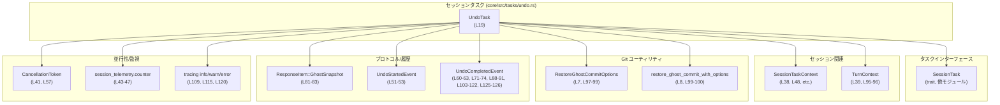

# core/src/tasks/undo.rs コード解説

## 0. ざっくり一言

このファイルは、**セッション履歴から最新の「ゴーストスナップショット」コミットを探して Git リポジトリを元に戻す「Undo」タスク**を実装しています（非公開のセッション内タスクです）。  
実行結果は戻り値ではなく、プロトコルイベント（`UndoStarted` / `UndoCompleted`）としてクライアント側に通知されます。

---

## 1. このモジュールの役割

### 1.1 概要

- このモジュールは、**ユーザー操作の Undo**（ゴーストスナップショットの復元）を行うセッションタスク `UndoTask` を提供します。
- セッション履歴中の `ResponseItem::GhostSnapshot` を末尾から検索し、そのコミットを `codex_git_utils` によって復元します。
- 復元の開始・成功・失敗・キャンセルなどの状態は、`UndoStartedEvent` / `UndoCompletedEvent` を含む `EventMsg` を通じて通知されます。
- 実際の Git 操作は `tokio::task::spawn_blocking` でブロッキング専用スレッドにオフロードされ、非同期ランタイム上での安全性が保たれています（`core/src/tasks/undo.rs:L97-L101`）。

### 1.2 アーキテクチャ内での位置づけ

主な依存関係は以下のとおりです（行番号はこのファイル内での定義または使用位置です）。

- `UndoTask`（本ファイルの中心コンポーネント）  
  - `SessionTask` トレイトを実装（`core/src/tasks/undo.rs:L27-L128`）。
  - `SessionTaskContext` を通じてセッション・履歴・テレメトリ・イベント送信にアクセス（`L38`, `L48-L49`, `L69-L70`, `L89-L90`, `L105-L107`, `L125-L126`）。
  - `TurnContext` からカレントディレクトリ (`ctx.cwd`) とゴーストスナップショット (`ctx.ghost_snapshot`) を取得（`L39`, `L95-L96`）。
  - `codex_git_utils::{RestoreGhostCommitOptions, restore_ghost_commit_with_options}` でゴーストコミット復元（`L7-L8`, `L97-L100`）。
  - `codex_protocol::{EventMsg, UndoStartedEvent, UndoCompletedEvent, ResponseItem}` でイベント送信と履歴要素（`L9-L12`, `L51-L53`, `L60-L63`, `L71-L74`, `L81-L86`）。
  - `CancellationToken` でキャンセル状態を判定（`L14`, `L41`, `L57`）。
  - `tracing::{info,warn,error}` でログ出力（`L15-L17`, `L109`, `L115`, `L120`）。

依存関係図（UndoTask の位置づけ）：



> 図中の `(Lxx-yy)` は、このファイル `core/src/tasks/undo.rs` におけるコード範囲を示します。`run` 本体は `L36-L128` に定義されています。

### 1.3 設計上のポイント

- **タスクオブジェクトは状態を持たない**  
  - `UndoTask` はフィールドを持たないユニット構造体です（`L19`）。状態はすべて `SessionTaskContext` / `TurnContext` に保持されます。
- **非同期タスク + ブロッキング I/O の分離**  
  - `run` は `async fn` として定義され、Git の復元処理のみ `spawn_blocking` で別スレッドに移譲しています（`L97-L101`）。  
    これにより、非同期ランタイム（Tokio）のワーカーをブロックせずに重い I/O を行う設計です。
- **Undo 対象の選択ルール**  
  - 履歴 `items` の末尾側から `ResponseItem::GhostSnapshot` を探し、**最後に出現したゴーストスナップショットのみ**を対象にします（`L76-L86`）。
- **結果はイベントで通知**  
  - `run` の戻り値は常に `None` で、成功・失敗・キャンセル可否はすべて `UndoCompletedEvent` として送信されます（`L71-L74`, `L88-L91`, `L103-L123`, `L125-L127`）。
- **キャンセルは開始直後のみ判定**  
  - `CancellationToken::is_cancelled()` は一度だけ、実処理の前にチェックされます（`L57`）。  
    復元処理中にキャンセルされても途中で止めることはなく、復元処理の完了を待ってから結果イベントを送ります。

---

## 2. コンポーネントインベントリー / 主要な機能一覧

### 2.1 本ファイル内で定義されるコンポーネント

| 名前 | 種別 | 役割 / 用途 | 根拠 |
|------|------|------------|------|
| `UndoTask` | 構造体（ユニット構造体） | Undo 処理を行うセッションタスク本体 | `core/src/tasks/undo.rs:L19` |
| `UndoTask::new` | 関数（関連関数） | `UndoTask` のインスタンスを生成 | `core/src/tasks/undo.rs:L21-L25` |
| `SessionTask for UndoTask` | トレイト実装 | タスクの種別・トレース名・実行ロジックを提供 | `core/src/tasks/undo.rs:L27-L128` |
| `kind` | メソッド | タスク種別として `TaskKind::Regular` を返す | `core/src/tasks/undo.rs:L28-L30` |
| `span_name` | メソッド | トレーシング用 span 名を返す | `core/src/tasks/undo.rs:L32-L34` |
| `run` | 非同期メソッド | Undo 処理のコアロジック（履歴検索・Git 復元・イベント通知・エラーハンドリング） | `core/src/tasks/undo.rs:L36-L128` |

### 2.2 依存コンポーネント（他モジュール / クレート）

このファイルには定義されていませんが、使用されている主な外部コンポーネントです。

| 名前 | 種別 | 用途 | 使用位置（このファイル内） |
|------|------|------|---------------------------|
| `crate::tasks::SessionTask` | トレイト | セッションタスクの共通インターフェース | `L5`, 実装 `L27-L128` |
| `crate::tasks::SessionTaskContext` | 構造体（推定） | セッション・履歴・サービス（テレメトリ等）へのアクセス | `L6`, `L38`, `L43-L47`, `L48-L49`, `L69-L70`, `L89-L90`, `L105-L107`, `L125-L126` |
| `crate::codex::TurnContext` | 構造体（推定） | 作業ディレクトリ (`cwd`)、ゴーストスナップショット (`ghost_snapshot`) 等の実行コンテキスト | `L3`, `L39`, `L50`, `L59`, `L89`, `L95-L96` |
| `crate::state::TaskKind` | 列挙体（推定） | タスク種別（ここでは `Regular`） | `L4`, `L28-L30` |
| `codex_git_utils::RestoreGhostCommitOptions` | 構造体 | ゴーストコミット復元のオプション設定 | `L7`, `L97-L99` |
| `codex_git_utils::restore_ghost_commit_with_options` | 関数 | 実際にゴーストコミットを復元 | `L8`, `L99-L100` |
| `codex_protocol::models::ResponseItem::GhostSnapshot` | 列挙体のバリアント | 履歴中のゴーストスナップショット要素 | `L9`, `L81-L83` |
| `codex_protocol::protocol::{EventMsg, UndoStartedEvent, UndoCompletedEvent}` | 列挙体/構造体 | クライアントへのイベント送信 | `L10-L12`, `L51-L53`, `L60-L63`, `L71-L74`, `L88-L91`, `L103-L123`, `L125-L126` |
| `codex_protocol::user_input::UserInput` | 型 | タスク入力（ここでは未使用） | `L13`, `L40` |
| `tokio_util::sync::CancellationToken` | 型 | タスクキャンセルを表すトークン | `L14`, `L41`, `L57` |
| `tokio::task::spawn_blocking` | 関数 | ブロッキングな Git 復元処理を別スレッドで実行 | `L97-L101` |
| `tracing::{info, warn, error}` | マクロ | ログ出力（監視・デバッグ用） | `L15-L17`, `L109`, `L115`, `L120` |

### 2.3 主要な機能（簡易一覧）

- Undo タスク生成: `UndoTask::new` – ユニット構造体のインスタンス化（`L21-L25`）
- タスク種別の取得: `UndoTask::kind` – `TaskKind::Regular` を返す（`L28-L30`）
- トレース Span 名の取得: `UndoTask::span_name` – `"session_task.undo"` を返す（`L32-L34`）
- Undo 処理本体: `UndoTask::run` – 履歴検索→ゴーストコミット復元→履歴更新→イベント通知（`L36-L128`）

---

## 3. 公開 API と詳細解説

> このファイル内のアイテムは `pub(crate)` でありクレート内限定ですが、セッションタスクとしては外部コードからも呼び出される想定のため「公開 API」として扱って解説します。

### 3.1 型一覧（構造体・列挙体など）

| 名前 | 種別 | 役割 / 用途 | 定義位置 |
|------|------|-------------|----------|
| `UndoTask` | 構造体（ユニット構造体） | セッションにおける「Undo」処理を表すタスク。自身は状態を持たず、コンテキスト (`SessionTaskContext`, `TurnContext`) に依存して動作します。 | `core/src/tasks/undo.rs:L19` |

### 3.2 関数・メソッド詳細

#### `UndoTask::new() -> UndoTask`

**概要**

- `UndoTask` のインスタンスを生成するシンプルなコンストラクタです（`L21-L25`）。
- フィールドを持たないため、常に同じ値（ユニット構造体）を返します。

**引数**

- なし

**戻り値**

- `UndoTask`：新しいタスクインスタンス。

**内部処理の流れ**

1. `Self`（= `UndoTask`）を返すだけです（`L23`）。

**Examples（使用例）**

```rust
use std::sync::Arc;
// UndoTask, SessionTaskContext, TurnContext はこのモジュールと同じクレートに存在する前提です。

async fn run_undo_task(
    session: Arc<SessionTaskContext>,  // 既存のセッションコンテキスト（定義はこのファイルにはありません）
    ctx: Arc<TurnContext>,             // 既存のターンコンテキスト
) {
    let task = Arc::new(UndoTask::new());                // UndoTask インスタンスを生成して Arc で共有
    let token = tokio_util::sync::CancellationToken::new(); // キャンセルトークンを作成
    let _ = task.run(session, ctx, Vec::new(), token).await; // Undo を実行（戻り値は常に None）
}
```

**Errors / Panics**

- 例外処理・パニックを含まず、常に成功します。

**Edge cases（エッジケース）**

- 特になし（インスタンス生成のみ）。

**使用上の注意点**

- `UndoTask` は状態を持たないため、`new` の呼び出し回数に意味はありません。  
  任意の場所で新しく作っても、既存のインスタンスと振る舞いは同じです。

---

#### `fn kind(&self) -> TaskKind`

**概要**

- タスク種別として `TaskKind::Regular` を返します（`L28-L30`）。
- おそらくタスクスケジューラ側での優先度や分類に利用されますが、詳細はこのチャンクにはありません。

**引数**

| 引数名 | 型 | 説明 |
|--------|----|------|
| `&self` | `&UndoTask` | タスクインスタンスの参照。状態を持たないため引数は実質的に型判定用途です。 |

**戻り値**

- `TaskKind`：このタスクの種類。常に `TaskKind::Regular` を返します。

**内部処理の流れ**

1. `TaskKind::Regular` を直接返却（`L29`）。

**Examples（使用例）**

```rust
fn print_undo_task_kind(task: &UndoTask) {
    let kind = task.kind();                      // TaskKind を取得
    // kind のパターンマッチなどは、このファイルには書かれていませんが、他のコードで使われる想定です。
    println!("undo task kind: {:?}", kind);      // Debug 表示できると仮定
}
```

※ `TaskKind` の表示方法はこのチャンクには無いため、`Debug` 実装の有無は不明です。

**Errors / Panics**

- エラー・パニックは発生しません。

**Edge cases**

- 常に同じ値を返すため、エッジケースはありません。

**使用上の注意点**

- 呼び出しコストは無視できる程度ですが、頻繁に呼ぶ必要も特にありません。

---

#### `fn span_name(&self) -> &'static str`

**概要**

- トレーシング用の span 名（`"session_task.undo"`）を返します（`L32-L34`）。
- `tracing` クレートなどと連携して、ログ・メトリクスのラベルとして利用される想定です。

**引数**

| 引数名 | 型 | 説明 |
|--------|----|------|
| `&self` | `&UndoTask` | タスクインスタンスの参照。 |

**戻り値**

- `&'static str`：固定の文字列 `"session_task.undo"`。

**内部処理の流れ**

1. リテラル文字列 `"session_task.undo"` を返すのみです（`L33`）。

**Examples（使用例）**

```rust
fn start_span_for_undo(task: &UndoTask) {
    let name = task.span_name();                    // "session_task.undo"
    // 実際には tracing::span! などと組み合わせて使われる想定ですが、
    // そのコードはこのファイルには現れません。
    println!("span name for undo: {}", name);
}
```

**Errors / Panics**

- エラー・パニックはありません。

**Edge cases**

- 文字列はコンパイル時に決まっているため、変化やエッジケースはありません。

**使用上の注意点**

- タスクごとに別の span 名を付けたい場合は、ここを変更することになります（変更方法は §6 参照）。

---

#### `async fn run(self: Arc<Self>, session: Arc<SessionTaskContext>, ctx: Arc<TurnContext>, _input: Vec<UserInput>, cancellation_token: CancellationToken) -> Option<String>`

**定義位置**

- `core/src/tasks/undo.rs:L36-L128`

**概要**

- Undo タスクのコアロジックです。
- 処理の流れは以下の通りです。
  1. テレメトリカウンタのインクリメント（`"codex.task.undo"`）（`L43-L47`）。
  2. `UndoStarted` イベントの送信（`L48-L55`）。
  3. キャンセル状態のチェック。キャンセルされていれば `UndoCompleted`（失敗）を送って終了（`L57-L67`）。
  4. セッション履歴から `ResponseItem::GhostSnapshot` を末尾から検索（`L69-L86`）。
  5. 見つからなければ「No ghost snapshot available to undo.」で `UndoCompleted`（失敗）を送って終了（`L88-L91`）。
  6. 見つかった場合、Git リポジトリに対してゴーストコミットを復元（`L94-L101`）。
  7. 復元が成功したら履歴からそのスナップショットを削除し、`UndoCompleted`（成功）を送信（`L103-L112`）。
  8. 復元が失敗またはスレッドの Join が失敗した場合、警告/エラーログを出して `UndoCompleted`（失敗）を送信（`L113-L123`）。
- 戻り値の `Option<String>` は常に `None` であり、結果はすべてイベント経由で通知されます（`L127`）。

**引数**

| 引数名 | 型 | 説明 |
|--------|----|------|
| `self` | `Arc<UndoTask>` | タスク本体。`Arc` によってスレッド間・タスク間で共有可能になっています（`L37`）。 |
| `session` | `Arc<SessionTaskContext>` | セッション状態・履歴・サービス（テレメトリ、イベント送信など）へのアクセスハンドル（`L38`）。 |
| `ctx` | `Arc<TurnContext>` | 実行コンテキスト。カレントディレクトリ (`cwd`) やゴーストスナップショット (`ghost_snapshot`) を保持（`L39`, `L95-L96`）。 |
| `_input` | `Vec<UserInput>` | ユーザー入力。ここでは名前が `_input` になっており、一切使用していません（`L40`）。 |
| `cancellation_token` | `CancellationToken` | キャンセル状態を表すトークン。開始時に `is_cancelled()` で判定（`L41`, `L57`）。 |

**戻り値**

- `Option<String>`：常に `None` を返します（`L127`）。
  - Undo の成否はイベント（`UndoCompletedEvent`）に含まれる `success` フラグと `message` で表現されます（`L71-L74`, `L103-L112`, `L113-L117`, `L118-L122`）。

**内部処理の流れ（アルゴリズム）**

1. **テレメトリ更新**  
   - `session.session.services.session_telemetry.counter("codex.task.undo", 1, &[]);` を呼び出し、Undo タスクの実行回数を記録します（`L43-L47`）。
2. **Undo 開始イベント送信**  
   - `session.clone_session()` でセッションハンドルを取得（`L48`）。
   - `UndoStartedEvent { message: Some("Undo in progress...".to_string()) }` を `EventMsg::UndoStarted` として送信（`L49-L55`）。
3. **キャンセルチェック**  
   - `cancellation_token.is_cancelled()` が `true` の場合、`UndoCompletedEvent { success: false, message: Some("Undo cancelled.".to_string()) }` を送信して終了（`L57-L66`）。
4. **履歴と UndoCompletedEvent の準備**  
   - `sess.clone_history().await` で履歴オブジェクトを取得（`L69`）。
   - `history.raw_items().to_vec()` で履歴アイテムを `Vec<_>` にコピー（`L70`）。
   - `UndoCompletedEvent { success: false, message: None }` を初期値として用意（`L71-L74`）。
5. **最新の GhostSnapshot 探索**  
   - `items.iter().enumerate().rev()` で末尾から走査（`L76-L81`）。
   - `ResponseItem::GhostSnapshot { ghost_commit }` を見つけたら `(idx, ghost_commit.clone())` を返す（`L81-L84`）。
   - 見つからなければ `else` 節に入り、メッセージ `"No ghost snapshot available to undo."` を設定して `UndoCompleted` を送信し、終了（`L88-L91`）。
6. **ゴーストコミット復元（ブロッキングスレッド）**  
   - `ghost_commit.id().to_string()` でコミット ID を文字列化（`L94`）。
   - `ctx.cwd.clone()` を `repo_path` として取得（`L95`）。**型はこのチャンクでは不明ですが、`RestoreGhostCommitOptions::new(&repo_path)` に渡されているため Borrow できる型です。**
   - `ctx.ghost_snapshot.clone()` を取得（`L96`）。
   - `tokio::task::spawn_blocking(move || { ... })` で、以下の処理をブロッキングスレッドに委譲（`L97-L101`）:
     1. `RestoreGhostCommitOptions::new(&repo_path)` でオプションを生成（`L98`）。
     2. `.ghost_snapshot(ghost_snapshot)` でスナップショット設定（`L98`）。
     3. `restore_ghost_commit_with_options(&options, &ghost_commit)` を実行（`L99-L100`）。
   - `spawn_blocking` の戻り値を `.await` し、`restore_result` として受け取る（`L101`）。
7. **復元結果のハンドリング（エラー/並行性含む）**  
   `restore_result` は `Result<Result<(), E>, tokio::task::JoinError>` 型と推測されます（`spawn_blocking` の一般的なシグネチャに基づく推測）。  
   - `Ok(Ok(()))` の場合（復元成功）（`L103-L112`）:
     - `items.remove(idx)` で見つかった `GhostSnapshot` を履歴ベクタから削除（`L105`）。
     - `sess.reference_context_item().await` で参照コンテキストを取得（`L106`）。
     - `sess.replace_history(items, reference_context_item).await` で履歴を置き換え（`L107`）。
     - コミット ID の先頭 7 文字を `short_id` として取り出し（`L108`）。
     - `info!` ログで「Undo restored ghost snapshot」を出力（`L109`）。
     - `completed.success = true` とし、`"Undo restored snapshot {short_id}."` のメッセージを設定（`L110-L111`）。
   - `Ok(Err(err))` の場合（復元関数内のエラー）（`L113-L117`）:
     - `"Failed to restore snapshot {commit_id}: {err}"` というメッセージを生成（`L114`）。
     - `warn!` ログとして出力（`L115`）。
     - `completed.message` に設定（`L116-L117`）。
   - `Err(err)` の場合（ブロッキングスレッドの Join エラーなど）（`L118-L122`）:
     - 上と同様のメッセージを生成（`L119`）。
     - `error!` ログとして出力（`L120`）。
     - `completed.message` に設定（`L121-L122`）。
8. **UndoCompleted イベント送信と終了**  
   - 最終的な `completed` を `EventMsg::UndoCompleted(completed)` として送信（`L125-L126`）。
   - `None` を返して終了（`L127`）。

**処理フロー図（`run` 全体, L36-L128）**

```mermaid
flowchart TD
  A["start run (L36)"] --> B["telemetry.counter(\"codex.task.undo\") (L43-47)"]
  B --> C["send UndoStartedEvent (L48-55)"]
  C --> D{"cancellation_token.is_cancelled()? (L57)"}
  D -->|yes| E["send UndoCompleted(success=false, \"Undo cancelled.\") (L58-65)"]
  E --> F["return None (L66-67)"]
  D -->|no| G["history = sess.clone_history().await (L69)"]
  G --> H["items = history.raw_items().to_vec() (L70)"]
  H --> I{"find latest GhostSnapshot (L76-86)"}
  I -->|not found| J["completed.message = \"No ghost snapshot...\"; send UndoCompleted; return None (L88-91)"]
  I -->|found (idx, ghost_commit)| K["spawn_blocking restore_ghost_commit_with_options (L94-101)"]
  K --> L{"restore_result (L103)"}
  L -->|Ok(Ok(()))| M["items.remove(idx); replace_history; success=true (L105-111)"]
  L -->|Ok(Err(err))| N["warn!; completed.message = error text (L113-117)"]
  L -->|Err(err)| O["error!; completed.message = error text (L118-122)"]
  M --> P["send UndoCompleted(completed) (L125-126)"]
  N --> P
  O --> P
  P --> Q["return None (L127)"]
```

**Examples（使用例）**

```rust
use std::sync::Arc;
use tokio_util::sync::CancellationToken;

// UndoTask::run を起動する簡単な例。
// SessionTaskContext / TurnContext の具体的構築方法はこのファイルにはないため、
// ここでは引数として受け取る形にしています。
async fn perform_undo(
    session: Arc<SessionTaskContext>,  // 既存セッション
    ctx: Arc<TurnContext>,             // 既存コンテキスト
) {
    let task = Arc::new(UndoTask::new());            // UndoTask を Arc で共有
    let cancel = CancellationToken::new();           // キャンセルトークン（キャンセルしなければ false のまま）
    let result = task
        .run(session, ctx, Vec::<UserInput>::new(), cancel)
        .await;                                      // Undo 処理を実行

    assert!(result.is_none());                       // この実装では常に None が返る
    // 成否やメッセージは UndoCompletedEvent として別経路で通知される契約になっています。
}
```

**Errors / Panics（エラー・パニックの可能性）**

- **復元処理のエラー**
  - `restore_ghost_commit_with_options` が `Err(err)` を返した場合（`Ok(Err(err))` 分岐, `L113-L117`）。
    - 動作: `warn!` ログを出力し、`completed.message` に失敗メッセージを設定。
    - クライアント側には `UndoCompleted { success: false, message: Some("Failed to restore snapshot ...") }` が送られる。
- **ブロッキングスレッドの Join エラー**
  - `spawn_blocking(...).await` が `Err(err)` を返した場合（`L118-L122`）。  
    これはスレッドパニックなどを含みます。
    - 動作: `error!` ログを出力し、`completed.message` にエラー内容を設定。
- **その他の panic**
  - コード中で明示的に `panic!` を呼んではいません。
  - ただし、`session.clone_session()` や `sess.replace_history(...)` など、外部メソッド内部での panic 可能性については、このチャンクからは判断できません。

**Edge cases（エッジケース）**

- **Undo 対象が存在しない場合**
  - 履歴中に `ResponseItem::GhostSnapshot` が一つも無い場合、`completed.message` に `"No ghost snapshot available to undo."` が設定され、`UndoCompleted` が送信されます（`L88-L91`）。
- **キャンセルされた場合**
  - `run` の開始直後に `cancellation_token.is_cancelled()` が `true` なら、`"Undo cancelled."` メッセージ付きで `UndoCompleted(success=false)` が送られ、以降の処理は行いません（`L57-L67`）。
  - それ以降にキャンセルされても、キャンセルトークンは再チェックされないため、処理は最後まで続行します。
- **複数の GhostSnapshot がある場合**
  - `items.iter().enumerate().rev().find_map(...)` により、**末尾の要素から最初に見つかったもの（= 最後に追加されたスナップショット）** のみが対象になります（`L76-L86`）。
- **履歴が空の場合**
  - `items` が空なら、`rev().find_map` は即座に `None` を返し、「Undo 対象が存在しない場合」と同じ扱いになります。

**使用上の注意点（契約・並行性・安全性）**

- **戻り値契約**
  - この実装では `run` は常に `None` を返します（`L127`）。  
    Undo の結果を知るには、`UndoCompletedEvent` を受け取る必要があります。
- **キャンセルタイミング**
  - キャンセルは開始直後にしかチェックされません（`L57`）。復元中にキャンセルしても中断されず、完了結果が返ります。  
    長大な復元処理に対して途中キャンセルを行いたい場合は、この挙動を理解しておく必要があります。
- **履歴の整合性**
  - 復元成功時には、対応する `GhostSnapshot` が履歴から削除され、`sess.replace_history(...)` により履歴全体が差し替えられます（`L105-L107`）。  
    これにより Undo 済みスナップショットを再度 Undo 対象にしないようにしています。
- **並行性**
  - `UndoTask`, `SessionTaskContext`, `TurnContext` はすべて `Arc` で共有されます（`L37-L39`）。  
    Rust の型システム上、これらが `Send + Sync` を満たさない限りコンパイルエラーになるため、**スレッド安全性は型レベルで保証**されています。
  - ブロッキングな Git 操作は `spawn_blocking` で専用スレッドに移譲されるため、非同期ランタイムのワーカーがブロックされにくい設計です（`L97-L101`）。
- **セキュリティ的観点**
  - コミット ID はログでは完全な ID（`commit_id`）が `info!` のフィールドとして記録されますが（`L109`）、ユーザー向けメッセージには先頭 7 文字だけが使用されます（`L108-L111`）。  
    ログに機密情報が含まれるかどうかは、コミットメッセージや差分内容に依存しますが、このチャンクからは不明です。
- **入力 `_input` の無視**
  - `Vec<UserInput>` は完全に無視されています（`_input` という名前と未使用）。  
    Undo の挙動をユーザー入力で制御したい場合は、ここに処理を追加する必要があります。

### 3.3 その他の関数

- このファイルには `UndoTask::new`, `kind`, `span_name`, `run` の 4 つのみが定義されています（`L21-L25`, `L28-L30`, `L32-L34`, `L36-L128`）。  
  いずれも上記で詳細を説明したため、追加の補助関数はありません。

---

## 4. データフロー

代表的なシナリオとして、「Undo 要求が届き、最新のゴーストスナップショットが正常に復元される」場合のデータフローを示します。

### 4.1 処理概要

1. 外部（タスクスケジューラなど）から `UndoTask::run` が呼ばれます。
2. `run` はテレメトリを更新し、`UndoStartedEvent` を送信します。
3. セッション履歴から `ResponseItem::GhostSnapshot` を探します。
4. 見つかった `ghost_commit` を `spawn_blocking` で復元します。
5. 復元成功後、履歴から該当スナップショットを削除し、`UndoCompletedEvent(success=true)` を送信します。

### 4.2 シーケンス図（`run` 実行時のデータフロー, L36-L128）

```mermaid
sequenceDiagram
    autonumber

    participant Caller as 呼び出し元
    participant Undo as UndoTask::run (L36-128)
    participant Sess as SessionTaskContext.clone_session() 経由のセッション
    participant Hist as History (sess.clone_history) 
    participant Git as spawn_blocking<br/>restore_ghost_commit_with_options
    participant Client as クライアント/フロントエンド

    Caller->>Undo: run(Arc<SessionTask>, Arc<TurnContext>, _input, CancellationToken)
    Undo->>Sess: session_telemetry.counter(\"codex.task.undo\") (L43-47)
    Undo->>Sess: send_event(UndoStartedEvent{"Undo in progress..."}) (L48-55)
    Undo->>Undo: cancellation_token.is_cancelled()? (L57)
    alt キャンセル済み
        Undo->>Sess: send_event(UndoCompleted(success=false, "Undo cancelled.")) (L58-65)
        Sess-->>Client: EventMsg::UndoCompleted
        Undo-->>Caller: None (L66-67)
    else 続行
        Undo->>Sess: clone_history().await (L69)
        Sess-->>Undo: History
        Undo->>Hist: raw_items().to_vec() (L70)
        Undo->>Undo: items.iter().enumerate().rev().find_map(GhostSnapshot) (L76-86)
        alt GhostSnapshot 見つからない
            Undo->>Sess: send_event(UndoCompleted(success=false, "No ghost snapshot...")) (L88-91)
            Sess-->>Client: EventMsg::UndoCompleted
            Undo-->>Caller: None
        else GhostSnapshot 見つかる
            Undo->>Git: spawn_blocking(RestoreGhostCommitOptions::new(&repo_path).ghost_snapshot(...); restore_ghost_commit_with_options) (L97-101)
            Git-->>Undo: restore_result (Ok(Ok(())) など) (L103)
            alt Ok(Ok(())) 成功
                Undo->>Undo: items.remove(idx); short_id = commit_id[..7] (L105-108)
                Undo->>Sess: reference_context_item().await (L106)
                Sess-->>Undo: reference_context_item
                Undo->>Sess: replace_history(items, reference_context_item).await (L107)
                Undo->>Undo: completed.success = true; message = "Undo restored snapshot {short_id}." (L110-111)
            else Ok(Err(err)) or Err(err)
                Undo->>Undo: completed.message = "Failed to restore snapshot {commit_id}: {err}" (L114-117, L119-121)
            end
            Undo->>Sess: send_event(UndoCompleted(completed)) (L125-126)
            Sess-->>Client: EventMsg::UndoCompleted
            Undo-->>Caller: None (L127)
        end
    end
```

---

## 5. 使い方（How to Use）

### 5.1 基本的な使用方法

このモジュールの `UndoTask` は、他のセッションタスク同様、`SessionTask` トレイトを通じて使用される想定です。ここでは最小限の例を示します。

```rust
use std::sync::Arc;
use tokio_util::sync::CancellationToken;

// UndoTask を直接起動する簡易サンプル。
// SessionTaskContext, TurnContext の具体的生成方法はこのチャンクにはないため、
// 引数で受け取る形にしています。
async fn run_undo_example(
    session: Arc<SessionTaskContext>,   // どこかで構築されたセッションコンテキスト
    ctx: Arc<TurnContext>,              // 現在のターンコンテキスト
) {
    let undo_task = Arc::new(UndoTask::new());          // UndoTask を Arc で共有可能にする
    let cancel_token = CancellationToken::new();        // キャンセルトークン

    // 入力は現状使われていないため、空 Vec を渡してもよい
    let _ = undo_task
        .run(session, ctx, Vec::<UserInput>::new(), cancel_token)
        .await;

    // Undo の結果は、EventMsg::UndoCompleted として別のチャネル（例えば WebSocket）で
    // クライアントに通知される前提です。
}
```

### 5.2 よくある使用パターン

1. **ユーザーが「Undo」ボタンを押したとき**
   - UI → サーバに「Undo」リクエスト送信。
   - サーバ側で `UndoTask` をキューに登録し、`run` を実行。
   - クライアントは `UndoStarted` を受けて「処理中」表示に、`UndoCompleted` を受けて「成功/失敗」表示に更新。

2. **連続 Undo**
   - ユーザーが何度も Undo を押す場合、毎回 `run` が呼ばれ、履歴からさらに古い `GhostSnapshot` が対象になります。  
     ただし、このファイルだけでは履歴の構造が完全には分からないため、どこまで遡れるかは不明です。

### 5.3 よくある間違い

```rust
// 間違い例: CancellationToken を使っているつもりで、キャンセルを正しく伝播していない。
async fn wrong_cancel_usage(
    session: Arc<SessionTaskContext>,
    ctx: Arc<TurnContext>,
    undo_task: Arc<UndoTask>,
) {
    let cancel_token = CancellationToken::new();
    let _handle = tokio::spawn({
        let session = session.clone();
        let ctx = ctx.clone();
        let undo_task = undo_task.clone();
        async move {
            let _ = undo_task.run(session, ctx, Vec::new(), cancel_token.clone()).await;
        }
    });

    // ここで cancel_token.drop() などをしても、run 内では一度しか is_cancelled() を
    // チェックしないため、長時間の Git 復元は途中で止まりません。
}

// 正しい理解例: run の開始前にキャンセルされているかどうかでしか中断されない。
async fn correct_cancel_understanding(
    session: Arc<SessionTaskContext>,
    ctx: Arc<TurnContext>,
    undo_task: Arc<UndoTask>,
) {
    let cancel_token = CancellationToken::new();

    // ここでキャンセルしておけば、開始直後のチェックで中断される
    cancel_token.cancel();

    let _ = undo_task
        .run(session, ctx, Vec::new(), cancel_token)
        .await; // 即座に UndoCompleted(success=false, "Undo cancelled.") が送られる
}
```

### 5.4 使用上の注意点（まとめ）

- **結果はイベントで受け取る**  
  `run` の戻り値は常に `None` のため、Undo 成否の UI 更新やログ出力は `UndoCompletedEvent` を受け取る側で行う必要があります。
- **キャンセルは開始時のみ有効**  
  途中キャンセル（長い復元処理の中断）はサポートされていません。この点を踏まえて UI/UX を設計する必要があります。
- **履歴の前提条件**  
  Undo は履歴中の `ResponseItem::GhostSnapshot` を対象とするため、ゴーストスナップショットが記録されていない操作は Undo できません。
- **性能とスケーラビリティ**  
  - Git 復元は `spawn_blocking` で別スレッドに移譲されますが、多数の Undo が同時に走るとブロッキングスレッドプールの枯渇や I/O 負荷増大が考えられます。  
    スレッドプールサイズやキュー制御は Tokio ランタイム側の設定に依存します。
  - 履歴の探索は `items` ベクタを末尾から線形走査 (`O(n)`) します（`L76-L86`）。  
    履歴が非常に長い場合には探索コストが増加します。

---

## 6. 変更の仕方（How to Modify）

### 6.1 新しい機能を追加する場合

1. **Undo 対象の拡張**
   - 例えば「特定の種類の履歴のみを Undo する」機能を追加したい場合、
     - `items.iter().enumerate().rev().find_map(...)` の判定式（`L81-L86`）を拡張し、`ResponseItem` の他バリアントにも対応させる必要があります。
   - その場合でも、**必ず `items.remove(idx)` と `sess.replace_history(...)` を一貫した形で呼び出す**必要があります（履歴整合性）。

2. **ユーザー入力に応じた Undo**
   - `run` の `_input: Vec<UserInput>` は現状未使用のため（`L40`）、ここにフィルタ条件やオプションを解釈するロジックを追加する余地があります。
   - 例: 「n 回分の Undo」や「特定 ID のスナップショットを Undo」など。

3. **途中キャンセル対応**
   - 現状は開始直後しかキャンセルチェックがないため、途中キャンセルに対応したい場合は、
     - `spawn_blocking` の内部で適宜キャンセルを確認する仕組みを用意する必要があります（ただし、`restore_ghost_commit_with_options` のインターフェース次第で可否が決まります。このチャンクでは不明）。

### 6.2 既存の機能を変更する場合

- **履歴検索ロジックの変更**
  - `items.iter().enumerate().rev()` を `iter()` のみ、または別の条件に変えると、「どのスナップショットが Undo 対象になるか」という **契約が変わります**。
  - 変更時には、Undo の仕様（ユーザー期待）と、履歴生成側のコード双方を確認する必要があります。
- **イベントメッセージの変更**
  - ユーザー向けメッセージ（`"Undo in progress..."`, `"Undo cancelled."`, `"No ghost snapshot available to undo."`, `"Failed to restore snapshot ..."`, `"Undo restored snapshot ..."`）を変更する場合は、
    - クライアント側でそれらメッセージに依存したロジック（例: 文言一致による処理分岐）がないことを確認する必要があります。
- **ログレベル・内容の変更**
  - `info!`, `warn!`, `error!` のログは運用上の監視に使われている可能性があります（`L109`, `L115`, `L120`）。  
    変更する場合は、既存のダッシュボードやアラート設定への影響を考慮すべきです。
- **型契約**
  - `run` のシグネチャを変更する（例: `Option<String>` を別の型に変える）と、`SessionTask` トレイトを実装する全タスクとの整合性が崩れる可能性があります。  
    トレイト定義はこのチャンクにはありませんが、変更には十分な影響調査が必要です。

---

## 7. 関連ファイル / モジュール

このモジュールと密接に関係するモジュール・クレート（コードから読み取れる範囲）は以下の通りです。  
実際のファイルパスはこのチャンクには現れないため、**モジュールパス**で記載します。

| パス / モジュール | 役割 / 関係 |
|------------------|------------|
| `crate::tasks::SessionTask` | セッションタスクの共通インターフェース。`UndoTask` はこのトレイトを実装し、タスクスケジューラから呼び出されます（`L5`, `L27-L128`）。 |
| `crate::tasks::SessionTaskContext` | セッション状態、履歴、サービス（テレメトリやイベント送信）を提供するコンテキスト。`UndoTask::run` に `Arc` で渡されます（`L6`, `L38`, `L43-L47`, `L48-L49`, `L69-L70`, `L89-L90`, `L105-L107`, `L125-L126`）。 |
| `crate::codex::TurnContext` | 実行時コンテキスト。作業ディレクトリ (`cwd`) やゴーストスナップショット (`ghost_snapshot`) を提供し、Git 復元の対象パスを決定します（`L3`, `L39`, `L95-L96`）。 |
| `crate::state::TaskKind` | タスク種別を表す列挙体。`UndoTask::kind` で `Regular` が返されます（`L4`, `L28-L30`）。 |
| `codex_git_utils::RestoreGhostCommitOptions` | ゴーストコミット復元用のオプションを構築するユーティリティ（`L7`, `L97-L99`）。 |
| `codex_git_utils::restore_ghost_commit_with_options` | 実際に Git リポジトリをゴーストコミットに戻す処理を行う関数（`L8`, `L99-L100`）。 |
| `codex_protocol::models::ResponseItem` | セッション履歴の要素を表す型。`GhostSnapshot` バリアントが Undo 対象として利用されます（`L9`, `L81-L83`）。 |
| `codex_protocol::protocol::{EventMsg, UndoStartedEvent, UndoCompletedEvent}` | クライアントとの間で送受信されるイベント型。Undo の開始・完了を通知します（`L10-L12`, `L49-L55`, `L58-L65`, `L88-L91`, `L103-L123`, `L125-L126`）。 |
| `codex_protocol::user_input::UserInput` | ユーザー入力を表す型。`run` の引数として受け取りますが、現状は未使用です（`L13`, `L40`）。 |

このチャンク内にはテストコードは含まれておらず、`UndoTask` に対するユニットテスト・統合テストがどこに存在するかは不明です。
