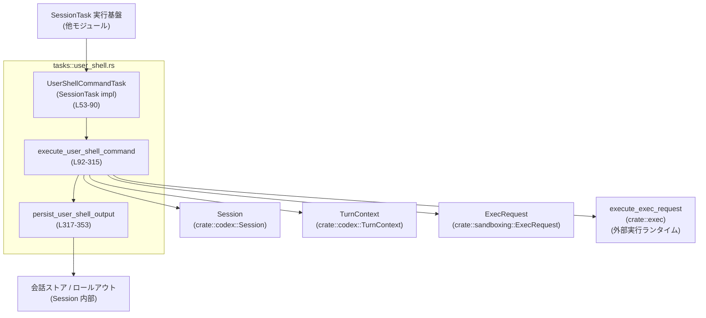
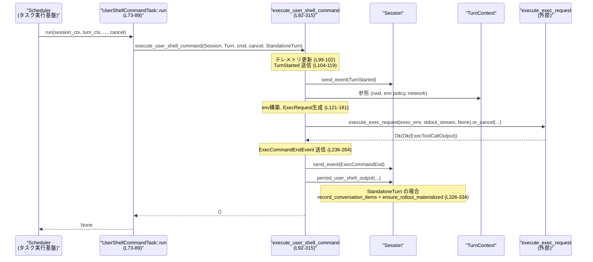

# core/src/tasks/user_shell.rs コード解説

> このレポート内の行番号は、**このチャンク先頭を 1 行目とした相対行番号**です。  
> 実際のリポジトリ内の行番号と完全には一致しない可能性があります。

---

## 0. ざっくり一言

ユーザーからの `/shell` のようなシェルコマンドを、セッション内のタスクとして実行し、  
実行開始/終了イベントと会話履歴への記録を一括して扱うタスク実装です。

---

## 1. このモジュールの役割

### 1.1 概要

- このモジュールは **ユーザー指定のシェルコマンドを安全に（ただし DangerFullAccess ポリシーで）実行し、結果を会話ストアに反映するタスク**を提供します。
- `SessionTask` 実装としてタスクスケジューラから呼ばれ、`execute_user_shell_command` が実行環境構築〜実行〜イベント送信〜結果保存までを行います（`core/src/tasks/user_shell.rs:L64-90`, `L92-315`）。
- 実行モードに応じて、**独立ターンとしての実行**と、**既存ターンにぶら下がる補助的実行**を切り替えます（`UserShellCommandMode`、`L43-51`）。

### 1.2 アーキテクチャ内での位置づけ

このモジュールが他コンポーネントとどう連携するかを、主要な依存に絞って示します。



- `UserShellCommandTask` はタスクとしてスケジューラから呼ばれ、`execute_user_shell_command` をラップします（`L64-90`）。
- `execute_user_shell_command` は `Session` と `TurnContext` を受け取り、実行環境構築 (`create_env` / `maybe_wrap_shell_lc_with_snapshot`)、`ExecRequest` の生成、`execute_exec_request` による実行、イベント送信・結果保存を行います（`L92-190` 以降のマッチまで）。
- `persist_user_shell_output` は実行モードごとに「会話への直接記録」か「レスポンスアイテムとしてのインジェクション」を選択します（`L317-353`）。

### 1.3 設計上のポイント

- **タスクと実行ロジックの分離**  
  - `UserShellCommandTask::run` は単に `execute_user_shell_command` を呼び出すだけで、実行ロジックはすべて関数側に集約されています（`L73-89`, `L92-315`）。
- **モードに応じたターンライフサイクル制御**  
  - `UserShellCommandMode` により、「独立ターンとして TurnStarted を送るか」「アクティブターンの補助として動くか」を切り替えています（`L43-51`, `L104-119`, `L326-334`）。
- **非同期 + キャンセル対応**  
  - 実行は `async` 関数で行われ、`tokio_util::sync::CancellationToken` と `OrCancelExt` により、キャンセルを `CancelErr::Cancelled` として扱えるようにしています（`L73-79`, `L189-195`）。
- **イベント駆動 + 会話ストア連携**  
  - 実行の開始/終了は `EventMsg::{ExecCommandBegin, ExecCommandEnd}` として送信され、結果は会話ストアに `record_conversation_items` または `inject_response_items` 経由で保存されます（`L143-158`, `L213-233`, `L236-264`, `L281-304`, `L326-353`）。
- **サンドボックス・権限の明示**  
  - `SandboxPolicy::DangerFullAccess` と `SandboxType::None` を選択し、ファイルシステム/ネットワークポリシーをそこから派生させています（`L160-181`）。

---

## 2. 主要な機能一覧

- ユーザーシェルタスクの定義: `UserShellCommandTask` が `SessionTask` を実装し、シェルコマンドをタスクとして扱います（`L53-90`）。
- シェルコマンド実行モードの選択: `UserShellCommandMode` による Standalone / ActiveTurnAuxiliary の切り替え（`L43-51`）。
- 実行環境の構築: シェル・カレントディレクトリ・環境変数マップ・サンドボックス設定をまとめた `ExecRequest` を構築します（`L121-181`）。
- コマンド実行とキャンセル対応: `execute_exec_request` + `or_cancel` によるコマンド実行とキャンセル処理（`L189-193`）。
- 実行開始/終了イベントの送信: `ExecCommandBeginEvent` / `ExecCommandEndEvent` をセッションに送信します（`L143-158`, `L213-233`, `L236-264`, `L281-304`）。
- 実行結果の会話ストアへの保存: `user_shell_command_record_item` を経由して、会話ストアもしくはレスポンスアイテムとして結果を保存します（`L317-353`）。
- ターンライフサイクルイベント: Standalone モード時に `TurnStarted` を送信します（`L104-119`）。

---

## 3. 公開 API と詳細解説

### 3.1 型一覧（構造体・列挙体など）

| 名前 | 種別 | 役割 / 用途 | 定義位置 |
|------|------|-------------|----------|
| `UserShellCommandMode` | enum | シェルコマンドタスクの実行モード（独立ターンか、アクティブターンの補助か）を表します。 | `core/src/tasks/user_shell.rs:L43-51` |
| `UserShellCommandTask` | struct | 実行すべきシェルコマンド文字列を保持し、`SessionTask` として実行されるタスク本体です。 | `core/src/tasks/user_shell.rs:L53-56` |

補助的な定数:

| 名前 | 種別 | 役割 / 用途 | 定義位置 |
|------|------|-------------|----------|
| `USER_SHELL_TIMEOUT_MS` | `u64` 定数 | ユーザーシェル実行のタイムアウト（ミリ秒）。1時間に設定されています。 | `core/src/tasks/user_shell.rs:L41` |

### 3.2 関数詳細

#### `UserShellCommandTask::new(command: String) -> UserShellCommandTask`

**概要**

- 実行するシェルコマンド文字列を受け取り、そのコマンドを保持する `UserShellCommandTask` を生成します（`L58-62`）。

**引数**

| 引数名 | 型 | 説明 |
|--------|----|------|
| `command` | `String` | 実行したいシェルコマンド。シェルの解釈にそのまま渡されます（`L58-60`）。 |

**戻り値**

- `UserShellCommandTask`: `command` フィールドに引数を格納した新しいタスク（`L59-61`）。

**内部処理の流れ**

1. フィールド `command` に引数を代入して `Self` を生成しています（`L59-61`）。

**Examples（使用例）**

```rust
// 実行したいシェルコマンドを用意する
let cmd = String::from("ls -la"); // 任意のシェルコマンド

// タスクを生成する
let task = UserShellCommandTask::new(cmd); // core/src/tasks/user_shell.rs:L58-62
```

**Errors / Panics**

- この関数内でエラーや panic は発生しません（単純な構造体生成のみ）。

**Edge cases（エッジケース）**

- `command` が空文字列でもそのまま保持されます。  
  実行時にどのように扱われるかはシェルと `execute_exec_request` 側の挙動に依存します（このファイルからは不明です）。

**使用上の注意点**

- `command` には任意のシェル構文を含められますが、**後段で `SandboxPolicy::DangerFullAccess` かつ `SandboxType::None` で実行される**ため、ホストへの影響に注意が必要です（`L160-171`）。

---

#### `impl SessionTask for UserShellCommandTask::run(...) -> Option<String>`

```rust
async fn run(
    self: Arc<Self>,
    session: Arc<SessionTaskContext>,
    turn_context: Arc<TurnContext>,
    _input: Vec<UserInput>,
    cancellation_token: CancellationToken,
) -> Option<String>
```

（`core/src/tasks/user_shell.rs:L73-89`）

**概要**

- タスク実行時に呼ばれ、`execute_user_shell_command` を `StandaloneTurn` モードで実行します。
- 戻り値の `Option<String>` は常に `None` を返します（`L88-89`）。

**引数**

| 引数名 | 型 | 説明 |
|--------|----|------|
| `self` | `Arc<Self>` | タスク自身。`Arc` により他スレッドからも共有可能です（`L74`）。 |
| `session` | `Arc<SessionTaskContext>` | セッションタスク用のコンテキスト。`Session` へのアクセスは `clone_session` 経由で行われます（`L75`, `L81`）。 |
| `turn_context` | `Arc<TurnContext>` | 対象ターンのコンテキスト（cwd やネットワークポリシーなどを含む）（`L76`）。 |
| `_input` | `Vec<UserInput>` | タスクへの入力。ここでは未使用（プレースホルダ）です（`L77`）。 |
| `cancellation_token` | `CancellationToken` | 実行キャンセル用トークン。`execute_user_shell_command` に渡されます（`L78`, `L84`）。 |

**戻り値**

- `Option<String>`: 常に `None`。何らかのテキストを上位に返す用途には使われていません（`L88-89`）。

**内部処理の流れ**

1. `session.clone_session()` で `Session` の `Arc` を取得します（`L81`）。
2. `execute_user_shell_command` を `UserShellCommandMode::StandaloneTurn` で呼び出します（`L80-86`）。
3. 実行完了を `.await` で待機します（`L87`）。
4. 最後に `None` を返します（`L88-89`）。

**Examples（使用例）**

```rust
use std::sync::Arc;
use tokio_util::sync::CancellationToken;

// ここでは SessionTaskContext / TurnContext の取得部分は省略しています。
async fn run_shell_task_example(
    session_ctx: Arc<SessionTaskContext>,
    turn_ctx: Arc<TurnContext>,
) {
    // タスクを生成
    let task = Arc::new(UserShellCommandTask::new("echo hello".to_string()));

    // キャンセルトークンを作成
    let cancel = CancellationToken::new();

    // タスクを実行 (StandaloneTurn モードで実行される)
    let _result = task
        .run(session_ctx, turn_ctx, Vec::new(), cancel)
        .await;
}
```

**Errors / Panics**

- `run` 自体はエラーを返しませんが、内部で呼び出す `execute_user_shell_command` がログ出力や `event` 送信中などでエラーを起こすかどうかは、このファイルからは分かりません。
- `run` 内には panic を発生させるコードはありません。

**Edge cases（エッジケース）**

- `_input` に何が入っていても無視されるため、入力に依存する挙動はありません（`L77`）。
- `session.clone_session()` が何らかの理由で失敗する場合の挙動は、このファイルからは不明です。

**使用上の注意点**

- `UserShellCommandTask` を `SessionTask` として利用する場合、**常に StandaloneTurn モード**で実行されます。  
  アクティブターン補助として動かしたい場合は、直接 `execute_user_shell_command` を `ActiveTurnAuxiliary` で呼び出す必要があります（`L80-86`, `L92-98`）。

---

#### `pub(crate) async fn execute_user_shell_command(...)`

```rust
pub(crate) async fn execute_user_shell_command(
    session: Arc<Session>,
    turn_context: Arc<TurnContext>,
    command: String,
    cancellation_token: CancellationToken,
    mode: UserShellCommandMode,
)
```

（`core/src/tasks/user_shell.rs:L92-98`）

**概要**

- ユーザーシェルコマンドを実行する**中核関数**です。
- テレメトリカウンタの更新、ターン開始イベントの送信、実行環境構築、`execute_exec_request` による実行、キャンセル/エラー処理、実行終了イベントの送信、結果の永続化までを一括して行います（`L99-314`）。

**引数**

| 引数名 | 型 | 説明 |
|--------|----|------|
| `session` | `Arc<Session>` | セッション全体へのアクセス。イベント送信や会話ストア操作に利用されます（`L92-93`, `L118`, `L160-181`, `L317-353`）。 |
| `turn_context` | `Arc<TurnContext>` | 現在のターンに関する情報（cwd, ネットワーク, 環境ポリシー, truncation ポリシーなど）（`L94`, `L113-117`, `L128-137`, `L141`, `L150-153`）。 |
| `command` | `String` | 実行するシェルコマンド（生の文字列）。`raw_command` として保存されます（`L95`, `L140`）。 |
| `cancellation_token` | `CancellationToken` | 実行のキャンセルを通知するためのトークン。`or_cancel` に渡されます（`L96`, `L189-191`）。 |
| `mode` | `UserShellCommandMode` | 実行モード。Standalone の場合は `TurnStarted` を送信し、結果の永続化方法も変わります（`L97`, `L104-119`, `L326-334`）。 |

**戻り値**

- 戻り値型は `()`（unit）です。結果はすべてイベント送信および会話ストアへの永続化を通じて外部に観測されます（`L92-98`, 関数末尾 `L315`）。

**内部処理の流れ（アルゴリズム）**

1. **テレメトリ更新**  
   `session.services.session_telemetry.counter("codex.task.user_shell", 1, &[])` を呼び、カウンタをインクリメントします（`L99-102`）。
2. **必要なら TurnStarted を送信**  
   - `mode == StandaloneTurn` の場合のみ `TurnStartedEvent` を構築し（`L104-117`）、`session.send_event` で送信します（`L118-119`）。
3. **シェルコマンドの準備と環境構築**  
   - デフォルトシェルから実際の実行コマンド文字列 (`display_command`) を取得（`L124-127`）。
   - 環境変数マップを `create_env` で構築（`L127-130`）。
   - 必要であれば `maybe_wrap_shell_lc_with_snapshot` でコマンドをラップ（`L131-137`）。
4. **ExecCommandBegin イベントの送信**  
   - `call_id` を生成し（`L139`）、`parse_command` で解析したコマンドを含めて `ExecCommandBeginEvent` を送信します（`L143-158`）。
5. **ExecRequest の構築**  
   - `SandboxPolicy::DangerFullAccess`, `SandboxType::None` 等を用いて `ExecRequest` を構築します（`L160-181`）。
6. **コマンド実行 + キャンセル対応**  
   - `execute_exec_request(exec_env, stdout_stream, None)` を呼び、`or_cancel(&cancellation_token)` でキャンセル可能にして待機します（`L183-191`）。
7. **結果の分岐処理**  
   - `Err(CancelErr::Cancelled)` → ユーザーキャンセルとして扱い、`exit_code=-1` の `ExecToolCallOutput` を生成し、イベント送信と永続化（`L193-234`）。
   - `Ok(Ok(output))` → 正常完了。`exit_code==0` なら `Completed`、それ以外は `Failed` として `ExecCommandEndEvent` を送信し、永続化（`L235-268`）。
   - `Ok(Err(err))` → 実行エラー。ログ出力、`execution error: ...` メッセージ付きの `ExecToolCallOutput` 生成、イベント送信と永続化（`L269-312`）。
8. **終了**  
   - すべての分岐で `persist_user_shell_output` を呼び出した後、関数を終了します（`L204-211`, `L266-267`, `L305-312`）。

**Examples（使用例）**

Standalone モードで直接呼び出す例です（実際にはさらに上位のタスクスケジューラから呼ばれる想定です）。

```rust
use std::sync::Arc;
use tokio_util::sync::CancellationToken;

// session, turn_context の取得部分は省略します。
async fn run_shell_standalone(
    session: Arc<Session>,
    turn_context: Arc<TurnContext>,
) {
    let cancel_token = CancellationToken::new();

    execute_user_shell_command(
        session,
        turn_context,
        "pwd".to_string(),                       // 実行したいコマンド
        cancel_token,
        UserShellCommandMode::StandaloneTurn,   // 独立ターンとして実行
    ).await;
}
```

既存ターン中の補助的コマンドとして使う例（ActiveTurnAuxiliary）:

```rust
async fn run_shell_aux(
    session: Arc<Session>,
    turn_context: Arc<TurnContext>,
    cancel_token: CancellationToken,
) {
    execute_user_shell_command(
        session,
        turn_context,
        "ls -la".to_string(),
        cancel_token,
        UserShellCommandMode::ActiveTurnAuxiliary, // TurnStarted/Complete を追加で出さない
    ).await;
}
```

**Errors / Panics**

- **キャンセル**  
  - `or_cancel` によりキャンセルされた場合、`Err(CancelErr::Cancelled)` となり、`exit_code=-1` の失敗として扱われます（`L193-204`, `L227-231`）。
- **実行エラー**  
  - `execute_exec_request` が `Err(err)` を返した場合、`ExecToolCallOutput` を合成し、「`execution error: {err:?}`」というメッセージを stderr/aggregated_output に設定します（`L269-279`）。
- **panic の可能性**  
  - この関数内には `unwrap` や `expect` は存在しませんが、呼び出している他関数（`session.send_event`, `execute_exec_request` など）が panic するかどうかはこのファイルからは分かりません。

**Edge cases（エッジケース）**

- **タイムアウト**  
  - `USER_SHELL_TIMEOUT_MS` は 1 時間で、`expiration` に設定されています（`L41`, `L166-168`）。  
    コメントにある通り、本来は `ExecExpiration::Cancellation` を使う想定があり、「任意に大きなタイムアウト」として扱われています（`L166-167`）。  
    実際にタイムアウトがどう扱われるかは `execute_exec_request` 側の実装に依存します。
- **非ゼロ exit code**  
  - `exit_code != 0` の場合は `ExecCommandStatus::Failed` として終了イベントを送信します（`L257-261`）。
- **キャンセル vs タイムアウト**  
  - キャンセル時は `timed_out: false` がセットされ、`exit_code=-1` とされています（`L197-203`）。  
    タイムアウト時に `timed_out` がどのように扱われるかはこのファイルからは不明です。
- **ActiveTurnAuxiliary の場合**  
  - TurnStarted イベントは送られず、結果は `persist_user_shell_output` 内でレスポンスアイテムとしてインジェクトされます（`L104-119`, `L336-353`）。

**使用上の注意点**

- **権限レベル**  
  - `SandboxPolicy::DangerFullAccess` と `SandboxType::None` が指定されているため、**かなり権限の強い実行**になります（`L160-181`）。ホスト環境で何を実行できるかをポリシー全体で慎重に管理する前提と考えられます。
- **キャンセルトークンの扱い**  
  - `or_cancel` によるキャンセルは `CancelErr::Cancelled` としてのみ区別され、その他のエラーとは別の分岐で処理されています（`L193-204` vs `L269-279`）。  
    呼び出し側は「キャンセルをユーザー操作として扱う」ことを前提に UI などを設計する必要があります。
- **モードとイベントの一貫性**  
  - `StandaloneTurn` では TurnStarted/ExecCommandBegin/ExecCommandEnd/会話記録が行われますが、`ActiveTurnAuxiliary` では TurnStarted は送られず、会話記録方法も異なります。  
    同じコマンドでもモードによって外部への見え方が違う点に注意が必要です。

---

#### `async fn persist_user_shell_output(...)`

```rust
async fn persist_user_shell_output(
    session: &Session,
    turn_context: &TurnContext,
    raw_command: &str,
    exec_output: &ExecToolCallOutput,
    mode: UserShellCommandMode,
)
```

（`core/src/tasks/user_shell.rs:L317-323`）

**概要**

- シェルコマンドの実行結果を会話ストアに永続化する関数です。
- モードに応じて、  
  - Standalone: 会話アイテムとして直接記録 + ロールアウトの永続化  
  - ActiveTurnAuxiliary: レスポンスアイテムとしてインジェクト（失敗時はフォールバックとして記録）  
  という2パターンの保存方法を切り替えます（`L326-353`）。

**引数**

| 引数名 | 型 | 説明 |
|--------|----|------|
| `session` | `&Session` | セッションインスタンス。会話アイテム記録やレスポンスインジェクションに使用します（`L318`, `L327-332`, `L341-352`）。 |
| `turn_context` | `&TurnContext` | 対象ターンのコンテキスト。`record_conversation_items` に必要です（`L319`, `L327-329`, `L349-351`）。 |
| `raw_command` | `&str` | 実行したコマンド文字列。記録対象アイテムの生成に使われます（`L320`, `L324`）。 |
| `exec_output` | `&ExecToolCallOutput` | 実行結果（exit code, stdout/stderr, duration 等）。記録対象アイテムの生成に使われます（`L321`, `L324`）。 |
| `mode` | `UserShellCommandMode` | Standalone / ActiveTurnAuxiliary を切り替えるために利用されます（`L322`, `L326`, `L341`）。 |

**戻り値**

- 戻り値は `()` です。永続化の成否は戻り値では返していません。

**内部処理の流れ**

1. **記録アイテムの生成**  
   - `user_shell_command_record_item(raw_command, exec_output, turn_context)` で `ResponseItem` を生成します（`L324`）。
2. **StandaloneTurn の場合**  
   - `record_conversation_items` でアイテムを会話ストアに記録します（`L326-329`）。
   - コメントにある通り、Standalone shell ターンが「最初のターン」になる可能性があるため、その後 `ensure_rollout_materialized` を呼び出します（`L330-332`）。
3. **ActiveTurnAuxiliary の場合**  
   - `output_item` が `ResponseItem::Message { .. }` であることを前提に、`ResponseInputItem::Message` に変換します（`L336-338`）。
   - `session.inject_response_items` を呼び出し、現在のターンにレスポンスアイテムとしてインジェクトします（`L341-343`）。
   - もし `inject_response_items` が `Err(items)` を返した場合は、返却された `items` を `ResponseItem::from` で変換し直し、`record_conversation_items` で会話ストアに記録します（`L345-351`）。

**Examples（使用例）**

通常は `execute_user_shell_command` から呼び出される内部関数ですが、擬似的に単体利用する例を示します。

```rust
async fn record_shell_result_example(
    session: &Session,
    turn_context: &TurnContext,
    command: &str,
    exec_output: &ExecToolCallOutput,
) {
    // StandaloneTurn として保存する例
    persist_user_shell_output(
        session,
        turn_context,
        command,
        exec_output,
        UserShellCommandMode::StandaloneTurn,
    ).await;
}
```

**Errors / Panics**

- `user_shell_command_record_item` の戻り値が `ResponseItem::Message` 以外だった場合、`unreachable!` により panic します（`L336-339`）。
  - コメントで「user shell command output record should always be a message」と前提が明示されています。
- `record_conversation_items` や `inject_response_items` が内部でエラーや panic を起こす可能性については、このファイルからは分かりません。

**Edge cases（エッジケース）**

- **StandaloneTurn で最初のターンになる場合**  
  - コメントに「Standalone shell turns can run before any regular user turn」とあり、通常のユーザーターンより前に /shell が実行される可能性を考慮して `ensure_rollout_materialized` を呼んでいます（`L330-332`）。
- **inject_response_items の失敗**  
  - `inject_response_items` が失敗した場合でも、返却された `items` を会話ストアに記録することで、結果を失わない設計になっています（`L341-352`）。

**使用上の注意点**

- `user_shell_command_record_item` が生成する `ResponseItem` の形に強く依存しており、将来的にその戻り値の形が変わる場合は、この関数の `match` および `unreachable!` を必ず見直す必要があります（`L336-339`）。
- ActiveTurnAuxiliary の場合、**会話ログの見え方**が StandaloneTurn と異なります。UI やクライアント側でこの違いを前提としているかどうかを確認する必要があります。

---

### 3.3 その他の関数・メソッド

| 関数名 / メソッド名 | 役割（1 行） | 行範囲 |
|---------------------|-------------|--------|
| `UserShellCommandTask::kind` | タスク種別として `TaskKind::Regular` を返します。 | `core/src/tasks/user_shell.rs:L65-67` |
| `UserShellCommandTask::span_name` | トレース用のスパン名 `"session_task.user_shell"` を返します。 | `core/src/tasks/user_shell.rs:L69-71` |

---

## 4. データフロー

ここでは、StandaloneTurn で `/shell` を実行した場合を例に、データがどのように流れるかを説明します。

1. スケジューラが `UserShellCommandTask::run` を呼ぶ（`L73-89`）。
2. `run` が `execute_user_shell_command` を `StandaloneTurn` モードで呼び出す（`L80-86`）。
3. `execute_user_shell_command` が:
   - テレメトリ更新（`L99-102`）
   - `TurnStarted` イベント送信（`L104-119`）
   - 実行環境構築 (`create_env`, `maybe_wrap_shell_lc_with_snapshot` など, `L121-137`）
   - `ExecCommandBeginEvent` 送信（`L143-158`）
   - `execute_exec_request` を実行（`L189-191`）
   - 結果に応じて `ExecCommandEndEvent` 送信 + `persist_user_shell_output` 呼び出し（`L193-312`）
4. `persist_user_shell_output` が `ResponseItem` を生成し、会話ストアに記録 + ロールアウトの永続化を行う（`L317-334`）。

### シーケンス図（StandaloneTurn, 成功ケース）



ActiveTurnAuxiliary の場合は、以下の点が変わります:

- TurnStarted イベントは送信されません（`mode == StandaloneTurn` のガードにより, `L104-119`）。
- `persist_user_shell_output` が `inject_response_items` を使ってレスポンスアイテムをインジェクトします（`L341-343`）。

---

## 5. 使い方（How to Use）

### 5.1 基本的な使用方法

典型的には、`UserShellCommandTask` を `SessionTask` としてスケジューラに登録し、StandaloneTurn モードで実行されます。

```rust
use std::sync::Arc;
use tokio_util::sync::CancellationToken;

// SessionTaskContext / TurnContext を用意済みと仮定します。
async fn schedule_user_shell_task(
    session_ctx: Arc<SessionTaskContext>,
    turn_ctx: Arc<TurnContext>,
) {
    // 実行したいコマンド
    let cmd = "echo 'Hello from /shell'".to_string();

    // タスク生成
    let task = Arc::new(UserShellCommandTask::new(cmd)); // L58-62

    // キャンセルトークン作成
    let cancel = CancellationToken::new();

    // 直接呼び出す例（実際にはタスクスケジューラから呼ばれる想定）
    let _ = task.run(session_ctx, turn_ctx, Vec::new(), cancel).await; // L73-89
}
```

このコードが完了すると、以下が行われます:

- TurnStarted → ExecCommandBegin → ExecCommandEnd の各イベントがセッションに送信される（`L104-119`, `L143-158`, `L236-264`）。
- 実行結果が会話ストアに記録され、必要であればロールアウトも永続化されます（`L317-334`）。

### 5.2 よくある使用パターン

1. **StandaloneTurn としての /shell 実行**

   - タスクスケジューラから `UserShellCommandTask` をそのまま実行。
   - TurnStarted イベントが発行され、会話ストアに `/shell` の結果が通常のメッセージとして残る（`L104-119`, `L326-334`）。

2. **アクティブターン補助としての実行**

   - 既にユーザーターンが進行中で、そこに補助的に `/shell` を実行したい場合、直接 `execute_user_shell_command` を `ActiveTurnAuxiliary` で呼び出します。

   ```rust
   async fn run_shell_during_turn(
       session: Arc<Session>,
       turn_context: Arc<TurnContext>,
       cancel: CancellationToken,
   ) {
       execute_user_shell_command(
           session,
           turn_context,
           "ls -la".to_string(),
           cancel,
           UserShellCommandMode::ActiveTurnAuxiliary,
       ).await;
   }
   ```

   - TurnStarted イベントは増えず、結果は `inject_response_items` によって既存ターンのレスポンスに埋め込まれます（`L336-343`）。

### 5.3 よくある間違い

```rust
// 間違い例: ActiveTurnAuxiliary なのに TurnStarted を期待している
execute_user_shell_command(
    session,
    turn_context,
    "echo hi".to_string(),
    cancel,
    UserShellCommandMode::ActiveTurnAuxiliary,
).await;
// => TurnStarted イベントは送られない (L104-119)

// 正しい認識: ActiveTurnAuxiliary は既存ターン内の補助的な実行
// TurnStarted/TurnComplete は既存ターンでのみ発行される
```

```rust
// 間違い例: exec_output が Message 以外を返す可能性を想定していない変更
// (persist_user_shell_output 内には unreachable! がある, L336-339)

// 正しい例: user_shell_command_record_item の戻り値の形を変えるときは
// persist_user_shell_output の match / unreachable! を合わせて変更する必要がある。
```

### 5.4 使用上の注意点（まとめ）

- **権限・セキュリティ**
  - `SandboxPolicy::DangerFullAccess` + `SandboxType::None` の組み合わせなので、**実行環境がフルアクセスを持つ前提**で運用されていると考えられます（`L160-171`）。
  - 実際にどのようなサンドボックスが適用されるかは、全体の権限設定（`FileSystemSandboxPolicy`, `NetworkSandboxPolicy`）との組み合わせに依存します（`L176-178`）。

- **キャンセルとタイムアウトの区別**
  - キャンセル (`CancelErr::Cancelled`) と実行エラー (`Ok(Err(err))`) は異なるメッセージで扱われます（`L193-204`, `L269-279`）。
  - `USER_SHELL_TIMEOUT_MS` は 1 時間と長く設定されており、主にキャンセルによる停止が想定されているように見えます（`L41`, `L166-168`）。

- **panic の前提**
  - `persist_user_shell_output` の `unreachable!` は、「ユーザーシェルの出力は必ず Message である」という前提に依存しています（`L336-339`）。
  - この前提が破られるような変更を別のモジュールで行うと、ここで panic が発生し得ます。

---

## 6. 変更の仕方（How to Modify）

### 6.1 新しい機能を追加する場合

例: `/shell` の別モードを追加したい場合。

1. **モードの追加**
   - `UserShellCommandMode` に新しいバリアントを追加します（`L43-51`）。
2. **実行フローの分岐**
   - `execute_user_shell_command` で `mode` の `match` または条件分岐を追加し、新モードに固有の挙動（イベント送信、環境構築、永続化方式など）を実装します（`L104-119`, `L193-312`）。
3. **永続化ロジックの拡張**
   - 必要であれば `persist_user_shell_output` にも新モードの分岐を追加します（`L326-353`）。
4. **他モジュールとの契約確認**
   - `user_shell_command_record_item` が返す `ResponseItem` の形や、クライアント側が期待するイベントシーケンス（TurnStarted / ExecCommandBegin / ExecCommandEnd）との整合性を確認する必要があります。

### 6.2 既存の機能を変更する場合

- **Exec 環境やサンドボックス設定を変更する場合**
  - `ExecRequest` の構築部分（`L160-181`）を確認します。
  - `SandboxPolicy`, `SandboxType`, `FileSystemSandboxPolicy`, `NetworkSandboxPolicy` などとの整合性を保つ必要があります。
- **出力のフォーマットを変えたい場合**
  - `format_exec_output_str` の挙動を変更するか、呼び出し方（`L253-256`, `L297-300`）を変更します。
- **契約（前提条件）の確認ポイント**
  - `user_shell_command_record_item` が `ResponseItem::Message` を返すことを前提にしている部分（`L336-339`）。
  - `execute_exec_request` の戻り値型が `Result<Result<ExecToolCallOutput, E>, CancelErr>` であることを前提にしている `match` 分岐（`L193-269`）。

変更後は、少なくとも以下を確認する必要があります。

- `/shell` 実行時のイベントシーケンスが、クライアント側の期待と一致しているか。
- キャンセル・エラー・非ゼロ exit code などのエッジケースで、結果が期待通りに会話ストアに反映されているか。

---

## 7. 関連ファイル

このモジュールと密接に関係する主なファイル・モジュールは次の通りです。

| パス / モジュール | 役割 / 関係 |
|------------------|------------|
| `crate::codex::Session` | セッション本体。イベント送信 (`send_event`)、会話アイテム記録 (`record_conversation_items`)、レスポンスアイテム注入 (`inject_response_items`)、ロールアウト永続化 (`ensure_rollout_materialized`) などを提供します（`L118`, `L327-332`, `L341-352`）。 |
| `crate::codex::TurnContext` | ターンコンテキスト。`cwd`, `network`, `shell_environment_policy`, `truncation_policy`, `turn_timing_state` などを提供し、実行環境構築やイベントに利用されます（`L113-117`, `L128-137`, `L141`, `L150-153`, `L253-256`）。 |
| `super::SessionTask` / `super::SessionTaskContext` | タスク実行のためのインターフェースとコンテキスト。`UserShellCommandTask` がこれを実装します（`L33-35`, `L64-90`）。 |
| `crate::exec_env::create_env` | シェル用の環境変数マップを生成します。`execute_user_shell_command` 内で呼び出されます（`L127-130`）。 |
| `crate::tools::runtimes::maybe_wrap_shell_lc_with_snapshot` | シェルコマンドを必要に応じてラップし、LC/Snapshot 実行環境を整えます（`L131-137`）。 |
| `crate::sandboxing::ExecRequest` | 外部コマンド実行のためのリクエスト構造体。ここでフィールドがセットされ、`execute_exec_request` に渡されます（`L161-181`）。 |
| `crate::exec::execute_exec_request` | 実際に外部プロセスを起動し、`ExecToolCallOutput` を返す実行ランタイム。キャンセル可能な Future として利用されます（`L189-191`, `L235-268`, `L269-279`）。 |
| `crate::user_shell_command::user_shell_command_record_item` | シェル実行結果から `ResponseItem` を生成するユーティリティ。`persist_user_shell_output` で利用されます（`L20`, `L324`）。 |
| `codex_protocol::exec_output::{ExecToolCallOutput, StreamOutput}` | 実行結果（exit code, stdout/stderr, duration 等）を表す型。`execute_user_shell_command` と `persist_user_shell_output` で利用されます（`L21-22`, `L196-203`, `L272-279`）。 |
| `codex_protocol::protocol::{EventMsg, ExecCommandBeginEvent, ExecCommandEndEvent, TurnStartedEvent, ...}` | セッション内で送受信されるイベントの型。コマンド開始/終了とターン開始を表すために使われます（`L23-29`, `L112-119`, `L143-158`, `L213-233`, `L236-264`, `L281-304`）。 |

**テストコードについて**

- このファイル内にはテスト関数や `#[cfg(test)]` ブロックは存在しません。このチャンクからは、テストの有無や場所は分かりません。

---
