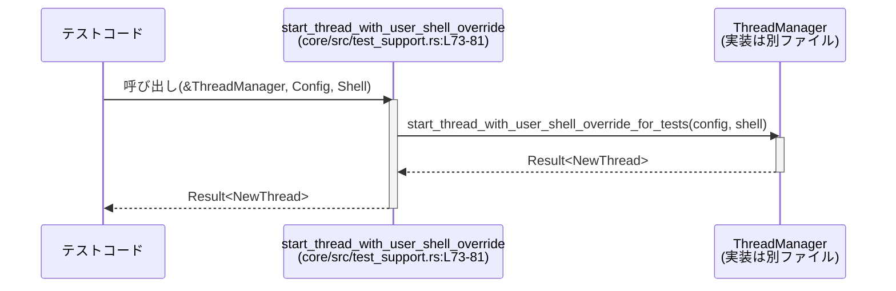

# core/src/test_support.rs コード解説

## 0. ざっくり一言

このモジュールは、**クロスクレート統合テスト用のヘルパー関数**を集約したテスト専用ユーティリティです。`ThreadManager` / `AuthManager` / `ModelsManager` などのテスト用コンストラクタやオフラインモデル情報取得を、簡単に呼び出すための薄いラッパーを提供します。  

（先頭コメントより: 本番コードから依存すべきではないモジュールです `core/src/test_support.rs:L1-5`）

---

## 1. このモジュールの役割

### 1.1 概要

- このモジュールは **他クレートからの統合テスト**で、`core` クレート内部の機能をテストしやすくするために存在します。
- 主な機能は、
  - テストモード／決定論的挙動の設定 (`ThreadManager` / `unified_exec`)、
  - 認証・スレッド管理・モデル管理の **テスト用インスタンス作成**、
  - オフラインでのモデル情報／プリセット取得
  を行うラッパー関数です。

### 1.2 アーキテクチャ内での位置づけ

このモジュールは、テストコードと本体コンポーネント（スレッド・認証・モデル管理）との間に位置する薄いファサードとして機能します。

```mermaid
graph TD
    T[テストコード<br/>（他クレート）]
    TS[test_support モジュール<br/>(core/src/test_support.rs:L1-124)]
    TM[ThreadManager<br/>(crate)]
    AM[AuthManager<br/>(codex_login)]
    MM[ModelsManager<br/>(codex_models_manager)]
    EM[EnvironmentManager<br/>(codex_exec_server)]
    CM[collaboration_mode_presets<br/>(codex_models_manager)]

    T --> TS
    TS --> TM
    TS --> AM
    TS --> MM
    TS --> EM
    TS --> CM
```

- 依存関係はすべて **テスト用のコンストラクタ／メソッド（`*_for_tests`, `*_for_testing`）** に限定されています。
- テストコードは、本体の細かい設定や依存関係を意識せずに、`test_support` からインスタンス生成やスレッド開始／再開を行えます。

### 1.3 設計上のポイント

- **テスト専用 API への集約**  
  - すべての関数が `*_for_tests` / `*_for_testing` 系メソッドへの単純な委譲になっています  
    （例: `AuthManager::from_auth_for_testing` `core/src/test_support.rs:L44-50`）。
- **状態管理のスタイル**
  - グローバルな状態として `TEST_MODEL_PRESETS: Lazy<Vec<ModelPreset>>` を持ちます  
    （`core/src/test_support.rs:L27-34`）。
  - それ以外は基本的に状態を持たず、外部のマネージャ型に処理を委譲します。
- **並行性・安全性**
  - `once_cell::sync::Lazy` による `TEST_MODEL_PRESETS` の初期化はスレッド安全です。
  - `Arc<AuthManager>` や `Arc<EnvironmentManager>` を介して、認証・環境管理オブジェクトを **スレッド安全に共有**する設計になっています（`core/src/test_support.rs:L7-8, L10-11, L63, L87`）。
- **エラーハンドリング**
  - 自前のエラー型は定義していません。
  - `TEST_MODEL_PRESETS` の初期化のみ、`bundled_models_response()` のパース失敗時に panic します  
    （`core/src/test_support.rs:L27-33`）。
  - 非同期スレッド開始／再開関数は `codex_protocol::error::Result<crate::NewThread>` をそのまま返却し、エラーは `ThreadManager` 側に依存します（`core/src/test_support.rs:L73-81, L83-98`）。

---

## 2. 主要な機能一覧

このモジュールが提供する主要機能を高レベルに列挙します。

- **ThreadManager のテストモード切り替え**  
  - `set_thread_manager_test_mode(enabled: bool)`  
    `thread_manager::set_thread_manager_test_mode_for_tests` への委譲（`core/src/test_support.rs:L36-38`）。
- **決定論的なプロセス ID の制御**  
  - `set_deterministic_process_ids(enabled: bool)`  
    `unified_exec::set_deterministic_process_ids_for_tests` への委譲（`core/src/test_support.rs:L40-42`）。
- **AuthManager のテスト用生成**  
  - `auth_manager_from_auth`, `auth_manager_from_auth_with_home`  
    認証情報と任意のホームディレクトリから `Arc<AuthManager>` を生成（`core/src/test_support.rs:L44-50`）。
- **ThreadManager のテスト用生成**  
  - `thread_manager_with_models_provider`, `thread_manager_with_models_provider_and_home`  
    モデルプロバイダ情報などを渡して `ThreadManager` を生成（`core/src/test_support.rs:L52-71`）。
- **スレッド開始・ロールアウトからの再開（ユーザーシェル上書き付き）**  
  - `start_thread_with_user_shell_override` (async)  
  - `resume_thread_from_rollout_with_user_shell_override` (async)  
    `ThreadManager` のテスト用メソッドに委譲（`core/src/test_support.rs:L73-98`）。
- **ModelsManager のテスト用生成とオフライン操作**  
  - `models_manager_with_provider`  
  - `get_model_offline`  
  - `construct_model_info_offline`  
    モデル情報のオフライン取得と `ModelInfo` の生成（`core/src/test_support.rs:L100-113`）。
- **モデルプリセット・コラボレーションモードプリセットの取得**  
  - `all_model_presets`  
    静的に構築された `Vec<ModelPreset>` への参照を返却（`core/src/test_support.rs:L27-34, L116-118`）。
  - `builtin_collaboration_mode_presets`  
    組み込みのコラボレーションモードマスク列挙（`core/src/test_support.rs:L120-123`）。

---

## 3. 公開 API と詳細解説

### 3.1 型一覧（構造体・列挙体など）

このファイル内で新たに定義される構造体・列挙体はありません。  
代わりに、テストで重要となる **静的リソース** を整理します。

| 名前 | 種別 | 型 | 役割 / 用途 | 定義位置 |
|------|------|----|------------|----------|
| `TEST_MODEL_PRESETS` | 静的変数 (`static`) | `Lazy<Vec<ModelPreset>>` | `bundled_models_response()` から読み込んだモデル一覧を優先度順にソートし、`ModelPreset::mark_default_by_picker_visibility` を適用したうえで、テスト中に再利用するためのモデルプリセット集合。`all_model_presets()` から参照されます。 | `core/src/test_support.rs:L27-34` |

**内部処理（根拠）**

- `bundled_models_response()` で JSON 相当の何らかのレスポンスをパースし、失敗時には panic します  
  `core/src/test_support.rs:L27-29`
- `response.models` を `priority` でソートしてから `Vec<ModelPreset>` に変換し（`Into::into`）、デフォルトフラグを付与しています  
  `core/src/test_support.rs:L30-32`

### 3.2 関数詳細（主要 7 件）

以下では、特にテストフローに影響が大きい 7 関数を詳細に解説します。

---

#### `set_thread_manager_test_mode(enabled: bool)`

**概要**

- `thread_manager::set_thread_manager_test_mode_for_tests(enabled)` を呼び出す薄いラッパーです  
  （`core/src/test_support.rs:L36-38`）。
- 関数名から、`ThreadManager` のテストモードに関連する何らかの設定を切り替える用途と解釈できますが、モードの具体的な内容はこのチャンクには現れません。

**引数**

| 引数名 | 型 | 説明 |
|--------|----|------|
| `enabled` | `bool` | テストモード相当のフラグを渡すためのブール値。`true`/`false` の意味は実装側に依存し、このチャンクからは分かりません。 |

**戻り値**

- 戻り値はありません（unit 型 `()`）。

**内部処理の流れ**

1. 受け取った `enabled` を、そのまま `thread_manager::set_thread_manager_test_mode_for_tests(enabled)` に渡します（`core/src/test_support.rs:L37`）。
2. 追加の処理やエラーハンドリングは行いません。

**Examples（使用例）**

```rust
use core::test_support::set_thread_manager_test_mode;

// 統合テストのセットアップで、ThreadManager をテストモードにする例
#[test]
fn setup_thread_manager_for_integration_test() {
    // 具体的な意味は実装依存だが、テストモードを有効にする
    set_thread_manager_test_mode(true);

    // ... ThreadManager を使ったテストを実行 ...
}
```

**Errors / Panics**

- この関数自身は `Result` を返さず、panic も発生させません。
- 実際にエラーや panic が発生するかどうかは、呼び出している
  `thread_manager::set_thread_manager_test_mode_for_tests` の実装に依存し、このチャンクからは不明です。

**Edge cases（エッジケース）**

- `enabled` に `true` / `false` のどちらを渡しても、この関数としては単に委譲するだけです。
- 複数回呼び出した場合の挙動も、内部実装に依存し、このチャンクからは分かりません。

**使用上の注意点**

- グローバルな設定を変更している可能性が高く、並列実行されるテストから同時に呼び出した場合の影響範囲は、実装を確認する必要があります。
- 本番コードからは呼び出さず、テストコードに限定する前提です（モジュール先頭コメント `core/src/test_support.rs:L1-5`）。

---

#### `set_deterministic_process_ids(enabled: bool)`

**概要**

- `unified_exec::set_deterministic_process_ids_for_tests(enabled)` を呼び出すテスト用ラッパーです（`core/src/test_support.rs:L40-42`）。
- 関数名から、プロセス ID 等の挙動をテストで扱いやすくするために決定論的にする設定と解釈できますが、具体的な内容はこのチャンクからは分かりません。

**引数**

| 引数名 | 型 | 説明 |
|--------|----|------|
| `enabled` | `bool` | 決定論的挙動の有効／無効を示すフラグ。意味は実装依存で、このチャンクには現れません。 |

**戻り値**

- 戻り値はなく、`()` を返します。

**内部処理の流れ**

1. `unified_exec::set_deterministic_process_ids_for_tests(enabled)` を 1 回呼び出します。

**Examples（使用例）**

```rust
use core::test_support::set_deterministic_process_ids;

#[test]
fn test_deterministic_exec_behavior() {
    // テスト開始前に決定論的なプロセスIDモードを有効化する
    set_deterministic_process_ids(true);

    // unified_exec を使った処理のテストを行う
}
```

**Errors / Panics**

- この関数自体はエラー型を返しません。
- 実際のエラーや panic の有無は `unified_exec::set_deterministic_process_ids_for_tests` に依存し、不明です。

**Edge cases**

- `enabled` を何度も切り替えて呼び出した場合の状態遷移は、このチャンクからは分かりません。

**使用上の注意点**

- おそらくグローバルな設定に影響するため、テストを並列実行する際は設定の衝突がないか `unified_exec` 側の仕様確認が必要です。

---

#### `auth_manager_from_auth(auth: CodexAuth) -> Arc<AuthManager>`

**概要**

- `AuthManager::from_auth_for_testing(auth)` を呼び出して、`Arc<AuthManager>` を返すテスト用コンストラクタです（`core/src/test_support.rs:L44-46`）。
- 認証情報 `CodexAuth` から、テスト環境向けの `AuthManager` インスタンスを生成する用途と解釈できます。

**引数**

| 引数名 | 型 | 説明 |
|--------|----|------|
| `auth` | `CodexAuth` | テストで使用する認証情報。本チャンクには `CodexAuth` のフィールドや用途は現れません。 |

**戻り値**

- `Arc<AuthManager>`  
  - `AuthManager` インスタンスを **共有所有（参照カウント方式）** するためのスマートポインタです（`std::sync::Arc`）。

**内部処理の流れ**

1. `AuthManager::from_auth_for_testing(auth)` を呼び出します。
2. 戻り値の `Arc<AuthManager>` をそのまま返します。

**Examples（使用例）**

```rust
use std::sync::Arc;
use codex_login::CodexAuth;
use core::test_support::auth_manager_from_auth;

fn make_auth_manager_for_test(auth: CodexAuth) -> Arc<codex_login::AuthManager> {
    // テスト用の AuthManager を生成し、Arc で共有所有する
    auth_manager_from_auth(auth)
}
```

**Errors / Panics**

- この関数自体は `Result` を返さず、panic も呼び出していません。
- 実際にエラー・panic が起こり得るかは `AuthManager::from_auth_for_testing` の実装に依存し、このチャンクからは分かりません。

**Edge cases**

- `CodexAuth` の内容が無効／空の場合の挙動などは不明です。
- `CodexAuth` が所有権を移動（move）で渡されるため、呼び出し後に同じインスタンスを使うことはできません（Rust の所有権ルール）。

**使用上の注意点**

- `Arc<AuthManager>` を返すため、複数スレッドから安全に共有できますが、内部の `AuthManager` がスレッド安全かどうかは実装依存です。
- テスト向けの初期化であり、本番コードでは通常のコンストラクタを用いるべきです。

---

#### `thread_manager_with_models_provider_and_home(auth: CodexAuth, provider: ModelProviderInfo, codex_home: PathBuf, environment_manager: Arc<EnvironmentManager>) -> ThreadManager`

**概要**

- `ThreadManager::with_models_provider_and_home_for_tests(...)` を呼び出すテスト用コンストラクタです（`core/src/test_support.rs:L59-71`）。
- 認証情報・モデルプロバイダ情報・ホームディレクトリ・環境マネージャをまとめて渡して、テスト向けの `ThreadManager` を生成します。

**引数**

| 引数名 | 型 | 説明 |
|--------|----|------|
| `auth` | `CodexAuth` | テストで使用する認証情報。 |
| `provider` | `ModelProviderInfo` | 使用するモデルプロバイダ設定。内容はこのチャンクからは不明です。 |
| `codex_home` | `PathBuf` | テスト環境における `codex_home` ディレクトリのパス。 |
| `environment_manager` | `Arc<EnvironmentManager>` | 実行環境を管理するオブジェクトの共有ポインタ。 |

**戻り値**

- `ThreadManager`  
  - スレッド（会話／タスク）管理の中心コンポーネントと推測できますが、実装はこのチャンクにはありません。

**内部処理の流れ**

1. 引数をそのまま `ThreadManager::with_models_provider_and_home_for_tests(auth, provider, codex_home, environment_manager)` に渡します（`core/src/test_support.rs:L65-70`）。
2. 追加のロジックはありません。

**Examples（使用例）**

```rust
use std::path::PathBuf;
use std::sync::Arc;
use codex_exec_server::EnvironmentManager;
use codex_login::CodexAuth;
use codex_model_provider_info::ModelProviderInfo;
use core::test_support::thread_manager_with_models_provider_and_home;

fn make_thread_manager_for_test(
    auth: CodexAuth,
    provider: ModelProviderInfo,
    codex_home: PathBuf,
    env_mgr: Arc<EnvironmentManager>,
) -> core::ThreadManager {
    thread_manager_with_models_provider_and_home(auth, provider, codex_home, env_mgr)
}
```

**Errors / Panics**

- 戻り値は `ThreadManager` であり、`Result` ではないため、この関数の中ではエラーを明示的に表現していません。
- コンストラクタが panic を起こし得るかどうかは `ThreadManager::with_models_provider_and_home_for_tests` 実装に依存し、不明です。

**Edge cases**

- `codex_home` に存在しないパスを渡した場合の挙動など、ファイルシステム関連のエッジケースはこのチャンクからは分かりません。
- `EnvironmentManager` がどのような前提で初期化されているかも不明です。

**使用上の注意点**

- `auth` と `provider` は move されるため、呼び出し後に同じインスタンスを利用できません。
- `ThreadManager` を同じテスト内で複数作るときに共有すべきリソース（例: `EnvironmentManager`）があるかどうかは、`EnvironmentManager` の実装を確認する必要があります。

---

#### `start_thread_with_user_shell_override(thread_manager: &ThreadManager, config: Config, user_shell_override: crate::shell::Shell) -> codex_protocol::error::Result<crate::NewThread>`

（async 関数、実体は `pub async fn`。`core/src/test_support.rs:L73-81`）

**概要**

- 非同期に `thread_manager.start_thread_with_user_shell_override_for_tests(config, user_shell_override).await` を呼び出すラッパーです。
- テスト用に、ユーザーシェルを上書きした状態で新しいスレッド（`crate::NewThread`）を開始する処理に委譲します。

**引数**

| 引数名 | 型 | 説明 |
|--------|----|------|
| `thread_manager` | `&ThreadManager` | 利用する `ThreadManager` への共有参照。所有権は移動しません。 |
| `config` | `Config` | スレッド開始に必要な設定。値渡しのため所有権が移動します。 |
| `user_shell_override` | `crate::shell::Shell` | デフォルトとは異なるユーザーシェルを使用するための設定。所有権が移動します。 |

**戻り値**

- `codex_protocol::error::Result<crate::NewThread>`  
  - 成功時: `Ok(crate::NewThread)`（新しく開始されたスレッド情報）  
  - 失敗時: `Err(...)`（具体的なエラー型は `codex_protocol::error` 内部に定義されており、このチャンクには現れません）

**内部処理の流れ**

1. 受け取った `thread_manager` 参照に対して、メソッド `start_thread_with_user_shell_override_for_tests(config, user_shell_override)` を呼び出します（`core/src/test_support.rs:L78-80`）。
2. その Future を `.await` し、完了するのを待機します（非同期処理）。
3. 得られた `Result<crate::NewThread>` をそのまま返します。

**Examples（使用例）**

```rust
use core::test_support::start_thread_with_user_shell_override;
use core::{ThreadManager, config::Config};
use core::shell::Shell;

async fn start_thread_for_integration_test(
    tm: &ThreadManager,
    config: Config,
    shell: Shell,
) -> codex_protocol::error::Result<core::NewThread> {
    // テスト用: ユーザーシェルを上書きしてスレッドを開始
    start_thread_with_user_shell_override(tm, config, shell).await
}
```

**Errors / Panics**

- この関数自身は panic を発生させていません。
- 返り値の `Result` の `Err` は、`ThreadManager::start_thread_with_user_shell_override_for_tests` 側で発生したエラーを表しますが、詳細はこのチャンクからは不明です。

**Edge cases**

- `Config` や `Shell` の内容が不足／不正な場合の挙動は、`ThreadManager` 側の実装次第で、このチャンクには示されていません。
- `thread_manager` が特定の初期化を済ませていない場合の挙動も不明です。

**使用上の注意点**

- **非同期関数**であるため、呼び出し側は `async fn` 内で `.await` するか、非同期ランタイム（tokio など）上で動作している必要があります。
- `Config` と `Shell` は所有権が move するため、呼び出し後にそれらを再利用する場合は、事前に clone 等が必要です。
- `ThreadManager` は参照で受け取るため、同じインスタンスから複数回のスレッド開始を行うことができますが、同時並行呼び出しが安全かどうかは実装依存です。

---

#### `resume_thread_from_rollout_with_user_shell_override(...) -> codex_protocol::error::Result<crate::NewThread>`

```rust
pub async fn resume_thread_from_rollout_with_user_shell_override(
    thread_manager: &ThreadManager,
    config: Config,
    rollout_path: PathBuf,
    auth_manager: Arc<AuthManager>,
    user_shell_override: crate::shell::Shell,
) -> codex_protocol::error::Result<crate::NewThread>
```

（`core/src/test_support.rs:L83-98`）

**概要**

- `thread_manager.resume_thread_from_rollout_with_user_shell_override_for_tests(...)` を非同期に呼び出すラッパーです。
- ロールアウトファイル（おそらく保存されたスレッド状態を表すと推測されますが、このチャンクには詳細はありません）から、ユーザーシェル上書き付きでスレッドを再開します。

**引数**

| 引数名 | 型 | 説明 |
|--------|----|------|
| `thread_manager` | `&ThreadManager` | 使用する `ThreadManager` への参照。 |
| `config` | `Config` | 再開時に使用する設定。所有権は移動します。 |
| `rollout_path` | `PathBuf` | ロールアウトファイルのパス。 |
| `auth_manager` | `Arc<AuthManager>` | 認証マネージャの共有ポインタ。所有権を共有します。 |
| `user_shell_override` | `crate::shell::Shell` | シェル上書き設定。所有権が移動します。 |

**戻り値**

- `codex_protocol::error::Result<crate::NewThread>`  
  - 成功時: 再開されたスレッド（`crate::NewThread`）  
  - 失敗時: `Err(...)`（詳細不明）

**内部処理の流れ**

1. `thread_manager.resume_thread_from_rollout_with_user_shell_override_for_tests(config, rollout_path, auth_manager, user_shell_override)` を呼び出します（`core/src/test_support.rs:L90-96`）。
2. その戻り値の Future を `.await` し、結果の `Result<crate::NewThread>` を返します。

**Examples（使用例）**

```rust
use std::path::PathBuf;
use std::sync::Arc;
use core::test_support::resume_thread_from_rollout_with_user_shell_override;
use core::{ThreadManager, config::Config};
use core::shell::Shell;
use codex_login::AuthManager;

async fn resume_from_rollout_for_test(
    tm: &ThreadManager,
    config: Config,
    rollout: PathBuf,
    auth: Arc<AuthManager>,
    shell: Shell,
) -> codex_protocol::error::Result<core::NewThread> {
    resume_thread_from_rollout_with_user_shell_override(tm, config, rollout, auth, shell).await
}
```

**Errors / Panics**

- この関数自身は panic を発生させていません。
- `Err` の条件（rollout ファイルが存在しない、不正フォーマット等）はこのチャンクでは分かりません。

**Edge cases**

- `rollout_path` が存在しない／読み取り不可な場合の挙動は不明です。
- `auth_manager` がテスト用に適切に初期化されていない場合なども、`ThreadManager` 側の実装に依存します。

**使用上の注意点**

- 非同期関数であるため、`start_thread_with_user_shell_override` と同様に async ランタイム上での `.await` が必要です。
- 実際にファイル I/O や外部リソースを触るかどうかは不明ですが、その可能性を考慮すると、テストパフォーマンスや副作用に注意が必要です。

---

#### `all_model_presets() -> &'static Vec<ModelPreset>`

**概要**

- 静的な `TEST_MODEL_PRESETS` への参照を返す関数です（`core/src/test_support.rs:L116-118`）。
- テストにおいて利用可能なすべてのモデルプリセットの一覧を取得するために使われます。

**引数**

- ありません。

**戻り値**

- `&'static Vec<ModelPreset>`  
  - アプリケーション全体で共有されるモデルプリセットベクタへの不変参照です。

**内部処理の流れ**

1. `&TEST_MODEL_PRESETS` を返すだけです（`core/src/test_support.rs:L117`）。
2. `TEST_MODEL_PRESETS` は `Lazy` によって初回アクセス時に初期化され、その後は再利用されます（`core/src/test_support.rs:L27-34`）。

**Examples（使用例）**

```rust
use core::test_support::all_model_presets;
use codex_protocol::openai_models::ModelPreset;

fn list_presets_for_test() {
    let presets: &Vec<ModelPreset> = all_model_presets();

    for preset in presets {
        // テスト中にプリセットの内容を検証するなど
        // println!("{:?}", preset);
    }
}
```

**Errors / Panics**

- `all_model_presets` 自体はエラーや panic を発生させません。
- ただし、初回アクセス時に `TEST_MODEL_PRESETS` の初期化が走り、その際に
  `bundled_models_response()` のパース失敗で panic する可能性があります  
  （`core/src/test_support.rs:L27-29`）。

**Edge cases**

- `bundled_models_response()` の戻り値が空のモデルリストであった場合、`Vec<ModelPreset>` が空になる可能性がありますが、このチャンクからは確認できません。
- 返される参照は `'static` であり、ライフタイムの制約によるエッジケースは特にありません。

**使用上の注意点**

- 返される `&Vec<ModelPreset>` は不変参照のため、`push` などの変更操作は行えません。
- テスト中のどの場所からも同じプリセット集合が共有されるため、「テストごとに異なるプリセット構成を使いたい」といったケースには向きません。

---

### 3.3 その他の関数（コンポーネントインベントリー）

このファイル内のすべての公開関数を、定義位置とともに一覧化します。

| 関数名 | シグネチャ（概要） | 役割（1 行） | 定義位置 |
|--------|--------------------|-------------|----------|
| `set_thread_manager_test_mode` | `fn set_thread_manager_test_mode(enabled: bool)` | `thread_manager::set_thread_manager_test_mode_for_tests` への委譲。ThreadManager 関連のテストモードを切り替えるヘルパーと解釈できる。 | `core/src/test_support.rs:L36-38` |
| `set_deterministic_process_ids` | `fn set_deterministic_process_ids(enabled: bool)` | `unified_exec::set_deterministic_process_ids_for_tests` を呼び出す。決定論的なプロセス ID 設定用ヘルパー。 | `core/src/test_support.rs:L40-42` |
| `auth_manager_from_auth` | `fn auth_manager_from_auth(auth: CodexAuth) -> Arc<AuthManager>` | 認証情報からテスト用 `AuthManager` (`Arc`) を生成するラッパー。 | `core/src/test_support.rs:L44-46` |
| `auth_manager_from_auth_with_home` | `fn auth_manager_from_auth_with_home(auth: CodexAuth, codex_home: PathBuf) -> Arc<AuthManager>` | 認証情報＋ホームディレクトリ指定で `AuthManager` を生成するテスト用ラッパー。 | `core/src/test_support.rs:L48-50` |
| `thread_manager_with_models_provider` | `fn thread_manager_with_models_provider(auth: CodexAuth, provider: ModelProviderInfo) -> ThreadManager` | 認証情報＋モデルプロバイダ指定で `ThreadManager` を生成するテスト用コンストラクタ。 | `core/src/test_support.rs:L52-57` |
| `thread_manager_with_models_provider_and_home` | `fn thread_manager_with_models_provider_and_home(auth: CodexAuth, provider: ModelProviderInfo, codex_home: PathBuf, environment_manager: Arc<EnvironmentManager>) -> ThreadManager` | 認証情報・モデルプロバイダ・ホームディレクトリ・環境マネージャをまとめて渡して `ThreadManager` を生成するテスト用コンストラクタ。 | `core/src/test_support.rs:L59-71` |
| `start_thread_with_user_shell_override` | `pub async fn start_thread_with_user_shell_override(...) -> codex_protocol::error::Result<crate::NewThread>` | ユーザーシェル上書き付きでスレッドを開始する `ThreadManager` のテスト用メソッドへの非同期ラッパー。 | `core/src/test_support.rs:L73-81` |
| `resume_thread_from_rollout_with_user_shell_override` | `pub async fn resume_thread_from_rollout_with_user_shell_override(...) -> codex_protocol::error::Result<crate::NewThread>` | ロールアウトからスレッドを再開する `ThreadManager` のテスト用メソッドへの非同期ラッパー。 | `core/src/test_support.rs:L83-98` |
| `models_manager_with_provider` | `fn models_manager_with_provider(codex_home: PathBuf, auth_manager: Arc<AuthManager>, provider: ModelProviderInfo) -> ModelsManager` | テスト用 `ModelsManager::with_provider_for_tests` へのラッパー。 | `core/src/test_support.rs:L100-105` |
| `get_model_offline` | `fn get_model_offline(model: Option<&str>) -> String` | `ModelsManager::get_model_offline_for_tests` を呼び出し、オフラインでモデル名を決定する。挙動の詳細は不明。 | `core/src/test_support.rs:L108-110` |
| `construct_model_info_offline` | `fn construct_model_info_offline(model: &str, config: &Config) -> ModelInfo` | `Config` から `ModelsManager` 用の設定を生成し、`ModelInfo` をオフラインで構築する。 | `core/src/test_support.rs:L112-113` |
| `all_model_presets` | `fn all_model_presets() -> &'static Vec<ModelPreset>` | 静的 `TEST_MODEL_PRESETS` への参照を返す。 | `core/src/test_support.rs:L116-118` |
| `builtin_collaboration_mode_presets` | `fn builtin_collaboration_mode_presets() -> Vec<CollaborationModeMask>` | `collaboration_mode_presets::builtin_collaboration_mode_presets` を `default` 設定で呼び出す。 | `core/src/test_support.rs:L120-123` |

---

## 4. データフロー

ここでは代表的なシナリオとして、**ユーザーシェル上書き付きで新規スレッドを開始するフロー**を示します。

### 4.1 処理の流れ（文章）

1. テストコードが `ThreadManager` と `Config`、`Shell` を用意します。
2. テストコードが `test_support::start_thread_with_user_shell_override(...)` を `await` します。
3. この関数は、そのまま `thread_manager.start_thread_with_user_shell_override_for_tests(...)` を呼び出し、Future の完了を待ちます（`core/src/test_support.rs:L78-80`）。
4. `ThreadManager` が内部で必要な処理を行い、`Result<NewThread>` を返します。
5. `test_support` 関数はその結果をそのままテストコードへ返します。

### 4.2 シーケンス図（Mermaid）



- この図は、`test_support` が単に `ThreadManager` のテスト用 API を **中継するだけ** であることを表しています。
- 同様の構造で、`resume_thread_from_rollout_with_user_shell_override` も `ThreadManager` の `_for_tests` メソッドに委譲しています（`core/src/test_support.rs:L90-96`）。

---

## 5. 使い方（How to Use）

### 5.1 基本的な使用方法

統合テストにおいて、`AuthManager` / `ThreadManager` / `ModelsManager` を初期化し、スレッドを開始する一連の流れの例です。

```rust
use std::path::PathBuf;
use std::sync::Arc;
use codex_exec_server::EnvironmentManager;
use codex_login::{AuthManager, CodexAuth};
use codex_model_provider_info::ModelProviderInfo;
use codex_protocol::error::Result as CodexResult;
use core::config::Config;
use core::shell::Shell;
use core::ThreadManager;
use core::test_support::{
    auth_manager_from_auth,
    models_manager_with_provider,
    thread_manager_with_models_provider_and_home,
    start_thread_with_user_shell_override,
};

async fn integration_test_example(auth: CodexAuth, provider: ModelProviderInfo) -> CodexResult<()> {
    let codex_home = PathBuf::from("/tmp/codex-test");             // テスト用のホームディレクトリ
    let env_mgr = Arc::new(EnvironmentManager::new(/* ... */));    // 環境マネージャ（実装は別）

    // 認証マネージャ（テスト用）
    let auth_mgr: Arc<AuthManager> = auth_manager_from_auth(auth);

    // ThreadManager をテスト用コンストラクタから生成
    let tm: ThreadManager = thread_manager_with_models_provider_and_home(
        CodexAuth::default(),             // 実際には適切な auth を渡す
        provider,
        codex_home.clone(),
        env_mgr.clone(),
    );

    // ModelsManager も必要に応じて生成
    let _mm = models_manager_with_provider(codex_home, auth_mgr.clone(), provider);

    // スレッドを開始（ユーザーシェル上書き付き）
    let config = Config::default();                               // 実際の設定は実装依存
    let shell = Shell::default();                                 // デフォルトシェル
    let new_thread = start_thread_with_user_shell_override(&tm, config, shell).await?;

    // new_thread を使った検証など...
    // println!("{:?}", new_thread);

    Ok(())
}
```

※ `EnvironmentManager::new`, `Config::default`, `Shell::default` などはこのチャンクには現れないため、例として記述しています。

### 5.2 よくある使用パターン

1. **テストモードの有効化＋スレッド開始**

```rust
use core::test_support::{
    set_thread_manager_test_mode,
    set_deterministic_process_ids,
    start_thread_with_user_shell_override,
};

// 非同期テストのセットアップ例
async fn setup_and_start_thread(tm: &core::ThreadManager, cfg: core::config::Config, sh: core::shell::Shell) {
    set_thread_manager_test_mode(true);
    set_deterministic_process_ids(true);

    let _thread = start_thread_with_user_shell_override(tm, cfg, sh).await.unwrap();
}
```

1. **オフラインモデル情報の利用**

```rust
use core::test_support::{get_model_offline, construct_model_info_offline};
use core::config::Config;

fn offline_model_info_example(config: &Config) {
    let model_name = get_model_offline(Some("test-model")); // 返り値の意味は実装依存
    let info = construct_model_info_offline(&model_name, config);

    // info の内容をテストで検証するなど
}
```

1. **全モデルプリセットの列挙**

```rust
use core::test_support::all_model_presets;

fn print_all_presets() {
    let presets = all_model_presets();
    // ここで presets を検証・スナップショットテスト等に利用できる
}
```

### 5.3 よくある間違い（想定される誤用）

このチャンクから直接確認できる範囲で、起こり得る誤用パターンを示します。

```rust
use core::test_support::start_thread_with_user_shell_override;
use core::{ThreadManager, config::Config};
use core::shell::Shell;

// 間違い例: 非同期コンテキスト外で .await しようとしている
fn wrong_usage(tm: &ThreadManager, cfg: Config, sh: Shell) {
    // let _ = start_thread_with_user_shell_override(tm, cfg, sh).await;
    // ↑ コンパイルエラー: async コンテキスト外では .await できない
}

// 正しい例: async fn 内で await する
async fn correct_usage(tm: &ThreadManager, cfg: Config, sh: Shell) {
    let _ = start_thread_with_user_shell_override(tm, cfg, sh).await;
}
```

```rust
use core::test_support::all_model_presets;

// 間違い例: all_model_presets の結果を書き換えようとする
fn wrong_modify_presets() {
    let presets = all_model_presets();
    // presets.push(...); // コンパイルエラー: &Vec<ModelPreset> に対して push は呼べない
}

// 正しい例: 不変参照として読み取りのみ行う
fn correct_read_presets() {
    let presets = all_model_presets();
    for preset in presets {
        // 読み取りだけ行う
    }
}
```

### 5.4 使用上の注意点（まとめ）

- **テスト専用であること**
  - 先頭コメントにある通り、本番コードからこのモジュールに依存すべきではありません（`core/src/test_support.rs:L1-5`）。
  - `*_for_tests` / `*_for_testing` メソッドを通すことで、テストに特化した設定や挙動になっている可能性があります。

- **グローバル／静的状態**
  - `TEST_MODEL_PRESETS` は一度だけ初期化され、その後は全テストで共有されます（`core/src/test_support.rs:L27-34`）。
  - `set_thread_manager_test_mode` や `set_deterministic_process_ids` も、グローバルな状態を変更する関数である可能性が高く、並列テスト実行時の影響に注意が必要です（実際の実装はこのチャンクには現れません）。

- **非同期 API の利用**
  - `start_thread_with_user_shell_override` および `resume_thread_from_rollout_with_user_shell_override` は async 関数です（`core/src/test_support.rs:L73-81, L83-98`）。
  - tokio などの非同期ランタイム上で `.await` する必要があります。

- **エラーと panic**
  - `TEST_MODEL_PRESETS` 初期化時の `bundled_models_response()` パース失敗で panic が発生し得ます（`core/src/test_support.rs:L27-29`）。
  - それ以外の関数が返すエラー／panic 条件は、すべて委譲先の実装に依存し、このチャンクからは特定できません。

- **セキュリティ上の留意点（このチャンクから分かる範囲）**
  - 認証情報 (`CodexAuth`) やロールアウトファイル (`rollout_path`) を扱うため、テストコードでも機密情報や本番データを誤って指定しないようにする必要があります。
  - 実際にどのような外部リソースへアクセスするかはこのチャンクからは分かりません。

---

## 6. 変更の仕方（How to Modify）

### 6.1 新しい機能を追加する場合

このモジュールの役割に合わせると、「テスト用に本体コンポーネントを簡易に初期化・操作するラッパー」を追加するのが自然です。

1. **対象コンポーネントのテスト用 API を確認**
   - 例えば `ThreadManager` に `foo_for_tests(...)` のような新メソッドが追加された場合、そのシグネチャを確認します。
2. **`test_support.rs` に対応する薄いラッパーを追加**
   - 既存関数と同様に、ほぼ 1 行で委譲する形にします。
   - 例:  

     ```rust
     pub fn new_test_helper(arg: Type) -> Ret {
         SomeType::new_test_helper_for_tests(arg)
     }
     ```

3. **命名とコメント**
   - 他の関数と一貫した命名 (`*_with_*`, `*_from_*` など) に合わせます。
   - 必要であれば、テスト専用であることをコメントで明示します。
4. **テストコード側での利用箇所を追加**
   - 他クレートの統合テストから `core::test_support::...` を通じて新ラッパーを呼び出します。

### 6.2 既存の機能を変更する場合

- **影響範囲の確認**
  - 変更したい関数がどのテストコードから呼ばれているかをクエリして、使用箇所を洗い出します。
  - 例えば `start_thread_with_user_shell_override` のシグネチャを変える場合、すべての統合テストに影響します。
- **契約の維持**
  - 戻り値の型（特に `Result` や `NewThread` など）は、テストコードの前提になっている可能性が高いため、変更時にはテストコード側の修正もセットで行う必要があります。
- **テスト用 API の一貫性**
  - `_for_tests` / `_for_testing` メソッドのシグネチャが変わった場合、本モジュールのラッパーも同様に修正します。
  - ラッパー内で追加のロジックを入れると、本体のテスト用 API との挙動差が生まれるため、基本的には委譲のみを維持する方針が読み取れます（`core/src/test_support.rs` 全体がその構造）。

---

## 7. 関連ファイル

このモジュールと直接関係する外部ファイル・モジュールを整理します（実装はこのチャンクには含まれていませんが、名前から関係が読み取れます）。

| パス / モジュール | 役割 / 関係 | 根拠 |
|-------------------|------------|------|
| `crate::thread_manager` | `set_thread_manager_test_mode_for_tests` を提供しているモジュールと推測され、`set_thread_manager_test_mode` から呼び出されています。 | `core/src/test_support.rs:L24, L36-38` |
| `crate::unified_exec` | `set_deterministic_process_ids_for_tests` を提供しており、決定論的なプロセス ID 設定用ヘルパーに利用されています。 | `core/src/test_support.rs:L25, L40-42` |
| `codex_login::AuthManager` | 認証管理コンポーネント。`from_auth_for_testing` / `from_auth_for_testing_with_home` によりテスト用インスタンスを生成します。 | `core/src/test_support.rs:L10-12, L44-50` |
| `crate::ThreadManager` | スレッド管理コンポーネント。テスト用の各種コンストラクタとスレッド開始／再開メソッドに対してラッパーが提供されています。 | `core/src/test_support.rs:L22, L52-71, L73-98` |
| `codex_models_manager::manager::ModelsManager` | モデル管理コンポーネント。`with_provider_for_tests` / `get_model_offline_for_tests` / `construct_model_info_offline_for_tests` へのラッパーが定義されています。 | `core/src/test_support.rs:L16, L100-113` |
| `codex_models_manager::bundled_models_response` | `TEST_MODEL_PRESETS` 初期化時に、バンドルされた `models.json` からモデル一覧を読み込む関数。 | `core/src/test_support.rs:L14, L27-31` |
| `codex_models_manager::collaboration_mode_presets` | コラボレーションモードプリセットの定義元。`builtin_collaboration_mode_presets` がこれを使ってプリセット一覧を返します。 | `core/src/test_support.rs:L15, L120-123` |
| `codex_protocol::openai_models::{ModelPreset, ModelInfo}` | モデルプリセットおよびモデル情報を表す型。`TEST_MODEL_PRESETS` および `construct_model_info_offline` で使用されます。 | `core/src/test_support.rs:L18-19, L27-34, L112-113` |
| `codex_protocol::config_types::CollaborationModeMask` | コラボレーションモードを表すマスク型。`builtin_collaboration_mode_presets` の戻り値として使用されます。 | `core/src/test_support.rs:L17, L120-123` |

このチャンクには、これら関連モジュールの実装は含まれていないため、挙動の詳細やエッジケースはそれぞれのファイルを参照する必要があります。
